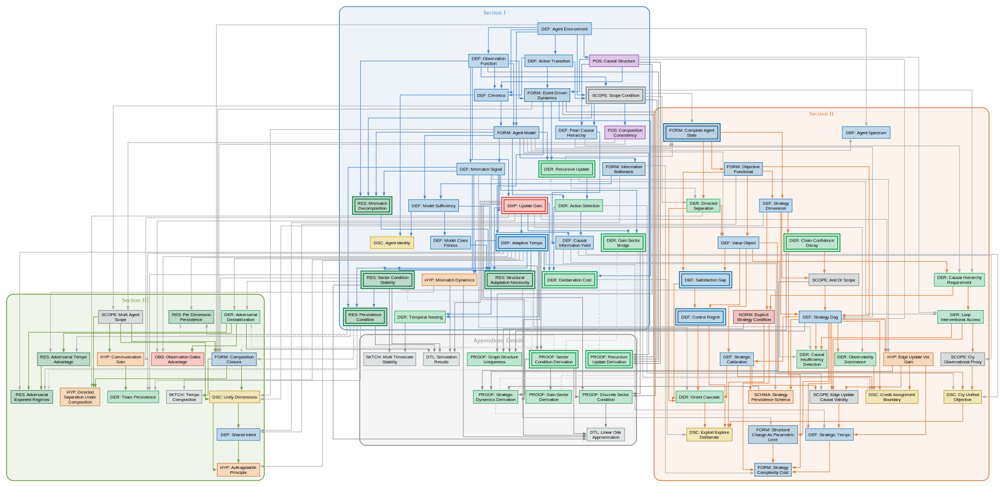
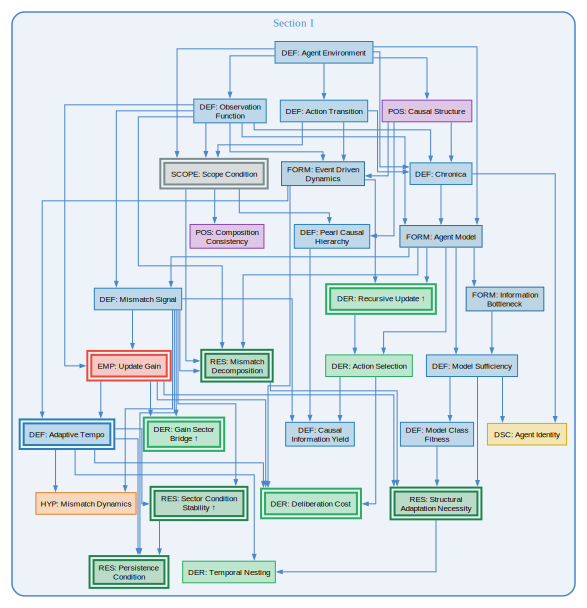
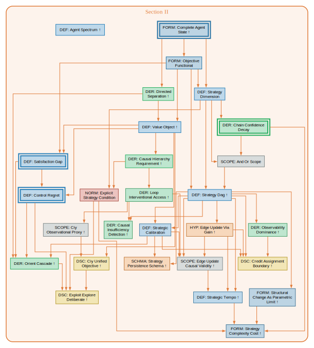
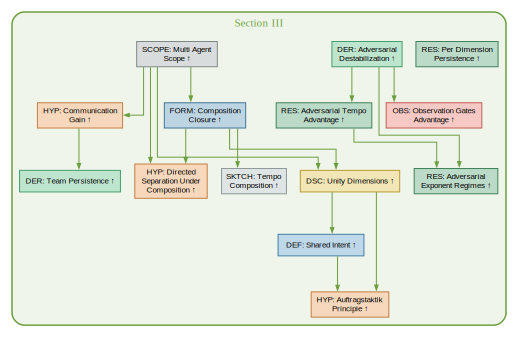

# AAD: Adaptation and Actuation Dynamics

The mathematical core of the [Agentic Systems](../OUTLINE.md) research framework. AAD formalizes the adaptive cycle — one complete traversal of the agent-environment feedback loop — as the fundamental unit of analysis for adaptive, purposeful agents under uncertainty.

**Working draft.** The argument laid out claim by claim. The ordering is the current best linearization of the dependency DAG; it will change as the theory develops. Slugs are the stable identities. Treat this as a living proof sketch, not a specification.

**On mathematical precision.** The theory's relationship to formalism varies by section and is expected to. Section I (adaptive systems) is the most mathematically locked down — the persistence machinery, mismatch dynamics, and gain structure have clean derivations and Lyapunov proofs. Section II (purposeful agents) has an exact diagnostic core whose inferential force scales with the continuation convention hierarchy ( #value-object): from local heuristics (C1/one-step) through moderate-horizon diagnostics (C2/receding-horizon) to global conclusions (C3/Bellman). The strategy layer now has a proved DAG structure (acyclicity from temporal ordering, Markov property from the CMC theorem under causal sufficiency) and a first-class treatment of correlated failure via the Correlation Hierarchy ( #strategy-dag). Both the diagnostic core and the strategy layer depend on the directed-separation scope condition ( #directed-separation): **Section II's exact results apply to Class 1 (modular) agents.** The scope restriction to modular agents is detailed in the Section II preamble below. Section III (composition) has promising structure built on the Section I Lyapunov machinery but depends on admissibility choices that are formulated, not derived, and a bridge lemma that requires a contraction assumption beyond the stated admissibility constraints. This gradient — from exact core through conditionally exact architecture to open formulation — is the expected arc. The goal is to describe agentic systems, not to produce a purely mathematical artifact. We pursue mathematical precision when it yields genuine insight (the persistence condition, the CMC-based Markov proof, the convention hierarchy monotonicity) and settle for principled sketches when the insight is structural rather than quantitative (the strategy-revision loop, the composition admissibility). The boundaries between these regimes are fluid and still being discovered.

**Scope:** AAD covers the general theory of adaptive systems (Section I), actuated/purposeful agents (Section II), and agent composition (Section III). Domain instantiations (software: [`02-tst-core/`](../02-tst-core/OUTLINE.md)), logogenic agents ([`03-logogenic-agents/`](../03-logogenic-agents/OUTLINE.md)), and logozoetic agents ([`04-logozoetic-agents/`](../04-logozoetic-agents/OUTLINE.md)) are part of the broader Agentic Systems framework, grounded by AAD but developed independently.

See [`FORMAT.md`](../FORMAT.md) for segment file conventions. See [`NOTATION.md`](../NOTATION.md) for symbols, conventions, and units.

Every slug is linked to its intended `src/{slug}.md` file, even when that file doesn't exist yet (`missing` or `old` stage). This is deliberate — the links serve as stable intent markers so the only ongoing maintenance is updating the Stage column. A `missing` link means no file exists; an `old` link means the content lives in a corresponding `src/old-*` source file awaiting conversion. Segments may also contain forward references (`#slug-name`) to not-yet-written segments; these are intentional dependency markers, not broken links.

---

## I. Adaptive Systems Under Uncertainty

*Scope: Any system consisting of an agent coupled to an environment through observation and action channels, where the environment is not fully observable. This is the general case — thermostats through commanders. The claims in this section are largely drawn from TFT (TF-01 through TF-11, Appendix A), which developed the adaptive-systems foundation that AAD subsumes.*

| §   | Type        | N   | Tag                                                                        | Claim                                          | Stage           |
| --- | ----------- | --- | -------------------------------------------------------------------------- | ---------------------------------------------- | --------------- |
| I   | Definition  |     | [#agent-environment](src/agent-environment.md)                             | Agent-environment boundary                     | deps-verified   |
| I   | Definition  |     | [#observation-function](src/observation-function.md)                       | Lossy, noisy observations                      | deps-verified   |
| I   | Definition  |     | [#action-transition](src/action-transition.md)                             | Actions affect environment                     | deps-verified   |
| I   | Scope       |     | [#scope-condition](src/scope-condition.md)                                 | Where AAD applies                              | claims-verified |
| I   | Postulate   |     | [#composition-consistency](src/composition-consistency.md)                 | Agent/subagent scale invariance                | deps-verified   |
| I   | Postulate   |     | [#causal-structure](src/causal-structure.md)                               | Irreducible causal structure                   | deps-verified   |
| I   | Definition  |     | [#pearl-causal-hierarchy](src/pearl-causal-hierarchy.md)                   | Three levels of causal reasoning               | deps-verified   |
| I   | Definition  |     | [#chronica](src/chronica.md)                                               | Complete interaction history                   | deps-verified   |
| I   | Formulation |     | [#agent-model](src/agent-model.md)                                         | Compressed history as state                    | deps-verified   |
| I   | Formulation |     | [#information-bottleneck](src/information-bottleneck.md)                   | Optimal model compression                      | deps-verified   |
| I   | Definition  |     | [#model-sufficiency](src/model-sufficiency.md)                             | Predictive information retained                | deps-verified   |
| I   | Definition  |     | [#model-class-fitness](src/model-class-fitness.md)                         | Best achievable sufficiency                    | deps-verified   |
| I   | Formulation |     | [#event-driven-dynamics](src/event-driven-dynamics.md)                     | Events in continuous time                      | deps-verified   |
| I   | Derived     |     | [#recursive-update](src/recursive-update.md)                               | State updates must be recursive                | claims-verified |
| I   | Derived     |     | [#action-selection](src/action-selection.md)                               | Action as function of model                    | deps-verified   |
| I   | Definition  |     | [#mismatch-signal](src/mismatch-signal.md)                                 | Prediction error signal                        | deps-verified   |
| I   | Result      |     | [#mismatch-decomposition](src/mismatch-decomposition.md)                   | Model error + obs noise                        | claims-verified |
| I   | Empirical   |     | [#update-gain](src/update-gain.md)                                         | Optimal update weighting                       | claims-verified |
| I   | Definition  |     | [#causal-information-yield](src/causal-information-yield.md)               | Information from interventions                 | deps-verified   |
| I   | Definition  |     | [#adaptive-tempo](src/adaptive-tempo.md)                                   | Rate of useful info acquisition                | claims-verified |
| I   | Hypothesis  |     | [#mismatch-dynamics](src/mismatch-dynamics.md)                             | Mismatch evolution ODE                         | deps-verified   |
| I   | Derived     |     | [#deliberation-cost](src/deliberation-cost.md)                             | Think vs act tradeoff                          | claims-verified |
| I   | Derived     |     | [#gain-sector-bridge](src/gain-sector-bridge.md)                           | Gain + directional fidelity → sector condition | claims-verified |
| I   | Result      |     | [#sector-condition-stability](src/sector-condition-stability.md)           | Nonlinear persistence (Lyapunov)               | claims-verified |
| I   | Result      |     | [#persistence-condition](src/persistence-condition.md)                     | Bounded mismatch condition                     | claims-verified |
| I   | Result      |     | [#structural-adaptation-necessity](src/structural-adaptation-necessity.md) | When parametric update fails                   | claims-verified |
| I   | Derived     |     | [#temporal-nesting](src/temporal-nesting.md)                               | Timescale stratification                       | deps-verified   |
| I   | Discussion  |     | [#agent-identity](src/agent-identity.md)                                   | Non-forkable causal trajectory                 | deps-verified   |

---

## II. Actuated Adaptation: Agentic Systems

*Scope narrowing: agents that not only track reality but aim at something. This adds objectives and strategy alongside the reality model.*

*This is the **actuation** half of *Adaptation and Actuation Dynamics*: Section I develops adaptive systems in general; Section II develops the goal-directed layer built on top.*

***Architectural scope.** Section II's exact results apply to **Class 1 (modular) agents** — architectures where epistemic processing ($f_M$) is structurally separated from purposeful processing ($f_G$). This includes: Kalman filter + LQR, modular RL with separate world model, military intelligence separated from operations, and tool-use AI agents with separate perception and planning modules. **Class 2 (fully merged) agents** — including transformer-based LLMs where attention processes goals and observations together — fall outside Section II's exact scope because directed separation ( #directed-separation) fails by construction. The coupled formulation these agents require is the subject of `03-logogenic-agents/`. Class 3 (partially modular) agents are an approximation, with quality depending on the degree of coupling. This is the most significant scope restriction in the theory: the most important present-day agent class (LLM-based) requires work beyond Section II.*

*Section I's adaptive machinery applies to the epistemic substate $M_t$ directly, regardless of architecture. The clean factorization — where $M_t$ updates independently of $G_t$, yielding the sequential orient cascade — is conditional on directed separation. What Section II adds is the goal-directed layer: objectives, strategy, and the orient cascade that connects them — exact for Class 1, approximate for Class 3, inapplicable in current form for Class 2.*

*The derivation chain for this section is mature (see `msc/spike-v3-purposeful-agent.md`). Most of it provides better justification and epistemic labels for architecture that already existed. The genuinely novel results are: the satisfaction gap / control regret split ( #satisfaction-gap, #control-regret) with convention hierarchy ( #value-object), the $G_t$ complexity bound (in #orient-cascade), and the graph structure uniqueness argument including the CMC-based Markov proof (see #graph-structure-uniqueness).*

*"If a man knows not to which port he sails, no wind is favorable." — Seneca*

| §   | Type            | N   | Tag                                                                                    | Claim                                                            | Stage |
| --- | --------------- | --- | -------------------------------------------------------------------------------------- | ---------------------------------------------------------------- | ----- |
| II  | Definition      |     | [#agent-spectrum](src/agent-spectrum.md)                                               | ±model × ±objective quadrants                                    | deps-verified |
| II  | Formulation     |     | [#complete-agent-state](src/complete-agent-state.md)                                   | $X_t = (M_t, G_t)$                                               | claims-verified |
| II  | Derived + Scope |     | [#directed-separation](src/directed-separation.md)                                     | Epistemic update is goal-blind                                   | deps-verified |
| II  | Formulation     |     | [#objective-functional](src/objective-functional.md)                                   | $O_t$ parametrizes value                                         | deps-verified |
| II  | Definition      |     | [#value-object](src/value-object.md)                                                   | Horizon/policy-conditioned value                                 | deps-verified |
| II  | Definition      |     | [#strategy-dimension](src/strategy-dimension.md)                                       | $G_t = (O_t, \Sigma_t)$ split                                    | deps-verified |
| II  | Derived + Scope |     | [#causal-hierarchy-requirement](src/causal-hierarchy-requirement.md)                   | Level 2 needed for planning                                      | deps-verified |
| II  | Derived         |     | [#loop-interventional-access](src/loop-interventional-access.md)                       | Feedback loop → Level 2 data                                     | draft |
| II  | Scope           |     | [#ciy-observational-proxy](src/ciy-observational-proxy.md)                             | When CIY is estimable from observational data                    | draft |
| II  | Discussion      |     | [#ciy-unified-objective](src/ciy-unified-objective.md)                                 | Joint exploitation-exploration objective                         | draft |
| II  | Normative       |     | [#explicit-strategy-condition](src/explicit-strategy-condition.md)                     | When planning beats exploring                                    | draft |
| II  | Derived         |     | [#chain-confidence-decay](src/chain-confidence-decay.md)                               | Log-confidence additive in depth                                 | claims-verified |
| II  | Scope           |     | [#and-or-scope](src/and-or-scope.md)                                                   | Conjunctive/disjunctive scope                                    | draft |
| II  | Definition      |     | [#strategy-dag](src/strategy-dag.md)                                                   | Strategy as probabilistic DAG                                    | deps-verified |
| II  | Definition      |     | [#satisfaction-gap](src/satisfaction-gap.md)                                           | Ideal vs best achievable                                         | claims-verified |
| II  | Definition      |     | [#control-regret](src/control-regret.md)                                               | Best achievable vs current                                       | claims-verified |
| II  | Definition      |     | [#strategic-calibration](src/strategic-calibration.md)                                 | Edge residuals ( #credit-assignment-boundary)                    | draft |
| II  | Derived         |     | [#causal-insufficiency-detection](src/causal-insufficiency-detection.md)               | Detecting latent common causes from structured residuals + interventional localization | draft |
| II  | Derived         |     | [#orient-cascade](src/orient-cascade.md)                                               | Resolution order by info dep                                     | deps-verified |
| II  | Derived         |     | [#observability-dominance](src/observability-dominance.md)                             | Unobservable edges freeze                                        | draft |
| II  | Hypothesis      |     | [#edge-update-via-gain](src/edge-update-via-gain.md)                                   | Gain extends to strategy edges                                   | draft |
| II  | Scope           |     | [#edge-update-causal-validity](src/edge-update-causal-validity.md)                     | When edge updates are causally valid                             | deps-verified |
| II  | Discussion      |     | [#credit-assignment-boundary](src/credit-assignment-boundary.md)                       | Tractable/intractable boundary; design requirement               | draft |
| II  | Formulation     |     | [#structural-change-as-parametric-limit](src/structural-change-as-parametric-limit.md) | Pruning/grafting as continuous                                   | draft |
| II  | Definition      |     | [#strategic-tempo](src/strategic-tempo.md)                                             | Rate of useful $\Sigma_t$ revision                               | draft |
| II  | Formulation     |     | [#strategy-complexity-cost](src/strategy-complexity-cost.md)                           | Complexity cost of maintaining $\Sigma_t$ (IB/MDL for DAGs)      | draft |
| II  | Proposed schema |     | [#strategy-persistence-schema](src/strategy-persistence-schema.md)                     | Sector conditions for $\Sigma_t$                                 | draft |
| II  | Discussion      |     | [#exploit-explore-deliberate](src/exploit-explore-deliberate.md)                       | Three-way exploit/explore/deliberate: extended deliberation threshold + conceptual framing | draft |

---

## III. Agentic Composites

*Scope: multiple agents interacting through a shared environment, or equivalently, the internal structure of composite agents. The composition postulate ( #composition-consistency) requires that the theory apply at every level of description where the scope condition is met. This section develops what "applies at every level" means formally (the composition closure criterion, which requires an additional contraction assumption beyond Section I's sector condition), what happens when composition is imperfect, and what the dynamics of inter-agent interaction look like.*

*Correlated observations as default; independence as the special case requiring justification. Adversarial dynamics are one end of a teleological unity spectrum, not a separate theory.*

*Three primary sources: the simulation-validated adversarial dynamics from TFT (TF-11/Appendix F, track-b simulations); the composition spike (`msc/spike-agent-composition.md`) which derives composition consistency from the scope condition's level-independence; and Miller's Coevolving Automata Model (Ex Machina, 2022), which provides constructive mechanisms for composition dynamics — how composites form, undergo phase transitions, and restructure through neutral drift and niche creation. Agent opacity ($H_b$) is adopted from Hafez et al. (2026).*

| § | Type | N | Tag | Claim | Stage |
|---|------|---|-----|-------|-------|
| III | Scope | | [#multi-agent-scope](src/multi-agent-scope.md) | Multiple agents, shared env | draft |
| III | Scope | | [#composition-scope-condition](src/composition-scope-condition.md) | Teleological alignment required for composite-agent status | draft |
| III | Hypothesis | | [#symbiogenic-composition](src/symbiogenic-composition.md) | Asymmetric absorption mechanism: host integrates endosymbiont; $U_O$ crosses scope threshold from below | draft |
| III | Formulation | | [#composition-closure](src/composition-closure.md) | Composite agent via closure defect | draft |
| III | Sketch | | [#tempo-composition](src/tempo-composition.md) | Sub-additive tempo inequality | draft |
| III | Hypothesis | | [#directed-separation-under-composition](src/directed-separation-under-composition.md) | Goal-blindness survives iff routing is goal-blind (two cases) | draft |
| III | Discussion | | [#unity-dimensions](src/unity-dimensions.md) | 4 dimensions of coherence | draft |
| III | Result | | [#unity-closure-mapping](src/unity-closure-mapping.md) | Unity parametrizes rate-distortion curves for closure defect; two-axis structure with update heterogeneity | draft |
| III | Definition + Discussion | | [#shared-intent](src/shared-intent.md) | IB-compressed purpose | draft |
| III | Hypothesis | | [#auftragstaktik-principle](src/auftragstaktik-principle.md) | Prioritize objective sharing | draft |
| III | Hypothesis | | [#communication-gain](src/communication-gain.md) | Trust-weighted update gain for inter-agent channels | draft |
| III | Derived | | [#team-persistence](src/team-persistence.md) | Composite persistence condition | draft |
| III | Derived | | [#adversarial-destabilization](src/adversarial-destabilization.md) | Inside opponent's loop; includes effects spiral corollary | draft |
| III | Result | | [#adversarial-tempo-advantage](src/adversarial-tempo-advantage.md) | Superlinear tempo advantage | draft |
| | --GAP-- | | | Which strategy edges are most valuable to attack | |
| III | Observation | | [#adversarial-exponent-regimes](src/adversarial-exponent-regimes.md) | $\alpha = 2, 3/2, \text{or } {\sim}1$ | draft |
| III | Observation | | [#observation-gates-advantage](src/observation-gates-advantage.md) | Obs noise gates advantage | draft |
| III | Result | | [#per-dimension-persistence](src/per-dimension-persistence.md) | Weak dimension is bottleneck | draft |
| | --GAP-- | | | Latent structural diversity: variation in correction architectures invisible to persistence analysis, consequential under regime change | |
| | --GAP-- | | | Endogenous coupling: γ as function of population composition, not exogenous parameter; coupling emergence threshold | |
| | --GAP-- | | | Composition transition dynamics: epochal stability → latent diversification → niche emergence → cascading restructuring → re-equilibration (adopts Miller 2022's extreme transition motif) | |
| | --GAP-- | | | Computational thresholds for social behavior: minimum agent complexity and interaction depth for composition dynamics (adopts Miller 2022's ICE framework; grounds #strategy-complexity-cost) | |
| | --GAP-- | | | Agent opacity (adopts Hafez et al. 2026's $H_b$): how legible/opaque an agent is to observers; dual of observation quality; enters adversarial coupling and cooperative coordination | |

---

## Appendices: Details

*Supporting material: derivations, sketches, simulation results, and operationalization procedures backing the main theory claims.*

| §   | Type       | N   | Tag                                                                    | Claim                                                                 | Stage   |
| --- | ---------- | --- | ---------------------------------------------------------------------- | --------------------------------------------------------------------- | ------- |
| A   | Derivation |     | [#sector-condition-derivation](src/sector-condition-derivation.md)     | Lyapunov derivations for bounded mismatch and adaptive reserve        | claims-verified |
| A   | Result     |     | [#sector-persistence-template](src/sector-persistence-template.md)     | Abstract sector-persistence template; six AAD results as instances    | draft   |
| A   | Derivation |     | [#gain-sector-derivation](src/gain-sector-derivation.md)               | Gain-sector bridge proofs: Kalman, gradient equivalence, verification | deps-verified |
| A   | Derivation |     | [#recursive-update-derivation](src/recursive-update-derivation.md)     | Uniqueness derivation via three constraints + counterexamples         | claims-verified |
| A   | Sketch     |     | [#multi-timescale-stability](src/multi-timescale-stability.md)         | N-timescale singular perturbation sketch                              | draft   |
| A   | Derivation |     | [#discrete-sector-condition](src/discrete-sector-condition.md)         | Discrete-time Props DA.1, DA.1S, DA.2; fluid limit; GA-5 closed       | draft   |
| A   | Detail     |     | [#linear-ode-approximation](src/linear-ode-approximation.md)           | Pedagogical linear mismatch ODE                                       | draft   |
| A   | Derivation |     | [#graph-structure-uniqueness](src/graph-structure-uniqueness.md)       | 4 postulates + causal sufficiency → DAG with Markov property (CMC theorem)  | deps-verified |
| A   | Derivation |     | [#strategic-dynamics-derivation](src/strategic-dynamics-derivation.md) | Sector condition verification for strategy edges (5 cases + bridge)   | draft   |
| A   | Discussion |     | [#independence-audit](src/independence-audit.md)                       | Six load-bearing independence assumptions with failure regimes + repairs | draft |
| A   | Discussion |     | [#approximation-tiering](src/approximation-tiering.md)                 | Meta-pattern: L0/L1/L2, C1/C2/C3, Tier 1/2/3 as common structure      | draft |
| A   | Discussion |     | [#compression-operations](src/compression-operations.md)               | Shared IB shape across $M_t$, $\Sigma_t$, shared intent, $\Lambda$ (P1); $\Sigma_t$ source reformulated, (P1) as IB Lagrangian-dual | draft |
| A   | Discussion |     | [#identifiability-floor](src/identifiability-floor.md)                 | Meta-pattern: structural no-go results from external info-theoretic theorems (CHT, Cramér-Rao); on-policy detection no-go + L1' mixture-identifiability obstruction | draft |
| A   | Detail     |     | [#simulation-results](src/simulation-results.md)                       | 6 variants validating claims                                          | draft   |

---

## Appendices: Operational Domains

*Operational-specific appendices and end-to-end domain instantiations validating the theory chain.*

| §   | Type           | N   | Tag                                                    | Claim                                            | Stage |
| --- | -------------- | --- | ------------------------------------------------------ | ------------------------------------------------ | ----- |
| B   | Detail         |     | [#operationalization](src/operationalization.md)       | Estimation procedures for AAD quantities         | draft |
| B   | Worked example |     | [#worked-example-kalman](src/worked-example-kalman.md) | End-to-end Kalman instantiation (exact)          | draft |
| B   | Worked example |     | [#worked-example-bandit](src/worked-example-bandit.md) | End-to-end RL bandit instantiation (approximate) | draft |
| B   | Worked example |     | [#worked-example-strategy](src/worked-example-strategy.md) | Section II strategy DAG instantiation (3-arm bandit) | draft |
| B   | Worked example |     | [#worked-example-L1](src/worked-example-L1.md) | L1 augmented DAG: common-cause node, sector condition, L0/L1 comparison | draft |
| B   | Worked example |     | [#worked-example-cam](src/worked-example-cam.md) | Coevolving automata (Miller 2022): AAD ↔ Moore machine mapping, meta-machine as ε*=0 composition, simplest adaptive agent | missing |
