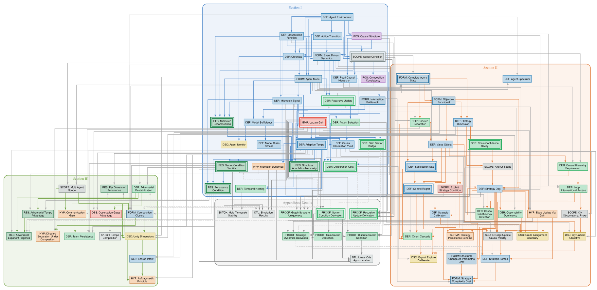
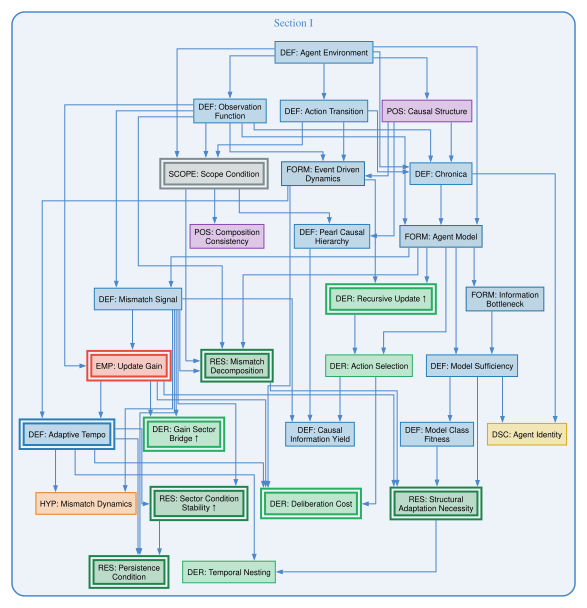
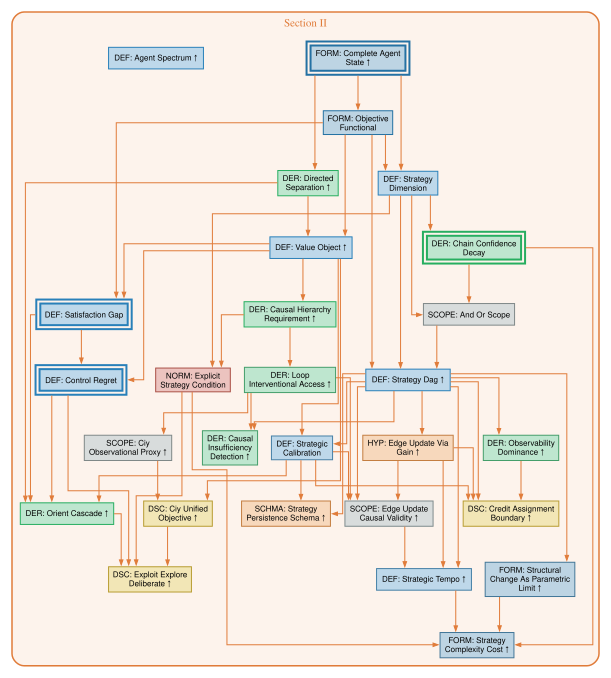
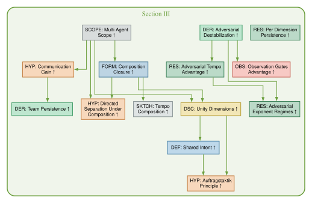

# *Volume* Adaptation and Actuation Dynamics (AAD)
## *Preface*

**TODO**:

- [ ] Initial Chapter layouts
- [ ] Frontmatter
- [ ] Convention for text that won't go into the pdf build / source markdown comments
- [ ] "Missing" convention for pdf builds
- [ ] Worry about pdf2text legibility in rendered output

The mathematical core of the [Agentic Systems](../OUTLINE.md) research framework. AAD formalizes the adaptive cycle — one complete traversal of the agent-environment feedback loop — as the fundamental unit of analysis for adaptive, purposeful agents under uncertainty.

**Working draft.** The argument laid out claim by claim. The ordering is the current best linearization of the dependency DAG; it will change as the theory develops. Slugs are the stable identities. Treat this as a living proof sketch, not a specification.

**Reading AAD.** At the integration level AAD connects control theory, causal inference, information theory, and agent architecture under a common formalism. At the distinctive level AAD is an *epistemic architecture for bounded correction under decomposed disturbance*. Three meta-segments form AAD's cross-sectional structure: #disc-separability-pattern (positive half — separable core / structured repair / general open, across six ladders of increasing difficulty), #disc-identifiability-floor (negative half — structural no-go results derived from external information-theoretic theorems, each naming a unique escape via AAD machinery), and #disc-additive-coordinate-forcing (constructive half — Cauchy-functional-equation arguments on AAD-internally-motivated additivity axioms force logarithmic coordinates at chain, divergence, and update layers). Together they name what the theory covers, what it structurally cannot reach without information augmentation, and how its distinctive forcing moves work. Reading any segment through all three lenses surfaces what makes it load-bearing: what separability regime it sits in, what floors it abuts, and what coordinate (if any) is forced by an AAD-internal axiom.

**On mathematical precision.** The theory's relationship to formalism varies by section and is expected to. Part I (adaptive systems) is the most mathematically locked down — the persistence machinery, mismatch dynamics, and gain structure have clean derivations and Lyapunov proofs. Part II (purposeful agents) has an exact diagnostic core whose inferential force scales with the continuation convention hierarchy ( #def-value-object): from local heuristics (C1/one-step) through moderate-horizon diagnostics (C2/receding-horizon) to global conclusions (C3/Bellman). The strategy layer now has a proved DAG structure (acyclicity from temporal ordering, Markov property from the CMC theorem under causal sufficiency) and a first-class treatment of correlated failure via the Correlation Hierarchy ( #def-strategy-dag). Both the diagnostic core and the strategy layer depend on the directed-separation scope condition ( #der-directed-separation): **Part II's exact results apply to Class 1 (Separated) agents.** The scope restriction to Separated agents is detailed in the Part II preamble below. Part III (composition) has promising structure built on the Part I Lyapunov machinery but depends on admissibility choices that are formulated, not derived, and a bridge lemma that requires a contraction assumption beyond the stated admissibility constraints. This gradient — from exact core through conditionally exact architecture to open formulation — is the expected arc. The goal is to describe agentic systems, not to produce a purely mathematical artifact. We pursue mathematical precision when it yields genuine insight (the persistence condition, the CMC-based Markov proof, the convention hierarchy monotonicity) and settle for principled sketches when the insight is structural rather than quantitative (the strategy-revision loop, the composition admissibility). The boundaries between these regimes are fluid and still being discovered.

**Scope:** AAD covers the general theory of adaptive systems (Part I), actuated/purposeful agents (Part II), and agent composition (Part III). Domain instantiations (software: [`02-tst-core/`](../02-tst-core/OUTLINE.md)), logogenic agents ([`03-logogenic-agents/`](../03-logogenic-agents/OUTLINE.md)), and Emergent Logozoetic Intelligences ([`04-eli/`](../04-eli/OUTLINE.md)) are part of the broader Agentic Systems framework, grounded by AAD but developed independently.

See [`FORMAT.md`](../FORMAT.md) for segment file conventions. See [`NOTATION.md`](../NOTATION.md) for symbols, conventions, and units.

Every slug is linked to its intended `src/{slug}.md` file, even when that file doesn't exist yet (`missing` or `old` stage). This is deliberate — the links serve as stable intent markers so the only ongoing maintenance is updating the Stage column. A `missing` link means no file exists; an `old` link means the content lives in a corresponding `src/old-*` source file awaiting conversion. Segments may also contain forward references (`#slug-name`) to not-yet-written segments; these are intentional dependency markers, not broken links.

## *Part* Adaptive Systems Under Uncertainty
### *Preface*

*Scope: Any system consisting of an agent coupled to an environment through observation and action channels, where the environment is not fully observable. This is the general case — thermostats through commanders.*

### *Chapter*  The Coupled Loop: Ontology and Scope

| §   | Type        | N   | Tag                                                                                      | Claim                                          | Stage           |
| --- | ----------- | --- | ---------------------------------------------------------------------------------------- | ---------------------------------------------- | --------------- |
| I   | Definition  |     | [#def-agent-environment](src/def-agent-environment.md)                                   | Agent-environment boundary                     | deps-verified   |
| I   | Definition  |     | [#def-action-transition](src/def-action-transition.md)                                   | Actions affect environment                     | deps-verified   |
| I   | Definition  |     | [#def-observation-function](src/def-observation-function.md)                             | Lossy, noisy observations                      | deps-verified   |
| I   | Definition  |     | [#def-chronica](src/def-chronica.md)                                                     | Complete interaction history                   | deps-verified   |
| I   | Scope       |     | [#scope-adaptive-system](src/scope-adaptive-system.md)                                   | Broadest AAD scope: observe under uncertainty  | claims-verified |
| I   | Scope       |     | [#scope-agency](src/scope-agency.md)                                                     | Narrows to action with Pearl-level-2 contrast  | claims-verified |
| I   | Postulate   |     | [#post-composition-consistency](src/post-composition-consistency.md)                     | Agent/subagent scale invariance *(possibly out of place)* | deps-verified   |
| I   | Postulate   |     | [#post-causal-structure](src/post-causal-structure.md)                                   | Irreducible causal structure                   | deps-verified   |

### *Chapter* The Reality Model

| §   | Type        | N   | Tag                                                                | Claim                           | Stage         |
| --- | ----------- | --- | ------------------------------------------------------------------ | ------------------------------- | ------------- |
| I   | Discussion  |     | [#the-reality-model-intro](src/the-reality-model-intro.md)         | Chapter intro: from Ch.1 ontology/scope to the agent's compressed representation; static-but-already-enough-to-fail framing | draft         |
| I   | Formulation |     | [#form-agent-model](src/form-agent-model.md)                       | Compressed history as state     | deps-verified |
| I   | Formulation |     | [#form-information-bottleneck](src/form-information-bottleneck.md) | Optimal model compression       | draft         |
| I   | Definition  |     | [#def-model-sufficiency](src/def-model-sufficiency.md)             | Predictive information retained | deps-verified |
| I   | Definition  |     | [#def-model-class-fitness](src/def-model-class-fitness.md)         | Best achievable sufficiency     | deps-verified |

### *Chapter* The Cycle in Motion: Mismatch, Gain, & Tempo

| §   | Type        | N   | Tag                                                                    | Claim                           | Stage           |
| --- | ----------- | --- | ---------------------------------------------------------------------- | ------------------------------- | --------------- |
| I   | Discussion  |     | [#the-cycle-in-motion-intro](src/the-cycle-in-motion-intro.md)         | Chapter intro: from static representation to dynamic cycle; completeness-derived recursion + action, mismatch/gain/tempo triad, linear ODE as preview | draft           |
| I   | Formulation |     | [#form-event-driven-dynamics](src/form-event-driven-dynamics.md)       | Events in continuous time       | deps-verified   |
| I   | Derived     |     | [#der-recursive-update](src/der-recursive-update.md)                   | State updates must be recursive | claims-verified |
| I   | Derived     |     | [#der-action-selection](src/der-action-selection.md)                   | Action as function of model     | deps-verified   |
| I   | Definition  |     | [#def-mismatch-signal](src/def-mismatch-signal.md)                     | Prediction error signal         | deps-verified   |
| I   | Result      |     | [#result-mismatch-decomposition](src/result-mismatch-decomposition.md) | Model error + obs noise         | claims-verified |
| I   | Empirical   |     | [#emp-update-gain](src/emp-update-gain.md)                             | Optimal update weighting        | claims-verified |
| I   | Definition  |     | [#def-causal-information-yield](src/def-causal-information-yield.md)   | Information from interventions  | deps-verified   |
| I   | Definition  |     | [#def-adaptive-tempo](src/def-adaptive-tempo.md)                       | Rate of useful info acquisition | claims-verified |
| I   | Hypothesis  |     | [#hyp-mismatch-dynamics](src/hyp-mismatch-dynamics.md)                 | Mismatch evolution ODE          | deps-verified   |

### *Chapter* Persistence and Structural Limits

| §   | Type       | N   | Tag                                                                                      | Claim                                          | Stage           |
| --- | ---------- | --- | ---------------------------------------------------------------------------------------- | ---------------------------------------------- | --------------- |
| I   | Discussion |     | [#persistence-and-limits-intro](src/persistence-and-limits-intro.md)                     | Chapter intro: sector condition as honest generalization of linear ODE; structural-vs-task-adequacy split; gain-sector bridge demoting α from postulate to property; persistence's thermodynamic shadow (information-rate cost) | draft           |
| I   | Derived    |     | [#der-deliberation-cost](src/der-deliberation-cost.md)                                   | Think vs act tradeoff                          | claims-verified |
| I   | Derived    |     | [#der-gain-sector-bridge](src/der-gain-sector-bridge.md)                                 | Gain + directional fidelity → sector condition | claims-verified |
| I   | Result     |     | [#result-sector-condition-stability](src/result-sector-condition-stability.md)           | Nonlinear persistence (Lyapunov)               | claims-verified |
| I   | Result     |     | [#result-persistence-condition](src/result-persistence-condition.md)                     | Bounded mismatch condition                     | claims-verified |
| I   | Result     |     | [#result-structural-adaptation-necessity](src/result-structural-adaptation-necessity.md) | When parametric update fails                   | claims-verified |
| I   | Derived    |     | [#der-temporal-nesting](src/der-temporal-nesting.md)                                     | Timescale stratification                       | deps-verified   |
| I   | Discussion |     | [#scope-agent-identity](src/scope-agent-identity.md)                                     | Non-forkable causal trajectory                 | deps-verified   |
| I   | Discussion |     | [#impl-persistence-and-limits](src/impl-persistence-and-limits.md)                       | Chapter additional implications & discussion: info-rate-as-first-class diagnostic, weakest-link bottleneck + matrix-Loewner sharpening, structural-vs-parametric adaptation, sector-persistence template economy, trajectory-as-bridge-to-Part-II | draft           |

## *Part* Agentic Systems: Actuated Adaptation

### *Preface*
*Scope: agents that not only track reality but aim at something — Part II adds objectives and strategy alongside the reality model. This is the **actuation** half of *Adaptation and Actuation Dynamics*: Part I develops adaptive systems in general; Part II develops the goal-directed layer built on top.*

***Headline contribution.** Part II's distinctive results are: the satisfaction gap / control regret split ( #def-satisfaction-gap, #def-control-regret) with the convention hierarchy ( #def-value-object) governing the inferential force of each diagnostic from local (C1) through global (C3); the $G_t$ complexity bound (in #der-orient-cascade); the graph-structure uniqueness argument with CMC-based Markov property ( #deriv-graph-structure-uniqueness); and the survival classification ( #result-section-ii-survival) showing that Part II's definitional and structural architecture transfers exactly to fully-coupled (Class 3: Coupled) agents in 16/24 cases, with the remaining results either approximating with bounded error (5/24) or naming the precise modification required (2/24, plus 1 boundary-defining failure). The Class 3 (Coupled) bias bound underlying the approximate-survival category is now a conditional theorem under named sub-scopes ( #deriv-observation-ambiguity-bias-bound), not order-of-magnitude guidance. The reach is wider than the most-restrictive scope condition suggests; the lattice below names exactly which results live where.*

***Scope lattice.** Part II's results sit at different points in a stacked lattice of scope conditions, not a single uniform scope. Reading inward from the broadest:*

*1. **Adaptive scope** ( #scope-adaptive-system): observation under uncertainty. Part I machinery applies here without further restriction.*

*2. **Agency scope** ( #scope-agency): adaptive + at least binary action choice + at least one action with Pearl-level-2 causal contrast. Part II's definitional architecture — $X_t = (M_t, G_t)$, $G_t = (O_t, \Sigma_t)$, the agent spectrum — is already non-vacuous here.*

*3. **Learning-agent scope** ( #der-causal-hierarchy-requirement Scope Narrowing): agency + the agent must acquire or refine its interventional structure during operation. Pre-compiled controllers (PID, LQR, hardcoded reactive policies) sit in agency scope but outside learning-agent scope — their causal mapping was supplied by a designer with external Level 2 access. Most Part II dynamics — the orient cascade, edge-update via gain, strategic calibration, the satisfaction-gap / control-regret diagnostic loop — operate in learning-agent scope.*

*4. **Class 1 (Separated) architecture**: directed separation ( #der-directed-separation) holds by construction — epistemic processing $f_M$ has no causal path from $G_t$. Examples: Kalman filter + LQR, modular RL with separate world model, military intelligence separated from operations, tool-use AI agents with separate perception and planning modules. **Class 3 (Coupled) agents** — including transformer-based LLMs where attention processes goals and observations together — lie outside Class 1. Class 2 (Partial) sits between, with coupling quantified by $\kappa_{\text{processing}}$ ( #der-directed-separation).*

*The lattice stacks. Kalman + LQR is in Class 1 (Separated) but outside learning-agent scope (the control law is pre-computed); a designer applying Part II's diagnostic core to Kalman + LQR is using only the architecture-survival half, not the learning-dependent dynamics. The orient cascade, in particular, requires both Class 1 (Separated) directed separation (for sequential resolution) and learning-agent scope (for $\Sigma_t$ revision to be meaningful). The bias-bound theorem and survival classification ( #deriv-observation-ambiguity-bias-bound, #result-section-ii-survival) trace exactly which Part II results require which lattice entries — see those segments for the per-result classification.*

*Part III's composite-agent scope sits below this lattice as a fifth tier and inherits the Class-1-(Separated)-sub-agents → Class-2-(Partial)-composite refinement of directed separation ( #hyp-directed-separation-under-composition, #deriv-strategic-composition).*

***Part I machinery applies regardless of architecture.** Adaptive dynamics on the epistemic substate $M_t$ — mismatch, gain, tempo, persistence — operate independently of how $f_M$ relates to $G_t$. Class 3 (Coupled) agents are adaptive systems in the Part I sense; what they lose is the clean factorization that gives Part II's coupled-formulation results their definitional simplicity. The coupled formulation Class 3 (Coupled) agents require is the subject of [`03-logogenic-agents/`](../03-logogenic-agents/OUTLINE.md), which inherits Part II's surviving 16/24 architecture and adds the additional machinery ( #scope-observation-ambiguity-modulation, ambiguity-gated bias bounds) that the coupled regime calls for.*

<!-- *The derivation chain for this section is mature (see `spikes/spike-v3-purposeful-agent.md`). Much of it provides better justification and epistemic labels for architecture that already existed; the headline contribution above names what is genuinely novel.* -->

*"If a man knows not to which port he sails, no wind is favorable." — Seneca*

### *Chapter* The Lift to Purposeful State

| §   | Type            | N   | Tag                                                                                              | Claim                                                                                                                                                                                                                                                                                                                                          | Stage           |
| --- | --------------- | --- | ------------------------------------------------------------------------------------------------ | ---------------------------------------------------------------------------------------------------------------------------------------------------------------------------------------------------------------------------------------------------------------------------------------------------------------------------------------------- | --------------- |
| II  | Definition      |     | [#def-agent-spectrum](src/def-agent-spectrum.md)                                                 | ±model × ±objective quadrants                                                                                                                                                                                                                                                                                                                  | deps-verified   |
| II  | Formulation     |     | [#form-complete-agent-state](src/form-complete-agent-state.md)                                   | $X_t = (M_t, G_t)$                                                                                                                                                                                                                                                                                                                             | claims-verified |
| II  | Derived + Scope |     | [#der-directed-separation](src/der-directed-separation.md)                                       | Epistemic update is goal-blind                                                                                                                                                                                                                                                                                                                 | draft           |
| II  | Formulation     |     | [#form-objective-functional](src/form-objective-functional.md)                                   | $O_t$ parametrizes value                                                                                                                                                                                                                                                                                                                       | deps-verified   |
| II  | Discussion      |     | [#disc-continuity-stance](src/disc-continuity-stance.md)                                         | Five-value stance axis over $O_t$ (indifferent / task-terminal / instrumentally-continuous / morally-continuous / negotiated); orthogonality claim — stance lives in $O_t$, persistence machinery acts on $M_t$ correction dynamics, formally independent; deployment-level demotion under active review per msc/domain-unification-2026-05-04 | draft           |
| II  | Definition      |     | [#def-value-object](src/def-value-object.md)                                                     | Horizon/policy-conditioned value                                                                                                                                                                                                                                                                                                               | deps-verified   |
| II  | Definition      |     | [#def-strategy-dimension](src/def-strategy-dimension.md)                                         | $G_t = (O_t, \Sigma_t)$ split                                                                                                                                                                                                                                                                                                                  | deps-verified   |

### *Chapter* Causal Access and the Planning Decision

| §   | Type            | N   | Tag                                                                                              | Claim                                                                                                                                                                                                                                                                                                                                          | Stage           |
| --- | --------------- | --- | ------------------------------------------------------------------------------------------------ | ---------------------------------------------------------------------------------------------------------------------------------------------------------------------------------------------------------------------------------------------------------------------------------------------------------------------------------------------- | --------------- |
| II  | Discussion      |     | [#causal-access-intro](src/causal-access-intro.md)                                               | Chapter intro: Bareinboim hierarchy meets $Q_O$; loop as Level-2 engine; data-character vs identification-quality; pre-compiled agents excluded as "act but never wonder"; CIY/EIG honesty; the explicit-strategy cost-benefit threshold | draft           |
| II  | Definition      |     | [#def-pearl-causal-hierarchy](src/def-pearl-causal-hierarchy.md)                                 | Recapitulation of Pearl's three-level hierarchy (Pearl 2009; Bareinboim et al. 2022) at AAD's level of deployment; imported framework framed honestly as such | deps-verified   |
| II  | Derived + Scope |     | [#der-causal-hierarchy-requirement](src/der-causal-hierarchy-requirement.md)                     | Level 2 needed for planning                                                                                                                                                                                                                                                                                                                    | deps-verified   |
| II  | Derived         |     | [#der-loop-interventional-access](src/der-loop-interventional-access.md)                         | Feedback loop → Level 2 data                                                                                                                                                                                                                                                                                                                   | draft           |
| II  | Scope           |     | [#scope-ciy-observational-proxy](src/scope-ciy-observational-proxy.md)                           | When CIY is estimable from observational data                                                                                                                                                                                                                                                                                                  | draft           |
| II  | Discussion      |     | [#disc-ciy-unified-objective](src/disc-ciy-unified-objective.md)                                 | Joint exploitation-exploration objective                                                                                                                                                                                                                                                                                                       | draft           |
| II  | Normative       |     | [#norm-explicit-strategy-condition](src/norm-explicit-strategy-condition.md)                     | When planning beats exploring                                                                                                                                                                                                                                                                                                                  | draft           |
| II  | Discussion      |     | [#impl-causal-access](src/impl-causal-access.md)                                                 | Chapter additional implications & discussion: loop-as-Pearl-Level-2-engine, sandbox hard ceiling negative finding, multi-mode Pearl-$do$ escape across identifiability-floor instances, cost substrate for explicit strategy                                                                                                                  | draft           |

### *Chapter* Strategy Structure and the Diagnostic Split

| §   | Type            | N   | Tag                                                                                              | Claim                                                                                                                                                                                                                                                                                                                                          | Stage           |
| --- | --------------- | --- | ------------------------------------------------------------------------------------------------ | ---------------------------------------------------------------------------------------------------------------------------------------------------------------------------------------------------------------------------------------------------------------------------------------------------------------------------------------------- | --------------- |
| II  | Discussion      |     | [#strategy-structure-intro](src/strategy-structure-intro.md)                                     | Chapter intro: from Ch.2's planning-decision arc to formal strategy DAG + orthogonal diagnostic split (sat-gap vs control-regret); what's theorem-backed vs formulation-chosen in the DAG commitment | draft           |
| II  | Derived         |     | [#der-chain-confidence-decay](src/der-chain-confidence-decay.md)                                 | Log-confidence additive in depth                                                                                                                                                                                                                                                                                                               | claims-verified |
| II  | Scope           |     | [#scope-and-or](src/scope-and-or.md)                                                             | Conjunctive/disjunctive scope                                                                                                                                                                                                                                                                                                                  | draft           |
| II  | Definition      |     | [#def-strategy-dag](src/def-strategy-dag.md)                                                     | Strategy as probabilistic DAG                                                                                                                                                                                                                                                                                                                  | draft           |
| II  | Definition      |     | [#def-satisfaction-gap](src/def-satisfaction-gap.md)                                             | Ideal vs best achievable                                                                                                                                                                                                                                                                                                                       | draft           |
| II  | Definition      |     | [#def-control-regret](src/def-control-regret.md)                                                 | Best achievable vs current                                                                                                                                                                                                                                                                                                                     | draft           |
| II  | Discussion      |     | [#impl-strategy-structure](src/impl-strategy-structure.md)                                       | Chapter additional implications & discussion: theorem-backed structure vs convergent-choice parameterization, diagnostic split lifted by C1/C2/C3 convention hierarchy, Correlation Hierarchy with identifiability-floor instance F2 (Cramér-Rao on L1' unobservable), chain-confidence decay as first instance of four-layer coordinate forcing | draft           |

### *Chapter* Strategy Dynamics

| §   | Type            | N   | Tag                                                                                              | Claim                                                                                                                                                                                                                                                                                                                                          | Stage           |
| --- | --------------- | --- | ------------------------------------------------------------------------------------------------ | ---------------------------------------------------------------------------------------------------------------------------------------------------------------------------------------------------------------------------------------------------------------------------------------------------------------------------------------------- | --------------- |
| II  | Discussion      |     | --GAP--                                                                                          |                                                                                                                                                                                                                                                                                                                                                | missing         |
| II  | Definition      |     | [#def-strategic-calibration](src/def-strategic-calibration.md)                                   | Edge residuals ( #disc-credit-assignment-boundary)                                                                                                                                                                                                                                                                                             | draft           |
| II  | Derived         |     | [#der-causal-insufficiency-detection](src/der-causal-insufficiency-detection.md)                 | Detecting latent common causes from structured residuals + interventional localization                                                                                                                                                                                                                                                         | draft           |
| II  | Derived         |     | [#der-observability-dominance](src/der-observability-dominance.md)                               | Unobservable edges freeze                                                                                                                                                                                                                                                                                                                      | draft           |
| II  | Hypothesis      |     | [#hyp-edge-update-via-gain](src/hyp-edge-update-via-gain.md)                                     | Gain extends to strategy edges                                                                                                                                                                                                                                                                                                                 | draft           |
| II  | Scope           |     | [#scope-edge-update-causal-validity](src/scope-edge-update-causal-validity.md)                   | When edge updates are causally valid                                                                                                                                                                                                                                                                                                           | deps-verified   |
| II  | Discussion      |     | [#disc-credit-assignment-boundary](src/disc-credit-assignment-boundary.md)                       | Tractable/intractable boundary; design requirement                                                                                                                                                                                                                                                                                             | draft           |
| II  | Formulation     |     | [#form-structural-change-as-parametric-limit](src/form-structural-change-as-parametric-limit.md) | Pruning/grafting as continuous                                                                                                                                                                                                                                                                                                                 | draft           |
| II  | Definition      |     | [#def-strategic-tempo](src/def-strategic-tempo.md)                                               | Rate of useful $\Sigma_t$ revision                                                                                                                                                                                                                                                                                                             | draft           |
| II  | Formulation     |     | [#form-strategy-complexity-cost](src/form-strategy-complexity-cost.md)                           | Complexity cost of maintaining $\Sigma_t$ (IB/MDL for DAGs)                                                                                                                                                                                                                                                                                    | draft           |
| II  | Proposed schema |     | [#schema-strategy-persistence](src/schema-strategy-persistence.md)                               | Sector conditions for $\Sigma_t$                                                                                                                                                                                                                                                                                                               | draft           |
| II  | Formulation     |     | [#form-consolidation-dynamics](src/form-consolidation-dynamics.md)                               | Offline regime of $g_M$ driven by replayed/pseudo-events with IB-gap-reduction objective; stability-plasticity feasibility window; necessity under sub-state factorization + bounded per-event budget                                                                                                                                          | draft           |
| II  | Discussion      |     | [#impl-strategy-dynamics](src/impl-strategy-dynamics.md)                                         | Chapter additional implications & discussion: triple-pressure picture of long-lived adaptive failure (CS2), identifiability-floor instance F1 (on-policy L0-detection no-go), observability dominance + triple depth penalty, adaptive-gain α₂ and variational sub-scope refinements, unified RL convergence theory under non-stationarity (CS1) | draft           |

### *Chapter* The Orient Cascade

| §   | Type            | N   | Tag                                                                                              | Claim                                                                                                                                                                                                                                                                                                                                          | Stage           |
| --- | --------------- | --- | ------------------------------------------------------------------------------------------------ | ---------------------------------------------------------------------------------------------------------------------------------------------------------------------------------------------------------------------------------------------------------------------------------------------------------------------------------------------- | --------------- |
| II  | Discussion      |     | --GAP--                                                                                          |                                                                                                                                                                                                                                                                                                                                                | missing         |
| II  | Derived         |     | [#der-orient-cascade](src/der-orient-cascade.md)                                                 | Resolution order by info dep                                                                                                                                                                                                                                                                                                                   | deps-verified   |
| II  | Discussion      |     | [#disc-exploit-explore-deliberate](src/disc-exploit-explore-deliberate.md)                       | Three-way exploit/explore/deliberate: extended deliberation threshold + conceptual framing                                                                                                                                                                                                                                                     | draft           |
| II  | Discussion      |     | [#impl-orient-cascade](src/impl-orient-cascade.md)                                               | Chapter additional implications & discussion: orient cascade forced by information dependency, dual exploration drives at opposite ends of $U_M$, scaffolded loops as structural recovery of cascade for Class 3 (Coupled) agents (#13), deliberation does not relax bandwidth floor (#35), closing-Part-II synthesis | draft           |

---

## *Part* Agentic Composites

*Scope: multiple agents interacting through a shared environment, or equivalently, the internal structure of composite agents. The composition postulate ( #post-composition-consistency) requires that the theory apply at every level of description where the scope condition is met. This section develops what "applies at every level" means formally (the composition closure criterion, which requires an additional contraction assumption beyond Part I's sector condition), what happens when composition is imperfect, and what the dynamics of inter-agent interaction look like.*

*Correlated observations as default; independence as the special case requiring justification. Adversarial dynamics are one end of a teleological unity spectrum, not a separate theory.*

*Three primary sources: the simulation-validated adversarial dynamics from TFT (TF-11/Appendix F, track-b simulations); the composition spike (`spikes/spike-agent-composition.md`) which derives composition consistency from the scope condition's level-independence; and Miller's Coevolving Automata Model (Ex Machina, 2022), which provides constructive mechanisms for composition dynamics — how composites form, undergo phase transitions, and restructure through neutral drift and niche creation. Agent opacity ($H_b$) is adopted from Hafez et al. (2026).*

### *Chapter* Scope and Composition Formation

| §   | Type                    | N   | Tag                                                                                            | Claim                                                                                                                                                                                                                                                                                                                                                                                                                                                                          | Stage |
| --- | ----------------------- | --- | ---------------------------------------------------------------------------------------------- | ------------------------------------------------------------------------------------------------------------------------------------------------------------------------------------------------------------------------------------------------------------------------------------------------------------------------------------------------------------------------------------------------------------------------------------------------------------------------------ | ----- |
| III | Scope                   |     | [#scope-multi-agent](src/scope-multi-agent.md)                                                 | Multiple agents, shared env                                                                                                                                                                                                                                                                                                                                                                                                                                                    | draft |
| III | Scope                   |     | [#scope-composite-agent](src/scope-composite-agent.md)                                         | Teleological alignment required for composite-agent status                                                                                                                                                                                                                                                                                                                                                                                                                     | draft |
| III | Hypothesis              |     | [#hyp-symbiogenic-composition](src/hyp-symbiogenic-composition.md)                             | Asymmetric absorption mechanism: host integrates endosymbiont; $U_O$ crosses scope threshold from below                                                                                                                                                                                                                                                                                                                                                                        | draft |

<!--
Internal arc: multi-agent scope (1) → composite-agent scope with the four
disjunctive routes (2) → symbiogenesis as the dynamical mechanism crossing the
scope from below (3). The chapter answers "what counts as a composite, and how
does one come to exist." Symbiogenesis is placed here rather than in Ch.2
because it is upstream of the composition machinery — it describes the
*origination* event for composites, not the structure of established ones. The
four (C-i)–(C-iv) routes in scope-composite-agent set up vocabulary that every
subsequent chapter relies on (alignment composites vs strategic composites
matter for Ch.4 / Ch.5 in particular).
-->

### *Chapter* Composition Machinery

| §   | Type                    | N   | Tag                                                                                            | Claim                                                                                                                                                                                                                                                                                                                                                                                                                                                                          | Stage |
| --- | ----------------------- | --- | ---------------------------------------------------------------------------------------------- | ------------------------------------------------------------------------------------------------------------------------------------------------------------------------------------------------------------------------------------------------------------------------------------------------------------------------------------------------------------------------------------------------------------------------------------------------------------------------------ | ----- |
| III | Discussion              |     | --GAP--                                                                                        |                                                                                                                                                                                                                                                                                                                                                                                                                                                                                | missing |
| III | Formulation             |     | [#form-composition-closure](src/form-composition-closure.md)                                   | Composite agent via closure defect                                                                                                                                                                                                                                                                                                                                                                                                                                             | draft |
| III | Sketch                  |     | [#der-tempo-composition](src/der-tempo-composition.md)                                         | Sub-additive tempo inequality                                                                                                                                                                                                                                                                                                                                                                                                                                                  | draft |
| III | Hypothesis              |     | [#hyp-directed-separation-under-composition](src/hyp-directed-separation-under-composition.md) | Goal-blindness survives iff routing is goal-blind (two cases)                                                                                                                                                                                                                                                                                                                                                                                                                  | draft |
| III | Derived                 |     | [#der-class-coercion-via-wrapping](src/der-class-coercion-via-wrapping.md)                     | Constructive route from Class 2 (Partial)/Class 3 (Coupled) component to Class 1 (Separated) composite via external scaffold; W₀/W₂/W₁ regime hierarchy with structural-vs-behavioral leakage bounds                                                                                                                                                                                                                                                                           | draft |
| III | Derived                 |     | [#der-class-coercion-in-composition](src/der-class-coercion-in-composition.md)                 | Wrapped system as valid AAD composite agent: (A1)-(A4) of form-composition-closure verified under wrapper-design constraints (D-A2)-(D-A4); inherits sector-persistence-template at wrapper level; Brooks's-Law tempo cost via der-tempo-composition. Prerequisite: der-class-coercion-via-wrapping                                                                                                                                                                            | draft |
| III | Discussion              |     | [#impl-composition-machinery](src/impl-composition-machinery.md)                               | Chapter additional implications & discussion: closure defect against Markov-blanket / FEP positioning, critical-mass closed form recovering single/team/adversarial/Brooks's-Law as signed special cases, wrapping construction as truthification mechanism for Class 3 (Coupled) substrates, identifiability-floor instance F3 (composite contraction from component marginals)             | draft |

<!--
Central formal chapter. Internal arc: closure criterion (form-composition-closure)
is the load-bearing definition + bridge lemma + Tier 1/2/3 taxonomy; tempo
composition derives Brooks's Law from closure; directed-separation-under-
composition asks whether the architectural property survives composition (two
cases by routing structure). The two class-coercion segments (via-wrapping and
in-composition) are a *constructive special case* — the wrapper-around-component
construction promotes hyp-directed-separation-under-composition from descriptive
hypothesis to a derived result for the wrapper case, and shows the resulting
wrapped system satisfies (A1)–(A4). They sit at the end of the chapter as a
worked instantiation of the preceding machinery rather than as an independent
topic. The class-coercion pair is also load-bearing for `03-logogenic-agents/`
since it is the formal route from Class 3 (Coupled) LLM components to
Class 1 (Separated) agentic systems.
-->

### *Chapter* Unity, Communication, and Shared Intent

| §   | Type                    | N   | Tag                                                                                            | Claim                                                                                                                                                                                                                                                                                                                                                                                                                                                                          | Stage |
| --- | ----------------------- | --- | ---------------------------------------------------------------------------------------------- | ------------------------------------------------------------------------------------------------------------------------------------------------------------------------------------------------------------------------------------------------------------------------------------------------------------------------------------------------------------------------------------------------------------------------------------------------------------------------------ | ----- |
| III | Discussion              |     | --GAP--                                                                                        |                                                                                                                                                                                                                                                                                                                                                                                                                                                                                | missing |
| III | Discussion              |     | [#def-unity-dimensions](src/def-unity-dimensions.md)                                           | 4 dimensions of coherence                                                                                                                                                                                                                                                                                                                                                                                                                                                      | draft |
| III | Result                  |     | [#result-unity-closure-mapping](src/result-unity-closure-mapping.md)                           | Unity parametrizes rate-distortion curves for closure defect; two-axis structure with update heterogeneity                                                                                                                                                                                                                                                                                                                                                                     | draft |
| III | Definition + Discussion |     | [#def-shared-intent](src/def-shared-intent.md)                                                 | IB-compressed purpose                                                                                                                                                                                                                                                                                                                                                                                                                                                          | draft |
| III | Hypothesis              |     | [#hyp-auftragstaktik-principle](src/hyp-auftragstaktik-principle.md)                           | Prioritize objective sharing                                                                                                                                                                                                                                                                                                                                                                                                                                                   | draft |
| III | Hypothesis              |     | [#hyp-communication-gain](src/hyp-communication-gain.md)                                       | Trust-weighted update gain for inter-agent channels                                                                                                                                                                                                                                                                                                                                                                                                                            | draft |
| III | Discussion              |     | [#impl-unity-communication](src/impl-unity-communication.md)                                   | Chapter additional implications & discussion: unity dimensions and two-axis rate-distortion (#47), Auftragstaktik bandwidth allocation as IB-compression of $G_t$ (#22), trust formalization as inverse effective noise with risk-asymmetric calibration (#51), composition with Ch.2 machinery as bandwidth-and-trust layer | draft |

<!--
Quality measurement + communication infrastructure. Internal arc: unity
dimensions (content axis $U_M$ / $U_O$ / $U_\Sigma$ / $U_{\text{obs}}$ plus
structural axis $U_f$) name what sub-agents can share; unity-closure-mapping
shows how unity parametrizes rate-distortion curves for closure defect;
shared-intent / auftragstaktik / communication-gain develop the operational
machinery for *how* sub-agents share — what to communicate (shared-intent's
IB compression), in what priority (auftragstaktik), and how recipients update
on it (communication-gain). The chapter sits between Ch.2's structural
machinery and Ch.4's dynamics: it provides both the quality metrics Ch.4 will
trade off and the communication-channel apparatus Ch.4's signed-coupling
disturbance decomposition relies on.
-->

### *Chapter* Cooperative and Adversarial Coupling

| §   | Type                    | N   | Tag                                                                                            | Claim                                                                                                                                                                                                                                                                                                                                                                                                                                                                          | Stage |
| --- | ----------------------- | --- | ---------------------------------------------------------------------------------------------- | ------------------------------------------------------------------------------------------------------------------------------------------------------------------------------------------------------------------------------------------------------------------------------------------------------------------------------------------------------------------------------------------------------------------------------------------------------------------------------ | ----- |
| III | Discussion              |     | [#cooperative-adversarial-intro](src/cooperative-adversarial-intro.md)                         | Chapter intro: signed-coupling unification (cooperative and adversarial as same machinery, opposite signs); communication vs cooperative action as consultant vs employee; superlinear tempo advantage as regime change rather than quantitative gap; effects spiral as the mathematics of panic; recipient-side four-regime decomposition adds texture the scalar emitter view collapses | draft |
| III | Derived                 |     | [#der-team-persistence](src/der-team-persistence.md)                                           | Composite persistence condition                                                                                                                                                                                                                                                                                                                                                                                                                                                | draft |
| III | Derived                 |     | [#der-adversarial-destabilization](src/der-adversarial-destabilization.md)                     | Inside opponent's loop; includes effects spiral corollary                                                                                                                                                                                                                                                                                                                                                                                                                      | draft |
| III | Derived                 |     | [#der-interaction-channel-classification](src/der-interaction-channel-classification.md)       | Recipient-side four-regime classification (Informative / magnitude-shock / structural-shock / ambient-noise) with three independent boundaries in AAD-native quantities; regime-typed $\rho_B^{\text{eff}}$ decomposition with signed Regime-I term; Kalman-over-Kalman derivation                                                                                                                                                                                             | draft |
| III | Result                  |     | [#result-adversarial-tempo-advantage](src/result-adversarial-tempo-advantage.md)               | Superlinear tempo advantage                                                                                                                                                                                                                                                                                                                                                                                                                                                    | draft |
| III | Discussion              |     | [#impl-cooperative-adversarial](src/impl-cooperative-adversarial.md)                           | Chapter additional implications & discussion: cooperative-vs-adversarial as one signed coupling (#10 dual), universal four-regime recipient-side taxonomy (#21), superlinear tempo advantage from template scaling, three convergent obstructions to contraction analysis (#24) and the equilibrium hand-off to Ch.5 | draft |

<!--
Basic coupling dynamics. Internal arc: team-persistence (signed-coupling
disturbance decomposition; cooperative as $\gamma^{\text{coop}} \gt 0$,
adversarial as $\gamma^{\text{adv}} \gt 0$); adversarial-destabilization
(asymmetric case, attacker's tempo exogenous, sector-template applied with
coupling-amplified disturbance) and its effects-spiral corollary;
interaction-channel-classification (recipient-side four-regime decomposition
that the scalar $\gamma_A \mathcal T_A$ collapses); adversarial-tempo-advantage
(the headline superlinear-scaling result). The framing premise that adversarial
and cooperative are signs of the same coupling structure — not separate
theories — lives here. Strategic composition (symmetric partially-opposing
case) is deferred to Ch.5 because it requires equilibrium machinery rather
than Lyapunov contraction.
-->

### *Chapter* Strategic Composition and Channel Effects

| §   | Type                    | N   | Tag                                                                                            | Claim                                                                                                                                                                                                                                                                                                                                                                                                                                                                          | Stage |
| --- | ----------------------- | --- | ---------------------------------------------------------------------------------------------- | ------------------------------------------------------------------------------------------------------------------------------------------------------------------------------------------------------------------------------------------------------------------------------------------------------------------------------------------------------------------------------------------------------------------------------------------------------------------------------ | ----- |
| III | Discussion              |     | --GAP--                                                                                        |                                                                                                                                                                                                                                                                                                                                                                                                                                                                                | missing |
| III | Derivation              |     | [#deriv-strategic-composition](src/deriv-strategic-composition.md)                             | Equilibrium-convergence framing for partially-opposing $O_t^{(i)}$; A2'-analog derived under potential-game (Monderer-Shapley 1996) and monotone-game (Rosen 1965) conditions; sub-scope α'/β' partition; formal home for the effects spiral (joint-Jacobian eigenvalue condition); Class-1-(Separated)-sub-agents → Class-2-(Partial)-composite refinement of #der-directed-separation; mechanism-design impossibility candidate for 4th #disc-identifiability-floor instance | draft |
| III | Derived                 |     | [#der-agent-opacity](src/der-agent-opacity.md)                                                 | Backward predictive uncertainty $H_b^{A\mid B}(t, \tau) := H(a_{A,t+\tau} \mid \mathcal F_B^t)$ as dual of observation quality; sign-flip via signed coupling (cooperative requires predictability; adversarial uses opacity as mechanism); emitter-side four-regime classification dual to `#der-interaction-channel-classification`; 16-cell emitter-recipient composition operationalizes adversarial-edge-targeting with closed-form arg-max                               | draft |
| III | Observation             |     | [#result-adversarial-exponent-regimes](src/result-adversarial-exponent-regimes.md)             | $\alpha = 2, 3/2, \text{or } {\sim}1$                                                                                                                                                                                                                                                                                                                                                                                                                                          | draft |
| III | Observation             |     | [#obs-gated-tempo-advantage](src/obs-gated-tempo-advantage.md)                                 | Obs noise gates advantage                                                                                                                                                                                                                                                                                                                                                                                                                                                      | draft |
| III | Result                  |     | [#result-per-dimension-persistence](src/result-per-dimension-persistence.md)                   | Weak dimension is bottleneck                                                                                                                                                                                                                                                                                                                                                                                                                                                   | draft |
| III | Discussion              |     | [#impl-strategic-composition](src/impl-strategic-composition.md)                               | Chapter additional implications & discussion: Class-1 sub-agents → Class-3 composite under partially-opposing objectives (#23, #50), modular safety architectures fail under goal divergence (#28), symbiogenic composition as asymmetric limit (#52), agent-opacity 16-cell adversarial targeting (#10), OODA self-bound via detection latency (#40), AAD chapter-end implications series complete                                                                            | draft           |
|     | --GAP--                 |     |                                                                                                | Latent structural diversity: variation in correction architectures invisible to persistence analysis, consequential under regime change                                                                                                                                                                                                                                                                                                                                        |       |
|     | --GAP--                 |     |                                                                                                | Endogenous coupling: γ as function of population composition, not exogenous parameter; coupling emergence threshold                                                                                                                                                                                                                                                                                                                                                            |       |
|     | --GAP--                 |     |                                                                                                | Composition transition dynamics: epochal stability → latent diversification → niche emergence → cascading restructuring → re-equilibration (adopts Miller 2022's extreme transition motif)                                                                                                                                                                                                                                                                                     |       |
|     | --GAP--                 |     |                                                                                                | Computational thresholds for social behavior: minimum agent complexity and interaction depth for composition dynamics (adopts Miller 2022's ICE framework; grounds #form-strategy-complexity-cost)                                                                                                                                                                                                                                                                             |       |

<!--
Refinements, qualifications, and the population-dynamics frontier.
Strategic-composition lifts the symmetric partially-opposing case from the
Ch.4 scalar-coupling framing to equilibrium convergence (potential / monotone
games as sub-scope $\alpha'$; VI / regret-minimization CCE as sub-scope $\beta'$);
agent-opacity introduces $H_b$ as the formal dual of observation quality and
closes the previously-reserved adversarial-edge-targeting gap via the 16-cell
emitter-recipient composition; adversarial-exponent-regimes / gated-tempo-advantage
/ per-dimension-persistence are operational qualifications of the basic
Ch.4 results (when does the superlinear advantage hold, what gates it, what
breaks it in anisotropic systems). The four trailing GAPs are a thematic
cluster about *population-level / transition dynamics* (latent structural
diversity, endogenous coupling, composition-transition motifs, computational
thresholds for social behavior) that the current pairwise/strategic-equilibrium
scope does not cover. They sit here as recognized open extensions; when fleshed
out they would likely form their own chapter on population dynamics, possibly
relocating the per-dimension result alongside.

Placement tensions worth flagging:

- `result-per-dimension-persistence` is the most general (its content is
  multi-dimensional persistence; it depends on Part I's persistence-condition
  and adaptive-tempo without requiring multi-agent structure). It lands in
  Part III primarily because the weak-dimension-bottleneck analysis has
  adversarial-targeting implications. It could plausibly live in Part I
  appendices.

- `hyp-symbiogenic-composition` (in Ch.1) is a hypothesis-grade mechanism
  rather than a derived scope statement. It is placed with the scope
  segments because it is about *what counts as a composite forming*;
  arguably it could move into Ch.2's composition machinery instead.

- `hyp-directed-separation-under-composition` (in Ch.2) is the descriptive
  hypothesis; `der-class-coercion-via-wrapping` and `der-class-coercion-in-composition`
  (also in Ch.2) are the constructive special case that promotes the
  hypothesis to a derived result for wrappers. The three are kept together
  in Ch.2 to preserve this hypothesis → constructive-derivation arc.
-->

---

## *Appendices* Details

*Supporting material: derivations, sketches, simulation results, and operationalization procedures backing the main theory claims.*

| §   | Type       | N   | Tag                                                                                      | Claim                                                                                                                                                                                                                                                                                                                                                                                                                                                                                                                                                                                     | Stage           |
| --- | ---------- | --- | ---------------------------------------------------------------------------------------- | ----------------------------------------------------------------------------------------------------------------------------------------------------------------------------------------------------------------------------------------------------------------------------------------------------------------------------------------------------------------------------------------------------------------------------------------------------------------------------------------------------------------------------------------------------------------------------------------- | --------------- |
| A   | Derivation |     | [#deriv-sector-condition](src/deriv-sector-condition.md)                                 | Lyapunov derivations for bounded mismatch and adaptive reserve                                                                                                                                                                                                                                                                                                                                                                                                                                                                                                                            | claims-verified |
| A   | Result     |     | [#result-sector-persistence-template](src/result-sector-persistence-template.md)         | Abstract sector-persistence template; six AAD results as instances                                                                                                                                                                                                                                                                                                                                                                                                                                                                                                                        | draft           |
| A   | Derivation |     | [#deriv-persistence-cost](src/deriv-persistence-cost.md)                                 | Sustained information rate $\dot R \geq n\alpha/2$ nats/time to maintain sector-persistence ultimate bound under Model S + Gaussian-OU; Kalman-Bucy saturates (Mitter-Newton 2005); channel-capacity floor $C \geq \mathcal T/2$                                                                                                                                                                                                                                                                                                                                                          | draft           |
| A   | Derivation |     | [#deriv-critical-mass-composition](src/deriv-critical-mass-composition.md)               | Closed-form composite sector-constant for symmetric-matched-Tier-1 dyad; (CM2)/(CM4) derive $\alpha_c$ from parent $(\alpha, R, \gamma, U_O, C)$; subsumes weakest-link bound; asymmetric limit formalizes #hyp-symbiogenic-composition (S-3)                                                                                                                                                                                                                                                                                                                                             | draft           |
| A   | Derivation |     | [#deriv-gain-sector](src/deriv-gain-sector.md)                                           | Gain-sector bridge proofs: Kalman, gradient equivalence, verification                                                                                                                                                                                                                                                                                                                                                                                                                                                                                                                     | deps-verified   |
| A   | Derivation |     | [#deriv-recursive-update](src/deriv-recursive-update.md)                                 | Uniqueness derivation via three constraints + counterexamples                                                                                                                                                                                                                                                                                                                                                                                                                                                                                                                             | claims-verified |
| A   | Sketch     |     | [#sketch-multi-timescale-stability](src/sketch-multi-timescale-stability.md)             | N-timescale singular perturbation sketch                                                                                                                                                                                                                                                                                                                                                                                                                                                                                                                                                  | draft           |
| A   | Derivation |     | [#deriv-discrete-sector-condition](src/deriv-discrete-sector-condition.md)               | Discrete-time Props DA.1, DA.1S, DA.2; fluid limit; GA-5 closed                                                                                                                                                                                                                                                                                                                                                                                                                                                                                                                           | draft           |
| A   | Detail     |     | [#detail-linear-ode-approximation](src/detail-linear-ode-approximation.md)               | Pedagogical linear mismatch ODE                                                                                                                                                                                                                                                                                                                                                                                                                                                                                                                                                           | draft           |
| A   | Derivation |     | [#deriv-graph-structure-uniqueness](src/deriv-graph-structure-uniqueness.md)             | 4 postulates + causal sufficiency → DAG with Markov property (CMC theorem)                                                                                                                                                                                                                                                                                                                                                                                                                                                                                                                | deps-verified   |
| A   | Derivation |     | [#deriv-edge-credence-dynamics](src/deriv-edge-credence-dynamics.md)                     | Sector condition verification for strategy edges (5 cases + bridge)                                                                                                                                                                                                                                                                                                                                                                                                                                                                                                                       | draft           |
| A   | Derivation |     | [#deriv-strategy-cost-regret-bound](src/deriv-strategy-cost-regret-bound.md)             | Regret-bound derivation of the strategy-cost KL direction ($\pi^\ast$-first forced; reverse-KL canonical in admissible family)                                                                                                                                                                                                                                                                                                                                                                                                                                                            | draft           |
| A   | Derivation |     | [#deriv-edge-update-natural-parameter](src/deriv-edge-update-natural-parameter.md)       | Log-odds as unique additive-evidence coordinate for edge credences (evidential-additivity axiom; update-level analog of #der-chain-confidence-decay)                                                                                                                                                                                                                                                                                                                                                                                                                                      | draft           |
| A   | Derivation |     | [#deriv-adaptive-gain-dynamics](src/deriv-adaptive-gain-dynamics.md)                     | A2' under adaptive gain: meta-gain conditions (MG-1)–(MG-4) + augmented-state Lyapunov compose #result-sector-persistence-template twice; refines A2' sub-scope partition into $\alpha_1$ (fixed-gain) / $\alpha_2$ (adaptive-gain under MG-1-MG-4) / $\beta$                                                                                                                                                                                                                                                                                                                             | draft           |
| A   | Derivation |     | [#internal-external-decomposition](src/internal-external-decomposition.md)               | Log-additive split of viability into internal-operational health and environmental affordance                                                                                                                                                                                                                                                                                                                                                                                                                                                                                             | draft           |
| A   | Derivation |     | [#deriv-update-detection-latency](src/deriv-update-detection-latency.md)                 | R1 within-class regime-change detection latency $\mathbb E[T_{\text{detect}}] = \Omega((n_{\min}+1)/\varepsilon)$ from #deriv-edge-update-natural-parameter log-odds forcing; sharpens #schema-strategy-persistence forgetting prerequisite to "required for bounded detection latency"                                                                                                                                                                                                                                                                                                   | draft           |
| A   | Discussion |     | [#disc-independence-audit](src/disc-independence-audit.md)                               | Six load-bearing independence assumptions with failure regimes + repairs                                                                                                                                                                                                                                                                                                                                                                                                                                                                                                                  | draft           |
| A   | Discussion |     | [#disc-approximation-tiering](src/disc-approximation-tiering.md)                         | Meta-pattern: L0/L1/L2, C1/C2/C3, Tier 1/2/3 as common structure                                                                                                                                                                                                                                                                                                                                                                                                                                                                                                                          | draft           |
| A   | Discussion |     | [#disc-compression-operations](src/disc-compression-operations.md)                       | Shared IB shape across $M_t$, $\Sigma_t$, shared intent, $\Lambda$ (P1); $\Sigma_t$ source reformulated, (P1) as IB Lagrangian-dual                                                                                                                                                                                                                                                                                                                                                                                                                                                       | draft           |
| A   | Discussion |     | [#disc-stability-certificate](src/disc-stability-certificate.md)                         | **Spine** the three meta-patterns are facets of: the equilibrium stability certificate. Anchor equivalence (Lyapunov theorem) — operator-sector in some metric ⟺ exponentially stable; interior = operator-sector, scope-of-existence = #disc-separability-pattern, forced-identity = #disc-additive-coordinate-forcing, boundary = #disc-identifiability-floor, projection-behaviour = #form-composition-closure $\varepsilon^\ast$. Three failure modes provably distinct (Helmholtz / Sylvester / Mori–Zwanzig); plurality is the content. Provisional position; preamble reframe gated on Joseph                                                                                                | draft           |
| A   | Discussion |     | [#disc-identifiability-floor](src/disc-identifiability-floor.md)                         | Meta-pattern: structural no-go results from external info-theoretic theorems (CHT, Cramér-Rao, Liberzon common-Lyapunov-nonexistence); three instances (on-policy L0-detection, L1' mixture-identifiability, composite-contraction-from-component-data); rank-collapse-floor irreducibility = Sylvester's law of inertia; the *boundary* facet of #disc-stability-certificate                                                                                                                                                                                                              | draft           |
| A   | Discussion |     | [#disc-separability-pattern](src/disc-separability-pattern.md)                           | Meta-pattern: separable-core / structured-repair / general-open across seven ladders (correlation, convention, architecture, contraction, identification, scope, A2'-scope via #result-contraction-template); positive-half complement to #disc-identifiability-floor                                                                                                                                                                                                                                                                                                                     | draft           |
| A   | Discussion |     | [#disc-additive-coordinate-forcing](src/disc-additive-coordinate-forcing.md)             | Meta-pattern: AAD forces coordinates via uniqueness theorems on AAD-internally-motivated axioms at four layers (chain-log-additive-identity; divergence-reverse-KL and update-log-odds via Cauchy-FE; metric-Fisher via (PI)/Čencov-invariance); 1-anchor-plus-3-theorem structure with Lyapunov and IB Lagrangian as adjacent family members                                                                                                                                                                                                                                             | draft           |
| A   | Derivation |     | [#deriv-observation-ambiguity-bias-bound](src/deriv-observation-ambiguity-bias-bound.md) | Class 3 (Coupled) observation-ambiguity bias-bound constant $C$; Track 1 transport-inequality ($C_{W_2}^2 = 2L_{\text{post}}^2/\rho_{\text{LSI}}$ linear in $I$ under LSI + Lipschitz-posterior); Track 2 Fisher-Rao ($C_{FR} = \sqrt{2}$ universal dimension-free under (PI)+Čencov + small-$I$); no-go for universal $C$ under Euclidean-parameter norm justifies (PI) as load-bearing                                                                                                                                                                                                  | draft           |
| A   | Discussion |     | [#disc-adversarial-coupling-pressure](src/disc-adversarial-coupling-pressure.md)         | Adversaries strategically drive opponent coupling because coupling expands attack surface (identity-binding / affect / sunk-cost mechanisms); diagnostic capture is directional; orient-cascade inversion under pre-loaded $O_t$; defensive scaffolding as composite-agent restoration. Population-expansion for coupled formulation: any agent under sustained adversarial pressure regardless of native architecture. One leg of the modularity-state-dynamics three-operation pattern (truthification / strategic self-coupling / adversarial pressure)                                | draft           |
| A   | Discussion |     | [#disc-strategic-self-coupling](src/disc-strategic-self-coupling.md)                     | Self-driven coupling-as-enabling polarity (sister to `#disc-adversarial-coupling-pressure`); coupling-dependent action space $\mathcal A(\kappa_t)$; reversibility-cost asymmetry; commitment-device family (Schelling), willpower / intertemporal bargaining (Ainslie), identity economics (Akerlof-Kranton), emotions-as-commitment (Frank). Second leg of the modularity-state-dynamics three-operation pattern                                                                                                                                                                        | missing         |
| A   | Discussion |     | [#disc-modularity-state-dynamics](src/disc-modularity-state-dynamics.md)                 | M4 meta-segment alongside M1/M2/M3: modularity as contested property under three operations (truthification self-driven-increasing; strategic self-coupling self-driven-decreasing; adversarial coupling pressure externally-driven-decreasing). Truthification has two operational mechanisms — defensive scaffolding (peer review, prediction registers, etc.) and class-coercion-via-wrapping (`#der-class-coercion-via-wrapping`). Modularity-as-state-not-architecture refines the static GUC Class 1 (Separated)/2 (Partial)/3 (Coupled) partition with operations on the partition | missing         |
| A   | Result     |     | [#result-contraction-template](src/result-contraction-template.md)                       | Contraction-metric generalization of #result-sector-persistence-template (Lohmiller-Slotine 1998); 5 α-class promotions incl. linear-Hurwitz-non-symmetric and PID-bounded-plant; topology-indexed compositional closures (parallel/cascade/feedback) + heterogeneous (CM2-M); DA2'-inc ≡ (CT2) at M=I; (PI)/Čencov forces Fisher-metric cases AAD-internally                                                                                                                                                                                                                             | draft           |
| A   | Derivation |     | [#deriv-variational-sector-condition](src/deriv-variational-sector-condition.md)         | ε-fidelity B1 under $\mathrm{KL}(q\Vert p) \leq \varepsilon$ via Pinsker's inequality; $O(\sqrt\varepsilon)$ sector-constant degradation; Regime A/B decomposition; sub-scope α' tier for controlled-KL variational agents; natural-gradient VI recovers full α                                                                                                                                                                                                                                                                                                                           | draft           |
| A   | Derivation |     | [#deriv-l1-update-bias](src/deriv-l1-update-bias.md)                                     | Closed-form bias formula $B_k(\rho)$ for log-odds update under L1' common cause; Cramér-Rao floor under forgetting; dual forgetting-rate requirement; Monte Carlo validation; quantitative numerical-floor companion to `#disc-identifiability-floor` Instance 2                                                                                                                                                                                                                                                                                                                          | draft           |
| A   | Derivation |     | [#deriv-fisher-whitened-update-rule](src/deriv-fisher-whitened-update-rule.md)           | Fisher-whitened edge update under correlated evidence; AAD-internal derivation under (PI)/Čencov axiom; log-odds angle ≤ 45° at any finite ρ (direction preserved, magnitude degraded by √(1−r²)); sub-scope α₃ and connection to `#deriv-adaptive-gain-dynamics` as degenerate meta-gain instance                                                                                                                                                                                                                                                                                        | draft           |
| A   | Derivation |     | [#deriv-fisher-local-update-gain](src/deriv-fisher-local-update-gain.md)                 | Fisher-local derivation of #emp-update-gain: posterior mean shift $\Delta\theta = K \cdot \tilde\nabla$ with gain operator $K = (H_M+H_L)^{-1}H_L$ and scalar collapse $\eta^\ast = U_M/(U_M+U_o)$ on the natural-gradient direction; sibling to #deriv-fisher-whitened-update-rule (direction); three-route convergence (Laplace / Bregman / Cramér-Rao); admits improper-prior and degenerate-likelihood directions under the $H_M+H_L \succ 0$ minimal condition; per-coordinate primitive for tensor adaptive tempo                                                                    | draft           |
| A   | Derivation |     | [#deriv-matrix-persistence-condition](src/deriv-matrix-persistence-condition.md)         | Matrix-Loewner persistence for Model S: $\Sigma_\infty \prec D_\delta = \mathrm{diag}(\delta_{\text{critical},k}^2)$ with $\Sigma_\infty$ from the continuous Lyapunov equation $\mathcal{T}\Sigma_\infty + \Sigma_\infty\mathcal{T}^T = \Sigma_w$. Recovers scalar (#result-persistence-condition) and per-coordinate (#result-per-dimension-persistence) as special cases. **Strictly sharper than per-coordinate under cross-dimensional correction** — explicit counterexample ($\mathcal{T} = \begin{psmallmatrix}1&-0.9\\-0.9&1\end{psmallmatrix}$, $\Sigma_w = I$, $\delta_{\text{critical}}=(1.7,1.7)$): per-coordinate says PASS, matrix-Loewner correctly says FAIL along $(1,1)/\sqrt{2}$. Closes the open question in #result-per-dimension-persistence Working Notes | draft           |
| A   | Derivation |     | [#deriv-causal-ib-exploration](src/deriv-causal-ib-exploration.md)                       | Survival-imperative exploration drive: $U_o^{\max} \propto U_M$ from Lyapunov persistence forces a second exploration multiplier $\lambda_{\text{surv}} \propto 1/U_M$ parallel to the epistemic CIY drive — confident agents in drifting worlds must exploit-via-explore                                                                                                                                                                                                                                                                                                                 | draft           |
| A   | Derivation |     | [#deriv-causal-ib-lmi](src/deriv-causal-ib-lmi.md)                                       | Multidimensional repair of the scalar survival bound: LMI on Fisher Information Matrix with PSD matrix Lagrange multiplier $\Lambda$ — exploration bonus $\text{Tr}(\Lambda \cdot \mathcal I_o(a))$ distinguishes by direction, mathematically forbidding blank-wall trivial solutions                                                                                                                                                                                                                                                                                                    | draft           |
| A   | Detail     |     | [#obs-section-i-validation-simulations](src/obs-section-i-validation-simulations.md)     | 6 variants validating claims                                                                                                                                                                                                                                                                                                                                                                                                                                                                                                                                                              | draft           |

## *Appendices* Operational Domains

*Operational-specific appendices and end-to-end domain instantiations validating the theory chain.*

| §   | Type           | N   | Tag                                                    | Claim                                            | Stage |
| --- | -------------- | --- | ------------------------------------------------------ | ------------------------------------------------ | ----- |
| B   | Detail         |     | [#detail-operationalization](src/detail-operationalization.md)       | Estimation procedures for AAD quantities         | draft |
| B   | Worked example |     | [#example-kalman](src/example-kalman.md) | End-to-end Kalman instantiation (exact)          | draft |
| B   | Worked example |     | [#example-bandit](src/example-bandit.md) | End-to-end RL bandit instantiation (approximate) | draft |
| B   | Worked example |     | [#example-strategy](src/example-strategy.md) | Part II strategy DAG instantiation (3-arm bandit) | draft |
| B   | Worked example |     | [#example-L1](src/example-L1.md) | L1 augmented DAG: common-cause node, sector condition, L0/L1 comparison | draft |
| B   | Worked example |     | [#worked-example-cam](src/worked-example-cam.md) | Coevolving automata (Miller 2022): AAD ↔ Moore machine mapping, meta-machine as ε*=0 composition, simplest adaptive agent | missing |
