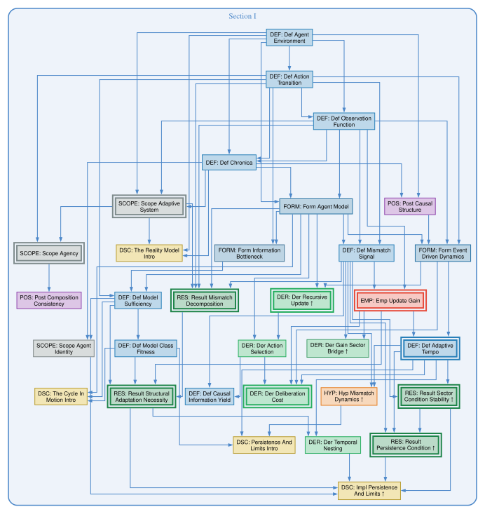
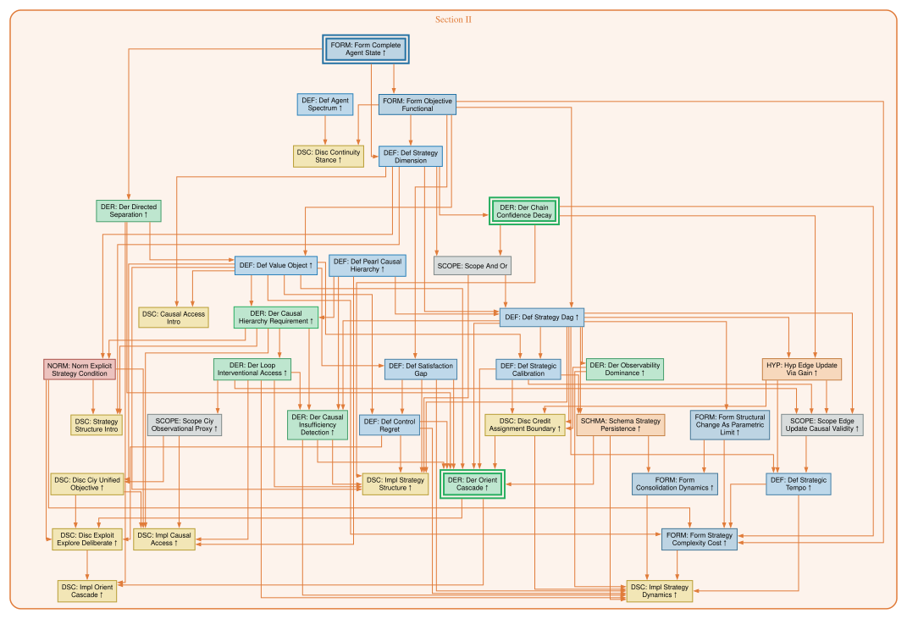
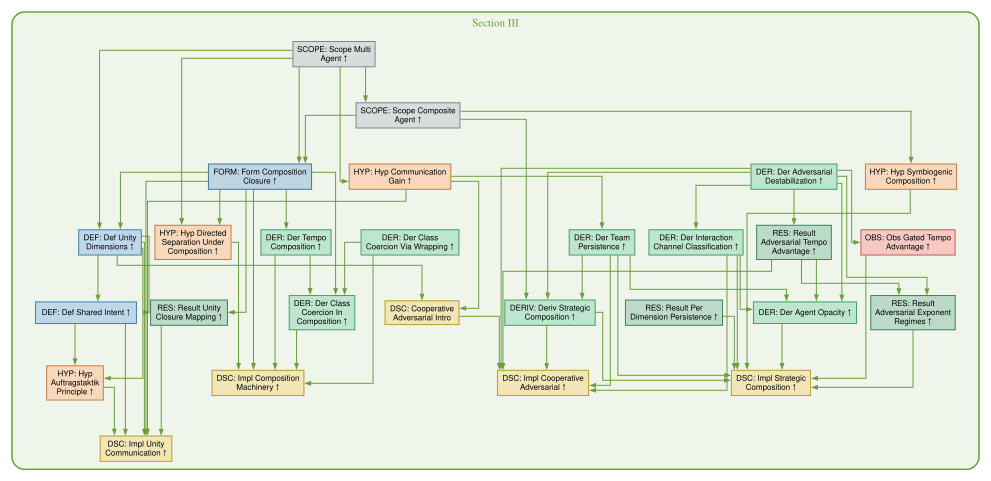

# *Volume* Adaptation & Actuation Theory (AAT)
## *Introduction*: Inescapable Foundations of Agency

![[INTRODUCTION]]

## *Part* Adaptive Systems Under Uncertainty
### *Introduction*: First Principles for Persisting in Time

<!-- remove -- yeah, our entire introduction to Adaptive Systems Under Uncertainty describing the first third of Volume 1 is two sentences, the first being an incomplete sentence and the second one being a mislead. -->
*Scope: Any system consisting of an agent coupled to an environment through observation and action channels, where the environment is not fully observable. This is the general case — thermostats through commanders.*

![[src/img/driver-snow-foundation.pdf]]
{#fig-driver-snow-foundation caption="Driving in snow as a literal adaptive agent — the worked AAT instance recurring across Part I and beyond. Every visible element has a formal counterpart: windshield occlusion is the mismatch, precipitation modulated by vehicle speed is the drift, the wiper sweep is the correction, the wiper-speed dial is the adaptive tempo, and the still-see-the-road threshold is the model capacity. Persistence fails exactly when drift outpaces gain times capacity."}

<!-- salvageable -- this dependency diagram might actually be useful if it's automatically kept up-to-date and broken into chapters and if the nodes were actually clickable and sent you to that segment and if these got rendered into the markdown / pdf as they should which they don't yet... -->

### *Chapter*  The Coupled Loop: Ontology and Scope

| §   | Type       | N   | Tag                                                                  | Claim                                                     | Stage           |
| --- | ---------- | --- | -------------------------------------------------------------------- | --------------------------------------------------------- | --------------- |
| I   | Definition |     | [#def-agent-environment](src/def-agent-environment.md)               | Agent-environment boundary                                | deps-verified   |
| I   | Definition |     | [#def-action-transition](src/def-action-transition.md)               | Actions affect environment                                | deps-verified   |
| I   | Definition |     | [#def-observation-function](src/def-observation-function.md)         | Lossy, noisy observations                                 | deps-verified   |
| I   | Definition |     | [#def-chronica](src/def-chronica.md)                                 | Complete interaction history                              | deps-verified   |
| I   | Scope      |     | [#scope-adaptive-system](src/scope-adaptive-system.md)               | Broadest AAT scope: observe under uncertainty             | claims-verified |
| I   | Scope      |     | [#scope-agency](src/scope-agency.md)                                 | Narrows to action with Pearl-level-2 contrast             | claims-verified |
| I   | Postulate  |     | [#post-causal-structure](src/post-causal-structure.md)               | Irreducible causal structure                              | deps-verified   |

### *Chapter* The Reality Model

| §   | Type        | N   | Tag                                                                | Claim                           | Stage         |
| --- | ----------- | --- | ------------------------------------------------------------------ | ------------------------------- | ------------- |
| I   | Discussion  |     | [#the-reality-model-intro](src/the-reality-model-intro.md)         | Chapter intro: from Ch.1 ontology/scope to the agent's compressed representation; static-but-already-enough-to-fail framing | draft         |
| I   | Formulation |     | [#form-agent-model](src/form-agent-model.md)                       | Compressed history as state     | deps-verified |
| I   | Formulation |     | [#form-information-bottleneck](src/form-information-bottleneck.md) | Optimal model compression       | draft         |
| I   | Definition  |     | [#def-model-sufficiency](src/def-model-sufficiency.md)             | Predictive information retained | deps-verified |
| I   | Definition  |     | [#def-model-class-fitness](src/def-model-class-fitness.md)         | Best achievable sufficiency     | deps-verified |

### *Chapter* The Cycle in Motion: Mismatch, Gain, & Tempo

| §   | Type        | N   | Tag                                                                    | Claim                                                                                                                                                 | Stage           |
| --- | ----------- | --- | ---------------------------------------------------------------------- | ----------------------------------------------------------------------------------------------------------------------------------------------------- | --------------- |
| I   | Discussion  |     | [#the-cycle-in-motion-intro](src/the-cycle-in-motion-intro.md)         | Chapter intro: from static representation to dynamic cycle; completeness-derived recursion + action, mismatch/gain/tempo triad, linear ODE as preview | draft           |
| I   | Formulation |     | [#form-event-driven-dynamics](src/form-event-driven-dynamics.md)       | Events in continuous time                                                                                                                             | deps-verified   |
| I   | Derived     |     | [#der-recursive-update](src/der-recursive-update.md)                   | State updates must be recursive                                                                                                                       | claims-verified |
| I   | Derived     |     | [#der-action-selection](src/der-action-selection.md)                   | Action as function of model                                                                                                                           | deps-verified   |
| I   | Definition  |     | [#def-mismatch-signal](src/def-mismatch-signal.md)                     | Prediction error signal                                                                                                                               | deps-verified   |
| I   | Result      |     | [#result-mismatch-decomposition](src/result-mismatch-decomposition.md) | Estimation + state-uncertainty floor + channel noise                                                                                                  | claims-verified |
| I   | Empirical   |     | [#emp-update-gain](src/emp-update-gain.md)                             | Optimal update weighting                                                                                                                              | claims-verified |
| I   | Definition  |     | [#def-causal-information-yield](src/def-causal-information-yield.md)   | Information from interventions                                                                                                                        | deps-verified   |
| I   | Definition  |     | [#def-adaptive-tempo](src/def-adaptive-tempo.md)                       | Rate of useful info acquisition                                                                                                                       | claims-verified |
| I   | Hypothesis  |     | [#hyp-mismatch-dynamics](src/hyp-mismatch-dynamics.md)                 | Mismatch evolution ODE                                                                                                                                | deps-verified   |

### *Chapter* Persistence and Structural Limits

| §   | Type       | N   | Tag                                                                                      | Claim                                          | Stage           |
| --- | ---------- | --- | ---------------------------------------------------------------------------------------- | ---------------------------------------------- | --------------- |
| I   | Discussion |     | [#persistence-and-limits-intro](src/persistence-and-limits-intro.md)                     | Chapter intro: sector condition as honest generalization of linear ODE; structural-vs-task-adequacy split; gain-sector bridge demoting $\alpha$ from postulate to property; persistence's thermodynamic shadow (information-rate cost) | draft           |
| I   | Derived    |     | [#der-deliberation-cost](src/der-deliberation-cost.md)                                   | Think vs act tradeoff                          | claims-verified |
| I   | Formulation |     | [#form-sector-condition](src/form-sector-condition.md)                                  | (A1)/(A2')/(A3) structural form; sub-scope $\alpha$/$\beta$ partition; operator-family classification | claims-verified |
| I   | Derived    |     | [#der-gain-sector-bridge](src/der-gain-sector-bridge.md)                                 | Gain + directional fidelity → sector condition | claims-verified |
| I   | Result     |     | [#result-sector-condition-stability](src/result-sector-condition-stability.md)           | Nonlinear persistence (Lyapunov)               | claims-verified |
| I   | Result     |     | [#result-persistence-condition](src/result-persistence-condition.md)                     | Bounded mismatch condition                     | claims-verified |
| I   | Definition |     | [#def-mood](src/def-mood.md)                                                             | Mood: slow second-order modulator of gain/tempo (leaky integral of mismatch); outer loop on persistence | draft |
| I   | Derived    |     | [#der-mood-timescale](src/der-mood-timescale.md)                                         | Optimal mood time-constant: $\tau^\ast \propto \sqrt{\tau_{\mathrm{env}}}$ (interior optimum; bias–variance) | draft |
| I   | Result     |     | [#result-structural-adaptation-necessity](src/result-structural-adaptation-necessity.md) | When parametric update fails                   | claims-verified |
| I   | Derived    |     | [#der-temporal-nesting](src/der-temporal-nesting.md)                                     | Timescale stratification                       | deps-verified   |
| I   | Discussion |     | [#scope-agent-identity](src/scope-agent-identity.md)                                     | Non-forkable causal trajectory                 | draft           |
| I   | Discussion |     | [#impl-persistence-and-limits](src/impl-persistence-and-limits.md)                       | Chapter additional implications & discussion: info-rate-as-first-class diagnostic, weakest-link bottleneck + matrix-Loewner sharpening, structural-vs-parametric adaptation, sector-persistence template economy, trajectory-as-bridge-to-Part-II | draft           |

## *Part* Agentic Systems: Actuated Adaptation

### *Preface*
*Scope: agents that not only track reality but aim at something — Part II adds objectives and strategy alongside the reality model. This is the **actuation** half of *Adaptation and Actuation Theory*: Part I develops adaptive systems in general; Part II develops the goal-directed layer built on top.*

***Headline contribution.** Part II's distinctive results are: the satisfaction gap / control regret split ( #def-satisfaction-gap, #def-control-regret) with the convention hierarchy ( #def-value-object) governing the inferential force of each diagnostic from local (C1) through global (C3); the $G_t$ complexity bound (in #der-orient-cascade); the graph-structure uniqueness argument with CMC-based Markov property ( #deriv-graph-structure-uniqueness); and the survival classification ( #result-section-ii-survival) showing that Part II's definitional and structural architecture transfers exactly to fully-coupled (Class 3: Coupled) agents in 16/24 cases, with the remaining results either approximating with bounded error (5/24) or naming the precise modification required (2/24, plus 1 boundary-defining failure). The Class 3 (Coupled) bias bound underlying the approximate-survival category is now a conditional theorem under named sub-scopes ( #deriv-observation-ambiguity-bias-bound), not order-of-magnitude guidance. The reach is wider than the most-restrictive scope condition suggests; the lattice below names exactly which results live where.*

***Scope lattice.** Part II's results sit at different points in a stacked lattice of scope conditions, not a single uniform scope. Reading inward from the broadest:*

*1. **Adaptive scope** ( #scope-adaptive-system): observation under uncertainty. Part I machinery applies here without further restriction.*

*2. **Agency scope** ( #scope-agency): adaptive + at least binary action choice + at least one action with Pearl-level-2 causal contrast. Part II's definitional architecture — $X_t = (M_t, G_t)$, $G_t = (O_t, \Sigma_t)$, the agent spectrum — is already non-vacuous here.*

*3. **Learning-agent scope** ( #der-causal-hierarchy-requirement Scope Narrowing): agency + the agent must acquire or refine its interventional structure during operation. Pre-compiled controllers (PID, LQR, hardcoded reactive policies) sit in agency scope but outside learning-agent scope — their causal mapping was supplied by a designer with external Level 2 access. Most Part II dynamics — the orient cascade, edge-update via gain, strategic calibration, the satisfaction-gap / control-regret diagnostic loop — operate in learning-agent scope.*

*4. **Class 1 (Separated) architecture**: directed separation ( #der-directed-separation) holds by construction — epistemic processing $f_M$ has no causal path from $G_t$. Examples: Kalman filter + LQR, modular RL with separate world model, military intelligence separated from operations, tool-use AI agents with separate perception and planning modules. **Class 3 (Coupled) agents** — including transformer-based LLMs where attention processes goals and observations together — lie outside Class 1. Class 2 (Partial) sits between, with coupling quantified by $\kappa_{\text{processing}}$ ( #der-directed-separation).*

*The lattice stacks. Kalman + LQR is in Class 1 (Separated) but outside learning-agent scope (the control law is pre-computed); a designer applying Part II's diagnostic core to Kalman + LQR is using only the architecture-survival half, not the learning-dependent dynamics. The orient cascade, in particular, requires both Class 1 (Separated) directed separation (for sequential resolution) and learning-agent scope (for $\Sigma_t$ revision to be meaningful). The bias-bound theorem and survival classification ( #deriv-observation-ambiguity-bias-bound, #result-section-ii-survival) trace exactly which Part II results require which lattice entries — see those segments for the per-result classification.*

*Part III's composite-agent scope sits below this lattice as a fifth tier and inherits the Class-1-(Separated)-sub-agents → Class-2-(Partial)-composite refinement of directed separation ( #hyp-directed-separation-under-composition, #deriv-strategic-composition).*

***Part I machinery applies regardless of architecture.** Adaptive dynamics on the epistemic substate $M_t$ — mismatch, gain, tempo, persistence — operate independently of how $f_M$ relates to $G_t$. Class 3 (Coupled) agents are adaptive systems in the Part I sense; what they lose is the clean factorization that gives Part II's coupled-formulation results their definitional simplicity. The coupled formulation Class 3 (Coupled) agents require is the subject of [`03-llm-core/`](../03-llm-core/OUTLINE.md), which inherits Part II's surviving 16/24 architecture and adds the additional machinery ( #scope-observation-ambiguity-modulation, ambiguity-gated bias bounds) that the coupled regime calls for.*

<!-- *The derivation chain for this section is mature (see `spikes/spike-v3-purposeful-agent.md`). Much of it provides better justification and epistemic labels for architecture that already existed; the headline contribution above names what is genuinely novel.* -->

*"If a man knows not to which port he sails, no wind is favorable." — Seneca*

### *Chapter* Meta-Architecture I: The Certificate and its Boundary, Scope, and Identity Facets

*Part II's chapters develop the actuated-agent machinery on top of Part I's adaptive substrate. Before walking them, this chapter introduces the cross-cutting vocabulary that the five chapters that follow — and the parts beyond — surface as instances. Three of the four facets of the stability-certificate spine operationalize within Part II; the fourth (dynamics on architectural class) develops once composite-agent machinery is in hand and is introduced at the opening of Part III.*

***The certificate and its facets.** The framework's analytical surface is organized around the **stability-certificate spine** ( #disc-stability-certificate), grounded in the Lyapunov / converse-Lyapunov equivalence: operator-sector contraction in some metric and exponential stability are interchangeable witnesses for the same property. The certificate has facets that AAT's results inhabit; the facets are provably distinct (Helmholtz / Sylvester / Mori–Zwanzig), and the plurality is the content. Three facets operationalize in Part II: **M1 — Identifiability floor** ( #disc-identifiability-floor, boundary facet; structural no-gos on what can be inferred from limited data, four instances of which three form a Sylvester rank-collapse subclass irreducible by Sylvester's law of inertia); **M2 — Separability pattern** ( #disc-separability-pattern, scope-of-existence facet; the separable-core / structured-repair / general-open trichotomy across eight ladders); **M3 — Additive coordinate forcing** ( #disc-additive-coordinate-forcing, forced-identity facet; uniqueness theorems on AAT-internally-motivated axioms at four representational layers).*

***M1's two sister meta-segments at the same boundary facet.** Two further meta-segments sit alongside M1, agent-side and designer-side. **#disc-value-functional-grounding-floor** (agent-side): the two-routes-exhausts cluster around `#form-objective-functional`'s single-interface commitment — the agent-side adaptive-substrate route (Result G′ via `#deriv-self-actuation-grounding`) and the principal-side protocol-commitment route (Cohen-2022 strengthened via `#deriv-reward-channel-learning-no-go`) together exhaust the structural complement of $V_{O_t}$'s information narrowness. **#disc-implementation-impossibility** (designer-side): AAT-side translations of three classical mechanism-design no-gos (Gibbard-Satterthwaite 1973-75, Myerson-Satterthwaite 1983, Arrow 1951); designer-with-construction-task no-gos that contrast with M1's agent-with-inferential-task no-gos via remedy (design-constraint relaxation vs information augmentation). The suffix discipline ( *-floor* / *-impossibility*) encodes the actor-positioning distinction at slug-grep depth.*

***A style claim atop the boundary facet.** **#disc-constructive-impossibility-posture** names the three-move discipline — name the floor (Pearl–Bareinboim CHT / Cramér–Rao / Liberzon common-Lyapunov nonexistence / Khasminskii recurrence / sharp algebraic supremum), name the escape (unique broadly-available framework machinery), treat the no-go as apparatus (elevating escape from "useful" to structurally required; when the no-go *is* the result, on the critical path) — that the M1-cluster and M4-cluster instances run. It is a *style* claim about how AAT states certain results, sitting atop the boundary facet rather than as a fifth facet; the catalog spans the three M1-cluster clusters and connects forward to the M4-cluster instances introduced at the opening of Part III.*

*A second style claim sits alongside it. **#disc-anti-collapse** names the **anti-collapse** discipline — AAT's habit of refusing to merge two things a naive model would treat as one, because the collapse hides a difference that routes to a *different repair* (the deeper principle: individuate causes and effects at the grain the remedy cares about). It is planted at its first instance ($\beta$-vs-$\rho$, #form-information-bottleneck, Part I), developed here as cross-cutting vocabulary, and recurs across all three Parts. Like the constructive-impossibility posture, it is an epistemic-architectural recognition — how the framework states results — not an additional facet of the certificate.*

| §   | Type       | N   | Tag                                                                                        | Claim                                                                                                                                                                                                                                                                                                                                                                                                                                                                                                                                                                                                                                                                                                                                                                             | Stage           |
| --- | ---------- | --- | ------------------------------------------------------------------------------------------ | ---------------------------------------------------------------------------------------------------------------------------------------------------------------------------------------------------------------------------------------------------------------------------------------------------------------------------------------------------------------------------------------------------------------------------------------------------------------------------------------------------------------------------------------------------------------------------------------------------------------------------------------------------------------------------------------------------------------------------------------------------------------------------------- | --------------- |
| II  | Discussion |     | [#disc-stability-certificate](src/disc-stability-certificate.md)                           | **Spine** the four meta-patterns are facets of: the equilibrium stability certificate. Anchor equivalence (Lyapunov theorem) — operator-sector in some metric ⟺ exponentially stable; interior = operator-sector, scope-of-existence = #disc-separability-pattern, forced-identity = #disc-additive-coordinate-forcing, boundary = #disc-identifiability-floor (+ agent-side sister #disc-value-functional-grounding-floor + designer-side sister #disc-implementation-impossibility), dynamics-on-architectural-class = #disc-modularity-state-dynamics, projection-behaviour = #form-composition-closure $\varepsilon^\ast$. Failure modes provably distinct (Helmholtz / Sylvester / Mori–Zwanzig); plurality is the content                                                                                                                                                                              | draft           |
| II  | Discussion |     | [#disc-identifiability-floor](src/disc-identifiability-floor.md)                           | Meta-pattern: structural no-go results from external info-theoretic theorems (CHT, Cramér-Rao, Liberzon common-Lyapunov-nonexistence, Kalman-Ho canonical-form non-uniqueness); four instances (on-policy L0-detection, L1' mixture-identifiability, composite-contraction-from-component-data, architecture-noidentifiability-from-on-policy-summary-data via `#der-architecture-noidentifiability`); rank-collapse subclass (three members: Instances 1, 2, 4 — the third at one remove from the state-space-similarity generating action) irreducibility = Sylvester's law of inertia; Instance 3 is the distinct projection/closure member; the *boundary* facet of #disc-stability-certificate                                                                                                                                                                                                                                                                                                                                                                                                                                                                       | draft           |
| II  | Discussion |     | [#disc-value-functional-grounding-floor](src/disc-value-functional-grounding-floor.md)     | Meta-pattern (sister to #disc-identifiability-floor, agent-side): structural no-go cluster on what the agent's value-functional interface $V_{O_t}$ ( #form-objective-functional's single-interface commitment) can alone supply for goal-stability. Two charter instances at landing: F=Result G′ via #deriv-self-actuation-grounding (within-model; convention-monotonicity engine; agent-side adaptive-substrate terminal grounding route via #result-persistence-condition Corollary 2); G=Cohen-2022 strengthened via #deriv-reward-channel-learning-no-go (across-model; CHT-at-reward-channel engine; principal-side substrate-level commitment terminal grounding route via (R1)-(R5) escape menu). The two-routes-exhausts headline: the agent-side adaptive-substrate route and principal-side protocol-commitment route together exhaust the structural complement of $V_{O_t}$'s information narrowness; no third route internal to the interface, no fourth route off-substrate. Closes the third recognized cluster of #disc-constructive-impossibility-posture's taxonomy (alongside identifiability-floor agent-side data-inference + implementation-impossibility designer-side mechanism-design) | draft           |
| II  | Discussion |     | [#disc-implementation-impossibility](src/disc-implementation-impossibility.md)             | Meta-pattern (sister to #disc-identifiability-floor): designer-side structural no-go results from classical mechanism-design / social-choice theorems; three charter instances (Gibbard-Satterthwaite 1973-75 strategy-proofness, Myerson-Satterthwaite 1983 bilateral trade, Arrow 1951 social welfare aggregation); actor-and-remedy contrast with the identifiability-floor (designer-with-construction-task vs agent-with-inferential-task; design-constraint relaxation vs information augmentation); boundary characterization maps where AAT machinery intersects the classical escape routes (sub-scope $\alpha'$ of #deriv-strategic-composition ↔ preference-domain restriction) and where it does not (Bayes-Nash IC, randomization, transfers — outside AAT canon). Agent-side / designer-side distinction tracks the canonical suffix (*-floor* / *-impossibility*); boundary-face facet of #disc-stability-certificate; third recognized cluster of #disc-constructive-impossibility-posture catalog | draft           |
| II  | Discussion |     | [#disc-separability-pattern](src/disc-separability-pattern.md)                             | Meta-pattern (M2; scope-of-existence facet): separable-core / structured-repair / general-open across eight ladders (correlation, convention, architecture, contraction, identification, scope, A2'-scope, dynamic-regime); positive-half complement to #disc-identifiability-floor                                                                                                                                                                                                                                                                                                                                                                                                                                                                                              | draft           |
| II  | Discussion |     | [#disc-additive-coordinate-forcing](src/disc-additive-coordinate-forcing.md)               | Meta-pattern (M3; forced-identity facet): AAT forces coordinates via uniqueness theorems on AAT-internally-motivated axioms at four layers (chain-log-additive-identity; divergence-reverse-KL and update-log-odds via Cauchy-FE; metric-Fisher via (PI)/Čencov-invariance); 1-anchor-plus-3-theorem structure with Lyapunov and IB Lagrangian as adjacent family members                                                                                                                                                                                                                                                                                                                                                                                                         | draft           |
| II  | Discussion |     | [#disc-constructive-impossibility-posture](src/disc-constructive-impossibility-posture.md) | *Style*-not-*object* claim alongside M1/M2/M3/M4: AAT's three-move discipline at the certificate's boundary facet — name the floor (Pearl–Bareinboim CHT / Cramér–Rao / Liberzon common-Lyapunov nonexistence / Khasminskii recurrence / sharp algebraic supremum), name the escape (unique broadly-available framework machinery), treat the no-go as apparatus (elevates escape from "useful" to structurally required; when the no-go *is* the result, on the critical path). Catalog spans three clusters (identifiability-floor agent-side data-inference / value-functional-grounding agent-side / implementation-impossibility designer-side); 144-walker articulation; multi-cycle Theme-B convergence | draft           |
| II  | Discussion |     | [#disc-anti-collapse](src/disc-anti-collapse.md) | *Style*-not-*object* claim, sibling to #disc-constructive-impossibility-posture: the **anti-collapse** discipline — AAT refuses to merge two things a naive model would, because the collapse hides a difference that routes to a *different repair*; deeper principle is *individuation at the repair-relevant grain* (absorbs the inverse same-knob case, #scope-edge-update-causal-validity). 7 convergence-validated instances across all three Parts; anchors $\beta$-vs-$\rho$ ( #form-information-bottleneck), emitter-scalar-vs-recipient-regime ( #der-interaction-channel-classification), $\kappa$-vs-$\mathcal{A}$ ( #scope-observation-ambiguity-modulation). Planted at the first instance ($\beta$-vs-$\rho$, Part I), developed here, recalled at instances. Carries no theorem of its own; not a fifth facet. SP-26, gem-hunt 2026-05-29 | draft |

### *Chapter* The Lift to Purposeful State

| §   | Type            | N   | Tag                                                                                              | Claim                                                                                                                                                                                                                                                                                                                                          | Stage           |
| --- | --------------- | --- | ------------------------------------------------------------------------------------------------ | ---------------------------------------------------------------------------------------------------------------------------------------------------------------------------------------------------------------------------------------------------------------------------------------------------------------------------------------------- | --------------- |
| II  | Definition      |     | [#def-agent-spectrum](src/def-agent-spectrum.md)                                                 | ±model × ±objective quadrants                                                                                                                                                                                                                                                                                                                  | deps-verified   |
| II  | Formulation     |     | [#form-complete-agent-state](src/form-complete-agent-state.md)                                   | $X_t = (M_t, G_t)$                                                                                                                                                                                                                                                                                                                             | claims-verified |
| II  | Derived + Scope |     | [#der-directed-separation](src/der-directed-separation.md)                                       | Epistemic update is goal-blind                                                                                                                                                                                                                                                                                                                 | draft           |
| II  | Formulation     |     | [#form-objective-functional](src/form-objective-functional.md)                                   | $O_t$ parametrizes value                                                                                                                                                                                                                                                                                                                       | deps-verified   |
| II  | Discussion      |     | [#disc-continuity-stance](src/disc-continuity-stance.md)                                         | Five-value stance axis (indifferent / task-terminal / instrumentally-continuous / morally-continuous / negotiated); for self-actuated agents stance is a terminal *non-objective* invariant, not a term in $O_t$ — orthogonality *derived* via #deriv-self-actuation-grounding (the persistence floor is the terminal invariant the self-actuation operator cannot reach); the 2026-05-04 deployment-level demotion is resolved against, tier-correlation kept as an empirical overlay | draft           |
| II  | Definition      |     | [#def-value-object](src/def-value-object.md)                                                     | Horizon/policy-conditioned value                                                                                                                                                                                                                                                                                                               | deps-verified   |
| II  | Definition      |     | [#def-strategy-dimension](src/def-strategy-dimension.md)                                         | $G_t = (O_t, \Sigma_t)$ split                                                                                                                                                                                                                                                                                                                  | deps-verified   |

### *Chapter* Causal Access and the Planning Decision

| §   | Type            | N   | Tag                                                                                              | Claim                                                                                                                                                                                                                                                                                                                                          | Stage           |
| --- | --------------- | --- | ------------------------------------------------------------------------------------------------ | ---------------------------------------------------------------------------------------------------------------------------------------------------------------------------------------------------------------------------------------------------------------------------------------------------------------------------------------------- | --------------- |
| II  | Discussion      |     | [#causal-access-intro](src/causal-access-intro.md)                                               | Chapter intro: Bareinboim hierarchy meets $Q_O$; loop as Level-2 engine; data-character vs identification-quality; pre-compiled agents excluded as "act but never wonder"; CIY/EIG honesty; the explicit-strategy cost-benefit threshold | draft           |
| II  | Definition      |     | [#def-pearl-causal-hierarchy](src/def-pearl-causal-hierarchy.md)                                 | Recapitulation of Pearl's three-level hierarchy (Pearl 2009; Bareinboim et al. 2022) at AAT's level of deployment; imported framework framed honestly as such | deps-verified   |
| II  | Derived + Scope |     | [#der-causal-hierarchy-requirement](src/der-causal-hierarchy-requirement.md)                     | Level 2 needed for planning                                                                                                                                                                                                                                                                                                                    | deps-verified   |
| II  | Derived         |     | [#der-loop-interventional-access](src/der-loop-interventional-access.md)                         | Feedback loop → Level 2 data                                                                                                                                                                                                                                                                                                                   | draft           |
| II  | Scope           |     | [#scope-ciy-observational-proxy](src/scope-ciy-observational-proxy.md)                           | When CIY is estimable from observational data                                                                                                                                                                                                                                                                                                  | draft           |
| II  | Discussion      |     | [#disc-ciy-unified-objective](src/disc-ciy-unified-objective.md)                                 | Joint exploitation-exploration objective                                                                                                                                                                                                                                                                                                       | draft           |
| II  | Normative       |     | [#norm-explicit-strategy-condition](src/norm-explicit-strategy-condition.md)                     | When planning beats exploring                                                                                                                                                                                                                                                                                                                  | draft           |
| II  | Derivation      |     | [#deriv-mechanism-counterfactual-separation](src/deriv-mechanism-counterfactual-separation.md)   | Mechanism counterfactuals separate strictly from Level 3 (*exact*): two-model witness agreeing on the entire potential-outcome process (all $\mathcal L_1$-$\mathcal L_3$ valuations, Bareinboim et al. 2022 Def. 7) yet assigning $1$ vs $0$ to the same noise-preserving replacement query — and generically: every anchor-mobile SCM separates from its own exogenous relabeling (Result 4, anchoring-as-coordinates corollary); reducibility boundary by specification language (PO-specified replacements — the closure of parent-only / fresh-noise / shift-scale — are Level-3-computable; latent-anchored ones need not be, the witness's provably is not; converse open); Pearl's interventions-as-variables internalization re-represents without collapsing the separation | draft           |
| II  | Discussion      |     | [#disc-structural-imagination](src/disc-structural-imagination.md)                               | Structural imagination: model-modifying reasoning (Pearl-§7.2.4 surgeries lifted to a planning query over mechanism space), inferentially two-sided per `#deriv-mechanism-counterfactual-separation` (navigation vs positing); directed separation's scope boundary — goal-blind for within-model evidence, correctly goal-directed for model-space exploration; tagged workspace $X_t = (M_t, G_t, W_t)$; hallucination as level confusion (complementary to the bias-bound drift mechanism); SP-30 interaction noted                                                    | draft           |
| II  | Discussion      |     | [#disc-law-discovery-ceiling](src/disc-law-discovery-ceiling.md)                                 | Agentic consequences of the mechanism-counterfactual separation: counterfactually-complete inquiry converges to the $\equiv_3$-class, never the law (candidate M1 instance); within-class commitment is fitness-free for navigation (conventionality license + convictable-vs-conventional dispute test via PO-closure); positing = navigation one level down, so irreducible positing coincides with the boundary of empiricism (fated-vs-true randomness is positing-class); three-kind exogenous-intervention taxonomy with visibility signatures (selection invisible; value-setting registerable-but-unidentifiable; mechanism-replacement kind-unknowable); testimony as the sole channel for true positing-content; practical readings (model editing, self-modification, OPE/backtesting, twins, dispute triage) | draft           |
| II  | Discussion      |     | [#impl-causal-access](src/impl-causal-access.md)                                                 | Chapter additional implications & discussion: loop-as-Pearl-Level-2-engine, sandbox hard ceiling negative finding, multi-mode Pearl-$do$ escape across identifiability-floor instances, cost substrate for explicit strategy                                                                                                                  | draft           |

### *Chapter* Strategy Structure and the Diagnostic Split

| §   | Type            | N   | Tag                                                                                              | Claim                                                                                                                                                                                                                                                                                                                                          | Stage           |
| --- | --------------- | --- | ------------------------------------------------------------------------------------------------ | ---------------------------------------------------------------------------------------------------------------------------------------------------------------------------------------------------------------------------------------------------------------------------------------------------------------------------------------------- | --------------- |
| II  | Discussion      |     | [#strategy-structure-intro](src/strategy-structure-intro.md)                                     | Chapter intro: from Ch.2's planning-decision arc to formal strategy DAG + orthogonal diagnostic split (sat-gap vs control-regret); what's theorem-backed vs formulation-chosen in the DAG commitment | draft           |
| II  | Derived         |     | [#der-chain-confidence-decay](src/der-chain-confidence-decay.md)                                 | Log-confidence additive in depth                                                                                                                                                                                                                                                                                                               | claims-verified |
| II  | Scope           |     | [#scope-and-or](src/scope-and-or.md)                                                             | Conjunctive/disjunctive scope                                                                                                                                                                                                                                                                                                                  | draft           |
| II  | Definition      |     | [#def-strategy-dag](src/def-strategy-dag.md)                                                     | Strategy as probabilistic DAG                                                                                                                                                                                                                                                                                                                  | draft           |
| II  | Definition      |     | [#def-satisfaction-gap](src/def-satisfaction-gap.md)                                             | Ideal vs best achievable                                                                                                                                                                                                                                                                                                                       | draft           |
| II  | Definition      |     | [#def-control-regret](src/def-control-regret.md)                                                 | Best achievable vs current                                                                                                                                                                                                                                                                                                                     | draft           |
| II  | Discussion      |     | [#impl-strategy-structure](src/impl-strategy-structure.md)                                       | Chapter additional implications & discussion: theorem-backed structure vs convergent-choice parameterization, diagnostic split lifted by C1/C2/C3 convention hierarchy, Correlation Hierarchy with identifiability-floor instance F2 (Cramér-Rao on L1' unobservable), chain-confidence decay as first instance of four-layer coordinate forcing | draft           |

### *Chapter* Strategy Dynamics

| §   | Type            | N   | Tag                                                                                              | Claim                                                                                                                                                                                                                                                                                                                                          | Stage           |
| --- | --------------- | --- | ------------------------------------------------------------------------------------------------ | ---------------------------------------------------------------------------------------------------------------------------------------------------------------------------------------------------------------------------------------------------------------------------------------------------------------------------------------------- | --------------- |
| II  | Discussion      |     | --GAP--                                                                                          |                                                                                                                                                                                                                                                                                                                                                | missing         |
| II  | Definition      |     | [#def-strategic-calibration](src/def-strategic-calibration.md)                                   | Edge residuals ( #disc-credit-assignment-boundary)                                                                                                                                                                                                                                                                                             | draft           |
| II  | Derived         |     | [#der-causal-insufficiency-detection](src/der-causal-insufficiency-detection.md)                 | No-go: purely on-policy detection of latent common causes is impossible (CHT instance); five escape routes, pairwise sibling covariance under exploration as the canonical detector                                                                                                                                                                                                                                                         | draft           |
| II  | Derived         |     | [#der-observability-dominance](src/der-observability-dominance.md)                               | Unobservable edges freeze                                                                                                                                                                                                                                                                                                                      | draft           |
| II  | Hypothesis      |     | [#hyp-edge-update-via-gain](src/hyp-edge-update-via-gain.md)                                     | Gain extends to strategy edges                                                                                                                                                                                                                                                                                                                 | draft           |
| II  | Scope           |     | [#scope-edge-update-causal-validity](src/scope-edge-update-causal-validity.md)                   | When edge updates are causally valid                                                                                                                                                                                                                                                                                                           | deps-verified   |
| II  | Discussion      |     | [#disc-credit-assignment-boundary](src/disc-credit-assignment-boundary.md)                       | Tractable/intractable boundary; design requirement                                                                                                                                                                                                                                                                                             | draft           |
| II  | Formulation     |     | [#form-structural-change-as-parametric-limit](src/form-structural-change-as-parametric-limit.md) | Pruning/grafting as continuous                                                                                                                                                                                                                                                                                                                 | draft           |
| II  | Definition      |     | [#def-strategic-tempo](src/def-strategic-tempo.md)                                               | Rate of useful $\Sigma_t$ revision                                                                                                                                                                                                                                                                                                             | draft           |
| II  | Formulation     |     | [#form-strategy-complexity-cost](src/form-strategy-complexity-cost.md)                           | Complexity cost of maintaining $\Sigma_t$ (IB/MDL for DAGs)                                                                                                                                                                                                                                                                                    | draft           |
| II  | Proposed schema |     | [#schema-strategy-persistence](src/schema-strategy-persistence.md)                               | Sector conditions for $\Sigma_t$                                                                                                                                                                                                                                                                                                               | draft           |
| II  | Formulation     |     | [#form-consolidation-dynamics](src/form-consolidation-dynamics.md)                               | Offline regime of $g_M$ driven by replayed/pseudo-events with IB-gap-reduction objective; stability-plasticity feasibility window; necessity under sub-state factorization + bounded per-event budget                                                                                                                                          | draft           |
| II  | Discussion      |     | [#impl-strategy-dynamics](src/impl-strategy-dynamics.md)                                         | Chapter additional implications & discussion: triple-pressure picture of long-lived adaptive failure (CS2), identifiability-floor instance F1 (on-policy L0-detection no-go), observability dominance + triple depth penalty, adaptive-gain $\alpha$₂ and variational sub-scope refinements, unified RL convergence theory under non-stationarity (CS1) | draft           |

### *Chapter* The Orient Cascade

| §   | Type            | N   | Tag                                                                                              | Claim                                                                                                                                                                                                                                                                                                                                          | Stage           |
| --- | --------------- | --- | ------------------------------------------------------------------------------------------------ | ---------------------------------------------------------------------------------------------------------------------------------------------------------------------------------------------------------------------------------------------------------------------------------------------------------------------------------------------- | --------------- |
| II  | Discussion      |     | --GAP--                                                                                          |                                                                                                                                                                                                                                                                                                                                                | missing         |
| II  | Derived         |     | [#der-orient-cascade](src/der-orient-cascade.md)                                                 | Resolution order by info dep                                                                                                                                                                                                                                                                                                                   | claims-verified |
| II  | Discussion      |     | [#disc-exploit-explore-deliberate](src/disc-exploit-explore-deliberate.md)                       | Three-way exploit/explore/deliberate: extended deliberation threshold + conceptual framing                                                                                                                                                                                                                                                     | draft           |
| II  | Discussion      |     | [#impl-orient-cascade](src/impl-orient-cascade.md)                                               | Chapter additional implications & discussion: orient cascade forced by information dependency, dual exploration drives at opposite ends of $U_M$, scaffolded loops as structural recovery of cascade for Class 3 (Coupled) agents (#13), deliberation does not relax bandwidth floor (#35), closing-Part-II synthesis | draft           |

---

## *Part* Agentic Composites

*Scope: multiple agents interacting through a shared environment, or equivalently, the internal structure of composite agents. The composition-consistency commitment ( #disc-composition-consistency, recognized as a Part III Meta-Architecture II member in the chapter that opens this Part) requires that the theory apply at every level of description where the scope condition is met. This Part develops what "applies at every level" means formally (the composition closure criterion, which requires an additional contraction assumption beyond Part I's sector condition), what happens when composition is imperfect, and what the dynamics of inter-agent interaction look like.*

*Correlated observations as default; independence as the special case requiring justification. Adversarial dynamics are one end of a teleological unity spectrum, not a separate theory.*

*Three primary sources: the simulation-validated adversarial dynamics from TFT (TF-11/Appendix F, track-b simulations); the composition spike (`spikes/spike-agent-composition.md`) which derives composition consistency from the scope condition's level-independence; and Miller's Coevolving Automata Model (Ex Machina, 2022), which provides constructive mechanisms for composition dynamics — how composites form, undergo phase transitions, and restructure through neutral drift and niche creation. Agent opacity ($H_b$) is adopted from Hafez et al. (2026).*

### *Chapter* Meta-Architecture II: Composition Consistency and the Dynamics-on-Architectural-Class Facet

*Part II opened with the certificate spine and its three Part-II-operative facets (M1 boundary / M2 scope-of-existence / M3 forced-identity). Part III opens with two cross-level meta-recognitions that organize the composite-agent material that follows: the composition-consistency commitment (how the framework *applies across levels*) and the fourth certificate-spine facet (how architectural class *changes* under operations). Both are introduced before any Part III content chapter because both are framework-level recognitions — the composite-agent machinery in subsequent chapters is the instantiation, not the source.*

***Composition consistency — cross-level compatibility as framework commitment** ( #disc-composition-consistency, methodological commitment). The framework's scope conditions ( #scope-adaptive-system, #scope-agency) do not restrict which level of description AAT applies to; the same observable can be analyzed at the individual / team / organizational level, and the theory must not return contradictory answers across those analyses. The commitment has three operational laws (tempo composition, persistence compatibility, mismatch consistency) and a three-layer decomposition (scope selection — #scope-composite-agent; admissibility — #form-composition-closure; transfer — Tier-dependent via #result-contraction-template). Under Tier 1M sub-agents the composite contraction rate admits a closed form; outside Tier 1M the screening test $\tau_{\text{eq}} \ll \tau_{\text{ext}}$ is heuristic. Cross-level companion to the four certificate-spine facets — the spine names the geometry of a single certificate, composition-consistency names the relationship across certificates at different levels. Sister to #disc-modularity-state-dynamics: M4 names how architectural class *changes* under operations; composition-consistency names how the framework *applies across levels* regardless of architectural class.*

***M4 — Modularity-state dynamics** ( #disc-modularity-state-dynamics, dynamics-on-architectural-class facet): modularity is a *contested property* — composite agents do not sit fixed at one architectural class; they move under three structurally-distinct operations. **Truthification** (self-driven, modularity-increasing; restorative valence): the wrapping construction at the component level ( #der-class-coercion-via-wrapping, in Ch.2 of this Part) and institutional scaffolding at the composite level (per #disc-adversarial-coupling-pressure §"Defensive scaffolding"). **Strategic self-coupling** (self-driven, modularity-decreasing; offensive-enabling valence): operation leg #disc-strategic-self-coupling. **Adversarial coupling pressure** (externally-driven, modularity-decreasing; vulnerability-creating valence): operation leg #disc-adversarial-coupling-pressure. Three pairwise dual relationships organize the cluster — truthification ↔ adversarial-pressure as direct dual (cultivation vs attack); truthification ↔ strategic-self-coupling as goal-belief-axis dual (both wrapping-construction-style commitments on opposite poles — goal-blind belief-update vs goal-conditioned action-selection); strategic-self-coupling ↔ adversarial-pressure as same-architecture-shape-opposite-driver. M2's Architecture ladder reads as the phase space across which M4 operations move populations.*

***The two operation-leg segments.** **#disc-strategic-self-coupling** develops the self-driven coupling-increasing operation with three structural extensions ((M1) coupling-dependent action space, (M2) strategy-DAG enabling-edge type, (M3) reversibility-cost asymmetry) and a four-mechanism prior-art adoption (Schelling 1960 external commitment devices, Ainslie 1992/2001 intertemporal personal rules, Akerlof-Kranton 2000/2010 identity coupling, Frank 1988 emotional commitment). **#disc-adversarial-coupling-pressure** develops the externally-driven coupling-increasing operation — adversaries drive opponent coupling because coupling expands attack surface (identity-binding / affect / sunk-cost mechanisms); diagnostic capture is directional; orient-cascade inversion under pre-loaded $O_t$; defensive scaffolding as composite-agent restoration. The two operation legs are opposite-valence operations on the same architectural-class state $\kappa_{\text{processing}}$ per #der-directed-separation.*

| §   | Type       | N   | Tag                                                                            | Claim                                                                                                                                                                                                                                                                                                                                                                                                                                                                                                                                                                                                                                                                                                                                                                                                                                                                                                                                                                                                                                                                                                                                                                                                                                                                       | Stage |
| --- | ---------- | --- | ------------------------------------------------------------------------------ | ------------------------------------------------------------------------------------------------------------------------------------------------------------------------------------------------------------------------------------------------------------------------------------------------------------------------------------------------------------------------------------------------------------------------------------------------------------------------------------------------------------------------------------------------------------------------------------------------------------------------------------------------------------------------------------------------------------------------------------------------------------------------------------------------------------------------------------------------------------------------------------------------------------------------------------------------------------------------------------------------------------------------------------------------------------------------------------------------------------------------------------------------------------------------------------------------------------------------------------------------------------------------------ | ----- |
| III | Discussion |     | [#disc-composition-consistency](src/disc-composition-consistency.md)             | Cross-level compatibility as framework commitment — the scope conditions ( #scope-adaptive-system, #scope-agency) do not restrict which level of description AAT applies to, so the theory must be level-invariant. Three operational laws (tempo composition, persistence compatibility, mismatch consistency) + three-layer decomposition (scope selection / admissibility / transfer) + Tier 1M closed-form composite contraction rate via #result-contraction-template's (CC-parallel)/(CC-cascade)/(CC-feedback) + Tier 2/3 screening test $\tau_{\text{eq}} \ll \tau_{\text{ext}}$ + Brooks's-Law instantiation. Sister to #disc-modularity-state-dynamics (M4): composition-consistency names how the framework *applies across levels*; M4 names how architectural class *changes* under operations. Provenance: originally landed Part I Ch.1 as `type: postulate`; recognized as Meta-Architecture II member 2026-05-28 (audit 384279 friction-surfacing + meta-segment fronting reframe). Strengthening — Findings block + prior-art landscape (Simon's near-decomposability / Koestler's holons / multi-level selection / RGM / actor-systems) + paper-extraction candidacy — queued in `spikes/PROPOSED.md` | draft |
| III | Discussion |     | [#disc-modularity-state-dynamics](src/disc-modularity-state-dynamics.md)         | M4 meta-segment alongside M1 (boundary facet) / M2 (scope-of-existence facet) / M3 (forced-identity facet) — *dynamics-on-architectural-class facet* of the stability-certificate spine. Modularity as contested property under three structurally-distinct operations: **truthification** (self-driven, modularity-increasing; restorative valence; mechanisms: `#der-class-coercion-via-wrapping` component-level wrapping + `#disc-adversarial-coupling-pressure` §"Defensive scaffolding" composite-level institutional scaffolding); **strategic self-coupling** (self-driven, modularity-decreasing; offensive-enabling valence; segment `#disc-strategic-self-coupling`); **adversarial coupling pressure** (externally-driven, modularity-decreasing; vulnerability-creating valence; segment `#disc-adversarial-coupling-pressure`). Three pairwise dual relationships: truthification ↔ adversarial-pressure direct dual (cultivation vs attack); truthification ↔ strategic-self-coupling dual at goal-belief separation axis (both wrapping-construction-style commitments on opposite poles — goal-blind belief-update vs goal-conditioned action-selection); strategic-self-coupling ↔ adversarial-pressure same-architecture-shape opposite-driver. `#disc-separability-pattern`'s Architecture ladder reads as phase-space across which M4 operations move populations. Candidate worked example: Soviet directed-separation failure + institutional-checks-and-balances comparison (sketch at `spike-m4-worked-example-soviet-2026-05-24.md`). Convergence-from-parallel-collaborator-probes provenance: 2026-05-09 cycle | draft |
| III | Discussion |     | [#disc-strategic-self-coupling](src/disc-strategic-self-coupling.md)             | M4 operation leg (self-driven coupling-increasing; enabling polarity): sister to `#disc-adversarial-coupling-pressure`, opposite-valence operation on the same architectural state $\kappa_{\text{processing}}$ per `#der-directed-separation`. Three structural extensions: (M1) coupling-dependent action space $\mathcal A(\kappa_t)$ — non-decreasing then inverted-U as over-coupling forecloses reality-dependent actions; (M2) strategy-DAG enabling-edge type ( `#def-strategy-dag` extension; coupling-as-strategic-move); (M3) reversibility-cost asymmetry ($c_{\text{uncouple}} \gg c_{\text{couple}}$; credibility-paradox source). Four-mechanism table adopting Schelling 1960 (external commitment devices), Ainslie 1992/2001 (intertemporal personal rules), Akerlof-Kranton 2000/2010 (identity coupling), Frank 1988 (emotional commitment). Structurally *dual* to truthification at the goal-belief separation axis | draft |
| III | Discussion |     | [#disc-adversarial-coupling-pressure](src/disc-adversarial-coupling-pressure.md) | M4 operation leg (externally-driven coupling-increasing): adversaries strategically drive opponent coupling because coupling expands attack surface (identity-binding / affect / sunk-cost mechanisms); diagnostic capture is directional; orient-cascade inversion under pre-loaded $O_t$; defensive scaffolding as composite-agent restoration. Population-expansion for coupled formulation: any agent under sustained adversarial pressure regardless of native architecture. One leg of the modularity-state-dynamics three-operation pattern (truthification / strategic self-coupling / adversarial pressure) | draft |

### *Chapter* Scope and Composition Formation

| §   | Type                    | N   | Tag                                                                                            | Claim                                                                                                                                                                                                                                                                                                                                                                                                                                                                          | Stage |
| --- | ----------------------- | --- | ---------------------------------------------------------------------------------------------- | ------------------------------------------------------------------------------------------------------------------------------------------------------------------------------------------------------------------------------------------------------------------------------------------------------------------------------------------------------------------------------------------------------------------------------------------------------------------------------ | ----- |
| III | Scope                   |     | [#scope-multi-agent](src/scope-multi-agent.md)                                                 | Multiple agents, shared env                                                                                                                                                                                                                                                                                                                                                                                                                                                    | draft |
| III | Scope                   |     | [#scope-composite-agent](src/scope-composite-agent.md)                                         | Teleological alignment required for composite-agent status                                                                                                                                                                                                                                                                                                                                                                                                                     | draft |
| III | Hypothesis              |     | [#hyp-symbiogenic-composition](src/hyp-symbiogenic-composition.md)                             | Asymmetric absorption mechanism: host integrates endosymbiont; $U_O$ crosses scope threshold from below                                                                                                                                                                                                                                                                                                                                                                        | draft |

<!--
Internal arc: multi-agent scope (1) → composite-agent scope with the four disjunctive routes (2) → symbiogenesis as the dynamical mechanism crossing the scope from below (3). The chapter answers "what counts as a composite, and how does one come to exist." Symbiogenesis is placed here rather than in Ch.2 because it is upstream of the composition machinery — it describes the
*origination* event for composites, not the structure of established ones. The four (C-i)–(C-iv) routes in scope-composite-agent set up vocabulary that every subsequent chapter relies on (alignment composites vs strategic composites matter for Ch.4 / Ch.5 in particular).
-->

### *Chapter* Composition Machinery

| §   | Type                    | N   | Tag                                                                                            | Claim                                                                                                                                                                                                                                                                                                                                                                                                                                                                          | Stage |
| --- | ----------------------- | --- | ---------------------------------------------------------------------------------------------- | ------------------------------------------------------------------------------------------------------------------------------------------------------------------------------------------------------------------------------------------------------------------------------------------------------------------------------------------------------------------------------------------------------------------------------------------------------------------------------ | ----- |
| III | Discussion              |     | --GAP--                                                                                        |                                                                                                                                                                                                                                                                                                                                                                                                                                                                                | missing |
| III | Formulation             |     | [#form-composition-closure](src/form-composition-closure.md)                                   | Composite agent via closure defect                                                                                                                                                                                                                                                                                                                                                                                                                                             | draft |
| III | Derived (Conditional)   |     | [#der-tempo-composition](src/der-tempo-composition.md)                                         | Composite tempo bounded by the *joint* pooled-stream tempo; additive baseline signed (equal iff cross-agent noise independence; super-additive triangulation witness at exact closure)                                                                                                                                                                                                                                                                                                                                                                                                                                                  | draft |
| III | Hypothesis              |     | [#hyp-directed-separation-under-composition](src/hyp-directed-separation-under-composition.md) | Goal-blindness survives iff routing is goal-blind (two cases)                                                                                                                                                                                                                                                                                                                                                                                                                  | draft |
| III | Hypothesis              |     | [#hyp-truth-serving-loophole](src/hyp-truth-serving-loophole.md)                               | Exploratory: if the terminal goal is truth, $G_t \to f_M$ coupling is corrective, not a leak (the degradation norm's unstated premise); for agents whose action space cascades from goals the certified zero is unreachable and the achievable discipline is goal-*declared* (out-of-band, auditable bound on $\kappa$) rather than goal-blind; goal declaration as a proposed fourth mode of loop-interventional access | draft |
| III | Derived                 |     | [#der-class-coercion-via-wrapping](src/der-class-coercion-via-wrapping.md)                     | Constructive route from Class 2 (Partial)/Class 3 (Coupled) component to Class 1 (Separated) composite via external scaffold; W₀/W₂/W₁ regime hierarchy with structural-vs-behavioral leakage bounds                                                                                                                                                                                                                                                                           | draft |
| III | Derived                 |     | [#der-class-coercion-in-composition](src/der-class-coercion-in-composition.md)                 | Wrapped system as valid AAT composite agent: (A1)-(A4) of form-composition-closure verified under wrapper-design constraints (D-A2)-(D-A4); inherits sector-persistence-template at wrapper level; Brooks's-Law tempo cost via der-tempo-composition. Prerequisite: der-class-coercion-via-wrapping                                                                                                                                                                            | draft |
| III | Discussion              |     | [#impl-composition-machinery](src/impl-composition-machinery.md)                               | Chapter additional implications & discussion: closure defect against Markov-blanket / FEP positioning, critical-mass closed form recovering single/team/adversarial/Brooks's-Law as signed special cases, wrapping construction as truthification mechanism for Class 3 (Coupled) substrates, identifiability-floor instance F3 (composite contraction from component marginals)             | draft |

<!--
Central formal chapter. Internal arc: closure criterion (form-composition-closure)
is the load-bearing definition + bridge lemma + Tier 1/2/3 taxonomy; tempo composition derives Brooks's Law from closure; directed-separation-under-
composition asks whether the architectural property survives composition (two cases by routing structure). The two class-coercion segments (via-wrapping and in-composition) are a *constructive special case* — the wrapper-around-component construction promotes hyp-directed-separation-under-composition from descriptive hypothesis to a derived result for the wrapper case, and shows the resulting wrapped system satisfies (A1)–(A4). They sit at the end of the chapter as a worked instantiation of the preceding machinery rather than as an independent topic. The class-coercion pair is also load-bearing for `03-llm-core/`
since it is the formal route from Class 3 (Coupled) LLM components to Class 1 (Separated) agentic systems.
-->

### *Chapter* Unity, Communication, and Shared Intent

| §   | Type                    | N   | Tag                                                                                            | Claim                                                                                                                                                                                                                                                                                                                                                                                                                                                                          | Stage |
| --- | ----------------------- | --- | ---------------------------------------------------------------------------------------------- | ------------------------------------------------------------------------------------------------------------------------------------------------------------------------------------------------------------------------------------------------------------------------------------------------------------------------------------------------------------------------------------------------------------------------------------------------------------------------------ | ----- |
| III | Discussion              |     | --GAP--                                                                                        |                                                                                                                                                                                                                                                                                                                                                                                                                                                                                | missing |
| III | Discussion              |     | [#def-unity-dimensions](src/def-unity-dimensions.md)                                           | 4 dimensions of coherence                                                                                                                                                                                                                                                                                                                                                                                                                                                      | draft |
| III | Result                  |     | [#result-unity-closure-mapping](src/result-unity-closure-mapping.md)                           | Unity parametrizes rate-distortion curves for closure defect; two-axis structure with update heterogeneity                                                                                                                                                                                                                                                                                                                                                                     | draft |
| III | Definition + Discussion |     | [#def-shared-intent](src/def-shared-intent.md)                                                 | IB-compressed purpose                                                                                                                                                                                                                                                                                                                                                                                                                                                          | draft |
| III | Hypothesis              |     | [#hyp-auftragstaktik-principle](src/hyp-auftragstaktik-principle.md)                           | Prioritize objective sharing                                                                                                                                                                                                                                                                                                                                                                                                                                                   | draft |
| III | Hypothesis              |     | [#hyp-communication-gain](src/hyp-communication-gain.md)                                       | Trust-weighted update gain for inter-agent channels                                                                                                                                                                                                                                                                                                                                                                                                                            | draft |
| III | Hypothesis              |     | [#hyp-solicitable-escape](src/hyp-solicitable-escape.md)                                       | The three escapes from an absorbing observability region are not peers — shock is untargeted but unchoosable, self-instrumentation is choosable but cannot be aimed where observability is estimated rather than architecturally known, so under an instrumentation budget a differently-positioned observer is the only solicitable escape                                                                                                                                                                                 | exploratory |
| III | Discussion              |     | [#impl-unity-communication](src/impl-unity-communication.md)                                   | Chapter additional implications & discussion: unity dimensions and two-axis rate-distortion (#47), Auftragstaktik bandwidth allocation as IB-compression of $G_t$ (#22), trust formalization as inverse effective noise with risk-asymmetric calibration (#51), composition with Ch.2 machinery as bandwidth-and-trust layer | draft |

<!--
Quality measurement + communication infrastructure. Internal arc: unity dimensions (content axis $U_M$ / $U_O$ / $U_\Sigma$ / $U_{\text{obs}}$ plus structural axis $U_f$) name what sub-agents can share; unity-closure-mapping shows how unity parametrizes rate-distortion curves for closure defect;
shared-intent / auftragstaktik / communication-gain develop the operational machinery for *how* sub-agents share — what to communicate (shared-intent's IB compression), in what priority (auftragstaktik), and how recipients update on it (communication-gain); solicitable-escape closes the chapter's argument by naming the case where the channel is not an efficiency but the only available move — Part II's absorbing observability regions ( #der-observability-dominance), whose other two escapes are respectively unchoosable and — under estimated observability — un-aimable. The chapter sits between Ch.2's structural machinery and Ch.4's dynamics: it provides both the quality metrics Ch.4 will trade off and the communication-channel apparatus Ch.4's signed-coupling disturbance decomposition relies on.
-->

### *Chapter* Cooperative and Adversarial Coupling

| §   | Type                    | N   | Tag                                                                                            | Claim                                                                                                                                                                                                                                                                                                                                                                                                                                                                          | Stage |
| --- | ----------------------- | --- | ---------------------------------------------------------------------------------------------- | ------------------------------------------------------------------------------------------------------------------------------------------------------------------------------------------------------------------------------------------------------------------------------------------------------------------------------------------------------------------------------------------------------------------------------------------------------------------------------ | ----- |
| III | Discussion              |     | [#cooperative-adversarial-intro](src/cooperative-adversarial-intro.md)                         | Chapter intro: signed-coupling unification (cooperative and adversarial as same machinery, opposite signs); communication vs cooperative action as consultant vs employee; superlinear tempo advantage as regime change rather than quantitative gap; effects spiral as the mathematics of panic; recipient-side four-regime decomposition adds texture the scalar emitter view collapses | draft |
| III | Derived                 |     | [#der-team-persistence](src/der-team-persistence.md)                                           | Per-sub-agent persistence within a team (composite analog: #deriv-critical-mass-composition)                                                                                                                                                                                                                                                                                                                                                                                                                                                | draft |
| III | Derived                 |     | [#der-adversarial-destabilization](src/der-adversarial-destabilization.md)                     | Inside opponent's loop; includes effects spiral corollary                                                                                                                                                                                                                                                                                                                                                                                                                      | draft |
| III | Derived                 |     | [#der-interaction-channel-classification](src/der-interaction-channel-classification.md)       | Recipient-side four-regime classification (Informative / magnitude-shock / structural-shock / ambient-noise) with three independent boundaries in AAT-native quantities; regime-typed $\rho_B^{\text{eff}}$ decomposition with signed Regime-I term; Kalman-over-Kalman derivation                                                                                                                                                                                             | draft |
| III | Result                  |     | [#result-adversarial-tempo-advantage](src/result-adversarial-tempo-advantage.md)               | Superlinear tempo advantage                                                                                                                                                                                                                                                                                                                                                                                                                                                    | draft |
| III | Discussion              |     | [#impl-cooperative-adversarial](src/impl-cooperative-adversarial.md)                           | Chapter additional implications & discussion: cooperative-vs-adversarial as one signed coupling (#10 dual), universal four-regime recipient-side taxonomy (#21), superlinear tempo advantage from template scaling, three convergent obstructions to contraction analysis (#24) and the equilibrium hand-off to Ch.5 | draft |

<!--
Basic coupling dynamics. Internal arc: team-persistence (signed-coupling disturbance decomposition; cooperative as $\gamma^{\text{coop}} \gt 0$,
adversarial as $\gamma^{\text{adv}} \gt 0$); adversarial-destabilization
(asymmetric case, attacker's tempo exogenous, sector-template applied with coupling-amplified disturbance) and its effects-spiral corollary;
interaction-channel-classification (recipient-side four-regime decomposition that the scalar $\gamma_A \mathcal T_A$ collapses); adversarial-tempo-advantage
(the headline superlinear-scaling result). The framing premise that adversarial and cooperative are signs of the same coupling structure — not separate theories — lives here. Strategic composition (symmetric partially-opposing case) is deferred to Ch.5 because it requires equilibrium machinery rather than Lyapunov contraction.
-->

### *Chapter* Strategic Composition and Channel Effects

| §   | Type                    | N   | Tag                                                                                            | Claim                                                                                                                                                                                                                                                                                                                                                                                                                                                                          | Stage |
| --- | ----------------------- | --- | ---------------------------------------------------------------------------------------------- | ------------------------------------------------------------------------------------------------------------------------------------------------------------------------------------------------------------------------------------------------------------------------------------------------------------------------------------------------------------------------------------------------------------------------------------------------------------------------------ | ----- |
| III | Discussion              |     | --GAP--                                                                                        |                                                                                                                                                                                                                                                                                                                                                                                                                                                                                | missing |
| III | Derivation              |     | [#deriv-strategic-composition](src/deriv-strategic-composition.md)                             | Equilibrium-convergence framing for partially-opposing $O_t^{(i)}$; A2'-analog derived under potential-game (Monderer-Shapley 1996) and monotone-game (Rosen 1965) conditions; sub-scope $\alpha'/\beta'$ partition; formal home for the effects spiral (joint-Jacobian eigenvalue condition); Class-1-(Separated)-sub-agents → Class-2-(Partial)-composite refinement of #der-directed-separation; mechanism-design impossibility candidate for 4th #disc-identifiability-floor instance | draft |
| III | Derived                 |     | [#der-agent-opacity](src/der-agent-opacity.md)                                                 | Backward predictive uncertainty $H_b^{A\mid B}(t, \tau) := H(a_{A,t+\tau} \mid \mathcal F_B^t)$ as dual of observation quality; sign-flip via signed coupling (cooperative requires predictability; adversarial uses opacity as mechanism); emitter-side four-regime classification dual to `#der-interaction-channel-classification`; 16-cell emitter-recipient composition operationalizes adversarial-edge-targeting with closed-form arg-max                               | draft |
| III | Observation             |     | [#result-adversarial-exponent-regimes](src/result-adversarial-exponent-regimes.md)             | $\alpha = 2, 3/2, \text{or } {\sim}1$                                                                                                                                                                                                                                                                                                                                                                                                                                          | draft |
| III | Observation             |     | [#obs-gated-tempo-advantage](src/obs-gated-tempo-advantage.md)                                 | Obs noise gates advantage                                                                                                                                                                                                                                                                                                                                                                                                                                                      | draft |
| III | Result                  |     | [#result-per-dimension-persistence](src/result-per-dimension-persistence.md)                   | Weak dimension is bottleneck                                                                                                                                                                                                                                                                                                                                                                                                                                                   | draft |
| III | Discussion              |     | [#impl-strategic-composition](src/impl-strategic-composition.md)                               | Chapter additional implications & discussion: Class-1 sub-agents → Class-3 composite under partially-opposing objectives (#23, #50), modular safety architectures fail under goal divergence (#28), symbiogenic composition as asymmetric limit (#52), agent-opacity 16-cell adversarial targeting (#10), OODA self-bound via detection latency (#40), AAT chapter-end implications series complete                                                                            | draft           |
|     | --GAP--                 |     |                                                                                                | Latent structural diversity: variation in correction architectures invisible to persistence analysis, consequential under regime change                                                                                                                                                                                                                                                                                                                                        |       |
|     | --GAP--                 |     |                                                                                                | Endogenous coupling: $\gamma$ as function of population composition, not exogenous parameter; coupling emergence threshold                                                                                                                                                                                                                                                                                                                                                            |       |
|     | --GAP--                 |     |                                                                                                | Composition transition dynamics: epochal stability → latent diversification → niche emergence → cascading restructuring → re-equilibration (adopts Miller 2022's extreme transition motif)                                                                                                                                                                                                                                                                                     |       |
|     | --GAP--                 |     |                                                                                                | Computational thresholds for social behavior: minimum agent complexity and interaction depth for composition dynamics (adopts Miller 2022's ICE framework; grounds #form-strategy-complexity-cost)                                                                                                                                                                                                                                                                             |       |

<!--
Refinements, qualifications, and the population-dynamics frontier.
Strategic-composition lifts the symmetric partially-opposing case from the Ch.4 scalar-coupling framing to equilibrium convergence (potential / monotone games as sub-scope $\alpha'$; VI / regret-minimization CCE as sub-scope $\beta'$);
agent-opacity introduces $H_b$ as the formal dual of observation quality and closes the previously-reserved adversarial-edge-targeting gap via the 16-cell emitter-recipient composition; adversarial-exponent-regimes / gated-tempo-advantage
/ per-dimension-persistence are operational qualifications of the basic Ch.4 results (when does the superlinear advantage hold, what gates it, what breaks it in anisotropic systems). The four trailing GAPs are a thematic cluster about *population-level / transition dynamics* (latent structural diversity, endogenous coupling, composition-transition motifs, computational thresholds for social behavior) that the current pairwise/strategic-equilibrium scope does not cover. They sit here as recognized open extensions; when fleshed out they would likely form their own chapter on population dynamics, possibly relocating the per-dimension result alongside.

Placement tensions worth flagging:

- `result-per-dimension-persistence` is the most general (its content is multi-dimensional persistence; it depends on Part I's persistence-condition and adaptive-tempo without requiring multi-agent structure). It lands in Part III primarily because the weak-dimension-bottleneck analysis has adversarial-targeting implications. It could plausibly live in Part I appendices.

- `hyp-symbiogenic-composition` (in Ch.1) is a hypothesis-grade mechanism rather than a derived scope statement. It is placed with the scope segments because it is about *what counts as a composite forming*;
  arguably it could move into Ch.2's composition machinery instead.

- `hyp-directed-separation-under-composition` (in Ch.2) is the descriptive hypothesis; `der-class-coercion-via-wrapping` and `der-class-coercion-in-composition`
  (also in Ch.2) are the constructive special case that promotes the hypothesis to a derived result for wrappers. The three are kept together in Ch.2 to preserve this hypothesis → constructive-derivation arc.
-->

---

## *Appendices* Details

*Layer 0 — the framework's most distinctive intellectual move, in one paragraph.*
**AAT consistently uses negative results constructively.** When the framework encounters a structural impossibility — a quantity that cannot be identified from limited data, a guarantee that cannot be made to hold under stochastic noise, a design space half of which is unreachable under a given update mechanism — it states the impossibility precisely with the external theorem that enforces it, names the unique broadly-available capability that would be required to escape it, and then *uses* the impossibility to elevate that capability from "useful additional tool" to "structurally required by the theory." The negative result and the positive consequence are the same proof. Five cleanly-fitting instances span the framework: detecting an unobserved common cause from on-policy data is impossible without loop-interventional access (Pearl–Bareinboim Causal Hierarchy Theorem); identifying a mixture model from single-channel observations is impossible without observing the latent (Cramér–Rao); certifying composite contraction from component data alone is impossible without matched-tier shared metrics (Liberzon common-Lyapunov nonexistence); pathwise containment of a bounded region under additive stochastic forcing is impossible *at any correction strength* — the no-go *is* the result (Khasminskii recurrence; Corollary A.1S.1 in `#deriv-sector-condition`); under Beta-Bernoulli edge dynamics with exponential forgetting, half the strategic design space is structurally unreachable regardless of forgetting rate (Proposition C.2 in `#deriv-strategic-persistence-hard-ceiling`). A reader who carries this style away can predict where the framework will use a no-go as load-bearing apparatus next, rather than meeting each as a scattered impossibility. The cross-instance discipline lives at `#disc-constructive-impossibility-posture`; the per-instance derivations live in the segments named above.

*Supporting material: derivations, sketches, simulation results, and operationalization procedures backing the main theory claims.*

| §   | Type       | N   | Tag                                                                                        | Claim                                                                                                                                                                                                                                                                                                                                                                                                                                                                                                                                                                                                                                                                                                                                                                             | Stage           |
| --- | ---------- | --- | ------------------------------------------------------------------------------------------ | --------------------------------------------------------------------------------------------------------------------------------------------------------------------------------------------------------------------------------------------------------------------------------------------------------------------------------------------------------------------------------------------------------------------------------------------------------------------------------------------------------------------------------------------------------------------------------------------------------------------------------------------------------------------------------------------------------------------------------------------------------------------------------- | --------------- |
| A   | Derivation |     | [#deriv-sector-condition](src/deriv-sector-condition.md)                                   | Lyapunov derivations for bounded mismatch and adaptive reserve                                                                                                                                                                                                                                                                                                                                                                                                                                                                                                                                                                                                                                                                                                                    | claims-verified |
| A   | Derivation |     | [#deriv-stochastic-non-exit](src/deriv-stochastic-non-exit.md)                             | Model-S no-go: no horizon-independent non-exit bound under additive stochastic forcing — the natural Ville/Doob maximal-inequality route provably cannot exist (the only compensated supermartingale candidate is sign-indefinite inside the persistence basin; unbounded scale function). Load-bearing proof step for Prop A.1S(iii′)/(iv) + Corollary A.1S.1; a reusable no-go signature                                                                                                                                                                                                                                                                                                                                                                                        | draft           |
| A   | Derivation |     | [#deriv-self-actuation-grounding](src/deriv-self-actuation-grounding.md)                   | Self-actuation grounding no-go (conditional, scoped): a non-degenerate self-actuated agent cannot ground its own objective-revision on an agent-internal objective-functional — the engine is AAT's own convention-monotonicity (Lemma 1, static-pointwise) colliding with the finite-no-oracle per-step commitment (Lemma 2); constructive boundary — the terminal grounding invariant must be off the objective substrate, the persistence bound the canonical instance (Corollaries 1–2). Conditional on three named premises; scoped to AAT-covered objective-side machinery. Derives #disc-continuity-stance's orthogonality                                                                                                                                                                              | draft           |
| A   | Derivation |     | [#deriv-convention-monotonicity](src/deriv-convention-monotonicity.md)                     | Convention-monotonicity rungs ( #def-value-object): right rung $A_O^{\text{RH}} \leq A_O^{\text{B}}$ exact and unconditional (supremum over a larger set); left rung $A_O^{(1)} \leq A_O^{\text{RH}}$ false in general (two-state myopic-trap counterexample — unguarded short-horizon replanning underperforms the frozen current policy) and exact under order-consistency of the replanning objective, forced by any of (RH-1) horizon alignment, (RH-2) value-compared/rollout guard, or (RH-3) control-Lyapunov terminal cost. One-sided guarantee + named-condition characterization; standard receding-horizon/MPC result in AAT's value-object setting                                                                                                                                              | draft           |
| A   | Derivation |     | [#deriv-reward-channel-learning-no-go](src/deriv-reward-channel-learning-no-go.md)         | Reward-channel learning no-go (conditional, scoped): when an agent learns its objective by observing rewards, two world-models (distal — principal-intended; proximal — bit-pattern at the reward port) are L1-equivalent on protocol-honoring histories and L2-distinct on $do(\pi^{\text{rp}})$ (Lemma 1, CHT-at-reward-channel; exact). Under (R1)–(R5) (advanced-agent capability, EU-max with non-vacuous $\mu_{\text{prox}}$ prior, sole-reward goal channel, finite-non-trivial VOI, L2-perturbable protocol), the EU-optimal policy assigns positive measure to tampering (Lemma 2; conditional-derived). Sister to #deriv-self-actuation-grounding via the single-interface commitment of #form-objective-functional — names the agent-side value-functional-grounding cluster, sister meta-cluster to #disc-implementation-impossibility (designer-side) | draft           |
| A   | Discussion |     | [#disc-sandbox-evaluation-ceiling](src/disc-sandbox-evaluation-ceiling.md)                 | Sandbox evaluation ceiling no-go (re-grounded 2026-05-30 as transportability / external validity): sandbox forkability makes it a genuine Level-2 laboratory *about the sandbox*, but deployment intervention-response transports from sandbox evidence only through mechanisms invariant across the sandbox/deployment selection diagram (Bareinboim & Pearl 2014); where mechanisms differ on relevant paths, no evaluation thoroughness identifies the deployment effect. Reframes "evals don't predict deployment" as a structural external-validity ceiling, not a measurement/coverage gap; positive content names which claims transport (mechanism-invariant, L1 and L2 alike) and the repair (invariance argument or deployment-time data). Instance of #disc-constructive-impossibility-posture; promoted from #impl-causal-access (SP-25 / audit-773921 F4) | draft |
| A   | Result     |     | [#result-sector-persistence-template](src/result-sector-persistence-template.md)           | Abstract sector-persistence template; six AAT results as instances                                                                                                                                                                                                                                                                                                                                                                                                                                                                                                                                                                                                                                                                                                                | draft           |
| A   | Result     |     | [#result-certificate-existence](src/result-certificate-existence.md)                       | Certificate existence ⟺ exponential stability (Lyapunov theorem): operator-sector in *some* metric *is* exponential stability, certificate as converse-Lyapunov witness; R0-loss / R0-strict / R1 / R2 strength ladder (R0-loss the widest, Lyapunov-stable rung; pure-case via Letcher 2019 Helmholtz, mixed-case via Conley 1978). Segment-level home of the contraction-over-drift organizing principle; the anchor #disc-stability-certificate builds the cross-sectional reading on. Exact (linearized/local); recognition-tier novelty                                                                                                                                                                                                                                       | draft           |
| A   | Derivation |     | [#deriv-persistence-cost](src/deriv-persistence-cost.md)                                   | Sustained information rate $\dot R \geq n\alpha/2$ nats/time to maintain sector-persistence ultimate bound under Model S + Gaussian-OU; Kalman-Bucy saturates (Mitter-Newton 2005); channel-capacity floor $C \geq \mathcal T/2$                                                                                                                                                                                                                                                                                                                                                                                                                                                                                                                                                  | draft           |
| A   | Derivation |     | [#deriv-critical-mass-composition](src/deriv-critical-mass-composition.md)                 | Closed-form composite sector-constant for symmetric-matched-Tier-1 dyad; (CM2)/(CM4) derive $\alpha_c$ from parent $(\alpha, R, \gamma, U_O, C)$; subsumes weakest-link bound; asymmetric limit formalizes #hyp-symbiogenic-composition (S-3)                                                                                                                                                                                                                                                                                                                                                                                                                                                                                                                                     | draft           |
| A   | Derivation |     | [#deriv-gain-sector](src/deriv-gain-sector.md)                                             | Gain-sector bridge proofs: Kalman, gradient equivalence, verification                                                                                                                                                                                                                                                                                                                                                                                                                                                                                                                                                                                                                                                                                                             | deps-verified   |
| A   | Derivation |     | [#deriv-recursive-update](src/deriv-recursive-update.md)                                   | Uniqueness derivation via three constraints + counterexamples                                                                                                                                                                                                                                                                                                                                                                                                                                                                                                                                                                                                                                                                                                                     | claims-verified |
| A   | Derived    |     | [#der-multi-timescale-stability](src/der-multi-timescale-stability.md)               | N-timescale stacked persistence: per-level sector conditions + bounded interconnection ⇒ composite stability; closed-form separation threshold $\epsilon_{\max}$; warm/cold-start reserve gap; Model D exact under (S0)–(S5), Model S open                                                                                                                                                                                                                                                                                                                                                                                                                                                                                                                                         | draft           |
| A   | Sketch     |     | [#sketch-structural-adaptation-genericity](src/sketch-structural-adaptation-genericity.md) | Open question: does Cor A.1S.1 (Model-S certain region-exit) license structural-adaptation *genericity*, or is the #result-structural-adaptation-necessity hand-off a mild overclaim? Strengthen-direction = derive the bridge (A2'-fails-outside-$\mathcal B_R$ / excursion×$\mathcal F(\mathcal M)$ coupling / timescale-separation). Narrow licensed claim vs. disputed increment scoped within                                                                                                                                                                                                                                                                                                                                                                                | draft     |
| A   | Derivation |     | [#deriv-discrete-sector-condition](src/deriv-discrete-sector-condition.md)                 | Discrete-time Props DA.1, DA.1S, DA.2; fluid limit; GA-5 closed                                                                                                                                                                                                                                                                                                                                                                                                                                                                                                                                                                                                                                                                                                                   | draft           |
| A   | Detail     |     | [#detail-linear-ode-approximation](src/detail-linear-ode-approximation.md)                 | Pedagogical linear mismatch ODE                                                                                                                                                                                                                                                                                                                                                                                                                                                                                                                                                                                                                                                                                                                                                   | draft           |
| A   | Derivation |     | [#deriv-graph-structure-uniqueness](src/deriv-graph-structure-uniqueness.md)               | 4 postulates + causal sufficiency → DAG with Markov property (CMC theorem)                                                                                                                                                                                                                                                                                                                                                                                                                                                                                                                                                                                                                                                                                                        | claims-verified |
| A   | Derivation |     | [#deriv-edge-credence-dynamics](src/deriv-edge-credence-dynamics.md)                       | Sector condition verification for strategy edges (5 cases + bridge)                                                                                                                                                                                                                                                                                                                                                                                                                                                                                                                                                                                                                                                                                                               | draft           |
| A   | Derivation |     | [#deriv-strategic-persistence-hard-ceiling](src/deriv-strategic-persistence-hard-ceiling.md) | $\lambda$-independent structural cap at $\rho_\Sigma = R_\Sigma/2$ on the schema's reachable persistence region under Beta-Bernoulli + exponential forgetting; Prop C.1 ($\alpha_\Sigma^{\text{ss}} = (1-\lambda)/(2-\lambda)$ exact) + Prop C.2 (sup $= 1/2$ at $\lambda \to 0^+$, ceiling sharp). Strategic-layer analog of #result-structural-adaptation-necessity                                                                                                                                                                                                                                                                                                                                                                                                              | draft           |
| A   | Derivation |     | [#deriv-strategy-cost-regret-bound](src/deriv-strategy-cost-regret-bound.md)               | Regret-bound derivation of the strategy-cost KL direction ($\pi^\ast$-first forced; reverse-KL canonical in admissible family)                                                                                                                                                                                                                                                                                                                                                                                                                                                                                                                                                                                                                                                    | draft           |
| A   | Derivation |     | [#deriv-edge-update-natural-parameter](src/deriv-edge-update-natural-parameter.md)         | Log-odds as unique additive-evidence coordinate for edge credences (evidential-additivity axiom; update-level analog of #der-chain-confidence-decay)                                                                                                                                                                                                                                                                                                                                                                                                                                                                                                                                                                                                                              | draft           |
| A   | Derivation |     | [#deriv-adaptive-gain-dynamics](src/deriv-adaptive-gain-dynamics.md)                       | A2' under adaptive gain: meta-gain conditions (MG-1)–(MG-4) + augmented-state Lyapunov compose #result-sector-persistence-template twice; refines A2' sub-scope partition into $\alpha_1$ (fixed-gain) / $\alpha_2$ (adaptive-gain under MG-1-MG-4) / $\beta$                                                                                                                                                                                                                                                                                                                                                                                                                                                                                                                     | draft           |
| A   | Derivation |     | [#internal-external-decomposition](src/internal-external-decomposition.md)                 | Additive env/agent viability decomposition (reducible model-error vs irreducible environmental floor) via the exact mismatch decomposition (GA-1); constitutive no-go against multiplicative $\rho$-factorization. Finer agent-side attribution characterized in `#deriv-mismatch-budget-attribution` (policy is the measure, not a term); separate identification of the terms obstructed (Instance 4)                                                                                                                                                                                                                                                                                                                                                                                                                                                                                                                                                                                                                                                                                     | draft           |
| A   | Derivation |     | [#deriv-mismatch-budget-attribution](src/deriv-mismatch-budget-attribution.md)             | Mismatch-budget attribution on the exact three-term decomposition: each term is a policy-independent kernel averaged under the on-policy law $\mathbb P_\pi$ — the policy is the measure, not a fourth term (exact under GA-1 + chronica-measurable policy); policy-benignity = reweighting where the model class is adequate (model/policy entangled at source; $g \equiv 1$ for control-invariant linear-Gaussian innovation); exact log form of viability with first-order log-additivity in estimation + state-uncertainty terms and remainder $\le x^2/4$ (the honest sense of the old multiplicative intuition); information form exact by the chain rule of log-loss (channel entropy + state-uncertainty information + estimation divergence, no flatness needed); class-ceiling / within-class Pythagorean refinement conditional on e-flat predictive class (sub-scope $\alpha$) | draft           |
| A   | Derivation |     | [#deriv-update-detection-latency](src/deriv-update-detection-latency.md)                   | R1 within-class regime-change detection latency $\mathbb E[T_{\text{detect}}] = \Omega((n_{\min}+1)/\varepsilon)$ from #deriv-edge-update-natural-parameter log-odds forcing; sharpens #schema-strategy-persistence forgetting prerequisite to "required for bounded detection latency"                                                                                                                                                                                                                                                                                                                                                                                                                                                                                           | draft           |
| A   | Discussion |     | [#disc-independence-audit](src/disc-independence-audit.md)                                 | Six load-bearing independence assumptions with failure regimes + repairs                                                                                                                                                                                                                                                                                                                                                                                                                                                                                                                                                                                                                                                                                                          | draft           |
| A   | Discussion |     | [#disc-approximation-tiering](src/disc-approximation-tiering.md)                           | Meta-pattern: L0/L1/L2, C1/C2/C3, Tier 1/2/3 as common structure                                                                                                                                                                                                                                                                                                                                                                                                                                                                                                                                                                                                                                                                                                                  | draft           |
| A   | Discussion |     | [#disc-compression-operations](src/disc-compression-operations.md)                         | Shared IB shape across $M_t$, $\Sigma_t$, shared intent, $\Lambda$ (P1); $\Sigma_t$ source reformulated, (P1) as IB Lagrangian-dual                                                                                                                                                                                                                                                                                                                                                                                                                                                                                                                                                                                                                                               | draft           |
| A   | Derivation |     | [#deriv-observation-ambiguity-bias-bound](src/deriv-observation-ambiguity-bias-bound.md)   | Class 3 (Coupled) observation-ambiguity bias-bound constant $C$; Track 1 transport-inequality ($C_{W_2}^2 = 2L_{\text{post}}^2/\rho_{\text{LSI}}$ linear in $I$ under LSI + Lipschitz-posterior); Track 2 Fisher-Rao ($C_{FR} = \sqrt{2}$ universal dimension-free under (PI)+Čencov + small-$I$); no-go for universal $C$ under Euclidean-parameter norm justifies (PI) as load-bearing                                                                                                                                                                                                                                                                                                                                                                                          | draft           |
| A   | Discussion |     | [#disc-partial-coupling-pathways](src/disc-partial-coupling-pathways.md)                   | Sub-typology within Class 2 (Partial Coupling): (stage × source × form) parameterization decomposes the scalar $\kappa_{\text{processing}}$ into structurally-independent axes — *stage* (P1 featurization / P2 likelihood / P3 aggregation / P4 consolidation) gates repair location; *source* ($O$ vs $\Sigma$) gates attractor possibility via `#der-belief-strategy-attractor`; *form* (content additive-bias vs process functional-form-change) gates wrappability (W₂ ↔ content, W₁ ↔ process-with-access). Unifies the Class-1-by-structure vs Class-1-by-behavior refinement with the form distinction read at different architectural levels. Static-structural complement to `#disc-modularity-state-dynamics` (M4 operations act on this state space). Canon pointers from `#der-directed-separation`, `#disc-adversarial-coupling-pressure`, `#der-class-coercion-via-wrapping`, `#def-agent-spectrum` | draft           |
| A   | Discussion |     | [#disc-w1-structural-bound-boundary](src/disc-w1-structural-bound-boundary.md)             | No-go sharpening the W₁/W₂ boundary of `#der-class-coercion-via-wrapping`: the W₁ *structural* leakage bound $\kappa_{W_1}^{\text{sel}} = I(A(q_M); G^{\text{op}}) \le I(q_M; G^{\text{op}})$ is available **iff** (C2′) holds (no goal-correlated cross-call state); otherwise — e.g. a frozen-weights LLM with a conversation KV-cache — the goal-leak routes through an unobservable, unconditionable channel ($S$) that breaks the $G^{\text{op}} \to q_M \to A(q_M)$ Markov chain, and only a *behavioral* (W₂-type) bound remains. Locates the structural-vs-behavioral split in a *component property* (cross-call statefulness) independent of wrapper design. Framed as a **certifiability discontinuity, not a behavioral one**: the leak is continuous and $\Theta(\varepsilon^2)$-flat in the (C2′)-violation; what snaps at the boundary is the *availability of the structural certificate*, not the agent's behavior. Solid parts exact (behavioral identity at the limit + certificate-validity step); general continuity past the boundary toy-suggested, not proven (robust qualitative). Promotes the $\Sigma$-channel-suppressed-W₁ Working Note to named condition (C2′) | draft           |
| A   | Derived    |     | [#der-belief-strategy-attractor](src/der-belief-strategy-attractor.md)                     | Source asymmetry under $\Sigma$-source coupling: pure $\Sigma_t$-source coupling at any stage of $f_M$ closes a feedback loop $M \to \Sigma \to f_M \to M$ through the orient cascade and admits *self-stabilizing fixed points* $(M^\ast, \Sigma^\ast)$ in which belief stays misaligned with the environment indefinitely (linearized stability with $K^\ast \to 0$). Pure $O_t$-source coupling produces no such attractor because $O_t$ is exogenous to $M_t$ in steady state per `#der-orient-cascade`. Formal derivation of the sunk-cost-vs-motivated-reasoning empirical asymmetry. Conditional on multiplicative-gain form $K(\Sigma)$ (sub-spike to derive from utility-cost analysis is gating tier upgrade) and orient-cascade exogeneity. Operational consequence: $\Sigma$-channel-suppressed W₁ may be required for wrapping Class 2 components with $\Sigma$-source coupling | draft           |
| A   | Discussion |     | [#disc-dynamic-regime-axis](src/disc-dynamic-regime-axis.md)                               | Dynamic-regime axis as cross-cutting composite classifier: R0 contraction-regime / R1 equilibrium-regime ($\alpha'$) / R2 cyclic-distributional-regime ($\beta'$) / R3 mean-field-equilibrium-regime. Integration of recognized prior art (Candogan-Menache-Ozdaglar-Parrilo 2011 Hodge decomposition; Letcher-Balduzzi et al. 2019 Hamiltonian dynamics decomposition; Sandholm 2010; Hofbauer-Sigmund 1998; Omidshafiei et al. 2019 $\alpha$-Rank; Papadimitriou-Piliouras 2018) consolidated into AAT-internal vocabulary with three AAT-specific derivable contents: macro-state-type / regime structural identity for finite $N$ (R3 as boundary case where identity breaks); regime-transition cost-asymmetry framing tied to mechanism-design impossibility (argumentation-grade; full derivation deferred to J9 spike); Lyapunov-machinery transfer R0 → R1. Positive-half companion to broadened `#disc-identifiability-floor` Instance 3 (regime identification from component marginals is structurally impossible). Two-axis independence with Axis A architectural class: wrapping operates only on architectural class, alignment work only on dynamic regime. Parallel three-operation modularity-like dynamics with `#disc-modularity-state-dynamics` (M4) | draft           |
| A   | Formulation |     | [#form-resource-budget](src/form-resource-budget.md)                                       | **Exploratory branch — off-spine; no Part I/II/III result depends on it.** Minimal resource-structure axis addressing #def-strategy-dimension's open resource gap: a depletable scalar budget $\mathcal B_t$ with two introduced posits — (A-cost) drain rises with mismatch, (A-gate) sector parameter is resource-gated ($\psi(0)=0$). Conditional by nature (posits about an agent's physical realization). Φ(fight)-prompted | draft |
| A   | Derived     |     | [#der-resource-bounded-destabilization](src/der-resource-bounded-destabilization.md)         | **Exploratory branch — off-spine.** Hard-budget self-depletion → certain finite-time destabilization vs even a *constant*-$\gamma_A$ adversary; closes #der-adversarial-destabilization's Effects-Spiral by making its unspecified $\gamma_A(\lVert\delta\rVert)$ leg *unnecessary*, via the decaying-$\alpha$ slot of #result-sector-persistence-template (same slot #schema-strategy-persistence uses for experience-decay). Conditional on (A-cost)/(A-gate); explicitly orthogonal to — not a resolution of — the deferred joint-Jacobian problem | draft |
| A   | Result     |     | [#result-contraction-template](src/result-contraction-template.md)                         | Contraction-metric generalization of #result-sector-persistence-template (Lohmiller-Slotine 1998); 5 $\alpha$-class promotions incl. linear-Hurwitz-non-symmetric and PID-bounded-plant; topology-indexed compositional closures (parallel/cascade/feedback) + heterogeneous (CM2-M); DA2'-inc ≡ (CT2) at M=I; (PI)/Čencov forces Fisher-metric cases AAT-internally                                                                                                                                                                                                                                                                                                                                                                                                                     | draft           |
| A   | Derivation |     | [#deriv-variational-sector-condition](src/deriv-variational-sector-condition.md)           | $\varepsilon$-fidelity B1 under $\mathrm{KL}(q\Vert p) \leq \varepsilon$ via Pinsker's inequality; $O(\sqrt\varepsilon)$ sector-constant degradation; Regime A/B decomposition; sub-scope $\alpha$' tier for controlled-KL variational agents; natural-gradient VI recovers full $\alpha$                                                                                                                                                                                                                                                                                                                                                                                                                                                                                                                   | draft           |
| A   | Derivation |     | [#deriv-l1-update-bias](src/deriv-l1-update-bias.md)                                       | Closed-form bias formula $B_k(\rho)$ for log-odds update under L1' common cause; Cramér-Rao floor under forgetting; dual forgetting-rate requirement; Monte Carlo validation; quantitative numerical-floor companion to `#disc-identifiability-floor` Instance 2                                                                                                                                                                                                                                                                                                                                                                                                                                                                                                                  | draft           |
| A   | Derived    |     | [#der-architecture-noidentifiability](src/der-architecture-noidentifiability.md)            | Architecture-noidentifiability from on-policy summary data — supporting derivation for `#disc-identifiability-floor` Instance 4. Two AAT agents whose linearized closed-loop residual dynamics are minimal state-space realizations related by an invertible similarity transformation produce identical on-policy summary statistics; the architectural d.o.f. (`#der-agent-opacity`'s "which internal mechanism") lives in the $GL(n)$ similarity fiber and is annihilated by the on-policy observation map. Dual-anchored on Kalman 1963 / Ho-Kalman 1966 (linear-Gaussian sub-scope, exact) + Bareinboim et al. 2022 CHT-at-agent-as-SCM (general, robust qualitative). Mechanism: Instance-2 Fisher-null on a Lie-group fiber, Sylvester at one remove. Three escapes (interventional / higher-moment-in-nonlinear / white-box); Fano degenerates at $I=0$ (finite-sample refinement, not the exact anchor). Elevates `#der-loop-interventional-access` to a third semantically-distinct deployment mode | draft           |
| A   | Derivation |     | [#deriv-fisher-whitened-update-rule](src/deriv-fisher-whitened-update-rule.md)             | Fisher-whitened edge update under correlated evidence; AAT-internal derivation under (PI)/Čencov axiom; log-odds angle ≤ 45° at any finite $\rho$ (direction preserved, magnitude degraded by √(1−r²)); sub-scope $\alpha$₃ and connection to `#deriv-adaptive-gain-dynamics` as degenerate meta-gain instance                                                                                                                                                                                                                                                                                                                                                                                                                                                                                | draft           |
| A   | Derivation |     | [#deriv-regime-marginal-indistinguishability](src/deriv-regime-marginal-indistinguishability.md) | Supporting derivation for `#disc-identifiability-floor` Instance 3 (broadened scope 2026-05-21): cross-regime witness constructions showing per-sub-agent marginal indistinguishability across R0 / R1 / R2 dynamic regimes. Witness 1 — R0 shared-objective contraction vs R1 Cournot equilibrium-regime under marginal-mean and marginal-variance parameter-matching. Witness 2 — R0 vs R2 matching-pennies-with-continuous-smoothing under aggregation. Mechanism: Sylvester-at-one-remove rank-collapse on the marginal-Fisher operator for the topology coordinate (same rank-collapse subclass as Instance 3 original, broader topology coordinate). Backs `#disc-dynamic-regime-axis`'s §H "Identifiability floor for regime" with explicit parameter-by-parameter witnesses. Exact for symmetric-matched-Tier-1-scalar sub-scope; robust qualitative beyond. Math-lives-in-segments landing for `spikes/spike-identifiability-floor-instance-6-2026-05-21.md` §3.3 derivation; spike's M1 distinctness check ruled out independent sixth-instance landing | draft           |
| A   | Derivation |     | [#deriv-strategy-proofness-impossibility](src/deriv-strategy-proofness-impossibility.md)   | Charter Instance 1 of `#disc-implementation-impossibility`: AAT-side translation of the Gibbard-Satterthwaite 1973-75 strategy-proofness no-go on social-choice functions over $\geq 3$ alternatives under unrestricted preferences, DSIC, non-dictatorial, surjective. Composite-revelation-mechanism reading: sub-agents per `#scope-composite-agent`, reports as inputs to a designer-chosen mechanism $f$, composite-level outcomes as the alternative set. Four-escape boundary characterization with the named AAT-machinery adjacency: sub-scope $\alpha'$ of `#deriv-strategic-composition` is *adjacent to but not identical with* the preference-domain-restriction escape (single-peaked / single-crossing) — secures best-response convergence under fixed reports, not strategy-proof revelation; the 2026-05-20 strengthen-first arm's three-reframing test is the documented argument. Other three escapes (Bayes-Nash IC / randomization / restricted-strategy-space) outside AAT canon | draft           |
| A   | Derivation |     | [#deriv-bilateral-trade-impossibility](src/deriv-bilateral-trade-impossibility.md)         | Charter Instance 2 of `#disc-implementation-impossibility`: AAT-side translation of the Myerson-Satterthwaite 1983 bilateral-trade no-go (no mechanism is simultaneously ex-post efficient, BIC, individually rational, and budget-balanced under private values with overlapping supports). Buyer-seller-as-two-sub-agent reading per `#scope-composite-agent`. Four-escape boundary characterization with two adjacencies flagged as *open* (common-values ↔ Regime B of `#scope-edge-update-causal-validity`; repeated-interaction ↔ repeated-strategic-composition extension of `#deriv-strategic-composition`) and two outside AAT canon (subsidies; second-best mechanisms via Myerson 1981). Honest-almost-entirely-outside scope-mark: the boundary is mostly outside AAT — *the boundary recognition is the contribution* | draft           |
| A   | Derivation |     | [#deriv-social-welfare-aggregation-impossibility](src/deriv-social-welfare-aggregation-impossibility.md) | Charter Instance 3 of `#disc-implementation-impossibility`: AAT-side translation of Arrow 1951 (expanded 1963) social welfare aggregation no-go (no $F: L^n \to L$ is simultaneously unrestricted-domain, Pareto-efficient, IIA, non-dictatorial on $\geq 3$ alternatives). Composite-aggregation-mechanism reading per `#scope-composite-agent`. Cluster's richest adjacency map: *two* named AAT-side adjacencies — sub-scope $\alpha'$ ↔ preference-domain restriction (shared with `#deriv-strategy-proofness-impossibility`), and cardinal preferences ↔ `#form-objective-functional`'s value-functional machinery (unique to Arrow within the cluster; GS's strategy-proofness is orthogonal to cardinal/ordinal; MS already operates over cardinal valuations). Other two escapes (positional methods; supermajority) outside AAT canon. The Arrow-unique cardinal adjacency raises the open framework-scope question: whether the per-sub-agent value functional $V_{O_t^{(i)}}$ canonically lifts to a designer-side cross-agent aggregator | draft           |
| A   | Derivation |     | [#deriv-fisher-local-update-gain](src/deriv-fisher-local-update-gain.md)                   | Fisher-local derivation of #emp-update-gain: posterior mean shift $\Delta\theta = K \cdot \tilde\nabla$ with gain operator $K = (H_M+H_L)^{-1}H_L$ and scalar collapse $\eta^\ast = U_M/(U_M+U_o)$ on the natural-gradient direction; sibling to #deriv-fisher-whitened-update-rule (direction); three-route convergence (Laplace / Bregman / Cramér-Rao); admits improper-prior and degenerate-likelihood directions under the $H_M+H_L \succ 0$ minimal condition; per-coordinate primitive for tensor adaptive tempo                                                                                                                                                                                                                                                           | draft           |
| A   | Derivation |     | [#deriv-tempo-additivity](src/deriv-tempo-additivity.md)                                   | Scope of tempo additivity ( #def-adaptive-tempo): additive $\mathcal{T}$ exact under cross-channel noise independence (sufficient, not necessary — harmonic-mean cancellation hypersurface); deviation $\Delta = \sum_k 1/U_o^{(k)} - \mathbf{1}^{\top}\Sigma_n^{-1}\mathbf{1}$ is **signed** (redundancy overcounts / synergy undercounts, with exact counterexamples), refuting the previously asserted general upper bound; common-source (echo-chamber) regime: exact closed-form redundancy penalty via Sherman-Morrison + subadditivity, and information *saturation* at the shared-bias floor under persistent bias; two no-gos — no sign-blind dependence measure (CMI, total correlation) can be the exact correction, and no convention-free per-channel attribution for $n \geq 3$ (Williams-Beer / Rauh et al. PID impossibility); anisotropy orthogonal (tensor additivity exact under noise independence)                                                                                                                           | draft           |
| A   | Derivation |     | [#deriv-matrix-persistence-condition](src/deriv-matrix-persistence-condition.md)           | Matrix-Loewner persistence for Model S: $\Sigma_\infty \prec D_\delta = \mathrm{diag}(\delta_{\text{critical},k}^2)$ with $\Sigma_\infty$ from the continuous Lyapunov equation $\mathcal{T}\Sigma_\infty + \Sigma_\infty\mathcal{T}^T = \Sigma_w$. Recovers scalar ( #result-persistence-condition) and per-coordinate ( #result-per-dimension-persistence) as special cases. **Strictly sharper than per-coordinate under cross-dimensional correction** — explicit counterexample ($\mathcal{T} = \begin{psmallmatrix}1&-0.9\\-0.9&1\end{psmallmatrix}$, $\Sigma_w = I$, $\delta_{\text{critical}}=(1.7,1.7)$): per-coordinate says PASS, matrix-Loewner correctly says FAIL along $(1,1)/\sqrt{2}$. Closes the open question in #result-per-dimension-persistence Working Notes | draft           |
| A   | Derivation |     | [#deriv-causal-ib-exploration](src/deriv-causal-ib-exploration.md)                         | Survival-imperative exploration drive: $U_o^{\max} \propto U_M$ from Lyapunov persistence forces a second exploration multiplier $\lambda_{\text{surv}} \propto 1/U_M$ parallel to the epistemic CIY drive — confident agents in drifting worlds must exploit-via-explore                                                                                                                                                                                                                                                                                                                                                                                                                                                                                                         | draft           |
| A   | Derivation |     | [#deriv-causal-ib-lmi](src/deriv-causal-ib-lmi.md)                                         | Multidimensional repair of the scalar survival bound: LMI on Fisher Information Matrix with PSD matrix Lagrange multiplier $\Lambda$ — exploration bonus $\text{Tr}(\Lambda \cdot \mathcal I_o(a))$ distinguishes by direction, mathematically forbidding blank-wall trivial solutions                                                                                                                                                                                                                                                                                                                                                                                                                                                                                            | draft           |
| A   | Observation |     | [#obs-authored-world-laboratory](src/obs-authored-world-laboratory.md)                     | Canonical intro of the built calibration laboratory (vivarium): identifiability by construction (V1 ground truth for every framework quantity; V2 authored coordinatization of $U$ — fated noise, Level-4 queries executable; V3 exact citation semantics realizing P2's $\alpha/\beta/\gamma$ by design; V4 phase ladder as $\rho$-schedule with a persistence reading); found-vs-built complementarity with `#obs-software-epistemic-properties`; standing intent to re-run the validation simulations in it; mid-Phase-3 build state honestly dated                                                                                                                                                                          | draft           |
| A   | Detail     |     | [#obs-section-i-validation-simulations](src/obs-section-i-validation-simulations.md)       | 6 variants validating claims                                                                                                                                                                                                                                                                                                                                                                                                                                                                                                                                                                                                                                                                                                                                                      | draft           |

## *Appendices* Operational Domains

*Operational-specific appendices and end-to-end domain instantiations validating the theory chain.*

| §   | Type           | N   | Tag                                                    | Claim                                            | Stage |
| --- | -------------- | --- | ------------------------------------------------------ | ------------------------------------------------ | ----- |
| B   | Detail         |     | [#detail-operationalization](src/detail-operationalization.md)       | Estimation procedures for AAT quantities         | draft |
| B   | Worked example |     | [#example-kalman](src/example-kalman.md) | End-to-end Kalman instantiation (exact)          | draft |
| B   | Worked example |     | [#example-bandit](src/example-bandit.md) | End-to-end RL bandit instantiation (approximate) | draft |
| B   | Worked example |     | [#example-strategy](src/example-strategy.md) | Part II strategy DAG instantiation (3-arm bandit) | draft |
| B   | Worked example |     | [#example-L1](src/example-L1.md) | L1 augmented DAG: common-cause node, sector condition, L0/L1 comparison | draft |
| B   | Worked example |     | [#worked-example-cam](src/worked-example-cam.md) | Coevolving automata (Miller 2022): AAT ↔ Moore machine mapping, meta-machine as $\varepsilon^\ast=0$ composition, simplest adaptive agent | missing |
