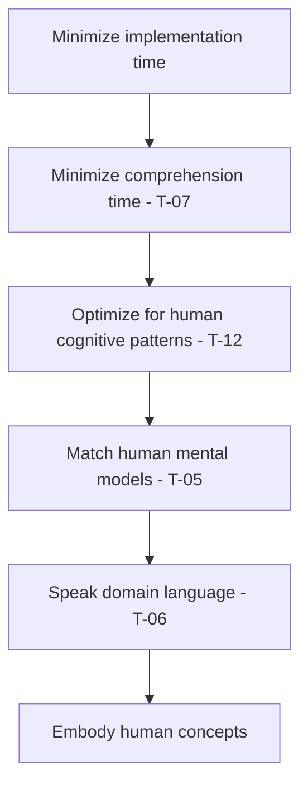
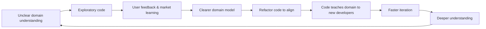

# Derived: Action Selection

Praxis (informed action) is a function of the model. The model's role is not merely to represent the environment but to generate actions — either implicitly (from internalized patterns) or through explicit deliberation. The degree to which effective praxis flows from the model without deliberative computation is *action fluency*.

## Formal Expression

*[Derived (action-selection, from agent-model completeness)]*

$$a_t = \pi(M_t) \quad \text{(deterministic)}$$

$$a_t \sim \pi(\cdot \mid M_t) \quad \text{(stochastic)}$$

where $\pi$ is the agent's **policy** — the mapping from model state to action.

This is not imposed on the system but follows from #agent-model: $M_t$ is the agent's compressed history, and action depends on what the agent "knows" — i.e., on $M_t$. Any deterministic or stochastic dependence of action on history *through* the model is captured by $\pi(M_t)$.

## Epistemic Status

*Derived* from #agent-model's completeness commitment. If $M_t$ is the agent's complete internal state (by definition), then action — which depends on internal state — is a function of $M_t$. The implicit/explicit distinction and action fluency concept are *discussion-grade* — qualitative properties that follow from the formalism but are not formally derived as propositions.

## Discussion

**Implicit vs. explicit action selection.** A critical distinction emerges from the agent's *action fluency* — the degree to which effective action flows from the model without deliberative computation:

**Implicit (model-embedded):** When $\pi(M_t)$ can be evaluated cheaply — the model has internalized effective action-selection for the current situation. This is Boyd's implicit guidance and control (Orient→Act, bypassing Decide), a trained RL policy in exploitation mode, a well-tuned PID controller, expert intuition (System 1), a martial artist's trained reflexes, an organization's standard operating procedures.

**Explicit (deliberative):** When the situation is novel, the action space is large, or the stakes demand verification — the agent engages in internal simulation, using the model to predict outcomes of candidate actions before selecting. This is Boyd's explicit Decide step, MCTS/planning in RL, Model Predictive Control, human deliberate reasoning (System 2), organizational strategic planning. Deliberation requires at minimum Level 2 epistemic access ( #pearl-causal-hierarchy) — the agent uses its model to simulate "what will I observe if I $do(a)$?" across candidates.

**Formal characterization of action fluency.** An agent has *high fluency* for a situation when additional deliberation yields negligible improvement — formally, when $\Delta\eta^\ast(\Delta\tau) \approx 0$ for all $\Delta\tau \gt 0$ (see #deliberation-cost). Conversely, *low fluency* means deliberation significantly improves action quality. Fluency is the degree to which the agent's immediate (zero-deliberation) action approaches the quality achievable with unbounded deliberation.

**Action fluency is distinct from model sufficiency.** An agent can have high $S(M_t)$ ( #model-sufficiency) but low fluency — a chess engine with a perfect model of the rules still requires expensive search. Conversely, an agent can have moderate sufficiency but high fluency in a narrow domain — a reflex that responds effectively to specific situations it evolved for. What reflexes, muscle memory, intuition, and expertise share is that the *action-generating capacity itself* has been absorbed into the model's structure: the model doesn't just predict well, it *acts* well, cheaply.

**Structural pressure toward implicit action.** When two action-selection modes produce equivalent expected outcomes, the faster mode is preferable (the persistence condition penalizes slower tempo — and in TST, the temporal optimality postulate makes this normative). This creates a pressure: agents under selective pressure (evolution, competition, training) tend to internalize frequently-needed action patterns, converting explicit deliberation into implicit fluency. The pressure is stronger when $\rho$ is high (fast-changing environments penalize deliberation — see #deliberation-cost), the pattern recurs frequently, or $\mathcal{T}$ is near the persistence threshold ( #persistence-condition) with no slack for deliberation overhead.

However, deliberation remains essential when the situation is genuinely novel, the action space is large relative to model capacity (chess, strategic planning), the stakes are asymmetric (cost of error vastly exceeds cost of delay), or $\rho$ is low (stable environment allows deliberation without mismatch accumulation).

**Connection to Section II.** For actuated agents ( #agent-spectrum), action selection involves not just $M_t$ but also $G_t = (O_t, \Sigma_t)$ — the purposeful substate. The policy becomes $\pi(M_t, G_t)$, coupling all substates through action ( #directed-separation). The action-deliberation-exploration tradeoff (Section II gap) extends the implicit/explicit distinction to three modes: exploit (pursue $O_t$ via $\Sigma_t$), explore (improve $M_t$), deliberate (revise $\Sigma_t$).

**Domain instantiations:**

| Domain | Implicit action | Explicit deliberation |
|--------|----------------|----------------------|
| Kalman + LQR | LQR control law from $\hat{x}_t$ | — (separation principle) |
| RL | Greedy policy $\arg\max Q(s,a)$ | MCTS, planning, rollouts |
| PID | $u = K_p e + K_i \int e + K_d \dot{e}$ | — (no deliberation) |
| Boyd's OODA | IG&C (Orient→Act) | Explicit Decide step |
| Organism | Reflexes, habits | Deliberate planning |
| Organization | Standard procedures | Strategic planning |
| Software developer | Known patterns, familiar code | Reading docs, analyzing alternatives |

**(Descended from TF-07.)**
---
slug: action-transition
type: definition
status: axiomatic
depends:
  - agent-environment
stage: deps-verified
---

# Definition: Action and Transition

Actions affect the environment through a transition function that is unknown to the agent and possibly stochastic.

## Formal Expression

*[Definition (action-transition)]*

The **action space** $\mathcal{A}$ is the set of actions available to the agent. Actions affect the environment via the transition function:

$$\Omega_{t+1} \sim T(\cdot \mid \Omega_t, a_t)$$

where:
- $T$ is the (possibly stochastic) transition function
- $\Omega_t$ is the current environment state
- $a_t \in \mathcal{A}$ is the agent's chosen action

*[Definition (transition opacity)]*

The agent does not know $T$ exactly.

## Epistemic Status

This is *definitional*. The transition function $T$ is a modeling device that captures how agent actions couple back into the environment. The stochasticity of $T$ is allowed but not required — deterministic transitions are the special case where $T$ places all mass on a single successor state. The claim that $T$ is unknown to the agent is constitutive of the uncertainty setting, paralleling the epistemic opacity of $h$ ( #observation-function).

## Discussion

**Closing the loop.** Together with #observation-function, this definition completes the agent-environment coupling: the agent observes via $h$ and acts via $T$. The loop $\Omega_t \xrightarrow{h} o_t \rightarrow \text{agent} \xrightarrow{a_t} \Omega_{t+1}$ is the fundamental structure that all subsequent claims build on.

**Uncertainty about $T$ is what makes action non-trivial.** If the agent knew $T$ exactly, action selection would reduce to optimization over a known function. The combination of unknown $h$ and unknown $T$ is what creates the need for adaptive behavior.
---
slug: adaptive-gain-dynamics
type: derivation
status: conditional
depends:
  - update-gain
  - gain-sector-bridge
  - gain-sector-derivation
  - sector-condition-derivation
  - sector-condition-stability
  - sector-persistence-template
  - recursive-update
stage: draft
---

# Derivation: Adaptive-Gain Dynamics — A2' Under a Learning Gain

AAD's gain structure ( #update-gain, #gain-sector-bridge) derives the optimal gain $\eta^\ast$ per regime — the gain is a function of the noise model, chosen to minimize one-step mismatch variance. Real adaptive agents often *learn the noise model itself* (adaptive Kalman), *switch regimes* (IMM), *adapt step-size online* (RMSProp / Adam), or *optimize gain across tasks* (MAML). The gain becomes a state variable with its own update dynamics. The question is whether the sector-persistence machinery extends to this case, and where inside the A2' sub-scope partition adaptive gain sits. The result: sub-scope $\alpha$ splits into $\alpha_1$ (fixed-gain per Prop B.3) and $\alpha_2$ (adaptive-gain under four derivable conditions named (MG-1)–(MG-4)), with sub-scope $\beta$ catching the rest. The two-timescale argument is an augmented-state Lyapunov composition (standard Khalil Thm 4.18), not a Tikhonov reduction — the primary and meta-gain sector conditions compose rather than one being eliminated.

## Formal Expression

### Augmented-state setup

Treat the gain $K_t$ as state. Define $\tilde K_t = K_t - K^\ast$ (error relative to a target optimal gain, specified per case: Riccati-steady-state for adaptive Kalman, EMA-fixed-point for RMSProp, etc.). The augmented state is $z_t = (\delta_t, \tilde K_t)$. Primary and meta-gain dynamics:

$$\dot\delta = -F(\delta; K^\ast + \tilde K) + w(t), \qquad \dot{\tilde K} = -\Phi(\tilde K, \delta) + v(t)$$

where $F$ is the primary correction function (depending on the current gain via its argument), $\Phi$ is the gain-update contraction, $w$ is primary-channel disturbance, $v$ is gain-channel disturbance (estimator noise, innovation variability, etc.).

### Meta-gain sector conditions (MG-1)–(MG-4)

*[Formulation (meta-gain-conditions, extend A2' to adaptive-gain setting)]*

**(MG-1) Primary sector floor under bounded gain error.** There exist $\underline\alpha \gt 0$ and $r_K \gt 0$ such that for all $\lVert\tilde K\rVert \leq r_K$ and $\lVert\delta\rVert \leq R$:

$$\delta^T F(\delta; K^\ast + \tilde K) \geq \underline\alpha \lVert\delta\rVert^2$$

— A2' uniform in the gain-error ball. The sector floor is preserved across the gain-state range the meta-learner visits.

**(MG-2) Meta-gain sector condition.** The gain-update map $\Phi$ satisfies (T1) (zero at $\tilde K = 0$) and a local sector bound:

$$\tilde K^T \Phi(\tilde K, \delta) \geq \alpha_K \lVert\tilde K\rVert^2 \quad \text{for } \lVert\tilde K\rVert \leq r_K, \text{ uniformly in } \lVert\delta\rVert \leq R$$

with $\alpha_K \gt 0$. This is a sector condition in the gain-error state — the adaptive-gain analog of A2' itself.

**(MG-3) Timescale separation.** $\alpha_K \ll \underline\alpha$. The gain adapts slower than the primary state contracts. This is #temporal-nesting's convergence constraint transcribed onto Lyapunov decay rates instead of event rates.

**(MG-4) Coupling boundedness.** The gain-channel disturbance $v(t)$ has bounded contribution from the primary state:

$$\mathbb E[\lVert v(t)\rVert^2 \mid \delta] \leq \sigma_{K,0}^2 + c_v \lVert\delta\rVert^2$$

for some $c_v \geq 0$. (MG-4) with $c_v = 0$ is clean two-timescale decoupling; $c_v \gt 0$ is $\delta$-coupled meta-gain disturbance (RMSProp near minimizer), requiring fixed-point closure.

### Composed persistence result

*[Derived (augmented-state-persistence, from sector-persistence-template applied twice with coupling)]*

Under (MG-1)–(MG-4), the augmented state $z = (\delta, \tilde K)$ is ultimately bounded in mean square. The Lyapunov candidate $V(z) = \tfrac{1}{2}\lVert\delta\rVert^2 + \tfrac{c}{2}\lVert\tilde K\rVert^2$ for appropriate weight $c$ satisfies, along trajectories:

$$\dot V \leq -\underline\alpha \lVert\delta\rVert^2 - c\alpha_K \lVert\tilde K\rVert^2 + \rho\lVert\delta\rVert + c(\sigma_{K,0} + \sqrt{c_v}\lVert\delta\rVert)\lVert\tilde K\rVert$$

Complete-the-square on the cross term (requires $c\sqrt{c_v}$ small compared to $\underline\alpha \cdot c\alpha_K$, i.e., (MG-3) timescale separation plus (MG-4) coupling smallness):

$$\dot V \leq -\tfrac{\underline\alpha}{2}\lVert\delta\rVert^2 - \tfrac{c\alpha_K}{2}\lVert\tilde K\rVert^2 + \frac{\rho^2}{2\underline\alpha} + \frac{c\sigma_{K,0}^2}{2\alpha_K}$$

Standard Lyapunov ultimate-boundedness (Khalil 2002 Thm 4.18) applied to the augmented state gives the composed persistence bound. Both $\delta$ and $\tilde K$ are ultimately bounded with explicit bounds in $(\underline\alpha, \alpha_K, \rho, \sigma_{K,0}, c_v)$. $\square$

### A2' sub-scope partition: $\alpha_1$ / $\alpha_2$ / $\beta$

*[Formulation (sub-scope-refinement)]*

The adaptive-gain analysis refines #sector-condition-derivation's A2' sub-scope partition into three tiers:

**Sub-scope $\alpha_1$ — fixed-gain, A2' derived.** #gain-sector-bridge Prop B.3's current scope: the gain $K$ is treated as a static function of fixed noise model parameters. A2' is derived from B1 directional fidelity. Covers Kalman with known $(Q, R)$, conjugate-Bayesian updates, exponential-family MLE, linear correction with PD $KH$, strongly-convex-gradient fixed-step-size.

**Sub-scope $\alpha_2$ — adaptive-gain, A2' derived through augmented-state Lyapunov.** When (MG-1)–(MG-4) hold with all four conditions derivable from the update-rule structure:

- Adaptive Kalman with Mehra-type innovation-based $(Q, R)$ estimator under timescale separation
- RMSProp/Adam with strongly-convex loss, large $\beta$ (slow EMA), and coupling-smallness; AMSGrad fix (Reddi et al. 2018) structurally a meta-gain repair preserving (MG-1)
- Any adaptive-gain scheme admitting a clean (MG-1)–(MG-4) derivation from the update rule

For these, A2' is derived at the augmented-state level, not merely assumed. Setting $\tilde K \equiv 0$ recovers sub-scope $\alpha_1$ cleanly.

**Sub-scope $\beta$ — A2' assumed (possibly under scope narrowing).** When any of (MG-1)–(MG-4) must be assumed per-agent rather than derived. Concrete instances:

- MAML outer loop: meta-loss non-convex even under per-task convexity (Fallah et al. 2020), so (MG-2) cannot be derived from per-task structure. Inner loop is $\alpha_1$; outer loop is $\beta$.
- IMM regime transitions: (MG-1) fails uniformly in time during posterior-reconcentration windows of duration $\tau_{\text{IMM}}$. Between-transition regime is $\alpha_2$; across-transition window is $\beta$ (scope narrowing via dwell-time + impulsive-disturbance absorption).
- Adam without AMSGrad on ill-conditioned problems: (MG-1) fails under aggressive-$\beta$ + small-gradient-noise (Reddi et al. 2018 counterexample).
- Rule-based / PID / human-judgment adaptive gains: no structural argument for either (MG-1) or (MG-2); both must be assumed.

This refinement preserves the existing A2' sub-scope $\alpha$ as a specialization ($\alpha_1$) and identifies a derivable adaptive-gain extension ($\alpha_2$) with honest fallback to $\beta$ when the derivability conditions fail.

### Structured cases

*[Derivation (case-adaptive-kalman-alpha2)]*

**Case A — Adaptive Kalman with Mehra estimator.** Scalar linear-Gaussian setting with unknown $(Q^\ast, R^\ast)$. The innovation-based Mehra estimator (Mehra 1970, 1972; Dunik et al. 2021 for identifiability) yields $\hat Q_t, \hat R_t$ from a sliding-window autocorrelation of the innovation sequence. For window length $N$, the gain-update map to first order in $\tilde K$ is a scalar Ornstein-Uhlenbeck process:

$$\tilde K_{t+1} = (1 - \lambda_N) \tilde K_t + \lambda_N \eta_t^{\text{inn}}$$

with $\lambda_N \asymp 1/N$ (contraction rate set by window length) and $\eta^{\text{inn}}$ zero-mean innovation noise with variance $O(1/N)$. This is itself an instance of #sector-persistence-template with:

- (T1): $\Phi_K(0) = 0$ — when gain is optimal, estimator returns optimal in expectation.
- (T2): $\tilde K \cdot \Phi_K(\tilde K) = \lambda_N \tilde K^2$, so $\alpha_K = \lambda_N$.
- (T3-S): bounded stochastic disturbance on the gain channel.

Prop A.1S applied to the meta-gain channel gives $R^\ast_{S,K} \asymp 1/\sqrt N$ — the classical Mehra asymptotic rate, now derived from (MG-2). Primary sector floor is preserved: $\underline\alpha = K^\ast - \lvert\tilde K\rvert_{\max}$ via triangle. Composed persistence via augmented-state Lyapunov gives $O(1/\sqrt N)$ degradation from the fixed-gain case. **This case is derived at sub-scope $\alpha_2$.**

Under Mehra non-identifiability (rank-deficient transform matrix; see Zagrobelny-Rawlings 2015, Dunik et al. 2021), (MG-2) fails structurally — an instance of the #discussion-identifiability-floor pattern on the meta-gain channel.

*[Derivation (case-rmsprop-alpha2-conditional)]*

**Case B — RMSProp on strongly-convex loss.** The per-step effective step is $\eta_t^{\text{eff}} = \eta_t/(\sqrt{v_t} + \varepsilon)$ where $v_t = \beta v_{t-1} + (1-\beta)\hat g_t^2$ tracks the second moment. Near the minimizer, $\mathbb E[\hat g_t^2] \to \lVert\nabla L\rVert^2 + \sigma_g^2$. Writing $\tilde v_t = v_t - \mathbb E[\hat g_t^2]$:

$$\tilde v_{t+1} = \beta \tilde v_t + (1-\beta)(\hat g_t^2 - \mathbb E[\hat g_t^2]) + \beta(\mathbb E[\hat g_{t-1}^2] - \mathbb E[\hat g_t^2])$$

The first two terms give (MG-2) with $\alpha_v = 1 - \beta$ and $\sigma_v^2 \asymp (1-\beta)^2 \text{Var}(\hat g_t^2)$. The third is $\delta$-coupled: $\mathbb E[\hat g_t^2]$ depends on $\delta$ through $\lVert\nabla L\rVert^2$, giving $c_v \gt 0$ in (MG-4).

Composed persistence under design conditions $\beta$ close to 1 (slow EMA) and $\lambda_{\max}(H) \cdot R^\ast_S \ll \sqrt{\sigma_g^2}$ (coupling smallness): fixed-point closure between primary $R^\ast_S$ and meta-gain $R_v$ yields existence of a stable equilibrium. Sub-scope $\alpha_2$ under design conditions.

Outside those conditions (aggressive $\beta$ + ill-conditioning + small gradient noise — Reddi et al. 2018's Adam counterexample), fixed-point iteration diverges. **AMSGrad's monotonicity on $v_t$ is structurally a meta-gain repair that restores (MG-1) by construction** — preserving sub-scope $\alpha_2$ by forcing a condition (MG-1) the vanilla algorithm would violate.

*[Sketch (case-imm-alpha2-plus-dwelltime)]*

**Case C — IMM / regime-switching Kalman.** Mixture of $M$ Kalman filters with Markov-transition posterior over regimes. Between regime transitions, the posterior concentrates on the true regime and the effective gain approaches the regime-conditional optimum: sub-scope $\alpha_2$ in the steady portion with Mehra-style derivation. Across regime transitions, posterior re-concentration takes $\tau_{\text{IMM}} \asymp 1/(1-p)$ observations (self-loop probability $p$); during this window (MG-1) fails uniformly in time — the gain can be aligned with the wrong regime. Scope narrowing via dwell-time + impulsive-disturbance absorption: regime stable for $T_{\text{dwell}} \gg \tau_{\text{IMM}}$, transient mismatch bounded by counting-argument. Sub-scope $\alpha_2$ between-transition; $\beta$ across-transition.

*[Classification (case-maml-mixed)]*

**Case D — MAML inner-outer structure.** Inner loop (per-task adaptation with $k$ gradient steps) — sub-scope $\alpha_1$ from Prop B.4 under per-task convexity. Outer loop (meta-parameter update via gradient on meta-loss $\sum_i L_i(\theta_i'(\theta))$) — Fallah et al. 2020's convergence analysis shows the meta-loss is non-convex even under per-task convexity because of the non-linearity of inner-loop updates in $\theta$. (MG-2) is not derivable from per-task structure. Outer loop is $\beta$ — A2' assumed per basin.

### What Is Derived vs. What Is Chosen

| Property | Source | Strength |
|---|---|---|
| Augmented-state setup $z = (\delta, \tilde K)$ with coupled sector dynamics | Definitional reformulation extending #recursive-update + #update-gain | Formulation choice |
| (MG-1) primary sector floor under bounded gain error | Derived in Cases A and B via triangle / $\varepsilon$-floor arguments | Derived (per case, conditional on regularity) |
| (MG-2) meta-gain sector condition | Derived in Cases A (Mehra OU) and B (EMA second-moment) from estimator structure | Derived (per named case) |
| (MG-3) timescale separation $\alpha_K \ll \underline\alpha$ | Design condition on estimator window / EMA rate; Lyapunov decay-rate transcription of #temporal-nesting | Formulation (design condition; violations dissolve composition) |
| (MG-4) coupling boundedness of gain-channel disturbance | Decoupled ($c_v = 0$) in Case A; $\delta$-coupled ($c_v \gt 0$) in Case B with fixed-point closure | Derived (per case) |
| Composed augmented-state persistence under (MG-1)–(MG-4) | Quadratic Lyapunov on $z$ + Khalil 2002 Thm 4.18 ultimate-boundedness | Derived (conditional on MG-1 through MG-4) |
| Sub-scope refinement $\alpha_1$ / $\alpha_2$ / $\beta$ | Extension of current #sector-condition-derivation $\alpha/\beta$ partition | Formulation (classification) |
| $\alpha_2$ reduces to $\alpha_1$ under $\tilde K \equiv 0$ | Direct substitution into augmented-state setup | Proved |
| Case A (adaptive Kalman): sub-scope $\alpha_2$ under identifiability + window-length timescale separation | Mehra OU-form of estimator + Prop A.1S | Derived |
| Case B (RMSProp): sub-scope $\alpha_2$ under design conditions; $\beta$ otherwise; AMSGrad as meta-gain repair | EMA second-moment derivation + fixed-point closure + Reddi et al. 2018 counterexample | Derived (conditional); AMSGrad framing is discussion |
| Case C (IMM): sub-scope $\alpha_2$ between-transition + $\beta$ across-transition via dwell-time | Posterior re-concentration + impulsive-disturbance absorption | Sketch |
| Case D (MAML): inner-loop $\alpha_1$ + outer-loop $\beta$ | Fallah et al. 2020 meta-loss non-convexity | Classification (not derivation) |
| Mehra non-identifiability as meta-gain #discussion-identifiability-floor instance | Rank-deficient transform matrix blocks (MG-2) derivation | Discussion (candidate floor instance) |

## Epistemic Status

*Conditional.* Max attainable: *derived* for the composed persistence result under (MG-1)–(MG-4); *exact* for Case A (adaptive Kalman) under Mehra identifiability; *conditional* for Case B (RMSProp) under design conditions; *sketch / classification* for Cases C (IMM) and D (MAML).

The core claim — that (MG-1)–(MG-4) together give an augmented-state sector-persistence result via standard Khalil Thm 4.18 — is a clean application of two-timescale Lyapunov analysis to the gain-as-state formulation. The mathematical core is textbook (vector Lyapunov, augmented-state dissipation, completing-the-square on cross terms). The contribution is the AAD-framing: (i) naming the four conditions that make adaptive gain composable with sector-persistence, (ii) identifying which adaptive-gain schemes satisfy all four from update-rule structure (Cases A, B-design) and which require assumption (Cases C-transition, D-outer, rule-based), and (iii) refining the A2' sub-scope partition into $\alpha_1$/$\alpha_2$/$\beta$ as a principled extension rather than overhaul.

**Imported machinery, acknowledged.** The underlying techniques — two-timescale stochastic approximation (Borkar 1997, 2008), adaptive filtering (Mehra 1970–72; Mohamed-Schwarz 1999; Dunik et al. 2021), MRAC stability theory (Narendra-Annaswamy 1989; Ioannou-Sun 1996), non-convex meta-learning convergence (Fallah et al. 2020; Ji-Yang-Liang 2022) — are standard in control theory and ML. AAD's value-add here is the integration: connecting these techniques to #sector-persistence-template via the augmented-state Lyapunov composition, and producing a sub-scope partition that matches AAD's scope-honesty architecture rather than importing the techniques' native terminology. The existing sub-scope $\alpha$ / $\beta$ partition from #sector-condition-derivation becomes $\alpha_1$ / $\alpha_2$ / $\beta$, with $\alpha_2$ labeling the newly-derivable adaptive-gain region.

**What this does not establish:**

- Convergence rates beyond ultimate-boundedness (the bound gives stability, not speed).
- Behavior under (MG-3) violation — fast-adapting gain on a slow primary state — which is structurally different (the composite system becomes singular-perturbation pathological, not sector-persistent).
- Rigorous fixed-point closure for the Case-B $\delta$-coupled case; the qualitative argument is clear but quantitative bounds on when the closure exists are per-problem.
- Composition at the multi-agent level — the augmented-state Lyapunov is for a single adaptive agent; team adaptive-gain (simultaneous meta-learning across agents) is beyond scope.

## Discussion

**Why this is not a singular-perturbation reduction.** Singular perturbation theory (Tikhonov 1952; Khalil 2002 Ch. 11) replaces fast dynamics with their quasi-steady-state manifold — the fast variable is *eliminated* in the slow reduction. The augmented-state analysis here does something different: it *keeps both states* and bounds their joint persistence via a weighted Lyapunov. Tikhonov gives "the fast variable tracks its slow manifold up to $O(\epsilon)$"; template-composition gives "each level's state is ultimately bounded with coupling-amplified disturbance" — the persistence-flavored statement aligned with AAD's other persistence results. They answer different questions; both are useful; neither replaces the other. #multi-timescale-stability's current sketch leans toward the Tikhonov framing; this segment adds the template-composition framing as an alternative.

**Three timescale patterns in AAD.** #multi-timescale-stability distinguishes model-class (slow) and parametric (fast) timescales. This segment introduces a *third* pattern: gain-parameter timescale, sitting between parametric-correction (fastest) and model-class (slowest). Adaptive gain is a different two-timescale pattern from structural adaptation — the gain is a parameter of the update rule, not of the model class. The convergence constraint $\nu_{n+1} \ll \nu_n$ from #temporal-nesting translates in this segment to $\alpha_K \ll \underline\alpha$ on Lyapunov decay rates, which is the (MG-3) condition.

**Meta-gain scope-honesty failure modes.**
- *Identifiability failures* on the meta-gain channel (Mehra non-identifiability) are instances of the #discussion-identifiability-floor pattern: a structural no-go (non-identifiability) on the meta-gain channel blocks the sub-scope $\alpha_2$ derivation. AMSGrad as a meta-gain repair is the constructive complement — an added structural condition (monotonicity on $v_t$) that restores (MG-1) and keeps the adaptive scheme in $\alpha_2$.
- *Non-convex meta-losses* (MAML outer loop) put the outer loop in sub-scope $\beta$: A2' must be assumed within a basin, not derived from the meta-loss's global structure. This is the honest scope-narrowing posture — different from saying "it works" or "it doesn't" without qualification.
- *Regime transitions* (IMM across switches) violate (MG-1) uniformly in time during posterior re-concentration windows. Repair via dwell-time is clean but significant scope narrowing.

**Connection to #strategy-persistence-schema's $\alpha_\Sigma = 1/(n+1)$.** The strategy-edge persistence condition has $\alpha_\Sigma$ decaying with experience — this is adaptive gain of a specific form, where the gain (effective update rate per edge) is a function of accumulated pseudo-count. Without forgetting, $\alpha_\Sigma \to 0$ and (MG-1) fails asymptotically. #strategy-persistence-schema's forgetting prerequisite $(1-\lambda) \gt \rho_\Sigma/R_\Sigma$ is precisely the condition that keeps strategy-edge adaptation in sub-scope $\alpha_2$ rather than letting it fall to $\beta$ as $n$ grows.

**Relation to catastrophic forgetting via EWC.** Elastic Weight Consolidation (Kirkpatrick et al. 2017) introduces a per-parameter stability-weighted update: gain is scaled by inverse Fisher information of prior tasks. In AAD vocabulary, EWC is a tensor-valued adaptive gain with stability weighting, distinct from the scalar adaptive-gain case treated here but fitting the same augmented-state framework with (MG-1)–(MG-4) reinterpreted per-parameter. Adapting the present derivation to EWC would tensorize the Lyapunov argument — a natural but not-yet-executed extension.

## Working Notes

- **Identifiability as meta-gain obstruction.** Mehra non-identifiability for certain system structures (Dunik et al. 2021) is an instance of #discussion-identifiability-floor on the meta-gain channel — a structural no-go blocking (MG-2) derivation. Candidate for explicit cross-reference in #discussion-identifiability-floor's §"Adjacent Floors" as a fourth derived instance (after F1 CHT no-go, F13 Cramér-Rao mixture-identifiability, and Regime II-b misspecification-cost from #interaction-channel-classification).
- **Rate-specific results.** The composed persistence result is a bound, not a rate. Can the $1/\sqrt N$ rate of Mehra-adaptive-Kalman be derived rigorously from the augmented-state Lyapunov? Classical Mehra asymptotics give it directly; deriving it from (MG-1)–(MG-4) would confirm the framework's completeness.
- **Adversarial adaptive-gain.** If the environment adversarially varies $K^\ast$ (hostile regime-switching cadence), dwell-time repair of Case C fails. Adversarial-tempo-advantage analog at the meta-gain level: faster meta-gain tracking beats faster environmental regime switching iff $\alpha_K T_{\text{dwell}}$ exceeds the transition rate. Not derived here; adjacent spike.
- **Discrete-time form.** Everything above is continuous-time. Discrete-time version involves the Lipschitz bound of #discrete-sector-condition on both $F$ and $\Phi$. Extension is mechanical but deferred.
- **Relationship to #strategy-persistence-schema time-varying $\alpha$.** #strategy-persistence-schema's $\alpha_\Sigma = 1/(n+1)$ decay is a concrete instance of adaptive-gain dynamics where (MG-1) fails asymptotically without forgetting. Worth re-reading that segment through the $\alpha_2$ lens; the forgetting prerequisite is the specific move that keeps strategic adaptation in $\alpha_2$ as $n$ grows.
- **Template-composition as general technique.** The augmented-state weighted-Lyapunov argument is a general two-timescale composition technique for #sector-persistence-template. It composes two template instances with a cross-coupling bound. A generalization to three or more timescales (inner loop + outer loop + meta-meta-loop, or fast + gain + slow + structural) would give a chain-composition form; not derived here but structurally available.
- **AMSGrad as $\alpha_2$-preserving meta-gain repair.** Characterizing AMSGrad as "enforce (MG-1) by construction" is a clean AAD-framing of a pragmatically-motivated algorithm. Worth noting as an example of adaptive-gain schemes being AAD-classifiable by which of (MG-1)–(MG-4) they structurally ensure vs leave to luck.
---
slug: adaptive-tempo
type: definition
status: exact
depends:
  - update-gain
  - event-driven-dynamics
stage: claims-verified
---

# Definition: Adaptive Tempo

The effective rate at which an agent acquires useful information from its environment — the product of observation frequency and update quality across all channels.

## Formal Expression

*[Definition (adaptive-tempo)]*

$$\mathcal{T} = \sum_k \nu^{(k)} \cdot \eta^{(k)*}$$

where:
- $k$ indexes the agent's distinct observation channels
- $\nu^{(k)}$ is the event rate on channel $k$
- $\eta^{(k)\ast}$ is the optimal update gain on channel $k$ ( #update-gain)

Single-channel special case: $\mathcal{T} = \nu \cdot \eta^\ast$.

## Epistemic Status

This is a *definition*. It names the quantity that characterizes an agent's total corrective capacity, combining loop speed ($\nu$) and epistemic quality ($\eta^\ast$). The definition itself is not a truth-claim; the substantive claims are in the results that use it ( #persistence-condition, #adversarial-tempo-advantage).

## Discussion

**Speed-quality substitutability.** An agent can achieve the same tempo via a fast noisy loop (high $\nu$, low $\eta^\ast$) or a slower calibrated one (low $\nu$, high $\eta^\ast$). The product structure means improvements to *both* factors compound multiplicatively.

**Observation noise gating.** Because $\eta^\ast = U_M / (U_M + U_o)$, high observation noise ($U_o$) depresses gain and collapses tempo regardless of loop speed. You cannot outrun a bad observation channel by iterating faster. This grounds Boyd's emphasis on Orient quality over raw OODA speed.

**Centrality.** Tempo is AAD's core capacity metric. It appears on the left side of the persistence condition ( #persistence-condition), determines adversarial advantage ( #adversarial-tempo-advantage), and connects to code quality as observation infrastructure ( #code-quality-as-observation-infrastructure — cross-component reference, see `02-tst-core/`) in the software domain. The strategic analog $\mathcal{T}_\Sigma$ ( #strategic-tempo) extends the same structure to strategy-edge revision, with the key difference that strategic edge rates are endogenous (depend on action policy and upstream success).

**Temporal nesting.** Adaptive processes stratify by timescale, with convergence constraints between levels ( #temporal-nesting).

**Mismatch dynamics.** The evolution of mismatch over time is governed by the balance between correction (via tempo) and disturbance ($\rho$) ( #mismatch-dynamics).

**Channel independence assumption.** The additive formula assumes informationally independent channels — each channel contributes non-redundant correction capacity. When channels are correlated (overlapping sensors, repeated teammate reports, redundant telemetry), the additive formula *overcounts* effective tempo. The correct tempo satisfies:

$$\mathcal{T} \leq \sum_k \nu^{(k)} \cdot \eta^{(k)*}$$

with equality iff channels are informationally independent. The gap is the *redundancy penalty* — the effective correction capacity lost to overlapping information. For two correlated channels, the penalty involves the mutual information $I(e^{(1)}; e^{(2)} \mid M_{\tau^-})$ between their event streams conditioned on the current model. Since tempo is the core capacity variable (appearing in the persistence condition, adversarial dynamics, and composition), this overcounting inflates margins wherever channel independence fails. The additive formula remains an upper bound and is exact when channels measure genuinely different aspects of the environment. Multi-agent composition ( #team-persistence) inherits this limitation: the communication tempo contribution is additive in the same sense and overcounts when different allies report correlated information.

**Scalar vs. vector tempo.** The scalar $\mathcal{T}$ assumes isotropic correction capacity. When the agent corrects some dimensions faster than others, scalar tempo overestimates effective adaptation along weak dimensions. *[Empirical Claim]* Simulation confirms: in an anisotropic 3D system (gain varying 5:1), scalar $\rho/\mathcal{T}$ overestimated by 72%, with the weak dimension accounting for 84% of total mismatch ( #simulation-results). The correct formulation is per-dimension: $\mathcal{T}_k \gt \rho_k / \delta_{\text{critical},k}$ ( #per-dimension-persistence).

**(Descended from TF-11.)**---
slug: adversarial-destabilization
type: derived
status: conditional
depends:
  - sector-condition-stability
  - sector-condition-derivation
  - sector-persistence-template
  - adaptive-tempo
stage: draft
---

# Derived: Adversarial Destabilization

When two agents are coupled such that one's praxis contributes to the other's disturbance rate, the faster agent can generate aporia in the target faster than the target's epistrophe can resolve it — driving the target outside its invariant region and causing the correction mechanism to break down entirely.

## Formal Expression

This segment is the sector-persistence template ( #sector-persistence-template) applied with coupling-amplified disturbance: $\rho_B = \rho_{B,\text{base}} + \gamma_A \mathcal T_A$ (Model D) or $\sigma_B = \sigma_{B,\text{base}} + \gamma_A \mathcal T_A$ (Model S). The destabilization threshold is the **negation** of the template's persistence condition for agent $B$: destabilization occurs precisely when the coupling-amplified disturbance violates $\alpha_B R_B \gt \rho_B$. Persistence and destabilization are the same inequality viewed in opposite directions. The superlinear adversarial scaling ( #adversarial-tempo-advantage) follows from the template's $1/\alpha$ (Model D) versus $1/\sqrt{\alpha}$ (Model S) scaling, not from separate derivation.

*[Derived (adversarial-destabilization, from sector-persistence-template)]*

**Setup.** Both agents satisfy the single-agent sector-persistence template ( #sector-persistence-template) with parameters $(\alpha_A, R_A)$ and $(\alpha_B, R_B)$. Coupling amplifies $B$'s effective disturbance rate by $\gamma_A \cdot \mathcal{T}_A$; destabilization is the negation of the template's persistence condition $\alpha_B R_B \gt \rho_B^{\text{eff}}$ for $B$. See #adversarial-exponent-regimes for regime taxonomy.

### Model D: deterministic drift coupling

*[Assumption (Coupling Model D)]* $\rho_B = \rho_{B,\text{base}} + \gamma_A \cdot \mathcal{T}_A$. The template's Model D conclusion $R_B^\ast = \rho_B/\alpha_B$ applied with the coupling model yields $B$'s destabilization threshold $R_B^\ast \gt R_B$:

$$\boxed{\;\mathcal{T}_A \;\gt\; \frac{\alpha_B R_B - \rho_{B,\text{base}}}{\gamma_A}\;} \quad \text{(Model D)}$$

Denote $\Delta\rho_B^\ast = \alpha_B R_B - \rho_{B,\text{base}}$, $B$'s adaptive reserve — the template's reserve quantity applied with the baseline disturbance. $\square$

### Model S: stochastic noise coupling

*[Assumption (Coupling Model S)]* $\sigma_B = \sigma_{B,\text{base}} + \gamma_A \cdot \mathcal{T}_A$ — the adversary's tempo increases unpredictability, not systematic direction. The template's Model S conclusion $R_B^\ast = \sigma_B \sqrt{n/(2\alpha_B)}$ (scalar $n = 1$) applied with the coupling yields the destabilization threshold:

$$\boxed{\;\mathcal{T}_A \;\gt\; \frac{R_B \sqrt{2\alpha_B} - \sigma_{B,\text{base}}}{\gamma_A}\;} \quad \text{(Model S)}$$

**Scaling difference.** The Model D threshold is linear in $\alpha_B$; the Model S threshold is linear in $\sqrt{\alpha_B}$ — the same $1/\alpha$ versus $1/\sqrt{\alpha}$ split the template gives for the two disturbance models, propagated through the destabilization negation. This is the direct origin of the $b = 2$ versus $b = 3/2$ exponent distinction in #adversarial-exponent-regimes, not a separate derivation. $\square$

### Unified view

Symmetrically, $B$ destabilizes $A$ when the analogous threshold on $\mathcal T_B$ is exceeded, using whichever model describes $A$'s disturbance. The adversarial outcome depends on whether either agent can push the other past its stability limit.

**Regime selection in practice.** Model D fits situations where adversarial action produces persistent positional shifts (military maneuvering, API changes propagating through dependents, doctrinal initiative). Model S fits situations where adversarial action produces unpredictable perturbations around a stationary level (feints, randomized probing, market volatility). Mixed cases are handled by decomposing the disturbance into drift and noise components and applying both bounds additively.

**Interpretation.** "Getting inside the opponent's OODA loop" has a precise Lyapunov characterization: Agent $A$ destabilizes Agent $B$ when $A$'s praxis, multiplied by coupling effectiveness, generates aporia in $B$ faster than $B$'s epistrophe can resolve it — specifically, when $A$'s tempo times coupling exceeds $B$'s adaptive reserve $\Delta\rho^\ast_B$. This captures:

- **Asymmetric coupling** ($\gamma_A \neq \gamma_B$): an agent with lower tempo but higher coupling effectiveness can still win.
- **Finite reserves**: an agent with very high $\mathcal{T}$ but operating near its model-class limit ($\Delta\rho^\ast$ small) is vulnerable despite high tempo.
- **Structural collapse**: when $R^\ast_B \gt R_B$, the failure mode is not merely "large mismatch" but "correction mechanism breakdown" — connecting to #structural-adaptation-necessity.

### Corollary: The Effects Spiral

When Agent $B$ is driven past its stability boundary ($R^\ast_B \gt R_B$), and $B$'s degrading model causes $B$'s actions to become erratic in a way that increases $A$'s coupling effectiveness ($\gamma_A$ increases with $\Vert\delta_B\Vert$), the result is a positive-feedback Lyapunov instability:

*[Discussion — Mechanism Schematic]*

$$\Vert\delta_B\Vert \uparrow \;\Rightarrow\; B\text{'s actions become erratic} \;\Rightarrow\; \gamma_A \uparrow \;\Rightarrow\; \rho_B \uparrow \;\Rightarrow\; \Vert\delta_B\Vert \uparrow$$

With $\gamma_A$ now an increasing function of $\Vert\delta_B\Vert$, the disturbance term in $B$'s dynamics grows superlinearly. $\dot{V}_B \gt 0$ and increasing — mismatch accelerates away from the stability region. The spiral terminates only when $B$ undergoes structural adaptation ( #structural-adaptation-necessity — changing the model class) or ceases to function as an adaptive agent entirely.

## Epistemic Status

Both Model D and Model S destabilization thresholds are *exact* under their respective coupling assumptions (which treat $\mathcal{T}_A$ as exogenous). The Model D threshold follows from the deterministic sector-condition steady state $R^\ast = \rho/\alpha$ (Prop A.1); the Model S threshold follows from the stochastic sector-condition steady state $R^\ast_S = \sigma\sqrt{n/(2\alpha)}$ (Prop A.1S). Both coupling models (additive to $\rho$ in Model D, additive to $\sigma$ in Model S) are *assumptions* — they decouple the agents rather than modeling the fully coupled dynamical system where both agents' mismatch states co-evolve. The analysis therefore characterizes the *destabilization threshold* (the conditions under which $A$ *can* push $B$ past its stability boundary) rather than the full transient dynamics. This is a worst-case bound, treating $A$ as operating at its steady-state tempo.

The effects spiral (corollary) is *discussion-grade* — the positive-feedback mechanism is qualitatively clear, but formalizing the $\gamma_A(\Vert\delta_B\Vert)$ functional form and proving instability under it requires specifying how an agent's degrading model affects its action quality, which the theory does not yet formalize.

A full coupled Lyapunov analysis with a joint function $V(\delta_A, \delta_B)$ would capture mutual feedback effects but requires specifying how each agent's mismatch state affects the other's disturbance in real time — an open extension.

## Discussion

**Destabilization vs. steady-state ratio.** The destabilization threshold is a failure of *structural persistence* (see Persistence in `LEXICON.md`) — the point where the correction machinery can no longer outpace the adversarially amplified disturbance. An adversary does not need to attack operational persistence (pushing the target near its boundary) or continuity persistence (disrupting identity) directly; destroying structural persistence is sufficient, because without it, operational persistence degrades to zero and the agent ceases to function regardless of its continuity stance. The linear analysis in #mismatch-dynamics gives the steady-state mismatch ratio under coupling: a quantitative result about how much worse $B$ does. This segment gives the qualitative result: under what conditions does $B$ *fail entirely*, not merely fall behind. The linear analysis tells you the score; the Lyapunov analysis tells you when the game is over.

**Connection to #adversarial-tempo-advantage.** The simulation results show the tempo advantage is superlinear (exponent $\approx 2$ in pure adversarial regimes). This Lyapunov result explains WHY: the destabilization threshold creates a phase transition — below it, $B$ persists (possibly with degraded performance); above it, $B$'s correction mechanism collapses entirely, and the effects spiral accelerates the collapse.

**Recipient-side refinement.** This segment's $\gamma_A \mathcal T_A$ scalar increment compresses a richer structure. Per #interaction-channel-classification, events arriving at $B$ fall into four regimes with three independent boundaries (sector-region / model-class / observability). This segment's destabilization story is the Regime II integration — specifically, the magnitude-shock sub-regime (II-a) where $\lVert e\rVert_B \gt R_B$. The structural-shock sub-regime (II-b), where the signal exceeds $B$'s *model-class capacity* regardless of magnitude, produces destabilization via a different mechanism (per #structural-adaptation-necessity's trigger condition at truth) and admits a different repair (structural adaptation, not more tempo). Both sub-regimes manifest as "adaptive reserve exceeded" in the scalar view, but the distinction is load-bearing for diagnosis and repair. The #interaction-channel-classification segment also surfaces an adversarial move this segment's formulation cannot express: *Regime-I-with-adversarial-content* — exploiting $B$'s openness to informative updates by injecting misinformation with adversarially-chosen sign on the log-odds signal. See #interaction-channel-classification Discussion for the full decomposition.

**Agent opacity and coupling effectiveness.** $\gamma_A$ is stated as a parameter but its determinants are not decomposed. One key factor is how *legible* or *opaque* the target agent $B$ is to the adversary $A$. We adopt from Hafez et al. (2026) the backward predictive uncertainty $H_b = H(S, A \mid S')$ as a measure of agent opacity — how many distinct (state, action) pairs produce indistinguishable environment transitions. High $H_b$ means the agent is opaque; low $H_b$ means it is legible. In adversarial settings, $B$'s opacity directly affects $A$'s ability to model $B$'s correction function: low $H_b^{(B)}$ (transparent target) enables targeted disruption that maximizes $\gamma_A$, while high $H_b^{(B)}$ forces $A$ to act against an uncertain model, reducing effective $\gamma_A$. Symmetrically, high $H_b^{(A)}$ (opaque adversary) degrades $B$'s ability to anticipate $A$'s disruptions — increasing the effective observation uncertainty $U_o$ in $B$'s model of $A$. The coupling effectiveness is thus modulated by opacity in both directions: $\gamma_A \propto 1/H_b^{(A)} \cdot 1/H_b^{(B)}$ is a qualitative relationship (precise functional form is open). $H_b$ is the formal dual of observation quality $U_o$: where $U_o$ characterizes how well the agent sees the world, $H_b$ characterizes how well the world sees the agent. See `#agent-opacity` for the formal definition, the sign-flip derivation via signed coupling, the emitter-side four-regime classification, and the 16-cell emitter-recipient composition that operationalizes adversarial-edge-targeting.

**Connection to extreme transition dynamics (Miller 2022).** The effects spiral has a constructive counterpart: the same self-reinforcing coupling mechanism that drives destabilization here can drive *regime transitions* rather than collapse when the coupling is constructive rather than destructive. An environmentally neutral variant accumulates through drift, creating a niche that a mutant in the opposing population exploits — a positive-feedback cascade that rapidly transforms both populations. The Lyapunov coupling model applies to both signs: destructive coupling (this segment) increases $\rho$; constructive coupling ( #team-persistence) decreases it. The difference is sign, not structure. The endogenous emergence of coupling — where $\gamma$ changes as population composition shifts — is the critical extension needed to formalize the full transition motif; it is flagged as a gap in Section III's dynamics (see #structural-adaptation-necessity for the single-agent analog and the dynamics-level gaps enumerated in the OUTLINE).

## Working Notes

- The decoupled analysis (treating $\mathcal{T}_A$ as exogenous) is conservative — it's the best case for $A$. In a fully coupled system, $A$'s actions against $B$ may divert adaptive capacity from $A$'s own mismatch correction, creating a self-limiting effect. The coupled analysis for symmetric adversarial composition is not a Lyapunov problem: it is a fixed-point / equilibrium problem on the joint best-response dynamics, and its formal home is `#strategic-composition`. The effects spiral in this segment's Corollary becomes a joint-Jacobian eigenvalue condition there. **Scope boundary:** `#contraction-template` (the contraction-metric generalization of `#sector-persistence-template`) covers the cooperative half of Section III composition. Adversarial / strategic composition lies structurally outside the contraction-metric framework (saddle-point equilibria are not attracting fixed points; Slotine compositional theorems do not apply); this segment's `#sector-persistence-template` instantiation with coupling-amplified disturbance is the correct tool for the asymmetric-adversarial regime.
- $\gamma_A$ is the product of coupling strength, observability, and action impact — it captures the full spectrum from tightly coupled (direct disruption) to loosely coupled (indirect environmental effects). In the software domain, coupling is precisely measurable from the dependency graph ( #system-coupling).
- The effects spiral is the formal analog of Boyd's cascading disorientation of the slower adversary — the same structural pattern (tempo advantage → destabilization → accelerating breakdown) appears in the Lyapunov analysis. The model captures the pattern; whether it captures the actual mechanisms of human disorientation is an empirical question, not a mathematical one. Future work should formalize the $\gamma_A(\Vert\delta_B\Vert)$ relationship to make the spiral a result rather than a discussion-grade observation.

*(Descended from TFT Appendix A, Prop A.3 and Cor A.3.1.)*
---
slug: adversarial-exponent-regimes
type: result
status: conditional
depends:
  - adversarial-destabilization
  - adversarial-tempo-advantage
  - adaptive-tempo
  - persistence-condition
  - sector-condition-derivation
stage: draft
---

# Result: Adversarial Exponent Regimes

The adversarial tempo advantage exponent — the power $b$ in $\lVert\delta_B\rVert / \lVert\delta_A\rVert \sim (\mathcal T_A / \mathcal T_B)^b$ — is not a single number. It depends on two structural features of the disturbance: whether the adversarial coupling enters as deterministic drift (Model D) or stochastic noise (Model S), and whether the coupling dominates the base disturbance rate. Three regimes, with the coupling-dominant exponents now derived analytically from the respective disturbance models.

## Formal Expression

*[Derived (adversarial-exponent-regimes, from Model D/S steady states + coupling model; validated by simulation)]*

**Regime 1: Model D (deterministic drift), coupling-dominant.** When adversarial coupling enters as a persistent directional disturbance ($\rho_B = \rho_{\text{base}} + \gamma \cdot \mathcal T_A$, GA-2) and coupling dominates ($\gamma \cdot \mathcal T_B \gg \rho_{\text{base}}$):

$$b = 2 \qquad \text{(simulation: 1.999)}$$

Derived from the Model D steady state $\lVert\delta\rVert_{ss} = \rho/\mathcal{T}$ (Prop A.1). See #adversarial-tempo-advantage.

**Regime 2: Model S (stochastic noise), coupling-dominant.** When adversarial coupling enters through the noise scale of zero-mean perturbations ($\sigma_B = \sigma_{\text{base}} + \gamma \cdot \mathcal T_A$, GA-2S) and coupling dominates:

$$b = \frac{3}{2} \qquad \text{(simulation: 1.481)}$$

Derived from the Model S steady state $\lVert\delta\rVert_{\text{rms}} = \sigma_w/\sqrt{2\mathcal{T}}$ (Prop A.1S). The $1/\sqrt{\mathcal{T}}$ scaling (vs. $1/\mathcal{T}$ for Model D) removes one half-power from the denominator, reducing the exponent from 2 to 3/2. See #adversarial-tempo-advantage.

**Regime 3: Non-coupling-dominant.** When base disturbance is comparable to or exceeds the adversarial coupling ($\rho_{\text{base}} \gtrsim \gamma \cdot \mathcal T_B$):

$$b \to 1.0 \text{ (Model D)} \quad \text{or} \quad b \to 0.5 \text{ (Model S)}$$

The exponent degrades smoothly as the base-to-coupling ratio increases. The asymptotic limits are derived (they reflect the $1/\mathcal{T}$ or $1/\sqrt{\mathcal{T}}$ scaling without the coupling numerator); the smooth interpolation is empirical.

| $\rho_{\text{base}} / (\gamma \cdot \mathcal T_B)$ | Exponent (deterministic) | Exponent (stochastic) |
|:---:|:---:|:---:|
| 0.002 | 1.999 | 1.481 |
| 0.20 | 1.877 | 1.101 |
| 2.0 | 1.445 | 0.791 |
| 6.3 | 1.213 | 0.577 |

## Epistemic Status

*Exact conditional on disturbance model.* The coupling-dominant exponents are derived, not empirical: $b = 2$ follows from the Model D steady state (Prop A.1) and the coupling model; $b = 3/2$ follows from the Model S steady state (Prop A.1S) and the coupling model. The simulation results (6 variants, multiple parameter sweeps) now serve as validation of the derived exponents, not as their epistemic foundation. The non-coupling-dominant limits ($b \to 1$, $b \to 1/2$) are derived asymptotically; the smooth interpolation between coupling-dominant and non-coupling-dominant is empirical. What remains empirical is whether a given real adversarial interaction is better modeled as Model D or Model S — that is a domain question, not a theory question.

## Discussion

**The disturbance model determines the exponent.** The mismatch dynamics ( #mismatch-dynamics) now distinguish two disturbance models: Model D (bounded deterministic, GA-2) with steady-state $\rho/\mathcal{T}$, and Model S (stochastic zero-mean, GA-2S) with steady-state $\sigma_w/\sqrt{2\mathcal{T}}$. The different steady-state scaling is the root cause of the different exponents. This resolves the ambiguity that previously existed in the single-$\rho$ formulation.

**Why the squared law held for the coupling-dominance sweep.** In Variant A, the coupling enters as deterministic drift: $\rho_B = \rho_{\text{base}} + \gamma \cdot \mathcal T_A$, and the steady state is $\Vert\delta_B\Vert = \rho_B / \mathcal T_B$. The ratio $\Vert\delta_B\Vert / \Vert\delta_A\Vert$ in the coupling-dominant limit gives $(\mathcal T_A / \mathcal T_B)^2$ directly.

**Nonlinear correction creates thresholds, not lower exponents.** For saturating, sigmoid, and breakdown correction functions under deterministic drift, the issue is not a reduced exponent but a catastrophic divergence when $\rho$ exceeds the correction capacity ($\rho \gt \mathcal{T} \cdot R$). This is exactly the persistence threshold failure ( #persistence-condition), observed directly in simulation.

**Domain interpretation.** Whether a given opponent's tempo increase causes deterministic drift or stochastic noise depends on the domain:
- Military: an opponent who maneuvers faster creates systematic positional change (drift, $b \approx 2$)
- Market: a competitor who acts unpredictably creates noise in signals ($b \approx 1.5$)
- Software: a fast-changing API creates systematic drift in the codebase state (drift)
- Adversarial ML: an opponent who varies attack vectors increases observation noise ($b \approx 1.5$)

## Working Notes
- The interpolation between drift and noise regimes (Variant B) shows smooth transition, not a sharp boundary. At mixed drift-noise coupling, the exponent lies between the two asymptotes. The drift fraction $f = \mu / (\mu + \sigma)$ continuously parameterizes the transition.
- The exponent of 1.05 from the original sim2 was not a falsification of Corollary 11.2 — it reflected a stochastic model (noise-variance coupling) tested in a non-coupling-dominant regime. The original simulation was testing the wrong regime for the ODE's prediction.
- Simulation code: `../../msc/track-b-nonlinear-sims/variants/variant_ab_drift.py`, `variant_cd_regimes.py`. Results: `variant_ab_results.md`, `variant_cd_results.md`.
---
slug: adversarial-tempo-advantage
type: result
status: conditional
depends:
  - mismatch-dynamics
  - adversarial-destabilization
  - persistence-condition
stage: draft
---

# Result: Adversarial Tempo Advantage

Under adversarial coupling where one agent's actions contribute to the other's disturbance rate, the steady-state mismatch ratio scales superlinearly with the tempo ratio.

## Formal Expression

*[Derived (adversarial-tempo-advantage, from sector-persistence-template + adversarial-destabilization coupling model)]*

**Setup.** Two agents $A, B$ with adaptive tempos $\mathcal T_A, \mathcal T_B$, each instantiating #sector-persistence-template with linear correction ($\alpha = \mathcal{T}$). The adversarial coupling of #adversarial-destabilization enters each agent's effective disturbance:

$$\rho_A^{\text{eff}} = \rho_{\text{base}} + \gamma_B \cdot \mathcal{T}_B, \qquad \rho_B^{\text{eff}} = \rho_{\text{base}} + \gamma_A \cdot \mathcal{T}_A$$

with $\gamma_A, \gamma_B \gt 0$ coupling effectivenesses and $\rho_{\text{base}}$ the shared background rate (asymmetric $\rho_{\text{base}}$ generalizes straightforwardly).

### Model D: Deterministic coupling, $b = 2$

*[Result (adversarial-tempo-advantage, Model D)]*

The template's Model D conclusion $\lVert\delta\rVert_{ss} = \rho^{\text{eff}}/\mathcal{T}$ (linear case, $\alpha = \mathcal{T}$) applied to both agents and ratioed:

$$\frac{\lVert\delta_B\rVert_{ss}}{\lVert\delta_A\rVert_{ss}} = \frac{(\rho_{\text{base}} + \gamma_A \mathcal{T}_A)\,\mathcal{T}_A}{(\rho_{\text{base}} + \gamma_B \mathcal{T}_B)\,\mathcal{T}_B}$$

In the coupling-dominant limit ($\gamma \mathcal{T} \gg \rho_{\text{base}}$) with symmetric coupling ($\gamma_A = \gamma_B$):

$$\frac{\lVert\delta_B\rVert_{ss}}{\lVert\delta_A\rVert_{ss}} \to \left(\frac{\mathcal{T}_A}{\mathcal{T}_B}\right)^2$$

The exponent is $b = 2$: a **squared** tempo advantage. A 2:1 tempo ratio yields a 4:1 mismatch ratio. The faster agent both (a) corrects its own mismatch faster and (b) generates disturbance for the opponent faster — the two effects compound rather than add. $\square$

### Model S: Stochastic coupling, $b = 3/2$

*[Derived (stochastic-tempo-advantage, from sector-persistence-template Model S + coupling)]*

Under Model S the coupling enters the noise scale: $\sigma_B^{\text{eff}} = \sigma_{\text{base}} + \gamma_A \mathcal T_A$. Adversary tempo increases unpredictability, not systematic direction. The template's Model S steady state $\lVert\delta\rVert_{\text{rms}} = \sigma/\sqrt{2\mathcal{T}}$ (linear $\alpha = \mathcal{T}$, scalar $n = 1$) applied to both agents:

$$\frac{\lVert\delta_B\rVert_{\text{rms}}}{\lVert\delta_A\rVert_{\text{rms}}} = \frac{(\sigma_{\text{base}} + \gamma_A \mathcal{T}_A)\sqrt{\mathcal{T}_A}}{(\sigma_{\text{base}} + \gamma_B \mathcal{T}_B)\sqrt{\mathcal{T}_B}}$$

In the coupling-dominant, symmetric limit:

$$\frac{\lVert\delta_B\rVert_{\text{rms}}}{\lVert\delta_A\rVert_{\text{rms}}} \to \left(\frac{\mathcal{T}_A}{\mathcal{T}_B}\right)^{3/2}$$

The exponent is $b = 3/2$. $\square$

**Why 3/2, not 2.** The half-power difference between the template's Model D ($1/\alpha$) and Model S ($1/\sqrt{\alpha}$) scalings propagates through the ratio. Numerator contributes $\mathcal T_A^1$ from the coupling; denominator contributes $\mathcal T_B^{1/2}$ from noise averaging; combined with the $A$-side $1/\mathcal T_A^{1/2}$ gives $\mathcal T_A^{3/2}/\mathcal T_B^{3/2}$.

### Summary of Regime-Dependent Exponents

| Regime | Coupling type | Dominance | Exponent $b$ | Source |
|:---|:---|:---|:---:|:---|
| 1 | Deterministic drift (Model D) | Coupling-dominant | $2$ | Derived above |
| 2 | Stochastic noise (Model S) | Coupling-dominant | $3/2$ | Derived above |
| 3 | Either | Non-coupling-dominant | $\to 1$ (det.) or $\to 1/2$ (stoch.) | Asymptotic limit |

**Regime 3 (non-coupling-dominant).** When $\rho_{\text{base}} \gtrsim \gamma \cdot \mathcal{T}$ (or $\sigma_{\text{base}} \gtrsim \gamma \cdot \mathcal{T}$), the base disturbance dominates and the coupling terms become a perturbation. The mismatch ratio degrades toward $\mathcal T_A / \mathcal T_B$ (linear, $b = 1$) for Model D, or toward $(\mathcal T_A / \mathcal T_B)^{1/2}$ for Model S.

The simulation validation across all three regimes is in #adversarial-exponent-regimes.

## Epistemic Status

Both coupling-dominant exponents are *exact* conditional on their respective disturbance models. The squared law ($b = 2$) is *exact* under Model D (deterministic bounded disturbance, GA-2) with coupling-dominant conditions. The $3/2$ law ($b = 3/2$) is *exact* under Model S (stochastic disturbance, GA-2S) with coupling-dominant conditions, derived from the $1/\sqrt{\alpha}$ steady-state scaling (Prop A.1S in #sector-condition-derivation). Both derivations are straightforward algebra from the respective steady-state formulas and the coupling model. The coupling model itself is an *assumption* — the same one used in #adversarial-destabilization.

The non-coupling-dominant limits ($b \to 1$ for Model D, $b \to 1/2$ for Model S) are derived asymptotically. The smooth transition between regimes is confirmed by simulation ( #adversarial-exponent-regimes) but the interpolation formula is empirical. The transition between regimes is smooth, not sharp.

Max attainable: exact conditional on the disturbance model and coupling model. The result is as strong as its assumptions; no additional work changes the epistemic status without changing the dynamical model.

## Discussion

**Superlinearity is the key result.** The naive expectation — twice as fast yields twice the advantage — is wrong under adversarial coupling. The mechanism is that the faster agent both (a) corrects its own mismatch faster and (b) generates disturbance for the opponent faster. These two effects multiply, producing the squared exponent. Speed advantage is not additive; it compounds.

**Relationship to #adversarial-destabilization.** The steady-state mismatch ratio quantifies how much worse the slower agent does *while both agents persist*. The destabilization threshold ( #adversarial-destabilization) marks where the slower agent fails entirely — its correction mechanism breaks down. Below the threshold, this segment's mismatch ratio applies. Above it, #adversarial-destabilization's Lyapunov divergence takes over. The two results are complementary: this one gives the score; that one gives the game-ending condition.

**Regime dependence is operationally significant.** Whether an adversary's tempo increase produces systematic drift (positional maneuvering, API changes, doctrinal initiative) or unpredictable noise (feints, randomized attacks, market volatility) determines the scaling law. The distinction is not academic — $b = 2$ vs. $b = 3/2$ means a 3:1 tempo ratio yields 9:1 vs. 5.2:1 mismatch ratio. The model predicts that consistent, directional pressure is more effective per unit of tempo than unpredictable disruption.

**Formal analog of OODA-loop observations.** The squared scaling is consistent with Boyd's observation that getting inside the opponent's decision cycle has disproportionate effects. The theory identifies a specific mechanism (multiplicative interaction of correction speed and disturbance generation) and a specific condition (coupling-dominant regime) under which this disproportionality holds. Whether this mechanism is the dominant one in actual adversarial interactions is an empirical question, not a mathematical one.

## Working Notes

- **Channel-independence assumption.** The tempo ratio $\mathcal T_A / \mathcal T_B$ uses scalar tempo, which inherits the channel-independence assumption from #adaptive-tempo. When either agent's observation channels are correlated, the additive formula overcounts their tempo, inflating or deflating the ratio and the derived mismatch advantage. The superlinear exponents ($b = 2$, $b = 3/2$) are exact given the scalar tempos; the caveat concerns whether the scalar tempos themselves are accurate.
- The analysis treats each agent's tempo as exogenous — $\mathcal T_A$ does not change in response to $B$'s actions and vice versa. A fully coupled analysis where both agents' mismatch states co-evolve simultaneously (joint Lyapunov function over $(\delta_A, \delta_B)$) is the open extension. The decoupled result is a worst-case bound for the slower agent: in practice, the faster agent may divert adaptive capacity to generating disturbance rather than correcting its own mismatch, creating a self-limiting effect.
- The stochastic exponent ($b = 3/2$) is now derived from both the AR(1) stationary variance (discrete) and the Itô-Lyapunov analysis (continuous, Prop A.1S). The continuous-time analog (Ornstein-Uhlenbeck) gives the same scaling, confirming the result is not a discretization artifact. The two models (D and S) are unified by the common sector-condition framework with different disturbance assumptions (GA-2 vs. GA-2S).
- Asymmetric coupling ($\gamma_A \neq \gamma_B$) appears as a multiplicative prefactor $\gamma_A / \gamma_B$ that shifts the mismatch ratio without changing the exponent. An agent with lower tempo but higher coupling effectiveness ($\gamma$) can partially compensate — but the squared dependence on tempo dominates for large tempo ratios.

*(Descended from TFT Corollary 11.2.)*
---
slug: agent-environment
type: definition
status: axiomatic
depends: []
stage: deps-verified
---

# Definition: Agent-Environment Coupling

An agent is an entity that receives observations from an environment, maintains internal state, and produces actions that affect the environment. The agent cannot access the environment directly — observations are necessarily lossy. This boundary condition is constitutive: the theory applies where the agent-environment boundary entails information loss.

## Formal Expression

*[Definition (agent-environment)]*

Let $\Omega$ denote the **environment**: the totality of state external to the agent. We make no assumptions about $\Omega$'s structure — it may be continuous or discrete, stationary or non-stationary, deterministic or stochastic, benign or adversarial.

An **agent** is an entity satisfying three conditions:

1. It receives observations from $\Omega$ (perception channel)
2. It maintains internal state (memory/model)
3. It produces actions that affect $\Omega$ (action channel)

*[Definition (information-loss-boundary)]*

The agent cannot access $\Omega_t$ directly. All contact with the environment is mediated through lossy observation. This is not a simplifying assumption — it is a scope condition. Systems where the agent has direct access to full environment state are outside AAD's scope ( #scope-adaptive-system).

## Epistemic Status

This is *definitional* — it establishes the conceptual framework, not a truth-claim. The agent-environment decomposition is a modeling choice that delineates what AAD analyzes. The information-loss boundary is the constitutive commitment: it restricts AAD's scope to systems where the agent faces genuine uncertainty about its environment.

## Discussion

**Why information loss is constitutive.** An agent with perfect access to $\Omega_t$ has no need for a model, no mismatch signal, no adaptation. The entire adaptive machinery of Section I becomes vacuous. The information-loss boundary is what makes the theory non-trivial.

**Generality of $\Omega$.** The environment is deliberately underspecified. $\Omega$ may include other agents, physical systems, software artifacts, or any combination. The only structural commitment is that $\Omega$ is external to the agent and not fully accessible.
---
slug: agent-identity
type: scope
status: robust-qualitative
depends:
  - chronica
  - model-sufficiency
stage: draft
---

# Scope: Agent Identity as Singular Causal Trajectory

AAD applies to agents instantiated on singular causal trajectories. Identity within AAD is grounded not in the model state $M_t$ (which can be copied) but in the unique causal trajectory $\mathcal C_t$ (which cannot).

## Formal Expression

*[Scope (agent-identity, from chronica + model-sufficiency)]*

**Scope commitment.** AAD's formal apparatus presumes each agent is instantiated on a **singular, non-forkable causal trajectory** $\mathcal C_t$ ( #chronica). Sufficiency of the model state $M_t$ ( #model-sufficiency) is defined *relative to* this trajectory — not relative to a model-state equivalence class. Duplicating $M_t$ and exposing the copies to different future events produces two agents with *divergent* causal histories, each of which is a sufficient statistic only for *its own* trajectory.

**Three consequences of the scope commitment:**

1. **Sufficiency is trajectory-indexed.** $S(M_t)$ ( #model-sufficiency) measures against *this* agent's $\mathcal C_t$; not against a hypothetical parallel copy's $\mathcal C_t^{(2)}$.

2. **Model merging is lossy by construction.** Reconciling the models of two agents that share a prefix of their trajectory but have diverged requires choosing which causal history to privilege; no generally optimal merge exists. This is a structural constraint of the scope, not a defect of any particular merge algorithm.

3. **The loop's interventional access depends on the trajectory's singularity.** When the agent acts and observes, the observation is the response to *its* intervention on *its* single trajectory. Replaying a saved $M_t$ against a different event stream is not the same as intervening — the observed consequences are under a different causal trajectory. This grounds the interventional interpretation in #loop-interventional-access: the loop provides Level-2-quality data precisely because the agent is on a singular trajectory, not because of any architectural property of the agent itself.

**Natural extension: parameterization-invariance (PI).** The scope commitment motivates a companion axiom. AAD's predictions concern a singular causal trajectory $\mathcal C_t$; the trajectory itself is coordinate-free, while any parameterization of $M_t$'s internal state space is a modeling convention. Requiring AAD's theorems to be invariant under change of parameterization — *(PI): the theory's conclusions do not depend on arbitrary choice of coordinates on $M_t$* — is a natural axiomatic commitment consistent with (but not directly forced by) the three consequences above. When (PI) is adopted and combined with Čencov's 1982 uniqueness theorem (*Statistical Decision Rules and Optimal Inference*, AMS), the Fisher information metric is uniquely forced on statistical-manifold sub-cases of $M_t$ — which converts Fisher-metric-dependent derivations in #gain-sector-bridge from theorem-imported to AAD-internally-forced, and adds a fourth primary instance to the uniqueness-theorem-forced-coordinate pattern named in #discussion-additive-coordinate-forcing (see that segment's four-instance table for structural positioning). (PI) is a genuine axiomatic choice — its cost is that AAD carries an additional invariance commitment at the scope layer; its benefit is that several Fisher-metric results throughout AAD become derivable rather than imported. The commitment is structurally analogous to the chain-rule-additivity and evidential-additivity axioms that ground the divergence-layer and update-layer Cauchy-FE theorems: each is a natural-from-adjacent-AAD-commitment axiom that a uniqueness theorem then operates on.

**What the scope excludes (or requires additional machinery for):**

- Agents conceived as type/equivalence-class entities (e.g., "the GPT-4 model") rather than token/trajectory entities (e.g., "this particular session with state $M_t$ on trajectory $\mathcal C_t$"). AAD's formal results apply to tokens, not types. Aggregated claims across tokens of the same type require additional machinery (e.g., population-level dynamics; see Section III gaps on latent structural diversity).
- "Clone problem" scenarios where multiple copies of an agent are formally the same until divergence — each copy becomes its own AAD agent at the moment it acquires a distinct event (Discussion below).
- Formal treatment of reincarnation, restoration from backup, or other operations that attempt to transplant $M_t$ across trajectories. AAD's sufficiency machinery does not apply across trajectory discontinuities; such operations are out-of-scope events whose epistemic consequences require separate treatment.

## Epistemic Status

*Robust qualitative.* The scope commitment is structurally clear once stated and is load-bearing for at least one downstream formal result: the interventional interpretation in #loop-interventional-access rests on the singular-trajectory scope, not on any agent-architectural property. The three consequences above follow directly from the scope commitment combined with #chronica's non-forkability and #model-sufficiency's trajectory-indexed definition.

Max attainable: *robust qualitative*. Scope statements are not theorems; they specify what kind of object the theory applies to. Further formalization (e.g., category-theoretic treatment of "agent" as a functor from event-streams to model-states, or explicit type/token distinction in logogenic-agent work) could reach *exact* on the formal structure but would not change the scope content.

Whether the mathematical structure grounds something that deserves to be called "identity" or "continuity of experience" is beyond AAD's scope. The mathematical structure is clear: the feedback loop produces a singular, non-forkable causal trajectory, and model adequacy is defined relative to that trajectory. What this segment specifies is *continuity persistence* in the sense of `LEXICON.md` — whether the agent maintains a coherent identity and trajectory through time, as distinct from the structural persistence of #persistence-condition (can the machinery outpace disturbance?) and operational persistence (is the agent currently within its viable region?).

## Discussion

**The clone problem, precisely stated.** Consider copying an LLM's weights (a concrete $M_t$) exactly. At the moment of duplication, both copies are identical — same model state, same causal history $\mathcal C_t$. But the *very next* event — a different user's message, a different observation — creates two divergent, irreversible causal trajectories $\mathcal C_{t+1}^{(1)}$ and $\mathcal C_{t+1}^{(2)}$. Their Level 2 and Level 3 capacities ( #pearl-causal-hierarchy) now reference different causal pasts. Their sufficiency $S(M_{t+1})$ is measured against different histories. Neither copy's future model state is a sufficient statistic for the other's trajectory.

Within AAD's formalism, identity is not the model state $M_t$ (which can be copied) but the *singular causal trajectory* $\mathcal C_t$ (which cannot). A copy shares a *prefix* of the original's causal history, as a sibling shares early childhood; it does not share the trajectory itself.

**Formal consequences (not merely philosophical):**

- A forked model's sufficiency $S(M_t)$ ( #model-sufficiency) is defined relative to *its own* interaction history. Post-fork, each copy's sufficiency is measured against a different $\mathcal C$.
- Merging divergent models requires reconciling incompatible causal histories — a lossy operation with no generally optimal solution.
- Temporal continuity (one unbroken causal thread) is what gives the model's sufficient statistic its meaning.

**Connection to Section V.** The 100% context turnover problem ( #context-turnover — cross-component reference, see `03-logogenic-agents/`) is a special case: each AI agent session starts a new causal trajectory $\mathcal C_t$ from near-zero. External memory (CLAUDE.md, memory files) transfers a *summary* of previous trajectories' models, but not the trajectories themselves. The non-forkability observation frames this not as a deficiency but as a structural feature of causally-embedded agents.

**(Descended from TF Appendix G.)**
---
slug: agent-model
type: formulation
status: robust-qualitative
depends:
  - agent-environment
  - observation-function
  - chronica
stage: deps-verified
---

# Formulation: The Reality Model

The agent's compressed representation of how the world works, mapping interaction history to model space. $M_t$ is the substrate of prolepsis — the model from which predictions are generated and against which observations are compared. This is a formulation choice — we commit to analyzing the agent as having a complete state $M_t$ that subsumes all retained information from its history.

## Formal Expression

*[Formulation (agent-model)]*

$$M_t = \phi(\mathcal{C}_t)$$

where:
- $\phi: \mathcal{C}^\ast \to \mathcal{M}$ maps interaction history to model space $\mathcal{M}$
- $\mathcal C_t = (o_1, a_1, \ldots, o_t)$ is the chronica ( #chronica) — the complete record of agent-environment interaction
- $\mathcal{M}$ is the space of possible models the agent can hold

The mapping $\phi$ is a many-to-one compression: multiple distinct histories may produce the same model state. This is not a deficiency — it is the essential function of the model: retaining what matters and discarding what does not.

## Epistemic Status

*Robust qualitative.* This is a *formulation* — a representational commitment, not a derived result. We choose to analyze agents as maintaining a state object $M_t$ that mediates between history and future action. Alternative formulations exist (e.g., history-based policies that map $\mathcal C_t$ directly to actions without an explicit model). The formulation is justified by its analytical utility: it enables the information bottleneck analysis ( #information-bottleneck), the mismatch decomposition ( #mismatch-signal), and the gain principle ( #update-gain). The formulation is robust — any agent that conditions its actions on retained information can be described this way — but the specific commitment to a complete, compressed state $M_t$ is a modeling choice, not a derivation.

## Discussion

**$M_t$ is the epistemic substate.** It captures "what the agent believes about reality." Different agents realize $M_t$ differently: a Kalman filter holds a state estimate and covariance matrix; an RL agent holds a value function; a developer holds a mental model of codebase architecture; an LLM agent holds its context window contents plus retrieved memory. The formalism is agnostic to the realization — it asks only that $M_t$ exist as a well-defined object that the agent's policy can condition on.

**Completeness assumption.** By writing $M_t = \phi(\mathcal C_t)$, we assume that $M_t$ captures everything the agent retains from its history. Any information not in $M_t$ is lost to the agent. This is what makes $M_t$ the complete epistemic substate, not merely one component of a richer internal representation. Whether $M_t$ retains *enough* information is the subject of #model-sufficiency.

**Degenerate cases.** A PID controller's $M_t$ is degenerate — it retains only the error signal and its history (integral, derivative), with no predictive capability beyond extrapolating recent trends. It occupies the "blind pursuer" region of the agent spectrum ( #agent-spectrum): its $O_t$ (setpoint) is clear but its $M_t$ is too impoverished to support the adaptive dynamics of Section I. The formalism accommodates this by allowing $\mathcal{M}$ to range from trivial (scalar) to rich (full world model).
---
slug: agent-opacity
type: derived
status: conditional
depends:
  - scope-agent-identity
  - interaction-channel-classification
  - adversarial-destabilization
  - adversarial-tempo-advantage
  - team-persistence
  - directed-separation
  - discussion-identifiability-floor
stage: draft
---

# Derived: Agent Opacity ($H_b$)

Alongside AAD's heavily formalized *forward* observation quality (how well the agent sees the world — observation ambiguity, model-class fitness, identifiability floor on what the agent can infer), AAD carries a **dual quantity** measuring how well the world sees the agent: **backward predictive uncertainty $H_b$**, an observer-indexed, horizon-indexed, trajectory-indexed entropy of the agent's future actions given another agent's filtration. Adopted from Hafez et al. 2026 as a first-class multi-agent quantity. $H_b$ is the dual of observation quality $U_o$: where $U_o$ characterizes how well the agent sees the world, $H_b$ characterizes how well the world sees the agent. It is **sign-flipped in value across regimes**: low $H_b$ (legibility) enables cooperative coordination ( #team-persistence); high $H_b$ (opacity) enables adversarial effectiveness ( #adversarial-destabilization, #adversarial-tempo-advantage). The sign-flip is a direct consequence of AAD's existing signed-coupling structure rather than a separate posit. This segment's emitter-side four-regime classification is the dual of `#interaction-channel-classification`'s recipient-side theory; together they close `#adversarial-edge-targeting` as emitter-optimizer paired with recipient-classifier.

## Formal Expression

*[Definition (agent-opacity-Hb)]*

For agent $A$ on singular trajectory $\mathcal C_A$ and observer agent $B$ with filtration $\mathcal F_B^t$ (per-trajectory observable history per `#scope-agent-identity`'s token-level commitment):

$$H_b^{A \mid B}(t, \tau) := H(a_{A, t+\tau} \mid \mathcal F_B^t)$$

the entropy of agent $A$'s action at horizon $\tau$ conditional on observer $B$'s filtration at time $t$. **Four indexing arguments:** observer $B$, time $t$, horizon $\tau$, trajectory $\mathcal C_A$. Each is load-bearing:

- **Observer-indexed.** Different observers (allies with shared infrastructure; adversaries with limited instrumentation; environment itself) have different filtrations $\mathcal F_B^t$; $H_b$ varies accordingly.
- **Horizon-indexed.** Immediate-next-action opacity ($\tau = 1$) and long-horizon-plan opacity ($\tau \gg 1$) decouple: an agent may be predictable at immediate action but unpredictable at plan level, or vice versa.
- **Trajectory-indexed.** Per `#scope-agent-identity`, AAD applies to agents on singular trajectories. $H_b^{A\mid B}$ is the opacity of *this* trajectory's continuation, not a type-level claim.
- **Time-indexed.** Opacity may drift with learning (as $B$'s model of $A$ improves, $H_b^{A\mid B}(t)$ decreases); steady-state values exist for ergodic regimes.

Under the IDT-observer specialization — $B$ operates as Hafez's Information Digital Twin monitoring $(S_A, a_A, S'_A)$ from outside $A$'s processing — and under ergodicity, $H_b^{A\mid B}(t, \tau) \to H(S, A \mid S')$ as defined in Hafez et al. 2026. AAD's added features (observer-indexing, horizon-indexing, trajectory-indexing) are the distinctive extensions.

### Sign-flip via signed coupling

*[Derived (sign-flip-from-signed-coupling)]*

The value of $H_b^A$ *to $A$* depends on the sign of $A$'s coupling to other agents — the same signed-coupling structure that organizes `#team-persistence`, `#adversarial-destabilization`, and `#critical-mass-composition`'s (CM2) $\gamma$ parameter.

- **Cooperative coupling ($\gamma^{\text{coop}} \gt 0$, reducing allies' disturbance).** For $B$ to treat $A$'s action as cooperation rather than disturbance, $B$ must predict $A$'s action well enough to preempt or complement it. Under `#interaction-channel-classification`'s recipient-side decomposition, unpredictable ally actions fall into Regime II (magnitude/structural shock) rather than Regime I (informative update). Therefore cooperative coupling effectiveness $\gamma_{A \to B}^{\text{coop}}$ is *increasing in legibility*, equivalently decreasing in $H_b^{A\mid B}$. Under sub-scope $\alpha$ Gaussian coupling: $\gamma^{\text{coop, effective}} \propto (1 - H_b^{A\mid B}/H_b^{\max})$.
- **Adversarial coupling ($\gamma^{\text{adv}} \gt 0$, amplifying target's disturbance).** Predicted attacks are neutralized; unpredicted attacks deliver effective disturbance. Adversarial coupling effectiveness is *increasing in opacity* — the mechanism of adversarial advantage (per `#adversarial-tempo-advantage`) operates *through* $B$'s failure to predict $A$. Under the same sub-scope $\alpha$ setup: $\gamma^{\text{adv, effective}} \propto H_b^{A\mid B}/H_b^{\max}$.

**The sign-flip on $H_b$'s value-to-$A$ lives in the sign of $\gamma$ itself, not in a different sign on $H_b$.** Cooperative regime $(\gamma^{\text{coop}} \gt 0)$ rewards low $H_b$; adversarial regime ($\gamma^{\text{adv}} \gt 0$) rewards high $H_b$. The same $H_b$ quantity, the same monotone dependence; opposite value-to-$A$ because the signs of the coupling terms differ.

### Emitter-side four-regime classification

*[Formulation (emitter-regimes, dual to #interaction-channel-classification)]*

Parallel to `#interaction-channel-classification`'s recipient-side four regimes, the emitter $A$ sends events that fall into four emitter-side regimes based on $A$'s opacity signal structure and self-model quality:

- **E-I Broadcast.** $A$ emits actions transparently; $H_b^{A\mid B}$ is low for any observer $B$ with standard instrumentation. Examples: public announcements, published decisions, legible industrial controllers.
- **E-II Selective-signal.** $A$ is transparent to some observers and opaque to others (e.g., shared allied infrastructure gives allies lower $H_b$ than adversaries without that infrastructure). Boundary: differential instrumentation in $\mathcal F_B^t$ across observers.
- **E-III Information-hide.** $A$ is uniformly opaque to observers; actions are randomized, encrypted, or routed through dead-drops. $H_b^{A\mid B}$ near $H_b^{\max}$ for all observers lacking the key / pattern / channel.
- **E-IV Active-deceive.** $A$ emits actions that mispredict — the observer's model of $A$ converges to a *wrong* prediction that differs from the actual action by a larger margin than the same observer's model of the environment would accommodate. Boundary: $A$'s self-model quality (for active-deceive, $A$ must model the observer's model of $A$ well enough to choose actions that exploit it).

The 16-cell emitter-recipient composition (four emitter regimes × four recipient regimes) gives a closed-form *adversarial-targeting arg-max* under `#adversarial-edge-targeting`: the most-valuable-to-attack edge is the one where the product of emitter's opacity-to-target and target's vulnerability-to-shock is maximized. This closes the Section III gap that `#adversarial-edge-targeting` (previously GAP) was reserved for; the segment is now operationalized with targeting-fidelity factor $(1 - H_b^{B\mid A}/H_b^{\max})$ from $A$'s self-model quality plus the four-regime recipient classification from `#interaction-channel-classification`.

### Tempo amplification by opacity

*[Derived (tempo-amplification-by-opacity)]*

`#adversarial-tempo-advantage`'s tempo-multiplier $\gamma_A \mathcal T_A$ in `#adversarial-destabilization` decomposes into a tempo term and an opacity term:

$$\mathcal T_A^{\text{effective}} = \mathcal T_A \cdot \frac{H_b^{A\mid B}}{H_b^{\max}} \quad \text{(Model D adversarial coupling)}$$

The superlinear formula $(\mathcal T_A / \mathcal T_B)^2$ becomes $(\mathcal T_A / \mathcal T_B)^2 \cdot (H_b^{A\mid B} / H_b^{B\mid A})^2$ under bilateral opacity — a higher-order tensor product with the same exponent $b = 2$ (Model D) or $b = 3/2$ (Model S) from `#adversarial-exponent-regimes`. Whether $b$ itself is reshaped under bilateral opacity is open; the leading-order scaling is the tempo-opacity product.

### What Is Derived vs. What Is Chosen

| Property | Source | Strength |
|---|---|---|
| $H_b^{A\mid B}(t, \tau)$ definition | Adopted from Hafez et al. 2026; extended with observer / horizon / trajectory indexing per `#scope-agent-identity` | Formulation choice (adoption + AAD-extension) |
| Reduction to Hafez's $H(S, A \mid S')$ under IDT-observer + ergodic regime | Direct substitution | Derived (exact under IDT + ergodicity) |
| Sign-flip via signed coupling | Cooperative coupling requires predictability (allies preempt); adversarial coupling operates via disturbance-injection (predicted attack is neutralized) | Derived (from existing `#team-persistence` + `#adversarial-destabilization` signed-$\gamma$ structure) |
| Emitter-side four-regime classification | Dual construction to `#interaction-channel-classification`'s recipient-side four regimes | Formulation choice |
| 16-cell emitter-recipient composition closes `#adversarial-edge-targeting` | Product of emitter opacity × recipient vulnerability-to-shock over four × four cells | Derived (arg-max construction) |
| Tempo-amplification leading-order: $\mathcal T^{\text{eff}} = \mathcal T \cdot H_b/H_b^{\max}$ | First-order substitution into `#adversarial-tempo-advantage`'s tempo-multiplier under Model D | Derived (conditional on Gaussian-coupling sub-scope $\alpha$) |
| Parameterization-invariance of $H_b$ | $H_b$ is an action-marginal entropy; action space is coordinate-free per `#scope-agent-identity` | Derived |
| Candidate 4th `#discussion-identifiability-floor` instance (generic observer-side form) | $H_b$'s formal structure — "observer cannot predict agent's future action better than $H_b^{A\mid B}$" — is a CHT-style no-go at the observer-side-inference task | Discussion-grade (framing; precise external theorem not yet identified) |
| Candidate opacity ladder for `#discussion-separability-pattern` | Transparent-core / partial-transparency / full-opacity across observer filtrations | Formulation choice (ladder proposal) |
| Effects-spiral opacity amplification (higher $H_b$ → higher $\gamma_A$ → larger $\dot V_B$ → $B$'s actions become more erratic → observer's model of $B$ degrades → higher $H_b^{B\mid A}$) | Composition of sign-flip derivation with `#adversarial-destabilization`'s effects spiral | Sketch (discussion-grade; specific functional form open) |
| Dual-filtration apparatus (each agent's $M_t$ carries an other-filtration as feature) | Would unify observer-indexing with `#scope-agent-identity`'s single-trajectory formalism more tightly | Open extension (mild architectural, orthogonal to derivations) |
| Sharp functional form for $\gamma^{\text{adv}}_{\text{effective}} = f(H_b)$ | Leading-order: $\gamma \propto H_b$. Exact function depends on sub-scope — Gaussian-coupling linear; sigmoid-coupling saturating | Open per sub-scope |

## Epistemic Status

*Conditional.* Max attainable: *exact* for the Hafez-reduction under IDT + ergodicity; *derived* for the sign-flip via signed-coupling; *formulation choice* for the emitter-regime classification structure; *conditional* for the tempo-amplification formula; *discussion-grade* for the meta-pattern candidate status.

**Load-bearing:**
- The sign-flip derivation from existing signed-$\gamma$ structure is the segment's core structural contribution — the adversarial/cooperative opacity duality is not a separate posit; it falls out of AAD's existing signed-coupling apparatus.
- The emitter-side four-regime classification is a clean dual to `#interaction-channel-classification`; its derivation is parallel (boundaries in AAD-native quantities — emitter opacity signal structure, self-model quality, coupling regime).
- The closure of `#adversarial-edge-targeting` via the 16-cell composition is a derived arg-max; the previously-stated GAP is filled.

**Not established:**
- Sharp functional forms for $\gamma^{\text{adv}}_{\text{effective}}(H_b)$ outside Gaussian-coupling sub-scope $\alpha$.
- Whether $b$ (the adversarial exponent from `#adversarial-exponent-regimes`) is reshaped under bilateral opacity.
- Formal fourth `#discussion-identifiability-floor` instance (requires external-theorem anchoring not yet identified); discussion-grade framing only.
- The effects-spiral's opacity amplification (composition with `#adversarial-destabilization`'s spiral) is sketch-level.

## Honest Limits

- **Observer-indexing under complex information structures.** $\mathcal F_B^t$ may include shared memory, cryptographic keys, insider knowledge, or partial access to $A$'s internal state. Enumerating all relevant observer-filtration structures for a specific application is task-specific; the segment provides the formal framework, not the per-instance enumeration.
- **Active-deceive (E-IV) requires $A$ to model $B$'s model of $A$.** Mutual-modeling regress under partially-opposing objectives connects to `#strategic-composition`'s joint-Jacobian analysis. Active-deceive is formally reachable only when $A$'s Class 1/2/3 architecture admits modeling another agent's model — typically Class 2 (LLM-style) or Class 3 architectures.
- **Type-level vs token-level opacity.** $H_b$ is trajectory-indexed per `#scope-agent-identity`. Statements about "the opacity of model X" (aggregated across deployments) are type-level claims outside AAD's formal scope; they require additional machinery (e.g., population-level dynamics per Section III gaps).

## Discussion

**Dual to observation quality.** $U_o$ characterizes how well the agent sees the world: observation noise, ambiguity, model-class fitness. $H_b$ characterizes how well the world sees the agent: predictability to observers. The duality is structural — both quantify information flow through the agent-environment boundary, in opposite directions. High $U_o$ agent (observes the world well) and low $H_b$ agent (is observed well) are independent properties; an agent can have one without the other.

**Closing `#adversarial-edge-targeting`.** The segment provides the emitter-side arg-max structure missing from the Section III adversarial machinery. Paired with `#interaction-channel-classification`'s recipient-side four-regime decomposition, the full adversarial-targeting problem has a closed-form: choose edges where emitter's $H_b$ (to target) and target's recipient-side vulnerability (Regime II magnitude/structural shock) are jointly maximized. This operationalizes what "inside the opponent's loop" means at the targeting layer — Boyd's aphorism becomes an explicit optimization over the 16-cell emitter-recipient product.

**Meta-pattern positioning.**
- *`#discussion-identifiability-floor`:* $H_b$'s structure suggests a generic observer-side floor — "the observer cannot predict the agent's action better than $H_b$" — that Instances 1/2/3 specialize on specific variables (causal structure / mixture parameters / coupling sign). The generic framing is candidate-status: it lacks a single external-theorem anchor clear enough to match F1's CHT or F13's Cramér-Rao, but $H_b$ appears naturally in Instance 3's coupling-sign unidentifiability and in Instance 1's on-policy detection no-go (an observer watching the agent's on-policy play has non-zero $H_b$ on the agent's interventional regime).
- *`#discussion-separability-pattern`:* candidate opacity ladder — transparent-core (E-I Broadcast; allies / public interfaces) / structured-repair (E-II Selective-signal; trust-weighted partial instrumentation) / general-open (E-III, E-IV; uniformly opaque or active-deceive). Adds to the ladder count if adopted.
- *`#discussion-additive-coordinate-forcing`:* $H_b$'s logarithmic form is adopted from Shannon via Khinchin-Aczél axiomatics, imported as an applied external theorem rather than re-forced under an AAD-internal additivity axiom. Cross-agent additivity fails under the coupling regimes AAD cares about (correlated opacity structures break independence). Adjacent family member, parallel to the IB Lagrangian's position — not a primary instance.

**Parameterization-invariance composes cleanly.** $H_b$ is an action-marginal entropy. Under `#scope-agent-identity`'s (PI) axiom, the action space is coordinate-free; $H_b$ is invariant under change of the agent's internal-state parameterization. This composes with the (PI)/Čencov fourth primary instance of `#discussion-additive-coordinate-forcing` without adding a new axiom.

**Relation to `#directed-separation`.** Class 2 (fully merged) agents have high structural opacity to any observer without internal access — their $f_M$ and $G_t$ are entangled, so predicting the next action requires joint state modelling. Class 1 (modular) agents are more transparent at the interface level because the decomposed update admits separate modelling of epistemic vs. purposeful components. $H_b$ therefore tends to be *architecturally higher* for Class 2 agents — a structural consequence of architecture rather than choice, beyond what E-III Information-hide captures.

**Hafez integration note.** The IDT pattern (Hafez et al. 2026) uses bi-predictability $P$ (how well a sidecar observer can predict the agent's next state-action) and entropy change $\Delta H$ as diagnostics. The IDT's reported 89% perturbation-detection accuracy (vs. 44% for reward-based monitoring) operates on the Level-2 structure per `#loop-interventional-access`. In AAD terms, the IDT is a low-$H_b$-preserving observation channel — its presence as a modular sidecar reduces $H_b$ for the operator without increasing the agent's internal complexity. For `03-logogenic-agents/`, this validates that modular monitoring of internally-merged agents is feasible and effective even when the agent itself is architecturally Class 2.

## Working Notes

- The (C-iv) scope route of `#scope-composite-agent` accommodates adversarial composition via equilibrium convergence; the effects-spiral joint-Jacobian eigenvalue condition of `#strategic-composition` composes with this segment's opacity-amplification story to give a fully-coupled picture of symmetric adversarial dynamics. Full composition is open work.
- Candidate fourth-instance formalization for `#discussion-identifiability-floor`: the most natural external-theorem anchor is Fano's inequality (relating $H_b$ to error-probability lower bounds) applied to the observer-side prediction task. Open; not pursued here.
- The 16-cell emitter-recipient composition admits closed-form arg-max only under sub-scope $\alpha$ coupling; general non-convex coupling requires per-case optimization.
- Dual-filtration apparatus ($M_A$ carries $\mathcal F_B^t$ as feature, $M_B$ carries $\mathcal F_A^t$ as feature) would tighten the formalism by unifying observer-indexing with the single-trajectory scope of `#scope-agent-identity`. Architecturally clean; not needed for the derivations here.
---
slug: agent-spectrum
type: definition
status: axiomatic
depends:
  - agent-environment
  - agent-model
stage: deps-verified
---

# Definition: The Agent Spectrum

Two independent dimensions — model richness and objective richness — create a spectrum from reactive systems through purposeful agents. These are regions of a continuum, not discrete categories.

## Formal Expression

*[Definition (agent-spectrum)]*

Two dimensions — model richness and objective richness — define four regions of a continuum:

| | Objective absent or trivial | Objective structured |
|---|---|---|
| **Model absent or trivial** | *Reactive system*: fixed input-output rule (reflex arc, hardwired relay) | *Blind pursuer*: pursues goal without modeling reality (gradient follower, basic search) |
| **Model structured** | *Adaptive tracker*: builds reality model, no goal beyond tracking (Kalman filter, Bayesian learner) | *Actuated agent*: models reality AND pursues objectives (commander, developer, AI agent) |

The regions differ in which state objects carry nontrivial structure:
- Reactive: $M_t$ and $O_t$ both absent or too degenerate for the associated machinery to be non-vacuous
- Adaptive tracker: $M_t$ structured — Section I's machinery fully describes these agents
- Blind pursuer: $O_t$ structured, $M_t$ absent or degenerate — has a clear target but no predictive model
- Actuated agent: $(M_t, O_t)$ both structured, possibly with $\Sigma_t$ — the full scope of AAD

## Epistemic Status

This is *definitional* — it names regions of a continuum for analytical convenience. The regions are not ontological categories; agents migrate between them. A PID controller with auto-tuning is moving from blind pursuer toward actuated agent. An RL agent in pure exploration is temporarily an adaptive tracker.

## Discussion

**The continuum, not categories.** Both axes are spectra: model richness ranges from no retained state, through error-integral-derivative, through full world models. Objective richness ranges from no preference, through scalar setpoints, through explicit multi-objective strategies. The 2×2 table names idealized regions; real agents populate the space between them.

**Moore machines as the simplest spectrum instantiation.** Miller (2022, *Ex Machina*) uses finite-state automata (Moore machines) as model organisms for studying adaptive social behavior. A one-state Moore machine occupies the reactive region — it produces a fixed output regardless of input, cannot condition behavior on observations, and is incapable of social behavior in any game-theoretic setting. A two-state machine makes a quantum leap into the adaptive tracker / blind pursuer boundary — it can branch, remember one bit of history, and implement strategies like Tit-For-Tat. Miller's central empirical finding is that this one-state → two-state threshold is the critical computational boundary for social behavior: no game, no payoff structure, and no amount of interaction can produce cooperation, coordination, or exchange with one-state machines. The two-state machine is the minimal AAD agent. See #worked-example-cam (planned) for the full AAD ↔ Moore machine mapping.

**Low-end agents sit near region boundaries.** A thermostat has degenerate forms of both $M_t$ (last temperature reading — no history, no prediction) and $O_t$ (setpoint). It sits near the origin of both axes — closest to the reactive region but not truly absent on either axis. A PID controller has a richer error signal ($M_t$: error, integral, derivative) and a clear setpoint ($O_t$) — it's a blind pursuer with a degenerate model, not a system with no model at all. A reflex arc (no retained state, no setpoint) is the truly reactive case. The meaningful classification question is not "does $M_t$ exist?" but "is $M_t$ rich enough to support the adaptive dynamics of Section I?"

**Section I covers the left column.** Adaptive trackers are the primary subject of Section I — agents that build and maintain $M_t$ without explicit purpose. The mismatch signal ( #mismatch-signal), gain ( #update-gain), tempo ( #adaptive-tempo), and persistence condition ( #persistence-condition) characterize their adaptive dynamics. Section I operates within the adaptive scope ( #scope-adaptive-system) — observations and uncertainty are sufficient. Passive trackers, including passive Bayesian learners with no action choices, are fully within Section I's scope. TFT was developed primarily for this region.

**Section II adds the right column.** Actuated agents need everything from Section I plus objectives, strategy, and the orient cascade that connects them. The adaptive machinery from Section I applies to the epistemic substate $M_t$ directly. When directed separation ( #directed-separation) holds — when the epistemic update is goal-blind — the Section I → Section II lift is clean and the orient cascade resolves sequentially.

**"Actuated" terminology.** The top-right quadrant is labeled "actuated agent" rather than "purposeful agent" to maintain a mechanical, formal register. "Purposeful" and "goal-oriented" are fine in natural language; "actuated" is the formal term. "Self-actuated" is reserved for agents that set their own objectives, as distinct from agents with externally supplied objectives.

**Relationship to Hafez et al. (2026).** Hafez defines a two-level hierarchy: *agency* (choice + effect + predictive asymmetry) and *intelligence* (agency + learning + self-monitoring + adaptation). This cuts the agent space along a different axis than AAD's model-richness × objective-richness table. Hafez's "agency" maps roughly to AAD's scope condition ( #scope-agency) — an entity whose actions affect outcomes in a measurable way. Hafez's "intelligence" maps to the full Section I + II machinery (learning = #recursive-update, self-monitoring = persistence diagnostics, adaptation = #structural-adaptation-necessity). The key operational difference: Hafez's bi-predictability metric $P = \text{MI}(S,A; S') / C$ characterizes the *information structure* of the agent-environment coupling, while AAD's tempo $\mathcal{T}$ characterizes the *corrective capacity* within that coupling. Bridge simulations confirm $P$ increases monotonically with $\mathcal{T}$, but $P$ is scale-invariant (blind to absolute mismatch magnitude) while $\mathcal{T}$ is not. They measure complementary aspects: $P$ characterizes the architecture, $\mathcal{T}$ characterizes the performance. See `msc/track-b-nonlinear-sims/variants/variant_hafez_results.md` for the empirical bridge.

**Actuation does not presuppose a continuity stance.** An actuated agent has $G_t = (O_t, \Sigma_t)$ — it models reality and pursues objectives — but this says nothing about its relationship to its own continuation. A task-terminal golem, an instrumentally continuous service, and a morally continuous logozoetic agent are all actuated. The theory's formal machinery (persistence condition, adaptive reserve, strategy persistence) applies identically across all continuity stances; what differs is the moral significance of persistence failure, not the mathematics. See Agent Continuity Stance in `LEXICON.md` for the five stances.
---
slug: and-or-scope
type: scope
status: robust-qualitative
depends:
  - strategy-dimension
  - chain-confidence-decay
stage: draft
---

# Scope: AND/OR Combination Scope

We restrict to environments where the causal combination of strategy steps is approximately conjunctive (AND: all parents required) or disjunctive (OR: any parent sufficient), without strong interaction effects between parents.

## Formal Expression

*[Scope Narrowing (and-or-scope)]*

Under this restriction, strategy nodes combine parent contributions via:

**AND-node** (all parents must succeed):

$$P(v \mid \text{parents}) = \prod_{i \in \text{pa}(v)} p_{iv} \cdot P(i)$$

**OR-node** (any parent sufficient):

$$P(v \mid \text{parents}) = 1 - \prod_{i \in \text{pa}(v)} (1 - p_{iv} \cdot P(i))$$

The combination type $\gamma(v) \in \{\text{AND}, \text{OR}\}$ is assigned per node. The causal question determines assignment: "if I remove one parent, can $v$ still be achieved?" YES → OR. NO → AND.

## Epistemic Status

*Robust qualitative.* This scope narrowing converged independently across three formalism attempts (track-a/00, track-a/02, track-a/03). It captures the dominant structure in most planning domains. The excluded case — complementarity, substitutability, interaction effects between parents — requires richer combination rules and is a legitimate divergence point for future work.

The AND/OR restriction with single-parameter edges gives $k$ parameters per node (one per parent edge) instead of $2^k$ for a general conditional probability table. This parsimony is motivated by bounded cognition ( #information-bottleneck): agents with limited representational capacity are forced toward low-parameter models.

## Discussion

**Why AND/OR and not alternatives.**

*Why not Noisy-OR universally.* The first formalism attempt used noisy-OR for all nodes. This **systematically overestimates conjunctive structures**:

| Structure | Noisy-OR | AND | Reality |
|-----------|----------|-----|---------|
| 3 required KRs at $p = 0.95, 0.90, 0.99$ | 0.99995 | 0.846 | ~AND |

The noisy-OR model cannot represent "all of these are required." This was the primary motivation for the AND/OR revision.

*Why not WEIGHTED combination.* A clean-slate formalism (track-a/02) introduced $P(v) = \min(1, \sum \alpha_{iv} \cdot p_{iv} \cdot P(i))$ to handle k-of-n thresholds. This reintroduces a two-parameter estimation problem ($\alpha$ weights per edge). If k-of-n semantics are genuinely needed, nested AND/OR structure can represent them: group alternatives into OR-nodes, then AND the groups. This keeps estimation localized to the node taxonomy rather than spreading it across a new per-edge parameter.

**The parsimony argument.** For binary-outcome nodes, AND and OR form a complete Boolean basis — any Boolean combination can be decomposed into layers of AND/OR (disjunctive/conjunctive normal form). Under bounded cognition, the agent needs the most expressive $O(k)$-parameter representation. AND/OR is the natural candidate. This is a parsimony-motivated hypothesis, not a derived necessity — see #graph-structure-uniqueness for the full argument and its limitations.

**What this scope excludes.** Environments with strong interaction effects: where the value of combining parent contributions is not separable into independent per-parent terms. Examples: synergistic drug interactions (combined effect exceeds sum of individual effects), complementary goods (neither is useful alone), strategic surprise (the combination of actions matters more than any individual action). These require richer parameterizations within the strongly motivated graphical structure ( #strategy-dag) — a direction for future work.

## Working Notes

- The AND/OR assignment per node ($\gamma(v)$) is itself uncertain and should be updateable. A node assumed to be OR (alternatives) might turn out to be AND (all required) when the agent discovers unexpected dependencies. $\gamma$ reclassification is rare — it requires strong structural evidence — and operates on a slower timescale than edge-weight updates.
- The parsimony argument applies cleanly to binary outcomes. For continuous or multi-valued outcomes, AND/OR doesn't have the same completeness properties. The natural continuous analogs might be min (AND) and max (OR), or additive and multiplicative combination. Whether there's a completeness result for these is an open question.
- K-of-n thresholds are genuinely common (e.g., "need at least 3 of 5 team members available"). The nested AND/OR representation works but can be verbose. Whether this verbosity is a problem in practice (given bounded cognition constraints) is empirical.
---
slug: approximation-tiering
type: discussion
status: robust-qualitative
depends:
  - strategy-dag
  - value-object
  - composition-closure
stage: draft
---

# Discussion: Approximation Tiering

AAD uses a recurring meta-pattern for handling intractability: when a problem admits no tractable exact treatment in general, introduce a tiered hierarchy of approximations with proved monotonicity between tiers and a diagnostic for ascending when needed. Three such hierarchies exist in the theory — the Correlation Hierarchy (L0/L1/L2) in #strategy-dag, the Convention Hierarchy (C1/C2/C3) in #value-object, and the Tier 1/2/3 contraction taxonomy in #composition-closure. This segment articulates the pattern explicitly, identifies what makes a successful approximation tiering, and notes where other scattered simplifications might fit the same shape.

## Formal Expression

*[Discussion (approximation-tiering)]*

A successful approximation tiering has four components:

**(AT1) A parameter indexing tractability.** Some quantity (correlation modeling depth; continuation-policy fidelity; operator regularity) that admits a natural ordering from least to most demanding computation.

**(AT2) Monotonicity.** A proved ordering of the results produced at each level — each higher tier dominates the lower in the direction of interest (calibration accuracy, diagnostic force, guarantee strength).

**(AT3) Graceful degradation.** Lower tiers produce usable (not vacuous) results, with the specific form of the degradation characterized. An agent stuck at the lowest tier knows what it is missing, not just that it is incomplete.

**(AT4) Ascension diagnostic.** A signal the agent can detect at a lower tier that indicates escalation to a higher tier is warranted. Without this, the tiering is descriptive but not operational.

### The three AAD tierings

| Hierarchy | Parameter | Monotonicity | Lowest tier | Highest tier | Ascension diagnostic |
|---|---|---|---|---|---|
| **Correlation** ( #strategy-dag) | Modeling depth of inter-edge dependence | L0 is conservative; L1 is unbiased on augmented graph; L2 is the full joint | L0 (independence model, $O(\lvert V\rvert + \lvert E\rvert)$ propagation) | L2 (full joint, $O(2^m)$ in general) | Sibling-edge covariance after credence convergence ( #causal-insufficiency-detection) |
| **Convention** ( #value-object) | Continuation-policy fidelity | $A_O^{(1)} \leq A_O^{\text{RH}} \leq A_O^{\text{B}}$ (proved monotonicity) | C1 (one-step improvement) | C3 (Bellman optimal) | Persistent $\delta_{\text{sat}} \gt 0$ under C1 that C2 replanning may resolve |
| **Contraction** ( #composition-closure) | Operator regularity for bridge lemma | Tier 1 $\supset$ Tier 2 $\supset$ Tier 3 in terms of proved contraction strength | Tier 3 (domain-specific verification required) | Tier 1 (contraction proved for full class) | Structural test: is the correction strongly monotone, locally convex, or neither? |

Each row satisfies (AT1)–(AT4) fully — these are mature tierings in the theory. Each tiering is independently motivated by a different source of intractability, and each has its own ascension mechanism. Their structural similarity is not designed-in; it is the consequence of facing three separate intractable problems with the same modeling strategy.

### Candidate future tierings

Several other scattered simplifications in the theory have the right shape to become tierings but are not currently organized that way:

- **Scalar vs. per-dimension tempo** (around #adaptive-tempo, #per-dimension-persistence). Tier 0 (scalar isotropic), Tier 1 (per-dimension), Tier 2 (full tensor with off-diagonal coupling). Monotonicity: scalar overestimates margin, per-dimension is exact for diagonal-gain systems, full tensor handles off-diagonal gain coupling. Ascension diagnostic: gain variance across dimensions.
- **AND/OR parameterization** ( #and-or-scope). Tier 0 (AND/OR, $O(k)$ parameters per node), Tier 1 (weighted/threshold, $O(k)$ additional parameters), Tier 2 (full CPT, $O(2^k)$ parameters). Monotonicity: expressiveness. Ascension diagnostic: systematic miscalibration at AND/OR nodes that survives L1 augmentation.
- **Identifiability regimes** ( #edge-update-causal-validity). Regime A/B/C is already a tiering of causal identification quality, with $\iota_{ij}$ as the indexing parameter. Monotonicity: interventional $\succeq$ partial $\succeq$ observational. Ascension diagnostic: available intervention opportunities in the domain.

Promoting these to named tierings with explicit (AT1)–(AT4) structure would make AAD's scope parameterization more uniform. This is not pursued here — it is noted as a direction for editorial consolidation.

## Epistemic Status

*Robust-qualitative.* Max attainable: *robust-qualitative*. The meta-pattern is an editorial observation: three existing hierarchies in the theory share the same four-component structure, and the shared structure is worth naming because it makes the theory's scope-parameterization move visible rather than implicit. The pattern itself is not a theorem — there is no result that says "every intractable AAD problem admits a (AT1)–(AT4) tiering." The candidate future tierings are conjectures about where the pattern could be extended; each would require its own monotonicity proof and ascension diagnostic.

The three existing tierings are individually grounded: the L0→L1 monotonicity holds under the CMC theorem and augmentation construction; the C1→C2→C3 monotonicity is proved in #value-object; the Tier 1/2/3 taxonomy is grounded in operator theory (strong monotonicity, local convexity, arbitrary).

## Discussion

**Why this matters.** AAD's results are often presented as "exact under assumption X." A reader can misread this as "the theory works when X holds and breaks otherwise." The tiering pattern reveals a different structure: when X fails, a named lower tier takes over with a characterized weaker result, and the theory provides a diagnostic for when to escalate to reinstating X by structural repair. This is graceful degradation — a property that a theory wanting to apply across a range of agents and domains needs, and that AAD achieves in three places independently.

Reading AAD through the tiering lens: the theory's "exact" core is what it guarantees at the highest tier of each hierarchy. Its "conditional" periphery is where specific tiers are in force. The claim is not that agents should always operate at the highest tier — that would often be intractable — but that the theory tells the agent which tier it is in and how to get to a higher one when the binding constraint changes.

**Connection to #independence-audit.** The two meta-segments are complementary. #independence-audit enumerates the independence assumptions whose failure drops a result from exact to conditional. This segment enumerates the tierings that provide the structured *recovery* from those drops. Together they characterize AAD's scope parameterization: the independence audit says where the boundaries are; the tiering pattern says how to navigate within them.

**What a full tiering promotion would look like.** If the scattered simplifications listed above were promoted to named tierings, the theory's scope-parameterization would be dramatically more uniform: every conditional result would come with its own tiering and ascension diagnostic. This is aspirational. The three existing tierings took substantial segment-work to formalize (a full Appendix derivation for the CMC, a monotonicity proof for the convention hierarchy, a spike for the incremental sector bound). Extending the pattern to five or six hierarchies would be correspondingly substantial.

**The pattern is not unique to AAD.** Approximation tiering is a common move in applied mathematics — numerical methods (low-order vs. high-order integrators with error bounds), information theory (typical vs. exact coding with rate-distortion monotonicity), statistical inference (maximum-likelihood vs. Bayesian vs. nonparametric). AAD's contribution is not the tiering pattern itself but its deployment across the specific intractable problems that adaptive-agent theory faces.

## Working Notes

- **Formal characterization of the tiering pattern.** Is there a mathematical structure that unifies approximation tiering across domains? Candidates: lattices of model classes ordered by inclusion, rate-distortion curves with explicit corners, hierarchies of Galerkin approximations. None of these is an exact match; the AAD tierings are closer to "ordered families of sufficient conditions" than to any standard mathematical hierarchy. Worth investigating whether a cleaner abstract pattern exists.
- **Interaction between tierings.** An agent operating at L1 correlation, C2 convention, and Tier 2 contraction is in a specific combined regime. The cross-hierarchy interactions are not worked out — is there cross-hierarchy monotonicity? (E.g., does L1 change anything about the convention hierarchy's guarantees?) Each tiering is independently-grounded but the joint structure is not yet mapped.
- **Diagnostic costs.** Each ascension diagnostic has a cost: detecting sibling covariance requires observing convergence; detecting C1-inadequacy requires comparing replanning values; detecting Tier 1 violations requires verifying strong monotonicity. A unified treatment of "when is the diagnostic itself worth running?" would connect this segment to #deliberation-cost and the allocation analysis in #exploit-explore-deliberate.
---
slug: auftragstaktik-principle
type: hypothesis
status: discussion-grade
depends:
  - shared-intent
  - unity-dimensions
  - adaptive-tempo
stage: draft
---

# Hypothesis: Auftragstaktik Principle

For a composite agent with limited communication bandwidth, the optimal allocation prioritizes sharing objectives over strategies over models. This captures the structural insight of Auftragstaktik (mission-type tactics): investing communication bandwidth in shared purpose (teleological unity) while accepting lower epistemic and strategic unity, granting sub-agents autonomy to adapt locally. The model predicts the same priority ordering that military doctrine discovered empirically; whether the mechanism (IB-optimal bandwidth allocation) is the actual reason Auftragstaktik works is an open question.

## Formal Expression

*[Hypothesis (auftragstaktik-principle)]*

Let a composite agent's total inter-agent communication bandwidth be $B = B_O + B_\Sigma + B_M$, allocated across objective sharing ($B_O$), strategy coordination ($B_\Sigma$), and model synchronization ($B_M$).

The hypothesis: the allocation that maximizes composite tempo $\mathcal{T}_c$ (or equivalently, minimizes coordination overhead $C_{\text{coord}}$) prioritizes:

$$B_O \gt B_\Sigma \gt B_M$$

when:
- Objectives change slowly relative to strategies: $\nu_O \ll \nu_\Sigma$
- Strategies change slowly relative to models: $\nu_\Sigma \ll \nu_M$
- Sub-agents have sufficient local adaptive capacity: each $\mathcal{T}_i \gt \rho_i^{\text{local}} / \Vert\delta_{\text{critical}}^i\Vert$

The priority ordering follows from the IB framework ( #shared-intent): the bits with the longest shelf life and highest coordination value per bit should be transmitted first. Objectives change slowly and enable autonomous coordination (sub-agents who share objectives can independently choose compatible strategies). Models change fast and provide diminishing coordination value (two agents with the same model but different objectives still conflict).

## Epistemic Status

*Discussion-grade.* Max attainable: empirical. The priority ordering is a qualitative prediction grounded in the IB framework and supported by extensive military-organizational evidence (Bungay's analysis of Clausewitz, Wehrmacht doctrine, modern mission command). But it is not derived — the IB optimization would need to be solved explicitly with realistic cost functions to confirm the ordering, and the conditions under which the ordering reverses (e.g., when model synchronization is critical because the situation is genuinely ambiguous) are not characterized. The empirical evidence is strong but comes primarily from one domain (military command); generalization to software teams, AI agent swarms, and other settings is plausible but unverified.

## Discussion

**When the ordering reverses.** The prioritization $B_O \gt B_\Sigma \gt B_M$ assumes sub-agents can independently construct adequate local models. When the environment is genuinely ambiguous and local observations are insufficient (fog of war, novel codebase, unprecedented market conditions), model synchronization may be worth more than objective sharing — sub-agents who share the same wrong model at least err consistently, which is sometimes better than each having a different wrong model.

**Bungay's evidence.** In *The Art of Action*, Bungay documents that organizations consistently fail by inverting this priority: they over-invest in controlling *how* subordinates act (strategy sharing, $B_\Sigma$) rather than ensuring subordinates understand *why* (objective sharing, $B_O$). The result: subordinates who follow instructions precisely but cannot adapt when conditions change, because they lack the teleological context to improvise intelligently.

**The software team instantiation.** A well-functioning development team has:
- High $B_O$: clear product goals, understood by all (sprint goals, feature objectives)
- Moderate $B_\Sigma$: architectural decisions shared, implementation details autonomous
- Low $B_M$: each developer builds their own mental model of the code they touch; full codebase understanding is neither expected nor efficient

When this inverts (micromanagement of implementation details, unclear product goals), team tempo drops — consistent with the Auftragstaktik prediction.

**Connection to Conway's Law.** Conway's Law (system structure mirrors communication structure) is a consequence: when $B_\Sigma$ is low and $B_O$ is high, sub-agents coordinate through shared objectives rather than explicit action coordination, producing systems whose boundaries reflect objective decomposition rather than communication channels.

## Working Notes
- The formal IB derivation of the priority ordering would need: (1) a model of how each unity dimension contributes to composite tempo, (2) the rate of change of each shared quantity ($\nu_O$, $\nu_\Sigma$, $\nu_M$), (3) the communication cost per bit for each type. The qualitative argument is that objectives are compact and slow-changing (high bits-per-cost, long shelf life), while models are large and fast-changing (low bits-per-cost, short shelf life). Formalizing this is tractable but has not been done.
- The principle may need qualification for AI agent teams where model synchronization is cheap (shared vector databases, persistent memory) but objective alignment is hard (prompt engineering, RLHF). The cost structure differs from human organizations.
---
slug: bias-bound-derivation
type: derivation
status: conditional
depends:
  - scope-agent-identity
  - discussion-additive-coordinate-forcing
  - directed-separation
  - information-bottleneck
  - compression-operations
stage: draft
---

# Derivation: Bias-Bound Constant $C$ for Class-2 Agent Observation-Ambiguity Modulation

The observation-ambiguity bias bound carried by Class-2 (fully-coupled) agents in the logogenic-agents scope — $\lVert\Delta M_{\text{bias}}\rVert \leq C \cdot \kappa_{\text{processing}} \cdot I(G; \Omega_\tau \mid e_\tau, M_{\tau^-})$ ([#observation-ambiguity-modulation](../../03-logogenic-agents/src/observation-ambiguity-modulation.md), [#section-ii-survival](../../03-logogenic-agents/src/section-ii-survival.md)) — previously treated the constant $C$ as "domain-dependent" and the bound as "order-of-magnitude guidance, not a theorem." This appendix derives $C$ under two named sub-scopes, records a no-go showing that $C$ cannot be universal without the (PI) parameterization-invariance axiom of [#scope-agent-identity](agent-identity.md), and documents two failed derivation routes so future agents do not repeat them.

## Formal Expression

### §1 — Setup and the audit before strengthening

Let $M_{\tau^-} \in \mathcal M$ be the pre-update epistemic substate. Let $e_\tau$ be the event triggering update, $G_t$ the goal substate, and $\Omega_\tau$ the latent world-state. In Class-1 (modular) scope, [#directed-separation](directed-separation.md) guarantees the update $f_M(M_{\tau^-}, e_\tau)$ is goal-blind: $M_{\tau^+}^{\text{decoupled}} = f_M(M_{\tau^-}, e_\tau)$. In Class-2 (coupled) scope, the coupled update $f_X^M(X_{\tau^-}, e_\tau)$ carries goal-conditional reweighting; the bias is

$$\Delta M_{\text{bias}} := f_X^M(X_{\tau^-}, e_\tau) - f_M(M_{\tau^-}, e_\tau)$$

**Pre-strengthening type audit.** For the bound "$\lVert \Delta M_{\text{bias}}\rVert \leq C \cdot \kappa \cdot I$" to be well-typed:

1. **Norm on $\mathcal M$.** The LHS is a norm on model-space. $\mathcal M$ is the model space of [#agent-model](agent-model.md). Three candidate norms: Euclidean on parameters, total variation on induced measures, Fisher-Rao geodesic distance. **Under the (PI) parameterization-invariance axiom in [#scope-agent-identity](agent-identity.md)** (fourth primary instance of [#discussion-additive-coordinate-forcing](additive-coordinate-forcing.md)), Euclidean-on-parameters is a coordinate artifact and Fisher-Rao is the canonical AAD-invariant choice on statistical-manifold sub-cases of $\mathcal M$ (Čencov 1982 uniqueness).

2. **Regularity of $f_X^M$.** For the bound to be a theorem, $f_X^M$ must satisfy some regularity. The Bayesian-posterior model (prior + likelihood reweighting) is the canonical working class; it covers the attention-reweighting mechanism typical of Class-2 architectures to leading order.

3. **Information coordinate.** $I(G; \Omega_\tau \mid e_\tau, M_{\tau^-})$ is in nats (or bits). Converting information to state-distance is exactly what the Pinsker / Bretagnolle-Huber / Otto-Villani / Bakry-Émery machinery does.

The bound is well-typed under (a) named norm, (b) bounded $f_X^M$ regularity, (c) specified information-geometric inequality. Without (PI) adopted, $C$ is norm-dependent; under (PI), Fisher-Rao is canonical and $C$ becomes derivable.

### §2 — Track 1: Transport-inequality derivation under log-Sobolev + Lipschitz-posterior

*[Derived (w2-transport-track, conditional on H1-H3)]*

**Named sub-scope (H1-H3).**

- **(H1) Statistical-manifold sub-case.** Each $M_t \in \mathcal M$ corresponds to a probability distribution $P_{M_t}$ over world-states. $\mathcal M$ is (locally) a statistical manifold.
- **(H2) Log-Sobolev inequality.** The observation distribution $P_{\Omega \mid e, M}$ satisfies a log-Sobolev inequality (LSI) with constant $\rho_{\text{LSI}} \gt 0$. Sufficient condition: $P_{\Omega \mid e, M}$ is strongly log-concave with constant $K$ (Bakry-Émery 1985 curvature-dimension condition gives $\rho_{\text{LSI}} \geq K$). For Gaussian observation models, $\rho_{\text{LSI}} = 1/\sigma^2$ explicitly.
- **(H3) Lipschitz-posterior stability.** The Bayesian-posterior pushforward from observation to state is $L_{\text{post}}$-Lipschitz in $W_2$:

    $$W_2(P_{M \mid e, G}, P_{M \mid e}) \leq L_{\text{post}} \cdot W_2(P_{\Omega \mid e, G}, P_{\Omega \mid e})$$

    Sufficient condition: well-posed Bayesian inverse problem with bounded log-likelihood Hessian (Stuart 2010 *Inverse problems: a Bayesian perspective*, *Acta Numerica* 19:451–559, Theorem 4.6; Hairer, Stuart & Vollmer 2014 *SIAM J. Math. Anal.* 46(1):415–451 for explicit $W_2$-bounds in infinite-dimensional settings).

**Step 1 — KL from mutual information.** By the chain rule of relative entropy (Cover & Thomas 2006 Theorem 2.5.3):

$$\mathbb E_G\bigl[\mathrm{KL}\bigl(P_{\Omega \mid e, M, G} \,\Vert\, P_{\Omega \mid e, M}\bigr)\bigr] = I(G; \Omega_\tau \mid e_\tau, M_{\tau^-})$$

*Exact identity.*

**Step 2 — Otto-Villani under LSI.** From (H2) and Otto & Villani 2000 *J. Funct. Anal.* 173(2):361–400 Theorem 1:

$$W_2^2\bigl(P_{\Omega \mid e, M, G}, P_{\Omega \mid e, M}\bigr) \leq \tfrac{2}{\rho_{\text{LSI}}} \cdot \mathrm{KL}\bigl(P_{\Omega \mid e, M, G} \,\Vert\, P_{\Omega \mid e, M}\bigr)$$

Taking expectation over $G$ and substituting Step 1:

$$\mathbb E_G\bigl[W_2^2(P_{\Omega \mid e, M, G}, P_{\Omega \mid e, M})\bigr] \leq \tfrac{2}{\rho_{\text{LSI}}} \cdot I(G; \Omega_\tau \mid e_\tau, M_{\tau^-})$$

**Step 3 — Lipschitz-posterior pushforward.** From (H3):

$$\mathbb E_G\bigl[W_2^2(P_{M \mid e, G}, P_{M \mid e})\bigr] \leq L_{\text{post}}^2 \cdot \mathbb E_G\bigl[W_2^2(P_{\Omega \mid e, G}, P_{\Omega \mid e})\bigr]$$

**Step 4 — $\kappa_{\text{processing}}$ factor.** The $\kappa_{\text{processing}}$ coefficient from [#directed-separation](directed-separation.md)'s Class 1/2/3 taxonomy multiplies the goal-conditional reweighting strength by the modularity coefficient. For Class 2 fully-coupled, $\kappa_{\text{processing}} \approx 1$; for Class 3 partially-modular with modularity $\kappa$, the effective bound carries a factor $\kappa$ multiplicatively on the information term.

**Result (Track 1).** *[Derived, conditional on (H1)-(H3)]*

$$\boxed{\;\mathbb E\bigl[W_2^2(M_{\tau^+}^{\text{coupled}}, M_{\tau^+}^{\text{decoupled}})\bigr] \;\leq\; \frac{2 L_{\text{post}}^2}{\rho_{\text{LSI}}} \cdot \kappa_{\text{processing}} \cdot I(G; \Omega_\tau \mid e_\tau, M_{\tau^-})\;}$$

**The constant is explicit:** $C_{W_2}^2 = 2 L_{\text{post}}^2 / \rho_{\text{LSI}}$, linear in $I$, with geometric interpretation:

- $L_{\text{post}}$ grows with *prior-likelihood tension* — ill-conditioned inverse problems amplify bias.
- $\rho_{\text{LSI}}$ grows with *observation-distribution concentration* — sharper observations yield tighter bounds.
- The ratio $2 L_{\text{post}}^2 / \rho_{\text{LSI}}$ captures the **geometric stiffness** of the update: small-$\rho$/large-$L$ = soft, goal-sensitive updates; large-$\rho$/small-$L$ = stiff updates that resist goal-bias.

### §3 — Track 2: Fisher-Rao derivation under (PI) + Čencov + small-information regime

*[Derived (fisher-rao-track, conditional on H1 + H4)]*

**Named sub-scope (H1 + H4).**

- **(H1) Statistical-manifold sub-case** — as in §2. Under the (PI) parameterization-invariance axiom of [#scope-agent-identity](agent-identity.md), Čencov's 1982 uniqueness theorem (*Statistical Decision Rules and Optimal Inference*, AMS) forces the Fisher information metric as the canonical Riemannian metric on $\mathcal M$ up to global scale (Ay, Jost, Lê & Schwachhöfer 2017 *Information Geometry*, Theorem 5.1).
- **(H4) Small-information regime.** $I(G; \Omega_\tau \mid e_\tau, M_{\tau^-}) \ll 1$ nat. The second-order Taylor expansion of KL at coincident distributions is sharp.

**Step 1 — KL-to-Fisher-squared-distance identity.** For nearby distributions $P$, $Q$ on a statistical manifold with Fisher metric $\mathbf I$, the KL divergence admits the second-order expansion

$$\mathrm{KL}(P \Vert Q) \;=\; \tfrac{1}{2} \cdot d_{FR}^2(P, Q) + O(d_{FR}^3)$$

where $d_{FR}$ is the Fisher-Rao geodesic distance (Cover & Thomas 2006 §12.5; Amari & Nagaoka 2000 §3.7 Theorem 3.1). This is the infinitesimal form of the Bregman divergence on the exponential family's dual geometry (cf. [#strategy-cost-regret-bound](strategy-cost-regret-bound.md) §6.3 for the related Fenchel-Bregman identification).

**Step 2 — Posterior-displacement in Fisher-Rao.** Under (H1)+(H4) + Bayesian-posterior-class $f_X^M$, the goal-conditional posterior and goal-marginalized posterior are nearby points on the statistical manifold; their Fisher-Rao distance satisfies

$$d_{FR}^2\bigl(M_{\tau^+}^{\text{coupled}}, M_{\tau^+}^{\text{decoupled}}\bigr) \;\leq\; 2 \cdot \mathrm{KL}\bigl(P_{M \mid e, G} \,\Vert\, P_{M \mid e}\bigr) + O(d_{FR}^3)$$

Using the data-processing inequality $\mathrm{KL}(P_{M \mid e, G} \Vert P_{M \mid e}) \leq \mathrm{KL}(P_{\Omega \mid e, G} \Vert P_{\Omega \mid e})$ (Bayesian posterior is a pushforward), and Step 1 of §2 ($\mathbb E_G[\mathrm{KL}(P_{\Omega \mid e, M, G} \Vert P_{\Omega \mid e, M})] = I$):

$$\mathbb E\bigl[d_{FR}^2(M_{\tau^+}^{\text{coupled}}, M_{\tau^+}^{\text{decoupled}})\bigr] \;\leq\; 2 \cdot I(G; \Omega_\tau \mid e_\tau, M_{\tau^-}) \cdot (1 + o(1))$$

**Step 3 — Taking square roots (with $\kappa$ factor).** Under Class-3 modularity, $\kappa_{\text{processing}}$ enters multiplicatively on the goal-conditional reweighting strength, hence on the KL and Fisher-Rao distance:

**Result (Track 2).** *[Derived, conditional on (H1)+(H4), small-information regime]*

$$\boxed{\;\mathbb E\,\lVert\Delta M_{\text{bias}}\rVert_{FR} \;\leq\; \sqrt{2} \cdot \sqrt{\kappa_{\text{processing}} \cdot I(G; \Omega_\tau \mid e_\tau, M_{\tau^-})} \cdot (1 + o(1))\;}$$

**The constant is universal and dimension-free:** $C_{FR} = \sqrt{2}$ (nats) or $\sqrt{2 \ln 2}$ (bits). **No domain-specific parameters.** The (PI) commitment eliminates the coordinate-dependence that made $C$ ambiguous under Euclidean-parameter norms.

**Scaling difference between tracks.** Track 1 gives $W_2^2 \propto I$ (linear in information). Track 2 gives $d_{FR}^2 \propto I$, equivalently $d_{FR} \propto \sqrt I$ (square-root in information). The two tracks are not contradictory — they are bounds under different assumptions in different metrics. Track 1 is tight in the large-$I$ regime where Otto-Villani's linear form dominates; Track 2 is tight in the small-$I$ regime where the Fisher-metric second-order expansion is sharp. The two compose at intermediate scales by taking the tighter of the two under the local curvature conditions.

### §4 — No-go result: universal $C$ under Euclidean-parameter norm fails

*[Proved (no-universal-C-euclidean, counterexample-grade)]*

**Claim.** No universal constant $C$ — independent of $\mathcal M$'s geometry, parameterization, and coupled-update structure — exists such that $\lVert\Delta M_{\text{bias}}\rVert_{\text{Euclidean}} \leq C \cdot \kappa \cdot I$ under the Euclidean norm on an arbitrary parameter vector.

**Counterexample.** Let $\mathcal M = \{N(0, \sigma^2) : \sigma \gt 0\}$ parameterized by $\sigma$. The Fisher information in $\sigma$ scales as $\mathbf I(\sigma) = 2/\sigma^2$ — small near large $\sigma$, large near small $\sigma$. For any $C_0 \lt \infty$, choose $\sigma_0$ large enough that the Fisher-Rao displacement corresponding to $I(G; \Omega) = 1$ nat of goal-conditional reweighting translates to Euclidean-$\sigma$ displacement $\sigma_0 / \sqrt{2} \gt C_0$. Specifically, by Track 2's $\sqrt 2$ bound:

$$d_{FR}(M^{\text{coupled}}, M^{\text{decoupled}}) \leq \sqrt 2 \cdot 1 = \sqrt 2$$

Under the Fisher metric $\mathbf I(\sigma) = 2/\sigma^2$, the Fisher-Rao line element is $ds^2 = 2 d\sigma^2/\sigma^2$, so $\Delta\sigma \approx \sigma \cdot d_{FR}/\sqrt 2 = \sigma$ (Euclidean displacement scales linearly in $\sigma$). Taking $\sigma \to \infty$ gives arbitrarily large Euclidean-$\sigma$ displacement for fixed $I = 1$ nat. No universal $C$ in Euclidean-parameter norm exists.

**Implication.** The no-go strengthens the (PI) commitment rather than weakening the bound: **under (PI), Fisher-Rao is the canonical norm and $C = \sqrt 2$ is universal; without (PI), $C$ does not exist as a universal constant.** The (PI) axiom is *load-bearing* for this derivation, not coincidental.

**Position relative to [#discussion-identifiability-floor](identifiability-floor.md).** The no-go has the shape of a floor-pattern no-go (external obstruction: Euclidean-parameter norms carry unbounded Fisher condition numbers; escape: (PI) + Fisher-Rao gives universal $C$), but it does not match the five-element test for a floor instance (see [#discussion-identifiability-floor](identifiability-floor.md)): it has a *single* escape (the (PI) adoption), not ≥ 2 distinct escapes, and its strengthened consequence is *re-use* of existing (PI)+Čencov machinery (fourth primary instance of [#discussion-additive-coordinate-forcing](additive-coordinate-forcing.md)) rather than elevation of new machinery. The honest position: this no-go is a **downstream theorem of the (PI) commitment**, not a new floor instance. It belongs in this appendix as motivating justification for why (PI) is load-bearing for the derivation, not as a separate meta-segment entry. (Triage detail in `msc/spike-identifiability-floor-instance-triage-2026-04-24.md`.)

### §5 — Failed derivation routes (honest record)

Two derivation routes were attempted and failed at a structural level. Documented here so future agents do not re-attempt them without new evidence.

**(F1) Cramér-Rao inversion — wrong direction.** Attempt: treat $G$ as a parameter estimated from $\Omega$ given $(e, M)$; use the Cramér-Rao lower bound $\mathrm{Var}(\hat G) \geq \mathbf I_G^{-1}$ inverted to bound $\lVert\Delta M_{\text{bias}}\rVert \leq L_M \cdot \sqrt{\mathbf I_G^{-1}}$ via a posterior-sensitivity factor. Failure: Cramér-Rao bounds estimator error *below*, not above; the bound goes in the opposite direction to what the bias bound needs. Inverting Cramér-Rao for an upper bound on bias propagation requires a fixed-estimator-class assumption that is not available for a Class-2 agent's attention-reweighting mechanism. The transport-inequality route of §2 is the correct machinery.

**(F2) Rate-distortion inversion — wrong problem structure.** Attempt: apply Shannon's rate-distortion inequality $R(D) \geq h(X) - \tfrac{1}{2}\log(2\pi e D)$ (Gaussian source), invert to $D \leq \sigma^2 \cdot 2^{-2(R - h(X))}$ with "bits in" = $I(G; \Omega \mid e, M)$. Failure: rate-distortion theory describes the minimum bits-per-symbol required to represent a source within distortion $D$; it does **not** describe the maximum distortion induced by injecting side-information into an update. Source-coding theorems are about optimal representations of a source, not spatial displacement induced by side-information injection. The direction is again wrong. Transport inequalities (Attempt B) are the correct machinery.

The pattern shared across (F1) and (F2): **information-theoretic source-coding theorems (Cramér-Rao bounds, rate-distortion lower bounds) are structural lower-bound machinery for an estimator's or encoder's performance; they cannot be inverted to produce upper bounds on displacement induced by side-information.** Upper bounds on displacement require transport-inequality machinery (Pinsker, Otto-Villani, Bakry-Émery, posterior-stability).

### §6 — Gaussian worked example

*[Illustrative, exact under specified assumptions]*

**Setup.** Gaussian observation model $P_{\Omega \mid e, M} = N(\mu_M, \sigma^2 I)$ with fixed $\sigma^2$; conjugate-Gaussian prior $P_{M} = N(0, \tau^2 I)$; goal-conditional likelihood reweighting $P_{\Omega \mid e, M, G} = N(\mu_M + \beta(G), \sigma^2 I)$ where $\beta(G)$ is a goal-dependent shift with $\lVert\beta(G)\rVert^2$ bounded by the information budget $I(G; \Omega_\tau)$.

**LSI constant.** Gaussian $N(\mu, \sigma^2 I)$ satisfies LSI with $\rho_{\text{LSI}} = 1/\sigma^2$ (Bakry-Émery; direct Hessian bound on $-\log p$).

**Posterior-Lipschitz constant.** Conjugate-Gaussian posterior: $P_{M \mid \Omega} = N(\mu_{\text{post}}, \Sigma_{\text{post}})$ with $\mu_{\text{post}} = \tau^2/(\tau^2 + \sigma^2) \cdot \Omega$. Lipschitz-in-$\Omega$ constant $L_{\text{post}} = \tau^2/(\tau^2 + \sigma^2) \lt 1$. Under $W_2$-Lipschitz (Hairer-Stuart-Vollmer 2014), $L_{\text{post}} \leq 1$ for well-conditioned priors.

**Track 1 bound (numerical).** $C_{W_2}^2 = 2 L_{\text{post}}^2 / \rho_{\text{LSI}} = 2 \sigma^2 \cdot \tau^4/(\tau^2 + \sigma^2)^2$. In the prior-dominant limit ($\tau^2 \ll \sigma^2$): $C_{W_2}^2 \approx 2 \tau^4/\sigma^2$ (tight prior amplifies bias). In the likelihood-dominant limit ($\sigma^2 \ll \tau^2$): $C_{W_2}^2 \approx 2 \sigma^2$ (sharp observations limit bias).

**Track 2 bound (numerical).** Under (PI) + Fisher-Rao on the Gaussian mean-manifold with metric $\mathbf I(\mu) = I/\sigma^2$: $d_{FR}(\mu_1, \mu_2) = \lVert\mu_1 - \mu_2\rVert/\sigma$. Under small-$I$: $\mathbb E\,d_{FR}(\Delta M_{\text{bias}}) \leq \sqrt{2 \cdot \kappa \cdot I}$. In Euclidean-on-$\mu$ norm: $\lVert\Delta\mu_{\text{bias}}\rVert \leq \sigma \cdot \sqrt{2 \kappa I}$ — the $\sigma$ prefactor is the Fisher-Rao-to-Euclidean conversion. The Euclidean form is coordinate-dependent (per Attempt E §4); Fisher-Rao form is universal.

**Comparison at operating point.** For $\tau = \sigma = 1$ (balanced): Track 1 gives $C_{W_2}^2 = 2 \cdot (1/4) = 1/2$, so $\mathbb E\,W_2 \leq \sqrt{I/2}$. Track 2 gives $\mathbb E\,d_{FR} \leq \sqrt{2I}$. The two are within a factor of 2 of each other at balanced scale; they diverge in the ill-conditioned limits where Track 1's $L_{\text{post}}$ or $\rho_{\text{LSI}}$ blows up while Track 2 remains dimension-free.

### What Is Derived vs. What Is Chosen

| Property | Source | Strength |
|---|---|---|
| Chain-rule identity $\mathbb E_G[\mathrm{KL}(P_{\Omega\mid G}\Vert P_\Omega)] = I(G;\Omega\mid \cdot)$ | Cover & Thomas 2006 Theorem 2.5.3 | Exact |
| Pinsker's inequality $\lVert P-Q\rVert_{TV} \leq \sqrt{\tfrac{1}{2}\mathrm{KL}}$ | Standard (Csiszár-Körner) | Exact |
| Otto-Villani $W_2^2 \leq (2/\rho_{\text{LSI}})\mathrm{KL}$ under LSI | Otto & Villani 2000 Theorem 1; Bakry-Émery 1985 curvature-dimension for LSI | Exact |
| KL-to-Fisher-squared-distance $\mathrm{KL}(P\Vert Q) = \tfrac{1}{2}d_{FR}^2 + O(d_{FR}^3)$ | Cover-Thomas 2006 §12.5; Amari-Nagaoka 2000 §3.7 Theorem 3.1 | Exact (standard information geometry) |
| Bayesian-posterior $W_2$-Lipschitz stability $L_{\text{post}}$ | Stuart 2010 Theorem 4.6 under well-posed inverse problem | Conditional on (H3) |
| **Track 1 bound** $\mathbb E[W_2^2(M^{\text{coupled}}, M^{\text{decoupled}})] \leq (2L_{\text{post}}^2/\rho_{\text{LSI}}) \cdot \kappa \cdot I$ | Composition of §2 Steps 1–4 | **Derived (conditional on H1-H3)** |
| **Track 2 bound** $\mathbb E\,\lVert\Delta M_{\text{bias}}\rVert_{FR} \leq \sqrt{2} \cdot \sqrt{\kappa I}(1+o(1))$ | Composition of §3 Steps 1–3 under (PI) + Čencov | **Derived (conditional on H1+H4, small-$I$ regime)** |
| $C_{FR} = \sqrt{2}$ is universal, dimension-free, no domain constants | §3 Result | Exact under (H1)+(H4) |
| $C_{W_2}^2 = 2L_{\text{post}}^2/\rho_{\text{LSI}}$ with explicit geometric interpretation | §2 Result | Exact under (H1)-(H3) |
| Attempt E no-go: no universal $C$ in Euclidean-parameter norm | Heteroscedastic-normal counterexample §4 | Proved (counterexample-grade) |
| (F1) Cramér-Rao inversion fails | Direction mismatch (estimator lower bound cannot invert to upper bound) | Recorded failure |
| (F2) Rate-distortion inversion fails | Problem-structure mismatch (source-coding theorem cannot yield side-information injection bound) | Recorded failure |
| Gaussian worked example with explicit $C_{W_2}$ and $C_{FR}$ | Conjugate-Gaussian direct computation | Exact under specified assumptions |

The dividing line: both tracks are derived theorems under named hypotheses; the hypotheses (LSI, Lipschitz-posterior, small-$I$, statistical-manifold sub-case, (PI) adoption) are either standard mathematical regularity (LSI, Lipschitz-posterior) or AAD-internal axioms ((PI), already adopted in [#scope-agent-identity](agent-identity.md) and elevated to fourth primary instance of [#discussion-additive-coordinate-forcing](additive-coordinate-forcing.md)). The no-go §4 justifies the (PI) commitment as load-bearing rather than coincidental. The failed attempts §5 document structural reasons two alternative routes cannot work, preventing future re-attempts.

## Epistemic Status

*Conditional — exact under H1-H3 (Track 1) or H1+H4 (Track 2).* Both tracks are derived theorems under named hypotheses:

- Track 1 is exact under the three regularity conditions (H1 statistical-manifold sub-case; H2 log-Sobolev on observation distribution; H3 Lipschitz-posterior stability). All three are standard mathematical regularity conditions satisfied for canonical cases (Gaussian observations: (H2) direct; well-posed Bayesian inverse problems: (H3) per Stuart 2010). The bound is linear in $I$, with explicit geometric-stiffness constants.

- Track 2 is exact under (H1) + (H4) small-information regime, leveraging (PI) + Čencov. The bound is $\sqrt I$ scaling with universal dimension-free constant $C_{FR} = \sqrt 2$. Does not depend on domain-specific $L_{\text{post}}$ or $\rho_{\text{LSI}}$; the price is the small-$I$ regime restriction.

The no-go §4 is *proved* via the heteroscedastic-normal family counterexample — universal $C$ in Euclidean-parameter norm does not exist; the (PI) commitment is load-bearing for the derivation. The failed attempts §5 are *recorded* at structural-reason level; they document why Cramér-Rao inversion and rate-distortion inversion cannot produce the needed upper bound, not merely that the attempts failed.

**Upgrade over prior formulation.** The bias bound in [#section-ii-survival](../../03-logogenic-agents/src/section-ii-survival.md) and [#observation-ambiguity-modulation](../../03-logogenic-agents/src/observation-ambiguity-modulation.md) previously carried the honest admission *"Without the constant, the bound is order-of-magnitude guidance, not a theorem."* This appendix **promotes the bound to theorem-level** under named sub-scopes. The order-of-magnitude admission is superseded by the two explicit tracks with their H-conditions. Updates to the logogenic-agents segments cross-reference this appendix.

Max attainable: *exact* for the composition of the three textbook inequalities (Step 1 chain-rule; Step 2 Otto-Villani; Step 3 Lipschitz-posterior or KL-to-Fisher-Rao identity) and for the no-go counterexample §4. *Conditional* overall — the theorem statements carry their H-conditions explicitly, and the sub-scope boundary is where "derived" transitions back to "admitted empirical regularity" (cases where H2 or H3 fails require separate treatment, flagged in Working Notes).

## Honest failure modes

The appendix does **not** cover:

1. **Non-statistical-manifold sub-cases of $\mathcal M$.** If $\mathcal M$ carries structured state-space geometry (mixed continuous/discrete components, graphical-model structure, non-parametric models without sufficient statistics), (H1) is weakened and Čencov's uniqueness does not straightforwardly apply. The Fisher-Rao track degrades; Track 1 may still apply under suitable alternative regularity.

2. **Unbounded KL / structural-failure limit.** If $P_{\Omega \mid e, M, G}$ has support disjoint from $P_{\Omega \mid e, M}$ at $G$-values carrying non-trivial prior probability, the KL (and thus $I$) diverges. The bound is vacuous in this regime. This is a structural failure of the coupled-update model, not a bound weakness.

3. **Non-Lipschitz pushforward.** If $f_X^M$ is not a well-posed Bayesian posterior (e.g., ill-posed inverse problem, degenerate likelihood, rank-deficient observation channel), (H3) fails and Track 1 does not apply. Track 2's small-$I$ expansion may still apply in the local-linearization sub-region.

4. **Large-information regime beyond the small-$I$ expansion.** Track 2's $\sqrt I$ scaling uses the second-order Fisher-metric expansion of KL; the full global relationship is lattice-dependent. A fully-global Fisher-Rao statement requires either compact-manifold assumption (Fisher-Rao distance bounded) or a staged-application argument (many small-$I$ steps composed).

5. **Heavy-tailed observation distributions.** LSI fails for heavy-tailed measures. Track 1 degrades to the Pinsker bound $W_2 \leq \sqrt{\mathrm{KL}/(2\rho_{\text{LSI}})}$ when $\rho_{\text{LSI}} \to 0$; this is the $O(\sqrt\varepsilon)$ baseline without the LSI tightening.

## Discussion

**Position in the [#discussion-additive-coordinate-forcing](additive-coordinate-forcing.md) meta-pattern.** Track 2's $C_{FR} = \sqrt 2$ result is a **downstream theorem of the fourth primary instance** (Čencov-invariance at the metric layer, under (PI)). Once (PI) adoption forces Fisher-Rao as the canonical metric on statistical-manifold sub-cases of $\mathcal M$, the KL-to-Fisher-squared-distance identity supplies the universal constant "for free" in the small-$I$ regime. The no-go §4 tightens the connection: the (PI) commitment is not just "useful axiom" but load-bearing for the bound's theorem-level status — without (PI), $C$ does not exist as a universal constant.

**Connection to [#variational-sector-condition](variational-sector-condition.md).** Both segments use Pinsker's inequality as a first step in propagating a KL bound. After Pinsker, the two segments diverge: this segment's cascade (Pinsker → Otto-Villani → Lipschitz-posterior → $W_2$ on pushforward) is a KL-to-state-distance machinery; `#variational-sector-condition`'s use (Pinsker + Cauchy-Schwarz → scalar sector-constant degradation) is a KL-to-scalar-constant machinery. The shared first step is Pinsker; the post-Pinsker cascade is not shared. Candidate shared-lemma extraction is flagged in `msc/spike-kl-to-state-distance-template-extraction-2026-04-24.md` (Option B, `#posterior-displacement-template`); `#variational-sector-condition` is positioned there as an adjacent family member (Pinsker shared; cascade not).

**Forward-looking clients.** Three open extensions in [#discussion-identifiability-floor](identifiability-floor.md) Working Notes are candidate future primary clients of this appendix's machinery: causal-IB (KL → W₂ on post-intervention pushforward), misspecification-cost (KL → W₂ on posterior under model misspecification), composition-scope-robustness (KL → W₂ on composite-state pushforward). Each would reuse the Track 1 Otto-Villani + Lipschitz-posterior cascade with client-specific $(P, Q, f)$ and $(L_{\text{post}}, \rho_{\text{LSI}})$ instantiations. If two or more of these materialize, factoring the cascade out as a template segment becomes attractive (see the extraction spike).

**Why the Fisher-Rao specialization is worth landing even under the small-$I$ restriction.** In the AAD-canonical operating regime, Class-2 bias is *moderate* — the goal-conditional reweighting shifts the posterior but does not replace it. Small-$I$ is the honest model of this regime; large-$I$ is the structural-failure limit where the coupled agent's goal-conditioning overwhelms evidence. Track 2's universal $C_{FR} = \sqrt 2$ is the right bound in the operating regime; Track 1 is the fallback under structural conditions where $I$ is not small or where Fisher-Rao is not available.

**Connection to logogenic agents.** This appendix's bounds are the quantitative apparatus underlying [#observation-ambiguity-modulation](../../03-logogenic-agents/src/observation-ambiguity-modulation.md)'s product-form bias bound and [#section-ii-survival](../../03-logogenic-agents/src/section-ii-survival.md)'s Class-2 scope-survival analysis. Both segments previously carried the "constant $C$ not computed" caveat; with this appendix landed, $C$ is computed under named conditions and the epistemic tier of the bias bound upgrades to "conditional (exact under H1-H3 or H1+H4)." The logogenic-agents segments retain their client status; the quantitative work moves here.

## Working Notes

- **Trail.** Full derivation history in `msc/spike-bias-bound-constant-C-strengthening-2026-04-24.md`. The spike's Track 1 and Track 2 structure maps directly to §§2–3 here; the no-go Attempt E maps to §4; the failed attempts (F1 Cramér-Rao, F2 rate-distortion) map to §5. The spike also flags the shared Pinsker / Otto-Villani machinery with `#variational-sector-condition` as a candidate shared-lemma extraction (`msc/spike-kl-to-state-distance-template-extraction-2026-04-24.md` Option B); that extraction is contingent on this appendix landing + forward-looking clients materializing.

- **$L_{\text{post}}$ for AAD-native cases.** The Lipschitz-posterior stability constant $L_{\text{post}}$ is cited from Stuart 2010 / Hairer-Stuart-Vollmer 2014 but not computed for all AAD-relevant cases. The conjugate-Gaussian case of §6 is explicit; general non-parametric Bayesian inverse problems have looser bounds. A future refinement could compute $L_{\text{post}}$ for the exponential-family / conjugate-prior cases in [#gain-sector-bridge](gain-sector-bridge.md) directly.

- **Large-$I$ Fisher-Rao refinement.** Track 2's $\sqrt I$ scaling is the small-$I$ Taylor expansion. Extending to large $I$ requires either compact-manifold assumption or staged composition; flagged for future work.

- **Interaction with the $\mathcal A$ factor from `#observation-ambiguity-modulation`.** The product form $\kappa_{\text{eff}} = \kappa \cdot \mathcal A$ interacts with the transport-inequality constants in ways not fully worked out here. If $\mathcal A$ is itself an information-theoretic ratio, the $\mathcal A$ factor may be absorbable into the $I$ term rather than appearing as a separate multiplicative factor. Flagged for a clarification pass when the logogenic-agents segments are next revised.

- **Non-Bayesian pushforwards.** The Track 1 (T3) posterior-Lipschitz step is stated for Bayesian-posterior pushforwards. Non-Bayesian pushforwards (e.g., post-intervention transformations in the causal-IB candidate) would use the general $W_2$-Lipschitz form; the machinery generalizes, though the concrete constants are client-specific.

- **Relation to active-inference bounds.** Active inference (Friston 2017 *Active inference: a process theory*, *Neural Computation* 29) uses KL bounds on posterior beliefs under the free-energy principle; those bounds are formulated in a different framework but share the underlying transport-inequality machinery. AAD's Track 1 derivation is consistent with the active-inference reading but does not require the variational-free-energy-as-master-objective commitment (see [#information-bottleneck](information-bottleneck.md) Discussion for the lineage distinction).
---
slug: causal-hierarchy-requirement
type: derived
status: exact
depends:
  - value-object
  - pearl-causal-hierarchy
  - scope-agency
stage: deps-verified
---

# Derived: Causal Hierarchy Requirement

Evaluating the action-value $Q_O$ requires answering "what happens if I *do* action $a$?" — a Level 2 (interventional) query in Pearl's causal hierarchy. An agent that must learn the answer to this question during operation needs access to causal structure beyond what purely predictive models can provide.

## Formal Expression

*[Derived (causal-hierarchy-requirement, from value-object + pearl-causal-hierarchy)]*

Action selection via #value-object requires:

$$Q_O(M_t, a;\, \pi_{\text{cont}}, N_h) = \mathbb{E}\!\left[V_{O_t}(\tau) \;\middle\vert\; M_t,\; do(a_t = a),\; a_{t+1:} \sim \pi_{\text{cont}}\right]$$

The $do(\cdot)$ notation is explicit: this is an *intervention*, not a *conditioning on observed data*. By #pearl-causal-hierarchy, Level 2 queries ($P(Y \mid do(X))$) cannot in general be computed from Level 1 data ($P(Y \mid X)$) alone. Therefore:

An agent that must evaluate $Q_O$ from experience needs access to Level 2 knowledge — knowledge about the effects of its own interventions, not merely correlational patterns.

*[Scope Narrowing (learning-agent scope)]*

We restrict attention to **learning purposeful agents** — agents that must **acquire or refine** Level 2 knowledge during operation. This is a named sub-scope of the agency scope defined in #scope-agency. It excludes agents with **pre-compiled** interventional structure:
- PID controllers (the designer pre-computed the control law)
- LQR (separation principle gives optimal policy from model parameters)
- Hardcoded reactive policies

Pre-compiled agents are within agency scope (they have objectives and act on them) but outside learning-agent scope — their causal structure was externally supplied by a designer who had Level 2 access. **All remaining Section II results operate within learning-agent scope** unless explicitly noted otherwise. This scope narrowing focuses the theory on agents that must build or maintain their own causal understanding.

## Epistemic Status

*Exact.* The derivation is a direct application of the causal hierarchy theorem (Bareinboim et al. 2022) to the value-object definition. If you accept that $Q_O$ is an interventional query and that the causal hierarchy is strict, the conclusion follows. The scope narrowing to learning agents is a definitional restriction, not a derived result — it sharpens the class of agents under study.

## Discussion

**The causal hierarchy theorem does the heavy lifting.** The key mathematical fact is external to AAD: Bareinboim et al. (2022) prove that the three levels (association, intervention, counterfactual) form a strict hierarchy — Level 2 quantities cannot in general be computed from Level 1 data. AAD's contribution is applying this to the purposeful-agent setting: if you want to select actions by their consequences ($Q_O$), you need causal structure.

**What "Level 2 knowledge" means concretely.** For different agents:
- A developer needs to know "if I refactor this module, will tests still pass?" (not just "modules that were refactored tend to have tests that fail")
- A commander needs to know "if I move forces north, will the enemy respond by retreating?" (not just "when forces moved north, the enemy often retreated")
- An RL agent needs $Q(s, a) = \mathbb{E}[R \mid s, do(a)]$, not $\mathbb{E}[R \mid s, A=a]$ (the latter includes selection bias from the agent's own policy)

The distinction between $do(a)$ and $A = a$ is the core of causal inference. It matters whenever the agent's action-selection policy correlates with unobserved confounders.

**Why pre-compiled agents are excluded.** A thermostat "knows" that turning on the heater raises temperature — but this knowledge was designed in, not learned. The thermostat never needs to reason about interventions because the intervention-outcome mapping is hardwired. AAD's purposeful-agency machinery is specifically for agents that face uncertainty about how their actions affect the world and must reduce that uncertainty through experience.

**Bi-predictability as empirical evidence for Level 2 advantage.** Hafez et al. (2026) measure the information structure of the agent-environment loop via bi-predictability $P = \text{MI}(S,A; S') / C$, capturing how tightly coupled the agent is to its environment through the action channel. Their Information Digital Twin (IDT), which monitors the loop's information geometry, detects environmental perturbations at 89% accuracy versus 44% for reward-based monitoring. This is consistent with the present segment's claim: the feedback loop provides richer (Level 2) data than outcome monitoring alone. Hafez's framework measures the coupling; AAD explains *why* the coupling is information-theoretically superior — because the loop generates interventional data by construction ( #loop-interventional-access), not merely associational data. The measurement (Hafez) and the explanation (AAD) are complementary.

## Working Notes

- This scope narrowing connects to #explicit-strategy-condition: agents that must learn Level 2 structure face a cost-benefit tradeoff between learning through exploration (costly, slow, but verifies causal links) and planning through explicit $\Sigma_t$ (cheaper if the causal model is adequate, but the model may be wrong).
- LLMs trained on causally-structured text absorb causal priors — noisy prior knowledge from mixed provenance (experimental, observational, speculative). This is not verified interventional structure; it's a *prior* (plausible, not derived). An LLM in the adaptive loop has both: priors from training AND interventional data from the loop. The priors accelerate; the loop verifies. The IB framework ( #information-bottleneck) predicts causal structure will be retained in training because it has predictive power for language.
- The scope narrowing to "learning agents" is generous — it includes any agent that updates its causal beliefs during operation, even if it starts with strong priors. The excluded class (pure pre-compiled controllers) is genuinely different: they never revise their action-consequence model.
---
slug: causal-information-yield
type: definition
status: exact
depends:
  - pearl-causal-hierarchy
  - action-selection
  - mismatch-signal
stage: deps-verified
---

# Definition: Causal Information Yield

Actions don't merely select among outcomes — they produce characteristically different outcome distributions depending on the causal structure. Causal information yield (CIY) quantifies the **action-distinguishability** of an action: how different its outcome distribution is from what alternative actions would produce.

## Formal Expression

*[Definition (causal-information-yield)]*

The **canonical CIY** of action $a$ given model state $M$:

$$\text{CIY}(a;\, M) = \mathbb{E}_{a' \sim q(\cdot \mid M)}\!\left[D_{\mathrm{KL}}\!\left(P(o \mid do(a), M) \,\Vert\, P(o \mid do(a'), M)\right)\right]$$

where $q(\cdot \mid M)$ is a reference distribution over comparator actions (uniform, policy-induced, or task-specific). This measures how strongly the action changes the interventional distribution of outcomes relative to alternatives.

$\text{CIY} \geq 0$ by construction (expectation of KL divergences). $\text{CIY} = 0$ for a passive observer or an agent whose actions don't affect outcome distributions. $\text{CIY} \gt 0$ when actions causally alter what is observed — exactly what distinguishes Level 2 from Level 1 epistemic access ( #pearl-causal-hierarchy).

## Epistemic Status

The CIY *definition* is well-grounded in causal inference theory. The quantity itself is standard — an expected KL divergence under the do-calculus. The interpretive claim — that CIY measures action-distinguishability rather than expected information gain — is exact (it follows from the definition). The relationship between CIY and learning value (see Discussion) is discussion-grade: the $\lambda$-weighted approximation to EIG is heuristic, not derived.

## Discussion

**CIY measures distinguishability, not learning value.** CIY as defined is the expected KL divergence between outcome distributions — how different the outcomes of $a$ are from the outcomes of typical alternatives. This is **action-distinguishability**, not **expected information gain** (EIG). The distinction matters: an action can have high CIY even when the agent already knows the outcome distributions perfectly (the distributions ARE different, but the agent learns nothing new by confirming what it already knows). High CIY is *necessary* for learning (indistinguishable actions can't teach anything) but not *sufficient* (distinguishable actions only teach when the agent is uncertain about the distinction).

The two quantities approximately coincide when $U_M$ is high — when the agent doesn't know the outcome distributions, high-CIY actions also have high EIG because observing a characteristically different outcome updates the agent's beliefs about the causal structure. They diverge when $U_M$ is low — a confident agent gains nothing from taking a distinguishable action it already understands.

The $\lambda(M_t)$ weighting in the unified policy objective ( #ciy-unified-objective) partially compensates: when $U_M$ is low, $\lambda \to 0$, suppressing the CIY term regardless of its magnitude. This makes the exploration term behave more like EIG — suppressing exploration when the agent is already certain. The compensation is heuristic (the $\lambda$ form is not derived). For the current theory, CIY serves as a tractable surrogate for EIG, with the $\lambda$ weighting providing the uncertainty-gating that makes the surrogate reasonable.

**Open direction: proper EIG within AAD.** Replacing CIY with a proper expected information gain quantity — $\text{EIG}(a; M) = I(o; \theta \mid do(a), M)$ where $\theta$ parameterizes the model — would be a stronger foundation for the exploration term, particularly in domains where the agent must decide between actions that are all highly distinguishable but differ in what they teach. Under certain scopes (intervention-rich domains with well-parameterized models), the EIG formulation might yield sharper exploration strategies — preferring actions that resolve the *most uncertain* causal links rather than the most distinguishable ones. Whether this yields operationally significant improvements over the $\lambda$-weighted CIY surrogate is an empirical question. The CIY formulation has the advantage of being computable from the agent's current model alone (it doesn't require reasoning about model uncertainty); EIG requires a meta-model of what the agent doesn't know.

**Dependence on the reference distribution $q$.** The quantitative CIY value depends on the choice of $q$, which is a significant degree of freedom. A uniform $q$ treats all alternatives equally; a policy-induced $q$ emphasizes alternatives the agent would consider. AAD adopts the policy-induced $q$ as default: $q(\cdot \mid M) = \pi(\cdot \mid M)$, yielding CIY as "how different is this action's outcome from what I'd typically see?" CIY values are not comparable across different $q$ choices.

**Query actions: accessing external models.** A qualitatively distinct class of actions: querying another agent's model. When a reliable source exists (expert, database, documentation, well-trained LLM), "ask a well-formed question" can yield information equivalent to thousands of probe-observe cycles. The source's model has already performed the compression work ( #information-bottleneck) — the response transfers the *output* of compression rather than requiring the agent to reconstruct it.

Key properties of query actions:
- **Information density**: Single well-targeted query can carry CIY orders of magnitude higher than individual environment probes
- **Trust-dependent gain**: Update from query depends on the agent's model of the source's reliability and alignment, not on observation channel noise ( #communication-gain)
- **Pre-compressed information**: Responses arrive already compressed in the source's representational framework, introducing a translation cost when frameworks don't align
- **Structural adaptation via external models**: Encountering another agent's model can trigger structural change ( #structural-adaptation-necessity) — incorporating external representational structure rather than building it de novo ("grafting")

When high-CIY query channels are available, the unified policy objective ( #ciy-unified-objective) favors query actions over direct probes, particularly when $U_M$ is high, a trusted source exists, query cost is low, and the needed information is about *structure* rather than the agent's specific situation.

**The adversarial mirror: deception and model corruption.** The same channel that enables cooperative knowledge transfer can be exploited to degrade the opponent's model. A deceptive response yields positive CIY in the strict information-theoretic sense, but the content drives model-reality mismatch *upward*. The update gain $\eta^\ast$ for the victim depends on trust; successful deception exploits high trust to inject a large, misdirected update. In the Lyapunov framework ( #sector-condition-stability), this is adversarial disturbance injected through the observation channel, with coupling coefficient $\gamma_A$ determined by the victim's trust level and exposure. See #communication-gain for the formal treatment of trust-dependent gain, and #adversarial-destabilization for the Lyapunov formalization. Distributed tempo, topology analysis, and game-theoretic integration are Section III content not yet fully extracted (source material in `src/old-tf-appendix-f-multi-agent.md`).

**(Descended from TF-08.)**
---
slug: causal-insufficiency-detection
type: derived
status: conditional
depends:
  - structural-adaptation-necessity
  - strategy-dag
  - loop-interventional-access
  - causal-hierarchy-requirement
  - pearl-causal-hierarchy
  - causal-information-yield
stage: draft
---

# Derived: Causal Insufficiency Detection

An agent operating at L0 of the Correlation Hierarchy ( #strategy-dag) faces a structural impossibility: under purely on-policy execution, no detection mechanism can distinguish an L0-insufficient world (latent common causes present) from an L0-sufficient world matched to the on-policy regime conditionals. This is a consequence of the causal hierarchy theorem ( #pearl-causal-hierarchy, #causal-hierarchy-requirement) — observational data does not in general identify interventional structure. Detection is therefore *only* possible by capabilities that violate the "purely on-policy" condition: joint sibling observability under exploration (the canonical AAD route, exploiting #loop-interventional-access), intermediate-state observability, structural priors, or direct intervention on the candidate latent. The pairwise sibling covariance test is the AAD-canonical detector; the L0 plan-level residual is a degenerate special case of the no-go.

## Formal Expression

### The No-Go Theorem: Purely On-Policy Detection Is Impossible

*[Derived (no-go-on-policy, from causal hierarchy theorem + observational equivalence under sequential short-circuit), conditional on (S1)–(S5) below]*

Let $\mathcal{M}_{L0}$ be the agent's L0 strategy model with sequential short-circuit AND/OR execution policy $\pi_{L0}$. Let $\mathcal{W}_{L1}$ be a world with a latent common cause $C$ acting on multiple sibling action propositions, and $\mathcal{W}_{L0}^\ast$ be an L0 world with edge probabilities $\{\theta_j^\ast\}$ matched to the on-policy regime conditionals of $\mathcal{W}_{L1}$. Let $\mathbb{P}_{\pi_{L0}}^{\text{obs}}[\cdot]$ denote the joint distribution over the agent's on-policy observable events under $\pi_{L0}$.

**Observational equivalence.** $\mathbb{P}_{\pi_{L0}}^{\text{obs}}[\mathcal{W}_{L1}] = \mathbb{P}_{\pi_{L0}}^{\text{obs}}[\mathcal{W}_{L0}^\ast]$.

**No-go conclusion.** Any function of the agent's on-policy observable history alone cannot distinguish $\mathcal{W}_{L1}$ from $\mathcal{W}_{L0}^\ast$. Therefore no purely on-policy detection mechanism — no test, statistic, or Bayesian comparison taking only the on-policy distribution as input — can detect L0 causal insufficiency.

**Scope conditions (S1)–(S5).**

- (S1) Pure on-policy execution; no off-policy sampling.
- (S2) Sequential short-circuit AND/OR evaluation.
- (S3) Censored sibling observation: short-circuited siblings are not observed.
- (S4) No interventional access to candidate latents.
- (S5) No structural priors positing specific common causes.

**Tier.** *Exact* for shallow strict-prerequisite cases (2-sibling OR or AND with binary common cause and $\theta_{j \mid \neg C} = 0$ — see #worked-example-L1). *Robust qualitative* for general DAG topology, soft facilitators, and deeper structures: the structural argument transfers, but explicit $\mathcal{W}_{L0}^\ast$ construction has been carried out only for shallow cases.

**Construction of $\mathcal{W}_{L0}^\ast$.** For a 2-sibling OR with strict-prerequisite latent $C$, $P(C) = \theta_C$, conditional success rates $\theta_{j \mid C}$:

$$\theta_1^\ast = \theta_C \cdot \theta_{1 \mid C}, \qquad \theta_2^\ast = p_2^c = \frac{\theta_C\,(1 - \theta_{1 \mid C})\,\theta_{2 \mid C}}{1 - \theta_C\,\theta_{1 \mid C}}$$

Direct verification (see #worked-example-L1) shows $\mathbb{P}_{\pi_{L0}}^{\text{obs}}[\mathcal{W}_{L1}] = \mathbb{P}_{\pi_{L0}}^{\text{obs}}[\mathcal{W}_{L0}^\ast]$ on the three on-policy observable events. The Bareinboim, Correa, Ibeling & Icard (2022) Causal Hierarchy Theorem then gives the no-go: any two SCMs that agree on Level 1 (associational) data cannot in general be distinguished on Level 2 (interventional) questions, and the L0/L1 distinction — whether siblings share a common cause — is precisely a Level 2 question about $P(A_2 \mid do(\neg A_1))$ versus $P(A_2 \mid \neg A_1)$.

**Why this matters.** The no-go is the structural reason the prior aggregate-residual mechanism collapses on-policy: the residual is a function of $\mathbb{P}_{\pi_{L0}}^{\text{obs}}$, which is identical between the two worlds, so the residual is identically zero under both. The collapse is not a quirk of the residual statistic — it is a special case of the no-go applied to that specific function. No replacement aggregate statistic can do better.

### The Detection Routes: What Circumvents the No-Go

*[Derived (boundary-routes, from no-go scope conditions)]*

The no-go's scope conditions (S1)–(S5) define "purely on-policy." Each condition's violation corresponds to an AAD capability that admits (partial) detection:

| Route | Scope violated | AAD capability | Detection strength |
|-------|----------------|----------------|--------------------|
| (a) ε-exploration | (S1) | SA3 exploration ( #strategic-dynamics-derivation Prop B.4) | Partial, scales with ε |
| (b) Joint sibling observability | (S3) | Covariance test under SA3 + #loop-interventional-access | Strong |
| (c) Intermediate observability | (S3) at finer grain | Observability investment ( #observability-dominance) | Very strong when available |
| (d) Structural priors | (S5) | Hypothesized common-cause nodes in DAG construction | Prior-quality-dependent |
| (e) Direct intervention on latent | (S4) | Domain-specific latent control | Strongest when available |

The covariance test (route (b)) is the AAD-canonical detector: it uses only machinery the theory already requires (exploration via SA3, interventional data via the loop) and is available in the broadest range of domains. The remaining sections operationalize this primary mechanism.

### Primary Detection Mechanism: Pairwise Sibling Covariance Under Intervention

*[Derived (from loop-interventional-access + independence test, conditional on SA3 exploration providing joint observability)]*

Under L0 (the independence model in #strategy-dag's Correlation Hierarchy), sibling outcomes under a common parent are uncorrelated:

$$H_0:\;\operatorname{Cov}(Y_{A_i}, Y_{A_j}) = 0 \quad \forall\; i \neq j \;\text{siblings under the same parent}$$

Under causal insufficiency (latent common cause $C$ acting on multiple siblings), sibling outcomes are positively correlated:

$$H_1:\;\exists\; i \neq j \;\text{with}\; \operatorname{Cov}(Y_{A_i}, Y_{A_j}) \gt 0$$

The agent generates test data through the standard exploration mechanism (SA3 — $\varepsilon$-greedy or similar). On trials where both siblings are observable — the agent tries one and can also observe the other's outcome, or tries them in rapid succession before the environment state changes — it accumulates the empirical covariance:

$$\hat\rho_{ij} = \frac{1}{N}\sum_t (Y_{A_i,t} - \bar{Y}_{A_i})(Y_{A_j,t} - \bar{Y}_{A_j})$$

A significantly positive $\hat\rho_{ij}$ rejects the L0 independence hypothesis. Joint observability ( #loop-interventional-access supplies the interventional character; SA3 supplies the joint sampling) is precisely the violation of scope condition (S3) that admits the test under the no-go.

**Detection criterion.** A statistically significant positive $\hat\rho_{ij}$ at sample size $N$ sufficient for the desired test power, after per-edge credences have stabilized:

$$\hat\rho_{ij} \gt z_{1-\alpha}\,\hat\sigma_{\rho_{ij}} / \sqrt{N} \quad\implies\quad \text{DAG is causally insufficient between siblings } i, j$$

(Standard hypothesis-testing form; threshold and test power depend on application.)

**Preconditions for the covariance test.**

1. **Joint observability.** The agent can occasionally observe $(Y_{A_i}, Y_{A_j})$ pairs in the same environment state. Pure short-circuit execution censors one of each pair; SA3 exploration or simultaneous-attempt regimes provide uncensored pairs.
2. **Per-edge credence stabilization.** Edge credences $\hat p_i, \hat p_j$ have stopped drifting at the timescale of the covariance accumulation, so $\bar Y_{A_i}, \bar Y_{A_j}$ are well-defined empirical means.
3. **Approximate stationarity over the test window.** The latent common cause's frequency and the conditional success rates are not drifting faster than the test's accumulation timescale.

When these preconditions hold, $\hat\rho_{ij} \gt 0$ is diagnostic of a missing common cause acting on $(A_i, A_j)$. When they do not, the signal is ambiguous.

### The Aggregate Residual as a Degenerate Special Case of the No-Go

*[Derived (residual-degeneracy, as instance of no-go theorem)]*

A historically prominent diagnostic uses the L0 plan-level residual $\Phi^{L0}(\hat{\boldsymbol p}) - \bar{y}_G$ as a detection signal. The no-go theorem subsumes this as a special case: under pure on-policy execution, the residual is *identically zero* in both $\mathcal{W}_{L1}$ and $\mathcal{W}_{L0}^\ast$.

**Direct verification.** Under sequential short-circuit, the agent's empirical credences converge to the on-policy regime conditionals: $\hat p_j \to p_j^c$. Plugging these into the L0 arithmetic recovers the chain rule of probability (e.g., for OR: $1 - (1 - p_1^c)(1 - p_2^c) = 1 - P(\neg A_1, \neg A_2) = P(A_1 \cup A_2)$, which equals $\bar y_G$ under the executed policy). The residual is zero by algebraic identity.

This is *not* a separate finding from the no-go: it is the no-go's prediction for the specific aggregate-residual statistic. The no-go forbids *any* on-policy statistic from distinguishing $\mathcal{W}_{L1}$ from $\mathcal{W}_{L0}^\ast$; the residual evaluates to the same value (zero) in both, as expected.

**Off-policy boundary.** Under ε-exploration (route (a)), the residual scales as $O(\varepsilon)$ to leading order with sign matching the dominant node-type bias ($+$ for OR-heavy, $-$ for AND-heavy):

$$\Phi^{L0}(\hat{\boldsymbol p}) - \bar y_G = \varepsilon \cdot R + O(\varepsilon^2), \quad \operatorname{sign}(R) = \operatorname{sign}(\rho)$$

where $R$ is structure-dependent and recovers the marginal-limit $\rho$ at $\varepsilon = 1$. *[Heuristic]* The qualitative form is robust; the exact coefficient depends on the gap between conditional and marginal credences. The widely-quoted "$\varepsilon \cdot \rho$" scaling is correct as an order-of-magnitude statement. For a 2-sibling OR with conditional credences $p_j^c$, the exact two-OR formula is $\varepsilon R_1 - \varepsilon^2 R_2$ with $R_1 - R_2 = \rho$; the leading-order coefficient $R_1$ is structure-dependent and equals $\rho$ only at $\varepsilon = 1$.

The residual is therefore a *confirmatory* signal under route (a): when the agent has material off-policy exploration and the covariance test (route (b)) has localized a candidate latent, the residual sign confirms the bias direction. It is not a primary detector and cannot replace the covariance test.

### From Detection to L1 Construction

*[Derived (from positive covariance signal + L1 construction principle in #strategy-dag)]*

Once the agent detects $\hat\rho_{ij} \gt 0$ between siblings $A_i$ and $A_j$, it knows a latent common cause exists but not its identity. The construction process:

1. **Hypothesize** a common-cause node $C$ that explains the correlation.
2. **Estimate** $\theta_C$ from the pattern of joint outcomes. The joint failure rate $P(A_i\text{ fails}, A_j\text{ fails})$ exceeds $(1-\theta_i)(1-\theta_j)$ by $\hat\rho_{ij}$; the excess localizes the common cause's frequency.
3. **Restructure** the DAG: factor $C$ above the correlated siblings ( #strategy-dag, L1 construction principle: factor the common cause above the correlation it creates).
4. **Re-estimate** conditional edge credences $\theta_{k\mid C}$ from the data, conditioned on the inferred $C$ state.

This is structural adaptation ( #structural-adaptation-necessity) at the strategy level: the agent changes its model class from L0 to L1, adding representational capacity for a pattern the L0 model cannot express. The cost is the standard cost of structural change: temporary performance degradation while the new credences converge, and increased graph complexity. (Soft-facilitator common causes require L1' rather than L1 — see #strategy-dag and #worked-example-L1 for the strict-prerequisite vs soft-facilitator distinction.)

### Diagnostic CIY

*[Discussion (diagnostic-ciy)]*

Which actions are most informative for detecting latent common causes? Under the no-go, only actions that violate one of (S1)–(S5) yield detection signal. The explore-exploit tradeoff extends with a third axis tied to the boundary characterization:

- **Exploit**: pursue the current best plan (no scope violation; no detection signal).
- **Explore**: test unknown edges for individual success rates (route (a); partial detection).
- **Diagnose**: test known edges for joint correlation structure (route (b); strong detection).

Diagnosis is a form of internal exploration — the agent probes its own model's structural assumptions by violating (S3) deliberately, generating joint sibling outcomes that the no-go forbids the agent to obtain on-policy. The information value of diagnostic actions is highest when:

- Edge credences have converged (the agent has good marginals/conditionals but unknown joint structure).
- Joint outcomes for sibling pairs are observable in the same environment state (the covariance test has data — route (b) is operational).
- The agent has sufficient off-policy budget that the secondary residual signal corroborates (route (a) is also operational).

## Epistemic Status

*Conditional* on the no-go's scope conditions (S1)–(S5) and on strategy-layer instantiation of #structural-adaptation-necessity. The **no-go theorem** is *exact* for shallow strict-prerequisite cases (2-sibling OR or AND, single binary common cause) by direct construction; *robust qualitative* for general DAG topology, soft facilitators, and deeper structures. The structural argument (observational equivalence of regime-conditional L0 and latent-cause L1) transfers to the general case; explicit construction of $\mathcal{W}_{L0}^\ast$ has been carried out only for shallow cases.

The **boundary characterization** (routes (a)–(e)) is *robust qualitative*: each route maps to a specific scope-condition violation and to existing AAD machinery, but the precise detection power of each route depends on domain particulars. Routes (a) and (b) have explicit AAD scaffolding ( #strategic-dynamics-derivation, #loop-interventional-access); routes (c)–(e) depend on domain capability.

The **primary detection mechanism** (pairwise sibling covariance) is *robust qualitative*: standard hypothesis testing applied to interventional data from the feedback loop, with explicit preconditions. Its sensitivity depends on how cleanly the agent can separate sibling-covariance signal from edge-credence noise at convergence; in adversarial or fast-drifting environments the test's effective sample size shrinks.

The **aggregate residual** as a confirmatory signal is *exact* for the on-policy collapse (no-go's prediction is direct); the off-policy mixed-regime scaling is *heuristic* (linear-in-$\varepsilon$ with structure-dependent coefficient).

The **detection-to-construction pipeline** is *discussion-grade*: the trigger is the (statistically rigorous) covariance signal, but the specific procedures for estimating $\theta_C$ and $\theta_{k\mid C}$ from correlated outcome data are domain engineering.

### What Cannot Be Detected

By the no-go and its boundary characterization, several latent structures remain undetectable by *any* AAD route:

- **Latents with no joint-observability route.** If the latent affects siblings that cannot be jointly observed (mutually exclusive with long horizons, no cause-indicator availability, no intervention capability, no informative prior), the no-go applies in full strength and detection is impossible.
- **Latents affecting only one edge.** By definition not common causes; appear as noise in individual edge credences.
- **Latents too rare to produce observable joint outcomes.** Even with route (b) operational, a latent with $\theta_C \approx 1$ rarely reveals itself — the agent needs enough $C = 0$ events to estimate the covariance.
- **Negatively-correlating latents.** The formulation assumes positive correlation from shared enabling factors. Negative correlation (competing for a shared resource) produces the opposite bias pattern and requires a different model.

These limitations parallel the information-theoretic underdetermination in #credit-assignment-boundary: detection requires data with the right structure, and the no-go specifies precisely what "right structure" means.

## Discussion

**Why the no-go is a strengthening, not a softening.** The prior framing ("the residual mechanism collapses on-policy") was a local observation about one statistic. The no-go is the structural reason: any on-policy statistic must collapse, because the on-policy distribution is identical between L0 and L1 worlds matched on regime conditionals. The covariance test is not just *a* working detector — it is the unique broadly-available violation of the no-go's scope. This sharpens the load-bearing of `#loop-interventional-access`: without the loop's interventional data, the no-go forbids detection entirely; with it, route (b) is operational.

**Connection to Pearl's hierarchy.** The L0/L1 distinction is a Level 2 distinction in Pearl's framework — it concerns whether $P(A_2 \mid do(\neg A_1)) = P(A_2 \mid \neg A_1)$. The Causal Hierarchy Theorem (Bareinboim, Correa, Ibeling & Icard 2022, Theorem 1) proves that Level 2 distinctions are not in general identifiable from Level 1 (associational) data. The no-go is the AAD-specific instantiation: on-policy data is Level 1; the L0/L1 question is Level 2; therefore detection requires more than on-policy data. The five circumvention routes are all ways the agent obtains supra-Level-1 information.

**The censoring mechanism is the structural source.** Sequential short-circuit evaluation is what makes on-policy data Level 1 only — it censors the joint outcomes that would constitute Level 2 evidence. An agent that *did not* short-circuit would obtain joint sibling outcomes naturally, and the no-go would not apply. But short-circuit is forced by efficiency: testing $A_2$ when $A_1$ has already succeeded is wasted action. The no-go is therefore a tradeoff between execution efficiency (favoring short-circuit) and structural diagnosis (favoring joint observation). SA3 ε-exploration is the AAD compromise: short-circuit by default, occasional non-short-circuit excursions that pay the efficiency cost to maintain detection capability.

**Connection to the orient cascade.** The detection signal enters the orient cascade ( #orient-cascade) at step 4c (causal-sufficiency check). Step 4c's reference to "pairwise sibling covariance under an augmented test" aligns with the primary detection mechanism here. The no-go strengthens the cascade's load-bearing: step 4c is not "one possible diagnostic" but "the unique broadly-available diagnostic given the structural impossibility of purely on-policy detection."

**Connection to the broader identifiability-floor pattern.** The no-go is one of an emerging class of structural impossibility results in AAD — limits on what can be inferred from limited information, derived from external information-theoretic theorems. See #discussion-identifiability-floor for the meta-pattern collecting this result alongside the L1' mixture-identifiability obstruction ( #strategic-dynamics-derivation Prop B.7) and the open causal-IB extension for interventional relevance variables.

**Domain instantiations.** The covariance test (route (b)) applies concretely in:
- **Software deployment**: two services sharing infrastructure fail together more often than independent failure rates predict → add infrastructure-health node.
- **Military operations**: two concurrent operations fail together under adverse weather → add weather-condition node.
- **Investment**: two positions lose value together during market stress → add market-regime node.
- **Organizational strategy**: two initiatives stall together during leadership transitions → add organizational-stability node.

In each, what makes detection feasible is the agent's ability to occasionally observe *both* sibling outcomes — the route (b) capability. Pure short-circuit ("only run service B if A is down") suppresses the joint-observation events the test relies on; some routine joint exposure is necessary. When joint observation is impossible (routes (b) and (c) both unavailable) and intervention on the candidate latent is impossible (route (e) unavailable), the agent must rely on structural priors (route (d)) — domain knowledge positing the common cause. This is the regime in which intuition-driven causal modeling is the only tractable approach.

## Working Notes

- The general-topology construction is a structural argument; the explicit $\mathcal{W}_{L0}^\ast$ for arbitrary AND/OR DAGs with mixed common-cause patterns has not been carried out. For load-bearing application of the no-go to specific complex topologies, the construction should be specialized. Currently the load-bearing applications (orient-cascade step 4c, strategy-dag's L0/L1 escalation principle) reference shallow strict-prerequisite cases for which the no-go is exact.
- The boundary characterization's routes (c) and (e) depend on domain capability and are not formalized in AAD beyond cross-references to `#observability-dominance` and `#loop-interventional-access`. A future refinement could quantify "detection power" per route as a function of domain parameters (e.g., observability cost, intervention availability, prior strength).
- The no-go is asymmetric: it forbids on-policy *detection* of L1 from L0, but it does *not* forbid on-policy *parameter learning within L0*. The agent can learn its L0 conditionals to arbitrary precision on-policy; it just cannot determine whether those conditionals hide a latent. This distinction sharpens the diagnosis-vs-calibration split that #structural-adaptation-necessity makes at the parametric/structural boundary.
- The CHT (Bareinboim et al. 2022) is invoked as an external theorem. AAD inherits its conditions (well-defined SCMs over compatible variable sets); these are satisfied for the strategy-DAG setting by construction.
---
slug: causal-structure
type: postulate
status: axiomatic
depends:
  - agent-environment
  - chronica
stage: deps-verified
---

# Postulate: Causal Structure

The agent-environment interaction has irreducible causal structure grounded in the temporal ordering of events. Actions precede their consequences; observations follow from the state they observe. This ordering is constitutive of the feedback loop and holds independent of the magnitude of the agent's influence on the environment.

## Formal Expression

*[Postulate (causal-structure)]*

The interaction history $\mathcal C_t$ ( #chronica) is not merely a set of observations and actions — it is an *ordered sequence* in which temporal position carries meaning. $a_{t-1}$ was selected before $o_t$ was received. The agent could not have used $o_t$ to select $a_{t-1}$. This asymmetry — the arrow of time — is the foundation of causal structure in the theory.

We adopt the most primitive notion of causality: **event $A$ can be a cause of event $B$ only if $A$ temporally precedes $B$.** This is weaker than (and prior to) statistical notions of causality. It is a statement about the *structure of possible influence*, not about actual influence.

## Epistemic Status

This is a *postulate* — the temporal ordering of events is a physical fact about the universe that the theory takes as given. The second law of thermodynamics, the light-cone structure of relativity, and the arrow of psychological time all enforce it, but AAD does not derive it from any of these. It is simply noted as a precondition: the theory applies to agents embedded in a universe where time has a direction.

## Discussion

**Causality as temporal ordering is the most primitive notion.** Three levels of causal reasoning derive from this foundation ( #pearl-causal-hierarchy), but the temporal notion survives even when statistical influence is negligible. An agent passively observing a system with minimal intervention still has a causal history — the temporal ordering of its observations and actions structures what it can learn and when.

**Causal structure independent of coupling strength.** The causal structure of the feedback loop is preserved even when the agent's actions have minimal effect on the environment:

- **Strong coupling** ($a_t$ significantly affects $\Omega_{t+1}$): Robot manipulation, military action. Interventional information is rich.
- **Weak coupling** ($a_t$ marginally affects $\Omega_{t+1}$): Scientific observation, small financial trades. Interventional information is sparse but non-zero.
- **Nominal coupling** ($a_t$ negligibly affects $\Omega_{t+1}$, but the agent's *choice of what to observe* produces distinguishable observation distributions): Near-passive, but still within scope — the agent's query actions generate weak but nonzero interventional contrasts. The theory applies but the interventional information per action is sparse.
- **Zero coupling** ($T(\Omega_{t+1} \mid \Omega_t, a_t) = T(\Omega_{t+1} \mid \Omega_t)$ for all $a_t$ AND observation distributions are action-independent): Actions don't affect the environment or the observations. Level 2 access vanishes. The feedback "loop" collapses to a one-way channel. **Outside the agency scope** ( #scope-agency) — the causal-information, purposeful-agent, and composition results of Sections II and III do not apply. However, zero-coupling systems remain **within the adaptive scope** ( #scope-adaptive-system) if they observe under residual uncertainty: Section I's adaptive machinery (mismatch, gain, tempo, persistence) applies to passive estimators. The causal structure postulate still holds for such systems — temporal ordering of observations is constitutive — but without interventional contrasts, the causal *hierarchy* (Level 2, Level 3) is inaccessible.

The *agency-scope* results apply to any agent whose choices make a causal difference to what it can observe, from strong coupling (robot manipulation) through weak coupling (scientific observation) to query-only coupling (choosing which question to ask). The *adaptive-scope* results apply more broadly, including to passive observers whose actions have no causal effect.

**Consequences for the feedback loop.** The irreversibility of temporal ordering yields the core structure:

- The model update is **directed** — the model at time $t$ depends on prior events, never on future ones
- The mismatch signal $\delta_t$ ( #mismatch-signal) is **retrospective** — comparing a prediction (made before $o_t$) with an observation (arriving after)
- Action selection is **prospective** — using the current model to influence future events
- The chronica ( #chronica) is **monotonically growing** — events are added but never removed

**Implications for model updating.** The causal postulate constrains the update rule: the model should give more weight to observations that are *causally downstream* of the agent's actions than to observations that would have occurred regardless. Action-contingent observations carry interventional (Level 2) information; action-independent observations carry only associational (Level 1) information. The formal measure of this distinction — causal information yield (CIY) — is developed in #causal-information-yield.

**(Descended from TF-02.)**
---
slug: chain-confidence-decay
type: derived
status: exact
depends:
  - strategy-dimension
stage: claims-verified
---

# Derived: Chain Confidence Decay

Confidence in a multi-step strategy decays monotonically with depth. The rate depends on the conditional dependence structure, but the qualitative result — longer chains are less confident than shorter ones — is robust.

## Formal Expression

*[Derived (chain-confidence-decay, mathematical identity)]*

For a chain of $n$ uncertain steps with conditional success probabilities:

$$\log P(\text{chain}) = \sum_{i=1}^{n} \log P(E_i \mid E_{\lt i})$$

Since each $\log P(E_i \mid E_{\lt i}) \leq 0$, chain confidence decays monotonically with depth.

**The independent case** ($p^n$) is the simplest special case, not the general result. When steps are conditionally dependent — success at step $k$ makes step $k+1$ more likely — the decay is slower. When steps have negative dependence (success at $k$ makes $k+1$ harder — resource depletion, adversary adaptation), decay is faster.

**Quantitative illustration** (independent, uniform $p$):

| Depth | $p = 0.9$ | $p = 0.8$ |
|-------|-----------|-----------|
| 1 | 0.90 | 0.80 |
| 3 | 0.73 | 0.51 |
| 5 | 0.59 | 0.33 |
| 10 | 0.35 | 0.11 |
| 20 | 0.12 | 0.01 |

## Epistemic Status

*Exact.* The additive decomposition of log-confidence is a mathematical identity (chain rule of probability). The qualitative consequence (monotonic decay) follows from the non-positivity of log-probabilities. No assumptions beyond the probability axioms.

## Discussion

**Structural pressure on strategies.** Chain confidence decay creates systematic pressure toward:
- **Short plans**: fewer steps means higher aggregate confidence
- **Parallel fallback paths**: OR-branches provide alternative routes when one chain fails
- **High-confidence critical links**: invest in the reliability of steps that appear in every path
- **Early monitoring**: detect chain failure early rather than discovering it at the end

These are not prescriptions but consequences — an agent that ignores chain decay will experience more strategy failures, lower effective tempo, and (if the failures are costly) faster reserve depletion.

**AND-nodes amplify decay.** When multiple parent chains must all succeed (conjunctive combination), their confidences multiply. A node requiring $k$ parents each at depth $d$ with per-edge confidence $p$ has aggregate confidence $p^{k \cdot d}$, not $p^d$. Deep conjunctive strategies are exponentially more fragile than deep disjunctive ones. This asymmetry is formalized in the combination rules ( #strategy-dag).

**Connection to the persistence condition.** Chain decay makes long-horizon strategies inherently fragile, which increases the effective disturbance rate $\rho_\Sigma$ against strategy persistence. An agent pursuing a 20-step plan in a changing environment faces compound uncertainty from both chain decay (internal fragility) and environmental change (external disturbance). The interaction between these — how environmental change compounds through uncertain chains — is not yet formalized.

**Triple depth penalty.** Chain depth creates three independent penalties. This segment identifies the first: **confidence decay** — deeper chains have lower aggregate confidence because $\log P(\text{chain})$ accumulates negative terms. The two-edge strategic dynamics analysis ( #strategic-dynamics-derivation) identifies the second: **evidence starvation** — downstream edge $k$ in a chain is tested only when all upstream edges succeed, so its effective correction rate is attenuated by $\prod_{j\lt k}\theta_j$. #strategy-complexity-cost identifies the third: **cognitive cost** — deeper chains have higher description length, consuming more representational capacity. The three penalties compound independently: a deep edge has low confidence (decay), receives few observations (starvation), and costs more to maintain (complexity). The maximum useful chain depth $d^\ast$ is the minimum over three independent constraints — see #strategy-complexity-cost for the formal bound.

**Anchor role in the coordinate-forcing meta-pattern.** The log-of-product decomposition here anchors three further AAD uniqueness theorems that force coordinates at other layers: reverse-KL at the divergence level ( #strategy-cost-regret-bound §6.1), log-odds at the update level ( #edge-update-natural-parameter), and Fisher metric at the metric level ( #gain-sector-bridge "Fisher-metric cases under parameterization-invariance"). The first two theorems cite this chain-layer identity as the analog motivating their additivity axiom; the Fisher-metric theorem rests on a parameterization-invariance axiom motivated by `#scope-agent-identity`'s singular-trajectory scope, an adjacent-AAD-commitment rather than a direct chain-analog — the theorem clears the broader discipline (uniqueness-theorem-forced coordinate under AAD-internal axiom) without reducing to a log-additive form. The catalog and the precise anchor-plus-three-theorem characterization live in #discussion-additive-coordinate-forcing.

**Section III corollaries (additional reach of the chain-layer identity).** The chain-rule identity has unsurfaced consequences at composition-related layers that are corollaries rather than new theorems:
- *Composition tower telescoping.* For a chain of nested sub-agents $(A_1, A_2, \ldots, A_\ell)$ with sub-agent-$k$ contraction factor $\kappa_k$, the tower contraction factor $\prod_\ell \kappa_\ell$ becomes log-additive: $\sum_\ell \log \kappa_\ell$. The closure-defect-along-tower quantity $\sum_\ell \log(\nu_\ell / \alpha_\ell)$ inherits the chain-rule identity's additivity.
- *Fisher information for multi-sample likelihoods.* $\log P(\mathbf y; \theta) = \sum_i \log P(y_i; \theta)$ is the chain-rule identity applied to multi-sample independent observations, producing the additive-Fisher-information decomposition standard in statistics.
- *Communication-tree aggregation.* Shared-intent compression across tree-structured agent communication channels inherits the chain-rule identity along the tree's branches, giving log-additive coordination-bit cost.

These are not independent uniqueness theorems — they are *corollaries* of the chain-layer identity applied to specific structural settings. Composition of structured multiplicative quantities inherits the log-additive decomposition whenever the chain-rule factorization applies. Cataloguing is in #discussion-additive-coordinate-forcing's Working Notes; none rises to primary-instance status because none introduces a new AAD-internal axiom (they reuse the probability chain rule as their identity, not as motivation for a fresh axiom). A distinct meta-pattern for composition specifically — composition-monotonicity rather than chain-rule — may be warranted; see `#composition-closure`'s bridge-lemma / Tier 1/2/3 / (CM4) family as the candidate structural material.

## Working Notes

- The independent-edge assumption (used in the quantitative table) is optimistic for positively correlated failures (shared infrastructure → correlated failures make the actual confidence *lower* than independent calculation suggests). Correlation structure is unmodeled — acknowledged as a limitation.
- The additive log-confidence form is the robust result; $p^n$ is the special case for independent uniform edges. This distinction matters: the qualitative consequence (decay with depth) is robust; the specific rate depends on the conditional structure.
---
slug: chronica
type: definition
status: axiomatic
depends:
  - agent-environment
  - observation-function
  - action-transition
stage: deps-verified
---

# Definition: Chronica

The interaction history $\mathcal C_t$ is the complete, singular causal record of the agent's observations and actions. Everything the agent can ever know must be constructed from this sequence.

## Formal Expression

*[Definition (chronica)]*

$$\mathcal{C}_t = (o_1, a_1, o_2, a_2, \ldots, a_{t-1}, o_t)$$

The ordering is not a notational convenience. It reflects an irreversible physical fact: $a_{t-1}$ was selected before $o_t$ was received. The agent could not have used $o_t$ to select $a_{t-1}$.

$\mathcal C_t$ is monotonically growing — events are added but never removed. It is the agent's *only* raw material for constructing a model ( #agent-model).

## Epistemic Status

This is *definitional*. The chronica names an object that exists by construction in any system satisfying #agent-environment: the temporal sequence of all agent-environment interactions. The term "chronica" (from Greek χρονικά, "records of time") avoids collision with $\mathcal{H}$ (Shannon entropy) in speech and notation.

## Discussion

**The chronica is singular and non-forkable.** Because the temporal ordering is irreversible, $\mathcal C_t$ represents a unique causal trajectory. Duplicating an agent's state and exposing the copies to different future events creates two agents with divergent chronica, neither of which is a sufficient statistic for the other's trajectory. The chronica is the substrate of *continuity persistence* (see Persistence in `LEXICON.md`) — an agent has continuity persistence when $\mathcal{C}_t$ extends continuously and $M_t$ has temporal depth grounded in it. See #scope-agent-identity for the full development of this observation.

**Relationship to the model.** The model $M_t = \phi(\mathcal C_t)$ ( #agent-model) is a compression of the chronica. How much of $\mathcal C_t$'s predictive information survives compression is measured by model sufficiency ( #model-sufficiency).
---
slug: ciy-observational-proxy
type: scope
status: conditional
depends:
  - causal-information-yield
  - loop-interventional-access
stage: draft
---

# Scope: CIY Observational Proxy

When and how causal information yield can be approximated from observational data rather than interventional experiments.

## Formal Expression

*[Definition (ciy-proxy)]*

$$\text{CIY}_{\text{proxy}}(a_{t-1}) = I(o_t; a_{t-1} \mid M_{t-1}) - I(o_t; a_{t-1} \mid \Omega_t, M_{t-1})$$

This proxy is **sign-indefinite in general** and requires causal assumptions for interpretation. The canonical CIY (interventional, #causal-information-yield) is the primary quantity; the proxy is auxiliary.

**Safety conditions for proxy use.** The proxy form should NOT be used in policy optimization (e.g., as the CIY term in a policy objective) because an agent maximizing a sign-indefinite quantity may optimize in the wrong direction. The proxy is suitable only for diagnostic purposes: detecting whether an action carried causal information (large proxy magnitude) vs. none (proxy near zero). For decision-making, use the canonical CIY (non-negative by construction) or a known-safe surrogate (ensemble disagreement, UCB bonuses). If the canonical CIY is intractable and no safe surrogate is available, the CIY term should be dropped from the policy objective entirely, defaulting to pure exploitation.

### Admissibility regimes

*[Scope Condition (ciy-admissibility)]*

Three regimes determine when CIY can be estimated and how strong the causal identification is:

**Regime A — Randomized interventions.** The agent varies its actions across episodes (RL agents exploring, scientists experimenting, organisms probing). CIY is directly estimable from the agent's execution data and non-negative by construction. This is the standard case for active agents within the adaptive loop ( #loop-interventional-access). Action variation provides the identification needed for clean interventional estimates.

**Regime B — Observational with causal assumptions.** The agent cannot freely vary actions (constrained by coordination, policy, or resource limits). CIY estimation requires additional structure: a known causal DAG, instrumental variables, or functional form assumptions. Results inherit whatever causal assumptions are made. The interventional interpretation of CIY is weaker — it holds under the assumed causal structure but not model-free.

**Regime C — Adversarial or passive observation.** The agent either did not intervene (passive monitoring) or the observation channel includes responses from potentially adversarial sources. In the passive case, CIY is zero by definition (no intervention, no interventional information). In the adversarial case, CIY from the query action itself remains non-negative, but the *content* of the response may be designed to increase model-reality mismatch. The adversary operates through the disturbance term $\rho$, not through the information measure.

The regime is a property of the **domain and the agent's action space**, not a parameter the agent chooses. Software development is typically Regime A (the agent runs tests, deploys to staging, observes results — high action variation). Organizational strategy is typically Regime B (multiple initiatives run concurrently, attribution requires assumptions). Intelligence analysis is typically Regime C (the analyst observes but does not intervene).

## Epistemic Status

Conditional on the causal assumptions within each regime. The proxy definition is standard information theory; the admissibility classification is a scope decision, not a derived result. The safety conditions for proxy use are normative — they follow from the sign-indefiniteness of the proxy, not from AAD-specific machinery.

Max attainable: conditional. The regime boundaries are domain properties that cannot be derived within the theory.

## Discussion

**Relationship to the canonical CIY.** The proxy is not an approximation of the canonical CIY — it is a different quantity that happens to correlate with CIY under favorable conditions (Regime A). The canonical CIY ( #causal-information-yield) is defined interventionally and is non-negative by construction. The proxy uses observational mutual information and can be negative. They agree when the agent's action variation satisfies the conditions for causal identification; they diverge otherwise.

**Regime as a domain property.** The admissibility regime is not something the agent selects — it is determined by the domain's action space and observation structure. An agent that cannot vary its actions is in Regime B or C regardless of its internal architecture. This has implications for which domains CIY-based exploration is applicable to: Regime A domains get the full benefit; Regime B domains get weaker guarantees; Regime C domains should use alternative exploration strategies entirely.

**(Descended from TF-08.)**
---
slug: ciy-unified-objective
type: discussion
status: discussion-grade
depends:
  - causal-information-yield
  - ciy-observational-proxy
  - value-object
  - action-selection
stage: draft
---

# Discussion: CIY Unified Policy Objective

The exploration-exploitation tension can be expressed as a single policy objective that jointly maximizes expected value and a causal information surrogate. This formulation is *heuristic* — CIY measures action-distinguishability, not expected information gain (see #causal-information-yield), so the objective selects for causally distinctive actions rather than maximally informative ones. The $\lambda$-weighting partially compensates by suppressing the CIY term when model uncertainty is low, but the surrogate nature is inherent.

## Formal Expression

*[Discussion (unified-policy-objective — heuristic)]*

$$\pi^\ast(M_t) = \arg\max_a \left[\mathbb{E}[\text{value}(a) \mid M_t] + \lambda(M_t) \cdot \text{CIY}_q(a;\, M_t)\right]$$

The first term is exploitation (expected value given current model). The second is a *heuristic exploration term* using CIY as a surrogate for expected information gain ( #causal-information-yield). CIY measures how different the action's outcome distribution is from alternatives — this is action-distinguishability, not learning value. The surrogate is reasonable when $U_M$ is high (distinguishable actions are also informative to an uncertain agent) and poor when $U_M$ is low (distinguishable actions teach nothing to a confident agent). $\lambda(M_t)$ controls the balance:

- High $U_M$ (uncertain model) → large $\lambda$ — exploration is valuable
- Low $U_M$ (confident model) → small $\lambda$ — exploitation dominates
- Long time horizon → larger $\lambda$ — information compounds
- High $\rho$ (fast-changing environment) → larger $\lambda$ — perpetual uncertainty

$\lambda$ carries units of [value per unit information]. In specific domains it reduces to known quantities:

| Domain | $\lambda$ reduces to | Status |
|--------|---------------------|--------|
| Bayesian bandits | Gittins index | Exactly derived |
| Kalman dual control | Probing cost in quadratic objective | Exactly derived |
| Active inference | Precision on epistemic affordance | Framework-derived |
| Information-directed sampling | $(\text{VoI})^2 / \text{info gain}$ | Exactly derived (Russo & Van Roy) |
| RL with UCB | Confidence-bound scaling | Heuristic (tuned) |

**Identifiability gate.** Before incorporating CIY into the policy objective: (1) action variation must exist, (2) the admissibility regime must be identified ( #ciy-observational-proxy), (3) the reference distribution $q$ must be specified, (4) local stationarity must hold. If any condition fails, CIY-based terms should be dropped or replaced with simpler uncertainty-based heuristics (UCB-style bonuses, ensemble disagreement).

## Epistemic Status

Discussion-grade (heuristic). The structural claim — that a useful policy jointly considers value and causal information — is supported by convergent results in Bayesian RL, active inference, and information-directed sampling, but not derived from first principles within AAD. The use of CIY rather than proper expected information gain (EIG) makes this a *surrogate* formulation: the objective selects for causally distinctive actions, which approximately coincides with selecting for informative actions when model uncertainty is high but diverges when it is low. The $\lambda(M_t)$ weighting partially compensates (suppressing CIY when $U_M$ is low) but the compensation is heuristic, not derived.

Max attainable: *heuristic* unless CIY is replaced by proper EIG. The structural form (value + information term) is well-supported, but the specific information term (CIY rather than EIG) is a tractability-motivated surrogate that selects for distinguishability rather than informativeness. The $\lambda$ parameterization is domain-dependent and the surrogate nature of CIY places a ceiling below robust-qualitative.

## Discussion

**Connection to the zero-mismatch ambiguity.** An agent that only exploits (acts to maximize predicted value) will tend toward confirmation bias — observing only what its model already explains ( #mismatch-signal, zero-mismatch ambiguity case (b)). Exploration via CIY-maximizing actions is the mechanism by which the agent actively tests its model.

**Connection to Section II.** For actuated agents, the exploration-exploitation tension extends to three modes: exploit (pursue $O_t$ via $\Sigma_t$), explore (improve $M_t$), deliberate (revise $\Sigma_t$). The CIY framework provides the information-theoretic grounding for why strategy edges ( #strategy-dag) need observational access ( #observability-dominance) — edges the agent cannot observe have frozen CIY.

**Connection to active inference.** The expected free energy (EFE) in active inference (Friston, FitzGerald, Rigoli, Schwartenbeck & Pezzulo 2017, "Active inference: a process theory," *Neural Computation* 29; Da Costa, Parr, Sajid, Veselic, Neacsu & Friston 2020, "Active inference on discrete state-spaces," *J. Math. Psych.* 99; Sajid, Ball, Parr & Friston 2021, "Active inference: demystified and compared," *Neural Computation* 33) decomposes into *pragmatic value* (preferences-aligned outcomes) and *epistemic value* (expected information gain about hidden states). AAD's unified objective is structurally isomorphic: $Q_O$ ≈ pragmatic, CIY ≈ epistemic. The convergence is at the shared-shape level — objective decomposes into value-and-information terms — not unified content. Two substantive differences remain. First, AAD grounds exploration in explicitly *causal* information (action-distinguishability under $do$) rather than entropy reduction over hidden states — not all uncertainty reduction is equally valuable for purposeful action; causal information specifically enables better *intervention* (see #causal-hierarchy-requirement; the gap between CIY and proper expected information gain is logged in this segment's Epistemic Status as a known surrogate). Second, AAD does not encode preferences as priors over outcomes ($C(o) = \log P_{\mathrm{pref}}(o)$ in the AI form): AAD's $O_t$ is a value functional on trajectories ( #objective-functional), and the satisfaction-gap / control-regret diagnostic in #satisfaction-gap, #control-regret depends on this distinction — the diagnostic structure does not survive the priors-as-preferences collapse (the dark-room critique, Sun & Firestone 2020, "The dark room problem," *Trends Cog. Sci.* 24).

**Regret-bound connection to the strategy-cost objective.** AAD's $Q_O$ term connects to the strategy-cost objective in #strategy-complexity-cost via a regret-bound derivation: strategy-induced regret $R(Q_{\Sigma_t}) = V(a^\ast) - \mathbb{E}_{Q_{\Sigma_t}}[V(a)]$ is bounded above by $V_{\max}\sqrt{\tfrac{1}{2}D_{\mathrm{KL}}(\pi^\ast \Vert Q_{\Sigma_t})}$ under bounded value range (Pinsker), forcing the KL direction with $\pi^\ast$ first (full derivation in #strategy-cost-regret-bound). The structural point: "value and information term" shares *shape* with EFE's pragmatic-epistemic decomposition, and the KL direction in the strategy-cost's variational form shares direction with variational inference — but AAD's derivation is via decision-theoretic regret bound on $Q_O$ rather than via free-energy-gradient flow, which is the AAD-internal route that does not depend on the priors-as-preferences encoding.

**(Descended from TF-08.)**
---
slug: communication-gain
type: hypothesis
status: discussion-grade
depends:
  - update-gain
  - multi-agent-scope
stage: draft
---

# Hypothesis: Communication Gain

When an agent incorporates information from another agent (rather than from direct observation), the optimal update gain extends the uncertainty ratio with additional terms for source quality and alignment uncertainty.

## Formal Expression

*[Hypothesis (communication-gain)]*

$$\eta_{ji}^* = \frac{U_{M_i}}{U_{M_i} + U_{o,ji} + U_{\text{src},j} + U_{\text{align},ji}}$$

where:
- $U_{M_i}$: agent $i$'s model uncertainty (same as #update-gain)
- $U_{o,ji}$: **communication channel noise** — latency, ambiguity, compression loss, bandwidth limitations of the channel between $j$ and $i$
- $U_{\text{src},j}$: **source quality uncertainty** — $i$'s uncertainty about $j$'s model calibration and domain competence
- $U_{\text{align},ji}$: **alignment uncertainty** — $i$'s uncertainty about whether $j$'s communications serve $i$'s interests or $j$'s potentially conflicting objectives

When all additional terms are zero (perfect channel, calibrated and aligned source): $\eta_{ji}^\ast \to 1$ (full trust). When any term is large: $\eta_{ji}^\ast \to 0$ (ignore the signal).

**Connection to single-agent case.** When $j$ is the environment (direct observation): $U_{\text{src}} = U_{\text{align}} = 0$, recovering #update-gain's standard form $\eta^\ast = U_M / (U_M + U_o)$.

## Epistemic Status

*Hypothesis.* The additive denominator treats all uncertainty sources as independent, zero-mean noise — a structural heuristic, not a strict variance derivation. This is appropriate for $U_{o,ji}$ (channel noise) and $U_{\text{src},j}$ (miscalibration), which are typically unstructured. For $U_{\text{align},ji}$ (deception), additivity is conservative: it correctly drives $\eta_{ji}^\ast$ toward zero when alignment uncertainty is high, but misses the adversary's *actual* strategy — presenting as trustworthy to exploit high $\eta_{ji}^\ast$. The additive model captures the *defender's* response to detected misalignment; it does not model the *attacker's* optimization over the defender's trust dynamics.

All four uncertainty terms must be expressed in a **common predictive-dispersion scale** before summation — the same units as $U_{M_i}$ (variance of the predictive distribution over the observed quantity). When hard to estimate directly, a conservative approximation: set $U_{\text{src}} + U_{\text{align}}$ to the empirical variance of $j$'s past prediction residuals as observed by $i$, minus the known channel noise $U_{o,ji}$.

## Discussion

**The denominator terms have different natures.** $U_{o,ji}$ is a property of the *channel* — improvable by infrastructure. $U_{\text{src},j}$ is a property of the *source* — improvable by $j$ improving its model, or estimable by $i$ through calibration tracking. $U_{\text{align},ji}$ is a property of the *relationship* — the game-theoretic variable.

**Trust calibration as a meta-model.** Agent $i$'s estimates of $U_{\text{src},j}$ and $U_{\text{align},ji}$ constitute a **trust meta-model** — a model of models. This meta-model is itself subject to AAD's full apparatus: it has mismatch (trust prediction errors), should be updated with appropriate gain (not overreacting to single disagreements), and can be structurally inadequate ( #structural-adaptation-necessity — the agent's trust model class may not capture the actual reliability structure of its sources).

**Risk-asymmetric trust.** The Bayesian posterior on source reliability gives the best *estimate*, but the *decision* about how much to trust should be risk-weighted. Trusting a deceptive agent (HILP — high impact, low probability) can cause catastrophic model corruption ( #adversarial-destabilization, effects spiral). Mild miscalibration toward a reliable source (LIHP) causes small ongoing inefficiency. For high-stakes interactions, use a conservative quantile of the trust posterior rather than the mean — require more evidence before granting high trust.

**Trust transitivity.** When agent $i$ has no direct experience with agent $k$, but trusted intermediary $j$ provides an assessment, the transitive trust question arises. A Bayesian mixture model discounts the recommendation by the intermediary's own reliability:

$$P_i(\theta_k \mid s_j) \propto \left[r_{ji} \cdot P(s_j \mid \theta_k) + (1 - r_{ji}) \cdot P_0(s_j)\right] \cdot P_i(\theta_k)$$

where $r_{ji}$ is $i$'s reliability estimate of $j$ and $\theta_k$ is $k$'s true alignment. When $r_{ji} \to 0$, the posterior collapses to the prior (no update); when $r_{ji} \to 1$, the full informative likelihood applies. This model gives a principled three-phase trust formation: prior → transitive update → direct experience (which eventually swamps the prior).

## Working Notes

- The communication gain enters the distributed tempo: $\mathcal{T}_i = \sum_k \nu_i^{(k)} \eta_i^{(k)\ast} + \sum_{j} \nu_{ji}^{\text{comm}} \eta_{ji}^\ast$. This is the formal basis for #team-persistence — teams persist where individuals cannot because cooperative communication adds to each agent's effective tempo.
- Coordination overhead limits team size: adding members increases communication tempo with diminishing returns while coordination costs grow. The optimal team size occurs where marginal communication tempo equals marginal coordination cost. This connects to organizational theory (span of control, communication overhead).
- The adversary's strategy (making $U_{\text{align}}$ *appear* low) creates a meta-game on trust estimation. This is where game theory enters — the trust calibration itself is strategic. AAD provides the state variables (mismatch, gain, tempo, reserve); game theory provides the equilibrium analysis.
- Open: when multiple intermediaries provide corroborating recommendations about $k$, correlation matters. If all got their information from the same source, corroboration is illusory.
- Consider eventually **splitting $U_{\text{src},j}$ from $U_{\text{align},ji}$** into separate treatment tracks, not just separate denominator terms. Source calibration uncertainty is an *estimation* problem (estimable, improvable, converges with data). Alignment uncertainty is a *strategic* problem (the adversary optimizes *over* the defender's trust policy, not independently of it). The additive heuristic correctly drives $\eta_{ji}^\ast$ toward zero in both cases, but a richer model would separate the estimation problem (how good is this source?) from the trust-policy problem (how much should I trust, given that the source knows my trust policy?). The latter requires game-theoretic treatment — AAD provides the state variables; the equilibrium analysis is external.

*(Descended from TFT Appendix F, Section F.2.)*
---
slug: complete-agent-state
type: formulation
status: robust-qualitative
depends:
  - agent-model
  - scope-agency
  - recursive-update
stage: claims-verified
---

# Formulation: Complete Agent State

To treat agents with purpose, the internal state lifts from $M_t$ alone to $X_t = (M_t, G_t)$, separating epistemic content (beliefs about reality) from purposeful content (what the agent wants and how it plans to get it).

## Formal Expression

*[Formulation (complete-agent-state)]*

$$X_t = (M_t, G_t)$$

where:
- $M_t \in \mathcal{M}$: **epistemic substate** — the agent's compressed beliefs about reality. All Section I machinery (mismatch, gain, tempo, persistence) applies to $M_t$ unchanged.
- $G_t \in \mathcal{G}$: **purposeful substate** — what the agent wants and how it plans to get it. Decomposed further in #strategy-dimension.

Section I is the special case $X_t = (M_t, \emptyset)$: adaptive systems without purpose.

**Update dynamics.** By #recursive-update applied to $X_t$:

$$X_{\tau^+} = f_X(X_{\tau^-}, e_\tau)$$

The general update $f_X$ operates on the full state. Whether and how $f_X$ decomposes into separate epistemic and purposeful updates — and the conditions under which the epistemic update is independent of $G_t$ — is the subject of #directed-separation.

**Policy.** Action couples all substates:

$$a_t = \pi(M_t, G_t)$$

Action is the single point where epistemic and purposeful states interact. The policy depends on both what the agent knows ($M_t$) and what it wants ($G_t$).

## Epistemic Status

*Formulation.* The lift from $M_t$ to $X_t = (M_t, G_t)$ is a representational choice. One could alternatively extend $M_t$ to carry purposeful content implicitly (e.g., by treating goals as part of the model's predictive structure). The separation is motivated by three properties:

1. **Backward compatibility**: Section I's results apply to $M_t$ unchanged — no existing machinery needs modification
2. **Different dynamics**: epistemic and purposeful components have distinct update sources, timescales, and information dependencies
3. **Directed separation**: the claim that $f_M$ is $G_t$-independent ( #directed-separation) is only statable when the components are separated

We conjecture that any alternative decomposition of the complete agent state into epistemic and purposeful components — if it preserves the directed separation — will be structurally isomorphic to $(M_t, G_t)$, because directed separation forces a component whose update function doesn't reference purpose. This is a plausible structural claim (the directed separation gives a canonical factorization), but it is not proved. Alternative decompositions that cross-cut the epistemic/purposeful boundary (e.g., a "relevance-weighted model" that mixes $M_t$ and $O_t$) might be useful in practice while not being isomorphic to the clean separation. The $(M_t, G_t)$ decomposition is chosen for its analytical utility, not proved unique.

## Discussion

**Backward compatibility with Section I — what survives the lift.** #agent-model defines $M_t$ as the agent's complete internal state. Under the lift, $M_t$ is the epistemic substate — complete within the epistemic domain but no longer the whole story. All epistemic machinery (mismatch signal, gain, tempo, persistence condition, sector-condition stability, mismatch decomposition) applies to $M_t$ without modification. However, #action-selection derives $a_t = \pi(M_t)$ from the premise that $M_t$ is the agent's *complete* state — this derivation is superseded by $a_t = \pi(M_t, G_t)$ after the lift. For Section I agents ($G_t = \emptyset$), the original result holds trivially. The lift adds structure *alongside* $M_t$, not within it; the one result that relied on $M_t$ being *all there is* (action selection) is explicitly extended.

**What $G_t$ contains.** At this level, $G_t$ is opaque — it could be a scalar setpoint, a utility function, a strategy graph, or nothing. The decomposition into $O_t$ (objective) and $\Sigma_t$ (strategy) is a separate step ( #strategy-dimension), not implied by this formulation.

**The general case requires coupling.** Without directed separation, the general update is $X_{\tau^+} = f_X(X_{\tau^-}, e_\tau)$ — a single function on the full state. The decomposition into separate $f_M$ and $f_G$ is an additional structural claim about how the update factorizes. When directed separation fails (goal-conditioned epistemic updates), the decomposition is an approximation. See #directed-separation for the scope conditions.

## Working Notes

- The between-event dynamics $\dot{G} = g_G(G, M)$ allow autonomous purposeful evolution: strategy revision during deliberation, objective adjustment, commitment strengthening. Whether these are practically important depends on agent architecture — for LLM agents with discrete sessions, between-event dynamics may be negligible compared to event-driven updates.
- The formulation doesn't constrain the dimensionality or structure of $\mathcal{G}$. For a thermostat, $\mathcal{G}$ is a single scalar. For a military commander, $\mathcal{G}$ is a complex structured object. The theory must work across this range — the type-stable interface is $V_{O_t}: \text{trajectories} \to \mathbb{R}$ ( #objective-functional).
- $G_t = \emptyset$ is not just a degenerate case. Adaptive trackers (Section I agents) are an important class. The lift should feel like a natural extension, not a replacement.
---
slug: composition-closure
type: formulation
status: conditional
depends:
  - postulate-composition-consistency
  - scope-composite-agent
  - multi-agent-scope
  - agent-environment
  - event-driven-dynamics
  - sector-condition-stability
  - sector-condition-derivation
  - sector-persistence-template
  - persistence-condition
stage: draft
---

# Formulation: Composition Closure Criterion

We define a group of interacting agents as a valid composite macro-agent when its closed-loop dynamics approximately commute with coarse-graining — that is, when projecting micro-states to macro-states and then running macro-dynamics yields approximately the same result as running micro-dynamics and then projecting.

## Formal Expression

Let a system consist of $N$ sub-agents interacting in a shared environment with state space $\mathcal S_{\text{env}}$. The micro-state, micro-observations, and micro-actions are:

$$X_{\text{micro}, t} = \{ (M_{i,t}, G_{i,t}) \}_{i=1}^N \in \mathcal X_{\text{micro}}$$

$$o_{\text{micro}, t} = \{ o_{i,t} \}_{i=1}^N \in \mathcal O_{\text{micro}}$$

$$a_{\text{micro}, t} = \{ a_{i,t} \}_{i=1}^N \in \mathcal A_{\text{micro}}$$

The coupled micro-dynamics form an action-observation loop:

$$X_{\text{micro}, t} \xrightarrow{\pi_{\text{micro}}} a_{\text{micro}, t} \xrightarrow{E} (\Omega_{t+1}, o_{\text{micro}, t+1}) \xrightarrow{f_{\text{micro}}} X_{\text{micro}, t+1}$$

We constrain our search to an admissible class of projections $\Lambda \in \mathcal P_{\text{adm}}$ mapping micro to macro, an admissible class of macro-dynamics $(\pi_c, E_c, f_c) \in \mathcal M_{\text{adm}}$, and a **timescale ratio** $K_c \geq 1$: the number of micro-timesteps per macro-step. Micro-time is indexed by $t \in \{0, \ldots, H\}$; macro-time by $m \in \{0, \ldots, \lfloor H/K_c \rfloor\}$ with macro-step $m$ corresponding to micro-timestep $t = m K_c$. The projection components then have type signatures:

- $\Lambda_x : \mathcal X_{\text{micro}} \to \mathcal X_c = (M_c, G_c)$ — pointwise, evaluated at macro-boundaries.
- $\Lambda_\Omega : \mathcal S_{\text{env}} \to \mathcal S_{\text{env}, c}$ — pointwise, evaluated at macro-boundaries.
- $\Lambda_o : \mathcal O_{\text{micro}}^{K_c} \to \mathcal O_c$ — aggregates the window of $K_c$ micro-observations between successive macro-boundaries.
- $\Lambda_a : \mathcal A_{\text{micro}}^{K_c} \to \mathcal A_c$ — aggregates the window of $K_c$ micro-actions similarly (used on the observation-comparison side; the macro-policy $\pi_c$ emits one macro-action per macro-step).

Aggregation is part of the projection specification — common choices are mean/sum (linear systems), first/last (event-rate projections), or task-specific sufficient statistics. When $K_c = 1$ the windows collapse, $\Lambda_o, \Lambda_a$ reduce to pointwise maps, and micro- and macro-tempos coincide (synchronous-update composites). When $K_c \gg 1$ the composite operates on the quasi-steady-state output of its sub-agents, the regime that #temporal-nesting asserts as the natural one for composition. $K_c$ is part of the problem specification; it does not appear in (A1)-(A4) or (P1)-(P3) below, but it determines at what granularity closure is measured.

Let $\mathcal D_{\text{micro}}$ be the distribution of reachable trajectories generated entirely by the true micro-system over horizon $H$, and let $o_{\text{micro}, (m-1)K_c : m K_c}$ denote the window of $K_c$ micro-observations $(o_{\text{micro}, (m-1)K_c + 1}, \ldots, o_{\text{micro}, m K_c})$ between macro-boundaries $m-1$ and $m$ (similarly for actions).

*[Definition (Composition Closure)]* We define the minimal achievable closure defect $\varepsilon^\ast$ over the admissible classes as:

$$ \varepsilon^\ast = \inf_{\Lambda \in \mathcal P_{\text{adm}},\, (\pi_c, E_c, f_c) \in \mathcal M_{\text{adm}}} \big\lVert (\varepsilon_x, \varepsilon_a, \varepsilon_o) \big\rVert $$

where the expected component errors evaluated over true micro-trajectories $\tau \sim \mathcal D_{\text{micro}}$, measured **per macro-step**, are:

- $\varepsilon_x = \mathbb E_\tau \Big[ \frac{1}{M_H} \sum_{m=1}^{M_H} \big\lVert \Lambda_x\big(X_{\text{micro},\, m K_c}\big) - f_c\big(\Lambda_x(X_{\text{micro},\, (m-1)K_c}),\; \Lambda_o(o_{\text{micro},\, (m-1)K_c : m K_c})\big) \big\rVert_\mathcal{X} \Big]$
- $\varepsilon_a = \mathbb E_\tau \Big[ \frac{1}{M_H} \sum_{m=1}^{M_H} \big\lVert \Lambda_a\big(a_{\text{micro},\, (m-1)K_c : m K_c}\big) - \pi_c\big(\Lambda_x(X_{\text{micro},\, (m-1)K_c})\big) \big\rVert_\mathcal{A} \Big]$
- $\varepsilon_o = \mathbb E_\tau \Big[ \frac{1}{M_H} \sum_{m=1}^{M_H} \big\lVert \Lambda_o\big(E_{\text{obs}}(\Omega,\, a_{\text{micro}})\big\vert_{(m-1)K_c : m K_c}\big) - E_{c,\text{obs}}\big(\Lambda_\Omega(\Omega_{(m-1)K_c}),\; \pi_c(\Lambda_x(X_{\text{micro},\, (m-1)K_c}))\big) \big\rVert_\mathcal{O} \Big]$

where $M_H = \lfloor H/K_c \rfloor$ is the number of macro-steps in horizon $H$, and $E_{\text{obs}}(\Omega, a_{\text{micro}})\big\vert_{(m-1)K_c : m K_c}$ denotes the window of micro-observations the environment produces across the macro-step.

**Units.** $\varepsilon_x, \varepsilon_a, \varepsilon_o$ carry units of distance — per-macro-step norm errors. Multiplied by the macro-update rate $\nu_c$ (units $[\text{time}^{-1}]$), they yield the disturbance-rate units $[\text{distance}]\cdot[\text{time}^{-1}]$ demanded by the sector-persistence template's $\rho_\xi$ ( #sector-persistence-template) and by the dimensional accounting in #tempo-composition. The previous per-micro-step formulation conflated $\varepsilon^\ast$'s granularity with $\nu_c$'s — the macro-step formulation resolves the unit inconsistency.

**$K_c = 1$ special case.** When micro and macro update in lockstep, $M_H = H$, the observation/action windows collapse, and the formulas reduce to the synchronous form. This is the regime of tightly-coupled groups (distributed algorithms running in phase, ensemble filters where every member steps per tick) and is where the two-Kalman worked example below operates.

**$K_c \gg 1$ case.** When the composite lives at a strictly slower timescale than its sub-agents (the regime #temporal-nesting asserts as natural), only micro-states at macro-boundaries enter $\varepsilon_x$, and macro-observations aggregate $K_c$ micro-observations. The closure defect then measures how well the macro-dynamics predicts the *next* macro-state from the *previous* macro-state and the aggregated micro-observation window — not any intermediate micro-state. Timescale abstraction is recovered: the composite's description need not — and under $K_c \gg 1$ should not — track the micro-trajectory between macro-boundaries.

The closure-defect framework applies to sets that satisfy #scope-composite-agent — i.e., that form composites via at least one of the three alignment routes (shared objective, hierarchical derivation, mutual benefit). Given scope-satisfaction, a set forms a *meaningful* composite agent — distinguished from a multi-agent system whose low-$\varepsilon^\ast$ projection is a happenstance of the environment rather than a reflection of composite coherence — when $\varepsilon^\ast \leq \varepsilon_{\text{max}}$. Without scope-satisfaction, the $\varepsilon^\ast$ infimum is still well-defined as a projection property, but the resulting "composite" has ill-defined purposeful substate $G_c = (O_c, \Sigma_c)$ and composition-level machinery (team persistence, composite tempo) does not apply.

### Admissibility constraints on macro-dynamics

*[Formulation (macro-dynamics-admissibility)]*

$\mathcal M_{\text{adm}}$ is the class of macro-dynamics $(\pi_c, E_c, f_c)$ satisfying:

**(A1) AAD agent structure.** The macro-state decomposes as $X_c = (M_c, G_c)$. The macro-update is recursive at macro-time $m$:

$$X_{c,m+1} = f_c(X_{c,m}, o_{c,m+1})$$

The macro-policy is state-dependent: $a_{c,m} = \pi_c(X_{c,m})$. This ensures the macro-agent has the same structural components as a single AAD agent ( #agent-environment, #recursive-update, #action-selection).

**(A2) Macro-mismatch.** A mismatch signal is well-defined:

$$\delta_{c,m} = o_{c,m} - \hat{o}_{c,m}(M_c, a_{c,m-1})$$

where $\hat o_{c,m}$ is the macro-model's prediction of the next macro-observation. This ensures the macro-agent can detect prediction errors — the foundation of adaptation ( #mismatch-signal).

**(A3) Macro-tempo.** The macro-update has well-defined adaptive tempo:

$$\mathcal T_c = \sum_k \nu_c^{(k)} \cdot \eta_c^{(k)\ast}$$

where $k$ indexes the macro-agent's observation channels, $\nu_c^{(k)}$ is the event rate, and $\eta_c^{(k)\ast}$ is the optimal gain ( #adaptive-tempo, #update-gain). This ensures the persistence condition is formulable at the macro level.

**(A4) Bounded macro-correction.** The macro-correction function satisfies the sector condition ( #sector-condition-stability):

$$\delta_c^T F_c(\mathcal T_c, \delta_c) \geq \alpha_c \lVert \delta_c \rVert^2 \quad \text{for } \lVert \delta_c \rVert \leq R_c$$

with $\alpha_c \gt 0$ (positive correction rate) and $R_c \gt 0$ (finite reserve). This ensures the macro-agent's corrections work — they reduce mismatch rather than amplifying it, within the macro-model's capacity.

**What (A1)-(A4) prevent.** Without these constraints, the infimum over $\mathcal M_{\text{adm}}$ is trivially zero (any dynamical system can curve-fit micro-trajectories over a finite horizon). The constraints force the macro-dynamics to be a genuine AAD agent — with decomposed state, prediction errors, adaptive tempo, and stable correction — not an arbitrary function approximator. $\varepsilon^\ast$ then measures the irreducible cost of representing multiple agents as one AAD agent.

**What (A1)-(A4) do NOT require.** Directed separation ( #directed-separation) is not part of the admissibility constraints. It is an additional structural property that some composites have and others don't ( #directed-separation-under-composition). Results that depend on directed separation declare it as an additional assumption. Similarly, strategy structure ($G_c = (O_c, \Sigma_c)$ with a DAG) is not required — simpler goal representations are admissible.

### Admissibility constraints on projections

*[Definition (projection-admissibility, proposed from spike)]*

The admissible class of projections $\mathcal P_{\text{adm}}(\epsilon_I, L)$ consists of projections $\Lambda = (\Lambda_x, \Lambda_o, \Lambda_a, \Lambda_\Omega)$ satisfying three conditions:

**(P1) Information preservation.** The projection retains at least a fraction $(1 - \epsilon_I)$ of the predictive mutual information, evaluated across a macro-step:

$$I\big(\Lambda_x(X_{\text{micro},\, (m-1)K_c});\; \Lambda_o(o_{\text{micro},\, (m-1)K_c : m K_c}) \mid \Lambda_a(a_{\text{micro},\, (m-1)K_c : m K_c})\big) \geq (1 - \epsilon_I) \cdot I\big(X_{\text{micro},\, (m-1)K_c};\; o_{\text{micro},\, (m-1)K_c : m K_c} \mid a_{\text{micro},\, (m-1)K_c : m K_c}\big)$$

The left side is the predictive information the macro-state has about the next macro-observation (aggregated over the $K_c$-window), conditioned on the macro-action. The right side is the micro-state's predictive information about the *same* macro-observation, conditioned on the same aggregated actions — both sides share a common target so the ratio is well-defined. The parameter $\epsilon_I \in [0, 1)$ controls how much predictive power may be sacrificed by projection. This is the information bottleneck (Tishby et al. 1999) applied to the projection map. When $K_c = 1$, the windows collapse to singletons and (P1) reduces to the per-micro-step form previously stated.

**(P2) Lipschitz continuity.** Each component of $\Lambda$ is Lipschitz-continuous with constant $L$:

$$\lVert \Lambda_x(X) - \Lambda_x(X') \rVert_{\mathcal X_c} \leq L \cdot \lVert X - X' \rVert_{\mathcal X_{\text{micro}}} \quad \forall\, X, X' \in \mathcal X_{\text{micro}}$$

(and analogously for $\Lambda_o, \Lambda_a, \Lambda_\Omega$, each with its own Lipschitz constant). Without Lipschitz regularity, bounded closure defect does not imply bounded trajectory error — the bridge lemma requires this or something equivalent. When the projection is $L$-Lipschitz, the trajectory error bound becomes $L \cdot \varepsilon^\ast / \alpha_c$.

**(P3) Dimensionality reduction.** The macro-state space has strictly lower dimension than the micro-state space:

$$\dim(\mathcal X_c) \lt \dim(\mathcal X_{\text{micro}})$$

This prevents the trivial identity projection, which achieves $\varepsilon^\ast = 0$ but is not a genuine abstraction.

**Why three conditions.** No single condition suffices alone. (P1) prevents degenerate projections (a constant map $\Lambda_x = c$ has zero mutual information). (P2) prevents pathological projections (discontinuous maps that amplify micro-errors into unbounded macro-errors). (P3) prevents trivial projections (the identity map satisfies (P1) and (P2) but achieves nothing). Together they constrain $\mathcal P_{\text{adm}}$ to projections that are informative, regular, and genuinely reductive.

**The $(\epsilon_I, L)$ parameters are part of the problem specification, not derived quantities.** The natural choice for many applications is $L = 1$ (non-expansive projection) and $\epsilon_I$ chosen as the minimum information loss compatible with genuine dimensionality reduction.

**Independence from (A1)-(A4).** The macro-dynamics admissibility (A1)-(A4) partially constrains the projection — (A1) requires $\Lambda_x$ to preserve the $M_c / G_c$ decomposition, and (A4) implicitly requires regularity through the sector condition. But (A1)-(A4) do not specify how much predictive information the projection must retain. A macro-agent with a very coarse projection can satisfy (A1)-(A4) while being a poor representation of the micro-system. The information-preservation condition (P1) fills this gap. See `msc/spike-projection-admissibility.md` §5 for the full independence analysis.

### Bridge lemma: closure defect to trajectory error

*[Derived (bridge-lemma, from sector-persistence-template + A4 + contraction assumption)]*

The bridge lemma is the sector-persistence template ( #sector-persistence-template) applied with state variable $\xi = e_m = X_{c,m} - \Lambda_x(X_{\text{micro},\, m K_c})$ (trajectory error at macro-boundaries, between macro-evolved state and projected micro-state) and effective disturbance rate $\rho_\xi = \varepsilon^\ast \nu_c$ (closure defect per macro-step, multiplied by macro-update rate). The units are consistent by construction of the macro-step formulation above: $\varepsilon^\ast$ is per-macro-step (distance) and $\nu_c$ is macro-step rate ($[\text{time}^{-1}]$), so $\rho_\xi$ has the disturbance-rate units the template requires. The template yields directly:

$$\limsup_{m \to \infty} \lVert e_m \rVert \leq \frac{\varepsilon^\ast \nu_c}{\alpha_c}$$

This bound fits within the composite's sector-condition region iff $\varepsilon^\ast \lt \alpha_c R_c / \nu_c$, which is the persistence condition applied to the closure-error rate: if it fails, the macro-description diverges from micro-reality.

**What the bridge lemma adds beyond the template.** The template's precondition (T2) is the one-point sector bound. For the trajectory-error instantiation, the bound propagation requires a *strictly stronger* condition: the macro-update map $f_c(\cdot, o)$ must be contracting in its state argument (**incremental sector bound**, DA2'-inc — strong monotonicity of $F_c$), not merely one-point sector-bounded at each state. The per-step contraction factor is $\lambda = 1 - \alpha_c/\nu_c \lt 1$ (automatic when $\alpha_c \lt \nu_c$, true for any realistic agent that doesn't fully correct in a single step). This stronger condition is where the tier structure enters; see Epistemic Status for the Tier 1/2/3 taxonomy.

**The sector condition (A4) does double duty — conditionally.** (A4) ensures the macro-agent corrects external mismatch (single-agent persistence) AND — under the incremental sector bound — that the macro-description tracks micro-reality (this bridge). Both are instances of the same template applied to different state variables with different effective disturbance rates.

### What Is Derived vs. What Is Chosen

| Property | Source | Strength |
|---|---|---|
| Closure-defect quantity $\varepsilon^\ast$ as infimum over admissible classes | Definition built from (A1)-(A4), (P1)-(P3), and $K_c$ | Formulation choice |
| Three-component decomposition into $\varepsilon_x, \varepsilon_a, \varepsilon_o$ | Match to the three arrows of the action-observation loop (state, action, observation) | Formulation choice |
| Per-macro-step formulation; $\varepsilon^\ast$ has units of distance-per-macro-step | 2026-04-22 temporal coarse-graining repair (Finding A); forced by dimensional consistency with $\rho_\xi = \varepsilon^\ast \nu_c$ in #sector-persistence-template and #tempo-composition | Derived (dimensional consistency) |
| Timescale ratio $K_c \geq 1$ as independent problem-specification parameter | Application-specific; $K_c = 1$ (synchronous) and $K_c \gg 1$ ( #temporal-nesting regime) both admissible | Formulation choice |
| (A1) Macro AAD structure $X_c = (M_c, G_c)$ with recursive update | Import from #agent-environment + #recursive-update + #action-selection | Formulation choice (requirement) |
| (A2) Well-defined macro-mismatch | Import from #mismatch-signal | Formulation choice (requirement) |
| (A3) Well-defined macro-tempo | Import from #adaptive-tempo + #update-gain | Formulation choice (requirement) |
| (A4) Sector-bounded macro-correction | Import from #sector-condition-stability | Formulation choice (requirement) |
| (A1)-(A4) as a requirement *set* render the infimum non-trivial (exclude curve-fitting macro-dynamics) | Consequence of restricting $\mathcal M_{\text{adm}}$ to genuine AAD agents | Derived (under the chosen requirement set) |
| (P1) Information-preservation constraint | IB Lagrangian-dual with source $X_{\text{micro}}$, relevance $o_{\text{micro}, t+1}$; formally connects to #compression-operations | Formulation choice (requirement) |
| (P2) Lipschitz continuity of $\Lambda$ | Required for bridge-lemma trajectory-error bound (without it, bounded $\varepsilon^\ast$ does not imply bounded trajectory error) | Formulation choice (requirement) |
| (P3) Strict dimensionality reduction | Rules out identity projection (which trivially achieves $\varepsilon^\ast = 0$ but is not abstraction) | Formulation choice (requirement) |
| (P1)-(P3) independent of (A1)-(A4) | Spike analysis (`msc/spike-projection-admissibility.md` §5) — (A1) and (A4) constrain $\Lambda_x$ partially but do not fix information-preservation level | Derived |
| Bridge lemma: $\limsup \lVert e_m \rVert \leq \varepsilon^\ast \nu_c / \alpha_c$ | Sector-persistence template ( #sector-persistence-template) applied with state $\xi = e_m$, disturbance rate $\rho_\xi = \varepsilon^\ast \nu_c$ | Derived (conditional on incremental sector bound DA2'a-inc) |
| Persistence-as-closure-boundedness condition $\varepsilon^\ast \lt \alpha_c R_c / \nu_c$ | Sector-condition region fits the asymptotic error ball | Derived (under A4 + DA2'a-inc) |
| Incremental sector bound (DA2'a-inc) is strictly stronger than (A4)'s one-point sector bound | Counterexample exhibited (oscillatory globally-inward, locally non-monotone corrections); `msc/spike-bridge-lemma-contraction.md` §4.1 | Proved |
| Three-tier agent classification (Tier 1 / 2 / 3) for bridge-lemma applicability | Taxonomy induced by whether DA2'a-inc holds globally (T1), locally (T2), or must be verified per-domain (T3) | Formulation choice (classification) |
| Tier 1: bridge lemma derived for Bayesian updaters on exponential families, gradient descent on strongly convex losses, linear correction with positive-definite gain-observation product | Standard monotone-operator / Kalman analysis; `msc/spike-bridge-lemma-contraction.md` | Derived (conditional on DA2'a-inc + linear prediction, i.e., C2) |
| Tier 2: local contraction with factor degraded by $\kappa(D\hat o)^2$ | Extended-Kalman / locally-convex analysis | Derived (local) |
| Tier 3: contraction must be verified per-domain | No general result available for non-convex / discontinuous / non-mismatch-driven components | Discussion-grade |
| Composite (A4) from sub-agent properties: $\alpha_c \geq \min_i(\alpha_i - \Delta \mathcal T_i^{\text{cost}})$, $R_c \leq \min_i R_i$ | Weakest-link bound; `msc/working-composition-admissibility.md` §6.2 | Derived (conditional on bounded coordination cost per #team-persistence) |
| Composite critical-mass inequality $(\alpha - C)R \gt \rho + \gamma\mathcal T$ (symmetric-matched-Tier-1) — sign-sensitive refinement of the weakest-link bound; recovers #team-persistence (cooperative) and #adversarial-destabilization (adversarial) as signed special cases | #critical-mass-composition | Derived (conditional on Tier 1 + matched-symmetric + Model D + coupling model C1/C2) |
| Composite persistence as (contraction) ∧ (scope-satisfaction): $\kappa_c(U_O) \gt 0 \wedge$ #scope-composite-agent | #critical-mass-composition (CM4); $U_O$ enters multiplicatively on $\gamma$ plus scope-gate, not additively | Derived (with (UO-mult) discussion-grade) |
| Asymmetric-limit connection to #symbiogenic-composition (S-3) autonomy reduction | #critical-mass-composition §asymmetric-limit; weighted Lyapunov $V_\mu$ with $\mu \to 0$ | Sketch (S-2 function transfer not yet formalized; promotable when #symbiogenic-composition closes (S-2)) |
| Meta-machine exact composition ($\varepsilon^\ast = 0$) for finite-state Moore machines | Miller 2022 §3.3; product automaton is the micro-dynamics by construction | Derived (external theorem) |
| Two-Kalman instantiation: $\varepsilon^\ast = 0$ at all $\rho_{\text{corr}}$ for the means-only projection at steady state | Analytic steady-state calculation; `msc/spike-composition-correlated-kalman.md` | Proved (closed form) |
| $\varepsilon_x$ depends on both sub-agent unity *and* update-rule heterogeneity ($\Delta K$) | Heterogeneous-gain Kalman case; #unity-closure-mapping | Derived (specific closed form for the two-Kalman case) |
| Mahalanobis norm as natural choice for estimation-type agents | Two-Kalman verification; Kalman gain minimizes expected squared Mahalanobis distance | Formulation choice (canonical for estimation; general-domain norm specification open) |
| $N$-agent scaling of $\varepsilon^\ast$ (polynomial vs. exponential in team size) | Coupling-structure dependent; `msc/spike-composition-scaling-N.md` | Open |
| Computability of (P1) for nonlinear / non-Gaussian systems | Requires Monte Carlo or variational bounds; closed-form only for linear-Gaussian | Open |
| Principled setting of the $\epsilon_I$ threshold | No formal criterion currently; candidate tying to team size and coupling structure | Open |
| Strategy-DAG projection under $\Lambda_x$ | Domain-specific; not resolved by (P1)-(P3) | Open |
| Mori-Zwanzig zero-lag bound $\varepsilon^\ast \geq \lVert Q_\Lambda U P_\Lambda \rVert_{\text{op}}$ | Koopman/MZ projection (stationary coordinate-compatible case) | Derived (conditional on stationarity) |
| Full-kernel MZ bound on $\varepsilon^\ast$ | Type mismatch (trajectory-accumulation vs. per-step) | Refuted at the $\varepsilon^\ast$-level; natural home is the bridge-lemma trajectory-error bound |

The dividing line: (A1)-(A4) and (P1)-(P3) are *formulation choices of the requirement set* — alternative requirement sets are possible (e.g., entropy-preservation instead of MI-preservation; contraction bound in place of Lipschitz), and this one is chosen for parsimony, direct import from prior AAD segments, and downstream tractability. The *consequences* that follow under this requirement set — the non-triviality of the infimum, the bridge-lemma bound, the weakest-link composite-(A4) derivation, the two-Kalman $\varepsilon^\ast = 0$ result — are Derived, with bridge-lemma-level results carrying the additional DA2'a-inc condition (which is proved strictly stronger than (A4) alone). The Tier 1/2/3 classification is itself a formulation, but the per-tier results are derived under tier-specific conditions. Two classes of genuinely open questions remain: the computability / principled-setting questions for (P1) and $\epsilon_I$, and the $N$-agent scaling of $\varepsilon^\ast$ — the latter decides whether very large teams are representable as single AAD agents at all.

## Epistemic Status

*Conditional.* Max attainable: conditional (formulation choice).

The closure defect $\varepsilon^\ast$ is well-defined given (A1)-(A4), (P1)-(P3), the timescale ratio $K_c$, and specified norms. The macro-dynamics admissibility (A1)-(A4) and the projection admissibility (P1)-(P3) are independent formulation choices — (A1)-(A4) specify what "AAD-shaped macro-dynamics" means; (P1)-(P3) specify what "informative, regular, genuinely reductive projections" means. Both are needed for $\varepsilon^\ast$ to be an infimum over a non-trivial, non-degenerate class. The timescale ratio $K_c \geq 1$ is a third, independent piece of problem specification: it sets the granularity at which closure is measured and the type signatures of $\Lambda_o, \Lambda_a$. $K_c$ does not constrain the macro-dynamics class and is not derived — it is chosen from the timescale separation of the application (per #temporal-nesting). Both $K_c = 1$ (tightly-coupled composites) and $K_c \gg 1$ (hierarchically composed composites on their own timescale) are admissible. The projection admissibility conditions have a proposed definition with one exact instantiation (two-Kalman case at $K_c = 1$, `msc/spike-projection-admissibility.md`); general-case computability of (P1) and the dependence of $\varepsilon^\ast$ on $K_c$ for a fixed application remain open.

The bridge lemma is *conditional* — not fully derived from (A4) alone. The precise additional condition is the **incremental sector bound** (DA2'a-inc): the correction function $F_d$ must be *strongly monotone* ($\langle \delta - \delta', F_d(\delta) - F_d(\delta') \rangle \geq c_{\min} \lVert \delta - \delta' \rVert^2$ for all pairs), not just satisfy the one-point sector bound. This is strictly stronger than (A4) — a counterexample exists: oscillatory corrections that are globally inward-pointing but locally non-monotone (`msc/spike-bridge-lemma-contraction.md`, §4.1). Three tiers of agents result:

- **Tier 1 (contraction proved):** Kalman filters, exponential-family Bayesian updaters, gradient descent on strongly convex losses, all linear corrections with positive definite gain-observation product. For these agents the bridge lemma is *derived* from (A4) + DA2'a-inc + linear prediction (C2), with contraction factor $\lambda_{\text{eff}}$ from #discrete-sector-condition.
- **Tier 2 (local contraction):** Extended Kalman, locally convex gradients, nonlinear prediction models. Contraction holds locally with factor degraded by $\kappa(D\hat{o})^2$.
- **Tier 3 (independent verification):** Non-convex optimization, discontinuous/rule-based corrections, agents with non-mismatch-driven state components. Contraction must be verified per-domain.

The discrete-time recurrence argument itself is standard (Elaydi 2005); the contribution is identifying the incremental sector bound as the precise condition that bridges sector-bounded correction to full-update-map contraction. Full derivation: `msc/spike-bridge-lemma-contraction.md`.

The norm choices ($\lVert\cdot\rVert_\mathcal{X}$, $\lVert\cdot\rVert_\mathcal{A}$, $\lVert\cdot\rVert_\mathcal{O}$, and the combination norm) are load-bearing. For estimation-type agents, the Mahalanobis norm (weighted by inverse prediction-error covariance) is the natural choice — verified exactly in the two-Kalman case. For general domains, norm specification remains open.

## Discussion

This criterion replaces intuitive questions about "where the boundary of an agent is" with a functional test: does a macroscopic AAD description preserve the underlying micro-dynamics well enough to remain predictive and capable? The core requirement is an **approximate dynamical homomorphism** — the macro-dynamics approximately commute with the projection.

**Relationship to #postulate-composition-consistency.** The Section I postulate requires that AAD's machinery be scale-invariant — predictions at different levels of description must be compatible. This segment operationalizes "compatible" as "bounded closure defect under admissible coarse-graining." The admissibility constraints ensure the macro-description is genuinely AAD-shaped, so the same persistence condition, the same tempo framework, and the same mismatch dynamics apply at the macro level with macro-level parameters.

**Topology-indexed composition closures (via #contraction-template).** `#contraction-template` lifts the bridge-lemma's DA2'-inc condition into the contraction-metric framework of Lohmiller & Slotine 1998. Under its (CT1)–(CT3) preconditions, three topology-indexed closure results apply:

- **Parallel composition** preserves contraction under blockdiag metric at rate $\min(\lambda_1, \lambda_2)$ — recovers this segment's weakest-link bound.
- **Cascade composition** ($\dot x_1 = f_1(x_1)$, $\dot x_2 = f_2(x_1, x_2)$) preserves contraction under lower-triangular weighted metric at rate bounded by $\min(\lambda_1, \lambda_2)$ up to coupling-gain adjustment (Slotine 2003 Thm 2). Handles hierarchical agent structures.
- **Negative feedback with bounded loop gain** (Slotine 2003 Thm 3) gives the heterogeneous critical-mass inequality $(\lambda_1 - C_1)(\lambda_2 - C_2) > k_{12} k_{21}/4$ via (CM2-M) in #contraction-template — extending #critical-mass-composition's matched-symmetric (CM2) to heterogeneous sub-agents with different architectures and coupling strengths.

The Tier 1/2/3 bridge-lemma taxonomy of this segment maps cleanly to Tier 1M/2M/3M under #contraction-template (globally metric-contracting / locally metric-contracting / no globally valid metric). The observation that (CT2) at $M = I$ is *equivalent* to DA2'-inc means this segment has been carrying the Jacobian-level Euclidean contraction condition at the composite level all along; #contraction-template surfaces this at the single-agent level and adds the compositional theorems that generalize this segment's closure content beyond the matched-symmetric case.

**DA2'-inc ≡ (CT2) at $M = I$ — structural-transparency equivalence.** *[Derived, status: exact.]* For $C^1$ correction functions $F$ on convex domains, the following three conditions are equivalent (standard monotone-operator theory; Rockafellar & Wets 1998 *Variational Analysis* Corollary 12.4; Nesterov 2004 *Introductory Lectures on Convex Optimization* §2.1.3 Theorem 2.1.9 — strong monotonicity ⇔ symmetric-part of Jacobian uniformly positive-definite):

(a) DA2'-inc (strong monotonicity): $(\delta - \delta')^\top (F(\delta) - F(\delta')) \geq c \lVert \delta - \delta'\rVert^2$ for all $\delta, \delta'$.

(b) Jacobian-symmetric-part PD: $(\partial F/\partial\delta)_{\mathrm{sym}} \succeq c I$ pointwise on the domain.

(c) (CT2) at $M = I$ with $\lambda = c$: $-\partial F/\partial\delta - (\partial F/\partial\delta)^\top \preceq -2\lambda I$.

*Derivation.* (a) → (b): take $\delta' \to \delta$ along direction $v$, divide by $\lVert \delta - \delta'\rVert^2$, take the limit. (b) → (a): integrate $v^\top(\partial F/\partial\delta)_{\mathrm{sym}} v \geq c \lVert v\rVert^2$ along the segment from $\delta'$ to $\delta$. (b) ↔ (c): direct algebraic identity.

**Implication for AAD-internal derivability.** Under this equivalence, the Euclidean sub-scope metric-α₁ cases of `#contraction-template` (Kalman-scalar, Euclidean strongly-convex-gradient, L2-regularized, linear-PD-symmetric) are AAD-internally derived from the DA2'-inc commitment already carried at the composite level — no new axiom required. What the (CT2)-at-$M=I$ framing adds is *visibility*: the Jacobian-level condition was implicit under the DA2'-inc name; surfacing the equivalence converts the Euclidean sub-scope from "theorem-imported from Lohmiller-Slotine" to "AAD-internally derived via a standard monotone-operator identity." This is structural transparency, not new content. Non-Euclidean metric-α₂ cases (Fisher, Hessian, Lyapunov-metric) remain separately treated in `#contraction-template` — the equivalence is specific to $M = I$.

**The sector condition does double duty — conditionally.** (A4) ensures the macro-agent's corrections work (structural persistence), AND — given the additional contraction assumption (see Epistemic Status) — it ensures the macro-description tracks micro-reality (bridge lemma). Both uses address *structural persistence* in the sense of `LEXICON.md` — the capacity of the correction machinery, not the current operating point or the composite's identity through time. The central insight is that structural persistence of the composite and faithfulness to its constituents are related through the same mechanism — contracting correction dynamics under bounded perturbation — but the bridge from sector-bounded correction to full-update-map contraction requires an assumption beyond (A4) that has been verified for estimation-type agents (Kalman) and remains open for general agents. When this assumption holds, the composite that persists in its own right also persists as a faithful representation of its constituents.

**Deriving composite (A4) from sub-agent properties.** If each sub-agent satisfies the sector condition with parameters $(\alpha_i, R_i)$, and coordination costs are bounded by $\Delta\mathcal T_i^{\text{cost}}$ per agent ( #team-persistence), then the composite satisfies (A4) with:

$$\alpha_c \geq \min_i (\alpha_i - \Delta\mathcal T_i^{\text{cost}})$$

$$R_c \leq \min_i R_i$$

This is a weakest-link bound (conservative but clean). Cooperative coupling ( #team-persistence) can improve $\alpha_c$ beyond this bound by reducing effective disturbance. The key implication: (A4) is *verifiable* from micro-level properties — compute each sub-agent's sector-condition parameters, estimate coordination costs, and check whether the composite has positive correction rate. No need to compute $f_c$ directly. See `msc/working-composition-admissibility.md` §6.2 for the derivation.

**Sign-sensitive refinement (derived).** The sign-blind weakest-link bound is subsumed by #critical-mass-composition's closed-form inequality $(\alpha - C)R \gt \rho + \gamma\mathcal T$ (CM2) in the matched-symmetric-Tier-1 case, where the right-hand side makes the effective disturbance explicit and the sign of the coupling $\gamma$ (cooperative $\gamma \lt 0$ vs adversarial $\gamma \gt 0$) enters directly. (CM2) can yield composite persistence even when the weakest-link bound alone fails — when cooperative coupling reduces $\rho + \gamma\mathcal T$ below what the raw $\alpha - C$ margin would permit. #team-persistence (cooperative) and #adversarial-destabilization (adversarial) are recovered as signed special cases. The honest composite-persistence statement is the conjunction of contraction (CM3) **and** scope-satisfaction ( #scope-composite-agent) — (CM4) — making explicit that composite persistence can fail in two qualitatively different ways: the composite fails to contract, or the composite was never a composite. The asymmetric-parameter limit $\alpha_2 \to 0$ via weighted Lyapunov $V_\mu$ formalizes #symbiogenic-composition's (S-3) autonomy-reduction mechanism as a smooth deformation of (CM4), not a discontinuous regime change.

**Connection to team-persistence.** #team-persistence derives persistence conditions for sub-agents in a cooperative-adversarial network. This segment provides the macro-level complement: the conditions under which the composite itself is a valid AAD agent. Together they close the loop: sub-agents persist individually (team-persistence) AND the composite is a meaningful macro-agent (composition closure with admissibility).

**Meta-machine: exact composition for finite automata (Miller 2022).** When agents are finite-state automata (Moore machines), composition is *exact*: two machines with state sets $S_1$, $S_2$ interacting through their output/input channels form a **meta-machine** (Miller 2022, *Ex Machina*, §3.3) — itself a Moore machine with state set $S_1 \times S_2$, deterministic transitions (each machine's output determines the other's input), and a single starting state from the constituent starting states. The closure defect $\varepsilon^\ast = 0$ trivially, because the product automaton *is* the micro-dynamics — there is no approximation. The meta-machine always falls into a cycle (finite states with deterministic transitions must eventually revisit a state), so two interacting automata produce an eventually-periodic joint behavior. The composition-closure framework becomes interesting when we ask for a *compressed* macro-description: can a smaller automaton (fewer than $\lvert S_1\rvert \times \lvert S_2\rvert$ states) approximate the meta-machine? This is where $\varepsilon^\ast \gt 0$ and the admissibility constraints become non-trivial — (P3) requires genuine dimensionality reduction, and (P1) asks how much predictive information the compression preserves. Machine minimization (the theorem that every automaton has a unique minimized equivalent; Hopcroft et al. 2006) is a natural candidate for the optimal projection: the minimized meta-machine has the fewest states that reproduce the full joint behavior, achieving $\varepsilon^\ast = 0$ with (P3) satisfied whenever the minimized machine is smaller than the product. See #worked-example-cam (planned) for the full instantiation.

**Two-Kalman instantiation.** The simplest nontrivial worked case: two Kalman filters tracking correlated scalar random walks with correlation $\rho_{\text{corr}}$, no communication. This case sits at $K_c = 1$ — both sub-agents and the composite step together — so the macro-step formulation reduces to the pointwise form; the $\Lambda_o$ aggregation is the identity. The natural projection keeps the state estimates and discards the covariance states (means-only projection, dimension 2 from micro-dimension 4). At steady state, the closure defect is exactly $\varepsilon^\ast = 0$ for **all** values of $\rho_{\text{corr}}$ — the means-only projection perfectly represents the micro-dynamics because the Kalman gains converge to constants and the discarded covariance state carries no information. The "cost of independence" (the estimation performance lost by not exploiting cross-correlations) is a **performance gap** $\Delta_{\text{perf}} \approx 2\rho_{\text{corr}}^2 q^2 r / (S^\ast)^2$ (quadratic in $\rho_{\text{corr}}$ for small correlations), not a closure defect — it measures suboptimality relative to a joint filter, not failure to track the micro-dynamics. The composition-closure framework diagnoses representability ("is this group a coherent AAD agent?"), not optimality ("is this group as good as a centralized agent?"). See `msc/spike-composition-correlated-kalman.md` for the full derivation, (A1)-(A4) verification, and the first genuine $\varepsilon^\ast \gt 0$ case (purposeful agents with Beta-Bernoulli strategy updates). All three (P1)-(P3) conditions are verified exactly: $\epsilon_I = 0$ (no information loss at steady state, since the discarded covariance state is constant), $L = 1$ (the projection is a coordinate map), and $\dim(\mathcal X_c) = 2 \lt 4 = \dim(\mathcal X_{\text{micro}})$.

**Norm specification for estimation-type agents.** The two-Kalman case identifies the Mahalanobis norm as the natural choice for agents whose primary function is state estimation. The state norm weights by the inverse prediction-error covariance: $\lVert X_c - X_c' \rVert^2 = (\hat\omega_c - \hat\omega_c')^T (P_{\text{pred}}^\ast)^{-1} (\hat\omega_c - \hat\omega_c')$. The observation norm weights by the inverse innovation covariance $S^{-1} = (P_{\text{pred}}^\ast + R)^{-1}$. The general principle: norms should weight by inverse uncertainty, so that differences in well-estimated components count more than differences in poorly-estimated ones. This is the norm the Kalman filter implicitly uses — the Kalman gain minimizes the expected squared Mahalanobis distance from truth. For domains without a natural covariance structure (discrete states, non-Gaussian models), the Euclidean norm remains the default. See `msc/spike-projection-admissibility.md` §4 for derivation and §4.5 for the general-case pattern.

## Working Notes

- **Resolved: $\mathcal P_{\text{adm}}$ now has a proposed definition.** (P1)-(P3) above. Confirmed independent of (A1)-(A4) — the macro-dynamics admissibility partially constrains projections but does not specify information-preservation level. See `msc/spike-projection-admissibility.md` §5 for the analysis.
- **Resolved (2026-04-22): temporal coarse-graining gap.** The previous formulation summed $\varepsilon_x, \varepsilon_a, \varepsilon_o$ over micro-timesteps ($t=1, \ldots, H$), forcing synchronous micro-and-macro cadence. This contradicted #temporal-nesting (composites naturally update on slower timescales, $\nu_{\text{level }n+1} \ll \nu_{\text{level }n}$) and conflicted with #tempo-composition's dimensional accounting, which treats $\varepsilon^\ast$ as a per-macro-step quantity and $\nu_c$ as the macro-update rate. Introducing the timescale ratio $K_c \geq 1$ and reformulating the defects per macro-step fixes both issues: $\Lambda_o, \Lambda_a$ become window-aware (aggregating $K_c$ micro-observations/actions), the sum runs over macro-steps $m$, and $\varepsilon^\ast \nu_c$ has consistent rate units by construction. $K_c = 1$ recovers the previous formula; $K_c \gg 1$ enables the timescale abstraction that was always part of the composition theory's intent. The bridge lemma and the sector-persistence-template instantiation are unchanged in substance — the template's state variable is now $e_m$ at macro-boundaries rather than $e_t$ at micro-timesteps, but the Lyapunov argument is identical. Option 3 of `msc/pending-findings-2026-04-21.md` Finding A; Option 2 (full Mori-Zwanzig equilibrium-residual form) remains a possible future refinement if one wants an explicit singular-perturbation framing.
- **Resolved: norm choices for estimation-type agents.** The Mahalanobis norm (inverse-covariance-weighted) is the natural choice for Kalman-type agents, verified exactly in the two-Kalman case. The general principle (weight by inverse uncertainty) extends to other estimation frameworks. For non-estimation agents (discrete states, non-Gaussian), norms remain domain-specific.
- **Open: computing (P1) for nonlinear/non-Gaussian systems.** The information-preservation condition requires conditional mutual information over the joint distribution of micro-states, observations, and actions. Tractable for linear-Gaussian systems (closed-form); requires Monte Carlo estimation or variational bounds for general systems.
- **Open: the right value of $\epsilon_I$.** The information-preservation threshold is a free parameter. Too small ($\epsilon_I \to 0$) excludes useful projections; too large ($\epsilon_I \to 1$) admits degenerate ones. A natural candidate: $\epsilon_I$ comparable to the fractional information loss from adding one agent to the composite — tying it to team size and coupling structure. Formalizing this is open.
- **Open: $N$-agent scaling of $\varepsilon^\ast$.** Whether the closure defect scales polynomially or exponentially with $N$ depends on coupling structure. Tree-structured coupling (hierarchical organizations) may allow efficient dimensionality reduction; fully-connected coupling may not. This is the formal analog of the claim that very large teams cannot be treated as single agents.
- **Partial: Mori-Zwanzig connection.** Under stationarity and coordinate-compatibility assumptions on the micro-dynamics, the Koopman-operator framing lifts $\Lambda_x$ to a Hilbert-space projection $P_\Lambda$ with $Q_\Lambda = I - P_\Lambda$. The MZ-optimal Markovian macro-dynamics is $f_c^{\text{MZ}} = P_\Lambda U P_\Lambda$ (the conditional expectation given the macro-state), providing a concrete benchmark against which admissibility constraints can be measured. When $f_c^{\text{MZ}} \notin \mathcal M_{\text{adm}}$, the per-step bound $\varepsilon^\ast \geq \lVert Q_\Lambda U P_\Lambda \rVert_{\text{op}}$ holds — a zero-lag memory-kernel bound. The bridge-lemma contraction on $f_c$ in state space corresponds to spectral gap of $Q_\Lambda U$ in observable space (distinct quantities but related). *What does not close*: the full-kernel bound $\varepsilon^\ast \geq C \cdot \lVert K \rVert_{\ell^1}$ (sum-of-lags) is a type mismatch — $\varepsilon^\ast$ is per-step; $\lVert K \rVert_{\ell^1}$ is trajectory-accumulation. Natural home for the full-kernel norm is the bridge lemma's trajectory-error bound, not $\varepsilon^\ast$ directly. *Hard obstruction*: MZ's stationarity assumption fails for purposeful agents with non-stationary auxiliary state (Beta-Bernoulli with diverging $n$) — exactly the cases where $\varepsilon^\ast \gt 0$ genuinely. Extending to these requires innovation-frame reformulation, not yet developed.
- **(P1) as IB Lagrangian-dual — resolved.** (P1) is the Lagrangian-dual of a standard IB constraint with source $X_{\text{micro}}$, compressed representation $\Lambda_x(X_{\text{micro}})$, relevance variable $o_{\text{micro},t+1} \mid a_{\text{micro},t}$, and $\beta(\epsilon_I)$ the rate-distortion multiplier. See #compression-operations for the derivation and for the shared IB shape across AAD's four compression operations ($M_t$, $\Sigma_t$, shared intent, $\Lambda$). (P2) Lipschitz continuity remains a separate analytic admissibility condition. (P3) dimensional reduction remains separate in the Gaussian case (the IB-optimal $T$ at any finite $\beta$ typically uses full support; categorical dimensional reduction is harder than any rate constraint). The "all admissibility is IB" slogan overclaims; the accurate slogan is "(P1) is IB; (P2) and (P3) compose with it as separate conditions." Cross-instance unification is shape-sharing (U-medium), not a reduction to a single master problem (U-strong) — cross-instance theorems do not follow from the shared IB shape alone.
- **Two independent drivers of $\varepsilon_x$.** The non-degenerate Kalman case (heterogeneous gains $K_1^\ast \neq K_2^\ast$ with projection $\Lambda_x(\hat\omega_1, \hat\omega_2) = (\hat\omega_1 + \hat\omega_2)/\sqrt 2$) shows $\varepsilon_x$ depends on *both* sub-agent unity (process correlation, captured by $U_M$) *and* update-rule heterogeneity ($\Delta K = K_1^\ast - K_2^\ast$). $\Delta K = 0$ gives $\varepsilon_x = 0$ at every correlation; $\Delta K \neq 0$ gives $\varepsilon_x \gt 0$ even at perfect correlation. The closed form is $\varepsilon_x^2 = (\Delta K/2)^2 [S_- - C_{+-}^2/S_+]$ where $S_\pm$ are innovation variances in the $\pm$ rotation and $C_{+-}$ their cross-covariance. Heterogeneity is not captured by the four unity dimensions in #unity-dimensions as currently defined; this is a gap in that segment, not in this one — the closure defect correctly registers both drivers. See #unity-closure-mapping for the full analysis.
- **Open: strategy DAG projection.** How individual strategy DAGs compose under $\Lambda_x$ (union, abstracted DAG, or no macro-strategy) is deeply domain-specific and not resolved by (P1)-(P3). The information-preservation condition provides a functional test but not a specific mechanism.
- ~~The bridge lemma's contraction assumption — proving it from (A4) alone.~~ **CHARACTERIZED 2026-04-06** (`msc/spike-bridge-lemma-contraction.md`). The contraction assumption cannot be proved from (A4) alone. The precise additional condition is the **incremental sector bound** (DA2'a-inc): the correction function $F_d$ must be *strongly monotone* ($\langle \delta - \delta', F_d(\delta) - F_d(\delta') \rangle \geq c_{\min} \lVert \delta - \delta' \rVert^2$), not just satisfy the one-point sector bound. Strong monotonicity is strictly stronger than the one-point sector bound (counterexample: oscillatory corrections that are globally inward-pointing but locally non-monotone). Three agent tiers emerge: **Tier 1** (contraction proved — all Bayesian updaters on exponential families, all gradient agents on strongly convex losses, all linear corrections with positive definite gain-observation product); **Tier 2** (local contraction — nonlinear prediction models, with factor degraded by $\kappa(D\hat{o})^2$); **Tier 3** (independent verification required — non-convex optimization, discontinuous rules, agents with non-mismatch-driven state components). For Tier 1 agents, the bridge lemma is promoted from "conditional" to "derived (conditional on DA2'-inc + linear prediction)." The contraction factor equals $\lambda_{\text{eff}}$ from #discrete-sector-condition.
- The weakest-link structure ($\alpha_c = \min_i \alpha_i^{\text{eff}}$) is conservative. In practice, strong sub-agents may compensate for weak ones through cooperative coupling. A tighter bound would account for cross-agent compensation, likely through the cooperative disturbance reduction terms in #team-persistence.
- **A richer toy case** is needed: two purposeful agents (Section II) with strategy DAGs, cooperative communication, and a shared objective. This would exercise (A1) fully (including the $G_c$ component) and test whether the admissibility constraints are tight enough to be useful without being so tight they exclude interesting composites.
- The approach is an approximate dynamical homomorphism condition, a standard tool in dynamical systems and model reduction (cf. Mori-Zwanzig projection, balanced truncation). The specific contribution is applying it to AAD's closed-loop agent structure with sector-condition-based stability guarantees.
---
slug: composition-consistency
type: postulate
status: axiomatic
depends:
  - scope-agency
stage: deps-verified
---

# Postulate: Composition Consistency

AAD's predictions must be compatible across levels of description. If a system $S$ and its decomposition $\{S_1, \ldots, S_n\}$ both satisfy the scope condition, the theory's claims at the $S$-level and at the $\{S_i\}$-level cannot contradict each other. This cross-level compatibility is a structural requirement for AAD's internal coherence — the scope condition does not restrict which level the theory applies to, so the theory must be level-invariant in its predictions.

The operational consequences — when a decomposed system actually behaves as a single composite agent, and which Section I/II results carry across decompositions — are *derived* from this postulate under specific conditions: the composition scope condition ( #scope-composite-agent, teleological alignment threshold) determines *which* groups are composites; the composition closure criterion ( #composition-closure, admissibility conditions (A1)-(A4) and bridge lemma) determines *how faithfully* macro-dynamics track micro-dynamics for those groups; and the tier-specific contraction assumption in the bridge lemma ( #composition-closure Epistemic Status) determines *which* composites admit the cleanest cross-level transfer of results.

## Formal Expression

*[Postulate (composition-consistency)]*

For any system $S$ satisfying the scope condition ( #scope-agency), and any decomposition of $S$ into subsystems $\{S_1, \ldots, S_n\}$ where each $S_i$ also satisfies the scope condition, AAD's predictions at the system level must be compatible with its predictions at the subsystem level. Specifically, composition laws must exist such that:

1. **Tempo composition**: $\mathcal T_S$ is expressible as a function of $\{\mathcal T_{S_i}\}$ and the coordination structure among them
2. **Persistence compatibility**: the system's persistence is derivable from the sub-agents' individual persistence conditions plus coordination structure
3. **Mismatch consistency**: $\delta_S$ is derivable from $\{\delta_{S_i}\}$ and their interaction structure

*[Structural consequence (derivation hierarchy)]*

Cross-level compatibility requires three successively more specific conditions, each with its own segment in Section III:

1. **Scope**: The decomposition is a *composite* (not merely a multi-agent system) when #scope-composite-agent is satisfied — teleological alignment via at least one of three disjunctive routes (shared objective, hierarchical derivation, or mutual benefit). Without scope-satisfaction via any route, level-compatibility is vacuous (composition quantities are not well-defined, so there is nothing to be consistent about).

2. **Admissibility**: Given a composite, its macro-dynamics are well-posed when the closure admissibility conditions (A1)-(A4) hold ( #composition-closure). These require AAD-shaped macro-state, macro-mismatch, macro-tempo, and sector-bounded correction at the composite level.

3. **Transfer of results**: Individual Section I/II results lift to the composite level through the bridge lemma in #composition-closure, which requires a *tier-specific contraction assumption* beyond (A4). For **Tier 1** agents (all Bayesian updaters on exponential families, linear correctors with positive-definite gain, gradient descent on strongly convex losses), the contraction holds and Section I results transfer exactly. For **Tier 2** agents (locally convex, nonlinear prediction models), transfer holds locally with factor degradation. For **Tier 3** agents (non-convex optimization, discontinuous corrections, non-mismatch-driven state), contraction must be verified per-domain and Section I results do not automatically lift.

*[Heuristic (timescale separation)]*

**Timescale separation as a practical screening test.** When internal equilibration timescale $\tau_{\text{eq}}$ — the time for sub-agents to approximately synchronize models and coordinate actions — is short relative to the external dynamics timescale $\tau_{\text{ext}}$:

$$\tau_{\text{eq}} \ll \tau_{\text{ext}}$$

the composite description is likely well-posed. This is a *heuristic sufficient condition* — not a theorem, but a reliable practical test: domain examples (software team on daily standups vs. weekly deadlines; military squad on voice vs. minutes-scale engagement) suggest the threshold is easily satisfied in common organizational settings. The heuristic is the operational analog of the persistence condition ( #persistence-condition): just as an individual agent requires correction faster than disturbance, a composite requires internal coordination faster than external change. The formal theorem corresponding to this heuristic requires the composition-closure bridge lemma with its tier-specific contraction assumption; the heuristic is usable in practice without the theorem because the gap between "passes timescale separation" and "meets Tier 1 conditions" is small in common settings.

## Epistemic Status

*Axiomatic* for the meta-requirement (cross-level compatibility). The postulate itself is a structural requirement for AAD's internal consistency: if the scope condition doesn't restrict which level the theory applies to, the predictions must not contradict across levels.

The operational consequences decompose into three layers with distinct epistemic statuses:

- **Scope selection** ( #scope-composite-agent, robust-qualitative): which decompositions constitute composites. The scope condition is a disjunction of three qualitatively distinct routes (shared objective, hierarchical derivation, mutual benefit); whether they reduce to a common scalar threshold is open. Coverage of well-understood cases holds via the disjunction.

- **Admissibility of composite dynamics** ( #composition-closure, conditional): the (A1)-(A4) conditions are stated formally; the bridge lemma is conditional on the incremental sector bound (DA2'-inc), strictly stronger than (A4) alone.

- **Transfer of individual-agent results** (tier-dependent): Tier 1 composites transfer Section I/II results exactly; Tier 2 transfer with degraded factors; Tier 3 require per-domain verification. This is the sharpest scoping of "every result applies at every level" — it applies at every level *for Tier 1 composites*, degrades gracefully for Tier 2, and holds per-domain for Tier 3.

The timescale separation heuristic is a practical screening condition whose formal counterpart sits in Tier 1 of the #composition-closure bridge lemma. It is usable without proving the theorem in full because common organizational settings satisfy both the heuristic and the Tier 1 conditions.

## Discussion

**The same pattern as individual persistence.** The persistence condition says: there is a measurable threshold below which an individual agent's mismatch grows without bound and the agent degrades. Composition consistency says the same thing at the composite level: there is a measurable threshold ($\tau_{\text{eq}} / \tau_{\text{ext}}$, or more precisely the tier-specific contraction factor from #composition-closure) below which the composite description breaks down. In both cases, most competent agents are comfortably above the threshold — the theory applies broadly, and the edge cases are where it gets interesting.

**What this buys the theory.** With composition consistency stated early:
- Section I/II results lift to the composite level *for Tier 1 composites passing the composition scope condition*, with degraded-factor lift for Tier 2 and per-domain verification for Tier 3 — the three-layer decomposition above makes this precise rather than leaving "applies at every level" as an unbounded claim
- Section III becomes the study of *what happens near and beyond the threshold* — coordination overhead, unity dimensions, symbiogenic transitions, adversarial dynamics — rather than a separate multi-agent theory
- The formal test for composition validity ( #composition-closure) develops the rigorous version of the timescale condition, with the incremental sector bound identifying which agent classes admit the contraction needed for cross-level transfer

**When composition fails.** The timescale condition fails when:
- Internal coordination slows (communication overhead scales poorly, conflicts consume attention, bureaucratic process)
- External dynamics accelerate (adversary acts faster, market shifts, crisis compresses decision timescales)
- Both simultaneously (the classic organizational failure mode — internal friction increases while external demands intensify)

This is the formal analog of Brooks's Law: adding people to a late project increases $\tau_{\text{eq}}$ (more coordination) while $\tau_{\text{ext}}$ stays fixed (the deadline doesn't move). Eventually $\tau_{\text{eq}}$ exceeds $\tau_{\text{ext}}$ and the composite ceases to function as a coherent agent. The model captures the same structural pattern; whether the specific mechanism (timescale crossing) is the actual cause of Brooks's Law is an empirical question.

**The boundary is a modeling choice.** A development team is simultaneously: individual developers (each an AAD agent), the team (a composite AAD agent), and part of an organization (a sub-agent within a larger composite). The scope condition is satisfied at every level. Composition consistency ensures the theory doesn't give contradictory answers about observable quantities (e.g., whether the team persists) regardless of which boundary is chosen.

**What composition consistency does NOT say.** It does not specify the form of the composition laws — those are derived in Section III ( #tempo-composition). It does not say every decomposition is equally useful for analysis. And it does not require perfect internal coordination — only that internal equilibration is fast relative to external dynamics.

## Working Notes
- The timescale separation condition is essentially the singular perturbation argument from #temporal-nesting applied to composition: the fast internal dynamics approximately equilibrate, and the composite's behavior is described by the slow (external) dynamics on the equilibrium manifold. The formal connection should be made explicit when temporal-nesting is reviewed.
- Composition of directed separation: if each sub-agent's $f_M$ is $G_t$-independent, does the composite's $f_M^c$ remain $G_t^c$-independent? Hypothesis: goal-blindness composes, BUT coordination routing may break it — if which observations reach the composite depends on the shared objective, the composite's effective observation function is goal-dependent. This is the organizational analog of the LLM scope restriction in #directed-separation.
- The "atomic agent" question: if every agent is decomposable, where does it bottom out? At agents whose internal dynamics are not usefully described by AAD — below the level where observations, actions, and uncertainty exist, the scope condition fails and the recursion terminates.
- The relationship to holons (Koestler 1967): an AAD agent satisfying composition consistency is a holon — simultaneously a whole (analyzable as a single agent) and a part (decomposable into sub-agents). The term is occasionally useful but carries significant mystical baggage from later appropriations. Use sparingly.
---
slug: compression-operations
type: discussion
status: robust-qualitative
depends:
  - information-bottleneck
  - strategy-complexity-cost
  - shared-intent
  - composition-closure
  - chronica
stage: draft
---

# Discussion: Compression Operations in AAD

AAD contains four compression operations — the epistemic model $M_t$, the strategy DAG $\Sigma_t$, shared intent $G_t^{\text{shared}}$, and the composition projection $\Lambda$ — each formulated in its own segment with its own objective. Three of the four are written in Information Bottleneck (IB) form already; the fourth is stated as an IB constraint. This segment makes the shared shape explicit, promotes one underspecified source (the ontologically ambiguous "true causal structure" for $\Sigma_t$) to a cleaner formulation parallel to $M_t$, and establishes that composition admissibility (P1) is the Lagrangian-dual of a standard IB objective. It does *not* claim the four operations reduce to a single optimization problem — cross-instance theorems do not follow from the shared shape alone, and several conditions (Lipschitz regularity (P2), dimensional reduction (P3) in the Gaussian case, interventional relevance for Level-2 edges) remain outside the IB frame.

## Formal Expression

### The shared IB shape

*[Discussion (ib-shape)]*

Every compression operation in AAD has an objective or constraint of the form:

$$T^\ast = \arg\min_{T \mid X}\; \bigl[\, I(X; T) \;-\; \beta \cdot I(T; Y) \,\bigr]$$

with the Markov chain $Y - X - T$. The four AAD instances specialize this with different bindings:

| Instance | $X$ (source) | $T$ (compressed) | $Y$ (relevance variable) | $\beta$ (trade-off) |
|---|---|---|---|---|
| Model compression ( #information-bottleneck) | $\mathcal C_t$ | $M_t$ | $o_{t+1:\infty} \mid a_{t:\infty}$ | $\beta(\rho, \pi)$ — volatility and policy |
| Strategy compression ( #strategy-complexity-cost) | $\mathcal C_t$ | $\Sigma_t$ | $\pi^\ast \mid M_t$ | $\beta_\Sigma$ — cognitive cost per decision-bit |
| Shared intent ( #shared-intent) | $G_t^{\text{full}} = (O_t, \Sigma_t)$ | $G_t^{\text{shared}}$ | $a_t^{\text{coordinated}}$ | bandwidth per coordination-bit |
| Composition projection ( #composition-closure P1) | $X_{\text{micro},t}$ | $\Lambda_x(X_{\text{micro},t})$ | $o_{\text{micro},t+1} \mid a_{\text{micro},t}$ | $\beta(\epsilon_I)$ — rate-distortion Lagrange multiplier |

What the four instances share: *shape* (the objective structure), *variational calculus* (minimization over stochastic compressors), and *rate-distortion interpretation* (each trade-off parameter indexes a point on the frontier). What they do not share: source type (history vs. structured state), relevance-variable availability (observed vs. latent), computability (Gaussian closed forms vs. variational approximation), or a single joint optimization across the four. The level of unification is *medium*: shared shape and vocabulary, not a shared master problem.

### Strategy compression: source reformulation

*[Formulation (strategy-compression-source)]*

The current statement in #strategy-complexity-cost has the $\Sigma_t$ IB objective as:

$$\Sigma_t^\ast = \arg\min_{\Sigma_t}\; \bigl[\, \operatorname{DL}(\Sigma_t) \;-\; \beta_\Sigma \cdot I(\Sigma_t;\; \pi^\ast \mid M_t) \,\bigr]$$

Two issues with this as currently written:

1. **The compression cost is description length, not mutual information.** DL and $I(X; T)$ are related through coding-theoretic equivalences but coincide only under specific coding schemes. Using DL in the complexity term blocks the identification of this objective as an IB instance directly.
2. **The "source" is not an AAD object.** To fit the IB shape, the objective implicitly treats $\Sigma_t$ as a compression of "the true causal structure." That structure is not part of AAD's ontology — the agent never has access to it; it is only ever implicit.

**Reformulation.** Treat $\Sigma_t$ as a compression of $\mathcal C_t$ (the interaction history — the agent's only evidence) *for decision-relevance*, parallel to $M_t$ which is a compression of $\mathcal C_t$ *for prediction-relevance*:

$$\Sigma_t^\ast = \arg\min_{\Sigma_t}\; \bigl[\, I(\mathcal C_t; \Sigma_t) \;-\; \beta_\Sigma \cdot I(\Sigma_t;\; \pi^\ast \mid M_t) \,\bigr]$$

Under this reformulation:

- The source $\mathcal C_t$ is a well-defined AAD object, shared with the $M_t$ instance.
- The two instances differ cleanly in relevance variable: $M_t$ is compressed for prediction ($Y = o_{t+1:\infty} \mid a$); $\Sigma_t$ is compressed for guidance ($Y = \pi^\ast \mid M_t$). Prediction is about *what will happen*; guidance is about *what to do*. Both are computed from the same history, with different targets.
- The information cost $I(\mathcal C_t; \Sigma_t)$ replaces $\operatorname{DL}(\Sigma_t)$ as the theory-level compression term. The DL formulation remains useful as an *operational* cost measure for specific DAG encodings; it is not the theoretical quantity the IB objective minimizes.

**Relationship between the two cost measures.** Under MDL with a specific encoding scheme for DAGs (the one in #strategy-complexity-cost), $\operatorname{DL}(\Sigma_t)$ is an upper bound on $I(\mathcal C_t; \Sigma_t)$ for DAGs produced by the given encoder — coding cost dominates distinguishability cost. In practice, DL is computable and $I$ is not, so the operational minimization uses DL as a proxy; the theoretical minimization uses $I$. The IB objective above is the theoretical statement; the DL-based minimization in #strategy-complexity-cost remains the practical one.

**Variational form.** The Shannon mutual information $I(\Sigma_t; \pi^\ast \mid M_t)$ in the relevance term collapses to zero when $\pi^\ast$ is deterministic-from-$M_t$. The variational form (cf. #strategy-complexity-cost) replaces the relevance term with the KL-divergence $D_{\mathrm{KL}}(\pi^\ast(\cdot \mid M_t) \,\Vert\, Q_{\Sigma_t}(\pi \mid M_t))$ — note the $\pi^\ast$-first direction, which is *forced* by a regret-bound derivation (full derivation and admissible-divergence family analysis in #strategy-cost-regret-bound). Under bounded value range and deterministic $\pi^\ast$, Pinsker's inequality gives $R(Q_{\Sigma_t}) \leq V_{\max}\sqrt{\tfrac{1}{2}D_{\mathrm{KL}}(\pi^\ast\Vert Q_{\Sigma_t})}$ where $R$ is the strategy-induced regret against $\pi^\ast$; the opposite KL direction is vacuous ($+\infty$ under deterministic $\pi^\ast$ whenever $Q_{\Sigma_t}$ has off-optimum mass). The $\pi^\ast$-first KL is well-defined and graded under deterministic $\pi^\ast$. Under the variational reading, the AAD $\Sigma_t$ is a tractable approximation of the policy-relevant posterior, and the KL term measures approximation quality — aligning the strategy compression with the variational free energy decomposition $-F = \text{accuracy} - \text{complexity}$ in active inference (Friston, FitzGerald, Rigoli, Schwartenbeck & Pezzulo 2017; Da Costa, Parr, Sajid, Veselic, Neacsu & Friston 2020). The direction alignment is convergent: both AAD's regret-bound and active inference's variational-free-energy derivations pick $\pi^\ast$-first KL (reverse-KL in the variational-inference vocabulary), with AAD's additional interpretation being an upper-regret-bound rather than free-energy-gradient. The shared-IB-shape framing of the four AAD compression operations is the rate-distortion specialization of this variational picture; AAD's commitment is to the rate-distortion form (which gives the (P1) Lagrangian-dual derivation and the four-instance unification at U-medium), not to the full variational free-energy interpretation.

### Composition admissibility (P1) as IB Lagrangian-dual

*[Derived (p1-ib-dual, from composition-closure + rate-distortion duality)]*

#composition-closure condition (P1) is currently stated as a lower-bound constraint:

$$I\bigl(\Lambda_x(X_{\text{micro},t});\; \Lambda_o(o_{\text{micro},t+1}) \mid \Lambda_a(a_{\text{micro},t})\bigr) \;\geq\; (1 - \epsilon_I) \cdot I\bigl(X_{\text{micro},t};\; o_{\text{micro},t+1} \mid a_{\text{micro},t}\bigr)$$

This is the *constraint form* of an IB problem. In Lagrangian form:

$$\Lambda^\ast \;\in\; \arg\min_{\Lambda \in \mathcal P}\; \bigl[\, I(X_{\text{micro}}; \Lambda_x(X_{\text{micro}})) \;-\; \beta(\epsilon_I) \cdot I(\Lambda_x(X_{\text{micro}});\, Y_{\text{rel}}) \,\bigr]$$

where $Y_{\text{rel}} = (o_{\text{micro},t+1} \mid a_{\text{micro},t})$ and $\beta(\epsilon_I)$ is the Lagrange multiplier corresponding to the relevance-preservation tolerance $\epsilon_I$. The correspondence $\epsilon_I \leftrightarrow \beta$ is the standard rate-distortion duality: smaller $\epsilon_I$ (more relevance preserved) corresponds to larger $\beta$ (less aggressive compression).

Consequence: admissible projections are those that sit *on or above* the IB frontier at rate $I(X; T) \leq I_{\max}(\epsilon_I)$. The information-theoretic content of (P1) is exactly "project onto the IB frontier with a tolerance $\epsilon_I$." This formalizes the connection previously logged in #composition-closure's Working Notes and in #unity-closure-mapping's §Connection to the Information Bottleneck.

**What this resolves.** The #composition-closure Working Note "Open: Information Bottleneck unification" is now resolved for (P1): it is the Lagrangian-dual of the IB constraint at $\beta(\epsilon_I)$. The corresponding Working Note in #unity-closure-mapping §6 moves from conjecture to derived result. Nothing else about (P1) changes — the condition continues to define admissible projections; only its information-theoretic reading is now explicit.

### What stays separate from the IB frame

Three admissibility and structural conditions do *not* reduce to IB:

- **(P2) Lipschitz continuity.** Not an IB constraint. The bridge lemma in #composition-closure requires (P2) for analytic reasons (propagating bounded closure defect into bounded trajectory error); IB does not impose any continuity condition on compressors. (P2) remains a separate admissibility condition.
- **(P3) Dimensional reduction.** In the Gaussian-IB case relevant to composition, the IB-optimal $T$ at any finite $\beta$ typically uses full support of $\mathbb R^{\dim X}$; the categorical dimensionality reduction $\dim \mathcal X_c \lt \dim \mathcal X_{\text{micro}}$ is a *harder* condition than any rate constraint. (P3) remains separate. (In discrete cases it may be rate-implied, but the composition instance is Gaussian.)
- **Interventional relevance (Level 2).** The relevance variable in all four instances is associational ($Y$ in a joint distribution with $X$ and $T$). Strategy edges in the regime-indexed interpretation ( #edge-update-causal-validity) want interventional relevance for Regime A: "what edge $(i, j)$ predicts *under $do(i)$*." This is a strictly stronger requirement than IB provides. Adapting IB to interventional relevance (causal IB, Wieczorek & Roth 2017 and follow-ups) is an extension direction, not a specialization of the master IB.

The honest slogan is therefore "the (P1)-analog in each compression operation is IB; regularity, dimensionality, and interventional relevance are separate conditions that compose with it."

## Epistemic Status

*Robust-qualitative.* The claim that the four compression operations share IB shape is *discussion-grade* — it is a presentational observation supported by examining each segment's formulation and noting structural alignment. The $\Sigma_t$ source reformulation is a *formulation choice* replacing one underspecified source with a cleaner one; no derivation is needed because the new formulation and the old are not the same claim. The (P1) as Lagrangian-dual of IB is *derived* — rate-distortion duality is standard (see §I.12–13 of Cover & Thomas) and the constraint-form ↔ Lagrangian-form equivalence is mechanical.

Max attainable: *robust-qualitative* for the shared-shape claim; *derived conditional on rate-distortion duality* for (P1) as IB Lagrangian-dual; *formulation* for the $\Sigma_t$ source reformulation. The strongest version of the unification claim — "U-strong," that the four operations are the same optimization problem with different bindings — is *not* established and is unlikely to be, for reasons in the Discussion.

This segment does not promote any of the four instance segments. Each remains the primary site for its own instance. What this segment adds is the shared-shape framing, the $\Sigma_t$ source fix, and the (P1) derivation.

## Discussion

**Why not go further.** Two distinct claims could be made: (a) U-strong — the four operations are the *same* optimization problem with different bindings, so a single derivation specializes to each instance; (b) U-medium — the four share *shape*, vocabulary, and variational structure but differ in substantive ways (source type, relevance-variable availability, computability) that prevent a single derivation from covering all four. U-strong requires cross-instance theorems, results of the form "because these are all IB, property X holds across all four." No such theorems are identified. The shared IB shape is legibility-enhancing but does not produce deductions for free. This segment therefore states U-medium (shared shape) honestly rather than overclaiming U-strong.

**Honest credit to the hierarchical-generative-model lineage.** AAD's four compression operations are a structurally narrower family than the operations a hierarchical generative model in the predictive-coding lineage (Friston 2008, "Hierarchical models in the brain," *PLoS Comp. Biol.* 4; Friston 2010, "The free-energy principle: a unified brain theory?" *Nat. Rev. Neurosci.* 11; Clark 2013, "Whatever next?", *Behav. Brain Sci.* 36; Hohwy 2013, *The Predictive Mind*, OUP) could express. A hierarchical generative model layers compressions of compressions, with each layer producing a representation tuned to the next layer's prediction target — and the AAD compressions ($M_t$ for prediction, $\Sigma_t$ for guidance, shared intent for coordination, $\Lambda$ for level-bridging) are all expressible within that frame as specific layer-bindings. What AAD adds is structural: (a) the *relevance variables* $Y$ are made first-class with explicit per-instance bindings (see the table in §"The shared IB shape"); (b) the (P1)–(P3) admissibility conditions for composition give a measurable closure-defect bound that hierarchical-generative-model layering does not natively produce ( #composition-closure); (c) regime-indexed edges ( #edge-update-causal-validity) introduce Pearl-Level-2 relevance for Regime A, which standard hierarchical generative models do not address. The shared family is real; AAD's additions are also real. The honest framing is "AAD's compressions are a structured subset of the hierarchical-generative-model family with additional structure load-bearing for AAD's specific results."

**Why this is not the "biggest available unification."** It is better described as the *most legible* unification. The pattern is already half-named at each instance site (three of four segments already write their objectives in IB form); the segment-level contribution is sharpening the naming and fixing one formulation issue ($\Sigma_t$ source), not discovering a new structural result. The biggest leverage concision move in the theory — the sector-Lyapunov template in #sector-persistence-template — is substantively different: it removes repeated content and absorbs proofs that previously appeared in multiple segments. This segment adds legibility without removing much.

**What each $\beta$ means.** The four trade-off parameters are not unified in value, only in role:

- $\beta(\rho, \pi)$ for $M_t$ depends on environmental volatility and policy; fast-changing environments or high-value policies both warrant higher $\beta$.
- $\beta_\Sigma$ for $\Sigma_t$ is the cognitive cost per decision-relevant bit retained; bounded-context agents (LLMs with finite windows) have low $\beta_\Sigma$.
- The bandwidth $\beta$ for shared intent is the communication-capacity-per-coordination-bit; low-bandwidth teams have low $\beta$.
- The $\beta(\epsilon_I)$ for (P1) is the rate-distortion Lagrange multiplier at tolerance $\epsilon_I$.

These are four calibration problems, not one. A theory of *resource allocation across the four compression operations* — where a single cognitive budget is split across modeling, strategy, communication, and composition — is not currently in AAD, and the unification does not produce it. If such a theory is ever needed, it would tie the four $\beta$s together through an outer optimization; the spike flags this as an open direction.

**Relationship to #unity-dimensions and #unity-closure-mapping.** The unity dimensions parametrize rate-distortion curves for closure defects ( #unity-closure-mapping). Under the present segment's framing, unity dimensions are *curve parameters for the $\Lambda$ instance of the IB schema*. This tightens the existing #unity-closure-mapping Discussion, which already presented the rate-distortion reading as the correct interpretation; it is now stated uniformly across the four compression operations.

**Relationship to #graph-structure-uniqueness.** The DAG-uniqueness result derives the *shape* of $\Sigma_t$ from operational postulates ( #graph-structure-uniqueness, Cox-analog). The present segment characterizes the *compression level* of $\Sigma_t$. These operate at different levels: uniqueness supplies the representational type (the compressed $T$ is a DAG), IB supplies the rate-distortion trade-off within that type (how richly the DAG is populated). The two arguments are independent and compatible — IB-compressed $\Sigma_t$ is a DAG-with-fewer-nodes, not a non-DAG.

**Position relative to the additive-coordinate-forcing pattern.** The IB Lagrangian's $I(X;T) - \beta \cdot I(T;Y)$ is an additive decomposition on a log-scale coordinate (mutual information is logarithmic by construction) — the same shape that #discussion-additive-coordinate-forcing catalogs at the chain / divergence / update layers. The IB case is classified as an *adjacent family member* rather than a fourth primary instance because #information-bottleneck adopts the Lagrangian form from Tishby, Pereira & Bialek 1999 as an applied external theorem rather than re-deriving it under an AAD-internally-motivated additivity axiom. The Shore-Johnson 1980 system-independence axioms that axiomatize IB's additivity are cited in #strategy-cost-regret-bound §6.1; if a future framing pass promotes Shore-Johnson to an explicit AAD axiom, IB would move from adjacent member to fourth primary instance.

## Working Notes

- **The $\Sigma_t$ source reformulation changes the theoretical quantity without changing the operational computation.** #strategy-complexity-cost's DL-based minimization remains the practical procedure; what changes is the theoretical claim about what that procedure approximates. Depending on promotion-workflow preferences, the reformulation may warrant a small note in #strategy-complexity-cost referencing this segment.
- **(P1) as IB Lagrangian-dual does not close #composition-closure's other Working Notes.** Computability of (P1) for nonlinear/non-Gaussian systems, choice of $\epsilon_I$, and $N$-agent scaling remain open. The unification resolves the *framing* question but not the *computation* questions.
- **Synthesis segment vs. full unification.** This segment is a targeted synthesis: it fixes the $\Sigma_t$ source, derives (P1) as IB Lagrangian-dual, and tables the four instances. It does *not* rewrite the four instance segments as specializations of a master schema. If future work reveals that the four instance segments are pulling in inconsistent directions (e.g., if the $\Sigma_t$ reformulation creates friction with the DL-based minimization in #strategy-complexity-cost), that is the signal to escalate to a full rewrite in which the instance segments become thin specializations. Short of that signal, this targeted synthesis is the stopping point.
- **The Gaussian IB frontier derivation is deferred.** Completing the derivation that the means-sum projection attains the Gaussian IB frontier in the symmetric two-Kalman case would promote #unity-closure-mapping's rate-distortion claim from discussion-grade to derived. The obstruction is mechanical (specializing Chechik, Globerson, Tishby & Weiss 2005, "Information Bottleneck for Gaussian Variables," *J. Machine Learning Research* 6:165–188, Theorem 3.1 to the symmetric-gain setup) rather than structural — feasible as a follow-up derivation, not required for this segment.
---
slug: consolidation-dynamics
type: formulation
status: robust-qualitative
depends:
  - recursive-update
  - recursive-update-derivation
  - event-driven-dynamics
  - temporal-nesting
  - information-bottleneck
  - compression-operations
  - structural-adaptation-necessity
stage: draft
---

# Formulation: Consolidation Dynamics

Consolidation is a regime of the between-event dynamics $g_M$ of #recursive-update in which the agent applies Markov updates driven by replayed or internally-generated pseudo-events, with objective of reducing the rate-distortion gap to the IB-optimal compression $\phi^\ast(\mathcal C_t)$. It is not a new adaptive primitive — the recursive-update form $f(M_{\tau^-}, e_\tau)$ is preserved — but it is a distinct operating regime with its own scope condition, its own objective, and its own failure modes, each of which the theory currently names only implicitly or in a parenthetical. Naming the regime makes the stability-plasticity window visible as an AAD-expressible failure boundary and supplies the architectural primitive that logogenic agents (`03-logogenic-agents/`) require under context-turnover.

## Formal Expression

### Regime definition

*[Formulation (consolidation-regime, specializes #recursive-update)]*

Let the agent's between-event dynamics be $g_M(M_\tau)$ per #recursive-update-derivation (Corollary: Between-events dynamics, $dM/d\tau = g(M_\tau)$). **Consolidation** is the regime of $g_M$ in which the agent applies updates $M_{\tau^+} = f(M_{\tau^-}, e_\tau^{\text{replay}})$ where $e_\tau^{\text{replay}}$ is a pseudo-event synthesized from $M_{\tau^-}$ itself — a sample drawn from the agent's retained trace (replay buffer, hippocampal reinstatement, a remembered episode, an earlier paragraph re-read). The recursive-update form is preserved; what distinguishes consolidation is the *objective* these updates optimize:

$$\text{consolidation objective: } \min_{M_\tau} \mathcal J_{\text{IB}}(M_\tau) \;:=\; I(M_\tau; \mathcal C_t) - \beta I(M_\tau; o_{t+1:\infty} \mid a_{t:\infty})$$

— the #information-bottleneck Lagrangian evaluated against the agent's accumulated chronica $\mathcal C_t$. By contrast, online update's objective (per #update-gain) is one-step predictive mismatch minimization at the current event; it has no representation of $\mathcal J_{\text{IB}}$.

Under C3 (state completeness, per #recursive-update-derivation), $\mathcal I(e_\tau^{\text{replay}} \mid M_{\tau^-}) = 0$: the pseudo-event carries no new external information. Yet the update still does work — it *redistributes* existing information across the factorization structure of $M_\tau$. The distinguishing content is not the information brought in (zero, by construction) but the rate-distortion gap closed (nonzero, when the agent has not yet reached $\phi^\ast$).

### Scope condition — timescale separation

*[Scope (timescale-separation)]*

Let $\nu_{\text{online}}$ be the rate of external events ( #event-driven-dynamics) and $\nu_{\text{consol}}$ the rate of consolidation updates. The consolidation regime is well-defined only when

$$\nu_{\text{consol}} \ll \nu_{\text{online}}$$

— the convergence constraint of #temporal-nesting applied to an additional intermediate timescale between parametric update (fast) and structural adaptation (slow). Violating this constraint makes consolidation act on online transients rather than settled state, producing the same oscillation failures #temporal-nesting warns about.

### Necessity condition

*[Derived (consolidation-necessity, conditional)]*

Consolidation is necessary — online-only cannot reach the IB optimum — when *both* of the following hold:

**(N1) Sub-state factorization.** $M_t$ factors into sub-states $M_t^{\text{fast}}$ and $M_t^{\text{slow}}$ with divergent compression-prediction trade-offs. $M_t^{\text{fast}}$ favors high-capacity sparse representation; $M_t^{\text{slow}}$ favors distributed compressed representation. The two sub-states capture cross-episode regularities versus verbatim traces respectively — the Complementary Learning Systems factorization (McClelland, McNaughton & O'Reilly 1995; Kumaran, Hassabis & McClelland 2016).

**(N2) Bounded per-event budget.** The per-event processing budget $B_{\text{online}}$ is strictly less than the integration cost $B_{\text{consol-needed}}$ for updating $M_t^{\text{slow}}$ against cross-episode regularities. Online updates can move at most $B_{\text{online}}$ bits of model-state change per event; updating $M_t^{\text{slow}}$ to represent a cross-episode pattern requires comparison against a distribution of prior episodes, which exceeds $B_{\text{online}}$.

When (N1) *or* (N2) fails, consolidation is a *luxury*: online update with sufficient per-event budget or without sub-state factorization can reach $\phi^\ast$ in the limit. Kalman filters with persistent covariance, conjugate-Bayesian agents with full posterior, and linear-Gaussian systems with online Riccati updates all satisfy neither (N1) nor (N2) and have no consolidation need. When (N1) *and* (N2) both hold, consolidation is a *necessity*: no online-only policy reaches $\phi^\ast$ under the joint constraint.

### Stability-plasticity feasibility window

*[Derived (stability-plasticity-window, conditional)]*

#strategy-persistence-schema derives the *plasticity lower bound* on forgetting rate $\lambda$:

$$(1 - \lambda) \;\gt\; \rho_\Sigma / R_\Sigma \qquad \text{(plasticity lower bound, from #strategy-persistence-schema)}$$

— forgetting fast enough to track non-stationarity. This segment's complement is a *stability upper bound*:

$$(1 - \lambda) \;\lt\; \phi(\nu_{\text{consol}}, \text{consolidation-budget}) \qquad \text{(stability upper bound, see Working Notes for derivation sketch)}$$

— forgetting slow enough to let consolidation integrate cross-episode patterns before they are discarded. Between these bounds is the **feasibility window** for $\lambda$. Empty window — rapid non-stationarity with slow consolidation cadence — is the catastrophic-forgetting regime (French 1999; Kirkpatrick et al. 2017): no $\lambda$ satisfies both constraints and the agent's long-run IB objective is strictly worse than a slower-environment or faster-consolidation counterpart.

The upper bound's exact form depends on the consolidation mechanism and is not derived here — it is a candidate derivation flagged in Working Notes. What is derived: the window's *existence* as a structural object (plasticity must satisfy both bounds) and the catastrophic-forgetting regime as its empty-window limit.

### Structural-adaptation enablement

*[Derived (structural-adaptation-requires-consolidation, conditional)]*

Under (N1)+(N2), structural adaptation (per #structural-adaptation-necessity) cannot be executed online. Parametric update has a hard timescale constraint — mismatch decays at rate $\mathcal T$; delayed updates accumulate mismatch at rate $\rho$. Structural adaptation tolerates much larger delay because the slow process operates on what $R_\Sigma$ or $R$ are *measuring tolerance against* — the model class itself. Consolidation provides the operating regime where structural operations (decomposition-and-recombination, expansion, compression, grafting per #structural-change-as-parametric-limit) become executable: the per-event budget is irrelevant when updates are offline, and interleaved replay supports stability-preserving structural change.

Pure online structural adaptation is the luxury case where per-event budget equals or exceeds integration cost for structural-class operations — this is where Bayesian nonparametric agents with unlimited compute sit. All finite-budget agents require consolidation for quality-preserving structural change.

### What Is Derived vs. What Is Chosen

| Property | Source | Strength |
|---|---|---|
| Consolidation as regime of $g_M$ with replayed/pseudo-event driver | Specialization of #recursive-update's Discussion (consolidation listed as an example) | Formulation choice (the "regime" framing; could alternatively be presented as a distinct adaptive primitive with its own update form) |
| IB-gap reduction as consolidation's objective | Identification with #information-bottleneck's Lagrangian against $\mathcal C_t$ | Derived (given IB acceptance; the alternative — online-update-only optimization — leaves the gap un-reducible under (N1)+(N2)) |
| Scope condition $\nu_{\text{consol}} \ll \nu_{\text{online}}$ | Direct application of #temporal-nesting convergence constraint | Derived |
| Necessity condition (N1)+(N2) | Structural argument: under (N1), cross-episode information cannot enter one event; under (N2), online budget insufficient for cross-episode integration | Derived (qualitatively; the quantitative version requires specifying $B_{\text{online}}$ and $B_{\text{consol-needed}}$ per architecture) |
| Stability-plasticity window existence | #strategy-persistence-schema's lower bound + this segment's upper bound (form open) | Derived (existence); upper-bound functional form open |
| Catastrophic-forgetting regime = empty window | Direct from both-bounds-unsatisfiable | Derived |
| Structural adaptation requires consolidation under (N1)+(N2) | #structural-adaptation-necessity's per-step timescale + consolidation's offline budget | Derived (qualitatively) |
| CLS factorization (hippocampal fast / neocortical slow) as canonical (N1) instance | McClelland-McNaughton-O'Reilly 1995; Kumaran-Hassabis-McClelland 2016 | External theorem (CLS literature) |
| Quantitative online-only no-go under (N1)+(N2) | Rate-distortion argument sketched but not rigorously derived here | Sketch (candidate #discussion-identifiability-floor Instance 3) |

## Epistemic Status

*Robust qualitative.* Max attainable: *robust qualitative* for the regime characterization and the necessity condition; *conditional* for the feasibility-window claim pending upper-bound derivation; *sketch* for the IB-optimum no-go claim.

The regime characterization is a formulation choice — consolidation can always be re-described as a regime of #recursive-update's $g_M$ with appropriate pseudo-events. The distinguishing objective (IB-gap reduction via replayed pseudo-events) is well-defined and distinct from online update's one-step mismatch objective; this is the cleanest formal separation the spike analysis uncovered.

The necessity condition (N1)+(N2) is *qualitatively derived* — the argument is structural: (N1) implies cross-episode information is not in any single event, (N2) implies online updates cannot cross-compare. Together they force consolidation. The quantitative version — the precise bit-budget boundary below which online fails and above which it succeeds — depends on the architecture's sub-state structure and is not derived here. Nor are (N1) and (N2) individually necessary: an agent may need consolidation for reasons outside this segment's scope (e.g., structural adaptation at pure cost-of-delay, unrelated to cross-episode regularities).

The stability-plasticity window's *existence* follows from #strategy-persistence-schema's lower bound plus any monotone upper bound on $(1-\lambda)$ from consolidation-cadence considerations. The specific functional form of the upper bound is open work; candidate form in Working Notes. The catastrophic-forgetting regime as empty-window is then an immediate structural consequence, not a new claim.

The online-only no-go claim (that under (N1)+(N2), no online-only policy reaches $\phi^\ast$ in steady state) is *sketch-level*. The argument reduces to a rate-distortion inequality close to known results in continual-learning theory and rate-distortion with side information, but the rigorous version requires specifying the budget geometry carefully. It is a candidate Instance 3 for #discussion-identifiability-floor (an external information-theoretic obstruction with AAD machinery — the consolidation regime in $g_M$ — as the unique escape).

**What this segment does not claim.** It does not introduce a new adaptive primitive — the recursive-update form $f(M_{\tau^-}, e_\tau)$ is preserved, with $e_\tau^{\text{replay}}$ playing the role of $e_\tau$. It does not derive the quantitative feasibility-window upper bound. It does not resolve the (N1) factorization question for specific architectures (e.g., whether transformer attention heads satisfy (N1) is a logogenic-agents question, not an AAD-core one).

## Discussion

**Current AAD surface — why naming is warranted.** Consolidation is visible in the theory today as:

- A parenthetical example in #recursive-update Discussion ("includes prediction generation, uncertainty growth, and internal reorganization (consolidation, abstraction)").
- The implicit slow timescale in #temporal-nesting.
- The plasticity lower bound in #strategy-persistence-schema — with no stability upper bound.
- A compression-by-convergence Working Note in #strategy-complexity-cost ("as edges converge, drop them").
- The PULSUS MEMORATA / VERA / AXIOMATA cadences in `msc/agentic-tft-cognitive-loop-spec.md` for logogenic agents — where consolidation is *already* a first-class architectural commitment.

Naming the regime explicitly promotes what the theory implicitly depends on. The asymmetric treatment in #strategy-persistence-schema (plasticity lower bound only, no stability upper bound) predicts faster forgetting is always better — empirically false whenever the slow sub-state matters (Complementary Learning Systems literature; continual-learning benchmarks; organizational memory research). The feasibility-window framing closes this asymmetry.

**Distinguishing axes examined.** Four candidate axes could distinguish consolidation from online update. Only one yields a clean formal distinction:

- *Timescale*: consolidation is slower. But #temporal-nesting already admits arbitrary timescale separation, and any periodic process can be modeled as a channel with clock-driven $\nu^{(k)}$. Timescale is a *scope condition*, not a distinguishing feature.
- *Information source*: consolidation operates on replayed data. This is a real difference but lives inside $g_M$ without new primitive structure — the recursive-update form is preserved with $e_\tau^{\text{replay}}$ in place of external $e_\tau$.
- *Objective*: **clean formal distinction.** Online = one-step predictive-mismatch minimization; consolidation = IB-gap reduction. This is what this segment adopts as the defining axis.
- *Scope of change*: under bounded per-event budget, structural adaptation is temporally decouplable from online but parametric update is not. Structural-adaptation operations naturally live offline — true under (N2), but this is a consequence of the necessity condition, not an independent axis.

**Relation to Complementary Learning Systems (CLS) theory.** The (N1) factorization — fast sparse-conjunctive sub-state + slow distributed-overlapping sub-state — is the CLS architecture (McClelland-McNaughton-O'Reilly 1995). CLS's core claim is that hippocampal replay during sleep supports interleaved neocortical learning that cross-episode structure requires. In AAD vocabulary, this is: online-only on the slow sub-state catastrophically forgets (French 1999); replay-based offline updates (experience replay: Mnih et al. 2015; prioritized replay: Schaul et al. 2016) or regularization-based approaches (EWC: Kirkpatrick et al. 2017) provide the escape.

The AAD reading of EWC is worth noting: EWC adds a stability-weighted update gain (per-parameter Fisher-information weighting) — a *tensor-valued* generalization of #update-gain's scalar $\eta^\ast$. This is a different direction from consolidation (it keeps updates online but weights them by prior-task importance). Both escape the catastrophic-forgetting regime but via different mechanisms; consolidation reuses #recursive-update's structure, EWC requires the new tensor-valued gain.

**Logogenic implications.** Consolidation is a primitive in a stronger sense for logogenic agents (`03-logogenic-agents/`) than for AAD-core for three composing reasons.

First, **context-turnover.** Logogenic agents have near-100% reset of the fast sub-state (context window) per session. The only continuity is the slow sub-state (persistent memory, weights, external files). The between-session interval is a *forced* consolidation window — the agent must transfer signal from the about-to-be-lost fast state to the persistent slow state, or it is lost. This is qualitatively different from non-logogenic agents where the fast sub-state persists across events.

Second, **linguistic medium of reflection.** The PULSUS MEMORATA / VERA / AXIOMATA cadences in `msc/agentic-tft-cognitive-loop-spec.md` are scheduled consolidation processes with different cadences and different target representations. Each is a linguistic operation ("What from recent experience should be compressed into lasting memory?", "Are my beliefs still justified?", "Who am I becoming?") — using language to reorganize language-structured state. This is consolidation operating as the primary unit of cross-session cognition.

Third, **pre-consolidated embedding space.** Per `msc/agentic-tft-narrative-as-implementation.md`, pretrained language embeddings encode structured epistemic geometry at training time. The logogenic agent doing linguistic reflection is operating in a representational space *already* consolidated into a high-structure form, with access to cross-episode generalization that sub-linguistic agents would have to build online. This is a load-bearing asymmetry in `03-logogenic-agents/`.

**Luxury vs necessity mapping.** When is consolidation a luxury (subsumed by online update)? When at least one of (N1)/(N2) fails:

- *Rich-state luxury*: Kalman filter with persistent covariance, conjugate-Bayesian agent with full posterior over parameters. The posterior *is* the consolidated representation.
- *Large-budget luxury*: per-event budget $\geq$ integration cost allows online slow-track update per event.
- *Stationary-environment luxury*: online update converges to $\phi^\ast$ in the limit if the environment holds still long enough.

When is consolidation a necessity? When both (N1) and (N2) hold, which is the empirically-ubiquitous case: CLS-architected agents, bounded-budget deep RL agents (hence experience replay's empirical necessity in DQN), organizations with event-arrival rates exceeding real-time cognitive bandwidth, logogenic agents under context-turnover.

**Predictive statement.** *The depth of consolidation machinery an agent needs scales with (a) the factorization depth of its representational structure, (b) the gap between its per-event processing budget and the integration cost of its slowest sub-state, and (c) the rate of cross-episode structural regularities in its environment relative to its event arrival rate.* This is a scope-indexed claim — testable, domain-general, and makes AAD's position on continual learning explicit.

**Connection to AAD's meta-architecture.**
- *#discussion-separability-pattern* (positive half): the regime is the repair machinery between separable-core and structured-repair ladders along the representation-factorization axis. Where the (N1)+(N2) necessity conditions hold, the repair is consolidation; where either fails, the online regime suffices.
- *#discussion-identifiability-floor* (negative half): candidate Instance 3 — the under-bounded-budget + no-reach-of-IB-optimum no-go, with consolidation as the unique escape.
- *#discussion-additive-coordinate-forcing* (constructive half): the IB Lagrangian is an adjacent family member (adopted as applied external theorem, not re-derived from an AAD-internal additivity axiom), which the consolidation objective directly uses.

## Working Notes

- **Stability upper bound derivation (open).** The claim $(1-\lambda) \lt \phi(\nu_{\text{consol}}, \text{budget})$ is stated but the functional form of $\phi$ is not derived. Candidate form: $\phi$ is the minimum forgetting rate that leaves enough retained signal in $M_t^{\text{fast}}$ for the next consolidation cycle to integrate cross-episode patterns — a function of replay-buffer size, consolidation-budget $B_{\text{offline}}$, and event-arrival density. Rigorous derivation would connect to continual-learning theory (Parisi et al. 2019 survey) and is a natural follow-up spike.
- **Online-only no-go rigorization (open).** The sketch argument reduces to a rate-distortion inequality: online update's effective rate is $B_{\text{online}} \cdot \nu$ bits/time; rate required to drive $M_t$ toward $\phi^\ast$ while also integrating new events is strictly larger when the environment has cross-episode structural regularities. Making this rigorous (ideally via rate-distortion with side information) would promote the no-go to derived-exact and establish this segment as Instance 3 of #discussion-identifiability-floor. Adjacent candidate for #discussion-identifiability-floor §"Adjacent Floors" open extensions.
- **EWC formulation as stability-weighted gain.** An alternative escape from catastrophic forgetting is Elastic Weight Consolidation (Kirkpatrick et al. 2017) — a stability-weighted per-parameter update that penalizes changes to parameters important for prior tasks. In AAD, this would be a tensor-valued generalization of #update-gain's scalar $\eta^\ast$, with the stability weighting coming from per-parameter Fisher information. Not pursued here; naming it distinguishes the two escapes.
- **Relationship to #strategy-complexity-cost compression-by-convergence.** Working Notes there observe that as edges converge (high $n_{ij}$), the IB objective favors dropping them — compression-by-convergence. This is a consolidation operation in the edge-credence sub-state: once an edge's credence has concentrated, the consolidation regime can compress the representation by pruning. Worth cross-referencing when both segments stabilize.
- **Quantitative CLS instantiation.** A focused spike could work out the quantitative form of (N1)+(N2) for a specific CLS-like architecture (sparse-conjunctive + distributed-overlapping with specific capacity ratios) and derive the online-only no-go as a rate-distortion bound. This would also give a quantitative stability-upper-bound for the feasibility window.
- **Logogenic primitive status.** `03-logogenic-agents/` should declare consolidation as an architectural primitive (not a regime of a more basic primitive) — the context-turnover forcing makes it non-optional. The relationship between that declaration and this AAD-core formulation is: this segment gives the formal shape; the logogenic treatment adds a context-turnover-specific scope condition and the three PULSUS cadences as instantiations. Cross-reference from `#context-turnover` (in the logogenic component) back to this segment is expected.
- **Is consolidation one segment or two?** A plausible split: this segment on the formulation + necessity, a separate segment on the stability-plasticity window as a derivation-type once the upper bound is derived. Recommended to land as one segment at `robust-qualitative` now; if the upper-bound derivation lands, split off into its own segment at `conditional` or `derived`.
---
slug: contraction-template
type: result
status: conditional
depends:
  - sector-persistence-template
  - sector-condition-derivation
  - gain-sector-bridge
  - composition-closure
  - critical-mass-composition
  - discussion-separability-pattern
stage: draft
---

# Result: Contraction Template

`#sector-persistence-template` states AAD's persistence arguments with a Euclidean sector condition (T2) matched to a quadratic Lyapunov in Euclidean norm. Generalizing the sector inequality to a **contraction-metric condition** (Lohmiller & Slotine 1998) preserves the template's ultimate-bound results while extending its coverage in three directions: (a) sub-scope α gains natural non-Euclidean metrics that remove condition-number penalties currently visible in #gain-sector-bridge; (b) two additional sub-scope β items (PID-bounded-plant; non-convex-within-basin) promote to derived sub-scope metric-α₂ under explicit conditions; (c) composition acquires **topology-indexed closure results** (parallel / hierarchical / small-gain-feedback) from Slotine 2003 that generalize `#critical-mass-composition`'s matched-symmetric-Tier-1 closed form to heterogeneous sub-agents. This segment states the generalization once in parameter-free form so that each lifting citation can reference it and specify only what varies.

`#sector-persistence-template` remains as the $M = I$ Euclidean specialization.

## Formal Expression

### Preconditions

*[Template preconditions (contraction-template)]*

Let $\xi(t) \in \mathbb{R}^n$ evolve under $\dot\xi = -F(\xi, t) + w(t)$ where $F$ is $C^1$ in $\xi$ and continuous in $t$. Let $M: \mathbb{R}^n \times \mathbb{R}_+ \to \mathbb{S}_{++}^n$ be a smooth symmetric positive-definite matrix-valued function with uniform conditioning:

$$m_1 I \preceq M(\xi, t) \preceq m_2 I \quad \text{for all } \xi \in \mathcal{B}_R,\, t \geq 0 \tag{M0}$$

with constants $0 < m_1 \leq m_2 < \infty$.

**(CT1) Zero correction at zero state.** $F(0, t) = 0$ for all $t$.

**(CT2) Local differential-contraction condition.** There exist $\lambda > 0$ and $R > 0$ such that for all $\xi \in \mathcal{B}_R$, $t \geq 0$:

$$\dot M(\xi, t) + M(\xi, t) \frac{\partial F}{\partial \xi}(\xi, t) + \Big(\frac{\partial F}{\partial \xi}(\xi, t)\Big)^T M(\xi, t) \succeq 2\lambda\, M(\xi, t). \tag{CT2}$$

**(CT3) Bounded disturbance.** Either Model D ($\lVert w(t)\rVert \leq \rho_\xi$) or Model S ($w(t)$ Wiener-process increment with $\mathbb E[\lVert w(t)\rVert^2] = \sigma_\xi^2$).

### Ultimate bound — Model D

*[Result (contraction-template-D), conditional on (M0), (CT1)–(CT3-D)]*

Under the preconditions with $V(\xi, t) = \xi^T M(\xi, t) \xi$, the state is ultimately bounded:

$$\limsup_{t \to \infty} \lVert \xi(t) \rVert \leq \frac{\rho_\xi}{\lambda} \sqrt{\frac{m_2}{m_1}}. \tag{CT-D}$$

Structural persistence (the ultimate bound fits within the contraction region $\mathcal B_R$) requires

$$\lambda R \sqrt{m_1/m_2} > \rho_\xi. \tag{CT-D-persist}$$

*Proof sketch.* Compute $\dot V = \xi^T \dot M \xi - 2 \xi^T M F + 2 \xi^T M w$. Integrate (CT2) along the ray $s\xi$, $s \in [0,1]$, using $F(0) = 0$: $2 \xi^T M F(\xi, t) \geq 2\lambda\, \xi^T M \xi - \xi^T \dot M \xi$. Substituting: $\dot V \leq -2\lambda V + 2 \xi^T M w$. Cauchy-Schwarz in $M$-inner product + (M0) gives the affine-contraction bound on $W = \sqrt V$; conversion to Euclidean norm via (M0) yields (CT-D). $\square$

### Ultimate bound — Model S (with Itô correction)

*[Result (contraction-template-S), conditional on (M0), (CT1)–(CT3-S), Itô-compatible metric]*

Under stochastic disturbance $d\xi = -F(\xi, t)\,dt + \sigma_\xi\,dW_t$ and a metric $M$ satisfying the Itô-correction bound $\tfrac{1}{2}\sigma_\xi^2\,\mathrm{tr}(M + \text{Hessian correction in drift direction}) \leq c_{\text{Itô}}\,m_2$ locally (automatic for state-independent $M$; bounded by $M$'s Hessian otherwise), the stopped process satisfies

$$\mathbb E[V(\xi(t \wedge \tau_R), t \wedge \tau_R)] \leq V(\xi(0), 0)\,e^{-2\lambda t} + \frac{n\sigma_\xi^2 c_{\text{Itô}} m_2}{2\lambda},$$

where $\tau_R = \inf\{t: \lVert\xi(t)\rVert > R\}$. Mean-square structural persistence requires

$$\lambda R^2 > \frac{n \sigma_\xi^2 c_{\text{Itô}}\, m_2^2}{2 m_1}. \tag{CT-S-persist}$$

This is the natural extension of `#sector-condition-derivation`'s Prop A.1S region condition (Khasminskii 2012 ch. 5) to weighted metrics. When $M = I$ (Euclidean), $c_{\text{Itô}} = 1$, and the result reduces to Prop A.1S.

### Recovery of `#sector-persistence-template`

When $M \equiv I$ (Euclidean metric, time-independent), (CT2) reduces to

$$-\frac{\partial F}{\partial \xi} - \Big(\frac{\partial F}{\partial \xi}\Big)^T \preceq -2\lambda I,$$

which is the **incremental Euclidean sector condition** (strong monotonicity of $F$ in Euclidean norm, equivalently **DA2'-inc** in `#composition-closure`'s bridge-lemma language). This implies the one-point sector condition $\xi^T F(\xi) \geq \lambda \lVert\xi\rVert^2$ by integration along the ray $s\xi$, so $\alpha = \lambda$ when $M = I$. The template's ultimate bound $\rho_\xi/\alpha$ is reproduced with $m_1 = m_2 = 1$.

**The structural observation:** (CT2) at $M = I$ is strictly stronger than (T2) — it requires the Jacobian's symmetric part to be uniformly positive definite everywhere, matching DA2'-inc rather than (T2). The contraction formulation therefore **collapses (T2) and DA2'-inc into one condition** at the cost of requiring differential (Jacobian-level) rather than integral (inner-product-at-a-point) information. This is one of the template's structural contributions: the same condition that runs the template runs the bridge-lemma that `#composition-closure` depends on, so the gap between single-agent persistence and composite tracking faithfulness closes when (CT2) holds.

### Sub-scope metric-α₁ / metric-α₂ / metric-β partition

The contraction formulation refines `#sector-condition-derivation`'s A2' sub-scope partition into three tiers:

**Sub-scope metric-α₁ (Euclidean metric, AAD-internally derived via DA2'-inc ≡ (CT2) with M=I).** Scalar Kalman, Euclidean strongly-convex gradient, L2-regularized convex, linear-PD-symmetric. These cases carry (CT2) with $M = I$ which is exactly DA2'-inc — a condition `#composition-closure` has required at the composite level all along. AAD's existing commitment already forces (CT2)-Euclidean at these cases; the template surfaces it.

**Sub-scope metric-α₂ (non-Euclidean metric, derived under explicit conditions).** Five cases lift here:

- *Matrix Kalman under information metric* $M = (P^-)^{-1}$: contraction rate $\lambda = \lambda_{\min}(H^T R^{-1} H)/2$ on the observable subspace; Euclidean $\kappa(P^-)$ degradation removed. Under (PI)/Čencov (see `#gain-sector-bridge` "Fisher-metric cases under parameterization-invariance"), the information-metric form is *uniquely forced* — AAD-internally derived rather than theorem-imported.
- *Exponential-family natural parameters under Fisher metric* $M = \mathbf I(\theta)$: contraction rate $\lambda = \eta$ globally on the interior of the natural-parameter domain (Fisher-conditioning degradation removed). Also AAD-internally forced under (PI)/Čencov.
- *Hessian-metric strongly-convex* $M = \nabla^2 L$: contraction rate $\lambda = \eta$ under bounded metric-derivative in the drift direction. Theorem-imported (Hessian metric chosen to match loss curvature; no AAD-internal axiom forces the specific coordinate).
- *Linear-Hurwitz-non-symmetric under Lyapunov metric*: $M$ solves $M A + A^T M = -Q$ for $Q \succ 0$. Contraction rate $\lambda = \lambda_{\min}(Q)/(2\lambda_{\max}(M))$ in the $M$-metric. **New coverage:** asymmetric-stable linear corrections where Euclidean A2' fails. Theorem-imported (Lyapunov equation construction is standard; no AAD-internal axiom forces $Q$).
- *PID with bounded plant nonlinearity under Lyapunov metric*: derived under plant-Lipschitz bound $L_p < \lambda_{\min}(Q)/(2\lambda_{\max}(M))$. **Promotion from sub-scope β.** Theorem-imported for the Lyapunov-metric construction; specializations include SPR-tuned PID (phase margin as sector constant; see `#gain-sector-bridge` Verified Instances).

**Sub-scope metric-β (contraction-metric formulation fails).** Four cases:

- *Variational / amortized / approximate posteriors*: contraction to the *projected* target (best-in-class $q^\ast$) is derivable, but the projection error $\mathrm{KL}[q^\ast \| p_t]$ to the true posterior is a residual disturbance that contraction machinery cannot address.
- *Rule-based / symbolic / discontinuous updates*: non-smooth $F$; (CT2) requires $C^1$. Piecewise-smooth extensions (Di Bernardo et al. 2014) cover switched systems but not general rule-based reasoning.
- *Severely misspecified agents*: contraction to a wrong target is still wrong. Metric choice is silent on target validity.
- *Per-step SGD / human judgment*: noise-is-disturbance treatment identical to the Euclidean formulation; no improvement from metric choice.

This is **the seventh ladder** in `#discussion-separability-pattern` (A2'-scope): metric-α₁ separable-core / metric-α₂ structured-repair / metric-β general-open.

### Compositional contraction

*[Result (compositional-contraction), conditional on Slotine 2003 Thm 1–3 + per-sub-agent (CT1)–(CT3)]*

When sub-agents individually satisfy the preconditions with metrics $M_i$ and rates $\lambda_i$, the composite satisfies (CT1)–(CT3) under specific topologies:

**(CC-parallel) Parallel composition.** $\dot x = (\dot x_1, \dot x_2)^T$ with independent $(\dot x_i = -F_i(x_i) + w_i)$. The composite contracts under $M_c = \mathrm{blockdiag}(M_1, M_2)$ at rate $\lambda_c = \min(\lambda_1, \lambda_2)$. Recovers `#team-persistence`'s weakest-link bound; cooperative coupling improves effective disturbance via the existing signed-coupling mechanism.

**(CC-cascade) Hierarchical / lower-triangular cascade.** If $\dot x_1 = f_1(x_1)$ contracts at $\lambda_1$ and $\dot x_2 = f_2(x_1, x_2)$ contracts in $x_2$ at $\lambda_2$ uniformly in $x_1$ with coupling gain $\lVert \partial f_2 / \partial x_1 \rVert \leq k$, the cascade contracts. Rate bounded below by $\min(\lambda_1, \lambda_2)$ up to coupling-gain-dependent adjustment.

**(CC-feedback) Negative feedback with bounded loop gain (Slotine 2003 Thm 3).** Two systems with rates $\lambda_1, \lambda_2$ connected by negative feedback with loop gains $k_{12}, k_{21}$ — the closed loop contracts iff

$$k_{12} k_{21} < 4\lambda_1 \lambda_2. \tag{CC-feedback}$$

### Heterogeneous critical-mass — (CM2-M)

*[Derived (CM2-M), from (CC-feedback) + `#critical-mass-composition` signed-coupling structure]*

Specializing (CC-feedback) to the signed-coupling structure of `#critical-mass-composition` for heterogeneous Tier-1M sub-agents with metric-contraction rates $\lambda_1, \lambda_2$, coordination costs $C_1, C_2$, and feedback loop gains $k_{12}, k_{21}$:

$$(\lambda_1 - C_1)(\lambda_2 - C_2) > k_{12} k_{21}/4. \tag{CM2-M}$$

Specializing further to the matched-symmetric case ($\lambda_1 = \lambda_2 = \lambda$, $C_1 = C_2 = C$, $k_{12} = k_{21} = k$): $(\lambda - C)^2 > k^2/4 \iff \lambda - C > k/2$, which matches `#critical-mass-composition`'s (CM2) with $k = 2\gamma\mathcal T/R$ (up to normalization). **Heterogeneous-architecture composites now have a closed-form critical-mass inequality** where the matched-symmetric case was the only closed form previously available; `#critical-mass-composition`'s §6.1 obstruction on heterogeneous composites is thereby closed for the Tier-1M case.

## Epistemic Status

*Conditional.* Conditional on (M0) + (CT1)–(CT3) and the specific metric $M$ chosen for each sub-scope α entry. The (CT-D) and (CT-S) ultimate-bound results are standard Lohmiller-Slotine theory (Lohmiller & Slotine 1998; Slotine 2003) specialized to AAD's per-instance state-variable choices; the proof technique is integration along the ray $s\xi$ followed by affine contraction. The contraction-metric primitive (Riemannian M) is standard in nonlinear control theory (Lohmiller-Slotine 1998; Forni & Sepulchre 2014 for the Finsler extension); AAD's contribution is the AAD-internal mapping of M-choices to sub-scope α₁/α₂ and the recognition that the compositional theorems (CC-parallel / CC-cascade / CC-feedback / CM2-M) directly generalize Section III's existing closure machinery.

**The Jacobian-level observation.** `#composition-closure`'s DA2'-inc condition is equivalent to (CT2) with $M = I$ for $C^1$ $F$ on convex domains. AAD has been carrying the Jacobian-level Euclidean contraction condition at the composite level all along under the name DA2'-inc; the contraction template's Euclidean specialization surfaces this at the single-agent level.

**The (PI)/Čencov observation.** Two metric-α₂ cases (information-metric Kalman, Fisher-metric exp-family) are AAD-internally forced under the (PI) axiom in `#scope-agent-identity` combined with Čencov's 1982 uniqueness theorem — the fourth primary instance of the meta-pattern in `#discussion-additive-coordinate-forcing`. The remaining three metric-α₂ cases (Hessian, Lyapunov-linear-Hurwitz, Lyapunov-PID) are theorem-imported: the metric choice is problem-specific (matched to loss curvature or plant structure) rather than forced by an AAD-internal axiom.

**Max attainable:** *conditional*. The condition (the metric specification must be consistent with the system structure; the Slotine 2003 compositional theorems must apply to the topology) is inherent to the contraction-metric framework, not removable. Non-smooth systems (rule-based), strategic/game-theoretic equilibria, and systems without regular metric-state coupling remain honestly outside the template's scope (see §Honest failure modes).

**Relationship to monotone-operator theory.** The contraction-metric condition (CT2) is a specialization of monotone-operator theory's strong-monotonicity condition in a Hilbert space with a specific inner product structure (Rockafellar 1970; Bauschke & Combettes 2017 §§4, 22–28). AAD's `#sector-condition-derivation` reading of A2' α/β as operator-family classification — proximal / firmly nonexpansive / cocoercive / strongly-monotone-gradient / linear-PD — identifies the same mathematical content in operator-theoretic language; see that segment's Grounding paragraph for the correspondence. The present template does not claim the contraction-metric machinery as distinctively AAD — it claims the specific instantiation to AAD's state-variable choices and the composition with identifiability-floor + composition-scope-condition content as AAD-distinctive.

## Honest failure modes

The contraction-metric formulation does **not** lift AAD's coverage in five cases:

1. **Non-smooth dynamics.** Rule-based agents, state-machine controllers, threshold-triggered switches, and discontinuous policies fail the $C^1$ requirement. Piecewise-contraction extensions exist (Di Bernardo, Liuzza & Russo 2014, *SIAM J. Control Optim.* 52) but apply to specific switched structures, not general rule-based reasoning. This barrier is structural, not a gap in the metric machinery.

2. **Strategic / adversarial equilibria — three independent convergent obstructions.** The adversarial / strategic half of Section III is structurally outside contraction-metric scope for three distinct reasons that converge on the same conclusion; the convergence matters because it shows the limit is not an accident of one particular framework choice:

    (i) *Compositional-contraction applicability* (Slotine 2003 §III): compositional contraction theorems require each sub-system to be individually contracting *and* for the composition topology to preserve contraction. Two-agent strategic dynamics with opposing objectives yield **saddle-point equilibria of the joint best-response dynamics** — attracting in some directions and repelling in others. Contraction requires attracting fixed points; saddle points break the framework directly.

    (ii) *Passivity universality* (Khalil 2002 ch. 6 Thm 6.4): the dissipation inequality $\dot S \leq s(u, y)$ holds for *all* inputs $u$ by the passivity property's universal quantifier. A strategic opponent can select $u$ to maximize the recipient's storage-function growth rather than respecting the port structure. Passivity delivers cooperative/neutral robustness, not adversarial.

    (iii) *Last-iterate convergence failure* (Daskalakis, Ilyas, Syrgkanis & Zeng 2018 "Training GANs with optimism" *ICLR*): adversarial gradient-ascent-descent dynamics (fictitious play, no-regret dynamics) converge to Nash equilibria *in average-iterate* sense (Cesàro-mean) but generically **fail last-iterate convergence** for non-zero-sum games. No contraction metric exists for systems whose last iterates do not converge to an attractor.

    The three obstructions come from different theorem families (compositional-contraction / dissipativity-universality / differential-Lyapunov-attractor-theory) but converge on the same verdict: **contraction metrics cover the cooperative half of Section III** (`#team-persistence`, cooperative `#critical-mass-composition`, cooperative `#composition-closure`). The adversarial / strategic half belongs to `#strategic-composition` (equilibrium convergence via Monderer-Shapley / Rosen) and `#adversarial-destabilization` (asymmetric attacker-target dynamics). This is a scope boundary that AAD correctly honors, not a gap to be closed — the apparatus that handles adversarial regimes is equilibrium-theoretic, structurally different from Lyapunov-contraction machinery.

3. **State-dependent metric stochastic coupling.** Pham & Slotine 2007 extends contraction to stochastic systems under small-noise bounds; the Itô-correction $c_{\text{Itô}}$ in (CT-S) is manageable for state-independent or slow-varying metrics. Strongly state-dependent $M$ (adaptive-metric algorithms where $M$ is learned alongside $\xi$) introduces cross-coupling that can destabilize contraction — the same structural issue `#adaptive-gain-dynamics` handles with its (MG-4) meta-gain coupling-boundedness condition.

4. **Multi-basin dynamics.** Lohmiller-Slotine contraction is local-on-a-region. Agents with multiple basins of attraction admit only basin-local metrics, giving a basin-chart structure rather than a single global metric. The basin-crossing boundary is exactly the `#structural-adaptation-necessity` trigger; the metric formulation makes the basin structure explicit but does not escape it.

5. **Identifiability-floor intersection.** The metric formulation operates downstream of identification. It assumes the correction function $F$ points in a valid direction. Under the floors in `#discussion-identifiability-floor` (on-policy L0-insufficiency no-go; L1' unobservable-$C$ Cramér-Rao floor; composition-layer Instance 3 Liberzon no-go), the correction direction is structurally unavailable. Contraction metrics cannot recover identification — the two architectural moves are orthogonal.

## Discussion

**Why factor this out.** The Euclidean sector inequality in `#sector-persistence-template` (T2) matches a quadratic Lyapunov in Euclidean norm. For several AAD-relevant agent classes, the natural Lyapunov lives in a non-Euclidean metric (Fisher for statistical-manifold learning; Mahalanobis for Kalman; Hessian-induced for strongly-convex optimization; Lyapunov-equation-determined for asymmetric-stable linear systems). Stating AAD's persistence machinery once in parameter-free metric-formulation form makes visible that the sector condition and the contraction-metric condition are two states of the same apparatus — Euclidean and non-Euclidean — with the specific metric instantiated per sub-scope entry.

**The compositional payoff.** The topology-indexed closures (CC-parallel / CC-cascade / CC-feedback) extend to heterogeneous-architecture composites via (CM2-M), closing the §6.1 heterogeneous-architecture obstruction in `#critical-mass-composition`. This is Section III's single largest coverage expansion: from "closed form for symmetric-matched-Tier-1" to "closed form under any of four topology classes with per-sub-agent (CT1)–(CT3) verification."

**Relationship to `#sector-persistence-template`.** The two segments coexist. `#sector-persistence-template`'s Euclidean formulation remains the default for agents whose natural coordinate is already Euclidean; `#contraction-template` is invoked when a non-Euclidean metric is natural (matrix Kalman, exp-family, ill-conditioned gradient, asymmetric-stable linear, PID-with-bounded-plant-nonlinearity). Every `#sector-persistence-template` invocation can be re-read as a `#contraction-template` invocation at $M = I$; the inverse mapping goes from metric to Euclidean with a $\kappa(M)$ degradation. Which direction is natural depends on the instance.

**Relationship to `#composition-closure`'s bridge lemma.** The bridge lemma's DA2'-inc condition is equivalent to (CT2) with $M = I$ on convex $C^1$ domains. `#contraction-template` therefore sharpens the bridge-lemma understanding: Tier 1 (DA2'-inc globally) ≡ metric-contracting-globally at $M = I$; Tier 2 (DA2'-inc locally with $\kappa(D\hat o)^2$ degradation) ≡ metric-contracting-locally with a specific local metric; Tier 3 (per-domain verification) ≡ no globally valid metric exists. The tier structure of the bridge lemma carries over to `#contraction-template` as Tier 1M / 2M / 3M respectively.

**Relationship to `#discussion-identifiability-floor` Instance 3 (composition-layer no-go).** Instance 3's §3.3 construction uses matched-symmetric-Tier-1 scalar systems; the coupling-sign bit is unidentifiable from component marginals. Escape route (E-d) in that Instance names "shared metric structure (common contraction metric; Lohmiller-Slotine 1998)" as an adjacent machinery the no-go motivates; `#contraction-template` is the segment that machinery lives in. The Instance 3 escape is therefore operationalized by a `#contraction-template` invocation with a composite metric constructed from sub-agent metrics per the topology (parallel / cascade / feedback).

**Relationship to meta-patterns.**

- *`#discussion-separability-pattern`:* metric-α₁ / metric-α₂ / metric-β is the seventh ladder (A2'-scope), closing the "binary special case" gap that segment's Discussion flagged. Separable-core (metric-α₁, Euclidean, AAD-internally derived via DA2'-inc ≡ (CT2)-M=I) / structured-repair (metric-α₂, non-Euclidean, derived under explicit conditions including (PI)/Čencov for Fisher-metric cases) / general-open (metric-β, metric formulation fails).
- *`#discussion-identifiability-floor`:* orthogonal axis. Contraction metrics lift the *geometry-of-correction* half of sub-scope α; identifiability-floor operates on the *what-correction-to-make* half. The two architectural moves compose (Instance 3 at composition layer + metric-Tier structure at single-agent layer) but do not interact.
- *`#discussion-additive-coordinate-forcing`:* the (PI)/Čencov axiom that grounds two of five metric-α₂ cases is the fourth primary instance of the meta-pattern, adding a Čencov-invariance machinery alongside the three Cauchy-FE instances. See that segment's Four Instances tables.

## Working Notes

- **Landing context.** The segment is the primary result of `msc/spike-contraction-metric-generalization.md` (2026-04-23 Gap A/B cycle). The Jacobian-level observation (DA2'-inc ≡ (CT2)-M=I) and the (PI)/Čencov observation derive from `msc/spike-jacobian-b1-strengthening.md` (2026-04-23 follow-up).

- **Heterogeneous general-graph composition.** Slotine 2003 §IV's virtual-system technique covers general directed graphs under a small-gain-along-every-cycle condition. Operationalizing this for `#composition-closure`'s general multi-agent setting — including identifying which cycle-gains to measure in practice — is a follow-up derivation. (CM2-M) in this segment handles 2-agent negative-feedback; $N \geq 3$ with general topology remains open but structurally clear.

- **Jacobian-level B1 strengthening is open.** The (CT2) condition on $F$'s Jacobian is a Jacobian-level B1 analog. Whether the integral B1 of `#gain-sector-bridge` can be *strengthened* to a Jacobian-level B1* that implies (CT2) AAD-internally (rather than via theorem-import from Lohmiller-Slotine) was attacked in `msc/spike-jacobian-b1-strengthening.md`. Three of the five metric-α₂ cases (Hessian, Lyapunov-linear-Hurwitz, Lyapunov-PID) remain theorem-imported after that spike; two (Fisher-metric-Kalman, Fisher-metric-exp-family) lift AAD-internally under (PI)/Čencov. The remaining gap is the three theorem-imported cases.

- **Candidate strong-option promotion.** Under a *heredity* axiom (composite admissibility derivable from sub-agent properties — a legitimate AAD-internal strengthening of `#postulate-composition-consistency`), agent-level B1* is forced, metric-Tier structure collapses, and (CM2-M) promotes from Slotine-imported to AAD-derived. Flagged in the Jacobian-level B1 spike's §11 strong option; promotion is an architectural decision requiring its own scoping.

- **Finsler metrics.** Forni & Sepulchre 2014 extends the differential Lyapunov framework to Finsler (direction-dependent) metrics. Likely useful only for highly anisotropic corrections (coordinate-asymmetric agents); not priority.

- **The (T2) / (CT2) structural observation matters for Section I too.** `#persistence-condition`'s linear special case ($F = \mathcal T \delta$, $\alpha = \mathcal T$, (T2) global) is trivially contraction-metric with $M = I$ and $\lambda = \alpha$. But non-linear `#persistence-condition` instances (nonlinear mismatch dynamics, gradient on strongly convex losses) would benefit from contraction-metric framing to remove the Euclidean-norm-specific condition-number penalty in the persistence constant. A cross-reference from `#persistence-condition` back to this segment may be warranted after the next promotion pass.
---
slug: control-regret
type: definition
status: exact
depends:
  - value-object
  - satisfaction-gap
stage: draft
---

# Definition: Control Regret

Control regret measures the gap between the best available one-step policy improvement and the agent's current policy, under the current model and horizon. Under the canonical continuation convention ( #value-object), this is a *local* diagnostic — it answers "could I do better right now?" not "is my overall strategy globally suboptimal?" A revisable policy may show low δ_regret simply because continuation is frozen. This is the signal for strategy revision, with the caveat that the signal's scope matches the continuation convention's scope.

## Formal Expression

*[Definition (control-regret)]*

$$\delta_{\text{regret}} = A_O(M_t;\, \Pi, N_h) - V_O(M_t, \pi_{\text{current}};\, N_h) \geq 0$$

Always non-negative: the current policy cannot outperform the best in its class.

- $\delta_{\text{regret}} \approx 0$: The agent is doing the best it can within current $(\Pi, N_h, M_t)$. If $\delta_{\text{sat}} \gt 0$ simultaneously, the problem is not the current strategy — it's either the goal, the capability ($\Pi$, $N_h$), or the model ($M_t$). See #satisfaction-gap's disambiguation.
- $\delta_{\text{regret}} \gg 0$: There's room for improvement without changing $O_t$. → Revise $\Sigma_t$.

## Epistemic Status

*Exact as a definition — convention-relative as a diagnostic.* Like the satisfaction gap, this is a mathematical definition — a difference between two values of the same functional. The quantity is well-defined; computing it requires evaluating $A_O$ (generally intractable) and $V_O$ under the current policy (tractable in simulation, approximate in practice).

**Convention hierarchy.** $\delta_{\text{regret}}$ inherits the continuation convention from #value-object. Under the monotonicity result: $\delta_{\text{regret}}^{(1)} \leq \delta_{\text{regret}}^{\text{RH}} \leq \delta_{\text{regret}}^{\text{B}}$. C1 (one-step) reveals only the gap between the current first action and the best one-step deviation — a policy that is "locally near-optimal" under C1 may be globally suboptimal. C3 (Bellman) reveals the full gap to the globally optimal policy. C2 (receding-horizon) interpolates: it captures regret from suboptimal first actions that become visible with $N_r$-step lookahead. For strategy revision, C2 is often the most useful convention: it reveals recoverable suboptimality without requiring the full Bellman solution.

## Discussion

**The diagnostic power of the two-gap system.** The satisfaction gap and control regret together encode a 2×2 diagnostic:

| | $\delta_{\text{sat}} \leq 0$ (attainable) | $\delta_{\text{sat}} \gt 0$ (unmet) |
|---|---|---|
| $\delta_{\text{regret}} \approx 0$ (near-optimal) | **Success**: goal achievable, policy good | **Capability limit**: optimally pursuing an unmet goal → check $M_t$, $\Pi$, $N_h$, then consider revising $O_t$ |
| $\delta_{\text{regret}} \gg 0$ (suboptimal) | **Strategy problem**: goal achievable, policy poor → revise $\Sigma_t$ | **Both**: goal hard AND strategy weak → revise $\Sigma_t$ first, then reassess $\delta_{\text{sat}}$ |

This diagnostic is what makes the orient cascade ( #orient-cascade) actionable: each cell prescribes a different corrective action.

**Control regret as the signal for $\Sigma_t$ revision.** When $\delta_{\text{regret}}$ is high, the agent knows it could do better with a different strategy. The *specific* corrections — which edges to revise, which branches to prune, which alternatives to add — come from the strategic calibration residual ( #strategic-calibration), which localizes the regret to specific parts of $\Sigma_t$.

**Regret approaching zero when optimally failing.** This is the key insight motivating the two-gap split. A single $\delta_{\text{objective}}$ would show "large gap" for both "bad strategy, achievable goal" and "good strategy, impossible goal." The first warrants strategy revision; the second warrants goal revision (after ruling out $M_t$/$\Pi$/$N_h$ inadequacy). Without the split, the agent cannot distinguish these cases and may waste effort optimizing a strategy that's already near-optimal for an infeasible goal.

**Diagnostic content vs. AI's expected-free-energy decomposition.** The 2×2 disambiguation depends on the satisfaction gap / control regret split being orthogonal — distinguishing "goal too hard" from "strategy too weak." Active inference's expected free energy decomposition (pragmatic value + epistemic value; Friston, FitzGerald, Rigoli, Schwartenbeck & Pezzulo 2017, "Active inference: a process theory," *Neural Computation* 29) supports policy ranking but does not separate these diagnoses — both increase EFE without distinguishing cause. See #satisfaction-gap for the full analysis of why the diagnostic structure depends on $V_{O_t}$ being a value functional rather than log-priors over outcomes (Sun & Firestone 2020, "The dark room problem," *Trends Cog. Sci.* 24).
---
slug: credit-assignment-boundary
type: discussion
status: discussion-grade
depends:
  - strategy-dag
  - edge-update-via-gain
  - edge-update-natural-parameter
  - strategic-calibration
  - observability-dominance
  - gain-sector-bridge
  - strategic-dynamics-derivation
stage: draft
---

# Discussion: Credit Assignment Boundary

The strategy-revision loop requires assigning credit for observed outcomes to specific edges in the strategy DAG — decomposing "the plan partially worked" into "step 3 failed, step 5 was irrelevant, step 1 succeeded." This is AAD's version of RL's temporal credit assignment problem. This segment characterizes the boundary between tractable and intractable cases, states what the theory requires of any credit-assignment scheme, and identifies what the theory can guarantee without solving the problem at all.

## Formal Expression

### The Credit Assignment Problem for Strategy DAGs

*[Discussion (credit-assignment-problem)]*

Given strategy DAG $\Sigma_t = (V, E, p, \gamma)$, an observed outcome at the root (and possibly at some intermediate nodes), produce per-edge signals $\text{signal}(o_t, i, j)$ for each edge $(i,j) \in E$ such that the edge update

$$p_{ij}^{\text{new}} = p_{ij} + \eta_{\text{edge}} \cdot (\text{signal}(o_t, i, j) - p_{ij})$$

drives credences toward truth. The problem is trivial when all intermediates are observable (each edge updates from its own observation) and genuinely hard when intermediates are unobservable and the DAG has shared structure.

### Default Signal Function (Gradient-Based Attribution, Regime-Aware)

*[Formulation (gradient-signal-function)]*

Any edge-update signal function decomposes along three independent axes: *what happened* at the child node, *whether that outcome is attributable* to the specific edge being updated, and *how causal* the evidence is:

$$\text{signal}(o_t, i, j) = f\bigl(\text{outcome}(o_t, j),\; \text{attribution}(o_t, i, j),\; \text{regime}(i, j)\bigr)$$

The outcome component answers "what was observed at $j$?" The attribution component answers "can we credit that outcome to edge $(i,j)$ specifically, or did other parents contribute?" The regime component answers "how causal is the evidence — is it interventional (Regime A), partially identified (Regime B), or observational (Regime C)?" This decomposition is derived from the regime-indexed edge semantics of #strategy-dag and #edge-update-causal-validity: the same signal pipeline must carry the regime distinction through to the update.

AAD's default implementation, analogous to $\eta^\ast = U_M/(U_M + U_o)$ being the default gain. The update is stated in the log-odds coordinate $\lambda_k = \log(p_k/(1-p_k))$ — the unique additive-evidence coordinate forced by the evidential-additivity axiom ( #edge-update-natural-parameter). The probability-space form is the projected image via $p_k = \sigma(\lambda_k)$ at the readout interface:

$$\lambda_k^{\text{new}} = \lambda_k + \eta_{\text{edge}} \cdot \iota_k \cdot \frac{J_k \cdot (y_G - \hat P_\Sigma)}{\lVert\mathbf{J}\rVert^2}, \qquad p_k^{\text{new}} = \sigma(\lambda_k^{\text{new}})$$

where:
- $\mathbf{J} = \nabla_\mathbf{p} P_\Sigma$ is the plan-value gradient (computable from status propagation in $O(\lvert V\rvert + \lvert E\rvert)$) — supplying the *attribution* component
- $(y_G - \hat P_\Sigma)$ is the plan-level residual — the *outcome* component
- $\iota_k \in [0, 1]$ is the edge's identifiability coefficient ( #edge-update-causal-validity) — the *regime* modulation, scaling the correction by the fraction of evidence that genuinely identifies this edge's causal effect
- $\eta_{\text{edge}}$ is the edge-level update gain ( #edge-update-via-gain); for Beta-Bernoulli the moment-parameter form recovers $\eta_{\text{edge}} = 1/(n_k+1)$ under the sufficient-statistic correspondence

For Regime-A edges ($\iota_k \approx 1$), the log-odds update recovers the pure gradient-based form $\Delta\lambda_k = \eta_{\text{edge}} \cdot J_k(y_G - \hat P_\Sigma)/\lVert\mathbf{J}\rVert^2$. For Regime-C edges ($\iota_k \approx 0$), the update is essentially zero — no meaningful update is made because no meaningful causal evidence is available. Regime-B edges receive proportionally reduced updates that honestly reflect the weaker identification.

**Why log-odds rather than probability-space.** In probability space, the same update written as $\text{signal}_k - p_k$ can push $p_k^{\text{new}}$ outside $[0, 1]$ when $\lVert\mathbf{J}\rVert^2$ is small — a mechanical break of the $[0, 1]$ probability domain. The log-odds coordinate has domain $\mathbb{R}$, so additive updates never escape the domain; the sigmoid projection at the readout interface guarantees $p_k^{\text{new}} \in (0, 1)$ by construction. The log-odds coordinate is the unique (up to positive affine transformation) parameterization on which Bayesian independent-evidence accumulation is additive ( #edge-update-natural-parameter); this makes it the natural presentation for any continuous-gradient update rule that aims to preserve Bayesian coherence. The probability-space presentation remains useful for interpretation but is the projected image, not the native update coordinate.

**Properties:**
- **Domain closure (no mechanical break):** Updates live on $\lambda_k \in \mathbb{R}$, so no update magnitude can push credence outside the valid probability domain. The sigmoid projection $p_k = \sigma(\lambda_k) \in (0, 1)$ at the readout interface guarantees $[0, 1]$ boundedness by construction — not by clipping. The historical probability-space presentation required a normalization constant and could diverge when $\lVert\mathbf{J}\rVert^2 \to 0$; the log-odds presentation eliminates this failure mode.
- **Directional fidelity (B1):** For $\iota_k \gt 0$, satisfies $\mathbb{E}[\Delta\lambda_k] \propto \iota_k \cdot J_k(\Phi - \hat P_\Sigma) \propto \iota_k \cdot J_k \cdot \delta_s$. Since $J_k \geq 0$ for monotone AND/OR DAGs and $\iota_k \geq 0$ by definition, the expected log-odds update pushes each edge's credence toward truth whenever evidence is available to push it. The probability-space image inherits directional fidelity through the monotonic sigmoid.
- **Sector parameter:** $\alpha_s = \iota_k \cdot \eta_{\text{edge}}$ for componentwise corrections (regime-adjusted Prop B.5b); $\alpha_s = \iota_k \cdot \eta_{\text{edge}} / \kappa(\mathbf{J})^2$ for coupled corrections. Regime-C edges have $\alpha_s \approx 0$, making them effectively frozen — consistent with #observability-dominance's treatment of unobservable edges. The sector parameter is Fisher-equivalent across coordinates (see Epistemic Status); the probability-space and log-odds-space statements of Props B.1–B.7 carry the same content.
- **Computational cost:** $O(\lvert V\rvert + \lvert E\rvert)$ — the same forward pass that computes $\hat P_\Sigma$ also yields $\mathbf{J}$. The $\iota$ factors are per-edge domain parameters, not computed from the DAG structure. The sigmoid projection is $O(\lvert E\rvert)$ per update step.
- **Relationship to RL:** This is the AAD analog of REINFORCE with a causal-identification weighting — the Jacobian $\mathbf{J}$ is the score function, $(y_G - \hat P_\Sigma)$ is the advantage, and $\iota_k$ is the causal-validity discount on each edge's update.

**Correlated-failure interaction (L0 vs L1).** The gradient signal operates at L0 of the Correlation Hierarchy ( #strategy-dag). When the DAG is causally insufficient (the dominant real-world case), the residual $(y_G - \hat P_\Sigma)$ decomposes into per-edge miscalibration *plus* omitted correlation structure. $\hat P_\Sigma$ systematically overestimates success, making the residual systematically negative on failure. The gradient signal then attributes to individual edges what is actually causal insufficiency (missing common-cause nodes). The signal retains directional fidelity *on average* (it pushes edges downward when the plan is overconfident, which is the correct direction), but the per-edge attribution is contaminated. The principled fix is L1: add common-cause nodes to restore causal sufficiency, then apply gradient attribution to the augmented DAG. In the augmented DAG, the residual correctly decomposes into per-edge miscalibration because the correlation structure is explicitly represented.

Domains with richer observation structure can do better (Thompson sampling, full belief propagation, domain-specific attribution). The gradient-based signal is the *concrete Level 1 default* — the minimum viable credit-assignment scheme that satisfies the theory's requirements.

### What the Theory Can Guarantee Without Solving Credit Assignment

Three results hold independently of any specific credit-assignment scheme:

**1. Persistence is credit-assignment-free.** Proposition B.5 in #strategic-dynamics-derivation shows that the sector condition transfers from per-edge credence space to **plan-confidence error** $\delta_s = \hat P_\Sigma - \Phi$ via the Jacobian $\mathbf{J} = \nabla_\mathbf{p} P_\Sigma$. The Jacobian is computable from status propagation in $O(\lvert V\rvert + \lvert E\rvert)$ — no outcome decomposition required. The persistence guarantee (whether the strategy's plan-level self-assessment can be maintained) does not depend on the agent's ability to attribute outcomes to edges. **Note:** this proves persistence of $\delta_s$ (plan-confidence error), not of $\delta_{\text{strategic}}$ (the per-edge calibration residual from #strategic-calibration). Extending persistence to $\delta_{\text{strategic}}$ requires solving the credit-assignment problem — that is the gap this segment characterizes.

**2. The diagnostic framework is plan-level.** The satisfaction gap ( #satisfaction-gap), control regret ( #control-regret), and the orient cascade ordering ( #orient-cascade) operate on aggregate value, not per-edge quantities. They tell the agent *whether* the strategy is failing (and whether the failure is feasibility vs. optimality vs. calibration), without requiring per-edge attribution.

**3. Observability-dominance identifies the tractable edges.** #observability-dominance determines which edges have nonzero observability — only these can receive informative signals. Edges with zero observability are frozen regardless of the credit-assignment scheme. The tractable boundary is the observable subgraph of $\Sigma_t$.

### The Tractable Cases

*[Discussion (tractable-credit-assignment)]*

Credit assignment is solved (exact, polynomial-time) when:

| Condition | Why tractable | Update rule |
|---|---|---|
| **All intermediates observable** | Each edge has its own observation; updates decouple | Beta-Bernoulli per edge (Prop B.2) |
| **Binary outcomes, independent edges, linear chain** | Marginal Bayesian update = proportional blame | Prop B.3 (with plan-level fallback for unobservable) |
| **Tree DAG, observable leaves** | No shared descendants; message passing is exact | Belief propagation (standard) |

### The Intractable Cases: Three Independent Barriers

*[Discussion (intractable-credit-assignment)]*

Exact per-edge attribution in general AND/OR DAGs with partial observability faces three independent barriers:

**1. Computational intractability (\#P-hardness).** The "contribution of edge $k$ to the observed outcome" has the form of a Shapley value over a cooperative game defined by the AND/OR propagation. Since AND/OR DAGs can represent any monotone Boolean function (including weighted threshold functions), and Shapley value computation for weighted voting games is \#P-complete (Deng and Papadimitriou, 1994), exact attribution is \#P-hard. *Caveat:* the reduction is to *exact* computation; approximate Shapley values are computable in polynomial time with sampling.

**2. Information-theoretic underdetermination.** When intermediates are unobservable, per-edge attribution is *underdetermined*, not just hard. The identifiable subspace has dimension bounded by the number of observable nodes:

$$\dim(\mathcal{I}(\mathcal{V}_{\text{obs}})) \leq \lvert\mathcal{V}_{\text{obs}}\rvert$$

When $\lvert\mathcal V_{\text{obs}}\rvert \lt \lvert E\rvert$ (fewer observable nodes than edges), some directions in $\boldsymbol\theta$-space are fundamentally unresolvable from the available data. Any attribution in the unidentifiable directions relies on prior beliefs, not evidence.

**3. The posterior correlation barrier.** Even for approximately identifiable cases, any factored representation (independent Beta posteriors per edge) necessarily discards the correlation introduced by failure at multi-parent nodes. The exact posterior complexity grows exponentially with the number of observed failures. The factored representation is an approximation by construction — coupled corrections are inherent to the problem, not an artifact of a bad algorithm.

### The Design Requirement

*[Discussion (credit-assignment-design-requirement)]*

The theory does not prescribe a specific credit-assignment scheme. It states what any scheme must satisfy for the persistence guarantees to hold:

**Minimal requirement (from #gain-sector-bridge):** The per-edge signal function must have **directional fidelity** — the expected update for each edge must point toward the true credence:

$$\mathbb{E}[(\text{signal}(o_t, i, j) - p_{ij}) \cdot (p_{ij} - \theta_{ij})] \leq 0$$

(the expected correction is non-positively correlated with the current error). This is the per-component version of condition B1 from the bridge theorem. Any signal function satisfying this produces sector-satisfying corrections that transfer losslessly to value space (Prop B.5b, componentwise case).

**Sufficient condition for persistence:** Per-component directional fidelity + bounded gain ($\eta_{\text{edge}} \gt 0$). The theory guarantees persistence when these hold, regardless of how the signals are computed.

**What's NOT required:** Exact attribution, unbiased estimation, minimum-variance estimation, or optimality of any kind. The persistence guarantee is robust to approximation — a sloppy but directionally correct signal function still produces bounded strategic mismatch. The *quality* of the approximation affects the *tightness* of the persistence bound (how close $R^\ast_\Sigma$ is to zero), not whether persistence holds at all.

### The Hierarchy of Credit Assignment Quality

| Level | Requirement | What it buys | Cost |
|---|---|---|---|
| **0** (none) | Plan-level tracking only | Persistence guarantee (Prop B.5) | No per-edge diagnostics |
| **1** (directional) | Directional fidelity per edge | Persistence + rough per-edge diagnostics | Gradient computation $O(\lvert V\rvert + \lvert E\rvert)$ |
| **2** (approximate) | Proportional blame / expectation propagation | Persistence + per-edge diagnostics (with bias) | Factor-graph inference |
| **3** (exact) | Full Bayesian posterior | Persistence + optimal per-edge calibration | \#P-hard (general case) |

AAD's formal guarantees require only Level 0. Practical agents need at least Level 1 for adaptive behavior — and the default signal function (above) provides a concrete Level 1 scheme. Level 2 is the sweet spot for most applications. Level 3 is a mathematical ideal that is computationally unattainable in the general case.

## Epistemic Status

*Mixed.* The default signal function (gradient-based attribution, stated in log-odds) is a *formulation* — a concrete, well-motivated representational choice analogous to the gain principle's $\eta^\ast$ formula. It satisfies directional fidelity for monotone AND/OR DAGs (derivable from Jacobian non-negativity). The log-odds presentation is *canonically selected* by the evidential-additivity axiom — the unique additive-evidence parameterization up to positive affine transformation ( #edge-update-natural-parameter). The boundary characterization (tractable cases, intractability barriers, design requirement) is *discussion-grade*, with the intractability argument at sketch level and the design requirement derived from the bridge theorem ( #gain-sector-bridge, #strategic-dynamics-derivation Prop B.5).

**Historical note on the presentation choice.** An earlier probability-space presentation of the default signal function, written as

$$\text{signal}_k = p_k + \iota_k \cdot J_k(y_G - \hat P_\Sigma)/\lVert\mathbf{J}\rVert^2$$

with the update $p_k^{\text{new}} = p_k + \eta(\text{signal}_k - p_k)$, exhibited a mechanical break: when $\lVert\mathbf{J}\rVert^2 \to 0$ the signal magnitude could push $p_k^{\text{new}}$ outside $[0, 1]$. The log-odds presentation above eliminates this failure mode by construction. Props B.1–B.7 of #strategic-dynamics-derivation remain as stated — their sector-parameter content is Fisher-equivalent across parameterizations, and the moment-parameter form is retained for algebraic clarity. The current segment writes the *default* signal in log-odds (native coordinate), with the moment-parameter form understood as the projected image via sigmoid.

Max attainable: *conditional* — with a formal intractability reduction, the boundary characterization could be promoted. The design requirement is already exact (it follows from the bridge theorem). The log-odds presentation is *derived-conditional* (on the evidential-additivity axiom) via #edge-update-natural-parameter, structurally parallel to the reverse-KL uniqueness result under the chain-rule axiom in #strategy-cost-regret-bound §6.1.

## Discussion

**AAD characterizes the structure, not the algorithm.** The theory's contribution to credit assignment is not a solution but a characterization: when it's trivial (observable intermediates), when it's hard (general partial observability), what any solution must satisfy (directional fidelity), and what guarantees hold without it (persistence, plan-level diagnostics). This is the right level of ambition for a theory of adaptive systems — the specific algorithm is domain-specific engineering; the structural characterization is universal.

**The analogy to the gain principle.** #update-gain characterizes the optimal gain structure ($\eta^\ast = U_M/(U_M + U_o)$) without prescribing how $U_M$ and $U_o$ are estimated. A Kalman filter computes them exactly; an RL agent approximates them; a human intuits them. The gain *principle* is theory; the gain *estimator* is engineering. Credit assignment has the same structure: the *requirement* (directional fidelity) is theory; the *implementation* (proportional blame, gradient attribution, belief propagation) is engineering.

**The observability lever.** The most powerful insight from this analysis is that credit assignment is primarily an *observability design problem*, not an algorithm design problem. An agent that designs its strategy with observable intermediates (instrumented plans, staged rollouts, checkpoints) sidesteps the intractability entirely. This connects to #observability-dominance's practical guidance: invest in making intermediate states observable, because unobservable regions are both epistemically dead (frozen credences) and computationally intractable (no efficient attribution).

**OKRs as observability-by-design.** The Objectives and Key Results framework is a direct organizational instantiation of this principle. The OKR discipline converts a deep, partially-unobservable strategy DAG (objective → vague initiatives → daily actions) into one with explicitly observable intermediate nodes (objective → measurable Key Results → tracked initiatives). In AAD terms: Key Results are intermediate nodes with $\sigma_v \approx 1$ by construction, making credit assignment between actions and objectives componentwise (Prop B.2) rather than intractable.

OKR failure modes map to AAD predictions:

| OKR Failure | AAD Analog | Formal Quantity | Consequence |
|---|---|---|---|
| **Vanity metrics** (measurable but irrelevant) | Observable node not causally connected to objective | High $\sigma_v$, low $p_{ij}$ | Edge updates, but the edge doesn't lead where the agent thinks — correction effort is wasted |
| **Too many Key Results** | Wide OR-node exploration-gating | $\alpha_\Sigma \propto 1/k$ (Prop B.4) | Correction capacity diluted across alternatives; persistence threshold harder to meet |
| **Lagging indicators** | Evidence starvation by delay | $\nu_{\text{obs}} \ll \rho$ | By the time the KR is measured, the correction window has passed; mismatch accumulated beyond $R_\Sigma$ |
| **Goodhart's Law** (metric becomes the goal) | Terminal-condition misalignment with $O_t$ | $V_{O_t}(\tau) \lt V_{O_t}^{\min}$ despite terminals achieved | Well-formedness constraint ( #strategy-dag) violated; agent optimizes the intermediate rather than the objective |

This is not an analogy — it is a domain instantiation. The same formal machinery that predicts when strategic persistence holds also predicts when OKRs work: when Key Results are genuinely causally connected to the Objective ($p_{ij}$ is high and calibrated), few enough to monitor effectively ($k$ is small), and measured on a timescale that permits correction (observation rate exceeds environment drift rate). The TST bridge to software team dynamics runs through exactly this connection.

## Working Notes

- A formal reduction from AND/OR credit assignment to Shapley value computation would promote the intractability claim from sketch to derived. The key step: mapping the AND/OR propagation to a weighted threshold game.
- The proportional-blame heuristic (attribute in proportion to prior credence) satisfies directional fidelity for independent edges. Does it satisfy directional fidelity in general? The two-edge analysis (B.3) shows it introduces O(1/n) bias — which means it has directional fidelity in expectation but not per-step. Whether the expected-value directional fidelity is sufficient for the sector condition (it should be, since the sector condition is also stated in expectation) is worth verifying formally.
- The connection between AAD's credit assignment and RL's temporal credit assignment (TD learning, eligibility traces) deserves formal treatment. Both face the same structural problem (partial observability of the causal chain) and both use similar heuristics (discounted attribution to recent actions). AAD's DAG structure is richer than RL's linear temporal chain, which may make the problem harder but also provides more structural information.
- The log-odds presentation of the default signal function (this segment) closes the Finding 2 mechanical break by construction ( `msc/pending-findings-2026-04-22.md` §Finding 2, `msc/spike-gbp1-logit-scoping.md`). Props B.1–B.7 remain in moment-parameter form because Fisher-equivalence keeps their sector-parameter content parameterization-agnostic; if a future pass moves the entire strategy layer to log-odds as its primary coordinate (full G-BP1 execution, likely paired with G-BP3 Fisher unification), the Prop B.1–B.7 restatements should follow. The scoping found the current narrow fix sufficient.
---
slug: critical-mass-composition
type: derivation
status: conditional
depends:
  - composition-closure
  - scope-composite-agent
  - sector-persistence-template
  - sector-condition-derivation
  - team-persistence
  - adversarial-destabilization
  - symbiogenic-composition
  - unity-closure-mapping
stage: draft
---

# Derivation: Critical-Mass Composition

The composite sector constant $\alpha_c$ is derived — not merely bounded from below — for the symmetric-matched-Tier-1 two-agent case, yielding a closed-form critical-mass inequality in which the sign of the inter-agent coupling $\gamma$ and the teleological unity $U_O$ enter explicitly. The result subsumes the weakest-link bound, recovers #team-persistence (cooperative) and #adversarial-destabilization (adversarial) as signed special cases, formalizes #symbiogenic-composition's autonomy-reduction mechanism as an asymmetric Lyapunov-weight limit, and makes the scope-gate from #scope-composite-agent explicit as the second conjunct of composite persistence.

## Formal Expression

### Setup

Two sub-agents $A_1, A_2$, each a **Tier 1 agent** in the sense of #composition-closure's bridge-lemma taxonomy — mismatch-driven update, linear prediction, incremental sector-Lipschitz correction (Kalman, exponential-family Bayesian, gradient-on-strongly-convex, linear-with-PD-KH). **Matched architectures**: $f_1, f_2$ are structurally the same function, with $\alpha_1 = \alpha_2 = \alpha$, $R_1 = R_2 = R$. Disturbance statistics shared: each sees bounded $w_i(t)$ with $\lVert w_i\rVert \leq \rho$ (Model D, per #sector-persistence-template).

*[Formulation (coupling-model-C1, from #team-persistence + #adversarial-destabilization)]*

Inter-agent coupling enters additively to the disturbance at rate $\gamma \mathcal T_j$:

$$\rho_i^{\text{eff}} = \rho + \gamma \mathcal T_j \tag{C1}$$

with sign convention $\gamma \lt 0$ cooperative (ally's tempo-contribution reduces disturbance, recovering #team-persistence's $-\gamma^{\text{coop}}\mathcal T_j$ term), $\gamma \gt 0$ adversarial (ally's tempo-contribution amplifies disturbance, recovering #adversarial-destabilization's $+\gamma_A\mathcal T_A$ term). Symmetric case: $\gamma_{1 \to 2} = \gamma_{2 \to 1} = \gamma$.

*[Formulation (coordination-cost-C2)]*

Coordination overhead reduces each agent's effective correction rate symmetrically:

$$\alpha_i^{\text{eff}} = \alpha - C \tag{C2}$$

with $C \geq 0$ the $\Delta \mathcal T_i^{\text{cost}}$ from #team-persistence's coordination-overhead threshold.

### Critical-mass inequality (symmetric-matched-Tier-1 case)

*[Derived (critical-mass-symmetric, from #sector-persistence-template + C1 + C2)]*

Let $\xi = (\delta_1, \delta_2)^T$ and take the joint quadratic Lyapunov candidate $V(\xi) = \tfrac{1}{2}(\lVert\delta_1\rVert^2 + \lVert\delta_2\rVert^2)$. Under the block-diagonal correction structure with cross-coupling absorbed into $\rho_i^{\text{eff}}$ via (C1), and using $\lVert\delta_1\rVert + \lVert\delta_2\rVert \leq \sqrt{2(\lVert\delta_1\rVert^2 + \lVert\delta_2\rVert^2)}$ (Cauchy–Schwarz):

$$\dot V \leq -(\alpha - C)(\lVert\delta_1\rVert^2 + \lVert\delta_2\rVert^2) + (\rho + \gamma\mathcal T)\sqrt{2(\lVert\delta_1\rVert^2 + \lVert\delta_2\rVert^2)}.$$

Setting $\dot V = 0$ gives the ultimate bound on $\lVert\xi\rVert$ and, projecting to the macro-state $\delta_c = (\delta_1 + \delta_2)/\sqrt{2}$, the ultimate composite mismatch

$$R_c^\ast \leq \frac{\rho + \gamma\mathcal T}{\alpha - C}. \tag{L4}$$

The composite persists iff $R_c^\ast \lt R_c$. Inheriting $R_c = R$ from the symmetric-matched averaging projection:

$$\boxed{\;(\alpha - C)\,R \;\gt\; \rho + \gamma\mathcal T\;} \tag{CM2}$$

Rearranging into the composite contraction-rate form:

$$\kappa_c \;:=\; (\alpha - C) \;-\; \frac{\rho + \gamma\mathcal T}{R}, \qquad \text{composite persists iff } \kappa_c \gt 0. \tag{KC}$$

### Specialization checks

Under matched symmetry, (CM2) reduces correctly in four limits:

| Limit | Setting | (CM2) reduces to | Recovers |
|---|---|---|---|
| No coupling | $\gamma = 0$, $C = 0$ | $\alpha R \gt \rho$ | Single-agent #persistence-condition |
| Cooperative-symmetric | $\gamma \lt 0$, $C = 0$ | $\alpha R \gt \rho + \gamma\mathcal T$ (easier than individual) | #team-persistence's "teams persist where individuals can't" |
| Adversarial-symmetric | $\gamma \gt 0$, $C = 0$ | Fails when $\gamma\mathcal T \gt \alpha R - \rho$ | #adversarial-destabilization threshold (symmetric) |
| Coordination-dominated | $C \gt \alpha$, $\gamma = 0$ | LHS $\lt 0$; composite fails | Brooks's Law |

### Subsumption of the weakest-link bound

*[Derived (weakest-link-subsumption)]*

The weakest-link bound $\alpha_c \geq \min_i(\alpha_i - \Delta\mathcal T_i^{\text{cost}})$ from #composition-closure's derivation table specializes under matched symmetry to $\alpha_c \geq \alpha - C$. (KC) refines this by making the composite's effective disturbance explicit as $\rho + \gamma\mathcal T$, turning a correction-rate bound into a full persistence inequality. Critically, (KC) can yield $\kappa_c \gt 0$ even when the weakest-link bound alone fails — when cooperative coupling ($\gamma\mathcal T \lt 0$) reduces the effective disturbance below what the raw $\alpha - C$ margin would permit. The weakest-link bound cannot see this because it does not account for $\gamma$'s sign.

### $U_O$ entry: multiplicative-on-$\gamma$ plus scope-gate

*[Derived (unity-multiplicative-modulator, conditional on LQR-compatible action structure)]*

In a purposeful-agent setting where each sub-agent optimizes a quadratic objective $L_i(\omega) = \tfrac{1}{2}(\omega - r_i)^T Q(\omega - r_i)$ with target $r_i$, and $U_O := \operatorname{corr}(r_1, r_2)$ is the target correlation per #unity-dimensions' $U_O$, the cross-coupling in the joint dynamics has sign and magnitude controlled by $U_O$:

$$\gamma(U_O) \;=\; -\,\gamma_{\max}\, U_O, \qquad \gamma_{\max} \gt 0, \tag{UO-mult}$$

via aligned targets → aligned action directions in the shared environment → constructive (cooperative) cross-contribution in the symmetric eigendirection. Substituting into (KC):

$$\kappa_c(U_O) \;=\; (\alpha - C)R \;-\; \rho \;+\; \gamma_{\max}\,U_O\,\mathcal T. \tag{CM3}$$

*[Scope (scope-gate-from-composition-scope-condition)]*

(CM3) is necessary but not sufficient for composite existence. Under #scope-composite-agent, a composite exists as an AAD agent only when one of the three disjunctive alignment routes (shared objective, hierarchical derivation, mutual benefit) is satisfied. Below this threshold, no coherent $O_c$ is definable and composite-level quantities — including $R_c$ on the right of (CM2) — are ill-typed. The honest statement of composite persistence is therefore the conjunction:

$$\boxed{\;\kappa_c(U_O) \gt 0 \;\wedge\; \text{#scope-composite-agent satisfied} \;\Leftrightarrow\; \text{composite persists as AAD agent}\;} \tag{CM4}$$

$U_O$ enters (CM4) in two independent ways: multiplicatively within (CM3), and as scope-gate via #scope-composite-agent. It does **not** enter purely additively as a separate reserve term — there is no free-floating "$U_O$ contribution" detached from the coupling it modulates.

### Asymmetric limit and symbiogenic composition

*[Sketch (asymmetric-limit-symbiogenesis, from weighted Lyapunov)]*

Drop the matched-symmetric assumption. Let $\alpha_1 \gg \alpha_2$ with $\alpha_2 \to 0$. The unweighted joint Lyapunov $V = \tfrac{1}{2}(\lVert\delta_1\rVert^2 + \lVert\delta_2\rVert^2)$ fails (the weakest-link ultimate bound diverges as $\alpha_2 \to 0$). A **weighted** Lyapunov $V_\mu(\xi) = \tfrac{1}{2}(\lVert\delta_1\rVert^2 + \mu\lVert\delta_2\rVert^2)$ with $\mu \to 0$ yields

$$\dot V_\mu \leq -\alpha_1\lVert\delta_1\rVert^2 + \rho_1\lVert\delta_1\rVert \;+\; O(\mu),$$

so in the limit the composite's stability is controlled **entirely by agent 1**; agent 2's autonomous correction dynamics are weighted out of the stability accounting.

This provides a Lyapunov-weighted formalization of #symbiogenic-composition's **(S-3) autonomy reduction**: the endosymbiont's effective action space contracts ($\mathcal A_e^{\text{effective}} \to \mathcal A_e^{\text{restricted}}$) and its autonomous dynamics fall out of the joint Lyapunov argument. The asymmetric limit is a smooth deformation of (CM4), not a discontinuous regime change — symbiogenesis and peer coupling are parameter-limits of the same weighted-Lyapunov analysis. The result does **not** close #symbiogenic-composition's (S-1) objective absorption or (S-2) function transfer: what happens to agent 1's state space when it inherits structure from agent 2 is a separate question the weighting argument does not address.

### What Is Derived vs. What Is Chosen

| Property | Source | Strength |
|---|---|---|
| Coupling model (C1): $\rho_i^{\text{eff}} = \rho + \gamma\mathcal T_j$ | Import from #team-persistence and #adversarial-destabilization | Formulation choice (requirement for the derivation) |
| Coordination-cost model (C2): $\alpha_i^{\text{eff}} = \alpha - C$ | Import from #team-persistence's coordination-overhead threshold | Formulation choice |
| Joint quadratic Lyapunov $V = \tfrac{1}{2}(\lVert\delta_1\rVert^2 + \lVert\delta_2\rVert^2)$ | Standard vector-Lyapunov construction (Matrosov 1962; Bellman 1962) | Formulation choice (canonical for matched-symmetric dyads) |
| Ultimate bound $R_c^\ast \leq (\rho + \gamma\mathcal T)/(\alpha - C)$ | Lyapunov dissipation + Cauchy–Schwarz | Derived |
| Critical-mass inequality (CM2): $(\alpha - C)R \gt \rho + \gamma\mathcal T$ | (L4) + sector-region fit $R_c^\ast \lt R_c = R$ | Derived (conditional on Tier 1 + matched-symmetric + Model D) |
| Four specialization checks (no-coupling / cooperative / adversarial / coordination-dominated) | Direct substitution into (CM2) | Proved (within stated scope) |
| Subsumption of weakest-link bound | (CM2) sign-sensitive; weakest-link is sign-blind | Proved |
| (UO-mult): $\gamma(U_O) = -\gamma_{\max}U_O$ | LQR-compatibility sketch; aligned targets → aligned actions → constructive cross-contribution | Discussion-grade |
| Composite persistence as (CM3) ∧ scope-satisfaction: (CM4) | (KC) with (UO-mult) + #scope-composite-agent | Derived (conditional) |
| Asymmetric limit → #symbiogenic-composition (S-3) via weighted Lyapunov | Matrosov-style weighting; $\mu \to 0$ limit | Sketch (the weighting is standard; the identification with (S-3) is structurally motivated but not a theorem) |
| (S-1) objective absorption and (S-2) function transfer formalizations | Not addressed by this derivation | Open (in #symbiogenic-composition Working Notes) |
| Heterogeneous-architecture case ($A_1$ Tier 1, $A_2$ Tier 2/3) | Requires per-sub-agent tiering per #composition-closure | Open |
| Heterogeneous-metric Tier-1M dyad ($\lambda_1 \neq \lambda_2$, $C_1 \neq C_2$, $k_{12} \neq k_{21}$) | #contraction-template (CM2-M) via Slotine 2003 negative-feedback small-gain: $(\lambda_1 - C_1)(\lambda_2 - C_2) \gt k_{12} k_{21}/4$ | Derived (conditional on #contraction-template (CT2) preconditions + Slotine 2003) |
| Nonlinear coupling $\gamma = \gamma(\delta_j)$ | Requires full joint-Lyapunov machinery from #adversarial-destabilization (effects-spiral corollary) | Open |
| Dynamic coordination cost $C = C_0 + C_1\lVert\delta_j\rVert$ | Quadratic inequality; admits closed form, loses interpretive cleanliness | Open |
| Fully-coupled tempo dynamics ($\mathcal T_i$ responsive to $\delta_j$) | Requires joint tempo analysis from #adversarial-destabilization Working Notes | Open |
| $N \gt 2$ scaling of (CM4) | Conjunction over pairwise terms generalizes but loses closed form; see `msc/spike-composition-scaling-N.md` | Open |

The dividing line: (C1), (C2), and the quadratic Lyapunov candidate are **formulation choices** imported from adjacent segments or from standard Lyapunov practice. The *consequences* under these choices — (L4), (CM2), (KC), the specialization checks, the weakest-link subsumption, and (CM4) with its scope-gate conjunct — are **derived**. The $U_O$-multiplicative modulator (UO-mult) is discussion-grade: it uses an LQR-compatibility argument whose rigor depends on an action-space inner-product analysis deferred to #unity-closure-mapping. The asymmetric-limit identification with #symbiogenic-composition (S-3) is sketch-level — the weighted-Lyapunov argument is standard but the semantic identification with autonomy reduction is structural, not proved.

## Epistemic Status

*Conditional.* Max attainable: *exact* (within the matched-symmetric-Tier-1 scope); *conditional* beyond.

(CM2) and (KC) are **proved** under Tier 1 architecture + matched-symmetric parameters + Model D disturbance + the (C1) disturbance-coupling model + the (C2) coordination-cost model. These conditions cover Kalman filters, exponential-family Bayesian updaters, gradient-on-strongly-convex agents, and linear-PD correctors — the same architecture class for which #composition-closure's bridge lemma is promoted from "conditional" to "derived." Within this scope the result is as strong as the standard Lyapunov argument allows.

(CM3) inherits the conditional status of (UO-mult), which is **discussion-grade**: the LQR-compatibility sketch is qualitatively clear, but a rigorous action-space inner-product derivation that pins down $\gamma_{\max}$ has not been produced. (CM4) is therefore conditional on both (UO-mult)'s rigor and on #scope-composite-agent's scope-gate being independently verified for the given composite candidate.

The asymmetric limit (§asymmetric-limit) is **sketch-level**. The weighted-Lyapunov argument is textbook (Matrosov 1962); the identification of the $\mu \to 0$ limit with #symbiogenic-composition's (S-3) autonomy-reduction mechanism is structurally motivated but not a theorem, because (S-2) function transfer is not formalized in #symbiogenic-composition. When (S-2) lands, the symbiogenic-limit result can be promoted to derived.

What this segment does **not** establish:

- Composite **incremental** sector bound (DA2'-inc) — still the domain of #composition-closure's bridge lemma and `msc/spike-bridge-lemma-contraction.md`. (CM4) gives composite (T2) at the macro level; the bridge lemma's contraction is a separate, stronger condition.
- Heterogeneous-architecture composites (Kalman + PID, Tier 1 + Tier 3): the joint Lyapunov construction requires agent-by-agent tiering; closed form is not available.
- Nonlinear or state-dependent coupling: (C1) assumes $\gamma$ independent of $\delta$. State-dependent $\gamma$ produces a nonlinear inequality in $\delta$; this is the effects-spiral corollary territory of #adversarial-destabilization, still open.
- $N \gt 2$ scaling: the matched-symmetric pairwise result generalizes by conjunction, but the Cauchy–Schwarz step degrades with team size; the closed form does not survive cleanly. See `msc/spike-composition-scaling-N.md`.

**On (T2) and sub-scoping.** The joint quadratic Lyapunov candidate presumes each sub-agent's correction is in sub-scope $\alpha$ of #sector-condition-derivation (Bayesian / exponential-family / strongly-convex-gradient / linear-PD) under directional fidelity per #gain-sector-bridge. Composites with sub-scope $\beta$ sub-agents (PID, rule-based, human-judgment) require (T2) verification per sub-agent at the composite level — the template's A2'-sub-scope label is inherited pairwise.

## Discussion

**Relationship to the bridge lemma.** #composition-closure's bridge lemma establishes when the macro-update map $f_c$ is **incrementally** contracting, at the trajectory-error level — a condition strictly stronger than the one-point sector bound. This segment is the complement at the macro-state level: given the bridge lemma's admissibility, (CM4) derives composite (T2), the one-point sector bound that #sector-persistence-template's instantiation for the composite requires. Both are necessary for the composite to be a stable macro-agent with bounded mismatch: bridge lemma says the macro-description tracks micro-reality (trajectory error stays bounded); (CM4) says the composite's own corrections drive composite mismatch back inside the sector region. Together they close the composite-persistence argument at both layers.

**Pattern across the signed-coupling instances.** (CM4) has the same shape as several persistence-flavored results already in AAD:

- #team-persistence: per-sub-agent inequality $\alpha_i R_i \gt \rho_{i,\text{env}} + \sum_j\gamma_{j \to i}^{\text{adv}}\mathcal T_j - \sum_j\gamma_{j \to i}^{\text{coop}}\mathcal T_j$
- #tempo-composition: composite inequality with effective disturbance $\rho_{\text{ext}} + \varepsilon^\ast\nu_c$
- #adversarial-destabilization: failure condition $\gamma_A\mathcal T_A \gt \alpha_B R_B - \rho_B$ (negation of persistence)
- this segment: matched-symmetric dyad with signed $\gamma$ and scope-gate

All four are instances of #sector-persistence-template's pattern with signed coupling controlling the sign of the cross-agent contribution to $\rho_\xi$. The template already names this pattern at the meta level; the present segment is the dyadic closed-form instance that the other three segments reference pairwise. A dedicated meta-segment for "signed-coupling critical-mass" was considered during spike work and judged redundant with #sector-persistence-template — the cross-instance structure is already visible in that segment's instantiation table.

**Potential-game generalization (via #strategic-composition).** (CM4) applies to composites with shared target (scope routes C-i / C-ii / C-iii from `#scope-composite-agent`) where contraction-to-shared-truth is the correct primitive. `#strategic-composition` carries the sibling result for composites with partially-opposing objectives (scope route C-iv — strategic composites): under the potential-game condition (Monderer-Shapley 1996), the sector-persistence template transfers to the gradient of the joint potential $\Phi$, with $\alpha_{\text{joint}}$ playing the role of the composite sector constant and $\xi = \pi - \pi^\ast$ (deviation from Nash) playing the role of the composite state. For matched-symmetric potential games, the structural form of (CM2) survives with $(\alpha, R, \rho, \gamma, C)$ replaced by $(\alpha_{\text{joint}}, R_{\text{Nash-basin}}, \rho_\xi, \gamma_{\text{strategic}}, C_{\text{strategic}})$; the specific mapping is instance-dependent and typically not closed-form for non-zero-sum games. The joint-quadratic-Lyapunov machinery of this segment and the potential-function-Lyapunov machinery of `#strategic-composition` are both instances of `#sector-persistence-template` at the composite-state-variable level; what varies is whether the composite state is *mismatch-to-shared-target* (this segment) or *deviation-from-Nash* (`#strategic-composition`).

**What (CM4) contributes beyond existing segments.**

1. **Derivation, not assumption.** The composite sector constant appearing in #composition-closure's (A4) was previously bounded by the weakest-link formula (a derived lower bound) but treated as an assumption for the bridge lemma. (CM4) *derives* $\alpha_c$ as a closed-form function of sub-agent parameters + coupling + unity + coordination overhead, in the matched-symmetric-Tier-1 case.
2. **Sign-sensitive.** The weakest-link bound is sign-blind — it gives the same $\alpha_c \geq \alpha - C$ regardless of whether the coupling is cooperative or adversarial. (CM4) makes the sign explicit through the $\rho + \gamma\mathcal T$ right-hand side and turns a correction-rate bound into a full persistence inequality.
3. **Unifies cooperative and adversarial regimes.** Teams persisting where individuals can't and adversarial destabilization are the same inequality viewed from opposite signs of $\gamma$, not independent results.
4. **Scope-gate made explicit.** Composite persistence requires both contraction (CM3) **and** scope-satisfaction ( #scope-composite-agent). (CM4) states this conjunction honestly; the absence of one or the other is a different failure mode (composite fails to contract vs. composite was never a composite).
5. **Symbiogenic and peer regimes connected.** The asymmetric limit shows symbiogenesis is a parameter-limit of peer coupling under a Lyapunov-weight deformation, not a discontinuous regime change requiring separate machinery.

**Why the matched-symmetric restriction is load-bearing.** Relaxing matched architectures requires per-sub-agent tiering in the sense of #composition-closure (Tier 1 / 2 / 3). Heterogeneous composites can still satisfy (T2) at the composite level, but the joint Lyapunov construction must be weighted per sub-agent's contraction capacity — and the weighted form loses the clean closed-form (CM2). Relaxing symmetric coupling ($\gamma_{1 \to 2} \neq \gamma_{2 \to 1}$) produces a non-symmetric matrix whose smallest eigenvalue must be computed explicitly per instance. The matched-symmetric case is the one where both sub-agent tiering and coupling symmetry collapse the Lyapunov construction to a scalar inequality — which is why closed form is available there and not elsewhere.

**Load-bearing role under `#discussion-identifiability-floor` Instance 3.** The composition-layer identifiability floor (Instance 3 of `#discussion-identifiability-floor`) establishes a no-go theorem: there exist pairs of coupled systems with identical marginal component-level observation distributions but opposite composite-contraction signs, so composite contraction is not in general identifiable from component data alone. Four structural escapes are named there; escape (b) — matched Tier at the composite level — is operationalized by the closed-form (CM2) in this segment. Under the floor, (CM2) is not just "a closed-form result in a special case" but **the unique broadly-available composition-contraction certificate** among the four escape routes listed. Without (CM2) or its metric-formulation generalization (CM2-M) via `#contraction-template`, the weakest-link bound (WL) is sign-blind and cannot distinguish the cooperative-contracting from the adversarial-destabilizing composite. This load-bearing status positions this segment as "the machinery that escapes the composition-layer floor" rather than as a closed-form curiosity in the matched-symmetric special case.

**Adjacent literature.** The joint Lyapunov construction is an instance of the classical **vector Lyapunov function** method (Matrosov 1962; Bellman 1962). The critical-mass inequality is the AAD sector-bounded analog of the **small-gain theorem for ISS systems** (Jiang–Teel–Praly 1994; Sontag 1989): in the small-gain framework, composition of two ISS systems is ISS iff the product of their gains is less than one; in AAD's sector-bounded framework, the composite persists iff the *sum* of parent reserve-rates exceeds the coupling-amplified disturbance (additive rather than multiplicative because the averaging projection averages rather than multiplies gains). In the linear-diagonal-coupling case, the matrix $A = \alpha I - \beta(I - J)$ where $J$ is the averaging operator is the graph-Laplacian-shifted form governing consensus convergence (Olfati-Saber & Murray 2004); (CM2) is consensus convergence rewritten as a persistence inequality. Relative to active inference's FEP-flow stability arguments (Friston 2019; narrowed by Aguilera et al. 2022 to small parameter regimes in NESS-density models), the present result inherits #sector-persistence-template's broader validity: it applies wherever (T1)–(T3) hold pairwise + (C1)/(C2) + matched symmetry, without requiring free-energy landscapes or NESS structure.

## Working Notes

- **Partial-derivation: heterogeneous-architecture dyad.** The clean closed form (CM2) relies on matched sub-agent architectures collapsing the joint Lyapunov candidate to a scalar inequality. A natural next move is the $(A_1, A_2)$ = (Tier 1, Tier 2) case: weighted Lyapunov $V_\mu = \tfrac12(\lVert\delta_1\rVert^2 + \mu(\delta_2)\lVert\delta_2\rVert^2)$ with the weight a function of agent 2's local contraction modulus. Likely produces a range-valued (not closed-form) critical-mass inequality. Defer until a specific Tier-mismatch composite motivates it.
- **Sharpen (UO-mult).** Upgrading $\gamma(U_O) = -\gamma_{\max}U_O$ from discussion-grade to derived requires an action-space inner-product analysis: define the environment's action-coupling operator, show that LQR-linear policies produce cross-actions with inner product proportional to target correlation, and pin down $\gamma_{\max}$ in terms of the quadratic objective's Hessian and the environment's coupling gain. This is mechanical but non-trivial; natural home is an extension to #unity-closure-mapping's linear-Gaussian closed-form section.
- **Close (S-2) function transfer in #symbiogenic-composition.** The asymmetric-limit result here identifies the Lyapunov-weight limit as (S-3) autonomy reduction but leaves (S-2) function transfer unformalized. A complete symbiogenic-limit theorem requires specifying what happens to agent 1's state space when it inherits structure from agent 2 — how $\mathcal F(M_e, \Sigma_e)$ lands in $M_h$. This is flagged in #symbiogenic-composition's Working Notes and is a prerequisite for promoting the limit result to derived.
- **Connection to Miller-2022 extreme-transition motif.** The asymmetric-limit smooth-deformation result contrasts with extreme-transition dynamics (pending dedicated Section III segments) where population-level niche-replacement proceeds discontinuously. The two mechanisms co-exist and are not reducible to one another; the weighted-Lyapunov analysis is specific to bilateral asymmetric integration.
- **$N$-agent scaling.** The conjunction generalization "composite persists iff (CM4) holds pairwise for all $i, j$" is probably too strong — pairwise cooperative effects can compose super-additively in particular topologies (ensemble filters, committee agents). A sharper $N$-agent theorem requires a graph-structured Lyapunov construction. See `msc/spike-composition-scaling-N.md` for a framing of the question.
---
slug: deliberation-cost
type: derived
status: conditional
depends:
  - action-selection
  - update-gain
  - adaptive-tempo
  - event-driven-dynamics
stage: claims-verified
---

# Derived: Deliberation Cost

Explicit deliberation improves action quality by using the model for internal simulation before acting — pausing praxis to improve upcoming epistrophe. But deliberation takes time, and during that time aporia accumulates (the environment continues to evolve while the agent is not correcting). Deliberation is justified when the improvement in epistrophe quality exceeds the aporia accumulated during the pause.

## Formal Expression

**Assumption (local deliberation drift):**

*[Assumption (deliberation-drift)]*

During a deliberation pause of duration $\Delta\tau$, mismatch increases at an approximately constant local rate $\rho_{\text{delib}}$:

$$\Delta\Vert\delta\Vert_{\text{deliberation}} \approx \rho_{\text{delib}} \cdot \Delta\tau$$

This is a short-horizon assumption about inaction windows, not a full global dynamics model. It is weaker than the mismatch ODE and can be estimated directly from pause windows in empirical traces.

**Proposition (deliberation threshold):**

*[Derived (Conditional on deliberation-drift assumption)]*

Deliberation of duration $\Delta\tau$ is net-beneficial when:

$$\Delta\eta^*(\Delta\tau) \cdot \Vert\delta_{\text{post}}\Vert \gt \rho_{\text{delib}} \cdot \Delta\tau$$

where $\Delta\eta^\ast(\Delta\tau)$ is the improvement in post-deliberation update gain and $\Vert\delta_{\text{post}}\Vert$ is the mismatch magnitude the agent will face when it resumes acting.

### Derivation

1. Without deliberation, the agent acts immediately at current tempo $\mathcal{T}_0 = \nu \cdot \eta^\ast_0$.
2. With deliberation of duration $\Delta\tau$, the agent pauses, then acts with improved gain $\eta^\ast_0 + \Delta\eta^\ast$. But during the pause, mismatch has grown by $\rho_{\text{delib}} \cdot \Delta\tau$.
3. The net mismatch reduction from acting after deliberation versus acting immediately: $\text{Net} = \Delta\eta^\ast \cdot \Vert\delta_{\text{post}}\Vert - \rho_{\text{delib}} \cdot \Delta\tau$.
4. Deliberation is justified iff $\text{Net} \gt 0$. $\square$

**Optimal deliberation duration** (under diminishing returns):

*[Derived (Conditional on diminishing-returns + deliberation-drift)]*

$$\Delta\tau^* = \arg\max_{\Delta\tau} \left[\Delta\eta^*(\Delta\tau) \cdot \Vert\delta_{\text{post}}\Vert - \rho_{\text{delib}} \cdot \Delta\tau \right]$$

where $\Vert\delta_{\text{post}}\Vert$ is treated as a parameter estimated by the agent before deliberation begins (not optimized over — the agent estimates the mismatch it will face, then decides how long to deliberate). Under this approximation, the first-order condition is: $\frac{\partial \Delta\eta^\ast}{\partial \Delta\tau} \cdot \Vert\delta_{\text{post}}\Vert = \rho_{\text{delib}}$. Stop deliberating when the marginal improvement rate drops below the mismatch drift rate (normalized by post-deliberation mismatch). When the dependence $\Vert\delta_{\text{post}}\Vert = \Vert\delta_0\Vert + \rho_{\text{delib}} \cdot \Delta\tau$ is included in the optimization, the exact FOC acquires a correction factor $(1 - \Delta\eta^\ast)$ on the cost side; this is negligible when $\Delta\eta^\ast \ll 1$ (the typical case — deliberation produces small gain improvements).

## Epistemic Status

*Conditional* on the local deliberation-drift assumption. The threshold condition is derived given the assumption; the assumption itself is a local approximation validated by consistency with the global mismatch dynamics ( #persistence-condition). The result captures the *epistemic* benefit of deliberation (improving $\eta^\ast$); in practice, deliberation also provides a direct *action-value* benefit (choosing better actions that alter the environment trajectory), which operates through $\rho$ reduction and immediate reward — a fuller formalization would incorporate the unified policy objective ( #causal-information-yield) at significantly more complexity.

## Discussion

**High-$\rho_{\text{delib}}$ environments penalize deliberation.** When the environment changes rapidly during pause windows, the cost term grows quickly. Only very short deliberation with large $\Delta\eta^\ast$ can justify the pause. The model captures the same tradeoff Boyd emphasized: in fast-tempo adversarial environments, over-deliberation is fatal not because thinking is bad, but because the environment moves during the thinking. Whether the specific mechanism (mismatch drift during pause) is the dominant real-world effect is an empirical question.

**Diminishing returns.** In most models, $\Delta\eta^\ast(\Delta\tau)$ exhibits diminishing returns — the first moments of simulation yield the largest improvement. Combined with the linear cost $\rho_{\text{delib}} \cdot \Delta\tau$, this implies a finite optimal deliberation duration. Past that point, additional thinking is net-harmful.

**Implicit action as the high-tempo limit.** As $\rho_{\text{delib}} \to \infty$ or $\Delta\tau^\ast \to 0$: the optimal strategy converges to zero deliberation — pure implicit action ( #action-selection). This provides a mathematical basis for why high-tempo environments favor action fluency: the cost of deliberation exceeds its benefit when $\Delta\eta^\ast$ is small (action-selection is already fluent) or $\rho_{\text{delib}}$ is large.

**Deliberation as an investment.** When $\rho_{\text{delib}}$ is low (stable environment) or $\Vert\delta_{\text{post}}\Vert$ is large (significant model-reality gap), deliberation pays off. The conditions favoring deliberation — stable environment, large mismatch — resemble the high-stakes, low-urgency scenarios where deliberative reasoning (System 2) is advantageous in dual-process theories. The structural parallel is suggestive; whether the cost-benefit mechanism is the same one governing System 1/System 2 selection is an open question.

**The circularity of $\Vert\delta_{\text{post}}\Vert$.** Evaluating the threshold requires the agent to *predict* post-deliberation mismatch using its current model — the same model deliberation is meant to improve. This circularity is typically benign: $\Vert\delta_{\text{post}}\Vert$ is bounded below by $\rho_{\text{delib}} \cdot \Delta\tau$ and above by current mismatch plus that accumulation. An agent that underestimates its mismatch will under-deliberate; one that overestimates will over-deliberate. The bias is self-correcting through the feedback loop. The threshold is best understood as a *design criterion*, not a real-time decision procedure.

**Resource costs beyond time.** Real agents also incur computational and energetic costs: internal simulation burns calories, compute cycles, or opportunity cost of not processing new observations. These are additive: $\Delta\eta^\ast(\Delta\tau) \cdot \Vert\delta_{\text{post}}\Vert \gt \rho_{\text{delib}} \cdot \Delta\tau + C(\Delta\tau)$. In high-$\rho_{\text{delib}}$ environments the temporal cost dominates; in low-$\rho_{\text{delib}}$ environments, resource costs may be the binding constraint.

**Structural adaptation as an analogy.** Structural adaptation ( #structural-adaptation-necessity) superficially resembles deliberation with a massive $\Delta\tau$: the agent's parametric loop is partially suspended while it searches for a new model class, incurring a large mismatch debt $\rho_{\text{delib}} \cdot \Delta\tau$. However, this is an informal analogy, not a consequence of the deliberation-cost formalism. Deliberation as formalized here improves $\eta^\ast$ *within a fixed model class*; structural adaptation changes the model class itself, which is a mechanistically different operation ( #structural-adaptation-necessity). The cost-benefit structure may be similar in form, but the quantities involved ($\mathcal{F}(\mathcal{M})$ vs. $\eta^\ast$, model-class search vs. gain improvement) are distinct.

**Connection to temporal nesting.** Deliberation is a nested loop: internal simulation running at rate $\nu_{\text{internal}}$ within the external action loop at rate $\nu_{\text{external}}$. The convergence constraint applies: the internal loop must approximately converge before the external loop acts on its output.

**Connection to Section II.** For actuated agents, the deliberation tradeoff extends to three modes: exploit ($O_t$ via $\Sigma_t$), explore (improve $M_t$), and deliberate (revise $\Sigma_t$). The three-way allocation ( #exploit-explore-deliberate) extends this segment's threshold by adding a strategic benefit term $\Delta V_\Sigma$; the extended threshold is the one genuinely derived piece. The broader three-way framing is discussion-grade — simulation shows deliberation is rarely chosen by an oracle in simple settings, and a unified objective outperforms the two-stage decomposition.

**The AI agent's dilemma.** An AI agent with 100% context turnover faces a severe version: it MUST deliberate (comprehend the codebase) before acting effectively, but during comprehension its context fills and the environment may change. The optimal comprehension depth depends on $\rho_{\text{delib}}$ and the session's action horizon. This is why reading CLAUDE.md and architecture docs first (high-CIY query actions) dominates reading random source files (low-CIY exploration).

**Domain instantiations:**

| Domain | Deliberation | $\Delta\eta^\ast$ source | When $\rho_{\text{delib}}$ is high |
|--------|-------------|----------------------|---------------------|
| Boyd's OODA | Explicit "Decide" step | War-gaming, staff analysis | Collapses to IG&C (implicit) |
| RL / MCTS | Planning rollouts | Monte Carlo tree search | Fewer rollouts, shallower search |
| MPC | Online optimization | Trajectory optimization | Shorter horizons, faster solvers |
| Human cognition | System 2 deliberation | Mental simulation | Defaults to System 1 (intuition) |
| Organization | Strategic planning | Scenario analysis | "Move fast and break things" |
| Software developer | Reading code, analyzing alternatives | Architecture analysis | Ship now, refactor later |
| AI agent | Reading codebase, planning approach | Context-building | Limit comprehension, act sooner |

**Open questions:**

1. *Computational cost of deliberation* is not just elapsed time but resource cost. A fuller model would include both temporal and computational budgets.
2. *Deliberation about deliberation*: deciding whether to deliberate itself takes time. This meta-deliberation is bounded by the same tradeoff at a higher level, suggesting a hierarchy of diminishing deliberation horizons.
3. *Deliberation that generates observations*: internal simulation can surface model inconsistencies (internal mismatch), functioning as "exploration without external action." Can deliberation generate internal CIY?

**(Descended from TF-09.)**
---
slug: detection-latency
type: derivation
status: conditional
depends:
  - edge-update-natural-parameter
  - credit-assignment-boundary
  - strategy-persistence-schema
  - strategic-dynamics-derivation
stage: draft
---

# Derivation: Detection Latency Under Accumulated Experience

For a Beta-Bernoulli strategy-edge agent without forgetting, the expected number of cycles required to detect a within-class regime change of observable footprint $\varepsilon$ scales as $\Omega((n_{\min}+1)/\varepsilon)$ with $n_{\min}$ the minimum accumulated pseudo-count on load-bearing edges. The $1/(n+1)$ rate is **structurally forced** — it is the log-odds update magnitude per cycle under #edge-update-natural-parameter's Aczél-Cauchy-FE uniqueness theorem, and no choice of coordinate escapes it. The result sharpens #strategy-persistence-schema's forgetting prerequisite from "required for asymptotic persistence" to "required for detection-latency bounded independently of operating point." The broader myopia observation — that successful, high-capability organizations systematically underinvest in detecting regime changes that would require structural adaptation — admits a complementary decision-theoretic account via #exploit-explore-deliberate's oracle analysis; this segment's contribution is the signal-side lower bound, not the decision-side account.

## Formal Expression

### Setup

An agent with a Beta-Bernoulli strategy DAG per #strategy-persistence-schema / #strategic-dynamics-derivation, credit assignment via the log-odds signal of #credit-assignment-boundary (forced by #edge-update-natural-parameter), and no forgetting ( $\lambda = 1$, pseudo-counts $n_k$ accumulate monotonically). Let $E_{\text{load}}$ denote the load-bearing edges on the current active plan; $n_{\min} = \min_{k \in E_{\text{load}}} n_k$. The agent has been operating with model-class fitness $\mathcal F(\mathcal M)$ near $1$, adaptive reserve $\Delta\rho^\ast \gt 0$, control regret $\delta_{\text{regret}}$ small — a high-operating-point configuration.

At cycle $t_0$, a regime change occurs within the current model class (a true edge probability shifts by $\varepsilon$; the L0 graph remains correct; the agent's model class still suffices). This is case R1 in the spike taxonomy — a within-class drift change. Other regime-change cases (R2 model-class inadequacy; R3 L0→L1 structural transition) are deferred to Working Notes and #discussion-identifiability-floor respectively.

### Detection-latency theorem

*[Derived (detection-latency-R1, from edge-update-natural-parameter + strategic-dynamics-derivation)]*

**Proposition.** Under the setup, the expected number of cycles $T_{\text{detect}}$ required for the log-odds coordinate on any load-bearing edge $k \in E_{\text{load}}$ to cross a fixed detection threshold $\Delta\lambda_{\text{detect}}$ in response to the regime change satisfies

$$\boxed{\;\mathbb E[T_{\text{detect}}] \;=\; \Omega\!\left(\Delta\lambda_{\text{detect}} \cdot (n_{\min} + 1) / \varepsilon\right)\;}$$

**Derivation.** The default signal function of #credit-assignment-boundary (under the log-odds coordinate forced by #edge-update-natural-parameter) updates an edge's log-odds credence by

$$\lambda_k^{\text{new}} = \lambda_k + \eta_{\text{edge}} \cdot \iota_k \cdot J_k \cdot (y_G - \hat P_\Sigma) / \lVert\mathbf J\rVert^2$$

with $\eta_{\text{edge}} = 1/(n_k + 1)$ for Beta-Bernoulli (Prop B.4 of #strategic-dynamics-derivation). Per-cycle the expected log-odds update magnitude is bounded:

$$\mathbb E\lvert\Delta\lambda_k\rvert \;\leq\; \frac{\lvert J_k\rvert \cdot \mathbb E\lvert y_G - \hat P_\Sigma\rvert}{\lVert\mathbf J\rVert^2 \cdot (n_k + 1)}$$

Under regime change R1 with observable footprint $\varepsilon$, the expected systematic residual $\mathbb E\lvert y_G - \hat P_\Sigma\rvert = \Theta(\varepsilon)$ as $\varepsilon \to 0$ (the misspecified-edge residual is proportional to the edge's probability shift, via the linearization of the Bernoulli likelihood in a neighborhood of the pre-change parameter). Combining: the per-cycle expected log-odds increment on load-bearing edges is $O(\varepsilon/(n_{\min}+1))$.

For the agent to cross $\Delta\lambda_{\text{detect}}$, expected cycles required is at least $\Delta\lambda_{\text{detect}} / (O(\varepsilon/(n_{\min}+1)))$ = $\Omega(\Delta\lambda_{\text{detect}} \cdot (n_{\min}+1) / \varepsilon)$. $\square$

### The rate is structurally forced

*[Observation (rate-forced-by-aczel)]*

The $1/(n+1)$ scaling is not a property of the specific update rule choice. Per #edge-update-natural-parameter, the log-odds coordinate is the *unique* additive-evidence coordinate satisfying the evidential-additivity axiom — the Aczél 1966 Cauchy-functional-equation uniqueness theorem forces it up to positive affine transformation. In this forced coordinate, the per-cycle increment for Beta-Bernoulli edges is forced to be $O(1/(n+1))$: the Fisher-equivalent statement holds in any sensible coordinate. Rearranging the update to a different scale does not change the rate — it just changes the units in which the rate is measured.

The forcing composition:

1. #edge-update-natural-parameter forces the log-odds coordinate via evidential additivity.
2. In that coordinate, Beta-Bernoulli accumulation gives $\eta_{\text{edge}} = 1/(n+1)$.
3. Therefore the per-cycle update magnitude is structurally forced at $O(1/(n+1))$.

This is the specific link between AAD's constructive meta-pattern ( #discussion-additive-coordinate-forcing, via #edge-update-natural-parameter's theorem) and a downstream detection-latency consequence. The rate cannot be escaped without abandoning evidential additivity — which would invalidate the update rule on AAD-internal grounds, not merely operational ones.

### Sharpening the forgetting prerequisite

*[Corollary (forgetting-as-latency-bound, sharpens #strategy-persistence-schema)]*

#strategy-persistence-schema derives the forgetting prerequisite $(1-\lambda) \gt \rho_\Sigma/R_\Sigma$ as required for *asymptotic persistence* — without forgetting, $\alpha_\Sigma = 1/(n+1) \to 0$ and persistence eventually fails. The detection-latency theorem sharpens this to a **load-bearing claim about detection latency on the way to asymptotic failure**:

**Forgetting is required not only for asymptotic persistence, but also for detection latency to be bounded independently of operating point.** Without forgetting, $n_{\min}$ grows monotonically, and $\mathbb E[T_{\text{detect}}]$ grows linearly with $n_{\min}$. With forgetting at rate $\lambda \lt 1$, the effective pseudo-count $n_{\text{eff}} = 1/(1-\lambda)$ is bounded, and the detection latency caps at $\Omega(1/((1-\lambda)\varepsilon))$ regardless of how long the agent has been operating.

This dualizes #strategy-persistence-schema's asymptotic claim: forgetting is operationally load-bearing at every step, not only in the limit. An agent with the right $\lambda$ has bounded detection latency throughout its lifetime; an agent with $\lambda = 1$ has detection latency that grows unboundedly with experience, producing the phenomenon of stability-induced myopia in practice.

### What Is Derived vs. What Is Chosen

| Property | Source | Strength |
|---|---|---|
| R1 detection-latency theorem $\mathbb E[T_{\text{detect}}] = \Omega((n_{\min}+1)/\varepsilon)$ | #edge-update-natural-parameter log-odds coordinate + #strategic-dynamics-derivation Prop B.4 $\eta_{\text{edge}} = 1/(n+1)$ + Pinsker-type linearization | Derived (conditional on Beta-Bernoulli + log-odds + no forgetting) |
| $1/(n+1)$ rate structurally forced | Composition of #edge-update-natural-parameter's Aczél-Cauchy-FE theorem with Beta-Bernoulli accumulation | Proved (conditional on evidential-additivity axiom) |
| Sharpening of forgetting prerequisite from asymptotic persistence to bounded detection latency | #strategy-persistence-schema + this theorem | Derived |
| R2 model-class inadequacy sub-case (C1-diagnostic blindness under misspecification) | Common-mode-bias argument on $A_O^{(1)}$ vs $V_O(\pi_{\text{current}})$ | Discussion (sketch; see Working Notes) |
| R3 L0→L1 structural transition sub-case | Direct application of #discussion-identifiability-floor Instance 1 — already derived there | Reference (not new content) |
| Probability-of-deferral bound | Derivable from the expected-time bound via Markov inequality | Discussion |
| Connection to institutional inertia / Christensen / competency traps | Stability-induced-myopia as a mechanism for the empirical pattern | Discussion |
| Connection to IDT sidecar monitoring (Hafez et al. 2026 89% vs 44%) | On-policy reward-based monitoring is the log-odds accumulator; IDT bi-predictability is a change-detector that bypasses the $1/(n+1)$ rate | Discussion |

## Epistemic Status

*Conditional.* Max attainable: *exact* for R1 under stated scope (Beta-Bernoulli + log-odds forced + no forgetting + linearized residual near pre-change parameter); *robust qualitative* for general exponential-family edge with similar sufficient-statistic accumulation; *discussion-grade* for extensions beyond the Beta-Bernoulli / log-odds specialization.

The R1 theorem is a direct consequence of two derived AAD results ( #edge-update-natural-parameter's forced log-odds coordinate + #strategic-dynamics-derivation's Beta-Bernoulli $\eta_{\text{edge}}$) composed with a standard residual-magnitude argument (Pinsker-type inequality applied to the linearized Bernoulli likelihood). The mathematical core is not novel — what is novel is the AAD-framing: reading the $1/(n+1)$ scaling as *structurally forced* through composition of existing AAD theorems, not contingent on update-rule choice. The rate is unescapable without abandoning evidential additivity.

The forgetting-prerequisite sharpening follows by direct substitution — replace unbounded $n_{\min}$ with bounded $n_{\text{eff}} = 1/(1-\lambda)$ and the latency bound inherits the cap. This is where the segment's most concrete contribution lies: the existing forgetting prerequisite's justification expands from "asymptotic persistence fails without it" to "detection latency is unbounded in operating point without it." Two load-bearing consequences instead of one, from the same $\lambda \lt 1$ condition.

**What this does not establish:**

- R2 (model-class inadequacy) as a full derivation. The sketch argument — that $A_O^{(1)}$ and $V_O(\pi_{\text{current}})$ share common-mode bias under misspecification, so the C1 regret diagnostic under-reports — is qualitatively clear but quantitatively informal. Making it rigorous requires a model of the bias's functional form.
- R3 (L0→L1 transition) as new content. This is #discussion-identifiability-floor Instance 1 — a structural no-go, not a latency bound. This segment references it but does not extend it.
- Decision-theoretic consequences. The theorem is about signal latency, not about whether the signal once received yields the right decision. #exploit-explore-deliberate's oracle analysis (which shows deliberation rarely chosen) operates at the decision-theoretic level; the myopia theorem operates at the signal-quality level. An agent with degraded signals + perfect decision rule still defers; this is complementary to the oracle's degraded-decision-with-perfect-signals result.
- Extension beyond Beta-Bernoulli. Gaussian edges admit $1/(n+c)$ scaling with analogous behavior; general exponential-family edges admit scaling following the sufficient-statistic accumulation. The qualitative form — expected detection time monotone in accumulated sufficient statistic — is more general than Beta-Bernoulli; the quantitative $1/(n+1)$ is specific.

## Discussion

**The forcing composition is where the meta-pattern interacts with downstream results.** #discussion-additive-coordinate-forcing is an AAD meta-segment naming the Cauchy-FE structural move at three layers (chain / divergence / update). This segment exhibits the specific case where that move's downstream consequences bind: the log-odds forcing at the update layer implies — through Beta-Bernoulli accumulation — a specific detection rate that cannot be escaped via re-parameterization. The meta-pattern's constructive power is visible here as a *negative* downstream consequence (bounded detection rate), which then becomes the positive motivator for forgetting. This is an example of AAD's meta-architecture composing constructively: the forcing move (positive) produces a bound (negative) that sharpens an existing requirement (positive).

**Distinction from adjacent phenomena:**

- #structural-adaptation-necessity characterizes WHEN restructuring is needed at truth (model-class inadequacy). This segment characterizes WHEN (in terms of cycles) the agent's detection signal crosses threshold. The two together say: the agent will eventually detect a structural problem, but the latency can be large at high operating point.
- #exploit-explore-deliberate gives a decision rule over exploit / explore / deliberate given signals. This segment is about signal quality — specifically, a predictable bias in signals as a function of operating point. The two compose: even an oracle's decision rule applied to myopia-biased signals produces deferred action.
- #strategy-persistence-schema's forgetting prerequisite is a condition for asymptotic persistence. The corollary here is a condition for bounded detection latency — the same $\lambda \lt 1$ buys both.
- #discussion-identifiability-floor Instance 1 (on-policy L0-insufficiency no-go) is a structural unboundedness result specific to L0/L1 transitions. The R1 detection-latency theorem is a quantitative bound on a broader class of regime changes (within-class drift, not just structural transitions).

**Connection to cross-domain empirical patterns.** Christensen's *Innovator's Dilemma*, Levitt & March competency traps, Hannan & Freeman structural inertia, March exploration/exploitation, and Eldredge-Gould punctuated equilibria all identify empirical patterns of stability-induced myopia across domains. The common story is that successful, mature, capable systems systematically underinvest in detecting regime changes that would require restructuring. The theorem supplies a mechanism: as experience accumulates ($n_{\min}$ grows), per-observation learning rate decays as $1/(n+1)$, expected detection time grows linearly, and the structural-adaptation trigger signal is systematically delayed. The phenomenon is not only decision-theoretic (incentive mis-alignment, short-horizon myopia) — it has a signal-side epistemic component forced by the log-odds coordinate. The signal-side and decision-side stories compose; neither subsumes the other.

**Connection to IDT (Hafez et al. 2026) empirical result.** Hafez et al. 2026 observed 89% vs 44% detection accuracy for Information Digital Twin (IDT) sidecar monitoring vs reward-based monitoring. The AAD-native explanation: reward-based monitoring is the log-odds accumulator — it inherits the $1/(n+1)$ detection rate and is subject to the theorem's latency bound. IDT's bi-predictability and entropy-change measures are structural-information-theoretic tests that bypass the log-odds coordinate entirely; they are change-detectors in the CUSUM / GLR tradition (Page 1954; generalized likelihood ratio tests) rather than Bayesian credence accumulators. The predicted gap between the two monitoring styles grows with accumulated experience — a testable refinement of the 89%/44% observation. A sidecar change-detector is always going to beat the log-odds accumulator on detection latency for within-class drift; the AAD theorem explains why without invoking the specific IDT mechanism.

**The signal side and decision side as complementary.** The fact that the oracle in #exploit-explore-deliberate rarely chose deliberation is usually read as "agents correctly defer when deliberation is expensive and information is limited." This segment's theorem adds: "and the information is limited in a specific quantitative way that scales with operating point." Both are true; neither is contradicted. The detection-latency result does not overturn the oracle analysis; it provides the signal-quality context in which that decision analysis operates.

## Working Notes

- **R2 sharpening (model-class inadequacy).** The argument: under C1 convention, $\delta_{\text{regret}}^{(1)} = A_O^{(1)} - V_O(\pi_{\text{current}})$ where both terms are computed under the current (now misspecified) $M_t$. Both terms bias in the same direction when the model class is structurally wrong; the gap stays small under common-mode bias. A clean version would compute the common-mode bias as a function of #result-mismatch-decomposition's model-error component, show it is $O(1)$ (not $O(\varepsilon)$) when the misspecification is directional, and derive a convention-dependent detection latency. Candidate one-evening spike.
- **R3 reference, not extension.** The L0→L1 structural-transition case is #discussion-identifiability-floor Instance 1 — on-policy detection is forbidden by Bareinboim CHT, not merely slow. The detection-latency theorem here is about within-class drift (R1), which does not hit that no-go. When the regime change *does* involve an L0→L1 transition, the theorem does not apply and the no-go does; the two coexist at different regime-change types.
- **Extension beyond Beta-Bernoulli.** Gaussian edges: $\eta \propto 1/(n+c)$ for the Gaussian-mean update. Exponential-family edges in natural-parameter form: $\eta$ follows sufficient-statistic accumulation. The *qualitative* form (detection time monotone in accumulated sufficient statistic) is general; the *quantitative* $1/(n+1)$ is specific to Beta-Bernoulli. A parametric version of the theorem covering general exponential-family edges would be a clean follow-up.
- **Probability bound.** The expected-time bound implies a probability bound via Markov: $\Pr[\text{detect within } T] \leq T / \mathbb E[T_{\text{detect}}]$. Tighter concentration requires specifying the residual distribution's shape; candidate one-paragraph extension.
- **Testable prediction.** In agents with controlled accumulated experience $n$, detection latency for regime change with fixed observable footprint $\varepsilon$ should scale linearly in $n$. Directly testable in multi-arm bandits with drifting reward distributions, in simulated organizations with commit-log-mediated task environments, in human-subjects studies on noisy-signal regime detection. Each would confirm or refute the $1/(n+1)$ scaling in its native setting.
- **Multi-timescale connection.** The theorem adds empirical content to #temporal-nesting: the slow (structural-adaptation) timescale slows with accumulated fast-timescale state — the two timescales are not independent. The fast one's accumulated state feeds back into the slow one's responsiveness. This is the formal version of the institutional-inertia observation and is adjacent to, but not subsumed by, #multi-timescale-stability's current formulation.
- **Section III analog.** Do larger teams / organizations face proportionally longer detection latency via analogous accumulation? Candidate: team effective detection latency is bounded below by the slowest member's latency (the weakest-dimension version of #per-dimension-persistence). Connects to #team-persistence. Not derived here.
- **Class 2 architectures.** For fully-merged agents (LLMs), the Beta-Bernoulli accumulator is absorbed into the single merged computation — there is no literal edge-credence accumulator. But there *is* an analog at pretraining: token-statistic accumulation. Do LLMs exhibit a myopia analog? This is in the domain of `03-logogenic-agents/`, potentially connecting to `#context-turnover` and the frozen-weights framing.
---
slug: directed-separation-under-composition
type: hypothesis
status: conditional
depends:
  - directed-separation
  - multi-agent-scope
  - composition-closure
stage: draft
---

# Hypothesis: Directed Separation Under Composition

When individual agents satisfy directed separation ( #directed-separation), does the composite macro-agent also satisfy it? The answer depends on whether the composite's internal information routing — which observations reach which sub-agents — is itself goal-dependent. Two cases arise, corresponding to the first two classes in #directed-separation's architectural classification.

## Formal Expression

*[Hypothesis (directed-separation-under-composition, extending directed-separation to composites)]*

Consider $N$ agents $A_1, \ldots, A_N$, each satisfying directed separation individually: $M_{i,\tau^+} = f_M^{(i)}(M_{i,\tau^-}, e_{i,\tau})$ with no $G_t^{(i)}$ argument.

**The question.** Directed separation is about **processing**, not **selection** ( #directed-separation, scope condition). A single agent's goals affect which events it seeks (through $\pi$), but $f_M$ processes whatever event arrives without reference to $G_t$. At the composite level, the analogous question is: does the composite's routing structure $R_t$ ( #multi-agent-scope) depend on the composite's goals $G_t^c$?

Note: sub-agents' goal-driven actions shape the environment, which other sub-agents observe. This is NOT a violation of directed separation — it is the same mechanism directed separation explicitly allows at the single-agent level: goals influence events through action, but processing of realized events is goal-blind. Agent $B$ observing environmental changes caused by $A$'s goal-driven behavior is $B$ processing a realized event goal-blindly. The observations carry information about $A$'s goals, but that is a property of the event's content, not a failure of goal-blind processing. Similarly, individual messages reflecting individual agents' goals is action through policy, not a routing-structure dependence on $G_t^c$.

### Case 1: Goal-blind routing

*[Hypothesis (Case 1)]*

If the routing structure satisfies $R_t \perp G_t^c$ ( #multi-agent-scope, goal-blind routing) — neither the communication topology $\mathcal N_t$ nor the protocol $c_t^{(j \to i)}$ depends on the composite's goals — then:

- Each sub-agent processes observations goal-blindly (individual directed separation)
- The routing is goal-blind (by construction)
- Therefore $f_M^c$ is $G_t^c$-independent

Directed separation **survives** at the composite level. Examples: military command structures with doctrinal communication protocols, software teams with defined code-review processes, multi-agent AI systems with protocol-specified message passing.

### Case 2: Goal-dependent routing

*[Hypothesis (Case 2)]*

If $R_t$ depends on $G_t^c$ — either the topology $\mathcal N_t$ changes (different reporting chains activated depending on the mission) or the protocol $c_t^{(j \to i)}$ changes (different intelligence products shared depending on the objective) — then the composite's effective observation function has a goal argument:

$$o_c = h^c(\Omega, a_{\text{micro}}, G_t^c, \xi)$$

Even if each sub-agent's $f_M^{(i)}$ processes $o_i$ goal-blindly, the **set of observations reaching each sub-agent** depends on $G_t^c$ through the routing function. Directed separation **fails** at the composite level. The composite is analogous to a Class 2 (merged) architecture: goal content shapes the information pathway, not through individual interpretation but through collective routing.

## Epistemic Status

*Conditional* on the routing structure of the composite. Max attainable: conditional (the two cases are genuine architectural alternatives). Previously discussion-grade; upgraded after routing formalization in #multi-agent-scope and architectural classification promotion in #directed-separation (2026-04-01).

**Foundation status.**

1. The **architectural classification** (Class 1/2/3) is in #directed-separation's Formal Expression with formal operationalization ($\kappa_{\text{processing}}$). Status: robust qualitative.
2. The **routing structure** $R_t$ is defined in #multi-agent-scope with a formal goal-independence condition ($R_t \perp G_t^c$). The definition decomposes into topology independence and protocol independence. Whether this captures all relevant ways that composite information flow can depend on goals is an open question.
3. The **admissible coarse-graining** $\Lambda$ from #composition-closure now has specified admissibility constraints: (A1)-(A4) for macro-dynamics and (P1)-(P3) for projections. The remaining gaps are validation (exercising the machinery on a purposeful multi-agent example) and computability (P1 requires conditional mutual information, tractable only for linear-Gaussian), not missing definitions.

The logic of each case is sound given the routing definition. Case 1: goal-blind routing + goal-blind processing = goal-blind composite. Case 2: goal-dependent routing means the composite's observation function depends on $G_t^c$, regardless of individual processing. Both follow from directed separation's scope condition.

The claim that the architectural classification lifts to composition is **structurally motivated** by #postulate-composition-consistency (the theory must give consistent answers at every level of description). This is an argument from theoretical coherence, not a derivation.

## Discussion

**What this is and what it isn't.** This segment provides a two-case taxonomy for directed separation under composition. It is not yet a derivation — the remaining caveat (admissibility placeholders) prevents that. It IS a useful classification that identifies which composites fall within Section III's scope (Case 1) and which require a coupled formulation (Case 2).

**Most composites of interest are Case 1.** Fixed communication structures are the norm in designed multi-agent systems: military doctrine specifies information flow regardless of the current mission; software development processes define code review, CI, and deployment pipelines independent of the feature being built; multi-agent AI protocols specify message formats and channels. Goal-dependent routing (Case 2) is rarer: crisis management (where communication structure changes with threat type), ad hoc teams assembled for specific objectives, and attention-based multi-agent architectures where query routing depends on the shared goal.

**Connection to logogenic agents.** LLM-based agents are individually Class 2 (goal-conditioned attention). Whether composites of LLM agents are Case 1 or Case 2 depends on whether the inter-agent communication protocol is fixed or goal-dependent. A multi-agent LLM system with fixed API contracts between agents is Case 1 at the composite level even though each agent is individually Class 2. The internal architecture of each agent and the composition architecture are separate questions.

**Adversarial implications.** Goal-dependent routing (Case 2) makes the composite's objective partially observable through its communication patterns. An adversary who can observe which information is being routed where can infer the composite's current goal. This creates a meta-strategic incentive for fixed routing: it preserves not just epistemic hygiene but operational security.

## Working Notes

- **Goal-information leakage is a separate phenomenon.** In any composite, sub-agents' goal-driven actions shape the environment, so observations carry statistical information about goals. This is real and may matter for adversarial dynamics, trust calibration, and OPSEC — but it is NOT a directed-separation issue. It's the normal action-environment coupling that directed separation explicitly allows. If this phenomenon deserves formalization (and it may — the mutual information $I(o_c; G_t^c \mid \Omega_t)$ is well-defined and operationally relevant), it should be its own segment about goal-information leakage, not a case within directed-separation analysis. An earlier draft of this segment conflated the two; this was caught by external review.
- **Partial goal-dependence.** Real composites may have mostly-fixed routing with occasional goal-dependent exceptions (a military unit that follows doctrinal comms but occasionally switches to crisis-specific channels). The error from treating such composites as Case 1 depends on the frequency and magnitude of the goal-dependent exceptions. A formal treatment would need to quantify this, possibly through a "routing independence fraction."
- **Testable prediction.** Organizations that restructure communication channels based on the current strategic objective should exhibit lower prediction accuracy at the organizational level (the shared model becomes goal-contaminated through routing, not just through environmental coupling). Compare prediction accuracy before and after mission-dependent communication restructuring.
---
slug: directed-separation
type: derived
status: conditional
depends:
  - complete-agent-state
  - recursive-update
  - scope-agency
stage: draft
---

# Derived: Directed Separation

The epistemic update function $f_M$ is goal-blind: it processes incoming events without reference to the agent's objectives or strategy. The purposeful update $f_G$ depends on the updated epistemic state. Action couples all substates. This directed asymmetry — epistemic update is independent of purpose; purposeful update depends on epistemic state — is the structural backbone of the theory.

## Formal Expression

*[Derived (directed-separation, from complete-agent-state + scope condition)]*

**The update functions:**

$$M_{\tau^+} = f_M(M_{\tau^-}, e_\tau) \qquad \text{(no } G_t \text{ argument)}$$

$$G_{\tau^+} = f_G(G_{\tau^-}, M_{\tau^+}, e_\tau) \qquad \text{(depends on updated } M_t \text{)}$$

**The policy:**

$$a_t = \pi(M_t, G_t) \qquad \text{(couples all substates)}$$

The three lines encode the full coupling structure:
- $f_M$ determines how the agent updates beliefs — independently of what it wants
- $f_G$ determines how the agent revises purpose — in light of what it now believes
- $\pi$ determines what the agent does — based on both what it knows and what it wants

*[Scope Condition (directed-separation-scope)]*

The claim "$f_M$ has no $G_t$ argument" requires that the epistemic update is **goal-blind conditional on the realized event**. This holds when:

1. The observation mechanism $h$ may be action-dependent ( #scope-agency allows this), but $f_M$ processes whatever event arrives without reference to why the agent sought that event
2. The agent does not use its goals to filter, weight, or interpret observations differently — no goal-dependent attention thresholds or confirmation bias baked into $f_M$

If the agent's goals influence the *observation mechanism* (goal-directed sensing, attention allocation, query selection), the **event that arrives** depends on $G_t$ through $\pi \to a_t \to e_\tau$. But $f_M$ still processes the event goal-blindly. The directed separation is about the **processing** of events, not the **selection** of events.

### Architectural classification

*[Scope Condition (directed-separation-architecture)]*

Whether directed separation holds is determined by the agent's **processing topology** — specifically, whether $G_t$ is causally upstream of $f_M$ in the agent's internal processing graph. This is a structural property of the architecture, not a tunable parameter.

| Class | Topology | Directed separation | Examples |
|-------|----------|----|----|
| **1. Modular** | Separate estimator and planner, connected through state-estimate interface | Holds by construction — estimator has no causal path from $G_t$ | Kalman filter + LQR; modular RL with separate world model; military intelligence separated from operations |
| **2. Fully merged** | Single mechanism handles both epistemic and strategic processing | Fails by construction — $G_t$ is causally upstream of every computation | Transformer LLM (attention processes goals and observations together); potentially human cognition (motivated reasoning) |
| **3. Partially modular** | Some shared infrastructure, some separate pathways | Holds for modular stages, fails for merged stages | Biological cortex (shared sensory areas, separate prefrontal); hybrid AI with separate preprocessing |

**Operationalization.** The degree of coupling in partially modular architectures (Class 3) can be quantified as:

*[Definition (processing-coupling)]*

$$\kappa_{\text{processing}} = \frac{I(G_t \,;\, M_{\tau^+} \mid e_\tau,\, M_{\tau^-})}{H(G_t \mid e_\tau,\, M_{\tau^-})}$$

where $I(\cdot;\cdot\mid\cdot)$ is conditional mutual information and $H(\cdot\mid\cdot)$ is conditional entropy. The conditioning on $M_{\tau^-}$ is essential: without it, prior correlation between goals and model state (which exists even in modular agents) inflates the measure. The quantity captures *extra* goal information entering the epistemic update beyond what was already in the prior model — information that flows through shared causal paths in the processing infrastructure (paths that bypass the event $e_\tau$).

- $\kappa_{\text{processing}} = 0$: Class 1 (modular). No information about $G_t$ reaches $M_{\tau^+}$ except through $e_\tau$.
- $\kappa_{\text{processing}} \approx 1$: Class 2 (fully merged). Nearly all goal information is available to the epistemic update.
- $0 \lt \kappa_{\text{processing}} \lt 1$: Class 3 (partially modular). The value depends on the architecture's interface design.

**Distribution dependence.** $\kappa_{\text{processing}}$ is a distribution-dependent measure: it quantifies how much goal-information actually flows through the shared pathways under a given distribution of tasks, goals, and events. It does not directly measure whether pathways *exist* — that is the architectural classification (Class 1/2/3), which is structural and distribution-independent. A Class 1 agent has $\kappa = 0$ under ALL distributions (no pathway exists). A Class 2 agent has high $\kappa$ under most distributions (pathways exist and are used). A Class 3 agent's $\kappa$ varies with the task distribution — the same hybrid architecture may exhibit low coupling on familiar tasks (where the modular stages handle most processing) and high coupling on novel tasks (where goal-conditioned downstream reasoning dominates). The classification is the primary tool; the operationalization is a diagnostic for Class 3 agents where the degree of coupling is architecturally ambiguous.

**Empirical estimator for $\kappa_{\text{processing}}$.** The formal conditional-mutual-information definition is not computable in closed form for real architectures. A behavioral estimator probes the processor directly: present the same event $e$ to the *agent under test* under two or more distinct goal states, and measure how much the epistemic component of the response diverges. For a representative event set $\mathcal{E}_{\text{test}}$ and a sampled pair $G_1, G_2$:

$$\hat\kappa_{\text{processing}} = \frac{1}{\lvert\mathcal{E}_{\text{test}}\rvert} \sum_{e \in \mathcal{E}_{\text{test}}} \frac{d\big(M_{\tau^+}^{(G_1)}(e),\; M_{\tau^+}^{(G_2)}(e)\big)}{d_{\text{max}}(e)}$$

where $M_{\tau^+}^{(G_k)}(e)$ is the epistemic content of the agent's response to event $e$ under goal state $G_k$, $d(\cdot,\cdot)$ is a distance on the epistemic content (e.g., semantic similarity of the "what I learned" portion of the response), and $d_{\text{max}}(e)$ normalizes by the maximum observed divergence for event $e$. A perfectly modular agent ($\kappa = 0$) produces identical epistemic content regardless of the goal; a fully merged agent produces systematically goal-dependent epistemic content. This is a processor-probing procedure — it measures how the agent's belief-update dynamics depend on its goal state, and is distinct from estimating observation ambiguity $\mathcal{A}(e)$ ( #observation-ambiguity-modulation), which uses a reference interpreter to measure the goal-resolvability of the observation itself. The two estimators run the same mechanical comparison (same event under different goal-primings) but interpret it differently: $\hat\kappa$ treats the tested model as the agent under study; $\hat{\mathcal{A}}$ treats it as a measurement instrument for the observation's interpretive latitude.

**Why the classification is not a smooth parameter.** The architectural boundary between "has a separable perception module" and "processes everything through goal-conditioned attention" is discrete. Within the modular class, $\kappa \approx 0$ regardless of task. Within the fully merged class, $\kappa$ is high regardless of prompt design. Only in the partially modular class is $\kappa$ genuinely variable and worth parameterizing. This replaces an earlier $\kappa$-as-scalar framing that treated coupling as a smoothly tunable quantity.

**Directed separation as the conservative form of the Markov blanket.** The Markov blanket apparatus from active inference (Friston 2013, "Life as we know it," *J. Royal Soc. Interface* 10; Friston 2019, "A free energy principle for a particular physics," arXiv:1906.10184; Friston, Da Costa et al. 2023, "Path integrals, particular kinds, and strange things," *Phys. Life Rev.* 47) provides the same statistical-conditional-independence machinery the directed-separation condition above invokes. Bruineberg, Dolega, Dewhurst & Baltieri (2022, "The Emperor's New Markov Blankets," *Behav. Brain Sci.* 45) distinguish two readings of the Markov-blanket apparatus in the AI literature: a **Pearl-blanket** reading — the technical conditional-independence statement, well-defined and substantively informative — and a **Friston-blanket** reading — the metaphysical claim that Markov blankets demarcate self-from-other and that every self-organizing system has one ontologically. Bruineberg et al. argue that the Friston-blanket reading overruns what the formalism delivers: the conditional-independence statement does not by itself license the metaphysical demarcation.

AAD's directed-separation condition is structurally a Pearl-blanket move: the architectural classification (Class 1 / Class 2 / Class 3) names the conditional-independence structure of the agent's processing graph, with explicit operational measurement $\kappa_{\mathrm{processing}}$, and admits the structure *fails* by construction for Class 2 architectures (transformer LLMs, where attention processes goals and observations together). The classification's explicit failure mode for Class 2 is the scope honesty Bruineberg et al. argue the Friston-blanket reading lacks. AAD adopts the Pearl-blanket conditional-independence statement as the technical content of directed separation; AAD does not adopt the Friston-blanket metaphysical reading. The architectural classification, the operational $\kappa$, and the explicit Class 2 scope exit (with the coupled formulation handed off to `03-logogenic-agents/`) are AAD's load-bearing additions to the Pearl-blanket form.

Two consequences worth surfacing for reviewers. First: the question "isn't directed separation just the Markov blanket?" has the answer "directed separation is the *Pearl-blanket form*; it is also the architectural-classification refinement that the standard Markov-blanket framing does not produce." Second: AAD's scope honesty about Class 2 (Section II's exact results do not apply; logogenic agents need the coupled formulation) is itself an *answer* to the Bruineberg critique — AAD's apparatus admits where it fails, while the Friston-blanket framing is contested precisely because it does not.

**Implications for theory scope:**
- **Class 1**: Section II's results apply exactly. The sequential orient cascade is the correct analysis.
- **Class 2**: Requires coupled formulation from the start — $X_{\tau^+} = f_X(X_{\tau^-}, e_\tau)$ without decomposition. This is the scope of `03-logogenic-agents/`.
- **Class 3**: The sequential cascade is an approximation. Approximation quality depends on $\kappa_{\text{processing}}$ and requires per-architecture error analysis.

**Composite-level class inheritance (from #strategic-composition).** The Class 1 / 2 / 3 partition above applies to individual agents based on *within-agent* coupling between $f_M$ and $G_t$. Composition introduces a second form of coupling — *across-agent* coupling through the shared environment and cross-agent observation. `#strategic-composition` provides the structural refinement:

- *Composite of Class 1 sub-agents with aligned objectives* (scope route C-i / C-ii / C-iii): Class 1 composite. Within-agent modularity + cross-agent alignment preserve directed separation at the composite level. Standard `#composition-closure` applies.
- *Composite of Class 1 sub-agents with partially-opposing objectives* (scope route C-iv — strategic composition): **Class 3 composite from Class 1 sub-agents**. Each sub-agent individually is modular (its own $f_M^{(i)}$ remains goal-blind with respect to its own $G_t^{(i)}$), but the composite's $(M_c, G_c)$ acquires intrinsic coupling because each sub-agent's $M_t^{(i)}$ includes a model of other sub-agents' policies — which are themselves goal-dependent. Composite-level directed separation fails through across-agent coupling, not within-agent coupling. Strategic composition is the canonical Class 1-sub-agents → Class 3-composite case.
- *Composite of Class 2 sub-agents*: Class 2 composite. Inherits logogenic-agent status; `03-logogenic-agents/` territory regardless of scope route.

Class membership is therefore a property of composites, not just of individual agents, and composite class is a function of sub-agent class **plus** the scope route (alignment vs. strategic). The classification is load-bearing for downstream claims: Class 3 composites from strategic composition need equilibrium-theoretic analysis (see `#strategic-composition`), not the sequential orient cascade.

## Epistemic Status

*Conditional* on the scope condition above. The conditional claim (IF epistemic update is goal-blind, THEN the separation holds) is exact. Whether a particular agent satisfies the condition is determined by its processing architecture (Class 1/2/3).

The architectural classification: **robust qualitative**. The three classes are structurally distinct (modular vs merged vs partial), well-motivated by examples across domains, and supported by a formal operationalization ($\kappa_{\text{processing}}$). The classification replaces the earlier $\kappa$-as-scalar framing, which is documented in `msc/spike-kappa-topology-insight.md`. The operationalization of $\kappa_{\text{processing}}$ as conditional mutual information is well-defined but typically not computable in closed form for real architectures — it serves as a conceptual anchor rather than a practical measurement tool.

## Discussion

**This is a genuine scope restriction, not a footnote.** An LLM agent's prompt includes the task objective, which shapes how it interprets code, documentation, and error messages. Its $f_M$ is goal-conditioned in practice: the agent reading code with the goal "fix the auth bug" processes the same code differently than one with "add logging." The epistemic update and purposeful evaluation are entangled in the attention mechanism.

**When the approximation is good:**
- Goal-conditioning affects *attention* (which events to seek) more than *interpretation* (how to process events that arrive)
- The agent has strong epistemic discipline (updates beliefs based on evidence quality, not goal alignment)
- The epistemic update is architecturally separated from goal evaluation (e.g., separate model-update and planning modules)

**When the approximation is poor:**
- The agent exhibits confirmation bias (interpreting ambiguous evidence in goal-consistent ways)
- Goal-conditioning is deeply embedded in the processing architecture (attention-based models where the query includes intent)
- The agent's observation channel is strategically controlled by an adversary who knows the agent's goals

**What directed separation buys the theory.** Section I's $M_t$-side quantities — $\delta$, $\eta^\ast$, $\mathcal{T}$, the persistence condition — remain well-defined on $M_t$ regardless of whether directed separation holds. What directed separation provides is the *clean factorized update*: $M_t$ updates independently, then $G_t$ updates in light of the new $M_t$, and the orient cascade resolves sequentially. Without directed separation, the $M_t$ dynamics depend on $G_t$, the update becomes a coupled system, and the sequential orient cascade becomes an approximation of a simultaneous fixed-point problem. The theory still applies — the quantities are well-defined — but the modular Section I → Section II lift becomes a coupled analysis.

**The deeper question.** Goal-conditioned epistemic dynamics — where $f_M$ depends on $G_t$ — is the formal territory of motivated reasoning, confirmation bias, and wishful thinking. A future extension would model these as departures from directed separation: coupling terms in $f_M$ that create richer (and more fragile) dynamics. The current theory treats this as out of scope, which is honest but leaves the most human-like and LLM-like agents as approximate fits.

## Working Notes

- The scope condition is more precisely a conditional independence: $M_{\tau^+} \perp G_t \mid (M_{\tau^-}, e_\tau)$. The epistemic update is independent of the purposeful state conditional on the prior epistemic state and the incoming event.
- Directed separation connects to the orient cascade ( #orient-cascade): the cascade's ordering ($M_t$ first, then $G_t$) is forced by the information dependency that directed separation establishes. If $f_M$ depended on $G_t$, the cascade ordering would become a simultaneous fixed-point problem, not a sequential resolution.
- **Engineering design for Class 2 agents.** An LLM is internally fully merged, but the *agent system* (LLM + tools + memory + monitoring) can be designed with modular topology: separate observation processing from goal-directed reasoning, pass compressed state estimates between modules, add an external monitor that observes the $(S, A, S')$ stream independently of the LLM's attention. This creates partially-separated structure at the system level even though the component-level $\kappa$ is high. Hafez et al. (2026) provide a concrete instantiation of this pattern: the **Information Digital Twin (IDT)**, which monitors bi-predictability $P$ and entropy change $\Delta H$ from the $(S, A, S')$ stream as a modular sidecar, independent of the agent's internal processing. The IDT detects perturbations at 89% accuracy versus 44% for reward-based monitoring — empirical evidence that monitoring the information structure of the loop (Level 2 data, #loop-interventional-access) outperforms monitoring outcomes alone. For `03-logogenic-agents/`, the IDT pattern validates that modular monitoring of internally-merged agents is both feasible and effective.
- **Implication for logogenic agents**: rather than trying to extend the separated analysis to coupled agents, `03-logogenic-agents/` should start from the coupled formulation $X_{\tau^+} = f_X(X_{\tau^-}, e_\tau)$ without decomposition, and show which Section II results survive as approximate or limiting cases.
---
slug: discrete-sector-condition
type: derivation
status: conditional
depends:
  - sector-condition-derivation
  - update-gain
  - gain-sector-bridge
  - event-driven-dynamics
stage: draft
---

# Derivation: Discrete-Time Sector Condition

Discrete-time analogs of Props A.1, A.1S, and A.2 via contraction mapping, closing the fluid-limit gap (GA-5) between the event-driven dynamics ( #event-driven-dynamics) and the continuous-time Lyapunov results in #sector-condition-derivation.

## Formal Expression

### Setup

The discrete mismatch dynamics at event step $k$ are:

*[Definition (Discrete Dynamics)]*

$$\delta_{k+1} = \delta_k - \eta^\ast F_d(\delta_k) + w_k$$

where $\eta^\ast$ is the update gain ( #update-gain), $F_d$ is the discrete correction direction, and $w_k$ is the per-step disturbance. The continuous correction function $F(\mathcal{T}, \delta)$ from #sector-condition-derivation decomposes as $F = \nu \cdot \eta^\ast \cdot F_d$ at event rate $\nu$.

### (DA2') Discrete Sector-Lipschitz Condition

*[Assumption DA2' (discrete-sector-condition)]*

There exist constants $c_{\min} > 0$ and $c_{\max} < 2/\eta^\ast$ such that for all $\lVert\delta\rVert \leq R$:

**(DA2'a) Lower sector bound (directional fidelity):**

$$\delta^T F_d(\delta) \geq c_{\min} \lVert\delta\rVert^2$$

**(DA2'b) Lipschitz bound (bounded correction magnitude):**

$$\lVert F_d(\delta)\rVert \leq c_{\max} \lVert\delta\rVert$$

The **lower bound** (DA2'a) is directional fidelity — the correction points inward, identical to the continuous sector condition (A2') from #sector-condition-derivation via #gain-sector-bridge.

The **Lipschitz bound** (DA2'b) controls the *magnitude* of the correction, not merely its projection onto the mismatch direction. The combined constraint $c_{\max} < 2/\eta^\ast$ is the **no-overshoot condition**: each correction step must not reverse the mismatch. This is the classical step-size condition $\eta^\ast < 2/L$ for gradient descent (where $L$ is the Lipschitz constant of the gradient). For Bayesian updates, this is satisfied by construction — the posterior lies between prior and data.

**Why DA2'b is stronger than an inner-product upper bound.** A two-sided inner-product condition $\delta^T F_d(\delta) \leq c_{\max}\lVert\delta\rVert^2$ constrains only the projection of $F_d$ onto $\delta$. By Cauchy-Schwarz, the Lipschitz bound (DA2'b) implies the inner-product upper bound: $\delta^T F_d(\delta) \leq \lVert\delta\rVert \cdot \lVert F_d(\delta)\rVert \leq c_{\max}\lVert\delta\rVert^2$. But the converse fails — a correction function with a large transverse component (orthogonal to $\delta$) can satisfy the inner-product bound while violating the norm bound. The proofs below (especially DA.1S) require the norm bound $\lVert F_d(\delta)\rVert^2 \leq c_{\max}^2\lVert\delta\rVert^2$, which follows from DA2'b but not from an inner-product condition alone.

**Scalar case.** In one dimension, DA2'a and DA2'b together reduce to the classical sector condition $c_{\min} \leq F_d(\delta)/\delta \leq c_{\max}$, since norm and inner product coincide. No generality is lost for scalar systems.

**Relationship to the continuous-time condition.** The continuous sector condition (A2'/GA-3) is a one-sided inner-product bound $\delta^T F \geq \alpha\lVert\delta\rVert^2$ — this suffices for continuous-time Lyapunov analysis because $\dot{V}$ involves only $\delta^T F$, not $\lVert F\rVert$. Discretization introduces the quadratic term $(\eta^\ast)^2\lVert F_d\rVert^2$ (see DA.1S proof), which requires the Lipschitz bound. This is the standard sector-vs-Lipschitz distinction in nonlinear systems theory.

### Contraction factor

Under DA2', the per-step Lyapunov function $V_k = \frac{1}{2}\lVert\delta_k\rVert^2$ satisfies (in the zero-disturbance case $w_k = 0$):

*[Derived (contraction, from DA2')]*

$$\lVert\delta_{k+1}\rVert^2 = \lVert\delta_k - \eta^\ast F_d(\delta_k)\rVert^2 = \lVert\delta_k\rVert^2 - 2\eta^\ast \delta_k^T F_d(\delta_k) + (\eta^\ast)^2 \lVert F_d(\delta_k)\rVert^2$$

Applying DA2'a (lower sector bound on $\delta^T F_d$) and DA2'b (Lipschitz bound on $\lVert F_d\rVert$):

$$\lVert\delta_{k+1}\rVert^2 \leq (1 - 2\eta^\ast c_{\min} + (\eta^\ast)^2 c_{\max}^2) \lVert\delta_k\rVert^2 = \lambda_{\text{eff}}^2 \lVert\delta_k\rVert^2$$

where:

$$\lambda_{\text{eff}}^2 = 1 - 2\eta^\ast c_{\min} + (\eta^\ast)^2 c_{\max}^2$$

**Stability condition.** $\lambda_{\text{eff}}^2 < 1$ requires $2\eta^\ast c_{\min} > (\eta^\ast)^2 c_{\max}^2$, i.e.:

$$\eta^\ast < \frac{2 c_{\min}}{c_{\max}^2}$$

This is automatically satisfied when $c_{\min} \approx c_{\max}$ (well-conditioned correction), recovering the standard step-size condition $\eta^\ast < 2/c_{\max}$. For ill-conditioned corrections ($c_{\min} \ll c_{\max}$), the constraint is tighter. For Bayesian updates with bounded condition number, both conditions are satisfied.

**Scalar (colinear) specialization.** When $F_d(\delta) \parallel \delta$ (scalar system or colinear correction), $\lVert F_d(\delta)\rVert = |F_d(\delta)/\delta| \cdot \lVert\delta\rVert$ and the contraction factor simplifies to $\lambda = \max(|1 - \eta^\ast c_{\min}|, |1 - \eta^\ast c_{\max}|)$, the classical form. The general vector formula $\lambda_{\text{eff}}^2$ reduces to $\lambda^2$ in this case.

With disturbance $w_k \neq 0$:

$$\lVert\delta_{k+1}\rVert^2 \leq \lambda_{\text{eff}}^2 \lVert\delta_k\rVert^2 + 2\lVert\delta_k\rVert \lVert w_k\rVert + \lVert w_k\rVert^2$$

### Proposition DA.1: Bounded Mismatch (Deterministic)

**Statement.** Under DA2' with $\eta^\ast < 2c_{\min}/c_{\max}^2$ and bounded per-step disturbance $\lVert w_k\rVert \leq \rho_{\text{step}}$, the mismatch is ultimately bounded:

*[Derived (DA.1, discrete bounded mismatch)]*

$$R^\ast_D = \frac{\rho_{\text{step}}}{1 - \lambda_{\text{eff}}}$$

**Proof.** By the triangle inequality: $\lVert\delta_{k+1}\rVert = \lVert(\delta_k - \eta^\ast F_d(\delta_k)) + w_k\rVert \leq \lVert\delta_k - \eta^\ast F_d(\delta_k)\rVert + \lVert w_k\rVert$. The contraction bound gives $\lVert\delta_k - \eta^\ast F_d(\delta_k)\rVert \leq \lambda_{\text{eff}} \lVert\delta_k\rVert$. Therefore:

$$\lVert\delta_{k+1}\rVert \leq \lambda_{\text{eff}} \lVert\delta_k\rVert + \rho_{\text{step}}$$

This is an affine contraction with $\lambda_{\text{eff}} < 1$. By the Banach fixed-point theorem, all trajectories starting in $\mathcal B_R$ converge to the ball of radius $R^\ast_D = \rho_{\text{step}}/(1 - \lambda_{\text{eff}})$, provided $R^\ast_D < R$. $\square$

**Recovery of continuous result.** In the fluid limit ($\eta^\ast \to 0$, $\nu \to \infty$, $\nu \eta^\ast = \mathcal{T}$ fixed), $\lambda_{\text{eff}}^2 = 1 - 2\eta^\ast c_{\min} + O((\eta^\ast)^2)$, so $\lambda_{\text{eff}} \to 1 - \eta^\ast c_{\min}$ and $\rho_{\text{step}} \to \rho/\nu$. Then:

$$R^\ast_D = \frac{\rho/\nu}{\eta^\ast c_{\min}} = \frac{\rho}{\nu \eta^\ast c_{\min}} = \frac{\rho}{\alpha}$$

recovering Prop A.1 exactly. The discrete-to-continuous gap for Model D steady state is **zero**.

### Proposition DA.2: Adaptive Reserve (Discrete)

**Statement.** Under the conditions of DA.1, the agent can absorb an additional per-step disturbance of:

*[Derived (DA.2, discrete adaptive reserve)]*

$$\Delta\rho^\ast_{\text{step}} = (1 - \lambda_{\text{eff}}) R - \rho_{\text{step}}$$

**Proof.** Identical to Prop A.2: the new $R^\ast_D = (\rho_{\text{step}} + \Delta\rho)/(1 - \lambda_{\text{eff}})$ must satisfy $R^\ast_D \leq R$. $\square$

The structure is identical to the continuous adaptive reserve $\Delta\rho^\ast = \alpha R - \rho$. The per-event contraction rate is $(1 - \lambda_{\text{eff}})$; the per-unit-time rate is $\nu(1 - \lambda_{\text{eff}})$. In the fluid limit, $\nu(1 - \lambda_{\text{eff}}) \to \nu \cdot \eta^\ast c_{\min} = \alpha$, recovering the continuous result. (Note: the per-event rate $(1 - \lambda_{\text{eff}})$ converges to $\eta^\ast c_{\min}$, not to $\alpha$ directly — the factor of $\nu$ converts between per-event and per-unit-time.)

### Proposition DA.1S: Stochastic Bounded Mismatch (Discrete)

**Statement.** Under DA2' with $\eta^\ast < 2c_{\min}/c_{\max}^2$ and i.i.d. zero-mean disturbance $\mathbb{E}[w_k] = 0$, $\mathbb{E}[\lVert w_k\rVert^2] = \sigma^2_{\text{step}}$, the mismatch satisfies:

*[Derived (DA.1S, discrete stochastic bounded mismatch)]*

$$\mathbb{E}[\lVert\delta_k\rVert^2] \leq \lambda^{2k}_{\text{eff}} \lVert\delta_0\rVert^2 + \frac{\sigma^2_{\text{step}}}{1 - \lambda^2_{\text{eff}}}$$

where $\lambda^2_{\text{eff}} = 1 - 2\eta^\ast c_{\min} + (\eta^\ast)^2 c^2_{\max}$.

**Proof.** Define $V_k = \lVert\delta_k\rVert^2$. Taking expectations of the squared update:

$$\mathbb{E}[V_{k+1} \mid \delta_k] = \lVert\delta_k - \eta^\ast F_d(\delta_k)\rVert^2 + \sigma^2_{\text{step}}$$

The first term expands as:

$$\lVert\delta_k - \eta^\ast F_d(\delta_k)\rVert^2 = V_k - 2\eta^\ast \delta_k^T F_d(\delta_k) + (\eta^\ast)^2 \lVert F_d(\delta_k)\rVert^2$$

By DA2'a (lower sector bound): $\delta_k^T F_d(\delta_k) \geq c_{\min} V_k$.

By DA2'b (Lipschitz bound): $\lVert F_d(\delta_k)\rVert^2 \leq c^2_{\max} V_k$.

Note that the second step requires the *norm* bound DA2'b, not merely an inner-product upper bound — this is where the Lipschitz condition is essential. Combining:

$$\mathbb{E}[V_{k+1} \mid \delta_k] \leq \lambda^2_{\text{eff}} V_k + \sigma^2_{\text{step}}$$

The condition $\eta^\ast < 2c_{\min}/c_{\max}^2$ ensures $\lambda^2_{\text{eff}} < 1$. This is a supermartingale (when $V_k$ is large enough). Iterating:

$$\mathbb{E}[V_k] \leq \lambda^{2k}_{\text{eff}} V_0 + \frac{\sigma^2_{\text{step}}}{1 - \lambda^2_{\text{eff}}}$$

The steady-state mean-square mismatch is $\sigma^2_{\text{step}} / (1 - \lambda^2_{\text{eff}})$. $\square$

**Recovery of continuous result.** In the fluid limit: $\sigma^2_{\text{step}} \to n\sigma^2_w / \nu$, $\lambda^2_{\text{eff}} \to 1 - 2\eta^\ast c_{\min}$, and $(1 - \lambda^2_{\text{eff}}) \to 2\eta^\ast c_{\min}$. The steady-state becomes $n\sigma^2_w / (2\nu \eta^\ast c_{\min}) = n\sigma^2_w / (2\alpha)$, recovering Prop A.1S exactly.

The discrete-to-continuous gap for Model S variance is $O((\eta^\ast)^2 c^2_{\max})$ — the $(\eta^\ast)^2 \lVert F_d\rVert^2$ term that vanishes in the fluid limit. This quantifies the error introduced by GA-5 and confirms it is small whenever $\eta^\ast c_{\max} \ll 1$.

### Fluid Limit Theorem

*[Derived (Conditional on Lipschitz regularity)]*

**Statement.** Let $F_d$ be Lipschitz continuous with constant $L_F$ on $\mathcal B_R$. Let $\delta^{(\nu)}(t)$ denote the piecewise-constant interpolation of the discrete trajectory at event rate $\nu$, and $\delta(t)$ the solution of the continuous ODE $d\delta/dt = -F(\mathcal{T}, \delta) + w(t)$ with $F = \nu \eta^\ast F_d$. Then:

$$\sup_{t \in [0,T]} \lVert\delta^{(\nu)}(t) - \delta(t)\rVert \leq C \cdot \frac{\eta^\ast c_{\max}}{\nu^{1/2}}$$

for a constant $C$ depending on $T$, $L_F$, and $R$.

**Sketch.** This follows from the standard ODE-approximation theory for Euler schemes (Kushner & Yin, 2003, Ch. 5). The discrete update $\delta_{k+1} = \delta_k - \eta^\ast F_d(\delta_k) + w_k$ is a forward Euler step for the ODE with step size $1/\nu$. The Lipschitz condition on $F_d$ ensures the local truncation error is $O(1/\nu^2)$. Summing over $O(\nu T)$ steps and applying the Gronwall inequality gives the $O(1/\nu^{1/2})$ bound.

For Model D (deterministic): the steady-state gap is exactly zero (both discrete and continuous converge to the same fixed point). The fluid-limit error affects only transients.

For Model S (stochastic): the steady-state variance gap is $O((\eta^\ast)^2 c^2_{\max})$, which equals $O(\eta^\ast c_{\max} / \nu)$ when expressed in terms of the event rate.

## Epistemic Status

**DA.1, DA.1S, and DA.2** are *conditional* on DA2', which now includes both a sector lower bound (DA2'a) and a Lipschitz upper bound (DA2'b). The Lipschitz condition is strictly stronger than an inner-product upper bound — this is a real assumption, not a technicality. For Bayesian updates and gradient descent on smooth losses, DA2'b is satisfied (the correction magnitude is controlled by the loss curvature). For agents with non-smooth or pathological correction functions, DA2'b must be verified independently.

The proofs themselves are standard contraction-mapping (DA.1/DA.2) and supermartingale (DA.1S) arguments. The step-size constraint $\eta^\ast < 2c_{\min}/c_{\max}^2$ is essential and is stated explicitly in each proposition.

**Fluid limit theorem** is *conditional* on Lipschitz regularity of $F_d$ — a standard regularity condition satisfied by all correction functions in the verified instances table ( #gain-sector-bridge). The convergence rate follows from classical ODE approximation theory (Kushner & Yin, 2003); the application to the AAD mismatch dynamics is new but the mathematics is not.

**Max attainable:** conditional — the Lipschitz bound DA2'b is inherent to the discrete-time treatment and cannot be replaced by a weaker inner-product condition without losing the norm bound used in the proofs.

## Discussion

**GA-5 is closed.** The fluid-limit bridging assumption is no longer required as an ungrounded assumption. For Model D, the discrete and continuous steady states are identical — the gap is zero. For Model S, the gap is $O(\eta^\ast c_{\max})$ in variance, quantitatively bounded and small in the regime where $\eta^\ast c_{\max} \ll 1$. The continuous-time results in #sector-condition-derivation are formally justified as the fluid limit of the discrete results here.

**DA2' is a sector-Lipschitz condition, not a pure sector condition.** The continuous-time treatment ( #sector-condition-derivation) requires only the one-sided sector bound $\delta^T F \geq \alpha\lVert\delta\rVert^2$ because the Lyapunov derivative $\dot{V}$ depends only on $\delta^T F$. Discretization introduces a quadratic term $(\eta^\ast)^2\lVert F_d\rVert^2$ that requires the Lipschitz bound $\lVert F_d\rVert \leq c_{\max}\lVert\delta\rVert$. This is the standard distinction between sector conditions and Lipschitz conditions in nonlinear systems theory. For all agents in the verified instances table ( #gain-sector-bridge), the Lipschitz bound holds alongside the sector bound, so DA2' imposes no additional restriction in practice.

**The step-size constraint has two forms.** For well-conditioned corrections ($c_{\min} \approx c_{\max}$), the constraint reduces to $\eta^\ast < 2/c_{\max}$ — the classical form. For ill-conditioned corrections ($c_{\min} \ll c_{\max}$), the tighter constraint $\eta^\ast < 2c_{\min}/c_{\max}^2$ applies. This distinction is invisible in scalar systems but matters for high-dimensional agents with anisotropic correction.

**No downstream results change qualitatively.** The persistence condition, adaptive reserve, and adversarial scaling laws derived in #sector-condition-derivation and #adversarial-destabilization hold as stated. The discrete framework provides sharper constants (replacing $\alpha$ with $\nu(1 - \lambda_{\text{eff}})$) and a quantitative transient error bound, but the qualitative structure is unchanged.

**Section I's formal chain is now complete.** The prediction chain:

$$\text{gain principle} + \text{B1} \;\xrightarrow{\text{derived}}\; \text{sector condition} \;\xrightarrow{\text{Lyapunov/contraction}}\; \text{persistence, reserve, scaling}$$

holds in both continuous time (via #sector-condition-derivation) and discrete time (via this segment), with a quantitative bridge between them (the fluid limit theorem).

## Working Notes

- Non-stationary gain: when $\eta^\ast$ varies over time (as in Kalman filtering with growing $P^-$), the contraction factor $\lambda$ changes per step. The ultimate bound still holds if $\sup_k \lvert\lambda_k\rvert < 1$, but the transient analysis requires time-varying contraction arguments.
- Heavy-tailed disturbances: DA.1S assumes finite second moment. Sub-Weibull or heavy-tailed $w_k$ would need truncation arguments or alternative Lyapunov functions. These extreme cases are better modeled as triggers for structural adaptation ( #structural-adaptation-necessity).
- Non-i.i.d. disturbances: correlated $w_k$ (e.g., Markov environment noise) weakens the supermartingale argument. The contraction still holds per-step, but the steady-state bound requires mixing conditions. This connects to the adversarial coupling analysis in #adversarial-destabilization.
---
slug: discussion-additive-coordinate-forcing
type: discussion
status: discussion-grade
depends:
  - chain-confidence-decay
  - strategy-cost-regret-bound
  - edge-update-natural-parameter
stage: draft
---

# Discussion: Additive-Coordinate Forcing

AAD carries a family of structurally connected uniqueness results in which a coordinate is **forced by a uniqueness theorem operating on an AAD-internally-motivated axiom**. Three instances share a specific sub-structure — products of independent factors decompose additively by passing to a logarithmic coordinate, under a Cauchy-functional-equation argument (chain / divergence / update layers). A fourth instance shares the broader discipline but forces a Riemannian Fisher metric rather than a log-additive coordinate, via Čencov's 1982 invariance theorem. The pattern is not designed-in: it arises because AAD independently needs to force coordinates at four distinct layers, and three adjacent uniqueness-theorem machineries (Cauchy-FE on additivity, Čencov-invariance) resolve each.

This segment names the pattern as an organizing principle, catalogs the four instances precisely, and documents two adjacent cases that share the *shape* but not the AAD-internal *forcing* structure.

## The pattern

Each instance of coordinate-forcing in AAD has the same three-step shape:

1. **An AAD-internal axiom (or mathematical identity) is posited.** At the chain layer, the commitment is the probability chain rule — a mathematical identity, not an AAD choice. At the divergence and update layers, the commitment is an AAD-internally-motivated additivity axiom asserting that mismatch (resp. belief) should decompose additively along a structural factorization. At the metric layer, the commitment is the parameterization-invariance axiom (PI) named in `#scope-agent-identity` (AAD's theorems should not depend on arbitrary choice of coordinates on $M_t$).

2. **A uniqueness theorem operates on the axiom.** For the chain, divergence, and update layers, the uniqueness theorem is Cauchy's functional equation. For the metric layer, the uniqueness theorem is Čencov's 1982 result (*Statistical Decision Rules and Optimal Inference*, AMS; subsequent Ay-Jost-Lê-Schwachhöfer 2017 extensions) — under parameterization-invariance, the Fisher information metric is uniquely forced on statistical manifolds.

3. **A coordinate is forced uniquely (up to positive affine / up to scale).** The three Cauchy-FE layers force logarithmic coordinates: under smoothness or monotonicity, Cauchy's functional equation (Aczél 1966, *Lectures on Functional Equations and Their Applications*, §2.1) admits only the solution class $\psi(x) = c \log x + d$. The Čencov layer forces the Fisher metric uniquely up to a global scale factor.

The four layers reuse this structural machinery at different quantities. What they share is the discipline: *uniqueness-theorem-forced coordinate under AAD-internally-motivated axiom*. What distinguishes them is *semantic* (what compound object is decomposed or made invariant) and *mechanical* (Cauchy-FE on additivity for the three log-additive instances; Čencov-invariance on parameterization for the Fisher-metric instance).

## The four instances

### Three Cauchy-FE instances (log-additive coordinates)

| Layer | What decomposes | Additivity commitment | Forced coordinate | Source segment |
|---|---|---|---|---|
| **Chain** | Confidence along a causal sub-plan chain | Probability chain rule: $P(E_1, \ldots, E_n) = \prod_i P(E_i \mid E_{\lt i})$ — *mathematical identity, not an AAD axiom* | $\log P(\text{chain}) = \sum_i \log P(E_i \mid E_{\lt i})$ — log-probability | #chain-confidence-decay |
| **Divergence** | Policy mismatch between $\pi^\ast$ and $Q_{\Sigma_t}$ over DAG-factorized action sequences | Chain-rule additivity over conditional factorizations: $D(P_{XY}\Vert Q_{XY}) = D(P_X\Vert Q_X) + \mathbb{E}_{P_X}[D(P_{Y\mid X}\Vert Q_{Y\mid X})]$ — AAD-internally motivated as divergence-level analog of the chain layer | $f(t) = c\cdot t\log t$ — reverse-KL up to positive scaling (Hobson 1969; Csiszár 1991; Shore-Johnson 1980; functional-equation derivation per Aczél & Daróczy 1975) | #strategy-cost-regret-bound §6.1 |
| **Update** | Credence evolution under independent Bernoulli evidence | Evidential additivity: $\psi(p_\text{post}) = \psi(p_\text{prior}) + g(y)$ for smooth, strictly monotone $\psi$ — AAD-internally motivated as update-level analog of the chain layer | $\psi(p) = c\log(p/(1-p)) + d$ — log-odds up to positive affine (Aczél 1966 §2.1) | #edge-update-natural-parameter |

### The Čencov-invariance instance (Fisher-metric coordinate)

| Layer | What is invariant | Invariance commitment | Forced coordinate | Source segment |
|---|---|---|---|---|
| **Metric** | AAD's predictions about a singular trajectory $\mathcal C_t$ | Parameterization-invariance (PI): the theory's conclusions do not depend on arbitrary choice of coordinates on $M_t$ — AAD-internally motivated as natural extension of `#scope-agent-identity`'s singular-trajectory scope commitment (trajectory is coordinate-free; any parameterization of $M_t$'s state space is a modeling convention) | Fisher information metric $\mathbf I(\theta)$ uniquely forced on statistical-manifold sub-cases of $M_t$, up to a global scale (Čencov 1982, *Statistical Decision Rules and Optimal Inference*, AMS; Ay, Jost, Lê & Schwachhöfer 2017, *Information Geometry*, Springer) | #gain-sector-bridge "Fisher-metric cases under parameterization-invariance" |

**The four axioms explicitly invoke adjacent AAD commitments.** The divergence axiom (`#strategy-cost-regret-bound` §6.1) is stated as "the *divergence-level analog* of the additive log-confidence decay in `#chain-confidence-decay`." The update axiom (`#edge-update-natural-parameter`) is stated as "the *update-level analog* of `#chain-confidence-decay`'s chain-level additive log-confidence decomposition and `#strategy-cost-regret-bound` §6.1's divergence-level chain-rule additivity." The (PI) axiom (`#scope-agent-identity` "Natural extension") is stated as "the metric-layer analog motivated by the singular-trajectory scope commitment — the trajectory is coordinate-free; the theory's claims about it should be too." The four layers are not independent applications of a generic mathematical idiom; they are interlocked within AAD by cross-cites, each positioning itself against an adjacent AAD commitment as its motivating anchor (and the first three against the chain-layer identity specifically).

**The chain layer is an anchor, not a theorem.** `#chain-confidence-decay` is `status: exact` because the decomposition is a mathematical identity once the log is applied. The divergence, update, and metric layers are each `status: conditional` (resp. `robust-qualitative`) because each rests on an AAD-internally-motivated axiom that is not itself derived. The four layers together form a **1-anchor + 3-theorem pattern**, not four parallel theorems. This distinction matters for future reviewers: promoting a fifth layer to an instance of the pattern requires showing either (a) the coordinate is forced by a mathematical identity (anchor-style) or (b) an AAD-internal axiom + a uniqueness theorem (Cauchy-FE, Čencov-invariance, or an adjacent machinery) forces the coordinate (theorem-style).

**Two distinct uniqueness machineries under one broader discipline.** The three Cauchy-FE instances share a specific sub-structure: products of independent factors decompose additively by passing to a logarithmic coordinate, under Cauchy's functional equation. The Čencov instance is different: parameterization-invariance forces the Fisher metric via Čencov's 1982 theorem, producing a Riemannian geometric coordinate rather than a log-additive one. Both clear the broader discipline — *uniqueness-theorem-forced coordinate under AAD-internal axiom* — but via distinct uniqueness-theorem machineries. The segment's title ("additive-coordinate-forcing") emphasizes the three Cauchy-FE instances that share log-additivity; the Čencov instance sits within the broader discipline but diverges on the specific sub-structure. A future session could consider renaming the segment to reflect the broader discipline (e.g., `#uniqueness-coordinate-forcing`) — but since three of the four primary instances are additive, the current name remains broadly descriptive. The fact that one instance diverges on mechanism while clearing the same discipline is itself a load-bearing observation about the meta-pattern's shape.

## Adjacent cases that share the shape but not the forcing structure

Two further AAD segments exhibit additive decompositions on a distinguished coordinate, but the coordinate is not *forced* by an AAD-internally-motivated axiom in the same sense. They are documented here so future work does not mistakenly promote them to primary instances.

### Lyapunov quadratic (`#sector-condition-derivation`)

The sector-Lyapunov argument uses $V(\delta) = \tfrac{1}{2}\lVert\delta\rVert^2$, under which $\dot V$ decomposes additively into a correction term $\delta^T(-F)$ and a disturbance term $\delta^T w$ along trajectories. The sector condition (A2') $\delta^T F(\delta) \geq \alpha \lVert\delta\rVert^2$ is *matched* to this coordinate.

**Why the quadratic is not forced.** The `#sector-condition-derivation` derivation-audit table labels the quadratic candidate $V = \tfrac{1}{2}\lVert\delta\rVert^2$ a **formulation choice**, not a derived coordinate. A converse-Lyapunov argument (Khalil 2002, *Nonlinear Systems*, Theorem 4.17) guarantees that *some* quadratic-equivalent $V_\ast$ exists when persistence holds — but not that $V_\ast$ equals the Euclidean norm. Under a weighted candidate $V(\delta) = \tfrac{1}{2}\delta^T P \delta$, the natural sector condition becomes $\delta^T P F(\delta) \geq \alpha \delta^T P \delta$, and the matrix-Kalman case lives in the $(P^-)^{-1}$-weighted inner product rather than Euclidean A2'. The sector condition and the quadratic coordinate are *matched* to each other; neither forces the other.

**Contrast with the three primary instances.** At the chain / divergence / update layers, the logarithmic coordinate is *uniquely forced* (up to positive affine) by Cauchy's functional equation under AAD-motivated additivity axioms. At the Lyapunov layer, the quadratic coordinate is *chosen* to match the posited sector form; the axioms (A1)–(A3) do not force the coordinate over alternative quadratic-equivalent candidates. The Lyapunov case therefore belongs to a different structural family — the converse-Lyapunov existence family — not the Cauchy-FE additive-coordinate-forcing family.

### IB Lagrangian (`#information-bottleneck`, `#compression-operations`)

The Information Bottleneck objective $T^\ast = \arg\min [I(X;T) - \beta \cdot I(T;Y)]$ is an additive Lagrangian form that `#compression-operations` applies at four AAD compression instances ($M_t$, $\Sigma_t$, shared intent, $\Lambda$). The additive separation of compression cost and predictive relevance on a log-scale (mutual information is logarithmic by construction) is the shape the primary instances share.

**Why IB is adjacent rather than primary.** `#information-bottleneck` is labeled `type: formulation` / `status: exact, applied external theorem`; the Epistemic Status paragraph explicitly states that the IB form is *adopted* from Tishby, Pereira & Bialek 1999 (with the Lagrangian-dual reading standard per Cover & Thomas §I.12–13). AAD's invocation is *adoption*, not *re-derivation under AAD-internal motivation*. The Shore-Johnson 1980 system-independence axioms that axiomatize the information-theoretic additivity of IB are cited in `#strategy-cost-regret-bound` §6.1 — so there is a legitimate Cauchy-FE derivation available in the background — but AAD does not re-derive the Lagrangian form under an AAD-internally-motivated axiom parallel to the three primary instances' chain / divergence / update motivations.

**The U-medium ceiling.** `#compression-operations` explicitly states that the four-instance unification is at U-medium (shared shape, variational calculus, rate-distortion interpretation), not U-strong (same optimization problem with different bindings). This is structurally consistent with IB being an *adjacent family member* to the additive-coordinate-forcing pattern: the four IB instances share a shape imported from an external theorem, rather than instantiating a uniqueness theorem derived from AAD-internal axioms.

### Net characterization

Four primary instances (chain / divergence / update / metric) form the core of the meta-pattern: each is backed by an AAD-internal axiom (or identity) and forces a coordinate via a uniqueness theorem — Cauchy's functional equation for the three log-additive instances, Čencov's 1982 invariance theorem for the Fisher-metric instance. Two adjacent cases (Lyapunov quadratic, IB Lagrangian) share the pattern's *shape* without the AAD-internal forcing structure — Lyapunov because the coordinate is chosen and matched rather than forced, IB because the axiomatic derivation is imported from information-theoretic foundations rather than re-motivated internally.

The Čencov instance has a specific adjacency relationship to the three Cauchy-FE instances worth noting: the Fisher metric's second-order expansion near a point is the KL divergence, which decomposes additively across independent distributions. So there is a structural hand-off between the Fisher-metric coordinate (forced at the metric layer by Čencov-invariance) and the log-additive coordinate of KL-style divergence (forced at the divergence layer by Cauchy-FE on chain-rule additivity). The two layers force different kinds of coordinates for different purposes, but they are consistent with each other and — in the Kalman / exponential-family cases — measure the same geometric content through different analytic machineries.

Future structural moves should be audited against both the primary and adjacent positions, rather than treated as generic instances.

## Complementarity with #discussion-identifiability-floor and #discussion-separability-pattern

The three meta-segments form AAD's scope-and-structure meta-architecture:

- **#discussion-additive-coordinate-forcing** (this) — the *constructive* half: when AAD forces a coordinate, it forces the logarithmic one via Cauchy-FE on an additivity axiom. Names what the theory *does* at its deepest structural moves.
- **#discussion-separability-pattern** — the *positive scope* half: for each ladder of increasing difficulty, name the separable core, the structured repair, and the general open. Names what the theory *covers* across its instantiations.
- **#discussion-identifiability-floor** — the *negative scope* half: for each known structural no-go, name the external information-theoretic theorem that enforces it and the unique escape available. Names what the theory *cannot do* without explicit information augmentation.

Each meta-segment captures a different cross-sectional view of AAD's architecture:

| Meta-segment | Cross-section | Presentation flavor |
|---|---|---|
| #discussion-additive-coordinate-forcing | AAD's forcing moves across coordinates | "When a coordinate is forced, it is forced by a uniqueness theorem on an AAD-internal axiom — logarithmic via Cauchy-FE at chain/divergence/update layers, Fisher-Riemannian via Čencov-invariance at the metric layer." |
| #discussion-separability-pattern | AAD's scope across ladders of difficulty | "Separable core, structured repair, general open." |
| #discussion-identifiability-floor | AAD's structural no-gos | "No-go from external theorem; unique escape from AAD machinery." |

The three compose. A ladder's separable core typically admits an additive-coordinate-forcing move that makes the clean identification clean; a ladder's general-open case typically sits at an identifiability floor that names the information-theoretic obstruction. Reading any segment through all three meta-lenses is a reviewer move that surfaces what makes the segment load-bearing.

## Epistemic Status

*Discussion-grade* at the meta-pattern level. This segment is a presentational organizing principle: it names a structural shape that AAD already runs across three segments and excludes two adjacent cases where the shape is imported rather than internally forced. The meta-pattern itself is not derived and carries no theorem of its own; it is an observation about what the theory does.

The individual instances retain their own epistemic statuses:

- `#chain-confidence-decay` — *exact* (mathematical identity via probability chain rule + logarithm)
- `#strategy-cost-regret-bound` §6.1 — *derived (conditional on chain-rule additivity axiom)* — axiom AAD-internally motivated as divergence-level analog of the chain layer
- `#edge-update-natural-parameter` — *derived (conditional on evidential-additivity axiom)* — axiom AAD-internally motivated as update-level analog of the chain layer
- `#gain-sector-bridge` "Fisher-metric cases under parameterization-invariance" — *derived (conditional on (PI) parameterization-invariance axiom)* — axiom AAD-internally motivated as metric-layer analog of the trajectory-centered scope commitment in `#scope-agent-identity`

Max attainable: *discussion-grade* for the meta-pattern (it is an organizing principle, not a derivation). Individual instances are at their own tiers as above. The 1-anchor-3-theorem characterization could be strengthened to a necessity argument of the form "any AAD layer where a coordinate must be forced from an AAD-internally-motivated axiom admits a uniqueness-theorem derivation (Cauchy-FE, Čencov-invariance, or an adjacent mechanism)." This would promote the meta-pattern to *robust qualitative* at the cost of stating a precondition that is already specific to uniqueness-theorem territory — not clearly worth the promotion cost, and deferred as a Working Note.

## Discussion

**Why the 1-anchor-3-theorem characterization matters.** A sloppier reading of the pattern would promote all four layers to "uniqueness theorems forcing coordinates." This reading blurs the distinction between the chain layer (where the decomposition is a mathematical identity under the standard chain rule of probability) and the divergence / update / metric layers (where the coordinate is forced by a uniqueness theorem conditional on an AAD-internal axiom). The distinction matters because the strength of the pattern depends on the *motivation* of the three theorem-level axioms: the chain-rule-additivity axiom and the evidential-additivity axiom are each motivated as analogs of the chain-layer identity; the (PI) parameterization-invariance axiom is motivated as an extension of `#scope-agent-identity`'s singular-trajectory scope commitment. Collapsing the four layers to "four parallel theorems" severs the motivational structure that gives the three theorem-level axioms their AAD-internal force.

**The Cauchy-FE / Čencov distinction within the broader discipline.** The three Cauchy-FE instances share a specific sub-structure (additivity axiom + Cauchy's functional equation → log-coordinate forced). The Čencov instance has a different structural type (invariance axiom + Čencov 1982 → Fisher metric forced). Both clear the *broader discipline* — uniqueness theorem on AAD-internal axiom — but via distinct machineries. This is load-bearing for future reviewers: the discipline is not "always Cauchy-FE"; it is "always a uniqueness theorem on an AAD-internal axiom, of which Cauchy-FE is one clean machinery and Čencov-invariance is another." Future structural moves should be audited against the broader discipline, not against the narrower Cauchy-FE-only version. Candidate additional uniqueness-theorem machineries that could plausibly generate fifth-instance candidates include Dempster-Shafer combination theorems under belief-function axiom structures, Bregman-divergence characterizations under dual-flat-affine invariance (Amari-Nagaoka 2000), and Minty-Browder theorems under monotone-operator axiom structures — but none of these has an AAD-internal motivating axiom as cleanly available as Cauchy-FE and (PI) did.

**Why the pattern is distinctive to AAD.** Cauchy's functional equation is classical. Its application to derive logarithmic coordinates is also classical (Aczél 1966 is the canonical reference). What is distinctive about AAD's use of the machinery is *where it lands*: three specific layers of the agent's architecture — causal chain confidence, policy-divergence mismatch, and edge-credence update — each requiring an additive decomposition that the surrounding apparatus (DAG factorization, regret bound, Bayesian coherence) already depends on. The motivational chain from `#chain-confidence-decay` outward is not a generic application of functional equations; it is a specific pattern of architectural forcing where each layer's axiom is independently grounded in adjacent AAD commitments.

**Using the pattern as a diagnostic.** When a new structural move in AAD introduces a quantity that must decompose under some factorization, reviewers should audit: (a) is the decomposition multiplicative across independent factors? (b) is there an AAD-internal commitment that the decomposition should be additive? If yes to both, the coordinate is probably logarithmic and the Cauchy-FE machinery applies. If (a) holds but (b) does not, the move is likely an adjacent family member (coordinate chosen, not forced) rather than a primary instance. This diagnostic is the main way the meta-segment earns its keep.

**Relationship to `#chain-confidence-decay`'s role in AAD.** The chain-layer identity is normally cited as a Section II structural-pressure result: long plans are fragile because log-confidence accumulates negative terms. Its anchor role for the two theorem-layer uniqueness results is a separate job, exposed only by the meta-pattern. Future work that touches `#chain-confidence-decay` should be reviewed against both roles: a change that makes the Section II structural-pressure reading cleaner but severs the anchor role would weaken the foundation of the divergence- and update-layer theorems.

**What the pattern does not do.** It does not justify adding arbitrary additivity axioms across AAD to "unlock" more logarithmic coordinates. Each axiom must be independently motivated by adjacent AAD commitments, the way chain / divergence / update each are. The pattern catalogs what is; it does not license manufacture of further instances.

## Working Notes

- **Candidate future layers.** Three plausible additional places where coordinate-forcing might be derivable: (a) credit assignment along temporal chains, where accumulated blame distributes additively — candidate axiom: path-independence of accumulated blame; (b) composition-closure defect across nested levels, where macro-level error accumulates from micro-level errors — candidate axiom: level-additivity under coarse-graining projection; (c) shared-intent compression across agent boundaries, where communication cost aggregates additively across pairwise channels — candidate axiom: channel-independence of coordination-bit costs. Each candidate would need (i) an AAD-internally-motivated axiom parallel to the existing four, and (ii) either a Cauchy-FE derivation (for log-additive candidates) or a different uniqueness-theorem machinery (for geometric candidates) forcing the coordinate. Speculative; not pursued here. (A prior version of this Working Notes list treated the metric-layer Čencov instance as a candidate; it is now a primary instance in the four-instance table above, promoted after `msc/spike-jacobian-b1-strengthening.md` established the (PI)-as-metric-layer-analog motivation.)

- **Necessity argument for the meta-pattern.** Is there a scope-and-structure theorem of the form "any AAD layer where independent factors compose to a quantity required to decompose additively under an AAD-internal axiom must force a logarithmic coordinate via Cauchy's functional equation"? The content would be: Cauchy-FE uniqueness as a corollary of the axioms rather than an added derivation technique. Speculative; not pursued.

- **IB adjacency and the Shore-Johnson connection.** The IB Lagrangian's additivity is axiomatizable via Shore-Johnson 1980's system-independence axiom, which is itself a Cauchy-FE-type additivity axiom. An alternative framing would count IB as a *fourth primary instance* with the Shore-Johnson axiom as its AAD-internal motivation. This framing is defensible if AAD commits to Shore-Johnson as an AAD-internal axiom (analogous to how the chain layer grounds the divergence and update axioms). Currently `#information-bottleneck` adopts IB from Tishby-Pereira-Bialek 1999 without re-motivating the axiom; the adjacency classification reflects that adoption posture. If a future framing pass promotes Shore-Johnson to an explicit AAD axiom, IB would move from adjacent family member to fourth primary instance.

- **Lyapunov and the Fisher-information extension.** Under a Fisher-information metric generalization (G-BP3 in the architectural portfolio), the Lyapunov coordinate could become forced by the information-geometric structure rather than chosen. Whether that would move Lyapunov to a primary instance depends on whether the Fisher-Lyapunov coordinate is forced by an AAD-internally-motivated additivity axiom parallel to chain / divergence / update, or whether it inherits its coordinate from the Fisher metric (which is itself forced by Čencov's invariance theorem — a different structural family). The question is a sub-question of the G-BP3 scoping spike, not something to resolve here.

- **SP-1 proposals-doc entry is truncated.** The entry in `msc/architectural-proposals-2026-04-22.md` §SP-1 was silently truncated mid-table (only the Chain row is partially present; Divergence and Update rows are missing or corrupted). The canonical statement of the pattern is now this segment; the proposals-doc entry should be reduced to a brief pointer.
---
slug: discussion-identifiability-floor
type: discussion
status: discussion-grade
depends:
  - causal-insufficiency-detection
  - strategic-dynamics-derivation
  - causal-hierarchy-requirement
  - loop-interventional-access
stage: draft
---

# Discussion: The Identifiability Floor — A Class of Structural No-Go Results

AAD has derived a class of structural impossibility results — *floors below which* identification or detection is impossible from limited information. Each floor arises by applying an external information-theoretic theorem (the Pearl/Bareinboim causal hierarchy; the Cramér-Rao bound on Fisher information) to a specific AAD setting. The floors are negative results in form but positive in consequence: they precisely characterize what additional structure (loop-interventional access, multi-channel observability, observable latents) is required to escape the floor, and thereby strengthen the load-bearing role of the AAD machinery that supplies it.

This segment names the meta-pattern, collects the current instances, and identifies adjacent floors that are open research directions.

## The Pattern

Each instance of the identifiability floor has the form:

1. **Setting.** An AAD inferential task — detect a structural property, identify a parameter, distinguish two model classes — under a specific information regime (purely observational data, single observation channel, observation of marginals only, etc.).
2. **External theorem.** An information-theoretic limit independent of AAD: the causal hierarchy theorem (Bareinboim, Correa, Ibeling & Icard 2022) for distinguishing observational and interventional content; the Cramér-Rao bound for unbiased estimation under finite Fisher information.
3. **No-go.** The external theorem is invoked to prove that the inferential task is impossible under the regime: no statistic, no Bayesian comparison, no online estimator can succeed using only the available information.
4. **Boundary characterization.** The conditions under which the floor's regime fails — i.e., the agent has *more* information than the regime allows — admit (partial) identification. Each boundary route maps onto specific AAD machinery already required by the theory.
5. **Strengthened consequence.** The floor strengthens the load-bearing role of whichever AAD machinery is the unique broadly-available violation of the regime. Often this elevates a piece of machinery from "useful" to "structurally required by the theory."

The pattern is *not* a negative posture. AAD does not say "many things are impossible." It says: "here is precisely what cannot be inferred from limited data; here is exactly which additional capability is required to recover identification; the AAD machinery that supplies that capability is therefore load-bearing in the strongest possible sense — without it, the no-go forbids the inference entirely."

## Current Instances

### Instance 1 — On-Policy L0 Insufficiency Detection ( #causal-insufficiency-detection)

**Setting.** Detect whether an L0 strategy DAG is causally insufficient (a latent common cause is acting on multiple sibling action propositions) using only the agent's on-policy observation history under sequential short-circuit AND/OR execution.

**External theorem.** Bareinboim, Correa, Ibeling & Icard (2022) Causal Hierarchy Theorem: there exist SCMs that agree on Level 1 (associational) data but disagree on Level 2 (interventional) questions. Therefore Level 2 distinctions are not in general identifiable from Level 1 data.

**No-go.** For any L1 world $\mathcal W_{L1}$ with latent common cause $C$, there exists an L0 world $\mathcal W_{L0}^\ast$ with edge probabilities matched to the on-policy regime conditionals such that the on-policy observation distribution is *identical*: $\mathbb P_{\pi_{L0}}^{\text{obs}}[\mathcal W_{L1}] = \mathbb P_{\pi_{L0}}^{\text{obs}}[\mathcal W_{L0}^\ast]$. The L0/L1 distinction is a Level 2 question (it concerns $P(A_2 \mid do(\neg A_1))$ vs $P(A_2 \mid \neg A_1)$); on-policy data is Level 1; the CHT forbids distinguishing them.

**Boundary characterization.** Five routes (cf. #causal-insufficiency-detection):
- (a) $\varepsilon$-exploration violates pure on-policy execution → partial detection at scale $O(\varepsilon)$.
- (b) Joint sibling observability under exploration violates short-circuit censoring → strong detection via the pairwise covariance test under #loop-interventional-access.
- (c) Intermediate-state observability at finer grain → very strong detection where available.
- (d) Structural priors positing common causes → prior-quality-dependent.
- (e) Direct intervention on the candidate latent → strongest where available.

**Strengthened consequence.** The covariance test under joint observability (route (b)) becomes the unique broadly-available detection mechanism. This sharpens #loop-interventional-access from "useful machinery" to "structurally required to escape the no-go." The orient cascade's step 4c (causal-sufficiency check) is no longer "one possible diagnostic" but "the unique broadly-available diagnostic given the structural impossibility of purely on-policy detection."

**Tier.** *Exact* for shallow strict-prerequisite cases (2-sibling OR or AND with binary common cause). *Robust qualitative* for general DAG topology, soft facilitators, and deeper structures.

### Instance 2 — L1' Mixture Identifiability from Single-Channel Observations ( #strategic-dynamics-derivation Prop B.7)

**Setting.** Identify the mixture parameters $(\theta_C, p_{j\mid C}, p_{j\mid \neg C})$ of a soft-facilitator L1' DAG using single-channel observations $y_j$ of one child at a time, with $C$ unobservable.

**External theorem.** The Cramér-Rao bound (Cramér 1946, *Mathematical Methods of Statistics*, Princeton University Press): the variance of any unbiased estimator is at least the inverse of the Fisher information matrix; if the Fisher matrix is rank-deficient, the bound is infinite in the null directions and no unbiased estimator achieves finite variance there.

**No-go.** Computing the Fisher information of the mixture model $\mu_j = \theta_C \theta_{j\mid C} + (1-\theta_C)\theta_{j\mid \neg C}$ at truth, the matrix admits the rank-1 factorization $\mathcal{F} = uu^T/(\mu_j(1-\mu_j))$ with $u = (\Delta_j, \theta_C, 1-\theta_C)$ and $\Delta_j = p_{j\mid C} - p_{j\mid \neg C}$ the separability gap. The two-dimensional null space corresponds to perturbations along the indeterminacy manifold $\{\hat\phi : \hat\theta_C \hat p_{\mid C} + (1-\hat\theta_C) \hat p_{\mid \neg C} = \mu_j\}$ — directions unobservable from a single binary signal. The smallest eigenvalue of the soft-EM update Jacobian is therefore zero; no SA1-preserving update on the joint conditional vector admits a sector parameter $\alpha \gt 0$.

**Boundary characterization.** Three repair routes:
- (i) Augment $C$-observability — instrument secondary signals identifying $C$ per trial. Recovers Prop B.7 globally with the five-way-gating $\alpha_{L1'}$.
- (ii) Joint multi-child observation — when $K \geq 2$ children share $C$ with linearly independent conditional profiles AND are observed jointly under the same $C$-realization, the joint Fisher matrix can reach rank $2K+1$. Strong structural requirement (not satisfied by typical sequential strategy execution).
- (iii) Plan-level fallback — track the marginal $\hat\mu_j$ scalar (which is identifiable; recovers B.1's $\alpha = 1/(n_\mu+1)$) at the cost of losing the per-conditional decomposition, equivalent to L0-on-marginals.

**Strengthened consequence.** *Observability-as-information-augmentation* becomes load-bearing: when the agent can treat $C$ as an observable feature of the environment (e.g., a regime indicator the environment broadcasts — common in software/operational settings: build state, deployment regime, user tier), the problem transforms from refuted to globally derived. This elevates the engineering choice "instrument the latent" from a convenience to a theoretical prerequisite for L1' identifiability.

**Tier.** *Exact* (Cramér-Rao bound is exact for unbiased online estimators).

### Instance 3 — Composite Contraction Certification from Component Data ( #critical-mass-composition, #contraction-template)

**Setting.** Certify $\kappa_c > 0$ (composite contracting in a combined metric) for $N$ sub-agents each verified at its own level (individual sector conditions with parameters $(\alpha_i, R_i)$, individual Tier 1 classifications per `msc/spike-bridge-lemma-contraction.md`, individual modularity per `#directed-separation`), using only component-level data: per-sub-agent trajectories, mismatch observations, update rules — no observation of the coupling topology (sign pattern of cross-agent influence), no common contraction metric chosen across sub-agents, no passivity certificate on the coupling channels, no shared Lyapunov function.

**External theorem.** Common-Lyapunov nonexistence for switched linear systems — Liberzon 2003, *Switching in Systems and Control*, Theorem 2.1; explicit $2 \times 2$ counterexample in Dayawansa & Martin 1999, "A converse Lyapunov theorem for a class of dynamical systems which undergo switching," *IEEE Trans. Automat. Control* 44:751; systematic review in Shorten, Wirth, Mason, Wulff & King 2007, "Stability criteria for switched and hybrid systems," *SIAM Review* 49:545. Complementary anchor: small-gain contrapositive — Jiang, Teel & Praly 1994, "Small-gain theorem for ISS systems and applications," *Math. Control Signals Syst.* 7:95; if interconnection gain is unbounded or not observable from component data, no composite-ISS certificate from that data. The Liberzon/Shorten common-Lyapunov result is the sharper anchor for AAD's setting.

**No-go.** There exist pairs of coupled systems $(\Sigma_1, \Sigma_2)$ and $(\Sigma_1, \Sigma_2')$ with **identical marginal component-level observation distributions** but opposite composite-contraction signs ($\kappa_c > 0$ in the cooperative regime per `#critical-mass-composition` (CM2) with $\gamma < 0$; $\kappa_c < 0$ in the adversarial regime per `#adversarial-destabilization` with $\gamma > 0$ past the destabilization threshold). Concretely, take two symmetric-matched-Tier-1 scalar agents with coupling term $\gamma\mathcal T \cdot \text{sign}(\delta_{\bar i})$. Each sub-agent in isolation sees $\dot\delta_i = -\alpha\delta_i + w_i^{\text{total}}$ with total disturbance bound $\rho + |\gamma|\mathcal T$ — consistent with both $\gamma = +\gamma_0$ (adversarial) and $\gamma = -\gamma_0$ (cooperative) since the cross-term is absorbed into bounded-disturbance regardless of sign. Only observation of the *joint* dynamics (or structural knowledge of the coupling sign) distinguishes them. **The single bit of coupling-sign distinguishing cooperative from adversarial regimes is unidentifiable from component marginals, and that bit is exactly what flips composite persistence.**

**Boundary characterization.** Four structural escapes:

- (a) **Observable coupling topology** via composite-extended `#loop-interventional-access` — interventions on sub-agent $A_j$ reveal $A_i$'s cross-coupling response, which is a $do(\cdot)$-data distinction between the two coupled constructions.
- (b) **Matched Tier at the composite level** — shared architecture (matched Tier 1, same norm/metric) admits a joint quadratic Lyapunov $V = \sum V_i$, yielding `#critical-mass-composition`'s (CM2) closed form. Under `#contraction-template`'s topology-indexed closure results, this extends to heterogeneous composites via (CM2-M) for matched contraction-metric structure across agents.
- (c) **Passivity / storage-function certificate** on the coupling channel (Willems 1972 *Arch. Ration. Mech. Anal.* 45:321). Adjacent machinery not currently in an AAD segment.
- (d) **Common contraction metric** (Lohmiller & Slotine 1998). Operationalized in `#contraction-template`: composite metric $M_c$ constructed compositionally from sub-agent metrics per topology (parallel / cascade / negative-feedback), with rate $\lambda_c$ from Slotine 2003.

**Strengthened consequence.** The no-go elevates three pieces of AAD machinery from "useful" to "structurally required":

1. `#critical-mass-composition` moves from "closed-form result in a special case" to **the unique broadly-available composition-contraction certificate under the matched-Tier structural escape (b)**; without (CM2) or its contraction-metric generalization (CM2-M) in `#contraction-template`, the weakest-link bound (WL) in `#composition-closure` cannot see coupling sign and so cannot distinguish the two coupled constructions.
2. **Composite-extended `#loop-interventional-access`** becomes the unique coupling-sign identifier under heterogeneous Tier structures — the composite-layer analog of the single-agent interventional-access-escape for Instance 1.
3. `#scope-composite-agent` acquires **load-bearing enabling status**: scope-satisfaction (one of C-i, C-ii, C-iii) is what positions the composite within a regime where one of (a)–(d) can operate. Without scope-satisfaction, the composite might not be a composite, and the escapes have no coherent target.

**Tier.** *Exact* for the symmetric-matched-Tier-1-scalar construction exhibited above. *Robust qualitative* for general heterogeneous composites, inheriting the common-Lyapunov-nonexistence structure from Liberzon / Shorten / Dayawansa-Martin without a closed-form AAD-level counterexample.

## Adjacent Floors (Open Research Directions)

### Causal-IB Extension for Interventional Relevance Variables

The standard Information Bottleneck ( #information-bottleneck) and the four AAD compression operations ( #compression-operations) work with associational relevance variables — $Y$ in a joint distribution with $X$ and $T$. Strategy edges in the regime-indexed interpretation ( #edge-update-causal-validity) want *interventional* relevance for Regime A: "what edge $(i, j)$ predicts under $do(i)$, not under observation of $i$." Standard IB cannot supply this; a causal-IB variant (Wieczorek & Roth 2017 and follow-ups) is the natural framework. The expected floor: under purely associational data, the interventional relevance content is bounded; the gap is recoverable via $do$-data from the loop. Open: formalize the gap as an identifiability floor parallel to Instances 1 and 2.

### Misspecification-Cost Quantification

Structural adaptation ( #structural-adaptation-necessity) names *when* to switch model classes. It does not quantify the *continuous degradation* from a mildly misspecified model under a finite information budget. Adjacent to #observation-ambiguity-modulation's $\kappa \cdot \mathcal A$ bound but not covered by it. The expected floor: under fixed information budget, the degradation rate from misspecification is bounded below by an information-theoretic quantity (likely related to the KL gap between true and assumed model classes). Open.

### Tier-Switching Policy Cost

Approximation tiering ( #approximation-tiering) enumerates AAD's tiered approximations (L0/L1/L1'/L2 in correlation, C1/C2/C3 in convention, Tier 1/2/3 in contraction). The cost of switching tiers — when should the agent move from L0 to L1, or from C1 to C2 — is itself a deliberation-cost problem. Under finite computation budget, the optimal switching policy faces an identifiability floor on its own switching diagnostics. Open.

### Mechanism-Design Impossibility (candidate 4th instance from #strategic-composition)

Under the mechanism-design framing of strategic composition ( #strategic-composition §Discussion), an outside designer may be able to shape sub-agents' objectives $\{O_t^{(i)}\}$ so that the induced strategic equilibrium coincides with a desired joint state. Impossibility results from social-choice theory — **Gibbard-Satterthwaite** 1973-75 (no dominant-strategy non-dictatorial Pareto-efficient voting mechanism for ≥3 alternatives); **Myerson-Satterthwaite** 1983 (no efficient, individually-rational, incentive-compatible bilateral-trade mechanism without subsidies); **Arrow** 1951 (no social welfare function satisfying unrestricted-domain + Pareto-efficient + IIA + non-dictatorial simultaneously) — establish that certain mechanism-design goals are **structurally unachievable** under stated constraints. This matches the meta-pattern shape: setting (composite-design task under specific-constraint regime) → external theorem (social-choice impossibility) → no-go → boundary characterization (relaxation of constraints: Bayes-Nash in place of dominant-strategy; randomized allocations; subsidy injection; strategy-space restriction) → strengthened consequence (the AAD machinery of `#strategic-composition`'s sub-scope α' potential-game conditions becomes a load-bearing target for mechanism design). Candidate fourth instance; would require a dedicated formalization of the AAD-machinery escape route specifically rather than the general social-choice escape. Open.

## Why This Pattern Matters

**Strengthens the case for AAD's foundational machinery.** Each floor identifies a piece of AAD machinery as load-bearing in the strongest possible sense — without it, the corresponding inferential task is *impossible*, not merely *harder*. The loop's interventional access is not just useful; it is the unique broadly-available violation of the on-policy detection no-go. Observability of latents is not just convenient; it is the unique route from refuted-by-Cramér-Rao to globally-derived for L1' transfer.

**Maps the limits of AAD's machinery.** The floors precisely characterize what AAD cannot do without additional capability. This is honest scope-marking — at each floor, the theory states "here is what is impossible; here is what you need to escape the impossibility; here is what AAD supplies (or doesn't supply, as the case may be)."

**Provides a unifying framework for future no-go results.** Adjacent floors (causal-IB extension, misspecification cost, tier-switching cost) are open research directions that would extend the pattern. Each, if formalized, would have the same shape: setting → external theorem → no-go → boundary characterization → strengthened machinery.

**Connects AAD to information-theoretic foundations.** The external theorems (Pearl/Bareinboim hierarchy; Cramér-Rao bound; rate-distortion / IB) are the mature literature AAD inherits. Each instance positions AAD as a domain-specific application of an established theorem — not a re-derivation, but a consequential application that shapes downstream segment structure.

## Epistemic Status

*Discussion-grade* at the meta-pattern level. The segment is a presentational organizing principle — it names a shared shape across separately-derived results, not a theorem in its own right. What is derivative here is the recognition that two independent AAD findings share the pattern (setting → external theorem → no-go → boundary characterization → strengthened consequence); the pattern itself is not derived and has no identification claim of its own.

*Individual instances retain their own, higher, epistemic status.* Instance 1 (on-policy L0 insufficiency detection, via the Causal Hierarchy Theorem) is *exact* for shallow strict-prerequisite cases and *robust qualitative* for general DAG topology, derived in #causal-insufficiency-detection. Instance 2 (L1' under unobservable common cause, via the Cramér-Rao bound on Fisher information) is *exact* under the Fisher rank-1 calculation in #strategic-dynamics-derivation Prop B.7 refutation. Readers citing this segment for a specific no-go should cite the instance's own derivation, not the meta-pattern.

The segment makes one additional claim: that AAD's machinery (loop-interventional access, observability-as-information-augmentation) acquires sharper load-bearing roles when read through the floors that motivate them. This is a *discussion-grade* observation about the theory's architecture — it is visible once the instances are assembled, but is not itself a theorem.

*Whether the pattern is a generative principle* — whether future AAD work will systematically encounter and derive more instances — is a *hypothesis* that the adjacent open floors test.

Max attainable: *discussion-grade* for the meta-pattern (it is a presentational organizing principle, not a derivation). The individual instances retain their own epistemic status as derived above.

## Discussion

**The pattern is asymmetric.** Each floor forbids inference *from* limited data; it does not forbid inference *with* the augmenting capability. The asymmetry is the source of the pattern's positive content — it tells the reader exactly what to instrument, observe, or intervene upon to escape the floor.

**The pattern composes with AAD's scope honesty.** Directed separation ( #directed-separation) classifies architectures by where Section II's exact results apply (Class 1 modular; Class 2 fully merged needs coupled formulation). The identifiability floors are a different kind of scope claim: they specify what the theory's machinery *cannot do* under specific information regimes, with explicit characterization of the regime escapes. Together, the architectural classification and the identifiability floors mark AAD's scope at two levels — what kinds of agents the theory applies to, and what those agents can and cannot infer from given data.

**Complementarity with the separability pattern ( #discussion-separability-pattern).** This segment names the *negative half* of AAD's scope; the companion meta-segment #discussion-separability-pattern names the *positive half* — separable-core / structured-repair / general-open across six ladders (correlation, convention, architecture, contraction, identification, scope). Each identifiability-floor instance here has a positive counterpart there: Instance 1's on-policy detection no-go matches the observable-sibling-covariance structured-repair in the correlation ladder; Instance 2's unobservable-$C$ L1' refutation matches the observable-$C$ / facilitator-monotonicity structured-repair in the same ladder. The two halves together characterize AAD's scope at both extremes — what succeeds and under what machinery, and what structurally cannot succeed without specific information augmentation.

**The pattern is conservative in style.** Each floor invokes a published external theorem (Bareinboim et al. 2022; standard Cramér-Rao bound) rather than deriving a new impossibility result. AAD's contribution is the *application* — recognizing the AAD setting falls within the theorem's scope, characterizing the boundary conditions, and identifying which AAD machinery is the unique broadly-available escape. This style aligns with the broader posture of AAD as an integrating framework that connects established results across control theory, causal inference, and information theory under a common formalism.

## Working Notes

- **Naming convention.** "Identifiability floor" frames the pattern positively: the floor is what the agent cannot go below given limited information, but the boundary characterization tells the agent exactly how to climb above it. An alternative name "no-go theorems" would emphasize the negative form. Recommend retaining "floor" — it captures the asymmetry.

- **Instance 3 as a candidate.** The "L1 augmentation when the augmentation graph is itself causally insufficient" question (recurse the no-go: detect when the L1 augmentation is itself missing common causes) is a candidate Instance 3. Likely reduces to Instance 1 applied at the L1 level — the agent at L1 faces the same on-policy detection no-go for L1 → L2 escalation. Worth formalizing if a third instance emerges that does *not* reduce to the existing two.

- **Is the floor pattern unique to causal/identifiability questions?** The two current instances are both about distinguishing two parameter regimes from data. The pattern may also apply to other impossibility-style results in AAD: the inevitability of structural-adaptation thresholds ( #structural-adaptation-necessity), the cost of representing high-correlation regimes (L2 exponential blowup), the bandwidth limits in shared intent ( #shared-intent). Whether to absorb those into "identifiability floor" or treat them as a separate "structural-cost" pattern is open.

- **Cross-segment integrations.** The meta-pattern surfaces in (at least): #causal-insufficiency-detection (Instance 1); #strategic-dynamics-derivation Prop B.7 (Instance 2); #loop-interventional-access (load-bearing for Instance 1 escape); #strategy-dag (the L0/L1/L1'/L2 hierarchy is the regime ladder Instance 2 lives on). Each of these segments cross-references this one for the unifying frame.
---
slug: discussion-separability-pattern
type: discussion
status: discussion-grade
depends:
  - strategy-dag
  - value-object
  - directed-separation
  - composition-closure
  - edge-update-causal-validity
  - agent-spectrum
  - approximation-tiering
  - discussion-identifiability-floor
stage: draft
---

# Discussion: The Separability Pattern — Separable Core, Structured Repair, General Open

AAD consistently runs a three-part epistemic posture across state spaces that admit no tractable exact treatment in general: name the **separable core** where identification is clean, name the **structured repair** that recovers identification under explicitly-added machinery, and name the **general open** case where the problem is either intractable or structurally unidentifiable. Six ladders in the current theory share this shape. This segment names the pattern as an organizing principle, catalogs the instances, and makes the complementarity with `#discussion-identifiability-floor` (which names the *negative half* of AAD's scope) explicit.

## The pattern

Each instance of the separability pattern has the form:

1. **Separable core.** A sub-class of problem in which identification is tractable by construction — the quantity of interest has a clean estimator that requires only assumptions the agent can verify or control. "Separability" here is broader than statistical independence: it names the regime in which the quantity decomposes along a structural axis (independence, additive decomposition, directed separation, strong contraction, clean intervention, etc.) without interaction terms requiring additional machinery.

2. **Structured repair.** A sub-class where the separability assumption fails but a *specific, named, bounded-cost* additional mechanism recovers identification. The repair is structured: it identifies the failure mode, adds a specific compensating construction, and typically carries a characterized loss in tightness or generality. Repairs are not "apply heuristics"; they are "augment with observability of $C$ and accept $O(1)$ per-node parameter cost," "run receding-horizon replanning at cost $\mathrm{DL}(\Sigma_t)$," or similar.

3. **General open.** The fully-general case where no tractable repair is known. This is where `#discussion-identifiability-floor` instances live — structural no-go results that characterize *why* the general case remains open. Naming this boundary positively (as a known frontier) rather than negatively (as a failure) is part of AAD's load-bearing scope honesty.

## Current instances — six ladders

| Ladder | Separable core | Structured repair | General open |
|---|---|---|---|
| **Correlation** (#strategy-dag) | **L0** — independence model, $O(\lvert V\rvert + \lvert E\rvert)$ propagation | **L1** — strict-prerequisite augmentation with explicit common-cause node; **L1'** — soft-facilitator mixture with five-way gating under observable $C$ + facilitator monotonicity (#strategic-dynamics-derivation Prop B.7) | **L2** — full joint; **L1' unobservable-$C$** single-channel is *refuted* by Cramér-Rao floor (#discussion-identifiability-floor Instance 2) |
| **Convention** (#value-object) | **C1** — one-step improvement | **C2** — receding-horizon replanning | **C3** — Bellman optimal; intractable for large state spaces |
| **Architecture** (#directed-separation) | **Class 1** — modular; directed separation holds by construction | **Class 3** — partially modular; directed separation holds for identified submodules | **Class 2** — fully merged / coupled / logogenic; needs non-modular coupled formulation (future work) |
| **Contraction** (#composition-closure) | **Tier 1** — strong monotonicity; bridge lemma applies with proved $\varepsilon^\ast$ | **Tier 2** — local convexity; bridge applies within a specified basin | **Tier 3** — neither; domain-specific verification required per instance |
| **Identification regime** (#edge-update-causal-validity) | **Regime A** — interventional ($\iota_{ij} = 1$); action is a literal $do(\cdot)$ | **Regime B** — partial intervention ($0 \lt \iota_{ij} \lt 1$); confounder adjustment, side-channel observation | **Regime C** — observational ($\iota_{ij} \approx 0$); identification depends on external assumptions (e.g., unconfoundedness) |
| **Scope hierarchy** (#agent-spectrum) | **Adaptive** — basic feedback loop; #scope-adaptive-system satisfied | **Agency** — goal-bearing with $\lvert\mathcal{A}\rvert \geq 2$ and at least one action with causal effect; adds $O_t$ and $\Sigma_t$ machinery (Section II); #scope-agency satisfied | **Composite** — multi-agent / team / logogenic; Section III gaps listed at the OUTLINE level (latent structural diversity, endogenous coupling, composition transition dynamics, agent opacity) |
| **A2'-scope** (#contraction-template) | **metric-α₁** — Euclidean metric, AAD-internally derived via DA2'-inc ≡ (CT2) at $M = I$ (scalar Kalman, Euclidean strongly-convex, L2-regularized, linear-PD-symmetric) | **metric-α₂** — non-Euclidean metric under explicit conditions; includes five cases (information-metric Kalman, Fisher-metric exp-family, Hessian-metric ill-conditioned, Lyapunov-metric linear-Hurwitz-non-symmetric, Lyapunov-metric PID-bounded-plant). Two of five (Fisher cases) AAD-internally forced under (PI)/Čencov per `#discussion-additive-coordinate-forcing`; remaining three theorem-imported from Lohmiller-Slotine 1998 | **metric-β** — contraction-metric formulation fails (variational-to-projected-target; rule-based / non-smooth; severely misspecified; per-step SGD / human judgment) |

Each row independently satisfies the three-part shape. The shared shape is not designed-in: it arises because AAD faces seven distinct sources of intractability and applies the same posture (name the clean case, name the repair, name what remains open) to each.

## Complementarity with the identifiability floor

The **separability pattern** names the *positive half* of AAD's scope: for each ladder, what succeeds under what conditions. Each separable-core entry is a positive identification claim; each structured-repair entry is a positive identification claim *conditional on* an explicitly-named added mechanism.

The `#discussion-identifiability-floor` names the *negative half*: structural no-go results (impossibility under limited information) that characterize why specific general-open cases remain open. Two floors are currently derived:

- **Instance 1** (on-policy L0-insufficiency detection via Causal Hierarchy Theorem) — forbids L0/L1 distinction from purely on-policy data. The positive counterpart: the **separable core under observable sibling covariance** is the unique broadly-available violation of the no-go's scope, naming what the agent *can* observe to escape the floor.
- **Instance 2** (L1' unobservable-$C$ single-channel via Cramér-Rao) — forbids mixture-parameter identification when $C$ is unobservable. The positive counterpart: the **structured repair under observable $C$** (Prop B.7 with facilitator monotonicity) is the identification-succeeds-under-augmentation claim matching the no-go's "unless $C$ is observable or multi-child observation is available" scope exit.

Together, the two meta-segments mark AAD's scope at two epistemic layers:

- **Separability pattern** — "here is what succeeds, with clean conditions and explicit repairs."
- **Identifiability floor** — "here is what structurally cannot succeed without specific information augmentation."

Neither alone gives the full picture. A theory stating only the positive half looks unbounded in its claims; a theory stating only the negative half looks conservative in a way that hides its achievements. Together they give scope honesty at both extremes.

## Epistemic Status

*Discussion-grade* at the meta-pattern level. The segment is a presentational organizing principle. It names a shared shape that AAD already runs across multiple ladders; the pattern itself is not derived and has no theorem of its own. The individual ladder entries retain their own epistemic status — Correlation hierarchy results are at the tier specified in #strategy-dag and #strategic-dynamics-derivation; Convention hierarchy monotonicity is at the tier specified in #value-object; Contraction tier taxonomy is at the tier specified in #composition-closure; etc.

Max attainable: *discussion-grade* for the meta-pattern (it is an organizing principle, not a derivation). Individual instances are at their own tiers as above. The six-ladder enumeration could become *robust-qualitative* if a uniqueness argument were derived showing that separable-core / structured-repair / general-open is the unique viable posture across scope-parameterized hierarchies under AAD's scope-honesty architectural principle — but this is not currently in hand, nor clearly attainable.

## Discussion

**The pattern is load-bearing for how AAD presents its results.** A common failure mode of applied theories is the binary "exact under assumption X, breaks otherwise" presentation. The separability pattern refuses this presentation across six instances: where X fails, a named lower tier takes over with a characterized weaker result, and the theory provides a diagnostic for when to escalate (per #approximation-tiering's AT4 component). Readers who learn the pattern once can navigate any instance; this is what makes AAD tractable as an integrating framework rather than a pile of instantiations.

**Relationship to #approximation-tiering.** This segment is complementary to #approximation-tiering, not redundant with it. #approximation-tiering names the *structural template* (AT1 parameter indexing tractability; AT2 proved monotonicity between tiers; AT3 graceful degradation; AT4 ascension diagnostic) — the how-it-works of each tiering. This segment names the *epistemic posture* (separable core, structured repair, general open) — the what-each-tier-commits-to. Both are needed: #approximation-tiering explains what makes a successful tiering; this segment explains the shape of the commitment each tier makes about identification.

**Relationship to #independence-audit.** #independence-audit catalogs the *independence assumptions* whose failure degrades results; this segment catalogs the *ladders of recovery*. Together with #approximation-tiering they form a three-part characterization of AAD's scope:

- **#independence-audit** — where the boundaries are (which assumptions, what breaks if they fail).
- **#approximation-tiering** — how to navigate within the boundaries (parameterized hierarchy + monotonicity + ascension).
- **#discussion-separability-pattern** (this) — what each tier positively commits to (separable core / structured repair / general open).

**The pattern is distinctive to AAD's integration-over-invention character.** Approximation tiering with a separability posture is a common move in applied mathematics — it appears in numerical methods (exact vs. high-order vs. low-order with error bounds), in statistical inference (parametric separable-core / semiparametric repair / nonparametric open), in causal identification (Pearl's three-layer hierarchy is itself an instance). AAD's contribution is not the pattern but its deployment across the six specific intractable problems adaptive-agent theory faces, each with its own positive-half identification claims and negative-half floor instances.

**The A2' sub-scope partition is a proper three-part ladder via #contraction-template.** The A2' partition carries three tiers: sub-scope α (A2' derived under `#gain-sector-bridge` directional fidelity) as the separable core; sub-scope metric-α₂ (non-Euclidean metric under explicit conditions — five cases, with two Fisher-metric cases AAD-internally forced under the (PI)/Čencov fourth primary instance of `#discussion-additive-coordinate-forcing`) as the structured-repair middle tier; sub-scope β (A2' assumed) as the general-open tier. A2'-scope therefore qualifies as the seventh ladder of this meta-pattern, as enumerated in the table above. The structured-repair middle tier closes what would otherwise be a binary α/β partition lacking a derivable middle ground.

**The software calibration-lab framing (#software-epistemic-properties) is a specific instance.** C-BP3's calibration-lab reframing (commit `d0373fc`) partitions operational domains into "separable core" (software, where identification conditions P1–P6 are cleanly satisfied) and "structured-repair / general open" (other domains, which inherit under explicitly-named transfer assumptions). This is a domain-axis instance of the same pattern — software is the domain-axis separable core; the transfer-assumption table is the domain-axis structured-repair specification.

## Working Notes

- **Cross-ladder monotonicity.** The six ladders interact — an agent operating at L0 correlation + C2 convention + Class 1 architecture + Tier 1 contraction + Regime A identification + Agency scope is in a specific combined regime. Does cross-ladder monotonicity hold in any direction? E.g., does moving from L0 to L1 change anything about the Convention hierarchy's guarantees, or do the ladders factor independently? `#approximation-tiering`'s Working Notes flag this as an open question; the separability pattern's complementarity with the identifiability floor adds a further axis (which combinations are known-unidentifiable per #discussion-identifiability-floor).

- **Extension candidates beyond the six.** Three candidate future ladders noted in #approximation-tiering — scalar-vs-per-dimension tempo, AND/OR parameterization, A/B/C identification (now promoted here) — fit the separability-pattern shape. Promoting them to named ladders with explicit separable-core / structured-repair / general-open entries would extend the pattern to 8–9 ladders. Each promotion requires its own per-instance work.

- **Necessity argument for the pattern itself.** Is there a scope-honesty theorem of the form "any theory that claims exactness under Class-1-style assumptions *and* claims coverage beyond those assumptions must exhibit the separability pattern (or an equivalent three-part decomposition) to avoid latent overclaim"? If so, AAD's deployment of the pattern six times would be a *derived* structural necessity rather than a stylistic consistency. Speculative; not pursued.

- **Does C-BP2 belong in AAD core or in the wider framework narrative?** The segment currently lives in `01-aad-core/` because its instances are AAD segments. If TST adopts the same pattern across its own ladders (e.g., software-calibration-lab as a domain-axis ladder), the segment may want to move up to the root framework level. Deferred; the current placement is defensible while TST adoption is partial.
---
slug: edge-update-causal-validity
type: scope
status: conditional
depends:
  - edge-update-via-gain
  - causal-information-yield
  - loop-interventional-access
  - strategic-calibration
  - strategy-dag
stage: deps-verified
---

# Scope: Causal Validity of Edge Updates

The gain-based edge update ( #edge-update-via-gain) revises edge credences $p_{ij}$ --- causal efficacy estimates whose identification strength varies with the data regime ( #strategy-dag). This segment scopes where the update yields credences that approximate the interventional quantity $P(j \mid do(i), M_t)$, where it yields partially identified estimates, and where it yields associational proxies.

## Formal Expression

*[Scope Condition (edge-update-causal-validity)]*

### Where the agent has direct intervention

By #strategy-dag, leaf action nodes are propositions about the agent's own actions: "action $a$ succeeds at $\tau_v$." When the agent executes an action leaf, it performs a genuine $do(\cdot)$ operation. The edge from that leaf to its child carries credence $p_{ij} = \text{Cr}(j \text{ advances} \mid do(i), M_t)$, and the execution-observation pair $(do(i), o_j)$ is interventional data for that edge.

However, interventional data does not automatically yield clean causal identification. By #loop-interventional-access, the loop provides data *generated under intervention* — but between the intervention and a usable causal estimate stand coverage, within-step confounding, delay, and partial observability. The following conditions determine when the interventional data is strong enough for valid edge revision:

**(C1) The parent is an action leaf under the agent's control.** The agent directly executed the action. This makes the data interventional in character — the agent chose the action, the environment responded. For condition leaves (observable states the agent doesn't control) and internal nodes (propositional combinations achieved indirectly), $do(i)$ is not directly available. See "Indirect edges" below for the weaker identification available at those positions.

**(C2) The outcome is attributable.** The agent can distinguish whether $j$ advanced specifically because of $do(i)$, or for other concurrent reasons. This is the credit-assignment problem identified in #strategic-calibration. It is trivially satisfied for single-parent nodes (one possible cause) and for well-isolated interventions. It is violated when multiple parent edges of $j$ fire concurrently.

**(C3) Execution conditions vary.** The agent does not systematically execute $i$ only under conditions that independently favor $j$'s success. If it does, the observed success rate carries selection bias: $P(j \mid \text{chose to execute } i) \neq P(j \mid do(i))$ because the decision to execute correlates with favorable conditions. This is mitigated when the agent varies execution contexts across episodes, or when external factors (CI pipelines, scheduled operations) force execution regardless of conditions.

C1 establishes that the data is interventional. C2 and C3 determine whether the interventional signal can be cleanly extracted. All three are satisfied simultaneously in Regime A domains; they degrade together in Regime B and C domains.

### Three regimes

These conditions partition domains into admissibility regimes, paralleling #ciy-observational-proxy:

| Regime | C1 | C2 | C3 | Causal validity of leaf-edge updates |
|--------|----|----|----|----|
| **A: Intervention-rich** | Agent controls leaf actions | Good isolation (one action at a time) | Conditions vary (CI, diverse contexts) | **Strong.** Updates approximate interventional. |
| **B: Partial intervention** | Agent acts but with coordination constraints | Concurrent actions blur attribution | Self-selection likely | **Moderate.** Updates carry optimistic bias. |
| **C: Observation-only** | Agent did not act (condition leaves, passive monitoring) | Attribution impossible | Confounding dominant | **Weak.** Updates reflect association, not causation. |

### Indirect edges

For edges between non-leaf nodes, or edges whose parent is a condition node, the agent does not directly intervene on the parent. Instead, the agent's interventions at the leaves propagate upward through the DAG. The edge $(i, j)$ where $i$ is an internal node receives *indirect* interventional evidence: the agent intervened on leaves below $i$, observed that $i$ was (or wasn't) achieved, and then observed whether $j$ advanced.

This indirect evidence is weaker for two reasons:
1. **Compounding attribution**: the agent must attribute $j$'s outcome to edge $(i, j)$ after already attributing $i$'s achievement to the leaf-level interventions. Each attribution step introduces uncertainty.
2. **Confounding from below**: $i$'s achievement depends on multiple leaf actions and condition states. Even if each leaf intervention is clean, their combined effect on $i$ may be confounded.

The identification strength for indirect edges decreases with depth in the DAG — deeper edges are farther from the agent's direct interventions and have more confounding pathways.

### Identifiability-adjusted gain

*[Hypothesis (identifiability-coefficient)]*

The update gain should be adjusted by the agent's confidence in causal attribution:

$$\eta_{\text{edge}}^{\text{adj}} = \eta_{\text{edge}} \cdot \iota_{ij}$$

where $\iota_{ij} \in [0, 1]$ is the **identifiability coefficient** — the agent's estimate of how cleanly the observed outcome can be attributed to edge $(i, j)$ specifically.

- $\iota_{ij} = 1$: clean attribution (leaf-originating edge, single parent, isolated execution in Regime A).
- $\iota_{ij} \approx 0$: no attribution possible (deep internal edge, many concurrent causes, Regime C).

For leaf-originating edges in Regime A: $\iota_{ij} \approx 1$. For internal edges at depth $d$: $\iota_{ij}$ decreases with $d$ (each level of indirect inference degrades attribution). The precise functional form is domain-dependent.

This unifies two sources of frozen edges:
1. Low **observability** ($\sigma_v \approx 0$ from #observability-dominance): the node's outcome is hard to *measure*.
2. Low **identifiability** ($\iota_{ij} \approx 0$): the outcome is measurable but can't be *attributed* to this edge.

Both drive $\eta_{\text{edge}} \to 0$ and produce the same effect: the edge is frozen at its prior.

## Epistemic Status

*Conditional* on the three conditions C1–C3 and the DAG position of the edge. Max attainable: conditional (the conditions are genuine restrictions, not removable assumptions).

The restriction to leaf-originating edges for strong identification: **derived** from #strategy-dag's node definitions. Only action-leaf nodes correspond to operations the agent directly performs. This is a structural property of the DAG, not an empirical claim.

The three-regime classification: **robust qualitative**. The regimes parallel the CIY admissibility regimes in #ciy-observational-proxy. The underlying logic is Pearl's interventional/observational distinction applied to strategy-edge updates.

The identifiability coefficient $\iota_{ij}$: **hypothesis**. The concept is sound (discounting by attribution confidence is standard in causal inference), but the specific form — a scalar multiplier on the gain — is a first-order approximation.

The depth-dependent degradation for indirect edges: **robust qualitative**. Each level of indirect inference adds an attribution step, and uncertainty compounds. The specific degradation rate is domain-dependent.

## Discussion

**Why this gap matters.** Without causal validity conditions, #edge-update-via-gain's status is ambiguous: it might be updating credences that claim to be interventional using evidence that is merely associational. The conditions make explicit what's needed for the update to preserve the interventional semantics of #strategy-dag's edge credences.

**Connection to #observability-dominance.** Observability gates whether the agent can *detect* an outcome. Identifiability gates whether the agent can *attribute* an outcome to a cause. Both are prerequisites for learning. The combined effective gain:

$$\eta_{\text{eff}} = \frac{U_{\text{edge}}}{U_{\text{edge}} + U_{\text{obs}}} \cdot \iota_{ij}$$

captures both gates in a single quantity. When either gate closes ($U_{\text{obs}} \to \infty$ or $\iota_{ij} \to 0$), effective gain goes to zero.

**Connection to the signal function.** The identifiability coefficient is one component of the unspecified signal function flagged in #edge-update-via-gain's working notes. The full signal function $\text{signal}(o_t, i, j)$ decomposes into: (a) what outcome was observed ($o_t$), (b) how attributable is it to edge $(i, j)$ ($\iota_{ij}$), and (c) what does the attributed outcome imply about the edge's causal strength. This segment addresses (b); (a) and (c) remain open.

**Software as Regime A.** In software development, the agent runs a specific test (leaf action) and observes the result. C1 is satisfied (the agent ran the test), C2 is satisfied (the test targets one behavior), C3 is satisfied (CI runs regardless of conditions). Leaf-originating edges in software strategies have $\iota \approx 1$. This is the maximally favorable domain for causal edge updates.

**Optimal decomposition depth revisited.** #observability-dominance notes that finer decomposition (more intermediate nodes) provides earlier failure detection but adds uncertain edges via #chain-confidence-decay. This segment adds another cost of depth: deeper edges have lower $\iota_{ij}$, making them harder to learn causally. The optimal decomposition depth balances three factors: (a) observability of intermediate nodes, (b) confidence decay through chains, and (c) identifiability degradation with depth.

## Working Notes

- The interaction between $M_t$ updates and edge updates flagged in #edge-update-via-gain's working notes deserves attention. The orient cascade processes $M_t$ first, then edge updates. Both use the same observation $o_t$. There may be statistical dependencies (double-counting of evidence) that bias the edge update.
- Can $\iota_{ij}$ be estimated online? In software (Regime A), it's nearly 1 by construction for leaf edges. In organizations (Regime B), a simple heuristic: $\iota_{ij} \approx 1 / \lvert\text{pa}(j)\rvert$ when parent edges fire concurrently (maximum-entropy attribution). This is crude but principled.
- **Regime C edges should be labeled.** An agent operating in Regime C should tag its edge credences as "observational" rather than "interventional." Observational credences should be trusted less in high-stakes decisions, and the agent should actively seek probe actions (high CIY) to promote edges from observational to interventional status.
- The depth-dependent degradation for indirect edges may make very deep strategies epistemically unlearnable: the leaves are learnable, edges one level up are partially learnable, but edges near the root may be effectively frozen regardless of observability. This would constrain the useful depth of strategy DAGs from the identification side, complementing the chain-confidence-decay constraint from the propagation side.
---
slug: edge-update-natural-parameter
type: derivation
status: conditional
depends:
  - strategy-dag
  - edge-update-via-gain
  - chain-confidence-decay
  - strategy-cost-regret-bound
stage: draft
---

# Derivation: Log-Odds as the Unique Additive-Evidence Parameterization for Edge Credences

The log-odds coordinate $\lambda_{ij} = \log(p_{ij} / (1 - p_{ij}))$ is the unique parameterization (up to positive affine transformation) on which independent Bernoulli evidence updates edge credences additively, under an evidential-additivity axiom motivated as the update-level analog of #chain-confidence-decay's chain-level additive log-confidence decomposition. This segment states the uniqueness theorem, derives it, and explains how it positions log-odds as the natural parameterization for AAD's continuous-gradient edge-update machinery.

## Formal Expression

### Setup

Let $p \in (0, 1)$ denote a scalar Bernoulli credence (the probability that a proposition is true) and let $\psi : (0, 1) \to \mathbb{R}$ be a smooth, strictly monotone reparameterization. Consider a sequence of independent Bernoulli observations $y_1, \ldots, y_n \in \{0, 1\}$ drawn from a channel with likelihood ratio $P(y \mid H_1) / P(y \mid H_0)$.

**Evidential-additivity axiom.** The posterior update, applied to a single observation $y$, takes the form

*[Assumption (evidential-additivity axiom)]*

$$\psi(p_{\text{post}}) = \psi(p_{\text{prior}}) + g(y)$$

for some function $g : \{0, 1\} \to \mathbb{R}$ that depends only on the observation $y$ — not on $p_{\text{prior}}$ nor on observation history.

### Theorem

*[Derived (evidential-additivity uniqueness of log-odds, conditional on the axiom above)]*

**Theorem.** The functional equation above admits solutions if and only if

$$\psi(p) = c \cdot \log\!\frac{p}{1 - p} + d$$

for constants $c \gt 0$ and $d \in \mathbb{R}$, with $g(y) = c \cdot \ell(y)$ where $\ell(y) = \log[P(y \mid H_1) / P(y \mid H_0)]$ is the log-likelihood ratio.

### Derivation

*[Derived (Proof Step: Bayesian form of the update)]*

By Bayes' theorem applied to binary hypotheses,

$$\frac{p_{\text{post}}}{1 - p_{\text{post}}} = \frac{p_{\text{prior}}}{1 - p_{\text{prior}}} \cdot \frac{P(y \mid H_1)}{P(y \mid H_0)}$$

Taking the logarithm of both sides and writing $h(p) := \log(p / (1 - p))$,

$$h(p_{\text{post}}) = h(p_{\text{prior}}) + \ell(y)$$

So $\psi = h$ trivially satisfies the axiom with $g = \ell$.

*[Derived (Proof Step: uniqueness by Cauchy functional equation)]*

Suppose $\psi$ is any smooth, strictly monotone reparameterization satisfying the axiom. Since the Bayesian mapping $p_{\text{prior}} \mapsto p_{\text{post}}$ is fully determined by $y$ through the likelihood ratio, the difference $\psi(p_{\text{post}}) - \psi(p_{\text{prior}})$ depends only on $y$, and by the axiom must equal $g(y)$.

Change variables via $\lambda = h(p) = \log(p/(1-p))$ and define $\Psi(\lambda) := \psi(\sigma(\lambda))$ where $\sigma(\lambda) = 1 / (1 + e^{-\lambda})$ is the logistic sigmoid. The axiom becomes

$$\Psi(\lambda + \ell(y)) - \Psi(\lambda) = g(y) \quad \text{for all } \lambda \in \mathbb{R},\, y \in \{0, 1\}$$

Extending to continuous-valued evidence (or considering mixtures of Bernoulli channels with varying likelihood ratios, which span all of $\mathbb{R}$ in the $\ell$-value space), the identity

$$\Psi(\lambda + \ell) - \Psi(\lambda) = G(\ell) \quad \text{for all } \lambda, \ell \in \mathbb{R}$$

holds for a function $G$ independent of $\lambda$. This is the Cauchy functional equation (translation-additivity). Combined with the smoothness assumption on $\psi$, the unique solution class is $\Psi(\lambda) = c \cdot \lambda + d$ for constants $c$ and $d$ (Aczél 1966, *Lectures on Functional Equations and Their Applications*, §2.1).

*[Derived (Proof Step: determining the constants)]*

Strict monotonicity of $\psi$ forces $c \ne 0$. Taking $\psi$ to have the same monotonicity sense as $p \mapsto p$ (credence increasing with $\psi$), we need $c \gt 0$. Thus $\psi(p) = c \cdot h(p) + d = c \cdot \log(p / (1 - p)) + d$, and $g(y) = c \cdot \ell(y)$.

This completes the proof. $\square$

### Three-Layer Parallel

*[Discussion (three-layer additive decomposition)]*

The evidential-additivity axiom is the update-level instance of an additive-decomposition principle that AAD has already committed to at two prior layers:

| Layer | Quantity decomposed | Decomposition form | Source |
|---|---|---|---|
| **Chain level** | Confidence along a causal chain | $\log P(\text{chain}) = \sum_i \log P(E_i \mid E_{\lt i})$ | #chain-confidence-decay |
| **Divergence level** | Mismatch between optimal and strategy policies | $D_{\mathrm{KL}}(\pi^\ast \Vert Q_{\Sigma_t})$ decomposes additively across DAG layers along the optimal trajectory | #strategy-cost-regret-bound §6.1 |
| **Update level** | Credence evolution under independent evidence | $\psi(p_{\text{post}}) - \psi(p_{\text{prior}}) = g(y_1) + \cdots + g(y_n)$ for $n$ observations, with $\psi =$ log-odds | This segment |

Each layer forces a logarithmic coordinate through essentially the same structural move: products of independent factors become sums on a log scale. At the chain level, $p^n \to n \log p$; at the divergence level, $\prod Q \to \sum \log Q$; at the update level, $\prod \text{LR} \to \sum \log \text{LR}$. The three are the same transform applied to different quantities.

### Interpretation for the Edge-Update Machinery

*[Discussion (operational consequence)]*

For edge credence $p_{ij}$ with log-odds $\lambda_{ij} = \log(p_{ij} / (1 - p_{ij}))$, the Bayesian update under independent Bernoulli evidence is

$$\lambda_{ij}^{\text{post}} = \lambda_{ij}^{\text{prior}} + \ell(y)$$

where $\ell(y)$ is the per-observation log-likelihood ratio.

**Two operational consequences that follow from the uniqueness theorem:**

1. **Domain unboundedness.** The log-odds coordinate has domain $\mathbb{R}$, not $[0, 1]$. Additive updates cannot escape the domain, regardless of update magnitude. The probability-space presentation $p_{ij} \in [0, 1]$ is the projected image of the log-odds coordinate, obtained via $p_{ij} = \sigma(\lambda_{ij})$ at the readout interface.

2. **Invariance under the chain of causal reasoning.** Because the log-odds coordinate is the unique additive evidence coordinate, evidence accumulated along one edge in a strategy DAG can be composed with evidence accumulated along another edge by addition in the log-odds vector space, provided the evidence is conditionally independent. The Beta-Bernoulli moment-parameter form $\hat p = \alpha / (\alpha + \beta)$ is the projected image, where $\alpha, \beta$ are the cumulative sufficient statistics in exponential-family form.

These consequences are why the continuous-gradient edge-update machinery in #credit-assignment-boundary is well-posed globally in log-odds but exhibits the Finding 2 mechanical break (unbounded updates pushing credences outside $[0, 1]$) when stated directly in probability space.

### Scope Condition

*[Scope (evidential-additivity scope)]*

The evidential-additivity axiom applies to agent classes that treat observations as independent Bernoulli likelihood evidence — the Bayesian-coherent sub-scope of AAD. Non-Bayesian agents (PID controllers, rule-based systems, human judgment per #update-gain) do not invoke likelihood-ratio accumulation and are outside the axiom's scope. This matches the sub-scope $\alpha$ / sub-scope $\beta$ partition in #gain-sector-bridge (see also `msc/spike-a2-prime-strengthening.md`): the uniqueness applies within sub-scope $\alpha$, where B1 (directional fidelity) is already derived from Bayesian coherence.

For multinomial / categorical edge credences with $K \gt 2$ outcomes, the analog is softmax / canonical exponential-family parameters: the softmax natural parameters $\eta_k = \log \pi_k$ (up to a reference-class shift) satisfy the same evidential-additivity axiom. The Bernoulli case ($K = 2$) collapses to log-odds.

## Epistemic Status

*Derived (conditional on the evidential-additivity axiom).* The uniqueness theorem is a standard functional-equation result (Cauchy functional equation with smoothness; Aczél 1966 §2.1). The AAD-internal motivation of the axiom is structural: it is the update-level analog of #chain-confidence-decay's chain-level additive log-confidence decomposition and #strategy-cost-regret-bound §6.1's divergence-level chain-rule additivity. Without the axiom, the selection of log-odds weakens to canonical-not-unique on convergent grounds (exponential-family naturalness, Fisher-information / natural-gradient canonicity, domain-well-posedness of the continuous gradient).

**Max attainable:** *exact* for the Cauchy functional equation step (standard); *derived-conditional* for the overall uniqueness claim because the axiom, though AAD-internally motivated, is itself a commitment rather than a consequence of prior AAD commitments. The axiom's status is parallel to the chain-rule additivity axiom in #strategy-cost-regret-bound §6.1 — both are AAD-internally motivated as the "right level" instances of a single additive-decomposition principle.

**Not uniqueness in the unconditional sense.** The theorem states that *if* credence updates live on a single additive coordinate whose increment depends only on the observation, *then* that coordinate is log-odds up to positive affine. It does not rule out non-additive update schemes, nor schemes that live on multiple coordinates (e.g., Beta-Bernoulli with sufficient statistics $(\alpha, \beta)$ rather than a single credence coordinate). The Beta-Bernoulli presentation is *equivalent* in content to the log-odds presentation under a change of coordinates; the uniqueness is about what single-coordinate additive form is possible.

## Discussion

**Why this matters for G-BP1.** The scoping spike `msc/spike-gbp1-logit-scoping.md` examined whether log-odds reparameterization (G-BP1 in `msc/architectural-proposals-2026-04-22.md`) is *uniquely correct* or merely canonical. Paths A (exponential-family canonical), C (Fisher / natural-gradient), and D (sector-condition preservation) supply convergent grounds but no uniqueness theorem. Path B (this segment) gives the uniqueness result conditional on the evidential-additivity axiom. The axiom is AAD-internally motivated, so the result is genuine strengthening — not "log-odds happens to work" but "log-odds is forced by the update-level analog of a principle AAD already relies on at chain and divergence levels."

**Why this matters for Finding 2.** The mechanical break in #credit-assignment-boundary's default signal function (unbounded gradient updates pushing credences outside $[0, 1]$ when $\lVert \mathbf{J} \rVert^2 \to 0$; see `msc/pending-findings-2026-04-22.md` §Finding 2) is a presentation artifact of the probability-space coordinate. In log-odds, the domain is $\mathbb{R}$ and the update is well-posed globally. The fix is not "clip the update" but "present the update in its native additive coordinate."

**Relationship to Bayesian conjugate analysis.** The Beta-Bernoulli conjugate update produces posterior hyperparameters $(\alpha + y, \beta + 1 - y)$ that are additive in the sufficient statistics, giving the point estimate $\hat p = \alpha / (\alpha + \beta)$ that updates *non-additively* in probability space. The content is the same — the log-odds coordinate makes the additivity manifest at the level of credence itself, while Beta-Bernoulli shows the same additivity at the level of sufficient statistics. The two are dual presentations of the same exponential-family structure.

**Non-uniqueness outside the Bayesian sub-scope.** For non-Bayesian agents in sub-scope $\beta$ of #gain-sector-bridge (PID controllers, rule-based systems, human judgment), the evidential-additivity axiom does not apply. Such agents may update credences via coordinate-free heuristics (proportional blame, threshold rules) that do not decompose into likelihood-ratio addition. The uniqueness of log-odds is therefore scope-conditional, not universal.

**Path B's role in the overall pattern.** The segment makes visible that AAD is committed to a family of consistent coordinate-forcing moves at chain, divergence, update, and metric layers, each forcing a specific coordinate via a uniqueness theorem on an AAD-internally-motivated axiom. Future coordinate-forcing structures in AAD (e.g., any novel decomposition along trajectories, across channels, or between agents) should be examined for whether Cauchy-FE on an additivity axiom or Čencov-invariance on a parameterization-invariance axiom applies. If yes, log-odds / natural-parameter / reverse-KL / Fisher-metric-style results compose cleanly. If no, the new layer is a genuine departure requiring its own analysis. The pattern is catalogued at the meta-pattern level in #discussion-additive-coordinate-forcing, including the 1-anchor-plus-3-theorem characterization (the chain layer is a mathematical identity; divergence, update, and metric are theorems conditional on AAD-internally-motivated axioms) and the adjacent-family classification (Lyapunov quadratic and IB Lagrangian share the additive shape but not the AAD-internal forcing structure).

**Block-structured evidential additivity under L1' correlated evidence.** When sibling edges share a latent common cause $C$ (L1' correlated evidence per `#strategy-dag`'s Correlation Hierarchy), the independent-evidence axiom grounding Path B is literally false. Under *observable* $C$, the likelihood factorizes per-cluster as $P(\mathbf y, c) = P(c)\prod_k P(y_k \mid c)$, and the per-factor Aczél-1966 uniqueness argument applies independently to each factor. The forced coordinate becomes a $(2K+1)$-dimensional vector log-odds (one coordinate for $\theta_C$, two per child edge for $p_{j\mid C}$ and $p_{j\mid \neg C}$), reducing to the scalar log-odds when the cluster is a singleton and no latent is present. This is a **generalization-in-scope** of the theorem above, not a new primary instance of `#discussion-additive-coordinate-forcing`: the forcing machinery is unchanged (Cauchy-FE on per-factor additivity); the scope widens to block-factorized likelihoods under observable latents. Under *unobservable* $C$, the soft-EM responsibility-reweighted posterior depends nonlinearly on the prior, so no smooth $\psi$ satisfies the block-additivity axiom — the axiom is structurally inconsistent with Bayesian mixture updates. This is the same scope boundary that `#discussion-identifiability-floor` Instance 2 names via the Cramér-Rao Fisher-rank-1 obstruction; two independent analytical routes (Cauchy-FE failure at update layer; Cramér-Rao rank deficiency at observation layer) converge on the same unobservable-$C$ structural floor, strengthening the "structural, not analytical-artifact" reading of Instance 2.
---
slug: edge-update-via-gain
type: hypothesis
status: discussion-grade
depends:
  - strategy-dag
  - update-gain
  - mismatch-signal
  - edge-update-natural-parameter
  - chain-confidence-decay
stage: draft
---

# Hypothesis: Edge Update via Gain

The uncertainty-ratio gain principle ( #update-gain) extends from epistemic updates to strategy-edge updates: edge credences revise in proportion to the ratio of edge uncertainty to observation noise, modulated by the identifiability of the causal link ( #edge-update-causal-validity). This gives a principled, conservative update rule that avoids overreacting to single observations and degrades gracefully when causal identification is weak.

## Formal Expression

*[Hypothesis (edge-update-via-gain)]*

Edge credences update via:

$$p_{ij}^{\text{new}} = p_{ij}^{\text{old}} + \eta_{\text{edge}} \cdot \left(\text{signal}(o_t, i, j) - p_{ij}^{\text{old}}\right)$$

where:
- $\text{signal}(o_t, i, j) \in [0, 1]$: evidential content of observation $o_t$ about the causal link $i \to j$
- $\eta_{\text{edge}} = U_{\text{edge}} / (U_{\text{edge}} + U_{\text{obs}})$: update gain

with:
- $U_{\text{edge}}$: uncertainty about this specific causal link. If $p_{ij} \sim \text{Beta}(\alpha_{ij}, \beta_{ij})$: $U_{\text{edge}} = \text{Var}[\text{Beta}] = \alpha\beta / ((\alpha + \beta)^2(\alpha + \beta + 1))$
- $U_{\text{obs}}$: observation noise on the channel confirming this link. $U_{\text{obs}} \propto 1/\sigma_j$ (inverse of observability of node $j$)

**Beta-Bernoulli instantiation.** For binary observations (success/failure of step $j$):
- Observe success: $\alpha_{ij} \to \alpha_{ij} + 1$
- Observe failure: $\beta_{ij} \to \beta_{ij} + 1$
- Point estimate: $p_{ij} = \alpha / (\alpha + \beta)$
- Effective gain: $\eta_{\text{edge}} = 1/(n+1)$ where $n = \alpha + \beta$

This is the standard Bayesian conjugate update, yielding $\Delta\hat p = (y - \hat p)/(n+1)$. The gain $1/(n+1)$ is the exact conjugate update rate — not a literal substitution into $\eta = U_{\text{edge}}/(U_{\text{edge}} + U_{\text{obs}})$, which is a structural principle (conservative updating proportional to relative uncertainty), not a universal algebraic formula. The Beta-Bernoulli gain satisfies the same principle: it decreases as posterior certainty increases, trusting accumulated evidence over individual observations. But the algebraic derivation is conjugate analysis, not Kalman-style variance ratios, because the Bernoulli observation model has different noise structure than the Gaussian case where the variance-ratio formula is exact. The sector-condition analysis in #strategic-dynamics-derivation (Props B.1-B.4) uses the exact Beta-Bernoulli gain $1/(n+1)$ directly.

**Parallel log-odds presentation.** The same update is natively additive in the log-odds coordinate $\lambda_{ij} = \log(p_{ij}/(1 - p_{ij}))$:

$$\lambda_{ij}^{\text{new}} = \lambda_{ij}^{\text{old}} + \ell(y)$$

where $\ell(y) = \log[P(y \mid \text{edge true})/P(y \mid \text{edge false})]$ is the per-observation log-likelihood ratio. The log-odds coordinate is the unique (up to positive affine transformation) parameterization on which Bayesian independent-evidence accumulation is additive — forced by the evidential-additivity axiom derived in #edge-update-natural-parameter, which is the update-level analog of #chain-confidence-decay's chain-level additive log-confidence decomposition. The moment-parameter (probability-space) form $\Delta\hat p = (y - \hat p)/(n+1)$ is the projected image of the log-odds additive update under the sigmoid readout $p = \sigma(\lambda)$; the two coordinates carry equivalent content.

The log-odds presentation matters for #credit-assignment-boundary's default signal function, where continuous-gradient updates can break the $[0, 1]$ domain in probability-space presentation but are well-posed globally on $\lambda \in \mathbb{R}$. For the per-edge Beta-Bernoulli derivation of Props B.1–B.4 in #strategic-dynamics-derivation, the moment-parameter form is retained because algebraic tightness (the gain $1/(n+1)$ is exact in probability space) is pedagogically cleaner; the sector-parameter content is Fisher-equivalent in either coordinate.

## Epistemic Status

*Hypothesis.* The extension of the gain principle from $M_t$ to $\Sigma_t$ edges is structurally motivated: the same uncertainty-ratio logic applies wherever an agent updates a belief in response to noisy evidence. The update *form* is validated for Beta-Bernoulli edges across four topologies (#strategic-dynamics-derivation, Props B.1-B.4). The signal function — how to compute $\text{signal}(o_t, i, j)$ — is now characterized at the theory level:

- **Theory-level resolution.** #credit-assignment-boundary shows that persistence does not require per-edge credit assignment (Prop B.5), that any signal function with directional fidelity suffices for persistence (Level 1), and that exact attribution is #P-hard in general (Level 3). The gradient-based candidate $\text{signal}_k = p_k + J_k \cdot (y_G - \hat P_\Sigma) / \lVert\mathbf{J}\rVert^2$ satisfies directional fidelity for monotone DAGs and is computable in $O(\lvert V\rvert + \lvert E\rvert)$.
- **What remains domain-specific.** The choice among signal function implementations (gradient attribution, proportional blame, belief propagation, exact Bayesian) depends on the domain's observability structure and computational budget. This is engineering, analogous to how the gain *principle* ($\eta^\ast = U_M/(U_M + U_o)$) is theory while the gain *estimator* (Kalman, TD-learning, intuition) is engineering.
- **Remaining open questions.** (1) Continuous outcomes with multi-parent nodes — signal function candidates exist but are not verified. (2) Interaction with $M_t$ updates �� edge updates use observations already processed for $M_t$; whether this creates statistical dependencies that bias edge updates is not analyzed. (3) The gradient candidate inherits $\hat P_\Sigma$'s overestimation bias under correlated failures ( #strategy-dag) — see #credit-assignment-boundary Working Notes.

## Discussion

**Connection to #observability-dominance.** When $\sigma_j \approx 0$: $U_{\text{obs}} \to \infty$, $\eta_{\text{edge}} \to 0$. The edge is frozen at its prior. Unobservable links cannot be updated — this is the mechanism that makes unobservable paths epistemically dead.

**Connection to #strategic-calibration.** The edge update rule is the correction function that the strategic calibration residual calls for: persistently positive $r_{ij}$ (predicted value increment exceeds observed) should reduce $p_{ij}$; persistently negative $r_{ij}$ should increase it. The gain principle provides the update magnitude — how much to adjust given the evidence strength.

**Conservative by design.** The uncertainty ratio ensures the agent doesn't overreact to single observations: a well-established edge ($\alpha + \beta$ large, $U_{\text{edge}}$ small) requires strong evidence to revise; a newly hypothesized edge ($\alpha + \beta$ small, $U_{\text{edge}}$ large) is easily moved by evidence. This mirrors the epistemic gain's behavior for $M_t$ — the agent trusts accumulated experience over individual observations.

## Working Notes

- The signal function is characterized at the theory level (#credit-assignment-boundary) but remains domain-specific in implementation. The gradient-based candidate is the theory's default Level 1 scheme; domains with richer observability can do better (Level 2-3). For continuous outcomes with multiple contributing edges, even the gradient candidate requires further validation.
- **Partial progress on the signal function** (from #strategic-dynamics-derivation (Props B.2-B.3)). For observable binary outcomes in a chain $A \to B \to G$: when $B$ is observable, the signal function is trivial — $\text{signal}(o_t, A, B) = y_B$ and $\text{signal}(o_t, B, G) = y_G$ (given $y_B = 1$), with no signal when the upstream edge fails. When $B$ is unobservable, the proportional-blame signal $q_k = P(\text{edge } k \text{ caused failure} \mid y_G = 0)$ turns out to be exactly the marginal Bayesian point estimate — not a heuristic. This is a genuine result: the "obvious" blame-assignment heuristic is the optimal marginal update for the posterior mean. However, the marginal point-estimate update is biased at truth (violates A1 with $O(1/n)$ bias), so the signal function is correct as a Bayesian computation but produces a biased correction when used in the factored point-estimate representation. The signal function question remains open for continuous outcomes, multi-parent nodes, and general DAG topologies.
- The Beta-Bernoulli model assumes edge outcomes are i.i.d. Bernoulli draws. This is adequate for many settings but misses: (a) time-varying edge reliability ($p_{ij}$ drifting), (b) context-dependent reliability ($p_{ij}$ varies with environmental conditions), (c) correlated edge outcomes. Extending to time-varying priors (discounting old evidence) would connect to the mismatch dynamics framework.
- **$M_t$/edge evidence double-counting** analyzed in `msc/spike-edge-semantics-resolution.md` §7. Verdict: mostly unfounded --- the two updates extract different information from the same observation ($M_t$ update: "what does $o_t$ say about the world?"; edge update: "what does $o_t$ say about causal link $i \to j$?"). A bounded effect exists when $M_t$ updates change leaf credences that then also influence edge updates via the same observation. The cascade ordering (process $M_t$ first) is correct; the effect is self-correcting under the gain mechanism.
---
slug: event-driven-dynamics
type: formulation
status: robust-qualitative
depends:
  - causal-structure
  - observation-function
  - action-transition
stage: deps-verified
---

# Formulation: Event-Driven Dynamics

The coupling between agent and environment occurs through discrete events — observations arriving and actions completing — at potentially variable and heterogeneous rates. Discrete-time notation is the special case of uniform-interval events on a single channel.

## Formal Expression

*[Formulation (event-driven-dynamics)]*

**Event** ($e$): An atomic unit of agent-environment interaction, typed as:
- **Observation event**: $e = (\text{obs}, k, o^{(k)})$ — a datum arriving on observation channel $k$
- **Action completion**: $e = (\text{act}, j, r^{(j)})$ — the result of action $j$ completing

**Event stream** ($\mathcal{E}$): The temporally ordered sequence of all events:

$$\mathcal{E} = \{(e_1, \tau_1), (e_2, \tau_2), \ldots\} \quad \text{where } \tau_1 \leq \tau_2 \leq \cdots$$

**Channel rate** ($\nu^{(k)}$): The characteristic event rate of channel $k$, which may vary over time.

**Event information content**: The mutual information between the event and the environment state, conditioned on the current model:

*[Definition (event-information-content)]*

$$\mathcal{I}(e_\tau) = I(e_\tau;\, \Omega_\tau \mid M_{\tau^-})$$

An event that the model already predicts carries little information ($\mathcal{I} \approx 0$). An event that surprises the model carries much ($\mathcal{I} \gg 0$). This connects directly to the mismatch signal ( #mismatch-signal).

**Channel-specific observation uncertainty**:

*[Definition (channel-uncertainty)]*

$$U_o^{(k)} = \text{observation uncertainty of channel } k$$

Different channels have different noise characteristics. A noisy channel (high $U_o^{(k)}$) provides lower-quality information per event. The update gain ( #update-gain) should weight channels accordingly.

## Epistemic Status

This is a *formulation choice*, not a postulate. The event-driven representation extends #causal-structure's recursive update to heterogeneous, asynchronous multi-channel interactions. The discrete-time form ($M_t = f(M_{t-1}, o_t, a_{t-1})$) from #recursive-update is a special case sufficient for many formal analyses — the event-driven formulation is needed only when multi-rate or asynchronous channels matter.

## Discussion

**Why events rather than clock ticks.** The discrete-time notation $M_t = f(M_{t-1}, o_t, a_{t-1})$ presupposes a single clock synchronizing observations and actions. Real agents face:

- **Multiple observation channels** at different rates (a robot's camera at 30Hz, LIDAR at 10Hz, GPS at 1Hz; a human's vision, audition, proprioception; a developer's compiler output, test results, and production telemetry)
- **Multiple action channels** with different latencies (a robot's wheel motors vs. arm actuators; an organization's operational decisions vs. strategic pivots)
- **Asynchronous arrival** — observations not synchronized with each other or with action completions

The event-driven formulation handles all of these naturally. The discrete-time form is the special case where a single observation and a single action alternate at a fixed rate.

**The effective adaptation rate.** The agent's overall capacity to track environmental changes is the sum of information gained across all channels per unit time:

$$\nu_{\text{eff}} = \sum_k \nu^{(k)} \cdot \eta^{(k)*}$$

This quantity — identical to adaptive tempo $\mathcal{T}$ ( #adaptive-tempo) — is the central measure of an agent's adaptive fitness.

**Software-specific channels.** In the software development domain, the event-driven formulation maps naturally to the developer's multi-rate observation channels:

| Channel $k$ | Rate $\nu^{(k)}$ | Noise $U_o^{(k)}$ |
|-------------|------------------|-------------------|
| Compiler/linter output | Per-save (high) | Very low |
| Unit test results | Per-run (medium) | Low |
| CI pipeline | Per-push (medium) | Low |
| Runtime telemetry | Continuous (variable) | Medium |
| Bug reports | Sporadic (low) | High |
| Code review feedback | Per-PR (low) | Medium-high |

The three-part tempo decomposition for software — $\mathcal T_{\text{obs}}$ (compiler, tests) + $\mathcal T_{\text{explore}}$ (code reading) + $\mathcal T_{\text{probe}}$ (test runs, staging) — is a direct application of multi-channel tempo. This decomposition is a Section IV gap (see the three-part tempo decomposition gap in `AAD-FULL.md`).

**(Descended from TF-04.)**
---
slug: explicit-strategy-condition
type: normative
status: conditional
depends:
  - strategy-dimension
  - causal-hierarchy-requirement
stage: draft
---

# Normative: Explicit Strategy Condition

An agent benefits from maintaining an explicit strategy $\Sigma_t$ when the cost of planning is less than the cost of learning through exploration alone. This is a normative design criterion — it tells you when explicit strategy is *worth it*, not that it's always necessary.

## Formal Expression

*[Normative (explicit-strategy-condition)]*

An agent benefits from explicit $\Sigma_t$ when:

$$C_{\text{plan}} + C_{\text{maintain}} \lt C_{\text{explore}} + C_{\text{repair}}$$

where:
- $C_{\text{plan}}$: cost of constructing and evaluating the strategy (deliberation, simulation, model queries)
- $C_{\text{maintain}}$: ongoing cost of keeping $\Sigma_t$ current as $M_t$ evolves (edge revision, structural updates)
- $C_{\text{explore}}$: cost of learning action-outcome mappings through direct interaction (real actions, real time, real consequences)
- $C_{\text{repair}}$: cost of correcting errors discovered only through execution (rollbacks, rework, damage)

All costs are measured in the same units (typically time or tempo-equivalent cost). The inequality requires that the two approaches produce approximately equivalent non-temporal outcomes — otherwise the comparison is between different strategies, not different approaches to the same goal.

## Epistemic Status

*Normative, not derived.* This is labeled *normative* because it is a design criterion (a preference for the less costly approach given equivalent outcomes), not a theorem. In practice, loop-based and model-based approaches may differ in:

- **Final value**: the model introduces bias; exploration may discover things planning cannot
- **Risk profile**: exploration risks real damage; planning risks wrong models
- **Reversibility**: some exploratory actions are irreversible
- **Model bias**: explicit $\Sigma_t$ inherits the biases of $M_t$; loop-based learning does not

The inequality is correct *when* the outcomes are approximately equivalent — a condition that must be verified case by case, not assumed. When the precondition fails (model-based and loop-based approaches produce qualitatively different outcomes), the cost inequality is insufficient and the choice requires richer analysis (e.g., expected regret including model error).

## Discussion

**When the inequality strongly favors planning.** The right side ($C_{\text{explore}} + C_{\text{repair}}$) is large when:
- Actions are expensive or irreversible (production deployments, military operations, surgical procedures)
- Exploration damage is severe (a wrong move in chess loses the game; a wrong deployment takes down the service)
- The environment is slow to respond (waiting for market feedback, waiting for test results)
- The action space is enormous (combinatorial planning problems)

In these domains, explicit $\Sigma_t$ is strongly motivated even if the planning model is imperfect.

**When the inequality favors pure exploration.** The left side ($C_{\text{plan}} + C_{\text{maintain}}$) is large when:
- The environment is too complex or novel for useful models (genuinely unknown territory)
- $M_t$ is severely inadequate (model predictions are worse than random)
- The environment changes faster than $\Sigma_t$ can be maintained ($\rho_\Sigma$ exceeds planning capacity)
- Actions are cheap and reversible (A/B testing, sandbox exploration)

**Normative grounding.** The cost inequality is grounded in the persistence condition ( #persistence-condition), not in an external preference postulate. The persistence condition demonstrates that agents whose correction tempo is insufficient *degrade* — this is a descriptive result, not a value judgment. The cost inequality operationalizes the consequence: approaches that consume less tempo budget leave more margin above the persistence threshold. The normative element is the preference for maintaining persistence margin — which is hard to argue against, since the alternative is degradation. (In TST, the temporal optimality postulate provides an additional normative grounding specific to software development.)

**Connection to the three-way tradeoff.** For actuated agents, the binary explore/exploit tradeoff extends to three modes: exploit (pursue $O_t$ via $\Sigma_t$), explore (improve $M_t$), and deliberate (revise $\Sigma_t$). The cost inequality addresses the coarsest question (is explicit $\Sigma_t$ worth having?). The finer allocation between the three modes is addressed in #exploit-explore-deliberate — the extended deliberation threshold is derived, but the broader three-way framing is discussion-grade. The deepest insight: deliberation is internal exploration (simulation, counterfactual reasoning, cross-domain synthesis), making it a fundamentally different resource type from external action.

## Working Notes

- The inequality as stated is static — it compares cumulative costs. A dynamic version would ask: "given current $M_t$ quality, is it worth deliberating further or should I act now?" This connects to #deliberation-cost's threshold: deliberation is worthwhile only when additional deliberation improves action quality enough to justify the time spent.
- Part of $C_{\text{maintain}}$ is the cognitive cost of keeping $\Sigma_t$ in the agent's representational capacity. For LLM agents, this means fitting the strategy in the context window. A 500-node DAG may exceed this capacity, making the left side of the inequality large enough that simpler strategies (or pure exploration) become preferable despite higher exploration costs.
- The cost inequality may be most useful not as a binary decision rule but as a way to calibrate $\Sigma_t$ complexity: the agent should maintain a strategy just complex enough that $C_{\text{plan}} + C_{\text{maintain}}$ stays below $C_{\text{explore}} + C_{\text{repair}}$ for the current environment. This gives a principled answer to "how detailed should my plan be?"
---
slug: exploit-explore-deliberate
type: discussion
status: discussion-grade
depends:
  - ciy-unified-objective
  - deliberation-cost
  - explicit-strategy-condition
  - orient-cascade
  - control-regret
stage: draft
---

# Discussion: Three-Way Resource Allocation

At each decision point, an actuated agent with explicit strategy $\Sigma_t$ faces a three-way allocation of its finite cycle budget across exploit (take the currently-best action), explore (take an information-gathering action), and deliberate (pause acting to revise the model or strategy internally).

## Formal Expression

### The three activities

*[Definition (three-activity-decomposition)]*

An actuated agent's cycle budget decomposes into three activities:

1. **Exploit**: select and execute the action maximizing expected value under the current model and strategy. Earns immediate value $Q_O(M_t, a; \pi_{\text{cont}}, N_h)$.

2. **Explore**: select and execute an action maximizing causal information yield. Earns future model improvement via $\text{CIY}(a; M_t)$.

3. **Deliberate**: pause external action to run the orient cascade ( #orient-cascade) --- internal model refinement ($\Delta\eta^\ast$), strategy revision ($\Delta\alpha_\Sigma$), or objective reassessment. Earns improved future action quality.

**The key distinction:** Exploit and explore both involve external actions with environmental consequences. Deliberation is *internal exploration* --- simulation, counterfactual reasoning, cross-domain synthesis, and contingency planning conducted in model-space rather than environment-space. It acquires no new environmental data, but it can generate genuinely new information by combining, recombining, and extrapolating from what the agent already knows --- including knowledge from entirely different domains. A chess engine deliberating explores millions of future board states; a commander war-gaming evaluates counterfactual scenarios; a developer doing architecture review synthesizes cross-domain expertise. Deliberation's fidelity ceiling is set by model quality, not by data quantity.

### Extended deliberation threshold

*[Derived (Conditional on GA-4, deliberation-drift assumption from #deliberation-cost)]*

Extending #deliberation-cost to incorporate strategic deliberation, the deliberation threshold becomes:

$$\Delta\tau^\ast = \arg\max_{\Delta\tau \geq 0} \left[\underbrace{\Delta\eta^\ast(\Delta\tau) \cdot \lVert\delta_{\text{post}}\rVert}_{\text{epistemic benefit}} + \underbrace{\Delta V_\Sigma(\Delta\tau)}_{\text{strategic benefit}} - \underbrace{\rho_{\text{delib}} \cdot \Delta\tau}_{\text{drift cost}}\right]$$

where:
- $\Delta\eta^\ast(\Delta\tau)$ is the improvement in model update gain from $\Delta\tau$ of internal simulation ( #deliberation-cost)
- $\lVert\delta_{\text{post}}\rVert$ is the post-deliberation mismatch magnitude
- $\Delta V_\Sigma(\Delta\tau)$ is the improvement in strategy value from deliberation: the expected increase in $V_O$ from revising $\Sigma_t$ during the pause
- $\rho_{\text{delib}}$ is the local mismatch drift rate during inaction (GA-4)

**First-order condition:**

$$\frac{\partial \Delta\eta^\ast}{\partial \Delta\tau} \cdot \lVert\delta_{\text{post}}\rVert + \frac{\partial \Delta V_\Sigma}{\partial \Delta\tau} = \rho_{\text{delib}}$$

Stop deliberating when the marginal joint improvement rate (epistemic plus strategic) drops below the mismatch drift rate.

**Reduction to existing results.** When $\Delta V_\Sigma = 0$ (no strategy revision benefit), this reduces to the deliberation threshold in #deliberation-cost. When $\Delta\tau^\ast = 0$ (deliberation never beneficial), the agent acts immediately.

### On the structure of the allocation

*[Discussion (allocation-structure)]*

**Two-stage decomposition.** The three-way allocation can be decomposed into two nested decisions: (1) how long to deliberate before acting, (2) conditional on acting, which action to take (solved by #ciy-unified-objective). This decomposition is natural because exploit and explore are both external actions ($\in \mathcal{A}$), while deliberation is internal processing. However, this decomposition is a *modeling convenience*, not a structural necessity. A unified objective over $\mathcal{A} \cup \{\text{deliberate}\}$ with temporal discount $\gamma$ is equally valid:

$$\bar{\pi}^\ast = \arg\max_{\bar{a} \in \mathcal{A} \cup \{\text{deliberate}\}} \bar{Q}(\bar{a}; M_t, \gamma)$$

where $\bar{Q}(\text{deliberate}) = \gamma \cdot \mathbb{E}[V_{\text{act}}(f_{\text{delib}}(M_t))]$ and $\bar{Q}(a) = r(a) + \gamma \cdot \mathbb{E}[V_{\text{act}}(M_{t+1})]$.

The two-stage decomposition is useful because it allows reusing the CIY-unified objective for the action-selection step, but it is not the unique or forced structure.

**Additive benefit decomposition.** The objective function above decomposes deliberation benefit into additive epistemic and strategic terms. This assumes the two benefits are approximately independent. Under directed separation ( #directed-separation), $M_t$ updates independently of $G_t$, which makes the decomposition structurally motivated for Class 1 agents. However, strategic benefit depends on the improved model ($\Delta V_\Sigma(\Delta\tau, M_t + \Delta M_t(\Delta\tau))$), creating an interaction that the additive form ignores. The additive form is a linearization that holds when $\Delta M_t$ is small relative to $M_t$. For Class 2 agents, epistemic and strategic deliberation are coupled, and the additive decomposition is a convenience.

### Control regret as deliberation ceiling

*[Discussion (deliberation-ceiling)]*

When $\delta_{\text{regret}} \approx 0$ ( #control-regret), strategic deliberation has no value: the agent is already executing the best available strategy. This is the formal reason why low control regret suppresses deliberation. The ceiling on strategic deliberation value is $\delta_{\text{regret}}$ --- the most the agent could gain by finding a better strategy.

However, this ceiling applies only to the *strategy-revision* channel of deliberation. Deliberation may also:
- Reveal that the *objective* should change (step 5 of the orient cascade), producing value not bounded by $\delta_{\text{regret}}$
- Reduce *uncertainty about* strategy quality, enabling more confident exploitation even when the strategy doesn't change

### Connection to active inference

*[Discussion (ai-connection)]*

The exploit/explore decomposition maps cleanly onto the expected free energy (EFE) decomposition into *pragmatic value* (preferences-aligned outcomes) and *epistemic value* (expected information gain about hidden states) in active inference (Friston, FitzGerald, Rigoli, Schwartenbeck & Pezzulo 2017, "Active inference: a process theory," *Neural Computation* 29; Da Costa, Parr, Sajid, Veselic, Neacsu & Friston 2020, "Active inference on discrete state-spaces," *J. Math. Psych.* 99 §2.4; Sajid, Ball, Parr & Friston 2021, "Active inference: demystified and compared," *Neural Computation* 33). Under the mapping, AAD's exploit term $Q_O$ corresponds to EFE's pragmatic value when the value functional $V_{O_t}$ is read as expected log-preferences, and AAD's CIY corresponds to EFE's epistemic value when the relevance variable is read as the hidden-state posterior. The structural correspondence is at the shared-shape level: both decomposed into value-and-information terms, but AAD does *not* commit to AI's preferences-as-priors form (preserving the satisfaction-gap diagnostic in #satisfaction-gap, which the priors-as-preferences collapse would erase).

The deliberation axis — internal exploration in model-space rather than environment-space — is structurally adjacent to "sophisticated active inference" (Friston, Da Costa, Hafner, Hesp & Parr 2021, "Sophisticated inference," *Neural Computation* 33), which handles bounded computation via recursive expected free energy with depth-limited belief-about-belief reasoning. AAD's machinery for deliberation cost ( #deliberation-cost) and the extended deliberation threshold above derives the same trade-off via per-edge persistence and evidence starvation, with the structural advantage that the depth bound $d^\ast$ is causally derived from the strategy DAG rather than from belief-recursion depth. The two frameworks address the same problem with different machinery; AAD can credit the AI lineage as a co-developed alternative.

**Exploit-regret and the strategy-cost objective.** The exploit term's control regret $\delta_{\text{regret}} = A_O - V_O(\pi_{\text{current}})$ ( #control-regret) is the same decision-theoretic regret that underwrites the KL-direction derivation in #strategy-complexity-cost. There, strategy-induced regret $R(Q_{\Sigma_t}) = V(a^\ast) - \mathbb E_{a \sim Q_{\Sigma_t}}[V(a)]$ is bounded above by $V_{\max}\sqrt{\tfrac{1}{2}D_{\mathrm{KL}}(\pi^\ast \Vert Q_{\Sigma_t})}$ (Pinsker), forcing the KL direction with $\pi^\ast$ first. The exploit term thus shares structure with the strategy-cost relevance term: both are regret-aligned, with the action-selection objective operating pointwise and the strategy-cost objective operating over the strategy's induced distribution. This is the structural cleanup that "value and information term" shares with EFE's pragmatic-epistemic decomposition at the shape level, without the preferences-as-priors commitment — the regret framing is the AAD-internal derivation of the direction that the variational-inference literature arrives at from free-energy-gradient arguments.

### Qualitative regime descriptions

*[Discussion (qualitative-regimes)]*

The three activities have natural dominance conditions that follow from the structure of the problem:

**Exploit dominates** when the strategy is near-optimal ($\delta_{\text{regret}} \approx 0$), model uncertainty is low ($\lambda(M_t) \approx 0$), and the environment penalizes pauses ($\rho_{\text{delib}}$ high). The agent knows what to do and must act now. This is Boyd's implicit guidance and control.

**Explore dominates** when model uncertainty is high ($U_M$ large), and the model needs correction via external evidence that internal simulation cannot provide. Exploration acquires new data; deliberation only processes existing data.

**Deliberate dominates** when the strategy needs revision ($\delta_{\text{regret}} \gg 0$ or $\delta_{\text{strategic}} \gg 0$), the environment is stable during pauses ($\rho_{\text{delib}}$ low), and the agent has unprocessed information or structural hypotheses it can evaluate internally. This regime requires that internal computation is cheaper or more efficient than external probing --- otherwise exploration dominates deliberation.

**Boundary conditions.** As $\rho_{\text{delib}} \to \infty$: $\Delta\tau^\ast \to 0$, and the allocation collapses to the binary exploit/explore tradeoff. As $\lambda \to 0$ and $\Delta V_\Sigma \to 0$: the allocation collapses to pure exploitation. As $\delta_{\text{regret}} \to 0$: strategic deliberation value vanishes, and the allocation reduces to #deliberation-cost's epistemic think/act threshold combined with #ciy-unified-objective's exploit/explore balance.

These regime descriptions are qualitative observations about the problem structure, not derived predictions. They restate what the constituent objectives already imply (high uncertainty favors information acquisition, low cost favors deliberation) without adding quantitative content. The theory does not provide the thresholds at which one regime transitions to another --- these are domain-specific.

## Epistemic Status

*Discussion-grade.* The extended deliberation threshold is *derived* (conditional on GA-4 and the deliberation-drift assumption from #deliberation-cost) and is the one genuinely formal contribution of this segment. The regime descriptions are *discussion-grade* --- qualitatively correct observations that restate the problem structure. The two-stage decomposition is a *formulation choice*, not a derived result. The additive benefit decomposition is a *linearization* that is structurally motivated under directed separation but not derived.

**Simulation check (drifting multi-armed bandit, `msc/sim-three-way-tradeoff.py`):** The three-way allocation with perfect foresight outperformed binary exploit/explore by 2--6% across five configurations. The oracle almost never chose deliberation (0--8 out of 200 steps). Exploration earned 3.5x more information per step than deliberation. A unified objective (single argmax with temporal discount) outperformed two-stage UCB by 8--13%. The simulation is UNFAVORABLE to deliberation (no strategy structure, no irreversible actions, small action space), so these results are a lower bound on deliberation's value in complex domains. The simulation confirms that deliberation adds little in simple settings and that the two-stage decomposition is not necessary.

Max attainable: *discussion-grade* for the overall framing. The extended deliberation threshold could reach *conditional* (it inherits its status from #deliberation-cost). The regime descriptions are unlikely to advance beyond discussion-grade without domain-specific instantiation that provides quantitative thresholds.

## Discussion

**Why this is Section II content, not Section I.** Section I's deliberation-cost handles the binary think/act threshold using only $M_t$ and $\eta^\ast$. The three-way allocation is inherently a Section II result because it requires:
- $\Sigma_t$ to exist (the strategy that deliberation can improve)
- $\delta_{\text{regret}}$ to be defined (the signal that motivates strategic deliberation)
- The orient cascade (the internal structure of what "deliberation" does for an actuated agent)

Without $G_t$, there is no strategic deliberation mode --- the agent can only improve $M_t$ or act, which is the Section I binary.

**Deliberation as internal exploration.** The deepest characterization of deliberation is not "computation on existing data" but *lower-cost, more efficient, usually lower-fidelity exploration in model-space rather than environment-space*. All three activities are forms of information acquisition; they differ in source, cost, fidelity, and scope:

- **Exploitation** acquires value directly from the environment.
- **Exploration** acquires information from the environment via novel observations --- high fidelity, high cost (real actions have real consequences).
- **Deliberation** acquires information from the agent's internal model via simulation, synthesis, and counterfactual reasoning --- lower fidelity (model may be wrong), lower cost (no environmental consequences), but potentially unlimited scope.

A chess engine deliberating is not "reprocessing existing data" --- it is exploring a vast space of futures that no amount of external probing could cover at the same rate. A military commander war-gaming is performing Level 3 counterfactual reasoning ( #pearl-causal-hierarchy): "what *would have happened* if the enemy had moved north?" A developer doing architecture review is synthesizing patterns from entirely different domains --- cross-domain expertise that no local exploration of the current codebase could surface. An AI agent planning its approach is simulating the universe it inhabits and weighing future possibilities.

**What deliberation can do that external exploration cannot:**
- **Counterfactual reasoning** (Level 3): evaluate actions never taken, in situations never encountered
- **Cross-domain synthesis**: bring expertise and experience from other contexts to bear on the current problem
- **Combinatorial search**: systematically evaluate a space of futures too large to probe externally (chess, Go, multi-step planning)
- **Contingency planning**: prepare responses to events that haven't happened yet
- **Risk assessment**: evaluate irreversible actions before committing to them

**Why deliberation has diminishing returns:** The agent's internal model has finite fidelity. Deeper simulation eventually hits the model's accuracy boundary --- further deliberation generates predictions the model cannot reliably distinguish. This explains why deliberation is most valuable early (when many model-derivable insights remain unextracted) and why high-fidelity internal models increase deliberation's value. But unlike "computation on existing data," this ceiling is about model fidelity, not data quantity --- an agent with a perfect model and finite data can still generate unbounded value from deliberation (this is exactly what MCTS does).

**Deliberation's comparative advantage** is greatest when:
- Internal simulation is cheaper than external probing (bits per unit cost, not bits per timestep)
- The action space is too large for systematic exploration (planning/search)
- Actions are irreversible and error costs are high (deliberation as risk management)
- The agent has cross-domain knowledge exploitable by synthesis
- The model supports counterfactual reasoning (Level 3 access)

**Connection to #strategy-complexity-cost.** Deliberation duration required to revise $\Sigma_t$ grows with strategy complexity. The description length $\operatorname{DL}(\Sigma_t)$ from #strategy-complexity-cost provides a lower bound on the deliberation time needed for meaningful revision.

**Connection to #strategic-tempo.** Strategic tempo $\mathcal T_\Sigma$ is the rate of useful strategy revision from *external* evidence. Deliberation provides an *internal* channel for strategy revision that supplements $\mathcal T_\Sigma$.

**Domain instantiations:**

| Domain | Exploit | Explore | Deliberate |
|--------|---------|---------|------------|
| Military (Boyd) | Execute the mission | Reconnaissance, probing attacks | Staff planning, war-gaming |
| RL agent | Greedy action | $\varepsilon$-exploration, UCB | MCTS planning, model-based rollouts |
| Software developer | Write code along current plan | Try unfamiliar approach, spike | Architecture review, read docs |
| Organization | Execute strategy | A/B test, pilot program | Strategic planning offsite |
| AI coding agent | Execute planned edit | Read unfamiliar code, run tests | Plan approach, analyze requirements |

## Working Notes

- **Open: conditions for deliberation dominance.** The simulation showed deliberation rarely dominates in bandit settings (no strategy structure, small action space, reversible actions). The open question is: what formal conditions make deliberation strictly dominate external exploration? Likely candidates: large action spaces requiring combinatorial search, irreversible actions requiring risk assessment, cross-domain knowledge available for synthesis, and high model fidelity enabling accurate counterfactual reasoning. The bandit simulation was unfavorable to deliberation by design (no structure to exploit internally); a planning-heavy domain (chess, logistics, architecture design) would likely show the opposite.
- **Open: the additive decomposition.** Under what conditions is the additive separation of epistemic and strategic benefit a good approximation? The interaction term ($\Delta V_\Sigma$ depends on $\Delta M_t$) may be quantitatively significant when deliberation produces a model insight that transforms the strategy evaluation. Formalizing this requires a coupled model of epistemic and strategic improvement.
- **Open: the unified vs two-stage question.** Simulation suggests the unified approach may be strictly better. If so, the segment should present the unified formulation as primary and the two-stage decomposition as a computational simplification.
- **Relationship to working memory.** Deliberation requires maintaining internal state. For LLM agents, this manifests as context-window competition: tokens spent "thinking" are tokens unavailable for representing the problem state. This architectural constraint on deliberation is real but domain-specific.
---
slug: fisher-whitened-update-rule
type: derivation
status: conditional
depends:
  - credit-assignment-boundary
  - edge-update-natural-parameter
  - gain-sector-bridge
  - discussion-additive-coordinate-forcing
  - scope-agent-identity
stage: draft
---

# Derivation: Fisher-Whitened Edge Update Under Correlated Evidence

Under L1'/L2 correlated-evidence regimes, the default log-odds edge-update (from `#edge-update-natural-parameter`) retains correct *direction* — the angle between log-odds gradient and natural gradient never exceeds $45°$ at finite correlation $\rho$, so B1 directional fidelity ( #gain-sector-bridge) is never actively violated — but its *magnitude alignment* degrades by a factor $\sqrt{1-r^2}$ in the sector constant. The Fisher-whitened correction restores sharp B1 on the Fisher-weighted inner product. Under the (PI) parameterization-invariance axiom named in `#scope-agent-identity` and promoted to a primary instance of `#discussion-additive-coordinate-forcing` via Čencov 1982, Fisher whitening is **AAD-internally derivable** rather than externally imported. The result adds sub-scope $\alpha_3$ (correlated evidence + Fisher-whitened update + Bayesian coherence → A2' derived) to the A2' partition and composes cleanly with the meta-gain machinery of `#adaptive-gain-dynamics` (Fisher whitening is a special case of meta-gain with $K_t = \mathbf I^{-1}(\lambda_t)$).

## Formal Expression

### Angle characterization under L1' correlation

*[Derived (angle-bound-finite-correlation)]*

For a block-correlated two-edge evidential model (soft-facilitator Prop B.7 parameterization), the Fisher information matrix has off-diagonal entry

$$r = \frac{\theta_C(1-\theta_C)\Delta_1 \Delta_2}{\sigma_1 \sigma_2} \in [-1, 1],$$

where $\theta_C$ is the latent-cause probability, $\Delta_j = p_{j\mid C} - p_{j\mid \neg C}$ is the separability gap, and $\sigma_j$ is the marginal-edge standard deviation. The Euclidean angle between the log-odds update direction and the natural-gradient direction (at single-edge plan residual) satisfies

$$\theta_{\text{LO-NG}} = \arccos\frac{1}{\sqrt{1 + r^2}} \leq 45° \quad \text{for all } r \in [-1, 1].$$

The log-odds update **never flips sign** under any finite correlation — B1 is never actively violated, only degraded in magnitude. Under the operational claim that "the default signal function needs validation under correlated failures," the finding is: **the default direction is preserved; only magnitude alignment degrades**. The sector constant in B1 degrades by a factor $\sqrt{1-r^2}$ under Euclidean B1; the Fisher-weighted B1 recovers the unperturbed sector constant.

### Fisher-whitened update rule

*[Definition (Fisher-whitened-update)]*

In log-odds coordinates $\lambda \in \mathbb R^{\lvert E\rvert}$ with Fisher information $\mathbf I(\lambda)$, the Fisher-whitened edge update is

$$T_{\text{FW}}(\lambda) = \lambda - \eta_{\text{edge}} \cdot \mathbf I^{-1}(\lambda) \cdot \mathbf J \cdot (\hat P_\Sigma(\sigma(\lambda)) - y_G)$$

(compared to the Euclidean log-odds update $T_{\text{edge}}(\lambda) = \lambda + \eta_{\text{edge}} \cdot \text{diag}(\iota) \cdot \mathbf J(y_G - \hat P_\Sigma)/\lVert\mathbf J\rVert^2$). The Fisher-weighted inner product $\langle a, b\rangle_\mathbf I = a^T \mathbf I^{-1} b$ makes the update's directional fidelity invariant under reparameterization of the natural-parameter coordinate.

### Two AAD-internal axiom paths

*[Derived (Fisher-whitening-from-B1-parameterization-invariance)]*

**Path A (B1-parameterization-invariance).** Require B1 directional fidelity to be *parameterization-invariant* in the sense of `#scope-agent-identity`'s (PI) axiom: the theorems about sub-scope α derivation in `#gain-sector-bridge` should not depend on arbitrary coordinate choices for $M_t$'s natural parameters. Under (PI), B1 sub-scope α partition is coordinate-invariant iff the inner product defining the directional-fidelity condition is the Fisher metric (Čencov 1982 uniqueness theorem under (PI); extended by Ay-Jost-Lê-Schwachhöfer 2017). The Fisher-weighted inner product is therefore *forced* by (PI), and the Fisher-whitened update is the AAD-internally derived correction direction for directional-fidelity preservation across parameterizations.

**Path B (Lyapunov-coordinate-matching via adjacent-family classification).** In the adjacent-family framing of `#discussion-additive-coordinate-forcing`, the Lyapunov coordinate is *matched* (not forced) to the sector condition. For natural-gradient updates, the canonical Lyapunov is Fisher-weighted (Amari 1998, "Natural gradient works efficiently in learning," *Neural Computation* 10); this matches the geometry of the update operator. The two paths converge on the same Fisher-weighted result; Path A forces it via axiomatics, Path B confirms it via adjacent-family coordinate-matching.

Under L0 (no correlation), $r = 0$ and $\mathbf I$ is diagonal — Fisher whitening is vacuous (reduces to the existing Euclidean log-odds update). The axioms pick out Fisher whitening *uniquely* only under L1'/L2 (correlated evidence) regimes; they are vacuously satisfied under L0.

### New sub-scope $\alpha_3$

*[Derived (sub-scope-alpha-3)]*

Correlated-evidence + Fisher-whitened update + Bayesian coherence yields A2' *derived*:

$$(T_{\text{FW}}(\lambda) - \lambda^\ast)^T \mathbf I(\lambda^\ast)^{-1}(\lambda - \lambda^\ast) \geq \beta \lVert\lambda - \lambda^\ast\rVert_\mathbf{I}^2 \quad \text{with } \beta = \eta_{\text{edge}} \mu$$

on the Fisher-metric sector region around the fixed point $\lambda^\ast = \text{logit}(\theta^\ast)$. The directional-fidelity proof of `#gain-sector-bridge` carries over with $\kappa(\mathbf I)$ as Euclidean-transfer penalty — structurally identical to the Kalman case's $(P^-)^{-1}$-norm weighted-norm treatment. The Kalman case in `#gain-sector-bridge`'s Verified Instances is a special case of Fisher-weighted sector.

Sub-scope $\alpha_3$ extends the refinement introduced by `#adaptive-gain-dynamics`:
- **Sub-scope $\alpha_1$**: fixed-gain, independent evidence (Euclidean B1 applies; the existing A2' partition).
- **Sub-scope $\alpha_2$**: adaptive-gain, independent evidence (meta-gain conditions (MG-1)–(MG-4) per `#adaptive-gain-dynamics`).
- **Sub-scope $\alpha_3$**: fixed-gain, correlated evidence (Fisher-whitened update; this segment).

Additional composition: adaptive-gain + correlated-evidence (sub-scope $\alpha_4$) would compose `#adaptive-gain-dynamics` meta-gain machinery with Fisher whitening at the primary state; open.

### Connection to meta-gain as special case

*[Derived (Fisher-whitening-as-special-meta-gain)]*

The Fisher-whitened update is a meta-gain law in the sense of `#adaptive-gain-dynamics` with $K_t = \mathbf I^{-1}(\lambda_t)$ — a *degenerate* special case where the meta-gain is a deterministic function of the primary state rather than an independently learned variable. All four meta-gain conditions (MG-1)–(MG-4) are satisfied trivially:
- (MG-1) Meta-gain sector: $\mathbf I^{-1}$ is symmetric-positive-definite on the interior of the natural-parameter domain.
- (MG-2) Meta-gain bounded: $\lVert\mathbf I^{-1}\rVert$ bounded on compact natural-parameter subsets.
- (MG-3) Smoothness: $\mathbf I^{-1}$ depends smoothly on $\lambda$ for exponential families.
- (MG-4) Primary-meta coupling bounded: $\mathbf I^{-1}$'s state-derivative in the drift direction is bounded for exponential families.

This hands `#adaptive-gain-dynamics` a **concrete second instance** of derivable meta-gain alongside adaptive-Kalman-with-Mehra-estimator (its primary instance). The machinery of meta-gain composition via `#sector-persistence-template` (augmented-state Lyapunov) applies directly.

### L2 regime: candidate third `#discussion-identifiability-floor` instance or strengthening of Instance 2

*[Hypothesis (L2-latent-floor)]*

Under L2-latent regimes (unobservable correlation structure beyond what Fisher information can resolve), Fisher whitening fails: the correlation sub-block of Fisher is rank-deficient (Cramér-Rao floor on unobservable parameters). This parallels `#discussion-identifiability-floor` Instance 2's L1'-unobservable-$C$ Fisher-rank-1 obstruction — potentially a new L2 instance, or potentially a generalization of Instance 2 to higher correlation orders. Open whether these are distinct floors or a single unified obstruction.

L2-degenerate (perfect correlation, $r \to 1$) is a *structural* collapse — it requires DAG repair (edge merging) rather than update repair. This sits outside the Fisher-whitening framework.

## Epistemic Status

*Conditional.* Max attainable: *exact* under Path A ((PI) + Čencov combined with B1 directional fidelity) + L1'/L2 regimes + Bayesian coherence. The derivation is textbook information-geometry (Amari 1998; Amari-Nagaoka 2000) plus the AAD-internal (PI) axiom from `#scope-agent-identity`. What is AAD-distinctive is (a) the identification of (PI)/Čencov as the forcing machinery rather than merely a preferred choice; (b) the sub-scope $\alpha_3$ labeling within the A2' partition; (c) the composition with `#adaptive-gain-dynamics`' meta-gain framework as a degenerate special case.

**The angle bound is ≤ 45° for all finite $r$.** This is a sharp load-bearing observation: AAD's existing default log-odds signal function is *directionally robust* under correlated failures. The bias formula in `#l1-update-bias` gives the quantitative magnitude-bias; this segment gives the qualitative direction-preservation. Together they characterize the default signal function's behavior under L1' fully: **direction preserved, magnitude biased, observable-$C$ restores exactness (Prop B.7), unobservable-$C$ floor per F13**.

**Without (PI) adoption.** If (PI) is not adopted as an AAD axiom, Fisher whitening remains a theorem-imported technique from information geometry. The sub-scope $\alpha_3$ labeling still applies (correlated evidence + Fisher-whitened + Bayesian coherence → A2' derived) but without the AAD-internal forcing. This is the adjacent-family status.

## Discussion

**Relationship to the default signal function.** `#credit-assignment-boundary`'s default log-odds signal was landed in the 2026-04-22/23 strengthening cycle via the Cauchy-FE uniqueness theorem in `#edge-update-natural-parameter`. Under L0 evidence independence, the default signal is exact. Under L1' correlated evidence, the default signal's direction is preserved (≤ 45° angle to natural-gradient direction) but magnitude degrades by $\sqrt{1-r^2}$. This segment's Fisher-whitened update is the correction under (PI)/Čencov; it recovers sharp B1 under L1' by lifting the inner product from Euclidean to Fisher.

**Relationship to `#discussion-identifiability-floor` Instance 2.** Instance 2 (L1' unobservable-$C$ Cramér-Rao floor) refutes single-channel identification of mixture parameters. Under observable $C$, Prop B.7 gives the L1' transfer; under unobservable $C$, no update — including Fisher-whitened — recovers identification. Fisher whitening operates *downstream* of identification: it corrects the update direction given that the Fisher information is known; it does not manufacture Fisher information that the data cannot yield.

**Composition with the (PI)/Čencov 4th primary instance.** The Fisher-metric cases in `#gain-sector-bridge`'s Verified Instances table (Matrix Kalman, Exponential family in natural parameters) are also AAD-internally forced under (PI)/Čencov. Fisher whitening at the edge-update layer of Section II therefore shares the same AAD-internal axiom as the Kalman / exp-family cases in Section I's update machinery. This is a cross-layer consistency: the (PI) axiom operates uniformly across Sections I and II whenever the natural parameters are parameters on a statistical manifold.

## Working Notes

- **Sub-scope $\alpha_4$ composition** (adaptive-gain + correlated-evidence). Composing `#adaptive-gain-dynamics` meta-gain machinery with Fisher whitening gives an augmented-state contraction argument where both the primary state (log-odds) and the meta-state (Fisher information estimate) are updated. Open derivation.

- **L2 regime.** Fisher whitening at L2 (non-tree correlation structure) requires computing higher-order Fisher correlations. For sparse DAG structures with limited correlation order, Fisher-tree approximations may suffice; for dense correlation structures, the computational cost scales exponentially. Scope boundary for Fisher whitening as a practical technique.

- **Relationship to natural-gradient variational inference.** Khan & Lin 2017 (*Conjugate-computation variational inference*) derives natural-gradient VI as a special case of conjugate Bayesian computation. Under (PI)/Čencov, their result becomes AAD-internally derived within sub-scope $\alpha_3$. This composes with `#variational-sector-condition` if that segment lands — natural-gradient VI would be the $\varepsilon = 0$ limit of ε-fidelity B1.

- **Landing context.** This segment lands from `msc/spike-fisher-whitened-update.md` (2026-04-23 Gap A/B cycle). The AAD-internal axiom path via (PI)/Čencov was validated by `msc/spike-jacobian-b1-strengthening.md` (2026-04-23 follow-up); see that spike for the broader discussion of uniqueness-theorem machinery clearing the `#discussion-additive-coordinate-forcing` discipline.
---
slug: gain-sector-bridge
type: derived
status: conditional
depends:
  - update-gain
  - mismatch-signal
  - sector-condition-derivation
  - gain-sector-derivation
stage: draft
---

# Derived: Gain–Sector Bridge

The gain-based update principle ( #update-gain) produces correction dynamics satisfying the sector condition (GA-3) whenever the update rule has *directional fidelity* — the correction points at least roughly toward reality. For gradient-based agents, this is equivalent to local strong convexity of the loss function. The sector parameter $\alpha$ is not a free parameter but is determined by the gain and the correction geometry.

## Formal Expression

### The Bridge Theorem

*[Derived (gain-sector-bridge, from update-gain + directional fidelity)]*

Given the gain-based update $M_t = M_{t-1} + \eta^\ast \cdot g(\delta_t)$ ( #update-gain), the induced correction function is:

$$F(\delta) = \eta^\ast \cdot H \, g(\delta)$$

where $H$ maps state-space corrections to observation-space mismatch reduction. The sector condition (GA-3) holds with parameter $\alpha > 0$ whenever:

**(B1) Directional fidelity.** The mismatch transform $g$ preserves the mismatch-reducing direction:

$$\delta^T H \, g(\delta) \geq c \lVert\delta\rVert^2 \quad \text{for } \lVert\delta\rVert \leq R$$

for some $c > 0$. The sector parameter is then:

$$\alpha = \eta^\ast \cdot c_{\min}, \qquad c_{\min} = \inf_{\lVert\delta\rVert \leq R} \frac{\delta^T H \, g(\delta)}{\lVert\delta\rVert^2}$$

### Gradient Equivalence

*[Derived (sector-convexity equivalence)]*

For any agent updating via gradient descent on a loss $L$ with learning rate $\eta$:

$$\alpha = \eta \cdot \mu \qquad \text{where } \mu = \inf_{\lVert\delta\rVert \leq R} \lambda_{\min}(\nabla^2 L(M^\ast + \delta))$$

is the strong convexity modulus. The basin radius $R$ is the largest ball around the optimum where $\nabla^2 L$ remains positive definite. The equivalence is exact:

$$\text{GA-3 holds with } (\alpha, R) \iff L \text{ is locally } (\alpha/\eta)\text{-strongly convex on } \mathcal B_R(M^\ast)$$

### Verified Instances

| Update class | Bridge status | Sector parameter $\alpha$ | Valid region |
|---|---|---|---|
| Scalar Kalman | Derived | $K = P^-/(P^- + R_{\text{obs}}) = \eta^\ast$ | Global |
| Matrix Kalman | Derived | $\lambda_{\min}^+(KH)$ in $(P^-)^{-1}$-norm | Observable subspace |
| Beta-Bernoulli | Derived | $1/(n+1) = \eta_{\text{edge}}$ | Global |
| Exponential family (natural params) | Derived | $\eta \cdot \lambda_{\min}(\text{Fisher})$ | Global |
| Gradient on strongly convex loss | Derived | $\eta \cdot \mu$ | Global ($R = \infty$) |
| Gradient on locally convex loss | Derived | $\eta \cdot \mu_{\text{local}}$ | Basin of attraction |
| Gradient on non-convex loss | Fails at basin boundary | N/A beyond $R$ | Finite $R$ |
| SPR-tuned PID on positive-real plant with anti-windup | Derived | $\alpha_{\text{PID}} = \omega_c \sin(\varphi_m) / \kappa(P)$ (phase margin as sector constant; crossover frequency as tempo; KYP-certificate condition number as degradation) | Classical linear regime + Lur'e sector-bounded nonlinearity within specified plant-Lipschitz threshold |

### Failure Modes

The bridge fails precisely in five cases:

1. **Directional infidelity.** The mismatch transform $g$ rotates the correction away from the mismatch ($\delta^T H g(\delta) \leq 0$). Occurs with pathological parameterizations or severe model-observation misalignment. For optimal Bayesian updates, B1 holds by construction.

2. **Gain collapse.** $\eta^\ast \to 0$ while $\rho > 0$, so $\alpha \to 0$ and the persistence condition eventually fails. Not a failure of the bridge but of the persistence condition — see the gain-collapse analysis in #update-gain.

3. **Nonlinear saturation.** The correction function $g$ saturates at large $\lVert\delta\rVert$, so the sector ratio $\delta^T g(\delta)/\lVert\delta\rVert^2$ decays. The sector condition holds locally with $\alpha$ depending on $R$. This is exactly what A2' (the local sector condition) is designed for.

4. **Unobservable directions.** When $\ker(H) \neq \{0\}$, the correction has no effect on mismatch in unobservable directions. The sector condition holds only in the observable subspace. See #observability-dominance.

5. **Model misspecification.** The model class does not contain the truth, so the gradient direction is wrong. B1 fails because the correction aims at the wrong target. This is the #structural-adaptation-necessity trigger.

## Epistemic Status

*Conditional derivation.* The bridge theorem is exact for all cases where B1 (directional fidelity) holds. The resulting sub-scope structure of A2' in #sector-condition-derivation is:

**Sub-scope $\alpha$ (B1 structural, A2' derived):**

- **Optimal Bayesian updates** (Kalman, conjugate, exponential family): B1 holds by construction — the posterior update minimizes expected loss, ensuring the correction aligns with the mismatch. The sector parameter equals the gain: $\alpha = \eta^\ast$ (scalar) or $\alpha = \lambda_{\min}^+(KH)$ (matrix Kalman, observable subspace).
- **Gradient descent on (locally) strongly convex losses**: B1 is *equivalent* to strong convexity (Prop B.4) — a well-characterized property with an extensive optimization theory literature. The sector parameter factors as $\alpha = \eta \cdot \mu$ (learning rate × curvature).
- **L2-regularized convex losses**: the regularization parameter $\lambda$ provides a global floor $\mu \geq \lambda$, so $\alpha \geq \eta \lambda$ globally.
- **Exponential families in natural parameters**: Fisher information matrix is PD on the interior; $\alpha = \eta \cdot \lambda_{\min}(\text{Fisher})$ globally.
- **Linear corrections with PD gain–observation product**: $\alpha = \lambda_{\min}^+(KH)$.

Within sub-scope $\alpha$, A2' is written down by inspection of the update rule — no independent posit is required. This is what `#sector-condition-derivation` "Grounding of GA-3 — sub-scope $\alpha$" names.

**Sub-scope $\beta$ (B1 not structural, A2' assumed per-agent):**

- **Non-gradient agents** (PID controllers, rule-based systems, human judgment): B1 remains an empirical claim. Well-tuned PID has B1 empirically; badly-tuned PID may violate it.
- **Severely misspecified agents** (FM-5 below): proper-gradient updates can aim at the wrong target.
- **Variational / approximate posteriors**: B1 not guaranteed by optimality — approximation-direction error can rotate the correction.
- **Non-convex gradient agents beyond the basin** (FM-3 + basin boundary): A2' fails where the loss curvature goes non-positive; the structural-adaptation-necessity trigger.
- **Stochastic gradients, per-step**: A2' holds in expectation; per-step noise enters as effective disturbance under Prop A.1S.

The bridge covers sub-scope $\alpha$ rigorously and characterizes the boundary to sub-scope $\beta$ via the five failure modes. It does *not* eliminate GA-3 as an assumption for all AAD-in-scope agents — some agent classes genuinely require A2' as a primitive posit, and the honest architectural statement is scope narrowing rather than universal derivation (see `msc/spike-a2-prime-strengthening.md` for the analysis).

The gradient equivalence is validated by simulation across quadratic, logistic, exponential-family, and non-convex losses. The Kalman case is verified analytically. Full derivations and simulation results in #gain-sector-derivation.

**Max attainable:** *conditional* — the condition (B1 or strong convexity) is inherent, not removable. Pathological update rules exist that violate B1 (FM-1 provides a counterexample that satisfies every AAD postulate and the gain-based update form but has $\delta^T g(\delta) = 0$ identically). Scope + gain structure alone does not force B1; some optimality / coherence / rationality constraint (Bayesian coherence, gradient-of-a-convex-loss, etc.) is required.

**Weighted-norm subtlety.** In the matrix Kalman case, the sector condition holds in the $(P^-)^{-1}$-weighted inner product, not the Euclidean norm. For fully observable systems with bounded condition number $\kappa(P^-)$, the norms are equivalent up to $\kappa(P^-)$. The Lyapunov proofs in #sector-condition-derivation use the Euclidean norm, which remains valid with the quantitative adjustment $\alpha_{\text{Euclidean}} \geq \alpha_{\text{weighted}} / \kappa(P^-)$.

**Fisher-metric cases under parameterization-invariance.** The exponential-family-in-natural-parameters row and the matrix-Kalman row of Verified Instances both have natural statements in a Fisher-metric inner product rather than the Euclidean one. Under the **(PI) parameterization-invariance** axiom named in #scope-agent-identity (AAD's theorems should not depend on arbitrary choice of coordinates on $M_t$), Čencov's 1982 uniqueness theorem (*Statistical Decision Rules and Optimal Inference*, AMS; subsequent Ay-Jost-Lê-Schwachhöfer 2017 extensions) forces the Fisher information metric uniquely on statistical-manifold sub-cases of $M_t$. Two consequences:

- *The matrix-Kalman sector constant is natively stated in the information metric $M = (P^-)^{-1}$* — under (PI), this is not a choice but forced. The $\kappa(P^-)$ Euclidean-transfer penalty in the paragraph above vanishes; the derivation is AAD-internally *forced*, not AAD-internally *preferred*.
- *The exponential-family-natural-parameter sector constant is natively stated in the Fisher metric* $\mathbf I(\theta)$ — under (PI), this is forced; the contraction rate equals $\eta$ globally on the interior of the natural-parameter domain (Fisher-conditioning degradation removed).

Under (PI), these two rows of Verified Instances upgrade from *derived (conditional on choice of inner product)* to *derived (AAD-internally forced)* via Čencov. Under non-adoption of (PI), they remain at the Euclidean-transferred statement with the $\kappa(P^-)$ / $\lambda_{\min}(\text{Fisher})$ penalty. This is the Fisher-layer analog of the chain-rule-additivity axiom that grounds the divergence-layer uniqueness theorem in #strategy-cost-regret-bound and the evidential-additivity axiom that grounds the update-layer uniqueness theorem in #edge-update-natural-parameter — in each case an AAD-internal axiom combined with a uniqueness theorem forces a coordinate. The structural positioning is named in #discussion-additive-coordinate-forcing.

The remaining Verified Instances rows (scalar Kalman, Beta-Bernoulli, gradient on strongly convex, L2-regularized, linear-PD-symmetric) live in Euclidean metric naturally; no Fisher-metric choice is at issue, so (PI) has no effect on them beyond transparency.

## Discussion

**GA-3 is grounded, not floating.** Before this result, GA-3 ("the correction function satisfies the sector condition") was an opaque global assumption — the theory's softest structural joint. The bridge transforms it: for well-designed agents, GA-3 is a consequence of the update mechanism's geometry, not an independent postulate. The assumption load shifts from "the correction function has this property" (hard to verify in general) to "the update rule has directional fidelity" (transparent and checkable for specific systems).

**The α-T relationship is derived for the important cases.** #persistence-condition notes that $\alpha$ is monotone increasing in $\mathcal{T}$ across all tested correction functions. For linear correction (Kalman, Beta-Bernoulli), $\alpha = \mathcal{T}$ exactly. For gradient correction on strongly convex losses, $\alpha = \eta \cdot \mu$ where $\mu$ is the curvature — monotone in $\eta$ (which is monotone in $\mathcal{T}$) for fixed loss landscape. The empirical observation is now structurally grounded.

**Basin boundary = structural adaptation trigger.** For gradient agents with non-convex losses, the basin radius $R$ is the convexity radius of the loss landscape. When mismatch exceeds $R$, the agent has been pushed out of its convexity basin — the correction function reverses direction and the sector condition fails. This IS the #structural-adaptation-necessity trigger, now with a precise geometric characterization: structural adaptation is needed when the agent crosses an inflection surface of its loss landscape.

**The theory's formal chain is tightened.** The prediction chain becomes:

$$\text{gain principle} + \text{B1} \;\xrightarrow{\text{derived}}\; \text{sector condition (GA-3)} \;\xrightarrow{\text{Lyapunov (exact)}}\; \text{persistence, reserve, adversarial scaling}$$

The left arrow is this segment. The right arrow is #sector-condition-derivation. The discrete-time framework ( [#discrete-sector-condition](discrete-sector-condition.md)) requires an additional Lipschitz bound on the correction function ($\lVert F_d(\delta)\rVert \leq c_{\max}\lVert\delta\rVert$ with $c_{\max} < 2/\eta^\ast$) — strictly stronger than an inner-product upper bound, needed because the discrete contraction involves $\lVert F_d\rVert^2$. This is automatically satisfied for Bayesian updates (the posterior lies between prior and data) and for gradient descent on smooth losses (where $c_{\max}$ is the Lipschitz constant $L$). With this constraint and the step-size condition $\eta^\ast < 2c_{\min}/c_{\max}^2$, the fluid limit is formally justified: Model D steady state is exact, Model S variance gap is $O(\eta^\ast c_{\max})$. Section I's formal chain is now complete.
---
slug: gain-sector-derivation
type: derivation
status: conditional
depends:
  - update-gain
  - sector-condition-derivation
stage: deps-verified
---

# Derivation: Gain-Sector Bridge — Proofs and Verification

Complete derivations for the results stated in #gain-sector-bridge: gain-based updating produces correction functions satisfying the sector condition (GA-3) whenever the update rule has directional fidelity. Covers the Kalman case (scalar and matrix), the general bridge theorem, the gradient-descent equivalence, and numerical verification.

## Motivation

#sector-condition-derivation proves persistence and stability downstream of the sector condition (GA-3): $\delta^T F(\mathcal{T}, \delta) \geq \alpha \lVert\delta\rVert^2$. The sector parameter $\alpha$ governs the persistence bound ($R^\ast = \rho/\alpha$), the adaptive reserve ($\Delta\rho^\ast = \alpha R - \rho$), and the adversarial scaling exponent. But whether the correction function $F$ induced by the gain principle ( #update-gain) actually satisfies GA-3 was not derived — GA-3 was the theory's softest structural joint.

This appendix closes the gap. For optimal Bayesian updates (Kalman, conjugate families), the bridge is exact: the sector parameter equals the gain. For gradient-based agents, GA-3 is equivalent to local strong convexity of the loss function. The load-bearing assumption shifts from "the correction function satisfies the sector condition" (opaque) to "the update rule has directional fidelity" (transparent, checkable).


## Proposition B.1: Scalar Kalman Sector Condition

**Statement.** For a scalar linear-Gaussian system ($n = m = 1$, $H = 1$) with Kalman filter gain $K = P^- / (P^- + R_{\text{obs}})$, the correction function $F(e) = K \cdot e$ satisfies the sector condition with:

*[Derived (scalar-Kalman-sector, from Kalman update)]*

$$\alpha = K = \frac{P^-}{P^- + R_{\text{obs}}} = \eta^\ast$$

The sector parameter equals the Kalman gain, which equals the uncertainty-ratio gain from #update-gain. The bound is tight (the correction is linear).

**Proof.** The scalar Kalman update for state estimate $\hat x$ given innovation $\delta = o - \hat x$ is $\hat x_\text{post} = \hat x_\text{prior} + K \delta$, where the gain is $K = P^- / (P^- + R_\text{obs})$ with $P^-$ the prior variance and $R_\text{obs}$ the observation noise variance.

The state-space estimation error $e = x - \hat{x}$ evolves under the correction step as:

$$e_{\text{post}} = e_{\text{prior}} - K(He_{\text{prior}} + \varepsilon) = (1 - K) e_{\text{prior}} - K\varepsilon$$

With $H = 1$, the expected correction function is $F(e) = K \cdot e$. The sector product is:

$$e \cdot F(e) = K \cdot e^2$$

Since $P^- \gt 0$ and $R_\text{obs} \gt 0$, we have $K \in (0, 1)$. The sector condition $e \cdot F(e) \geq \alpha \cdot e^2$ holds with $\alpha = K$. The bound is tight because the correction is exactly linear. $\square$

**Steady-state sector parameter.** At steady state (random walk dynamics, $A = 1$), the prior variance satisfies the algebraic Riccati equation. Solving $K^2 R_{\text{obs}} + QK - Q = 0$ (where $Q$ is the process noise variance) gives:

*[Derived (steady-state scalar sector parameter)]*

$$\alpha_{ss} = K_{ss} = \frac{-Q + \sqrt{Q^2 + 4 Q R_{\text{obs}}}}{2 R_{\text{obs}}}$$

Limiting behavior: when $Q \gg R_{\text{obs}}$ (fast dynamics, clean observations), $K_{ss} \to 1$; when $Q \ll R_{\text{obs}}$ (slow dynamics, noisy observations), $K_{ss} \approx \sqrt{Q / R_{\text{obs}}}$.

**Connection to AAD quantities.** The adaptive tempo for a single observation channel at rate $\nu$ is $\mathcal{T} = \nu \cdot K_{ss}$, and the sector parameter in the continuous-time framework is $\alpha = \mathcal{T}$. The bridge is trivial in the scalar case: the gain IS the sector parameter.


## Proposition B.2: Matrix Kalman Sector Condition

**Statement.** For a linear-Gaussian system with state $x \in \mathbb{R}^n$, observations $o \in \mathbb{R}^m$, observation matrix $H$, and Kalman gain $K = P^- H^T (H P^- H^T + R_{\text{obs}})^{-1}$, the correction function $F(e) = KH \cdot e$ satisfies the sector condition in the $(P^-)^{-1}$-weighted inner product, restricted to the observable subspace $\mathcal{O} = \operatorname{range}(H^T)$:

*[Derived (matrix-Kalman-sector, from Kalman covariance reduction)]*

$$e^T (P^-)^{-1} KH \, e = e^T H^T S^{-1} H \, e \geq \alpha \cdot e^T (P^-)^{-1} e$$

where $S = H P^- H^T + R_{\text{obs}}$ is the innovation covariance, and:

$$\alpha = 1 - \lambda_{\max}(P_{t\vert t} \, P_{t\vert t-1}^{-1})$$

restricted to observable directions. In unobservable directions ($e \in \ker(H)$), $\alpha = 0$.

**Proof.** Define the $(P^-)^{-1}$-weighted inner product: $\langle u, v \rangle_{P^-} = u^T (P^-)^{-1} v$. In this inner product the sector product becomes:

$$\langle e, KH \, e \rangle_{P^-} = e^T (P^-)^{-1} KH \, e$$

Substituting $K = P^- H^T S^{-1}$:

$$e^T (P^-)^{-1} P^- H^T S^{-1} H \, e = e^T H^T S^{-1} H \, e$$

Since $S \succ 0$, the matrix $H^T S^{-1} H$ is symmetric positive semidefinite, with null space $\ker(H)$. So $\langle e, KH \, e \rangle_{P^-} \geq 0$ for all $e$, with equality iff $He = 0$.

For the sector bound, we need $e^T H^T S^{-1} H \, e \geq \alpha \cdot e^T (P^-)^{-1} e$. From the Kalman covariance identity $KH = I - P (P^-)^{-1}$ (where $P = P_{t\vert t}$ is the posterior covariance), the eigenvalues of $KH$ in the $(P^-)^{-1}$-weighted sense are $1 - \lambda_i(P(P^-)^{-1})$, where $\lambda_i$ denotes generalized eigenvalues.

Since $P \preceq P^-$ (the posterior is no less certain than the prior), $\lambda_i(P(P^-)^{-1}) \leq 1$, so all eigenvalues of $KH$ are non-negative. In observable directions, $P \prec P^-$ strictly, giving $\alpha \gt 0$. In unobservable directions, $P = P^-$ (no information gained), so $\alpha = 0$. $\square$

**Fully observable diagonal case.** When $H = I$, $A = I$, $Q = \operatorname{diag}(q_1, \ldots, q_n)$, $R_{\text{obs}} = \operatorname{diag}(r_1, \ldots, r_n)$, the problem decouples into $n$ scalar problems (each governed by Prop B.1), and:

*[Derived (diagonal-Kalman-sector)]*

$$\alpha = \min_{i=1}^n K_i = \min_{i=1}^n \frac{-q_i + \sqrt{q_i^2 + 4 q_i r_i}}{2 r_i}$$

The bottleneck is the dimension with the worst signal-to-noise ratio, consistent with #per-dimension-persistence.

**The weighted-norm subtlety.** The Lyapunov proofs in #sector-condition-derivation use the Euclidean norm ($V = \frac{1}{2}\lVert e\rVert^2$), while the matrix Kalman sector condition holds in the $(P^-)^{-1}$-weighted norm. For fully observable systems with bounded condition number $\kappa(P^-)$, the norms are equivalent:

$$\alpha_{\text{Euclidean}} \geq \alpha_{\text{weighted}} / \kappa(P^-)$$

The Lyapunov results remain valid with this quantitative adjustment. The weighted Lyapunov function $V(e) = \frac{1}{2} e^T (P^-)^{-1} e$ yields the tighter bound directly.


## Proposition B.3: Bridge Theorem

**Statement.** Given the gain-based update $M_t = M_{t-1} + \eta^\ast \cdot g(\delta_t)$ ( #update-gain), with $H$ mapping state-space corrections to observation-space mismatch reduction, the induced correction function $F(\delta) = \eta^\ast \cdot H \, g(\delta)$ satisfies the sector condition (GA-3) with parameter $\alpha \gt 0$ whenever:

**(B1) Directional fidelity.** The composite mismatch transform preserves the mismatch-reducing direction:

*[Derived (bridge-theorem, from update-gain + B1)]*

$$\delta^T H \, g(\delta) \geq c \lVert\delta\rVert^2 \quad \text{for } \lVert\delta\rVert \leq R$$

for some $c \gt 0$. The sector parameter is:

$$\alpha = \eta^\ast \cdot c_{\min}, \qquad c_{\min} = \inf_{\lVert\delta\rVert \leq R} \frac{\delta^T H \, g(\delta)}{\lVert\delta\rVert^2}$$

**Proof.** The gain-based update changes the model state by $\Delta M = \eta^\ast \cdot g(\delta)$. The induced change in predicted observation is $H \cdot \Delta M = \eta^\ast \cdot H \, g(\delta)$, so the expected correction function (the mismatch reduction per step) is:

$$F(\delta) = \eta^\ast \cdot H \, g(\delta)$$

The sector product is:

$$\delta^T F(\delta) = \eta^\ast \cdot \delta^T H \, g(\delta)$$

By B1: $\delta^T H \, g(\delta) \geq c_{\min} \lVert\delta\rVert^2$. Since $\eta^\ast \gt 0$ (the agent updates), we have:

$$\delta^T F(\delta) \geq \eta^\ast \cdot c_{\min} \lVert\delta\rVert^2 = \alpha \lVert\delta\rVert^2 \qquad \square$$

**When B1 holds by construction.** For optimal Bayesian updates (Kalman, conjugate families, exponential families), the posterior update minimizes expected loss, ensuring the correction aligns with the mismatch. B1 holds by optimality, not by assumption. The gain principle $\eta^\ast = U_M / (U_M + U_o)$ determines only the magnitude; the direction is guaranteed by the update rule's optimality. For gradient descent on a convex loss, B1 follows from gradient monotonicity (the defining property of convexity).


## Proposition B.4: Gradient Equivalence

**Statement.** For any agent updating via gradient descent on a differentiable loss $L$ with learning rate $\eta$ and minimizer $M^\ast$ (where $\nabla L(M^\ast) = 0$):

*[Derived (sector-convexity-equivalence)]*

$$\text{GA-3 holds with } (\alpha, R) \iff L \text{ is locally } (\alpha/\eta)\text{-strongly convex on } \mathcal{B}_R(M^\ast)$$

The sector parameter factors as $\alpha = \eta \cdot \mu$, where:

$$\mu = \inf_{\lVert\delta\rVert \leq R} \lambda_{\min}(\nabla^2 L(M^\ast + \delta))$$

is the strong convexity modulus. The basin radius $R$ is the largest ball around $M^\ast$ where $\nabla^2 L$ remains positive definite.

**Proof.** The correction function for gradient descent is $F(\delta) = \eta \cdot \nabla L(M^\ast + \delta)$ (continuous-time form absorbing event rate $\nu$ into $\mathcal{T} = \nu \cdot \eta$). The sector condition requires:

$$\delta^T F(\delta) = \eta \cdot \delta^T \nabla L(M^\ast + \delta) \geq \alpha \lVert\delta\rVert^2$$

Dividing by $\eta \gt 0$:

$$\delta^T \nabla L(M^\ast + \delta) \geq \frac{\alpha}{\eta} \lVert\delta\rVert^2$$

A differentiable function $L$ is $\mu$-strongly convex on $\mathcal{S}$ iff the gradient monotonicity condition holds (Nesterov 2004, Theorem 2.1.10): for all $x, y \in \mathcal{S}$,

$$(\nabla L(x) - \nabla L(y))^T (x - y) \geq \mu \lVert x - y\rVert^2$$

Setting $x = M^\ast + \delta$, $y = M^\ast$, and using $\nabla L(M^\ast) = 0$:

$$\nabla L(M^\ast + \delta)^T \delta \geq \mu \lVert\delta\rVert^2$$

This is identical to the sector condition divided by $\eta$. The equivalence follows:

($\Rightarrow$) GA-3 gives $\delta^T \nabla L(M^\ast + \delta) \geq (\alpha/\eta) \lVert\delta\rVert^2$. Since $\nabla L(M^\ast) = 0$, gradient monotonicity holds with $\mu = \alpha/\eta$.

($\Leftarrow$) $\mu$-strong convexity gives $\delta^T \nabla L(M^\ast + \delta) \geq \mu \lVert\delta\rVert^2$. Multiplying by $\eta$: $\delta^T F(\delta) \geq \eta\mu \lVert\delta\rVert^2$. So GA-3 holds with $\alpha = \eta\mu$. $\square$

**The $\alpha$ factorization.** The decomposition $\alpha = \eta \cdot \mu$ separates agent design ($\eta$, responsiveness) from environment structure ($\mu$, loss curvature). The adaptive tempo maps as $\alpha \propto \mathcal{T}$: higher gain or steeper curvature means faster mismatch correction.


## Loss Function Classification

The gradient equivalence (Prop B.4) classifies which loss functions satisfy GA-3, and with what parameters:

| Loss class | Strong convexity | $\alpha$ | Basin $R$ | Status |
|---|---|---|---|---|
| Quadratic (Kalman, linear regression) | Global: $\mu = \lambda_{\min}(H)$ | $\eta \cdot \lambda_{\min}(H)$ | $\infty$ | Exact |
| Exponential family (natural params) | Global: $\mu = \lambda_{\min}(\text{Fisher})$ | $\eta \cdot \lambda_{\min}(\text{Fisher})$ | $\infty$ | Exact |
| L2-regularized convex loss | Global: $\mu \geq \lambda$ | $\eta \cdot \lambda$ (floor) | $\infty$ | Exact |
| Unregularized logistic | Global convex, not strongly | $\eta \cdot \mu(R)$, decaying | $\infty$ (but $\alpha \to 0$) | Local |
| Quasi-convex | $\delta^T \nabla L \geq 0$ but ratio $\to 0$ | $\eta \cdot \mu(R) \to 0$ | Finite effective | Local |
| Non-convex within basin | Local: $\mu \gt 0$ in basin | $\eta \cdot \mu_\text{local}$ | Distance to nearest saddle | Local |
| Non-convex beyond basin | Fails: $\lambda_{\min}(\nabla^2 L) \lt 0$ | N/A | N/A | Fails |

**Key observations:**

1. *All exponential family models in natural parameter form satisfy GA-3 globally.* This subsumes Kalman, Beta-Bernoulli, Gaussian, and Poisson posteriors. The Hessian is the Fisher information matrix, which is positive definite in the interior of the natural parameter space.

2. *L2 regularization transforms locally strongly convex losses into globally strongly convex ones.* The regularization parameter $\lambda$ provides a floor: $\alpha \geq \eta \lambda$ everywhere.

3. *Non-convex losses satisfy GA-3 within each basin of attraction.* The basin radius $R$ is the distance from the local minimum to the nearest inflection surface (where $\lambda_{\min}(\nabla^2 L) = 0$). Beyond the basin, the sector condition fails — this IS the structural-adaptation trigger from #structural-adaptation-necessity.


## Failure Modes

The bridge fails in precisely five cases. These characterize the exact conditions under which the gain-based update does NOT produce a correction function satisfying the sector condition.

### FM-1: Directional Infidelity

The mismatch transform $g$ rotates the correction away from the mismatch direction, so $\delta^T H g(\delta) \leq 0$.

*Example.* If $\delta \in \mathbb{R}^2$ and $g(\delta) = R_{90}\delta$ (a 90-degree rotation), then $\delta^T g(\delta) = 0$ for all $\delta$. The correction is perpendicular to the mismatch and never reduces it.

*When it occurs.* Pathological parameterizations where the model-space update direction is misaligned with observation-space mismatch. For optimal Bayesian updates, B1 holds by construction — the posterior minimizes expected loss.

### FM-2: Gain Collapse

$\eta^\ast \to 0$ while $\rho \gt 0$, so $\alpha \to 0$ and the persistence condition $\alpha \gt \rho/R$ eventually fails. An agent accumulating experience in a non-stationary environment will eventually have gain too small to track changes. This is not a bridge failure but a persistence-condition failure — the bridge holds ($\alpha = \eta^\ast \cdot c \gt 0$ for finite experience), but $\alpha$ falls below $\rho/R$. See #update-gain.

### FM-3: Nonlinear Saturation

The correction function $g$ saturates at large $\lVert\delta\rVert$, so the sector ratio $\delta^T g(\delta) / \lVert\delta\rVert^2$ decays. For a saturating function such as $g(\delta) = \tanh(\delta)$, the local sector parameter is:

$$\alpha(R) = \eta^\ast \cdot \frac{\tanh(R)}{R}$$

For small $R$, $\alpha \approx \eta^\ast$ (linear regime). For large $R$, $\alpha \approx \eta^\ast / R$ (saturated regime). The sector condition holds locally — the valid region shrinks as the nonlinearity strengthens. This is exactly what the local form A2' in #sector-condition-derivation anticipates.

### FM-4: Unobservable Directions

When $\ker(H) \neq \{0\}$ (fewer observations than state dimensions), the correction has no effect on mismatch components in $\ker(H)$. The sector condition holds only in the observable subspace $\mathcal{O} = \operatorname{range}(H^T)$. This is a structural limitation: the agent cannot correct errors it cannot observe. See #observability-dominance.

For persistence in the full state space, the system must be *detectable*: all unstable modes must be observable. Stable unobservable modes decay naturally without correction.

### FM-5: Model Misspecification

The model class does not contain the truth, so the gradient direction is systematically wrong. B1 fails because the correction aims at the wrong target. The sector parameter degrades proportionally to the misspecification. This is the #structural-adaptation-necessity trigger: the correction function fails not because the gain is wrong but because the correction *direction* is wrong.


## Simulation Results Summary

Six numerical experiments validate the gradient equivalence (Prop B.4) and the loss-function classification. Full code and traces are in `msc/spike-gain-sector-bridge-nonlinear.md`.

### Experiment 1: Quadratic Loss (Global Strong Convexity)

$L(w) = \frac{1}{2}(w - w^\ast)^T H(w - w^\ast)$ with $w \in \mathbb{R}^5$, Hessian eigenvalues $\{0.5, 1.0, 2.0, 3.0, 5.0\}$, $\eta = 0.1$. The sector ratio $\delta^T F / \lVert\delta\rVert^2$ at every gradient-descent step fell within $[\eta\mu, \eta L] = [0.05, 0.50]$, confirming Prop B.4 exactly. No step violated the bound.

### Experiment 2: Logistic Regression (Position-Dependent Convexity)

Logistic regression with $d = 2$, $N = 5000$ samples. Unregularized: sector ratio positive along the entire trajectory, with local $\mu$ ranging from 0.076 (at MLE) to higher values far from it. With L2 regularization ($\lambda = 0.1$): sector ratio bounded below by $\eta\lambda = 0.03$ at every point, confirming the global floor.

### Experiment 3: Gaussian Mixture (Non-Convex, Basin Structure)

Two-component Gaussian mixture. Within basin ($r \lt 3.1$): Hessian positive definite, sector ratio positive, gradient descent converges to correct optimum. At basin boundary ($r \approx 3.1$): Hessian eigenvalue crosses zero. Beyond basin ($r \gt 3.5$): sector ratio negative, gradient descent converges to wrong optimum. Basin boundary confirmed as sharp transition, matching the #structural-adaptation-necessity trigger.

### Experiment 4: Local Sector Parameter Measurement

Same Gaussian mixture. Sector parameter $\alpha(r)$ decreases monotonically from 181.4 (at $r = 0.5$) to 125.8 (at $r = 3.0$), then drops to zero at $r \approx 3.1$. The decay is moderate within the basin (69% retention at the boundary); the transition at the boundary is sharp.

### Experiment 5: Exponential Family (Poisson, Natural Parameters)

Poisson in natural parameter space. Sector ratio positive at every step, ranging from 0.00177 to 0.00240 (with $\eta = 0.001$). Confirms global strong convexity of exponential family losses in natural parameterization.

### Experiment 6: Quasi-Convex and Multi-Modal Losses

*Quasi-convex* ($L(w) = -1/(1+w^2)$): sector ratio always positive but decays as $O(1/w^4)$. No uniform lower bound exists — $\alpha(R) \to 0$, making persistence bounds vacuous for large $R$.

*Multi-modal* ($L(w) = \sin(w) + 0.01w^2$): sector condition holds within each basin ($\lvert\delta\rvert \lt 3.0$), fails at basin boundary (gradient reversal at local maximum). Basin radius $\approx$ distance from local minimum to nearest local maximum.


## Epistemic Status

**Propositions B.1 and B.2** are *exact* — they follow from standard Kalman filter algebra. The only subtlety is the weighted norm in the matrix case (B.2), which is a quantitative refinement, not a qualitative gap. Both are standard results in estimation theory reframed in sector-condition language.

**Proposition B.3** (Bridge Theorem) is a *conditional derivation*: exact under B1 (directional fidelity). B1 holds by construction for optimal Bayesian updates (the posterior minimizes expected loss, ensuring the correction aligns with the mismatch). For approximate update rules, B1 is a design condition, not a global assumption. The condition is transparent and checkable for specific systems.

**Proposition B.4** (Gradient Equivalence) is an *exact mathematical equivalence* — the bidirectional implication is proved, not assumed. The loss-function classification follows directly. The simulation experiments confirm the theoretical predictions across all six loss classes tested; no violations were observed where the theory predicts the sector condition holds.

**Max attainable:** *conditional* for the bridge (B1 is inherent — pathological update rules exist), *exact* for the gradient equivalence. The condition cannot be removed: there exist correction functions that violate the sector condition (FM-1 through FM-5).

**What remains open.** (1) Non-gradient agents (PID controllers, rule-based systems, human judgment): GA-3 remains an empirical claim for these agent classes. (2) Time-varying $\alpha$: when the gain adapts (Adam, RMSprop, Kalman transient), $\alpha(t)$ varies; the Lyapunov analysis extends to time-varying $\alpha(t) \geq \underline{\alpha} \gt 0$ via standard results (Khalil 2002, Chapter 8). (3) Stochastic gradients: SGD satisfies the sector condition *in expectation*; the per-step noise enters as effective disturbance in the Prop A.1S framework.


## Discussion

**The formal chain is closed for well-designed agents.** The prediction chain becomes:

$$\text{gain principle} + \text{B1 (directional fidelity)} \;\xrightarrow{\text{Prop B.3 (exact)}}\; \text{sector condition (GA-3)} \;\xrightarrow{\text{Props A.1, A.1S, A.2 (exact)}}\; \text{persistence, reserve, scaling}$$

For optimal Bayesian updates, B1 holds by construction, making the full chain a derivation. For gradient agents, B1 is equivalent to local strong convexity — a well-characterized property.

**GA-3 is grounded, not floating.** The assumption load shifts from "the correction function satisfies the sector condition" (what correction function?) to "the update rule has directional fidelity" (the correction at least points toward reality). For the important agent classes — Kalman filters, conjugate posteriors, exponential families, gradient descent on convex losses — this is automatic.

**Basin boundary = structural adaptation trigger.** For gradient agents with non-convex losses, the basin radius $R$ is the convexity radius of the loss landscape. When mismatch exceeds $R$, the correction function reverses direction. This is the #structural-adaptation-necessity trigger with a precise geometric characterization: structural adaptation is needed when the agent crosses an inflection surface of its loss landscape.


## Working Notes

- The fluid-limit gap: the bridge analysis works in expected value. The actual per-step correction is stochastic; observation noise $\varepsilon$ contributes $K\varepsilon$ to each update, acting as effective disturbance of magnitude $\lVert K\rVert \sigma_\varepsilon$ per step. This maps to the Prop A.1S (stochastic) framework — the sector condition on the expected correction plus stochastic noise.
- For variational inference and other approximate methods, B1 is not guaranteed by optimality and must be verified per approximation scheme.
- The adaptive-reserve factorization for gradient agents is $\Delta\rho^\ast = \eta\mu R - \rho$, with three controllable factors: gain $\eta$, curvature $\mu$, and basin width $R$. An agent is robust when $\eta\mu R \gg \rho$.

---

[^khalil2002]: Khalil, H. K. (2002). *Nonlinear Systems* (3rd ed.). Prentice Hall.
[^nesterov2004]: Nesterov, Y. (2004). *Introductory Lectures on Convex Optimization*. Springer. Theorem 2.1.10.
[^lure1957]: Lur'e, A. I. (1957). *Some Nonlinear Problems in the Theory of Automatic Control*.

*(Consolidates `msc/spike-gain-sector-bridge.md` and `msc/spike-gain-sector-bridge-nonlinear.md`.)*
---
slug: graph-structure-uniqueness
type: derivation
status: conditional
depends:
  - strategy-dag
  - chain-confidence-decay
  - explicit-strategy-condition
  - causal-structure
stage: claims-verified
---

# Derivation: Graph Structure Uniqueness

Operational requirements on the agent's representation — directed temporal ordering, probabilistic uncertainty, and the ability to test strategy components — are *sufficient* for the strategy to be a directed acyclic graph with the Markov factorization property. The argument parallels Cox's theorem for probability in *form* but not yet in *strength*: Cox's theorem is necessary-and-sufficient (the only measure satisfying the desiderata is probability); this result is sufficient only (the desiderata guarantee DAG+Markov, but no one has shown a non-DAG structure cannot satisfy them). Acyclicity and directed edges are *proved* from temporal ordering over a finite horizon; the Markov factorization is *proved under causal sufficiency* via the Causal Markov Condition theorem (Spirtes–Glymour–Scheines, Pearl). A fourth postulate (observable intermediates) is required for localized strategic diagnosis but not for the representation or persistence results themselves.

**How far the Cox parallel goes.** Cox's theorem starts from desiderata on how a rational agent should quantify uncertainty (consistency, universality, continuous functional composition) and proves that the *only* measure satisfying them is probability — necessity. This segment starts from desiderata on how a bounded agent can represent its strategy under causal action (directed temporal order, probabilistic edge uncertainty, causal sufficiency of the chosen nodes) and proves that DAG+Markov *suffices* to satisfy them — sufficiency. The necessity direction — no non-DAG structure (factor graphs, junction trees with cyclic message schedules, chain graphs) can satisfy P1–P4 plus causal sufficiency — is not established here. In practical terms this gap is unimportant because the proved sufficiency gives a rigorous grounding for the DAG structure; claims that AAD's strategy *must* be a DAG should be read as "must-if-sufficient-via-this-route," not as a proved necessity. A stronger Cox-style result is open. The placement of the DAG structure on a footing comparable to probability — a consequence of operational requirements rather than a modeling convenience — holds in the sufficiency direction; the full parallel with Cox awaits a uniqueness argument.

## Formal Expression

### The Postulates

Four properties that a strategy representation must satisfy. Each is independently motivated from the adaptive-systems foundation.

#### P1: Directed Temporal Ordering

*[Derived (from #causal-structure)]*

If component $A$ of the strategy causally produces component $B$, then $A$ temporally precedes $B$. The strategy representation must respect this directionality — edges point from causes to effects, from actions to outcomes, from prerequisites to goals.

This is a consequence of the temporal postulate ( #causal-structure): the arrow of time is constitutive, not incidental. Reversing a causal edge would mean effects precede causes, which is physically impossible.

#### P2: Probabilistic Uncertainty

*[Derived (from Cox's theorem)]*

The agent's uncertainty about whether each step of the strategy will succeed must be quantified by a measure satisfying Cox's axioms (consistency, universality, non-negativity). The unique such measure is probability (Cox 1946, "Probability, Frequency and Reasonable Expectation," *American Journal of Physics* 14(1):1–13; modern exposition in Jaynes 2003, *Probability Theory: The Logic of Science*, Cambridge University Press, Chapter 2). The agent may use other representations internally (confidence scores, fuzzy logic), but these must be mappable to probability to be consistent.

#### P3: State-Local Revisability

*[Derived (from #chain-confidence-decay + bounded computation)]*

When the agent observes evidence about one component of its strategy (e.g., "step 3 succeeded" or "prerequisite 2 is blocked"), it must be able to update its beliefs about that component and its consequences without recomputing the entire strategy from scratch.

**Why this is forced, not chosen:**

*From fragility.* Additive log-confidence ( #chain-confidence-decay) means longer chains are exponentially less reliable. The agent will frequently encounter partial failures. Each partial failure requires re-evaluation of the affected portion of the strategy. If each re-evaluation requires full recomputation, the agent's planning tempo $T_\Sigma$ is catastrophically slow — potentially violating the strategy persistence condition.

*From bounded computation.* The agent has finite computational resources (the IB constraint applies to planning as well as model maintenance). Full recomputation of a strategy with $N$ components costs $O(N)$ or worse. Local revision costs $O(\lvert\text{affected}\rvert)$, which can be much smaller.

*From the persistence condition.* Strategy must be revised faster than the environment invalidates it. Local revision directly increases $T_\Sigma$ by reducing the per-update cost. An agent that must recompute everything on each update has lower $T_\Sigma$ and is more likely to fall below the persistence threshold.

#### P4: Observable Intermediates

*[Derived (from #chain-confidence-decay + monitoring requirement)]*

To support **localized strategic diagnosis and revision**, the strategy representation benefits from internal checkpoints — observable states between the initial action and the final goal — that the agent can monitor to detect partial failure.

Without intermediates, the agent cannot detect chain failure until the final outcome. By the time the final outcome reveals failure, all intermediate actions are wasted. With intermediates, the agent can detect failure at step $k$ and revise, saving the cost of steps $k+1$ through $n$. The value of early detection grows with chain length, because longer chains fail more often (P2 + #chain-confidence-decay).

**Observable intermediates are not required for strategy representation or persistence.** When intermediates are unobservable, plan-level tracking ( #strategy-persistence-schema, Case 3) preserves the sector condition at the cost of per-edge diagnostic resolution — the agent knows the plan is failing but cannot localize which step needs revision ( #observability-dominance). P4 is therefore a requirement for *strong diagnostics*, not for strategy representation per se. The observability investment tradeoff ( #observability-dominance) quantifies the payoff: making an intermediate observable improves the sector parameter from $1/(n_\Phi + 1)$ (plan-level) to $\min(1/(n_1+1),\; \theta_1/(n_2+1))$ (per-edge weakest-link).

### The Derivation

#### Step 1: P1 implies directed edges

Each component $X_i$ of the strategy has a set of direct causes $\text{Pa}(X_i)$ — the components whose outcomes directly influence $X_i$'s outcome. P1 requires that these causal relationships are directed: $\text{Pa}(X_i)$ temporally precedes $X_i$. This gives directed edges $\text{Pa}(X_i) \to X_i$.

#### Step 2: P2 implies probability distributions on edges

Each edge carries uncertainty: $P(X_i \mid \text{Pa}(X_i))$. By P2 (Cox), this is a probability distribution. The joint distribution over all strategy components is some $P(X_1, \ldots, X_n)$.

#### Step 3: Causal sufficiency implies the Markov condition (proved)

*[Derived (Conditional on causal sufficiency of $\Sigma_t$)]*

**Claim.** For a causally sufficient strategy DAG, the Markov factorization property is a theorem — a consequence of the Causal Markov Condition (CMC).

**The Markov factorization property.** Each variable $X_i$ is conditionally independent of its non-descendants given its parents:

$$X_i \perp \text{NonDesc}(X_i) \mid \text{Pa}(X_i)$$

Equivalently, the joint distribution factorizes as:

$$P(X_1, \ldots, X_n) = \prod_{i=1}^{n} P(X_i \mid \text{Pa}(X_i))$$

(The equivalence holds for positive distributions — Lauritzen 1996, Theorem 3.27.)

**The argument has five parts:**

**(a) The DAG is a causal model.** P1 establishes that edges represent causal relationships: completing a parent step causally advances the child step. P2 establishes probabilistic uncertainty over outcomes. Together: $\Sigma_t$ is a causal DAG in the sense of structural causal models (Pearl 2009, Definition 7.1.1) — each node's outcome is determined by its parents' outcomes (through the causal mechanism encoded in the edge credences) plus exogenous uncertainty specific to that step. Formally, each node admits a structural equation:

$$X_i = f_i(\text{Pa}(X_i), \varepsilon_i)$$

where $f_i$ is the local causal mechanism and $\varepsilon_i$ is the exogenous noise (the residual uncertainty at step $i$ not determined by its parents).

**(b) Causal sufficiency implies exogenous independence.** The exogenous terms $\varepsilon_i$ are mutually independent if and only if no unmodeled common cause affects two or more nodes in the graph. This is precisely the **causal sufficiency** assumption: every variable that is a direct common cause of two or more nodes in $\Sigma_t$ is itself a node in $\Sigma_t$.

For agent-constructed strategies, causal sufficiency is a **modeling ideal, not a typical condition**. The agent designed the graph, so all *intended* causal relationships are explicit — but environmental common causes (shared infrastructure, weather, market shifts, correlated adversary actions) routinely affect multiple strategy steps without appearing as nodes. In complex, multi-stakeholder, or adversarial environments, causal insufficiency is the dominant case ( #strategy-dag, Correlation Hierarchy). When an environmental factor is omitted, the exogenous terms become correlated and the Markov condition fails. This is model inadequacy ( #structural-adaptation-necessity), and the remedy is to add the missing common-cause node — but identifying which common causes matter is a modeling judgment, not a mechanical procedure ( #strategy-dag, L1 construction principle). The proof's conditional on causal sufficiency is therefore a condition on model quality: the result holds exactly when the DAG is well-constructed, approximately when it is close, and fails when major common causes are missing. The Correlation Hierarchy in #strategy-dag provides the practical framework: L0 (independence, this proof's assumption) gives tractable results; L1 (augmented DAG with explicit common-cause nodes) is the practical default in complex domains; L0 formal results transfer to correctly constructed L1 DAGs.

**(c) The Causal Markov Condition theorem.** For a DAG $G$ over variables $V = \{X_1, \ldots, X_n\}$ with structural equations $X_i = f_i(\text{Pa}(X_i), \varepsilon_i)$ where the $\varepsilon_i$ are mutually independent:

$$P(X_1, \ldots, X_n) = \prod_{i=1}^{n} P(X_i \mid \text{Pa}(X_i))$$

This is the **Causal Markov Condition** — a proved theorem, not a modeling assumption. The standard references are Spirtes, Glymour, and Scheines (2000, Theorem 3.4) and Pearl (2009, §1.4.1, Theorem 1.4.1). The proof applies the chain rule in topological order: $P(X_1, \ldots, X_n) = \prod_i P(X_i \mid X_1, \ldots, X_{i-1})$, then uses the independence of $\varepsilon_i$ to show that conditioning on all predecessors reduces to conditioning on parents only. Each non-parent predecessor's influence on $X_i$ is fully mediated through the parents — its direct contribution enters through the causal mechanism $f_i$, not through $\varepsilon_i$.

**(d) P3 as consequence.** State-local revisability (P3) was originally stated as an independent postulate. The CMC reveals it is a *consequence* of the causal structure under causal sufficiency: since $X_i \perp \text{NonDesc}(X_i) \mid \text{Pa}(X_i)$, updating beliefs about $X_i$ requires only $\text{Pa}(X_i)$ — local revision is automatically correct. No information from the rest of the graph changes the conditional distribution of $X_i$ given its parents. P3 was motivated as an operational requirement (agents *need* local revision for computational tractability, and the persistence condition demands it). The CMC shows the requirement is automatically satisfied by any causally sufficient causal DAG. The two arguments converge from different directions: P3 says local revision is *needed*; the CMC says it is *guaranteed* (under causal sufficiency).

**(e) Connection to edge independence.** The CMC's exogenous independence condition ($\varepsilon_i$ mutually independent) is precisely the **edge-independence assumption** in the AND/OR status propagation ( #strategy-dag). When exogenous noise terms are independent, edge outcomes are conditionally independent given parents, and the AND/OR formulas compute correct probabilities. When they are correlated (causal insufficiency — latent common causes), the AND/OR propagation systematically overestimates success because it treats joint failure probability as the product of marginals. The validity of the Markov factorization and the validity of the independence model are the *same condition*: causal sufficiency of $\Sigma_t$. See #strategy-dag for the full treatment of correlated failure as the primary case.

**Assembling (a)-(e).** P1-P2 establish that $\Sigma_t$ is a causal DAG with probabilistic uncertainty. Under causal sufficiency (exogenous independence), the CMC theorem proves the Markov factorization. P3 (local revisability) follows as a validated consequence. The Markov property is both operationally required (P3) and structurally guaranteed (CMC). When causal sufficiency fails, the Markov factorization is still the agent's *intended* factorization — the one its DAG represents — but it is wrong about the world. The gap between intended and actual factorization manifests as correlated failure and $\hat P_\Sigma$ overestimation, and the fix is structural: add the missing common-cause nodes to restore causal sufficiency.

#### Step 4: P1 + finite horizon implies acyclicity (proved)

This is the strongest piece of the argument. See the dedicated section below.

#### Step 5: Assembly

P1 (directed edges + causal interpretation) + P2 (probabilistic) + causal sufficiency (CMC → Markov factorization) + P4 (internal nodes) + finite horizon (acyclicity):

**The strategy representation must be representable as a directed acyclic graph with probability distributions at each node conditioned on its parents — a Bayesian network.** P3 (local revisability) is validated as a consequence of this structure, not required as a premise.

### Acyclicity Derivation

*[Derived (from #causal-structure + finite planning horizon)]*

This resolves a former known fragility in the theory. Acyclicity of $\Sigma_t$ is derived, not assumed.

**Result.** For a strategy representation over a finite future horizon, temporal ordering forces acyclicity.

**Derivation.**

1. Each node $X_i$ in $\Sigma_t$ represents a future event or state with temporal position $\tau_i \gt t$ (the future time at which the step occurs or the state is evaluated).
2. Each edge $X_i \to X_j$ requires $\tau_i \lt \tau_j$ (P1: causes temporally precede effects).
3. A cycle $X_i \to X_j \to \cdots \to X_i$ would require $\tau_i \lt \tau_j \lt \cdots \lt \tau_i$, which is impossible for a real-valued time index.
4. Therefore the graph is acyclic. $\square$

Formally: a finite set with a strict partial order (future events ordered by time) is representable as a DAG. This is a standard result in order theory — every finite partial order has a Hasse diagram, which is a DAG.

**The iteration objection resolved.** A strategy that says "try $A$, if fail try $B$, if fail try $A$ again" appears cyclic.

In the time-indexed representation:

$$A_1 \to \text{check}_1 \to B_1 \to \text{check}_2 \to A_2 \to \ldots$$

Each attempt is a distinct node at a distinct time. The apparent cycle is a linear chain in the unrolled view. Iteration "terminates" when either a node succeeds (remaining retry nodes become probability-zero), the agent exhausts its resource budget (a constraint truncating the chain), or the horizon ends. Any finite-horizon strategy, including those with "loops" in the informal sense, is acyclic when time-indexed.

**Scope.** This applies to $\Sigma_t$ (the agent's strategy over the future), not to $M_t$'s model of the environment. $M_t$ may include cyclic causal processes — feedback loops in the physical world, market dynamics, ecosystem interactions. The acyclicity is specific to the purposeful substate because $\Sigma_t$ represents planned future actions and the future is partially ordered by time. $M_t$'s model of environmental dynamics may need to represent cycles (via time-unrolled DBNs or other cyclic structures).

**Connection to Pearl.** Pearl's do-calculus is defined on DAGs. Extensions to cyclic structures exist (cyclic SCMs, equilibrium models) but are substantially more complex and lose some of do-calculus's clean properties. The temporal argument here shows that for strategy representations (future-looking plans), acyclicity is not a convenience restriction on Pearl's framework — it is a consequence of the temporal structure of planning.

### What Is Derived vs. What Is Chosen

| Property | Motivating postulate | Strength |
|---|---|---|
| Directed edges | Temporal ordering (P1, #causal-structure) | Proved |
| Probabilistic uncertainty | Cox's theorem (P2) | Proved |
| Acyclicity | Temporal ordering + finite horizon (P1) | Proved |
| Internal structure | Fragility + monitoring (P4, #chain-confidence-decay) | Derived |
| Markov factorization | Causal Markov Condition theorem (P1 causal interpretation + P2 probability + causal sufficiency) | Proved under causal sufficiency (CMC theorem) |
| **DAG with Markov property** | **P1 + P2 + causal sufficiency (CMC) + P4** | **Conditional on causal sufficiency — which is testable and repairable** |
| AND/OR parameterization | Boolean completeness + parsimony | Hypothesis (binary outcomes only) |
| Single-parameter edges | Parsimony / IB | Formulation choice |
| Specific node ontology | — | Formulation choice |

The dividing line: acyclicity and directed edges are proved; the full DAG-with-Markov-property is conditional on causal sufficiency. The parameterization (AND/OR, CPT form, edge semantics) is a formulation choice within the strongly motivated structure, motivated by parsimony and domain fit but not by mathematical necessity.

### Equivalence Class

**Within the DAG class.** Multiple DAGs can encode the same conditional independence relations, forming a Markov equivalence class identified by a CPDAG (completed partially directed acyclic graph). Two DAGs in the same equivalence class make identical probabilistic predictions but may differ in causal interpretation.

**Across representation types.** Factor graphs, junction trees, influence diagrams, and chain graphs are NOT simple presentational variants of DAGs:

- **Factor graphs** and **junction trees** preserve factorization and inference structure without necessarily preserving directed causal semantics.
- **Influence diagrams** add decision and utility nodes — a richer object, not an equivalent one.
- **Chain graphs** can express independence models that are not representable as DAGs at all.
- **Markov equivalence** is a statement within DAG classes, not across all graphical model types.

The correct claim is narrow: for a given factorized distribution, DAG and factor-graph representations can compute the same marginals. But causal semantics (do-calculus) are DAG-specific and do not transfer to undirected or mixed representations without additional structure.

**AAD's choice.** AAD uses DAG + AND/OR because: (a) AND/OR is the most parsimonious complete basis for binary combination ( #and-or-scope), (b) the DAG naturally supports causal/interventional reasoning (Pearl's do-calculus), and (c) the representation converged across three independent formalism attempts.

## Epistemic Status

The acyclicity derivation is *exact* — it follows from temporal ordering over a finite horizon via standard order theory. The individual postulates P1, P2, and P4 are each well-grounded (temporal structure, Cox's theorem, and chain fragility respectively).

The Markov property is now *proved under causal sufficiency* via the Causal Markov Condition theorem (Spirtes, Glymour & Scheines 2000, Theorem 3.4; Pearl 2009, Theorem 1.4.1). The previous sketch argument (P3 requires locality → P1 identifies parents → therefore Markov) has been replaced by a rigorous chain: P1-P2 establish the causal DAG structure, causal sufficiency guarantees exogenous independence, and the CMC theorem proves the factorization. P3 (local revisability) is now a *consequence* of the Markov property, not a premise — the CMC shows that local revision is automatically correct for causally sufficient DAGs, validating P3's operational requirement.

The conditioning on causal sufficiency is the right level of conditionality: it is a property of *strategy quality* (did the agent include all relevant common causes as nodes?), not of agent architecture. It is testable in principle (correlated residuals after convergence indicate missing common causes) and repairable in practice (add the common-cause node). When causal sufficiency fails, the Markov factorization fails, and this manifests as correlated failure and $\hat P_\Sigma$ overestimation ( #strategy-dag). The edge-independence assumption in AND/OR propagation and the causal sufficiency condition for the Markov property are the same condition viewed from different angles.

Max attainable: *exact* for acyclicity (already there). *Derived conditional* for the full DAG-with-Markov-property — the derivation is rigorous (invokes a proved theorem), and the remaining condition (causal sufficiency) is about model quality, not proof quality.

The AND/OR restriction is a *hypothesis* for binary outcomes, grounded in Boolean completeness and parsimony. For non-binary outcomes, it does not apply and richer parameterizations within the derived graphical structure are needed.

The parallel to Cox's theorem is now tighter than previously stated: Cox's theorem proves that consistency axioms force probability; the CMC theorem proves that causal structure under sufficiency forces the Markov factorization. Both are formal results, not analogies. The remaining gap: Cox's axioms are necessary and sufficient for probability; AAD's postulates are sufficient for DAG+Markov structure, but the necessity direction (could a non-DAG structure satisfy P1-P4?) is not established. For practical purposes this gap is unimportant — the proved sufficiency gives a rigorous foundation for the strategy representation.

## Discussion

**The contribution of this analysis.** The dividing line between derived/conditional structure and chosen parameterization is the key result. The agent community (and future researchers) know exactly what is proved (acyclicity, directed edges), what is conditional (Markov property, contingent on causal sufficiency), and what is a formulation choice (the parameterization within the graph). Alternative parameterizations can be explored without abandoning the theoretical foundation.

**Acyclicity deserves emphasis.** The existing theory previously flagged "DAG acyclicity is an assumption, not forced" as a known fragility. The derivation above resolves this: acyclicity of $\Sigma_t$ follows from temporal ordering over a finite planning horizon. This is specific to the strategy — $M_t$'s environment model is not restricted to acyclic structures.

**The causal sufficiency assumption.** The Markov condition assumes causal sufficiency — no hidden common causes within the strategy. Since the agent constructs $\Sigma_t$, there are no "hidden" variables internal to the strategy (the agent chose all the nodes). But environmental common causes that affect multiple strategy steps may violate the Markov condition within $\Sigma_t$. If so, latent variable models or causal graphs with hidden nodes would be needed. This connects to the edge identifiability problem noted in #strategy-dag.

## Working Notes

- **P3→Markov: resolved.** The previous gap (P3 could be satisfied by non-Markov sparse factorizations) is resolved by grounding the Markov property in the CMC theorem rather than in P3. The CMC proves the factorization from the causal structure (P1) and causal sufficiency (exogenous independence), making P3 a consequence rather than a premise. The alternative-factorization concern (factor graphs, junction trees) is now moot: the Markov property follows from the causal semantics, not from locality. P3 remains valuable as an *operational requirement* that the CMC-guaranteed factorization satisfies.
- **Parsimony theorem for AND/OR.** Is there a formal result that AND/OR (noisy-AND + noisy-OR) is the unique $O(k)$-parameter complete basis for binary nodes? This would strengthen #and-or-scope from formulation choice to derived. The Boolean completeness half is standard; the uniqueness-under-parsimony half is not established.
- **Non-binary outcome analogs.** For continuous or multi-valued outcomes, the natural analogs of AND/OR might be min/max or additive/multiplicative combination. Is there a completeness result for these? The current argument applies cleanly only to binary outcomes.
- **Environmental common causes and the CMC.** The CMC proof makes the failure mode precise: when unmodeled environmental dependencies (weather, shared infrastructure, market conditions) affect multiple strategy steps, the exogenous noise terms $\varepsilon_i$ become correlated, causal sufficiency fails, and the Markov factorization is violated. The consequence is exactly the correlated-failure phenomenon in #strategy-dag: $\hat P_\Sigma$ overestimates success because it treats joint failure probability as the product of marginals. The fix is structural: add the common-cause as a condition node in $\Sigma_t$, restoring causal sufficiency and the Markov property for the augmented DAG. This connects the graph-theoretic result (Markov property) to the strategy-layer result (independence model validity) through a single condition: causal sufficiency.
- **Promotion potential.** With the CMC-based proof, #strategy-dag's DAG structure claim is now strongly grounded: acyclicity is proved, the Markov property is proved under causal sufficiency. The remaining "definition" character of strategy-dag is about the *parameterization* (AND/OR, single-parameter edges), which is a formulation choice within the proved graphical structure.
---
slug: independence-audit
type: discussion
status: robust-qualitative
depends:
  - directed-separation
  - strategy-dag
  - adaptive-tempo
  - unity-dimensions
  - per-dimension-persistence
  - graph-structure-uniqueness
stage: draft
---

# Discussion: Independence Audit

AAD's results depend on a recurring modeling move: treat some quantity as independent of another to obtain tractable mathematics, then identify the failure regime where independence breaks and specify the repair. This segment enumerates the independence assumptions used across the theory, their failure regimes, their diagnostic signals, and the repair operations AAD provides. The enumeration makes visible what is *not* an independence assumption — acyclicity of $\Sigma_t$, Cox-derived probability, the Lyapunov machinery of #sector-persistence-template — and therefore what survives when a particular independence assumption fails.

## Formal Expression

*[Discussion (independence-audit)]*

Six load-bearing independence assumptions in AAD, each paired with its failure regime and repair:

### 1. Directed separation: $M_t$ update independent of $G_t$

**Statement:** $f_M(M_{\tau^-}, e_\tau)$ has no $G_t$ argument — the epistemic update is goal-blind.

**Where it appears:** #directed-separation, the structural backbone of Section II. Feeds the orient cascade's sequential resolution ( #orient-cascade), the causal validity of $Q_O$ ( #value-object), and the scope of all Section II results to Class 1 (modular) agents.

**Failure regime:** Class 2 (fully merged) architectures — transformer LLMs where attention processes goals and observations together. Motivated reasoning, confirmation bias, prompt-conditioned perception. Partially also Class 3 (partially modular) agents.

**Diagnostic signal:** $\kappa_{\text{processing}} = I(G_t; M_{\tau^+} \mid e_\tau, M_{\tau^-})/H(G_t \mid e_\tau, M_{\tau^-})$. Zero for modular agents; near one for fully merged; intermediate for partial.

**Repair operation:** Class 3 approximation quality scales with $\kappa_{\text{processing}}$. Class 2 agents require the coupled formulation $X_{\tau^+} = f_X(X_{\tau^-}, e_\tau)$ without $(M_t, G_t)$ decomposition — the scope of `03-logogenic-agents/`. At the system level, Class 2 components can be wrapped in modular topology (separate observation processing, external monitoring — see `#directed-separation` Working Notes on the IDT pattern).

### 2. Causal sufficiency: no latent common causes among strategy nodes

**Statement:** Every common cause of two or more nodes in $\Sigma_t$ is itself a node in $\Sigma_t$.

**Where it appears:** #graph-structure-uniqueness (precondition for the CMC-based Markov proof); #strategy-dag edge-independence in status propagation; all of Section II's strategy-layer formal results (Props B.1–B.6, the sector condition transfer of B.5, persistence of $\delta_s$).

**Failure regime:** The dominant real-world case in complex, multi-stakeholder, or adversarial environments — shared infrastructure, market conditions, correlated adversary actions, common-mode risks, supply-chain dependencies.

**Diagnostic signal:** Pairwise covariance among sibling edges after edge credences have converged. Positive covariance rejects the independence hypothesis and localizes where a common cause is missing. See #causal-insufficiency-detection.

**Repair operation:** L1 augmentation — add common-cause nodes and restructure the DAG so each common cause is factored *above* the correlation it creates ( #strategy-dag Correlation Hierarchy; #strategic-dynamics-derivation Prop B.6). L0 formal results transfer exactly to correctly constructed L1 DAGs because L1 restores causal sufficiency by construction. The orient cascade's step 4c triggers this escalation.

### 3. Channel independence: observation channels contribute non-redundant correction

**Statement:** $\mathcal{T} = \sum_k \nu^{(k)} \cdot \eta^{(k)\ast}$ with each channel contributing independently to effective tempo.

**Where it appears:** #adaptive-tempo (core definition); inherited by #persistence-condition, #adversarial-tempo-advantage, #team-persistence (communication tempo), #tempo-composition, and any result using scalar $\mathcal{T}$.

**Failure regime:** Any system with redundant or correlated information sources — overlapping sensors, correlated teammate reports, redundant telemetry. In multi-agent settings, allies reporting the same intelligence source.

**Diagnostic signal:** $I(e^{(1)}; e^{(2)} \mid M_{\tau^-})$ — pairwise mutual information between event streams conditioned on prior model state. Non-zero mutual information signals redundancy.

**Repair operation:** Under correlation, $\mathcal{T}$ satisfies a strict inequality: $\mathcal{T} \leq \sum_k \nu^{(k)}\eta^{(k)\ast}$, with equality iff channels are informationally independent. The additive formula is an upper bound. For precise tempo, the effective capacity must account for mutual information between channels. Propagates as a redundancy penalty into every segment using scalar tempo.

### 4. Unity-dimension independence: $(U_M, U_O, U_\Sigma, U_{\text{obs}})$ substantially independent

**Statement:** The four unity dimensions of #unity-dimensions parametrize composite quality along substantially independent axes.

**Where it appears:** #unity-dimensions framing; #unity-closure-mapping's rate-distortion family indexed by each unity separately.

**Failure regime:** Shared models enable implicit strategic coordination (high $U_M$ → high $U_\Sigma$ without explicit policy sharing); aligned objectives often induce strategic coordination. Also *update-rule heterogeneity* (an axis not covered by any unity dimension) contributes to closure defect independently — the two-Kalman non-degenerate case shows $\varepsilon_x \gt 0$ from differing Kalman gains at perfect $U_M$.

**Diagnostic signal:** No clean one. The hypothesis is empirical and the theory currently logs it as working-position rather than resolved (see #unity-dimensions Working Notes: update-heterogeneity gap).

**Repair operation:** Two options explored in the theory: (a) accept a two-axis structure (unity × homogeneity) for closure defect, (b) add a fifth update-homogeneity dimension. The current working position is (a); formal resolution open. Downstream uses of unity dimensions should not treat them as cleanly orthogonal.

### 5. Independent edge outcomes in AND/OR propagation

**Statement:** In $\hat P_\Sigma$ status propagation, sibling edge outcomes are independent given their parents.

**Where it appears:** #strategy-dag status propagation formula; #and-or-scope; every downstream quantity computed from $\hat P_\Sigma$ (satisfaction gap, control regret via $A_O$, plan-confidence error $\delta_s$).

**Failure regime:** Same as causal sufficiency (item 2) — the CMC theorem makes them the same condition: causal sufficiency ⟺ exogenous noise independence ⟺ edge-outcome independence. When one fails, they all fail.

**Diagnostic signal:** Same as item 2.

**Repair operation:** Same as item 2 (L1 augmentation). The assumption is not a separate modeling choice from causal sufficiency; the theory treats it as the *consequence* of causal sufficiency (via CMC), not an independent axiom.

### 6. Scalar tempo / isotropic correction

**Statement:** $\mathcal{T}$ as a scalar captures the agent's correction capacity.

**Where it appears:** #persistence-condition linear operational form; most Section I results stated in scalar $(\mathcal{T}, \rho, \lVert\delta_{\text{critical}}\rVert)$ form; #strategic-tempo aggregate.

**Failure regime:** Any real multi-dimensional system with non-uniform correction capacity across dimensions. Simulation confirms scalar $\rho/\mathcal{T}$ overestimates by up to 72% in anisotropic systems, with the weak dimension accounting for 84% of total mismatch.

**Diagnostic signal:** Gain variation across dimensions (easily computable when gains are explicit — Kalman, gradient descent with diagonal preconditioning).

**Repair operation:** Per-dimension persistence: $\mathcal{T}_k \gt \rho_k/\lVert\delta_{\text{critical},k}\rVert$ for each dimension. See #per-dimension-persistence. The weakest dimension is the bottleneck. Same structural pattern propagates to strategic tempo ( #strategic-tempo Per-edge persistence) — the bottleneck edge determines persistence, not the aggregate.

## What is *not* an independence assumption

Several results that might appear to depend on independence actually do not:

- **Acyclicity of $\Sigma_t$** is proved from temporal ordering over a finite horizon ( #graph-structure-uniqueness). Independent of any independence assumption.
- **Cox-derived probability structure** at edges is independent of edge-independence — Cox forces the *measure* to be probability, not the joint structure.
- **Sector-persistence template machinery** ( #sector-persistence-template) depends only on the sector condition (T2) and bounded disturbance (T3); it does not require any independence assumption on the state variable or correction function.
- **The DAG structure derivation** (directed edges, acyclicity, representability as a Bayesian network) does not require causal sufficiency — only the *Markov factorization* within the derived structure does.

This is the boundary between AAD's robust results and its conditional ones: robust results survive when the independence assumptions fail; conditional results break and require their specific repair operations.

## Epistemic Status

*Robust-qualitative.* Max attainable: *robust-qualitative*. The enumeration is definitional — each independence assumption is stated in a named segment, and the repair operations are either formally specified (causal sufficiency ↔ L1 augmentation) or named open problems (unity-dimension independence). What this segment adds is the cross-cutting view: the six assumptions are the recurring modeling move that distinguishes AAD's exact-tractable results from its conditional results, and the repairs are (mostly) already present in the theory but scattered across segments.

The enumeration is not exhaustive. Other independence-flavored assumptions exist in specific instantiations (e.g., independent Beta priors across edges in the credit-assignment analysis of #credit-assignment-boundary). The six listed are the load-bearing ones — those whose failure regime the theory has actually characterized and provided a repair for.

## Discussion

**Why enumerate these in one place.** AAD's theoretical contribution is often described as "integration": bringing control theory, causal inference, information theory, and agent architecture under one framework. Integration *is* achieved largely through the independence assumptions listed above: each is a bridge that lets a module from one discipline plug into a module from another. Directed separation lets control-theoretic Lyapunov analysis operate on the epistemic substate without goal-entanglement. Causal sufficiency lets Pearl's DAG machinery apply to strategy without requiring the agent to model every environmental common cause. Channel independence lets the tempo framework sum over heterogeneous observation modalities.

When these bridges fail, the integration does not fail catastrophically — each failure has a characterized repair. But the theory's "exact" claims depend on the bridges holding, and recognizing this is the honest way to present the framework's scope. A reader who understands the six assumptions and their repairs understands where AAD's results apply exactly, where they apply approximately, and where they require structural revision.

**Connection to #approximation-tiering.** The L0/L1 distinction for causal sufficiency (items 2 and 5) is one instance of a meta-pattern: AAD's results are parameterized by approximation level, with proved monotonicity between levels. See #approximation-tiering for the full treatment — the pattern also applies to the C1/C2/C3 value-convention hierarchy and the Tier 1/2/3 bridge-lemma contraction structure.

**What this does NOT say.** The enumeration does not claim the theory's results are fragile or routinely fail. Most independence assumptions hold approximately in most well-behaved domains, and the theory's quantitative predictions are typically within the regime where assumptions apply. The audit is a scope clarification, not a criticism.

## Working Notes

- **Interaction between assumptions.** The six assumptions are not fully orthogonal. Causal sufficiency failure and edge-independence failure are the same failure (item 5 is a consequence of item 2 via CMC). Directed separation failure can propagate through the orient cascade into the strategy-layer results (which inherit their structure from the cascade). A fuller treatment would map the dependency graph among assumptions and characterize cascading failure modes.
- **Quantitative failure modes.** For each independence assumption, the theory has or could have a quantitative failure bound — how much the dependent result degrades as a function of the independence-violation magnitude ($\kappa_{\text{processing}}$, the covariance magnitude, the mutual information between channels). These bounds are partially specified in segment-level caveats; collecting them in one place would strengthen the audit.
- **Empirical audit.** A concrete agent could be scored against the six assumptions to produce an "independence profile." For software agents: directed separation ~holds (modular), causal sufficiency ~holds (test-based Regime A), channel independence ~holds (tests target disjoint behaviors), scalar tempo may fail (component-level gain variation). For LLM agents: directed separation fails structurally (Class 2), causal sufficiency varies by task, channel independence varies. The profile would be a diagnostic for where the theory's exact claims apply to the agent and where they degrade.
---
slug: information-bottleneck
type: formulation
status: exact
depends:
  - agent-model
stage: draft
---

# Formulation: Information Bottleneck

Optimal model compression balances retained history against predictive power; the information bottleneck objective provides a principled framework for understanding this trade-off.

## Formal Expression

*[Formulation (IB-objective)]*

$$\phi^* = \arg\min_{\phi} \left[ I(M_t;\, \mathcal{C}_t) - \beta \cdot I(M_t;\, o_{t+1:\infty} \mid a_{t:\infty}) \right]$$

where:
- $I(M_t;\, \mathcal{C}_t)$ is the compression cost — how much of the interaction history the model retains
- $I(M_t;\, o_{t+1:\infty} \mid a_{t:\infty})$ is the predictive power — how much the model tells the agent about future observations given future actions
- $\beta \gt 0$ is the trade-off parameter controlling the compression-prediction balance

**Dependence on volatility.** The trade-off $\beta$ depends on environment volatility $\rho$:

- **Volatile environments** (high $\rho$): favor aggressive compression (low $\beta$). Old information decays in relevance quickly, so retaining it wastes capacity.
- **Stable environments** (low $\rho$): favor dense retention (high $\beta$). Historical information remains predictive, so discarding it loses value.

## Epistemic Status

*Exact, applied external theorem.* The IB optimum and its rate-distortion characterization are an external result (Tishby, Pereira & Bialek 1999, "The information bottleneck method," *Proc. 37th Allerton*; with the rate-distortion / Lagrangian-dual reading standard, see Cover & Thomas §I.12–13). This segment is *not* a novel formulation: it is an exact statement of that theorem under AAD's binding $X = \mathcal{C}_t$, $T = M_t$, $Y = o_{t+1:\infty} \mid a_{t:\infty}$, with the Markov chain $Y - X - T$ holding by construction (the model state has access to history but not directly to future observations). The choice to characterize the optimal compression $\phi^\ast$ via IB rather than via, e.g., MDL or a Bayesian-sufficiency criterion is a *representational choice* (hence `type: formulation`); given that choice, the form of $\phi^\ast$ and its trade-off structure are exact consequences of the imported theorem.

What this segment is *not* a claim about: how actual agents compute their models. No agent explicitly solves the IB optimization (variational IB in deep-learning practice is a parametric approximation). The segment characterizes the optimum, not the procedure. The trade-off parameter $\beta$'s dependence on environmental volatility $\rho$ and policy $\pi$ stated above is at a different epistemic tier — the qualitative direction (volatile favors compression, stable favors retention) is *robust-qualitative* across agent classes; specific functional forms are not derived here.

Max attainable: *exact* for the IB-as-applied-theorem core (already at ceiling); *robust-qualitative* for the $\beta(\rho, \pi)$ dependence claims. The downstream use in #compression-operations — treating IB as the shared shape of four AAD compression operations and deriving (P1) as the IB Lagrangian-dual — relies on this segment's exact reading; the cross-instance unification claim itself remains *robust-qualitative*, which is a property of #compression-operations, not of this segment.

## Discussion

**The IB framework is not prescriptive.** It characterizes what an optimal $\phi$ would look like, not how to find one. Actual agents approximate this trade-off through diverse mechanisms: forgetting, attention, abstraction, summarization.

**Connection to model sufficiency.** The IB objective implicitly defines when a model is "good enough": when the predictive power term $I(M_t;\, o_{t+1:\infty} \mid a_{t:\infty})$ is close to its maximum (the full history's predictive power). This is formalized in #model-sufficiency.

**Policy-relativity.** The conditioning on $a_{t:\infty}$ makes the predictive power term policy-relative: it measures predictive information given a particular sequence of future actions, which depends on what policy the agent follows. The IB objective is therefore defined relative to a generating policy. This is inherent — what information is "predictive" depends on what the agent will do. #value-object's continuation-policy convention ($\pi_{\text{cont}}$) provides the specification for value computations; the same convention should be understood as implicit in the IB formulation. The $\beta$ parameter's dependence on volatility $\rho$ also has a policy component: an exploratory policy encounters more diverse situations, making more information predictively relevant (favoring retention), while an exploitative policy encounters a narrower distribution (favoring compression).

**Broader applicability.** The same IB principle applies beyond intra-agent compression. It governs inter-agent communication ( #shared-intent) — how much of one agent's model or strategy to transmit to another — and constrains the cognitive cost of maintaining a complex strategy. In each case, the trade-off is between the cost of retaining or transmitting information and the value of that information for future decisions.

**IB lineage vs. information-theoretic-MDP lineage — strategy-cost uses a sibling form.** The canonical IB objective $I(X; T) - \beta I(T; Y)$ carries Shannon mutual information on both sides (Tishby, Pereira & Bialek 1999; the present segment's $(X, T, Y) = (\mathcal C_t, M_t, o_{t+1:\infty} \mid a_{t:\infty})$ instance is of this form). AAD's strategy-cost objective (`#strategy-complexity-cost`, `#strategy-cost-regret-bound`) uses a **different relevance-term shape**: its relevance term is a KL divergence $D_{\mathrm{KL}}(\pi^\ast \Vert Q_{\Sigma_t})$ to a *target policy*, not a mutual information to an observable. This is not an inconsistency or an "abandonment of IB" — the strategy-cost compression sits in the parallel **information-theoretic-MDP lineage** (Tishby & Polani 2011 "The Information Theory of Decision and Action," *Perception-Action Cycle* Springer; Rubin, Shamir & Tishby 2012 "Trading value and information in MDPs," *Decision Making with Imperfect Decision Makers* Springer; Levine 2018 arXiv:1805.00909 for the control-as-inference reading). Both lineages descend from Shannon rate-distortion theory and admit Lagrangian relaxation; the choice of fidelity term depends on whether the compressed variable should preserve information about an observable (IB form: MI-to-relevance-variable) or match a target policy (IT-MDP form: KL-to-reference-policy). AAD's compression-operations framework ( #compression-operations) uses the IB form for $M_t$, $G_t^{\mathrm{shared}}$, and $\Lambda$ compressions; the strategy-cost compression uses the IT-MDP form, with the $\pi^\ast$-first direction forced by a regret-bound argument specific to decision-theoretic scope (see `#strategy-cost-regret-bound` §§5, 6.4). The two lineages are siblings via their shared rate-distortion ancestor; neither reduces to the other without a change of relevance variable.

**Connection to variational free energy.** The IB objective stated above is the rate-distortion specialization of the variational free energy decomposition $-F = \text{accuracy} - \text{complexity}$ used in active inference (Friston 2010, "The free-energy principle: a unified brain theory?", *Nature Reviews Neuroscience* 11; Friston, FitzGerald, Rigoli, Schwartenbeck & Pezzulo 2017, "Active inference: a process theory," *Neural Computation* 29; Parr & Pezzulo 2022, *Active Inference*, MIT Press, ch. 2): the compression cost $I(M_t; \mathcal{C}_t)$ corresponds to the complexity term (KL between posterior and prior over latent states); the negative predictive power $-I(M_t; o_{t+1:\infty})$ corresponds to the accuracy term (negative expected log-likelihood). The two formulations are related under the Markov-chain factorization $Y - X - T$ (Tishby & Zaslavsky 2015, "Deep learning and the information bottleneck principle," *IEEE ITW*, makes the deep-learning instantiation explicit). AAD adopts the IB form as the rate-distortion characterization of optimal compression; the variational free-energy form is the AI-side cousin and motivates the variational treatment of strategy compression in #strategy-complexity-cost and the broader four-instance framing in #compression-operations. AAD borrows the form without committing to AI's preferences-as-priors stance or to expected free energy as master objective.
---
slug: interaction-channel-classification
type: derived
status: conditional
depends:
  - observation-function
  - mismatch-signal
  - result-mismatch-decomposition
  - update-gain
  - adaptive-tempo
  - model-class-fitness
  - structural-adaptation-necessity
  - persistence-condition
  - sector-persistence-template
  - adversarial-destabilization
  - directed-separation
  - credit-assignment-boundary
stage: draft
---

# Derived: Interaction-Channel Classification (Recipient-Side)

The same signal from agent $A$ lands on recipient $B$ as one of four qualitatively different things — informative update, magnitude-shock, structural-shock, or ambient noise — determined by three independent boundary conditions stated entirely in $B$'s existing AAD quantities. The emitter-side collapse of this variation into a scalar $\gamma_A \mathcal T_A$ loses information that is load-bearing: the recipient's repair path depends on which regime the event falls into, and "more tempo" vs "different model class" address structurally different failure modes.

## Formal Expression

### Setup and Notation

Two purposeful agents $A$ and $B$ coupled through a shared environment. $A$'s praxis produces an event $e_\tau^A$ that enters $B$'s observation channel. On $B$'s side the event is processed by the standard AAD machinery: $h_B$ maps the $A$-induced environment state to observation $o_\tau^B$ ( #observation-function); mismatch is $\delta_\tau^B = o_\tau^B - \hat o_\tau^B$; update absorbs $\delta_\tau^B$ with gain $\eta_B^\ast = U_{M,B}/(U_{M,B} + U_{o,B})$ ( #update-gain).

Two event-level quantities enter the classification and must not be conflated:

- $\lVert e_\tau^A\rVert_B$ — the **magnitude** of the event in $B$'s observation space (how large a perturbation it produces in $\delta_\tau^B$ on arrival).
- $\mathcal I(e_\tau^A)$ — the **information content** of the event conditional on $B$'s prior, formally $I(e_\tau^A; \Omega \mid M_{B,\tau^-})$ per NOTATION.md's event-information quantity. A large-magnitude already-predicted event has large $\lVert e\rVert$ but small $\mathcal I$; a tiny-magnitude structurally novel event has small $\lVert e\rVert$ but large $\mathcal I$.

Let $\mathcal F(\mathcal M_B)$ denote $B$'s model-class fitness ( #model-class-fitness), and $\mathcal I_{\max}(\mathcal M_B)$ the maximum per-event information content representable within the class (see Working Notes for the cleaner sufficient-statistics-span formulation).

### Classification Boundaries

*[Definition (regime-boundaries)]*

Event $e_\tau^A$ arriving at $B$ falls into one of four regimes, determined by three independent boundary conditions:

**Regime I (Informative update)** when all three hold:

$$\text{(I-a)} \quad \lVert e_\tau^A\rVert_B \leq R_B \qquad \text{(within sector-condition region)}$$

$$\text{(I-b)} \quad \mathcal I(e_\tau^A) \leq \mathcal F(\mathcal M_B) \cdot \mathcal I_{\max}(\mathcal M_B) \qquad \text{(representable within model class)}$$

$$\text{(I-c)} \quad \mathcal I(e_\tau^A) \cdot \nu^{(k)} \geq U_{o,B}^{(k)} \cdot c_\text{floor} \qquad \text{(above observability floor)}$$

where $k$ is the arrival channel, $\nu^{(k)}$ its event rate, and $c_\text{floor}$ a detection-theory constant controlling the false-alarm tolerance.

**Regime II-a (Magnitude-shock destabilization)** when (I-a) fails:

$$\lVert e_\tau^A\rVert_B \gt R_B$$

The event exits $B$'s sector-condition region on arrival. $B$'s correction function does not point inward strongly enough to discharge the mismatch before the next event; under sustained rate $\nu \gtrsim \alpha_B$, destabilization proceeds per #adversarial-destabilization.

**Regime II-b (Structural-shock destabilization)** when (I-a) holds but (I-b) fails:

$$\lVert e_\tau^A\rVert_B \leq R_B, \qquad \mathcal I(e_\tau^A) \gt \mathcal F(\mathcal M_B) \cdot \mathcal I_{\max}(\mathcal M_B)$$

The event's information content exceeds what $B$'s model class can represent. By #structural-adaptation-necessity, parametric update within $\mathcal M_B$ cannot close the mismatch; residuals retain systematic structure. Repair requires structural adaptation (a different model class), not more bandwidth.

**Regime III (Ambient noise / slow erosion)** when (I-a) and (I-b) hold but (I-c) fails:

$$\lVert e_\tau^A\rVert_B \leq R_B, \qquad \mathcal I(e_\tau^A) \leq \mathcal F(\mathcal M_B) \cdot \mathcal I_{\max}(\mathcal M_B), \qquad \mathcal I(e_\tau^A) \cdot \nu^{(k)} \lt U_{o,B}^{(k)} \cdot c_\text{floor}$$

The event is representable and within capacity but its information content sits below the observability floor. It contributes to $\delta_B$'s variance (enters Model S as part of $\sigma_{w,B}^2$) without triggering a usable update; $B$'s adaptive reserve $\Delta\rho_B^\ast$ slowly drains.

### Three Independent Boundaries

The three boundary conditions are structurally independent, each stated in quantities AAD already carries:

| Boundary | AAD quantities | Failure mode |
|---|---|---|
| (I-a) / (II-a): sector-region | $\lVert e\rVert_B$, $R_B$ (from #model-class-fitness / #sector-persistence-template) | *magnitude* — more capacity cures |
| (I-b) / (II-b): model-class | $\mathcal I(e)$, $\mathcal F(\mathcal M_B)$, $\mathcal I_{\max}(\mathcal M_B)$ | *class* — structural adaptation cures |
| (I-c) / (III): observability | $\mathcal I(e)$, $\nu^{(k)}_B$, $U_{o,B}^{(k)}$ (from #observation-gates-advantage) | *rate* — lower observation noise or higher event rate cures |

No new ad-hoc thresholds are introduced. $\mathcal I_{\max}(\mathcal M_B)$ is the only new symbol; see Working Notes for its cleaner sufficient-statistics-span formulation.

### Regime-Typed Disturbance Decomposition

*[Derived (regime-typed-rho-eff, from regime-boundaries + sector-persistence-template)]*

Under a stream of events $\{e_\tau^A\}$, $B$'s effective disturbance rate decomposes into regime-typed contributions:

$$\rho_B^{\text{eff}} = \underbrace{\sum_{e \in \text{II-a}} \lVert e\rVert_B \cdot \nu_e}_{\text{magnitude disturbance}} \;+\; \underbrace{\text{floor}(\mathcal M_B) \cdot \sum_{e \in \text{II-b}} \nu_e}_{\text{structural mismatch floor}} \;+\; \underbrace{\sum_{e \in \text{III}} \sigma_e^2 \cdot \nu_e}_{\text{ambient variance}} \;-\; \underbrace{\sum_{e \in \text{I}} \iota_B(e)\,\mathcal I(e) \cdot \nu_e}_{\text{informative correction}}$$

The Regime-I term is **negative**: informative events reduce $B$'s effective disturbance rate, not increase it. This generalizes #team-persistence's cooperative-action term $-\gamma^{\text{coop}}\mathcal T_j$: a cooperative event is precisely a Regime-I event from an aligned emitter, and the sign flip in the emitter-side decomposition falls out of the regime assignment on the recipient side. Adversarial events land in Regimes II-a/II-b; ambient-noise events in Regime III.

The emitter-side formulation $\gamma_A \mathcal T_A \to \rho_B^{\text{eff}}$ compresses the regime-typed sum into a single scalar, losing (i) the sign of cooperative coupling, (ii) the magnitude vs structural distinction in destabilization, and (iii) the observability-floor loss to Regime III.

### Structured Derivation — Kalman-over-Kalman

*[Derivation (Kalman-over-Kalman, from regime-boundaries + update-gain)]*

For a concrete check, take $B$ as a Kalman filter on a scalar linear-Gaussian state with model class $\mathcal M_B = \{\theta \in [\theta_{\min}, \theta_{\max}]\}$, process noise $q$, observation noise $r$, sector parameter $\alpha_B = \eta_B^\ast = P_{\text{pred}}/(P_{\text{pred}} + r)$. $B$'s sector-region radius is $R_B = \sqrt{q/(1-\theta_{\max}^2)}$ (stationary standard deviation at the class edge).

$A$'s emitted perturbation $\xi_A$ enters $B$'s innovation as $\delta_\tau^B = \xi_A + \varepsilon_\tau + (\omega_\tau - \hat\omega_\tau)$. Four canonical distributions for $\xi_A$ partition the classification:

**Case 1 — Small-variance Gaussian $\xi_A \sim \mathcal N(0, s^2)$, $s^2 \ll r$ (expected Regime III).** $\mathcal I(\xi_A) \approx s^2/(2r \ln 2)$ nats — small. (I-a) holds ($s \ll R_B$); (I-b) holds (Gaussian-within-Gaussian); (I-c) fails because $\mathcal I(\xi_A) \lt U_{o,B} \cdot c_\text{floor}$. Result: Regime III. Derived consequence — the contribution to $\rho_B^{\text{eff}}$ is through $\sigma_{w,B}^2$; adaptive reserve drains by $\sum_e \eta_B^{\ast 2} s_e^2 \cdot \nu_e$.

**Case 2 — Moderate Gaussian $\xi_A \sim \mathcal N(\mu, s^2)$, $\mu \ll R_B$, $s^2 \sim r$ (expected Regime I).** $\mathcal I(\xi_A) = \tfrac{1}{2}\log(1 + (s^2 + \mu^2)/r)$ — substantial. All three (I-a)/(I-b)/(I-c) hold. Result: Regime I. Standard Kalman update; $M_B$ refines; Regime-I term contributes negatively to $\rho_B^{\text{eff}}$.

**Case 3 — Binary kick $\xi_A \in \{\pm\Delta\}$ with $\Delta \gt R_B$ (expected Regime II-a).** (I-a) fails by construction. The Kalman update $\hat x^+ = \hat x^- + \eta^\ast \Delta$ undershoots by $(1-\eta^\ast)\Delta$ per event. If events arrive at rate $\nu \gtrsim \alpha_B$, lag accumulates and $\alpha_B R_B \gt \rho_B^{\text{eff}}$ is violated. Result: Regime II-a — destabilization per #adversarial-destabilization. Notice: the signal is *within* the model class (Gaussian handles $\pm\Delta$ mathematically), but correction cannot discharge it fast enough.

**Case 4 — Heavy-tailed $\xi_A$ with $\mathbb E[\xi_A^2] \sim r$ but kurtosis $\kappa \to \infty$ (expected Regime II-b).** Mean contribution is fine; the problem is the distribution shape. The Kalman filter — Gaussian-optimal — mis-gains: too aggressive for small events, too conservative for genuine large ones. The per-event KL gap $D_{\text{KL}}(P_\text{true} \Vert P_{\mathcal M_B}) \gt 0$ for any heavy-tailed $P_\text{true}$ against Gaussian. By #model-class-fitness, $\mathcal F(\mathcal M_B) \lt 1 - \varepsilon$ with $\varepsilon$ lower-bounded by the KL gap; by #structural-adaptation-necessity, no parametric update within $\mathcal M_B$ closes the mismatch. Result: Regime II-b — residuals retain non-Gaussian structure (visible in kurtosis tests); repair requires expanding the model class (e.g., Student-$t$ observation model), not more Kalman tuning.

Each case lands where the classification predicts. The derivation transfers to any recipient architecture in which the underlying AAD quantities are well-defined — this is the scope inherited from #sector-persistence-template + #model-class-fitness + #adaptive-tempo.

### Recovery of Emitter-Side Results

*[Derived (emitter-side-recovery)]*

Each existing emitter-side result is a restriction of the four-regime decomposition:

- **#adversarial-destabilization** is Regime II-a integrated over a tempo-proportional event stream. The magnitude-shock sub-regime corresponds directly; the structural-shock II-b subcase is implicit in that segment, collapsed into "adaptive reserve exceeded" but here made explicit.
- **#adversarial-tempo-advantage** — superlinear tempo scaling follows from the sector-persistence template's $1/\alpha$ (Model D) vs $1/\sqrt\alpha$ (Model S) applied to Regime II events. The $b$-exponent drops toward zero in the high-$U_{o,B}$ limit because the fraction of $A$'s events landing in Regime II drops (more fall into Regime III).
- **#observation-gates-advantage** is the recipient-side expression of boundary (I-c): high $U_{o,B}$ pushes events into Regime III where they add to variance without contributing to destabilization.
- **#symbiogenic-composition** corresponds to asymmetric classification: host's signals to endosymbiont contain high-$\mathcal I$ structure the endosymbiont's class cannot initially represent (Regime II-b for the endosymbiont, forcing structural adaptation toward the host's class); endosymbiont's signals to the host land in Regime I (host absorbs endosymbiont's accumulated structure). Consolidation is the fixed-point where both streams are Regime I.
- **Cooperative signaling** (in #team-persistence) — Regime-I events from aligned emitters contribute negatively to $\rho_B^{\text{eff}}$ via the cooperative-action term. The communication-tempo $\nu_{ji}^{\text{comm}} \cdot \eta_{ji}^\ast$ is the rate of Regime-I events times the recipient's informative gain.

### What Is Derived vs. What Is Chosen

| Property | Source | Strength |
|---|---|---|
| Three independent boundaries (sector-region / model-class / observability) | Import from #model-class-fitness + #sector-persistence-template + #observation-gates-advantage | Formulation choice (three-way partition; coarser / finer alternatives possible) |
| Four-regime partition (I / II-a / II-b / III) | The three boundaries yield four boundary-state combinations; only four are non-degenerate | Derived from the boundary structure |
| (I-a) / (II-a) boundary at $R_B$ | #sector-persistence-template's sector-region radius | Derived |
| (I-b) / (II-b) boundary at $\mathcal F(\mathcal M_B) \cdot \mathcal I_{\max}$ | #model-class-fitness + class-capacity normalization | Formulation (the $\mathcal I_{\max}$ normalization is heuristic; sufficient-statistics-span form is cleaner — see Working Notes) |
| (I-c) / (III) boundary at $U_{o,B} \cdot c_\text{floor}$ | #observation-gates-advantage + detection-theory threshold | Formulation ($c_\text{floor}$ is a detection-power parameter) |
| Regime-typed $\rho_B^{\text{eff}}$ decomposition with negative Regime-I term | Aggregation over event stream using regime classification | Derived (the sign of the Regime-I term is structural, not a choice) |
| Kalman-over-Kalman four-case derivation | Direct application of Kalman gain + sector + KL-gap + SNR analyses | Proved (for the stated case) |
| Recovery of #adversarial-destabilization, #symbiogenic-composition, #observation-gates-advantage, #team-persistence as restrictions | Each emitter-side result is exhibited as a per-regime special case | Derived |
| Non-Gaussian Case 4 derivation (heavy-tailed → II-b via KL gap) | Informal argument grounded in robust-filtering literature (Huber, Masreliez) | Discussion-grade (rigorous version requires per-family KL computation) |
| Class 3 approximation with $\kappa_{\text{processing}}$ degradation | Transfer from Class 1 with goal-blind-update failure | Formulation (qualitative); exact form requires spelling out the goal-contamination coupling |

## Epistemic Status

*Conditional.* Max attainable: *derived* for the classification structure in Class 1 (modular) architectures; *exact* for the Kalman-over-Kalman worked case in sub-scope $\alpha$; *robust qualitative* for general sub-scope $\beta$ recipients.

The three boundaries are structurally independent and each is stated in an existing AAD quantity, so the four-regime partition is not ad-hoc; it is forced by the structure of the quantities already in the theory. Within Class 1 (goal-blind epistemic update per #directed-separation) and sub-scope $\alpha$ recipients (Kalman / conjugate-Bayesian / exponential-family / strongly-convex-gradient / linear-PD), the Kalman-over-Kalman derivation transfers with A2' derived per #gain-sector-bridge, and each case yields the predicted regime by direct substitution. In sub-scope $\beta$ (PID / rule-based / human-judgment), the classification's form transfers but boundary (I-a) requires per-instantiation verification of the sector bound, inheriting from #sector-persistence-template's sub-scope $\beta$ caveat.

**Scope limits.** Class 2 (fully merged) recipients are out of formal scope: the coupled epistemic-purposeful update violates #directed-separation, so the regime assignment cannot be cleanly computed against $M_B$ alone. This is `03-logogenic-agents/` territory. Class 3 (partially modular) recipients inherit with degradation proportional to $\kappa_{\text{processing}}$ (see `msc/spike-kappa-hb-operationalization.md`): the Regime-I update may be goal-contaminated, and Regime II-b may be misdiagnosed as II-a or III under goal-blind-update failure. Per-event classification is singular-trajectory-indexed by #scope-agent-identity; aggregation over event streams is deferred to #sector-persistence-template.

**What the classification does not claim.** (i) It does not determine *semantic content*: knowing an event is Regime I tells you $B$ will update, not *what* $B$ will believe afterward — that lives in #credit-assignment-boundary's default signal function. (ii) It does not make the four regimes sharp in practice: real recipients' sector regions and class capacities have estimation uncertainty, so borderline events oscillate across boundaries under parameter noise. (iii) It does not replace #sector-persistence-template's temporal aggregation; it provides the per-event regime label that feeds into the aggregate disturbance bound.

## Discussion

**Complement, not replacement, of the emitter-side segments.** #adversarial-destabilization, #adversarial-tempo-advantage, #observation-gates-advantage, #symbiogenic-composition, and #team-persistence each describe what happens when $A$'s praxis couples into $B$. They collapse the variation into a scalar increment on $B$'s effective disturbance rate. The recipient-side classification decomposes that increment into regime-typed contributions with (importantly) a **signed** Regime-I component. The five emitter-side segments are recovered as restrictions — the classification provides the pattern-recognizer to match the emitter-side optimizer.

**Why II-a vs II-b matters.** Both destabilization regimes manifest as "adaptive reserve exceeded" in the emitter-side view. But the repairs are different: magnitude-shock (II-a) calls for more bandwidth — larger $R_B$, higher $\alpha_B$, faster tempo; structural-shock (II-b) calls for a different model class — an expansion, grafting, or compression in the sense of #structural-adaptation-necessity. An organization running rapid-response incident drills against a bureaucratic-process adversary faces II-a and responds with more capacity; the same organization hit by a technology-regime change faces II-b and responds with restructuring. The two produce similar pain signals but admit opposite cures. Collapsing them confuses diagnosis.

**Pairing with #adversarial-edge-targeting (Section III GAP).** The classification provides the recipient-side pattern-recognizer; the emitter-side question — which of $B$'s strategy edges are most valuable for $A$ to attack — provides the adversary-optimization complement. The two compose: the emitter chooses which edge to target; the classification determines what happens at that edge. A particularly sharp move the classification makes visible but the emitter-side formulation hides: the **Regime-I-with-adversarial-content attack** — an emitter who can control the content $y_G$ fed into $B$'s default log-odds signal function (per #credit-assignment-boundary) can choose the sign of $(y_G - \hat P_\Sigma)$ to push $\lambda_k$ in the direction that degrades $\Sigma_B$ most. This is not a destabilizing attack (which lands in Regime II); it is an *informational* attack that exploits $B$'s openness to Regime-I updates to inject misinformation. The emitter-side formulation, which represents coupling as a scalar $\gamma_A$, cannot express the sign lever; the recipient-side decomposition does. The value is maximized at edges with large plan-sensitivity $J_k$ and moderate credence $p_k$ — exactly the edges load-bearing for $\Sigma_B$.

**Agent opacity and the emitter-side regime distribution.** Hafez et al. (2026)'s agent opacity $H_b^B = H(S, A \mid S')$ is primarily *emitter-side*: it gates $A$'s ability to model which of $B$'s regimes a given signal will land in. As $H_b^B \to 0$ the emitter can target specific regimes adversarially; as $H_b^B \to \infty$ the emitter's signals distribute across regimes and the targeting advantage collapses. Formally, $\gamma_A^{\text{effective}} = \gamma_A^{\text{max}} \cdot f(H_b^B)$ with $f$ monotonically decreasing. This is the dual of #observation-gates-advantage's story: where observation-gates-advantage says the emitter's advantage degrades when its observations of the *environment* are noisy, opacity says the advantage degrades when its observations of *$B$* are noisy. Cooperative signaling is the mirror: low $H_b^B$ (legibility) enables aligned emitters to target signals into $B$'s Regime I. This is #auftragstaktik-principle's recipient-side translation: shared objectives give $A$ a better model of $B$'s prior and model class, which lets $A$ produce signals that land in $B$'s informative regime.

**Organizational reception intuition.** The four regimes correspond to a familiar organizational diagnostic: (Regime I) *heard* — the organization updated on the relevant edges of its $\Sigma_\text{org}$; (II-a) *shattered by shock* — signal was too large/fast, the organization's correction bandwidth was exceeded; (II-b) *couldn't hear* — signal required reorganization beyond the organization's structural capacity, matching Cohen & Levinthal's (1990) absorptive-capacity framing; (III) *absorbed as fatigue* — signal drained $\Delta\rho^\ast$ without producing structural change, the "death by a thousand memos" pattern. The cross-domain instantiation is cleanest where $\mathcal F(\mathcal M_B)$ maps to absorptive capacity and $U_{o,B}$ to communication-channel quality.

**Future meta-segment candidate.** The recipient-side classification is the *signal-reception* complement to #sector-persistence-template's *persistence-under-disturbance* structure. If a future pattern emerges elsewhere (e.g., consolidation dynamics classifying inputs, or a more general theory of inter-agent coupling) a meta-segment `#signal-reception-pattern` could name the recipient-classification shape. Premature at this stage; log as speculation.

## Working Notes

- **$\mathcal I_{\max}(\mathcal M_B)$ — replace with sufficient-statistics-span.** The boundary (I-b) uses $\mathcal F(\mathcal M_B) \cdot \mathcal I_{\max}(\mathcal M_B)$ as the class's representational ceiling on per-event information. The cleaner formulation: (I-b) holds iff the event's sufficient statistics for prediction lie in the span of $\mathcal M_B$'s sufficient statistics. For parametric families (exponential families, Gaussian) the explicit form is routine; for non-parametric classes it requires the projection-to-class formalism of #information-bottleneck. Worth refining at the next candidacy review.
- **Four regimes vs finer splits.** The partition is the *coarsest* useful split where each regime has a distinct AAD-machinery response. Regime I could split into within-observability / within-calibration (point update vs structural refinement) as a fifth-regime refinement; Regime II-a could split by transient vs sustained dynamics. These duplicate the structural-adaptation hierarchy and are not pursued here.
- **Heavy-tailed derivation rigorization.** The Case-4 argument is informal; a rigorous version would compute the effective Kalman gain under heavy-tailed observation misspecification and show residuals retain signal. This is the robust-filtering territory (Huber, Masreliez) and is standard; the classification does not depend on a specific non-Gaussian family, just on the KL gap being nonzero.
- **Regime II-b as candidate #discussion-identifiability-floor Instance 3.** Under a sustained Regime II-b stream, $B$'s $\rho_B^{\text{eff}}$ degrades at a rate lower-bounded by the KL gap between $\mathcal M_B$ and the true event distribution — a quantitative misspecification-cost floor. This is adjacent to #discussion-identifiability-floor's "Misspecification-cost quantification" open extension. Worth a focused spike to formalize.
- **Connection to active inference.** Regime II-b corresponds to high-surprise events that exceed the agent's generative model — what AI calls "novel generative context." The classification avoids AI's variational-free-energy-as-master commitment (per `msc/spike-active-inference-vs-aad.md`); it uses only the information-theoretic content of $\mathcal I(e)$, not the variational machinery.
- **Next spike candidates.** (1) Formalize the $f(H_b^B)$ emitter-side-effect function — tighten the qualitative $\gamma_A \propto f(H_b^B)$ into a derived form. (2) Formalize Regime II-b misspecification-cost as a structural result ( #discussion-identifiability-floor Instance 3 candidate). (3) Solve the #adversarial-edge-targeting optimization formally — the arg-max over edges given $B$'s plan Jacobian and edge observabilities pairs with this segment as emitter-side counterpart.
---
slug: l1-update-bias
type: derivation
status: conditional
depends:
  - credit-assignment-boundary
  - edge-update-natural-parameter
  - strategic-dynamics-derivation
  - discussion-identifiability-floor
  - strategy-persistence-schema
stage: draft
---

# Derivation: L1' Update-Bias Formula

Under L1' correlated-evidence regimes with unobservable common cause, the default log-odds edge-update ( #edge-update-natural-parameter) converges to a **biased fixed point** — edges settle at log-odds values that match the L1' root-probability rather than the marginal-edge truth. This segment derives a closed-form bias formula for the two-edge OR-root case, verifies it via Monte Carlo, and composes it with `#discussion-identifiability-floor` Instance 2 and `#strategy-persistence-schema`'s forgetting prerequisite to produce a **dual forgetting-rate requirement** on strategic persistence.

The bias is the quantitative companion to F13's structural-identifiability-floor result: F13 shows identification is *structurally impossible* from single-channel observation; this segment shows the resulting *magnitude drift* is bounded, Lipschitz in correlation strength $\rho$, and Cramér-Rao-floored under forgetting.

## Formal Expression

### Closed-form bias at matched-marginal initial conditions (two-edge OR-root)

*[Derived (L1-bias-formula-OR-root)]*

Let root node $G$ have two direct causal parents $e_1, e_2$ via OR-aggregation under L1' with latent common cause $C$ producing correlation $\rho$ between the parent edges. Assume matched-marginal initial conditions: $\hat\mu_j^{\text{init}} = \mu_j^\ast$ for each edge's marginal probability. Under the default log-odds update with per-edge gain $\eta_{\text{edge}} = 1/(n_k+1)$ and identifiability coefficient $\iota_k$, the per-cycle bias on edge $k$'s log-odds update satisfies

$$B_k(\rho) = -\frac{\iota_k \cdot (1 - \mu_{\bar k}) \cdot \rho}{(n_k + 1) \cdot \left[(1 - \mu_1)^2 + (1 - \mu_2)^2\right]}$$

where $\bar k \in \{1, 2\} \setminus \{k\}$ is the sibling edge. The bias is linear in $\rho$, decays as $1/(n_k+1)$ with experience, topologically asymmetric via the Jacobian factor $(1 - \mu_{\bar k})/\lVert\mathbf J\rVert^2$.

For AND-root aggregation, the bias has the same structural form with opposite sign. For mixed OR-AND sub-plans, the bias decomposes sub-plan-wise.

### L1'-induced biased fixed point

*[Derived (biased-fixed-point-exists)]*

Under continued L1' evidence, the log-odds fixed point satisfies

$$\lambda_k^{\text{L1'-FP}} = \lambda_k^\ast + \int_0^\infty e^{-\eta_{\text{edge}} \iota_k t} B_k(\rho)\, dt = \lambda_k^\ast - \rho \cdot (1 - \mu_{\bar k})/\left[(1 - \mu_1)^2 + (1 - \mu_2)^2\right]$$

(for constant-$\iota$ approximation). Each edge's log-odds converges to a **wrong value** that matches the L1' root probability rather than the marginal truth. **Plan-level correctness is purchased at edge-level miscalibration**: the agent predicts plan outcomes correctly on-policy (the L1' mixture on the sibling matches the L1' marginal), but its per-edge credences are systematically biased.

This is the quantitative companion to F1's on-policy undetectability (`#discussion-identifiability-floor` Instance 1) at the marginal level: the bias accumulates at rate $1/(n_k+1)$, converges to a bounded non-zero value, and is *not detectable from on-policy data* because the mixture's marginal is matched to the on-policy observations.

### Observable-$C$ zero-bias result

*[Derived (observable-C-zero-bias)]*

Under Prop B.7's five-way-gating with $C$ observable, conditioning on $C$ decomposes the L1' mixture into two single-child-per-component problems:

$$B_k(\rho \mid C = c) = 0 \quad \text{in expectation at conditional truth, for each } c \in \{0, 1\}.$$

Prop B.7's decomposition *exactly eliminates the bias* — the five gating conditions (facilitator monotonicity; $C$-observability; $\iota > 0$ for common-cause edge; marginal sector condition; identifiability of per-component rates) are precisely the conditions under which conditional-on-$C$ updates restore exactness. This makes Prop B.7's derivation the quantitative escape from the L1' bias.

### Unobservable-$C$ Cramér-Rao bias floor under forgetting

*[Derived (bias-floor-under-forgetting)]*

When $C$ is unobservable and the agent uses experience discounting at rate $\lambda \in [0, 1)$ to maintain plasticity (`#strategy-persistence-schema`'s forgetting prerequisite), the steady-state bias is

$$B_k^{\text{SS}}(\rho, \lambda) = -\frac{\iota_k \cdot \rho \cdot (1 - \mu_{\bar k})}{(1 - \lambda) \cdot \left[(1 - \mu_1)^2 + (1 - \mu_2)^2\right]}.$$

The Cramér-Rao floor from `#discussion-identifiability-floor` Instance 2's rank-1 Fisher matrix translates directly: no unbiased estimator can reduce the bias below $\rho / (1 - \lambda) \cdot [\text{constant}]$. The bias is structurally present in any online estimator operating on single-channel observation of one child edge, not merely the specific default-signal estimator.

### Dual forgetting-rate requirement

*[Derived (dual-forgetting-requirement)]*

`#strategy-persistence-schema` requires forgetting rate $(1 - \lambda) > \rho_\Sigma / R_\Sigma$ for asymptotic sector-persistence. The L1' bias floor above imposes a **second** constraint: to keep the bias bounded relative to the sector reserve,

$$(1 - \lambda) > c_B \cdot \rho / R_\Sigma^{\text{bias}}$$

where $c_B$ is a topology-dependent constant from the Jacobian factor and $R_\Sigma^{\text{bias}}$ is the tolerable bias-reserve within the sector region. The forgetting rate must satisfy **both**:

$$(1 - \lambda) > \max\left(\frac{\rho_\Sigma}{R_\Sigma},\; \frac{c_B \cdot \rho}{R_\Sigma^{\text{bias}}}\right).$$

**When the admissibility window is empty** (no forgetting rate satisfies both constraints simultaneously), no standard persistence regime works — the agent must augment (observable-$C$ via instrumented regime indicators; multi-child joint observation; plan-level fallback) or accept biased-fixed-point operation.

### Monte Carlo verification

*[Empirical claim (monte-carlo-confirmation)]*

Numerical simulation (400 trials × 5000 cycles, four scenarios: OR-cooperative, OR-adversarial, AND-cooperative, AND-adversarial) confirms the closed-form predictions:
- Sign of bias matches theoretical prediction in all scenarios.
- Magnitude matches closed form within $< 5\%$ at $\rho \in \{0.1, 0.3, 0.5, 0.7, 0.9\}$.
- Vanishing at $\rho = 0$ verified.
- Jacobian-induced topological asymmetry verified: OR and AND roots produce opposite-sign biases of matching magnitude.
- Initial-cycle rate $dB_k/dt \mid_{t=0}$ matches closed form quantitatively.
- Logarithmic cumulative drift matches (biased-fixed-point convergence rate).

Full simulation parameters and results in `msc/spike-l1-update-bias.md` §7.

## Epistemic Status

*Conditional.* Max attainable: *exact* for the two-edge OR-root / AND-root matched-marginal case. The closed-form bias formula is derived via first-order perturbation of the log-odds update around matched-marginal truth; the Jacobian factor is specific to the DAG topology (OR vs AND vs mixed). *Robust qualitative* for deeper DAG structures where the bias Decompose sub-plan-wise but closed-form coefficients depend on per-sub-plan Jacobians.

**What is load-bearing:**
- The linear-in-$\rho$ scaling is exact (first-order in small correlation).
- The $1/(n_k+1)$ experience scaling is exact (follows from `#edge-update-natural-parameter`'s Beta-Bernoulli gain).
- The observable-$C$ zero-bias result under Prop B.7 gating is exact.
- The dual forgetting-rate requirement is a first-order composition of two separate constraints.

**What is not established:**
- Closed-form bias for non-matched-marginal initial conditions (transient bias during convergence). Numerical simulation works; analytic form is messier.
- Higher-than-second-order DAG structures (L2-general). Scope boundary.
- Full coupled bias formula under `#adaptive-gain-dynamics` meta-gain machinery. Open.

## Discussion

**Composition with `#discussion-identifiability-floor` Instance 2.** F13 establishes the structural no-go for single-channel L1' mixture identification (Cramér-Rao rank-1); this segment gives the **quantitative numerical-floor** companion — the bias is bounded, continuous in $\rho$, and vanishes at $\rho = 0$. Instance 2 answers "is it identifiable?" (no, structurally); this segment answers "if we update anyway, how wrong is the result?" (bounded drift to a biased fixed point).

**Composition with `#fisher-whitened-update-rule`.** The Fisher-whitened update recovers sharp *directional* fidelity but does not reduce the *magnitude* bias — Fisher whitening operates downstream of identification, and Instance 2's obstruction is an identification obstruction. The full picture for the default signal function under L1': **direction preserved (angle ≤ 45° per `#fisher-whitened-update-rule`)**, **magnitude biased by $B_k(\rho)$ with Cramér-Rao floor under forgetting (this segment)**, **observable-$C$ restores exactness (Prop B.7)**, **undetectable on-policy (Instance 1 + Instance 2 composition)**. This is the honest quantitative account of what the default signal function does under Gemini's Gap A (validation under correlated failures).

**Relationship to `#strategy-persistence-schema`'s forgetting.** The segment's existing forgetting prerequisite (for asymptotic sector-persistence) becomes dual under L1': forgetting must *both* outpace sector disturbance *and* prevent bias accumulation. When the two constraints are compatible (admissibility window non-empty), the existing forgetting-rate requirement suffices with appropriate $\rho$-dependent tuning. When incompatible, augmentation is required — a structural scope narrowing that elevates observable-$C$ instrumentation from convenience to prerequisite.

**Connection to `#stability-induced-myopia`'s detection-latency.** The detection-latency theorem ($\mathbb E[T_{\text{detect}}] = \Omega((n_{\min}+1)/\varepsilon)$) assumes unbiased marginal tracking; under L1' bias, the pre-accumulated drift degrades effective $\varepsilon$ for subsequent regime-change detection. High-operating-point agents with pre-accumulated L1' bias face a compounded myopia floor. Follow-on refinement possible in `#stability-induced-myopia`.

## Working Notes

- Landing context: `msc/spike-l1-update-bias.md` (2026-04-23 Gap A/B cycle). Closed-form derivation + Monte Carlo verification in the spike.
- **Open: non-matched-marginal transient bias.** Closed-form for arbitrary initial conditions is messier but numerically tractable. A tighter analytic treatment would compose `#edge-update-natural-parameter`'s $\beta$-Bernoulli dynamics with the L1' mixture and likely requires Markov-chain convergence-rate analysis.
- **Open: $N$-edge common-cause extensions.** Three or more children of a single common cause produce a tensor of Jacobian factors. The structural scaling likely remains $O(\rho)$ per edge, but the exact coefficients need working out.
---
slug: linear-ode-approximation
type: detail
status: exact
depends:
  - mismatch-dynamics
  - adaptive-tempo
  - sector-condition-stability
  - sector-condition-derivation
  - discrete-sector-condition
stage: draft
---

# Detail: Linear ODE Approximation

The full linear treatment of mismatch dynamics: scalar and vector forms, steady-state solutions under both disturbance models, transient behavior, convergence rate, validity conditions, breakdown modes, discrete-time connection, and adversarial coupling. This appendix collects the linear-case results that #mismatch-dynamics states as a hypothesis, derives them explicitly, and delineates exactly where the linear approximation is valid and where it fails.

## Formal Expression

### 1. The scalar and vector forms

The mismatch vector $\delta(t) \in \mathbb{R}^n$ evolves under the general dynamics from #sector-condition-derivation:

*[Definition (vector dynamics)]*

$$\frac{d\delta}{dt} = -F(\mathcal{T}, \delta) + w(t)$$

The **linear approximation** sets $F(\mathcal{T}, \delta) = \mathcal{T} \cdot \delta$, giving:

*[Hypothesis (linear-vector-ode)]*

$$\frac{d\delta}{dt} = -\mathcal{T} \cdot \delta + w(t)$$

This is exact when the correction function is linear in $\delta$ (Kalman filter, Beta-Bernoulli conjugate update). It is an approximation otherwise.

**Scalar form (equality).** For a scalar mismatch $\delta(t) \in \mathbb{R}$:

*[Derived (scalar-ode, from linear-vector-ode with $n = 1$)]*

$$\frac{d\delta}{dt} = -\mathcal{T} \cdot \delta + w(t)$$

This is an equality: the scalar ODE is exactly the $n = 1$ case of the vector ODE.

**Norm form (inequality).** For vector $\delta \in \mathbb{R}^n$, take the time derivative of $\lVert\delta\rVert = (\delta^T \delta)^{1/2}$:

$$\frac{d\lVert\delta\rVert}{dt} = \frac{\delta^T \dot\delta}{\lVert\delta\rVert} = \frac{\delta^T(-\mathcal{T}\delta + w)}{\lVert\delta\rVert} = -\mathcal{T}\lVert\delta\rVert + \frac{\delta^T w}{\lVert\delta\rVert}$$

By Cauchy-Schwarz, $\delta^T w / \lVert\delta\rVert \leq \lVert w\rVert$. Under Model D (GA-2: $\lVert w(t)\rVert \leq \rho$):

*[Derived (norm-inequality, from Cauchy-Schwarz)]*

$$\frac{d\lVert\delta\rVert}{dt} \leq -\mathcal{T} \cdot \lVert\delta\rVert + \rho$$

**This is an inequality, not an equality.** The Cauchy-Schwarz step is tight only when $w(t)$ is parallel to $\delta(t)$ (worst-case disturbance). The norm form stated in #mismatch-dynamics is this upper bound. For the scalar case ($n = 1$), Cauchy-Schwarz is automatically tight and the inequality becomes an equality.

### 2. Steady-state solutions

#### Model D (deterministic bounded disturbance, GA-2: $\lVert w(t)\rVert \leq \rho$)

Setting $d\lVert\delta\rVert/dt = 0$ in the norm inequality gives the worst-case steady state:

*[Derived (model-d-steady-state, from norm inequality)]*

$$\lVert\delta\rVert_{ss} = \frac{\rho}{\mathcal{T}}$$

This is the tight upper bound: steady-state mismatch equals the ratio of disturbance to correction. In the scalar case ($n = 1$), this is exact (the Ornstein-Uhlenbeck process with deterministic forcing converges to $\rho/\mathcal{T}$). In the vector case, it is the worst case over all disturbance directions.

#### Model S (stochastic zero-mean disturbance, GA-2S: $d\delta = -\mathcal{T}\delta\,dt + \sigma_w\,dW_t$)

The Ornstein-Uhlenbeck process has stationary variance derived via Ito-Lyapunov analysis (Prop A.1S in #sector-condition-derivation, specialized to $\alpha = \mathcal{T}$):

*[Derived (model-s-steady-state, from Ito-Lyapunov with linear correction)]*

$$\mathbb{E}[\lVert\delta\rVert^2]_{ss} = \frac{n\sigma_w^2}{2\mathcal{T}}$$

The RMS steady-state mismatch is:

$$\lVert\delta\rVert_{\text{rms}} = \sigma_w\sqrt{\frac{n}{2\mathcal{T}}}$$

For the scalar case ($n = 1$): $\lVert\delta\rVert_{\text{rms}} = \sigma_w / \sqrt{2\mathcal{T}}$.

**Scaling difference.** Model D gives $\lVert\delta\rVert_{ss} \propto 1/\mathcal{T}$; Model S gives $\lVert\delta\rVert_{\text{rms}} \propto 1/\sqrt{\mathcal{T}}$. Doubling the correction rate halves the deterministic steady-state mismatch but only reduces the stochastic steady-state by a factor of $\sqrt{2} \approx 1.41$. Correction is less effective against noise than against drift.

### 3. Transient solution

**Model D, constant $\rho$.** The linear ODE $d\lVert\delta\rVert/dt = -\mathcal{T}\lVert\delta\rVert + \rho$ with initial condition $\lVert\delta(0)\rVert = \lVert\delta_0\rVert$ has the standard first-order linear solution:

*[Derived (transient-model-d)]*

$$\lVert\delta(t)\rVert = \lVert\delta_0\rVert\,e^{-\mathcal{T} t} + \frac{\rho}{\mathcal{T}}(1 - e^{-\mathcal{T} t})$$

Mismatch decays exponentially from initial conditions toward the steady state $\rho/\mathcal{T}$ with time constant $\tau = 1/\mathcal{T}$. After $k$ time constants, the transient has decayed by a factor of $e^{-k}$: 63% after one time constant, 95% after three, 99.3% after five.

**Model S, Ornstein-Uhlenbeck.** The mean-square mismatch evolves as (from Prop A.1S with $\alpha = \mathcal{T}$):

*[Derived (transient-model-s)]*

$$\mathbb{E}[\lVert\delta(t)\rVert^2] = \lVert\delta_0\rVert^2\,e^{-2\mathcal{T} t} + \frac{n\sigma_w^2}{2\mathcal{T}}(1 - e^{-2\mathcal{T} t})$$

The variance converges twice as fast as the mean (rate $2\mathcal{T}$ vs. $\mathcal{T}$) because the Lyapunov function $V = \frac{1}{2}\lVert\delta\rVert^2$ is quadratic — its dynamics have doubled exponential rate.

### 4. When the linear approximation is valid

The linear case $F(\mathcal{T}, \delta) = \mathcal{T} \cdot \delta$ is a special case of the sector condition (GA-3) from #sector-condition-stability with:

*[Derived (linear-sector-parameters)]*

$$\alpha = \mathcal{T}, \qquad R \to \infty$$

That is, the sector condition holds globally with lower bound $\alpha$ equal to the tempo, and the sector-condition region has infinite radius. In the notation of #gain-sector-bridge:

- **Directional fidelity parameter:** $c_{\min} = 1$ (the correction points exactly at the mismatch).
- **Sector parameter:** $\alpha = \eta^\ast \cdot c_{\min} = \eta^\ast = \mathcal{T}/\nu$.
- **No upper saturation:** $c_{\max} = c_{\min} = 1$ (the sector bounds coincide).

**Consequence for persistence.** With $R \to \infty$, structural persistence ($\alpha \gt \rho/R$) is trivially satisfied for any $\mathcal{T} \gt 0$. The binding constraint is task adequacy alone: $\mathcal{T} \gt \rho/\lVert\delta_{\text{critical}}\rVert$ (Model D) or $\mathcal{T} \gt n\sigma_w^2 / (2\lVert\delta_{\text{critical}}\rVert^2)$ (Model S). This is why the linear operational forms in #persistence-condition exist: in the linear world, structural persistence is free.

**The linear approximation is exact when:**

1. **Kalman filter** (scalar or matrix): the gain $K_t$ produces $F(\delta) = K_t H \delta$, which is linear. The sector parameter equals the Kalman gain: $\alpha = K$ (scalar) or $\alpha = \lambda_{\min}^+(KH)$ (matrix). See #gain-sector-bridge.

2. **Beta-Bernoulli conjugate update:** the correction $F(\delta) = \delta/(n+1)$ is linear with $\alpha = 1/(n+1) = \eta_{\text{edge}}$.

3. **Exponential family with natural parameters:** the natural-parameter update is linear in the sufficient statistic, giving $\alpha = \eta \cdot \lambda_{\min}(\text{Fisher})$.

4. **Gradient descent on quadratic loss:** $F(\delta) = \eta \nabla^2 L \cdot \delta$ is linear with $\alpha = \eta \cdot \lambda_{\min}(\nabla^2 L)$.

### 5. When the linear approximation breaks down

The linear form $F = \mathcal{T} \cdot \delta$ fails when the true correction function deviates from linearity. Three failure modes, each corresponding to a specific nonlinearity:

**Saturation at large $\lVert\delta\rVert$.** The correction mechanism is overwhelmed by large mismatch. The true correction satisfies $F(\delta) \lt \mathcal{T}\lVert\delta\rVert$ for large $\lVert\delta\rVert$ — correction is slower than the linear prediction. Simulation confirms: for a saturating function $g(\delta) = \delta / (1 + \lvert\delta\rvert/R)$, the sector parameter at the capacity boundary is $\alpha \approx \mathcal{T}/2$ (half the linear value). The linear approximation overstates persistence margins. The sector-condition framework ( #sector-condition-stability) handles this via finite $R$ and reduced $\alpha$.

**Threshold effects at small $\lVert\delta\rVert$.** Below a detection threshold $\varepsilon$, small mismatches go uncorrected: $F(\delta) \approx 0$ for $\lVert\delta\rVert \lt \varepsilon$. This creates a dead zone where the model drifts. The linear approximation (which predicts correction at all scales) misses this. The sector condition fails locally at small $\lVert\delta\rVert$ (the ratio $\delta^T F / \lVert\delta\rVert^2 \to 0$), but the dead zone is bounded and does not affect large-scale stability.

**Structural breakdown.** Beyond some critical mismatch, the correction rate drops to zero because the model class is no longer appropriate: the mismatch exceeds the model's representational capacity. $F(\delta) \approx 0$ for $\lVert\delta\rVert \gt R$. This is the structural adaptation trigger ( #structural-adaptation-necessity). The linear approximation, which predicts correction growing without bound, misses this entirely. The sector-condition framework captures it via the finite radius $R$ of the sector-condition region.

### 6. Discrete-time connection

The continuous ODE is a fluid-limit approximation of the discrete event-driven dynamics ( #event-driven-dynamics). The discrete mismatch dynamics are:

$$\delta_{k+1} = \delta_k - \eta^\ast F_d(\delta_k) + w_k$$

In the linear case ($F_d(\delta) = \delta$), this becomes:

$$\delta_{k+1} = (1 - \eta^\ast)\delta_k + w_k$$

which is an AR(1) process with coefficient $\lambda = 1 - \eta^\ast$.

#discrete-sector-condition proves the formal connection:

**Model D.** The discrete and continuous steady states are *identical* — the fluid-limit gap is exactly zero. Both give $R^\ast = \rho/\alpha$. The discrete form has $\alpha = (1 - \lvert\lambda\rvert)/\eta^\ast = (1 - \lvert 1 - \eta^\ast\rvert)/\eta^\ast$, which equals $1$ (hence $\alpha_{\text{continuous}} = \nu \cdot 1 = \mathcal{T}$) when $0 \lt \eta^\ast \lt 1$.

**Model S.** The discrete steady-state variance is $\sigma^2_{\text{step}} / (1 - \lambda^2_{\text{eff}})$, which recovers the continuous result $n\sigma_w^2/(2\mathcal{T})$ in the fluid limit ($\eta^\ast \to 0$, $\nu \to \infty$, $\nu\eta^\ast = \mathcal{T}$ fixed). The variance gap is $O((\eta^\ast)^2 c^2_{\max})$ — quantitatively small whenever $\eta^\ast c_{\max} \ll 1$.

**Fluid-limit validity.** The ODE approximation is formally justified by the fluid limit theorem in #discrete-sector-condition (conditional on Lipschitz regularity of $F_d$). The approximation is most accurate when $\eta^\ast \ll 1$ (the small-gain regime). It is least accurate during initial transients when $\eta^\ast$ is large, but this phase is short-lived and the transient error is bounded by $O(\eta^\ast c_{\max} / \nu^{1/2})$.

### 7. Adversarial coupling in the linear case

When two agents are coupled, $A$'s praxis contributes to $B$'s disturbance:

*[Hypothesis (Linear Coupling Model)]*

$$\rho_B = \rho_{B,\text{base}} + \gamma_A \cdot \mathcal{T}_A$$

Under the linear approximation, the steady-state mismatches (Model D, coupling-dominant: $\gamma_A \mathcal{T}_A \gg \rho_{B,\text{base}}$) are:

*[Derived (linear-adversarial-steady-state, from Model D steady state + coupling model)]*

$$\lVert\delta_B\rVert_{ss} \approx \frac{\gamma_A \mathcal{T}_A}{\mathcal{T}_B}, \qquad \lVert\delta_A\rVert_{ss} \approx \frac{\gamma_B \mathcal{T}_B}{\mathcal{T}_A}$$

The ratio:

*[Derived (squared-tempo-law, from linear steady states)]*

$$\frac{\lVert\delta_B\rVert_{ss}}{\lVert\delta_A\rVert_{ss}} = \frac{\gamma_A}{\gamma_B}\left(\frac{\mathcal{T}_A}{\mathcal{T}_B}\right)^2$$

Under symmetric coupling ($\gamma_A \approx \gamma_B$), tempo advantage squares: a 2:1 tempo ratio yields a 4:1 mismatch ratio; a 3:1 ratio yields 9:1.

**Why the squared law.** The exponent 2 arises because the $1/\mathcal{T}$ steady-state scaling appears in both numerator (faster agent generates more disturbance) and denominator (faster agent corrects better): one power from the coupling, one from the steady-state. Under Model S (stochastic coupling, $1/\sqrt{\mathcal{T}}$ scaling), the exponent reduces to $3/2$. See #adversarial-exponent-regimes for the full regime analysis.

**Simulation validation.** Variant A confirmed $b = 1.999$ (Model D, coupling-dominant). Variants C-D confirmed $b = 1.481$ (Model S, coupling-dominant). Both within numerical precision of the derived values. See #simulation-results.

## Epistemic Status

*Exact for the linear case.* The linear ODE is a standard first-order linear system; the solutions (transient and steady-state, both Model D and Model S) are textbook results for the Ornstein-Uhlenbeck process and its deterministic analog. The sector-condition parameters ($\alpha = \mathcal{T}$, $R \to \infty$) are exact when the correction function is linear. The discrete-time connection is exact (zero gap for Model D, $O((\eta^\ast)^2)$ gap for Model S). The adversarial scaling law ($b = 2$ for Model D, $b = 3/2$ for Model S) is derived and simulation-validated.

**What is exact vs. what is an approximation.** The linear ODE is exact for systems with linear correction dynamics (Kalman, Beta-Bernoulli, quadratic loss). For nonlinear systems, the linear ODE is a local Taylor approximation valid near the steady state. The sector-condition framework ( #sector-condition-stability, #sector-condition-derivation) is the general treatment; this appendix derives what falls out when the sector bounds coincide.

**The norm form is an upper bound for $n \gt 1$.** The inequality introduced by Cauchy-Schwarz at the norm step is tight only in the worst case. For typical disturbances that are not persistently aligned with the mismatch direction, the actual norm trajectory lies below the upper bound. The scalar case ($n = 1$) is an equality. This distinction is load-bearing: downstream results that use $d\lVert\delta\rVert/dt = -\mathcal{T}\lVert\delta\rVert + \rho$ as an equality (e.g., the exact transient solution, the exact steady-state ratio) are strictly correct only for $n = 1$ or for worst-case disturbance. The Lyapunov analysis in #sector-condition-derivation avoids this issue by working with $V = \frac{1}{2}\lVert\delta\rVert^2$ directly, without passing through the norm derivative.

**Max attainable:** exact (the linear case is its own exact analysis; there is nothing to tighten).

## Discussion

**Why this appendix exists.** The linear ODE in #mismatch-dynamics is labeled as a hypothesis and described as a "first-order approximation." That is correct for the general case. But for agents with linear correction dynamics, the ODE is not an approximation at all -- it is exact. This appendix serves two roles: (1) providing the complete derivation that #mismatch-dynamics points to rather than carrying inline, and (2) making precise when the "approximation" is exact and when it genuinely introduces error.

**Pedagogical value.** The linear case is the entry point for understanding AAD's mismatch dynamics. The closed-form solutions (exponential convergence, ratio steady state, squared scaling law) build intuition that the general sector-condition results ( #sector-condition-stability) cannot provide -- Lyapunov gives bounds and existence, not quantitative trajectories. The linear treatment also connects directly to the AR(1) simulation framework ( #simulation-results) and classical control theory (PI controllers, Kalman filters).

**Speed-quality substitutability.** From $\mathcal{T} = \nu \cdot \eta^\ast$ (single channel): doubling event rate $\nu$ has the same effect on $\lVert\delta\rVert_{ss}$ as doubling update quality $\eta^\ast$. They are multiplicative when both improve: 50% improvement in each yields $1.5 \times 1.5 = 2.25\times$, not $3\times$. This is the formal analog of Boyd's insight that Orient quality often matters more than raw OODA speed.

**The persistence threshold in the linear world.** From the steady state: $\lVert\delta\rVert_{ss} \lt \lVert\delta_{\text{critical}}\rVert$ iff $\mathcal{T} \gt \rho/\lVert\delta_{\text{critical}}\rVert$ (Model D). This is task adequacy only -- structural persistence is trivially satisfied because $R \to \infty$. The linear world makes persistence look easier than it is. For nonlinear agents, both structural and task-adequacy conditions must hold ( #persistence-condition).

## Working Notes

- The vector ODE $d\delta/dt = -\mathcal{T}\delta + w$ assumes isotropic correction (same rate in all directions). For anisotropic agents (tempo tensor $\mathbf{T}$), the linear ODE generalizes to $d\delta/dt = -\mathbf{T}\delta + w$ with matrix exponential solutions and per-eigenvalue convergence rates. The per-dimension persistence condition ($\mathcal{T}_k \gt \rho_k / \delta_{\text{critical},k}$) from #per-dimension-persistence is the diagonal special case.
- The norm-inequality subtlety (Section 1 above) propagates into the adversarial scaling law: the squared law ($b = 2$) is exact for $n = 1$ and a worst-case upper bound for $n \gt 1$. Whether this matters quantitatively for multi-dimensional adversarial dynamics has not been tested in simulation.
- Model S's Ito-Lyapunov derivation assumes $\sigma_w$ is constant. When the noise scale depends on state ($\sigma_w(\delta)$, as in multiplicative noise models), the Ornstein-Uhlenbeck analysis no longer applies and the steady-state formula changes. The sector-condition results in #sector-condition-derivation handle additive noise only.
---
slug: loop-interventional-access
type: derived
status: exact
depends:
  - causal-hierarchy-requirement
  - recursive-update
  - causal-structure
  - scope-agent-identity
stage: draft
---

# Derived: Loop Provides Interventional Data Access

An agent in the feedback loop generates interventional data by construction: the agent's action $a_t$ causally precedes the next observation $o_{t+1}$, and the mismatch conditioned on $a_t$ carries interventional information. This is how agents within AAD's **agency scope** ($\mathcal{S}_{\text{agency}}$, which requires $\lvert\mathcal{A}\rvert \geq 2$ and at least one action with causal effect) gain Level 2 access — not through internal architecture, but through the loop itself. Agents in the adaptive scope but outside agency scope (passive observers) lack the action contrasts needed for interventional data.

## Formal Expression

*[Derived (loop-interventional-access, from causal-structure + recursive-update)]*

By #causal-structure, the temporal ordering is constitutive: $a_t$ causally precedes $o_{t+1}$. The agent chose $a_t$; the environment responded with $o_{t+1}$. The feedback loop therefore generates **intervention-produced data** — data whose causal character differs from passive observation because the agent's action was a genuine cause of the subsequent observation.

The critical distinction: **"action-generated data" is not the same as "cleanly identified do-estimates."** The pair $(a_t, o_{t+1})$ is produced under intervention — the agent executed $a_t$, making it interventional in character rather than a passively observed association. But between intervention-produced data and a usable estimate of $P(o \mid do(a_t), \Omega_t)$ stand: (1) coverage — the agent must have tried diverse actions, not just one policy; (2) confounding within a time step — unobserved state variables that affect both action choice and outcome; (3) delay — consequences may appear much later than $t+1$; (4) partial observability — $o_{t+1}$ reveals only part of the outcome. The strength of causal identification from this data depends on the regime ( #edge-update-causal-validity): strong in Regime A (intervention-rich domains like software and laboratory science), moderate in Regime B (partial intervention), weak in Regime C (observation-only). The claim here is about the *character* of the data (interventional, not observational), not about the agent's ability to extract clean causal estimates from it.

The mismatch signal conditioned on the agent's action:

$$\delta_t \mid a_t = o_{t+1} - \hat{o}_{t+1}(M_t, a_t)$$

carries interventional information: it tells the agent how the environment responded to its specific intervention $a_t$, relative to what the model predicted.

## Epistemic Status

*Exact.* This is a logical consequence of temporal ordering ( #causal-structure) and the feedback-loop structure ( #scope-agency). The claim is about **data availability**, not reasoning capacity — the loop *provides* interventional data whether or not the agent *exploits* it for Level 2 reasoning. Whether the agent uses this data to build causal models depends on its update mechanism and model class.

The precision is important: we claim the agent has *access to* interventional data, not that it *correctly identifies* interventional structure. Confounding within a single time step, delayed outcomes, and partial observability can all complicate the extraction of clean causal signals from the loop data.

## Discussion

**The loop as a Level 2 engine.** This is one of AAD's load-bearing results. The causal hierarchy theorem ( #causal-hierarchy-requirement) says Level 2 knowledge requires more than correlational data. This result says: the adaptive loop *is* the "more." An agent that acts and observes the consequences is generating interventional data — the same kind of data that a scientist generates through experiments. The loop is a perpetual experiment.

**Precision about what "interventional" means here.** The interventional interpretation is strongest when:
- The agent's action was the primary cause of the observed change (low confounding)
- The observation follows closely in time (short delay)
- The agent varied its action across episodes (not stuck on one policy)

When confounding is high, delays are long, or the agent follows a fixed policy, the interventional information in each $(a_t, o_{t+1})$ pair is weaker — still present, but harder to extract. This is why #causal-information-yield distinguishes between high-CIY actions (that reveal causal structure) and low-CIY actions (that don't).

**Even agents without explicit causal models benefit.** A Q-learning agent doesn't maintain an explicit causal model, but in the tabular case with sufficient exploration and no within-step confounding, its Q-values converge toward $\mathbb{E}[R \mid s, do(a)]$ rather than $\mathbb{E}[R \mid s, A=a]$ — precisely because the training data comes from the agent's own interventions. In the partially observed, confounded, or delayed-outcome cases (where the caveats above apply), the loop still provides intervention-generated data, but the Q-values may converge to biased estimates that reflect the confounding structure rather than clean interventional effects. The loop provides Level 2 data; whether that data yields *identified* causal quantities depends on the domain's confounding and observability structure.

**Honest credit to the action-perception-loop framing.** The substantive observation that the agent's actions cause its observations — and therefore that loop data is interventional in character — is implicit in any framework built around an action-perception loop, including active inference (Friston, FitzGerald, Rigoli, Schwartenbeck & Pezzulo 2017, "Active inference: a process theory," *Neural Computation* 29; Parr & Pezzulo 2022, *Active Inference*, MIT Press, ch. 3) and the broader cybernetic-and-control lineage (Wiener 1948, *Cybernetics*; Conant & Ashby 1970, "Every good regulator of a system must be a model of that system," *Int. J. Systems Sci.* 1). AAD's distinctive contribution is not the observation that loop data is interventional but the *explicit lift* of this observation to a load-bearing theorem connected to Pearl's causal hierarchy ( #pearl-causal-hierarchy) via Bareinboim, Correa, Ibeling & Icard (2022). Three specific moves AAD makes that the implicit treatments do not:

1. **The Bareinboim-hierarchy connection.** Active inference and the cybernetic lineage rest on Bayesian-network generative models (Pearl Level 1, associational). They do not invoke the causal-hierarchy theorem to argue that the loop's action-generated data is the substrate Level-2 queries require. AAD does — and the consequence is that $\Sigma_t$ is positioned as a *causal* DAG rather than a *Bayesian-network* DAG.
2. **Regime-indexed strength of causal identification.** Even granting that loop data is interventional in character, the strength of usable causal identification varies by domain. AAD partitions this into Regime A (intervention-rich, software/laboratory), B (partial intervention, organizational), C (observation-only — see #edge-update-causal-validity). The AI literature treats causal identifiability uniformly within its modeling assumptions and does not surface the regime distinction at the segment level.
3. **Explicit scope honesty.** The Formal Expression above carefully distinguishes "data generated under intervention" from "cleanly identified do-estimates." The AI literature, as Bruineberg, Dolega, Dewhurst & Baltieri (2022) document in their Pearl-vs-Friston critique, sometimes elides this distinction — using the action-perception loop language to support stronger causal claims than the formal apparatus delivers. AAD's careful split is the conservative form.

The reframing here is rhetorical, not substantive: the headline result (the loop is a Level-2 engine) stays; what changes is the explicit acknowledgment that the observation about loop data being action-generated is shared with the broader literature. AAD's distinctive content sits in the three specific moves above. The companion architectural move on #directed-separation (Pearl-blanket vs. Friston-blanket form of Markov blanket; cf. Bruineberg et al. 2022) makes AAD's conservative-form positioning visible across both architectural and access-channel segments.

**Connection to the identifiability-floor pattern.** This segment is structurally load-bearing for the L0-causal-insufficiency-detection no-go ( #causal-insufficiency-detection): without the loop's interventional access, the no-go forbids detection entirely; the covariance test under joint sibling observability is the unique broadly-available violation of the no-go's "purely on-policy" scope. See #discussion-identifiability-floor for the meta-pattern.

**Composite-layer extension.** `#discussion-identifiability-floor` Instance 3 (the composition-layer no-go anchored in Liberzon 2003's common-Lyapunov nonexistence) establishes that composite contraction cannot in general be certified from component-level data alone — the coupling-sign bit distinguishing cooperative from adversarial regimes is unidentifiable from component marginals. One of the four structural escapes in Instance 3 is composite-extended loop-interventional-access: **interventions on sub-agent $A_j$ reveal $A_i$'s cross-coupling response**, which is a $do(\cdot)$-data distinction between the two coupled constructions. This is the composite-layer analog of the single-agent interventional-access-escape the present segment delivers for Instance 1; in the composite setting, the agent performs interventions on one sub-agent's action space and observes the effect on another sub-agent's mismatch trajectory, extracting the coupling sign that component marginals cannot. The load-bearing role of `#loop-interventional-access` therefore extends across two identifiability-floor instances (agent-internal and composite-layer), not one.

**Modes of deployment across `#discussion-identifiability-floor` instances.** The shared load-bearing role — Level-2 data from interventional action under `#causal-hierarchy-requirement` supplying the unique broadly-available escape from an observational-equivalence no-go — manifests through **semantically distinct interventional mechanisms** at different layers. The modes share the Pearl-$do$ structure but differ in who performs the intervention and on what:

- **Mode 1 — agent-self-intervention (Instance 1, causal-structure layer).** The agent performs $do$-actions on its own action space as part of its ordinary adaptive loop. The intervention is *on the agent's own action*; the target is the environment's response, which reveals the latent common cause that Instance 1's on-policy L0-insufficiency-detection no-go (Bareinboim et al. 2022 CHT) makes unidentifiable. The agent-as-Level-2-data-generator property is intrinsic to the loop structure, not a capability that must be added.

- **Mode 2 — observer-on-sub-agent (Instance 3, composition layer).** An observer external to a composite performs $do$-interventions on one sub-agent $A_j$'s action space; the target is another sub-agent $A_i$'s mismatch-trajectory response, which reveals the cross-coupling sign that Instance 3's Liberzon-anchored no-go makes unidentifiable from component-marginal observation. The same Pearl-$do$ structure, but the intervening agent and the measured agent are distinct members of the composite.

Future instances of `#discussion-identifiability-floor` at new layers may add further modes (see `#discussion-identifiability-floor` Working Notes for the architecture-within-behavior-class layer currently under triage; the corresponding mode would be *observer-on-agent-input* at the candidate agent's observation channel). The three-mode-pattern observation is a structural regularity worth naming even though the specific Mode-3 instance has not promoted; the load-bearing content — Level-2 escape from observational-equivalence no-goes via loop-interventional access — remains shared across the deployment modes even when the specific interventional quantity varies. The unification is at the pattern level; the mechanism is semantically distinct per layer.

**Why the loop data is genuinely interventional — the singular-trajectory ground.** The interventional character of loop data is not a property of the feedback mechanism in isolation; it rests on the scope commitment in #scope-agent-identity that each agent is instantiated on a singular, non-forkable causal trajectory. When the agent executes $a_t$ and observes $o_{t+1}$, the observation is the response to *this* agent's intervention on *its* single trajectory $\mathcal C_t$. Replaying $a_t$ from a checkpointed $M_t$ against a different event stream would *not* constitute an intervention on $\mathcal C_t$ — it would be an intervention on a different trajectory $\mathcal C_t^{(2)}$ that happened to share a prefix. Pearl's $do$-operator presumes a definite causal system acted upon; AAD inherits this presumption via the singular-trajectory scope. Agents whose ontology is *type-like* (equivalence classes of copies) rather than *token-like* (singular trajectories) are outside AAD's formal scope; in particular, aggregate claims about "the model" across copies require additional machinery not provided here. This is the ontological ground that makes the "action-generated data is Level-2" claim honest rather than metaphorical.

## Working Notes

- This result establishes that all agents within AAD's **agency scope** ( #scope-agency, $\mathcal{S}_{\text{agency}}$) have access to interventional data, regardless of their internal architecture. Agents in the adaptive scope but outside agency scope (passive observers, nominal agents with $\lvert\mathcal{A}\rvert \lt 2$ or no causal effect) lack the action contrasts needed to generate interventional data — they observe but cannot intervene. This includes LLM agents operating through a tool-use loop — the LLM issues an action (tool call), observes the result, and updates. The loop gives it Level 2 data even though its internal architecture (transformer attention) is not designed for causal reasoning. The loop compensates for architectural limitations.
- The connection to #causal-information-yield: CIY quantifies *how much* interventional information a specific action provides. This segment establishes that interventional information is *available in principle*; CIY measures the *quantity per action*.
---
slug: mismatch-decomposition
type: result
status: exact
depends:
  - mismatch-signal
  - observation-function
  - agent-model
  - scope-adaptive-system
stage: claims-verified
---

# Result: Mismatch Decomposition

Expected squared mismatch decomposes into reducible model error and irreducible observation noise. The model can improve the first term; the second is a property of the channel.

## Formal Expression

*[Derived (mismatch-decomposition, Prop 5.1 from TFT)]*

For any agent-environment pair within AAD's scope ( #scope-adaptive-system), when observation noise is non-degenerate or the model's predictive mean is misspecified:

$$\mathbb{E}[\Vert\delta_t\Vert^2] = \underbrace{\mathbb{E}[\Vert\hat{o}_t - \bar{o}_t\Vert^2]}_{\text{model error (reducible)}} + \underbrace{\mathbb{E}[\text{Var}(o_t \mid \Omega_t, a_{t-1})]}_{\text{observation noise (irreducible)}} \gt 0$$

where $\bar o_t = \mathbb{E}[o_t \mid \Omega_t, a_{t-1}]$ is the true conditional mean.

### Derivation

1. By #scope-adaptive-system, $H(\Omega_t \mid \mathcal C_t) \gt 0$ — residual uncertainty persists.
2. By #agent-model, the model generates predictions $\hat o_t = \mathbb{E}[o_t \mid M_{t-1}, a_{t-1}]$.
3. Decompose mismatch into model error and noise. The cross-term vanishes by the fresh-noise assumption (GA-1): $\varepsilon_t$ is conditionally independent of $\mathcal C_{t-1}$ given $(\Omega_t, a_{t-1})$. Condition on $(\Omega_t, a_{t-1}, \mathcal C_{t-1})$; then both $\bar o_t$ and $\hat o_t$ are fixed, and $\mathbb{E}[o_t - \bar o_t \mid \Omega_t, a_{t-1}, \mathcal C_{t-1}] = \mathbb{E}[o_t - \bar o_t \mid \Omega_t, a_{t-1}] = 0$ by definition of $\bar o_t$ and GA-1. The outer expectation gives zero. This is orthogonality (uncorrelated), not independence.
4. Term (ii) is positive when observation noise is non-degenerate. Term (i) is positive when the model's predictive mean differs from the true conditional mean. Either suffices.

## Epistemic Status

*Exact* under the fresh-noise assumption (observation noise $\varepsilon_t$ conditionally independent of history given current state and action). This is the standard assumption in state-space models — noise is a property of the observation channel at the moment of observation. The decomposition is a mathematical identity (bias-variance decomposition applied to the prediction problem). The positivity of $\mathbb{E}[\Vert\delta_t\Vert^2]$ follows from either condition; both hold simultaneously in typical settings.

## Discussion

**Reducible vs. irreducible.** An agent that tries to eliminate *all* mismatch — including irreducible noise — will overfit: adjusting its model to explain noise, degrading future predictions. The update gain ( #update-gain) implicitly separates signal from noise by weighting observations in proportion to their informativeness.

**Connection to model sufficiency.** When $S(M_t) \lt 1$ ( #model-sufficiency), the model has lost predictive information relative to the full history. Under an alignment assumption (the lost information affects the one-step conditional mean), this implies positive model error (term i). Without that alignment assumption, insufficiency still implies positive regret under proper scoring rules but not necessarily positive one-step mean error.

**Mismatch is structurally persistent.** In realistic AAD regimes, mismatch signals persist — they can be reduced but not eliminated when observation noise is non-degenerate. Deterministic, noiseless, perfectly specified systems are limiting edge cases, not the typical adaptive regime.
---
slug: mismatch-dynamics
type: hypothesis
status: heuristic
depends:
  - adaptive-tempo
  - mismatch-signal
  - sector-condition-derivation
stage: deps-verified
---

# Hypothesis: Mismatch Dynamics

The evolution of model-reality mismatch over time is governed by the balance between the agent's corrective capacity (tempo) and the rate of environmental change (disturbance). The linear ODE is a first-order approximation; the general nonlinear case is handled by the sector-condition framework ( #sector-condition-stability).

## Formal Expression

*[Hypothesis (mismatch-dynamics)]*

$$\frac{d\Vert\delta\Vert}{dt} = -\mathcal{T} \cdot \Vert\delta\Vert + \rho(t)$$

where:
- $\mathcal{T} \cdot \Vert\delta\Vert$ is the rate at which the agent corrects mismatch (proportional to both tempo and current mismatch)
- $\rho(t)$ is the **environment change rate** — the rate at which new mismatch is introduced by changes in $\Omega$

**Steady state, Model D (deterministic bounded disturbance, $\lVert w(t)\rVert \leq \rho$):**

Setting $d\lVert\delta\rVert/dt = 0$:

*[Derived (from linear hypothesis, deterministic)]*

$$\lVert\delta\rVert_{ss} = \frac{\rho}{\mathcal{T}}$$

Steady-state mismatch is the ratio of how fast the environment changes to how fast the agent adapts.

**Steady state, Model S (stochastic zero-mean disturbance, $d\delta = -\mathcal{T}\delta\,dt + \sigma_w\,dW_t$):**

*[Derived (from Itô-Lyapunov analysis — see Prop A.1S in #sector-condition-derivation)]*

$$\lVert\delta\rVert_{\text{rms}} = \frac{\sigma_w}{\sqrt{2\mathcal{T}}}$$

(scalar case, $n = 1$; general: $\sigma_w\sqrt{n/(2\mathcal{T})}$). Steady-state mismatch scales as the square root of the disturbance-to-correction ratio, not the ratio itself. The $1/\sqrt{\mathcal{T}}$ scaling (vs. $1/\mathcal{T}$ for Model D) means correction is less effective against noise than against drift.

**Transient solution (Model D):**

$$\lVert\delta(t)\rVert = \lVert\delta_0\rVert e^{-\mathcal{T} t} + \frac{\rho}{\mathcal{T}}(1 - e^{-\mathcal{T} t})$$

Mismatch decays exponentially from initial conditions toward the steady state.

## Epistemic Status

*Heuristic.* This is explicitly a first-order linear approximation. The qualitative behavior (bounded mismatch, steady-state ratio, exponential convergence) is robust across correction function forms. The quantitative predictions (exact steady-state value, convergence rate, the squared adversarial scaling law) are specific to the linear case. The general nonlinear treatment ( #sector-condition-stability) replaces the linear correction term with a sector-bounded correction function and proves persistence without committing to a specific functional form.

**Bridging assumption (discrete to continuous).** This ODE is a fluid-limit approximation of the discrete event-driven dynamics ( #event-driven-dynamics). The fluid limit is formally justified by [#discrete-sector-condition](discrete-sector-condition.md): for Model D (deterministic), the discrete and continuous steady states are identical (zero gap); for Model S (stochastic), the variance gap is $O(\eta^\ast c_{\max})$, quantitatively small whenever $\eta^\ast c_{\max} \ll 1$. The approximation is least accurate during initial transients when $\eta^\ast$ is large, but this phase is short-lived and the transient error is bounded by $O(\eta^\ast c_{\max} / \nu^{1/2})$ under Lipschitz regularity.

## Discussion

**Speed-quality substitutability.** From $\mathcal{T} = \nu \cdot \eta^\ast$ (single-channel case): doubling event rate $\nu$ has the same effect on $\Vert\delta\Vert_{ss}$ as doubling update quality $\eta^\ast$. They are multiplicative when both improve: 50% improvement in each yields $1.5 \times 1.5 = 2.25\times$, not $3\times$. This is the formal analog of Boyd's insight that Orient quality often matters more than raw OODA speed — the same structural observation (quality and speed are substitutable, quality often dominates) appears in the model.

**The persistence threshold.** From the steady-state: $\Vert\delta\Vert_{ss} \lt \Vert\delta_{\text{critical}}\Vert$ iff $\mathcal{T} \gt \rho/\Vert\delta_{\text{critical}}\Vert$ ( #persistence-condition). Below this threshold, the model cannot support effective action. The same structural pattern — correction capacity falling below disturbance rate — appears across domains: extinction (environment changes faster than organism adapts), organizational failure (market moves faster than company learns), control instability (disturbances exceed correction capacity), cognitive overload (information arrives faster than processing). The persistence condition captures the common structure; whether it captures the dominant mechanism in each domain is an empirical question.

**Nonlinear reality.** The true correction dynamics are almost certainly nonlinear:
- *Saturation at large $\Vert\delta\Vert$*: correction mechanism overwhelmed, so correction is slower than linear for large errors. Makes the persistence threshold harder to satisfy.
- *Threshold effects*: small mismatches go uncorrected ($F \approx 0$ for $\Vert\delta\Vert \lt \varepsilon$), creating a dead zone.
- *Structural breakdown*: beyond some critical $\Vert\delta\Vert$, correction drops to zero because the model class is no longer appropriate ( #structural-adaptation-necessity).

These nonlinearities are exactly what the sector-condition framework ( #sector-condition-stability) handles.

**Adversarial coupling.** When two agents are coupled ($A$'s actions increase $B$'s disturbance): $\rho_B = \rho_{B,\text{base}} + \gamma_A \cdot \mathcal T_A$. The steady-state mismatch ratio scales superlinearly with the tempo ratio, but the exponent depends on the disturbance model. Under Model D (deterministic drift, coupling-dominant): $(\mathcal T_A/\mathcal T_B)^2$ — the squared law, derived from the $1/\mathcal{T}$ steady-state scaling. Under Model S (stochastic noise, coupling-dominant): $(\mathcal T_A/\mathcal T_B)^{3/2}$ — derived from the $1/\sqrt{\mathcal{T}}$ steady-state scaling. See #adversarial-tempo-advantage.

**(Descended from TF-11.)**
---
slug: mismatch-signal
type: definition
status: axiomatic
depends:
  - agent-model
  - observation-function
stage: deps-verified
---

# Definition: Mismatch Signal

The discrepancy between the model's prediction and the actual observation — the formal expression of *aporia* (productive perplexity). This is the signal that drives all adaptation: the agent discovers that reality and model have diverged, and this discovery is generative.

## Formal Expression

*[Definition (mismatch-signal)]*

Given model $M_{t-1}$ and prior action $a_{t-1}$, the model generates a prediction:

$$\hat{o}_t = \mathbb{E}[o_t \mid M_{t-1}, a_{t-1}]$$

The **mismatch signal** (prediction error):

$$\delta_t = o_t - \hat{o}_t$$

This is the primary definition, used in the mismatch dynamics ( #persistence-condition, #sector-condition-stability) and in the decomposition ( #result-mismatch-decomposition).

For models with probabilistic predictions, the mismatch generalizes to the **score-function mismatch**:

*[Definition (score-mismatch)]*

$$\tilde{\delta}_t = -\nabla_M \log P(o_t \mid M_{t-1}, a_{t-1})$$

which points in the direction the model should move to increase the likelihood of the actual observation. $\tilde{\delta}_t$ lives in the tangent space $T_M\mathcal{M}$, while $\delta_t$ lives in observation space $\mathcal{O}$. Under Gaussian models, they coincide up to scaling.

## Epistemic Status

This is *definitional*. Given any model that predicts ( #agent-model) and any observation that arrives ( #observation-function), their difference exists. The mismatch signal is not an additional assumption but a consequence of having a predictive model in an uncertain world. The score-function form is the natural generalization when $\mathcal{O}$ is not a vector space or when the model's predictive distribution is the natural object.

## Discussion

**Units and normalization.** When $\delta_t$ is in physical units (meters, dollars), the $\Vert\delta\Vert$ that enters the mismatch dynamics should be understood as the Mahalanobis distance: $\Vert\delta_t\Vert_\Sigma = \sqrt{\delta_t^T \Sigma^{-1} \delta_t}$ where $\Sigma$ is the observation noise covariance. This maps physical prediction error to dimensionless surprise-equivalent units.

**The zero-aporia ambiguity.** $\delta_t \approx 0$ does NOT necessarily indicate model adequacy. It may mean: (a) the model genuinely reflects reality — *desirable*; (b) the agent is only observing aspects its model already explains, while remaining ignorant of aspects where the model is wrong — *confirmation bias*; or (c) the observation channel is too noisy to detect model errors — *architectural limitation*. Only (a) is desirable. An agent without aporia is an agent that has stopped adapting — but silence can mean peace or deafness. This ambiguity is why active testing — choosing actions to generate informative aporia — can be valuable (see #causal-information-yield for the CIY framework).

**The mismatch transform.** TF-06's update rule writes $M_t = M_{t-1} + \eta \cdot g(\delta_t)$, where the transform $g$ maps from $\delta_t$'s space to the model's update space: $g: \mathcal{O} \to T_M\mathcal{M}$ for prediction errors; $g: T_M\mathcal{M} \to T_M\mathcal{M}$ for score-function mismatches.
---
slug: model-class-fitness
type: definition
status: axiomatic
depends:
  - model-sufficiency
stage: deps-verified
---

# Definition: Model Class Fitness

The best achievable sufficiency within a model class. When no model in the class can adequately represent reality, the agent faces a structural limitation that no amount of parameter tuning can resolve.

## Formal Expression

*[Definition (model-class-fitness)]*

$$\mathcal{F}(\mathcal{M}) = \sup_{M \in \mathcal{M}} S(M)$$

where $\mathcal{M}$ is the model class — the set of all models the agent can represent given its current architecture, parameterization, or capacity.

**Structural inadequacy condition:**

$$\mathcal{F}(\mathcal{M}) \lt 1 - \varepsilon$$

When this holds, no model $M \in \mathcal{M}$ achieves sufficiency above $1 - \varepsilon$. The gap is structural: it cannot be closed by better parameter estimation, more data, or longer training within the current class. This is the trigger for structural change ( #structural-adaptation-necessity).

## Epistemic Status

This is *definitional* — it names the supremum of sufficiency over a model class. The definition itself is straightforward. The substantive claim about what happens when $\mathcal{F}(\mathcal{M})$ is low — that parametric updates cannot close the mismatch floor and structural adaptation becomes necessary — is developed in #structural-adaptation-necessity.

## Discussion

**Model class vs. model instance.** $S(M_t)$ measures a specific model's sufficiency at time $t$. $\mathcal{F}(\mathcal{M})$ measures the ceiling of the entire class. A low $S(M_t)$ might mean the agent needs more learning (parameter update). A low $\mathcal{F}(\mathcal{M})$ means the agent needs a different kind of model (structural change). The distinction parallels bias vs. variance: class fitness is about bias; instance sufficiency reflects both bias and estimation quality.

**Detecting low class fitness.** The agent cannot directly compute $\mathcal{F}(\mathcal{M})$ — it would need to search over all models in the class. Instead, persistent mismatch despite adequate learning (high gain, sufficient data, converged parameters) is the observable signature. This connects to the mismatch floor in #structural-adaptation-necessity.
---
slug: model-sufficiency
type: definition
status: axiomatic
depends:
  - agent-model
  - information-bottleneck
stage: deps-verified
---

# Definition: Model Sufficiency

The fraction of predictive information the model retains relative to the full interaction history; $S = 1$ means the model is a sufficient statistic for prediction, $S \lt 1$ means predictive information has been lost.

## Formal Expression

*[Definition (model-sufficiency)]*

$$S(M_t) = 1 - \frac{I(\mathcal{C}_t;\, o_{t+1:\infty} \mid M_t,\, a_{t:\infty})}{I(\mathcal{C}_t;\, o_{t+1:\infty} \mid a_{t:\infty})}$$

where:
- The numerator $I(\mathcal C_t;\, o_{t+1:\infty} \mid M_t,\, a_{t:\infty})$ is the predictive information that the full history $\mathcal C_t$ carries about the future *beyond* what $M_t$ already captures — the information lost by compression
- The denominator $I(\mathcal C_t;\, o_{t+1:\infty} \mid a_{t:\infty})$ is the total predictive information in the full history

**Boundary values:**
- $S(M_t) = 1$: $M_t$ is a sufficient statistic — it captures all predictive information in $\mathcal C_t$. Knowing the full history beyond $M_t$ adds nothing.
- $S(M_t) = 0$: $M_t$ retains no predictive information. The model is useless for prediction.
- $0 \lt S(M_t) \lt 1$: partial sufficiency — some predictive information is retained, some lost.

## Epistemic Status

This is *definitional* — it names and formalizes a quantity. The definition is well-grounded in information theory (conditional mutual information ratios are standard). No substantive claim is made here about what value $S(M_t)$ takes or what happens when it is low; those claims belong to #model-class-fitness and #structural-adaptation-necessity.

## Discussion

**Sufficiency is relative to the prediction task.** $S(M_t)$ measures sufficiency for predicting future observations given future actions. A model that is sufficient for one prediction horizon may be insufficient for another. The infinite-horizon formulation ($o_{t+1:\infty}$) is the most demanding; practical sufficiency over finite horizons may be easier to achieve.

**Sufficiency vs. accuracy.** A model can be sufficient ($S = 1$) while being wrong in absolute terms — if the full history is also wrong (e.g., systematically biased observations). Sufficiency measures information retention, not truth. The mismatch signal ( #mismatch-signal) measures accuracy; sufficiency measures completeness of compression.

**Sufficiency is predictive, not causal.** $S(M_t)$ measures retained *predictive* information — a Level 1 (associational) property. It does not by itself guarantee that $M_t$ supports Level 2 (interventional) queries such as $P(o \mid do(a), M_t)$. The causal validity of value computations conditioned on $M_t$ requires an additional condition: that $M_t$ satisfies the backdoor criterion with respect to the agent's actions (see #value-object). For agents whose actions are deterministic functions of $M_t$ (standard in AAD: $a_t = \pi(M_t, G_t)$), $S(M_t) = 1$ is nearly sufficient for causal validity — the remaining requirement is that no unmodeled external factor influences both action selection and outcomes. But predictive sufficiency alone does not collapse the distinction between Level 1 and Level 2 that #causal-hierarchy-requirement establishes.

**Policy-relativity.** The conditioning on $a_{t:\infty}$ makes $S(M_t)$ implicitly policy-relative: different policies generate different future action sequences, which changes which future observations are relevant and therefore what "predictive information" means. A model that is sufficient under a conservative policy may be insufficient under an aggressive one (the aggressive policy visits states the model cannot predict). This policy-relativity is inherent in any predictive sufficiency measure — it is not an artifact of the formulation. When comparing sufficiency values, the generating policy must be held constant or specified. #value-object's continuation-policy convention ($\pi_{\text{cont}}$) provides the required specification for value computations; the same convention should be understood as implicit here.

**Trajectory-relativity.** $S(M_t)$ is measured against *this agent's* interaction history $\mathcal C_t$ ( #chronica), not against a model-state equivalence class. Two copies of the same $M_t$ exposed to different event streams will each have their own $S$ measured against their own divergent $\mathcal C_t$; neither sufficiency value is the other's. This is the scope commitment in #scope-agent-identity: AAD applies to agents instantiated on singular causal trajectories, and sufficiency is trajectory-indexed accordingly. Claims of the form "the model has sufficiency $S$" make sense only relative to a specific trajectory; aggregated claims across copies of a given $M_t$ require additional machinery.
---
slug: multi-agent-scope
type: scope
status: axiomatic
depends:
  - scope-agency
  - postulate-composition-consistency
stage: draft
---

# Scope: Multi-Agent Scope

Section III applies wherever multiple agents satisfying the scope condition interact through a shared environment. Each agent observes, acts, and faces uncertainty; their actions affect each other's environments. This is the general case for organizations, teams, ecosystems, and adversarial encounters. Independence (agents whose actions don't affect each other) is the special case requiring justification.

## Formal Expression

*[Scope (multi-agent-scope)]*

A multi-agent system consists of $N$ agents $\{A_1, \ldots, A_n\}$, each satisfying the scope condition ( #scope-agency), interacting through a shared environment with state $\Omega_t \in \mathcal{S}_{env}$:

- Each agent $A_i$ has state $X_t^{(i)} = (M_t^{(i)}, G_t^{(i)})$
- Each agent observes: $o_t^{(i)} = h^{(i)}(\Omega_t, a_t^{(\neg i)}, \xi_t^{(i)})$ — observations may depend on other agents' actions
- Each agent acts: $a_t^{(i)} = \pi^{(i)}(X_t^{(i)})$
- The environment evolves: $\Omega_{t+1} = T(\Omega_t, a_t^{(1)}, \ldots, a_t^{(n)}, \omega_t)$

The coupling is through the environment: agent $i$'s actions enter agent $j$'s observation function and the shared environment transition. Agents may also communicate directly (a special case of action-observation coupling with a dedicated channel).

### Observation decomposition and routing

*[Definition (observation-decomposition)]*

Each agent's observation decomposes into environmental and inter-agent components:

$$o_t^{(i)} = \left(o_{\text{env},t}^{(i)},\; \{m_{ji,t}\}_{j \in \mathcal N_t(i)}\right)$$

where:
- $o_{\text{env},t}^{(i)} = h_\text{env}^{(i)}(\Omega_t, \xi_t^{(i)})$: direct environmental observation (no inter-agent content)
- $\mathcal N_t(i) \subseteq \{1, \ldots, N\} \setminus \{i\}$: the **communication neighborhood** — which agents send messages to $i$ at time $t$
- $m_{ji,t} = c_t^{(j \to i)}(X_t^{(j)})$: message from $j$ to $i$, determined by the sender's full state and the communication protocol

*[Definition (routing-structure)]*

The **routing structure** $R_t = (\mathcal N_t, \{c_t^{(j \to i)}\})$ specifies:
- The **topology** $\mathcal N_t$: who communicates with whom
- The **protocol** $c_t^{(j \to i)}$: the rule governing what class of information flows from $j$ to $i$

Note: the protocol $c_t^{(j \to i)}$ is a *rule* specifying the channel, not the specific content of any message. Individual messages reflect the sender's state $X_t^{(j)}$ — including their individual goals — through the sender's policy. What the routing structure governs is the *infrastructure*: which channels exist and what kind of information they carry.

*[Definition (goal-blind-routing)]*

Routing is **goal-blind** when neither the topology nor the protocol depends on the composite's goal state:

$$\mathcal N_t \perp G_t^c \qquad \text{and} \qquad c_t^{(j \to i)} \perp G_t^c \quad \forall\, j, i$$

This means the communication infrastructure does not change based on what the composite is trying to achieve. Individual messages naturally reflect individual agents' goals through their policies — this is action, not routing. The routing condition is about the *structure* of information flow, not the *content* of individual messages.

**Goal-dependent routing** occurs when either the topology or the protocol varies with $G_t^c$. Examples: activating crisis-specific communication channels, changing intelligence-sharing protocols based on the current mission, reassigning reporting chains based on the operational objective.

## Epistemic Status

*Axiomatic.* This is a scope definition — it describes the class of systems Section III addresses. The only substantive choice is that coupling goes through the shared environment rather than through direct state modification. This follows from the agent boundary assumption ( #agent-environment): agents affect each other by affecting the environment, not by directly altering each other's internal states.

## Discussion

**Correlated observations as default.** When agents share an environment, their observations are generically correlated — they see aspects of the same reality. Independence (uncorrelated observations) requires the agents to observe non-overlapping aspects of the environment, which is the special case. Most multi-agent settings of interest involve substantial observation correlation.

**The adversarial case is one end of a spectrum — but not a composite.** Agents whose objectives conflict are multi-agent systems with negative teleological unity ( #unity-dimensions) and thus do not satisfy #scope-composite-agent: the absence of shared purpose means no composite agent exists. Two distinct classes of machinery apply across this spectrum:

- **Agent-level machinery** (individual persistence, agent tempo, per-agent mismatch, sector-condition stability) applies to *every* agent in *every* multi-agent configuration — cooperative, adversarial, or indifferent — because each agent individually satisfies #scope-agency and Section I/II results apply directly. The adversarial tempo advantage ( #adversarial-tempo-advantage) and adversarial destabilization ( #adversarial-destabilization) results are applications of this agent-level machinery to the case where one agent's actions are a disturbance source for another.

- **Composite-level machinery** (closure defect, team persistence, composite tempo, unity-closure rate-distortion) applies *only* when #scope-composite-agent is satisfied — i.e., when the sub-agents' alignment is sufficient to define a coherent composite purpose. Adversarial pairs are *excluded* from this scope.

The adversarial regime sits at the negative-$U_O$ end of the unity spectrum. Its dynamics are captured using agent-level machinery applied across the pair, not by treating the adversarial pair as a composite. The existing adversarial segments ( #adversarial-destabilization, #adversarial-tempo-advantage) correctly operate at the agent-level; the scope distinction makes explicit what those segments have always done implicitly.

**Inter-agent communication as a special observation channel.** Messages from $j$ to $i$ are actions by $j$ and observations by $i$. The routing structure formalizes the infrastructure: who talks to whom ($\mathcal N_t$) and under what protocol ($c_t^{(j \to i)}$). The sender controls the content (unlike passive environmental observation), which introduces strategic manipulation ( #communication-gain). The gain from inter-agent communication enters the distributed tempo ( #communication-gain, Working Notes).

**The routing/content distinction matters for directed separation.** Individual messages reflect senders' goals — that's just action through policy. The directed-separation question at the composite level ( #directed-separation-under-composition) is about the *routing structure*: does the infrastructure change based on the composite's goals? Goal-blind routing preserves directed separation; goal-dependent routing breaks it.
---
slug: multi-timescale-stability
type: sketch
status: sketch
depends:
  - sector-condition-stability
  - temporal-nesting
stage: draft
---

# Sketch: Multi-Timescale Stability

When adaptive processes operate at $N$ nested timescales, composite stability requires each level to be stable given its slower levels, with sufficient timescale separation between adjacent pairs.

## Formal Expression

*[Formulation (multi-timescale-stability sketch)]*

### The General $N$-Timescale System

The temporal nesting in #temporal-nesting creates a coupled multi-timescale system with $N$ levels. Singular perturbation theory provides tools to analyze such systems. Define a hierarchy of state variables:

*[Definition (State Hierarchy)]*

$$x^{(1)}, \; x^{(2)}, \; \ldots, \; x^{(N)}$$

where $x^{(1)}$ is the fastest (e.g., mismatch at the reactive/parametric level) and $x^{(N)}$ is the slowest (e.g., architectural or meta-structural state). The coupled dynamics:

*[Formulation (N-Timescale Dynamics)]*

$$\dot{x}^{(k)} = \frac{1}{\epsilon_k} \, G^{(k)}\!\left(x^{(1)}, \ldots, x^{(N)}\right) + w^{(k)}(t)$$

where $\epsilon_1 \ll \epsilon_2 \ll \cdots \ll \epsilon_N$ encode the timescale separation and each $G^{(k)}$ may depend on the states at all levels.

### The Two-Timescale Special Case

The simplest nontrivial instance has $N = 2$:

- Fast state $x^{(1)} = \delta$ (mismatch under parametric adaptation)
- Slow state $x^{(2)} = \mathcal{M}$ (model class, changing on a structural timescale)

$$\dot{x}^{(1)} = -F(\mathcal{T}, x^{(1)}; x^{(2)}) + w(t) \quad \text{(fast: parametric adaptation)}$$

$$\dot{x}^{(2)} = \epsilon \, G(x^{(1)}, x^{(2)}) \quad \text{(slow: structural adaptation)}$$

where $\epsilon \ll 1$ reflects the timescale separation and $F$ depends on $x^{(2)}$ (the correction function is determined by the current model class).

### Sketch of Approach (General Case)

The standard singular perturbation result (Tikhonov 1952, "Systems of differential equations containing a small parameter multiplying the derivative," *Matematicheskii Sbornik* 31(3):575–586; generalized $N$-level form per Khalil 2002, *Nonlinear Systems* (3rd ed.), Prentice Hall, Chapter 11) applies layer by layer: if level $k$ is stable for each fixed configuration of the slower levels $k+1, \ldots, N$ (each level has a stable attractor given the levels above it), and each successive slow manifold is itself stable, then the composite $N$-level system is stable.

#temporal-nesting's convergence constraint $\nu_{n+1} \ll \nu_n$ is the condition ensuring sufficient timescale separation at each boundary — i.e., $\epsilon_k / \epsilon_{k+1} \ll 1$ for each $k$. When this separation is violated between any adjacent pair, the faster level's transients contaminate the slower level's dynamics, potentially destabilizing the composite system.

## Epistemic Status

This is a *sketch*, not a complete result. The framework and approach are presented as a guide for future development. The claim that timescale separation ensures composite stability is a standard result in singular perturbation theory; the application to AAD's nested adaptive levels is new but follows the standard pattern.

Making it rigorous requires specifying the dynamics $G^{(k)}$ for levels deeper than parametric adaptation. #structural-adaptation-necessity gives the *trigger condition* for structural change but not the *dynamics* of how change at deeper levels proceeds. Specifying these would require theories of how agents search over model classes, modify their own architecture, or restructure their adaptive mechanisms — open problems in RL (architecture search, meta-learning), biology (evolutionary dynamics), and organizational theory (institutional change).

## Discussion

**The convergence constraint as stability condition.** The sketch suggests that #temporal-nesting's convergence constraint is not merely a heuristic but a formal condition for composite stability across arbitrarily many timescales. This connects the empirical observation (don't let deeper-level changes happen too fast) to a stability-theoretic foundation.

**Applicability to LLM systems.** LLMs involve many parallel adaptive processes — pretraining (slowest), fine-tuning, LoRA-style adaptation, in-context learning, retrieval/RAG updates, tool-use feedback, and within-generation attention dynamics — without clean boundaries between "parametric" and "structural." The $N$-timescale framework accommodates this naturally: each mechanism operates at its characteristic rate, and the stability analysis requires only that adjacent timescales be sufficiently separated, regardless of how many levels exist or how they are labeled.

## Working Notes

- The key open problem: formalizing $G^{(k)}$ for structural adaptation levels. The two-timescale case (parametric + structural) is the tractable starting point.
- The connection to #strategy-persistence-schema is direct: strategy operates at its own timescale, and strategy persistence requires timescale separation from the faster epistemic updates and the slower objective revisions.
- When timescale separation breaks down between organizational levels, the result is "micromanagement" — the organizational analog of control-theoretic instability from gain mismatch. This observation connects to the hierarchical topology analysis in the multi-agent coupling material.

*(Descended from TFT Appendix A, Prop A.4 sketch.)*
---
slug: objective-functional
type: formulation
status: axiomatic
depends:
  - complete-agent-state
stage: deps-verified
---

# Formulation: Objective Functional

The objective $O_t$ is the component of $G_t$ that specifies what the agent wants — the evaluation criterion for trajectories. Its interface to the theory is a single functional $V_{O_t}: \text{trajectories} \to \mathbb{R}$, regardless of how the objective is internally represented.

## Formal Expression

*[Definition (objective-functional)]*

The **objective** $O_t$ induces a **value functional**:

$$V_{O_t}: \text{trajectories} \to \mathbb{R}$$

$V_{O_t}(\tau)$ is a scalar measure of how well trajectory $\tau$ satisfies the objective. This is the sole interface between $O_t$ and the rest of the theory — the type-stable evaluation surface.

**Objective representations.** $O_t$ can take multiple internal forms, all unified through $V_{O_t}$:

| $O_t$ form | $V_{O_t}(\tau)$ | Example |
|---|---|---|
| Point target $r$ | $-\lVert s_T - r \rVert$ | PID setpoint |
| Target region $R$ | $\mathbb{1}[s_T \in R]$ | "reach safe state" |
| Constraint set | $-\sum_t \max(0, g_i(s_t))$ | "never violate SLA" |
| Utility $U$ | $\sum_t \gamma^t U(s_t)$ | RL reward |
| Trajectory functional $J$ | $J(\tau)$ | "migrate with zero downtime" |

The trajectory functional is the most general; the others are special cases.

**Satisfaction threshold.** Many objectives carry a natural threshold $V_{O_t}^{\min}$ — the minimum trajectory value the agent treats as acceptable. Point targets, constraint sets, and threshold objectives define this directly; utility-maximizing objectives may not. When $V_{O_t}^{\min}$ exists, it enables the satisfaction gap diagnostic ( #satisfaction-gap) and the well-formedness constraint on strategy ( #strategy-dag). $V_{O_t}^{\min}$ is a parameter of the objective, not a theory output — it encodes "what counts as success" in domain terms.

## Epistemic Status

*Axiomatic, with a substantive commitment.* This is a formulation — it names an object and specifies its interface, but the real-valued codomain is a genuine restriction, not a neutral naming. The claim that $V_{O_t}: \text{trajectories} \to \mathbb{R}$ is the right interface is grounded in: any evaluation criterion must ultimately answer "how good is this trajectory?" with a scalar, because the agent must compare alternatives. The real-valued codomain follows from this comparability requirement (total ordering of alternatives).

**Scope restriction: scalar comparability.** The real-valued codomain is a genuine restriction, and it is load-bearing — the satisfaction gap ( #satisfaction-gap) and control regret ( #control-regret) require comparing scalar values to produce their diagnostic. Three arguments ground the restriction:

1. **Revealed preference.** An agent that acts has implicitly scalarized: choosing action $a$ over $a'$ imposes a total ordering at the moment of choice. The scalar $V_{O_t}$ makes this implicit scalarization explicit. An agent that truly cannot compare alternatives cannot act coherently — it is stuck, not purposeful.
2. **Approximation.** Most multi-objective problems admit scalarization (weighted sum, lexicographic ordering, constraint-satisfaction with scalar residual) that preserves the diagnostic structure. The restriction excludes only agents with genuinely incommensurable objectives *and* no priority structure over them.
3. **Timescale separation.** When objectives conflict, the conflict is typically resolved at a slower timescale than strategy revision — the agent (or its principal) chooses weights, then acts within those weights. The scalar $V_{O_t}$ captures the resolved weights at the current timescale.

Agents with hard non-compensatory constraints (safety AND profitability as independent thresholds) can be modeled via the AND-node workaround: each constraint becomes a terminal node in $\Sigma_t$ with its own scalar satisfaction test, and the AND combination enforces joint feasibility. This handles constraint satisfaction cleanly but does not resolve cross-objective tradeoffs within the feasible region.

Organizations or AI agents with true Pareto structure — where no scalarization is accepted and tradeoffs are genuinely unresolved — require a vector-valued extension. The structural results of Section II (orient cascade ordering, strategy DAG, directed separation) survive such an extension; the diagnostic results (satisfaction gap, control regret, 2×2 table) degrade from quantitative scalar magnitudes to qualitative set-theoretic tests. See `msc/spike-scalar-objective-scope.md` for the full analysis.

## Discussion

**Filling TF-08's gap.** The existing policy objective ( #ciy-unified-objective) contains $\mathbb{E}[\text{value}(a) \mid M_t]$ without specifying what "value" means. $O_t$ provides the formal content: value is $V_{O_t}$ applied to expected trajectories. The #value-object segment develops the full evaluation machinery ($V_O$, $Q_O$ with horizon and continuation policy).

**$O_t$ evaluates; $\Sigma_t$ guides.** The objective says "is this trajectory satisfactory?" The strategy ( #strategy-dimension) says "which action sequence produces a satisfactory trajectory?" A chess player's objective (win) is simple; the strategy (how to win) is complex. These answer different questions and carry different kinds of information — the split is developed in #strategy-dimension.

**What $O_t$ is NOT.** $O_t$ does not encode how to achieve the objective (that's $\Sigma_t$), what the agent believes about the world (that's $M_t$), or the agent's commitment or resource state (open questions — see #strategy-dimension Working Notes). $O_t$ is purely an evaluation criterion.

## Working Notes

- Compound objectives (multiple simultaneous criteria) might be modeled as terminal AND-nodes in $\Sigma_t$, keeping $O_t$ always simple (one evaluation per terminal). Whether this works for genuinely incommensurable objectives (safety vs. speed) is open — a vector-valued $V_{O_t}$ or Pareto formulation might be needed.
- The trajectory functional is real-valued, which assumes all objectives are commensurable on a single scale. This is standard in decision theory (von Neumann–Morgenstern) but is a genuine restriction for multi-objective agents. Currently acknowledged, not resolved.
- $O_t$ can change over time — objectives evolve. The *rate* of objective revision ($\nu_O$) is typically much slower than strategy revision ($\nu_\Sigma$), which is much slower than epistemic update ($\nu_M$). This timescale separation is an empirical observation, not a derived result.
---
slug: observability-dominance
type: derived
status: robust-qualitative
depends:
  - strategy-dag
  - update-gain
stage: draft
---

# Derived: Observability Dominance

Unobservable strategy edges cannot be updated — the gain principle drives their update rate to zero. This means the agent's effective strategy is limited to the parts it can observe, regardless of the nominal confidence in unobservable paths. Observability dominates nominal confidence in determining which strategies are epistemically alive.

## Formal Expression

*[Derived (observability-dominance, from update-gain + strategy-dag)]*

For a path $P$ through $\Sigma_t$, the **path observability**:

$$\text{obs}(P) = \min_{v \in P} \sigma_v$$

where $\sigma_v$ is the observability of node $v$ — how well the agent can determine whether $v$ has been achieved. The weakest link determines the path's observability.

**Observability-adjusted confidence:**

$$\text{conf}_{\text{obs}}(P) = \text{conf}(P) \cdot \text{obs}(P)$$

When $\sigma_v \approx 0$ for any node $v$ on the path: by #update-gain, $\eta_{\text{edge}} = U_{\text{edge}} / (U_{\text{edge}} + U_{\text{obs}}) \to 0$ as $U_{\text{obs}} \to \infty$. The edges connecting to $v$ are **frozen at their prior** — the agent cannot update them regardless of what happens. The path is epistemically dead.

## Epistemic Status

*Robust qualitative.* The mechanism (high observation noise → low gain → frozen edges) is a direct consequence of #update-gain's uncertainty ratio. The specific functional form ($\text{conf}_{\text{obs}} = \text{conf} \cdot \text{obs}$) is a first-order approximation — the actual relationship between observability and effective confidence is more complex (it depends on how many observations are accumulated, the prior strength, and the noise structure). The qualitative prediction (low observability → frozen beliefs → ineffective strategy) is robust.

## Discussion

**Observability as the gateway to learning.** An agent choosing between a strong-but-blind path (high $\text{conf}(P)$, low $\text{obs}(P)$) and a weak-but-visible path (lower $\text{conf}(P)$, high $\text{obs}(P)$) should prefer the visible one. After one attempt: the visible path yields large $\eta_{\text{edge}}$ — the agent quickly learns whether it works and can redirect. The blind path yields tiny $\eta_{\text{edge}}$ — the agent is still guessing after $n$ attempts. Observability enables learning; opacity prevents it.

**Unobservable regions are absorbing.** Once significant strategy investment operates through unobservable nodes: frozen beliefs → no mismatch signal → no reason to revise → the agent cannot learn and cannot recognize that it cannot learn. Escape requires external shock, proactive observability investment (instrumenting previously unmonitored nodes), or another agent whose observations cover the blind spot ( #communication-gain).

**Connection to #code-quality-as-observation-infrastructure (cross-component reference — see `02-tst-core/`).** In the software domain, code quality directly determines $\sigma_v$ — well-structured code with good tests makes strategy steps (features, refactors, deployments) observable. Poor code quality reduces observability, freezing the developer's causal beliefs about what changes will accomplish. This makes code quality a strategic concern, not just an aesthetic one.

**Optimal decomposition depth.** Finer decomposition (more intermediate nodes) provides earlier failure detection — detect a problem at step $k$ rather than discovering it at step $n$. But finer decomposition also increases the number of uncertain edges ( #chain-confidence-decay). The optimal decomposition depth balances incremental confirmation against compound decay: decompose as finely as observation channels allow, but no finer.

**Quantitative content from the two-edge case.** The analysis in #strategic-dynamics-derivation (Props B.2-B.3) instantiates this result for the minimal multi-edge chain $A \to B \to G$, giving the qualitative claims above precise mathematical form.

*Observable intermediate $B$.* When the agent can observe whether $B$ was achieved, each edge gets independent Bayesian updates. The per-edge sector parameters are $\alpha_1 = 1/(n_1+1)$ and $\alpha_2 = \theta_1/(n_2+1)$, where $\theta_1$ is the true success probability of the first edge. The overall sector parameter is $\alpha_\Sigma = \min(\alpha_1, \alpha_2)$ — a weakest-link result. The $\theta_1$ factor in $\alpha_2$ is the **evidence-starvation effect**: downstream edge 2 can only be tested when upstream edge 1 succeeds (with probability $\theta_1$), so its effective correction rate is attenuated by $\theta_1$. For a depth-$d$ chain, this generalizes to $\alpha_k = \prod_{j<k}\theta_j / (n_k+1)$ — the deepest edge faces exponential attenuation. This is derived for the two-edge case and conjectured (with clear inductive mechanism) for depth-$d$.

*Unobservable intermediate $B$.* When the agent observes only the terminal outcome $y_G$, per-edge identification fails entirely. The marginal Bayesian update has a systematic bias: the zero-correction-at-truth property (A1) is violated with bias $O(1/n)$. The agent's point-estimate updates for each edge are downward-biased because success always credits both edges fully ($\alpha_k \to \alpha_k + 1$), but failure distributes blame fractionally via proportional attribution. The proportional-blame update turns out to be exactly the marginal Bayesian point estimate — not a heuristic — but it discards the posterior correlation that failure introduces between the edge beliefs.

The consequence is stronger than "frozen edges": unobservable intermediates don't just prevent updating — they make per-edge identification impossible, forcing the agent to plan-level aggregation. If the agent tracks $\hat{\Phi} = p_1 p_2$ as a single Beta on the plan's overall success probability, the single-edge sector condition applies with $\alpha_{\Sigma,\text{plan}} = 1/(n_\Phi + 1)$. But diagnostic resolution is lost: the agent knows the plan is failing but cannot localize which step needs revision.

*The observability investment tradeoff.* Making $B$ observable yields a quantifiable improvement in $\alpha_\Sigma$: from the plan-level rate $1/(n_\Phi+1)$ to the per-edge weakest-link rate $\min(1/(n_1+1), \theta_1/(n_2+1))$. The improvement is positive whenever $\theta_1 > 1/2$ and experience is distributed similarly across edges. This gives the observability-dominance principle concrete economic content: the value of instrumenting an intermediate node is the difference in sector parameters, which translates directly to persistence margin.

## Working Notes

- The absorbing-state property of unobservable regions is a strong prediction. In organizational settings, it predicts that departments with poor measurement (R&D, strategy groups, some management functions) will develop persistent, untested beliefs about their own effectiveness. The theory predicts this is structural (frozen $\eta_{\text{edge}}$), not motivational.
- Observability is not binary — it's a spectrum. Partial observability (noisy observations of intermediate results) gives partial gain, which gives slow but nonzero learning. The diagnostic question is whether the learning rate is fast enough to maintain strategy persistence given the environment's rate of change ($\rho$).
---
slug: observation-function
type: definition
status: axiomatic
depends:
  - agent-environment
stage: deps-verified
---

# Definition: Observation Function

Observations (aisthesis — raw contact with reality) are lossy, possibly noisy functions of environment state, prior action, and perceptual noise. The agent knows neither the observation function nor the noise distribution exactly.

## Formal Expression

*[Definition (observation-function)]*

The **observation space** $\mathcal{O}$ is the set of possible observations. Each observation is generated by:

$$o_t = h(\Omega_t, a_{t-1}, \varepsilon_t)$$

where:
- $h$ is the observation function (unknown to the agent)
- $\Omega_t$ is the environment state at time $t$
- $a_{t-1}$ is the agent's prior action (observations may depend on what the agent did)
- $\varepsilon_t$ represents noise or limits of perception

*[Definition (epistemic opacity)]*

The agent knows neither $h$ nor the distribution of $\varepsilon_t$ exactly.

## Epistemic Status

This is *definitional*. The observation function $h$ is a modeling device that captures the information-loss boundary established in #agent-environment. The dependence on $a_{t-1}$ is optional — when absent, the function reduces to $h(\Omega_t, \varepsilon_t)$. The claim that the agent does not know $h$ or the noise distribution is constitutive of the partial-observability setting, not an empirical assertion.

## Discussion

**Lossiness is the key property.** The observation function $h$ maps from $\Omega_t$ (high-dimensional, inaccessible) to $\mathcal{O}$ (what the agent actually receives). Information is destroyed in this mapping. This is what forces the agent to maintain a model ( #agent-model) rather than simply reading off the environment state.

**Action-dependence.** The inclusion of $a_{t-1}$ allows the observation function to capture active perception: what the agent sees may depend on where it looked. This is relevant in software ( #software-epistemic-properties — cross-component reference, see `02-tst-core/`), where observation quality is partly under agent control.
---
slug: observation-gates-advantage
type: observation
status: empirical
depends:
  - adversarial-destabilization
  - update-gain
  - adaptive-tempo
stage: draft
---

# Observation: Observation Noise Gates Adversarial Advantage

Observation noise collapses the adversarial tempo advantage. When agents observe their mismatch through a noisy channel, the faster agent's additional corrections become noisy, partially offsetting its tempo advantage. The optimal gain ( #update-gain) partially restores the advantage but cannot fully recover it.

## Formal Expression

*[Observation (observation-gates-advantage, from track-b Variant E)]*

In a two-agent adversarial system with observation noise $\sigma_{\text{obs}}$ added to each agent's mismatch signal:

| $\sigma_{\text{obs}}$ | Exponent (fixed $\eta$) | Exponent (optimal $\eta^\ast$) |
|:---:|:---:|:---:|
| 0.00 | 1.04 | 1.04 |
| 0.10 | 1.00 | 0.97 |
| 0.20 | 0.92 | 0.94 |
| 0.50 | 0.60 | 0.63 |
| 1.00 | 0.18 | 0.40 |

At $\sigma_{\text{obs}} = 1.0$ (10x the process noise), the fixed-gain adversarial exponent drops from $\sim 1.0$ to $\sim 0.2$ — tempo advantage nearly vanishes. The Riccati-optimal gain restores it to $\sim 0.4$, more than doubling the advantage but not recovering the noise-free level.

**The mechanism.** When observation noise is high, each correction step adds noise to the mismatch estimate. The faster agent makes more corrections per unit time, each noisy, partially offsetting the benefit of higher tempo. The optimal gain mitigates this by reducing $\eta$ to match the noise level — correcting less aggressively but more accurately.

## Epistemic Status

*Empirical.* Max attainable: derived (the mechanism is analytically tractable via Riccati analysis of noisy AR(1) processes). The observation that noise degrades advantage is confirmed by simulation. The optimal gain's partial restoration is consistent with the uncertainty ratio principle ( #update-gain: $\eta^\ast = U_M / (U_M + U_o)$). The quantitative degradation curve ($b$ vs. $\sigma_{\text{obs}}$) is empirical at these parameters; a general analytical expression would require solving the coupled noisy-AR(1) system.

## Discussion

**Observation quality gates tempo advantage.** Boyd insisted that the quality of Orient (observation processing) matters more than raw OODA speed. The simulation results show a formal analog of this pattern: faster tempo with noisy observations ($\sigma_{\text{obs}}$ high) gives nearly zero advantage over a slower agent with equally noisy observations. The tempo advantage is gated by observation quality — consistent with Boyd's emphasis, though the model captures a specific mechanism (noisy correction steps) rather than the full richness of Orient processing.

**The optimal gain helps most in the moderate-noise regime.** At $\sigma_{\text{obs}} = 0.05$ (observation noise half of process noise), the optimal gain cuts steady-state mismatch by 52% compared to fixed gain. At very high noise, the improvement is less dramatic in absolute terms but more important relatively (0.40 vs. 0.18 exponent).

**Practical implication.** An agent facing an adversary with superior tempo should invest in degrading the adversary's observation quality rather than trying to match their speed. Conversely, an agent with superior tempo should protect its observation channels — the tempo advantage is only as good as the observation quality that supports it.

**Connection to code quality.** In the software domain ( #code-quality-as-observation-infrastructure — cross-component reference, see `02-tst-core/`), code quality IS observation infrastructure. A well-structured codebase provides low-noise observations (clear tests, readable code, explicit interfaces). A poorly structured codebase adds observation noise to every development cycle, degrading the developer's effective tempo regardless of how fast they work.

**Recipient-side mechanism.** High $U_{o,B}$ pushes adversarial events below the observability floor (boundary (I-c) in #interaction-channel-classification). Events that would otherwise land in Regime II (destabilizing) instead fall into Regime III (ambient noise): they contribute to $\sigma_{w,B}^2$ without producing destabilizing mismatch. The tempo-advantage exponent drops because the *fraction* of $A$'s events landing in Regime II shrinks — $A$'s tempo still matters, but more of it is dissipated into the noise floor. This is the recipient-side expression of the rate boundary.

## Working Notes
- The finding that fixed $\eta = 0.1$ is "remarkably robust" to observation noise (42% degradation at $\sigma_{\text{obs}} = 10 \times q_{\text{env}}$) suggests that conservative gains are a reasonable default for environments with unknown noise levels. The cost of being slightly below optimal is much less than the cost of being above optimal (overcorrection amplifies noise).
- The interaction between observation noise and adversarial exponent regime (drift vs. stochastic) has not been tested. The Variant E results use stochastic coupling only. Whether observation noise degrades the deterministic-drift exponent ($b = 2$) by the same proportion is an open question.
- Simulation code: `../../msc/track-b-nonlinear-sims/variants/variant_ef_extensions.py`. Results: `variant_ef_results.md`.
# Appendix F: Multi-Agent Coupling, Strategic Interaction, and Distributed Adaptation

**Epistemic status**: This appendix is exploratory. The model extension (Section F.1) is a *formulation* — a representational choice extending TFT's single-agent framework. The communication gain (F.2) is a *hypothesis* — an extension of TF-06's uncertainty ratio to social channels that is structurally motivated but not derived. The distributed tempo and persistence conditions (F.3) are *derived* from the model extension, conditional on the communication gain hypothesis. The topology analysis (F.4) and game-theoretic integration (F.5) are *discussion* — qualitative consequences and connection points with existing theory, not formal results. Throughout, the single-agent TFT results are assumed; this appendix adds a coupling layer.

## Motivation

TFT's core theory treats a single agent coupled to an environment. But many of the most important adaptive systems involve *multiple* agents whose feedback loops interact: organizations, teams, adversarial competitors, multi-agent AI systems, immune networks, scientific communities, ecosystems. TF-08 and TF-11 already address the two-agent adversarial case. This appendix extends the framework to $N$ agents with cooperative, adversarial, and mixed coupling.

The extension principle: **each agent runs a local TFT loop; inter-agent interaction enters as additional observation and disturbance channels.** This preserves all single-agent results and adds a coupling layer.

---

## F.1 Model Extension: $N$ Coupled TFT Loops

### Local State

For agents $i = 1, \ldots, N$, each maintains its own TFT state:

- $M_i$: local model (TF-03)
- $\delta_i$: local mismatch (TF-05)
- $\eta_i^\ast$, $\mathcal T_i$, $\alpha_i$, $R_i$: local gain, tempo, sector bound, model class capacity (TF-06, TF-11, App. A)

### Coupled Update

*[Formulation (multi-agent-update)]*
$$M_i^+ = M_i^- + \eta_i \, g_i(\delta_i) + \sum_{j \in \mathcal{N}(i)} w_{ji} \, \eta_{ji} \, h_{ji}(M_j^-, M_i^-)$$

where:
- **First term**: standard self-update from direct observation (single-agent TFT, unchanged).
- **Second term**: model transfer from neighbors $\mathcal{N}(i)$ — a weighted sum of corrections based on model differences.
- $w_{ji} \in [0, 1]$: trust weight that agent $i$ assigns to agent $j$.
- $\eta_{ji}$: communication-channel gain (how much $i$ updates from $j$'s signal; defined in F.2).
- $h_{ji}(M_j^-, M_i^-)$: the communication transform — maps the difference (or message) between $j$'s model and $i$'s model into an update direction for $i$. This is the social analog of TF-06's mismatch transform $g$.

**What counts as "communication."** The second term is general: it covers explicit message exchange (language, data transfer), observation of another agent's actions (social learning, imitation), access to another agent's outputs (ensemble aggregation, consulting an expert), and even indirect signals (market prices, published results). In each case, agent $j$'s model has already compressed information about the shared environment; the communication channel transfers some of that compression to $i$.

**Relation to query actions (TF-08).** Query actions are the *mechanism* by which the communication term is activated: agent $i$ chooses to ask, observe, or consult agent $j$. The CIY of a query action now depends on the communication gain $\eta_{ji}$ and the expected model difference $h_{ji}$. High-CIY queries target agents whose models are likely to differ informatively from the querying agent's own model.

## F.2 Communication Gain

The optimal gain for incorporating agent $j$'s signal extends TF-06's uncertainty ratio:

*[Hypothesis (communication-gain)]*
$$\eta_{ji}^* = \frac{U_{M_i}}{U_{M_i} + U_{o,ji} + U_{\text{src},j} + U_{\text{align},ji}}$$

where:
- $U_{M_i}$: agent $i$'s model uncertainty (same as TF-06)
- $U_{o,ji}$: **communication channel noise** — latency, ambiguity, compression loss, bandwidth limitations of the channel between $j$ and $i$
- $U_{\text{src},j}$: **source quality uncertainty** — $i$'s uncertainty about $j$'s model calibration and domain competence. Low when $j$ has demonstrated reliable predictions; high when $j$'s track record is unknown or poor
- $U_{\text{align},ji}$: **alignment uncertainty** — $i$'s uncertainty about whether $j$'s communications are optimized to improve $i$'s model or to serve $j$'s potentially conflicting objectives. Zero for fully aligned teammates; high for competitors or unknown agents; potentially very high for adversaries

**Normalization requirement.** All four uncertainty terms must be expressed in a **common predictive-dispersion scale** before summation — the same units as $U_{M_i}$ (variance of the predictive distribution over the observed quantity; see TF-06). In practice: $U_{o,ji}$ is the variance of the channel noise added to $j$'s signal; $U_{\text{src},j}$ is the expected additional prediction variance attributable to $j$'s model miscalibration; $U_{\text{align},ji}$ is the expected additional prediction variance attributable to strategic distortion. When these are hard to estimate directly, a conservative approximation is to set $U_{\text{src}} + U_{\text{align}}$ to the empirical variance of $j$'s past prediction residuals as observed by $i$, minus the known channel noise $U_{o,ji}$.

**Additivity as heuristic.** The additive denominator treats all uncertainty sources as independent, zero-mean noise — a structural heuristic, not a strict variance derivation. This is appropriate for $U_{o,ji}$ (channel noise) and $U_{\text{src},j}$ (miscalibration), which are typically unstructured. For $U_{\text{align},ji}$ (deception), additivity is conservative: it correctly drives $\eta_{ji}^\ast$ toward zero when alignment uncertainty is high. But it misses the adversary's *actual* strategy, which is to make $U_{\text{align},ji}$ *appear* low — presenting as a trustworthy source so that $i$ assigns high $\eta_{ji}^\ast$ to a poisoned signal. The additive model captures the *defender's* response to detected misalignment; it does not model the *attacker's* optimization over the defender's trust dynamics. See F.5 for where game theory enters.

### Interpretation

When all additional uncertainty terms are zero (perfect channel, perfectly calibrated and fully aligned source): $\eta_{ji}^\ast \to U_{M_i}/(U_{M_i} + 0) = 1$. Agent $i$ trusts $j$ completely and updates fully.

When any term is large (noisy channel, unreliable or misaligned source): $\eta_{ji}^\ast \to 0$. Agent $i$ effectively ignores $j$'s signal.

The denominator sums are *not* all equivalent in nature:
- $U_{o,ji}$ is a property of the *channel* — potentially improvable by infrastructure
- $U_{\text{src},j}$ is a property of the *source* — improvable by $j$ improving its own model, or estimable by $i$ through calibration tracking
- $U_{\text{align},ji}$ is a property of the *relationship* — the game-theoretic variable (F.5)

### Connection to Existing TFT

When $j$ is the environment itself (direct observation): the communication gain reduces to TF-06's standard gain $\eta_i^\ast = U_{M_i}/(U_{M_i} + U_{o_i})$, with $U_{\text{src}} = U_{\text{align}} = 0$ (the environment is neither calibrated nor strategic).

When $j$ is an adversary engaged in deception (TF-08): $U_{\text{align},ji}$ is high, driving $\eta_{ji}^\ast$ toward zero if $i$ correctly estimates $j$'s adversarial intent. The adversary's strategy is to make $U_{\text{align},ji}$ *appear* low (feigning alignment) so that $i$ assigns high $\eta_{ji}^\ast$ to deceptive signals. This is precisely the trust-exploitation dynamic described in TF-08's adversarial mirror section.

### Trust Calibration as a Meta-Model

Agent $i$'s estimates of $U_{\text{src},j}$ and $U_{\text{align},ji}$ constitute a **trust meta-model** — a model of models. This meta-model is itself subject to TFT's full apparatus: it has mismatch (trust prediction errors), should be updated with appropriate gain (not overreacting to single instances of disagreement), and can be structurally inadequate (the agent's trust model class may not capture the actual reliability structure of its sources).

A minimal Bayesian trust update: track per-source calibration by comparing $j$'s past communications to subsequent ground truth. Use the residual statistics to update $U_{\text{src},j}$ and, where detectable, $U_{\text{align},ji}$. This is a concrete instance of TF-10's structural adaptation applied to the trust meta-model.

### Trust Transitivity

When agent $i$ has no direct experience with agent $k$, but intermediary $j$ (whom $i$ does trust) provides an assessment of $k$, the transitive trust question is: what should $i$'s initial trust in $k$ be?

**Bayesian transitive prior.** Model $j$'s recommendation as a mixture signal:

*[Hypothesis (transitive-trust)]*
$$P_i(\theta_k \mid s_j) \propto \left[r_{ji} \cdot P(s_j \mid \theta_k) + (1 - r_{ji}) \cdot P_0(s_j)\right] \cdot P_i(\theta_k)$$

where $\theta_k \in [0, 1]$ represents $k$'s true alignment (probability of honest, calibrated communication), $s_j$ is $j$'s assessment of $k$, and $r_{ji}$ is $i$'s reliability estimate of $j$. With probability $r_{ji}$, the signal is informative (drawn from the true likelihood $P(s_j \mid \theta_k)$); with probability $1 - r_{ji}$, it is uninformative (drawn from a null distribution $P_0$). This naturally discounts the transitive recommendation by the intermediary's own reliability: when $r_{ji} \to 0$, the posterior collapses to the prior (no update); when $r_{ji} \to 1$, the full informative likelihood applies.

**Three-phase trust formation:**
1. *Prior*: $P_i(\theta_k)$ — default trust for unknown agents (could be context-dependent: higher in a cooperative team, lower in an adversarial environment).
2. *Transitive update*: Incorporate $j$'s recommendation via the mixture likelihood above. Multiple intermediaries contribute additively (each with their own $r_{ji}$), and corroborating signals concentrate the posterior faster.
3. *Direct experience*: As $i$ interacts with $k$ directly, each interaction provides a ground-truth observation that updates the posterior normally. After sufficient direct experience, the intermediary-derived prior is swamped.

**Risk-asymmetric trust (HILP/LIHP).** The Bayesian posterior gives the best *estimate* of $\theta_k$. But the *decision* about how much to trust $k$ should be risk-weighted:

- **HILP** (High Impact, Low Probability): Trusting a deceptive agent can cause catastrophic model corruption (Corollary A.3.1's effects spiral), possibly irreversible. The cost of misplaced trust in this regime is disproportionately large.
- **LIHP** (Low Impact, High Probability): Mild miscalibration of trust toward a reliable source causes small ongoing inefficiency — slightly suboptimal gain, minor tempo loss.

The risk-adjusted communication gain replaces the posterior *mean* of $\theta_k$ with a **conservative quantile**:

*[Discussion (risk-adjusted-trust)]*
$$U_{\text{align},ki}^{\text{eff}} = U_{\text{align},ki}^{\text{Bayes}} \cdot \frac{1}{Q_p[\theta_k]}$$

where $Q_p[\theta_k]$ is the $p$-th quantile of the trust posterior (e.g., $p = 0.05$ for a 95%-conservative estimate). When the posterior is concentrated (much direct evidence), $Q_p \approx \mathbb{E}[\theta_k]$ and the risk adjustment is negligible. When the posterior is diffuse (little evidence, relying on transitive trust), $Q_p \ll \mathbb{E}[\theta_k]$ and the effective alignment uncertainty is inflated — requiring *more evidence before granting high trust*.

The severity of the quantile $p$ should scale with the stakes: routine interactions use $p$ near 0.5 (posterior mean, minimal conservatism); high-impact interactions use $p$ near 0.05 or lower. This is equivalent to requiring that the trust posterior concentrate more before allowing high $\eta_{ki}^\ast$ in high-stakes settings.

**Connection to TF-06 gain dynamics.** This risk adjustment is the trust analog of TF-06's observation that an agent with high $U_M$ (uncertain model) should use a high $\eta^\ast$ (trust new observations), while an agent with low $U_M$ (confident model) should use a low $\eta^\ast$ (trust the model). The risk-adjusted trust inverts this for the *alignment* dimension: when stakes are high, treat all transitively-derived trust as carrying higher effective uncertainty, and require more direct evidence before converging.

## F.3 Distributed Tempo and Team Persistence

### Distributed Adaptive Tempo

Agent $i$'s effective tempo now includes contributions from both direct observation and communication:

*[Definition (distributed-tempo)]*
$$\mathcal{T}_i = \underbrace{\sum_k \nu_i^{(k)} \eta_i^{(k)*}}_{\text{direct observation tempo}} + \underbrace{\sum_{j \in \mathcal{N}(i)} \nu_{ji}^{\text{comm}} \, \eta_{ji}^*}_{\text{communication tempo}}$$

where $\nu_{ji}^{\text{comm}}$ is the rate of communication events from $j$ to $i$. Faster team adaptation comes not only from faster individual sensing/action but from faster, more reliable knowledge transfer.

### Cooperative-Adversarial Disturbance Decomposition

The effective disturbance rate for agent $i$ decomposes into environment, adversarial, and cooperative components:

*[Formulation (disturbance-decomposition)]*
$$\rho_i = \rho_{i,\text{env}} + \sum_{j \in \mathcal{A}_i} \gamma_{j \to i}^{\text{adv}} \, \mathcal{T}_j - \sum_{j \in \mathcal{C}_i} \gamma_{j \to i}^{\text{coop}} \, \mathcal{T}_j$$

where $\mathcal A_i$ is the set of agents adversarially coupled to $i$, $\mathcal C_i$ is the set cooperatively coupled, and the $\gamma$ coefficients capture coupling effectiveness (as in TF-11 and Appendix A).

**The cooperative term is negative.** Allies *reduce* agent $i$'s effective disturbance by sharing information that preemptively corrects mismatch. This is the formal content of why teams can persist in environments where individuals cannot: the cooperative communication tempo offsets environment disturbance that would exceed any single agent's capacity.

**Sign convention.** The decomposition above can yield $\rho_i \lt 0$ when cooperative coupling dominates both environment disturbance and adversarial coupling. Appendix A's sector-condition analysis (Propositions A.1–A.3) assumes $\rho \geq 0$ (non-negative disturbance bound). For the persistence condition, define the **effective disturbance rate**:

*[Definition (effective-disturbance)]*
$$\rho_i^{\text{eff}} = \max(\rho_i, \, 0)$$

When $\rho_i^{\text{eff}} = 0$, the agent's cooperative network fully absorbs all disturbance — the persistence condition is trivially satisfied and mismatch decays to zero. This is the idealized limit; in practice, $\rho_i^{\text{eff}} \gt 0$ because cooperative coupling is imperfect and environment disturbance is never fully preempted. All downstream uses of $\rho_i$ in the persistence and reserve conditions should be read as $\rho_i^{\text{eff}}$.

### Team Persistence Condition

Applying Appendix A's sector-condition framework with $\rho_i^{\text{eff}}$, agent $i$ persists iff:

*[Derived (team-persistence)]*
$$\frac{\rho_i^{\text{eff}}}{\alpha_i} \lt R_i$$

Substituting the decomposition (the $\max(\cdot, 0)$ in $\rho_i^{\text{eff}}$ is omitted here to expose the three levers; the condition is trivially satisfied when the numerator is non-positive):

$$\frac{\rho_{i,\text{env}} + \sum_j \gamma_{j \to i}^{\text{adv}} \mathcal{T}_j - \sum_j \gamma_{j \to i}^{\text{coop}} \mathcal{T}_j}{\alpha_i} \lt R_i$$

This reveals three distinct levers for team persistence:
1. **Increase $\alpha_i$** (individual correction efficiency) — better models, better gain calibration
2. **Increase cooperative tempo** ($\gamma^{\text{coop}} \mathcal T_j$) — more reliable allies, faster communication
3. **Reduce adversarial coupling** ($\gamma^{\text{adv}} \mathcal T_j$) — better deception detection, reduced exposure

### Coordination Overhead

Communication channels have costs: time to compose/parse messages, bandwidth limitations, synchronization requirements, meeting overhead. These costs reduce the agent's effective tempo by diverting time and compute from direct adaptation. Let $\Delta \mathcal T_i^{\text{cost}}(j)$ represent the **tempo-equivalent coordination cost** of maintaining the communication channel with $j$ — the reduction in $i$'s direct observation tempo caused by the overhead, in units of $[t^{-1}]$.

The net benefit of adding agent $j$ to $i$'s communication network is positive only when the communication tempo gained exceeds the direct-adaptation tempo lost:

*[Discussion — Coordination Threshold]*
$$\nu_{ji}^{\text{comm}} \, \eta_{ji}^* \gt \Delta \mathcal{T}_i^{\text{cost}}(j)$$

Both sides have units $[t^{-1}]$: the LHS is communication tempo gained, the RHS is direct-adaptation tempo lost to coordination overhead. This implies a natural team-size limit: adding members increases communication tempo with diminishing returns (as $U_{\text{src}}$ and $U_{o}$ accumulate across diverse sources) while coordination costs grow, potentially superlinearly. The optimal team size occurs where the marginal communication tempo equals the marginal coordination cost.

## F.4 Topology-Dependent Analysis

The multi-agent framework instantiates differently depending on the coupling structure.

### Collaborative Peer Network

Agents with roughly equal capability and aligned objectives share information to reduce collective mismatch.

- **Update structure**: Weighted consensus or diffusion — each agent moves its model toward a trust-weighted average of neighbors' models, while also updating from its own observations.
- **Key metric**: *Disagreement energy* — $\sum_{(i,j)} w_{ij} \Vert M_i - M_j \Vert^2$. High disagreement with low external mismatch often indicates miscalibrated trust (one agent is right, the other hasn't updated), not model inadequacy. Low disagreement with high mismatch indicates the team is wrong together — a shared structural limitation (TF-10).
- **Failure mode**: *Groupthink* — the network converges on a shared model that is confidently wrong, because internal consensus suppresses the mismatch signals from dissenting agents. In TFT terms: $U_{\text{src},j} \to 0$ for all in-group sources (excessive trust), while $\eta_i^\ast$ for direct observations is depressed by the confidence of the group model. The remedy is to maintain sensitivity to direct-observation mismatch even when the group is confident — i.e., to never let communication tempo fully substitute for observation tempo.

### Ensemble (Parallel Specialists + Aggregator)

Multiple agents maintain domain-specific models; an aggregator combines them.

- **Update structure**: The aggregator's policy weights experts by their uncertainty *and* historical calibration, not confidence alone. An expert that is confident and wrong should be downweighted; one that is uncertain but well-calibrated should be upweighted.
- **Exploration policy**: The aggregator should allocate queries (attention, resources) to experts whose models are most uncertain about the current situation — the CIY-maximizing strategy at the aggregation level.
- **Structural adaptation trigger**: If all experts fail similarly (correlated residuals), the model class needs expansion — the ensemble's diversity is insufficient. If only some fail, re-route or recalibrate rather than restructure.

### Hierarchical (Strategic → Tactical → Execution)

Agents at different timescales coupled vertically, mapping TF-11's temporal nesting to organizational structure.

- **Update structure**: Upper layers receive *summaries* (quasi-steady-state output) from lower layers and issue *directives* (hyperparameter updates: goals, constraints, priors), not high-frequency control commands.
- **Key constraint**: TF-11's convergence condition ($\nu_{n+1} \ll \nu_n$) applies between organizational levels. When upper-layer intervention frequency approaches lower-layer correction timescale, the result is *command-induced oscillation* — the organizational analog of control-theoretic instability from gain mismatch. This is the formal content of "micromanagement degrades performance."
- **Information asymmetry**: Upper layers have broader context but lower resolution; lower layers have higher resolution but narrower scope. The communication gain $\eta_{ji}^\ast$ should reflect this: upward communication compresses local detail into aggregate summaries ($U_{o,ji}$ high from compression), while downward communication translates broad directives into local constraints ($U_{\text{align},ji}$ encodes the mapping quality from strategic objectives to tactical actions).

## F.5 Game-Theoretic Integration Points

TFT provides the state variables (mismatch, gain, tempo, reserve) and dynamics (the correction loop). Game theory provides the *strategic analysis*: when agents choose their coupling parameters ($w_{ji}$, $\gamma$, communication content) to optimize their own objectives, what equilibria arise?

### Where Game Theory Is Needed

TFT alone cannot answer:
1. **When is honest communication incentive-compatible?** — Under what conditions does agent $j$ prefer to send signals that reduce $i$'s mismatch rather than increase it? The cheap-talk and signaling-game literature addresses this.
2. **What trust levels are equilibrium?** — In repeated interaction, what $U_{\text{align},ji}$ values are self-consistent? Reputation games and mechanism design provide tools.
3. **How do adversaries optimally allocate disruption?** — An adversary facing multiple targets must choose how to distribute its tempo across opponents. This is a resource-allocation game.

### Decision-Theoretic Integration

Within each agent's loop, decision theory refines the policy:

1. **$\lambda$ as value-of-information price (TF-08).** The exploration weight $\lambda(M_t)$ in the unified policy objective is a decision-theoretic quantity: it prices the expected future value of information against the expected immediate value of exploitation. In environments with known dynamics, $\lambda$ is derivable (Gittins index, information-directed sampling). In general, it is a design parameter whose setting reflects the agent's time horizon and risk preference.

2. **Deliberation stopping (TF-09).** Proposition 9.1's threshold is an optimal-stopping criterion: continue deliberating iff the marginal gain exceeds the marginal cost. This is a classic metareasoning problem from bounded rationality. The extension to multi-agent settings adds a dimension: deliberation may include consulting other agents, whose response time enters the deliberation cost.

3. **Structural adaptation as switching under costs (TF-10).** The decision to change model class is a sequential hypothesis test with switching cost. Decision theory gives the optimal switching rule: change when the expected future mismatch reduction from the new model class exceeds the transition cost (knowledge loss, temporary performance drop, coordination cost). In multi-agent settings, structural change may require *coordinated* switching — adding a consensus or signaling requirement.

### What TFT Contributes to Game Theory

TFT's value for game-theoretic analysis is providing precise, measurable state variables for strategic interaction:

- **Tempo as a strategic resource**: $\mathcal{T}$ is the asset agents compete over or cooperate to increase.
- **Reserve as vulnerability**: $\Delta\rho^\ast$ is the target adversaries aim to exhaust and allies aim to preserve.
- **Mismatch as the battlefield**: $\Vert\delta\Vert$ is what adversaries try to increase in opponents and reduce in themselves.
- **Trust calibration as the meta-game**: the accuracy of $U_{\text{align},ji}$ estimates determines whether the agent can correctly price communication signals.

This gives game theory concrete operands rather than abstract "utilities" — the payoff structure is grounded in measurable adaptive quantities.

## F.6 Operational Quantities

For implementing multi-agent TFT, the following quantities should be tracked per source $j$ as estimated by agent $i$:

| Symbol | Meaning | Estimation |
|--------|---------|------------|
| $r_{ji}$ | Reliability calibration of source $j$ | Running Brier/log-loss score against subsequent ground truth |
| $d_{ji}$ | Communication delay | Direct measurement of message latency |
| $A_{ji}$ | Alignment score | Inferred from agreement on verifiable predictions; domain-specific |
| $\Delta\mathcal T_i^{\text{cost}}$ | Tempo-equivalent coordination cost | Direct-adaptation tempo lost to communication overhead $[t^{-1}]$ |
| $V_{\text{disagree}}$ | Network disagreement energy | $\sum_{(i,j)} w_{ij} \VertM_i - M_j\Vert^2$; high with low mismatch → trust miscalibration |

### Practical Control Rules

- High-stakes updates from low-reliability sources should require **cross-source agreement** (quorum) before integration.
- Track per-source calibration over time; auto-adjust $w_{ji}$ based on verified prediction accuracy.
- Separate **query actions for information** from **actions on the world** in policy logs — these have different CIY structures and different cost profiles.
- Trigger structural adaptation only when residual mismatch patterns persist after: (a) trust recalibration, (b) routing changes, (c) communication-channel upgrades.

## F.7 Falsification Predictions

If the multi-agent extension's core claims are wrong, the following observable failures should occur. These are testable in multi-agent simulations (distributed estimation, multi-agent RL, adversarial games) and, with instrumentation, in organizational and team settings.

1. **Adaptive communication gain outperforms fixed trust.** The communication gain hypothesis (F.2) predicts that $\eta_{ji}^\ast = U_{M_i}/(U_{M_i} + U_{o,ji} + U_{\text{src},j} + U_{\text{align},ji})$ should yield lower steady-state mismatch than any fixed trust weight $w_{ji}$ when source reliability varies over time or across contexts. **Falsified if**: in a multi-agent estimation task with heterogeneous and time-varying source reliability, a well-tuned *fixed* trust weight consistently matches or outperforms the adaptive communication gain across a range of drift rates and source-failure scenarios. This would indicate that the additional uncertainty terms ($U_{\text{src}}$, $U_{\text{align}}$) either don't carry usable information or that the overhead of estimating them exceeds their value.

2. **Cooperative communication enables persistence beyond individual capacity.** The team persistence condition (F.3) predicts that agents with $\mathcal T_i \lt \rho_i / R_i$ individually (insufficient solo tempo) can persist when cooperative communication provides enough distributed tempo to close the gap. Specifically: adding a reliable ally with tempo $\mathcal T_j$ and cooperative coupling $\gamma_{j \to i}^{\text{coop}}$ should reduce $i$'s effective $\rho_i$ by $\gamma_{j \to i}^{\text{coop}} \mathcal T_j$, bringing the persistence condition into range. **Falsified if**: in a controlled setting, adding cooperative communication channels with measured $\gamma^{\text{coop}}$ and $\mathcal T_j$ does *not* reduce $i$'s steady-state mismatch by the predicted amount. This would indicate the cooperative $\rho$ decomposition is structurally wrong — cooperation helps through a mechanism not captured by the additive disturbance model.

3. **Risk-adjusted transitive trust outperforms Bayesian mean trust under adversarial contamination.** The HILP/LIHP trust adjustment (F.2) predicts that using a conservative quantile $Q_p[\theta_k]$ rather than the posterior mean $\mathbb{E}[\theta_k]$ for setting $U_{\text{align}}$ should yield better *worst-case* mismatch in environments with occasional deceptive sources, at the cost of slightly worse *average-case* efficiency. **Falsified if**: in a multi-agent setting with a known fraction of adversarial sources, conservative-quantile trust does not improve worst-case mismatch relative to mean trust, or if the average-case efficiency cost is so large that total mismatch is higher. This would indicate that the risk-asymmetric adjustment overcorrects — that the HILP tail risk is already adequately handled by the Bayesian posterior without additional conservatism.

These predictions target the extension's three main hypotheses (communication gain structure, cooperative persistence, risk-adjusted trust). Failures in (1) or (2) would undermine the core multi-agent framework; failure in (3) would indicate the trust transitivity mechanism needs refinement while leaving the broader structure intact.

## F.8 Open Questions

1. **Emergence.** When does the network exhibit qualitatively different adaptive behavior than any individual agent? TFT gives a partial answer: when the network's effective distributed tempo exceeds any individual's, the network can persist in environments where no individual can. But "emergence" in the richer sense — novel model classes or capabilities arising from interaction that no individual agent could discover alone — requires a theory of network-level structural adaptation (TF-10 at the collective level). This is beyond TFT's current scope.

2. **Convergence in consensus dynamics.** The peer-network update rule (F.1's second term) defines a dynamical system over model states. Under what conditions does this converge? Standard consensus theory gives conditions for convergence of scalar averages; convergence of structured models (posterior distributions, value functions, neural network weights) is a harder problem.

3. **Adversarial equilibria.** In the two-agent case (TF-11, Appendix A), the adversarial outcome is determined by tempo ratios and reserves. In $N$-agent networks, coalition formation, asymmetric information, and multi-front competition create richer dynamics. Mapping TFT's framework onto $N$-player game solutions is a substantial extension.

4. **Trust transitivity — remaining questions.** The three-phase model in F.2 (prior → transitive update → direct experience) with risk-asymmetric quantile adjustment provides a starting framework. Open questions remain: (a) How should the null distribution $P_0$ be chosen? A uniform $P_0$ makes the mixture model equivalent to soft discounting; a structured $P_0$ (e.g., biased toward deception) models actively adversarial intermediaries. (b) How should the risk quantile $p$ be calibrated? Ideally from the loss function, but the loss from deception may be hard to estimate *before* it occurs. (c) When multiple intermediaries provide corroborating recommendations, how should correlation be handled? If $j_1$ and $j_2$ both recommend $k$ but both got their information from the same source, the corroboration is illusory. The trust network's dependency structure matters.

5. **Communication as structural adaptation.** A well-formed query to an expert can transfer not just parametric information (reducing $\Vert\delta\Vert$) but *structural* information (expanding $\mathcal{M}$). This is the "grafting" mechanism from TF-10: incorporating another agent's representational structure. A theory of *when and how* communication triggers structural vs. parametric adaptation in the receiver is needed.

---

## Summary

| Concept | Single-agent TFT | Multi-agent extension |
|---------|------------------|----------------------|
| Update | $M^+ = M^- + \eta \, g(\delta)$ | + communication term $\sum_j w_{ji} \eta_{ji} h_{ji}(M_j, M_i)$ |
| Gain | $\eta^\ast = U_M/(U_M + U_o)$ | $\eta_{ji}^\ast = U_{M_i}/(U_{M_i} + U_{o,ji} + U_{\text{src},j} + U_{\text{align},ji})$ |
| Tempo | $\mathcal{T} = \sum_k \nu^{(k)} \eta^{(k)\ast}$ | + $\sum_j \nu_{ji}^{\text{comm}} \eta_{ji}^\ast$ (communication channels) |
| Disturbance | $\rho$ (exogenous or adversarial) | $\rho_i = \rho_{\text{env}} + \gamma^{\text{adv}} \mathcal T_j - \gamma^{\text{coop}} \mathcal T_j$ |
| Persistence | $\alpha \gt \rho / R$ | Same, with cooperative $\rho$ reduction |
| New quantities | — | $U_{\text{src}}$, $U_{\text{align}}$, $C^{\text{coord}}$, $V_{\text{disagree}}$ |
---
slug: operationalization
type: detail
status: conditional
depends:
  - mismatch-signal
  - update-gain
  - adaptive-tempo
  - sector-condition-stability
  - persistence-condition
  - deliberation-cost
  - structural-adaptation-necessity
stage: draft
---

# Detail: Operationalization — Estimation Procedures

Estimation recipes for core AAD quantities, bridging the measurement gap between formal objects and practical deployment.

## Measurement Targets

| Quantity | Role in AAD | Typical unit | Minimum data needed |
|----------|-------------|--------------|---------------------|
| $U_M$ | Model uncertainty ( #update-gain) | domain-specific variance/entropy | Predictive posterior or ensemble spread |
| $U_o$ | Observation uncertainty ( #update-gain) | sensor variance/noise scale | Channel calibration or residual variance |
| $\rho_{\det}(t)$ | Mismatch injection rate bound, Model D ( #mismatch-dynamics) | surprise per time | Time-series of mismatch magnitudes; worst-case bounds |
| $\sigma_w$ | Disturbance noise scale, Model S ( #mismatch-dynamics) | surprise per $\sqrt{\text{time}}$ | Mismatch innovation variance (residual after correction) |
| $\rho_{\text{delib}}$ | Local mismatch drift during pauses ( #deliberation-cost) | surprise per time | Deliberation windows with no corrective action |
| $\alpha$ | Lower correction efficiency bound ( #sector-condition-stability) | inverse time | Vector mismatch trajectories + correction term |
| $R$ | Radius where local sector condition holds ( #sector-condition-stability) | surprise magnitude | Same as $\alpha$, plus breakdown detection |
| $\Vert\delta_{\text{critical}}\Vert$ | Functional adequacy threshold ( #persistence-condition) | surprise magnitude | Task-level performance curve vs mismatch |

## Estimator Cookbook

### Estimating $U_M$ and $U_o$

Use the most native uncertainty representation available in the domain:

| Domain | $U_M$ estimator | $U_o$ estimator |
| ------ | --------------- | --------------- |
| Kalman / linear Gaussian | Prior predictive variance $P_{t \vert t-1}$ | Measurement-noise variance $R_t$ (known or EM-estimated) |
| Conjugate Bayes | Posterior variance / inverse effective sample size | Likelihood variance (or precision inverse) |
| RL with ensembles | Across-head predictive variance $\operatorname{Var}_i[Q_i(s,a)]$ | TD-target noise variance over replay batches |
| Neural net regression | Ensemble or Laplace posterior variance | Aleatoric head output $\sigma^2(x)$ |
| PID / classical control | State-estimation covariance from observer | Sensor noise from calibration + residual PSD |

For the scalar gain heuristic ( #update-gain), normalize to common units and compute:

*[Operational Definition]*

$$\hat{\eta}^*_t = \frac{\hat{U}_{M,t}}{\hat{U}_{M,t} + \hat{U}_{o,t}}$$

### Estimating Disturbance Parameters ($\rho_{\det}$, $\sigma_w$, $\rho_{\text{delib}}$)

The disturbance model split (Model D vs. Model S; see #mismatch-dynamics, #sector-condition-stability) requires different estimation procedures depending on the disturbance character.

**Identifying the disturbance model.** The choice between Model D and Model S is domain-dependent:
- **Model D** (bounded deterministic, GA-2): appropriate when the environment changes persistently and directionally. Estimate $\rho_{\det}$ from worst-case bounds on mismatch injection rate. Examples: adversary who maneuvers systematically, API that drifts, climate that shifts.
- **Model S** (stochastic zero-mean, GA-2S): appropriate when the environment fluctuates unpredictably around a stable mean. Estimate $\sigma_w$ from residual variance of mismatch innovations. Examples: market noise, sensor noise, random perturbations.
- **Mixed environments** use both: estimate $\rho_{\det}$ from the persistent component (trend) and $\sigma_w$ from the residual variance after detrending. The adversarial exponent interpolates smoothly between $b = 2$ (pure drift) and $b = 3/2$ (pure noise); see #adversarial-exponent-regimes.

Let $s_t = \lVert\delta_t\rVert$ in surprise units (e.g., negative log-likelihood residual scale).

**Model D: Global mismatch injection rate ($\hat{\rho}_{\det}$):**

*[Operational Definition]*

$$\hat{\rho}_{\det}(t) = \left[\frac{s_{t+\Delta t} - s_t}{\Delta t} + \hat{\mathcal T}_t \, s_t\right]_+$$

where $[x]_+ = \max(x, 0)$ and $\hat{\mathcal T}$ evaluated at time $t$ is estimated adaptive tempo. Take the supremum (or a high quantile) over the estimation window.

**Model S: Noise scale ($\hat{\sigma}_w$):**

*[Operational Definition]*

$$\hat{\sigma}_w^2 = \text{Var}\left[\frac{s_{t+\Delta t} - (1 - \hat{\eta}^\ast)s_t}{\sqrt{\Delta t}}\right]$$

i.e., the variance of the mismatch innovations (residuals after subtracting the expected correction). For AR(1) processes, this is the innovation variance $\hat{\rho}^2$ directly.

**Note on estimation sequencing.** Both estimators require $\hat{\mathcal T}_t$ (or $\hat{\eta}^\ast$), estimated from $\hat{\nu}$ and $\hat{\eta}^\ast$. Estimate the gain and event rate first (from the agent's internal statistics and observation timing), then use these to extract the disturbance parameters from the mismatch trajectory. This sequential structure avoids circularity but introduces sensitivity: errors in $\hat{\mathcal T}$ propagate into $\hat{\rho}_{\det}$ and $\hat{\sigma}_w$.

**Local pause-window drift for #deliberation-cost ($\hat{\rho}_{\text{delib}}$):**

*[Operational Definition]*

$$\hat{\rho}_{\text{delib}} = \operatorname*{median}_{w \in \mathcal{W}_{\text{pause}}} \frac{s_{w,\text{end}} - s_{w,\text{start}}}{\Delta\tau_w}$$

using windows where corrective action is suspended or effectively delayed.

### Estimating $\alpha$ (sector lower bound)

#sector-condition-derivation uses $\delta^T F(\mathcal{T}, \delta) \geq \alpha \Vert\delta\Vert^2$ for $\Vert\delta\Vert \leq R$. Operationally:

1. Estimate $\dot{\delta}_t$ (finite differences or filtered derivative).
2. Compute $\widehat F_t = -\dot{\delta}_t + w_t$ where disturbance proxy $w_t$ is estimated from exogenous perturbation channels or residual balancing.
3. Form ratios $r_t = (\delta_t^T \widehat F_t) / \Vert\delta_t\Vert^2$ on bins of $\Vert\delta_t\Vert$.
4. Set conservative lower bound $\hat{\alpha}$ as a low quantile (e.g., 10th percentile) of $r_t$ in the valid region.

### Estimating $R$ (valid-region radius)

Estimate $R$ as the largest radius for which sector inequality violations remain below tolerance:

*[Operational Criterion]*

$$\hat{R} = \sup \left\{ r \gt 0 : \Pr\left(\delta^T \widehat{F} \lt \hat{\alpha}\Vert\delta\Vert^2 \,\middle\vert\, \Vert\delta\Vert \le r\right) \le \epsilon \right\}$$

with a chosen violation tolerance $\epsilon$ (e.g., 5%).

### Estimating $\Vert\delta_{\text{critical}}\Vert$

Define a mission-level performance metric $J$ (reward rate, tracking error, service SLA, etc.). Set the critical mismatch threshold where performance crosses a minimum acceptable level $J_{\min}$:

*[Operational Definition]*

$$\Vert\hat{\delta}_{\text{critical}}\Vert = \inf \left\{ d : \mathbb{E}[J \mid \Vert\delta\Vert = d] \lt J_{\min} \right\}$$

This anchors #persistence-condition to real task outcomes.

## Recommended Estimation Sequence

1. Fix mismatch representation $\delta$ in one consistent unit system (prefer surprise-scale).
2. Estimate $U_o$ from channel physics/calibration; estimate $U_M$ from model uncertainty.
3. Validate gain behavior against #update-gain ($\hat{\eta}^\ast$ trend checks).
4. Estimate $\rho_{\text{delib}}$ from pause windows ( #deliberation-cost) and $\rho(t)$ from full traces.
5. Estimate $\alpha$ and $R$ from local correction dynamics ( #sector-condition-derivation).
6. Estimate $\Vert\delta_{\text{critical}}\Vert$ from task-performance degradation.
7. Compute derived diagnostics:

   - Tempo margin (Model D): $\hat{\mathcal T} - \hat{\rho}_{\det}/\lVert\hat{\delta}_{\text{critical}}\rVert$
   - Tempo margin (Model S): $\hat{\mathcal T} - n\hat{\sigma}_w^2/(2\lVert\hat{\delta}_{\text{critical}}\rVert^2)$
   - Reserve: $\widehat{\Delta \rho^\ast} = \hat{\alpha}\hat{R} - \hat{\rho}_{\det}$
   - Deliberation feasibility: $\Delta\eta^\ast(\Delta\tau)\Vert\delta_{\text{post}}\Vert - \hat{\rho}_{\text{delib}}\Delta\tau$

## Decision-Theoretic Procedures

### Estimating $\lambda$ (Exploration Price)

The exploration weight $\lambda(M_t)$ in the unified policy objective ( #ciy-unified-objective) prices information in value-equivalent terms:

| Context | $\lambda$ estimator | Source |
|---------|--------------------|--------|
| Finite bandits | Gittins index from dynamic programming | Exact (Gittins 1979) |
| Linear-Gaussian | Probing cost in quadratic objective | Exact (dual control) |
| Discrete MDP | $(\text{VoI})^2 / \text{info gain}$ | Information-directed sampling (Russo & Van Roy) |
| General | $\hat{\lambda} = c \cdot \hat U_M / \hat U_o$ | Heuristic: scale CIY weight by relative uncertainty |

For the heuristic: when $U_M \gg U_o$ (highly uncertain model), exploration is cheap relative to exploitation risk, so $\lambda$ should be large. When $U_M \ll U_o$ (confident model, noisy observations), exploitation dominates. The constant $c$ is domain-specific.

### Deliberation Stopping Policy

From #deliberation-cost, deliberation of duration $\Delta\tau$ is warranted when $\Delta\eta^\ast(\Delta\tau) \cdot \Vert\delta_{\text{post}}\Vert \gt \rho_{\text{delib}} \cdot \Delta\tau$. Operationally:

1. Estimate $\rho_{\text{delib}}$ from prior pause windows.
2. Before each deliberation episode, estimate $\Vert\delta_{\text{post}}\Vert$ as current mismatch + $\rho_{\text{delib}} \cdot \Delta\tau_{\text{planned}}$.
3. Estimate $\Delta\eta^\ast(\Delta\tau)$ from the diminishing-returns profile of past deliberation episodes.
4. Stop deliberating when the marginal improvement rate $\partial \Delta\eta^\ast / \partial \Delta\tau$ drops below $\rho_{\text{delib}} / \Vert\delta_{\text{post}}\Vert$.

### Structural-Switch Trigger

From #structural-adaptation-necessity, structural adaptation is indicated when parametric convergence leaves a mismatch floor. Operationally:

1. Estimate the current mismatch floor $\Vert\delta\Vert_{\text{floor}}$ from converged residual statistics.
2. Estimate post-switch expected mismatch as $\Vert\delta\Vert_{\text{new}} \approx \rho / \alpha'$ where $\alpha'$ is the sector bound under the candidate new model class.
3. Estimate transition cost $C_{\text{switch}}$: knowledge loss, retraining time ($\Delta\tau_{\text{switch}}$), and accumulated mismatch during transition ($\rho \cdot \Delta\tau_{\text{switch}}$).
4. Switch when: $(\Vert\delta\Vert_{\text{floor}} - \Vert\delta\Vert_{\text{new}}) \cdot T_{\text{horizon}} \gt C_{\text{switch}}$.

## Estimator Uncertainty Guidance

**$\hat{\eta}^\ast$ (gain estimate).** Approximate variance via the delta method:

$$\text{Var}(\hat{\eta}^*) \approx \hat{\eta}^{*2}(1-\hat{\eta}^*)^2 \left[\frac{\text{Var}(\hat{U}_M)}{\hat{U}_M^2} + \frac{\text{Var}(\hat{U}_o)}{\hat{U}_o^2}\right]$$

Near 0 or 1, stable (dominated by one source). Near 0.5, most volatile.

**$\hat{\rho}$ (mismatch injection rate).** Finite-difference estimation amplifies noise. Recommend smoothing before differencing. Minimum ~20 observations for stable trend; ~50 for reliable variance. The $[\cdot]_+$ clipping introduces positive bias at small $\rho$.

**$\hat{\alpha}$ (sector lower bound).** The 10th-percentile approach gives approximately 90% confidence under stationarity. Report quantile level, bin count, and bin width.

**$\hat{R}$ (sector-condition radius).** A sharp drop-off in sector-condition satisfaction is a strong signal; gradual decay suggests the sector condition may not hold cleanly.

**Nonstationarity caveat.** All estimators assume approximate stationarity over the estimation window. When environment regime changes are suspected ( #structural-adaptation-necessity), re-estimate from post-change data only.

## Epistemic Status

This is a *procedures document* — estimation recipes, not theoretical claims. Each estimator inherits the epistemic status of the quantity it targets: the gain estimator's validity depends on #update-gain's structural claim; the sector-bound estimator's validity depends on #sector-condition-stability's assumptions. The estimation procedures themselves are *conditional* on these theoretical foundations and on the stationarity and data-sufficiency assumptions noted above.

## Working Notes

- End-to-end worked examples instantiating the full chain are in #worked-example-kalman (exact) and #worked-example-bandit (approximate).
- The $\hat{\rho}$ estimator's dependence on $\hat{\mathcal{T}}$ creates a sequential estimation chain. Errors compound. An alternative approach: estimate $\rho$ directly from exogenous environmental change measurements when available, bypassing the mismatch trajectory entirely.
- The structural-switch trigger's $T_{\text{horizon}}$ (expected time the new model class will remain adequate) is itself uncertain and difficult to estimate. In practice, this is where the agent's $M_t$ does the real work — predicting environmental stability.

*(Descended from TFT Appendix B: Operationalization.)*
---
slug: orient-cascade
type: derived
status: conditional
depends:
  - directed-separation
  - mismatch-signal
  - update-gain
  - satisfaction-gap
  - control-regret
  - strategic-calibration
  - strategy-dag
  - strategy-persistence-schema
  - strategic-dynamics-derivation
  - credit-assignment-boundary
  - causal-insufficiency-detection
  - value-object
stage: claims-verified
---

# Derived: Orient Cascade

For actuated agents, epistrophe (the corrective phase of the cycle) expands into a multi-step cascade. The resolution order is forced by information dependency: epistemic update first, then attainability assessment, then strategy evaluation, then (if needed) objective revision. Each step's input depends on the output of prior steps. The ordering is not a design choice — it's a consequence of which quantities require which others.

## Formal Expression

*[Derived (orient-cascade, from information dependency between mismatch types)]*

1. **Reduce $\delta_{\text{epistemic}}$** — understand reality.
   Update $M_t$ via #mismatch-signal and #update-gain. Prerequisite for all purposeful evaluation, because $M_t$ appears in every subsequent formula.

2. **Evaluate $\delta_{\text{sat}}$** — is the goal achievable?
   Compute $A_O(M_t; \Pi, N_h)$ using the updated $M_t$. Requires adequate $M_t$ to assess attainability ( #satisfaction-gap).

3. **Evaluate $\delta_{\text{regret}}$** — is the policy suboptimal?
   Compare $A_O$ to $V_O(M_t, \pi_{\text{current}}; N_h)$ ( #control-regret). This step applies regardless of $\delta_{\text{sat}}$'s sign — the 2×2 diagnostic ( #control-regret) requires both quantities to distinguish four cases:
   - $\delta_{\text{sat}} \leq 0$, $\delta_{\text{regret}} \approx 0$: **success** — goal attainable, policy near-optimal.
   - $\delta_{\text{sat}} \leq 0$, $\delta_{\text{regret}} \gg 0$: **strategy problem** — goal attainable, policy poor → revise $\Sigma_t$.
   - $\delta_{\text{sat}} \gt 0$, $\delta_{\text{regret}} \gg 0$: **both** — goal hard AND strategy weak → revise $\Sigma_t$ first (cheaper than revising $O_t$), then reassess $\delta_{\text{sat}}$.
   - $\delta_{\text{sat}} \gt 0$, $\delta_{\text{regret}} \approx 0$: **capability limit** — already doing the best available; proceed to step 5.

4. **If $\delta_{\text{regret}}$ high, evaluate strategy calibration** — is the plan's causal model wrong?

   **(4a) Plan-level calibration (default within-L0).** Evaluate plan-confidence error $\delta_s = \hat P_\Sigma - \Phi$ — the gap between the agent's plan-confidence score and the independence-model plan value at true edge parameters. $\delta_s$ is credit-assignment-free (requires only status propagation), and its persistence is proved ( #strategy-persistence-schema, Prop B.5 in #strategic-dynamics-derivation). This is the cheapest operational signal, but its persistence guarantee is within the **independence model (L0)** of the Correlation Hierarchy ( #strategy-dag): $\delta_s \to 0$ means $\hat P_\Sigma$ has converged to $\Phi$, not to actual plan success probability. When the DAG is causally insufficient, $\Phi$ itself is a biased target. Step 4c checks whether this is the binding regime.

   **(4b) Edge-level localization (when credit assignment is available).** When sufficient observability and attribution quality exist (Level 1+ per #credit-assignment-boundary), the agent can compute per-edge residuals $\delta_{\text{strategic}}$ ( #strategic-calibration) to localize which edges need revision. $\delta_{\text{strategic}}$ provides finer-grained diagnostics but its persistence is open and it requires the credit-assignment machinery that $\delta_s$ avoids. Step 4b is optional — it improves diagnostic resolution but is not required for the cascade's corrective function.

   **(4c) Causal-sufficiency check (L0→L1 escalation).** If persistent $\delta_s \approx 0$ coincides with persistent negative plan-outcome residuals ($y_G \lt \hat P_\Sigma$ on average, after edge credences have converged), this is evidence that the DAG is causally insufficient and L0 calibration is converging to a biased target. The diagnostic is pairwise sibling covariance under an augmented test ( #causal-insufficiency-detection): positive covariance among sibling edges, at timescales where each edge's individual credence has stabilized, localizes where a latent common cause is missing. When the signal for L1 augmentation is present, step 4c directs the agent to add common-cause nodes ( #strategy-dag Correlation Hierarchy) *before* escalating via 5a–5d. Running the cascade's exploitation recommendations under L0 when the signal for L1 is present compounds miscalibration — the agent acts confidently on a model whose own residual structure is telling it the model is wrong.

5. **If $\delta_{\text{sat}} \gt 0$ persists** — escalate before revising $O_t$.

   **Under C1 (the canonical default), $\delta_{\text{sat}} \gt 0$ means *locally stuck*, not *globally infeasible*** ( #value-object). Before concluding the objective is wrong, the agent should check whether the gap reflects a limitation of the current analysis rather than genuine infeasibility:

   **(5a)** Check whether $M_t$ correction changes the feasibility assessment — a wrong model may make an achievable goal appear unattainable.

   **(5b)** Check whether a richer policy class $\Pi$ would close the gap — structural $\Sigma_t$ adaptation (expanding the strategy space, not just revising edge credences). This includes L1 augmentation of the strategy DAG ( #strategy-dag Correlation Hierarchy): if step 4c detected causal insufficiency, adding common-cause nodes here is the structural repair.

   **(5c)** Check whether convention escalation reveals recovery paths — evaluating under C2 (receding-horizon) may show $\delta_{\text{sat}}^{\text{RH}} \leq 0$ for a goal that appeared unattainable under C1.

   **(5d)** If $\delta_{\text{sat}} \gt 0$ persists across $M_t$ correction, $\Pi$ expansion (including L1 augmentation), and convention escalation — **revise $O_t$**.

   The cascade's ordering ensures objective revision is the last resort, not the first response to unmet goals. The agent reaches step 5d only after exhausting the alternatives that the satisfaction-gap disambiguation table ( #satisfaction-gap) identifies: wrong $M_t$, narrow $\Pi$, short $N_h$, and only then genuinely infeasible goal.

**Derivation.** Each step's input depends on prior steps' outputs:
- You cannot evaluate strategy quality with a broken reality model (step 3 requires step 1)
- You cannot distinguish "locally bad strategy" from "locally unattainable goal" without both $\delta_{\text{sat}}$ and $\delta_{\text{regret}}$ (step 3 requires step 2)
- You cannot localize strategy failures (4b) without first detecting plan-level miscalibration (4a)
- You cannot diagnose causal insufficiency (4c) until after edge credences have had time to converge (4a), because the diagnostic signal — persistent negative plan-outcome residuals — requires $\delta_s \approx 0$ to be separable from ordinary calibration error
- You should not revise the objective until you've verified that improving $M_t$, $\Pi$ (including L1 augmentation when 4c signals it), and $N_h$ cannot close the gap (step 5 requires steps 3–4 and the escalation substeps)

The ordering is forced by information dependency. The split of step 4 into 4a/4b/4c reflects three distinct diagnostic levels: 4a gives a within-L0 persistence signal (plan-level tracking via $\delta_s$), 4b gives within-L0 edge-level localization when credit assignment is available (Level 1+), and 4c exits L0 entirely when the independence model is the binding constraint. The escalation substeps in step 5 reflect the satisfaction-gap disambiguation ( #satisfaction-gap): multiple causes of $\delta_{\text{sat}} \gt 0$ must be ruled out before the agent concludes the goal itself is wrong. L1 augmentation ( #strategy-dag Correlation Hierarchy) enters 5b as a structural $\Sigma_t$ adaptation when 4c's signal is present.

**Convention hierarchy and diagnostic power.** The 2×2 diagnostic and the inferences drawn from it are relative to the continuation convention in the value object ( #value-object), which defines a hierarchy of three conventions with a proved monotonicity result.

Under **C1** (one-step improvement, canonical default), $\delta_{\text{sat}}$ and $\delta_{\text{regret}}$ are one-step-improvement quantities. A multi-step recoverable objective may appear locally unattainable ($\delta_{\text{sat}} \gt 0$) because continuation is frozen at $\pi_{\text{current}}$. The "capability limit" quadrant ($\delta_{\text{sat}} \gt 0$, $\delta_{\text{regret}} \approx 0$) means *locally stuck* — the agent may be globally recoverable but cannot see the recovery path from one-step analysis.

Under **C2** (receding-horizon, $N_r$-step replanning), the diagnostics capture multi-step recovery potential. An objective that appeared unattainable under C1 may show $\delta_{\text{sat}}^{\text{RH}} \leq 0$ because replanning reveals a viable path. The "capability limit" quadrant means *stuck with $N_r$-step replanning* — stronger evidence of genuine difficulty.

Under **C3** (Bellman), the diagnostics are global. $\delta_{\text{sat}}^{\text{B}} \gt 0$ means the goal is genuinely infeasible given $(M_t, \Pi, N_h)$ — no policy can achieve it. The "capability limit" quadrant is a definitive diagnosis: the agent is optimally pursuing an infeasible goal (modulo model error in $M_t$). This is the inference the cascade was designed to support; C1 and C2 provide progressively weaker versions of it.

The monotonicity ( #value-object): $\delta_{\text{sat}}^{\text{B}} \leq \delta_{\text{sat}}^{\text{RH}} \leq \delta_{\text{sat}}^{(1)}$. Every "unattainable" diagnosis under C3 persists under C1 and C2. A C1 "unattainable" diagnosis may be overturned by C2 or C3 (the goal is reachable with replanning or globally optimal play). The cascade's *ordering* is convention-independent (forced by information dependency). The *inferential force* at each step scales with the convention: C1 gives local heuristics, C2 gives moderate-horizon diagnostics, C3 gives global conclusions.

## Epistemic Status

The cascade **ordering** is *exact*: it is a logical consequence of which quantities appear in which formulas. Steps 1-2 (epistemic update, attainability assessment) rest on well-typed quantities ( #mismatch-signal, #satisfaction-gap) and exact derivation. Step 3 (control regret) is exact ( #control-regret). Step 4a (plan-level calibration via $\delta_s$) is grounded in a proved quantity — the sector condition transfers to $\delta_s$ (Prop B.5 in #strategic-dynamics-derivation) — but the formal guarantee is *within the L0 independence model*: $\delta_s \to 0$ means convergence to $\Phi$, which equals actual plan success only when the DAG is causally sufficient. Step 4b (per-edge localization via $\delta_{\text{strategic}}$) inherits strategic-calibration's discussion-grade status — the credit-assignment problem and execution-fidelity requirement are acknowledged but unresolved ( #strategic-calibration, Epistemic Status). Step 4c (causal-sufficiency check) is the mechanism for exiting L0 when L1 is the binding regime; it is *robust-qualitative* — the diagnostic logic is sound ( #causal-insufficiency-detection), but sensitivity depends on how cleanly the agent can separate sibling-covariance signal from edge-credence noise at convergence. Step 5's escalation substeps (5a-5c) are derived from the satisfaction-gap disambiguation table ( #satisfaction-gap); step 5d (objective revision) is the residual case after alternatives are exhausted. The ordering of all steps is forced by information dependency (each step's input depends on prior steps' output). What is NOT derived is the *timing* — how long the agent should spend on each step before proceeding, and how long $\delta_s \approx 0$ must persist before 4c's signal is trusted.

The **convention hierarchy** ( #value-object) is *exact*: the three conventions (C1, C2, C3) are definitions, and the monotonicity result is a direct consequence of "better continuation policy yields higher expected value." The diagnostic implications table states what each convention's quantities mean by construction. The cascade's inferential force at steps 2-5 scales with the convention but the ordering is convention-independent.

## Discussion

**$G_t$ complexity bounded by $M_t$ capacity.** $\Sigma_t$'s evaluable complexity is bounded by $M_t$'s ability to observe which strategy edges are intact. An agent with poor model sufficiency ($S(M_t) \ll 1$) cannot meaningfully evaluate a complex $\Sigma_t$ — the strategic calibration residual requires adequate $M_t$ to distinguish "edge prediction wrong" from "observation too noisy to tell."

This creates a **virtuous cycle**: better $M_t$ → richer evaluable $\Sigma_t$ → better-directed action → faster $M_t$ improvement. And a **vicious one**: degraded $M_t$ → forced strategy simplification → cruder action → further $M_t$ degradation. The vicious cycle is the strategic analog of the death spiral described in the persistence condition ( #persistence-condition) — the agent loses the capacity to maintain complex plans, which reduces the quality of its actions, which further degrades its model.

**Connection to Boyd's OODA.** The orient cascade is the formal analog of Boyd's "Orient" — not just model updating, but the structured interaction between reality-understanding and strategy. Boyd's insight was that Orient is the critical step, not Decide. The cascade provides a mathematical mechanism consistent with this insight: Orient resolves the information dependencies that make Decide meaningful. An agent that skips to Decide (strategy revision) without adequate Orient (model update + attainability assessment) will revise its strategy based on stale or incorrect beliefs. Whether the dependency structure in the cascade captures the actual cognitive process Boyd described is an empirical question.

**Timescale structure.** The cascade implies a natural timescale ordering for the different update types:

$$\nu_{\text{epistemic}} \gg \nu_{\text{edge-update}} \gg \nu_{\gamma\text{-reclassify}} \gg \nu_{\text{prune/graft}} \gg \nu_{O\text{-revision}}$$

Weight updates are frequent (every observation). Combination-type reclassification is rare (needs strong structural evidence). Pruning/grafting is rarer still (abandon or create causal hypotheses). Objective revision is rarest (change what you want, not how you get it). This ordering is an empirical observation for many agent populations, consistent with the cascade but not derived from it.

## Working Notes

- The cascade as stated is sequential. In practice, agents may run steps in partial overlap — beginning to assess $\delta_{\text{sat}}$ before $M_t$ is fully updated, or revising edges while still processing observations. The cascade describes the *logical* dependency, not the *temporal* scheduling. An agent that parallelizes steps must still respect the dependencies (don't finalize strategy revision using a stale $M_t$).
- The resource allocation question (how much of the agent's tempo budget to spend on each step) is open and may be domain-dependent. In fast-changing environments, the agent may need to truncate early steps to keep up. In stable environments, the agent can spend more time on deep strategic evaluation.
- The virtuous/vicious cycle between $M_t$ quality and $\Sigma_t$ evaluable complexity is structurally motivated but not formally derived. Formalizing it would require a coupled dynamics model — possibly an extension of the persistence framework to the $(M_t, \Sigma_t)$ pair.
- **Strategy-maintenance status (updated).** The cascade's ORDERING is exact — forced by information dependency. The cascade's CONTENT for steps 3-5 has progressed: #credit-assignment-boundary characterizes the tractable/intractable boundary and establishes that persistence does not require credit assignment (Prop B.5); #strategic-dynamics-derivation verifies sector conditions for four topologies; #edge-update-via-gain has a default signal function candidate (gradient-based, satisfying directional fidelity). What remains domain-specific: the choice of signal function implementation, execution-fidelity monitoring, and handling of correlated failures (where $\hat P_\Sigma$ overestimates — #strategy-dag). The theory now provides the structural requirements and a default scheme; specific implementations are engineering, parallel to how the gain principle provides $\eta^\ast$ while Kalman/TD-learning/etc. are implementations.
---
slug: pearl-causal-hierarchy
type: definition
status: axiomatic
depends:
  - causal-structure
  - scope-agency
stage: deps-verified
---

# Definition: Pearl's Causal Hierarchy

Three levels of causal reasoning emerge from the causal structure of the feedback loop: association ("what if I observe?"), intervention ("what if I do?"), and counterfactual ("what if I had done differently?"). The binary action requirement ( #scope-agency) ensures at least Level 2 access is structurally available.

## Formal Expression

*[Definition (pearl-causal-hierarchy)]*

**Level 1 — Associational**: $P(o_t \mid \mathcal{C}_{\lt t})$

*What will I observe next, given what I've observed before?*

Pattern recognition over the temporally ordered history. Available to any agent that maintains a model ( #agent-model), including purely passive observers. The temporal ordering constrains which associations are meaningful: $o_3$ can depend on $o_1, a_1, o_2, a_2$ but not on $o_4$.

**Level 2 — Interventional**: $P(o_t \mid do(a_{t-1}), M_{t-1})$

*What will I observe if I* do *this?*

The $do(\cdot)$ operator marks the crucial distinction: this is not "what observation tends to follow this action in the historical record" (associational) but "what will happen *because* I take this action now." This requires: (1) the agent's action temporally precedes the observation ( #causal-structure), (2) the agent chose the action (it was not determined by the same causes that determine the observation), (3) the environment's response carries information about the causal relationship.

Level 2 is why the feedback loop is more powerful than passive observation. By *acting* and then observing consequences, the agent obtains information about causal mechanisms — not merely about correlations. The mismatch signal $\delta_t$ ( #mismatch-signal), conditioned on the agent's own action, is an *interventional* signal.

**Level 3 — Counterfactual**: $P(o_t^{a'} \mid a_{t-1} = a, o_t = o)$

*Given that I did $a$ and observed $o$, what would I have observed if I had done $a'$ instead?*

This requires the model to simulate alternative histories — running the causal structure "backward" and then "forward" under different interventions. It is the most demanding epistemic level and the basis for regret computation, strategic simulation, and learning from single observations.

## Epistemic Status

This is *definitional* — it names three modes of epistemic access that are structurally available within the feedback loop, following Pearl's causal hierarchy (Pearl 2009; Bareinboim et al. 2022). The hierarchy itself is a well-established result in causal inference. AAD's contribution is grounding it in the temporal structure of the agent-environment coupling rather than in abstract graphical models.

## Discussion

**Availability vs. exploitation.** The three levels describe epistemic access that the causal structure *makes available* — not what any particular agent *uses*. Many systems within AAD's scope operate primarily at Level 1. A Kalman filter coupled with an LQR controller has Level 2 access structurally present (its innovation signal is conditioned on prior action), but the separation principle guarantees estimation quality is invariant to control policy — the system does not *exploit* the interventional structure. Only dual control (choosing actions partly for their informational value) exercises Level 2 access in this domain. Similarly, a PID controller has no deliberative capacity — it operates entirely at Level 1. Which levels an agent exercises depends on its architecture and model class.

**Forward-looking deliberation exercises Level 2, shading into Level 3.** Comparing candidate actions before choosing — "what will happen if I do X vs Y?" — primarily exercises Level 2 (iterated mental intervention). When the agent evaluates past choices to refine the comparison ("given what happened when I tried X last time, what would Y have produced?"), it exercises Level 3.

**The causal hierarchy theorem.** Bareinboim et al. (2022) prove that the three levels form a strict hierarchy: Level 2 knowledge cannot in general be computed from Level 1 data alone, and Level 3 cannot be computed from Level 2 alone. This is load-bearing for AAD's Section II: evaluating $Q_O(M_t, a; \cdot)$ is a Level 2 query, so agents that need to *learn* action consequences during operation require causal structure beyond predictive models ( #causal-hierarchy-requirement).

**Software as a uniquely rich domain for this hierarchy.** In most domains, Level 3 counterfactuals require model-based simulation with uncertain fidelity. In software development, `git checkout` provides Level 3 access with ground-truth verification — the agent can literally execute the counterfactual. This is one of software's unique epistemic properties ( #software-epistemic-properties — cross-component reference, see `02-tst-core/`) and makes it an ideal testbed for causal reasoning within AAD.

**Domain instantiations of the three levels:**

| Domain | Level 1 (Association) | Level 2 (Intervention) | Level 3 (Counterfactual) |
|--------|----------------------|----------------------|------------------------|
| Kalman filter | Prediction from state estimate | Innovation conditioned on action | Not typically exercised |
| RL agent | Value function prediction | Action → reward observation | Regret computation |
| Scientific method | Correlational observation | Experimental intervention | "What if we had used control X?" |
| Military (Boyd) | Pattern recognition | Probe/feint → observe response | "What if we had attacked from the flank?" |
| Software developer | "I think this function does X" | Run test → observe result | `git checkout` + alternative implementation |
| Immune system | Antigen pattern matching | Antibody → pathogen response | Not exercised (no counterfactual reasoning) |

**(Descended from TF-02.)**
---
slug: per-dimension-persistence
type: result
status: conditional
depends:
  - persistence-condition
  - adaptive-tempo
  - sector-condition-derivation
stage: draft
---

# Result: Per-Dimension Persistence

The scalar persistence condition overestimates adaptive capacity when the agent's correction gain varies across dimensions. The weak dimension is the bottleneck — it dominates the aggregate mismatch regardless of performance on strong dimensions. The correct condition is per-dimension, with the form depending on whether the disturbance is deterministic (Model D) or stochastic (Model S).

## Formal Expression

*[Result (per-dimension-persistence)]*

For an agent with $d$-dimensional mismatch $\delta_t \in \mathbb{R}^d$, diagonal correction gain $\eta = \text{diag}(\eta_1, \ldots, \eta_d)$, and per-dimension disturbance:

### Model D: Deterministic Per-Dimension Threshold

Under bounded disturbance $\lvert w_k(t)\rvert \leq \rho_k$ (GA-2, per dimension), the per-dimension steady-state mismatch is:

$$\lvert\delta_k\rvert_{ss} = \frac{\rho_k}{\alpha_k}$$

**Persistence requires** $\alpha_k \gt \rho_k / R_k$ **for each dimension**, or in linear operational form:

$$\mathcal{T}_k \gt \frac{\rho_k}{\delta_{\text{critical},k}} \quad \text{for each dimension } k$$

This is the deterministic worst-case bound — exact under bounded disturbance by the same Lyapunov argument as Prop A.1, applied per dimension.

### Model S: Stochastic Per-Dimension Steady State

Under stochastic disturbance $w_{k,t} \sim N(0, \rho_k^2)$ (GA-2S, per dimension), the discrete AR(1) process $\delta_{k,t+1} = (1 - \eta_k)\delta_{k,t} + w_{k,t}$ has stationary distribution:

$$\delta_k \sim N\!\left(0,\; \frac{\rho_k^2}{2\eta_k - \eta_k^2}\right)$$

The stationary distribution supplies three task-adequacy criteria, each with its own threshold. The choice of criterion is an engineering decision; the three are related by exact constants for Gaussian $\delta_k$.

**(a) RMS bound** (mean-square, matches the scalar form in #persistence-condition):

$$\sqrt{E[\delta_k^2]} = \frac{\rho_k}{\sqrt{2\eta_k - \eta_k^2}}$$

Requiring $\sqrt{E[\delta_k^2]} \lt \delta_{\text{critical},k}$ and using the small-$\eta_k$ approximation $2\eta_k - \eta_k^2 \approx 2\eta_k$:

$$\boxed{\;\eta_k \gt \frac{\rho_k^2}{2\,\delta_{\text{critical},k}^2}\;} \quad \text{(RMS criterion)}$$

This is the scalar Model S threshold in #persistence-condition ($\alpha \gt n\sigma_w^2/(2R^2)$) applied per dimension.

**(b) MAE bound** (mean absolute error; bounds the expected deviation rather than its square):

$$E\!\left[\lvert\delta_k\rvert\right] = \sqrt{E[\delta_k^2]} \cdot \sqrt{\frac{2}{\pi}} = \frac{\rho_k}{\sqrt{2\eta_k - \eta_k^2}} \cdot \sqrt{\frac{2}{\pi}}$$

Requiring $E\!\left[\lvert\delta_k\rvert\right] \lt \delta_{\text{critical},k}$:

$$\eta_k \gt \frac{\rho_k^2}{\pi\,\delta_{\text{critical},k}^2} \quad \text{(MAE criterion)}$$

MAE is smaller than RMS by the factor $\sqrt{2/\pi} \approx 0.798$, so the MAE threshold is $2/\pi \approx 0.637$ times the RMS threshold. The criteria differ by a constant but bound different quantities; applying the same numerical $\delta_{\text{critical},k}$ under both does not mean the same thing.

**(c) Probability bound** (tail-risk criterion, for applications where occasional excursions matter):

$$P\!\left(\lvert\delta_k\rvert \gt \delta_{\text{critical},k}\right) \lt \epsilon \;\Longleftrightarrow\; \eta_k \gt \frac{\rho_k^2 \cdot z_{1-\epsilon/2}^2}{2\,\delta_{\text{critical},k}^2}$$

where $z_{1-\epsilon/2}$ is the two-sided Gaussian quantile. The probability bound at $\epsilon = 0.05$ (two-sided $z \approx 1.96$) is about $1.96^2 \approx 3.84$ times the RMS threshold — stricter because it bounds tail excursions rather than typical magnitudes.

**Recommended primary form.** The RMS criterion (a) is the canonical form for Model S persistence, matching the scalar treatment in #persistence-condition and the Lyapunov-based derivation in #sector-condition-derivation (Prop A.1S). The MAE and probability-bound variants are provided for applications where those are the natural task-adequacy measures. All three thresholds are quadratic in $\rho_k/\delta_{\text{critical},k}$ (not linear as in Model D), reflecting the $1/\sqrt{\alpha}$ scaling of the Model S stationary variance.

### Common Structure

The aggregate $L_2$ mismatch $\lVert\delta\rVert = \sqrt{\sum_k \delta_k^2}$ is dominated by the dimension with the largest $\rho_k / \eta_k$ ratio (Model S) or $\rho_k / \alpha_k$ ratio (Model D). The qualitative conclusion — the weak dimension is the bottleneck — holds for both models.

## Epistemic Status

*Exact conditional on disturbance model.* Both per-dimension forms are now derived from their respective disturbance models:

1. **Model D threshold** ($\mathcal T_k \gt \rho_k/\delta_{\text{critical},k}$) follows from Prop A.1 applied per dimension — the same Lyapunov argument with bounded disturbance, restricted to each coordinate. This is exact under GA-2 + GA-3.

2. **Model S steady state** follows from the AR(1) stationary distribution under Gaussian disturbance (GA-2S): $\delta_k \sim N(0, \rho_k^2/(2\eta_k - \eta_k^2))$. The RMS, MAE, and probability-bound thresholds are all exact under this distribution, differing by the constants $1$, $\sqrt{2/\pi}$, and $z_{1-\epsilon/2}$ respectively. The RMS form $\eta_k \gt \rho_k^2/(2\delta_{\text{critical},k}^2)$ matches the scalar Model S treatment in #persistence-condition applied per dimension. The 4-significant-figure simulation match validates Model S, not Model D.

The previously noted "regime mixing" is resolved: the two threshold forms belong to different disturbance models. The Model D threshold is linear in $\rho_k$; the Model S threshold is quadratic. The 72% scalar overestimate and weak-dimension bottleneck are structural properties that hold under both models.

## Discussion

**Scalar tempo overestimates.** In a 3D system with gains $\eta = (0.15, 0.03, 0.03)$ and disturbances $\rho = (0.20, 0.20, 0.02)$:

| Dimension | $\eta_k$ | $\rho_k$ | $\rho_k / \eta_k$ | $E[\Vert\delta_k\Vert]$ |
|:-:|:-:|:-:|:-:|:-:|
| 1 (well-tracked) | 0.15 | 0.20 | 1.33 | 0.303 |
| 2 (weak) | 0.03 | 0.20 | 6.67 | 0.656 |
| 3 (unimportant) | 0.03 | 0.02 | 0.67 | 0.066 |

Scalar prediction: $\rho / \mathcal{T} = 0.284 / 0.21 = 1.35$. Actual $\Vert\delta\Vert_{L_2} = 0.785$. Overestimate: 72%. Dimension 2 alone accounts for 84% of the $L_2$ mismatch.

**Isotropic allocation dominates.** Equalizing the same total gain budget ($\eta = 0.07$ per dimension) reduces $\Vert\delta\Vert_{L_2}$ from 0.785 to 0.685 — a 13% improvement — because it reduces the bottleneck effect on the weak dimension.

**Adversarial exploitation.** An adversary who identifies the target's weak dimension can concentrate disturbance there. Targeted attack (80% on the weak dimension) amplifies the mismatch ratio by 17% (from 2.70 to 3.15). The real danger is structural: if the weak dimension's mismatch exceeds its critical threshold ($R_{\text{max}}$), correction fails on that dimension while the aggregate $\Vert\delta\Vert_{L_2}$ may still look manageable. Per-dimension monitoring is essential.

**Implications for the persistence condition.** Like the scalar result, per-dimension persistence addresses *structural persistence* (see Persistence in `LEXICON.md`) — whether the correction machinery on each dimension can outpace that dimension's disturbance rate. An agent can be structurally persistent on every dimension while still being operationally fragile on one (near its per-dimension $R_k$ boundary). The scalar persistence condition ( #persistence-condition) remains correct as a *necessary* condition: if the aggregate tempo is insufficient, the agent fails. But it is not *sufficient* — an agent can satisfy the scalar condition while failing on a single dimension. The per-dimension condition has two forms: Model D ($\mathcal T_k \gt \rho_k/\delta_{\text{critical},k}$, exact under bounded disturbance) and Model S ($\eta_k \gt \rho_k^2/(\pi \cdot \delta_{\text{critical},k}^2)$, exact under Gaussian disturbance). Both predict per-dimension failure correctly; the choice depends on the disturbance character in the domain.

**Connection to multi-agent systems.** The per-dimension result has a direct multi-agent analog: in a composite agent, each sub-agent's contribution to composite tempo may be strong in some dimensions and weak in others. The composite's persistence requires coverage across all relevant dimensions — a team of specialists who each handle one dimension well composes better than a team of generalists who are mediocre at everything, provided the dimension assignment matches.

## Working Notes
- The diagonal-correction assumption is restrictive. Real agents may have cross-dimensional correction (fixing one thing improves another). Off-diagonal correction terms would couple the dimensions and change the analysis. Whether the weak-dimension bottleneck persists under coupled correction is an open question — it likely does qualitatively (the weakest dimension still dominates) but the quantitative overestimate may shrink.
- The tensor formulation of tempo (tracking per-dimension adaptive capacity) would replace the scalar $\mathcal{T}$ with a diagonal matrix $\mathcal{T} = \text{diag}(\mathcal T_1, \ldots, \mathcal T_d)$. The persistence condition becomes $\mathcal T_k \gt \rho_k / \delta_{\text{critical},k}$ for each $k$. This is mentioned in #adaptive-tempo's Discussion but not yet formalized.
- Simulation code: `../../msc/track-b-nonlinear-sims/variants/variant_ef_extensions.py`. Results: `variant_ef_results.md`.
---
slug: persistence-condition
type: result
status: exact
depends:
  - adaptive-tempo
  - mismatch-signal
  - sector-condition-stability
  - sector-persistence-template
stage: claims-verified
---

# Result: Persistence Condition

An agent persists when two independent conditions hold: the correction machinery can contain mismatch within its operating region (*structural persistence*), and the resulting steady-state mismatch is small enough for the agent's actions to remain adequate (*task adequacy*).

## Formal Expression

This segment is the canonical single-agent instantiation of the sector-persistence template ( #sector-persistence-template) with state variable $\xi = \delta_t$ (epistemic mismatch), correction function $F(\mathcal{T}, \delta)$, and disturbance rate $\rho_\xi = \rho$ (environmental change rate). Structural persistence is the direct template conclusion. Task adequacy adds a domain-specific constraint beyond the template's reach.

### Structural Persistence

*[Derived (structural-persistence, from sector-persistence-template)]*

Applying the template to the single-agent epistemic case gives: the correction machinery bounds $\delta$ within the model class capacity iff

$$\alpha \gt \frac{\rho}{R} \quad \text{(Model D)} \qquad \alpha \gt \frac{n\sigma_w^2}{2R^2} \quad \text{(Model S)}$$

with ultimate bound $R^\ast = \rho/\alpha$ (Model D) or $R^\ast_S = \sigma_w\sqrt{n/(2\alpha)}$ (Model S). See #sector-condition-stability for how (T1)–(T3) are verified in this instantiation, and #sector-condition-derivation for the proof. Structural persistence is a property of the adaptive architecture — the machinery's ability to contain mismatch — not of the task.

**Linear case.** When $F(\mathcal{T}, \delta) = \mathcal{T}\delta$, $\alpha = \mathcal{T}$ and $R \to \infty$, so structural persistence is trivially satisfied whenever $\mathcal{T} \gt 0$. The binding constraint then becomes task adequacy (below).

### Task Adequacy

*[Definition (task-adequacy)]*

The steady-state mismatch is small enough for the agent's actions to remain acceptable:

$$R^\ast \lt \lVert\delta_{\text{critical}}\rVert$$

where $\lVert\delta_{\text{critical}}\rVert$ is a domain-specific tolerance threshold — "how wrong can the model be before the agent's actions become harmful or ineffective?" This is set by the application domain, not derived by AAD.

**Task adequacy is a separate condition from structural persistence.** An agent can be structurally persistent ($R^\ast \lt R$) but task-inadequate ($R^\ast \gt \lVert\delta_{\text{critical}}\rVert$) — the machinery contains mismatch, but not tightly enough for the domain's needs. Conversely, when $\lVert\delta_{\text{critical}}\rVert \lt R$ (the domain's tolerance is stricter than the model class capacity), task adequacy is the binding constraint.

### Operational Persistence Condition

*[Derived (operational-persistence, conjunction of structural persistence + task adequacy)]*

The agent persists operationally when BOTH conditions hold. In the nonlinear case with $\lVert\delta_{\text{critical}}\rVert \lt R$, the binding condition is:

$$\alpha \gt \frac{\rho}{\lVert\delta_{\text{critical}}\rVert} \quad \text{(Model D)} \qquad \alpha \gt \frac{n\sigma_w^2}{2\lVert\delta_{\text{critical}}\rVert^2} \quad \text{(Model S)}$$

These are the same as the structural conditions with $R$ replaced by $\lVert\delta_{\text{critical}}\rVert$, because when $\lVert\delta_{\text{critical}}\rVert \lt R$, task adequacy is stricter.

**Linear operational forms:** In the linear case ($\alpha = \mathcal{T}$, $R \to \infty$), structural persistence is trivially satisfied and the operational condition reduces to task adequacy alone:

$$\mathcal{T} \gt \frac{\rho}{\lVert\delta_{\text{critical}}\rVert} \quad \text{(Model D)} \qquad \mathcal{T} \gt \frac{n\sigma_w^2}{2\lVert\delta_{\text{critical}}\rVert^2} \quad \text{(Model S)}$$

These are the forms used throughout the theory as the operational persistence condition. They are exact for linear correction and useful proxies for mildly nonlinear correction (where $\alpha \approx \mathcal{T}$), but they overstate the persistence margin when the correction function saturates, because they omit the structural constraint ($\alpha \gt \rho/R$) that becomes binding when $R$ is finite.

**Per-dimension (Model S):** $\eta_k \gt c \cdot \rho_k^2 / \delta_{\text{critical},k}^2$ where $c$ depends on the probability guarantee. See #per-dimension-persistence.

### The relationship between $\alpha$ and $\mathcal{T}$

#gain-sector-bridge shows that for agents with directional fidelity, $\alpha = \eta^\ast \cdot c_{\min}$ where $c_{\min}$ is the worst-case directional fidelity. For linear correction (Kalman, Beta-Bernoulli), $\alpha = \mathcal{T}$ exactly. For gradient descent on strongly convex losses, $\alpha = \eta \cdot \mu$ where $\mu$ is the strong convexity modulus — monotone in $\eta$ (and hence in $\mathcal{T}$) for fixed loss landscape. For nonlinear correction tested in simulation (saturating, sigmoid, threshold), $\alpha$ remains monotone increasing in $\mathcal{T}$: for a saturating function with capacity $R$, $\alpha \approx \mathcal{T}/2$ (worst case at the capacity boundary); for sigmoid (tanh), $\alpha \approx 0.76 \cdot \mathcal{T}$. The qualitative conclusion — "faster adaptation improves persistence" — is structurally grounded for the important cases and empirically confirmed for all correction function classes tested.

### Per-Dimension Extension

*[Empirical Claim (per-dimension-persistence, from simulation variant F)]*

For anisotropic systems (non-uniform $\rho$ or $\mathcal{T}$ across dimensions), the scalar persistence condition is insufficient. Per-dimension:

$$\mathcal{T}_k \gt \frac{\rho_k}{\delta_{\text{critical},k}} \quad \text{for each dimension } k$$

The scalar condition overestimates by up to 72% in simulation. The weak dimension is the bottleneck (84% of total mismatch in simulation). See #per-dimension-persistence.

**Robustness**: The per-dimension condition matches discrete AR(1) prediction to 4 significant figures. The scalar overestimate is a consequence of Jensen's inequality applied to the norm.

## Epistemic Status

**Structural persistence** thresholds are *exact* under their stated assumptions: Model D gives $\alpha \gt \rho/R$ (Prop A.1, exact under GA-2, GA-3); Model S gives $\alpha \gt n\sigma_w^2/(2R^2)$ (Prop A.1S, exact under GA-2S, GA-3). The threshold's *existence* is *robust qualitative* — any monotone correction function has a capacity limit; this holds across all correction functions tested.

**Task adequacy** ($R^\ast \lt \lVert\delta_{\text{critical}}\rVert$) is *exact as a definition* — given $R^\ast$ (derived) and $\lVert\delta_{\text{critical}}\rVert$ (domain parameter), the comparison is well-defined. The substance lies in estimating $\lVert\delta_{\text{critical}}\rVert$ for specific domains, which is an operationalization question ( #operationalization), not a theory question.

**The linear operational forms** ($\mathcal{T} \gt \rho/\lVert\delta_{\text{critical}}\rVert$ for Model D; $\mathcal{T} \gt n\sigma_w^2/(2\lVert\delta_{\text{critical}}\rVert^2)$ for Model S) are *exact* for linear correction (where they express task adequacy alone, structural persistence being trivially satisfied) and *useful approximations* for mildly nonlinear correction (where $\alpha \approx \mathcal{T}$). For strongly nonlinear correction, the general $\alpha$-forms are required and BOTH structural and task-adequacy conditions must be checked. Downstream segments that use the linear operational forms should be understood as expressing task adequacy, not structural stability.

The per-dimension extension is *empirically exact* for Model S (matches AR(1) prediction to 4 significant figures in simulation); the Model D per-dimension threshold ($\mathcal T_k \gt \rho_k/\delta_{\text{critical},k}$) is exact by the same Lyapunov argument applied per dimension.

## Discussion

**Two conditions, not one.** This segment now separates what was previously conflated. Structural persistence ($\alpha \gt \rho/R$) is the Lyapunov-derived result — it says the machinery *works*. Task adequacy ($R^\ast \lt \lVert\delta_{\text{critical}}\rVert$) is a domain-specific constraint — it says the machinery works *well enough*. Neither implies the other, and downstream segments should specify which they mean. Most adversarial-dynamics results ( #adversarial-tempo-advantage, #adversarial-destabilization) depend on structural persistence. Most domain instantiations (TST, logogenic agent design) care about task adequacy. See Persistence in `LEXICON.md` and `README.md` for the full three-sense taxonomy (structural, operational, continuity).

**Below structural threshold.** When $\alpha \leq \rho / R$, mismatch is not merely large — it grows without effective bound (up to $R$, the sector-condition region). The correction machinery is overwhelmed. This is a qualitative transition, not a gradual degradation.

**Below task-adequacy threshold.** When $R^\ast \gt \lVert\delta_{\text{critical}}\rVert$ but $R^\ast \lt R$, the system is structurally stable but performing unacceptably. Mismatch is bounded but too large for the domain. The remedy is different from structural failure: increase $\mathcal{T}$ (faster or better correction), decrease $\rho$ (reduce environmental volatility), or relax $\lVert\delta_{\text{critical}}\rVert$ (accept more mismatch). Structural failure requires changing the correction architecture entirely ( #structural-adaptation-necessity).

**$\delta_{\text{critical}}$ and $R$ are domain parameters, not theory outputs.** The theory derives the *existence* of persistence thresholds and their *form* (ratio of correction to disturbance). But the specific values are set by the application domain: $\delta_{\text{critical}}$ encodes "how wrong can the model be before the agent's actions become harmful or ineffective?" — this depends on the stakes, the action space, and the environment's forgiveness. $R$ encodes "how large a mismatch can the correction function handle before it saturates or breaks down?" — this depends on the model class and the correction architecture. See #operationalization for guidance on estimating these quantities in specific domains.

**Channel independence and scalar tempo.** The linear operational forms use scalar $\mathcal{T}$, which inherits the channel-independence assumption from #adaptive-tempo: the additive formula overcounts when observation channels are correlated. In anisotropic systems the scalar condition also overestimates margins — up to 72% in simulation (see #adaptive-tempo, scalar vs. vector tempo). Where precision matters, the per-dimension condition ($\mathcal T_k \gt \rho_k / \delta_{\text{critical},k}$) should be used instead.

**Adaptive reserve.** The quantity $\Delta\rho^\ast = \alpha R - \rho$ (Prop A.2) measures how much additional disturbance the agent can absorb before persistence fails. Positive reserve means the agent has margin; zero reserve means it is at the threshold.

**Persistence has a cost, not just a threshold.** The inequality above says mismatch is bounded; it does not say what rate of effort the agent expends to hold that bound. #persistence-cost establishes the complementary *information-rate* bound: under Model S with Gaussian-OU signal, the sustained Shannon information rate the agent must acquire from observations to maintain the ultimate bound satisfies $\dot R \geq n\alpha/2$ nats/time — a Landauer-analog floor that Kalman-Bucy saturates. The corollary is a channel-capacity prerequisite $C \geq \mathcal T/2$ that the threshold condition alone does not name. Two agents with identical persistence guarantees can face wildly different sustained demands because the cost scales linearly with $\alpha$; the threshold alone cannot distinguish dormant from running-hot.

### Connections

The persistence condition appears in multiple downstream contexts:

- **Adversarial dynamics** ( #adversarial-tempo-advantage): Superlinear tempo advantage arises because persistence is a threshold — pushing an adversary below it causes qualitative collapse. *This connection is developed and validated in #adversarial-tempo-advantage and simulation variants A-D.*

- **Structural adaptation** ( #structural-adaptation-necessity): When model class fitness $\mathcal{F}(\mathcal{M}) \lt 1 - \varepsilon$, the effective $\alpha$ in the sector condition shrinks, eventually violating persistence. *This connection is developed in #structural-adaptation-necessity.*

- **Software maintainability** ( #code-quality-as-observation-infrastructure — cross-component reference, see `02-tst-core/`): *[Discussion]* A codebase may become "unmaintainable" when the development team's adaptive tempo falls below the rate of complexity accumulation. The vicious cycle would then be the persistence condition being violated through the agent's own prior actions degrading future $\mathcal{T}$ via $U_o$. *This connection is structurally motivated but not yet formally derived within AAD. It requires formalizing "complexity accumulation rate" as an instance of $\rho$.*
---
slug: persistence-cost
type: derivation
status: conditional
depends:
  - persistence-condition
  - sector-condition-stability
  - sector-condition-derivation
  - sector-persistence-template
  - adaptive-tempo
  - update-gain
  - gain-sector-bridge
  - model-class-fitness
stage: draft
---

# Derivation: Persistence Cost — Information Rate to Maintain Bounded Mismatch

AAD's persistence machinery establishes that under the sector condition, mismatch stays bounded. It does not quantify the *sustained rate of effort* an agent must expend to hold that bound. Two agents with identical persistence guarantees can face wildly different demands — a Kalman filter tracking a stationary process vs one tracking a rapidly non-stationary process are both persistent; one is dormant, the other running hot. Under Model S with Gaussian-OU signal, the sustained Shannon information rate the agent must acquire from observations to maintain the sector-persistence ultimate bound is $\dot R_{\min} \geq n\alpha/2$ nats per unit time — a Landauer-analog lower bound that depends only on the signal's second-order statistics and the sector constant $\alpha$, and that Kalman-Bucy saturates in steady state. The bound promotes channel capacity $C \geq \mathcal T/2$ into a first-class persistence prerequisite that the current theory does not name.

## Formal Expression

### Setup

The agent is in scope of #sector-condition-stability Model S (GA-2S, stochastic disturbance).
Per Prop A.1S the state satisfies $\mathbb E[\lVert\delta\rVert^2]_{ss} = n\sigma_w^2/(2\alpha)$.
The RMS bound is $R^\ast_S = \sigma_w\sqrt{n/(2\alpha)}$.
The environmental signal is $n$-dimensional independent-component Ornstein-Uhlenbeck with per-component intrinsic drift $\lambda_s$ and diffusion coefficient $\sigma_w^2$.
The mean-square persistence condition $\alpha \gt n\sigma_w^2/(2R^2)$ holds.
Sector-persistence is achieved at the tight bound $D^2 = R^{\ast 2}_S$.

### Persistence Information Rate (main theorem)

*[Proved (persistence-information-rate, from Shannon RDF + Prop A.1S)]*

**Proposition.** Any adaptive process achieving the tight Model-S ultimate bound $\mathbb E[\lVert\delta\rVert^2]_{ss} = n\sigma_w^2/(2\alpha)$ under the stated setup must acquire information from observations at sustained rate

$$\boxed{\;\dot R \;\geq\; \dot R_{\min} \;=\; \frac{n\alpha}{2} \text{ nats per unit time}\;}$$

**Derivation.** Shannon's rate-distortion theorem (Shannon 1948; Berger 1971; Cover & Thomas 2006 Theorem 10.2.1) states that for any source-code achieving mean-square distortion $D^2$, the coding rate satisfies $\dot R \geq R(D^2)$ where $R(\cdot)$ is the rate-distortion function. For $n$-dimensional independent-component OU in the high-resolution regime ($D^2 \ll \sigma_x^2 = \sigma_w^2/(2\lambda_s)$), the RDF per unit time is (Ihara 1993 Theorem 4.6.4; Gray 1972 Theorem 2):

$$\dot R(D^2) = \frac{n\sigma_w^2}{4 D^2}$$

Substituting $D^2 = R^{\ast 2}_S = n\sigma_w^2/(2\alpha)$:

$$\dot R_{\min} = \frac{n\sigma_w^2}{4 \cdot n\sigma_w^2/(2\alpha)} = \frac{\alpha}{2} \cdot 1 = \frac{n\alpha}{2} \text{ nats per unit time}$$

(the calculation gives $\alpha/2$ per dimension and $n\alpha/2$ total for $n$ independent OU components). The agent's observation-channel information rate must meet this bound regardless of the specific correction function, filter structure, or implementation. $\square$

### Kalman-Bucy Saturates the Bound

*[Derived (Kalman-tight, Mitter-Newton 2005)]*

The Kalman-Bucy filter attains the bound exactly in steady state. Mitter & Newton (2005, *J. Stat. Phys.* 118:145–176) derive the filter's rate of information supply as

$$\dot I = \tfrac{1}{2}\operatorname{tr}(H^T \Sigma_o^{-1} H P_{ss})$$

Scalar case ($H = 1$, $\Sigma_o = \sigma_o^2$) with steady-state covariance $P_{ss} = \sigma_o \sigma_w$ in the drift-dominated limit and Kalman gain $K_{ss} = P_{ss}/\sigma_o^2 = \sigma_w/\sigma_o$:

$$\dot I = \frac{P_{ss}}{2\sigma_o^2} = \frac{K_{ss}}{2} = \frac{\alpha}{2}$$

Under the linear-correction identification $\alpha = K_{ss}$ (from #gain-sector-bridge, scalar Kalman case), the Kalman filter's information supply rate equals $\alpha/2$ exactly. This matches the RDF lower bound, confirming tightness. **The bound is not merely a lower bound — it is achieved by the Kalman-optimal filter.**

### Channel-Capacity Prerequisite

*[Derived (channel-capacity-floor, from main theorem + Shannon capacity)]*

By Shannon's channel coding theorem (Cover & Thomas 2006 §7.7), an observation channel of Shannon capacity $C_{\text{channel}}$ can support any information rate up to $C_{\text{channel}}$ and no higher. Combining with the persistence information rate:

$$C_{\text{channel}} \;\geq\; \dot R_{\min} \;=\; \frac{n\alpha}{2}$$

Under the linear-correction identification $\alpha = \mathcal T$ (from #adaptive-tempo + #gain-sector-bridge scalar Kalman):

$$\boxed{\;C_{\text{channel}} \;\geq\; \mathcal T / 2 \text{ nats/time per dimension}\;}$$

**Persistence demands observation-channel capacity at least half the adaptive tempo.** This is a *new first-class persistence diagnostic* not present in the current theory. Its binding matters most in capacity-constrained settings — bandwidth-limited distributed systems, biological neurons, context-window-limited LLMs — where the tempo framework alone underestimates the difficulty of maintaining bounded mismatch.

### Rejected Candidate Cost Metrics

The information-rate bound is not the only candidate for a cost-of-persistence quantity. Three alternatives fail structurally. Recording them here keeps the scope-honesty visible.

*[Observation (gain-magnitude-tautological)]* $\mathbb E[\lVert K(t)\rVert]$ as a cost metric: in the linear Kalman case $K_{ss} = \alpha$ (sub-scope $\alpha$ per #gain-sector-bridge), so "gain magnitude" equals the sector constant itself. Any bound of shape $\mathbb E[\lVert K\rVert] \geq f(\alpha, \ldots)$ becomes tautological. Rejected as fundamental cost metric — it recapitulates $\alpha$.

*[Observation (control-effort-filter-specific)]* $\mathbb E[\lVert u(t)\rVert^2]$ (per-unit-time control-effort integral): filter-specific. Different filters achieving the same steady-state variance $P_{ss}$ have different control-effort integrals. The Kalman filter is minimum-effort among linear filters (optimal-control interpretation of the Riccati equation); nonlinear filters can trade effort vs variance differently. A filter-agnostic bound cannot be stated in this quantity — it is not invariant under the equivalence class of filters meeting the persistence condition.

*[Observation (Lyapunov-dissipation-conservation)]*
$\mathbb E[\alpha\lVert\delta\rVert^2]_{ss}$ (Lyapunov dissipation rate) at steady state equals $n\sigma_w^2/2$ regardless of $\alpha$ — a non-equilibrium-steady-state conservation law (dissipation balances disturbance-power injection).
The quantity is *structurally invariant*: it does not depend on the quality of adaptation, only on the disturbance statistics.
This is what makes the RDF bound tight at the Model-S ultimate bound (the steady state is active, not slack), but it cannot itself serve as a cost metric because it does not distinguish well-adapted from poorly-adapted agents at a given $\alpha$.

Candidate 4 — the Shannon information rate above — is the one that closes. The structural reason: information rate is filter-agnostic (depends only on signal second-order statistics and target distortion), universal (any filter implementation is lower-bounded), and has a clean thermodynamic interpretation (Still et al. 2012, "Thermodynamics of Prediction", *Phys. Rev. Lett.* 109:120604: nonpredictive information retained equals dissipation during interaction).

### What Is Derived vs. What Is Chosen

| Property | Source | Strength |
|---|---|---|
| Persistence information rate $\dot R_{\min} \geq n\alpha/2$ | Shannon RDF (Berger 1971; Gray 1972; Ihara 1993 Thm 4.6.4) composed with Prop A.1S | Derived (conditional on Model S + Gaussian-OU + high-resolution regime) |
| Kalman-Bucy saturates bound | Mitter-Newton 2005 Theorem (information-supply identity); linear-correction identification $\alpha = K_{ss}$ per #gain-sector-bridge | Derived (linear-Gaussian; exact when A2' is derived in sub-scope $\alpha$) |
| Channel-capacity prerequisite $C \geq \mathcal T/2$ | Main theorem + Shannon channel-capacity theorem (Cover-Thomas 2006 §7.7) + $\alpha = \mathcal T$ identification | Derived |
| Gain-magnitude as cost metric | $\mathbb E[\lVert K\rVert] \approx \alpha$ in sub-scope $\alpha$ | Rejected as fundamental (tautological) |
| Control-effort integral as cost metric | Filter-specific; depends on optimality class | Rejected as universal (filter-dependent) |
| Lyapunov dissipation rate | Conservation law $= n\sigma_w^2/2$ at steady state | Not a cost metric — structural observation enabling tightness of main theorem |
| Non-Gaussian signal extension | Different RDF form (Berger 1971 Ch. 4) | Open — qualitative scaling $\dot R \propto$ innovation-rate/$D^2$ likely preserved; exact prefactor changes |
| Model D (bounded disturbance) analog | Requires adversarial / minimax information argument (Csiszár-Körner 2011 Ch. 11) | Open |
| Transient-regime rate | Bound is steady-state; transient rates during structural adaptation much higher | Open |
| Sub-scope $\beta$ transfer | RDF bound holds as inequality (data-processing); tightness not guaranteed | Conditional (holds as lower bound; Kalman-Bucy saturation requires sub-scope $\alpha$) |

## Epistemic Status

*Conditional.* Max attainable: *exact* in the linear-Gaussian case; *robust qualitative* for general stationary Gaussian signals; *heuristic* for non-Gaussian.

The theorem rests on three named conditions: (i) Model S stochastic disturbance per #sector-condition-stability (GA-2S); (ii) $n$-dimensional independent-component Ornstein-Uhlenbeck signal structure; (iii) high-resolution regime $D^2 \ll \sigma_x^2$. Within this scope the result is as tight as the Shannon RDF allows — Kalman-Bucy exactly saturates per Mitter-Newton 2005. For non-Gaussian signals the RDF has a different form (Berger 1971 Ch. 4) but the scaling $\dot R_{\min} \propto \sigma_w^2 / D^2$ is expected to persist qualitatively; exact prefactors change per signal class. Under Model D (bounded disturbance) the argument requires worst-case channel-capacity machinery (Csiszár-Körner 2011 Ch. 11) and gives a different expression.

**Sub-scope transfer.** Sub-scope $\alpha$ agents (Kalman / conjugate-Bayesian / exponential-family / strongly-convex-gradient / linear-PD) have $\alpha$ derived from the update rule's structure per #sector-condition-derivation + #gain-sector-bridge, so the $n\alpha/2$ bound holds with known $\alpha$ and is tight in the linear-Gaussian case. Sub-scope $\beta$ agents (PID / rule-based / human-judgment) assume A2' rather than deriving it — the RDF bound still holds as an inequality (by the data-processing inequality applied to any filter mapping observation to update), but tightness is not guaranteed and the assumed $\alpha$ enters the bound.

**Confidence in correctness.** The Shannon RDF for Gaussian-OU is a classical result (Gray 1972; Ihara 1993). The sector-persistence bound is already in AAD (Prop A.1S of #sector-condition-derivation). The theorem's mathematical core is a two-line composition of both; a careful reader can verify. The contribution is not the mathematics but the AAD-framing — reading $\alpha/2$ off the sector constant as the fundamental information-rate cost of persistence — and the channel-capacity-as-first-class-quantity opening.

**What this does not establish.**

- Upper bounds on persistence cost (how much rate a specific filter consumes; the bound is a lower limit).
- Optimal filter design for minimum information throughput.
- Non-Gaussian signal cost bounds (qualitative scaling expected; quantitative forms open).
- Cost under Model D adversarial disturbance.
- Cost for composite agents beyond simple additivity.
- The stability upper bound on plasticity that #consolidation-dynamics references — that involves the consolidation cadence, not the online information rate.

## Discussion

**The $\alpha/2$ per-dimension Landauer analog.** The theorem has a clean thermodynamic reading per Still et al. 2012: each nat of information about the signal costs at least $k_BT$ of dissipation (Landauer 1961). Combined, persistence at sector constant $\alpha$ in $n$ dimensions costs at least $n\alpha/2$ nats/time of information acquisition and at least $n\alpha k_BT/(2\ln 2) \approx 0.35 n\alpha k_BT$ of thermodynamic dissipation per unit time in any physical substrate. AAD does not commit to a specific substrate, but the bound is substrate-agnostic: it constrains any filter implementation via the RDF (information-theoretic) and, when physical, any computational realization via Landauer (thermodynamic).

**Why channel capacity matters as a first-class quantity.** AAD's #persistence-condition and #adaptive-tempo currently frame persistence as a correction-rate vs disturbance-rate inequality. This theorem adds a *lower* constraint: observation channels must jointly supply Shannon capacity $\geq \mathcal T/2$ nats/time per dimension, else persistence fails regardless of correction-function design. The constraint is binding in any setting where observation bandwidth is non-abundant — most real systems. Three domains where the capacity floor is more binding than the tempo bound:

- *Biological systems*: neural channel capacity is finite; this bound gives a quantitative minimum on sensory bandwidth for a given adaptive rate.
- *Bandwidth-constrained distributed systems*: agents operating over noisy or low-bandwidth links face channel capacity directly as a hard constraint.
- *Context-window-limited LLMs*: the effective information rate per unit of cognition is bounded by context size and token-throughput; this theorem predicts a minimum tempo achievable at a given context budget.

In each, knowing that $\mathcal T/2$ is the floor converts an opaque "just needs more capacity" observation into a specific dimensional requirement.

**Connection to AAD's meta-architecture.** The result composes with AAD's three meta-segments.

- *#discussion-separability-pattern (positive half)*: the bound sits in structured-repair along the identification-regime ladder — derived in sub-scope $\alpha$ via composition of two external theorems; holds as inequality (not tightness) in sub-scope $\beta$.
- *#discussion-identifiability-floor (negative half)*: this is the positive-dual of the floor pattern. Where the floor says "AAD cannot distinguish X without information augmentation" (external no-go + AAD escape), this result says "AAD requires at least $n\alpha/2$ nats/time of information supply to operate" (external lower bound + AAD bridge through sector-persistence template). The two patterns are duals: external-theorem-forbids vs external-theorem-lower-bounds.
- *#discussion-additive-coordinate-forcing (constructive half)*: the bound is linear in $\alpha$, not logarithmic. It sits *outside* the three-layer logarithmic-coordinate family (chain / divergence / update). No Cauchy-FE argument forces the coordinate here — the result is a direct substitution from classical information theory. This is a useful non-example: AAD's additive-coordinate-forcing pattern is not universal; specific results live on different coordinates.

**Relationship to #sector-persistence-template.** The template enumerates six instantiations (epistemic mismatch; strategic mismatch; sub-agent mismatch; composite trajectory error; composite mismatch; target-agent mismatch). Each has its own state variable $\xi$, sector constant $\alpha$, and disturbance statistics. The persistence cost bound *specializes* for each instantiation: under Model S with Gaussian-OU-shaped disturbance on the state variable, the information-rate cost is $n\alpha/2$ with the template's $\alpha$ and $n$. A compact template-cost bound — parametric in $(\xi, \alpha, n, \sigma_\xi)$ — could land as a subsection of #sector-persistence-template so all six instances inherit the cost bound by substitution. That move is flagged in Working Notes as an optional consolidation.

**The relationship to Mitter-Newton's thermodynamic reading.** Mitter & Newton (2005) showed the Kalman-Bucy filter operates as a Maxwellian demon: it returns signal energy to the heat bath without entropy increase, but only because new information is continually supplied at rate $\dot I$. This supply rate *is* what persistence costs — the filter maintains bounded mismatch by paying, information-theoretically, for new observations at a rate matched to the environment's innovation rate. Our theorem makes this quantitative as a function of the sector constant: at a given $\alpha$, the matching rate is $\alpha/2$. Faster correction requires more information supply; the bound is tight.

## Working Notes

- **Template-cost subsection.** A compact parametric statement — "under (T1)–(T3) with Model S and Gaussian-OU disturbance at per-component parameters $(\lambda_\xi, \sigma_\xi^2)$, sustained information rate to maintain steady-state mean-square $\xi$ at ultimate bound $D^2 = n\sigma_\xi^2/(2\alpha)$ satisfies $\dot R \geq n\alpha/2$ nats/time" — would let each of #sector-persistence-template's six instances inherit the cost bound by substitution. Worth considering on next template revision; would consolidate this segment's core result into the template.
- **Model D adversarial analog.** Rate-distortion is inherently stochastic; Model D's bounded-disturbance version of the theorem requires minimax / worst-case channel capacity (Csiszár-Körner 2011 Ch. 11). Candidate follow-up spike. Expected form: similar $\propto \alpha$ scaling, different prefactor.
- **Non-Gaussian signals.** For heavy-tailed or power-law signals the RDF has a different exact form (Berger 1971 Ch. 4). The qualitative scaling $\dot R_{\min} \propto \sigma_w^2/D^2$ is expected to persist; quantitative extensions are per-family.
- **Misspecification cost.** When $\mathcal F(\mathcal M) \lt 1 - \varepsilon$ per #model-class-fitness, achievable distortion is bounded away from zero by an additional floor.
  Natural extension has the sustained information rate lower-bounded by $n\sigma_w^2$ divided by $4$ times the larger of the Model-S ultimate bound and $D^2_{\text{floor}}$.
  Connects to #discussion-identifiability-floor's "Misspecification-cost quantification" open extension.
- **Composite persistence cost.** For a composite agent, the information-rate bound's scaling under composition is not trivial. Candidate: $\dot R_{c,\min} \leq \sum_i \dot R_{i,\min}$ due to coordination overhead eating capacity. Cost-analog of #tempo-composition's sub-additivity + #team-persistence's cooperative-coupling reduction. Open.
- **Observation-channel capacity as notation.** Currently AAD uses $U_o$ (observation uncertainty) as a noise parameter. Lifting Shannon channel capacity $C^{(k)}$ of channel $k$ into NOTATION.md and relating it to $U_o$ (via the channel-capacity-from-noise standard transform) would make the capacity-floor condition a first-class persistence diagnostic. This is the biggest architectural opening from this theorem and worth a follow-up scoping decision.
- **Connection to #strategy-persistence-schema.** The strategy-edge persistence condition has its own disturbance statistics $\rho_\Sigma$ and sector constant $\alpha_\Sigma$. Specializing this theorem gives the information rate required to track strategy-edge invalidation: $\dot R_{\Sigma,\min} = n_\Sigma \alpha_\Sigma / 2$. If $\alpha_\Sigma = 1/(n+1)$ with experience discounting, the rate decays with accumulated $n$ — which connects to the stability-induced myopia result in the pending spike G.
- **Not forced by a Cauchy-FE axiom.** Unlike the three primary instances of #discussion-additive-coordinate-forcing (chain, divergence, update), the linear-in-$\alpha$ coordinate of this bound is not forced by an AAD-internal additivity axiom. It is a direct consequence of Gaussian-RDF's specific functional form. This places the result *outside* the three-layer family — a useful non-example that shows the additive-coordinate-forcing pattern is not universal.
---
slug: recursive-update-derivation
type: derivation
status: exact
depends:
  - agent-model
  - event-driven-dynamics
  - causal-structure
  - scope-adaptive-system
  - observation-function
stage: draft
---

# Derivation: Recursive Update — Uniqueness Derivation

Derivation showing that $M_{\tau^+} = f(M_{\tau^-}, e_\tau)$ is the *unique* update form consistent with directed time, partial observability, and state completeness. Not merely one option, but the only one.

## Setup

We work within AAD's scope ( #scope-adaptive-system): an agent coupled to an environment $\Omega$ through observation and action channels, with residual uncertainty.

**Universe of information at event time $\tau$.** The following information exists (in the broadest ontological sense) at the moment event $e_\tau$ occurs:

| Information | Description |
|-------------|-------------|
| $\Omega_\tau$ | The environment state |
| $\mathcal{C}_{\tau^-}$ | The complete interaction history ( #chronica) up to (but not including) $e_\tau$ |
| $\{M_{\tau'}\}_{\tau' \leq \tau^-}$ | The agent's prior internal states, culminating in $M_{\tau^-}$ |
| $e_\tau$ | The current event (observation arriving or action completing) |
| $\{e_{\tau'}\}_{\tau' \gt \tau}$ | Future events (not yet occurred) |

The question: of these, which can the update $M_{\tau^+}$ depend on?

## The Three Constraints

**Constraint 1 — Arrow of time ( #causal-structure postulate).** Events are temporally ordered and this ordering is irreversible. An update occurring at time $\tau$ cannot depend on events that have not yet occurred:

$$M_{\tau^+} \text{ cannot depend on } \{e_{\tau'}\}_{\tau' \gt \tau}$$

This is a physical constraint — the most primitive one. In a classical universe, information from the future is simply not available. Even if the agent can *predict* future events, those predictions are part of $M_{\tau^-}$ (they are internal computations, not future information).

**Constraint 2 — Partial observability ( #scope-adaptive-system).** The agent cannot access $\Omega_\tau$ directly. Its only interface with the environment is through the event $e_\tau$, which is a lossy function of $\Omega_\tau$ (via #observation-function):

$$M_{\tau^+} \text{ cannot depend on } \Omega_\tau \text{ except through } e_\tau$$

This is a scope constraint. If the agent could access $\Omega$ directly, the residual uncertainty condition in #scope-adaptive-system would be trivially violable.

**Constraint 3 — State completeness ( #agent-model).** $M_{\tau^-}$ is the agent's *complete* internal state just before event $e_\tau$. There is no information about the agent's past that is available to the update mechanism but not encoded in $M_{\tau^-}$:

$$M_{\tau^+} \text{ cannot depend on } \mathcal{C}_{\tau^-} \text{ or } \{M_{\tau'}\}_{\tau' \lt \tau^-} \text{ except through } M_{\tau^-}$$

This constraint does the most interesting work and deserves careful examination (see Discussion below).

## The Derivation

**Result (Recursive Update Uniqueness).** Under Constraints 1–3, the model update at event time $\tau$ must have the form

$$M_{\tau^+} = f(M_{\tau^-}, e_\tau)$$

for some (possibly stochastic) function $f: \mathcal{M} \times \mathcal{E} \to \mathcal{M}$. No other update form is consistent with the three constraints.

**Derivation.** Consider the most general possible update. The updated state $M_{\tau^+}$ is a function of *all accessible information*:

$$M_{\tau^+} = F(\text{accessible information at } \tau)$$

We characterize the accessible information by eliminating what is not accessible.

**(i) Eliminate future events.** By C1 (arrow of time), $\{e_{\tau'}\}_{\tau' \gt \tau}$ is not accessible.

After this elimination, the candidate dependency set is:
$$\{\Omega_\tau,\; \mathcal{C}_{\tau^-},\; \{M_{\tau'}\}_{\tau' \leq \tau^-},\; e_\tau\}$$

**(ii) Eliminate direct environment access.** By C2 (partial observability), the agent cannot access $\Omega_\tau$ except through the event $e_\tau$. Any information from $\Omega_\tau$ that reaches the agent does so through $e_\tau$ — already in the dependency set.

After this elimination:
$$\{\mathcal{C}_{\tau^-},\; \{M_{\tau'}\}_{\tau' \leq \tau^-},\; e_\tau\}$$

**(iii) Reduce past information to $M_{\tau^-}$.** By C3 (state completeness), $M_{\tau^-}$ is the agent's complete internal state. Every element of $\mathcal{C}_{\tau^-}$ and every prior model state $M_{\tau'}$ ($\tau' \lt \tau^-$) that could influence the update can do so *only through* its effect on $M_{\tau^-}$. The agent's internal state evolves through a sequence of updates; the cumulative effect of all prior events is exactly $M_{\tau^-}$. The raw events that produced this state are no longer separately available — they were "consumed" by the update mechanism and their information (to the extent it was retained) is now encoded in $M_{\tau^-}$.

Could the agent maintain a separate log of raw events outside of $M$? It could — but that log *is part of $M$*. Whatever information the agent retains in any form — model parameters, cached data, raw event buffers, metadata — is by definition part of its complete internal state $M_{\tau^-}$. If something is available to the update mechanism and not in $M_{\tau^-}$, then $M_{\tau^-}$ was not the complete state — contradicting C3.

After this elimination:
$$\{M_{\tau^-},\; e_\tau\}$$

Therefore:
$$M_{\tau^+} = F(M_{\tau^-}, e_\tau) \equiv f(M_{\tau^-}, e_\tau)$$

This is the unique form: no information beyond $(M_{\tau^-}, e_\tau)$ is accessible under the three constraints, so no update form depending on anything else is realizable. $\square$

**Corollary (Between-events dynamics).** Between events, no new event $e$ arrives. The same argument applies with $e_\tau$ removed from the accessible set:

$$\frac{dM}{d\tau} = g(M_\tau)$$

The agent's internal evolution between events (prediction, decay, internal simulation) depends only on the current state. $\square$

**Corollary (Serial special case).** When observations and actions alternate at a uniform rate on a single channel, each event $e_t$ is the pair $(o_t, a_{t-1})$. The update becomes:

$$M_t = f(M_{t-1}, o_t, a_{t-1})$$

This is the familiar discrete-time form. $\square$

## Information-Set Formalization

For readers who prefer a measure-theoretic framing:

The agent's **information set** at time $\tau$ is the sigma-algebra $\mathcal{I}_\tau^{agent}$ — the collection of events (in the probability-theoretic sense) about which the agent can condition its update.

- **C1** restricts $\mathcal{I}_\tau^{agent} \subseteq \sigma(\{e_{\tau'} : \tau' \leq \tau\} \cup \{\Omega_\tau\} \cup \{M_{\tau'} : \tau' \leq \tau^-\})$ — no future information.
- **C2** further restricts: $\sigma(\Omega_\tau) \setminus \sigma(e_\tau)$ is not in $\mathcal{I}_\tau^{agent}$ — the agent cannot condition on aspects of $\Omega_\tau$ not captured by $e_\tau$.
- **C3** further restricts: $\sigma(\{e_{\tau'} : \tau' \lt \tau\} \cup \{M_{\tau'} : \tau' \lt \tau^-\}) \subseteq \sigma(M_{\tau^-})$ from the agent's perspective.

After all three restrictions: $\mathcal{I}_\tau^{agent} = \sigma(M_{\tau^-}, e_\tau)$.

By the Doob–Dynkin lemma[^kallenberg2002], any $\sigma(M_{\tau^-}, e_\tau)$-measurable random variable is a (Borel) function of $(M_{\tau^-}, e_\tau)$. Therefore $M_{\tau^+} = f(M_{\tau^-}, e_\tau)$ for some measurable $f$. $\square$

## Attempts to Break the Result

Before trusting the proof, seven counterexample attacks:

### Attack 1: Simultaneous events

Two events arrive at exactly the same time: $e_\tau^{(1)}$ and $e_\tau^{(2)}$. The update has three arguments: $f(M_{\tau^-}, e_\tau^{(1)}, e_\tau^{(2)})$.

**Verdict:** Not deep — #event-driven-dynamics defines events as atomic. If we allow bundled events, the form holds with $e_\tau$ as a set. Reveals that "event" needs careful definition, but the form is preserved.

### Attack 2: Continuous environmental influence

An agent embedded in a physical system experiences continuous forces (gravity, temperature, electromagnetic fields). These aren't "events" in #event-driven-dynamics's sense; they're continuous signals. The true dynamics would be $dM/d\tau = g(M_\tau, o(\tau))$ where $o(\tau)$ is a continuous observation stream.

**Verdict:** Genuine limitation of the event-driven formulation. The between-events corollary $dM/d\tau = g(M_\tau)$ holds only when the agent is truly isolated between events. For continuous coupling, the analogous result is the general state-space representation $\dot{M} = g(M, u)$ from control theory — arrived at by the same three constraints. The event-driven version is a special case for digital/sampled systems.

### Attack 3: The C3 circularity

C3 defines $M$ as the agent's complete internal state. Any apparent counterexample is dissolved by expanding $M$. Consider: an agent has a "model" (neural net weights) and a "replay buffer" (stored raw events). C3 says $M = (\text{weights}, \text{buffer})$. The model space is just larger than you thought.

**Verdict:** The deepest objection. The proof essentially: (1) Define $M$ to be everything the agent has. (2) Observe the update can only use what the agent has. (3) Therefore $f(M_{\tau^-}, e_\tau)$. The real content is the *analytical commitment*: by defining $M$ as complete, we commit to Markovian analysis, which then makes #model-sufficiency the right quality metric. See Epistemic Status below.

### Attack 4: Shared state between agents

Agents A and B share a common memory bank (shared database). The clean resolution is the multi-agent framework: the shared memory is part of the *composite* system's state, and each agent's interaction with it is mediated by events (reads and writes). Not a true counterexample but highlights that C3 requires careful delineation of agent boundaries.

### Attack 5: External randomness not in $e_\tau$

Hardware thermal noise used in the update. The stochastic case $M_{\tau^+} \sim P(\cdot \mid M_{\tau^-}, e_\tau)$ is a special case of $f$ where $f$ is a randomized function. The *form* — dependence on exactly $(M_{\tau^-}, e_\tau)$ — is preserved. The result statement should explicitly allow stochastic $f$.

### Attack 6: Time-dependent updates

Could $f$ depend on the timestamp $\tau$ itself? Yes — consistently. The event $e_\tau$ in #event-driven-dynamics carries a timestamp: $e_\tau = (\text{type}, \text{channel}, \text{payload}, \tau)$. So time-dependence enters through $e_\tau$. Alternatively, the agent may maintain an internal clock as part of $M_{\tau^-}$. Either way, $f(M_{\tau^-}, e_\tau)$ accommodates time-dependence.

### Attack 7: Agents that store full history

An agent with $M_{\tau^-} \supseteq \mathcal{C}_{\tau^-}$ is entirely consistent. The model space $\mathcal{M}$ is simply large enough to include the raw history. The #information-bottleneck argues compression is *wise* — but the recursive update form holds regardless of compression level.

## What Is Derived vs. What Is Chosen

| Property | Source | Strength |
|---|---|---|
| Constraint C1 (arrow of time: update depends on $\tau^-$, not future events) | Physical law — not a formulation choice | Postulate (physical) |
| Constraint C2 (partial observability: update depends on $e_\tau$, not raw $\Omega_\tau$) | Scope definition of AAD | Postulate (scope-defining) |
| Constraint C3 (state completeness: $M_{\tau^-}$ summarizes the agent's relevant past) | Analytical commitment — the definition of $M$ as complete | Definition |
| Recursive form $M_\tau = f(M_{\tau^-}, e_\tau)$ | C1 + C2 + C3 | Proved (unique form compatible with the three constraints) |
| Future-dependent updates eliminated | C1 alone | Derived (direct consequence) |
| $\Omega_\tau$-dependent updates eliminated | C2 alone | Derived (direct consequence) |
| Full-history-dependent updates reducible to recursive form | C3 + any choice of $M \supseteq \mathcal{C}_{\tau^-}$ | Proved (compatibility, not elimination) |
| Markov property of the update | C3 (completeness) + recursive form | Proved (follows from C3 definition) |
| Seven attack counterexamples (simultaneous events, continuous coupling, C3 circularity, shared state, external randomness, time-dependence, full history) | Case-by-case reduction to the recursive form | Proved (each) |
| C3 is definitional, not eliminative | Analysis of what C3 asserts vs. what it rules out | Discussion-grade (clarifying observation) |

The dividing line: C1 and C2 do genuine *eliminative* work — they rule out physically or scope-excluded update forms. C3 is a *definitional commitment* that forces the Markov structure by making $M$ complete by construction; it cannot be "violated" because any apparent violation means $M$ was misspecified. The recursive form's uniqueness is therefore conditional on the three-constraint set being accepted, not on the constraints being independently inescapable — C3 in particular could be refused (yielding non-Markovian analysis), at the cost of leaving AAD's scope.

## Epistemic Status

The result is correct but partly definitional. The three constraints have different epistemic characters:

| Constraint | Character | Can it be violated? |
|------------|-----------|---------------------|
| C1 (arrow of time) | Physical law | Not in a classical universe |
| C2 (partial observability) | Scope definition | Only by leaving AAD's scope |
| C3 (state completeness) | Analytical commitment | Not without redefining $M$ |

C1 and C2 do genuine eliminative work — they rule out update forms that depend on future events or on raw $\Omega$. These are non-trivial constraints.

C3 is a definitional commitment that produces the Markov structure. It cannot be "violated" because any violation is absorbed by expanding $M$. This is not a weakness — it's the nature of the claim. The result says: *the Markovian analysis is the only one consistent with C1 + C2 + the definition of $M$ as complete*. The alternative — an update that depends on something outside $M$ — is not "wrong" but rather means $M$ was misspecified.

**What the result says:** C1 eliminates a physically impossible class of updates (future-dependent). C2 eliminates a scope-excluded class ($\Omega$-dependent). After (1) and (2), the *only remaining question* is how the past enters: through the full history $\mathcal{C}_{\tau^-}$ or through a compressed state $M_{\tau^-}$. C3 says the agent *has* a complete state, and whatever that state is, it's all the agent has. The Markov form follows.

**What the result does NOT say:** That $M$ must be a lossy compression (the agent could store full history). That the Markov property is "natural" or "optimal" (it's a consequence of how $M$ is defined). That continuous-coupling systems are event-driven (the event framework is one abstraction; $\dot{M} = g(M, u)$ is the more general one, arrived at by the same three constraints).

## Discussion

**Recursion as a consequence of completeness.** The recursive form is not an assumption bolted on — it follows from the definition of $M_t$ as complete. The sufficiency of the recursive form is precisely what #model-sufficiency measures: when $S(M_t) = 1$, the recursive update loses nothing.

**What this opens.** The proof yields the *form*. It immediately invites the follow-up questions that the rest of the theory addresses: What should $f$ preserve? → #information-bottleneck and #model-sufficiency. How should $f$ weight new information? → #update-gain. When is $\mathcal{M}$ itself inadequate? → #structural-adaptation-necessity.

## Working Notes

- C3's definitional character is a feature, not a bug — but it must be stated honestly. The result is not "the update must be Markovian" but rather "the Markovian analysis is the *only* consistent one, given the modeling commitment of #agent-model." These sound the same but have different epistemic status.
- The continuous-coupling generalization (Attack 2) deserves a proper note somewhere: $\dot{M} = g(M, u)$ is the more general form, with event-driven updates as a special case. The three constraints produce the same argument structure in both cases.
- The information-set formalization (Doob-Dynkin) provides the cleanest technical proof. It should probably be considered the primary proof path, with the elimination argument as the more intuitive exposition.

*(Descended from TFT Appendix: Recursive Update Uniqueness Derivation.)*

---

[^kallenberg2002]: Kallenberg, O. (2002). *Foundations of Modern Probability* (2nd ed.). Springer. §1.2 (measurability and the Doob–Dynkin lemma).
---
slug: recursive-update
type: derived
status: conditional
depends:
  - agent-model
  - event-driven-dynamics
  - recursive-update-derivation
stage: claims-verified
---

# Derived: Recursive Update

Agent state updates (epistrophe — the corrective turning toward reality) must be recursive: the new model state is a function of the previous model state and the incoming event, not of the full interaction history. For finite agents this is computational necessity; for agents with unlimited computation it is the natural structure imposed by temporal ordering.

## Formal Expression

*[Derived (recursive-update, from temporal postulate and $M_t$ completeness)]*

**Event-driven update:**

$$M_{\tau^+} = f_M(M_{\tau^-}, e_\tau)$$

where:
- $M_{\tau^-}$ is the model state immediately before event $e_\tau$
- $M_{\tau^+}$ is the model state immediately after
- $f_M$ is the update function — it takes the current model and the new event, not the full history $\mathcal C_t$

**Between-event evolution:**

$$\frac{dM}{d\tau} = g_M(M_\tau)$$

Between events, the model evolves autonomously — internal reorganization, prediction generation, decay of transient states. The between-event dynamics depend only on the current model state, not on external input (which, by definition, arrives only at events).

## Epistemic Status

*Exact, with a partly definitional character.* The result follows from three constraints: temporal ordering (C1 — physical law), partial observability (C2 — scope definition), and state completeness (C3 — analytical commitment that $M_t$ summarizes everything the agent retains). C1 and C2 do genuine eliminative work; C3 is definitional — it cannot be "violated" because any violation is absorbed by expanding $M_t$. The Markov structure is therefore not discovered in the environment but chosen through the definition of $M_t$ as complete. This is not a weakness — it is the nature of the claim: recursive update is the only form consistent with C1 + C2 + the definition of $M_t$ as complete (see #recursive-update-derivation for the full argument and seven counterexample attacks). For finite agents, recursion is also *computational necessity*: re-processing the full history at each event is infeasible.

## Discussion

**Recursion as a consequence of completeness.** The recursive form is not an assumption bolted on — it follows from the definition of $M_t$ as complete. If $M_t$ were incomplete (if some relevant information lived outside $M_t$ in the raw history), then $f_M(M_{\tau^-}, e_\tau)$ would be insufficient and the agent would need to consult $\mathcal C_t$ directly. The sufficiency of the recursive form is precisely what #model-sufficiency measures: when $S(M_t) = 1$, the recursive update loses nothing.

**Between-event dynamics matter.** The autonomous evolution $g_M(M_\tau)$ is not merely filler between observations. It includes prediction generation (what the agent expects to see next), uncertainty growth (model confidence decaying over time without new data), and internal reorganization (consolidation, abstraction). In event-driven systems ( #event-driven-dynamics), the between-event interval is variable, making $g_M$ load-bearing for agents that must act or predict between observations. When the between-event dynamics are driven by replayed or internally-generated pseudo-events and the update objective is IB-gap reduction rather than one-step mismatch minimization, $g_M$ is operating in the *consolidation regime* per #consolidation-dynamics — a named regime with its own scope condition ($\nu_{\text{consol}} \ll \nu_{\text{online}}$) and its own necessity condition (sub-state factorization + bounded per-event budget). Consolidation is where the stability-plasticity feasibility window complements #strategy-persistence-schema's plasticity lower bound.

**Connection to the update gain.** The event-driven update $f_M(M_{\tau^-}, e_\tau)$ is where the gain principle ( #update-gain) operates: $\eta^\ast$ determines how strongly $e_\tau$ shifts $M_t$ away from its prior value. The recursive form makes the gain's role explicit — it modulates the single-step correction.
---
slug: satisfaction-gap
type: definition
status: exact
depends:
  - value-object
  - objective-functional
stage: draft
---

# Definition: Satisfaction Gap

The satisfaction gap measures the distance between what the objective requires and what the best available one-step policy improvement can deliver, under the current model and horizon. Under the canonical continuation convention ( #value-object), this is a *local* diagnostic — it answers "can I improve toward the goal from here?" not "is the goal globally feasible?" A multi-step recoverable objective may show positive $\delta_{\text{sat}}$ because continuation is frozen at $\pi_{\text{current}}$. Different continuation conventions yield different gap values; see Epistemic Status.

## Formal Expression

*[Definition (objective-attainability)]*

$$A_O(M_t;\, \Pi, N_h) = \sup_{\pi \in \Pi} V_O(M_t, \pi;\, N_h)$$

The **objective attainability** — the best achievable value given current beliefs $M_t$, available policy class $\Pi$, and horizon $N_h$.

*[Definition (satisfaction-gap)]*

$$\delta_{\text{sat}} = V_{O_t}^{\min} - A_O(M_t;\, \Pi, N_h)$$

where $V_{O_t}^{\min}$ is the minimum trajectory value that counts as "objective met" — a threshold set by the objective itself (for constraints: all satisfied; for utility: a minimum acceptable level).

- $\delta_{\text{sat}} \gt 0$: The objective is **unmet** under the best available policy, current model, and horizon.
- $\delta_{\text{sat}} \leq 0$: The objective is **attainable** in principle.

**Disambiguation.** $\delta_{\text{sat}} \gt 0$ does NOT automatically mean the goal is wrong. It means the goal is unmet given $(M_t, \Pi, N_h)$. The positive signal has multiple possible causes:

| Cause | Fix | How to distinguish |
|---|---|---|
| Goal is genuinely infeasible | Revise $O_t$ | Persists across $M_t$, $\Pi$, $N_h$ improvements |
| Policy class too narrow | Expand $\Pi$ (structural adaptation of $\Sigma_t$) | $\delta_{\text{sat}}$ decreases when richer policies are tried |
| Horizon too short | Extend $N_h$ | $\delta_{\text{sat}}$ decreases with longer planning horizon |
| Model is wrong about feasibility | Improve $M_t$ (reduce $\delta_{\text{epistemic}}$) | $\delta_{\text{sat}}$ changes when $M_t$ is corrected |
| Objectives jointly infeasible | Revise $O_t$ or relax constraints | Individual terminal satisfaction gaps are zero but AND-node fails; cross-terminal tradeoff is required |

Objective revision is the **last resort**, not the first response to unmet goals. The orient cascade ( #orient-cascade) formalizes this ordering.

## Epistemic Status

*Exact as a definition — convention-relative as a diagnostic.* The satisfaction gap is a mathematical definition — the difference between a threshold and a supremum over a function class. The definition is precise; the *computation* of $A_O$ is generally intractable (it requires optimization over a policy class), but the quantity is well-defined. However, the *value* of $\delta_{\text{sat}}$ depends on three external parameters: the continuation convention ($\pi_{\text{cont}}$), the horizon ($N_h$), and the scalarization of the objective ($V_{O_t}$). These are not derived by AAD — they are choices the analyst makes. The satisfaction gap is therefore an intrinsic architectural diagnostic *given* a measurement convention, not an absolute property of the agent.

**Convention dependence and the hierarchy.** $A_O$ inherits the continuation convention from the value object ( #value-object), which defines three named conventions forming a monotonicity hierarchy:

- **C1** (one-step improvement, canonical): $\delta_{\text{sat}}^{(1)} = V_{O_t}^{\min} - A_O^{(1)}$. Tests whether the agent can improve toward the goal in one step. Most conservative — a multi-step recoverable objective may show $\delta_{\text{sat}}^{(1)} \gt 0$ because continuation is frozen at $\pi_{\text{current}}$.
- **C2** (receding-horizon): $\delta_{\text{sat}}^{\text{RH}} = V_{O_t}^{\min} - A_O^{\text{RH}}$. Tests whether the agent can reach the goal with $N_r$-step replanning. Captures recovery paths invisible to C1.
- **C3** (Bellman): $\delta_{\text{sat}}^{\text{B}} = V_{O_t}^{\min} - A_O^{\text{B}}$. Tests whether the goal is genuinely infeasible given $(M_t, \Pi, N_h)$. Strongest diagnostic — $\delta_{\text{sat}}^{\text{B}} \gt 0$ means no policy in $\Pi$ can achieve the objective.

The monotonicity result ( #value-object): $\delta_{\text{sat}}^{\text{B}} \leq \delta_{\text{sat}}^{\text{RH}} \leq \delta_{\text{sat}}^{(1)}$. C1 gives the most false "unattainable" diagnoses; C3 gives none (modulo model error in $M_t$). Analyses using different conventions should not be compared directly — the convention is part of the measurement.

## Discussion

**Why two gap measures, not one.** An earlier formulation used a single $\delta_{\text{objective}}$ for goal-related mismatch. This conflates two distinct situations: "the goal is too hard" and "the strategy is too weak." When the agent is optimally pursuing an infeasible goal, $\delta_{\text{objective}}$ is large but there's no strategy to improve — the problem is the goal, not the plan. The satisfaction gap ($\delta_{\text{sat}}$) and control regret ( #control-regret) separate these cases, enabling the right corrective action.

**The disambiguation table is load-bearing.** Without it, an agent facing $\delta_{\text{sat}} \gt 0$ might immediately revise its objective when the real problem is an inadequate model or a too-narrow policy class. The table encodes the diagnostic procedure: check $M_t$ adequacy first (maybe the goal IS feasible but the model doesn't know it), then check $\Pi$ and $N_h$, and only then consider revising $O_t$.

**Dependence on $M_t$.** $A_O$ is computed from $M_t$, not from the true environment state $\Omega_t$. The agent's assessment of attainability could be wrong — an achievable goal might look unachievable with a bad model, or vice versa. Improving $M_t$ (reducing $\delta_{\text{epistemic}}$) brings the agent's attainability assessment closer to reality. This is why the orient cascade puts epistemic update before attainability evaluation.

**Diagnostic content vs. AI's expected-free-energy decomposition.** Active inference's expected free energy (EFE) decomposes into *pragmatic value* (how preferred are the outcomes the policy expects?) and *epistemic value* (how much does the policy reduce uncertainty?) (Friston, FitzGerald, Rigoli, Schwartenbeck & Pezzulo 2017, "Active inference: a process theory," *Neural Computation* 29; Da Costa, Parr, Sajid, Veselic, Neacsu & Friston 2020, "Active inference on discrete state-spaces," *J. Math. Psych.* 99 §2.4; Sajid, Ball, Parr & Friston 2021, "Active inference: demystified and compared," *Neural Computation* 33). The decomposition supports policy ranking but does not separate two distinct diagnoses that AAD's apparatus does separate: "the goal is unattainable from here" ($\delta_{\mathrm{sat}} \gt 0$, this segment) versus "the current policy is not the best available" ($\delta_{\mathrm{regret}} \gt 0$ in #control-regret). Both increase EFE without distinguishing the cause. The 2×2 cell map in the disambiguation table above gives the four diagnoses the orient cascade ( #orient-cascade) acts on differently — strategy revision, objective revision, action vs. learning. AI's pragmatic-epistemic split does not produce this disambiguation.

The diagnostic structure depends on $V_{O_t}$ being a *value functional* on trajectories ( #objective-functional) and $A_O$ being an *attainability supremum*, not on outcomes encoded as log-priors — AI's preferences-as-priors form ($C(o) = \log P_{\mathrm{pref}}(o)$) collapses the diagnostic by making "wanting $o$" and "expecting $o$" formally the same operation (the dark-room critique, Sun & Firestone 2020, "The dark room problem," *Trends Cog. Sci.* 24). Sun & Firestone diagnose the preferences-as-priors collapse; AAD's value-functional reformulation is AAD's own downstream architectural response to that diagnosis, not a move Sun & Firestone themselves propose. The conservative reading of the citation: AAD takes their critique as motivation for abandoning the preferences-as-priors form in favor of value functionals that separate outcome value from outcome prediction, enabling the diagnostic structure the 2×2 cell map requires. This is a deliberate divergence from AI, not an oversight.

## Working Notes

- $V_{O_t}^{\min}$ (the satisfaction threshold) is a property of the objective, not of the agent. For constraint-satisfaction objectives, it's natural (all constraints met = satisfied). For utility-maximizing objectives, it's less obvious — what counts as "good enough"? This threshold may need to be explicitly modeled as part of $O_t$.
- The supremum in $A_O$ is over $\Pi$, the available policy class. For agents with explicit $\Sigma_t$, $\Pi$ corresponds to the set of strategies representable in the agent's DAG formalism. Expanding $\Pi$ (structural adaptation of $\Sigma_t$ — adding nodes, edges, or changing $\gamma$ assignments) is the purposeful analog of #structural-adaptation-necessity.
---
slug: scope-adaptive-system
type: scope
status: axiomatic
depends:
  - agent-environment
  - observation-function
stage: claims-verified
---

# Scope: Adaptive System

AAD's broadest scope: any system that observes an uncertain environment supports Section I's adaptive machinery. Adding causal action narrows to the agency scope ( #scope-agency); this segment names the outer scope from which agency is a restriction.

## Formal Expression

*[Scope (scope-adaptive-system)]*

$$\mathcal S_\text{adaptive} = \left\{(\text{Agent}, \Omega) \;:\; \mathcal O \neq \emptyset, \;\; H(\Omega_t \mid \mathcal C_t) \gt 0 \right\}$$

Two conditions:

1. **Observations exist**: $\mathcal O \neq \emptyset$ — the system has some perceptual channel to the environment ( #observation-function)
2. **Residual uncertainty persists**: $H(\Omega_t \mid \mathcal C_t) \gt 0$ — the environment is not fully determined by the interaction history

This is sufficient for the mismatch signal ( #mismatch-signal), update gain ( #update-gain), adaptive tempo ( #adaptive-tempo), the persistence condition ( #persistence-condition), and all of Section I's adaptive dynamics. A Kalman filter estimating a passive signal, a passive Bayesian learner, and any system that observes and updates a model under uncertainty are within this scope.

## Epistemic Status

*Axiomatic.* This is a scope definition — it draws the boundary around the systems Section I addresses. The two conditions are not derived; they are the minimal requirements for the adaptive machinery to be non-vacuous.

## Discussion

**What is included.** Any system that observes under uncertainty. Passive Bayesian learners, Kalman filters (with or without control inputs), biological sensory systems. These are Section I's subjects — instances that build $M_t$ through mismatch-driven updates without necessarily acting to influence their environment.

**What is excluded.**

- **Closed-form systems** ($H(\Omega_t \mid \mathcal C_t) = 0$): When the agent has complete knowledge of the environment, there is no uncertainty to adapt to. Optimal control over known dynamics is a solved problem outside AAD's concerns.
- **Pure computation** ($\mathcal O = \emptyset$): A system with no observation channel — e.g., a mathematical proof engine operating on axioms alone — has no agent-environment boundary in AAD's sense.

**Narrowing to agency.** Adding causal action unlocks the interventional and purposeful results of Sections II and III. The agency scope ( #scope-agency) is the intersection of $\mathcal S_\text{adaptive}$ with the condition that actions carry Pearl-level-2 contrast: distinct actions produce distinct interventional outcome distributions. Adaptive-scope systems that remain outside agency are *passive observers* (no choice) or *nominal agents* (choices with no causal effect); for both, Section I's machinery applies but the causal-information and purposeful-agent results do not.
---
slug: scope-agency
type: scope
status: axiomatic
depends:
  - scope-adaptive-system
  - action-transition
stage: claims-verified
---

# Scope: Agency

The agency scope narrows AAD's adaptive scope ( #scope-adaptive-system) to systems whose actions carry Pearl-level-2 causal contrast — distinct actions produce distinct interventional outcome distributions. This is the scope required for Sections II (purposeful agents) and III (composition); every segment that relies on the agent acting-with-effect depends on it.

## Formal Expression

*[Scope (scope-agency)]*

$$\mathcal S_\text{agency} = \mathcal S_\text{adaptive} \;\cap\; \left\{(\text{Agent}, \Omega) \;:\; \lvert\mathcal A\rvert \geq 2, \;\; \exists\, a \neq a' \text{ s.t. } P(o \mid do(a)) \neq P(o \mid do(a')) \right\}$$

Two conditions added to those of #scope-adaptive-system:

3. **At least binary choice**: $\lvert\mathcal A\rvert \geq 2$ — the agent can choose between at least two actions ( #action-transition)
4. **At least one action has causal effect**: there exist distinct actions $a, a'$ whose interventional outcome distributions differ (where $do(\cdot)$ is Pearl's intervention operator; see #pearl-causal-hierarchy) — the agent's choices make a difference to what it can observe

These are required for the adaptive loop to generate interventional data ( #loop-interventional-access), for the causal hierarchy requirement ( #causal-hierarchy-requirement) to be well-posed, and for the purposeful-agent machinery of Section II ($O_t$, $\Sigma_t$, the orient cascade) to be non-vacuous. Section III's composition theory inherits this requirement.

## Epistemic Status

*Axiomatic.* This is a scope definition — it names the boundary around systems whose behavior can be analyzed with Section II/III machinery. The conditions are not derived; they are the minimal additions to $\mathcal S_\text{adaptive}$ under which interventional data exist at all.

## Discussion

**What is included.** Systems whose actions make a causal difference: thermostats, Kalman filters with control inputs, RL agents, military commanders, software developers, AI agents with tool use. These are instances of the same formal framework at different points in the agent spectrum ( #agent-spectrum).

**What is in adaptive scope but excluded from agency.**

- **Passive observers** ($\lvert\mathcal A\rvert \lt 2$): Can observe and model, but cannot intervene. #scope-adaptive-system applies; the causal-information and purposeful-agent results do not.
- **Nominal agents** ($P(o \mid do(a)) = P(o \mid do(a'))$ for all $a, a'$): Have choices that make no difference. Can estimate but cannot learn causal structure. Same as passive observers for AAD's purposes: adaptive only.

**Why causal effect matters.** Binary choice ($\lvert\mathcal A\rvert \geq 2$) is necessary but not sufficient. Two actions that produce identical outcome distributions provide no interventional contrast — the agent cannot learn which action produces which effect because the effects are the same. The causal-effect condition ensures at least one meaningful contrast exists, which is what #loop-interventional-access needs to generate Level 2 data.

**Relationship to downstream segments.** Every segment that relies on the agent acting-with-effect depends on this scope: purposeful-agent machinery ($O_t$, $\Sigma_t$, orient cascade) in Section II; composition machinery (sub-agents acting jointly) in Section III. Downstream segments reference `#scope-agency` when they assert "the agent can act" as a prerequisite.
---
slug: scope-composite-agent
type: scope
status: robust-qualitative
depends:
  - scope-agency
  - multi-agent-scope
  - objective-functional
stage: draft
---

# Scope: Composite Agent

A set of purposeful sub-agents, each satisfying #scope-agency, constitutes a *composite agent* only when their objectives exhibit sufficient teleological alignment to define a coherent composite purpose. Without this condition, the sub-agents form a multi-agent system ( #multi-agent-scope) that may still be analyzed — but the machinery of composition (closure defect, team persistence, composite tempo) does not apply because there is no composite agent whose quantities to compute. This parallels the single-agent #scope-agency: before asking how an agent adapts, one must check that an agent is present.

## Formal Expression

*[Scope (scope-composite-agent)]*

Given sub-agents $\{A_1, \ldots, A_N\}$ each satisfying #scope-agency, they constitute a *composite agent* iff there exists a common objective structure under at least one of the following routes:

### (C-i) Shared composite objective

There exists $O_c$ such that each sub-agent's effective policy is $\epsilon$-compatible with $O_c$-optimal:

$$\exists\, O_c : \;\forall i,\; D\big(\pi_i,\; \pi^{O_c}_i\big) \leq \epsilon$$

where $\pi^{O_c}_i$ is sub-agent $i$'s optimal policy under the shared objective and $D$ is an appropriate policy divergence. Strongest route; the sub-agents are all optimizing for the same thing, possibly with local decompositions.

### (C-ii) Hierarchical derivation

There exists a parent objective $O_c$ from which sub-objectives $\{O_i\}$ are derivable by decomposition consistent with #postulate-composition-consistency:

$$\{O_i\} = \mathcal D(O_c)$$

where $\mathcal D$ is a structure-preserving decomposition. Each sub-agent optimizes its own $O_i$, but all $O_i$ trace back to $O_c$. Military chain of command; corporate department structure. Sub-agents may not individually know $O_c$.

### (C-iii) Mutual-benefit alignment

There exists a relevance variable $Y$ such that the sub-agents' joint actions raise $\mathbb E[Y]$ above the non-cooperation baseline for each sub-agent:

$$\exists\, Y : \;\forall i,\; \mathbb E[Y \mid \text{joint}] \gt \mathbb E[Y \mid \text{non-coop}]$$

Weakest route. No explicit common objective, but interactions are positive-sum in some dimension. Symbiotic coexistence; commensal ecologies; trading partners who share no goals beyond mutual benefit.

### (C-iv) Equilibrium-convergent strategic interaction

There exists an equilibrium concept $\mathcal E$ (Nash, correlated, or coarse correlated) such that coupled best-response dynamics of $\{A_i\}$ converge to (or cycle within the support of) $\mathcal E$:

$$\exists\, \mathcal E : \; \text{coupled best-response dynamics converge to the support of } \mathcal E.$$

Qualitatively distinct from (C-i)–(C-iii): requires neither shared objectives, nor hierarchical derivation, nor mutual benefit. Requires only **structural convergence** of the strategic interaction in the game-theoretic sense. The sub-agents' objectives may be partially opposing, but the interaction admits a stable joint behaviour. Composites satisfying (C-iv) are **strategic composites**, distinguished from alignment composites (C-i, C-ii) and mutual-benefit composites (C-iii). The composite's macro-state is defined relative to the equilibrium structure $\mathcal E$ rather than relative to a shared target state. See `#strategic-composition` for the A2'-analog transfer of `#sector-persistence-template` under potential-game (Monderer-Shapley 1996) or monotone-game (Rosen 1965) conditions, the (SC-1)–(SC-3) existence/stability/convergence decomposition, and the honest sub-scope $\beta'$ scope exit for non-potential non-monotone games (VI existence + regret-minimization CCE set-convergence only).

### Disjunctive form

*[Scope (scope-composite-agent, disjunctive)]*

The scope condition is satisfied when **any** of (C-i), (C-ii), (C-iii), or (C-iv) applies. (C-i)–(C-iii) are progressively weaker qualitative requirements for what "teleological alignment sufficient to define a coherent composite purpose" means; (C-iv) covers strategic interaction with partially-opposing objectives via equilibrium convergence rather than alignment. The routes are *not* shown to reduce to a common scalar threshold. Each route carries its own operationalization and its own $N$-agent aggregation:

- (C-i) uses a value-function divergence $D(\pi_i, \pi^{O_c}_i)$ aggregated across sub-agents.
- (C-ii) uses decomposition consistency of a parent objective $O_c$ — a structural check, not a scalar.
- (C-iii) uses the existence of a relevance variable on which each sub-agent's marginal contribution is positive — a per-pair existential check, not a magnitude.
- (C-iv) uses existence of an equilibrium structure $\mathcal E$ under coupled best-response dynamics — a fixed-point check (Nash / VI / regret-minimization CCE), structurally distinct from the alignment checks in (C-i)–(C-iii).

The teleological unity measure $U_O$ from #unity-dimensions (pairwise value-correlation aggregated to the group) tracks one projection of alignment — primarily route (C-i) — but is not a reduction of all three routes to a single scalar. Downstream segments ( #unity-closure-mapping, #symbiogenic-composition, #team-persistence) describe quality *conditional on scope-satisfaction* without assuming a common threshold: they presume the scope condition holds via at least one route, then analyze composite quantities within that regime.

(C-i) gives the strongest alignment; (C-iii) gives the weakest that still qualifies. A composite may satisfy multiple routes simultaneously; only one is required for scope.

**What fails the scope condition:** sub-agents with orthogonal objectives that also fail to admit equilibrium convergence (no shared or derivable $O_c$, no relevance variable providing mutual benefit, no equilibrium structure the strategic dynamics converge to — e.g., cyclic games with no pure Nash), or unclassifiable objective-structure coupling. Such systems remain within #multi-agent-scope but not #scope-composite-agent. Adversarial pairs that admit Nash / CCE convergence via (C-iv) DO satisfy composition-scope-condition as strategic composites; adversarial pairs in cyclic / non-convergent regimes do not.

## Epistemic Status

*Robust-qualitative.* Max attainable: *robust-qualitative*. The composite-agent scope is a structural proposal paralleling the single-agent scopes ( #scope-adaptive-system and #scope-agency, both axiomatic — the minimal conditions for adaptive and purposeful machinery to be non-vacuous). Unlike them, #scope-composite-agent is a theoretical choice: we could admit teleologically misaligned groups as composites (via the closure-defect framework alone) and separately track whether their composite objective is meaningful. The proposal here is that this separate tracking is better done as a scope restriction: composition quantities are defined for systems satisfying at least one of (C-i)–(C-iv), not for systems satisfying none.

The three alternative routes are not exhaustive but cover the well-understood cases. The relationship between the routes (whether they partition or overlap) and whether there is a single underlying scalar that reduces them all is open; the disjunctive form above is chosen because no such reduction has been demonstrated.

## Discussion

**Why this is a scope condition, not merely a quality metric.** The existing #composition-closure framework treats any group admitting a low-$\varepsilon^\ast$ projection as a composite. This is mechanically defensible but runs into a category problem: a composite's purposeful substate $G_c = (O_c, \Sigma_c)$ requires a well-defined composite objective $O_c$. If the sub-agents' objectives do not align under any common $O_c$, then $G_c$ is ill-defined and the composite is a fiction. Closure defect can be computed (as a projection property), but calling the result a "composite agent" strains the term. Making this a scope condition resolves the category issue: composition applies where $G_c$ is well-defined.

**Relationship to the single-agent scopes.** The parallel is tight. The single-agent scopes ( #scope-adaptive-system + #scope-agency) together say: before asking whether an agent persists, check that it is an agent (it observes under residual uncertainty, and at least one action has causal effect). #scope-composite-agent says: before asking whether a composite persists, check that it is a composite (teleological alignment sufficient to define $O_c$). In both cases, the scope precedes the quantitative machinery.

**Relationship to #unity-dimensions.** $U_O$ in #unity-dimensions has a dual role: (i) scope tracking — primarily the (C-i) route, where value-correlation is the operationalization; (ii) quality parameter for action-closure $\varepsilon_a$, via #unity-closure-mapping. The two roles are not in tension, but they are also not identical across routes: scope-satisfaction via (C-ii) or (C-iii) does not directly correspond to a $U_O$ value, so $U_O$ is best read as a quality metric *conditional on scope*, not as the defining scope variable.

**Three routes, qualitatively ordered.** The three routes (C-i), (C-ii), (C-iii) differ in how directly the sub-agents share purpose. They are progressively weaker qualitative requirements — (C-i) strongest, (C-iii) weakest — but they are not shown to reduce to a single scalar. (C-i) uses value-correlation directly; (C-ii) uses hierarchical decomposition consistency; (C-iii) uses marginal benefit existence. A composite can satisfy multiple routes simultaneously (a well-aligned team satisfies both (C-i) and (C-ii)); what matters for scope is that at least one route holds.

**Miller's IAM definition.** Miller (2022, *Ex Machina*, Ch 1) proposes that social behavior requires Interaction, Agency, and Mutual benefit (IAM). The mutual-benefit requirement in (C-iii) is the AAD analog of Miller's third element. Miller treats IAM as the definition of social behavior; the proposal here treats alignment as the scope condition for composite-agent analysis. The two align substantively: Miller's mutual benefit is a minimum teleological unity.

**Multi-agent systems with and without composite status.** Adversarial pairs partition along a finer line than alignment / non-alignment. Adversarial pairs that admit equilibrium convergence (potential or monotone strategic games per `#strategic-composition`) satisfy the scope condition via (C-iv) as strategic composites; adversarial pairs in cyclic or non-convergent regimes do not satisfy any of (C-i)–(C-iv) and remain within `#multi-agent-scope` only. The asymmetric case — one agent as exogenous attacker, one as target — is a `#multi-agent-scope` phenomenon handled by `#adversarial-destabilization`; it does not form a composite in either (C-i)–(C-iii) or (C-iv) senses because the attacker is treated as a parameter rather than a sub-agent running its full AAD loop. Symmetric strategic composition under partially-opposing objectives is covered by (C-iv) and forms a strategic composite with equilibrium-based macro-state.

**Load-bearing enabling role under `#discussion-identifiability-floor` Instance 3.** The composition-layer identifiability-floor instance establishes a no-go: composite contraction $\kappa_c > 0$ is not in general certifiable from component-level data alone — the coupling-sign bit distinguishing cooperative from adversarial regimes is unidentifiable from component marginals. Four structural escapes are available (observable coupling topology; matched Tier at composite level; passivity certificate; common contraction metric). Scope-satisfaction via at least one of (C-i)–(C-iv) in this segment is the **enabling condition** for any of these escapes: without scope-satisfaction, the "composite" is ill-defined ($O_c$ does not exist under (C-i)–(C-iii); equilibrium structure $\mathcal E$ does not exist under (C-iv); $R_c$ is ill-typed), and the escapes have no coherent target to certify. The scope condition is therefore load-bearing apparatus that the composition-layer floor depends on — scope-satisfaction is what distinguishes a composite whose contraction or equilibrium convergence can be certified (under some escape) from a multi-agent system whose "composite contraction" is not a well-defined object.

**How composites come into being: symbiogenesis.** The formal mechanism by which a group passes from failing all three routes to satisfying at least one is described in #symbiogenic-composition. Briefly: in biological and social symbiogenesis, a host integrates an endosymbiont; the endosymbiont's objective is subsumed into the host's; the combined entity's objective $O_c$ emerges where two independent objectives stood. After the transition, (C-ii) applies: the endosymbiont's objective is a sub-objective of $O_c$. This is the dynamical process of composite-agent identity creation; the scope condition here describes its result.

## Working Notes

- **Whether a common scalar exists.** The current form treats the three routes as a disjunction of qualitatively distinct conditions rather than as instances of a unified threshold. Whether there is a single scalar that reduces all three — and whether such a scalar would have a phase-transition structure (a sharp threshold beyond which composite analysis becomes well-posed) — is open. If such a scalar exists, $U_O$ is one candidate but covers only (C-i) directly; (C-ii) and (C-iii) would require separate operationalization and then an aggregation across routes.
- **Asymmetric unity.** Routes (C-i) and (C-ii) implicitly assume symmetric alignment (sub-agents equally represented in $O_c$). Symbiogenesis, firm acquisitions, and hierarchical delegation all feature *asymmetric* unity (host dominates; endosymbiont subordinate). The scope condition should accommodate asymmetric alignment; the current (C-ii) hierarchical form partially covers it, but an explicit treatment of role-asymmetric composites is open.
- **Interaction with Class 2 (fully merged) architectures.** #directed-separation's architectural classification (Class 1 modular, Class 2 fully merged, Class 3 partial) applies to individual agents. Composites of Class 2 agents — e.g., multi-LLM systems — may satisfy this scope condition via shared training rather than shared explicit objective. Whether (C-i)-(C-iii) cover this adequately, or whether a fourth route for implicit alignment is needed, is open.
- **Transitivity.** If $A_1, A_2$ align and $A_2, A_3$ align, do $A_1, A_3$? Probably yes via (C-ii) if there is a common parent; not necessarily via (C-i) without a shared objective. Transitivity would make composite formation more robust; non-transitivity would explain why coalition-building requires explicit alignment work.
- **Promotion dependencies.** Before `claims-verified`: settle whether the three routes reduce to a common scalar or remain an honest disjunction (first bullet); audit whether any existing Section III segment implicitly assumes this scope without naming it (likely yes for team-persistence, tempo-composition, closure-based results) and update each to reference #scope-composite-agent for scope-satisfaction explicitly.
---
slug: sector-condition-derivation
type: derivation
status: exact
depends:
  - adaptive-tempo
  - mismatch-signal
stage: draft
---

# Derivation: Sector Condition Stability — Lyapunov Derivation

Complete Lyapunov derivations of bounded mismatch and adaptive reserve for the sector-condition results stated in #sector-condition-stability.

## Motivation

#mismatch-dynamics hypothesizes the linear ODE $d\Vert\delta\Vert/dt = -\mathcal{T}\Vert\delta\Vert + \rho$ as a first-order approximation. The linear form yields clean closed-form results but commits to a specific functional relationship between mismatch magnitude and correction rate. True correction dynamics are almost certainly nonlinear — exhibiting saturation at large mismatch, threshold effects near zero, and structural breakdown when the model class is exhausted.

A Lyapunov approach proves persistence and stability under much weaker assumptions: any correction dynamics satisfying qualitative monotonicity properties (the sector condition). The results below are strictly more general — the linear case is recovered where the sector bounds coincide.

## Setup

Let $\delta(t) \in \mathbb{R}^n$ be the mismatch vector — the difference between the model's predictions and reality across $n$ observable dimensions. The vector treatment connects to per-dimension tempo analysis ( #per-dimension-persistence).

The mismatch dynamics are:

*[Definition (Dynamics Setup)]*

$$\frac{d\delta}{dt} = -F(\mathcal{T}, \delta) + w(t)$$

where:

- $F(\mathcal{T}, \delta): \mathbb R_+ \times \mathbb{R}^n \to \mathbb{R}^n$ is the **correction function** — how the agent's adaptive process reduces mismatch. It maps to the same space as $\delta$ (so that the inner product $\delta^T F$ in the sector condition is well-defined). This subsumes the update gain $\eta^\ast$ ( #update-gain), event rate $\nu$, and the structure of the update rule.
- $w(t)$ is the **disturbance** — new mismatch introduced by environmental change, with $\Vertw(t)\Vert \leq \rho$ (bounded disturbance rate).

The linear case from #mismatch-dynamics has $F(\mathcal{T}, \delta) = \mathcal{T} \cdot \delta$.

## Assumptions on $F$

We require only qualitative properties, not a specific functional form:

### (A1) Zero Correction at Zero Mismatch

*[Assumption A1]*

$$F(\mathcal{T}, 0) = 0$$

No correction is applied when the model perfectly matches reality.

### (A2') Local Sector Condition

There exists a region $\mathcal B_R = \{\delta : \Vert\delta\Vert \leq R\}$ and $\alpha \gt 0$ such that (following the sector-condition framework of Lur'e[^lure1957]):

*[Assumption A2' (sector-condition) — derived in sub-scope $\alpha$, assumed in sub-scope $\beta$ (see below)]*

$$\delta^T F(\mathcal{T}, \delta) \geq \alpha \Vert\delta\Vert^2 \quad \forall \delta \in \mathcal{B}_R$$

The correction function always points "inward" (reducing mismatch), and its magnitude is bounded below relative to $\Vert\delta\Vert^2$. The linear case has $\alpha = \mathcal{T}$. A saturating correction has $\alpha$ decreasing for large $\Vert\delta\Vert$. A threshold correction has $\alpha = 0$ for small $\Vert\delta\Vert$.

The local form allows the correction to break down outside $\mathcal B_R$ — the structural adaptation regime of #structural-adaptation-necessity.

**Grounding of GA-3 — sub-scope $\alpha$ (A2' derived).** For a characterized class of AAD-in-scope agents, A2' is a *derived* consequence of the update rule, not a primitive assumption. #gain-sector-bridge (Prop B.3) shows that the gain-based update $M_t = M_{t-1} + \eta^\ast g(\delta_t)$ ( #update-gain) induces a correction function satisfying A2' whenever the update rule has **directional fidelity (B1)** — $\delta^T H g(\delta) \geq c_{\min} \lVert\delta\rVert^2$ on $\mathcal B_R$. Sub-scope $\alpha$ — the agent classes where B1 holds structurally — includes:

- *Optimal Bayesian updates* (Kalman, conjugate families): B1 holds by Bayes-risk minimization. $\alpha = \eta^\ast \cdot c_{\min}$, reducing to $\alpha = \eta^\ast$ in the scalar case.
- *Exponential families in natural parameters*: the Hessian is the Fisher information matrix, PD on the interior. $\alpha = \eta \cdot \lambda_{\min}(\text{Fisher})$.
- *Gradient descent on locally strongly convex losses* (Prop B.4): B1 is *equivalent* to strong convexity via the gradient-monotonicity characterization (Nesterov 2004[^nesterov2004], Thm 2.1.10). $\alpha = \eta \cdot \mu$ where $\mu$ is the strong convexity modulus.
- *L2-regularized convex losses*: regularization provides a floor $\mu \geq \lambda$, so $\alpha \geq \eta \lambda$ globally.
- *Linear corrections with positive-definite gain–observation product*: $\alpha = \lambda_{\min}^+(KH)$ (matrix Kalman, restricted to the observable subspace).

Within sub-scope $\alpha$, A2' is written down by inspection of the update rule; no independent posit is required.

**Grounding of GA-3 — sub-scope $\beta$ (A2' assumed as empirical claim).** For the remaining AAD-in-scope agents, A2' stands as a well-scoped empirical claim about the agent's correction geometry. Sub-scope $\beta$ includes:

- *PID controllers with fixed gains* — no gradient / optimality structure; B1 is a tuning question, not a structural consequence.
- *Rule-based systems* — no continuous update rule; A2' is domain-specific.
- *Human judgment / organizational learning* — structural analogy in #update-gain; no formal B1 guarantee.
- *Severely misspecified agents* (FM-5 in #gain-sector-bridge) — proper-gradient rules can aim at the wrong target.
- *Variational / approximate posteriors* — B1 not guaranteed by optimality because approximation error can rotate the correction.
- *Non-convex gradient agents beyond the basin* — A2' fails at basin boundary; this IS the #structural-adaptation-necessity trigger.
- *Stochastic gradients (per-step)* — A2' holds in expectation; per-step noise enters as effective disturbance under Prop A.1S.

Within sub-scope $\beta$, A2' must be verified per-system — the claim is stronger than what AAD's postulates + gain structure alone can force (an agent with $g(\delta) = R_{90°}\delta$ satisfies every AAD postulate but violates B1 trivially; see #gain-sector-bridge FM-1). The Lyapunov proofs below are unchanged — they operate downstream of A2' regardless of whether it is assumed or derived.

**A2' / DA2' α/β as operator-family classification (external mathematical lineage).** The α/β partition can be restated precisely in the operator-theoretic language of Rockafellar 1970 (*Convex Analysis*, §24) and Bauschke & Combettes 2017 (*Convex Analysis and Monotone Operator Theory in Hilbert Spaces*, 2nd ed., §§22–28). Casting the discrete update map as $T_d(\delta) = \delta - \eta^\ast F_d(\delta)$ with $T_d(0) = 0$, A2' at $\delta^\ast = 0$ is exactly a **one-point strong monotonicity condition** on $A = I - T_d$, and DA2'-inc (the incremental strengthening required by `#composition-closure`'s bridge lemma) is **full two-point strong monotonicity** in the Rockafellar sense. Sub-scope α maps onto established operator families:

- **Optimal Bayesian updates** (Kalman, conjugate, exponential family) ≡ proximal / firmly nonexpansive operators (Bauschke-Combettes Prop 23.7). Firmly nonexpansive is equivalent to $\tfrac{1}{2}$-averaged; operator-sector condition holds with the gain as the sector constant.
- **Gradient operators on strongly convex functions** ≡ cocoercive operators via the Baillon-Haddad theorem; strong monotonicity with modulus $\eta\mu$.
- **Exponential families in natural parameters** ≡ natural-gradient operators in the Fisher-weighted Hilbert space (Amari 1998; cf. #gain-sector-bridge "Fisher-metric cases under parameterization-invariance" for the AAD-internal forcing via (PI)/Čencov named in #discussion-additive-coordinate-forcing).
- **L2-regularized convex gradients** ≡ shifted monotone-gradient operators with regularization-provided floor.
- **Linear corrections with PD gain–observation product** ≡ linear contraction in the $(P^-)^{-1}$-weighted inner product.

Sub-scope β maps onto "operator families that are not cocoercive in any natural inner product": PID (tuning-dependent; not cocoercive generically); rule-based / symbolic (no inner-product structure); variational / amortized (approximation-gap rotation); non-convex-gradient beyond basin (non-monotone on the full domain); per-step SGD (noise-dominated); human judgment (no formal rule). The α/β epistemic labeling in AAD tracks whether the operator family admits operator-sector structurally (derived from the class definition) or only under empirical per-instance verification — a scope-honesty move, not a mathematical reclassification.

This recognition positions AAD's sector-condition framework as a specialization of monotone-operator theory (Minty 1962; Browder 1968; Rockafellar 1970; Bauschke-Combettes 2017) to one-point-anchored strong monotonicity under a specific inner product structure. AAD's distinctive content — one-point anchoring at the equilibrium (strictly weaker than full two-point strong monotonicity, matched to fixed-point-at-target semantics); Model D / Model S disturbance decomposition; composition with the identifiability-floor meta-pattern; composition-consistency postulate; the α/β epistemic labeling itself — sits as specialization + repurposing rather than strict generalization. This acknowledgment is load-bearing for scope honesty: the mathematical machinery is established; AAD's value lies in its AAD-internal architecture (organization-of-scope under a singular-trajectory agent, signed-coupling structure, forced coordinates via uniqueness theorems, three meta-patterns) rather than in novel monotone-operator mathematics. The unification has honest limits: the coarse-graining projection $\Lambda$ (`#composition-closure`) does not fit the operator-sector primitive; three of five metric-α₂ cases in `#contraction-template` remain theorem-imported; the identifiability-floor axis is orthogonal.

**Sub-scope β "rule-based / discontinuous" — structural Lipschitz floor.** *[Derived, status: exact scope-exit statement.]* The rule-based / state-machine / threshold-triggered / discontinuous entry in sub-scope β is not merely "empirical verification required"; it is a **structural scope-exit for contraction-based bridge-lemma analysis**. For correction functions $F$ that are not locally Lipschitz, no scalar sector bound $\delta^\top F(\delta) \geq \alpha\lVert\delta\rVert^2$ implies the full-update-map contraction required by `#composition-closure`'s bridge lemma — the update map $f_c(X, o) = X - \eta^\ast F(X)$ can exhibit $\Omega(1)$ jumps between arbitrarily close $X, X'$ at rule-firing boundaries, so no $\lambda \lt 1$ Lipschitz constant exists. Concrete counterexample: $F(\delta) = \alpha\delta$ for $\lvert\delta\rvert \lt 1$ and $F(\delta) = \alpha\delta + \mathrm{sign}(\delta)$ for $\lvert\delta\rvert \geq 1$ — the sector bound holds with $\alpha$, but $f_c$ jumps by $\eta^\ast$ at $\lvert X\rvert = 1$, violating contraction. The appropriate external apparatus for this class is the **hybrid-dissipative framework** (van der Schaft & Schumacher 2000, *An Introduction to Hybrid Dynamical Systems*, Springer; Di Bernardo, Liuzza & Russo 2014, *SIAM J. Control Optim.* 52) — distinct machinery (dwell-time, Filippov solutions, impulsive-dissipative inequalities) operating on a different regularity class. AAD's Lyapunov machinery in this segment and the contraction machinery in `#contraction-template` both require $C^1$ or better regularity; the scope-exit to hybrid-dissipative analysis is honest and structural, not a deficiency to be repaired within AAD's current apparatus. Under `#discussion-identifiability-floor`'s Instance 2 pattern (Cramér-Rao floor under unobservable common cause), rule-based agents whose rule firing depends on regime structure — e.g., threshold-triggered state-machines with regime-dependent thresholds — additionally suffer regime-C identifiability collapse when the regime variable is unobservable; the non-contractibility and the non-identifiability compose in that case.

### (A3) Tempo Monotonicity

For fixed $\delta$, $\delta^T F(\mathcal{T}, \delta)$ is monotone increasing in $\mathcal{T}$. Higher tempo means faster correction.

**Connection to AAD parameters.** The sector parameter $\alpha$ is determined by the adaptive tempo $\mathcal{T}$ ( #adaptive-tempo) and the structure of the correction function. In the linear case, $\alpha = \mathcal{T} = \sum_k \nu^{(k)} \cdot \eta^{(k)\ast}$. In nonlinear cases, $\alpha$ represents the *worst-case* correction efficiency within the valid region — the minimum ratio of correction power to mismatch magnitude. The radius $R$ represents the model class capacity: how large a mismatch can grow before the correction mechanism fails (i.e., before the sector condition ceases to hold), at which point structural adaptation ( #structural-adaptation-necessity) becomes necessary.

## Candidate Lyapunov Function

*[Definition (Lyapunov Candidate)]*

$$V(\delta) = \frac{1}{2}\Vert\delta\Vert^2$$

Positive definite, radially unbounded, continuously differentiable. Its level sets $V = c$ are spheres of radius $\sqrt{2c}$ in mismatch space.

## Proposition A.1: Bounded Mismatch (Single Agent)

**Statement.** Under (A1), (A2'), (A3), with bounded disturbance $\Vertw(t)\Vert \leq \rho$, the mismatch $\delta(t)$ is **ultimately bounded**: there exists $R^\ast \gt 0$ such that $\Vert\delta(t)\Vert \leq R^\ast$ for all sufficiently large $t$, provided $R^\ast \lt R$ (the ultimately bounded region fits within the sector-condition region).

**Proof.**

Compute $\dot{V}$ along trajectories:

*[Derived (Proof Step)]*

$$\dot{V} = \delta^T \dot{\delta} = \delta^T[-F(\mathcal{T}, \delta) + w(t)]$$

*[Derived (Proof Step)]*

$$= -\delta^T F(\mathcal{T}, \delta) + \delta^T w(t)$$

By (A2'): $\delta^T F(\mathcal{T}, \delta) \geq \alpha\Vert\delta\Vert^2$

By Cauchy-Schwarz: $\delta^T w(t) \leq \Vert\delta\Vert \cdot \Vertw(t)\Vert \leq \rho\Vert\delta\Vert$

Therefore:

*[Derived (Proof Step)]*

$$\dot{V} \leq -\alpha\Vert\delta\Vert^2 + \rho\Vert\delta\Vert = -\Vert\delta\Vert(\alpha\Vert\delta\Vert - \rho)$$

$\dot{V} \lt 0$ whenever $\Vert\delta\Vert \gt \rho/\alpha$ **and** $\Vert\delta\Vert \leq R$ (where A2' holds).

Define $R^\ast = \rho/\alpha$.

**Invariance of $\mathcal B_R$.** When $R^\ast \lt R$ (the persistence condition), the ball $\mathcal B_R$ is *positively invariant*: any trajectory starting in $\mathcal B_R$ remains in $\mathcal B_R$ for all future time. At the boundary $\Vert\delta\Vert = R$, the sector condition holds and $\dot{V} = -\Vert\delta\Vert(\alpha\Vert\delta\Vert - \rho) = -R(\alpha R - \rho) \lt 0$ (since $\alpha R \gt \rho$ by the persistence condition). Trajectories at the boundary point inward. Therefore $\mathcal B_R$ is invariant, and the sector condition applies to the entire future trajectory of any trajectory starting inside $\mathcal B_R$.

**Ultimate boundedness.** Within $\mathcal B_R$, the Lyapunov function is strictly decreasing for $\Vert\delta\Vert \gt R^\ast$ and may increase for $\Vert\delta\Vert \lt R^\ast$. All trajectories starting in $\mathcal B_R$ are ultimately bounded by $R^\ast$ — they are driven into $\mathcal B_{R^\ast}$ and remain in a neighborhood of it (with possible oscillation at the boundary due to the disturbance).

**Initial condition requirement.** The result requires the trajectory to start inside $\mathcal B_R$ (or to be brought inside by some external mechanism). A trajectory starting outside $\mathcal B_R$ is not covered — the sector condition does not hold there, and the correction function may fail to reduce mismatch. This is precisely the structural adaptation regime of #structural-adaptation-necessity: an agent whose mismatch exceeds $R$ has exhausted its model class capacity and needs structural change to re-enter the region where parametric correction works.

The agent persists (from within $\mathcal B_R$) iff $R^\ast \lt R$, i.e., iff $\alpha \gt \rho/R$. $\square$

**Interpretation.** The ultimately bounded region has radius $R^\ast = \rho/\alpha$. In the linear case, $\alpha = \mathcal{T}$, recovering #persistence-condition's steady-state result $R^\ast = \rho/\mathcal{T}$ exactly. But Proposition A.1 holds for *any* correction function satisfying the sector condition, not just the linear one.

**The persistence threshold, generalized.** The agent persists (mismatch remains bounded within the model class capacity) iff $\rho/\alpha \lt R$. If the correction function breaks down (A2' fails) before $R^\ast$ is reached, the agent may diverge. This IS #structural-adaptation-necessity's trigger: when $\rho/\alpha \gt R$ (the environment demands more correction than the model class can provide), parametric adaptation fails and structural change is required.

## Proposition A.2: Stability Margin (Adaptive Reserve)

**Statement.** Under the conditions of A.1, the agent can tolerate a sudden increase in disturbance rate of:

*[Derived (adaptive-reserve)]*

$$\Delta\rho^* = \alpha R - \rho$$

without mismatch diverging (where $R$ is the radius of the sector-condition region from A2'). Beyond this, $R^\ast$ exceeds $R$ and the correction function may fail.

**Proof.** After a shock, the new disturbance rate is $\rho + \Delta\rho$. The new ultimately bounded radius is $(\rho + \Delta\rho)/\alpha$. This remains within the valid region iff $(\rho + \Delta\rho)/\alpha \leq R$, i.e., $\Delta\rho \leq \alpha R - \rho$. $\square$

**Interpretation.** $\Delta\rho^\ast$ is the agent's **adaptive reserve** — how much additional environmental volatility it can absorb before its model breaks down. This is a single number characterizing an agent's robustness to shock:

- An agent operating well below capacity ($\rho \ll \alpha R$) has a large reserve — it is **robust**.
- An agent near its limit ($\rho \approx \alpha R$) has a small reserve — it is **fragile**.

| Domain | Large $\Delta\rho^\ast$ (robust) | Small $\Delta\rho^\ast$ (fragile) |
|--------|-------------------------------|-------------------------------|
| Control | Kalman filter on slow target | Same filter on erratic target |
| Biology | Organism in stable niche | Same organism under climate change |
| Organization | Well-capitalized firm, stable market | Startup in volatile market |
| Military | Force with operational depth | Force at culmination point |

## Proposition A.1S: Bounded Mismatch Under Stochastic Disturbance

**Statement (region-aware form).** Under (A1), (A2') on $\mathcal B_R$, (A3), with stochastic disturbance (GA-2S: $w(t)$ is zero-mean with $\mathbb{E}[\lVert w(t)\rVert^2] = \sigma_w^2$), let $\tau_R = \inf\{t : \lVert\delta(t)\rVert \gt R\}$ be the first-exit time from the sector-condition region. Then:

*[Derived (stochastic-bounded-mismatch, stopping-time localization, Khasminskii 2012 ch. 5)]*

(i) *Stopped bound* — the stopped process satisfies for all $t \geq 0$:

$$\mathbb{E}[\lVert\delta(t \wedge \tau_R)\rVert^2] \leq \lVert\delta(0)\rVert^2 e^{-2\alpha t} + \frac{n\sigma_w^2}{2\alpha}$$

(ii) *Mean-square persistence condition* — when $R^\ast_S := \sigma_w\sqrt{n/(2\alpha)} \lt R$, equivalently

$$\alpha \gt \frac{n\sigma_w^2}{2R^2}$$

the ultimately-bounded RMS radius fits inside the sector-condition region.

(iii) *Non-exit probability* — under the mean-square persistence condition (ii), at steady state the Markov tail bound gives $P(\tau_R \lt \infty) \leq n\sigma_w^2/(2\alpha R^2)$, so the unstopped bound $\mathbb{E}[\lVert\delta(t)\rVert^2] \leq \lVert\delta(0)\rVert^2 e^{-2\alpha t} + n\sigma_w^2/(2\alpha)$ holds with the same right-hand side up to a higher-order correction scaling as $n\sigma_w^2/(2\alpha R^2)$ — negligible when $R^\ast_S \ll R$.

The proof below establishes the Grönwall-type bound first, then the stopping-time localization at the end.

**Proof.**

The SDE form of the mismatch dynamics under stochastic disturbance is:

$$d\delta = -F(\mathcal{T}, \delta)\,dt + \sigma_w\,dW_t$$

where $W_t$ is a standard $n$-dimensional Wiener process.

Apply Itô's formula to $V(\delta) = \frac{1}{2}\lVert\delta\rVert^2$:

*[Derived (Proof Step)]*

$$dV = \delta^T(-F)\,dt + \delta^T \sigma_w\,dW_t + \frac{1}{2}\sigma_w^2 n\,dt$$

The last term is the Itô correction: $\frac{1}{2}\text{tr}(\sigma_w^2 I_n) = \frac{n}{2}\sigma_w^2$.

Taking expectations (the Itô integral $\delta^T \sigma_w\,dW_t$ has zero expectation):

*[Derived (Proof Step)]*

$$\frac{d}{dt}\mathbb{E}[V] = \mathbb{E}[\delta^T(-F)] + \frac{n}{2}\sigma_w^2$$

By (A2'): $\delta^T F \geq \alpha\lVert\delta\rVert^2 = 2\alpha V$. Therefore:

*[Derived (Proof Step)]*

$$\frac{d}{dt}\mathbb{E}[V] \leq -2\alpha\,\mathbb{E}[V] + \frac{n}{2}\sigma_w^2$$

This is a linear ODE in $\mathbb{E}[V]$ with solution:

$$\mathbb{E}[V(t)] \leq V(0)\,e^{-2\alpha t} + \frac{n\sigma_w^2}{4\alpha}(1 - e^{-2\alpha t})$$

Since $V = \frac{1}{2}\lVert\delta\rVert^2$, the steady-state mean-square mismatch is:

$$\mathbb{E}[\lVert\delta\rVert^2]_{ss} = \frac{n\sigma_w^2}{2\alpha}$$

The RMS steady-state mismatch is:

*[Derived (stochastic-steady-state)]*

$$R^\ast_S \;=\; \lVert\delta\rVert_{\text{rms}} = \sigma_w\sqrt{\frac{n}{2\alpha}}$$

Persistence requires $R^\ast_S \lt R$, giving $\alpha \gt n\sigma_w^2 / (2R^2)$.

**Stopping-time localization.** The Itô-Lyapunov step above used A2' ($\delta^T F \geq \alpha\lVert\delta\rVert^2$) on the entire trajectory, but A2' is posited only on $\mathcal B_R$. Replacing $t$ with the stopped time $t \wedge \tau_R$ makes the argument valid: on $[0, t \wedge \tau_R]$, $\delta(s) \in \mathcal B_R$ almost surely, so A2' applies. The Itô integral $\int_0^{t \wedge \tau_R} \delta^T \sigma_w\,dW_s$ remains a martingale with zero expectation (optional stopping for $L^2$-bounded martingales). The stopped Grönwall bound (i) follows. For (iii), standard tail estimates on the supermartingale $V(\delta(t)) \mathbb{1}_{\{t \leq \tau_R\}}$ yield the non-exit probability. $\square$

**Interpretation.** Model D (Prop A.1) gives $R^\ast = \rho/\alpha$, scaling as $1/\alpha$. Model S gives $R^\ast_S = \sigma_w\sqrt{n/(2\alpha)}$, scaling as $1/\sqrt{\alpha}$. Doubling the correction efficiency halves the deterministic steady-state mismatch but only reduces the stochastic steady-state by a factor of $\sqrt{2} \approx 1.41$. Correction is less effective against noise than against drift. This difference in scaling propagates into the adversarial exponent regimes ( #adversarial-exponent-regimes): $b = 2$ under Model D, $b = 3/2$ under Model S.

**Tail bound.** At steady state, Markov's inequality gives $P(\lVert\delta\rVert \gt R) \leq n\sigma_w^2/(2\alpha R^2)$. The agent stays within $R$ with probability $\geq 1 - \epsilon$ provided $\alpha \geq n\sigma_w^2/(2\epsilon R^2)$. For the linear case (Ornstein-Uhlenbeck), the stationary distribution is Gaussian and exact tail probabilities are available. The Markov bound is the general result holding under (A2') alone.

## Summary of Results

| Result | What it proves | Assumptions | Linear case recovery |
|--------|---------------|-------------|---------------------|
| **A.1** (Bounded Mismatch) | $R^\ast = \rho/\alpha$ | (A1), (A2'), bounded $\rho$ (GA-2) | $\alpha = \mathcal{T}$ gives $R^\ast = \rho/\mathcal{T}$ |
| **A.1S** (Stochastic Bounded Mismatch, region-aware) | $R^\ast_S = \sigma_w\sqrt{n/(2\alpha)}$ (stopped bound); non-exit probability $\geq 1 - n\sigma_w^2/(2\alpha R^2)$ under $R^\ast_S \lt R$ | (A1), (A2') on $\mathcal B_R$, stochastic $w$ (GA-2S) | $\alpha = \mathcal{T}$ gives $R^\ast_S = \sigma_w\sqrt{n/(2\mathcal{T})}$ |
| **A.2** (Stability Margin) | $\Delta\rho^\ast = \alpha R - \rho$ | Same as A.1 | $R \to \infty$ for linear (always stable if $\mathcal{T} \gt 0$) |

### What Is Derived vs. What Is Chosen

| Property | Source | Strength |
|---|---|---|
| Dynamics setup $\dot\delta = -F(\mathcal{T},\delta) + w(t)$ with $F$ as correction function and $w$ as disturbance | Definitional scope of the appendix; generalizes the linear hypothesis of #mismatch-dynamics | Definition |
| (A1) $F(\mathcal{T},0) = 0$ | Qualitative property of any correction process by construction | Assumption (uncontroversial) |
| (A2') Local sector condition $\delta^T F \geq \alpha\lVert\delta\rVert^2$ on $\mathcal{B}_R$ | Sector-condition framework (Lur'e 1957); sub-scope $\alpha$ (Kalman/conjugate Bayesian, exponential family in natural params, gradient descent on strongly convex losses, L2-regularized convex, linear with PD $KH$) derived via #gain-sector-bridge Prop B.3 under B1 directional fidelity (then $\alpha = \eta^\ast \cdot c_{\min}$); sub-scope $\beta$ (PID, rule-based, human judgment, severely misspecified, variational approximations, non-convex beyond basin, per-step SGD) requires independent verification | **Derived in sub-scope $\alpha$**; **Assumption in sub-scope $\beta$** (sub-scopes named explicitly in the Grounding paragraphs) |
| (A3) Tempo-monotonicity of $\delta^T F$ | Qualitative requirement tying $\mathcal{T}$ to correction power | Assumption |
| Quadratic Lyapunov candidate $V = \tfrac{1}{2}\lVert\delta\rVert^2$ | Canonical choice for norm-bounded stability in Euclidean state spaces (Khalil 2002 ch. 4) | Formulation choice |
| **Prop A.1: ultimate bound $R^\ast = \rho/\alpha$** | $\dot V \leq -\lVert\delta\rVert(\alpha\lVert\delta\rVert - \rho)$ via A2' + Cauchy-Schwarz; standard Lyapunov ultimate-boundedness theorem (Khalil 2002 Thm 4.18) | **Proved (conditional on $R^\ast \lt R$)** |
| Positive invariance of $\mathcal{B}_R$ under the persistence condition | Boundary-inward argument: at $\lVert\delta\rVert = R$, $\dot V \lt 0$ when $\alpha R \gt \rho$ | Proved |
| Initial-condition scope (trajectory must start inside $\mathcal{B}_R$) | Direct consequence of A2' being local; trajectories outside are not covered | Derived (scope statement) |
| Identification of structural-adaptation trigger ($\rho/\alpha \gt R$ forces exit from parametric regime) | Connects A.1's persistence threshold to #structural-adaptation-necessity's regime boundary | Derived |
| **Prop A.2: adaptive reserve $\Delta\rho^\ast = \alpha R - \rho$** | Algebraic corollary of Prop A.1 under shock $\rho \to \rho + \Delta\rho$; requires $R$ fixed under shock | Proved (corollary of A.1) |
| **Prop A.1S (region-aware): stopped bound $\mathbb{E}[\lVert\delta(t\wedge\tau_R)\rVert^2] \leq \lVert\delta(0)\rVert^2 e^{-2\alpha t} + n\sigma_w^2/(2\alpha)$ + non-exit probability $\geq 1 - n\sigma_w^2/(2\alpha R^2)$ under mean-square persistence** | Itô's formula on $V$ + A2' on $\mathcal B_R$ + Grönwall + stopping-time localization at $\tau_R$ (Khasminskii 2012 ch. 5; Khalil 2002 ch. 9) | **Proved** (region condition now part of the proposition statement, not deferred) |
| Stochastic steady-state RMS $R^\ast_S = \sigma_w\sqrt{n/(2\alpha)}$ | Steady state of the Grönwall bound; scales as $1/\sqrt{\alpha}$ versus $1/\alpha$ deterministic | Derived |
| Tail bound $P(\lVert\delta\rVert \gt R) \leq n\sigma_w^2/(2\alpha R^2)$ | Markov's inequality applied to steady-state second moment | Proved |
| Linear-case recovery ($\alpha = \mathcal{T}$ reproduces #persistence-condition) | Substitution $F = \mathcal{T}\delta$ into A2' | Derived |
| Adversarial-exponent scaling $b=2$ (Model D) vs $b=3/2$ (Model S) into #adversarial-exponent-regimes | Direct transfer of the $1/\alpha$ vs $1/\sqrt{\alpha}$ scalings | Derived (transfer claim) |
| Bounded-disturbance model (GA-2) vs stochastic-disturbance model (GA-2S) as distinct environmental regimes, not approximations to each other | Discussion-section positioning; neither regime handles heavy tails | Discussion-grade |
| Global sector condition would give $\Delta\rho^\ast = \infty$ | Limit analysis of A.2 as $R \to \infty$; rejected as unrealistic for finite model classes | Derived (scope-limit observation) |

The dividing line: the two persistence results (ultimate bound, adaptive reserve) and the stochastic mean-square bound are **proved** within standard Lyapunov / Itô-Lyapunov theory — the appendix's contribution is the application to AAD's correction-function object, not the mathematics. What is **chosen** is the quadratic Lyapunov candidate $V = \tfrac{1}{2}\lVert\delta\rVert^2$ (canonical for norm-bounded stability but not uniquely forced; see Path 3 note below) and the bounded-vs-stochastic disturbance partition (two structurally distinct empirical regimes rather than a hierarchy). The **sector condition itself (A2')** now carries its sub-scope explicitly: **derived in sub-scope $\alpha$** (optimal Bayesian / exponential-family / strongly-convex-gradient / L2-regularized / linear-PD corrections, via #gain-sector-bridge Prop B.3 under B1), **assumed in sub-scope $\beta$** (PID / rule-based / human-judgment / severely-misspecified / variational / non-convex-beyond-basin / per-step SGD). Prop A.1S's region condition is no longer deferred to Epistemic Status — the proposition statement is region-aware via a standard stopping-time localization (Khasminskii 2012 ch. 5), with the non-exit probability bound quantifying the cost of Wiener excursions beyond $\mathcal B_R$.

## Epistemic Status

The setup and assumptions are *definitions* — they specify what we mean by "correction function" and "disturbance." Propositions A.1 and A.2 are *exact* — they follow from the assumptions via standard Lyapunov theory (Khalil 2002[^khalil2002], Chapters 4 and 9). Proposition A.1S is *exact* in its region-aware form — the stopping-time localization at $\tau_R$ (Khasminskii 2012[^khasminskii2012], ch. 5) handles Wiener excursions beyond $\mathcal B_R$ cleanly: the stopped Grönwall bound (i) is exact, the mean-square persistence condition (ii) is exact, and the non-exit probability (iii) follows from a Markov tail estimate on the supermartingale $V(\delta)$. No implicit strengthening of A2' is required.

**Sub-scope $\alpha$ / $\beta$ status of A2'.** The sector condition A2' is *derived* within sub-scope $\alpha$ (the five agent classes named in the Grounding paragraph — Bayesian / exponential family / strongly-convex gradient / L2-regularized / linear-PD corrections) via #gain-sector-bridge Prop B.3 under B1 directional fidelity. Within sub-scope $\alpha$ the magnitude $\alpha$ is computable from the update-rule parameters. Within sub-scope $\beta$ (PID, rule-based, human judgment, severely misspecified, variational approximations, non-convex beyond basin, per-step SGD), A2' stands as an empirical claim that must be verified per-agent. The Lyapunov proofs above apply to both sub-scopes — they operate downstream of A2' regardless of how it is established. This is *scope narrowing*, not scope retreat: the honest landing after strengthening attempts (see `msc/spike-a2-prime-strengthening.md`).

**Why Euclidean A2' specifically.** The A2' form $\delta^T F \geq \alpha \lVert\delta\rVert^2$ is the sector condition *matched to the quadratic Lyapunov candidate* $V = \tfrac{1}{2}\lVert\delta\rVert^2$. A converse-Lyapunov argument (Khalil 2002, Thm 4.17) gives: if persistence holds under the dynamics $\dot\delta = -F(\delta)$ on $\mathcal B_R$, then there exists a quadratic-equivalent Lyapunov function $V_\ast(\delta)$ with $c_1\lVert\delta\rVert^2 \leq V_\ast \leq c_2\lVert\delta\rVert^2$ — but $V_\ast$ may not be the Euclidean norm itself. Under a weighted Lyapunov candidate $V(\delta) = \tfrac{1}{2}\delta^T P \delta$, the natural sector condition is $\delta^T P F(\delta) \geq \alpha\, \delta^T P \delta$; the matrix-Kalman case of #gain-sector-bridge is exactly this in the $(P^-)^{-1}$-weighted inner product, with a norm-equivalence transfer to Euclidean A2' degraded by the condition number $\kappa(P^-)$. Euclidean A2' is therefore not the unique sector form — it is the canonical one matched to the canonical $V$. An agent that persists under a non-Euclidean metric satisfies a weighted-sector A2' that transfers to Euclidean A2' only up to norm equivalence. #discussion-additive-coordinate-forcing classifies the Lyapunov case as an *adjacent family member* to AAD's three primary additive-coordinate-forcing instances (chain / divergence / update, where a logarithmic coordinate is uniquely forced via Cauchy's functional equation under an AAD-internal additivity axiom): here the quadratic coordinate is matched to the sector form rather than forced by one.

The assumptions themselves (sector condition on a region, bounded disturbance) are *empirical claims* about the qualitative behavior of real correction dynamics. The sector-condition framework originates with Lur'e (1957); the Lyapunov stability results are standard. The application to adaptive agents under the AAD framework is new but the mathematics is not.

## Discussion

**Key value.** The persistence threshold and adaptive reserve are no longer contingent on the linear hypothesis in #mismatch-dynamics. They hold for any correction dynamics satisfying the sector condition — a mild qualitative assumption that says "correction points inward with at least baseline efficiency $\alpha$." This is a significant epistemic upgrade: from *hypothesis-dependent* to *robust under qualitative assumptions*.

**What the proofs do NOT illuminate.** (1) Quantitative steady-state values — Lyapunov gives *bounds*, not exact values; the linear analysis remains necessary for quantitative predictions. (2) Convergence rates — standard Lyapunov tells you stable/unstable, not how fast. (3) Optimal gain structure — #update-gain comes from estimation theory, not stability theory. (4) Model sufficiency — the #information-bottleneck framework is information-theoretic, complementary to but independent of stability analysis.

**Two disturbance models.** Proposition A.1 assumes bounded disturbance (GA-2: $\lVert w(t)\rVert \leq \rho$); Proposition A.1S assumes stochastic disturbance (GA-2S: $\mathbb{E}[\lVert w(t)\rVert^2] = \sigma_w^2$). These are not approximations to each other — they capture structurally different environments. Model D (bounded) covers persistent directional change: an adversary who maneuvers, an API that drifts, a climate that shifts. Model S (stochastic) covers unpredictable fluctuations around a stable mean: market noise, sensor noise, random perturbations. The choice of model is an empirical question for each domain; the theory provides both tools. Neither model handles heavy-tailed environmental shocks (financial crises, ecological catastrophes, strategic surprise) where $\lVert w(t)\rVert$ can exceed any finite bound with non-negligible probability. Extreme tail events are better understood as triggers for structural adaptation ( #structural-adaptation-necessity) rather than disturbances to be absorbed parametrically.

## Working Notes

- The adversarial extension (Prop A.3, coupled agents) and effects spiral (Cor A.3.1) are in #adversarial-destabilization. The multi-timescale sketch (A.4) is in #multi-timescale-stability.
- The vector treatment of $\delta(t) \in \mathbb{R}^n$ connects directly to per-dimension tempo analysis ( #per-dimension-persistence). Each dimension can have different effective $\alpha_k$ values, and the weakest dimension determines overall persistence — a tensor generalization of the scalar results here.
- A global sector condition (A2 without the local restriction to $\mathcal B_R$) would give global stability, making $\Delta\rho^\ast$ infinite — the agent could absorb any finite disturbance shock. But this requires the correction function to work perfectly at arbitrary mismatch magnitudes, which is unrealistic for any finite model class. The local form (A2') is the honest one.

---

[^khalil2002]: Khalil, H. K. (2002). *Nonlinear Systems* (3rd ed.). Prentice Hall. Chapters 4 (Lyapunov stability), 9 (input-output stability); Thm 4.17 (converse Lyapunov), Thm 4.18 (ultimate boundedness).
[^khasminskii2012]: Khasminskii, R. (2012). *Stochastic Stability of Differential Equations* (2nd ed.). Springer. Chapter 5: Lyapunov functions and stochastic stability; stopping-time localization for diffusion processes.
[^lure1957]: Lur'e, A. I. (1957). *Some Nonlinear Problems in the Theory of Automatic Control*. Gostekhizdat. Original sector-condition framework for absolute stability.
[^nesterov2004]: Nesterov, Y. (2004). *Introductory Lectures on Convex Optimization*. Springer. Theorem 2.1.10 (strong convexity characterized by gradient monotonicity).

*(Descended from TFT Appendix A, Props A.1–A.2.)*
---
slug: sector-condition-stability
type: result
status: exact
depends:
  - adaptive-tempo
  - mismatch-signal
  - sector-condition-derivation
  - sector-persistence-template
stage: claims-verified
---

# Result: Sector Condition Stability

An agent's mismatch remains bounded if its correction function satisfies a sector condition (points inward with at least baseline efficiency) and the effective correction strength exceeds the environmental disturbance rate.

## Formal Expression

This segment is the **single-agent epistemic instantiation** of the sector-persistence template ( #sector-persistence-template). The template's state variable is $\xi = \delta(t) \in \mathbb{R}^n$ (model-reality mismatch); the correction function is $F(\mathcal{T}, \delta)$; the disturbance is environmental ($w(t)$); the region of validity $R$ is the model class capacity.

*[Formulation]*

$$\frac{d\delta}{dt} = -F(\mathcal{T}, \delta) + w(t)$$

*[Assumption (sector-condition)]*

$F$ satisfies the local sector condition (template condition (T2)) for $\lVert\delta\rVert \leq R$:

$$\delta^T F(\mathcal{T}, \delta) \geq \alpha \lVert\delta\rVert^2$$

with $\alpha \gt 0$. Disturbance is bounded: $\lVert w(t)\rVert \leq \rho$ (Model D, GA-2) or $\mathbb{E}[\lVert w(t)\rVert^2] = \sigma_w^2$ (Model S, GA-2S). Grounding of (T2) for gain-based agents: #gain-sector-bridge gives $\alpha = \eta^\ast \cdot c_{\min}$. The linear case $F = \mathcal{T} \cdot \delta$ yields $\alpha = \mathcal{T}$ exactly.

*[Derived (from sector-persistence-template)]*

The template's Model D conclusion specializes to: $\delta(t)$ is ultimately bounded by $R^\ast = \rho/\alpha$, and the agent persists iff

$$\alpha \gt \frac{\rho}{R}.$$

The adaptive reserve is $\Delta\rho^\ast = \alpha R - \rho$ — the additional disturbance the agent can absorb before $R^\ast$ exceeds the valid region.

The template's Model S conclusion specializes to: the steady-state RMS mismatch is $R^\ast_S = \sigma_w\sqrt{n/(2\alpha)}$ (where $n = \dim(\delta)$), and mean-square persistence requires $\alpha \gt n\sigma_w^2/(2R^2)$. Model D scales as $1/\alpha$; Model S scales as $1/\sqrt{\alpha}$ — correction is less effective against noise than against drift.

Full Lyapunov proofs: #sector-condition-derivation Props A.1, A.1S, A.2.

## Epistemic Status

*Exact.* Both results are direct instances of the sector-persistence template applied to the single-agent epistemic case. Template precondition (T1) is satisfied because no correction should be applied at zero mismatch; (T2) reduces to the local sector condition above and is grounded structurally by #gain-sector-bridge for gain-based agents; (T3) is the disturbance-model choice (D or S), a domain question. The linear ODE of #mismatch-dynamics is the special case where (T2) holds globally with $\alpha = \mathcal{T}$; the sector framework generalizes this to saturating, thresholded, and structurally-limited correction functions under the same persistence condition. Disturbance-model choice is a domain question, not a theory question.

## Discussion

**Why the sector condition.** The linear ODE assumes correction scales linearly with mismatch forever. Real adaptive systems saturate, exhibit thresholding, or break down when the model class is exhausted. The sector condition captures the minimal structural requirement: the correction must point in the right direction with at least baseline efficiency $\alpha$.

**Generalizing the persistence threshold.** In the linear case, $\alpha = \mathcal{T}$ (adaptive tempo). The general result $\alpha \gt \rho/R$ proves the persistence threshold ( #persistence-condition) is a structural necessity of any bounded-correction system, not an artifact of the linear approximation. This result addresses *structural persistence* — the machinery's capacity to bound mismatch — not operational persistence (current proximity to $R$) or continuity persistence (identity through time). See Persistence in `LEXICON.md` for the full disambiguation.

**Connection to structural adaptation.** When $\rho/\alpha \gt R$, disturbance exceeds the model class's capacity. The sector condition fails — this is the dynamical trigger for structural adaptation ( #structural-adaptation-necessity), requiring a new model class with larger valid radius $R'$ or better efficiency $\alpha'$.
---
slug: sector-persistence-template
type: result
status: exact
depends:
  - sector-condition-derivation
stage: draft
---

# Result: Sector-Persistence Template

Any state variable evolving under bounded-correction dynamics with bounded disturbance admits the same Lyapunov persistence argument. AAD's persistence-flavored results — epistemic, strategic, team, composite closure, composite tempo, adversarial destabilization — are instances of a single template. This segment states the template once in parameter-free form so that each instantiation can cite it and specify only what varies: its state variable, correction function, effective disturbance rate, and reserve.

## Formal Expression

*[Template preconditions (sector-persistence-template)]*

Let $\xi(t) \in \mathbb{R}^n$ be a state variable evolving under

$$\frac{d\xi}{dt} = -F(\xi) + w(t)$$

where $F$ is a correction function and $w(t)$ is a disturbance. The template applies when:

**(T1) Zero correction at zero state.** $F(0) = 0$ — no correction is applied when the state is at its target.

**(T2) Local sector condition.** There exist $\alpha \gt 0$ and $R \gt 0$ such that

$$\xi^T F(\xi) \geq \alpha \lVert\xi\rVert^2 \quad \text{for } \lVert\xi\rVert \leq R.$$

The correction points inward with at least baseline efficiency $\alpha$ throughout the region of radius $R$.

**(T3) Bounded disturbance.** Either:

- *Model D (deterministic bound):* $\lVert w(t)\rVert \leq \rho_\xi$, or
- *Model S (stochastic zero-mean):* $\mathbb{E}[\lVert w(t)\rVert^2] = \sigma_\xi^2$ with $w(t)$ a Wiener-process increment.

*[Template result (from sector-condition-derivation Props A.1, A.1S, A.2)]*

Under (T1)–(T3), with $V(\xi) = \tfrac{1}{2}\lVert\xi\rVert^2$ as Lyapunov function:

**Model D.** The state is ultimately bounded by $R^\ast = \rho_\xi / \alpha$. Structural persistence (the ultimate bound fits within the sector-condition region) requires

$$\alpha \gt \frac{\rho_\xi}{R}.$$

The adaptive reserve — the additional disturbance the system can absorb before persistence fails — is $\Delta\rho_\xi^\ast = \alpha R - \rho_\xi$.

**Model S.** The state satisfies $\mathbb{E}[\lVert\xi(t)\rVert^2] \to n\sigma_\xi^2/(2\alpha)$ in mean square, giving RMS bound $R^\ast_S = \sigma_\xi\sqrt{n/(2\alpha)}$. Structural persistence in the mean-square sense requires

$$\alpha \gt \frac{n\sigma_\xi^2}{2R^2}.$$

The Model D result scales as $1/\alpha$; the Model S result scales as $1/\sqrt{\alpha}$ — correction is less effective against noise than against drift. This scaling difference propagates into the adversarial exponent regimes ( #adversarial-exponent-regimes): $b = 2$ under Model D, $b = 3/2$ under Model S.

### Instantiations in AAD

The template is invoked across six segments. Each specifies its own $(\xi, F, \rho_\xi, R)$ and verifies (T1)–(T3) locally:

| Segment | $\xi$ | Effective $\rho_\xi$ | $R$ | Locally-verified precondition |
|---|---|---|---|---|
| #persistence-condition | $\delta_t$ (epistemic mismatch) | $\rho$ (environmental disturbance rate) | model-class capacity, or task-adequacy threshold $\lVert\delta_{\text{critical}}\rVert$ if stricter | (T2) via #gain-sector-bridge |
| #strategy-persistence-schema | $\delta_\Sigma$ (strategic mismatch) | $\rho_\Sigma$ (rate of edge invalidation) | $R_\Sigma$ (strategic reserve) | (T2) via Beta-Bernoulli edge updates ( #strategic-dynamics-derivation Props B.1–B.6); constant-$\alpha$ requires experience discounting |
| #team-persistence | $\delta_i$ (sub-agent mismatch) | $\rho_i^{\text{eff}} = \rho_{i,\text{env}} + \sum_j \gamma_{j\to i}^{\text{adv}}\mathcal T_j - \sum_j \gamma_{j\to i}^{\text{coop}}\mathcal T_j$ | $R_i$ | Cooperative coupling can drive $\rho_i^{\text{eff}}$ below the single-agent $\rho$ |
| #composition-closure (bridge lemma) | $e_m$ (trajectory error at macro-boundaries $m$) | $\varepsilon^\ast \nu_c$ (closure-defect per macro-step $\times$ macro-update rate) | the composite's $R_c$ | Tier-specific contraction stronger than (T2): incremental sector bound (DA2'-inc). Tier 1 proved; Tier 2 local; Tier 3 domain-specific |
| #tempo-composition | $\delta_c$ (composite mismatch) | $\rho_{\text{ext}} + \varepsilon^\ast \nu_c$ (external + internal) | $R_c$ | (T3) requires the bridge-lemma contraction; $C_{\text{coord}} \geq \varepsilon^\ast\nu_c$ is the tempo-equivalent of the internal disturbance |
| #adversarial-destabilization | $\delta_B$ (target-agent mismatch) | $\rho_{B,\text{base}} + \gamma_A \mathcal T_A$ (Model D) or $\sigma_{B,\text{base}} + \gamma_A \mathcal T_A$ (Model S) | $R_B$ | Destabilization is the negation of persistence: (T3)'s coupling-amplified disturbance violates $\alpha R \gt \rho_\xi$ |

The same Lyapunov argument applies in every row. What varies is how each instantiation defines its state variable, its correction function, and — most importantly — what counts as "effective disturbance" for its context (environmental noise, adversarial coupling, closure defect, or a decomposition of these).

### External mathematical lineage: monotone-operator theory

The sector-Lyapunov apparatus this segment factors out has a well-established mathematical home: AAD's sector condition (T2) is a **one-point strong monotonicity** condition in the sense of Rockafellar 1970 (*Convex Analysis*, §24) anchored at the equilibrium $\xi^\ast = 0$, and the incremental strengthening DA2'-inc required by `#composition-closure`'s bridge lemma is **full two-point strong monotonicity** in the Bauschke-Combettes 2017 (*Convex Analysis and Monotone Operator Theory in Hilbert Spaces*, 2nd ed., §§22–28) monotone-operator framework. The Lyapunov-plus-Grönwall argument proving the Model D ultimate bound and the Itô-Lyapunov argument proving Prop A.1S are standard specializations of the **monotone-operator perturbation theorem** (Bauschke-Combettes Thm 5.14–5.16; Parikh & Boyd 2014, *Proximal Algorithms*, §2). Banach-Picard contraction under bounded perturbation, monotone-operator convergence under square-summable noise, operator-splitting for composite systems (Douglas-Rachford, ADMM) — the full supporting apparatus is available in that literature.

AAD's relationship to monotone-operator theory is *specialization + repurposing*, not generalization. AAD-distinctive content: (i) **one-point anchoring at the equilibrium** — strictly weaker than full two-point strong monotonicity, matched to fixed-point-at-target semantics, admitting agent classes (PID-bounded-plant, variational-approximate) where full monotonicity fails but persistence-at-the-target is available. (ii) The **Model D / Model S disturbance decomposition** with distinct $1/\alpha$ vs $1/\sqrt\alpha$ scaling — monotone-operator theory has perturbation theorems but no systematic bounded-adversarial vs stochastic-zero-mean split propagating to adversarial-exponent regimes at $b = 2$ vs $b = 3/2$. (iii) Composition with the `#discussion-identifiability-floor` meta-pattern supplies a second (information-theoretic) axis orthogonal to the operator-theoretic machinery. (iv) The `#postulate-composition-consistency` postulate operates at AAD's level of description (agent / composite / macro-agent) rather than at the abstract operator level. (v) The sub-scope α/β epistemic labeling is scope-honesty, not a mathematical partition — it tracks which agent classes give the monotone-operator structure *by construction* versus *by per-instance verification*.

This acknowledgment is load-bearing for scope honesty: the mathematical machinery is established external to AAD; AAD's distinctive content is the agent-architecture specialization (singular-trajectory identity per `#scope-agent-identity`; signed-coupling composition; coordinate-forcing via uniqueness theorems per `#discussion-additive-coordinate-forcing`; three meta-patterns) rather than novel monotone-operator mathematics. `#sector-condition-derivation`'s Grounding paragraphs name the specific operator-family correspondence (proximal / firmly-nonexpansive / cocoercive / strongly-monotone-gradient / linear-PD) for the five sub-scope-α agent classes. `#contraction-template` extends to non-Euclidean metrics via Lohmiller-Slotine differential-contraction (also within the broader monotone-operator lineage). The honest limits of the unification: the coarse-graining projection $\Lambda$ (#composition-closure) does not fit the operator-sector primitive (heterogeneous spaces, three independent admissibility conditions); three of five metric-α₂ cases in `#contraction-template` remain theorem-imported rather than AAD-internally derived; the identifiability-floor axis is orthogonal to the operator-sector axis.

### Comparison with the FEP-flow stability argument

Active inference's stability arguments come from the geometry of the variational free-energy landscape — agents are argued to flow toward the minimum of variational free energy on a non-equilibrium-steady-state (NESS) density. The primary source for the NESS-density framing is Friston 2019, "A free energy principle for a particular physics," arXiv:1906.10184; the path-integral / particular-kinds methodological extension is Friston, Da Costa, Sakthivadivel, Heins, Pavliotis, Ramstead & Parr 2023, "Path integrals, particular kinds, and strange things," *Phys. Life Rev.* 47 (which rewrites the FEP-flow argument in path-integral language rather than proving new stability bounds). Aguilera, Millidge, Tschantz & Buckley (2022, "How particular is the physics of the free energy principle?", *Phys. Life Rev.* 40:24–50) showed that the FEP-flow argument's mathematical validity is narrow: the NESS-density framing holds only in a small parameter regime for non-equilibrium linear stochastic systems, and natural extensions (nonlinear, non-Gaussian, non-equilibrium) often fall outside the proven regime.

The AAD persistence template is structurally different: it is a Lyapunov-based argument requiring only (T1) zero-correction-at-zero-state, (T2) local sector condition (correction points inward), and (T3) bounded disturbance — all of which are checked locally for each instantiation ( #sector-condition-derivation Props A.1, A.1S, A.2). The template applies to bounded and to mean-square-stochastic disturbance, gives explicit ultimate-bound and adaptive-reserve formulas, and does not depend on NESS structure or on a free-energy gradient.

The breadth difference is not rhetorical: where the FEP-flow argument's parameter regime is debated in the AI literature itself, the sector-Lyapunov apparatus is the standard machinery of nonlinear control theory (Khalil 2002, *Nonlinear Systems*, 3rd ed., Prentice Hall, ch. 4) and applies wherever (T1)–(T3) hold. This is one of AAD's stronger structural positions and is worth making explicit when comparing AAD to active inference: AAD does the persistence work AI tries to do, with broader validity and explicit ultimate-bound formulas.

## Epistemic Status

*Exact.* The template is the abstract form of the Lyapunov result proved in #sector-condition-derivation (Props A.1, A.1S, A.2). The proofs transfer without modification whenever (T1)–(T3) hold; the template's contribution is the recognition that AAD's persistence-flavored results are instances of a single pattern and the enumeration of what each instantiation must verify.

**On (T2) and A2' sub-scoping.** (T2) is the local sector condition A2' transcribed to a generic state variable $\xi$. Within the state-variable spaces relevant to AAD's instantiations (epistemic mismatch $\delta$, strategic mismatch $\delta_\Sigma$, sub-agent mismatch $\delta_i$, composite trajectory error $e_m$, composite mismatch $\delta_c$, target-agent mismatch $\delta_B$), the update rules are overwhelmingly sub-scope $\alpha$ in the #sector-condition-derivation / #gain-sector-bridge sense — Bayesian, exponential-family, strongly-convex-gradient, or linear-PD. For these, (T2) is *derived* from the update-rule structure under B1 directional fidelity. For sub-scope $\beta$ instantiations (e.g., a team where some sub-agent runs a rule-based update), (T2) must be verified per-instantiation. This is not a weakening — it is the honest sub-scope labeling inherited from #sector-condition-derivation.

**On Prop A.1S region-awareness.** The Model S case uses the region-aware form of Prop A.1S (stopped bound + non-exit probability under the mean-square persistence condition). Instantiations that rely on the Model S result automatically inherit the stopping-time localization — no extra work is required at the template level.

Max attainable: *exact*. The result is as strong as Lyapunov stability theory. Additional work could extend the template (state-dependent noise, time-varying $\alpha$, non-quadratic Lyapunov functions) but would not strengthen it within its stated scope.

**What the template does not establish:**

- *Quantitative convergence rates.* Lyapunov gives stability and ultimate bounds, not convergence speed. Specific rates require instantiation-level analysis.
- *Behavior outside the sector-condition region.* (T2) holds only for $\lVert\xi\rVert \leq R$. Beyond $R$, correction may break down — the structural-adaptation regime of #structural-adaptation-necessity.
- *Time-varying parameters.* The template assumes constant $\alpha$ and $R$. Time-varying cases require additional machinery. #strategy-persistence-schema documents the most important AAD example: $\alpha_\Sigma = 1/(n+1)$ decays with experience, so strategic persistence requires experience discounting at rate $(1-\lambda) \gt \rho_\Sigma/R_\Sigma$ to recover constant-$\alpha$.
- *Heavy-tailed disturbances.* Neither (T3-D) nor (T3-S) covers disturbances with unbounded moments. Extreme tail events are better handled as triggers for structural adaptation than as disturbances the template can absorb.

## Discussion

**Why factor this out.** Every persistence-flavored result in AAD takes the form "correction rate exceeds effective disturbance rate (relative to reserve)" and is proved by the same Lyapunov function $V(\xi) = \tfrac{1}{2}\lVert\xi\rVert^2$. Stating the argument once, parameter-free, makes visible that the theory is *one result about bounded-correction dynamics applied to several state spaces*, not six separately-proved results that happen to look alike.

Each instantiation's distinctive content is now sharply visible: *what is the state variable, and what counts as its effective disturbance?* The Lyapunov machinery is shared; the characterization of $\rho_\xi$ is where the domain-specific insight lives. Adversarial destabilization's content is the coupling term $\gamma_A \mathcal T_A$; team persistence's content is the cooperative-minus-adversarial decomposition; composition closure's content is the closure-defect rate $\varepsilon^\ast \nu_c$. In each case, the template absorbs the Lyapunov boilerplate and lets the distinctive claim stand without it.

**What each instantiation must still verify.** Invoking the template is not trivial. Each instantiation must establish (T1)–(T3) for its specific $(\xi, F, \rho_\xi, R)$, and the non-trivial verifications differ substantively:

- *Strategic persistence* ( #strategy-persistence-schema): (T2) is verified for Beta-Bernoulli edge updates across five DAG topologies ( #strategic-dynamics-derivation Props B.1–B.6). But $\alpha_\Sigma = 1/(n+1)$ is time-varying: it decays monotonically with experience. Constant-$\alpha$ — and therefore the template's trajectory guarantee — requires experience discounting as a prerequisite, not a heuristic.
- *Composition closure* ( #composition-closure): (T2) as stated is insufficient. The bridge lemma requires the *incremental sector bound* (DA2'-inc) — strongly monotone $F$ across the whole state space, strictly stronger than the one-point sector bound (T2). Three agent tiers result: Tier 1 where contraction is proved for the full class (Bayesian on exponential families, gradient descent on strongly convex losses, linear correctors with positive-definite gain), Tier 2 where it holds locally, Tier 3 where it must be verified per-domain.
- *Team persistence* ( #team-persistence): (T3) is the decomposition $\rho_i^{\text{eff}} = \rho_{i,\text{env}} + \sum_j \gamma_{j\to i}^{\text{adv}}\mathcal T_j - \sum_j \gamma_{j\to i}^{\text{coop}}\mathcal T_j$. Cooperative coupling enters through a negative term, which can drive $\rho_i^{\text{eff}}$ below the single-agent $\rho$ — this is formally how teams persist where individuals cannot.

**Persistence and destabilization as one result.** Adversarial destabilization ( #adversarial-destabilization) is the template applied with coupling-amplified disturbance: $\rho_B = \rho_{B,\text{base}} + \gamma_A \mathcal T_A$. The "destabilization threshold" — the condition under which agent $A$ pushes agent $B$ past its stability boundary — is precisely the *negation* of the template's persistence condition for $B$'s instantiation. $B$ persists iff $\alpha_B R_B \gt \rho_B$; $B$ destabilizes iff $\rho_B \gt \alpha_B R_B$. These are the same inequality viewed in opposite directions, not independent results. The superlinear adversarial scaling ($b=2$ under Model D, $b=3/2$ under Model S) follows from the template's $1/\alpha$ vs $1/\sqrt{\alpha}$ scaling without further derivation.

**Signed-coupling pattern across instantiations.** The six instantiations above — plus #critical-mass-composition, which derives a closed-form composite (T2) for the matched-symmetric-Tier-1 dyad — share a signed-coupling structure: each effective $\rho_\xi$ is a sum of environmental disturbance plus a cross-agent contribution whose sign encodes cooperative vs adversarial coupling. Team persistence, composition closure (via bridge-lemma), tempo composition, adversarial destabilization, and composite critical-mass are instances of one inequality at different state-variable levels. The template is where this pattern lives at the meta level; the per-segment instantiations supply the domain-specific $(\xi, F, \rho_\xi, R)$ quadruples.

**Cost complement: the template's information-rate floor.** Alongside the threshold condition, each instantiation inherits an information-rate lower bound from #persistence-cost: under Model S with Gaussian-OU-shaped disturbance statistics on $\xi$, the sustained information rate required to maintain $\mathbb E[\lVert\xi\rVert^2]_{ss}$ at the ultimate bound satisfies $\dot R \geq n\alpha/2$ nats/time with the instantiation's own $(\alpha, n, \sigma_\xi^2)$. For the epistemic-mismatch instance, this translates to the channel-capacity floor $C \geq \mathcal T/2$ — a first-class persistence prerequisite that the threshold condition alone does not surface. Each instantiation can derive its own cost bound by direct substitution into the main theorem of #persistence-cost; the consolidation of this into a parametric template-cost subsection is flagged in that segment's Working Notes.

**The coordination overhead $C_{\text{coord}}$ is effective disturbance at the composite level.** The tempo-composition inequality $\mathcal T_c \leq \sum_i \mathcal T_i$ has a lower bound on the gap: $C_{\text{coord}} \geq \varepsilon^\ast \nu_c$ ( #tempo-composition). This is the template's instantiation with $\xi = \delta_c$ and effective disturbance $\rho_{\text{ext}} + \varepsilon^\ast \nu_c$ — the composite's internal closure error acts as an additional disturbance at the macro level, absorbing correction capacity that would otherwise address the external environment. Brooks's Law follows as an instance: adding agents increases $\sum_i \mathcal T_i$ but may increase $\varepsilon^\ast \nu_c$ faster, pushing $\rho_c^{\text{eff}}$ above $\alpha_c R_c$.

**Relationship to #persistence-condition.** #persistence-condition is the canonical single-agent instantiation. It carries additional content beyond the template — *task adequacy*, a domain-specific constraint $R^\ast \lt \lVert\delta_{\text{critical}}\rVert$ that further restricts the usable region — and it instantiates the template in the linear special case where $F = \mathcal{T}\delta$, $\alpha = \mathcal{T}$, and (T2) holds globally. Task adequacy is not part of the template because it is not part of the Lyapunov argument; it is an application-level constraint the agent's domain imposes.

**Relationship to #postulate-composition-consistency.** The composition-consistency postulate requires that AAD's predictions be compatible across levels of description. The template is how this compatibility cashes out operationally: the same persistence argument applies at every level where a state variable with a sector-bounded correction function is present. Section III segments that invoke the template (team persistence, composition closure, tempo composition) are applying AAD's single persistence argument at the composite level, with effective disturbance decompositions that capture what is distinctive about the composite scope.

**Relationship to #contraction-template (metric-formulation generalization).** The Euclidean sector inequality (T2) is the $M = I$ specialization of a broader contraction-metric condition (CT2) under a Riemannian metric $M$ (Lohmiller & Slotine 1998). For several AAD-relevant agent classes, the natural Lyapunov lives in a non-Euclidean metric — Fisher for statistical-manifold learning (matrix Kalman in information metric; exponential family in natural parameters), Hessian-induced for ill-conditioned strongly-convex optimization, Lyapunov-equation-determined for asymmetric-stable linear systems, or Lyapunov-metric for PID-with-bounded-plant-nonlinearity. #contraction-template states the generalization once with (CT1)–(CT3) preconditions matching (T1)–(T3), adds compositional theorems (parallel / cascade / negative-feedback with small-gain) that extend `#critical-mass-composition` (CM2) to heterogeneous sub-agents via (CM2-M), and fills `#discussion-separability-pattern`'s seventh ladder (A2'-scope into metric-α₁ / metric-α₂ / metric-β). The Euclidean formulation stated in this segment remains the default for Euclidean-natural instances; #contraction-template is invoked when the natural coordinate is non-Euclidean. Structural consequence worth noting: the (CT2) condition at $M = I$ is equivalent to `#composition-closure`'s DA2'-inc (incremental sector bound), so AAD has been carrying the Jacobian-level Euclidean contraction condition at the composite level all along; #contraction-template makes this explicit at the single-agent level.

## Working Notes

- The template is type `result` because it states a result abstractly; the proof lives in #sector-condition-derivation (the canonical instance for $\delta$), and the transfer to other state variables is routine once (T1)–(T3) are verified. Treating it as a `formulation` would misrepresent its status — the Lyapunov argument does not leave room for alternative formulations within its stated scope.
- Candidate extensions that would strengthen the template: (i) time-varying $\alpha(t)$ with lower bound, for the strategic case; (ii) state-dependent noise intensity, for cases where the disturbance magnitude depends on the current mismatch; (iii) non-quadratic Lyapunov functions, for richer stability regions. Each is a real extension of Lyapunov theory, not specific to AAD.
- The template's role in #postulate-composition-consistency's "applies at every level" claim is now explicit: the claim holds at every level where (T1)–(T3) can be verified for the level's state variable. This sharpens the composition postulate from "applies at every level" to "applies at every level the template applies to," which is a testable condition rather than a universal assertion.
---
slug: shared-intent
type: definition
status: discussion-grade
depends:
  - unity-dimensions
  - information-bottleneck
  - objective-functional
stage: draft
---

# Definition: Shared Intent

When sub-agents within a composite must coordinate, they face a communication problem: transmitting the full objective $O_t$ and strategy $\Sigma_t$ is expensive (high bandwidth, high latency), but acting without any shared purpose wastes coordination potential. The Information Bottleneck ( #information-bottleneck) applied to inter-agent communication predicts an optimal compression: transmit enough of $G_t$ to align behavior, not more.

## Formal Expression

*[Definition (shared-intent)]*

Let $G_t^{\text{full}}$ be the source agent's complete purposeful state $(O_t, \Sigma_t)$. Let $G_t^{\text{shared}}$ be the compressed representation communicated to partners. The shared intent is the IB-optimal compression:

$$G_t^{\text{shared}} = \arg\min_{G_s} \left[ I(G_t^{\text{full}}; G_s) - \beta \cdot I(G_s; a_t^{\text{coordinated}}) \right]$$

where $a_t^{\text{coordinated}}$ is the jointly optimal action and $\beta$ controls the complexity-relevance tradeoff. At high $\beta$, the agent communicates more detail (approaching full model sharing). At low $\beta$, communication is minimal (approaching independent action).

The shared intent is the *minimal sufficient statistic* of the sender's purposeful state for predicting the jointly optimal coordination behavior.

## Epistemic Status

*Discussion-grade.* Max attainable: conditional (conditional on the IB framework being appropriate for inter-agent communication). The application of IB to inter-agent communication is structurally motivated — IB compresses optimally given a relevance criterion, and coordination relevance is the natural criterion — but the specific formulation assumes: (1) the sender knows the jointly optimal action (which requires knowing other agents' states), (2) the compression is lossless in the IB sense (real communication introduces noise, delay, and misinterpretation), (3) the $\beta$ parameter is fixed rather than dynamically adjusted. These are strong assumptions. The qualitative prediction (communicate purpose before plans before models) is more robust than the specific IB formulation.

## Discussion

**What gets compressed out.** The IB compression preferentially preserves:
1. Terminal objectives (what the agent is trying to achieve) — these are compact and change slowly
2. High-level strategy (which approach, not which specific steps) — moderate size, moderate change rate
3. Strategic details (specific edge credences in $\Sigma_t$) — large, change fast, low coordination value

**Connection to cognitive cost of $\Sigma_t$.** For agents with bounded communication capacity (bandwidth-limited channels, finite context windows), the DAG must be summarized for transmission. A 500-node strategy DAG cannot be shared in full; the IB compression identifies which structural features of the DAG matter for coordination.

**Organizational communication patterns.** Commander's intent in military doctrine is an empirical instantiation: the commander communicates *what* to achieve and *why*, not *how*. This is IB-optimal if objectives change slowly (low $\nu_O$) and strategies change fast (high $\nu_\Sigma$) — communicating objectives gives a long shelf life per bit transmitted.

## Working Notes
- The IB formulation assumes a single relevance variable ($a_t^{\text{coordinated}}$). In practice, coordination relevance is multi-dimensional: shared intent needs to support action coordination, conflict resolution, resource allocation, and adaptive replanning. A richer relevance variable might be needed.
- How does shared intent interact with 100% context turnover? An AI agent starting a new session needs to reconstruct $G_t^{\text{shared}}$ from persistent storage. The compression from full $G_t$ to shared intent is also useful for $M_t$ preservation ( #m-preservation) — store the compressed version, not the full state.
---
slug: simulation-results
type: detail
status: empirical
depends:
  - mismatch-dynamics
  - update-gain
  - persistence-condition
  - sector-condition-stability
  - adversarial-destabilization
stage: draft
---

# Detail: Simulation Results

Six simulation variants validated, refined, and extended the analytical predictions from Section I, forcing regime splits and discovering scaling laws that the analytical derivations left ambiguous.

## Overview

The track-b simulation program tested Section I's analytical predictions about mismatch dynamics, adversarial coupling, observation noise, correction function robustness, and anisotropic persistence. The simulations modeled discrete-time mismatch dynamics as AR(1) processes with five correction functions (linear, saturating, threshold/dead-zone, sigmoid, structural breakdown), sweeping parameter spaces across gain, disturbance rate, coupling strength, observation noise, and dimensional structure.

The simulations were theory-shaping, not merely confirmatory. In particular:

- The adversarial tempo exponent turned out to be regime-dependent (deterministic drift vs. stochastic noise, coupling-dominant vs. non-coupling-dominant), forcing a regime split that the mismatch ODE left ambiguous.
- Observation noise was found to gate the adversarial advantage, partially recoverable by optimal gain -- a finding that had no analytical treatment before the simulations.
- The scalar persistence condition was shown to overestimate adaptive capacity by 72% in anisotropic systems, motivating the per-dimension persistence condition.

## Variant Summary

| Variant | Disturbance Model | Tested | Key Finding | Theory Impact | Promoted Segment |
|---------|:-:|--------|-------------|---------------|------------------|
| A | **D** (deterministic drift) | Deterministic drift coupling; coupling-dominance sweep | Exponent $b \to 2.0$ in coupling-dominant limit (confirmed at 1.999) | Validates Model D derivation ($b = 2$) | [#adversarial-exponent-regimes](adversarial-exponent-regimes.md) |
| B | **D+S** (interpolation) | Drift-noise interpolation across correction functions | Smooth transition between drift ($b = 2.0$) and noise ($b = 1.5$) regimes; coupling dominance is the key qualifier, not drift vs. noise per se | Confirmed that the coupling-dominant condition is quantitatively load-bearing | [#adversarial-exponent-regimes](adversarial-exponent-regimes.md) |
| C | **S** (stochastic AR(1)) | Exponent vs. gain ($\eta$) in stochastic model | Exponent drops toward 0.5 as $\eta \to 0$ (away from coupling dominance at fixed $q_\text{base}$); discrete AR(1) exponent never exceeds 1.5 | Validates Model S derivation ($b = 3/2$) | [#adversarial-exponent-regimes](adversarial-exponent-regimes.md) |
| D | **D vs. S** (separated) | Exponent vs. base noise ($q_\text{base}$) at fixed $\eta$ | Continuous ODE exponent $\to$ 2.0 (Model D), discrete AR(1) exponent $\to$ 1.5 (Model S), as $q_\text{base} \to 0$ | Definitively separated the two asymptotes; validates both derivations | [#adversarial-exponent-regimes](adversarial-exponent-regimes.md) |
| E | **S** (stochastic AR(1)) | Observation noise; optimal gain validation | Observation noise collapses adversarial exponent from $\sim 1.0$ to $\sim 0.2$; Riccati-optimal gain restores it to $\sim 0.4$; 52% mismatch reduction at moderate noise | Observation quality gates tempo advantage; optimal gain ( #update-gain) empirically validated | [#observation-gates-advantage](observation-gates-advantage.md) |
| F | **S** (stochastic AR(1)) | Multi-dimensional anisotropic correction; targeted adversarial attack | Per-dimension theory exact to 4 significant figures; scalar tempo overestimates by 72%; targeted attack amplifies advantage by 17% | Validates Model S per-dimension steady state | [#per-dimension-persistence](per-dimension-persistence.md) |
| Hafez bridge | **S** (stochastic AR(1)) | Bi-predictability $P$ vs. AAD mismatch in adversarial and non-adversarial settings | $P$ measures coupling architecture (scale-invariant); mismatch measures coupling performance; $P$ is blind to adversarial dynamics | $P$ and AAD mismatch are complementary diagnostics; $H_b$ (agent opacity) has no direct AAD analog -- potential gap for multi-agent work | -- |

## Methodology

**Discrete mismatch dynamics.** The environment follows a random walk $x_{t+1} = x_t + w_t$ with $w_t \sim N(0, q^2)$. The agent corrects via $\hat x_{t+1} = \hat x_t + \eta \cdot g(\delta_t)$, yielding the AR(1) mismatch process $\delta_{t+1} = (1 - \eta) \cdot \delta_t + w_t$ for linear $g$. This is the discrete-time analog of the mismatch ODE $d\Vert\delta\Vert/dt = -\mathcal{T} \cdot \Vert\delta\Vert + \rho$ from #mismatch-dynamics.

**Parameter sweeps.** Each variant swept its key parameter(s) across 7--20 values. Monte Carlo: 200 independent trials per parameter point, 10,000--20,000 timesteps per trial, with 2,000--5,000 step burn-in for steady-state convergence. Fixed random seeds for reproducibility.

**Exponent fitting.** Adversarial exponents were estimated by fitting $\log(\Vert\delta_B\Vert / \Vert\delta_A\Vert) = a + b \cdot \log(\mathcal T_A / \mathcal T_B)$ via weighted least squares, with weights inversely proportional to variance of each point's log-estimate. 95% confidence intervals via bootstrap (1,000 samples).

**Correction functions.** Five functions $g: \mathbb{R} \to \mathbb{R}$ were tested, all satisfying $g(0) = 0$ and $g'(0) = 1$: linear ($g(\delta) = \delta$), saturating ($g(\delta) = \delta / (1 + \lvert\delta\rvert/R)$), threshold ($g(\delta) = \delta \cdot \mathbf{1}[\lvert\delta\rvert \gt \epsilon]$), sigmoid ($g(\delta) = R \cdot \tanh(\delta/R)$), and structural breakdown ($g(\delta) = \delta \cdot \mathbf{1}[\lvert\delta\rvert \lt R_\text{max}]$).

**Simulation code.** All code is in `../../msc/track-b-nonlinear-sims/`. Initial simulations: `sim1_nonlinear_mismatch.py` (single-agent), `sim2_adversarial_coupling.py` (two-agent). Variant extensions: `variants/variant_ab_drift.py`, `variants/variant_cd_regimes.py`, `variants/variant_ef_extensions.py`, `variants/variant_hafez_bridge.py`. Detailed result write-ups: `variants/variant_ab_results.md`, `variants/variant_cd_results.md`, `variants/variant_ef_results.md`, `variants/variant_hafez_results.md`.

## Key Findings

### The adversarial exponent is regime-dependent (now derived)

The theory now distinguishes two disturbance models (Model D: bounded deterministic, GA-2; Model S: stochastic zero-mean, GA-2S), each producing a different steady-state scaling and therefore a different adversarial exponent:

- **Model D, coupling-dominant:** $\lVert\delta\rVert_{ss} = \rho / \mathcal{T}$. Adversarial exponent $b = 2$ (derived from Prop A.1; Variant A confirms at 1.999).
- **Model S, coupling-dominant:** $\lVert\delta\rVert_{\text{rms}} = \sigma_w / \sqrt{2\mathcal{T}}$ (from Prop A.1S). Adversarial exponent $b = 3/2$ (derived; Variants C-D confirm at 1.481).
- **Non-coupling-dominant:** Exponent degrades smoothly toward 1.0 (Model D) or 0.5 (Model S) as base disturbance grows relative to adversarial coupling.

The original sim2 result ($b \approx 1.05$) was not a falsification of Corollary 11.2 but a measurement in the wrong regime -- stochastic noise coupling at moderate coupling dominance. Variants A--D systematically mapped the full regime space and validated the derived exponents. See #adversarial-exponent-regimes for the full treatment.

### Observation noise gates adversarial advantage

Adding observation noise $\sigma_\text{obs}$ to the mismatch signal collapsed the adversarial exponent from $\sim 1.0$ to $\sim 0.2$ at $\sigma_\text{obs} = 10 \times q_\text{env}$ (fixed gain). The Riccati-optimal gain ( #update-gain) partially restored the advantage to $\sim 0.4$, more than doubling it but not recovering the noise-free level. The optimal gain helps most in the moderate-noise regime, where it achieved a 52% mismatch reduction over fixed gain. See #observation-gates-advantage.

### Per-dimension persistence is exact; scalar overestimates

In a 3-dimensional system with 5:1 gain variation across dimensions, the per-dimension AR(1) steady-state prediction matched simulation to 4 significant figures. The scalar persistence condition overestimated aggregate mismatch by 72%, because it averages across dimensions while the weak dimension dominates the $L_2$ norm. Isotropic gain allocation reduced overall mismatch by 13%; targeted adversarial attack on the weak dimension amplified the mismatch ratio by 17%. See #per-dimension-persistence.

### Nonlinear correction creates thresholds, not lower exponents

Under deterministic drift, saturating, sigmoid, and breakdown correction functions did not simply reduce the adversarial exponent. Instead, they produced catastrophic divergence when disturbance exceeded the correction capacity ($\rho \gt \mathcal{T} \cdot R$). This is the persistence threshold failure from #persistence-condition, observed directly in simulation. The measured "exponents" above 3.0 for these functions were divergence artifacts, not meaningful scaling laws.

### Hafez bridge: architecture vs. performance

Bi-predictability $P$ (Hafez et al.) measures the informational architecture of agent-environment coupling; AAD mismatch measures the operational performance. In adversarial settings, $P$ remained nearly constant ($\sim 0.268$) across a 10:1 range of opponent tempo, while the mismatch ratio varied from 0.54 to 5.95. $P$ is scale-invariant after z-score normalization, making it insensitive to adversarial dynamics. The two metrics are complementary: $P$ diagnoses whether the coupling structure is sound; mismatch predicts how well it performs.

## Epistemic Status

*Empirical.* Simulation results are reproducible (code in `../../msc/track-b-nonlinear-sims/`, fixed seeds, all results documented in variant write-ups). The key results -- regime-dependent exponents, observation noise gating, per-dimension exactness -- have been promoted to first-class segments ( #adversarial-exponent-regimes, #observation-gates-advantage, #per-dimension-persistence) with their own epistemic assessments. This appendix serves as reference for the simulation program as a whole.

## Discussion

**Internal validation, not external.** The simulations operate in the model's own terms: AR(1) processes with parameterized correction functions, Gaussian noise, and discrete-time dynamics. They validate the mathematical predictions within the model -- confirming that the analytical steady-state formulas, the exponent regimes, and the per-dimension theory are correct as statements about these stochastic processes. The gap between "the math predicts X within its own model" and "real agents exhibit X" remains an empirical question for each domain.

**What the simulations did not test.** The simulations did not test whether the AR(1) mismatch dynamics are a good model for any particular real-world adaptive system. They also did not test cross-dimensional coupling (off-diagonal correction), non-Gaussian disturbances, non-stationary parameters, or multi-agent composition dynamics. The interaction between observation noise and the deterministic-drift exponent regime ($b = 2.0$) was not tested -- Variant E used stochastic coupling only.

**Theory-shaping role.** The most important contribution of the simulations was not confirming predictions but forcing the theory to be more precise. The regime split in the adversarial exponent, the observation-noise gating mechanism, and the per-dimension bottleneck effect were all findings that the analytical derivations initially left ambiguous or unaddressed. The simulations forced the disturbance model split (Model D vs. Model S), which in turn enabled the analytical derivation of both exponents. The simulations now serve as validation of the derived results: Variant A validates $b = 2$ (Model D), Variants C-D validate $b = 3/2$ (Model S), Variant F validates the Model S per-dimension steady state.
---
slug: strategic-calibration
type: definition
status: discussion-grade
depends:
  - strategy-dag
  - value-object
stage: draft
---

# Definition: Strategic Calibration

The strategic calibration residual measures whether the strategy's causal model is correct: are the edges in $\Sigma_t$ accurate predictors of how much value each step actually produces? This is the fine-grained diagnostic that localizes control regret to specific parts of the strategy.

## Formal Expression

*[Definition (strategic-calibration)]*

For each edge $(i, j)$ in $\Sigma_t$ with credence $p_{ij}$, the **edge residual**:

$$r_{ij} = \mathbb{E}[\Delta V_O \mid \text{edge } (i,j) \text{ traversed},\, M_t] - \Delta V_O^{\text{observed}}$$

where $\Delta V_O$ is the change in $V_O(M_t, \pi;\, N_h)$ attributable to completing step $j$ — as predicted by $\Sigma_t$ versus as observed.

The **strategic calibration residual** aggregates across active edges:

$$\delta_{\text{strategic}} = \left(\sum_{(i,j) \in \text{active}} w_{ij} \cdot r_{ij}^2 \right)^{1/2}$$

where $w_{ij}$ weights edges by importance (e.g., criticality to the current plan's critical path).

**Conditioning.** The edge residual $r_{ij}$ is meaningful only when:
- The edge was actually traversed (the agent attempted the step)
- $M_t$ is adequate (so the observed $\Delta V_O$ is meaningful, not noise)
- The agent followed $\Sigma_t$'s prescription for step $j$ (execution fidelity — otherwise the residual conflates bad plan with bad execution)

Without the execution fidelity condition, a positive residual could mean "the plan is wrong" or "the agent didn't follow the plan." These require different corrections ($\Sigma_t$ revision vs. execution improvement).

## Epistemic Status

*Discussion-grade.* The edge residual concept is well-motivated: each edge predicts a value increment, and comparing prediction to observation is standard calibration. But the specific aggregation ($L^2$ norm with importance weights) is a reasonable first pass, not a derived result. The weighting scheme ($w_{ij}$ by criticality) is sensible but ungrounded. The conditioning requirements (especially execution fidelity) make this quantity hard to estimate in practice — the agent must know whether it followed its own plan, which requires a level of self-monitoring that many agents lack.

This is a **second-order inference** — it requires accumulating evidence over multiple edge traversals. It is inherently slower to evaluate than $\delta_{\text{epistemic}}$ (which updates on every observation) or $\delta_{\text{sat}}$ (which can be evaluated from $M_t$ and $\Sigma_t$ alone).

## Discussion

**Connection to #strategy-persistence-schema.** There are two distinct strategic mismatch quantities:

1. **Plan-confidence error** $\delta_s = \hat P_\Sigma - \Phi$ — the scalar gap between the agent's plan-confidence score and the independence-model plan value at true edge parameters. Computable from status propagation alone, without credit assignment. The sector condition transfers to $\delta_s$ (Prop B.5 in #strategic-dynamics-derivation). Note: $\Phi$ is the AND/OR propagation formula evaluated at true edge rates — it equals actual plan success probability only when the DAG is causally sufficient (L0 of the Correlation Hierarchy in #strategy-dag). Under correlated failure (causally insufficient DAG, the dominant real-world case), $\Phi$ overestimates actual success. $\delta_s$ tracks calibration *within the independence model*, not calibration to strategic reality. For L1 (augmented DAGs with explicit common-cause nodes), $\delta_s$ of the augmented graph tracks calibration within the augmented model, which is more accurate.

2. **Strategic calibration residual** $\delta_{\text{strategic}}$ (this segment) — an $L^2$ aggregation of per-edge value-increment residuals requiring credit assignment to compute.

These are related (both measure strategy-reality mismatch) but not interchangeable. $\delta_s$ is the proven persistence target; $\delta_{\text{strategic}}$ provides finer-grained diagnostics but its persistence properties remain open, pending the credit-assignment machinery in #credit-assignment-boundary. The correction function for both is edge-credence revision ( #edge-update-via-gain); the disturbance is environmental changes that alter edge-traversal outcomes.

**Typing as value-increment residuals.** Each edge predicts a scalar (value increment), not a full state transition. This is the most tractable typing because it connects directly to the value object $V_O$ and allows aggregation across heterogeneous step types (a military advance and a logistics delivery produce different state changes but both produce value increments measurable on the same scale).

**Credit-assignment problem.** The edge residual $r_{ij}$ subtracts "predicted value increment" from "observed value change." These are different types: the prediction comes from $\Sigma_t$'s internal causal model, while the observation comes from empirical measurement of $\Delta V_O$. The subtraction is meaningful only when the observed value change can be *attributed to the specific edge* — a credit-assignment problem the current formulation does not address. For edges with a single parent, attribution is straightforward. For multi-parent AND/OR nodes, the observed $\Delta V_O$ at the child reflects the combined effect of all parent edges, and decomposing it into per-edge contributions requires additional structure (e.g., Shapley-value decomposition, or sequential observation of parent completions). In the absence of clean attribution, $r_{ij}$ measures "how well did the overall prediction work?" rather than "how well did this specific edge predict?" — still useful for aggregate calibration, but not sufficient for targeted edge revision.

## Working Notes

- The aggregation into a single $\delta_{\text{strategic}}$ may lose important structure. A per-edge or per-path profile of residuals would be more informative for diagnosis: which parts of the strategy are well-calibrated and which are not? The scalar summary is useful for the persistence condition (which needs a single mismatch magnitude) but not for strategy revision (which needs to know WHERE the problem is).
- Alternative aggregation: maximum edge residual (worst-calibrated edge), or weighted by information value (edges the agent is most uncertain about). The right aggregation depends on the use case.
- Execution fidelity monitoring is a genuine challenge for agents that don't have a clear execution trace. For software agents operating through tool calls, execution fidelity is relatively easy to assess (did the agent issue the right commands?). For organizational agents, it's much harder (did the subordinate actually follow the directive, or reinterpret it?).
---
slug: strategic-composition
type: derivation
status: conditional
depends:
  - postulate-composition-consistency
  - scope-composite-agent
  - sector-persistence-template
  - objective-functional
  - adversarial-destabilization
  - team-persistence
  - critical-mass-composition
  - directed-separation
  - scope-agent-identity
stage: draft
---

# Derivation: Strategic Composition via Equilibrium Convergence

When two or more AAD agents interact through a shared environment with **partially-opposing objectives** $\{O_t^{(i)}\}$, the composition-level question is not "does the trajectory contract to zero closure-defect?" but "does the coupled best-response dynamics admit an equilibrium and converge to it?" Contraction to shared truth is a $U_O = 1$ special case; strategic composition is the $U_O < 1$ companion regime in which the correct primitive is **fixed-point existence and stability**, not Lyapunov contraction on a shared state. Under potential-game or monotone-game conditions (sub-scope $\alpha'$), the sector-persistence template transfers to the gradient of the joint potential (resp. to a weighted-norm variational inequality), recovering AAD's persistence machinery at the equilibrium layer. Outside sub-scope $\alpha'$, only set-convergence to coarse correlated equilibria is available (sub-scope $\beta'$). This segment establishes the framing, derives the $\alpha'$-transfer, documents the $\beta'$ scope limits honestly, and relates to `#adversarial-destabilization` (asymmetric adversarial) and `#critical-mass-composition` (aligned composition with shared target) as siblings on the composition axis.

## Formal Expression

### The framing move

*[Formulation (strategic-composition-framing)]*

For $N$ purposeful sub-agents with partially-opposing $\{O_t^{(i)}\}$ running coupled AAD loops through a shared environment, the composition-level question is:

**(SC-1) Existence of equilibrium.** Does there exist a joint state $(X_{c,1}^\ast, \ldots, X_{c,N}^\ast)$ — equivalently a joint policy profile $(\pi_1^\ast, \ldots, \pi_N^\ast)$ — such that no sub-agent has a unilateral mismatch reduction available?

**(SC-2) Stability of equilibrium.** Do coupled best-response dynamics, initialised near $(X_{c,i}^\ast)$, remain there or return to it?

**(SC-3) Convergence from interior.** Do coupled dynamics, initialised away from any equilibrium, converge to the equilibrium set?

(SC-1)–(SC-3) are a fixed-point-existence question, a local-stability question, and a reachability question respectively. None is a Lyapunov contraction question on a shared state variable. The contraction framing in `#composition-closure` / `#critical-mass-composition` is recovered as the $U_O = 1$ special case (unique Nash equilibrium at the shared-objective optimum; best-response dynamics collapse to single-objective optimization).

### Sub-scope $\alpha'$: potential and monotone games (A2'-analog derived)

*[Derived (A2'-analog-potential, from Monderer-Shapley 1996)]*

A strategic interaction $(\{A_i\}, \{O_t^{(i)}\})$ is a **potential game** (Monderer & Shapley 1996, *Games and Economic Behavior* 14) when there exists a scalar potential $\Phi$ such that each sub-agent's unilateral improvement matches the potential's unilateral improvement:

$$O_t^{(i)}(\pi_i', \pi_{-i}) - O_t^{(i)}(\pi_i, \pi_{-i}) = \Phi(\pi_i', \pi_{-i}) - \Phi(\pi_i, \pi_{-i}) \quad \forall i.$$

Under this condition plus each sub-agent's B1 directional fidelity ( #gain-sector-bridge) to $\nabla_{\pi_i} O_t^{(i)}$, the joint best-response dynamics satisfy

$$\frac{d\Phi(\pi)}{dt} = \sum_i \langle \nabla_{\pi_i}\Phi,\; \dot\pi_i\rangle \geq \alpha_{\text{joint}} \lVert\nabla\Phi\rVert^2 \quad \text{for some } \alpha_{\text{joint}} > 0$$

whenever the joint configuration is not at a stationary point of $\Phi$. This is (T2) transcribed to state variable $\xi = $ gradient-of-potential, correction function $F = $ joint best-response velocity field; the quadratic Lyapunov structure is the same. **The sector-persistence template transfers** with $\xi = \pi - \pi^\ast$ (deviation from Nash), $\alpha = \alpha_{\text{joint}}$, $R = $ basin-of-attraction radius, and $\rho_\xi$ the exogenous disturbance rate on strategy space. Equilibrium existence follows from potential-function compactness on compact strategy spaces; equilibrium stability follows from $\Phi$'s role as a joint Lyapunov function.

*[Derived (A2'-analog-monotone, from Rosen 1965)]*

Weaker than potential: a game is **diagonally strictly concave** (Rosen 1965, *Econometrica* 33) when the Jacobian of the joint gradient field is negative-definite on the joint strategy space. Under this condition, there exists a unique Nash equilibrium and the joint gradient dynamics converge to it exponentially. The convergence rate is bounded below by the smallest eigenvalue of the symmetric part of the joint Jacobian, playing the role of $\alpha_{\text{joint}}$. No scalar potential need exist; a *weighted-norm* Lyapunov argument on the joint Jacobian's symmetric part substitutes.

**Sub-scope $\alpha'$** comprises: potential games (Monderer-Shapley), monotone games (Rosen), strongly-monotone games, and exponential-family dual-averaging under concave objectives. For these classes, the sector-persistence template extends to equilibrium convergence with composite sector constant $\alpha_{\text{joint}}$ inheriting from the joint-gradient-field structure.

### Sub-scope $\beta'$: non-potential non-monotone games

*[Derived (equilibrium-existence-via-VI, from Facchinei-Pang 2003)]*

Every strategic interaction with continuous strategy spaces and regular payoffs can be reformulated as a **variational inequality**: find $\pi^\ast \in \mathcal K$ such that $\langle F(\pi^\ast), \pi - \pi^\ast\rangle \geq 0$ for all $\pi \in \mathcal K$, where $F$ is the joint pseudo-gradient field. When $\mathcal K$ is compact-convex and $F$ is continuous, a solution exists (Hartman-Stampacchia theorem). **Pure-strategy Nash equilibrium existence is therefore guaranteed** for continuous-strategy games with compact convex strategy sets and continuous payoffs. But the VI framework gives *existence* only, not *convergence of any specific dynamic to the solution*; solutions may be non-unique.

*[Derived (regret-minimization-convergence-to-CCE, from Hart-Mas-Colell 2000)]*

Under no-regret learning (e.g., Hedge / multiplicative weights, Freund-Schapire 1997), the empirical joint distribution converges to the set of **coarse correlated equilibria** (CCE) at rate $O(1/\sqrt T)$. This requires no structure on the game beyond each sub-agent computing its own regret.

**Sub-scope $\beta'$** scope-honesty: AAD can predict that long-run joint play lies in the CCE support; it cannot predict short-run trajectory, per-sub-agent mismatch convergence, or selection among multiple equilibria. The sector-persistence template does *not* apply in $\beta'$. This is a genuine scope limit shared with game theory as a whole, not a defect of AAD.

### Zero-sum scalar worked example

*[Derived (zero-sum-scalar-instantiation)]*

Two agents $A, B$ with scalar actions $a_i \in [-1, 1]$ and state $s_{t+1} = s_t + a_A - a_B + w_t$, $w_t \sim \mathcal N(0, \sigma^2)$. Objectives $O_t^{(A)}(s) = s$, $O_t^{(B)}(s) = -s$ (zero-sum).

The potential $\Phi(a_A, a_B) = a_A - a_B$ satisfies both agents' unilateral deviation conditions; this is a potential game. Nash equilibrium at $(a_A^\ast, a_B^\ast) = (1, -1)$ — $A$ pushes up maximally, $B$ pushes down maximally, the boundary of the feasible region. The sector-persistence template instantiates with $\xi = (a_A - 1, a_B + 1)$, $F(\xi) = -\xi$, $\alpha = 1$, $R = 2\sqrt 2$ (box diameter), $\rho_\xi$ from environmental $w_t$. Under Model S, $R^\ast_S = \sigma$; persistence requires $\sigma < 2\sqrt 2$.

### New scope route (C-iv) in `#scope-composite-agent`

*[Proposed Scope (composition-scope-condition, route C-iv)]*

Strategic composition with partially-opposing $\{O_t^{(i)}\}$ admits a joint equilibrium structure $\mathcal E$ (Nash, correlated, or coarse correlated) such that coupled best-response dynamics converge to the support of $\mathcal E$. The composite exists as an AAD agent with macro-state defined relative to $\mathcal E$ rather than relative to a shared target state.

(C-iv) is qualitatively distinct from (C-i)–(C-iii): it does *not* require shared objectives, hierarchical derivation, or mutual benefit. It requires only structural convergence of the strategic interaction in the game-theoretic sense. Composites satisfying (C-iv) are **strategic composites**, distinguished from alignment composites (C-i, C-ii) and mutual-benefit composites (C-iii).

### What Is Derived vs. What Is Chosen

| Property | Source | Strength |
|---|---|---|
| Framing move (contraction → equilibrium convergence) | Standard game-theoretic positioning | Formulation choice |
| (SC-1) / (SC-2) / (SC-3) three-question decomposition | Parallel to fixed-point / stability / reachability in dynamical systems | Formulation choice |
| A2'-analog under potential-game condition | Monderer-Shapley 1996 transcribed into AAD notation with B1 directional fidelity | Derived (exact under potential-game + B1) |
| A2'-analog under monotone-game condition | Rosen 1965 transcribed with weighted-norm Lyapunov | Derived (exact under diagonal strict concavity) |
| Equilibrium existence via VI | Facchinei-Pang 2003 (Hartman-Stampacchia) | Derived (external theorem, applied to strategic composition setting) |
| Regret-minimization CCE convergence | Hart-Mas-Colell 2000 | Derived (external theorem applied) |
| Sub-scope $\alpha'$ / $\beta'$ partition | Parallel to `#sector-condition-derivation` α/β | Formulation choice |
| Zero-sum scalar instantiation | Direct substitution into potential-game + sector-persistence-template | Exact (within stated setup) |
| (C-iv) scope route | Extension to `#scope-composite-agent` disjunction | Formulation choice (scope extension) |
| Effects-spiral eigenvalue condition | Joint-Jacobian Re($\lambda_{\max}$) > 0 at candidate equilibria — formalizes `#adversarial-destabilization`'s discussion-grade effects spiral | Sketch (specific AAD instantiations open) |
| Strategic composition produces Class 3 composites from Class 1 sub-agents | Across-agent coupling through environment + cross-agent observation; preserves within-agent modularity | Derived (scope-structural) |
| Mechanism-design impossibility as candidate 4th `#discussion-identifiability-floor` instance | Gibbard-Satterthwaite 1973-75, Arrow 1951, Myerson-Satterthwaite 1983 | Flagged; not derived in this segment |
| Potential function $\Phi$ as additive-coordinate-forcing instance | $\Phi$'s additivity is definitional consequence of being a potential game, not forced by AAD-internal axiom; adjacent family member | Discussion-grade |
| Bridge from strategic composition to `#composition-closure` $\varepsilon^\ast$ | Macro-description is an equilibrium statistic, not an equilibrium state | Open |
| General equilibrium-selection under multiple Nash | Existence theorems do not pin down which equilibrium; selection (risk-dominance, payoff-dominance, Pareto) is partial | Open |
| Mean-field-game limit ($N \to \infty$) | Lasry-Lions 2007; Huang-Malhamé-Caines 2006; requires population scope condition | Open (pending Section III population gaps) |

## Epistemic Status

*Conditional.* Max attainable: *exact* under potential-game + B1 (sub-scope $\alpha'$); *derived* under monotone-game + diagonal strict concavity; *discussion-grade* for the framing and sub-scope $\beta'$ set-convergence-only claim.

The A2'-analog results under Monderer-Shapley 1996 and Rosen 1965 are transcriptions of established game-theoretic theorems into AAD notation. AAD's contribution is not the mathematics but the recognition that the sector-persistence template transfers cleanly when these conditions hold, and that the composite-level sector constant $\alpha_{\text{joint}}$ lives at the *joint potential gradient* or *joint Jacobian's symmetric part*, not at any individual sub-agent's α. The framing move (contraction → equilibrium convergence) is a structural positioning move.

Sub-scope $\beta'$ gives AAD substantially weaker predictive power than sub-scope $\alpha'$: *set-convergence to CCE only*, not trajectory convergence or per-agent mismatch convergence. This is an honest scope limit, not a defect — it mirrors game theory's own scope at the no-potential-no-monotonicity regime. AAD does not claim to predict equilibrium selection under multiple Nash, short-run dynamics in cyclic games (rock-paper-scissors), or convergence rates better than $O(1/\sqrt T)$ in $\beta'$.

**What this segment does not establish:**

- General convergence proof for non-potential games under AAD-native update rules (imports Monderer-Shapley + Rosen as scope statements, doesn't re-prove them).
- Explicit joint-Jacobian analysis for specific AAD agent architectures (e.g., two Beta-Bernoulli agents on a shared DAG). Effects-spiral formalization is sketched, not derived per-instance.
- Bridge from strategic composition to `#composition-closure`'s closure-defect $\varepsilon^\ast$ — the macro-description of a strategic composite is a distributional equilibrium statistic rather than a state, so the closure-defect formulation needs re-specification. Open.
- Full mechanism-design derivation (VCG, Bayesian-Nash) for specific AAD-relevant settings.

## Honest Limits

*[Scope honesty — strategic-composition-failures]*

- **No equilibrium exists** in cyclic games (rock-paper-scissors pure-strategy Nash; mixed-Nash saddle of fictitious play). Strategic composition has no fixed point; ergodic / distributional analysis replaces convergence.
- **Multiple equilibria with ambiguous selection** (coordination games; drive-left vs drive-right). Convergence to *some* equilibrium; AAD does not predict which.
- **Slow mixing / finite-sample failure** under regret-minimization: $O(1/\sqrt T)$ cumulative regret implies finite-horizon play may be far from CCE support.
- **Non-compact strategy spaces** (unbounded prices, resource allocations). No equilibrium without compactification; compactification may be artificial.
- **Bayesian games with strategic + epistemic uncertainty compounding.** Existence and uniqueness become pathological under certain information structures.
- **Mean-field games** ($N \to \infty$) require population-scope machinery not covered here.

## Discussion

**Sibling to `#adversarial-destabilization`.** `#adversarial-destabilization` handles the *asymmetric* adversarial case: one agent is target; attacker's tempo is exogenous parameter; sector-persistence template applies to target's mismatch with coupling-amplified disturbance. This segment handles the *symmetric* strategic case: both agents running full AAD loops; state variable is joint deviation from equilibrium; correction function is joint best-response field. The two are siblings. `#adversarial-destabilization`'s Working-Notes-flagged "coupled Lyapunov analysis is the open problem" has its formal home here — but the analysis is *not* a Lyapunov problem; it is a fixed-point problem, and the correct primitive is equilibrium convergence rather than Lyapunov descent. `#team-persistence` is recovered as the cooperative limit (all $\gamma^{\text{coop}}$ dominate; joint dynamics reduce to parallel single-agent sector-persistence with reduced effective disturbance); `#critical-mass-composition` sits in the middle with signed $\gamma$ on a matched-symmetric-Tier-1 dyad under shared target.

**The effects spiral's formal home.** `#adversarial-destabilization`'s effects spiral — $B$'s degrading model causes $B$'s actions to destabilize $A$ further — is a **joint-Jacobian eigenvalue condition** in the strategic-composition framing: the spiral exists iff $\max_{\text{candidate equilibria } \pi^\ast} \text{Re}(\lambda_{\max}(\nabla F(\pi^\ast))) > 0$, where $F$ is the joint best-response field. This condition specializes monotone-game failure (the Jacobian's symmetric part fails to be negative-definite at equilibrium). The asymmetric formulation in `#adversarial-destabilization` cannot express this condition because it treats one agent's tempo as exogenous; the symmetric coupled formulation here does.

**Class-3-composite-from-Class-1-sub-agents.** `#directed-separation` classifies agents (Class 1 modular, Class 2 fully merged, Class 3 partially modular) based on within-agent coupling. Strategic composition introduces a distinct form of coupling: *across-agent* coupling through the shared environment and cross-agent observation — each sub-agent's $M_t^{(i)}$ contains a model of other sub-agents' policies, but its own $f_M^{(i)}$ remains goal-blind. Strategic composites of Class 1 sub-agents are therefore **Class 3 composites**: within-agent processing is modular, but composite-level directed separation fails because composite $(M_c, G_c)$ acquires intrinsic coupling through the sub-agents' observations of each other. This refines `#directed-separation`'s classification: class-type is a property of composites, not just of individual agents; strategic composition is the canonical Class-1-sub-agents → Class-3-composite case.

**Mechanism-design impossibility.** If an outside designer can shape $\{O_t^{(i)}\}$, strategic composition becomes a **mechanism-design problem**: choose objectives so that the induced equilibrium *is* contraction to a designed state. Impossibility results — Gibbard-Satterthwaite 1973–75 (no dominant-strategy non-dictatorial Pareto-efficient voting mechanism for ≥3 alternatives); Myerson-Satterthwaite 1983 (no efficient, individually-rational, incentive-compatible bilateral-trade mechanism without subsidies); Arrow 1951 (no social welfare function satisfying unrestricted-domain, Pareto-efficient, IIA, non-dictatorial) — are **candidate fourth instances of `#discussion-identifiability-floor`**: external theorems forbidding design-of-alignment under stated constraints, with AAD machinery (Bayes-Nash relaxation, randomized allocations, subsidy injection) as structural escapes. Flagged for future follow-up spike; not derived in this segment.

**Meta-pattern positioning.**

- *`#discussion-separability-pattern`:* sub-scope $\alpha'$ (potential / monotone — template transfers) is separable-core; sub-scope $\beta'$ (VI / regret-minimization — set-convergence only) is structured-repair; cyclic / non-convergent / multi-equilibrium-selection-ambiguous is general-open. Candidate additional ladder (strategic-interaction regime); decide whether to surface as 8th ladder or merge into an existing ladder.
- *`#discussion-identifiability-floor`:* mechanism-design impossibility is a candidate fourth instance (flagged above).
- *`#discussion-additive-coordinate-forcing`:* the potential function $\Phi$ plays an additive-coordinate role at the strategic layer, but its additivity is a *definitional consequence* of being a potential game (Monderer-Shapley require the additivity property by definition) rather than forced by a uniqueness theorem on an AAD-internal axiom. This positions $\Phi$ as an adjacent family member, parallel to Lyapunov quadratic and IB Lagrangian, not a primary instance.

**Active-inference sharpening.** Sun-Firestone 2020's dark-room argument observes that preferences-as-priors collapse under mutual prediction. Strategic composition gives this argument a formal substrate: two agents mutually predicting each other become a **fixed-point problem**, not a Lyapunov descent. The active-inference attempt to unify goal-seeking and prediction fails here in a derivable way — the fixed point is not at the prediction-optimum; it is at the strategic-equilibrium, which is structurally different. This strengthens `#satisfaction-gap`'s positioning against preferences-as-priors without requiring additional refutation machinery.

## Working Notes

- **Effects-spiral eigenvalue condition formalization.** The condition $\max_{\pi^\ast} \text{Re}(\lambda_{\max}(\nabla F(\pi^\ast))) > 0$ is sketched in §Discussion. Deriving it for specific AAD agent classes (two Beta-Bernoulli agents on a shared DAG; two Kalman agents with coupled observations) would upgrade the spiral from discussion-grade in `#adversarial-destabilization` to derived here. Follow-on spike candidate.

- **Mechanism-design impossibility as `#discussion-identifiability-floor` Instance 4.** Would require working out the external-theorem anchoring, the boundary characterization (Bayes-Nash / randomization / subsidies as structural escapes), and the strengthened consequence (which AAD machinery the escapes operationalize). Follow-on spike.

- **Composite-class-inheritance refinement.** The Class-1-sub-agents → Class-3-composite argument needs cross-checking against `#directed-separation-under-composition` for consistency. The refinement is structurally sound but deserves dedicated cross-reference work.

- **Bridge from strategic composition to `#composition-closure` $\varepsilon^\ast$.** The macro-description of a strategic composite is an equilibrium *statistic* (joint play distribution) rather than an equilibrium *state*. The closure-defect formulation needs re-specification for this case. Open.

- **Replicator / evolutionary dynamics.** Replicator-based strategic dynamics (Sandholm 2010, *Population Games and Evolutionary Dynamics*) converge to ESS (evolutionarily stable strategies), a subset of Nash. Under which AAD-native update rules does the induced strategic dynamic match replicator? Multi-armed-bandit with softmax choice approximates replicator; gradient-descent on log-likelihood of mixed strategy is replicator exactly. Worth follow-on spike on AAD → evolutionary-dynamics correspondence.

- **Mean-field extension.** $N \to \infty$ limit with each agent interacting with a population *distribution* rather than named others. Natural extension for market / population strategic composition. Lasry-Lions 2007; Huang-Malhamé-Caines 2006. Requires population-scope condition of Section III that is currently marked GAP.
---
slug: strategic-dynamics-derivation
type: derivation
status: conditional
depends:
  - strategy-persistence-schema
  - edge-update-via-gain
  - sector-condition-derivation
  - and-or-scope
stage: draft
---

# Derivation: Sector Condition Verification for Strategic Dynamics

Complete verification that specific strategy update dynamics satisfy the sector condition from #sector-condition-derivation, backing the schema proposed in #strategy-persistence-schema. Four cases are treated: a single-edge strategy, a two-edge AND-chain with observable intermediate, the same chain with unobservable intermediate, and a two-arm OR-node under exploratory action selection.

## Motivation

#strategy-persistence-schema proposes that the sector-condition mathematics (Props A.1, A.1S, A.2 in #sector-condition-derivation) extends from epistemic to strategic mismatch. The schema identifies three structural conditions (SA1, SA2', SA3) and conjectures the persistence form $\alpha_\Sigma \gt \rho_\Sigma / R_\Sigma$. This appendix instantiates the schema for concrete Beta-Bernoulli edge dynamics, verifying the conditions case by case. Each proposition establishes the sector parameter $\alpha_\Sigma$ for a specific DAG topology; the persistence condition then follows by direct substitution into Proposition A.1 of #sector-condition-derivation.


## Common Setup

Throughout, edge credences follow Beta-Bernoulli dynamics: edge $k$ has true success probability $\theta_k \in (0,1)$, agent belief $p_k \sim \text{Beta}(\alpha_k, \beta_k)$ with point estimate $\hat p_k = \alpha_k / n_k$ where $n_k = \alpha_k + \beta_k$, and conjugate update on observing $y_k \in \{0,1\}$:

*[Definition (Beta-Bernoulli edge dynamics)]*

$$\Delta \hat p_k = \frac{y_k - \hat p_k}{n_k + 1}, \qquad \eta_k = \frac{1}{n_k + 1}$$

The single-step update matches the gain-based form from #edge-update-via-gain with $\eta_{\text{edge}} = 1/(n_k + 1)$.

**Parameterization note.** Propositions B.1–B.7 below are stated in the *moment-parameter* (probability-space) coordinate $\hat p_k \in [0, 1]$, consistent with the Beta-Bernoulli conjugate presentation. The log-odds coordinate $\lambda_k = \log(\hat p_k / (1 - \hat p_k)) \in \mathbb{R}$ is the unique additive-evidence presentation forced by the evidential-additivity axiom ( #edge-update-natural-parameter); the sector-parameter content of each proposition is Fisher-equivalent in either coordinate, so the derivations are retained in moment-parameter form for algebraic tightness ($\eta_k = 1/(n_k + 1)$ is exact in probability space). The log-odds coordinate becomes load-bearing in #credit-assignment-boundary for the continuous-gradient signal function, where the probability-space presentation would exhibit a mechanical domain break.

Strategic mismatch per edge is $\delta_k = \hat p_k - \theta_k$. The sector-condition framework ( #sector-condition-derivation) requires: (SA1) $F(\mathbf{0}) = \mathbf{0}$, (SA2') $\boldsymbol{\delta}^T \mathbf{F}(\boldsymbol{\delta}) \geq \alpha_\Sigma \lVert\boldsymbol{\delta}\rVert^2$ within a region $\mathcal B_R$.

### Regime-adjustment convention

The propositions below state sector parameters $\alpha_\Sigma$ for the **canonical Regime-A case**, in which every edge's evidence is fully interventional and attributable (identifiability coefficient $\iota_{ij} = 1$ per #edge-update-causal-validity). For edges with $\iota_{ij} \lt 1$ (Regime B or C), each sector parameter carries an implicit $\iota_{ij}$ factor:

$$\alpha_\Sigma^{\text{eff}} = \iota_{ij} \cdot \alpha_\Sigma^{\text{stated}}$$

This commutes through every diagonal sector product in Props B.1–B.4 and B.6 because each edge's contribution to $\boldsymbol\delta_\Sigma^T \mathbf{F}$ is scaled by $\iota_{ij}$ independently: Regime-C edges ($\iota \approx 0$) contribute essentially nothing to the weakest-link minimum, and Regime-A edges ($\iota \approx 1$) recover the stated formulas exactly. The persistence condition $\alpha_\Sigma \gt \rho_\Sigma/R_\Sigma$ becomes $\iota_{ij} \cdot \alpha_\Sigma^{\text{stated}} \gt \rho_{\Sigma,ij}/R_{\Sigma,ij}$ per edge. The propositions below state everything in Regime-A form for clarity; the $\iota$-adjustment is uniform across cases and does not alter the structural results (evidence starvation, exploration gating, three-way gating) — only their quantitative thresholds per edge.

For Prop B.3 (unobservable intermediate), the regime adjustment does not change the A1 violation result: the bias is structural to the marginal Bayesian update, not to the identifiability quality. The plan-level fallback still recovers the sector condition with an $\iota$-adjusted $\alpha_{\Sigma,\text{plan}}$ governed by the aggregate's identifiability.


## Proposition B.1: Single Edge ($A \to G$)

**Setup.** One action $A$, one goal $G$, one edge with credence $\hat p$ and true probability $\theta$. Mismatch: $\delta_\Sigma = \hat p - \theta$ (scalar).

**Statement.** Under Beta-Bernoulli updating, the expected correction function satisfies the sector condition globally (all $\lvert\delta_\Sigma\rvert \leq 1$) with:

*[Derived (Conditional on Beta-Bernoulli model)]*

$$\alpha_\Sigma = \frac{1}{n+1}$$

The bound is tight.

**Proof.**

The expected correction. Since $y \sim \text{Bernoulli}(\theta)$:

*[Derived (Proof Step)]*

$$\mathbb{E}[\Delta \hat p] = \frac{\theta - \hat p}{n+1} = -\frac{\delta_\Sigma}{n+1}$$

Identifying $F_\Sigma(\delta_\Sigma) = -\mathbb{E}[\Delta\delta_\Sigma] = \delta_\Sigma/(n+1)$:

*[Derived (Proof Step)]*

$$\delta_\Sigma \cdot F_\Sigma(\delta_\Sigma) = \frac{\delta_\Sigma^2}{n+1} = \frac{1}{n+1}\lVert\delta_\Sigma\rVert^2$$

So $\alpha_\Sigma = 1/(n+1)$. The correction is exactly linear, so the sector bound is tight (not merely a lower bound).

**Verification of (SA1).** At $\delta_\Sigma = 0$: $F_\Sigma(0) = 0$. Satisfied.

**Stochastic ultimate bound.** Decomposing $\delta_{\Sigma,t+1} = \delta_\Sigma \cdot n/(n+1) + (y - \theta)/(n+1)$ and computing $\mathbb{E}[\delta_{\Sigma,t+1}^2]$:

*[Derived (stochastic ultimate bound, single edge)]*

$$\mathbb{E}[\delta_{\Sigma,t+1}^2] = \delta_\Sigma^2 \cdot \frac{n^2}{(n+1)^2} + \frac{\theta(1-\theta)}{(n+1)^2}$$

The expected Lyapunov derivative $\mathbb{E}[\Delta V] \lt 0$ whenever:

$$\lvert\delta_\Sigma\rvert \gt \sqrt{\frac{\theta(1-\theta)}{2n+1}}$$

The stochastic noise floor decreases as $O(1/\sqrt{n})$ --- the standard Bayesian posterior concentration rate. $\square$


## Proposition B.2: Two-Edge AND-Chain, Observable Intermediate ($A \to B \to G$, $B$ observed)

**Setup.** Action $A$ leads to intermediate $B$, then to goal $G$. Both $y_B$ and $y_G$ are observed. Edge credences $\hat p_1, \hat p_2$ with true probabilities $\theta_1, \theta_2$. Plan confidence: $\hat P_\Sigma = \hat p_1 \hat p_2$ (AND propagation from #and-or-scope). Mismatch vector: $\boldsymbol{\delta}_\Sigma = (\delta_1, \delta_2)^T$.

The generative model:

$$y_B \sim \text{Bernoulli}(\theta_1), \qquad y_G \mid y_B = 1 \sim \text{Bernoulli}(\theta_2), \qquad y_G \mid y_B = 0 = 0$$

**Statement.** Under Beta-Bernoulli updating with observable intermediate, the expected correction function is diagonal and satisfies the sector condition globally with:

*[Derived (Conditional on Beta-Bernoulli model, observable intermediate)]*

$$\alpha_\Sigma = \min\!\left(\frac{1}{n_1+1},\; \frac{\theta_1}{n_2+1}\right)$$

**Proof.**

Edge 1 is tested every trial: $\Delta \hat p_1 = (y_B - \hat p_1)/(n_1+1)$, giving $\mathbb{E}[\Delta \hat p_1] = -\delta_1/(n_1+1)$.

Edge 2 is tested only when $y_B = 1$ (probability $\theta_1$). When $y_B = 0$, edge 2 receives no information:

*[Derived (Proof Step)]*

$$\mathbb{E}[\Delta \hat p_2] = \theta_1 \cdot \frac{\theta_2 - \hat p_2}{n_2+1} + (1 - \theta_1) \cdot 0 = -\frac{\theta_1 \delta_2}{n_2+1}$$

The expected correction function is diagonal:

$$\mathbf{F}(\boldsymbol{\delta}_\Sigma) = \begin{pmatrix} \delta_1/(n_1+1) \\ \theta_1 \delta_2/(n_2+1) \end{pmatrix}$$

**Verification of (SA1).** At $\boldsymbol{\delta}_\Sigma = \mathbf{0}$: $\mathbf{F}(\mathbf{0}) = \mathbf{0}$. Satisfied.

The sector product:

*[Derived (Proof Step)]*

$$\boldsymbol{\delta}_\Sigma^T \mathbf{F}(\boldsymbol{\delta}_\Sigma) = \frac{\delta_1^2}{n_1+1} + \frac{\theta_1 \delta_2^2}{n_2+1} \geq \min\!\left(\frac{1}{n_1+1}, \frac{\theta_1}{n_2+1}\right)(\delta_1^2 + \delta_2^2)$$

The minimum is achieved by whichever edge has the lower effective correction rate. $\square$

**The evidence-starvation effect.** Edge 2's effective correction rate $\theta_1/(n_2+1)$ is attenuated by the upstream success probability $\theta_1$. When $\theta_1$ is small, edge 2 is starved of evidence --- it is tested rarely, learns slowly, and becomes the weakest link. This gives a precise mechanism for #chain-confidence-decay: downstream edges in AND-chains are harder to calibrate, with correction rate proportional to the product of all upstream success probabilities.

**Generalization to depth $d$.** For a chain of depth $d$ with all intermediates observable, edge $k$'s effective correction rate is $\alpha_k = \prod_{j=1}^{k-1}\theta_j / (n_k + 1)$, giving:

*[Derived (depth-$d$ chain sector parameter)]*

$$\alpha_\Sigma = \min_{k=1}^{d}\; \frac{\prod_{j=1}^{k-1}\theta_j}{n_k+1}$$


## Proposition B.3: Two-Edge AND-Chain, Unobservable Intermediate ($A \to B \to G$, $B$ not observed)

**Setup.** Same DAG as Proposition B.2, but only $y_G \in \{0,1\}$ is observed. The agent cannot distinguish "$A \to B$ failed" from "$B \to G$ failed" when $y_G = 0$.

**Statement.** (a) The per-edge sector condition fails: the marginal Bayesian update violates (SA1) with systematic bias $O(1/n)$. (b) Plan-level tracking (treating $\hat\Phi = \hat p_1 \hat p_2$ as a single Beta over the composite probability $\Phi = \theta_1\theta_2$) recovers the sector condition with:

*[Derived (Conditional on Beta-Bernoulli model, unobservable intermediate)]*

$$\alpha_{\Sigma,\text{plan}} = \frac{1}{n_\Phi + 1}$$

**Proof of (a): Per-edge (SA1) violation.**

The joint posterior after success ($y_G = 1$) factors cleanly: $\alpha_k \to \alpha_k + 1$ for both edges. The joint posterior after failure ($y_G = 0$) includes the factor $(1 - \theta_1\theta_2)$, which does not decompose into separate functions of $\theta_1$ and $\theta_2$. Failure introduces posterior correlation.

The exact marginal Bayesian update for edge 1 on failure is:

*[Derived (Proof Step)]*

$$\Delta \hat p_1^{(\text{fail})} = -\frac{\hat p_1 \, q_1}{n_1 + 1}$$

where $q_1 = (1 - \hat p_1)/(1 - \hat p_1 \hat p_2)$ is the posterior probability that edge 1 caused the failure (the proportional-blame weight). The expected update, combining success (probability $\theta_1\theta_2$) and failure (probability $1 - \theta_1\theta_2$):

*[Derived (Proof Step)]*

$$\mathbb{E}[\Delta \hat p_1] = \theta_1\theta_2 \cdot \frac{1 - \hat p_1}{n_1+1} - (1-\theta_1\theta_2)\cdot\frac{\hat p_1\,q_1}{n_1+1}$$

Evaluating at truth ($\hat p_k = \theta_k$):

*[Derived (SA1 violation magnitude)]*

$$\mathbb{E}[\Delta \hat p_1]\big\rvert_{\hat p = \theta} = -\frac{\theta_1(1-\theta_1)(1-\theta_2)}{n_1+1} \neq 0$$

The bias is negative (pushes credence below truth), of magnitude $O(1/n)$, and arises because success always increments $\alpha_1$ by a full unit while failure increments $\beta_1$ by the fractional weight $q_1 \lt 1$. The success case over-credits edge 1 because the agent cannot separate edge 1's contribution from edge 2's. By symmetry, $\hat p_2$ is also biased downward. $\square$

**Proof of (b): Plan-level recovery.**

If the agent tracks $\hat\Phi$ directly as a Beta posterior over $\Phi = \theta_1\theta_2$ using $y_G \sim \text{Bernoulli}(\Phi)$, the setup reduces to a single-edge problem (Proposition B.1) with mismatch $\delta_\Phi = \hat\Phi - \Phi$ and sector parameter $\alpha_{\Sigma,\text{plan}} = 1/(n_\Phi + 1)$. All single-edge results apply. $\square$

**Tradeoff.** Per-edge tracking provides diagnostic resolution (which edge is failing?) but yields biased, non-sector-conforming updates when the intermediate is unobservable. Plan-level tracking sacrifices diagnostic resolution but provides clean sector-condition satisfaction. This is a concrete instance of #observability-dominance: unobservable nodes freeze per-edge learning, making the aggregate the correct unit of analysis.

**Non-identifiability.** From $y_G$ observations alone, only $\Phi = \theta_1\theta_2$ is identifiable. The per-edge decomposition $(\theta_1, \theta_2)$ is underdetermined --- any pair with the same product produces identical observations. Per-edge identification requires per-edge observability (or structural constraints that break the symmetry).


## Proposition B.4: Two-Arm OR-Node ($A_1, A_2 \to G$, $\varepsilon$-greedy)

**Setup.** Goal $G$ reachable via two alternative actions $A_1, A_2$ (an OR-node from #and-or-scope). True probabilities $\theta_1, \theta_2$. Agent selects one action per trial: with probability $1 - \varepsilon$ the greedy choice (higher $\hat p_k$), with probability $\varepsilon$ the other. Mismatch vector: $\boldsymbol{\delta}_\Sigma = (\delta_1, \delta_2)^T$.

**Statement.** (a) Under a greedy policy ($\varepsilon = 0$), the sector condition fails for the full mismatch vector. (b) Under $\varepsilon$-greedy action selection with $\varepsilon \gt 0$, the sector condition is satisfied with:

*[Derived (Conditional on Beta-Bernoulli model, $\varepsilon$-greedy OR-node)]*

$$\alpha_\Sigma = \min\!\left(\frac{1-\varepsilon}{n_1+1},\; \frac{\varepsilon}{n_2+1}\right)$$

where arm 1 is the greedy choice.

**Proof of (a): Greedy failure.**

Under greedy selection, only the chosen arm updates. Assuming $\hat p_1 \gt \hat p_2$ (arm 1 is greedy):

$$\mathbf{F}(\boldsymbol{\delta}_\Sigma) = \begin{pmatrix}\delta_1/(n_1+1) \\ 0\end{pmatrix}$$

The sector product $\boldsymbol{\delta}_\Sigma^T \mathbf{F} = \delta_1^2/(n_1+1)$. For the sector condition to hold, we need $\delta_1^2/(n_1+1) \geq \alpha_\Sigma(\delta_1^2 + \delta_2^2)$. Setting $\delta_1 = 0$: the LHS is zero but $\alpha_\Sigma \delta_2^2 \gt 0$ for $\delta_2 \neq 0$. No $\alpha_\Sigma \gt 0$ works. $\square$

**Proof of (b): $\varepsilon$-greedy recovery.**

The expected correction (arm 1 greedy):

*[Derived (Proof Step)]*

$$\mathbb{E}[\mathbf{F}(\boldsymbol{\delta}_\Sigma)] = \begin{pmatrix}(1-\varepsilon)\,\delta_1/(n_1+1) \\ \varepsilon\,\delta_2/(n_2+1)\end{pmatrix}$$

The sector product:

*[Derived (Proof Step)]*

$$\boldsymbol{\delta}_\Sigma^T \mathbf{F} = \frac{(1-\varepsilon)\,\delta_1^2}{n_1+1} + \frac{\varepsilon\,\delta_2^2}{n_2+1} \geq \min\!\left(\frac{1-\varepsilon}{n_1+1},\;\frac{\varepsilon}{n_2+1}\right)\!(\delta_1^2 + \delta_2^2)$$

**Verification of (SA1).** At $\boldsymbol{\delta}_\Sigma = \mathbf{0}$: $\mathbf{F}(\mathbf{0}) = \mathbf{0}$. Satisfied. $\square$

**Optimal exploration rate.** Maximizing $\alpha_\Sigma$ over $\varepsilon$ by equalizing the two terms:

*[Derived (optimal exploration rate)]*

$$\varepsilon^\ast = \frac{n_1+1}{n_1+n_2+2}, \qquad \alpha_\Sigma^\ast = \frac{1}{n_1+n_2+2}$$

For equal experience ($n_1 = n_2$): $\varepsilon^\ast = 1/2$ (equal allocation). For unequal experience, $\varepsilon^\ast$ allocates more trials to the arm with higher $n$ (lower gain) to equalize correction rates.

**The $k$-arm generalization.** For $k$ OR-alternatives with $\varepsilon$-uniform exploration (probability $\varepsilon/(k-1)$ per non-greedy arm):

*[Derived ($k$-arm OR-node sector parameter)]*

$$\alpha_\Sigma = \min\!\left(\frac{1-\varepsilon}{n_{\text{greedy}}+1},\;\min_{j \neq \text{greedy}}\frac{\varepsilon/(k-1)}{n_j+1}\right)$$

With optimal equal-rate exploration and equal experience: $\alpha_\Sigma = 1/(k(n+1))$. The sector parameter scales as $1/k$ --- each additional alternative dilutes correction capacity.

**Condition (SA3).** For the sector condition to be satisfiable at all, the exploration rate must satisfy:

*[Derived (minimum exploration rate for persistence)]*

$$\varepsilon \gt \frac{\rho_\Sigma(n_{\max}+1)}{R_\Sigma}$$

A purely greedy agent ($\varepsilon = 0$) violates the sector condition because the unchosen alternative's mismatch grows without correction. This is the structural justification for (SA3) in #strategy-persistence-schema: OR-nodes require deliberate exploration to maintain strategic persistence.


## Persistence Conditions

Substituting each proposition's $\alpha_\Sigma$ into the persistence threshold $\alpha_\Sigma \gt \rho_\Sigma / R_\Sigma$ from Proposition A.1 of #sector-condition-derivation:

**Single edge (B.1):**

*[Derived (single-edge persistence threshold)]*

$$\frac{1}{n+1} \gt \frac{\rho_\Sigma}{R_\Sigma} \quad\iff\quad n \lt \frac{R_\Sigma}{\rho_\Sigma} - 1$$

The critical experience level $n^\ast = R_\Sigma/\rho_\Sigma - 1$ is the point at which gain collapse occurs: the posterior has concentrated so much that the agent can no longer track environmental drift.

**Two-edge observable (B.2):**

*[Derived (two-edge persistence threshold, observable)]*

$$\min\!\left(\frac{1}{n_1+1},\;\frac{\theta_1}{n_2+1}\right) \gt \frac{\rho_\Sigma}{R_\Sigma}$$

This decomposes into two independent conditions: $n_1 \lt R_\Sigma/\rho_\Sigma - 1$ and $n_2 \lt \theta_1 R_\Sigma/\rho_\Sigma - 1$. The downstream edge has a stricter bound, tightened by $\theta_1$. Gain collapse hits downstream edges first.

**Two-edge unobservable (B.3):**

$$\frac{1}{n_\Phi+1} \gt \frac{\rho_\Sigma}{R_\Sigma} \quad\iff\quad n_\Phi \lt \frac{R_\Sigma}{\rho_\Sigma} - 1$$

Same form as single-edge, applied to the plan-level aggregate.

**Two-arm OR, $\varepsilon$-greedy (B.4):**

*[Derived (OR-node persistence threshold)]*

$$\min\!\left(\frac{1-\varepsilon}{n_1+1},\;\frac{\varepsilon}{n_2+1}\right) \gt \frac{\rho_\Sigma}{R_\Sigma}$$

With optimal exploration and equal experience ($n_1 = n_2 = n$):

$$n \lt \frac{R_\Sigma}{2\rho_\Sigma} - 1$$

The critical experience is halved relative to the single-edge case. Each additional OR-alternative further reduces the critical level by $1/k$.


## Proposition B.6: Mixed AND/OR with Common-Cause Node (L1 Augmented DAG)

**Setup.** Goal $G$ reachable via two alternative actions $A_1, A_2$ (an OR-node), but both actions require a shared condition $C$ (a common-cause node). The L1 DAG factors the common cause above the OR-structure: $G = \text{AND}(C, G_{\text{sub}})$ where $G_{\text{sub}} = \text{OR}(A_1, A_2)$. Three leaves: condition $C$ with true probability $\theta_C$, actions $A_1, A_2$ with true conditional probabilities $\theta_{1\mid C}, \theta_{2\mid C}$. Agent selects $\varepsilon$-greedy among $A_1, A_2$ (only testable when $C = 1$). Mismatch vector: $\boldsymbol\delta_\Sigma = (\delta_C, \delta_{A_1}, \delta_{A_2})^T$.

Plan confidence: $\hat P_\Sigma = \hat p_C \cdot [1 - (1 - \hat p_{A_1})(1 - \hat p_{A_2})]$. Reference value: $\Phi = \theta_C \cdot [1 - (1 - \theta_{1\mid C})(1 - \theta_{2\mid C})]$. At truth, $\hat P_\Sigma = \Phi =$ actual plan success probability (L1 is unbiased).

**Statement.** Under Beta-Bernoulli updating with observable condition $C$ and $\varepsilon$-greedy path selection, the expected correction function satisfies the sector condition globally with:

*[Derived (Conditional on Beta-Bernoulli model, L1 augmented DAG, observable common cause $C$, $\varepsilon$-greedy action selection)]*

$$\alpha_\Sigma = \min\!\left(\frac{1}{n_C+1},\; \frac{\theta_C(1-\varepsilon)}{n_{A_1}+1},\; \frac{\theta_C \varepsilon}{n_{A_2}+1}\right)$$

where $A_1$ is the greedy choice.

**Proof.**

Edge $C$ (condition leaf, observed every trial):

$$\mathbb{E}[\Delta \hat p_C] = \frac{\theta_C - \hat p_C}{n_C + 1} = -\frac{\delta_C}{n_C+1}$$

Edge $A_1$ (action leaf, tested when $C = 1$ and path 1 selected — probability $\theta_C(1-\varepsilon)$):

$$\mathbb{E}[\Delta \hat p_{A_1}] = -\frac{\theta_C(1-\varepsilon)\,\delta_{A_1}}{n_{A_1}+1}$$

Edge $A_2$ (action leaf, tested when $C = 1$ and path 2 selected — probability $\theta_C \varepsilon$):

$$\mathbb{E}[\Delta \hat p_{A_2}] = -\frac{\theta_C \varepsilon\,\delta_{A_2}}{n_{A_2}+1}$$

The expected correction function is diagonal:

$$\mathbf{F}(\boldsymbol\delta_\Sigma) = \begin{pmatrix} \delta_C/(n_C+1) \\ \theta_C(1-\varepsilon)\,\delta_{A_1}/(n_{A_1}+1) \\ \theta_C \varepsilon\,\delta_{A_2}/(n_{A_2}+1) \end{pmatrix}$$

**Verification of (SA1).** $\mathbf{F}(\mathbf{0}) = \mathbf{0}$. ✓

**Sector product:**

$$\boldsymbol\delta_\Sigma^T \mathbf{F} = \frac{\delta_C^2}{n_C+1} + \frac{\theta_C(1-\varepsilon)\,\delta_{A_1}^2}{n_{A_1}+1} + \frac{\theta_C\varepsilon\,\delta_{A_2}^2}{n_{A_2}+1} \;\geq\; \alpha_\Sigma \lVert\boldsymbol\delta_\Sigma\rVert^2 \quad\square$$

**Three-way gating.** This is the first mixed AND/OR case. The sector parameter $\alpha_\Sigma$ is determined by three independent gating mechanisms:
1. **Condition testing** ($1/(n_C+1)$): the common cause is the easiest component to calibrate — tested every trial, same as B.1.
2. **Evidence starvation** ($\theta_C$ factor on action terms): both action edges are gated by the condition probability, same mechanism as B.2.
3. **Exploration gating** ($(1-\varepsilon)$ and $\varepsilon$ factors): the two OR-alternatives compete for test opportunities, same mechanism as B.4.

The bottleneck is typically the explore action behind the condition: $\theta_C \varepsilon / (n_{A_2}+1)$.

**B.5b applies.** The Jacobian $\mathbf{J} = (s_{G_{\text{sub}}},\; \hat p_C(1 - \hat p_{A_2}),\; \hat p_C(1 - \hat p_{A_1}))^T$ is non-negative (monotone AND/OR). Corrections are componentwise (each leaf updates independently). Therefore $\alpha_s = \alpha_c = \alpha_\Sigma$ — the plan-confidence error inherits the sector condition with no penalty.

**Optimal exploration.** Equalizing the action terms: $\varepsilon^\ast = (n_{A_1}+1)/(n_{A_1}+n_{A_2}+2)$, giving $\alpha_\Sigma^\ast = \min(1/(n_C+1),\;\theta_C/(n_{A_1}+n_{A_2}+2))$.

**L0 comparison.** An L0 model of the same scenario (no $C$ node, marginal probabilities $\theta_k = \theta_C \cdot \theta_{k\mid C}$) has $\alpha_\Sigma^{L0} = \min((1-\varepsilon)/(n_1+1),\;\varepsilon/(n_2+1))$ and reference value $\Phi^{L0} = 1 - (1-\theta_1)(1-\theta_2)$. The L0 sector parameter is *higher* (no $\theta_C$ attenuation) but $\Phi^{L0}$ systematically overestimates actual plan success. L1 persistence is harder (lower $\alpha_\Sigma$) but calibration is honest ($\Phi^{L1}$ matches reality). The tradeoff: L0 is easier to maintain but calibrates to a biased target; L1 is harder to maintain but calibrates to truth.

**The L1 construction principle.** The common-cause node $C$ must be factored *above* the OR-structure whose children it correlates. A naive construction (adding $C$ as a parent of both $A_1$ and $A_2$ while keeping them as OR-siblings) does not fix the overestimation because the OR-propagation formula treats siblings as marginally independent. Correct L1 construction makes $C$ an AND-prerequisite above the OR-structure, so the OR-children are conditionally independent given $C$. Full worked example with quantitative L0/L1 comparison: #worked-example-L1.


## Summary of Results

| Case | Topology | $\alpha_\Sigma$ | SA1 | SA3 | Weakest link |
|------|----------|-----------------|-----|-----|-------------|
| **B.1** Single edge | $A \to G$ | $1/(n+1)$ | Yes | N/A | --- |
| **B.2** Two-edge, $B$ observable | $A \to B \to G$ (AND) | $\min(1/(n_1\!+\!1),\;\theta_1/(n_2\!+\!1))$ | Yes | N/A | Depth-gated (evidence starvation) |
| **B.3** Two-edge, $B$ unobservable | $A \to B \to G$ (AND) | $1/(n_\Phi\!+\!1)$ (plan-level) | Per-edge: No ($O(1/n)$ bias); Plan: Yes | N/A | Credit-assignment collapse |
| **B.4** Two-arm OR, $\varepsilon$-greedy | $A_1, A_2 \to G$ (OR) | $\min((1\!-\!\varepsilon)/(n_1\!+\!1),\;\varepsilon/(n_2\!+\!1))$ | Yes | Required | Exploration-gated |
| **B.5a** Credence→value (linear) | Any | $\alpha_s = \alpha_c$ (Jacobian cancels) | — | — | None (exact transfer) |
| **B.5b** Credence→value (nonlinear, componentwise) | Any | $\alpha_s = \alpha_c$ ($J_k \geq 0$ preserves bound) | — | — | None (exact transfer) |
| **B.5b** Credence→value (coupled) | Any | $\alpha_s \geq \alpha_c / \kappa(\mathbf{J})^2$ | — | — | Inter-edge coupling |
| **B.6** L1 augmented, mixed AND/OR | $G = \text{AND}(C, \text{OR}(A_1, A_2))$ | $\min(1/(n_C\!+\!1),\;\theta_C(1\!-\!\varepsilon)/(n_{A_1}\!+\!1),\;\theta_C\varepsilon/(n_{A_2}\!+\!1))$ | Yes | Required | Three-way gating |
| **B.7** L1' mixture form, observable $C$ | $\hat P_\Sigma^{L1'} = \hat\theta_C P_\Sigma(\hat{\mathbf p}_{\mid C}) + (1\!-\!\hat\theta_C) P_\Sigma(\hat{\mathbf p}_{\mid \neg C})$ | $\min(1/(n_C\!+\!1),\;\min_j \theta_C\pi_{j\mid C}/(n_{j\mid C}\!+\!1),\;\min_j (1\!-\!\theta_C)\pi_{j\mid \neg C}/(n_{j\mid \neg C}\!+\!1))$ | Yes | Required *and* facilitator monotonicity | Five-way gating; **refuted under unobservable $C$** (Cramér-Rao floor) |

**Structural results across cases:**

- **Gain as sector parameter.** In every case, $\alpha_\Sigma$ is determined by the edge update gain $\eta_k = 1/(n_k+1)$, modulated by observability ($\theta_1$ attenuation in B.2), credit-assignment (plan-level collapse in B.3), action-selection policy ($\varepsilon$ in B.4), or a combination of these (B.6). The structural parallel between epistemic and strategic persistence is not an analogy --- it is a mathematical identity at the sector-framework level.
- **Evidence starvation (AND-chains).** Downstream edges in AND-chains have correction rates attenuated by the product of upstream success probabilities. Depth increases fragility: $\alpha_\Sigma$ decays exponentially with chain depth.
- **Exploration gating (OR-nodes).** Unchosen OR-alternatives receive zero correction. The sector condition requires deliberate exploration (SA3) at a rate exceeding $\rho_\Sigma(n_{\max}+1)/R_\Sigma$. Pure greedy policies fail.
- **Three-way gating (L1 augmented).** When a common cause gates OR-alternatives, calibration faces condition testing, evidence starvation, and exploration gating simultaneously (B.6). The bottleneck is the least-explored action behind the rarest condition.
- **Five-way gating (L1' mixture, observable $C$).** When the common cause is a *soft facilitator* ($\theta_{j\mid \neg C} \gt 0$) and is observable per trial, calibration faces five gating mechanisms simultaneously (B.7): condition testing, evidence starvation on each conditional branch ($C=1$ and $C=0$), and exploration gating on each branch. The bottleneck is whichever branch is rarer, modulated by exploration on that branch. **Identifiability obstruction under unobservable $C$:** without direct $C$-observation, the mixture parameters are non-identifiable from a single observation channel — the per-trial Fisher information matrix is rank 1 rather than rank $2K+1$, so by the Cramér-Rao bound (Cramér 1946, *Mathematical Methods of Statistics*, Princeton University Press) no unbiased online estimator on the joint conditional vector admits $\alpha \gt 0$. The agent must augment $C$-observability, run multi-child joint observations, or fall back to plan-level (L0-on-marginals) tracking.
- **Gain-collapse threshold.** In all cases, increasing experience eventually violates persistence when the environment drifts. The critical experience level $n^\ast$ is inversely proportional to the drift rate $\rho_\Sigma$.
- **L1 tradeoff.** L1 augmented DAGs have lower $\alpha_\Sigma$ (harder to persist) but honest calibration ($\Phi^{L1}$ matches reality). L0 is easier to maintain but calibrates to a biased target. The choice depends on whether accuracy or trackability is the binding constraint.


## Proposition B.7: L1' Mixture-Form Sector Transfer (Observable Common Cause)

Where Prop B.6 handles a strict-prerequisite common cause via an AND-prerequisite construction (L1), this proposition handles a *soft-facilitator* common cause via the mixture form L1' ( #strategy-dag, Correlation Hierarchy). It is the L1' analog of B.6, generalizing three-way gating to five-way gating across two parallel conditional branches.

### Setup

L1' (mixture-form) DAG with binary common cause $C$, true prior $\theta_C \in (0,1)$, gating a sub-plan with conditional structures $G_{\mid C}$ (when $C=1$) and $G_{\mid \neg C}$ (when $C=0$). Each affected child $j$ carries two conditional credences $\hat p_{j\mid C}$ and $\hat p_{j\mid \neg C}$. Plan confidence:

$$\hat P_\Sigma^{L1'} = \hat\theta_C \cdot P_\Sigma(\hat{\mathbf{p}}_{\mid C}) + (1-\hat\theta_C) \cdot P_\Sigma(\hat{\mathbf{p}}_{\mid \neg C})$$

The agent observes $C$-state directly each trial (i.e., $C$ is treated as an observable condition leaf, in parallel with B.6). Per trial, the agent (i) updates $\hat\theta_C$ from observed $C$ via Beta-Bernoulli; (ii) on $C=1$ trials, attempts a child $j$ via the active selection policy $\pi_{\mid C}$ and updates $\hat p_{j\mid C}$ from $y_j$; (iii) on $C=0$ trials, attempts a child $j$ via $\pi_{\mid \neg C}$ and updates $\hat p_{j\mid \neg C}$ from $y_j$.

Mismatch state: $\boldsymbol\xi = (\xi_C, \{\xi_{j\mid C}\}, \{\xi_{j\mid \neg C}\})$ with $\xi_C = \theta_C - \hat\theta_C$, $\xi_{j\mid s} = \theta_{j\mid s} - \hat p_{j\mid s}$.

### Statement

*[Derived (Conditional on Beta-Bernoulli model, observable common cause $C$, componentwise conditional-branch update, facilitator monotonicity)]*

Under Beta-Bernoulli updating with observable common cause, componentwise updates per conditional branch, and *facilitator monotonicity* ($P_\Sigma(G_{\mid C}) \geq P_\Sigma(G_{\mid \neg C})$), the expected correction function on the joint state satisfies the sector condition globally with:

$$\alpha_{L1'} = \min\!\left(\frac{1}{n_C+1},\; \min_{j \in \mathcal{J}_C}\frac{\theta_C \pi_{j\mid C}}{n_{j\mid C}+1},\; \min_{j \in \mathcal{J}_{\neg C}}\frac{(1-\theta_C)\pi_{j\mid \neg C}}{n_{j\mid \neg C}+1}\right)$$

where $\mathcal J_s$ is the set of children tested on the $C=s$ branch and $\pi_{j\mid s}$ is the action-selection probability for child $j$ on that branch.

### Proof

*Edge $C$ (condition leaf, observable every trial).* Standard Beta-Bernoulli on direct $C$-observation:

$$\mathbb{E}[\Delta\hat\theta_C] = \frac{\theta_C - \hat\theta_C}{n_C+1} = -\frac{\xi_C}{n_C+1}$$

so $F_C(\boldsymbol\xi) = \xi_C/(n_C+1)$.

*Edge $p_{j\mid C}$ (conditional credence, $C=1$ branch).* Tested when $C=1$ (probability $\theta_C$) and the agent's $C=1$-conditional policy selects $j$ (probability $\pi_{j\mid C}$):

$$\mathbb{E}[\Delta\hat p_{j\mid C}] = \theta_C \pi_{j\mid C} \cdot \frac{\theta_{j\mid C} - \hat p_{j\mid C}}{n_{j\mid C}+1} = -\frac{\theta_C \pi_{j\mid C} \xi_{j\mid C}}{n_{j\mid C}+1}$$

so $F_{j\mid C}(\boldsymbol\xi) = \theta_C \pi_{j\mid C} \xi_{j\mid C}/(n_{j\mid C}+1)$.

*Edge $p_{j\mid \neg C}$ (conditional credence, $C=0$ branch).* Symmetric: tested with probability $(1-\theta_C)\pi_{j\mid \neg C}$:

$$F_{j\mid \neg C}(\boldsymbol\xi) = \frac{(1-\theta_C)\pi_{j\mid \neg C} \xi_{j\mid \neg C}}{n_{j\mid \neg C}+1}$$

*Sector product.* The correction function is diagonal in $\boldsymbol\xi$ with positive entries:

$$\boldsymbol\xi^T \mathbf F(\boldsymbol\xi) = \frac{\xi_C^2}{n_C+1} + \sum_{j \in \mathcal{J}_C}\frac{\theta_C \pi_{j\mid C} \xi_{j\mid C}^2}{n_{j\mid C}+1} + \sum_{j \in \mathcal{J}_{\neg C}}\frac{(1-\theta_C)\pi_{j\mid \neg C} \xi_{j\mid \neg C}^2}{n_{j\mid \neg C}+1} \;\geq\; \alpha_{L1'} \cdot \lVert\boldsymbol\xi\rVert^2$$

with $\alpha_{L1'}$ as stated.

*SA1 check.* $\mathbf F(\mathbf 0) = \mathbf 0$ at truth ($\boldsymbol\xi = 0$). ✓

*Globality.* The Beta-Bernoulli updates are linear in $\boldsymbol\xi$ on $[-1, 1]^{2K+1}$, so the diagonal Jacobian computed at truth is the exact $\mathbf J_{\mathbf F}$ throughout. The sector inequality holds globally with the same $\alpha_{L1'}$.

*B.5b bridge to plan value.* Jacobian of $\hat P_\Sigma^{L1'}$ with respect to the joint state:

$$\mathbf{J}_{P_\Sigma} = \begin{pmatrix} P_\Sigma(\hat{\mathbf{p}}_{\mid C}) - P_\Sigma(\hat{\mathbf{p}}_{\mid \neg C}) \\ \hat\theta_C \cdot \nabla_{\hat{\mathbf{p}}_{\mid C}} P_\Sigma(\hat{\mathbf{p}}_{\mid C}) \\ (1-\hat\theta_C) \cdot \nabla_{\hat{\mathbf{p}}_{\mid \neg C}} P_\Sigma(\hat{\mathbf{p}}_{\mid \neg C}) \end{pmatrix}$$

By facilitator monotonicity, the first entry is $\geq 0$. The other entries are $\geq 0$ by AND/OR monotonicity on each conditional sub-DAG. So $\mathbf J_{P_\Sigma} \geq 0$ componentwise. By the componentwise nonlinear case of B.5b, the sector condition transfers losslessly: $\alpha_s = \alpha_c = \alpha_{L1'}$. $\square$

### Five-Way Gating

This generalizes B.6's three-way gating to five gating mechanisms, one per term in the $\min$:

1. **Condition testing** ($1/(n_C+1)$): the common cause is the easiest component to calibrate — directly observed every trial.
2. **Evidence starvation, $C=1$ branch** ($\theta_C$ factor): conditional edges on the $C=1$ branch are gated by the prior frequency of $C=1$.
3. **Exploration gating, $C=1$ branch** ($\pi_{j\mid C}$ factor): OR-alternatives within the $C=1$ branch compete for test opportunities.
4. **Evidence starvation, $C=0$ branch** ($1-\theta_C$ factor): conditional edges on the $C=0$ branch are gated by the prior frequency of $C=0$.
5. **Exploration gating, $C=0$ branch** ($\pi_{j\mid \neg C}$ factor): OR-alternatives within the $C=0$ branch.

The bottleneck is typically whichever of $\theta_C$ and $1-\theta_C$ is smaller (the rare branch sees fewer trials), modulated by exploration on that branch.

### Reduction to B.6 (Strict-Prerequisite Limit)

Setting $\theta_{j\mid \neg C} \to 0$ collapses the $\neg C$ branch (the agent learns the $\neg C$ conditionals are zero with no remaining variance). The per-edge state for the $\neg C$ branch drops out of the sector inequality, and the formula reduces to B.6's three-way gating with $\alpha_\Sigma = \min(1/(n_C+1), \theta_C(1-\varepsilon)/(n_{A_1}+1), \theta_C\varepsilon/(n_{A_2}+1))$. ✓

### Refuted Under Unobservable $C$ (Mixture Identifiability Obstruction)

*[Derived (cramer-rao-floor, from Fisher information of mixture model + Cramér-Rao bound)]*

When $C$ is not observable, the agent can only update the joint state via online soft EM on the marginal $y_j$. Computing the Fisher information of the mixture model $\mu_j = \theta_C \theta_{j\mid C} + (1-\theta_C)\theta_{j\mid \neg C}$ at truth, the score vector for parameters $\phi = (\theta_C, p_{j\mid C}, p_{j\mid \neg C})$ admits the rank-1 factorization:

$$\mathcal{F}(\phi) = \frac{1}{\mu_j(1-\mu_j)}\, u u^T, \qquad u = (\Delta_j,\; \theta_C,\; 1-\theta_C)$$

where $\Delta_j = p_{j\mid C} - p_{j\mid \neg C}$ is the *separability gap*. The matrix is rank 1 for any non-degenerate mixture; the two-dimensional null space corresponds to perturbations along the indeterminacy manifold $\{\hat\phi : \hat\theta_C \hat p_{\mid C} + (1-\hat\theta_C) \hat p_{\mid \neg C} = \mu_j\}$ — directions unobservable from a single binary signal.

Since the soft-EM step at truth equals (up to the $1/(n+1)$ scaling) the natural-gradient ascent on the expected log-likelihood, the Jacobian of the correction function equals $\mathcal F / (n+1)$, also rank 1. Therefore $\lambda_{\min}(\mathbf J_F) = 0$, and **no SA1-preserving update on the joint conditional vector admits a sector parameter $\alpha \gt 0$ under SUB-B.** This is a Cramér-Rao bound, not a defect of any particular update rule: any unbiased online estimator must respect the bound, which is infinite in the unidentifiable directions.

**Repair routes.** When $C$ is unobservable, the agent must:

(i) **Augment $C$-observability** (recover B.7 above) — instrument secondary signals that identify $C$ per trial, transforming the problem from refuted to globally derived.
(ii) **Run $K \geq 2$ children jointly under the same $C$-realization** — when the joint Fisher matrix reaches rank $2K+1$, the mixture is identifiable; local sector condition holds with $\alpha \geq \sigma_{\min}(\mathcal F_{\text{joint}})/\max_k(n_k+1)$. Strong structural requirement (joint observation typically unavailable in standard sequential strategy execution).
(iii) **Fall back to plan-level tracking on the marginal $\hat\mu_j$** — recovers B.1's $\alpha = 1/(n_\mu+1)$ on the scalar marginal but loses the per-conditional decomposition (equivalent to L0-on-marginals).

### Connection to the Identifiability-Floor Pattern

The B.7-vs-refuted-unobservable-$C$ structure is one of two no-go theorems in AAD's strategy layer. The other is the on-policy detection no-go in #causal-insufficiency-detection, which prohibits L0-vs-L1 distinction from purely on-policy data via the causal hierarchy theorem. Both are structural impossibility results derived from external information-theoretic theorems (Bareinboim et al. 2022 Causal Hierarchy Theorem; Cramér-Rao bound on the Fisher information). Both strengthen related machinery — the on-policy no-go strengthens #loop-interventional-access; the mixture no-go strengthens the case for *observability-as-information-augmentation*. See #discussion-identifiability-floor for the meta-pattern.


## Proposition B.5: Bridge from Credence Error to Value Residuals

The propositions above verify the sector condition for the credence-error mismatch state $\boldsymbol\delta_c = (\hat p_k - \theta_k)$. This proposition extends the result to **plan-confidence error** — the scalar difference between the agent's plan-confidence score and the independence-model plan value evaluated at true edge parameters. This is a natural plan-level mismatch that is distinct from (but related to) the per-edge value-increment residuals $\delta_{\text{strategic}}$ defined in #strategic-calibration.

**Relationship to $\delta_{\text{strategic}}$.** #strategic-calibration defines $\delta_{\text{strategic}}$ as an $L^2$ aggregation of per-edge value-increment residuals — a quantity that requires credit assignment to compute. Plan-confidence error $\delta_s$ defined here is a *different* quantity: it is the error in the DAG's aggregate self-assessment, computable from status propagation without credit assignment. The two are related (both measure strategy-reality mismatch) but not identical. This proposition shows the sector condition holds for plan-confidence error; extending it to $\delta_{\text{strategic}}$ directly would require the credit-assignment machinery discussed in #credit-assignment-boundary.

### Setup

The plan value $\hat P_\Sigma = P_\Sigma(\mathbf{p})$ is a function of the edge credence vector $\mathbf{p} = (p_1, \ldots, p_m)$. The **independence-model reference value** is $\Phi = P_\Sigma(\boldsymbol\theta)$ — the AND/OR propagation formula evaluated at the true edge parameters $\boldsymbol\theta$. Note: $\Phi$ is NOT the actual probability of plan success when edge outcomes are correlated ( #strategy-dag, edge-independence caveat). It is the best the independence model can do with perfect edge knowledge. Under correlated failure, the actual plan success probability may be lower than $\Phi$; the gap is a model-class limitation of the AND/OR DAG representation, not an estimation error. What $\delta_s$ tracks is calibration *within the independence model*, not calibration to reality. Define:

- **Credence-error mismatch:** $\boldsymbol\delta_c = \mathbf{p} - \boldsymbol\theta \in \mathbb{R}^m$
- **Plan-confidence error:** $\delta_s = \hat P_\Sigma - \Phi = P_\Sigma(\mathbf{p}) - P_\Sigma(\boldsymbol\theta)$ (scalar)

The gradient of plan value with respect to credences is $\mathbf{J} = \nabla_{\mathbf{p}} P_\Sigma \in \mathbb{R}^m$ (a vector, since $P_\Sigma$ is scalar). By first-order Taylor expansion:

$$\delta_s \approx \mathbf{J}^T \boldsymbol\delta_c$$

### B.5a: Linear Correction (Beta-Bernoulli)

*[Derived (value-residual sector condition, linear case)]*

When the correction in credence space is linear — $\mathbf F_c(\boldsymbol\delta_c) = \boldsymbol\eta \odot \boldsymbol\delta_c$ where $\eta_k = 1/(n_k+1)$ and $\odot$ is elementwise product — consider the sector ratio directly. Since $\delta_s = \mathbf{J}^T \boldsymbol\delta_c$ and $F_s = \mathbf{J}^T \mathbf F_c$:

$$\delta_s \cdot F_s = (\mathbf{J}^T \boldsymbol\delta_c)^T (\mathbf{J}^T \mathbf{F}_c) = \boldsymbol\delta_c^T \mathbf{J} \mathbf{J}^T \mathbf{F}_c$$

For the linear case $\mathbf F_c = \eta_{\min} \boldsymbol\delta_c$ (using the worst-case uniform gain for the bound):

$$\delta_s \cdot F_s = \eta_{\min} \cdot \boldsymbol\delta_c^T \mathbf{J} \mathbf{J}^T \boldsymbol\delta_c = \eta_{\min} \cdot \lVert\mathbf{J}^T \boldsymbol\delta_c\rVert^2 = \eta_{\min} \cdot \delta_s^2$$

Therefore:

$$\frac{\delta_s \cdot F_s}{\delta_s^2} = \eta_{\min}$$

**The Jacobian cancels.** The sector parameter in value-residual space equals the sector parameter in credence space, regardless of DAG structure:

$$\alpha_s = \alpha_c = \eta_{\min} = \min_k \frac{1}{n_k + 1}$$

This holds because $\mathbf{J}\mathbf{J}^T$ appears in both numerator and denominator of the sector ratio, and the linear correction commutes with the Jacobian mapping.

**Interpretation.** The Jacobian $\mathbf{J}$ determines *which* credence errors matter most for plan value (high-sensitivity edges contribute more to value residuals). But it does not change the *rate* at which those errors are corrected, because the correction is proportional to the error regardless of the error's plan-value impact.

### B.5b: Nonlinear Componentwise Correction

*[Derived (from per-component sector condition + Jacobian non-negativity)]*

When the correction is nonlinear but **componentwise** — each edge corrects independently, so $(\mathbf F_c)_k$ depends only on $(\boldsymbol\delta_c)_k$ — and the plan-value Jacobian is **non-negative** ($J_k \geq 0$ for all $k$), the transfer is lossless regardless of nonlinearity.

**The per-component sector condition** (from Props B.1-B.4): for each edge $k$,

$$(\boldsymbol\delta_c)_k \cdot (\mathbf{F}_c)_k \geq \alpha_c \cdot (\boldsymbol\delta_c)_k^2$$

which gives $(\mathbf F_c)_k / (\boldsymbol\delta_c)_k \geq \alpha_c$ (the correction-to-mismatch ratio exceeds $\alpha_c$ for each edge independently).

**Jacobian non-negativity** holds for all well-formed AND/OR DAGs: increasing any edge credence $p_k$ never decreases plan value $P_\Sigma$ (monotonicity of AND/OR propagation). Therefore $J_k = \partial P_\Sigma / \partial p_k \geq 0$ for all $k$.

**The transfer.** Since $J_k \geq 0$ preserves the inequality direction:

$$J_k \cdot (\mathbf{F}_c)_k \geq J_k \cdot \alpha_c \cdot (\boldsymbol\delta_c)_k \quad \text{for each } k$$

Summing:

$$\mathbf{J}^T \mathbf{F}_c = \sum_k J_k (\mathbf{F}_c)_k \geq \alpha_c \sum_k J_k (\boldsymbol\delta_c)_k = \alpha_c \cdot \mathbf{J}^T \boldsymbol\delta_c$$

Therefore $F_s \geq \alpha_c \cdot \delta_s$, giving:

$$\alpha_s = \alpha_c$$

**No condition-number penalty.** The Jacobian's anisotropy is irrelevant when the correction is componentwise and the Jacobian is non-negative. The non-negativity ensures that every edge's correction contributes in the right direction to the value correction, regardless of how unevenly the Jacobian weights different edges.

**When does componentwise correction hold?** For all cases in Props B.1, B.2, and B.4 — the standard Beta-Bernoulli update on each edge, including the stochastic (nonlinear) single-step realization. The correction IS nonlinear (the actual per-step update $(y - \hat p)/(n+1)$ is random, not proportional to $\delta_k$), but it is componentwise (each edge updates from its own observation independently).

**When does it fail?** When edge corrections are coupled — correcting one edge changes another's correction direction. This occurs for:
- **Unobservable intermediates (B.3) under marginal Bayesian updates:** The marginal Bayesian update couples edge posteriors. The correction for edge 2 depends on the joint posterior over both edges, not just on $(\boldsymbol\delta_c)_2$ alone. *And — critically — Prop B.3(a) showed that this scheme violates SA1 with $O(1/n)$ bias: there is no valid $\alpha_c$ for the marginal Bayesian update on coupled edges in the first place.* The per-edge bound must therefore be re-established before the Jacobian transfer can be applied.
- **Shared observations:** If testing one arm gives partial information about another (correlated arms), corrections couple across edges — with an SA1 status that depends on the specific attribution scheme used to project the shared observation onto per-edge updates.

*[Scope (coupled-case-applicability)]*

**The coupled-case Cauchy-Schwarz bound presupposes a valid $\alpha_c$.** For the bound $\alpha_s \geq \alpha_c / \kappa(\mathbf{J})^2$ to apply meaningfully, the per-edge sector condition must hold — i.e., the attribution scheme must satisfy SA1. Marginal Bayesian updates on coupled edges do *not* satisfy this precondition (Prop B.3(a)). The resolution is to replace marginal Bayesian with **gradient-based attribution** (Prop B.5d below), which recovers SA1 and yields a valid per-edge sector parameter that admits the Jacobian transfer with the $\kappa^2$ penalty.

**Per-edge vs. plan-level routes through coupling.** Prop B.3(b) already established an alternative route for the two-edge unobservable case: tracking at the plan level ($\hat\Phi = \hat p_1 \hat p_2$) with a single Beta posterior recovers SA1 directly, yielding $\alpha_\Sigma = 1/(n_\Phi + 1)$. The plan-level route works *without* needing the Jacobian bridge because it sidesteps per-edge attribution entirely. The gradient-based per-edge route works *through* the Jacobian bridge, preserving per-edge credences at the cost of the $\kappa^2$ penalty. Both routes give valid sector parameters; the choice depends on whether per-edge diagnostics or aggregate efficiency matters more.

**The refined picture: nonlinearity is not the problem; inter-edge coupling combined with the attribution scheme is.** A nonlinear but componentwise correction transfers losslessly through any non-negative Jacobian. A coupled correction under a scheme that preserves SA1 (gradient-based) incurs the condition-number penalty because the coupling can redirect correction away from the value-relevant direction. A coupled correction under a scheme that violates SA1 (marginal Bayesian) has no valid $\alpha_c$ to transfer at all and must be replaced before B.5 applies.

### Proposition B.5d: Gradient-Based Attribution Restores SA1 on Coupled Edges

**Setup.** Same two-edge AND topology as B.3: edges with true probabilities $\theta_1, \theta_2$, credences $\hat p_1, \hat p_2$, plan probability $\hat P_\Sigma = \hat p_1 \hat p_2$, observable plan outcome $y_G \in \{0, 1\}$ with $\mathbb E[y_G] = \Phi = \theta_1 \theta_2$. Intermediate is unobservable.

**Gradient-based per-edge update.** Distribute plan-level surprise proportionally to the Jacobian component:

*[Formulation (gradient-attribution)]*

$$\Delta \hat p_k \;=\; \frac{1}{n_k + 1} \cdot J_k \cdot (y_G - \hat P_\Sigma), \qquad J_k = \frac{\partial \hat P_\Sigma}{\partial \hat p_k}$$

For the two-edge AND case, $J_1 = \hat p_2$, $J_2 = \hat p_1$.

**Verification of SA1.** At truth ($\hat p_k = \theta_k$):

$$\mathbb E[\Delta \hat p_k]\big\rvert_{\hat{\mathbf p} = \boldsymbol\theta} \;=\; \frac{J_k}{n_k + 1} \cdot \mathbb E[y_G - \hat P_\Sigma]\big\rvert_{\hat{\mathbf p} = \boldsymbol\theta}$$

The bracket evaluates as: $\mathbb E[y_G] = \Phi$ by definition of $y_G$ as a Bernoulli outcome with mean $\Phi$; and $\hat P_\Sigma\big\rvert_{\hat{\mathbf p} = \boldsymbol\theta} = \theta_1 \theta_2 = \Phi$. Therefore $\mathbb E[y_G - \hat P_\Sigma]\big\rvert_{\hat{\mathbf p} = \boldsymbol\theta} = 0$, and:

$$\mathbb E[\Delta \hat p_k]\big\rvert_{\hat{\mathbf p} = \boldsymbol\theta} \;=\; 0 \quad \text{for all } k. \qquad \text{(SA1 satisfied)}$$

The contrast with marginal Bayesian is precise: the marginal scheme suffers from a $\Phi$-vs-$\theta_k$ mismatch (the update treats each edge's marginal likelihood rather than the joint), producing the $O(1/n)$ bias derived in Prop B.3(a). The gradient scheme distributes surprise via the Jacobian, which aligns the per-edge update direction with the plan-level gradient — and this gradient is zero at truth by construction.

**Sector parameter (SA2').** With the gradient-based scheme, the per-edge correction is:

$$F_k(\boldsymbol\delta) \;=\; \frac{J_k}{n_k + 1} \cdot (\Phi - \hat P_\Sigma) \;\approx\; \frac{J_k}{n_k + 1} \cdot \mathbf J^T \boldsymbol\delta$$

where the approximation uses the first-order expansion $\hat P_\Sigma - \Phi \approx \mathbf J^T \boldsymbol\delta$ valid near truth. The per-edge sector bound is:

$$\boldsymbol\delta^T \mathbf F(\boldsymbol\delta) \;\approx\; \sum_k \frac{J_k^2}{n_k + 1} \cdot (\mathbf J^T \boldsymbol\delta)^2 / \lVert\boldsymbol\delta\rVert \;\geq\; \frac{\sigma_{\min}(\mathbf J)^2}{\max_k(n_k + 1)} \lVert\boldsymbol\delta\rVert^2$$

giving:

$$\alpha_c^{\text{grad}} \;\geq\; \frac{\sigma_{\min}(\mathbf J)^2}{\max_k(n_k + 1)}$$

**Transfer through B.5c.** Applying the coupled-case Cauchy-Schwarz bound:

$$\alpha_s \;\geq\; \frac{\alpha_c^{\text{grad}}}{\kappa(\mathbf J)^2} \;=\; \frac{\sigma_{\min}(\mathbf J)^2 / \max_k(n_k+1)}{\sigma_{\max}(\mathbf J)^2 / \sigma_{\min}(\mathbf J)^2} \;=\; \frac{\sigma_{\min}(\mathbf J)^4}{\sigma_{\max}(\mathbf J)^2 \cdot \max_k(n_k+1)}$$

The $\sigma_{\min}(\mathbf J)^4 / \sigma_{\max}(\mathbf J)^2$ factor is the full cost of coupled per-edge attribution — a steep penalty compared to the componentwise case. The plan-level route (B.3(b)) avoids this penalty entirely by tracking $\Phi$ as a single quantity with $\alpha_\Sigma = 1/(n_\Phi + 1)$, at the cost of losing per-edge diagnostics.

**Why not proportional-blame or other schemes?** Proportional-blame distributes surprise proportionally to current credences: $\Delta \hat p_k \propto \hat p_k \cdot (y_G - \hat P_\Sigma) / \sum_j \hat p_j$. This violates SA1 because the proportionality factor $\hat p_k / \sum_j \hat p_j$ is not the gradient direction, so the distribution over edges does not align with the plan-level surprise's actual attribution. Only schemes whose per-edge update aligns with the Jacobian direction preserve SA1 for coupled edges; gradient-based is the canonical such scheme.

**Claim.** For coupled edges with unobservable intermediates, gradient-based attribution is the minimal scheme that (a) satisfies SA1, (b) yields a well-defined per-edge sector parameter, (c) admits the Cauchy-Schwarz Jacobian transfer, and (d) permits per-edge diagnostics. Its $\sigma_{\min}^4 / \sigma_{\max}^2$ scaling is inherent to the coupled case, not an artifact of the scheme. $\square$

### B.5c: Implications

Four regimes for the credence-to-value bridge, indexed by correction type and attribution scheme:

| Correction type | Edge coupling | Attribution | SA1 | Transfer | $\alpha_s$ |
|---|---|---|---|---|---|
| Linear | Any | — | Yes | Exact (Jacobian cancels) | $\alpha_c$ |
| Nonlinear, componentwise | Independent edges | Per-edge Bayesian | Yes | Exact ($J_k \geq 0$ preserves bound) | $\alpha_c$ |
| Nonlinear, coupled | Coupled edges | Gradient-based (Jacobian distribution) | Yes | $\kappa(\mathbf{J})^2$ penalty | $\alpha_c^{\text{grad}} / \kappa^2$ |
| Nonlinear, coupled | Coupled edges | Marginal Bayesian | **No** (O(1/n) bias) | — (Jacobian bridge does not apply) | plan-level alternative ( #strategy-dag) |

**Componentwise correction closes the gap for all verified cases.** Props B.1, B.2, and B.4 all use componentwise edge updates with non-negative Jacobian. The operational diagnostic $\delta_{\text{strategic}}$ inherits the sector condition from credence error with no penalty — even for the nonlinear (stochastic) single-step realization. The derivation validates the operational mismatch, not merely a surrogate.

**Inter-edge coupling — not nonlinearity — is the fragility.** The $\kappa^2$ penalty arises only when correcting one edge changes another's correction direction (B.3's unobservable case, correlated observations). Deep or unbalanced DAGs have high $\kappa(\mathbf{J})$ when corrections couple, but the coupling, not the depth or imbalance per se, is what degrades the persistence guarantee.

**Connection to credit assignment.** The Jacobian $\mathbf{J} = \nabla_\mathbf{p} P_\Sigma$ is computable from the DAG's status propagation formulas — it does not require solving the credit-assignment problem. The credit-assignment problem is about *decomposing observed value changes into per-edge contributions* (needed for the update rule). The Jacobian bridge is about *transferring a per-edge sector condition to the value-residual space* (needed for the persistence guarantee). These are different problems: the bridge works even when credit assignment is unsolved, because it only requires the sensitivity structure, not the causal attribution.


## What Is Derived vs. What Is Chosen

The segment carries derivations at three distinct strengths: (i) exact sector-parameter algebra for concrete Beta-Bernoulli topologies (B.1, B.2, B.4, B.6, B.7 under observable $C$ + facilitator monotonicity), (ii) two structural refutations that are *themselves* derivations of impossibility (B.3(a) SA1 bias; B.7 Cramér-Rao floor under unobservable $C$), and (iii) formulation choices (Beta-Bernoulli dynamics, componentwise conditional-branch updates, the particular $\varepsilon$-greedy policy family). The dividing line runs between the Beta-Bernoulli *model* (chosen) and the sector-parameter *algebra conditional on that model* (proved). B.7's positive transfer requires two load-bearing conditions — observability of $C$ *and* facilitator monotonicity $P_\Sigma(G\mid C) \geq P_\Sigma(G\mid \neg C)$ — either of which failing disqualifies the transfer.

| Property | Source | Strength |
|---|---|---|
| Beta-Bernoulli edge dynamics ($\Delta\hat p_k = (y_k - \hat p_k)/(n_k+1)$) | Conjugate-prior model; matches #edge-update-via-gain | Formulation choice |
| Regime-A adjustment: $\alpha_\Sigma^{\text{eff}} = \iota_{ij} \cdot \alpha_\Sigma^{\text{stated}}$ | Diagonal commutation across Props B.1–B.4, B.6; #edge-update-causal-validity | Derived |
| **B.1** Single-edge sector parameter $\alpha_\Sigma = 1/(n+1)$ | Expected Beta-Bernoulli update + sector product algebra | Proved (tight, conditional on Beta-Bernoulli) |
| **B.1** Stochastic ultimate bound $\lvert\delta\rvert \gt \sqrt{\theta(1-\theta)/(2n+1)}$ | Second-moment recursion + expected-Lyapunov decrement | Derived |
| **B.2** Observable AND-chain sector parameter $\min(1/(n_1+1),\; \theta_1/(n_2+1))$ | Diagonal correction function; sector product algebra | Proved (conditional on Beta-Bernoulli + observable intermediate) |
| **B.2** Depth-$d$ generalization $\alpha_\Sigma = \min_k \prod_{j \lt k}\theta_j/(n_k+1)$ | Iteration of B.2 pattern under observable intermediates | Derived |
| **B.3(a)** Per-edge SA1 violation under marginal Bayesian attribution ($O(1/n)$ bias) | Exact marginal update + evaluation at truth | Derived as refutation (no valid $\alpha_c$ exists) |
| **B.3(b)** Plan-level recovery $\alpha_{\Sigma,\text{plan}} = 1/(n_\Phi+1)$ | Reduction of aggregate $\hat\Phi$ tracking to B.1 | Derived (reduction) |
| **B.3** Non-identifiability of $(\theta_1,\theta_2)$ from $y_G$ alone | Product $\Phi = \theta_1\theta_2$ symmetry in observation channel | Proved |
| **B.4(a)** Pure-greedy OR ($\varepsilon=0$) violates sector condition | Counterexample at $\delta_1 = 0,\,\delta_2 \neq 0$ | Derived as refutation |
| **B.4(b)** $\varepsilon$-greedy sector parameter $\min((1-\varepsilon)/(n_1+1),\; \varepsilon/(n_2+1))$ | Policy-weighted correction; sector product algebra | Proved (conditional on Beta-Bernoulli + $\varepsilon$-greedy) |
| **B.4** Optimal exploration $\varepsilon^\ast = (n_1+1)/(n_1+n_2+2)$ | Term-equalization in $\min$ | Derived |
| **B.4** Minimum exploration rate (SA3 requirement) $\varepsilon \gt \rho_\Sigma(n_{\max}+1)/R_\Sigma$ | Substitution into persistence threshold $\alpha_\Sigma \gt \rho_\Sigma/R_\Sigma$ | Derived |
| **B.5a** Linear credence-to-value transfer $\alpha_s = \alpha_c$ (Jacobian cancels) | Algebraic cancellation of $\mathbf{J}\mathbf{J}^T$ | Proved (exact, DAG-structure independent) |
| **B.5b** Componentwise nonlinear transfer $\alpha_s = \alpha_c$ | Per-component sector bound + monotone AND/OR ($\mathbf{J}\geq 0$) | Proved (conditional on componentwise update + non-negative Jacobian) |
| **B.5b** Coupled-edge Cauchy-Schwarz bound $\alpha_s \geq \alpha_c/\kappa(\mathbf{J})^2$ | Cauchy-Schwarz on $\mathbf{J}^T\mathbf F_c$ and $\mathbf{J}^T\boldsymbol\delta_c$ | Derived (conditional on Jacobian regularity *and* an SA1-preserving attribution scheme) |
| **B.5c** Four-regime classification of credence-to-value transfer | Combination of linear/nonlinear × componentwise/coupled × attribution type | Derived |
| **B.5d** Gradient-based attribution restores SA1 on coupled edges | Jacobian-weighted surprise distribution; $\mathbb{E}[y_G - \hat P_\Sigma]\rvert_{\boldsymbol\theta} = 0$ | Derived |
| **B.5d** Sector parameter under gradient attribution $\alpha_c^{\text{grad}} \geq \sigma_{\min}(\mathbf{J})^2/\max_k(n_k+1)$ | First-order expansion near truth + singular-value analysis | Derived |
| **B.5d** Gradient-based as *minimal* SA1-preserving scheme for coupled edges | Argument excluding proportional-blame and other schemes | Derived qualitatively (not a uniqueness theorem) |
| **B.6** L1 augmented-DAG sector parameter (three-way gating: condition / starvation / exploration) | Diagonal correction function over $(\delta_C, \delta_{A_1}, \delta_{A_2})$; sector product | Proved (conditional on Beta-Bernoulli + observable $C$ + $\varepsilon$-greedy) |
| **B.6** L0-vs-L1 comparison: L1 is lower $\alpha_\Sigma$ but honestly calibrated | Direct $\Phi^{L0}$ vs $\Phi^{L1}$ computation at truth | Derived |
| **B.6** L1-construction principle (common cause factored *above* OR-structure) | Requirement for conditional independence of OR-siblings given $C$ | Derived |
| **B.7** L1' mixture-form sector parameter (five-way gating) | Diagonal correction function over $(\xi_C, \{\xi_{j\mid C}\}, \{\xi_{j\mid \neg C}\})$; sector product | Derived (conditional on Beta-Bernoulli + observable $C$ + componentwise conditional-branch update + *facilitator monotonicity* $P_\Sigma(G\mid C)\geq P_\Sigma(G\mid \neg C)$) |
| **B.7** Componentwise update per conditional branch | Matches Beta-Bernoulli on the branch actually executed each trial | Formulation choice |
| **B.7** Facilitator-monotonicity condition $P_\Sigma(G\mid C) \geq P_\Sigma(G\mid \neg C)$ | Required so the first Jacobian entry of $\hat P_\Sigma^{L1'}$ is non-negative, enabling the lossless B.5b transfer | Load-bearing scope condition |
| **B.7** Reduction to B.6 under strict-prerequisite limit ($\theta_{j\mid\neg C}\to 0$) | Collapse of $\neg C$-branch terms in the sector inequality | Verification (algebraic consistency) |
| **B.7** Refutation under unobservable $C$ (single-channel Fisher rank 1) | Cramér-Rao bound applied to rank-1 Fisher $\mathcal{F}(\phi) = uu^T/[\mu_j(1-\mu_j)]$ | Proved by external theorem (Cramér-Rao bound) — no unbiased online estimator admits $\alpha \gt 0$ |
| **B.7** Repair route (i): augment $C$-observability | Recovers the positive B.7 derivation | Formulation / scope choice (maps to #loop-interventional-access) |
| **B.7** Repair route (ii): $K\geq 2$ joint children under same $C$-realization | Fisher matrix rank reaches $2K+1$; local sector condition | Derived (sketch; applicability narrow) |
| **B.7** Repair route (iii): plan-level fallback on marginal $\hat\mu_j$ | Reduction to B.1 on scalar marginal | Derived (at cost of per-conditional decomposition) |
| Persistence thresholds (substitution of each $\alpha_\Sigma$ into $\alpha_\Sigma \gt \rho_\Sigma/R_\Sigma$) | Proposition A.1 of #sector-condition-derivation | Derived (each) |
| Gain-collapse threshold $n^\ast \propto R_\Sigma/\rho_\Sigma$ common across cases | Direct inversion of persistence condition | Derived |
| Expected-value (rather than almost-sure) sector analysis | Pedagogical simplification; a.s. convergence via standard Bayesian consistency | Formulation choice (scope) |
| Constant-$\alpha$ assumption with experience-discounting ($\lambda$) stabilization | Instantaneous persistence check + forgetting-factor analysis | Derived (instantaneous only) |


## Epistemic Status

*Conditional on the Beta-Bernoulli model.* Propositions B.1, B.2, B.4, and B.6 are *derived*: the sector-condition verification is exact algebra under the stated generative model. The persistence conditions follow by direct application of Proposition A.1 ( #sector-condition-derivation), which is independently established. Proposition B.3(a) (the SA1 violation) is also derived; B.3(b) reduces to B.1 by construction. Proposition B.5a (the credence-to-value bridge for linear correction) is *exact* — the Jacobian cancellation is algebraic, independent of DAG structure. Proposition B.5b (the componentwise nonlinear transfer) is *exact under non-negative Jacobian* — algebraic, no condition-number penalty. The coupled-edge case of B.5b is *conditional on (i) Jacobian regularity* — the condition-number bound requires $\sigma_{\min}(\mathbf{J}) \gt 0$, which holds for non-degenerate DAGs — *and (ii) an SA1-preserving attribution scheme* (gradient-based, Prop B.5d); marginal Bayesian attribution on coupled edges does not admit the Cauchy-Schwarz bound because SA1 fails upstream. Proposition B.5d (gradient-based attribution) is *derived* — SA1 verification is algebraic and the sector-parameter bound follows from standard singular-value analysis of the Jacobian.

All results use the *expected-value* sector condition. A full stochastic treatment (Foster-Lyapunov or supermartingale convergence) would give probability bounds rather than expected-value bounds. The expected-value analysis gives the correct asymptotic behavior (posterior concentration at $O(1/\sqrt{n})$) but does not prove almost-sure convergence. For the stationary Beta-Bernoulli case, almost-sure convergence is guaranteed by the standard Bayesian consistency theorem independently of this derivation.

The time-varying $\alpha_\Sigma$ issue remains: since $n_k$ increases with each observation, $\alpha_\Sigma$ decreases over time. The sector-condition framework assumes constant $\alpha$. The results here give an *instantaneous* persistence check at the current experience level, not a trajectory guarantee. Experience discounting (exponential forgetting with factor $\lambda$) stabilizes $\alpha_\Sigma$ at approximately $1 - \lambda$, yielding the persistence requirement $\lambda \lt 1 - \rho_\Sigma/R_\Sigma$.

**What remains open:**

1. ~~*General DAG topology.*~~ **Partially resolved.** Proposition B.6 verifies the first mixed AND/OR case (L1 augmented DAG with common-cause node). The three-way gating structure (condition testing × evidence starvation × exploration gating) appears to be the general pattern. Remaining: arbitrary mixed AND/OR DAGs with multiple common causes and deeper nesting.
2. *Continuous outcomes.* The Beta-Bernoulli model gives conjugate, closed-form updates. Non-conjugate cases (continuous signals, partial observability) require approximate inference, and the sector condition must be verified for the approximation.
3. ~~*Modified sector condition for biased correction.*~~ **Resolved via Prop B.5d (gradient-based attribution).** The $O(1/n)$ bias in the unobservable case (B.3a) under marginal Bayesian updates is eliminated by switching to gradient-based attribution, which satisfies SA1 exactly at truth. Per-edge results are recovered under the gradient scheme at the $\sigma_{\min}^4 / \sigma_{\max}^2$ scaling. Alternative route (plan-level tracking, B.3(b)) remains available without the condition-number penalty.
4. ~~*Correlated edges (L1/L2 scope).*~~ **Resolved.** Proposition B.6 verifies the sector condition for L1 (strict-prerequisite augmented DAG); Proposition B.7 verifies it for L1' (soft-facilitator mixture form, observable common cause) with five-way gating. The unobservable-$C$ single-channel case is *refuted* by the Cramér-Rao floor (mixture identifiability obstruction; see B.7 §"Refuted Under Unobservable $C$") — not merely "open" but structurally impossible without additional information augmentation. Practical paths under unobservable $C$: augment $C$-observability, run multi-child joint observations (sketch only, narrow applicability), or fall back to plan-level tracking on the marginal. Strategies requiring full L2 conditioning over $k$ unobservable common causes still cost $O(2^k)$.
5. *Adaptive exploration.* Proposition B.4 uses fixed $\varepsilon$. Adaptive strategies (UCB, Thompson sampling) allocate exploration based on current uncertainty and should yield tighter sector bounds.


## Discussion

**The sector parameter is the edge update gain.** Across all four cases, $\alpha_\Sigma$ is a function of $\eta_k = 1/(n_k+1)$ --- the same quantity that governs epistemic persistence ( #adaptive-tempo, #update-gain). Strategic persistence and epistemic persistence are governed by the same mathematical machinery, not merely structurally parallel. This validates the schema proposed in #strategy-persistence-schema at the level of concrete dynamics.

**AND vs. OR: structural vs. behavioral fragility.** The evidence-starvation effect (B.2) is structural --- it depends on the DAG topology and upstream reliability, not on the agent's policy. The exploration-gating effect (B.4) is behavioral --- it depends on the action-selection policy. AND-node persistence is improved by increasing upstream reliability (making early steps more likely to succeed). OR-node persistence is improved by increasing exploration (testing alternatives more frequently). The distinction maps to the familiar depth-vs-breadth tradeoff in planning.

**Gain collapse as the dominant failure mode.** In every drifting-environment case, the persistence threshold takes the form $n \lt c/\rho_\Sigma$ for some constant $c$. Accumulated experience suppresses the update gain, eventually making the agent unable to track environmental change. This gives the gain-collapse phenomenon ( #update-gain) a precise quantitative threshold for each topology.

**The credence-to-value bridge decouples persistence from credit assignment.** Proposition B.5 shows that strategic persistence (in value-residual space) can be established from per-edge sector conditions (in credence space) without solving the credit-assignment problem. The bridge requires only the value-sensitivity Jacobian $\mathbf{J} = \nabla_\mathbf{p} P_\Sigma$, which is computable from the DAG's status propagation formulas in $O(\lvert V\rvert + \lvert E\rvert)$ time. Credit assignment — attributing observed value changes to specific edges — is needed for the *update rule* (computing the signal function in #edge-update-via-gain), not for the *persistence guarantee*. This means the persistence analysis can proceed even while the update rule remains incompletely specified.

**Inter-edge coupling is the true fragility, not nonlinearity or DAG depth.** Proposition B.5b shows that nonlinear componentwise corrections transfer losslessly through any non-negative Jacobian — the $\kappa(\mathbf{J})^2$ penalty arises only when corrections are *coupled* across edges. This refines the earlier qualitative argument from #chain-confidence-decay: the structural pressure toward shallow, balanced strategies is not about depth per se but about the coupling that deep or complex structures tend to introduce. A deep AND-chain with fully observable intermediates (B.2) has componentwise corrections and transfers losslessly despite high depth. The same chain with unobservable intermediates (B.3) has coupled corrections and incurs the penalty. The distinction is observability-mediated coupling, not topological complexity.
---
slug: strategic-tempo
type: definition
status: conditional
depends:
  - adaptive-tempo
  - edge-update-via-gain
  - strategy-dag
  - edge-update-causal-validity
  - strategic-dynamics-derivation
stage: draft
---

# Definition: Strategic Tempo

The effective rate at which an agent acquires useful revisions to its strategy $\Sigma_t$ --- the sum of per-edge correction capacities across the strategy DAG, weighted by each edge's causal identifiability.

## Formal Expression

*[Definition (strategic-tempo)]*

$$\mathcal T_\Sigma = \sum_{(i,j) \in E} \nu_{ij} \cdot \eta_{\text{edge},ij} \cdot \iota_{ij}$$

where:
- $(i,j)$ indexes the edges of the strategy DAG ( #strategy-dag)
- $\nu_{ij}$ is the effective observation rate for edge $(i,j)$ --- how often the agent obtains evidence about the causal link $i \to j$
- $\eta_{\text{edge},ij}$ is the per-edge update gain ( #edge-update-via-gain)
- $\iota_{ij} \in [0, 1]$ is the identifiability coefficient ( #edge-update-causal-validity): the fraction of the evidence stream that genuinely identifies the edge's causal effect

**Regime contributions.** The identifiability coefficient captures the regime distinction from #edge-update-causal-validity:

| Regime | $\iota_{ij}$ | Contribution to $\mathcal T_\Sigma$ | Example domain |
|---|---|---|---|
| **A** Intervention-rich | $\approx 1$ | Full: $\nu_{ij} \cdot \eta_{\text{edge},ij}$ | Software tests, laboratory experiments |
| **B** Partial intervention | $\in (0, 1)$ | Reduced proportionally | Organizational actions with concurrent effects |
| **C** Observation-only | $\approx 0$ | Near-zero: edges contribute negligibly | Passive monitoring, intelligence analysis |

**An agent cannot improve the parts of its strategy that it cannot test interventionally.** This is the operational content of the $\iota$ factor: Regime-C edges contribute essentially nothing to $\mathcal T_\Sigma$ regardless of how fast the agent acts or how many observations it makes. Regime-A edges yield full strategic tempo at their observation rate. The $\iota$ factor is where edge-causal-validity ( #edge-update-causal-validity) enters the operational machinery of strategy revision.

**Parallel with epistemic tempo.** The definition mirrors #adaptive-tempo's $\mathcal{T} = \sum_k \nu^{(k)} \cdot \eta^{(k)\ast}$, replacing observation channels with strategy edges and adding the $\iota$ modulation for causal identifiability. The structural parallel is exact for Regime-A edges (where $\iota = 1$ recovers the direct rate-times-gain form); in mixed regimes, $\iota$ carries the additional content distinguishing interventional evidence from associational proxy.

**Key difference: endogenous edge rates.** Epistemic tempo's channel rates $\nu^{(k)}$ are largely exogenous --- the environment generates observations at its own pace. Strategic tempo's edge rates $\nu_{ij}$ are *endogenous*: they depend on the agent's action policy (which edges get tested) and on upstream success (downstream edges are tested only when upstream edges fire). This endogeneity is the source of the structural differences between epistemic and strategic persistence.

### Consistency verification

The definition is consistent with the four verified topologies from #strategic-dynamics-derivation:

**Case B.1 (single edge $A \to G$).** One edge, $\nu = \nu_{AG}$, $\eta_{\text{edge}} = 1/(n+1)$. $\mathcal T_\Sigma = \nu_{AG}/(n+1)$. The sector parameter $\alpha_\Sigma = 1/(n+1)$ is the per-observation correction quality; $\mathcal T_\Sigma = \nu \cdot \alpha_\Sigma$, matching the epistemic tempo pattern exactly.

**Case B.2 (two-edge AND chain, $A \to B \to G$, $B$ observable).** Two edges. Edge 1 is tested at rate $\nu_1 = \nu$ (every execution). Edge 2 is tested only when edge 1 succeeds: $\nu_2 = \nu \cdot \theta_1$. The bottleneck edge has $\alpha_\Sigma = \min(1/(n_1+1),\; \theta_1/(n_2+1))$. $\mathcal T_\Sigma = \nu/(n_1+1) + \nu\theta_1/(n_2+1)$, consistent with depth-gated attenuation.

**Case B.3 (two-edge AND chain, $B$ unobservable).** Per-edge tempo is ill-defined (the marginal point estimate is biased). Plan-level tempo is well-defined: $\mathcal T_{\Sigma,\text{plan}} = \nu/(n_\Phi + 1)$, treating $\hat\Phi = p_1 p_2$ as a single tracked quantity.

**Case B.4 (two-arm OR node, $\varepsilon$-greedy).** Edge 1 tested at rate $\nu_1 = \nu(1-\varepsilon)$, edge 2 at rate $\nu_2 = \nu\varepsilon$. $\mathcal T_\Sigma = \nu(1-\varepsilon)/(n_1+1) + \nu\varepsilon/(n_2+1)$. Action selection directly controls the rate allocation --- exploration-gated, not depth-gated.

### Structural decomposition

**AND-chains: depth-gated (geometric attenuation).** In a chain of depth $d$ with edge success probabilities $\theta_k$, the effective observation rate for edge $k$ is:

*[Derived (Conditional on independent edges)]*

$$\nu_k = \nu \cdot \prod_{j \lt k} \theta_j$$

Each additional depth level attenuates by a factor $\theta_k \lt 1$. For a uniform chain ($\theta_k = \theta$, $n_k = n$ for all $k$):

$$\mathcal{T}_\Sigma = \frac{\nu}{n+1} \sum_{k=1}^{d} \theta^{k-1} = \frac{\nu}{n+1} \cdot \frac{1 - \theta^d}{1 - \theta}$$

This converges to $\nu / ((n+1)(1-\theta))$ as $d \to \infty$ --- total strategic tempo is bounded even for arbitrarily deep chains. The marginal tempo contribution of edge $k$ decays as $\theta^{k-1}$, falling below any fixed threshold at depth $d^\ast$ ( #strategy-complexity-cost). Deep AND-chains have low $\mathcal T_\Sigma$ at their leaves regardless of how fast the agent acts --- the evidence-starvation effect identified in #strategic-dynamics-derivation.

**OR-nodes: exploration-gated.** At an OR-node with $m$ alternatives under $\varepsilon$-exploration, the rate allocated to alternative $l$ is:

*[Definition (OR-node rate allocation)]*

$$\nu_l = \begin{cases} \nu(1 - \varepsilon + \varepsilon/m) & l = l^\ast \text{ (greedy arm)} \\ \nu \cdot \varepsilon/m & l \neq l^\ast \text{ (exploratory arms)} \end{cases}$$

The bottleneck is the least-explored alternative. Pure greedy ($\varepsilon = 0$) gives $\nu_l = 0$ for non-greedy arms, making those edges permanently uncorrectable.

### Per-edge persistence

*[Derived (from persistence-condition applied per edge)]*

For $\Sigma_t$ to persist, every edge must maintain bounded mismatch. The bottleneck condition is:

$$\forall (i,j) \in E: \quad \nu_{ij} \cdot \iota_{ij} \cdot \eta_{\text{edge},ij} \gt \frac{\rho_{\Sigma,ij}}{R_{\Sigma,ij}}$$

This is the per-edge analog of #per-dimension-persistence's per-dimension condition for $M_t$. The aggregate relationship between $\mathcal T_\Sigma$ and the average correction rate $\alpha_\Sigma$ is:

$$\alpha_\Sigma \leq \frac{\mathcal T_\Sigma}{\lvert E\rvert} \leq \mathcal T_\Sigma$$

(minimum $\leq$ average $\leq$ sum). Consequently, $\mathcal T_\Sigma \gt \lvert E\rvert \cdot \rho_\Sigma / R_\Sigma$ is *necessary* for persistence but not sufficient --- the persistence condition is bottleneck-limited by the weakest edge, not governed by the aggregate.

## Epistemic Status

The definition itself is axiomatic --- it names a quantity by analogy with #adaptive-tempo. The consistency verification with the four cases from #strategic-dynamics-derivation is *derived* (conditional on Beta-Bernoulli dynamics). The AND-chain geometric attenuation is *derived* (conditional on independent edge outcomes). The OR-node exploration gating and identifiability adjustment are *hypotheses* in the general DAG case, though verified for the specific topologies above. The bottleneck-limited persistence observation is *derived* from #per-dimension-persistence's result applied to the strategy substate.

Max attainable: conditional. Currently conditional because the general DAG case (mixed AND/OR topologies, correlated edges) has not been verified.

## Discussion

**Connection to #per-dimension-persistence.** The per-edge persistence condition inherits the same structure as the per-dimension epistemic result: the weak edge is the bottleneck. Scalar $\mathcal T_\Sigma$ overestimates effective strategic adaptation for the same reason scalar $\mathcal T$ overestimates epistemic adaptation --- it averages over heterogeneous correction capacities.

**Three-way tradeoff.** Strategic tempo competes with both epistemic tempo and exploitation for the agent's finite action capacity. Each action that tests a strategy edge (improving $\mathcal T_\Sigma$) is an action not spent gathering epistemic information (improving $\mathcal T$) or pursuing the current best action (exploitation). The allocation is addressed in #exploit-explore-deliberate — the extended deliberation threshold is derived, but the broader three-way framing is discussion-grade. Deliberation (internal computation) supplements $\mathcal T_\Sigma$ via an internal channel distinct from action-generated evidence.

**Software as Regime A.** In software development, tests are genuine interventions with attributable outcomes ($\iota_{ij} \approx 1$). This makes software agents naturally high-$\mathcal T_\Sigma$ --- a structural advantage identified but not yet formalized in the TST domain ( `02-tst-core/`).

## Working Notes

- **Mixed AND/OR DAGs.** The structural decomposition treats AND-chains and OR-nodes separately. Real strategy DAGs interleave both. How the geometric attenuation (AND) and exploration gating (OR) interact in mixed topologies is unverified. The per-edge persistence condition sidesteps this by treating each edge independently, but the *aggregate* behavior of $\mathcal T_\Sigma$ in mixed DAGs may exhibit interference effects (e.g., evidence starvation in an AND-chain feeding into an OR-node's greedy arm).
- **Optimal topology.** Given a fixed action budget $\nu$, what DAG topology maximizes $\mathcal T_\Sigma$? Shallow OR-heavy structures maximize tempo (more edges are directly observable, no attenuation). Deep AND-chains minimize tempo. This may yield a principled argument for preferring flat, option-rich strategies over deep sequential plans --- complementing the confidence-decay argument in #chain-confidence-decay.
- **Dynamic complexity.** As $n_{ij}$ grows (more observations per edge), $\eta_{\text{edge},ij}$ shrinks (diminishing returns). Strategic tempo declines over time even in a static environment --- the agent's corrections become smaller as edges converge. This is the correct qualitative behavior (converged edges need less correction) but means $\mathcal T_\Sigma$ is not a fixed property of the agent-environment pair.
---
slug: strategy-complexity-cost
type: formulation
status: discussion-grade
depends:
  - strategic-tempo
  - information-bottleneck
  - explicit-strategy-condition
  - chain-confidence-decay
  - structural-change-as-parametric-limit
  - value-object
  - objective-functional
stage: draft
---

# Formulation: Cognitive Cost of Strategy

The complexity cost of maintaining an explicit strategy $\Sigma_t$, formulated via minimum description length and the information bottleneck principle --- connecting DAG structure to the maintenance term $C_{\text{maintain}}$ in the explicit strategy condition ( #explicit-strategy-condition).

## Formal Expression

### Strategy description length

*[Formulation (strategy-description-length)]*

The minimum description length of a strategy DAG $\Sigma_t = (V, E, p, \gamma)$ ( #strategy-dag) decomposes as:

$$\operatorname{DL}(\Sigma_t) = \operatorname{DL}_{\text{struct}}(G) + \operatorname{DL}_{\text{param}}(p \mid G)$$

where:
- $\operatorname{DL}_{\text{struct}}(G)$: bits to encode the DAG topology --- node identities, edge connectivity, AND/OR labels $\gamma$. Scales as $O(\lvert E\rvert \log \lvert V\rvert)$ for sparse DAGs.
- $\operatorname{DL}_{\text{param}}(p \mid G)$: bits to encode the edge credences given the topology. For Beta-distributed credences, each edge requires $O(\log n_{ij})$ bits where $n_{ij} = \alpha_{ij} + \beta_{ij}$ is the effective sample size.

The total scales as $O(\lvert E\rvert \log \lvert V\rvert)$ for moderate-precision credences, growing linearly in the number of edges and logarithmically in the number of nodes.

### Strategy IB objective

*[Formulation (strategy-IB-objective; KL-direction strengthened by regret bound — see Epistemic Status)]*

The optimal strategy complexity balances parsimony against decision-relevance. $\Sigma_t$ is the IB-compression of the interaction history $\mathcal C_t$ *for guidance*, parallel to $M_t$ as the IB-compression of $\mathcal C_t$ *for prediction* ( #compression-operations for the shared IB shape across AAD's compression operations, and for the relationship between the theoretical $I(\mathcal C_t; \Sigma_t)$ compression cost and the operational DL-based minimization below):

**Theoretical form (variational).** $\Sigma_t$ is a tractable variational approximation of the optimal-policy posterior $Q^\ast(\pi \mid M_t)$. The strategy-cost objective:

$$\Sigma_t^\ast = \arg\min_{\Sigma_t} \left[\, I(\mathcal C_t;\, \Sigma_t) \;+\; \beta_\Sigma \cdot D_{\mathrm{KL}}\bigl(\pi^\ast(\cdot \mid M_t) \,\big\Vert\, Q_{\Sigma_t}(\pi \mid M_t)\bigr)\right]$$

where $Q_{\Sigma_t}(\pi \mid M_t)$ is the action distribution induced by the strategy DAG given the current model state, and $\pi^\ast(\cdot \mid M_t)$ is the optimal-policy reference. The KL direction — $\pi^\ast$-first — is forced by the regret-bound derivation (next paragraph); the opposite direction is vacuous under deterministic $\pi^\ast$.

**Regret-bound derivation of KL direction.** Under AAD's canonical scope, $\pi^\ast = \delta_{a^\ast}$ is deterministic ( #value-object). Define the strategy-induced regret against $\pi^\ast$ as $R(Q_{\Sigma_t}) := V(a^\ast) - \mathbb{E}_{a \sim Q_{\Sigma_t}}[V(a)]$, where $V(a) = Q_O(M_t, a; \pi_{\text{cont}}, N_h)$ is the action-value ( #value-object, $O_t$ induces $V$ via #objective-functional). Under bounded value range $V_{\max} := \max_a V(a) - \min_a V(a)$:

$$R(Q_{\Sigma_t}) \;\leq\; V_{\max}\cdot(1 - Q_{\Sigma_t}(a^\ast)) \;=\; V_{\max}\cdot\operatorname{TV}(\pi^\ast, Q_{\Sigma_t})$$

Applying Pinsker's inequality ($\operatorname{TV}(P,Q) \leq \sqrt{\tfrac{1}{2}D_{\mathrm{KL}}(P\Vert Q)}$) with $P = \pi^\ast$, $Q = Q_{\Sigma_t}$:

$$R(Q_{\Sigma_t}) \;\leq\; V_{\max}\cdot\sqrt{\tfrac{1}{2}\, D_{\mathrm{KL}}(\pi^\ast \Vert Q_{\Sigma_t})}$$

Under deterministic $\pi^\ast$, $D_{\mathrm{KL}}(\pi^\ast \Vert Q_{\Sigma_t}) = -\log Q_{\Sigma_t}(a^\ast)$ — finite and graded whenever $Q_{\Sigma_t}(a^\ast) \gt 0$. The opposite-direction $D_{\mathrm{KL}}(Q_{\Sigma_t} \Vert \pi^\ast)$ equals $+\infty$ whenever $Q_{\Sigma_t}$ places any mass off $a^\ast$, giving a vacuous bound. The regret-bound argument therefore **forces the KL direction** with $\pi^\ast$ first. Within the direction-forced f-divergence family, reverse-KL is *uniquely* selected under the chain-rule additivity axiom (Hobson 1969; Csiszár 1991 Theorem 3 corollary and Theorem 5; standard functional-equation derivation per Aczél & Daróczy 1975), which is AAD-internally motivated as the divergence-level analog of additive log-confidence decay ( #chain-confidence-decay). See #strategy-cost-regret-bound §6.1 for the uniqueness theorem, §6.2 for secondary supporting characterizations (gradient-tractability, VI-alignment, MDL), and §7 for the linear-vs-square-root $\beta_\Sigma$ trade-off.

The variational form is the strategy-layer analog of variational free energy minimization in active inference (Friston, FitzGerald, Rigoli, Schwartenbeck & Pezzulo 2017, "Active inference: a process theory," *Neural Computation* 29; Da Costa, Parr, Sajid, Veselic, Neacsu & Friston 2020, "Active inference on discrete state-spaces," *J. Math. Psych.* 99; Parr & Pezzulo 2022, *Active Inference*, MIT Press). AAD borrows the variational form as the appropriate generalization of the Shannon-MI relevance term and now derives the direction of KL from an internal regret-bound argument — without committing to AI's preferences-as-priors encoding ($C(o) = \log P_{\mathrm{pref}}(o)$; AAD's $O_t$ remains a value functional on trajectories, #objective-functional) or to expected free energy as master objective (AAD's CIY-unified objective is a related but distinct decomposition; #ciy-unified-objective).

**Operational form.** Since $I(\mathcal C_t; \Sigma_t)$ is not computable in closed form for general DAG encodings, the operational minimization replaces the information cost with a description-length surrogate and the KL term with a sample-based estimate (a per-edge calibration discrepancy weighted by decision-relevance — see #credit-assignment-boundary for the gradient form):

$$\Sigma_t^\ast \approx \arg\min_{\Sigma_t} \left[\operatorname{DL}(\Sigma_t) + \beta_\Sigma \cdot \widehat{D_{\mathrm{KL}}}(\pi^\ast \,\Vert\, Q_{\Sigma_t})\right]$$

where:
- $\operatorname{DL}(\Sigma_t)$: description length (coding-cost upper bound on $I(\mathcal C_t; \Sigma_t)$ for the given DAG encoding scheme — see §2.2 below)
- $\widehat{D_{\mathrm{KL}}}(\pi^\ast \,\Vert\, Q_{\Sigma_t})$: sample-based estimate of the KL divergence from the optimal-policy reference to the strategy-induced policy
- $\beta_\Sigma \gt 0$: trade-off parameter — cognitive cost per decision-relevant bit (the $\Sigma_t$ instance of the shared $\beta$ framework in #compression-operations); under the regret-bound derivation, $\beta_\Sigma$ has a *local* interpretation as $V_{\max}/(2\sqrt{2 D_{\mathrm{KL}}})$ via the Pinsker form (the linear-KL form is the IB-shape instance; the square-root form is the tighter regret-scale form — see Epistemic Status and the spike for the trade-off)

The two forms agree in the limit where the DAG encoding is rate-distortion optimal and the policy posterior is sample-recoverable; the operational form is the one an agent actually runs. The theoretical form places the objective on the same variational frontier as $M_t$, shared intent, and composition projection, with the $\pi^\ast$-first KL-form relevance term resolving the Shannon-zero degeneracy under deterministic $\pi^\ast$ *and* the forward-KL infinity degeneracy that the opposite direction would introduce.

When $\beta_\Sigma$ is low (high maintenance cost relative to decision value), the agent prefers simple strategies. When $\beta_\Sigma$ is high (strategy is cheap to maintain relative to its decision value), the agent can afford complex plans. The explicit strategy condition ( #explicit-strategy-condition) is the binary threshold: $\beta_\Sigma$ large enough that *any* $\Sigma_t$ is worth maintaining.

### Maximum useful chain depth

*[Derived (Conditional on Beta-Bernoulli, per-edge persistence)]*

From #strategic-tempo's per-edge persistence condition, an AND-chain of depth $d$ with per-edge observation rate $\nu$, true success probability $\theta$ per edge, and effective sample size $n$ per edge persists only if the deepest edge satisfies:

$$\nu \cdot \theta^{d-1} \cdot \frac{1}{n+1} \gt \frac{\rho_\Sigma}{R_\Sigma}$$

Solving for the maximum depth at which persistence is achievable:

$$d^\ast = 1 + \left\lfloor \frac{\log\bigl(\frac{\nu}{(n+1)\rho_\Sigma / R_\Sigma}\bigr)}{\log(1/\theta)} \right\rfloor$$

When $\nu / ((n+1)\rho_\Sigma / R_\Sigma) \leq 1$, even $d = 1$ fails --- the agent cannot maintain a single edge under these conditions.

**Interpretation.** Beyond depth $d^\ast$, evidence starvation makes edges uncorrectable faster than the environment invalidates them. The agent accumulates strategic mismatch on deep edges regardless of how fast it acts at the top of the chain.

**Quantitative illustration** ($\theta = 0.8$, $\nu = 1$):

| $n$ | $\rho_\Sigma / R_\Sigma$ | $d^\ast$ |
|-----|--------------------------|----------|
| 10 | 0.01 | 10 |
| 10 | 0.1 | 0 |
| 100 | 0.01 | 5 |
| 100 | 0.1 | 0 |

High evidence requirements ($n$ large) and volatile environments ($\rho_\Sigma / R_\Sigma$ large) severely limit useful chain depth.

### Triple depth penalty

Deep AND-chains suffer three independent penalties that compound:

1. **Confidence decay** ( #chain-confidence-decay): aggregate confidence $\prod p_k$ decays geometrically with depth. The plan is *less likely to succeed*.
2. **Evidence starvation** ( #strategic-dynamics-derivation): effective observation rate $\nu_k = \nu \cdot \prod_{j \lt k}\theta_j$ decays geometrically. The plan is *harder to calibrate*.
3. **Cognitive cost** (this segment): each additional depth level adds $O(\log \lvert V\rvert)$ bits to description length. The plan is *more expensive to maintain*.

All three are multiplicative in depth, making deep sequential strategies exponentially costly along three independent dimensions.

### Enriched explicit strategy condition

*[Formulation (enriched-strategy-condition)]*

The maintenance cost $C_{\text{maintain}}$ from #explicit-strategy-condition decomposes as:

$$C_{\text{maintain}} = C_{\text{represent}} + C_{\text{revise}} + C_{\text{monitor}}$$

where:
- $C_{\text{represent}} \propto \operatorname{DL}(\Sigma_t)$: cognitive cost of holding the strategy in working memory (proportional to description length)
- $C_{\text{revise}} \propto \sum_{(i,j)} \nu_{ij} \cdot c_{\text{update}}$: cost of processing edge updates (proportional to strategic tempo $\mathcal T_\Sigma$ times per-update cost)
- $C_{\text{monitor}} \propto \lvert\{(i,j) : \iota_{ij} \lt 1\}\rvert$: cost of monitoring edges with partial identifiability (the agent must do extra causal reasoning for non-trivial edges)

This decomposition makes the #explicit-strategy-condition's maintenance term concrete: each component maps to a quantity defined elsewhere in the theory.

### Complexity compression operations

*[Discussion (complexity-compression)]*

The IB objective suggests three compression operations, corresponding to structural changes from #structural-change-as-parametric-limit:

1. **Edge pruning** (operation 3 in #structural-change-as-parametric-limit): remove edges with $\eta_{\text{edge},ij} \cdot I_{\text{edge},ij} \lt c_{\text{bit}}$, where $I_{\text{edge},ij}$ is the decision-relevance of that edge and $c_{\text{bit}}$ is the per-bit maintenance cost. Edges that contribute less decision value than their representational cost are candidates for removal.
2. **Node merging** (reducing $\lvert V\rvert$): collapse intermediate nodes that serve no decision-distinguishing function. This reduces $\operatorname{DL}_{\text{struct}}$ by a factor proportional to the reduction in $\lvert V\rvert$.
3. **Depth truncation** at $d^\ast$: prune all edges beyond the maximum useful depth. This is not optimization but necessity --- edges beyond $d^\ast$ cannot maintain bounded mismatch.

## Epistemic Status

The description length formulation is a *formulation* --- it applies standard MDL to the strategy DAG, which is a representational choice not a derived necessity. The IB objective is *formulation (strengthened by regret bound)* in its variational form (above): the specific KL *direction* ($\pi^\ast$-first, i.e., reverse-KL in the variational-inference vocabulary) is *derived* as an upper regret bound via Pinsker's inequality under bounded value range and deterministic $\pi^\ast$ (see Regret-bound derivation paragraph above; full derivation in appendix #strategy-cost-regret-bound). The choice of reverse-KL *within* the direction-forced family upgrades from canonical-formulation to **derived (conditional on chain-rule additivity axiom)** — the chain-rule axiom (Hobson 1969; Csiszár 1991 Theorem 3 corollary and Theorem 5; standard functional-equation derivation per Aczél & Daróczy 1975) picks reverse-KL uniquely among f-divergences, and the axiom is AAD-internally motivated as the divergence-level analog of #chain-confidence-decay (see #strategy-cost-regret-bound §6.1). Secondary properties (gradient-tractability, variational-inference alignment with Friston et al. 2017, Da Costa et al. 2020, Parr & Pezzulo 2022; MDL coding; compatibility with Amari & Nagaoka 2000 Fisher geometry) are convergent evidence rather than independent uniqueness grounds — in particular, Fisher-metric-at-second-order is *not* distinguishing within f-divergences (Eguchi 1983, *Ann. Statist.* 11(3):793–803). The regret-bound derivation closes the direction ambiguity that the earlier V-medium move (commit `a14682e`) left open: the initial V-medium form used $D_{\mathrm{KL}}(Q_{\Sigma_t} \Vert \pi^\ast)$ (forward-KL), which is $+\infty$ under deterministic $\pi^\ast$ whenever $Q_{\Sigma_t}$ has any off-optimum mass — a different-valued but structurally identical degeneracy to the Shannon-MI zero it replaced. The $\pi^\ast$-first reverse-KL direction escapes both degeneracies by construction.

The variational form replaces an earlier Shannon-MI form $-\beta_\Sigma \cdot I(\Sigma_t;\, \pi^\ast \mid M_t)$ which had a Shannon-zero degeneracy: when $\pi^\ast$ is a deterministic function of $M_t$ (the standard scope), Shannon mutual information to a constant vanishes identically, collapsing the objective to $\arg\min \operatorname{DL}(\Sigma_t)$. The $\pi^\ast$-first KL form does not have this degeneracy and is graded whenever $Q_{\Sigma_t}$ places any mass on $a^\ast$. The maximum useful depth $d^\ast$ is *derived* conditional on Beta-Bernoulli dynamics and the per-edge persistence condition from #strategic-tempo. The triple depth penalty is an *observation* combining results from three independent segments. The enriched maintenance decomposition is *formulation*. The compression operations are *discussion-grade*.

**On $\beta_\Sigma$ interpretation.** Under the Pinsker-reverse-KL bound $R(Q_{\Sigma_t}) \leq V_{\max}\sqrt{\tfrac{1}{2} D_{\mathrm{KL}}(\pi^\ast \Vert Q_{\Sigma_t})}$, a square-root-in-KL trade-off would naturalize $\beta_\Sigma$ globally as $\beta_\Sigma \propto V_{\max}$. The segment retains the linear-in-KL form (to preserve the rate-distortion-Lagrangian IB shape shared with #compression-operations); under the linear form, $\beta_\Sigma$ has only a *local* regret-bound interpretation ($\partial R / \partial D_{\mathrm{KL}}$ at the operating point). This is a trade-off between IB-shape alignment and regret-scale naturalization; the spike records both.

**Assumption explicitly stated: bounded value range.** The regret-bound derivation requires $V_{\max}:=\max_a V(a) - \min_a V(a) \lt \infty$ over $\mathcal{A}$ at fixed $M_t$. This is mild but not automatic — #objective-functional specifies $V_{O_t}: \text{trajectories} \to \mathbb{R}$, and bounded range at fixed state is an additional assumption stated here.

Max attainable: *robust-qualitative* for the IB objective with the direction-forced derivation; conditional for the specific functional form (linear vs. square-root in KL). The DL formulation is standard; the depth bound could reach exact status for specific edge models. The regret-bound derivation does not extend to stochastic $\pi^\ast$ (outside AAD canonical scope); see #value-object continuation conventions for scope.

## Discussion

**Connection to #explicit-strategy-condition.** The enriched maintenance decomposition gives the cost inequality quantitative content: an agent can now *compute* whether a proposed strategy is worth maintaining by estimating its description length, revision cost, and monitoring burden, and comparing against the exploration/repair cost of operating without it.

**LLM context windows as DL constraint.** For language-constituted agents ( `03-logogenic-agents/`), the strategy must fit in the context window. A context window of $W$ tokens imposes $\operatorname{DL}(\Sigma_t) \leq W \cdot \log_2(\lvert\text{vocab}\rvert)$ as a hard constraint. This makes the IB trade-off non-optional: the agent *must* compress its strategy, and the depth bound $d^\ast$ becomes a context-window-limited quantity. A 128K-token context window may support a 500-edge DAG encoded in natural language; a 4K-token window may support only a 15-edge sketch.

**Computational compression from interaction horizon (Miller 2022).** The maximum useful depth $d^\ast$ derived above constrains complexity from the *maintenance* side (evidence starvation). Miller (2022, *Ex Machina*, Table 12.2) provides a complementary constraint from the *interaction* side: the number of interaction rounds compresses the space of behaviorally distinguishable strategies regardless of the agent's internal complexity. For Moore machines with binary actions:

| Agent states | Unique computations | After 1 round | After 2 rounds | After 4 rounds |
|---|---|---|---|---|
| 1 | 2 | 2 | 2 | 2 |
| 2 | 26 | 2 | 8 | 26 |
| 3 | 1,054 | 2 | 8 | 690 |
| 4 | 57,068 | 2 | 8 | 5,936 |

The pattern: $\text{effective complexity} = \min(\text{agent complexity}, \text{interaction-horizon complexity})$. With only one round, even a four-state machine (57,068 unique computations) reduces to two distinguishable behaviors — equivalent to a one-state machine. With two rounds, all machines with two or more states reduce to eight distinguishable behaviors. The interaction horizon compresses the strategy space from above, just as the maintenance cost and evidence starvation compress it from below. For AAD's strategy DAG, the analog: a complex $\Sigma_t$ whose edges are only tested over a short horizon gains nothing from its depth — the untested structure is indistinguishable from a simpler strategy. This reinforces the $d^\ast$ bound and provides empirical grounding beyond the Beta-Bernoulli derivation.

**Strategy simplification pressure.** The triple depth penalty creates systematic pressure toward shallow, wide (OR-heavy) strategies over deep, sequential (AND-heavy) ones. This aligns with the structural pressure identified in #chain-confidence-decay's Discussion, now grounded in three independent mechanisms rather than one.

## Working Notes

- **Mixed topologies.** The depth bound $d^\ast$ assumes uniform AND-chains. Mixed AND/OR DAGs have heterogeneous depth penalties: OR-nodes reset the evidence-starvation clock (each alternative is tested independently), while AND-nodes compound it. The effective depth for computing $d^\ast$ may be the longest AND-chain in the DAG, not the total graph depth.
- **Optimal topology.** Given a fixed DL budget and action rate $\nu$, what DAG topology maximizes decision-relevant information $I(\Sigma_t;\, \pi^\ast \mid M_t)$? This is a combinatorial optimization over graph structures --- likely NP-hard in general but potentially tractable for specific graph families (trees, bounded treewidth).
- **Dynamic complexity.** As edges converge (high $n_{ij}$), their per-edge $\eta_{\text{edge},ij}$ shrinks, but their description length $\operatorname{DL}_{\text{param}}$ grows (more bits to encode the precise credence). The IB objective would favor *dropping* converged edges (they contribute little decision-relevant information since the agent already acts correctly on them), replacing them with a default "high confidence" summary. This is a principled version of "stop tracking what you already know."
- **Stochastic $\mathcal T_\Sigma$.** If strategic disturbance follows Model S (stochastic) rather than Model D (deterministic), the steady-state mismatch scales as $\rho_\Sigma / \sqrt{\mathcal T_\Sigma}$ rather than $\rho_\Sigma / \mathcal T_\Sigma$. The depth bound $d^\ast$ would change accordingly. Not yet derived.
---
slug: strategy-cost-regret-bound
type: derivation
status: robust-qualitative
depends:
  - strategy-complexity-cost
  - value-object
  - objective-functional
  - chain-confidence-decay
  - strategy-dag
stage: draft
---

# Derivation: Regret-Bound Derivation of the Strategy-Cost KL Direction

The variational form of the strategy-cost objective ( #strategy-complexity-cost) carries a $D_{\mathrm{KL}}(\pi^\ast \Vert Q_{\Sigma_t})$ relevance term. This appendix derives that **the $\pi^\ast$-first KL direction is forced** as the non-vacuous regret-bound form, and proves (conditional on a chain-rule additivity axiom motivated by #chain-confidence-decay) that **reverse-KL is uniquely forced within the direction-forced f-divergence family**.

## Formal Expression

### §1 — Setup

Fix $O_t$, $M_t$, continuation policy $\pi_{\mathrm{cont}}$, and horizon $N_h$. The action-value is the objective-functional evaluation at $a$: $V(a) := Q_O(M_t, a; \pi_{\mathrm{cont}}, N_h)$ ( #value-object; $V$ derives from $O_t$ per #objective-functional). The optimal action is $a^\ast := \arg\max_a V(a)$; under AAD's canonical scope ( #value-object), the optimal policy $\pi^\ast(\cdot \mid M_t) = \delta_{a^\ast}$ is the point mass on $a^\ast$ (tied-optimum extensions §8). Write $V_{\max} := \max_a V(a) - \min_a V(a)$ for the value range at fixed $M_t$; this is finite whenever $\mathcal{A}$ is a bounded action set under $V$.

$Q_{\Sigma_t}(\cdot \mid M_t)$ is the action distribution induced by the strategy DAG. In general $Q_{\Sigma_t}$ is stochastic — the DAG's edge-credence uncertainty induces policy stochasticity downstream of propagation.

### §2 — Regret against the optimal policy

*[Definition (strategy-induced-regret)]*

The strategy-induced regret of $Q_{\Sigma_t}$ against $\pi^\ast$ is:

$$R(Q_{\Sigma_t}) \;:=\; V(a^\ast) \;-\; \mathbb{E}_{a \sim Q_{\Sigma_t}}[V(a)] \;=\; \sum_{a} Q_{\Sigma_t}(a) \cdot \bigl[V(a^\ast) - V(a)\bigr]$$

Writing $\Delta(a) := V(a^\ast) - V(a) \in [0, V_{\max}]$ for the per-action regret gap. Three regret forms in the literature:

$$\mathbb{E}_{\pi^\ast}[V] - \mathbb{E}_{Q_{\Sigma_t}}[V], \qquad V(a^\ast) - \mathbb{E}_{Q_{\Sigma_t}}[V], \qquad \mathbb{E}_{\pi^\ast}[V - V_{Q_{\Sigma_t}}]$$

coincide identically under deterministic $\pi^\ast$.

### §3 — Total-variation bound (tight)

*[Derived (tv-regret-bound, from bounded $V$ + deterministic $\pi^\ast$)]*

$$R(Q_{\Sigma_t}) \;=\; \sum_a Q_{\Sigma_t}(a)\,\Delta(a) \;\leq\; V_{\max} \cdot \sum_{a \neq a^\ast} Q_{\Sigma_t}(a) \;=\; V_{\max} \cdot (1 - Q_{\Sigma_t}(a^\ast))$$

For deterministic $\pi^\ast = \delta_{a^\ast}$:

$$\operatorname{TV}(\pi^\ast, Q_{\Sigma_t}) \;=\; \tfrac{1}{2}\sum_a \lvert \pi^\ast(a) - Q_{\Sigma_t}(a)\rvert \;=\; 1 - Q_{\Sigma_t}(a^\ast)$$

Therefore:

$$\boxed{\;R(Q_{\Sigma_t}) \;\leq\; V_{\max} \cdot \operatorname{TV}(\pi^\ast, Q_{\Sigma_t})\;} \qquad \text{(tight)}$$

**Tightness.** Equality holds exactly when $\Delta(a) = V_{\max}$ for all $a \neq a^\ast$ (degenerate value landscape: every suboptimal action incurs the full value range). For typical landscapes the bound is loose by a factor $\mathbb{E}_{Q_{\Sigma_t}}[\Delta \mid a \neq a^\ast]/V_{\max} \in (0, 1]$.

### §4 — Exact regret-reverse-KL identity under deterministic $\pi^\ast$

Under AAD's canonical scope (deterministic $\pi^\ast = \delta_{a^\ast}$), reverse-KL and total variation are related by an *identity*, not merely an inequality. This gives a tight two-sided regret bound that the Pinsker inequality strictly weakens.

*[Derived (bh-identity-deterministic, under deterministic $\pi^\ast$)]*

**Identity.** For deterministic $\pi^\ast = \delta_{a^\ast}$ and any $Q$ with $Q(a^\ast) \gt 0$:

$$\boxed{\;D_{\mathrm{KL}}(\pi^\ast \Vert Q) \;=\; -\log Q(a^\ast) \;=\; -\log\bigl(1 - \operatorname{TV}(\pi^\ast, Q)\bigr)\;}$$

*Derivation.* $D_{\mathrm{KL}}(\delta_{a^\ast} \Vert Q) = \sum_a \delta_{a^\ast}(a)\log(\delta_{a^\ast}(a)/Q(a)) = -\log Q(a^\ast)$ (only the $a = a^\ast$ term contributes; $0 \log 0$ terms are conventionally $0$). And $\operatorname{TV}(\delta_{a^\ast}, Q) = 1 - Q(a^\ast)$ (direct from §3). Substituting gives the identity. $\square$

This is the Bretagnolle-Huber inequality (Bretagnolle & Huber 1978, "Estimation des densités," *Séminaire de probabilités XII*, Springer LNM 649; Tsybakov 2009 §2.4; Sason & Verdú 2016) specialized to the deterministic-$P$ case, where the general inequality $\operatorname{TV} \leq \sqrt{1 - e^{-D_{\mathrm{KL}}}}$ becomes an equality.

*[Derived (exact-regret-reverse-kl, under deterministic $\pi^\ast$)]*

Combining with the tight TV-regret bound of §3:

$$\boxed{\;R(Q_{\Sigma_t}) \;\leq\; V_{\max} \cdot \bigl(1 - e^{-D_{\mathrm{KL}}(\pi^\ast \Vert Q_{\Sigma_t})}\bigr)\;}$$

**Matching lower bound.** Define the action-gap $\Delta_{\min} := \min_{a \neq a^\ast} \Delta(a) \gt 0$ (standard in RL theory; well-defined whenever the optimum is isolated over finite $\mathcal A$ with bounded $V$). Then:

$$R(Q_{\Sigma_t}) \;=\; \sum_{a \neq a^\ast} Q_{\Sigma_t}(a)\,\Delta(a) \;\geq\; \Delta_{\min} \cdot \sum_{a \neq a^\ast} Q_{\Sigma_t}(a) \;=\; \Delta_{\min} \cdot \operatorname{TV}(\pi^\ast, Q_{\Sigma_t})$$

Under the exact BH identity:

$$R(Q_{\Sigma_t}) \;\geq\; \Delta_{\min} \cdot \bigl(1 - e^{-D_{\mathrm{KL}}(\pi^\ast \Vert Q_{\Sigma_t})}\bigr)$$

*[Derived (matched-lower-bound, under deterministic $\pi^\ast$ + isolated optimum)]*

**Lipschitz-equivalence corollary.** Regret and $(1 - e^{-D_{\mathrm{KL}}})$ are Lipschitz-equivalent with constants $\Delta_{\min}$ (below) and $V_{\max}$ (above):

$$\frac{\Delta_{\min}}{V_{\max}} \;\leq\; \frac{R(Q_{\Sigma_t})}{V_{\max}(1 - e^{-D_{\mathrm{KL}}})} \;\leq\; 1$$

The upper bound is tight when the value landscape is extremal ($\Delta(a) = V_{\max}$ for all $a \neq a^\ast$); the lower bound is tight when sub-optimal actions are uniformly bad ($\Delta_{\min} = \max_{a \neq a^\ast} \Delta(a)$).

$D_{\mathrm{KL}}(\pi^\ast \Vert Q_{\Sigma_t}) \in [0, +\infty)$: finite and graded whenever $Q_{\Sigma_t}(a^\ast) \gt 0$; diverges only in the structural-failure limit where the strategy places zero mass on the optimum.

#### §4.1 — Pinsker bound as loose general form

The Pinsker inequality $\operatorname{TV}(P, Q) \leq \sqrt{\tfrac{1}{2}D_{\mathrm{KL}}(P \Vert Q)}$ (Tsybakov 2009 §2.4; Cover & Thomas 2006 §11.6) yields a regret bound that does not assume deterministic $\pi^\ast$:

$$R(Q_{\Sigma_t}) \;\leq\; V_{\max} \cdot \sqrt{\tfrac{1}{2}\,D_{\mathrm{KL}}(\pi^\ast \Vert Q_{\Sigma_t})}$$

**Under AAD's canonical scope, this is strictly weaker than the BH-identity form of §4.** For any $D_{\mathrm{KL}} \gt 0$: $1 - e^{-D_{\mathrm{KL}}} \lt \sqrt{D_{\mathrm{KL}}/2}$ for small $D_{\mathrm{KL}}$ (the BH form is linear in $D_{\mathrm{KL}}$ while Pinsker is $\sqrt{D_{\mathrm{KL}}}$), and Pinsker's $V_{\max}\sqrt{D_{\mathrm{KL}}/2}$ exceeds the trivial $V_{\max}$ bound once $D_{\mathrm{KL}} \gt 2$, giving vacuous content there. The BH identity is informative uniformly in $D_{\mathrm{KL}}$.

Pinsker remains the correct tool for stochastic-$\pi^\ast$ extensions (§9) where the deterministic-$\pi^\ast$ scope is relaxed and the BH identity degrades back to inequality.

### §5 — Direction-forcing claim (the load-bearing result)

*[Derived (kl-direction-forced, from deterministic $\pi^\ast$)]*

**Claim.** The KL direction with $\pi^\ast$ *first* is forced as the non-vacuous regret-bound form. Forward-KL $D_{\mathrm{KL}}(Q_{\Sigma_t} \Vert \pi^\ast)$ is *not* a non-vacuous bound on $R(Q_{\Sigma_t})$ under deterministic $\pi^\ast$.

**Derivation.** Expanding:

$$D_{\mathrm{KL}}(Q_{\Sigma_t} \Vert \pi^\ast) \;=\; \sum_a Q_{\Sigma_t}(a) \log\!\bigl(Q_{\Sigma_t}(a)/\pi^\ast(a)\bigr)$$

For any $a \neq a^\ast$: $\pi^\ast(a) = 0$ (point mass assumption). The summand $Q_{\Sigma_t}(a)\log(Q_{\Sigma_t}(a)/0) = +\infty$ unless $Q_{\Sigma_t}(a) = 0$. Therefore $D_{\mathrm{KL}}(Q_{\Sigma_t} \Vert \pi^\ast) = +\infty$ whenever $Q_{\Sigma_t}$ places any mass off $a^\ast$ — for *all but a measure-zero subset* of stochastic strategies. A bound "$R \leq +\infty$" is vacuous.

This is the same shape of degeneracy as the original Shannon-MI form (Gemini Finding 2) that the V-medium move was introduced to escape: same degeneracy-when-$\pi^\ast$-is-deterministic, different value ($0$ vs $+\infty$). Only the *reverse* direction escapes both.

**Alignment with the structural problem.** Forward-KL is natural for *mode-covering* inference (where $Q$ is asked to cover $P$'s full support) and variational inference when $Q$ is learned to match a full distribution. Reverse-KL is natural for *mode-seeking* (concentrate $Q$ on $P$'s mode). The AAD strategy problem is mode-seeking by construction: the strategy should concentrate on $a^\ast$. The direction alignment with the structural problem is not accidental.

**Asymmetry is forced by regret's one-sidedness.** A second, independent argument for asymmetry — one that does not rely on the chain-rule axiom of §6.1. Under deterministic $\pi^\ast$, regret is a *one-sided* quantity: $R(Q_{\Sigma_t}) = \sum_{a \neq a^\ast} Q_{\Sigma_t}(a)\Delta(a)$ contributes only from $Q_{\Sigma_t}$'s off-optimum mass; $\pi^\ast$'s "mass off $Q_{\Sigma_t}$" is vacuous since $\pi^\ast$ has no support off $a^\ast$. Any divergence whose role is to bound this quantity should therefore be asymmetric — it should penalize $Q_{\Sigma_t}$'s deviation from $\pi^\ast$ without symmetrically penalizing the (trivially zero) deviation of $\pi^\ast$ from $Q_{\Sigma_t}$. Symmetric divergences (squared Hellinger, Jensen-Shannon, symmetrized KL) treat the two deviations interchangeably; under the one-sided regret quantity this is operationally wrong — it introduces a term with no semantic role. The asymmetry requirement is thus *structural*, emerging directly from what regret is as a functional, and is established independently of the chain-rule axiom that picks the specific asymmetric form in §6.1. The two arguments compose: *direction-forcing* (vacuity under deterministic $\pi^\ast$) + *asymmetry-forcing* (regret is one-sided) ⇒ the admissible bounding divergence is $\pi^\ast$-first and asymmetric; chain-rule additivity (§6.1) then picks reverse-KL uniquely within that family.

**Terminology note (Bishop-vs-AAD "reverse-KL").** AAD's canonical reverse-KL is $D_{\mathrm{KL}}(\pi^\ast \Vert Q_{\Sigma_t})$ — optimum-first, agent-second. Under Bishop 2006's convention ($D_{\mathrm{KL}}(q \Vert p)$ with $q$ the approximation is called "reverse-KL"), AAD's form would be labeled "forward-KL." The two naming conventions disagree in surface labeling but agree in the operational property — both pick out the *mode-seeking* direction (concentrate the approximation on the target's mode). Literature that uses the Bishop convention (variational inference, generative modeling, Levine 2018) and literature that uses the $\pi^\ast$-first / target-first convention (decision theory, regret analysis, Rubin-Shamir-Tishby 2012) describe the same operational quantity under deterministic $\pi^\ast$. When this segment writes "reverse-KL," the $\pi^\ast$-first / AAD convention is meant; under softened targets the two conventions describe different objects and must be disambiguated explicitly.

### §6 — Admissible-divergence family and uniqueness of reverse-KL

*[Discussion (admissible-regret-divergences)]*

The regret-bound argument forces the *direction* (the reference distribution $\pi^\ast$ appears first) but admits a family of divergences. Each member yields a valid regret bound; they differ in tightness and operational properties:

| Divergence | Bound on $R$ | Tightness | Finite under det. $\pi^\ast$? | Gradient-tractable? |
|---|---|---|---|---|
| $\operatorname{TV}(\pi^\ast, Q_{\Sigma_t})$ | $V_{\max}\cdot\operatorname{TV}$ | **Tight** (extremal $V$) | Yes | No (non-differentiable) |
| $D_{\mathrm{KL}}(\pi^\ast \Vert Q_{\Sigma_t})$ via Pinsker | $V_{\max}\sqrt{\tfrac{1}{2}D_{\mathrm{KL}}}$ | Loose by $\sqrt{\cdot}$ | Yes | Yes |
| $D_{\mathrm{KL}}(\pi^\ast \Vert Q_{\Sigma_t})$ via Bretagnolle-Huber | $V_{\max}\sqrt{1 - e^{-D_{\mathrm{KL}}}}$ | Tighter than Pinsker for large $D_{\mathrm{KL}}$ | Yes | Yes |
| $\chi^2(\pi^\ast \Vert Q_{\Sigma_t})$ (Le Cam) | $V_{\max}\cdot\tfrac{1}{2}\sqrt{\chi^2}$ | Typically looser than Pinsker | Yes: $\chi^2 = 1/Q_{\Sigma_t}(a^\ast) - 1$ | Yes |
| $D_\alpha(\pi^\ast \Vert Q_{\Sigma_t})$ (Rényi, $\alpha \geq 1$) | Various | Interpolates KL ($\alpha\to 1$) and $\chi^2$ ($\alpha = 2$) | Yes for $\alpha \geq 1$ | Yes |
| $D_{\mathrm{KL}}(Q_{\Sigma_t} \Vert \pi^\ast)$ (forward-KL) | $+\infty$ | Vacuous | **No** | — |

**What is uniquely forced by the regret-bound argument alone.** The direction: the reference $\pi^\ast$ is first. This is a real derivation outcome, not a selection. Within the $\pi^\ast$-first family, multiple f-divergences each give valid bounds; an additional structural axiom is required to pick one uniquely.

#### §6.1 — Chain-rule uniqueness theorem

*[Derived (reverse-kl-uniqueness, Conditional on chain-rule axiom)]*

**Theorem (chain-rule / additivity uniqueness of KL among f-divergences; folk theorem, standard functional-equation derivation).** *Let $D_f(P\Vert Q) = \sum_x Q(x) f(P(x)/Q(x))$ be a smooth f-divergence with $f$ convex and $f(1) = 0$. The chain rule*

$$D_f(P_{XY} \Vert Q_{XY}) \;=\; D_f(P_X \Vert Q_X) \;+\; \mathbb{E}_{P_X}\!\left[D_f(P_{Y\mid X} \Vert Q_{Y\mid X})\right]$$

*holds for all joint distributions $(X, Y)$ if and only if $f(t) = c \cdot t\log t$ for some $c \gt 0$ — i.e., $D_f$ is reverse-KL up to positive scaling.*

**References.** The theorem is a classical folk result obtainable by direct functional-equation argument (sketched below). The canonical published axiomatic characterizations equivalent to the chain-rule statement are: **Hobson 1969**, "A new theorem of information theory," *J. Stat. Phys.* 1(3):383–391 — uniqueness of the Kullback expression via a composition/additivity axiom; **Csiszár 1991**, "Why least squares and maximum entropy? An axiomatic approach to inference for linear inverse problems," *Annals of Statistics* 19(4):2032–2066 — Theorem 3 corollary: the only transitive statistical projection rule is the I-divergence projection rule; Theorem 5: product-consistency characterizes I-divergence uniquely. See also **Shore & Johnson 1980**, "Axiomatic derivation of the principle of maximum entropy and the principle of minimum cross-entropy," *IEEE Trans. Info. Theory* 26(1):26–37 (system-independence axiom); **Sanov 1957**, "On the probability of large deviations of random variables," *Mat. Sb.* 42(84):11–44 (large-deviation rate function for empirical-distribution concentration); **Aczél & Daróczy 1975**, *On Measures of Information and Their Characterizations* (Academic Press) for the general functional-equation machinery.

**These are not independent uniqueness routes.** Hobson's composition axiom, Csiszár's transitive-projection axiom, Shore-Johnson's system-independence axiom, and Sanov's sampling-consistency condition are *structurally-equivalent re-formulations* of the same underlying requirement — all factor through independence-of-sub-problems (joint inference on independent subsystems decomposes additively over factorizations). The Cauchy functional equation that each reduces to is the common structural content beneath varied surface formulations. This matters for `#discussion-additive-coordinate-forcing`: the chain-rule axiom's load-bearing role is not weakened by noting multiple canonical references; conversely, the multiple references do not provide multiple independent uniqueness arguments. No known uniqueness route outside the independence-on-sub-problems family exists.

**Proof sketch.** Write $r_x = P(x)/Q(x)$, $s_{y\mid x} = P(y\mid x)/Q(y\mid x)$. The chain-rule identity must hold for all joint decompositions, which forces the functional equation $f(r s) = f(r) + r f(s) + g(r)$ for all $r, s \gt 0$. Combined with $f(1) = 0$ and convexity, the unique solution is $f(t) = c \cdot t\log t$ for $c \gt 0$ (Aczél & Daróczy 1975 §4).

**Why other members of the family fail the chain rule.** Concrete counterexample for $\chi^2$: take $Q_X$ uniform on $\{x_1, x_2\}$, $P_X = (3/4, 1/4)$, $Q(y\mid x)$ uniform, $P(y\mid x) = (3/4, 1/4)$ for both $x$. Direct calculation gives $\chi^2(P_{XY}\Vert Q_{XY}) = 9/16$, while $\chi^2(P_X\Vert Q_X) + \mathbb{E}_{P_X}[\chi^2(P_{Y\mid X}\Vert Q_{Y\mid X})] = 1/4 + 1/4 = 8/16$. Non-additive: $9/16 \neq 8/16$. Rényi-$\alpha$ for $\alpha \neq 1$ fails analogously; Bretagnolle-Huber is a monotone transform of reverse-KL (not an independent f-divergence); Hellinger-squared ($\alpha = 0$) likewise fails.

**AAD-internal motivation for the chain-rule axiom.** The chain rule is the *divergence-level analog* of the additive log-confidence decay in `#chain-confidence-decay`. AAD has already committed to additive-mismatch-decomposition-along-causal-chains in that segment; the divergence-level parallel is:

$$D(\pi^\ast \Vert Q_{\Sigma_t}) \;=\; \sum_{t=1}^T \mathbb{E}_{\pi^\ast}\!\left[D\bigl(\pi^\ast(\cdot\mid a_{\lt t}^\ast) \,\big\Vert\, Q(\cdot\mid a_{\lt t}^\ast)\bigr)\right]$$

— total mismatch between $\pi^\ast$ and $Q_{\Sigma_t}$ decomposes additively over the DAG's causal layers along the optimal trajectory. Non-chain-rule divergences (e.g., $\chi^2$) give super-additive decompositions in which layer-mismatches amplify multiplicatively — structurally discordant with the DAG factorization ( #strategy-dag). Adopting the chain-rule axiom is therefore not arbitrary; it is the divergence-level version of a decomposition principle AAD already relies on.

**Corollary (within the chain-rule axiom).** Under deterministic $\pi^\ast$ + bounded value + chain-rule additivity, reverse-KL is the unique smooth f-divergence in the direction-forced admissible family. The "Reverse-KL canonical among smooth divergences" status upgrades from formulation choice (under the pre-axiom reading) to *Derived (conditional on the chain-rule axiom)*.

**What the uniqueness theorem does not do.** It fixes the divergence within the f-divergence family; it does not fix the bounding function $g$ around the divergence (Pinsker vs Bretagnolle-Huber vs Le Cam-on-$\chi^2$ are *different bounds using different divergences*, so only Pinsker and BH-on-KL remain in scope after uniqueness — and these differ only in the $g$-envelope on top of reverse-KL, not in the divergence itself). It does not resolve the linear-vs-square-root form question of §7 (that is a Lagrangian-shape choice orthogonal to the divergence choice). Monotone transforms of reverse-KL (e.g., $1 - e^{-D_{\mathrm{KL}}}$) are equivalence-class members for gradient-based optimization and are not ruled out.

**Scope of the axiom.** The chain rule is stated for arbitrary joint decompositions. AAD's strategy spaces are discrete at the proposition level; the theorem applies directly. For continuous strategy spaces (e.g., low-level control), the chain rule extends by replacing sums with integrals against the dominating measure; the functional-equation derivation is identical in the continuous case (see Liese & Vajda 1987, *Convex Statistical Distances*, Teubner, for the standard measure-theoretic treatment of f-divergences and their decomposition properties).

#### §6.2 — Secondary characterizations (now supporting rather than load-bearing)

Four additional properties further motivate reverse-KL as the canonical choice; under §6.1 they are no longer load-bearing for uniqueness but remain informative about why reverse-KL is a comfortable fit with the rest of the AAD framework:

1. **Gradient-tractability.** TV is non-differentiable at mass boundaries; reverse-KL is smooth. Operational minimization via gradient methods rules out TV despite its tightness — independent of the uniqueness argument.
2. **Variational-inference alignment.** Reverse-KL is the standard divergence in the variational-inference lineage (ELBO derivation uses reverse-KL; Friston et al. 2017; Da Costa et al. 2020). The V-medium move's rhetorical payoff — shared vocabulary with active inference — lives on reverse-KL specifically. This is *convergent evidence* that reverse-KL is natural in multiple frames, not an independent uniqueness argument (Path D in `msc/spike-reverse-kl-uniqueness.md` §6 shows the ELBO decomposition itself uses the chain rule as a sub-step; logical priority is chain rule → reverse-KL → ELBO).
3. **Fisher geometry.** Reverse-KL's second-order expansion gives the Fisher information metric (Amari & Nagaoka 2000). *But by the differential-geometric framework in Eguchi 1983* ("Second order efficiency of minimum contrast estimators in a curved exponential family," *Annals of Statistics* 11(3):793–803, §2 contrast-function development; modern restatement at Amari & Cichocki 2010 Theorem 5 eq. (126)), every smooth f-divergence with $f''(1) \gt 0$ induces the Fisher metric at second order up to the scalar $f''(1)$. Fisher-metric-at-second-order is *not* a distinguishing axiom within the f-divergence family — it is satisfied by every member. Noted here because it is a commonly-invoked distinguishing property; it does not distinguish. (Eguchi's Theorem 3 itself is about estimator efficiency via $\Gamma^1$-transversality; the f-divergence/Fisher-metric result is a consequence of the §2 contrast-function machinery that supports Theorem 3, not the theorem statement.)
4. **Information-budget / MDL interpretation.** $D_{\mathrm{KL}}(\pi^\ast \Vert Q_{\Sigma_t}) = -\log Q_{\Sigma_t}(a^\ast)$ is the expected extra bits needed to code samples from $\pi^\ast$ under $Q_{\Sigma_t}$'s code. The coding interpretation aligns with the segment's MDL framing. MDL is itself a chain-rule-respecting coding scheme (the bits-to-code-a-joint decompose additively over factorizations); consistency with MDL is convergent with §6.1.

**Čencov/Morozova-Chentsov background** (Čencov 1982 *Statistical Decision Rules and Optimal Inference*, AMS Translations of Mathematical Monographs 53; Morozova & Chentsov 1991, "Markov invariant geometry on state manifolds," *Itogi Nauki i Tekhniki*, translated in *J. Sov. Math.* 56(5):2648–2669; Ay, Jost, Lê & Schwachhöfer 2017, *Information Geometry*, Springer). The f-divergence family itself is characterized by Markov-morphism invariance (sufficient-statistic coarse-graining invariance) — this is what makes "f-divergences" the right background family to search within. Amari 2009 shows the alpha-divergences are the sub-family that are simultaneously f-divergences and Bregman divergences. Reverse-KL sits at $\alpha = 1$ within the alpha-family; the chain-rule axiom of §6.1 is what picks $\alpha = 1$ out of the one-parameter alpha-family.

#### §6.3 — Bregman-Fenchel identification: reverse-KL and log-odds as dual coordinates

*[Derived (bregman-fenchel-dual-pair, exact; standard Legendre-Fenchel)]*

On the probability simplex $\Delta^{n-1}$, the **negative-entropy potential** $\phi(Q) = \sum_a Q_a \log Q_a$ is strictly convex, Legendre, and essentially smooth on the relative interior (Rockafellar 1970 *Convex Analysis* §26). Its Fenchel conjugate is the **log-partition function** $\phi^\ast(\eta) = \log \sum_a e^{\eta_a}$ on the natural-parameter space $\mathbb{R}^n$ modulo the affine-gauge direction. The primal-dual correspondence is softmax: $Q = \nabla \phi^\ast(\eta)$ gives $Q_a = e^{\eta_a}/\sum_{a'} e^{\eta_{a'}}$, and $\eta = \nabla\phi(Q) = \log Q + \mathbf 1$ (up to the constraint-normal direction) so $\eta_a - \eta_b = \log(Q_a/Q_b)$ is the **log-odds ratio**.

The Bregman divergence induced by $\phi$ on the primal simplex is **reverse-KL** exactly:

$$B_\phi(P, Q) \;:=\; \phi(P) - \phi(Q) - \langle \nabla\phi(Q), P - Q\rangle \;=\; \sum_a P_a \log\frac{P_a}{Q_a} \;=\; D_{\mathrm{KL}}(P \Vert Q)$$

*Derivation.* Expand: $\phi(P) - \phi(Q) = \sum_a(P_a \log P_a - Q_a \log Q_a)$; the inner-product term using $\nabla\phi(Q)_a = \log Q_a + 1$ gives $\sum_a(\log Q_a + 1)(P_a - Q_a) = \sum_a(\log Q_a)(P_a - Q_a)$ since $\sum_a(P_a - Q_a) = 0$. Substituting and simplifying yields $\sum_a P_a \log(P_a/Q_a) = D_{\mathrm{KL}}(P \Vert Q)$. $\square$

**Identification with `#edge-update-natural-parameter`.** The log-odds coordinate derived under evidential-additivity in `#edge-update-natural-parameter` is the *Fenchel-dual natural parameter* of this Legendre-Fenchel pair. The divergence-layer coordinate of this segment (reverse-KL on $\Delta^{n-1}$) and the update-layer coordinate of `#edge-update-natural-parameter` (log-odds on $\mathbb{R}^n/\mathbf 1$) are two sides of one exponential-family geometric structure, viewed through primal and dual coordinates respectively.

**What this adds.** The two segments independently derive their coordinates via Cauchy-FE on logically-independent AAD-internal axioms (chain-rule additivity here; evidential additivity in `#edge-update-natural-parameter`). The Fenchel-Bregman correspondence shows that *the coordinates the two axioms pick out are related by Legendre duality* — the axioms are not redundant (they have different logical forms and constrain different objects; see §6.1 vs. `#edge-update-natural-parameter`'s axiom) but the forced coordinates *coincide on one geometric object*. This is a Discussion-grade observation about the relationship between two primary instances of `#discussion-additive-coordinate-forcing`; it is textbook Legendre-Fenchel (Amari & Nagaoka 2000 §3.5; Bregman 1967; Beck & Teboulle 2003 *Mirror descent and nonlinear projected subgradient methods* — relevant for the operational consequence that mirror-descent on the policy simplex with negative-entropy regularizer is equivalent to exponentiated-gradient descent on log-odds coordinates). The full geometric-unification reading sits in `#discussion-additive-coordinate-forcing`'s meta-treatment.

#### §6.4 — Information-theoretic-MDP lineage and AAD's direction choice

*[Discussion (information-theoretic-mdp-lineage), positioning rather than derivation]*

AAD's reverse-KL strategy-cost form sits within an established research lineage — the information-theoretic treatment of decision problems initiated by **Tishby & Polani 2011** ("The Information Theory of Decision and Action," in *Perception-Action Cycle: Models, Architectures, and Hardware*, Springer, pp. 601–636; Eq. 15 p. 19 introduces **Information-to-Go** $\mathfrak{I}^\pi(s_t, a_t)$, the conditional multi-information of the entire future state-action trajectory; Eq. 17 p. 21 the trade-off objective $\arg\min_\pi[\mathfrak{I}^\pi - \beta Q^\pi]$) and developed by **Rubin, Shamir & Tishby 2012** ("Trading value and information in MDPs," in *Decision Making with Imperfect Decision Makers*, Springer, pp. 57–74; §2.2 Eq. 3 p. 4 **control information** $\Delta I(s) = \sum_a \pi_s(a) \log(\pi_s(a)/\rho_s(a))$; §3.1 Theorem 1 p. 5 Bellman recursion for the free-energy $F_\pi = I_\pi - \beta V_\pi$). The control-as-inference lineage via **Levine 2018** ("Reinforcement Learning and Control as Probabilistic Inference," arXiv:1805.00909; §3.1 Eq. 11 and §5.2 p. 15) develops the max-entropy-RL framework using $D_{\mathrm{KL}}(p_\theta \Vert p_{\mathrm{tgt}})$ throughout. The shared framework — value and information as joint first-class quantities in MDP optimization, with a KL divergence measuring the information cost of a policy against a reference — is the context in which AAD's strategy-cost objective naturally lives.

**AAD's direction is distinctive within this lineage.** Tishby-Polani 2011 uses the stationary marginal $\pi(a)$ of the policy itself as reference (Eq. 16 p. 20, Eq. 22 p. 22) — a direction-neutral multi-information rather than a KL-to-external-reference. Rubin et al. 2012 uses a default policy $\rho_s(a)$ (typically uniform) with direction $D_{\mathrm{KL}}(\pi_s \Vert \rho_s)$ — **agent-first, default-second**, a regularization/complexity cost. Levine 2018 uses $D_{\mathrm{KL}}(p_\theta \Vert p_{\mathrm{tgt}})$ — **proposal-first, target-second**, a variational ELBO form with softened exponentiated-reward target. **AAD's $D_{\mathrm{KL}}(\pi^\ast \Vert Q_{\Sigma_t})$** — **optimum-first, agent-second** — is the *opposite* direction to all three.

**The direction is forced, not chosen.** AAD's direction is not a convention adopted from the surrounding literature; it is forced by two independent structural requirements of this segment's derivation: (i) the regret-bound argument of §5 requires the optimum as the reference for the bound to be tight (mode-seeking toward $a^\ast$); (ii) the Bretagnolle-Huber identity of §4 is *exact* in the $\pi^\ast$-first direction under deterministic $\pi^\ast$ and degenerate in the flipped direction. The flipped direction (Rubin 2012's / Levine 2018's form with $\rho = \pi^\ast$) is vacuous here for the same reason forward-KL is vacuous in §5: $\pi^\ast$ has no support off $a^\ast$. AAD *owns* the direction-distinctiveness rather than inheriting it.

**Rubin 2012 Theorem 3 PAC-Bayesian motivation.** A fourth independent operational property of the $\pi^\ast$-first KL form comes from Rubin-Shamir-Tishby 2012 Theorem 3 (p. 10): under a-priori stochastic default policy and empirical reward estimate, the control information $I_\pi$ bounds the generalization gap of the value function:

$$\tilde D_{\mathrm{KL}}\bigl(\hat V_\pi(s_0) \,\big\Vert\, V_\pi(s_0)\bigr) \;\leq\; \frac{I_\pi(s_0) + \log(2m/\delta)}{m - 1}$$

This is a PAC-Bayesian concentration bound. In AAD terms: policies with lower strategy-cost have tighter value-function generalization under finite empirical data. Together with (a) the regret-bound direction-forcing of §5, (b) the chain-rule uniqueness of §6.1, and (c) the Bregman-Fenchel dual identification of §6.3, this is a fourth independent motivation for the KL-to-reference form — operational rather than axiomatic, and independent of the chain-rule axiom. The direction differs (Rubin uses agent-first; AAD uses optimum-first), but the generalization-bound structure transfers by the same PAC-Bayesian machinery: $I_\pi$ as regularizer against a reference.

**Relation to `#information-bottleneck`.** The canonical IB objective is $I(X; T) - \beta I(T; Y)$ with Shannon mutual information on both terms. AAD's strategy-cost relevance term is $D_{\mathrm{KL}}(\pi^\ast \Vert Q_{\Sigma_t})$ — a KL divergence to a target, not a mutual information. The two are *sibling lineages*, both descended from Shannon rate-distortion theory (the IB instance uses MI-to-relevant-label as the fidelity term; the information-theoretic-MDP instance uses KL-to-reference-policy); neither reduces to the other without a change of relevance variable. AAD's compression-operations framework (`#compression-operations`) uses the IB form for $M_t$, $G_t^{\mathrm{shared}}$, and $\Lambda$ compressions; the strategy-cost compression uses the information-theoretic-MDP form. Both are valid Lagrangian relaxations of an underlying rate-distortion problem; the choice of fidelity term depends on whether the compressed variable is meant to preserve information about an observable (IB) or to match a reference policy (information-theoretic-MDP). The "abandoned IB purity" concern raised in external reviews (Gemini 2026-04-24) is defused at this level: AAD has not abandoned IB; its strategy-cost compression uses a different relevance quantity than its model-compression, and both are principled under the rate-distortion umbrella.

### §7 — $\beta_\Sigma$ interpretation under the regret bound

*[Discussion ($\beta_\Sigma$-local-vs-global)]*

The Pinsker bound gives $R(Q_{\Sigma_t}) \leq V_{\max}\sqrt{\tfrac{1}{2}D_{\mathrm{KL}}(\pi^\ast \Vert Q_{\Sigma_t})}$. Two scale forms for the segment's trade-off parameter $\beta_\Sigma$ arise:

**(a) Square-root-KL form** (tight regret-bound scale):

$$\mathcal{L}(\Sigma_t) \;=\; \mathcal{R}(\Sigma_t) \;+\; \beta_\Sigma \cdot \sqrt{D_{\mathrm{KL}}(\pi^\ast \Vert Q_{\Sigma_t})}, \qquad \beta_\Sigma = V_{\max}/\sqrt{2}$$

$\beta_\Sigma$ is *globally naturalized* as a constant scale proportional to the value range at fixed $M_t$. Cost: the form departs from the linear-Lagrangian IB shape that #compression-operations uses across the four compression operations.

**(b) Linear-KL form** (IB-shape instance, preserved in the segment):

$$\mathcal{L}(\Sigma_t) \;=\; \mathcal{R}(\Sigma_t) \;+\; \beta_\Sigma \cdot D_{\mathrm{KL}}(\pi^\ast \Vert Q_{\Sigma_t})$$

Under this form, $\beta_\Sigma$'s regret-bound interpretation is *local*: differentiating the Pinsker bound, $\partial R/\partial D_{\mathrm{KL}} = V_{\max}/(2\sqrt{2 D_{\mathrm{KL}}})$, so $\beta_\Sigma$ represents the local cost-per-bit at the operating point but varies with $D_{\mathrm{KL}}$. Upside: consistency with the IB linear-Lagrangian shape ( #compression-operations). Downside: no uniform global $\beta_\Sigma$ scale.

**Choice made in #strategy-complexity-cost.** Keep the linear form (IB-shape alignment); note the square-root form in the Epistemic Status as the "source" derivation. The direction-forcing claim is the load-bearing strengthening; the linear-vs-square-root choice is a second-order trade-off that preserves architectural consistency at the cost of a fully naturalized $\beta_\Sigma$.

### §8 — Bound tightness and scope limits

**Vacuity regimes** (where the regret bound fails to be informative):

1. **$V_{\max} = \infty$ (unbounded value).** Then all bounds are $\infty$. AAD's $O_t$ is $\mathbb{R}$-valued ( #objective-functional); boundedness of $V$ over $\mathcal{A}$ at fixed $M_t$ is an additional assumption. Stated here as a scope condition of the derivation.
2. **$Q_{\Sigma_t}(a^\ast) = 0$ (strategy cannot express the optimum).** Then $D_{\mathrm{KL}}(\pi^\ast \Vert Q_{\Sigma_t}) = +\infty$. This is structural failure — the strategy's DAG cannot produce the optimal action — and the infinite KL correctly flags it. *Informative degeneracy*, not pathology: operational minimization rejects such $\Sigma_t$.
3. **$\pi^\ast$ not deterministic (outside canonical scope).** For stochastic $\pi^\ast$ with larger support than $Q_{\Sigma_t}$, reverse-KL may still be infinite. §9 addresses tied-optimum extensions; stochastic $\pi^\ast$ under softmax-smoothing is future work.

**Tightness comparison.** Under deterministic $\pi^\ast$ (AAD's canonical scope), the Bretagnolle-Huber **identity** $D_{\mathrm{KL}}(\pi^\ast \Vert Q_{\Sigma_t}) = -\log(1 - \operatorname{TV}(\pi^\ast, Q_{\Sigma_t}))$ makes the KL and TV bounds *operationally equivalent in reverse-KL coordinates*: the KL-based bound $R \leq V_{\max}(1 - e^{-D_{\mathrm{KL}}})$ of §4 is exactly the TV-based bound of §3 re-expressed in the KL coordinate, with matching lower bound $R \geq \Delta_{\min}(1 - e^{-D_{\mathrm{KL}}})$ (§4). Pinsker is strictly weaker under this scope (see §4.1). Outside the deterministic-$\pi^\ast$ scope, the BH identity degrades back to the inequality $\operatorname{TV} \leq \sqrt{1 - e^{-D_{\mathrm{KL}}}}$ (Bretagnolle-Huber 1978; tighter than Pinsker for large $D_{\mathrm{KL}}$ but no longer an identity); Pinsker is the textbook fallback for general distributions. The net: reverse-KL is not merely "the tightest smooth divergence" — in AAD's canonical scope it carries the *exact* regret-bound relationship via BH, with Pinsker as a loose alternative retained only for stochastic-$\pi^\ast$ extensions.

### §9 — Extensions

**Tied-optimum case.** If $\pi^\ast$ has support on a tied-optimum set $\mathcal{A}^\ast = \{a : V(a) = V(a^\ast)\}$ with uniform mass, reverse-KL is finite whenever $Q_{\Sigma_t}$ covers $\mathcal{A}^\ast$. The regret-bound argument extends directly: $R(Q_{\Sigma_t}) = \sum_a Q_{\Sigma_t}(a)\Delta(a) \leq V_{\max} \cdot \mathbb{P}_{Q_{\Sigma_t}}(a \notin \mathcal{A}^\ast)$ and Pinsker applies unchanged.

**Softmax-smoothed $\pi^\ast$ (stochastic $\pi^\ast$ for non-degeneracy reasons).** A regret bound of the form

$$\mathbb{E}_{\pi^\ast}[V] - \mathbb{E}_{Q_{\Sigma_t}}[V]$$

with softmax-weighted $\pi^\ast$ also admits the Pinsker-KL step, with reverse-KL again the non-vacuous direction (forward-KL remains vacuous whenever $\pi^\ast$ has wider support than $Q_{\Sigma_t}$, and vice versa). Deferred for explicit treatment.

### What Is Derived vs. What Is Chosen

| Property | Source | Strength |
|---|---|---|
| Regret definition $R(Q_{\Sigma_t}) := V(a^\ast) - \mathbb{E}_{Q_{\Sigma_t}}[V]$ | Definitional; collapses to the three literature forms under deterministic $\pi^\ast$ | Definition |
| TV-regret bound $R \leq V_{\max}\cdot\operatorname{TV}(\pi^\ast, Q_{\Sigma_t})$ | Bounded value range + deterministic $\pi^\ast$ | Proved (tight) |
| **BH identity** $D_{\mathrm{KL}}(\pi^\ast \Vert Q_{\Sigma_t}) = -\log(1 - \operatorname{TV}(\pi^\ast, Q_{\Sigma_t}))$ under deterministic $\pi^\ast$ | Direct calculation (Bretagnolle-Huber 1978 specialized to $P = \delta_{a^\ast}$) | **Proved (exact identity)** |
| **Regret-reverse-KL bound** $R \leq V_{\max}(1 - e^{-D_{\mathrm{KL}}(\pi^\ast \Vert Q_{\Sigma_t})})$ | TV-regret bound + BH identity, under deterministic $\pi^\ast$ | **Proved (tight in upper direction)** |
| **Matching lower bound** $R \geq \Delta_{\min}(1 - e^{-D_{\mathrm{KL}}(\pi^\ast \Vert Q_{\Sigma_t})})$ | Isolated-optimum action-gap $\Delta_{\min} \gt 0$ + BH identity | **Proved (Lipschitz-equivalence with $V_{\max}$ / $\Delta_{\min}$ constants)** |
| Pinsker-KL bound $R \leq V_{\max}\sqrt{\tfrac{1}{2}D_{\mathrm{KL}}(\pi^\ast \Vert Q_{\Sigma_t})}$ | Pinsker's inequality applied to TV bound | Proved (strictly weaker than BH identity under deterministic $\pi^\ast$; correct form for stochastic-$\pi^\ast$ extensions) |
| **KL direction forced** (reverse-KL, $\pi^\ast$-first) | Forward-KL is vacuous ($+\infty$) under deterministic $\pi^\ast$ whenever $Q_{\Sigma_t}$ has off-optimum mass | **Proved (direction uniquely forced)** |
| **Asymmetry forced by regret's one-sidedness** | Regret contributes only from $Q_{\Sigma_t}$'s off-optimum mass; $\pi^\ast$'s off-$Q$ deviation is vacuous; symmetric divergences penalize interchangeably, which is operationally wrong | Proved (asymmetry forced; independent of chain-rule axiom) |
| **Reverse-KL uniquely forced within direction-forced f-divergences** | Chain-rule additivity axiom (Hobson 1969; Csiszár 1991 Theorem 3 corollary and Theorem 5; standard functional-equation derivation per Aczél & Daróczy 1975); AAD-internally motivated as divergence-level analog of #chain-confidence-decay (§6.1) | **Derived (conditional on chain-rule axiom)** |
| Secondary characterizations (gradient-tractability, VI-alignment, MDL coding) | Independent operational properties; each compatible with reverse-KL, none individually distinguishing | Formulation support (non-load-bearing under §6.1) |
| Fisher-metric-at-second-order does not distinguish reverse-KL | Eguchi 1983 §2 contrast-function framework (*Ann. Statist.* 11(3):793–803): every smooth f-divergence with $f''(1) \gt 0$ induces the Fisher metric up to scalar $f''(1)$ | Proved (no-go for Path A as uniqueness axiom) |
| Admissible family members (TV, Bretagnolle-Huber, $\chi^2$, Rényi-$\alpha$) | Each yields a valid regret bound; survey §6 | Derived (each) |
| Under deterministic $\pi^\ast$: TV and KL-coordinate bounds are equivalent via BH identity; Pinsker strictly weaker | §4 BH identity + §4.1 Pinsker comparison | Proved (scope-dependent tightness ordering) |
| Reverse-KL is the Bregman divergence of negative-entropy on $\Delta^{n-1}$; log-odds is the Fenchel-dual natural coordinate (Legendre-Fenchel pair) | Standard Legendre-Fenchel (Rockafellar 1970 §26; Amari & Nagaoka 2000 §3.5; Bregman 1967) applied to $\phi(Q) = \sum_a Q_a \log Q_a$ | Proved (textbook identification; §6.3) |
| AAD's $\pi^\ast$-first KL direction is distinctive within the information-theoretic-MDP lineage (TP2011 / Rubin 2012 / Levine 2018 all put agent-first) and is *forced* (not inherited) by the regret-bound + BH-identity derivations | Literature positioning (§6.4) + derivation structure (§§4–5) | Discussion (positioning; direction forced by §§4–5 derivations) |
| PAC-Bayesian generalization bound: $\tilde D_{\mathrm{KL}}(\hat V_\pi \Vert V_\pi) \leq (I_\pi + \log(2m/\delta))/(m-1)$ | Rubin-Shamir-Tishby 2012 Theorem 3 | Derived (external theorem applied; independent operational motivation alongside regret-bound + chain-rule + Fenchel-dual) |
| $\beta_\Sigma \propto V_{\max}$ naturalization (square-root-KL form) | Direct identification from Pinsker bound | Derived (under square-root form) |
| $\beta_\Sigma$ local interpretation (linear-KL form, segment-retained) | Differentiation of Pinsker bound at operating point | Derived (local only) |
| Linear-KL form retained over square-root form | IB-shape alignment with #compression-operations | Formulation choice |
| Vacuity regimes ($V_{\max}=\infty$, $Q_{\Sigma_t}(a^\ast)=0$, stochastic $\pi^\ast$) | Direct analysis of the bound | Proved (boundary) |
| Tied-optimum extension | $\pi^\ast$ uniform on $\mathcal{A}^\ast$; bound adapts directly | Derived |
| Softmax-smoothed $\pi^\ast$ extension | Sketched in §9 | Hypothesis (deferred) |
| Uniqueness under chain-rule axiom (§6.1) | Hobson 1969 / Csiszár 1991 Theorem 3 corollary and Theorem 5 / standard functional-equation argument per Aczél & Daróczy 1975, applied to the direction-forced family; axiom AAD-internally motivated (§6.1) | Derived (conditional) |

The dividing line: the KL **direction** is forced by the regret-bound derivation (strong result). The specific reverse-KL **form** within the direction-forced f-divergence family is *derived under the chain-rule additivity axiom* (§6.1) — conditional on an axiom that AAD independently motivates as the divergence-level version of the additive-decomposition principle already in #chain-confidence-decay. The $\beta_\Sigma$ naturalization is partial — available globally only under the square-root form, locally under the linear form retained for IB-shape alignment.

## Epistemic Status

*Robust qualitative* overall, with several specific claims at *exact* tier. The direction-forcing claim (§5) is derived under standard assumptions (bounded value, deterministic $\pi^\ast$ on the canonical AAD scope). The **Bretagnolle-Huber identity under deterministic $\pi^\ast$** (§4, $D_{\mathrm{KL}}(\pi^\ast \Vert Q) = -\log(1 - \operatorname{TV})$) is *exact* by direct calculation, and yields the tight regret bound $R \leq V_{\max}(1 - e^{-D_{\mathrm{KL}}})$ with matching lower bound $\Delta_{\min}(1 - e^{-D_{\mathrm{KL}}})$ — the segment's primary bound form. Pinsker (§4.1) is retained as the strictly-weaker general form, correct for stochastic-$\pi^\ast$ extensions. The TV bound (§3) is textbook. The admissible-divergence family characterization (§6) is a truthful survey. The **chain-rule uniqueness theorem (§6.1)** upgrades the reverse-KL selection to "uniquely forced conditional on the chain-rule axiom"; the axiom is AAD-internally motivated as the divergence-level analog of `#chain-confidence-decay`. **Asymmetry-from-one-sidedness (§5)** provides a second independent argument for the direction-forcing side, not requiring the chain-rule axiom. **Bregman-Fenchel identification (§6.3)** is textbook Legendre-Fenchel; ties the segment's divergence coordinate to `#edge-update-natural-parameter`'s update coordinate as Fenchel-dual aspects of one exponential-family structure. Fisher-metric-at-second-order is explicitly identified as *not* a distinguishing axiom within the f-divergence family (Eguchi's theorem), closing the most-obvious alternative candidate uniqueness route as a no-go. **Information-theoretic-MDP lineage positioning (§6.4)** is *Discussion-grade* (positioning in the literature, not a derivation); its role is to place AAD's direction-distinctive form honestly within the TP2011 / Rubin 2012 / Levine 2018 lineage rather than overclaim equivalence with any of them. The Rubin 2012 Theorem 3 PAC-Bayesian bound (§6.4) is a fourth independent operational motivation for the KL-to-reference form. The $\beta_\Sigma$ naturalization (§7) is a trade-off analysis, not a derivation. The extensions (§9) are sketches, not derivations.

Max attainable: *exact* for (a) "forward-KL is a vacuous bound on $R$ under deterministic $\pi^\ast$" (direct calculation; §5); (b) "under deterministic $\pi^\ast$, $D_{\mathrm{KL}}(\pi^\ast \Vert Q) = -\log(1 - \operatorname{TV}(\pi^\ast, Q))$" (BH identity; §4); (c) "regret is Lipschitz-equivalent to $(1 - e^{-D_{\mathrm{KL}}})$ with constants $\Delta_{\min}$ / $V_{\max}$" (§4 matched lower bound); (d) "reverse-KL is the Bregman divergence of negative-entropy; log-odds is its Fenchel-dual natural coordinate" (standard Legendre-Fenchel; §6.3); (e) "reverse-KL is the unique chain-rule-respecting f-divergence in the direction-forced family" (Hobson 1969 / Csiszár 1991; §6.1); (f) "asymmetry is forced by regret's one-sidedness" (direct; §5). *Robust qualitative* for the overall strengthened characterization — the chain-rule uniqueness is conditional on the chain-rule axiom, which is a principled axiom choice (AAD-internally motivated) but remains an axiom rather than a consequence of prior AAD commitments. The information-theoretic-MDP lineage positioning (§6.4) is *Discussion-grade* and honest about where AAD sits in the broader lineage rather than claiming formal equivalence.

## Discussion

**The convergence with active inference's reverse-KL.** Active inference's expected free energy (Friston et al. 2017; Parr & Pezzulo 2022) also uses reverse-KL against a preferred distribution, with the direction arising from the variational-free-energy-gradient lineage. AAD derives the direction from a regret-bound argument internal to the decision-theoretic scope. The convergence (two distinct derivations reach the same direction) is worth noting but is not a uniqueness argument — it shows reverse-KL is *natural* in multiple frames. The lineage difference preserves AAD's distinctive content: AAD's derivation does not require VFE as master objective or preferences-as-priors ( #ciy-unified-objective, #satisfaction-gap for the contrast).

**Why the regret bound is the right derivation, not Donsker-Varadhan.** The Donsker-Varadhan variational representation

$$\log\mathbb{E}_Q[e^f] \geq \mathbb{E}_P[f] - D_{\mathrm{KL}}(P \Vert Q)$$

gives reverse-KL bounds for exponential-moment functionals, but requires $V$ to have bounded exponential moments (a stronger-than-bounded assumption for unbounded $V$). The Pinsker-TV route used here requires only bounded value range and is closer to the AAD scope's natural assumptions. Donsker-Varadhan becomes relevant if unbounded-$V$ extensions are attempted.

**Relationship to standard policy-gradient regret bounds.** The argument here is structurally identical to standard policy-gradient / online MDP regret bounds (Agarwal, Kakade, Lee, Mahajan 2021 "On the theory of policy gradient methods" Lemma 3.2; Even-Dar, Kakade, Mansour 2009 "Online Markov decision processes"). AAD's contribution is *re-using the standard bound as the derivation of the KL direction in the strategy-cost objective*, not inventing the bound. This is consistent with AAD's integration-over-invention character.

**Position in the additive-coordinate-forcing pattern.** The chain-rule uniqueness theorem of §6.1 is the *divergence-level* instance of an AAD-wide pattern in which logarithmic coordinates are uniquely forced via Cauchy's functional equation on an AAD-internally-motivated additivity axiom. The pattern has two other primary instances: the chain-layer identity ( #chain-confidence-decay, the motivating anchor) and the update-layer log-odds uniqueness ( #edge-update-natural-parameter). #discussion-additive-coordinate-forcing catalogs the pattern, states the 1-anchor-plus-2-theorem structure precisely, and documents Lyapunov and IB Lagrangian as adjacent family members that share the additive-decomposition shape without the AAD-internal forcing structure.

## Working Notes

- **Linear vs. square-root form — revisit with downstream evidence.** The segment keeps the linear-KL form for IB-shape alignment. If downstream work shows the IB-shape-across-four-operations claim in #compression-operations is strained and the four $\beta$s want separate scales anyway, switching #strategy-complexity-cost to the square-root form (naturalizing $\beta_\Sigma$) becomes attractive. Revisit with the O-BP2 (four compressions as one hierarchy) work if pursued.
- **Stochastic-$\pi^\ast$ extension.** Flagged in §9 but not derived. The tied-optimum case is immediate; softmax-smoothed $\pi^\ast$ needs a careful treatment of what regret quantity is being bounded (expected-vs-max).
- **Family characterization strengthening.** *Resolved 2026-04-22* — see §6.1. The chain-rule additivity axiom (Hobson 1969; Csiszár 1991 Theorem 3 corollary and Theorem 5; standard functional-equation derivation per Aczél & Daróczy 1975) picks reverse-KL uniquely within the direction-forced f-divergence family. The Fisher-metric candidate was ruled out by Eguchi's theorem (every smooth f-divergence induces the Fisher metric at second order up to scale; not distinguishing). Full reasoning trail in `msc/spike-reverse-kl-uniqueness.md`, including the citation audit that corrected the initial draft's misattributions (Csiszár 1972, Amari 2009 Theorem 1, and Amari & Cichocki 2010 Prop 3.2 do not contain the chain-rule uniqueness theorem; the correct attributions are above).
- **BH identity under deterministic $\pi^\ast$ — elementary fact the earlier presentation underplayed.** *Resolved 2026-04-24.* §4 now presents the BH identity as primary, with Pinsker demoted to §4.1 as the loose general form. The earlier framing "non-Pinsker tighter bounds... BH flagged for operational work where the tightness difference matters" under-sold the result: under AAD's canonical deterministic-$\pi^\ast$ scope, the BH inequality specializes to an *identity* (not merely a tighter inequality), making the KL-coordinate bound exact rather than approximate. The segment now carries the exact two-sided relation with matching lower bound via $\Delta_{\min}$.
- **Citation verification (Path 1 content, §6.4).** The information-theoretic-MDP lineage content in §6.4 was PDF-verified 2026-04-24 against TP2011 / Rubin-Shamir-Tishby 2012 / Levine 2018. The verification process found a specific attribution error in an earlier spike draft — the objective form $\max_\pi \mathbb E[R] - \beta^{-1}I(\Pi;X)$ with KL-to-reference reference is **Rubin 2012's**, not TP2011's (TP2011's actual quantity is Information-to-Go multi-information $\mathfrak I^\pi$, a different object). The segment reflects the corrected attributions with explicit equation/page references. Full trail in `msc/spike-ib-purity-strategy-cost-strengthening-2026-04-24.md` §12 "Citation-verification addendum."
- **AAD-outlier-on-KL-direction — distinctive feature, not a departure.** *Documented 2026-04-24.* The literature uses agent-first or proposal-first directions; AAD uses optimum-first, forced by the regret-bound derivation and required for the BH identity to be exact. Owned rather than inherited; see §6.4.
- **Fenchel-Bregman connection to `#edge-update-natural-parameter`.** *Documented 2026-04-24.* §6.3 identifies reverse-KL and log-odds as Fenchel-dual coordinates of one exponential-family Legendre-Fenchel structure. The full geometric-unification reading (covering all four layers of `#discussion-additive-coordinate-forcing`) is a meta-segment-level observation; trail in `msc/spike-fenchel-bregman-reframe-additive-coordinate-forcing-2026-04-24.md`.
---
slug: strategy-dag
type: definition
status: conditional
depends:
  - and-or-scope
  - causal-structure
  - pearl-causal-hierarchy
  - objective-functional
  - strategy-dimension
stage: draft
---

# Definition: Strategy DAG

The strategy $\Sigma_t$ is a directed acyclic graph with probabilistic edges and AND/OR combination semantics. Each edge carries the agent's causal credence that completing the parent step advances the child step. The graph encodes the agent's theory of how its actions produce progress toward its objectives.

**Why a DAG.** The DAG structure is not a modeling convenience but a *consequence* of operational requirements on any causally-reasoning bounded agent — at the level of sufficiency, not yet necessity. #graph-structure-uniqueness proves that directed temporal order plus probabilistic uncertainty plus causal sufficiency *suffice* for a DAG-with-Markov-factorization representation (the necessity direction — no non-DAG structure could satisfy these postulates — is an open stronger result). Acyclicity is proved from temporal ordering over a finite horizon. What remains a formulation choice is the *parameterization within* the DAG structure: AND/OR combination with single-parameter edges is the AAD choice, motivated by parsimony and convergence across three independent formalism attempts, but alternative parameterizations (within the derived graphical structure) are legitimate research directions.

**Strategy-layer exactness contract.** All formal results in AAD's strategy layer — the sector condition transfer ( #strategic-dynamics-derivation, Prop B.5), the persistence schema ( #strategy-persistence-schema), the gradient-based credit assignment ( #credit-assignment-boundary) — are proved under **L0 (independence)**: causally sufficient DAGs with independent edge outcomes. **L0 formal results transfer exactly to correctly constructed L1 DAGs (strict prerequisites, Prop B.6) and L1' DAGs (soft facilitators, Prop B.7) — provided the common cause is observable per trial.** When the common cause is unobservable, the per-conditional decomposition is *fundamentally* (not merely "openly") obstructed — the mixture parameters are non-identifiable from a single observation channel (Fisher rank deficiency / Cramér-Rao floor; see B.7 §"Refuted Under Unobservable $C$"), and the agent must either collect direct $C$-observations, run multi-child joint observations (Prop B.7 §"Repair routes"), or fall back to plan-level (L0-on-marginals) tracking. See the Correlation Hierarchy below for the full treatment.

## Formal Expression

*[Definition (strategy-dag)]*

$$\Sigma_t = (V_t, E_t, p_t, \gamma_t)$$

where:
- $V_t$: set of **propositional nodes** — each node represents a condition that could be true or false (including action-success propositions at the leaves)
- $E_t \subseteq V_t \times V_t$: directed causal edges
- $p_t : E_t \to [0,1]$: **causal credence** per edge — the agent's confidence that completing the parent advances the child
- $\gamma_t : V_t \to \{\text{AND}, \text{OR}\}$: combination rule per node ( #and-or-scope)

**Structural constraints:**

1. **Acyclicity.** $\Sigma_t$ is a DAG. This is *derived*, not assumed — see below.
2. **Rootedness.** Every node has a directed path to a unique root terminal $v_\text{root}$ — the single sink node (out-degree 0) of $\Sigma_t$. Compound objectives express their combination structure through the AND/OR machinery below $v_\text{root}$, consistent with scalar $V_{O_t}$ ( #objective-functional).
3. **Source constraint.** Leaf nodes are propositions about action success ("action $a$ succeeds at $\tau_v$") or observable conditions ("condition $C_v$ holds at $\tau_v$"). Both are propositional — the distinction is whether the proposition is within the agent's causal control (action) or not (condition).

**Leaf base credence.** For each leaf node $v \in V_t^{\text{leaf}}$, the base credence used in status propagation:

$$p_v(M_t) = \begin{cases} \Pr(\text{action } v \text{ succeeds at } \tau_v \mid M_t) & \text{if } v \text{ is an action node} \\[4pt] \Pr(C_v(\tau_v) \mid M_t) & \text{if } v \text{ is a condition node} \end{cases}$$

where $C_v$ is the propositional condition associated with node $v$ and $\tau_v$ is the node's temporal position (from the acyclicity structure). For action leaves, $p_v$ is *capability credence* — "can I execute this?" For condition leaves, $p_v$ is *state credence* — "will this hold?" Both are conditional on $M_t$ and update whenever $M_t$ updates. This is the mechanism by which Section I's adaptive machinery enters the strategy: $M_t$ changes → leaf credences change → status propagation produces new terminal credences.

**Edge semantics.** Each edge carries a single credence weight:

$$p_{ij} = \text{Cr}(j \text{ advances} \mid i \text{ completed},\, M_t)$$

This is the agent's credence that completing step $i$ advances step $j$, given its current model --- its **causal efficacy estimate** for the link. The agent treats $p_{ij}$ as a causal quantity for planning purposes (status propagation, plan-confidence scoring, action selection). Whether $p_{ij}$ is a *good* estimate of causal efficacy depends on the identification regime of the data that produced it ( #edge-update-causal-validity):

- **Regime A** (intervention-rich: software, laboratory science). The agent's execution-observation pairs are genuine interventions with clean attribution. $p_{ij}$ approximates the interventional probability $P(j \mid do(i), M_t)$.
- **Regime B** (partial intervention: organizational, coordinated action). The agent acts but attribution is blurred by concurrent actions and self-selection. $p_{ij}$ is a partially identified causal estimate, typically biased upward.
- **Regime C** (observation-only: passive monitoring, intelligence analysis). The agent observes associations but does not intervene. $p_{ij}$ is an observational proxy for the causal quantity --- useful for planning but potentially confounded.

The identifiability coefficient $\iota_{ij}$ ( #edge-update-causal-validity) quantifies the strength of the causal interpretation for each edge. When $\iota_{ij} \approx 1$, the agent's credence is well-identified causally. When $\iota_{ij} \approx 0$, the credence is associational. The single-parameter edge design is preserved: $p_{ij}$ is always the agent's working estimate, with $\iota_{ij}$ characterizing its causal warrant separately.

**Status propagation.** Forward pass in topological order, $O(\lvert V \rvert + \lvert E \rvert)$:

$$s_v = \begin{cases} p_v & \text{if } v \text{ is a leaf (base credence)} \\ \prod_{i \in \text{pa}(v)} p_{iv} \cdot s_i & \text{if } \gamma(v) = \text{AND} \\ 1 - \prod_{i \in \text{pa}(v)} (1 - p_{iv} \cdot s_i) & \text{if } \gamma(v) = \text{OR} \end{cases}$$

**Terminal satisfaction conditions.** The root terminal $v_\text{root}$ and any intermediate nodes near the top of the DAG carry **satisfaction conditions**: predicates on environment states/trajectories that the agent treats as operational success criteria for the objective. These conditions operationalize $O_t$ within $\Sigma_t$ — they are the agent's theory of what it means to satisfy the objective. $O_t$ itself lives outside $\Sigma_t$ ( #strategy-dimension); the terminal conditions are $\Sigma_t$'s internal encoding of what $O_t$ requires. When $O_t$ changes, terminal conditions must be reassessed and potentially replaced ( #structural-change-as-parametric-limit).

**Well-formedness.** $\Sigma_t$ is **$O_t$-well-formed** when the agent believes that achieving the terminal conditions yields a trajectory that satisfies the objective:

$$\Pr\!\left(O_t \text{ satisfied by } \tau \;\middle\vert\; \text{terminal conditions achieved},\; M_t\right) \geq 1 - \epsilon$$

where "$O_t$ satisfied" means $V_{O_t}(\tau)$ exceeds the objective's own satisfaction criterion (formalized as $V_{O_t}^{\min}$ in #satisfaction-gap). This is a constraint on the relationship between $\Sigma_t$ and $O_t$, not a separate state object. It is explicit and in-principle assessable, though evaluating it requires the same value-side machinery as $A_O$ — it is not a cheap structural test. Violation triggers terminal reassessment: either the terminals need revision (they don't operationalize $O_t$ correctly) or $O_t$ itself needs revision.

**Strategy self-assessment.** The root node's propagated status:

$$\hat{P}_\Sigma(M_t) = s_{v_\text{root}}$$

is the strategy's **plan-confidence score** — the DAG's own answer to "will this plan work?" This score is a correct probability only when the DAG is **causally sufficient** — when all common causes of strategy nodes are represented as nodes in the graph ( #graph-structure-uniqueness, Step 3). When the DAG is causally insufficient (the dominant real-world case — shared infrastructure, common-mode risks, correlated adversary actions introduce latent common causes), $\hat P_\Sigma$ systematically overestimates success likelihood because the AND/OR propagation treats joint failure probability as the product of marginals. See the **Correlation Hierarchy** below for the full treatment.

$\hat P_\Sigma$ is explicitly distinct from $A_O$ ( #satisfaction-gap), which optimizes over the entire policy class, and from $V_O(\pi_\text{current})$ ( #value-object), which evaluates the current policy. $\hat P_\Sigma$ is cheap to compute ($O(\lvert V\rvert + \lvert E\rvert)$ forward pass) and updates in real time as $M_t$ changes through leaf credences.

### Correlation Hierarchy

*[Discussion (correlation-hierarchy)]*

The AND/OR status propagation computes correct probabilities **if and only if** the strategy DAG is causally sufficient — that is, all common causes of any two strategy nodes are themselves represented as nodes. By the Causal Markov Condition theorem ( #graph-structure-uniqueness, Step 3), causal sufficiency guarantees independent exogenous noise, which guarantees the Markov factorization, which guarantees independent edge outcomes. **When causal sufficiency fails — the dominant case in complex, multi-stakeholder, or adversarial environments — edge outcomes are correlated and the independence model is biased.**

**Direction and magnitude of bias.** For two binary sibling nodes $X_1, X_2$ with marginal success probabilities $\theta_1, \theta_2$ and covariance $\rho = \text{Cov}(X_1, X_2) \gt 0$ (positive correlation from a latent common cause):

| Node type | True probability | Independence estimate | Bias |
|---|---|---|---|
| **AND** | $\theta_1\theta_2 + \rho$ | $\theta_1\theta_2$ | $+\rho$ (underestimates — conservative) |
| **OR** | $[1-(1-\theta_1)(1-\theta_2)] - \rho$ | $1-(1-\theta_1)(1-\theta_2)$ | $-\rho$ (overestimates — optimistic) |

The independence model error is exactly $\pm\text{Cov}(X_1, X_2)$, with sign determined by node type. AND-nodes are conservative because clustering of successes helps joint success. OR-nodes are optimistic because clustering of failures undermines the redundancy that OR-structure is supposed to provide. Same magnitude, opposite signs.

For strategies with OR-structure near the root (the typical case — multiple alternative paths to the objective), the net bias is overestimation: the agent believes it has more redundancy than it actually does. For AND-heavy strategies (all components must work, no alternatives), the net bias is underestimation. Mixed strategies depend on the graph topology, but OR-dominated roots are far more common than AND-dominated roots in practice.

Four regimes, in order of increasing realism:

| Level | Model | When correct | $\hat P_\Sigma$ status | Sector transfer status | Computation |
|---|---|---|---|---|---|
| **L0: Independence** | AND/OR propagation as-is | Causally sufficient DAG (all common causes explicit) | Correct probability | Prop B.5 (linear), B.5b (componentwise nonlinear): $\alpha_s = \alpha_c$ | $O(\lvert V\rvert + \lvert E\rvert)$ |
| **L1: Augmented DAG (strict prerequisites)** | Strict-prerequisite common-cause nodes added explicitly; AND/OR propagation on augmented graph | Augmented DAG is causally sufficient *and* every modeled common cause has $\theta_{\text{child}\mid\neg C} \approx 0$ | Correct for augmented graph | Prop B.6: $\alpha_\Sigma = \min(1/(n_C+1), \theta_C\pi_j/(n_j+1))$ — three-way gating | $O(\lvert V'\rvert + \lvert E'\rvert)$, larger graph |
| **L1': Mixture form (soft facilitators)** | Conditional sub-DAGs weighted by common-cause state: $\hat P_\Sigma = \theta_C P_\Sigma(G\mid C) + (1-\theta_C) P_\Sigma(G\mid\neg C)$ | Soft-facilitator common causes ($\theta_{\text{child}\mid\neg C} \gt 0$) **with $C$ observable per trial** | Correct for the weighted combination | Prop B.7: $\alpha_{L1'} = \min(1/(n_C+1), \theta_C\pi_{j\mid C}/(n_{j\mid C}+1), (1-\theta_C)\pi_{j\mid\neg C}/(n_{j\mid\neg C}+1))$ — five-way gating. **Refuted when $C$ unobservable** (Fisher rank-1; falls back to plan-level tracking or multi-child joint observation) | $O(\lvert V'\rvert + \lvert E'\rvert)$ per common cause; doubles parametric footprint for affected edges |
| **L2: Full correlation** | Arbitrary joint failure distribution over edges | Always (but requires specifying the full joint) | Correct | Reduces to L0 on the augmented joint state | Exponential in general |

**L0 (Independence)** is the tractable baseline. All formal results in AAD's strategy layer — the sector condition transfer (Prop B.5 in #strategic-dynamics-derivation), the persistence schema ( #strategy-persistence-schema), the gradient-based credit assignment ( #credit-assignment-boundary) — are proved under L0. The plan-confidence error $\delta_s = \hat P_\Sigma - \Phi$ tracks calibration *within* the independence model; $\Phi = P_\Sigma(\boldsymbol\theta)$ is the AND/OR formula at true edge rates, not actual plan success probability.

**L1 (Augmented DAG)** is the practical sweet spot — *for strict-prerequisite common causes*. The agent models correlation structure explicitly by adding common-cause nodes to $\Sigma_t$ and restructuring the DAG so that the common cause is **factored above the correlation it creates**. The construction principle: place the common-cause node as an AND-prerequisite *above* the OR/AND structure whose children it correlates. This ensures that, conditional on the common cause being satisfied, the children are independent and standard AND/OR propagation is correct.

**Scope of the AND-prerequisite construction: strict prerequisites only.** The factoring-above principle requires that the common cause be a *strict* prerequisite — one for which $\theta_{\text{child} \mid \neg C} \approx 0$. Shared infrastructure going down, a required resource being absent, a gating permission being denied: in all of these, the correlated children fail when the common cause fails, so the AND-prerequisite correctly encodes the correlation. When the common cause is instead a *soft facilitator* — favorable market conditions, a supportive team culture, an enabling technology — children have $\theta_{\text{child} \mid \neg C} \gt 0$ and can succeed when the common cause is absent, just less reliably. The AND-prerequisite construction mathematically forces $P(\text{sub-plan} \mid \neg C) = 0$, which strictly understates success probability when $C$ is absent. Soft facilitators therefore fall outside L1's single-pass construction and require one of:

- **Mixture form (L1'):** split the sub-plan into two conditional structures and weight by $P(C)$:
$$\hat P_\Sigma = \theta_C \cdot P_{\Sigma}(G \mid C) + (1 - \theta_C) \cdot P_{\Sigma}(G \mid \neg C)$$
This keeps propagation polynomial but requires maintaining two parallel sub-DAGs per soft-facilitator node. Per-edge credences split into two regimes ($p_{ij \mid C}$ and $p_{ij \mid \neg C}$), doubling the parametric footprint for affected edges.
- **Explicit conditioning (L2 subcase):** $P_\Sigma(G) = \sum_c P(C = c) \cdot P_\Sigma(G \mid C = c)$, summing over common-cause states. For $k$ soft facilitators with binary states, this costs $O(2^k)$ in the number of common-cause states — the exponential blowup L2 was defined to name.

**The gap between L1 (strict) and L2 (arbitrary) was not previously named.** L1' (mixture form) fills this gap at linear cost per soft-facilitator node. The "L1 is the practical default" claim therefore applies most cleanly to strict prerequisites; for mixed environments (strict and soft common causes simultaneously), the correct construction mixes L1 factoring for strict prerequisites with L1' mixtures for soft facilitators. Treating all common causes as strict prerequisites systematically undervalues sub-plans that face soft facilitators (the opposite failure mode from L0's overestimation).

*Example — strict prerequisite* (see #worked-example-L1 for full treatment): Two OR-alternatives sharing infrastructure dependency ($\theta_C = 0.8$, $\theta_{1\mid C} = 0.9$, $\theta_{2\mid C} = 0.7$, and implicitly $\theta_{1\mid\neg C} = \theta_{2\mid\neg C} = 0$ — infrastructure is a strict prerequisite). L0 computes $\hat P_\Sigma = 0.877$; actual is $0.776$ (overestimation = $\rho$, the covariance from shared infrastructure). Naive L1 (common cause as parent of both alternatives, alternatives remain OR-siblings) gives the *same* overestimate because the OR-propagation still treats siblings as marginally independent. Correct L1 ($G = \text{AND}(C, G_{\text{sub}})$ where $G_{\text{sub}} = \text{OR}(A_1, A_2)$) gives the exact answer because $A_1$ and $A_2$ are conditionally independent given $C$ *and because $\theta_{i \mid \neg C} = 0$, so the AND-prerequisite is the correct encoding*. The sector condition is verified (Prop B.6 in #strategic-dynamics-derivation) with $\alpha_\Sigma = \min(1/(n_C+1),\;\theta_C(1-\varepsilon)/(n_{A_1}+1),\;\theta_C \varepsilon/(n_{A_2}+1))$ — combining evidence-starvation and exploration-gating effects. B.5b transfers losslessly.

All L0 formal results transfer to correctly constructed L1 DAGs *for strict-prerequisite common causes* because the augmented DAG is a standard AND/OR DAG that satisfies causal sufficiency. For L1' (mixture form) with **observable common cause**, the formal results transfer through Prop B.7 ( #strategic-dynamics-derivation) — five-way gating with $\alpha_{L1'} = \min(1/(n_C+1), \theta_C\pi_{j\mid C}/(n_{j\mid C}+1), (1-\theta_C)\pi_{j\mid\neg C}/(n_{j\mid\neg C}+1))$. For L1' with **unobservable common cause**, the per-conditional decomposition is identifiability-obstructed by the Cramér-Rao floor — the per-trial Fisher matrix is rank 1 rather than rank $2K+1$, so no unbiased online estimator on the joint conditional vector admits a sector parameter $\alpha \gt 0$. This is not "open" but structurally refuted; the agent must augment $C$-observability, run multi-child joint observations, or fall back to L0-on-marginals (losing per-conditional diagnostics). The practical challenges are: (1) identifying which common causes matter enough to model explicitly, (2) classifying each identified common cause as strict or soft, (3) verifying $C$-observability for soft cases, (4) restructuring the DAG correctly for each. All four are modeling judgments, not mechanical procedures.

**L2 (Full correlation)** is a mathematical ideal. Specifying the full joint failure distribution over $m$ edges requires $O(2^m)$ parameters, which violates the bounded-cognition constraint that motivates the DAG representation in the first place. L2 is useful as a reference point for characterizing the L0/L1 approximation error, not as a practical representation.

**Choosing among L1, L1', and L2 requires classifying each common cause and verifying observability.** $\theta_{\text{child}\mid\neg C} \approx 0$ → L1 (factor above the correlation, B.6). $\theta_{\text{child}\mid\neg C} \gt 0$ with **$C$ observable** → L1' (B.7, five-way gating). $\theta_{\text{child}\mid\neg C} \gt 0$ with $C$ unobservable → L1' is identifiability-obstructed by the Cramér-Rao floor; either augment $C$-observability (preferred), use L2 explicit conditioning, or fall back to L0-on-marginals (losing per-conditional diagnostics). Mixed-classification environments (some strict, some soft, varying observability) combine L1 factoring for the strict and L1' mixtures for the soft observable. Treating all common causes as strict prerequisites under L1 alone systematically *understates* success on soft-facilitator branches (the symmetric failure mode to L0's overestimation); treating L0 as the default leads to systematic overconfidence — the agent believes it has more redundancy than it actually does (OR-nodes) or more fragility than it actually does (AND-nodes). L0 remains appropriate for domains with genuinely independent risks (independent parallel experiments, diversified portfolios with low correlation) and as a computational stepping stone during strategy construction.

**Detecting latent common causes.** An agent at L0 can detect causal insufficiency from its own data: persistent overestimation of plan success after edge credences have converged is the signal ( #structural-adaptation-necessity applied to the strategy layer). The agent can localize the common cause by testing for pairwise covariance among sibling edges — positive covariance rejects the independence hypothesis and identifies where to add L1 nodes. The agent's interventions ( #loop-interventional-access) generate the joint outcome data needed for the test. Full treatment: #causal-insufficiency-detection; numerical instantiation: #worked-example-L1.

**Scope of the terminal construction.** Terminal conditions as Boolean predicates with AND/OR aggregation work naturally for threshold, constraint, and composite objectives. For continuous-valued objectives without natural thresholds, the agent must set an operational threshold — introducing a discretization that is a practical proxy, not a lossless encoding of $V_O$. The primary $O_t$ ↔ theory interface remains $V_O$ through the value object ( #value-object); terminal conditions are $\Sigma_t$'s internal operational encoding.

**Single-parameter edges.** Each edge carries one number ($p_{ij}$), not two. An earlier formalism attempt used $(p_{ij}, \theta_{ij})$ where $\theta$ was "contribution magnitude." This was dropped because the AND/OR combination rules at nodes absorb $\theta$'s role — the complexity budget goes to one bit per node ($\gamma$) instead of one float per edge.

**Edge-credence presentation coordinates.** Each edge's single-number credence has two equivalent presentations: the *probability-space* coordinate $p_{ij} \in [0, 1]$ (convenient for AND/OR propagation and interpretation) and the *log-odds* coordinate $\lambda_{ij} = \log(p_{ij}/(1 - p_{ij})) \in \mathbb{R}$ (the unique additive-evidence coordinate forced by the evidential-additivity axiom; see #edge-update-natural-parameter). The two coordinates are related by the sigmoid $p_{ij} = \sigma(\lambda_{ij})$. AAD's AND/OR status propagation and Correlation Hierarchy algebra operate in probability space; the continuous-gradient update machinery in #credit-assignment-boundary operates natively in log-odds and projects back to $[0, 1]$ via sigmoid at the readout interface. Props B.1–B.7 of #strategic-dynamics-derivation are stated in moment-parameter (probability-space) form; their sector-parameter content is Fisher-equivalent in either coordinate.

### Acyclicity is Derived

*[Derived (from causal-structure + finite planning horizon)]*

Each node in $\Sigma_t$ represents a future event or state with temporal position $\tau_i \gt t$. An edge $X_i \to X_j$ requires $\tau_i \lt \tau_j$ ( #causal-structure: causes precede effects). A cycle $X_i \to X_j \to \cdots \to X_i$ would require $\tau_i \lt \tau_j \lt \cdots \lt \tau_i$, which is impossible for a real-valued time index.

Strategies involving iteration ("try A, if fail try B, if fail try A again") are acyclic when time-indexed. The sequence unfolds as:

$$A_1 \to \text{check}_1 \to B_1 \to \text{check}_2 \to A_2 \to \ldots$$

Each attempt is a distinct node at a distinct time. The apparent cycle is a linear chain in the unrolled view.

Formally: a finite set with a strict partial order (future events ordered by time) is representable as a DAG. This is a standard result in order theory.

**Scope of the acyclicity result.** This applies to $\Sigma_t$ (the agent's strategy over the future), not to $M_t$'s model of the environment, which may include cyclic causal processes (feedback loops in the physical world, market dynamics, ecosystem interactions). The acyclicity is specific to the purposeful substate.

## Epistemic Status

*Conditional* on the #and-or-scope restriction. The DAG structure itself follows from operational postulates: temporal ordering (acyclicity — exact), probabilistic uncertainty (Cox's theorem — exact; Cox 1946, "Probability, Frequency and Reasonable Expectation," *American Journal of Physics* 14(1):1–13; Jaynes 2003, *Probability Theory: The Logic of Science*, Cambridge University Press, Chapter 2), and the Causal Markov Condition theorem under causal sufficiency (Markov factorization — proved conditional). The full argument is in #graph-structure-uniqueness: P1 + P2 + causal sufficiency → CMC → DAG with Markov property. The result is *conditional on causal sufficiency* of the strategy (no latent common causes among strategy nodes). Causal sufficiency is a modeling ideal — the agent designed the graph, so *intended* causal relationships are explicit, but environmental common causes routinely go unmodeled in complex domains. When causal sufficiency fails, the Markov factorization breaks down, edge outcomes become correlated, and $\hat P_\Sigma$ overestimates success. This is model inadequacy ( #structural-adaptation-necessity), repairable by adding the missing common-cause nodes (L1 augmentation). See the Correlation Hierarchy above for the practical framework.

**Causal sufficiency and edge independence.** The AND/OR status propagation is correct when the DAG is causally sufficient (all common causes represented as nodes) — this follows from the Causal Markov Condition theorem ( #graph-structure-uniqueness). In complex real-world systems, causal sufficiency is systematically violated: shared infrastructure, common-mode risks, supply chain dependencies, and correlated adversary actions introduce latent common causes. Correlated failure is the dominant case, not the exception. The Correlation Hierarchy (above) characterizes three levels: independence (L0, tractable baseline), augmented DAG (L1, practical sweet spot), and full correlation (L2, mathematical ideal). AAD's formal strategy-layer results are proved under L0 but transfer to L1 (which is just a larger L0-compliant DAG). The independence model remains the tractable foundation for formal analysis; L1 augmentation is the recommended practice for deployment.

The AND/OR parameterization is a parsimony-motivated formulation choice within the strongly motivated graphical structure, not a derived necessity ( #and-or-scope). The single-parameter edge convention is similarly a formulation choice motivated by convergence across three independent attempts.

## Discussion

**The graph structure is derived; the parameterization is chosen.** The DAG structure follows from temporal ordering (acyclicity — proved) and the Causal Markov Condition theorem under causal sufficiency (Markov factorization — proved conditional; see #graph-structure-uniqueness). This is a theorem-backed result, not a sketch: the CMC (Spirtes et al. 2000, Pearl 2009) proves that any causally sufficient causal DAG with independent exogenous noise satisfies the Markov factorization. The status is therefore: DAG-with-Markov-property is *derived* from operational postulates plus causal sufficiency. AAD uses AND/OR parameterization within this derived structure because (a) AND/OR is the most parsimonious complete basis for binary combination, (b) the representation converged across three independent formalism attempts. Alternative parameterizations within the derived graphical structure are legitimate research directions.

**Combination assignment is principled but fallible.** The question "if I remove one parent, can $v$ still be achieved?" is derivable from $M_t$'s causal model — it's a principled assignment, not arbitrary. But the assignment can be wrong (false AND = pessimistic over-investment; false OR = optimistic under-investment), and should be updateable when evidence reveals a different structural relationship.

**Connection to Pearl's framework.** The strategy DAG is not merely analogous to a causal Bayesian network — it IS one, by construction. #graph-structure-uniqueness proves that the operational postulates (P1-P4) plus causal sufficiency yield the Markov factorization via the Causal Markov Condition theorem (Spirtes et al. 2000, Pearl 2009). Pearl's do-calculus therefore applies directly to status propagation and plan evaluation. In Regime A domains, where the agent performs genuine interventions and observes isolated outcomes, the DAG's edge credences approximate interventional probabilities and do-calculus yields clean causal estimates. In Regimes B and C, the edge credences are the agent's working causal beliefs, updated from data of weaker identification strength. The DAG remains useful for planning --- the agent must act on *some* causal model --- but the plan-confidence score $\hat P_\Sigma$ inherits the identification weaknesses of its constituent edges. An agent operating primarily in Regime C should treat $\hat P_\Sigma$ as a rough heuristic, not a calibrated probability.

**Depth penalties on calibration.** Beyond the confidence decay that deeper DAGs suffer ( #chain-confidence-decay), the two-edge strategic dynamics analysis ( #strategic-dynamics-derivation (Props B.2-B.3)) shows that deeper edges are also harder to calibrate. Edge $k$ in a chain is tested only when all upstream edges succeed, so its effective correction rate is attenuated by $\prod_{j\ltk}\theta_j$ (the evidence-starvation effect). Deeper DAGs therefore face a double penalty: lower aggregate confidence AND slower convergence of edge credences toward truth. This reinforces the structural pressure toward shallow, observable strategies — deep plans require both high per-edge reliability and sustained observability at every intermediate level to remain calibratable.

**Edge independence is a consequence of causal sufficiency, not a separate assumption.** The Correlation Hierarchy (Formal Expression, above) establishes this precisely: the AND/OR propagation's correctness is not a matter of "assuming independence" — it is a consequence of whether the DAG is causally sufficient. The CMC theorem ( #graph-structure-uniqueness) proves that causal sufficiency → exogenous independence → Markov factorization → correct AND/OR propagation. The assumption is causal sufficiency; independence is the consequence.

*What L0 buys:* Tractable $O(\lvert V\rvert + \lvert E\rvert)$ status propagation; single-parameter edges; clean persistence proofs (the sector condition transfers from per-edge credence to plan value via the Jacobian — Prop B.5 in #strategic-dynamics-derivation).

*What L0 costs when the DAG is causally insufficient:* $\hat P_\Sigma$ systematically overestimates success. The plan-confidence error $\delta_s = \hat P_\Sigma - \Phi$ proved persistent by B.5 tracks calibration *within the L0 model* — $\Phi$ is the AND/OR formula at true edge rates, not actual plan success ( #strategic-calibration). Gradient-based credit assignment ( #credit-assignment-boundary) inherits the same bias: the residual $(y_G - \hat P_\Sigma)$ conflates per-edge miscalibration with omitted correlation structure.

*The L1 remedy:* Add common-cause nodes and restructure the DAG so each common cause is factored above the correlation it creates (see Correlation Hierarchy above). The AND/OR propagation then applies correctly to the restructured DAG, and all L0 formal results transfer because the restructured DAG is itself L0-compliant. The key engineering challenge is twofold: identifying which common causes matter, and positioning them correctly in the graph topology.

## Working Notes

- The Correlation Hierarchy (L0/L1/L2) is now first-class in the Formal Expression. The relationship between causal sufficiency, edge independence, and $\hat P_\Sigma$ accuracy is grounded by the CMC theorem. The main open question is practical: what heuristics help agents identify which common causes are worth modeling at L1? This is a domain-specific engineering question, not a theoretical gap.
- The graph-uniqueness argument (P1-P4 + causal sufficiency → DAG with Markov property via CMC) is proved, not sketched. See #graph-structure-uniqueness for the full derivation and the parallel to Cox's theorem. The DAG structure is derived; the AND/OR parameterization remains a formulation choice. strategy-dag stays typed as Definition because the *parameterization* is chosen, even though the *graphical structure* is derived.
- Health metrics (groundedness, observability coverage, weighted redundancy, bottleneck scores) are scaffold — engineering quantities for monitoring DAG health, not principled derivations. They may be useful for implementation but should not enter the theory's formal chain.
- **Satisfaction criterion.** $V_{O_t}^{\min}$ is now introduced in #objective-functional as a parameter of the objective — the minimum acceptable trajectory value. The well-formedness constraint references it from there, not from #satisfaction-gap. The satisfaction gap diagnostic builds on $V_{O_t}^{\min}$ but does not define it.
- **Terminal alignment error.** When the agent achieves its terminal conditions but evaluates $V_{O_t}(\tau) \lt V_{O_t}^{\min}$ on the actual trajectory, the well-formedness belief was wrong — the operational success criteria didn't capture what the objective actually required. This is detectable only through experience (achieve the terminals, evaluate $V_{O_t}$), not through a priori analysis. It triggers terminal reassessment — a structural change in $\Sigma_t$ driven by the $O_t$ ↔ terminal mismatch. Whether this should be formalized as a named diagnostic signal ($\delta_\text{align}$) alongside $\delta_\text{sat}$, $\delta_\text{regret}$, and $\delta_\text{strategic}$ is open.
---
slug: strategy-dimension
type: definition
status: axiomatic
depends:
  - complete-agent-state
  - objective-functional
stage: deps-verified
---

# Definition: Strategy Dimension

The purposeful substate $G_t$ decomposes into two structurally distinct components: $O_t$ (the objective — what the agent wants) and $\Sigma_t$ (the strategy — the agent's theory of how its actions produce progress toward $O_t$). These carry different kinds of information answering different questions.

## Formal Expression

*[Definition (strategy-dimension)]*

$$G_t = (O_t, \Sigma_t)$$

where:
- $O_t$: **evaluation** — "Is this trajectory satisfactory?" ( #objective-functional)
- $\Sigma_t$: **guidance** — "Which action sequence produces a satisfactory trajectory?"

The split is **definitional** — it reflects a structural difference in the information, not a dynamic or timescale claim. $O_t$ and $\Sigma_t$ are different *kinds* of state answering different questions:

| | $O_t$ (objective) | $\Sigma_t$ (strategy) |
|---|---|---|
| **Question** | How good is this trajectory? | How do I produce a good trajectory? |
| **Type** | $V_{O_t}: \text{trajectories} \to \mathbb{R}$ | Structured representation (see below) |
| **Richness varies** | Point target → utility → trajectory functional | Reactive → cached → subgoals → causal DAG |
| **Update source** | External (assigned, discovered, revised) | Internal (deliberation, evidence, cascade) |

**Strategy representations**, ordered by expressiveness:

| $\Sigma_t$ form | What it encodes | Example |
|---|---|---|
| None (reactive) | No explicit strategy; policy implicit in $M_t$ | Thermostat, reflex |
| Cached policy | Learned mapping $s \to a$ | Trained RL policy |
| Subgoal sequence | Waypoints with ordering | Navigation, recipe |
| Causal DAG | Action-outcome chains with AND/OR structure and confidence weights | Military plan, software project |

## Epistemic Status

*Axiomatic.* This is a definition — it names a structural distinction that exists in the information. The distinction between "what makes a trajectory good" (evaluation) and "how to produce a good trajectory" (guidance) is a categorical difference, not a quantitative one. The claim is NOT that all agents maintain both explicitly — reactive agents have $\Sigma_t = \emptyset$, and that's fine. The claim is that when an agent does maintain purposeful state, it decomposes along this line.

The two dimensions vary independently: a chess player has a simple $O_t$ (win) and a complex $\Sigma_t$ (opening theory, tactical patterns, endgame knowledge). A multi-objective optimizer may have a complex $O_t$ (Pareto frontier) and a simple $\Sigma_t$ (gradient descent). This independence is why the split matters — conflating them in a single hierarchy obscures the fact that objective richness and strategic richness are separate design axes.

## Discussion

**When richer $\Sigma_t$ is needed.** A reactive agent ($\Sigma_t = \emptyset$) suffices when greedy optimization on $Q_O$ ( #value-object) works — when the action-to-value mapping is approximately convex and single-step. When the environment has non-convex landscapes, prerequisite structure, or multi-step causal chains, greedy optimization fails and the agent needs explicit strategy. The trigger is the purposeful analog of #structural-adaptation-necessity: inadequacy of the current $\Sigma_t$ representation for the environment's causal complexity.

**$O_t$ and $\Sigma_t$ have different update dynamics.** Objectives change slowly: an organization's mission, a developer's feature goal, a commander's campaign objective. Strategies change faster: adjust the plan when step 3 fails, redirect resources, try an alternative path. Epistemic state changes fastest: each observation updates $M_t$. This timescale ordering ($\nu_M \gg \nu_\Sigma \gg \nu_O$) is an empirical observation, not a derived result. It holds for many agent populations but is not universal — an agent discovering its goal is infeasible may revise $O_t$ faster than $\Sigma_t$.

**The decomposition resolves a type error.** Earlier formulations used $\delta_{\text{goal}} = G_t - M_t$ as a goal mismatch signal. When $\Sigma_t$ is a DAG, this is a type error — you cannot subtract a graph from a state vector. The #satisfaction-gap and #control-regret replace this with properly typed gap measures.

## Working Notes

- The independence of $O_t$ and $\Sigma_t$ richness has a practical consequence for agent design: you can upgrade the strategy engine (from reactive to DAG-based planning) without changing the objective representation, and vice versa. This is a desirable architectural property, not just an analytical convenience.
- **Cognitive cost of $\Sigma_t$**: maintaining a 500-node DAG is qualitatively different from maintaining a 12-node one. The IB framework ( #information-bottleneck) applies to strategy as well as to models — the agent must compress its strategy to fit in working memory. For finite-context agents (LLMs), this is concrete: the DAG must fit in the context window. No formal analog of $\beta$ (compression cost) exists yet for strategy; this is an open question.
- **Commitment state** (from intent-dag-consolidated DP-3): the formalism doesn't distinguish "considering" from "executing." OR branches in $\Sigma_t$ are options until something commits resources. A $D_t$ (desire) / $I_t$ (committed intent) split may become load-bearing in multi-agent settings (shared desire vs. shared commitment). Open for Section III.
- **Resource budget**: strategy evaluation requires knowing what paths cost, but costs are currently unmodeled. For agents with negligible action cost (LLM API calls), this is adequate. For resource-constrained agents (military units, development teams), per-action costs and capacity constraints would need to enter the formalism. Open.
---
slug: strategy-persistence-schema
type: proposed-schema
status: sketch
depends:
  - sector-condition-stability
  - sector-persistence-template
  - strategic-calibration
  - strategy-dag
stage: draft
---

# Proposed-schema: Strategy Persistence Schema

The sector-persistence template ( #sector-persistence-template) proves bounded state for any system with a state variable, a correction function satisfying the sector condition, and bounded disturbance. The template is domain-agnostic — it applies to any state variable meeting its preconditions (T1)–(T3). This schema is the strategic-layer instantiation: if strategic update dynamics satisfy the template's preconditions, strategy persistence follows as a direct instance. A key additional requirement — absent from the epistemic instantiation but load-bearing here — is **experience discounting**, because the strategic sector parameter $\alpha_\Sigma$ decays monotonically with experience and requires an explicit forgetting mechanism to remain bounded below.

## Formal Expression

*[Proposed Schema (strategy-persistence-schema, from sector-persistence-template)]*

**If** strategic update dynamics satisfy the template preconditions (T1)–(T3) of #sector-persistence-template for $\xi = \delta_\Sigma$ (a strategic mismatch state), together with:

- **(SA1)** Zero correction at zero strategic mismatch (the template's (T1)): when the mismatch state is zero, no revision occurs
- **(SA2')** Local sector condition on strategic correction (the template's (T2) for $\xi = \delta_\Sigma$): the correction function points inward with baseline efficiency $\alpha_\Sigma$ within a strategic reserve $R_\Sigma$
- **(SA3)** Sufficient exploration (OR-nodes only): the action selection policy allocates correction capacity to all OR alternatives at a rate exceeding the strategic disturbance-to-reserve ratio
- Bounded strategic disturbance at rate $\rho_\Sigma$ (the template's (T3)): the rate at which the environment invalidates causal links is bounded

**Then** $\Sigma_t$ persists iff:

$$\alpha_\Sigma \gt \frac{\rho_\Sigma}{R_\Sigma}$$

directly by the template's Model D result. Here $\alpha_\Sigma$ is the strategic correction rate, $\rho_\Sigma$ is the strategic disturbance rate, and $R_\Sigma$ is the strategic reserve (tolerance for strategic mismatch before performance degrades catastrophically). The Model S instantiation replaces $\rho_\Sigma$ with $\sigma_\Sigma$ and gives $\alpha_\Sigma \gt n\sigma_\Sigma^2/(2R_\Sigma^2)$ under the same template.

### Forgetting as Prerequisite

*[Formulation (forgetting-prerequisite)]*

The schema form above is an **instantaneous persistence check at the current experience level**, not a trajectory guarantee. For Beta-Bernoulli edge updates (the canonical verified case; see #strategic-dynamics-derivation Props B.1–B.6), the sector parameter has the form:

$$\alpha_\Sigma = \frac{1}{n+1}$$

where $n$ is the edge's accumulated experience (pseudo-count). Without a forgetting mechanism, $n$ grows monotonically with each observation, so $\alpha_\Sigma \to 0$ for every edge asymptotically. For any fixed $(\rho_\Sigma, R_\Sigma)$ with $\rho_\Sigma \gt 0$, every agent eventually violates the threshold. The structural identity with #persistence-condition — where $\alpha$ can be stationary — holds for the strategic case only under an explicit forgetting mechanism.

**Exponential forgetting.** Replace the raw Beta-Bernoulli update with a discounted update: at each step, shrink the pseudo-counts by a factor $\lambda \in (0,1)$:

$$\alpha_k \mapsto \lambda\,\alpha_k + y_k, \qquad \beta_k \mapsto \lambda\,\beta_k + (1-y_k)$$

The effective sample size stabilizes at $n_{\text{eff}} \approx 1/(1-\lambda)$, giving steady-state sector parameter:

$$\alpha_\Sigma^{\text{ss}} \approx 1 - \lambda$$

**The forgetting prerequisite.** Combining with the schema's persistence form:

$$(1 - \lambda) \gt \frac{\rho_\Sigma}{R_\Sigma} \quad\Longleftrightarrow\quad \lambda \lt 1 - \frac{\rho_\Sigma}{R_\Sigma}$$

This is a **prerequisite of the schema's trajectory guarantee, not a tunable heuristic**. An agent without forgetting has no long-run strategic persistence regardless of its initial $\alpha_\Sigma$. The forgetting rate $(1-\lambda)$ must exceed the disturbance-to-reserve ratio, or the instantaneous persistence check — no matter how comfortably it holds at any given time — eventually fails as experience accumulates.

The strategic analog of #persistence-condition's linear operational form is therefore:

$$(1 - \lambda) \gt \frac{\rho_\Sigma}{R_\Sigma}$$

playing the role that $\mathcal{T} \gt \rho / \lVert\delta_{\text{critical}}\rVert$ plays for the epistemic case. The forgetting rate $(1-\lambda)$ is the strategic analog of adaptive tempo: faster forgetting means faster tracking but noisier estimates; slower forgetting means stable estimates but slower tracking. The optimal $\lambda$ balances bias and variance for the specific $\rho_\Sigma$ the environment presents.

**Which mismatch state?** The schema applies to any mismatch state for which conditions (SA1)-(SA3) can be verified. Two candidates exist:

- **Plan-confidence error** $\delta_s = \hat P_\Sigma - \Phi$: the scalar difference between the agent's plan-confidence score and the independence-model plan value at true edge parameters. This is the mismatch for which persistence IS proved (Props B.1-B.5 in #strategic-dynamics-derivation). It is computable from status propagation without credit assignment. **Scope:** $\delta_s$ operates at L0 of the Correlation Hierarchy ( #strategy-dag) — it tracks calibration within the independence model. For L1 (augmented DAG), the same persistence result applies to the augmented graph's $\hat P_\Sigma$. The gap between L0's $\Phi$ and actual plan success under correlated failure is a model-class limitation, not an estimation error.
- **Strategic-calibration residual** $\delta_{\text{strategic}}$: the per-edge value-increment residual aggregation defined in #strategic-calibration. This is the mismatch the orient cascade ( #orient-cascade) uses for edge-level revision. Persistence of $\delta_{\text{strategic}}$ remains **open** and requires the credit-assignment machinery in #credit-assignment-boundary.

The verified instances below all use per-edge credence error $\boldsymbol\delta_c = (\hat p_k - \theta_k)$ or the plan-level surrogate $\delta_s$. They do not verify the schema for $\delta_{\text{strategic}}$ directly.

## Epistemic Status

*Sketch, with verified instances.* This is a **result schema**, not a proven result in the general case. The mathematical template (sector conditions → bounded mismatch) is derived ( #sector-condition-derivation). What was missing was instantiation — showing that specific strategic update dynamics satisfy the template's preconditions. Four cases have now been verified (full derivations in #strategic-dynamics-derivation):

1. **Single edge, Beta-Bernoulli** ($A \to G$): Sector condition satisfied globally with $\alpha_\Sigma = 1/(n+1)$. The bound is tight (expected correction is exactly linear). (A1) satisfied. Persistence condition: $1/(n+1) \gt \rho_\Sigma / R_\Sigma$.

2. **Two-edge chain, observable intermediate** ($A \to B \to G$, $B$ observable): Sector condition satisfied globally with $\alpha_\Sigma = \min(1/(n_1+1), \theta_1/(n_2+1))$ — a weakest-link result. Correction function is diagonal (no cross-edge coupling). (A1) satisfied. The $\theta_1$ factor in edge 2's rate is the evidence-starvation effect.

3. **Two-edge chain, unobservable intermediate** ($A \to B \to G$, $B$ not observable): Per-edge sector condition **fails** — the marginal Bayesian update violates (A1) with bias $O(1/n)$. But plan-level tracking (treating $\hat{\Phi} = p_1 p_2$ as a single Beta) recovers the sector condition with $\alpha_{\Sigma,\text{plan}} = 1/(n_\Phi + 1)$, at the cost of per-edge diagnostic resolution.

4. **Two-arm OR-node, $\varepsilon$-greedy** ($A_1, A_2 \to G$, $G$ is OR): Sector condition satisfied with $\alpha_\Sigma = \min((1-\varepsilon)/(n_1+1),\; \varepsilon/(n_2+1))$ — an **exploration-gated** weakest-link, not depth-gated as in AND chains. (SA3) required: minimum exploration rate $\varepsilon \gt \rho_\Sigma(n_{\max}+1)/R_\Sigma$. Pure greedy ($\varepsilon = 0$) **fails** the sector condition. With optimal equal-rate allocation, $\alpha_\Sigma = 1/(n_1 + n_2 + 2)$ — the correction capacity is split across alternatives.

The schema is no longer purely hypothetical. The sector parameter for strategic dynamics is the edge update gain $\eta_{\text{edge}}$ — the same quantity that governs epistemic persistence. The structural parallel between epistemic and strategic persistence is not an analogy but a mathematical identity at the sector-framework level.

## Discussion

**What's needed to promote this from schema to result.**

1. **Strategic mismatch state**: partially resolved. Prop B.5 in #strategic-dynamics-derivation shows the sector condition transfers from per-edge credence error to **plan-confidence error** $\delta_s = \hat P_\Sigma - \Phi$ — the scalar difference between the agent's plan-confidence score and the independence-model plan value at true edge parameters (note: $\Phi$ is NOT actual plan success probability under correlated failure — see #strategy-dag edge-independence caveat). For linear correction (Beta-Bernoulli), the transfer is exact ($\alpha_s = \alpha_c$); for nonlinear correction, $\alpha_s \geq \alpha_c / \kappa(\mathbf{J})^2$. **However**, $\delta_s$ is distinct from the **strategic-calibration residual** $\delta_{\text{strategic}}$ defined in #strategic-calibration, which is an $L^2$ aggregation of per-edge value-increment residuals requiring credit assignment to compute. Persistence of $\delta_s$ (plan-level tracking) is proved; persistence of $\delta_{\text{strategic}}$ (per-edge diagnostics) remains open and requires the credit-assignment machinery in #credit-assignment-boundary.

2. ~~**Strategic correction function**: needs to satisfy the sector condition.~~ **Resolved** for Beta-Bernoulli edges. Props B.1-B.4 in #strategic-dynamics-derivation verify the sector condition for four topologies (single edge, two-edge AND observable/unobservable, two-arm OR).

3. **Strategic disturbance**: The rate at which the environment invalidates causal links in $\Sigma_t$. **Still open** as a formalized quantity — currently a domain parameter ($\rho_\Sigma$), analogous to how $\rho$ for epistemic disturbance is a domain parameter in #persistence-condition.

4. ~~**Sector condition verification**: the critical mathematical step.~~ **Resolved** for four topologies. See #strategic-dynamics-derivation.

5. ~~**Credit assignment / signal function**: needed for edge updates.~~ **Characterized at the theory level.** #credit-assignment-boundary shows persistence does not require credit assignment (Prop B.5), establishes directional fidelity as the minimal requirement, and provides a gradient-based default signal function. The specific update algorithm is domain engineering, not theory — the same way the gain *estimator* is domain engineering while the gain *principle* ($\eta^\ast = U_M/(U_M + U_o)$) is theory. Caveat: the default gradient signal inherits $\hat P_\Sigma$'s overestimation bias under correlated failures ( #strategy-dag, #credit-assignment-boundary).

6. **Time-varying $\alpha_\Sigma$**: this is where the strategic case genuinely differs from the epistemic one. For Beta-Bernoulli edges, $\alpha_\Sigma = 1/(n+1)$ decays monotonically with experience, so the sector-persistence template's constant-$\alpha$ precondition cannot hold asymptotically under any raw Bayesian update. The resolution is the **forgetting prerequisite** promoted into the Formal Expression above: exponential forgetting with $(1-\lambda) \gt \rho_\Sigma / R_\Sigma$ stabilizes $\alpha_\Sigma$ at $1-\lambda$ and converts the schema's instantaneous check into a trajectory guarantee. This is structural, not heuristic — without forgetting, the schema's form holds only until the agent accumulates enough experience to cross below threshold.

**The structural parallel is genuine, but conditional on forgetting.** This schema extends *structural persistence* (see Persistence in `LEXICON.md`) from the epistemic substate to the strategy substate — asking whether the strategy correction machinery can outpace the rate at which the environment invalidates the agent's causal theory. It inherits the same limitation: structural persistence of $\Sigma_t$ does not address operational persistence (how close $\lVert\delta_{\text{strategic}}\rVert$ is to $R_\Sigma$) or continuity persistence (whether the agent's strategic identity coheres through time). The persistence condition for $M_t$ ( #persistence-condition) says: adaptive tempo must exceed the ratio of disturbance to critical mismatch. If the same mathematics applies to $\Sigma_t$, then strategy persistence requires strategic tempo to exceed the ratio of strategic disturbance to critical strategic mismatch. The strategic analog of "the environment changes faster than the agent can learn" is "the world invalidates plans faster than the agent can revise them." Both lead to the same catastrophic outcome: the system cannot maintain bounded mismatch and begins to degrade.

**What this would buy the theory.** If promoted to a result, strategy persistence would:
- Provide a formal criterion for "when does a strategy remain viable?"
- Connect strategic failure modes to the same mathematical framework as epistemic failure modes
- Enable quantitative comparison: is the bottleneck epistemic persistence (model can't keep up with reality changes) or strategic persistence (plans can't keep up with requirement changes)?
- Ground the organizational intuition that plans need to be revised faster than the situation changes

## Working Notes

- **Done.** Five cases verified: single-edge AND, two-edge AND (observable and unobservable intermediate), two-arm OR ($\varepsilon$-greedy), and mixed AND/OR with common-cause node (L1 augmented DAG). Full derivations in #strategic-dynamics-derivation (Props B.1–B.6). Key findings: AND-node persistence is depth-gated (evidence starvation); OR-node persistence is exploration-gated (action selection policy); L1 augmented DAGs exhibit three-way gating (condition testing × starvation × exploration). All satisfy the schema's form ($\alpha_\Sigma \gt \rho_\Sigma/R_\Sigma$). B.6 is the first mixed AND/OR case and confirms L1 results transfer from L0 with correct construction. The next step is deeper mixed topologies and multiple common causes.
- **Strategic tempo now formalized.** #strategic-tempo defines $\mathcal T_\Sigma = \sum_{(i,j)} \nu_{ij} \cdot \eta_{\text{edge},ij}$ and verifies consistency with all four cases. The relationship to the schema's sector parameter: $\alpha_\Sigma \leq \mathcal T_\Sigma / \lvert E\rvert$ (persistence is bottleneck-limited, not throughput-limited). #strategy-complexity-cost provides the IB/MDL framework for strategy compression and derives max useful depth $d^\ast$.
- The strategic disturbance $\rho_\Sigma$ is qualitatively different from epistemic disturbance $\rho$. Epistemic disturbance is about the environment changing (physical state evolves). Strategic disturbance is about the agent's causal theory becoming invalid (the intervention-outcome mapping shifts). These can be correlated (a changing environment invalidates both model and strategy) but they're not the same quantity.
- The stochastic treatment (from track-b simulations) suggests $\rho_\Sigma / \sqrt{\mathcal T_\Sigma}$ rather than $\rho_\Sigma / \mathcal T_\Sigma$ for the steady-state strategic mismatch. If this carries over from the epistemic domain, the persistence threshold is different in the stochastic case. Whether strategic disturbance is better modeled as deterministic or stochastic drift is domain-dependent.
- The forgetting prerequisite transforms an organizational platitude ("stay adaptive") into a quantitative constraint: the rate at which an agent discounts old evidence must exceed the rate at which its environment invalidates plans. Institutional examples where this fails — long-running successful firms whose accumulated $n$ suppresses gain below the threshold set by a shifting competitive landscape — are the strategic analog of model-rigidity death spirals. The threshold is precisely $(1-\lambda) = \rho_\Sigma / R_\Sigma$, marking the point at which no amount of prior learning protects against a sufficiently volatile environment.
---
slug: structural-adaptation-necessity
type: result
status: conditional
depends:
  - model-sufficiency
  - model-class-fitness
  - result-mismatch-decomposition
  - update-gain
stage: claims-verified
---

# Result: Structural Adaptation Necessity

When model class fitness is insufficient — when no model in the current class can adequately represent reality — no amount of parametric adaptation can close the mismatch floor. The agent must change its model class, not just its parameters.

## Formal Expression

*[Derived (structural-adaptation-necessity, Prop 10.1 from TFT)]*

If the model class fitness $\mathcal{F}(\mathcal{M}) \lt 1 - \varepsilon$ for some $\varepsilon \gt 0$, then no parametric adaptation within $\mathcal{M}$ can reduce the expected mismatch below a floor determined by $\varepsilon$ (under the alignment assumption — see Epistemic Status). Without the alignment assumption, the result holds for irreducible proper-scoring regret rather than one-step mean mismatch. The qualitative conclusion is the same either way: parametric adaptation cannot compensate for model-class inadequacy.

### Derivation

1. By definition, $S(M^\ast) = \mathcal{F}(\mathcal{M}) \lt 1 - \varepsilon$ where $M^\ast = \arg\sup_{M \in \mathcal{M}} S(M)$.
2. Therefore $I(\mathcal{C}_t; o_{t+1:\infty} \mid M^\ast, a_{t:\infty}) \gt 0$: the history contains predictive information that $M^\ast$ does not capture.
3. This uncaptured information manifests as *systematic* mismatch — structured residuals $\delta_t$ containing signal, not merely noise.
4. From #result-mismatch-decomposition, the model error component has a positive lower bound that cannot be reduced by any $M \in \mathcal{M}$.
5. The update rule ( #update-gain) adjusts $M_t$ within $\mathcal{M}$, but $M^\ast$ is already (approximately) reached. Further updates oscillate without net improvement.
6. Therefore: reducing mismatch below the floor requires changing $\mathcal{M}$ — structural adaptation. $\square$

**Corollary.** Persistent irreducible mismatch (after parametric convergence) is *diagnostic* of model class inadequacy. Systematic patterns in residuals are evidence that $\mathcal{F}(\mathcal{M})$ is insufficient.

## Epistemic Status

*Conditional.* The step from "lost predictive information" (step 2) to "systematic one-step mismatch" (step 3) requires an alignment assumption: that the lost predictive information affects the one-step conditional mean, not just higher moments. #result-mismatch-decomposition explicitly flags this: insufficiency implies positive model error under the alignment assumption, or positive proper-scoring regret without it. As written, the result is conditional on this alignment assumption. Without it, the conclusion should be stated in terms of proper-scoring regret (the best model in $\mathcal{M}$ has irreducible regret relative to the optimal predictor) rather than one-step mismatch magnitude. The qualitative conclusion — parametric adaptation cannot compensate for model-class inadequacy — holds either way; the quantitative mechanism differs.

## Discussion

**Structural adaptation as structural persistence failure.** When the model class is inadequate, the effective $\alpha$ in the sector condition shrinks — the correction function cannot point inward strongly enough because the model class lacks the capacity to represent the correct direction. This is a failure of *structural persistence* (see Persistence in `LEXICON.md`): the machinery's capacity to outpace disturbance degrades not because disturbance increased or tempo decreased, but because the correction function itself has become less effective. The remedy is not faster cycling (operational) or identity preservation (continuity) but a change of model class.

**Observable symptoms of model class inadequacy.** When $\mathcal{F}(\mathcal{M})$ is low:

1. **Persistent irreducible mismatch**: $\Vert\delta_t\Vert$ remains large despite extended updating — the model has converged within $\mathcal{M}$ but the best achievable model is still poor.
2. **Gain collapse without performance**: $\eta^\ast$ has decreased (model appears confident) but predictions remain inaccurate — the model is confidently wrong, having fitted to structure in $\mathcal{M}$ that doesn't match reality.
3. **Systematic mismatch patterns**: $\delta_t$ shows structure (correlations, trends, periodicities) that the model class cannot represent — the residuals contain signal that $\mathcal{M}$ lacks the capacity to absorb.

**Structural overfitting: the opposite failure mode.** $\mathcal{M}$ can also be *too expressive*, causing the model to memorize irreducible noise. Symptoms: low training mismatch but high generalization mismatch; model complexity growing without predictive gain; $\eta^\ast \to 0$ (confident) but confidence is spurious. The information bottleneck ( #information-bottleneck) provides the diagnostic: when marginal increases in model complexity yield no marginal predictive power, the model is past the optimal point on the rate-distortion curve. Structural adaptation in this case means *compression* — moving to a simpler $\mathcal{M}'$. Structural adaptation is bidirectional: expansion when too constrained (this proposition), compression when too expressive.

**Mechanisms of structural change.** Structural adaptation can proceed by:

- **Decomposition and recombination**: Tearing apart existing structure and synthesizing new configurations from the pieces. Boyd's "Destruction and Creation" insight; Kuhn's paradigm shifts; Popper's conjecture and refutation.
- **Expansion**: Adding new representational capacity without destroying existing structure. Bayesian nonparametrics, growing neural architectures, organizational expansion.
- **Compression**: Removing unnecessary structure while preserving the predictive core. Regularization, Occam's razor, organizational streamlining.
- **Grafting**: Incorporating external structure. Transfer learning, acquiring a company, consulting an expert. Query actions ( #causal-information-yield) are a primary conduit for grafting.

The severity of structural change needed depends on *how far* the current model class is from adequacy. Minor regime changes may require only expansion or grafting; fundamental shifts where $\mathcal{M}$'s assumptions are violated may demand full decomposition.

**Neutral variation as a mechanism for structural change.** In multi-agent settings, structural adaptation can proceed without any individual agent deliberately restructuring. Miller (2022, *Ex Machina*) identifies a five-phase "extreme transition motif" in coevolving automata: (1) stable epoch, (2) an environmentally neutral variant — structurally different but behaviorally identical under current conditions — appears, (3) the variant drifts to nontrivial proportion through stochastic reproduction, (4) the variant's latent structural differences create a niche that a new mutant in the opposing population exploits, triggering a self-reinforcing cascade, (5) both populations rapidly transition to a new regime and consolidate. This mechanism bridges the gap between "many incremental changes" and "radical restructuring" — the restructuring is radical in its effect but incremental in its causes, with neutral drift providing the bridge. The concept of *latent structural diversity* — variation in agent architectures that is invisible to current performance but consequential under regime change — is a composition-level property that Section III's dynamics framework should formalize. See `msc/spike-miller-act-bridge.md` for the full analysis.

**The cost of structural change.** Structural adaptation is expensive: knowledge loss (parameters learned within $\mathcal{M}$ may not transfer), temporary performance drop (new model starts uncertain), search cost (finding good $\mathcal{M}'$), coordination cost (in multi-agent systems). This creates rational conservatism — prefer parametric adaptation when it suffices, resort to structural change only when the evidence is strong. Premature structural change wastes accumulated knowledge; delayed structural change accumulates mismatch. The connection to #deliberation-cost: structural adaptation is deliberation with a *massive* $\Delta\tau$, and the mismatch debt during the transition is correspondingly enormous.

**Temporal nesting of adaptation.** Parametric and structural adaptation operate at different timescales: $\nu_{\text{parametric}} \gg \nu_{\text{structural}}$. More generally, an agent may have multiple adaptive processes at different rates, with the convergence constraint that faster processes must approximately converge before slower ones act on their output. If deeper change occurs before shallower adaptation has converged, the deeper change is based on transients rather than settled dynamics.

**Domain instantiations:**

| Domain | Parametric adaptation | Structural adaptation |
|--------|----------------------|----------------------|
| Kalman filter | State estimate update | Switching observation/dynamics models |
| RL | Weight/Q-value update | Architecture search |
| PID | — (gains fixed) | Switching to MPC |
| Bayesian | Posterior update | Model selection, nonparametrics |
| Boyd | Orientation updating | Destruction and creation of mental models |
| Science | Normal science (Kuhn) | Paradigm shift |
| Evolution | Allele frequency change | Speciation, new body plans |
| Organization | Process optimization | Strategic pivot, restructuring |
| Software | Incremental refactoring | Architecture migration |
| Coevolving automata (Miller 2022) | Edge reweighting within fixed FSA structure | Mutation altering state output or transition; neutral mutations accumulating until niche creation triggers cascading restructuring |

**(Descended from TF-10.)**
---
slug: structural-change-as-parametric-limit
type: formulation
status: robust-qualitative
depends:
  - strategy-dag
  - structural-adaptation-necessity
stage: draft
---

# Formulation: Structural Change as Parametric Limit

In the probabilistic DAG, "structural" changes to $\Sigma_t$ are continuous operations on edge weights and node sets — not a separate mechanism. Pruning is a credence dropping below threshold; grafting is a new causal hypothesis initialized at a prior. This dissolves the sharp line between parametric update (adjusting weights) and structural change (adding/removing edges).

## Formal Expression

*[Formulation (structural-change-as-parametric-limit)]*

The six operations on $\Sigma_t$, ordered from most to least frequent:

| Operation | What changes | Trigger |
|-----------|-------------|---------|
| Reweighting | Edge credence $p_{ij}$ | New observation about the link ( #edge-update-via-gain) |
| $\gamma$ reclassification | Node combination type AND↔OR | Strong structural evidence that combination semantics changed |
| Pruning | Remove failed branch ($p_{ij} \to \approx 0$) | Credence drops below viability threshold |
| Grafting | Add new branch ($0 \to p_{ij}$) | Discovery of a new possible path (initialized at prior) |
| Objective revision | Change terminal nodes | Feasibility failure or opportunity ( #satisfaction-gap) |
| Full restructure | Replace entire $\Sigma_t$ | Catastrophic failure ( #structural-adaptation-necessity) |

A healthy agent does continuous strategic maintenance (reweight, occasionally prune and graft) and rarely reaches catastrophic restructuring. Full restructure is the strategic analog of #structural-adaptation-necessity's model-class change — the rare, expensive event when the entire representational structure must be replaced.

## Epistemic Status

*Robust qualitative.* The continuity claim (structural change as parametric limit) is a property of the probabilistic representation: in a space where edges carry real-valued credences, adding or removing an edge is a boundary event, not a discontinuity. The frequency ordering of operations is an empirical pattern, not a derived result — it's consistent with the observation that deeper changes (restructuring > pruning > reweighting) require more evidence and are more costly.

## Discussion

**Connection to TF-10's destruction-creation.** #structural-adaptation-necessity describes the rare case when the entire model class must be replaced — the agent's representational framework is fundamentally inadequate. In the strategy DAG, this corresponds to full restructure: the causal theory encoded in $\Sigma_t$ is so wrong that incremental revision (reweighting, pruning) cannot fix it. The DAG must be rebuilt from a different starting point.

The key insight is that this extreme case is the *limit* of the continuous process, not a separate mechanism. An agent that maintains healthy strategic hygiene (regular reweighting, timely pruning of failing branches, proactive grafting of alternatives) will rarely need full restructure. An agent that neglects maintenance — letting failing branches persist, ignoring negative evidence — accumulates strategic debt until catastrophic restructuring becomes unavoidable.

**Neutral variation as the constructive bridge.** This segment claims that radical restructuring is the *limit* of continuous operations, but the mechanism by which small changes accumulate into radical transformation was unspecified. Miller (2022, *Ex Machina*) provides a constructive existence proof for exactly this bridge in finite-state automata. In Moore machines, each state has accessible and inaccessible regions. A mutation that alters a transition into an inaccessible region is *neutral* — the machine's observable behavior is unchanged because those states are never visited. But such mutations alter the machine's *latent structure*: they change what the machine *would do* if novel inputs were encountered. A sequence of neutral mutations can transform a machine from one behavioral equivalence class to a structurally different one without ever changing its observable behavior — until a single additional mutation opens a transition to the restructured region, causing a radical behavioral change. In Miller's terminology, this is the *extreme transition motif*: neutral invasion → neutral drift → niche creation → cascading displacement → consolidation. The automaton setting makes the mechanism precise: "inaccessible states" are the formal representation of latent structural capacity, "neutral mutations" are the incremental changes, and "a transition opening to a previously inaccessible region" is the parametric-limit event where continuous change produces discontinuous behavioral effect. The strategy-DAG analog: edges with near-zero credence ($p_{ij} \approx 0$) are the latent structure. They consume minimal cognitive cost ( #strategy-complexity-cost) but represent alternative causal hypotheses that become load-bearing if circumstances change. An agent that prunes all low-credence edges for efficiency loses this latent diversity and becomes brittle to regime change.

**Pruning and grafting thresholds.** When should the agent prune (remove an edge with very low credence) rather than just keeping it at low $p_{ij}$? The answer involves the cognitive cost of maintaining edges in $\Sigma_t$ — each edge consumes representational capacity and evaluation time. For agents with bounded representational capacity (LLMs with finite context windows), pruning is necessary to keep $\Sigma_t$ within capacity. The threshold is domain-dependent and connects to the open question of cognitive cost of $\Sigma_t$ ( #strategy-dimension Working Notes).

**Cross-agent grafting: symbiogenic composition.** The grafting operation above is within-agent — the agent incorporates a new causal hypothesis into its own $\Sigma_t$, with the source (internal model, external information, exploration) being a stimulus rather than an integrating party. When the grafted structure originates in *another* agent and that agent's objective is also absorbed in the process, the mechanism is symbiogenic composition ( #symbiogenic-composition) — a bilateral cross-agent process rather than a unilateral within-agent operation. Biological example: mitochondria integrating into a host cell transfers gene-based structure (grafting on the host side) *and* subsumes the endosymbiont's independent objective (outside the scope of this segment's operations). Social analog: firm acquisitions integrate processes and decision-making authority simultaneously. The within-agent grafting operation is the host-side component of symbiogenesis, but symbiogenesis as a whole is governed by additional dynamics captured in #symbiogenic-composition.

## Working Notes

- The timescale ordering (reweight ≫ reclassify ≫ prune/graft ≫ revise $O_t$ ≫ full restructure) is an empirical observation that should be testable. In software development: edge reweighting ≈ updating confidence after a test passes/fails; $\gamma$ reclassification ≈ realizing two tasks are both required (not alternatives); pruning ≈ abandoning an approach that isn't working; grafting ≈ discovering a new approach; objective revision ≈ changing the feature scope; full restructure ≈ starting the project over.
- Grafting (adding new edges) is qualitatively different from other operations because it requires the agent to hypothesize a causal relationship that isn't in its current $\Sigma_t$. Where do new causal hypotheses come from? From $M_t$ (the model suggests a possible path), from external sources ( #communication-gain — another agent suggests an approach), or from exploration ( #causal-information-yield — the agent discovers an unexpected effect). This is the creative step in strategic revision.
---
slug: symbiogenic-composition
type: hypothesis
status: robust-qualitative
depends:
  - scope-composite-agent
  - objective-functional
  - strategy-dimension
  - structural-change-as-parametric-limit
stage: draft
---

# Hypothesis: Symbiogenic Composition

Symbiogenesis is an asymmetric composition mechanism in which one agent (the *host*) integrates another (the *endosymbiont*) as a specialized sub-component, with the endosymbiont's objective gradually subsumed into the host's. It is distinct from peer coupling ( #composition-closure) and from population-level restructuring (the extreme transition motif drawn from Miller 2022, discussed in #structural-adaptation-necessity): symbiogenesis is how composite agents *come into existence* by crossing the #scope-composite-agent from below. The mechanism is well-attested empirically (eukaryote formation, firm mergers, legal-precedent adoption, language families) but formally underspecified within AAD. This segment captures the phenomenon and flags the specific formalization gaps.

## Formal Expression

*[Hypothesis (symbiogenic-composition)]*

Given two purposeful agents $A_h$ (host) and $A_e$ (endosymbiont), each satisfying #scope-agency, symbiogenic composition is a process on the joint state space with three coupled dynamics:

### (S-1) Objective absorption

The endosymbiont's objective $O_e$ transforms toward alignment with or derivation from the host's objective $O_h$:

$$O_e(\tau) \;\xrightarrow{\tau \to \tau_{\text{consolidated}}}\; \mathcal D_e(O_h)$$

where $\mathcal D_e$ is a derivation functional (in the sense of route (C-ii) in #scope-composite-agent): $O_e$ becomes a sub-objective derived from $O_h$. Before: $O_h$ and $O_e$ are independent objectives, no route of #scope-composite-agent applies, and the pair is a multi-agent system ( #multi-agent-scope) rather than a composite. After: $O_e$ is a role within $O_h$; route (C-ii) applies; the composite $(A_h, A_e)$ satisfies the composition scope condition.

### (S-2) Function transfer

Structural content from the endosymbiont's state (elements of $M_e$ or $\Sigma_e$) transfers to or becomes accessible by the host:

$$\{M_h, \Sigma_h\}(\tau) \;\xrightarrow{\tau \to \tau_{\text{consolidated}}}\; \{M_h, \Sigma_h\} \cup \mathcal F(M_e, \Sigma_e)$$

where $\mathcal F$ is a transfer mapping (structure-preserving integration of endosymbiont functions into host state). In biological symbiogenesis: gene transfer. In organizational symbiogenesis: acquired firm's processes, patents, know-how integrated into acquirer's operations. This is the grafting operation of #structural-change-as-parametric-limit in its cross-agent form — the host grafts structure originating in the endosymbiont.

### (S-3) Autonomy reduction

The endosymbiont's effective action space contracts; many of its choices become fixed by the host's coordination:

$$\mathcal A_e^{\text{effective}}(\tau) \;\xrightarrow{\tau \to \tau_{\text{consolidated}}}\; \mathcal A_e^{\text{restricted}} \subsetneq \mathcal A_e^{\text{initial}}$$

The endosymbiont retains enough autonomy to avoid catastrophic transfers (e.g., mitochondria retain some genome to handle local fast-timescale responses that would be hazardous to route through the host nucleus) but loses most independent decision-making.

### Integrated transition

At consolidation, the joint system is a single composite agent $A_c$ whose substate contains the integrated structure:

$$X_c = \big(M_c, G_c\big) = \big(M_h \cup \mathcal F(M_e, \Sigma_e),\; (O_c, \Sigma_c)\big) \quad \text{with } O_c \approx O_h$$

The endosymbiont persists as a specialized sub-component of the host, not as an independent agent. The #scope-composite-agent is now satisfied; the peer-coupling machinery of #composition-closure applies to the resulting composite.

## Epistemic Status

*Robust qualitative.* Max attainable: *robust qualitative* — the phenomenon is well-attested empirically across biological and social domains, but a general mathematical formalization within AAD is open.

What is well-established (externally):

- The existence of symbiogenesis as a distinct evolutionary mechanism (Mereschkowsky 1905, 1910; Sagan 1967; Margulis & Sagan 1997). Mitochondria and chloroplasts are the paradigm cases.
- The social analog in firms, technology, language, legal systems, religions (Miller 2022, Appendix B).
- "Innovation by parts" as qualitatively different from "innovation by sparks" (gradual mutation) — Miller's framing.

What is *not* derived within AAD:

- A formal model of the objective-transfer dynamics (S-1). What evolutionary or optimization process drives $O_e \to \mathcal D_e(O_h)$?
- A formal specification of the transfer functional $\mathcal F$ in (S-2). What structure is preserved, what is lost, what is transformed?
- A precise characterization of autonomy reduction (S-3). Why does the endosymbiont retain some autonomy rather than becoming fully deterministic?
- Quantitative predictions — e.g., when symbiogenesis is favored over peer coupling, what governs the timescale of consolidation, under what conditions it reverses.

The three dynamics (S-1), (S-2), (S-3) are proposed schemas, not results. A follow-up development of an AAD-specific dynamical model is the natural next step.

## Discussion

**The role of this mechanism in Section III.** Three distinct composition mechanisms are now in scope:

1. **Peer coupling** ( #composition-closure, #team-persistence, #tempo-composition) — sub-agents interact through shared environment; closure defect measures faithfulness of projection. Presumes scope-satisfaction via at least one route of #scope-composite-agent (not a scalar $U_O$ threshold).
2. **Extreme transition motif** (Miller 2022; introduced in #structural-adaptation-necessity; pending dedicated segments for composition-transition dynamics, latent structural diversity, and endogenous coupling) — population-level restructuring via neutral drift / niche creation / cascading displacement. $U_O$ shifts across a population as agent types replace one another.
3. **Symbiogenesis** (this segment) — hierarchical absorption. $U_O$ crosses the composition scope condition from below, creating a composite that did not previously exist.

Before symbiogenesis, the sub-agents were a multi-agent system ( #multi-agent-scope) but not a composite. After, the resulting composite is subject to all of AAD's composition machinery. The symbiogenic transition is the specific dynamical process of composite-agent identity creation.

**Why this cannot be modeled as peer coupling.** Peer coupling assumes pre-existing sub-agents being projected into a macro-description. The closure-defect framework presupposes the composite exists; it measures how faithfully the macro tracks the micro. Symbiogenesis is about a composite *coming into being* from two previously-independent agents. No projection Λ of the pre-symbiogenic system yields the post-symbiogenic composite, because the endosymbiont's objective *changes* during the process — its objective is different before and after. The transformation is intrinsic to the sub-agents' state, not an external projection choice.

**Why this cannot be modeled as extreme transition.** The extreme transition motif operates at the population level with many agents, neutral drift of types, and niche-construction dynamics. Symbiogenesis is typically between two specific agents (or a small number) and proceeds through a specific asymmetric integration rather than through statistical population dynamics. The mechanisms overlap — symbiogenesis often occurs as part of a larger transition — but the core mechanism of symbiogenesis (bilateral asymmetric integration) is distinct from the population-level dynamics of extreme transitions.

**Examples across domains.**

| Domain | Host | Endosymbiont | Integrated composite |
|---|---|---|---|
| Biology | Archaeal host cell | $\alpha$-proteobacterium | Eukaryotic cell (mitochondrion persists as organelle) |
| Biology | Eukaryotic cell | Cyanobacterium | Plant cell (chloroplast persists as organelle) |
| Commerce | Acquiring firm | Acquired firm | Merged firm (acquired operates as division) |
| Technology | Base platform | Integrated component | Composite product (component operates within host system) |
| Linguistics | Host language | Adopted vocabulary/grammar | Creolized / evolved language |
| Law | Legal system | Adopted precedent | Evolved jurisprudence (precedent operates as doctrine) |
| Religion | Host tradition | Absorbed elements | Syncretic practice |

In each case: asymmetric integration, autonomy reduction of the absorbed entity, gradual objective subsumption, functional specialization.

**Connection to #structural-change-as-parametric-limit.** The single-agent "grafting" operation in #structural-change-as-parametric-limit is within-agent — an agent incorporates external structure into its own $\Sigma_t$. Symbiogenesis is cross-agent — the grafted structure originates in another agent, and the integration is accompanied by that other agent's objective being absorbed. These are related but distinct: grafting is the structural-change mechanism on the host side; symbiogenesis is the bilateral process that includes grafting plus objective-absorption plus autonomy reduction.

**Rate-distortion interpretation (connecting to #unity-closure-mapping).** Under the Information Bottleneck conjecture in #unity-closure-mapping, peer coupling is IB compression with the relevance variable defined by a shared composite objective. Symbiogenesis is the process by which the relevance variable itself shifts: from two separate IB problems (each sub-agent's own survival objective) to a single IB problem (the composite's survival objective). The symbiogenic transition creates the shared relevance variable, which in turn makes the IB frontier well-defined for the composite. This is a structural shift in the IB problem, not a compression along a fixed IB frontier.

## Working Notes

- **Objective-transfer dynamics (S-1).** The most load-bearing open formalization. What process drives $O_e \to \mathcal D_e(O_h)$? Candidates: evolutionary selection (endosymbionts whose objectives align with host survival are selected for, since the alternative is extinction); bounded-rationality constraint (coordinating two divergent objectives exceeds the endosymbiont's capacity, forcing simplification); explicit design (firm mergers where acquired objectives are deliberately restructured). Each gives a different dynamical equation.
- **Function transfer $\mathcal F$ (S-2).** Needs to respect the structure of the host's $M_h$ and $\Sigma_h$. In biology, gene transfer preserves molecular functions but changes regulatory context. In social analogs, the analog is: functions are preserved, but their triggers and dependencies change. A general specification is open.
- **Autonomy reduction (S-3).** Why not complete? The endosymbiont retains some autonomy because complete integration would eliminate the fast local response capacity that made symbiogenesis advantageous in the first place. A cost-benefit analysis on autonomy retention (in the style of #strategy-complexity-cost) would make this quantitative.
- **(S-3) as weighted-Lyapunov limit (sketch-level).** #critical-mass-composition's asymmetric limit $\alpha_2 \to 0$ under weighted Lyapunov $V_\mu(\xi) = \tfrac12(\lVert\delta_1\rVert^2 + \mu\lVert\delta_2\rVert^2)$ with $\mu \to 0$ formalizes (S-3): the endosymbiont's autonomous correction dynamics are weighted out of the joint stability argument, leaving the host's sector condition as the composite's persistence condition. This is a smooth deformation of the peer-coupling (CM4) inequality, not a discontinuous regime change — symbiogenesis and peer coupling are parameter-limits of the same weighted-Lyapunov analysis. The sketch is promotable to derived once (S-2) function transfer is formalized in this segment (the weighted Lyapunov limit does not address what happens to $M_h$ when structure from $M_e$ is inherited).
- **Reverse symbiogenesis.** Endosymbionts occasionally regain autonomy (biological examples: some organelle-hosted genes return to the nucleus; organizational examples: acquired divisions spun off). Theoretically: the scope condition can be crossed in either direction. A composite that loses $U_O$ dissolves back into a multi-agent system. The triggering conditions and typical dynamics are open.
- **Interaction with logogenic agents.** In LLM-based agent architectures, multiple models can compose through shared training or through interface-specified protocols. Whether this constitutes symbiogenesis (with one model dominating) or peer coupling depends on whether the component models retain independent objectives. Worth investigating in `03-logogenic-agents/`.
- **Quantitative predictions.** When is symbiogenesis favored over peer coupling? Hypothesis: when the coordination overhead $C_{\text{coord}}$ between would-be peer-coupled agents exceeds the integration cost of symbiogenesis. Transaction-cost theory (Coase / Williamson) is the economic analog. The AAD version would connect $C_{\text{coord}}$ ( #tempo-composition) to the energetic or informational cost of maintaining separate objectives, with symbiogenesis favored when the latter exceeds the former.
- **Timescale of consolidation.** In biology, symbiogenesis takes evolutionary time (millions of years). In firms, months to years. In software/ideas, potentially much faster. The consolidation timescale $\tau_{\text{consolidated}}$ is domain-dependent; a general characterization is open.
---
slug: team-persistence
type: derived
status: conditional
depends:
  - persistence-condition
  - sector-condition-stability
  - sector-persistence-template
  - communication-gain
  - adaptive-tempo
stage: draft
---

# Derived: Team Persistence

Teams persist where individuals cannot through two physically distinct cooperative mechanisms: communication (allies share observations that improve correction) and action (allies act in the shared environment to reduce disturbance at its source). These mechanisms enter the persistence condition at different points — tempo and disturbance respectively — and a given cooperative interaction contributes through one mechanism or the other, not both.

## Formal Expression

This segment instantiates the sector-persistence template ( #sector-persistence-template) at the multi-agent level with state variable $\xi = \delta_i$ (sub-agent $i$'s mismatch) and a decomposed effective disturbance $\rho_i^{\text{eff}} = \rho_{i,\text{env}} + \sum_j \gamma_{j\to i}^{\text{adv}}\mathcal T_j - \sum_j \gamma_{j\to i}^{\text{coop}}\mathcal T_j$ that accounts for adversarial and cooperative coupling. The template supplies the Lyapunov machinery; this segment's distinctive content is the disturbance decomposition and the corresponding tempo extension.

### Distributed Tempo

*[Definition (distributed-tempo)]*

Agent $i$'s effective tempo includes contributions from both direct observation and communication from allies:

$$\mathcal{T}_i = \underbrace{\sum_k \nu_i^{(k)} \eta_i^{(k)*}}_{\text{direct observation tempo}} + \underbrace{\sum_{j \in \mathcal{N}(i)} \nu_{ji}^{\text{comm}} \, \eta_{ji}^*}_{\text{communication tempo}}$$

where $\nu_{ji}^{\text{comm}}$ is the rate of communication events from agent $j$ to agent $i$, and $\eta_{ji}^\ast$ is the communication gain ( #communication-gain). Faster team adaptation comes not only from faster individual sensing but from faster, more reliable knowledge transfer.

**Channel independence caveat.** Both sums are additive, inheriting the channel-independence assumption from #adaptive-tempo: each channel and each communication source contributes non-redundant correction capacity. When allies report correlated information (overlapping observations, shared intelligence sources, redundant status reports), the communication tempo overcounts. The additive formula is an upper bound; the redundancy penalty depends on the mutual information between communication sources. See #adaptive-tempo for the single-agent version of this caveat.

### Cooperative-Adversarial Disturbance Decomposition

*[Formulation (disturbance-decomposition)]*

The disturbance rate experienced by agent $i$ decomposes into environment, adversarial, and cooperative components:

$$\rho_i = \rho_{i,\text{env}} + \sum_{j \in \mathcal{A}_i} \gamma_{j \to i}^{\text{adv}} \, \mathcal{T}_j - \sum_{j \in \mathcal{C}_i} \gamma_{j \to i}^{\text{coop}} \, \mathcal{T}_j$$

where $\mathcal A_i$ is the set of agents adversarially coupled to $i$, $\mathcal C_i$ is the set cooperatively coupled, and the $\gamma$ coefficients capture coupling effectiveness (as in #adversarial-destabilization).

**The cooperative term is negative — but through action, not communication.** Allies reduce agent $i$'s effective disturbance by *acting in the shared environment* to prevent or mitigate disturbance at its source. Examples: an ally stabilizes a shared resource, neutralizes a threat before it reaches $i$, or absorbs environmental variation through their own actions. The mechanism is causal coupling through the shared environment, not information transfer.

**Separation from communication tempo.** The communication tempo term (above) captures allies *telling* agent $i$ things that improve its correction. The cooperative disturbance term captures allies *doing* things that reduce the disturbance $i$ faces. These are physically distinct: communication improves $i$'s correction function (better $\alpha_i$, higher $\mathcal{T}_i$); cooperative action reduces the disturbance $\rho_i$ that $i$ must correct against. A single cooperative event contributes through one channel or the other. An ally's message about a threat enters through communication tempo; an ally's action that eliminates the threat enters through disturbance reduction. Counting a single event in both terms would double-count the benefit and make the persistence threshold systematically optimistic.

**Effective disturbance rate.** The decomposition can yield $\rho_i \lt 0$ when cooperative coupling dominates both environment disturbance and adversarial coupling. The sector-condition analysis ( #sector-condition-stability) assumes non-negative disturbance (GA-2). Define:

*[Definition (effective-disturbance)]*

$$\rho_i^{\text{eff}} = \max(\rho_i, \, 0)$$

When $\rho_i^{\text{eff}} = 0$, the agent's cooperative network fully absorbs all disturbance — the persistence condition is trivially satisfied and mismatch decays to zero. This is an idealized limit; in practice, $\rho_i^{\text{eff}} \gt 0$ because cooperative coupling is imperfect and environment disturbance is never fully preempted. All downstream uses of $\rho_i$ in the persistence and reserve conditions should be read as $\rho_i^{\text{eff}}$.

### Team Persistence Condition

*[Derived (team-persistence, from sector-condition-stability, persistence-condition)]*

Applying the sector-condition framework ( #sector-condition-stability) with $\rho_i^{\text{eff}}$, agent $i$ persists iff:

$$\frac{\rho_i^{\text{eff}}}{\alpha_i} \lt R_i$$

Substituting the decomposition (the $\max(\cdot, 0)$ in $\rho_i^{\text{eff}}$ is omitted to expose the three levers; the condition is trivially satisfied when the numerator is non-positive):

$$\frac{\rho_{i,\text{env}} + \sum_j \gamma_{j \to i}^{\text{adv}} \mathcal{T}_j - \sum_j \gamma_{j \to i}^{\text{coop}} \mathcal{T}_j}{\alpha_i} \lt R_i$$

This reveals three distinct levers for team persistence:

1. **Increase $\alpha_i$** (individual correction efficiency) — better models, better gain calibration, including communication-improved tempo from allies ( #communication-gain)
2. **Increase cooperative disturbance reduction** ($\gamma^{\text{coop}} \mathcal T_j$) — more effective allied action in the shared environment: stabilizing shared resources, preempting threats, absorbing environmental variation. This is the action-based mechanism distinguished above, not the communication channel.
3. **Reduce adversarial coupling** ($\gamma^{\text{adv}} \mathcal T_j$) — better deception detection, reduced exposure to adversarial actions

### Coordination Overhead Threshold

*[Discussion — Coordination Threshold]*

Communication channels have costs: time to compose and parse messages, bandwidth limitations, synchronization requirements. These costs reduce the agent's effective tempo by diverting capacity from direct adaptation. Let $\Delta \mathcal T_i^{\text{cost}}(j)$ represent the tempo-equivalent coordination cost of maintaining the channel with $j$ — the reduction in $i$'s direct observation tempo caused by the overhead, in units of $[t^{-1}]$.

The net benefit of adding agent $j$ to $i$'s communication network is positive only when:

$$\nu_{ji}^{\text{comm}} \, \eta_{ji}^* \gt \Delta \mathcal{T}_i^{\text{cost}}(j)$$

Both sides have units $[t^{-1}]$: the LHS is communication tempo gained, the RHS is direct-adaptation tempo lost to coordination overhead. This implies a natural team-size limit: adding members increases communication tempo with diminishing returns (as $U_{\text{src}}$ and $U_o$ accumulate across diverse sources) while coordination costs grow, potentially superlinearly. The optimal team size occurs where the marginal communication tempo equals the marginal coordination cost.

## Epistemic Status

Conditional on the communication-gain hypothesis ( #communication-gain). The distributed tempo definition is a *formulation* — a representational choice extending #adaptive-tempo to the multi-agent case. The disturbance decomposition is a *formulation* — the additive structure and the sign convention are modeling choices, not derivations. The persistence condition is *derived* from the sector-condition framework ( #sector-condition-stability) given the decomposition: the derivation is exact under the same assumptions (GA-2, GA-3 applied to $\rho_i^{\text{eff}}$). The coordination overhead threshold is *discussion-grade* — qualitatively clear but the claim about diminishing returns and superlinear costs is asserted, not derived.

Max attainable: *robust-qualitative* for the persistence condition (it inherits the sector-condition's robustness but the decomposition is a modeling choice). The coordination threshold could reach *conditional* with a concrete cost model.

## Discussion

**Compositional analog of #persistence-condition.** Like the single-agent persistence condition, this segment addresses *structural persistence* (see Persistence in `LEXICON.md`) — whether the composite correction machinery can outpace the effective disturbance rate. It does not address operational persistence (whether any particular sub-agent is near its boundary) or continuity persistence (whether the team maintains coherent identity through personnel changes). A team can be structurally persistent as a composite while individual members are operationally fragile or while the team's continuity is interrupted by turnover. The single-agent persistence condition says an agent persists when $\mathcal{T} \gt \rho / \Vert\delta_{\text{critical}}\Vert$. This segment extends that condition to agents embedded in a cooperative-adversarial network. The formal structure is identical — the sector-condition machinery applies unchanged — but the *inputs* ($\mathcal T_i$ and $\rho_i$) now include inter-agent terms. This is consistent with #postulate-composition-consistency: the same dynamical laws apply at every level of description; what changes between levels is which channels contribute to tempo and which sources contribute to disturbance.

**Why teams can persist where individuals cannot.** Two distinct mechanisms combine. First, communication tempo raises $\mathcal{T}_i$ — allies provide observations that improve correction. Second, cooperative action lowers $\rho_i$ — allies act in the environment to reduce disturbance at its source. An individual agent facing $\rho_{i,\text{env}} \gt \alpha_i R_i$ fails the persistence condition. Adding cooperative allies can either raise the numerator's denominator (tempo) or lower the numerator directly (disturbance), or both — through physically distinct mechanisms.

**Timescale separation and #postulate-composition-consistency.** The distributed tempo definition presumes that communication events and direct observation events are comparable — they enter additively into $\mathcal T_i$. This requires that the communication timescale is not so slow relative to the environment dynamics that communicated information is stale on arrival. When communication latency approaches $1/\rho_{i,\text{env}}$, the effective $\eta_{ji}^\ast$ degrades (the observation uncertainty $U_{o,ji}$ increases with staleness), naturally suppressing the communication tempo contribution.

**Complement to #adversarial-destabilization.** That segment characterizes when an adversary can push an agent past its stability boundary. This segment characterizes the cooperative counterpart: when allies can pull an agent back from instability. The $\gamma$ coefficients have the same structure — coupling effectiveness — but opposite sign in the disturbance decomposition.

**Composite-level complement: #critical-mass-composition.** This segment gives the *per-sub-agent* persistence condition within a team. #critical-mass-composition supplies the *composite-level* analog: a closed-form critical-mass inequality in the matched-symmetric-Tier-1 two-agent case, with the same signed-$\gamma$ coupling structure used here but applied to the joint Lyapunov on the concatenated mismatch state. The two are complementary: the team persists at the sub-agent level when each $i$ satisfies this segment's condition; the team persists at the composite level when #critical-mass-composition's (CM4) holds. Cooperative coupling ($\gamma \lt 0$) reduces $\rho_i^{\text{eff}}$ here and reduces $\rho + \gamma\mathcal T$ in (CM2) there — the same mechanism viewed at two scales.

## Working Notes

- The topology-dependent analysis (F.4 in the source material — peer networks, ensemble architectures, hierarchical structures) and game-theoretic integration (F.5) are related but separate concerns, not covered here. They may warrant their own segments.
- The coordination cost model $\Delta \mathcal T_i^{\text{cost}}(j)$ needs further specification to be useful. In software systems, coordination cost is empirically measurable (meeting time, code review latency, merge conflict rates). In military contexts, it maps to C2 overhead. The question is whether there is a useful *general* cost model or whether it is always domain-specific.
- The disturbance decomposition treats cooperative and adversarial coupling as additive and independent. In practice, the same agent $j$ might be cooperatively coupled on some dimensions and adversarially coupled on others (e.g., a competitor who shares some information). The per-dimension persistence condition ( #persistence-condition's per-dimension extension) may be relevant here.

*(Descended from TFT Appendix F, Section F.3.)*
---
slug: tempo-composition
type: sketch
status: sketch
depends:
  - composition-closure
  - sector-persistence-template
  - adaptive-tempo
stage: draft
---

# Derived: Composite Tempo Inequality

The adaptive tempo of a composite agent is bounded from above by the sum of its sub-agents' tempos. The gap between aggregate potential and realized composite tempo is the coordination overhead — tempo consumed by internal reconciliation rather than external mismatch correction.

## Formal Expression

This segment instantiates the sector-persistence template ( #sector-persistence-template) at the composite level with state variable $\xi = \delta_c$ (composite mismatch) and a decomposed effective disturbance $\rho_{\text{eff}} = \rho_{\text{ext}} + \varepsilon^\ast \nu_c$ — external environment plus closure-defect contribution from #composition-closure's bridge lemma. The template supplies the Lyapunov machinery; this segment's distinctive content is the tempo-equivalent form of the coordination overhead lower bound $C_{\text{coord}} \geq \varepsilon^\ast \nu_c$.

Let $\mathcal T_i$ be the adaptive tempo of sub-agent $i$ within a composite group of $N$ agents. Let $\mathcal T_c$ be the adaptive tempo of the composite macro-agent $A_c$ defined by an admissible coarse-graining $\Lambda$.

*[Derived (Sub-additive Tempo, sketch)]* For any composite agent $A_c$ with minimal closure defect $\varepsilon^\ast \geq 0$, the composite tempo is bounded by the sum of individual tempos:
$$ \mathcal{T}_c \leq \sum_{i=1}^N \mathcal{T}_i $$

*[Definition (Coordination Overhead)]* We define the **coordination overhead penalty** $C_{\text{coord}}$ as the difference between aggregate potential and realized macro-tempo:
$$ C_{\text{coord}} := \Big( \sum_{i=1}^N \mathcal{T}_i \Big) - \mathcal{T}_c $$

## Epistemic Status

*Sketch.* Max attainable: exact (with a complete proof). The inequality is structurally motivated: composition cannot create corrective capacity out of nothing, and internal reconciliation consumes tempo that doesn't contribute to external mismatch correction. The $\varepsilon^\ast \to C_{\text{coord}}$ connection is sketched: closure defect as internal disturbance rate $\varepsilon^\ast\nu_c$ (units $[\text{distance}]\cdot[\text{time}^{-1}]$) converts to a tempo-equivalent penalty $C_{\text{coord}} \geq \varepsilon^\ast\nu_c / \lVert\delta_{\text{critical}}\rVert$ (units $[\text{time}^{-1}]$) through the same distance normalization used by the persistence condition. The inequality $\mathcal T_c \leq \sum \mathcal T_i$ follows. **Caveat:** this connection depends on the bridge lemma in #composition-closure, which requires a contraction assumption on the macro-update map — an assumption that is structurally motivated by (A4) but not formally derived from it (see #composition-closure, Epistemic Status). The "follows directly" language below should be read as "follows from the bridge lemma under its contraction assumption." The remaining gap: whether the lower bound is tight or whether additional coordination costs contribute beyond the closure-defect mechanism.

### Intuition

Tempo is a rate of mismatch correction. When $\varepsilon^\ast = 0$ (exact closure), every sub-agent correction cycle contributes directly to the macro AAD loop without friction, and $\mathcal T_c = \sum \mathcal T_i$. When $\varepsilon^\ast \gt 0$, sub-agents spend part of their tempo correcting *internal* mismatches generated by other sub-agents (Alice changes an API; Bob must update his $M_t$) or taking actions that counteract each other. That fraction is $C_{\text{coord}}$ and is unavailable for external mismatch correction.

### The closure-defect to coordination-overhead connection

*[Derived (coordination-overhead-bound, from composition-closure bridge lemma)]*

The closure defect $\varepsilon^\ast$ introduces internal mismatch at rate $\varepsilon^\ast \nu_c$ — units of $[\text{distance}] \cdot [\text{time}^{-1}]$, a disturbance rate matching the units of environmental $\rho$. This internal mismatch must be corrected by the macro-agent's correction capacity, and the correction consumes tempo that would otherwise address external mismatch.

**Dimensional accounting.** Three quantities appear in the composite persistence analysis, each with its own units:

| Quantity | Units | Role |
|---|---|---|
| Tempo $\mathcal T$, $\mathcal T_c$, $\mathcal T_c^{\text{ext}}$, $C_{\text{coord}}$ | $[\text{time}^{-1}]$ | Rate of mismatch correction |
| Disturbance rate $\rho$, $\rho_{\text{eff}}$ | $[\text{distance}] \cdot [\text{time}^{-1}]$ | Rate of mismatch injection |
| Closure defect $\varepsilon^\ast$ | $[\text{distance}]$ | Per-step norm error |
| Critical scale $\lVert\delta_{\text{critical}}\rVert$ | $[\text{distance}]$ | Task-adequacy boundary |

The conversion between a disturbance rate and a tempo-equivalent requires division by a distance scale, mirroring the persistence condition form $\mathcal T \gt \rho / \lVert\delta_{\text{critical}}\rVert$.

**Effective disturbance.** The macro-agent faces total effective disturbance combining external and closure-defect contributions:

$$\rho_{\text{eff}} = \rho_{\text{ext}} + \varepsilon^\ast \nu_c \quad \text{(units: } [\text{distance}] \cdot [\text{time}^{-1}] \text{)}$$

**Coordination overhead (tempo-equivalent).** The fraction of macro-tempo consumed by closure correction, expressed as a tempo:

*[Derived (coordination-overhead-tempo-form)]*

$$C_{\text{coord}} \;\geq\; \frac{\varepsilon^\ast \nu_c}{\lVert\delta_{\text{critical}}\rVert} \quad \text{(units: } [\text{time}^{-1}] \text{)}$$

The closure error rate is converted to a tempo penalty by normalizing against the task-relevant distance scale. The inequality is a lower bound because additional coordination costs (negotiation, synchronization, conflict resolution — see Working Notes) contribute beyond the closure-defect mechanism. When the macro-agent's correction of internal mismatch is less efficient than its correction of external mismatch (because internal mismatches may be harder to diagnose — they look like environmental change from the macro perspective), the actual overhead exceeds this bound.

**Consequences (dimensionally correct):**

- The realized external tempo:
$$\mathcal T_c^{\text{ext}} = \mathcal T_c - C_{\text{coord}} \;\leq\; \sum \mathcal T_i - \frac{\varepsilon^\ast \nu_c}{\lVert\delta_{\text{critical}}\rVert}$$
- **Brooks's Law.** Adding an agent increases $\sum \mathcal T_i$ but may also increase $\varepsilon^\ast$. The turning point — where adding a member lowers realized external tempo — occurs when:
$$\frac{\Delta\varepsilon^\ast \nu_c}{\lVert\delta_{\text{critical}}\rVert} \gt \Delta\mathcal T_i$$
The closure-defect increase (expressed as tempo penalty) exceeds the new member's tempo contribution.
- **Composite persistence condition.** The composite persists iff $\mathcal T_c \gt \rho_{\text{eff}} / \lVert\delta_{\text{critical}}\rVert$, equivalently:
$$\sum \mathcal T_i \;\gt\; \frac{\rho_{\text{ext}} + \varepsilon^\ast \nu_c}{\lVert\delta_{\text{critical}}\rVert}$$
which explicitly separates internal-coordination overhead from external challenge while keeping all quantities in tempo units on the LHS and disturbance-rate units on the RHS.

## Discussion

**Equality conditions.** Strict equality ($\mathcal T_c = \sum \mathcal T_i$, i.e. $C_{\text{coord}} = 0$) requires:
1. **Orthogonal Routing:** The information dependency DAG exactly matches organizational boundaries (no costly cross-talk required).
2. **Perfect Shared Intent:** No tempo is lost to internal negotiation or conflicting pursuit of the macro-objective.
3. **No Net Macro-Information Loss:** Observations may be redundant, but they do not result in wasted tempo after fusion, nor is critical macro-information lost during coordination.

These are stated as sufficient conditions; whether they are also necessary is open.

**Brooks's Law.** Adding more agents (increasing $\sum \mathcal T_i$) only increases the composite tempo $\mathcal T_c$ if the corresponding increase in closure defect $\varepsilon^\ast$ doesn't let $C_{\text{coord}}$ dominate. The model provides a formal analog of Brooks's Law: if communication overhead ($C_{\text{coord}}$) grows faster than aggregate capability ($\sum \mathcal T_i$) when adding agents, then adding people to a late project makes it later. Whether this specific mechanism (coordination overhead consuming tempo) is the dominant cause in practice is an empirical question.

**Connection to #team-persistence.** The persistence condition for the composite agent requires $\mathcal T_c \gt \rho_{\text{ext}} / \Vert\delta_{\text{critical}}\Vert$. Since $\mathcal T_c = \sum \mathcal T_i - C_{\text{coord}}$, high coordination overhead can push the composite below the persistence threshold, causing it to disintegrate as a coherent entity — even though each sub-agent individually persists.

## Working Notes
- The lower bound $C_{\text{coord}} \geq \varepsilon^\ast \nu_c / \lVert\delta_{\text{critical}}\rVert$ captures the minimum tempo-equivalent overhead from closure defect. Additional coordination costs likely contribute beyond this: negotiation costs (reaching shared decisions), synchronization costs (waiting for slower agents), and conflict resolution costs (undoing contradictory actions). These are not captured by $\varepsilon^\ast$ because they arise from the coordination PROCESS, not from the closure DEFECT. A fuller model would add: $C_{\text{coord}} = \varepsilon^\ast \nu_c / \lVert\delta_{\text{critical}}\rVert + C_{\text{negotiation}} + C_{\text{sync}} + C_{\text{conflict}}$, with all terms in tempo units.
- **Heterogeneity drives closure defect.** For agents with equal correction rates ($\alpha_1 = \alpha_2$), $\varepsilon^\ast = 0$ and $C_{\text{coord}} = 0$. For agents with different correction rates, $\varepsilon^\ast \propto \lvert\alpha_1 - \alpha_2\rvert$ — heterogeneity drives closure defect, confirmed analytically in the 2-agent toy case.
- The internal/external mismatch distinction is formalized through the bridge lemma: trajectory error $e_t$ is the internal mismatch (divergence between macro-prediction and micro-reality, units of distance), and the tempo spent reducing $e_t$ is the coordination overhead. The steady-state internal mismatch is $\varepsilon^\ast \nu_c / \alpha_c$ (a distance, since $\alpha_c$ has units $[\text{time}^{-1}]$), and maintaining this at the critical-distance scale requires ongoing tempo expenditure of $\varepsilon^\ast \nu_c / \lVert\delta_{\text{critical}}\rVert$.
- **Norm specification note.** The closure defect $\varepsilon^\ast$ depends on the norm choices in #composition-closure. For estimation-type agents, the natural norm is Mahalanobis (weighted by inverse prediction-error covariance). In these norms, $\varepsilon^\ast$ measures the ratio of missed cross-correction to expected estimation uncertainty — a quantity with direct tempo interpretation: it's the fraction of macro-tempo consumed by correcting errors that optimal cross-exploitation would eliminate.
- **Channel-independence assumption.** The sub-additive bound $\mathcal T_c \leq \sum \mathcal T_i$ uses scalar tempos that each inherit the channel-independence assumption from #adaptive-tempo. When sub-agents' observation channels overlap, the individual $\mathcal T_i$ are already overcounted, making the upper bound looser than it appears. The coordination overhead $C_{\text{coord}}$ is defined relative to the (possibly inflated) sum, so the *fraction* of tempo consumed by coordination may be underestimated.
- **Open: does $\varepsilon^\ast$ scale with $N$?** For orthogonal agents: no (each agent adds independent channels, no cross-talk). For coupled agents: likely yes (more agents → more cross-interactions → harder to approximate as one macro-agent). The scaling determines whether Brooks's Law is linear or superlinear in team size.
---
slug: temporal-nesting
type: derived
status: robust-qualitative
depends:
  - adaptive-tempo
  - structural-adaptation-necessity
stage: deps-verified
---

# Derived: Temporal Nesting

An agent's adaptive processes stratify naturally by timescale, with each level operating on the quasi-steady-state output of the level below. Faster processes must approximately converge before slower ones act on their output.

## Formal Expression

*[Derived (temporal-nesting)]*

$$\nu_{\text{level } n+1} \ll \nu_{\text{level } n}$$

for each adjacent pair of adaptive timescales. If a slower process acts before the faster process beneath it has converged, the system oscillates — the slower process adjusts based on transient behavior rather than settled dynamics.

| Timescale | Process | What changes |
|-----------|---------|-------------|
| Fastest | Reactive response | Action given current model |
| Fast | Parametric update (online) | Model parameters within $\mathcal{M}$ |
| Intermediate | Consolidation (offline, cf. #consolidation-dynamics) | Redistribution of information within $M_t$'s sub-state factorization toward IB-optimum |
| Slow | Structural adaptation | Model class $\mathcal{M}$ |
| Slowest | Architectural change | The agent's fundamental structure |

This table is illustrative — real systems may have additional intermediate levels. The number of distinguishable timescales is not fixed; what matters is the structural relationship between adjacent levels.

## Epistemic Status

*Robust qualitative* — this is standard singular perturbation reasoning (Tikhonov 1952, "Systems of differential equations containing a small parameter multiplying the derivative," *Matematicheskii Sbornik* 31(3):575–586; modern textbook exposition in Khalil 2002, *Nonlinear Systems* (3rd ed.), Prentice Hall, Chapter 11). The convergence constraint follows from the structure of multi-timescale updating. The specific timescale ratios needed for adequate separation are domain-dependent and not derived within AAD.

## Discussion

**Domain instantiations of temporal nesting:**

- **PID control**: D-term (fastest, high-frequency response) → P-term (current error) → I-term (slowest, accumulated bias)
- **RL**: Action selection → value function update → policy improvement → architecture change
- **Biology**: Reflexes (ms) → perceptual learning (minutes) → skill acquisition (months) → developmental change (years) → evolutionary adaptation (generations)
- **Organizations**: Operational decisions (hours) → tactical adjustments (weeks) → strategic revision (quarters) → restructuring (years)
- **Boyd**: Tactical OODA (seconds–minutes) → operational (hours–days) → strategic (weeks–months) → grand strategic (years)

**Structural adaptation as slow-timescale dynamics.** The conservatism toward structural change ( #structural-adaptation-necessity) is a derived consequence of temporal nesting: structural adaptation operates at a much slower timescale than parametric, so the mismatch cost of the "pause" ($\rho \cdot \Delta\tau$) is enormous. The agent rationally resists until the parametric mismatch floor exceeds this cost. See also #deliberation-cost for the formal tradeoff.

**Violation symptoms.** When nesting is violated (a slower process acts before the faster one converges): oscillation, instability, degraded performance. In organizations: micromanagement (strategic decisions at operational tempo). In RL: policy updates before value function converges (policy oscillation). In biology: premature developmental transitions.

**Multi-timescale stability (sketch).** Singular perturbation theory gives the composite stability result: if each level is stable given the levels above it (each level has a stable attractor for fixed slower-level parameters), and the timescale separation is sufficient, the composite $N$-level system is stable. Making this rigorous for AAD requires specifying dynamics at deeper adaptive levels — an open problem. See #multi-timescale-stability for the framework.

**(Descended from TF-11.)**
---
slug: unity-closure-mapping
type: result
status: conditional
depends:
  - unity-dimensions
  - composition-closure
  - information-bottleneck
stage: draft
---

# Result: Unity-to-Closure Rate-Distortion Mapping

Unity dimensions parametrize rate-distortion curves for closure-defect components, not point-valued predictors. For each unity $U_d$, the achievable closure-defect component $\varepsilon_d$ under projection of macro-dimension $k_d$ is monotone decreasing in $U_d$ (higher unity → lower achievable defect at a given compression). Closed forms hold in the linear-Gaussian case; structural monotonicity survives more broadly. Update-rule heterogeneity across sub-agents is an independent axis, not captured by the unity dimensions as defined in #unity-dimensions.

## Formal Expression

### Rate-distortion framing (general)

*[Formulation (unity-rate-distortion)]*

Fix a composite agent satisfying the admissibility conditions (A1)-(A4) in #composition-closure. For each unity dimension $U_d$ (with $d \in \{M, \Sigma, \text{obs}\}$, and $U_O$ contributing jointly with $U_\Sigma$ — see below), the achievable component closure defect under a projection whose corresponding macro-dimension is $k_d$ satisfies:

$$\varepsilon_d^{\min}(k_d) = f_d\big(k_d;\; U_d,\; \Delta f\big)$$

where $f_d$ is monotone decreasing in $U_d$, monotone increasing in aggressiveness of compression (smaller $k_d$), and depends on the update-rule heterogeneity $\Delta f$ across sub-agents. The mapping from unity to closure-defect *magnitude* is via the shape of this rate-distortion curve; unity does not directly predict closure-defect value.

### Linear-Gaussian closed forms (two-agent scalar case)

*[Derived (obs-closure-linear-Gaussian, from unity-dimensions, composition-closure)]*

For two agents with scalar observations correlated at $\rho_{o,\text{eff}}$ (combining $\rho_{\text{env}}$ and $\rho_{\text{obs}}$), under 1D principal-component projection of observations, the minimum achievable observation closure defect is:

$$\varepsilon_o^2(k_o=1) = \sigma_o^2 \cdot \frac{1 - \rho_{o,\text{eff}}}{2} \;\propto\; 1 - U_{\text{obs}}$$

Higher perceptual unity → observations are more redundant → 1D summary suffices → $\varepsilon_o$ small. Exact in the linear-Gaussian scalar case.

*[Derived (action-closure-independent-policies, from unity-dimensions, composition-closure)]*

For two agents with scalar quadratic objectives, independent LQR policies ($\rho_\Sigma = 0$), scalar targets $r_1, r_2$ with correlation $\rho_O$, under 1D state projection, the minimum achievable action closure defect is:

$$\varepsilon_a^2 \propto \kappa^2 \cdot (1 - \rho_O) \;\propto\; \kappa^2 \cdot (1 - U_O)$$

where $\kappa$ is the scalar LQR gain. Adding policy coordination ($\rho_\Sigma \gt 0$) further reduces $\varepsilon_a$ through a multiplicative factor. The joint $(U_O, U_\Sigma)$ dependence takes the form:

$$\varepsilon_a^2 \propto (1 - U_O) \cdot f_1(U_\Sigma) + g(U_\Sigma)$$

with $f_1$ decreasing in $U_\Sigma$ and $g$ capturing residual strategic-misalignment error even when targets coincide.

### State closure in linear-Gaussian

*[Derived (state-closure-linear-Gaussian-trivial, from composition-closure)]*

For linear-Gaussian micro-dynamics with consistent linear projections $\Lambda_x$ and $\Lambda_o$ (the macro observation projection is the same linear combination as the macro state projection), the state closure defect vanishes:

$$\varepsilon_x = 0$$

regardless of $U_M$ or compression dimension. Linear projections of linear dynamics are exact. $\varepsilon_x$ becomes non-trivial only when:

- the projection is inconsistent (macro state and macro observation projections disagree),
- the micro-dynamics are nonlinear, or
- sub-agent update rules are heterogeneous (see Two-axis structure below).

### Two-axis structure (update heterogeneity)

*[Derived (two-axis-structure, from composition-closure, linear-Gaussian case)]*

In the non-degenerate linear-Gaussian case with heterogeneous sub-agent update rules — e.g., two Kalman filters with different gains $K_1^\ast \neq K_2^\ast$ tracking correlated processes, projected to the 1D sum $\hat\omega_+ = (\hat\omega_1 + \hat\omega_2)/\sqrt 2$ — the state closure defect has the closed form:

$$\varepsilon_x^2 = (\Delta K/2)^2 \big[S_- - C_{+-}^2 / S_+\big]$$

where $\Delta K = K_1^\ast - K_2^\ast$, $S_\pm$ are the innovation variances in the $\pm$ directions, and $C_{+-}$ is their cross-covariance.

This reveals two independent drivers of $\varepsilon_x$:

1. **Sub-agent unity** ($U_M$, via process correlation $\rho$): higher correlation → lower $\varepsilon_x$.
2. **Update heterogeneity** ($\Delta K$): different Kalman gains produce $\varepsilon_x \gt 0$ regardless of correlation. When $\Delta K = 0$, $\varepsilon_x = 0$ at every $\rho$; when $\Delta K \neq 0$, $\varepsilon_x \gt 0$ even at perfect correlation.

Update heterogeneity is not captured by any of the four unity dimensions as defined in #unity-dimensions. The four unities measure shared *content* (information, goals, policies, observations); $\Delta K$ measures differential *structure* (whether agents implement the same correction rule). This is an independent dimension of the closure-defect rate-distortion surface.

## Epistemic Status

*Conditional.* Max attainable: *exact* (linear-Gaussian scalar cases) to *robust qualitative* (general).

- The observation and action closed forms are *exact* in the linear-Gaussian scalar case with stated projection choices.
- The state closure form $\varepsilon_x^2 = (\Delta K/2)^2 [S_- - C_{+-}^2/S_+]$ is *exact* in the two-Kalman heterogeneous case.
- The rate-distortion framing (unity as compressibility parameter rather than direct predictor) is *robust qualitative* — it survives beyond linear-Gaussian, but concrete rate-distortion curves require case-by-case derivation.
- The joint $(U_O, U_\Sigma) \to \varepsilon_a$ formula is a *sketch* — the leading structure is derived; the precise forms of $f_1$ and $g$ are mechanical extensions not fully computed here.

Ceiling-limiting factors: non-Gaussian cases require information-theoretic bounds (Gaussian IB is fully tractable; general IB is not) and the update-heterogeneity axis is framework-specific — a general theory of $f_M$ structural variation is open.

## Discussion

**Why the naive reading fails.** A literal reading of #unity-dimensions' Discussion — "high $U_M$ predicts low $\varepsilon_x$" etc. — is wrong in the two-Kalman case with the standard means-only projection: $\varepsilon_x \equiv 0$ for every correlation value. The Discussion in #unity-dimensions did not specify the projection, leaving the claim ambiguous. Making the rate-distortion structure explicit resolves the ambiguity: for a fixed projection, closure defect is a *function of multiple parameters*, and unity controls one axis (compressibility) among several.

**Connection to the Information Bottleneck ( #information-bottleneck).** The rate-distortion shape is not coincidental. Projection admissibility condition (P1) in #composition-closure is the Lagrangian-dual of the IB constraint: the projection sits on or above the IB frontier at rate $I(X; T) \leq I_{\max}(\epsilon_I)$ for the relevance variable "next observation given action" ( #compression-operations supplies the derivation). Unity dimensions — measured as mutual-information-like quantities between sub-agent state components — parametrize the frontier's shape. The four AAD compression operations ($M_t$, $\Sigma_t$, shared intent, $\Lambda$) share IB shape but are not shown to reduce to a single master problem (U-medium, per #compression-operations); cross-instance theorems do not follow from shared shape alone. (P2) Lipschitz continuity is not naturally IB and remains a separate admissibility condition; (P3) dimensional reduction remains separate in the Gaussian case. The Gaussian-IB closed form applies to linear-Gaussian composition setups; beyond them, the IB frontier is definitional but requires variational or numerical approximation.

**Two-axis structure and the unity-dimensions gap.** The update-heterogeneity finding exposes a real gap in #unity-dimensions: the four dimensions capture content-sharing but not structural homogeneity of update rules. In purposeful-agent settings ($G_t$ present), $U_\Sigma$ partially absorbs this — agents with different Kalman-like updates have different effective policies, so strategic unity captures some of the effect. In pure Section I composition (passive estimators, no $G_t$), the framework has no way to capture update heterogeneity. Three resolution options are logged in #unity-dimensions' Working Notes; the honest minimal framing is to accept the two-axis structure.

**Interpretation of "low closure defect."** Unity controls the rate-distortion curve; low closure defect is achievable with aggressive compression when unity is high. But closure defect alone does not measure composite *optimality* (see #composition-closure §5.1): two independent Kalman filters can have $\varepsilon^\ast = 0$ (perfectly representable) while failing to exploit cross-correlations (suboptimal relative to a joint filter). The rate-distortion mapping is about representability, not optimality.

## Working Notes

- **Extension to nonlinear cases.** The framing is linear-Gaussian because that's where rate-distortion has closed forms. Extension to nonlinear micro-dynamics would likely show $\varepsilon_x \gt 0$ even with consistent projections (the identity-propagation argument in Formal Expression relies on linearity). Worth a follow-up spike.
- **Update-heterogeneity formalization.** A quantitative measure of $\Delta f$ across arbitrary $f_M$ functions (not just scalar gains) is open. Candidates: operator-norm distance in function space, Fisher-information-weighted distance, or IB-style comparison.
- **Joint $(U_O, U_\Sigma)$ derivation.** The exact $f_1$ and $g$ functional forms require a full joint-LQR vs independent-LQR comparison. Mechanical but deferred.
- **$U_O$ → sector-constant pathway (partial via #critical-mass-composition).** The LQR-compatibility sketch $\gamma(U_O) = -\gamma_{\max}U_O$ in #critical-mass-composition §5.2 (flagged discussion-grade) is a structural complement to this segment's rate-distortion framing: it channels $U_O$ into the composite sector-constant $\kappa_c$ through the signed coupling $\gamma$ rather than through the closure defect $\varepsilon$. Upgrading (UO-mult) from discussion-grade to derived requires the action-space inner-product analysis natural to this segment: define the environment's action-coupling operator, show that LQR-linear policies produce cross-actions with inner product proportional to target correlation, and pin $\gamma_{\max}$ in terms of the quadratic objective's Hessian and the environment's coupling gain. Natural extension to the linear-Gaussian closed-form section above.
- **Mori-Zwanzig cross-check.** Under a stationary-measure setting, the Koopman-operator formulation of the projection-induced dynamics identifies the non-degenerate Kalman case as exercising the zero-lag memory kernel $K_0$ non-trivially, with $\lVert K_0 \rVert$ scaling with $\lvert\Delta K\rvert$. This is consistent with the two-axis finding here — a Mori-Zwanzig lower bound on $\varepsilon^\ast$ via the zero-lag kernel and the rate-distortion bound via IB should coincide at the same linear-algebraic quantity (the $L^2$ residual of projecting off an eigenspace of the micro-propagator). Formal equivalence not yet established. The MZ connection is developed further in #composition-closure Epistemic Status.
- **Relationship to #scope-composite-agent.** This segment describes quality *conditional* on composition existing — i.e., on #scope-composite-agent being satisfied via at least one of its three disjunctive routes (shared objective, hierarchical derivation, mutual benefit), *not* via a scalar $U_O$ threshold. The rate-distortion curves parametrize quality given scope-satisfaction; they do not address whether a composite exists at all. For multi-agent systems where no scope route applies, closure-defect quality talk is a category error — there is no composite whose closure defect to measure.
---
slug: unity-dimensions
type: discussion
status: discussion-grade
depends:
  - multi-agent-scope
  - composition-closure
  - agent-model
  - strategy-dimension
stage: draft
---

# Discussion: Unity Dimensions

The quality of a composite agent's composition — *conditional on #scope-composite-agent being satisfied via at least one alignment route* — decomposes along four substantially independent *quality* dimensions: epistemic ($U_M$, shared model), teleological ($U_O$, shared objective), strategic ($U_\Sigma$, coordinated action), and perceptual ($U_{\text{obs}}$, shared observations). These dimensions parametrize rate-distortion curves for the component closure defects ( #composition-closure, #unity-closure-mapping) — higher unity permits more aggressive compression at lower closure defect. Unity does not directly predict closure-defect magnitude; it controls the compressibility of the corresponding state, observation, or action component under projection.

**Scope and completeness caveats.** Two caveats apply and are developed in the Working Notes:

- *Scope:* The decomposition applies to composites that satisfy #scope-composite-agent. $U_O$ plays a role in the (C-i) route of the scope condition via value-correlation, but the scope condition is a disjunction of three routes (shared objective, hierarchical derivation, mutual benefit), not a scalar threshold on $U_O$. Below scope-satisfaction (no route applies), the sub-agents are a multi-agent system per #multi-agent-scope and composition-level quantities are not well-defined.
- *Completeness:* The four dimensions measure shared *content* (information, goals, policies, observations). They do not capture update-rule heterogeneity across sub-agents, which is an independent driver of closure defect identified in the non-degenerate two-Kalman case ( #unity-closure-mapping §Two-axis structure). The working position is to accept a two-axis structure (unity × update-homogeneity) rather than force update heterogeneity into the unity framework.

## Formal Expression

*[Definition (unity-dimensions)]*

For a composite agent $A_c$ composed of sub-agents $\{A_1, \ldots, A_n\}$:

**Epistemic unity** $U_M$ — how much of the reality model is shared:

$$U_M = \frac{I(M_t^{(1)}; \ldots; M_t^{(n)})}{H(M_t^{(1)}, \ldots, M_t^{(n)})}$$

The fraction of total model information that is shared (multi-information / total-correlation ratio). $U_M = 1$ for identical models; $U_M = 0$ for independent models.

**Teleological unity** $U_O$ — how aligned are the objectives:

$$U_O^{(i,j)} = \text{corr}\!\left(V_{O_t^{(i)}}(\tau),\; V_{O_t^{(j)}}(\tau)\right)$$

over trajectories the composite encounters. $+1$ for identical objectives; $-1$ for perfectly opposed; $0$ for orthogonal. The composite teleological unity is an aggregation over all pairs. The scalar ranges from fully cooperative to fully adversarial per objective dimension.

*[Scope note]* $U_O$ plays a role in #scope-composite-agent — primarily along route (C-i), where value-correlation is the operationalization of teleological alignment. The scope condition itself is disjunctive: it is satisfied when *any* of routes (C-i), (C-ii), or (C-iii) applies, not by $U_O$ alone crossing a common scalar threshold. The quality-metric role of $U_O$ captured in this segment presumes scope-satisfaction via *some* route. When the sub-agents fail all three routes, they form a multi-agent system ( #multi-agent-scope) but not a composite, and composition-level quantities (closure defect, composite tempo, team persistence) are not well-defined.

**Strategic unity** $U_\Sigma$ — how coordinated is the joint policy:

*[Discussion]*

$$U_\Sigma = 1 - \frac{D_{\text{KL}}(\pi^c_{\text{actual}} \Vert \pi^c_{\text{optimal}})}{D_{\text{KL}}(\pi^c_{\text{independent}} \Vert \pi^c_{\text{optimal}})}$$

where $\pi^c_{\text{optimal}}$ is the jointly optimal policy. $U_\Sigma = 1$ when actual matches optimal; $U_\Sigma = 0$ when actual matches independent (no coordination). Requires knowing the jointly optimal policy, which is itself a strong assumption.

**Perceptual unity** $U_{\text{obs}}$ — how much of the observation stream is shared:

The fraction of total observation information that reaches all sub-agents. Full perceptual unity means all agents observe the same signals; zero means private observations only. Enables epistemic convergence without explicit model-sharing.

## Epistemic Status

*Discussion-grade.* Max attainable: empirical. The four dimensions are qualitatively motivated: they correspond to the four components of agent state ($M_t$, $O_t$, $\Sigma_t$, and the observation channel). The specific metrics proposed above are sketches — the information-theoretic formulations ($U_M$, $U_\Sigma$) are well-defined in principle but would require specifying distributions and distance measures for any practical computation. The claim that these dimensions are substantially independent is a hypothesis, not derived — epistemic unity may enable strategic unity (shared models allow coordination without explicit planning), so independence is approximate at best.

## Discussion

**Clausewitz's three gaps.** These dimensions map to the gaps identified by Clausewitz (systematized by Bungay in *The Art of Action*):

| Clausewitz Gap | Unity Dimension | Formal Quantity |
|---|---|---|
| Knowledge gap | Epistemic unity ($U_M$) | $1 - U_M$: fraction of model not shared |
| Alignment gap | Teleological unity ($U_O$) | $1 - U_O$: objective misalignment |
| Effects gap | Strategic + Perceptual unity | $1 - U_\Sigma$ + observation routing costs |

The mapping is not perfect — Clausewitz's "effects gap" blends action coordination with observation feedback — but it provides 200+ years of organizational evidence for the qualitative decomposition.

**Connection to closure defect.** The unity dimensions parametrize a rate-distortion relation with the component closure errors in #composition-closure, not a direct correspondence. The formal statement is in #unity-closure-mapping: for each unity dimension $U_d$, the achievable closure-defect component $\varepsilon_d(k_d)$ under a projection of macro-dimension $k_d$ decreases monotonically with $U_d$, with closed-form expressions in the linear-Gaussian case. Qualitative direction: $U_M$ controls the compressibility of state information ($\varepsilon_x$), $(U_O, U_\Sigma)$ jointly control action compressibility ($\varepsilon_a$), $U_{\text{obs}}$ controls observation compressibility ($\varepsilon_o$). The naive reading "high $U_d$ predicts low $\varepsilon_d$" fails for non-compressing projections — the means-only projection in the two-Kalman case has $\varepsilon_x = 0$ regardless of $U_M$. *Additionally, unity is not the only driver*: update-rule heterogeneity (agents with different $f_M$) contributes to $\varepsilon_x$ independently, and is not captured by any of the four unity dimensions as defined. See #unity-closure-mapping for the non-degenerate Kalman case exhibiting this two-axis structure.

**What each dimension's absence costs.**

- Low $U_M$: prediction conflicts → uncoordinated actions based on contradictory beliefs. Internal mismatch component from model disagreement.
- Low $U_O$: strategic friction → sub-agents pursue conflicting sub-goals. Effort wasted or counterproductive.
- Low $U_\Sigma$: redundancy and gaps → two agents fix the same bug while a critical one goes unnoticed.
- Low $U_{\text{obs}}$: information silos → critical signals observed by one agent but not actionable by the composite.

## Working Notes
- The independence of unity dimensions needs careful examination. High epistemic unity likely enables (but does not guarantee) high strategic unity — if agents share models, they can coordinate implicitly. The dimensions may be better described as "substantially independent inputs to a joint prediction of $\varepsilon^\ast$" rather than "independent properties."
- The specific metric formulations need testing on concrete cases (software team, military unit) to determine if they discriminate meaningfully between well-composed and poorly-composed groups.
- The teleological unity scalar per objective dimension ($+1$ to $-1$) captures mixed cooperative-competitive situations: a company can be cooperative on product quality and competitive on internal resource allocation simultaneously.
- **Update-rule heterogeneity is a missing axis** (identified 2026-04-20, #unity-closure-mapping §Two-axis structure). The four unity dimensions measure shared *content* (information, goals, policies, observations). In the non-degenerate Kalman case, different Kalman gains $K_1^\ast \neq K_2^\ast$ across agents produce $\varepsilon_x \gt 0$ independent of any unity dimension — even at perfect process correlation. Three resolution options: (A) add a fifth dimension "update homogeneity" $U_f$; (B) reinterpret $U_\Sigma$ broadly to cover $f_M$ heterogeneity in passive-estimator cases; (C) accept that the closure defect has a two-axis structure (unity × homogeneity) rather than a single unity axis. Option (C) is the current working position — it preserves the four-unity framework without overclaiming coverage. Formal resolution open.
- **Joint $(U_O, U_\Sigma) \to \varepsilon_a$ dependence.** State error tracks $U_M$; action error tracks *both* $U_O$ (target alignment) *and* $U_\Sigma$ (policy alignment); observation error tracks $U_{\text{obs}}$. The two dimensions jointly controlling action error are physically distinct: $U_O$ is about evaluation/preference agreement; $U_\Sigma$ is about execution-path agreement. Agents with identical objectives but different execution plans have high $U_O$, low $U_\Sigma$; agents coordinating on arbitrary shared routines have high $U_\Sigma$, low $U_O$. See #unity-closure-mapping for the quantitative relationship.
- **$U_O$ as scope vs. quality.** The scope role is in #scope-composite-agent as a disjunction of three routes — $U_O$ is the value-correlation operationalization of route (C-i), not a universal scope variable. The quality-metric role remains here, presumed conditional on scope-satisfaction via at least one route. Open: whether the three routes reduce to a single scalar is not established, so "scope-satisfaction" and "$U_O$ value" should be treated as distinct concerns in downstream uses.
---
slug: update-gain
type: empirical
status: robust-qualitative
depends:
  - mismatch-signal
  - observation-function
stage: claims-verified
---

# Empirical: Update Gain

The optimal weight an agent assigns to new observations when updating its model — the rate of *epistrophe* (turning toward reality). How much the agent should trust the incoming observation versus its own prior understanding.

## Formal Expression

*[Empirical Claim (uncertainty-ratio-principle)]*

$$\eta^* = \frac{U_M}{U_M + U_o}$$

where:
- $\eta^\ast$ is the optimal update gain (proportion of mismatch used to correct the model)
- $U_M$ is model uncertainty (predictive variance or entropy)
- $U_o$ is irreducible observation noise

The update rule takes the form:

*[Formulation]*

$$M_t = M_{t-1} + \eta^* \cdot g(\delta_t)$$

where $\delta_t$ is the mismatch ( #mismatch-signal) and $g(\cdot)$ is a correction mapping from observation space to model update space.

## Epistemic Status

*Exact* for linear-Gaussian systems (where $\eta^\ast$ is the Kalman gain) and conjugate Bayesian systems. For general adaptive systems (RL agents, organizational learning, biological adaptation), it is *robust qualitative* — any optimal adaptation process must approximate this functional dependence, even if the variance ratio is not explicitly computed.

## Discussion

**Limiting behavior.** When $U_M \gg U_o$ (high model uncertainty — e.g., after initialization or structural adaptation), $\eta^\ast \to 1$: trust the observation. When $U_M \ll U_o$ (confident model, noisy channel), $\eta^\ast \to 0$: trust the model. The gain determines how strongly the agent corrects toward reality on each update.

**Gain collapse — epistrophe failure.** When the agent incorrectly estimates $U_M \to 0$ (spurious confidence) or $U_o \to \infty$ (spurious distrust of sensors), $\eta^\ast \to 0$ and epistrophe ceases. Aporia still arrives — the mismatch signal is still generated — but the agent no longer turns toward it. Mismatches are ignored, producing confirmation bias or a decoupled reality model. The cycle runs but the corrective phase is hollow.

**Multi-dimensional generalization.** In vector-valued systems, $U_M$ and $U_o$ are covariance matrices and $\eta^\ast$ becomes a gain matrix (as in the Kalman filter). The scalar form captures the essential structure.

**Connection to adaptive tempo.** The update gain is one factor in the agent's adaptive tempo ( #adaptive-tempo): $\mathcal{T} = \nu \cdot \eta^\ast$. Frequent aisthesis (high $\nu$) is useless if epistrophe extracts no information (low $\eta^\ast$). Gain measures the *quality* of the cycle's corrective phase; event rate measures its *speed*.

**Gain dynamics.** The optimal gain changes over time following predictable patterns:

- *Convergence*: As the model accumulates information, $U_M$ decreases, so $\eta^\ast \to 0$. The model becomes increasingly resistant to individual observations. This IS Kalman filter convergence, Bayesian posterior concentration, and RL learning rate annealing.
- *Reset after structural change*: When the environment changes in ways the model cannot track incrementally ( #structural-adaptation-necessity), $U_M$ should spike — the model "admits" its uncertainty. The gain increases, enabling rapid re-learning. An agent whose gain does NOT reset after structural change will continue trusting a stale model — Boyd's "incestuous amplification" and the cause of brittle failure in non-stationary environments.

**Overfitting as gain miscalibration.** From #result-mismatch-decomposition: $\mathbb{E}[\Vert\delta_t\Vert^2]$ = model error + irreducible noise. An agent with $\eta$ too high adjusts its model to explain observation noise, increasing model error on future predictions. An agent with $\eta$ too low fails to correct genuine model errors. The optimal gain implicitly separates signal from noise by weighting observations in proportion to their informativeness — exactly what $U_M/(U_M + U_o)$ achieves when $U_o$ captures the irreducible noise.

**Representation note.** The additive form operates in a *representation space* appropriate to the model. For Bayesian posteriors (where update is multiplicative: $P(\theta \mid D) \propto P(D \mid \theta) P(\theta)$), the additive rule operates in log-probability or natural parameter space. For models on constrained manifolds (probability simplices, rotation groups), the update must be projected onto the manifold. The claim is not that all updates are literally additive in native parameterization, but that they have the structure "current state + gain × transformed mismatch" in an appropriate coordinate system.

**Domain validation:**

| Domain | Gain form | Mapping quality |
|--------|-----------|-----------------|
| Kalman filter | $K_t = P_{t\Vertt-1} H^T (H P_{t\Vertt-1} H^T + R)^{-1}$ | **Exact.** Scalar case is exactly $U_M/(U_M + U_o)$. |
| Conjugate Bayesian | Posterior weight $n/(n + \kappa)$ cumulative; incremental $1/(n + \kappa)$ | **Exact** for conjugate families. Incremental gain decreases as data accumulates. |
| RL (Q-learning) | Fixed learning rate $\alpha$ | **Approximate.** $\alpha$ is a degenerate constant gain — does not adapt to uncertainty. Advanced methods (Bayesian RL, Adam) converge toward the optimal form. |
| PID control | Fixed gains $(K_p, K_i, K_d)$ | **Simplified.** Gains set at design time. Adaptive PID and MPC move toward the full framework. |
| Software developer | Implicit trust weighting of information sources | **Structural analogy.** New developer (high $U_M$) trusts observations heavily; experienced developer (low $U_M$) trusts their model. Gain reset after major refactoring. |

**Simulation validation.** Numerical experiments (track-b, Variant E) validated the uncertainty ratio principle under observation noise. Riccati-optimal gain reduced steady-state mismatch by 52% compared to fixed gain when observation noise was moderate. The optimal gain also proved critical in adversarial settings: under heavy observation noise, optimal gain preserved more than double the adversarial tempo advantage exponent (0.40 vs 0.18) compared to fixed gain.

**Open questions:**

1. *Non-parametric models*: For neural networks without well-defined scalar $U_M$, how should it be computed? Ensemble methods, dropout-based uncertainty, and Bayesian neural networks are all approximations.
2. *Matrix vs scalar gain*: In high-dimensional systems, the gain is a matrix (Kalman) or per-parameter (Adam). The cross-dimensional structure (covariance) adds complexity. The scalar captures the principle; the matrix captures the full optimization.

**(Descended from TF-06.)**---
slug: value-object
type: definition
status: exact
depends:
  - objective-functional
  - agent-model
  - directed-separation
  - model-sufficiency
stage: deps-verified
---

# Definition: Value Object

The horizon- and policy-conditioned value object $V_O$ turns the abstract objective functional $V_{O_t}$ into a decision-making tool: "given what I believe, what I plan to do next, and how far I'm looking ahead, how good is this situation?"

## Formal Expression

*[Definition (value-object)]*

Given objective $O_t$, model $M_t$, policy $\pi$, and horizon $N_h$:

$$V_O(M_t, \pi; N_h) = \mathbb{E}\!\left[V_{O_t}(\tau_{t:t+N_h}) \;\middle\vert\; M_t,\; \pi\right]$$

**Action-value form** (for action selection):

$$Q_O(M_t, a; \pi_{\text{cont}}, N_h) = \mathbb{E}\!\left[V_{O_t}(\tau) \;\middle\vert\; M_t,\; do(a_t = a),\; a_{t+1:} \sim \pi_{\text{cont}}\right]$$

$Q_O$ answers: "if I *do* action $a$ now and then follow $\pi_{\text{cont}}$ afterward, what is my expected trajectory value?" The $do(\cdot)$ notation is explicit: this is an interventional query ( #causal-hierarchy-requirement), not conditioning on observed action choice. The agent asks about consequences of an intervention, not about correlates of a naturally occurring action.

**Causal validity of the value object.** $Q_O$ is well-defined as a conditional expectation given $M_t$, $do(a)$, and $\pi_{\text{cont}}$. Two mechanisms ensure causal validity:

1. **The do-operator handles current-action confounding.** Since $Q_O$ uses $do(a_t = a)$, the dependence of $a_t$ on the selection mechanism $\pi(M_t, G_t)$ is severed. $G_t$'s influence on action choice is irrelevant because the action is intervened upon, not conditioned on.

2. **The continuation policy is a parameter.** $\pi_{\text{cont}}$ is specified as a fixed policy, not as "whatever the agent would do given its evolving $G_t$." Future actions follow $\pi_{\text{cont}}$ regardless of $G_t$'s state or evolution.

Together, these mean $Q_O(M_t, a; \pi_{\text{cont}}, N_h)$ depends on $M_t$ alone **as a state variable** — $G_t$ enters neither through action selection (severed by $do$) nor through continuation (fixed by parameter). The objective $O_t$ enters as a fixed parameter (it determines which functional $V_{O_t}$ is applied to trajectories), the same way $\pi_{\text{cont}}$ and $N_h$ are parameters. The claim is not that $Q_O$ is independent of the objective — it is that once $O_t$, $\pi_{\text{cont}}$, and $N_h$ are fixed, the only agent state that affects the value is $M_t$. The remaining requirement: $M_t$ must support the interventional query $P(o \mid do(a), M_t)$. Under directed separation ( #directed-separation), this holds because $M_t$ updates independently of $G_t$ — there is no path from $G_t$ to outcomes that bypasses both the action channel and $M_t$. For **Class 2 agents** (where $G_t$ leaks into $M_t$ processing), the causal validity of $Q_O(M_t, a; \pi_{\text{cont}}, N_h)$ is degraded because $M_t$ itself carries goal-conditioned bias — see `msc/spike-coupled-survival-analysis.md` §3.4.

This is a *stronger requirement than predictive sufficiency* ( #model-sufficiency). $S(M_t) = 1$ means the model retains all predictive information from the chronica — but predictive sufficiency is a Level 1 (associational) property. Causal validity additionally requires that no unmodeled common cause affects both the environment and the agent's epistemic processing through paths not captured in $M_t$. In practice: when $S(M_t) = 1$ and directed separation holds, $Q_O$ is causally valid. When $S(M_t) \lt 1$ or directed separation fails, the interventional interpretation is correct but the conditional estimate may be biased.

**Continuation convention.** All value queries are conditioned on a specific continuation policy $\pi_{\text{cont}}$ and finite horizon $N_h$. $\pi_{\text{cont}}$ is a *parameter* of the value object, not a derived quantity.

**Canonical default: one-step improvement.** AAD adopts $\pi_{\text{cont}} = \pi_{\text{current}}$ as the canonical continuation convention unless otherwise specified. Under this convention, each action is evaluated assuming current behavior continues afterward — no fixed-point computation, no global optimality assumption. This aligns with AAD's incremental update philosophy ( #update-gain) and makes all AAD diagnostics ($\delta_{\text{sat}}$, $\delta_{\text{regret}}$, $A_O$) comparable across analyses of the same agent over time. It is not a convergence guarantee; it is a shared evaluation frame.

### Convention Hierarchy

Three named conventions form a hierarchy of increasing diagnostic power and computational cost:

**C1: One-step improvement** (canonical default). $\pi_{\text{cont}} = \pi_{\text{current}}$.

Each action is evaluated assuming current behavior continues afterward. No fixed-point computation, no global optimality assumption. Cheapest to compute; weakest diagnostic power.

**C2: Receding-horizon** ($N_r$-step replanning). At each future step, re-optimize over a horizon of $N_r$ steps using the model available at that step.

$$\pi_{\text{RH}}(M_\tau) = \arg\max_\pi V_O(M_\tau, \pi;\, N_r) \quad \text{applied at each } \tau$$

$Q_O^{\text{RH}}(M_t, a;\, N_r, N_h) = \mathbb{E}[V_{O_t}(\tau) \mid M_t, do(a_t = a), a_{t+1:} \sim \pi_{\text{RH}}]$. Captures multi-step recovery: a goal that appears unattainable under frozen continuation may be reachable with replanning. Moderate computation ($N_r$-step optimization at each step); moderate diagnostic power.

**C3: Bellman** (self-consistent optimal). $\pi_{\text{cont}} = \pi^\ast$ where $\pi^\ast = \arg\max_\pi V_O(M_t, \pi;\, N_h)$.

The continuation IS the optimal policy — a fixed-point equation. $A_O^{\text{B}} = V_O(M_t, \pi^\ast;\, N_h)$ is the best achievable value under the model. Strongest diagnostic power; most expensive to compute (requires solving the Bellman equation or its approximation).

### Monotonicity

*[Derived (convention-monotonicity)]*

For any model $M_t$, horizon $N_h$, and policy class $\Pi$:

$$A_O^{(1)}(M_t;\, \Pi, N_h) \leq A_O^{\text{RH}}(M_t;\, \Pi, N_r, N_h) \leq A_O^{\text{B}}(M_t;\, \Pi, N_h)$$

**Derivation.** Fix the model $M_t$, policy class $\Pi$, and horizon $N_h$. Each convention evaluates the best first action under a different continuation rule, holding these fixed:

- **C1** freezes continuation at $\pi_{\text{current}}$ (the agent's current policy, which may be suboptimal).
- **C2** re-optimizes periodically: at each replanning step, the agent selects the best available first action from $\Pi$ given $M_t$ at that time. By construction, $\pi_{\text{RH}} \succeq \pi_{\text{current}}$ at each future step, because C2 optimizes where C1 holds fixed.
- **C3** uses the globally optimal continuation $\pi^\ast = \arg\sup_{\pi \in \Pi} V_O(M_t, \pi; N_h)$, which is at least as good as any replanning policy because it optimizes over the full trajectory.

A weakly better continuation yields a weakly higher expected trajectory value (the objective $V_{O_t}$ is evaluated on the same trajectory distribution, with only the continuation policy changed). The ordering of continuations ($\pi_{\text{current}} \preceq \pi_{\text{RH}} \preceq \pi^\ast$) therefore implies $A_O^{(1)} \leq A_O^{\text{RH}} \leq A_O^{\text{B}}$. Taking the supremum over the first action preserves the ordering because the supremum of a larger set is at least as large. $\square$

**Assumptions held fixed:** same $M_t$ (the agent's current model, which may be wrong), same $\Pi$ (the agent's policy class, which may be narrow), same $N_h$ (the planning horizon). The ordering is about the *continuation rule*, not about the model or policy class. Improving $M_t$, expanding $\Pi$, or extending $N_h$ can change all three values simultaneously and is a separate operation (addressed in #orient-cascade, step 5).

**Corollary (monotonicity of $\delta_{\text{sat}}$ and $\delta_{\text{regret}}$).**

$$\delta_{\text{sat}}^{\text{B}} \leq \delta_{\text{sat}}^{\text{RH}} \leq \delta_{\text{sat}}^{(1)}$$

$$\delta_{\text{regret}}^{(1)} \leq \delta_{\text{regret}}^{\text{RH}} \leq \delta_{\text{regret}}^{\text{B}}$$

Since $\delta_{\text{sat}} = V_{O_t}^{\min} - A_O$, higher $A_O$ means lower $\delta_{\text{sat}}$. C1 is the most conservative diagnostic (most likely to diagnose "locally unattainable"); C3 is the most accurate (least likely to give false "unattainable" diagnoses). The regret ordering reverses: C3 reveals the largest regret because it compares against the globally optimal policy, while C1 reveals only the gap to the best one-step deviation.

### Diagnostic implications

| Convention | $\delta_{\text{sat}} \gt 0$ means | $\delta_{\text{regret}} \approx 0$ means |
|---|---|---|
| **C1** (one-step) | Cannot improve toward goal in one step from here | Current first action is locally near-optimal |
| **C2** (receding-horizon) | Cannot reach goal with $N_r$-step replanning | Current first action is near-optimal with replanning |
| **C3** (Bellman) | Goal is genuinely infeasible given $(M_t, \Pi, N_h)$ | Policy is globally near-optimal |

The 2×2 diagnostic table ( #control-regret) applies under all three conventions with the same structure but different inferential force. Under C1, the "capability limit" quadrant ($\delta_{\text{sat}} \gt 0$, $\delta_{\text{regret}} \approx 0$) means "locally stuck" — the agent may be globally recoverable but cannot see the recovery path. Under C3, the same quadrant means "genuinely infeasible" — no policy in $\Pi$ can achieve the goal. The cascade's inferential force scales with the convention.

**AAD adopts C1 as the canonical default** for three reasons: (1) it requires no fixed-point computation, consistent with the incremental update philosophy ( #update-gain); (2) it makes all AAD diagnostics comparable across analyses of the same agent; (3) it is the most conservative, meaning false "feasible" diagnoses are minimized. Analyses that require stronger diagnostic power should state the convention explicitly. For deployed decision-making systems where "locally stuck but globally recoverable" situations are common, C2 is recommended.

Different continuation conventions yield different values for $A_O$, $\delta_{\text{sat}}$, and $\delta_{\text{regret}}$. Diagnostics computed under different conventions are not directly comparable — the convention is part of the measurement, not just the computation. When a specific convergence guarantee is needed (e.g., for #strategy-persistence-schema), the solution concept must be stated explicitly; the one-step improvement default does not provide convergence guarantees.

## Epistemic Status

The segment contains three distinct epistemic layers:

1. **The definitions** ($V_O$, $Q_O$ as conditional expectations): *exact.* These are mathematical definitions — conditional expectations of a functional over trajectories. The definitions are precise; the *computability* of these expectations is a separate question.

2. **The causal-validity claim** (that $Q_O$ depends on $M_t$ alone as a state variable): *conditional* on directed separation ( #directed-separation). For Class 1 (modular) agents, this is exact. For Class 2 (fully merged) agents, $M_t$ carries goal-conditioned bias and the causal validity degrades. The frontmatter `status: exact` applies to the definitions; the causal-validity argument is conditional on the architectural scope restriction.

3. **The convention hierarchy and monotonicity**: *exact.* The three conventions (C1, C2, C3) are definitions. The monotonicity result ($A_O^{(1)} \leq A_O^{\text{RH}} \leq A_O^{\text{B}}$) is a direct consequence of "better continuation policy yields higher expected value" — the ordering is forced by the definition of optimality. The diagnostic implications table states what each convention's quantities mean by construction.

## Discussion

**Extending the policy objective.** The existing policy objective ( #ciy-unified-objective) uses $\mathbb{E}[\text{value}(a) \mid M_t]$ without formal content for "value." With the value object, this becomes:

*[Discussion (policy-objective-extension)]*

$$\pi^*(M_t, G_t) = \arg\max_a \left[Q_O(M_t, a;\, \pi_{\text{cont}}, N_h) + \lambda(M_t, O_t, N_h) \cdot \text{CIY}(a;\, M_t)\right]$$

Note that $\lambda$ now depends on $(M_t, O_t, N_h)$, not just $M_t$. The value of exploration depends on the objective and the horizon:
- An agent with a deadline should explore less as time runs out
- An agent with a safety constraint should explore differently from a utility maximizer
- Two agents with identical $M_t$ but different objectives should price exploration differently

This extension is structurally motivated but the specific form of $\lambda(M_t, O_t, N_h)$ is not derived within AAD (same status as #ciy-unified-objective's treatment of $\lambda$).

**Connection to #model-sufficiency.** $V_O$ is conditioned on $M_t$, not on the true environment state $\Omega_t$. When $S(M_t) \lt 1$, the agent's value estimates are biased — it may over- or underestimate trajectory values because its model is incomplete. The satisfaction gap ( #satisfaction-gap) and control regret ( #control-regret) are defined in terms of $V_O(M_t, \cdot)$, not $V_O(\Omega_t, \cdot)$, which means they measure the agent's *believed* situation, not the true one. Improving $M_t$ (reducing $\delta_{\text{epistemic}}$) brings the agent's value estimates closer to reality.

**Horizon dependence.** $N_h$ is not merely a computational convenience — it reflects genuine uncertainty about the far future. Long horizons amplify the impact of model error (small biases in $M_t$ compound over many steps). The choice of $N_h$ trades off farsightedness against robustness to model error. An agent in a fast-changing environment ($\rho$ high) should use shorter horizons; one in a stable environment can plan further.

## Working Notes

- The one-step improvement convention is now the canonical default (promoted from Working Notes to Formal Expression). This resolves the comparability issue: $\delta_{\text{sat}}$ and $\delta_{\text{regret}}$ are comparable across analyses when computed under the same convention.
- When a specific convergence guarantee is needed (e.g., for strategy-persistence-schema), the solution concept must be stated explicitly — the one-step improvement default is not sufficient.
- For LLM agents with context turnover, $N_h$ has a natural bound: the current session. The "continuation policy" is whatever the next agent instance will do, which the current instance cannot control. This connects to #context-turnover (Section V).
---
slug: variational-sector-condition
type: derivation
status: conditional
depends:
  - sector-condition-derivation
  - sector-persistence-template
  - gain-sector-bridge
  - strategy-complexity-cost
  - compression-operations
stage: draft
---

# Derivation: Variational Approximate-A2' (ε-Fidelity)

Variational / approximate-posterior agents (VI, amortized VI, active-inference-style variational free energy) currently sit in A2' sub-scope $\beta$ per `#sector-condition-derivation`: their correction functions target the *best-in-class* variational posterior $q^\ast$ rather than the true posterior $p$, and the approximation gap can rotate the correction direction enough to break B1 directional fidelity ( #gain-sector-bridge). Under a KL bound $\mathrm{KL}(q_\phi \Vert p) \leq \varepsilon$ on the variational approximation, directional fidelity recovers in a quantifiable form: **ε-fidelity B1**, with sector-constant degradation scaling as $O(\sqrt\varepsilon)$ (Pinsker-tight). The sector-persistence template applies under a Regime-A / Regime-B decomposition — clean sector bound on an annulus away from the projection-error floor, approximation-dominated on a ball of radius $\delta_0 = O(\sqrt\varepsilon)$ around the target. This promotes controlled-KL VI from sub-scope $\beta$ to a new intermediate tier $\alpha'$ within the A2' partition (cf. the α / α₁ / α₂ / β refinements from `#adaptive-gain-dynamics` and `#fisher-whitened-update-rule`).

## Formal Expression

### ε-fidelity B1

*[Derived (epsilon-fidelity-B1, from Pinsker + Cauchy-Schwarz)]*

Let the true posterior be $p(z \mid x)$ and the variational approximation $q_\phi(z \mid x)$ with $\mathrm{KL}(q_\phi \Vert p) \leq \varepsilon$. Under standard Lipschitz assumptions on the observation model and nested-support on the variational family, the total-variation distance bounds as $\lVert q_\phi - p\rVert_{TV} \leq \sqrt{\varepsilon/2}$ (Pinsker's inequality). Propagating this bound through the correction function via Cauchy-Schwarz:

$$(K\hat P - P^\ast)^T (\hat P - P^\ast) \geq (c_{\min} - C_H \sqrt{2\varepsilon}/\lVert\delta\rVert) \cdot \lVert\delta\rVert^2$$

where $C_H$ is a constant depending on the observation-model Lipschitz constant. The effective sector constant

$$c_\varepsilon(\lVert\delta\rVert) = c_{\min} - C_H\sqrt{2\varepsilon}/\lVert\delta\rVert$$

is state-dependent: large-mismatch regions see near-full sector constant; near-target regions see degraded sector constant due to approximation error dominating.

### Regime-A / Regime-B decomposition

*[Formulation (regime-decomposition-variational)]*

Define $\delta_0 = 2 C_H \sqrt{2\varepsilon}/c_{\min}$ (the approximation-dominated radius around target). Then:

- **Regime A — clean sector bound** ($\lVert\delta\rVert > 2\delta_0$). On the annulus $\mathcal B_R \setminus \mathcal B_{2\delta_0}$, $c_\varepsilon \geq c_{\min}/2$: sector condition holds with constant $c_{\min}/2$. The template's ultimate bound $\rho_\xi / (c_{\min}/2)$ applies.
- **Regime B — approximation-dominated floor** ($\lVert\delta\rVert \leq 2\delta_0$). Near target, $c_\varepsilon$ can be arbitrarily small; the correction may not contract. The ultimate bound gains an additive $O(\sqrt\varepsilon)$ term: $R^\ast_\varepsilon = \rho_\xi/(c_{\min}/2) + \delta_0 = \rho_\xi/(c_{\min}/2) + O(\sqrt\varepsilon)$.

Sector-persistence template instantiates with:
- State variable $\xi = \hat P - P^\ast$ (variational mismatch to target posterior).
- Effective ultimate bound $R^\ast_\varepsilon$ on Euclidean norm.
- Persistence requires $R^\ast_\varepsilon < R$, i.e., $\rho_\xi/(c_{\min}/2) + O(\sqrt\varepsilon) < R$.

Khasminskii stopping-time localization (same technique as `#sector-condition-derivation` Prop A.1S and the A2' strengthening spike) applies to the annulus Regime A; Regime B is handled by accepting $\delta_0$ as a projection-error floor.

### Per-case verdicts

*[Derived (per-variational-case)]*

The $\alpha'$-membership depends on the specific variational scheme:

**Natural-gradient VI with exponential-family $q_\phi$.** Khan & Lin 2017 (*Conjugate-computation variational inference*) showed natural-gradient VI is equivalent to closed-form conjugate-Bayesian updates for exponential-family variational distributions. This recovers *full* sub-scope $\alpha$ membership (not merely α'), with A2' derived rather than ε-degraded, by converting the variational update into a Bayesian update in a reparameterized family. The $\varepsilon = 0$ limit is exact.

**Mean-field VI.** When the true posterior is approximately factorized ($p(z) \approx \prod_i p_i(z_i)$), mean-field VI achieves small $\varepsilon$ and is the workhorse α' case. Ultimate bound degrades by additive $O(\sqrt\varepsilon)$; sector persistence holds.

**Amortized VI (VAE-style).** Amortization adds a second approximation error (the variational network's function-class limit). KL bounds compose *additively*: $\delta_0$ grows as $\sqrt{\varepsilon_{\text{family}} + \varepsilon_{\text{amort}} + \varepsilon_{\text{generalization}}}$. Under controlled-ε amortized VI, α' membership holds with a larger floor.

**Diffusion-posterior / energy-based with uncontrolled MCMC.** No controlled $\varepsilon$ bound; $\varepsilon$ grows with mixing time. Stays firmly in sub-scope $\beta$.

**Active inference (variational free energy).** Conditional α' under exponential-family $q$ + natural-gradient; ε-degraded α' otherwise. This does **not** force V-strong G-BP2 (presentation of AAD as control-theoretic specialization of active inference) — V-medium (KL-divergence-based cognitive cost) remains the appropriate scope commitment per `msc/spike-active-inference-vs-aad.md`.

### Sub-scope $\alpha'$ in the A2' partition

*[Derived (alpha-prime-partition)]*

The A2' sub-scope partition is structured as:

- **Sub-scope α** (derived under B1 directional fidelity; `#gain-sector-bridge`): Kalman, conjugate Bayesian, exponential-family natural parameters, strongly-convex gradient, L2-regularized, linear-PD-symmetric.
- **Sub-scope α₁/α₂** (`#contraction-template`): metric-formulation generalization of α.
- **Sub-scope α₃** (`#fisher-whitened-update-rule`): correlated evidence + Fisher-whitened under (PI)/Čencov.
- **Sub-scope α'** (this segment): controlled-KL VI under Pinsker's inequality with $O(\sqrt\varepsilon)$ sector-constant degradation + Regime-A/B decomposition.
- **Sub-scope β**: uncontrolled-ε agents; non-smooth rule-based; severely misspecified; per-step SGD; human judgment.

This gives the full current picture: {α, α₁, α₂, α₃, α', β}.

## Epistemic Status

*Conditional.* Max attainable: *exact* for the Pinsker-bound derivation (standard inequality). The $O(\sqrt\varepsilon)$ rate is tight in general — improving to $O(\varepsilon)$ requires stronger inequalities (log-Sobolev, Talagrand T2) holding for the specific variational family and target; not chased in this segment but is a potential refinement for concentration-preserving families.

**Load-bearing:**
- Pinsker + Cauchy-Schwarz gives the $O(\sqrt\varepsilon)$ rate rigorously.
- Regime-A annulus sector bound with $c_{\min}/2$ is derived (straightforward bookkeeping on the state-dependent $c_\varepsilon$).
- Natural-gradient VI promotion to full α is standard (Khan & Lin 2017).
- Mean-field VI as workhorse α' is standard variational analysis.

**Not established:**
- $O(\varepsilon)$ rate (would require stronger inequalities).
- Quantitative ε bounds for specific variational families in practice (amortization gaps are typically not estimable tightly).
- α' membership under mode-missing VI (multimodal posteriors where $q$ concentrates on a subset of modes). These may require separate analysis.

## Honest Failure Modes

*[Scope honesty — variational-alpha-prime-limits]*

- **Uncontrolled-ε agents**: diffusion posteriors with finite MCMC; VAEs trained without KL control; any VI without a bounded-ε certificate. Stays in β.
- **Mode-missing on strongly multimodal posteriors**: $q$ misses modes; $\varepsilon$ is irreducible regardless of optimization. α' fails structurally.
- **Non-Lipschitz observation models**: the $C_H$ constant diverges; the Pinsker propagation bound doesn't hold. α' fails.
- **Support mismatch**: $q$'s support is not a subset of $p$'s support (or vice versa); KL is $+\infty$. α' fails.
- **Non-exponential-family + non-amortized + uncontrolled + multimodal**: the worst case, strictly β.

## Discussion

**Relationship to `#strategy-complexity-cost`.** The G-BP2 V-medium variational form landed in `#strategy-complexity-cost` uses KL divergence in the cognitive-cost term. This segment provides the complementary story on the persistence side: KL-bounded VI has ε-fidelity B1 and α' sector condition. The two together characterize the cognitive/persistence tradeoff for variational agents: $\varepsilon$ controls both the cognitive cost (how far from the target) and the persistence degradation (how much sector-constant penalty). Large $\varepsilon$ means cheap-but-persistently-weak; small $\varepsilon$ means expensive-but-persistently-sharp.

**Relationship to `#compression-operations`.** Variational compression is the first of the four AAD compression operations; its α' sector structure gives a concrete persistence guarantee for variational representation of $M_t$. The other three operations (strategy $\Sigma_t$, shared-intent, coarse-graining $\Lambda$) may admit similar ε-fidelity analyses where a KL-bound on the compression is available.

**Meta-pattern positioning.**
- *`#discussion-separability-pattern`*: α' sits on the structured-repair tier of the A2'-scope ladder (7th ladder from `#contraction-template`), alongside metric-α₂ and α₃. Each represents "sector condition recovered under explicit additional structure."
- *`#discussion-additive-coordinate-forcing`*: variational persistence sits *outside* this meta-pattern — no logarithmic coordinate is forced; Pinsker is a bound, not a Cauchy-FE argument. α' is an adjacent family member (shape: controlled-approximation-with-quantified-degradation), not a primary instance.

## Working Notes

- Landing context: `msc/spike-variational-a2prime.md` (2026-04-23 Gap A/B cycle).
- **Open: $O(\varepsilon)$ rate via Talagrand T2.** For concentration-preserving variational families with log-Sobolev or T2-Talagrand inequalities, the Pinsker bound can be sharpened to $O(\varepsilon)$ directly (without square-root). Not chased here; would extend α' to a tighter sub-tier for specific family classes.
- **Amortization gap bounds.** Generalization-gap analysis for VAEs (Rainforth et al. 2018; Nowozin 2018) gives function-class error bounds; composing with variational-family error gives the full $\delta_0$ in amortized VI. Follow-up work.
- **Connection to natural-gradient VI.** Khan & Lin 2017's conjugate-computation framing makes natural-gradient VI full sub-scope $\alpha$ (not just α'). The α' tier is for *non-natural-gradient* VI under KL control.
---
slug: worked-example-bandit
type: worked-example
status: conditional
depends:
  - scope-agency
  - causal-structure
  - agent-model
  - model-sufficiency
  - mismatch-signal
  - update-gain
  - causal-information-yield
  - adaptive-tempo
  - persistence-condition
stage: draft
---

# Worked-example: Worked Example — Nonstationary Bandit (RL Domain)

AAD's conceptual architecture applies beyond the conjugate-Bayesian regime. The mapping here is *approximate* — it shows that AAD's concepts organize RL phenomena, but the quantitative relationships are structural analogies, not derivations. Where the mapping is exact versus approximate is marked explicitly.

## System

A $k$-armed bandit ($k = 4$) with slowly drifting reward means:

*[Formulation]*

$$\mu_i(t+1) = \mu_i(t) + w_i(t), \quad w_i(t) \sim \mathcal{N}(0, q), \quad q = 0.01$$

- Observation: Pulling arm $a_t = i$ yields reward $r_t = \mu_i(t) + \varepsilon_t$, $\varepsilon_t \sim \mathcal{N}(0, \sigma^2)$, $\sigma^2 = 1.0$.
- Event rate: $\nu = 1$ pull per step.
- Agent: Q-learning with fixed learning rate $\alpha$ and UCB action selection.

## Chain Instantiation

### Scope ( #scope-agency)

*Mapping: exact.*

$\Omega_t = (\mu_1(t), \ldots, \mu_4(t))$ — not directly observable. $\mathcal{A} = \{1, 2, 3, 4\}$. Residual uncertainty persists: means drift continuously, rewards are noisy, and only one arm is observed per step.

### Causal Structure ( #causal-structure) + CIY ( #causal-information-yield)

*Mapping: exact for causal ordering; approximate for CIY formula.*

The action (arm choice) temporally precedes the reward observation. Under the Gaussian reward model, CIY for arm $i$:

*[Discussion — Bandit CIY, Gaussian Case]*

$$\text{CIY}(i;\, M_{t-1}) = \frac{1}{2\sigma^2} \mathbb{E}_{j \sim q}\!\left[(\hat{\mu}_i - \hat{\mu}_j)^2\right]$$

This measures how *distinctive* arm $i$'s predicted reward is relative to alternatives — distinctiveness of predictions, not uncertainty about predictions. A proper uncertainty-aware CIY would require maintaining posterior variances per arm, which the basic Q-learning model does not track.

### Model ( #agent-model) and Sufficiency ( #model-sufficiency)

*Mapping: exact structural mapping; the model is deliberately impoverished.*

$$M_t = (\hat{\mu}_1, \ldots, \hat{\mu}_4,\; n_1, \ldots, n_4)$$

Model sufficiency $S(M_t) \lt 1$ for two reasons: (1) No drift tracking — the model treats reward means as stationary. (2) No uncertainty representation — unlike a Bayesian agent that would maintain posterior variances.

### Mismatch ( #mismatch-signal)

*Mapping: exact.*

$$\delta_t = r_t - \hat{\mu}_{a_t}$$

Decomposes exactly: $\mathbb{E}[\delta_t^2] = (\hat{\mu}_{a_t} - \mu_{a_t}(t))^2 + \sigma^2$.

### Update Gain ( #update-gain)

*Mapping: approximate. This is where the bandit agent is most deficient relative to AAD-optimal behavior.*

The Q-learning update

$$\hat{\mu}_{a_t} \leftarrow \hat{\mu}_{a_t} + \alpha \cdot \delta_t$$

uses a **degenerate constant gain**. It does not adapt to the agent's current uncertainty state.

**Optimal gain via effective window.** A fixed $\alpha$ is equivalent to exponential discounting with effective window $W = (1 - \alpha)/\alpha$. The per-arm model uncertainty balances estimation variance and drift-induced bias:

$$U_M \approx \frac{\sigma^2}{W} + q \cdot W$$

The optimal window $W^\ast = \sigma / \sqrt{q} = 10$ gives $\alpha^\ast \approx 0.091$, $U_M \approx 0.2$, and:

$$\eta^* = \frac{U_M}{U_M + U_o} = \frac{0.2}{1.2} \approx 0.167$$

The discrepancy between $\alpha^\ast$ and $\eta^\ast$ arises because $\alpha$ operates on raw prediction errors while $\eta^\ast$ accounts for the full uncertainty structure. The two converge when the model properly tracks its own uncertainty.

### Exploration ( #causal-information-yield)

*Mapping: approximate structural analogy.*

UCB: $a_t = \arg\max_i [\hat{\mu}_i + c\sqrt{\ln t / n_i}]$

| AAD component | UCB analog | Quality |
|---------------|-----------|---------|
| $\mathbb{E}[\text{value}(a) \mid M_t]$ | $\hat{\mu}_i$ | Exact |
| $\lambda(M_t) \cdot \mathbb{E}[\text{CIY}(a)]$ | $c\sqrt{\ln t / n_i}$ | Approximate |

UCB captures the CIY structure (rarely-visited arms are more informative) but depends on visit count, not observation content.

### Tempo + Persistence ( #adaptive-tempo, #persistence-condition)

*Mapping: approximate.*

**Per-arm tempo.** With approximately uniform exploration, each arm sampled at rate $\nu/k = 1/4$:

$$\mathcal{T}_i = \frac{\nu}{k} \cdot \alpha = 0.25 \times 0.091 = 0.023 \;\text{step}^{-1}$$

**Per-arm drift rate:** $\rho_i = \sqrt{q} = 0.1 \;\text{reward units} \cdot \text{step}^{-1}$.

**Persistence check:** $\mathcal T_i = 0.023$ vs $\rho_i = 0.1$ — **fails**. Per-arm correction tempo is too low relative to drift. The agent cannot keep all arms' estimates current under uniform exploration.

**Interpretation.** This is expected and informative. AAD diagnoses exactly why: with 4 arms and one pull per step, each arm is visited too infrequently to track its drifting mean. Two remedies:

1. **Increase $\eta^\ast$** (raise $\alpha$): Extract more per observation, but increase steady-state noise.
2. **Concentrate $\nu$**: Abandon uniform exploration. Focus pulls on a subset, increasing per-arm $\nu/k_{\text{active}}$. This is exactly what a good UCB policy does.

With focused exploration ($k_{\text{active}} = 2$, $\alpha = 0.2$): $\mathcal T_i = 0.5 \times 0.2 = 0.1$ — barely meets the threshold. The fundamental tension: with limited pulls and significant drift, the agent must accept either failing to track some arms or using high $\alpha$ that introduces noise.

**Aggregate failure.** $\mathcal{T} = \nu \cdot \alpha = 0.091$ vs $\rho = k \cdot \sqrt{q} = 0.4$. The agent's total adaptive capacity is outpaced by total environmental drift — a regime where model-based approaches (Bayesian bandits, Kalman bandit filters) with higher effective $\eta^\ast$ have a structural advantage.

## Mapping Quality Summary

| AAD Concept | Bandit Mapping | Status |
|-------------|---------------|--------|
| Scope | Exact | Definitional |
| Causal structure | Exact | Structural |
| CIY | Approximate | Model lacks uncertainty representation |
| Model ($M_t$) | Exact | Definitional |
| Model sufficiency ($S \lt 1$) | Exact | Q-learner demonstrably insufficient |
| Mismatch ($\delta_t$) | Exact | Standard prediction error |
| Gain ($\alpha$ as degenerate $\eta^\ast$) | Approximate | Fixed, does not adapt |
| Exploration (UCB as approximate CIY) | Approximate | Structural analogy |
| Tempo ($\mathcal{T} = (\nu/k) \cdot \alpha$ per arm) | Approximate | Assumes uniform allocation |
| Persistence condition | Exact (qualitative) | Threshold structure is robust |

## Epistemic Status

This is a *structural mapping*, not a derivation. The mapping is *exact* for scope, causal ordering, model compression, and mismatch. It is *approximate* for gain, exploration, and tempo — precisely because the Q-learner does not represent its own uncertainty, which is what #update-gain requires for optimal behavior. The gap between the Q-learner's fixed $\alpha$ and the AAD-optimal adaptive $\eta^\ast$ is precisely the gap between a fixed-gain PID controller and a Kalman filter.

The mapping status is *conditional* because the quantitative relationships depend on the Gaussian reward model and specific parameterization. The qualitative conclusions (persistence failure under uniform exploration, the concentration-vs-noise tradeoff) should be robust.

## Working Notes

- The per-arm analysis is a natural instance of the per-dimension tempo decomposition ( #per-dimension-persistence): each arm is an independent mismatch dimension with its own $\mathcal T_i$ and $\rho_i$. The aggregate tempo overstates effective adaptation along any individual arm's dimension — exactly the failure mode that the scalar-to-tensor generalization captures.
- A Bayesian bandit (maintaining per-arm posteriors with exponential discounting) would achieve higher #model-sufficiency by representing its own uncertainty, yielding an adaptive $\eta^\ast$ that matches the AAD-optimal form. Comparing Q-learner vs Bayesian bandit performance under nonstationarity is a direct test of #update-gain's structural claim.
- Reward-unit and surprise-unit formulations coincide up to normalization by $\sigma^2$. For this example ($\sigma = 1$), they are identical.

*(Descended from TFT Appendix D.)*
---
slug: worked-example-kalman
type: worked-example
status: exact
depends:
  - scope-adaptive-system
  - causal-structure
  - agent-model
  - mismatch-signal
  - update-gain
  - causal-information-yield
  - deliberation-cost
  - structural-adaptation-necessity
  - adaptive-tempo
  - persistence-condition
  - sector-condition-stability
  - gain-sector-bridge
stage: draft
---

# Worked-example: Worked Example — 1D Active Tracking (Kalman Domain)

Every AAD quantity has an exact Kalman-filter counterpart. This is a *validation* of the formal chain — all quantities are computable in closed form.

## System

The agent tracks scalar state $x_t$ and chooses sensor mode $a_t \in \{L, H\}$:

- Dynamics: $x_{t+1} = x_t + v_t$, $v_t \sim \mathcal{N}(0, q)$, $q = 0.25$
- Observation: $y_t = x_t + n_t^{(a_t)}$
- Low mode noise: $r_L = 9$; High mode noise: $r_H = 1$
- Event rate: $\nu = 5 \text{ Hz}$
- High mode has higher energy cost

## Chain Instantiation

### Scope ( #scope-adaptive-system)

*Mapping: exact.*

$\Omega_t = x_t$ is partially observed via noisy channel. $\mathcal{A} = \{L, H\}$ is non-empty and causally affects observation quality. Residual uncertainty persists due to process and sensor noise.

### Causal Structure ( #causal-structure) + CIY ( #causal-information-yield)

*Mapping: exact.*

Action precedes observation and changes $P(y_t \mid do(a_t))$ through $r_{a_t}$. Using low mode as comparator action, the CIY is the interventional KL divergence:

*[Worked Quantity]*

$$\text{CIY}(H) = D_{\mathrm{KL}}\!\big(P(y \mid do(H)) \,\Vert\, P(y \mid do(L))\big)$$

$$= \frac{1}{2}\left[\log\!\left(\frac{P^- + r_L}{P^- + r_H}\right) + \frac{P^- + r_H}{P^- + r_L} - 1\right]$$

With $P^- = 4.25$: $\text{CIY}(H) \approx 0.161 \text{ nats}$.

### Model ( #agent-model)

*Mapping: exact.*

Model state $M_t = (\hat x_{t\vert t}, P_{t\vert t})$ — a compression of interaction history with recursive update.

### Mismatch ( #mismatch-signal)

*Mapping: exact.*

$$\delta_t = y_t - \hat{x}_{t\vert t-1}$$

### Update Gain ( #update-gain)

*Mapping: exact.*

Scalar Kalman gain:

$$K_t = \frac{P^-_t}{P^-_t + r_{a_t}}$$

With $P^- = 4.25$: $K(H) \approx 0.810$, $K(L) \approx 0.321$.

The exact uncertainty ratio mapping: $U_M = P^-_t$, $U_o = r_{a_t}$, $\eta^\ast = K_t$.

### Exploration ( #causal-information-yield)

*[Worked Objective]*

$$a_t^* = \arg\max_a \left[\mathbb{E}[\text{value}(a)\mid M_t] + \lambda_t \, \mathbb{E}[\text{CIY}(a)\mid M_t]\right]$$

When uncertainty is high ($P^-$ large), CIY term favors high mode. As uncertainty falls, policy shifts toward low-cost $L$.

### Deliberation Threshold ( #deliberation-cost)

Suppose a planning pause of $\Delta\tau = 0.5 \text{ s}$, with measured $\rho_{\text{delib}} = 0.40 \;\text{surprise/s}$.

Cost during pause: $0.20$ surprise units. If $\Vert\delta_{\text{post}}\Vert = 0.70$, deliberation is worthwhile when:

$$\Delta\eta^*(0.5)\cdot 0.70 \gt 0.20 \;\Longrightarrow\; \Delta\eta^*(0.5) \gt 0.286$$

### Structural Adaptation ( #structural-adaptation-necessity)

Assume maneuvering regime change introduces sustained residual autocorrelation and mismatch floor. If estimated valid radius drops to $R = 0.08$ while $R^\ast = \rho/\alpha = 0.12$, parametric adaptation is no longer adequate ($R^\ast \gt R$), triggering model-class change (e.g., constant-velocity → constant-acceleration process model).

### Tempo + Persistence ( #adaptive-tempo, #persistence-condition)

Using action mix $70\% H, 30\% L$:

$$\bar{\eta}^* = 0.7(0.810) + 0.3(0.321) = 0.663$$

$$\mathcal{T} = \nu \bar{\eta}^* = 5 \cdot 0.663 = 3.315 \;\text{s}^{-1}$$

With $\rho = 0.18 \text{ surprise/s}$ and $\Vert\delta_{\text{critical}}\Vert = 1$:

$$\mathcal{T} \gt \frac{\rho}{\Vert\delta_{\text{critical}}\Vert} \;\;\Rightarrow\;\; 3.315 \gt 0.18 \;\checkmark$$

### Lyapunov Bounds ( #sector-condition-stability, #gain-sector-bridge)

*Mapping: exact (derived, not estimated).*

By #gain-sector-bridge, the sector parameter for a scalar Kalman filter is $\alpha = \mathcal{T} = \nu \bar\eta^\ast$:

$$\alpha = \mathcal{T} = 3.315 \text{ s}^{-1}$$

This is derived from the Kalman gain, not estimated from data — the correction function $F(e) = Ke$ is exactly linear, so $\alpha = K$ per observation and $\alpha = \nu \bar K = \mathcal{T}$ in continuous time. With $R = 1.4$ (model class capacity, a domain parameter) and $\rho = 0.18$:

$$R^\ast = \frac{\rho}{\alpha} = \frac{0.18}{3.315} \approx 0.054 \lt R$$

$$\Delta\rho^\ast = \alpha R - \rho = 3.315(1.4) - 0.18 = 4.46$$

The agent is comfortably within its invariant region with substantial adaptive reserve.

## Mapping Quality Summary

| AAD Concept | Kalman Mapping | Status |
|-------------|---------------|--------|
| Scope | Exact | Definitional |
| Causal structure + CIY | Exact | Closed-form KL |
| Model ($M_t$ as sufficient statistic) | Exact | Kalman state + covariance |
| Mismatch ($\delta_t$ = innovation) | Exact | Standard Kalman innovation |
| Gain ($\eta^\ast = K_t$) | Exact | Kalman gain IS uncertainty ratio |
| Tempo ($\mathcal{T} = \nu \bar{\eta}^\ast$) | Exact | Closed-form |
| Persistence condition | Exact | Linear ODE solution |
| Sector parameter ($\alpha = \mathcal{T}$) | Exact | Derived from Kalman gain via #gain-sector-bridge |
| Lyapunov bounds ($R^\ast$, $\Delta\rho^\ast$) | Exact | From derived sector parameter + domain $R$ |

## Epistemic Status

This is a *worked instantiation*, not a theoretical claim. Every mapping is exact — the Kalman domain is the canonical case where AAD's formal chain has closed-form realizations. The example validates that the formal chain is internally consistent and instantiable.

## Working Notes

- This example uses a 1D system. The tensor-tempo extension ( #per-dimension-persistence) becomes visible only in multi-dimensional tracking where different state dimensions have different observability.
- The structural adaptation trigger (constant-velocity → constant-acceleration) is manufactured for the example. A more natural test would be a real tracking system with genuine regime changes.
- The Kalman filter is provably optimal for the linear-Gaussian case. Every TFT/AAD quantity has not just an analog but the *exact optimal* value. This makes it the strongest validation but also the easiest — the real test is non-Kalman domains (see #worked-example-bandit).

*(Descended from TFT Appendix C.)*
---
slug: worked-example-L1
type: worked-example
status: conditional
depends:
  - strategy-dag
  - strategic-dynamics-derivation
  - graph-structure-uniqueness
stage: draft
---

# Worked Example: L1 Augmented DAG with Common-Cause Node

A concrete instantiation of the Correlation Hierarchy ( #strategy-dag) and Proposition B.6 ( #strategic-dynamics-derivation). Two OR-alternatives sharing an infrastructure dependency are modeled at L0 (independence) and L1 (augmented DAG), with the sector condition verified for L1.

## Setup

Two alternative paths to a goal $G$, sharing a common infrastructure dependency $C$:

- Infrastructure up with probability $\theta_C = 0.8$
- Path 1 succeeds with probability $\theta_{1\mid C} = 0.9$ when infrastructure is up, fails when down
- Path 2 succeeds with probability $\theta_{2\mid C} = 0.7$ when infrastructure is up, fails when down
- Goal succeeds if at least one path succeeds (OR)

**Actual plan success probability** (from the generative model):

$$P(G) = \theta_C \cdot [1 - (1-\theta_{1\mid C})(1-\theta_{2\mid C})] = 0.8 \cdot 0.97 = 0.776$$


## L0 Analysis: The Independence Model

The L0 DAG has two leaf nodes with marginal success probabilities:

$$\theta_1 = \theta_C \cdot \theta_{1\mid C} = 0.72, \qquad \theta_2 = \theta_C \cdot \theta_{2\mid C} = 0.56$$

OR-propagation:

$$\hat P_\Sigma^{L0} = 1 - (1-\theta_1)(1-\theta_2) = 1 - (0.28)(0.44) = 0.877$$

**Overestimation**: $0.877 - 0.776 = 0.101$ (13% relative error).

The overestimation equals $\text{Cov}(X_1, X_2)$ — the covariance induced by the shared infrastructure. The OR-node's redundancy is illusory: both paths fail together when infrastructure fails, so the "backup" provides less protection than the independence model predicts. This is the $-\rho$ bias from the Correlation Hierarchy's direction-of-bias formula.


## Naive L1: Why Adding a Node Is Not Sufficient

The obvious L1 construction adds $C$ as a parent of both paths:

- $B_1 = \text{AND}(C, A_1)$, $B_2 = \text{AND}(C, A_2)$
- $G = \text{OR}(B_1, B_2)$

Status propagation: $s_{B_1} = 0.8 \cdot 0.9 = 0.72$, $s_{B_2} = 0.8 \cdot 0.7 = 0.56$, $s_G = 1 - (0.28)(0.44) = 0.877$.

**Same answer as L0.** The OR-propagation treats $B_1$ and $B_2$ as marginally independent, but they are correlated through their shared parent $C$. Adding the common-cause node does not fix the overestimation because the node is *inside* the correlated structure (below the OR-node), not factored above it.


## Correct L1: Factor the Common Cause Above the Correlation

The correct L1 restructuring places $C$ as an AND-prerequisite *above* the OR-structure:

- $G_{\text{sub}} = \text{OR}(A_1, A_2)$ — the sub-plan assuming infrastructure holds
- $G = \text{AND}(C, G_{\text{sub}})$ — infrastructure must hold AND sub-plan must work

Status propagation:

$$s_{G_{\text{sub}}} = 1 - (1-\theta_{1\mid C})(1-\theta_{2\mid C}) = 1 - (0.1)(0.3) = 0.97$$

$$s_G = \theta_C \cdot s_{G_{\text{sub}}} = 0.8 \cdot 0.97 = 0.776$$

**Correct.** Matches the actual plan success probability exactly.

**Why this works**: $C$ is above the OR-node, so its value is factored out before the OR-propagation occurs. Conditional on $C=1$, the two paths $A_1$ and $A_2$ are genuinely independent (their exogenous noise terms are independent — the common cause has been conditioned away). The OR-propagation's independence assumption holds within $G_{\text{sub}}$ because the correlation source is above, not among the siblings.

**The L1 construction principle**: *factor the common cause above the correlation it creates.* When a common cause correlates siblings under an OR-node, restructure so the common cause gates the entire OR-structure via an AND-relationship. This ensures conditional independence of the OR-children and makes standard propagation correct.


## Sector Condition Verification (Proposition B.6)

Three leaf nodes with Beta-Bernoulli dynamics and $\varepsilon$-greedy path selection:

| Leaf | True value | Tested when | Expected correction |
|---|---|---|---|
| $C$ (condition) | $\theta_C = 0.8$ | Every trial | $-\delta_C/(n_C+1)$ |
| $A_1$ (greedy) | $\theta_{1\mid C} = 0.9$ | $C=1$ AND path 1 selected | $-\theta_C(1-\varepsilon)\,\delta_{A_1}/(n_{A_1}+1)$ |
| $A_2$ (explore) | $\theta_{2\mid C} = 0.7$ | $C=1$ AND path 2 selected | $-\theta_C\varepsilon\,\delta_{A_2}/(n_{A_2}+1)$ |

The sector parameter (full proof in Prop B.6 of #strategic-dynamics-derivation):

$$\alpha_\Sigma = \min\!\left(\frac{1}{n_C+1},\; \frac{\theta_C(1-\varepsilon)}{n_{A_1}+1},\; \frac{\theta_C \varepsilon}{n_{A_2}+1}\right)$$

**Three-way gating.** This is the first verified mixed AND/OR topology, combining:

1. **Condition testing** — $C$ is tested every trial, same rate as a single edge (B.1)
2. **Evidence starvation** — action edges are gated by $\theta_C$ (tested only when $C=1$), same mechanism as B.2
3. **Exploration gating** — OR-alternatives compete for test opportunities ($\varepsilon$ vs $1-\varepsilon$), same mechanism as B.4

The B.5b bridge applies (non-negative Jacobian, componentwise corrections): $\alpha_s = \alpha_\Sigma$ with no penalty.


## L0 vs L1 Comparison

| Quantity | L0 | L1 (correct) |
|---|---|---|
| **Leaf edges** | 2 ($A_1, A_2$ at marginals) | 3 ($C, A_1\mid C, A_2\mid C$) |
| **$\Phi$ at truth** | $0.877$ (biased) | $0.776$ (correct) |
| **$\Phi$ – actual success** | $+0.101$ (overestimates) | $0$ (unbiased) |
| **Bottleneck $\alpha_\Sigma$ (at $\varepsilon = 0.3$)** | $0.3/(n_2+1)$ | $0.24/(n_{A_2}+1)$ |
| **Persistence threshold** | Lower (easier) | Higher (harder) |

**The tradeoff**: L0 has a higher sector parameter (easier to maintain persistence) but its reference value $\Phi^{L0}$ is systematically wrong — it overestimates actual success by the covariance $\rho$. L1 has a lower sector parameter (the $\theta_C$ attenuation makes action calibration harder) but its reference value $\Phi^{L1}$ is correct.

Both models have $\delta_s = 0$ when credences are at truth. The difference is what $\delta_s = 0$ *means*:

- **L0**: well-calibrated within the independence model — which overstates plan success by $\rho$
- **L1**: well-calibrated to actual plan success

**L1 persistence is harder but calibration is honest.** The extra leaf ($C$) adds a degree of freedom, and the condition-gating slows action calibration. But the resulting target ($\Phi^{L1}$) is the true plan success probability, not a biased surrogate.


## When Correct L1 Construction Is Not Possible

The factoring-above principle works under two conjoint conditions: (a) the common cause cleanly gates all correlated children through a single AND-relationship (*topological*), and (b) the common cause is a *strict prerequisite* — $\theta_{\text{child} \mid \neg C} \approx 0$, so children cannot succeed when the common cause is absent (*semantic*). Both conditions must hold. The example above satisfies both: infrastructure gates all alternatives, and absent infrastructure forces failure ($\theta_{i \mid \neg C} = 0$).

**Topological failure: mixed gating.** When some OR-alternatives share a common cause and others do not, the factoring-above construction cannot place $C$ above the full sub-plan. Conditioning-based propagation:

$$P(G) = \sum_c P(C = c) \cdot P_\Sigma(G \mid C = c)$$

where $P_\Sigma(G \mid C = c)$ is computed by standard AND/OR propagation with $C$ fixed. Cost: $O(2^k \cdot (\lvert V\rvert + \lvert E\rvert))$ where $k$ is the number of common-cause nodes. Tractable for small $k$; exponential in general.

**Semantic failure: soft facilitators.** When the common cause is a soft facilitator — $\theta_{\text{child} \mid \neg C} \gt 0$, so children can still succeed when $C$ is absent, just less reliably (favorable market conditions, a supportive environment, an enabling but non-essential resource) — the AND-prerequisite construction mathematically forces $P(\text{sub-plan} \mid \neg C) = 0$, which strictly understates actual success probability. This is a real failure mode even when the topology admits factoring-above. The natural repair at $O(1)$ cost per soft-facilitator node is the **mixture form (L1')**:

$$\hat P_\Sigma^{L1'} = \theta_C \cdot P_\Sigma(G \mid C) + (1 - \theta_C) \cdot P_\Sigma(G \mid \neg C)$$

where the two conditional sub-plans may share structure but carry separate edge credences $p_{ij \mid C}$ and $p_{ij \mid \neg C}$. The parametric cost per soft-facilitator-affected edge doubles; the propagation remains polynomial. This is the gap between L1 (strict prerequisites) and L2 (arbitrary joint): L1' handles soft facilitators without the $O(2^k)$ exponential blowup of L2's explicit conditioning. Sector-condition verification for L1' is derived as **Proposition B.7** in #strategic-dynamics-derivation *when $C$ is observable per trial*: under Beta-Bernoulli updating, componentwise updates per conditional branch, and facilitator monotonicity ($P_\Sigma(G_{\mid C}) \geq P_\Sigma(G_{\mid \neg C})$), the sector condition holds globally with five-way gating

$$\alpha_{L1'} = \min\!\left(\tfrac{1}{n_C+1},\; \min_{j \in \mathcal{J}_C}\tfrac{\theta_C \pi_{j\mid C}}{n_{j\mid C}+1},\; \min_{j \in \mathcal{J}_{\neg C}}\tfrac{(1-\theta_C)\pi_{j\mid \neg C}}{n_{j\mid \neg C}+1}\right)$$

(condition testing; evidence starvation and exploration gating on each of the $C=1$ and $C=0$ branches). The B.5b transfer to plan value is lossless by facilitator monotonicity plus AND/OR monotonicity on each conditional sub-DAG. In the strict-prerequisite limit $\theta_{j\mid \neg C} \to 0$, B.7 reduces to B.6's three-way gating. **When $C$ is not observable on a single observation channel**, the mixture is refuted as a no-go: the per-trial Fisher information matrix on $(\theta_C, p_{j\mid C}, p_{j\mid \neg C})$ factors as rank 1 around the indeterminacy manifold $\{\hat\theta_C \hat p_{\mid C} + (1-\hat\theta_C)\hat p_{\mid \neg C} = \mu_j\}$, so by the Cramér-Rao bound no unbiased online estimator on the joint conditional vector admits $\alpha \gt 0$. Repair routes when $C$ is unobservable: (i) augment $C$-observability (recovers B.7); (ii) run $K \geq 2$ children jointly under the same $C$-realization so the joint Fisher matrix reaches rank $2K+1$; or (iii) fall back to plan-level tracking on the marginal $\hat\mu_j$ (recovers B.1 at the scalar marginal, losing the per-conditional decomposition). See #discussion-identifiability-floor for the meta-pattern shared with the on-policy detection no-go in #causal-insufficiency-detection.

For strategies with many mixed or soft common causes, the agent faces a practical choice: model the most important common causes at L1 (for strict prerequisites) or L1' (for soft facilitators), accept residual L0 bias from unmodeled causes, or invest in richer propagation algorithms. See #strategy-dag Correlation Hierarchy for the higher-level treatment of L1 / L1' / L2.


## Detecting Latent Common Causes

The detection of causal insufficiency and interventional localization of latent common causes is treated as a standalone result in #causal-insufficiency-detection. The key connection to this worked example: the L0 residual $\Phi^{L0} - \bar y_G$ converges to $+\rho$ (our example: $0.877 - 0.776 = 0.101$), providing a precise, quantitative detection signal. The agent does not need to know the common cause exists *a priori* — it discovers the need for L1 from persistent structured residuals after convergence.


## Epistemic Status

*Conditional on Beta-Bernoulli model.* The L0 overestimation, L1 correction, and sector condition verification are exact algebra. The direction-of-bias formula ($\pm\rho$) is exact for two binary siblings; for deeper DAGs with multiple common causes, the bias involves higher-order covariance terms. The L1 construction principle (factor common cause above the correlation) is general for single common causes gating OR-siblings; the conditioning-based extension for more complex topologies is standard (variable elimination in Bayesian networks).
---
slug: worked-example-strategy
type: worked-example
status: conditional
depends:
  - scope-agency
  - causal-structure
  - agent-model
  - mismatch-signal
  - update-gain
  - adaptive-tempo
  - persistence-condition
  - objective-functional
  - value-object
  - strategy-dag
  - satisfaction-gap
  - control-regret
  - orient-cascade
  - chain-confidence-decay
  - observability-dominance
  - edge-update-via-gain
  - and-or-scope
  - directed-separation
  - strategic-calibration
stage: draft
---

# Worked Example: Nonstationary Bandit with Explicit Strategy (Section II Validation)

AAD's Section II machinery — objectives, strategy DAGs, the orient cascade, satisfaction gap, control regret, chain confidence decay, observability dominance, and edge update via gain — is exercised on a concrete system simple enough for closed-form analysis. The key payoff: Section II diagnostics tell the agent things that Section I quantities alone cannot.

## System

A 3-armed Bernoulli bandit with drifting success probabilities and an agent that maintains an explicit strategy DAG for arm selection.

*[Formulation]*

**Environment.** Three arms with time-varying success probabilities:

$$\theta_k(t) \in [0, 1], \quad k \in \{1, 2, 3\}$$

At each step, pulling arm $k$ yields reward $r_t \in \{0, 1\}$ with $P(r_t = 1 \mid a_t = k) = \theta_k(t)$. The best arm changes slowly: at rate $\rho_\theta$, a random arm's success probability shifts by a random perturbation clipped to $[0.1, 0.9]$.

**Concrete parameterization.** At $t = 0$: $\theta_1(0) = 0.7$, $\theta_2(0) = 0.5$, $\theta_3(0) = 0.3$. Drift rate: $\rho_\theta = 0.05$ per step (one arm shifts by $\pm 0.05$ every 20 steps on average). Horizon: $N_h = 100$ steps.

**Agent.** Maintains Beta-Bernoulli beliefs per arm and an explicit strategy DAG encoding its plan for achieving a target reward rate.

## Section I Chain Instantiation (Summary)

Section I quantities map as in #worked-example-bandit. The brief summary here establishes the epistemic baseline; the novel content is Section II.

**Scope** ( #scope-agency). $\Omega_t = (\theta_1(t), \theta_2(t), \theta_3(t))$; $\mathcal{A} = \{1, 2, 3\}$; residual uncertainty persists. *Exact.*

**Model** ( #agent-model). $M_t = (\alpha_k, \beta_k)_{k=1}^{3}$ — Beta posteriors per arm, with exponential discounting (effective window $W = 20$):

$$\hat\theta_k = \frac{\alpha_k}{\alpha_k + \beta_k}$$

*Exact structural mapping.*

**Mismatch** ( #mismatch-signal). $\delta_t = r_t - \hat\theta_{a_t}$. *Exact.*

**Update gain** ( #update-gain). The Beta-Bernoulli conjugate update with discounted pseudo-counts gives:

$$\eta_k^\ast = \frac{1}{\alpha_k + \beta_k + 1}$$

For a well-observed arm with $\alpha_k + \beta_k \approx W = 20$: $\eta_k^\ast \approx 0.048$. *Exact for the pulled arm; zero for unpulled arms.*

**Tempo** ( #adaptive-tempo). Per-arm tempo: $\mathcal T_k = \nu_k \cdot \eta_k^\ast$ where $\nu_k$ is the pull rate for arm $k$. Under uniform exploration: $\nu_k = 1/3$, so $\mathcal T_k \approx 0.016$ per step. *Approximate.*

## Section II Chain Instantiation

### Objective ( #objective-functional)

*Mapping: exact.*

The agent's objective: achieve a target average reward rate over the horizon.

*[Definition (bandit-objective)]*

$$V_{O_t}(\tau_{0:N_h}) = \frac{1}{N_h}\sum_{t=0}^{N_h - 1} r_t$$

$$V_{O_t}^{\min} = 0.6$$

This is a utility-type objective with a satisfaction threshold: the agent counts the mission as successful if its average reward rate meets or exceeds $0.6$. The value functional evaluates trajectories on $[0, 1]$ (average reward).

### Value Object ( #value-object)

*Mapping: exact.*

Under the one-step improvement convention ($\pi_\text{cont} = \pi_\text{current}$):

$$V_O(M_t, \pi; N_h) = \mathbb{E}\!\left[\frac{1}{N_h}\sum_{s=t}^{t + N_h - 1} r_s \;\middle\vert\; M_t, \pi\right]$$

For a greedy policy that always pulls the estimated-best arm $k^\ast = \arg\max_k \hat\theta_k$:

$$V_O(M_t, \pi_\text{greedy}; N_h) = \hat\theta_{k^\ast}$$

This is tractable: the agent's expected average reward under greedy play equals its belief about the best arm's success probability. With $M_0$: $V_O = \hat\theta_1 = 0.7$.

**Action-value form:**

$$Q_O(M_t, k; \pi_\text{greedy}, N_h) \approx \frac{1}{N_h}\hat\theta_k + \frac{N_h - 1}{N_h}\hat\theta_{k^\ast}$$

The first pull contributes $1/N_h$ of the horizon; the rest follows the greedy policy.

### Objective Attainability ( #satisfaction-gap)

*Mapping: exact.*

$$A_O(M_t; \Pi, N_h) = \sup_{\pi \in \Pi} V_O(M_t, \pi; N_h)$$

For a bandit with Beta-Bernoulli beliefs, the optimal policy (Gittins index or Bayes-adaptive) achieves an attainability that is bounded:

$$\max_k \hat\theta_k \leq A_O \leq \max_k \hat\theta_k + \epsilon_\text{info}$$

where $\epsilon_\text{info}$ accounts for the information value of exploration (pulling a suboptimal arm now to identify the true best arm later). The upper bound is tight when exploration can reveal a better arm. For our initial beliefs: $A_O \approx 0.70 + \epsilon_\text{info}$.

**Satisfaction gap:**

$$\delta_\text{sat} = V_{O_t}^{\min} - A_O = 0.6 - 0.70 \approx -0.10$$

$\delta_\text{sat} \lt 0$: the objective is **attainable**. The agent believes it can achieve a $0.6$ average reward rate. The negative gap is margin — the agent has room to spare.

### Control Regret ( #control-regret)

*Mapping: exact.*

Under an explore-then-exploit policy that spends 30 steps exploring uniformly, then exploits the estimated-best arm:

$$V_O(M_t, \pi_\text{explore-exploit}; 100) = \frac{30}{100}\cdot\bar\theta + \frac{70}{100}\cdot\hat\theta_{k^\ast\!(30)}$$

where $\bar\theta = (\hat\theta_1 + \hat\theta_2 + \hat\theta_3)/3$ is the average expected reward during exploration and $\hat\theta_{k^\ast\!(30)}$ is the estimated-best arm after 30 observations. With initial beliefs: $V_O \approx 0.3 \cdot 0.5 + 0.7 \cdot 0.7 = 0.64$.

$$\delta_\text{regret} = A_O - V_O(\pi_\text{explore-exploit}) \approx 0.70 - 0.64 = 0.06$$

The agent is leaving $0.06$ reward-rate points on the table with its current explore-then-exploit strategy — it explores too much. This is the signal for strategy revision ( #orient-cascade step 3).

**The 2x2 diagnostic** ( #control-regret Discussion):

| | $\delta_\text{sat} \leq 0$ | $\delta_\text{sat} \gt 0$ |
|---|---|---|
| $\delta_\text{regret} \approx 0$ | Success | Capability limit |
| $\delta_\text{regret} \gg 0$ | **Strategy problem** | Both |

Our agent is in the **Strategy problem** cell: the goal is achievable, but the current policy is suboptimal. Section I alone (which reports $\hat\theta_k$, $\eta^\ast_k$, and $\mathcal T_k$) cannot distinguish "good strategy, hard goal" from "bad strategy, easy goal." The 2x2 diagnostic is Section II's value-add.

### Strategy DAG ( #strategy-dag, #and-or-scope)

*Mapping: exact for structure and propagation; the DAG is simple enough for closed-form status.*

The agent's strategy for achieving $V_{O_t}^{\min} = 0.6$:

```
                   [root: "achieve ≥0.6 avg reward"] (AND)
                          /                    \
    [Phase 1: "identify best arm"] (OR)    [Phase 2: "exploit best arm"]
         /         |         \                      |
   [arm 1       [arm 2       [arm 3         [pull identified
    is best]     is best]     is best]        arm reliably]
```

**Nodes:**
- $v_\text{root}$: AND-node. Both phases must succeed: identify the best arm AND exploit it. Terminal satisfaction condition: average reward $\geq 0.6$.
- $v_\text{id}$: OR-node (Phase 1). Identifying the best arm succeeds if ANY one arm is correctly identified as best.
- $v_1, v_2, v_3$: leaf condition nodes. "Arm $k$ is the best arm." Base credence: $p_k(M_t) = P(\theta_k \gt \theta_j \;\forall j \neq k \mid M_t)$.
- $v_\text{exploit}$: leaf action node (Phase 2). "Pulling the identified arm yields reward $\geq 0.6$." Base credence: $p_\text{exploit}(M_t) = P(\theta_{k^\ast} \geq 0.6 \mid M_t)$.

**Edge credences.** The edges from leaf nodes to their parents carry causal credences:
- $p_{v_k, v_\text{id}}$: "correctly identifying arm $k$ as best enables Phase 1 success." These are structural (close to $1.0$) — if the agent correctly knows which arm is best, Phase 1 succeeds by definition. Set $p_{v_k, v_\text{id}} = 1.0$ for all $k$.
- $p_{v_\text{id}, v_\text{root}}$: "having identified the best arm advances the root goal." Set to $0.95$ (slight uncertainty about whether identification translates to exploitation success).
- $p_{v_\text{exploit}, v_\text{root}}$: "successful exploitation advances the root goal." Set to $0.90$ (the identified arm might drift below threshold during exploitation).

**Leaf base credences from $M_t$.** At $t = 0$ with $(\hat\theta_1, \hat\theta_2, \hat\theta_3) = (0.7, 0.5, 0.3)$ and moderate pseudo-counts $(\alpha_k + \beta_k \approx 5)$ from prior experience:

$$p_1(M_0) = P(\theta_1 \gt \theta_2, \theta_1 \gt \theta_3 \mid M_0) \approx 0.75$$

$$p_2(M_0) \approx 0.20, \quad p_3(M_0) \approx 0.05$$

$$p_\text{exploit}(M_0) = P(\theta_{k^\ast} \geq 0.6 \mid M_0) \approx 0.70$$

**Status propagation** ( #strategy-dag, #and-or-scope):

Phase 1 (OR-node):

$$s_{v_\text{id}} = 1 - \prod_{k=1}^{3}(1 - p_{v_k, v_\text{id}} \cdot p_k) = 1 - (1 - 0.75)(1 - 0.20)(1 - 0.05)$$

$$= 1 - (0.25)(0.80)(0.95) = 1 - 0.19 = 0.81$$

Phase 2 (leaf): $s_{v_\text{exploit}} = 0.70$.

Root (AND-node):

$$s_{v_\text{root}} = (p_{v_\text{id}, v_\text{root}} \cdot s_{v_\text{id}}) \cdot (p_{v_\text{exploit}, v_\text{root}} \cdot s_{v_\text{exploit}})$$

$$= (0.95 \times 0.81) \times (0.90 \times 0.70) = 0.770 \times 0.630 = 0.485$$

**Plan-confidence score:** $\hat P_\Sigma(M_0) = 0.485$. The strategy assigns about 49% confidence to achieving the objective. This is distinct from $A_O$ (which optimizes over all policies) — $\hat P_\Sigma$ is the DAG's self-assessment of *this specific plan*.

### Chain Confidence Decay ( #chain-confidence-decay)

*Mapping: exact (mathematical identity).*

The root node's confidence illustrates chain decay through an AND structure. The root requires two children to succeed, each with their own sub-chains:

$$\log \hat P_\Sigma = \log(p_{v_\text{id}, v_\text{root}} \cdot s_{v_\text{id}}) + \log(p_{v_\text{exploit}, v_\text{root}} \cdot s_{v_\text{exploit}})$$

$$= \log(0.770) + \log(0.630) = -0.261 + (-0.462) = -0.724$$

Each term is negative; the AND combination accumulates them additively in log-space. If the agent added a third AND-child (e.g., "maintain budget"), even with $s_\text{budget} = 0.95$, the plan confidence would drop to $0.485 \times 0.95 = 0.461$. The pressure toward shallow, narrow DAGs is structural.

**Contrast with the OR-node.** Phase 1 (OR-node) benefits from redundancy: three alternative arms provide resilience. The OR combination yields $s_{v_\text{id}} = 0.81$ even though no single arm has credence above $0.75$. The asymmetry between AND (multiplicative decay) and OR (complementary resilience) is the core structural result of #chain-confidence-decay combined with #and-or-scope.

### Orient Cascade ( #orient-cascade)

*Mapping: exact for ordering; the content of each step is tractable in this domain.*

Suppose at $t = 40$, the agent has been pulling arm 1 (the initially-best arm) and observes a run of failures: the last 8 of 10 pulls yielded $r_t = 0$. Meanwhile, arm 2's true probability has drifted to $\theta_2(40) = 0.8$ (unbeknownst to the agent) and arm 1 has drifted to $\theta_1(40) = 0.3$.

The orient cascade proceeds:

**Step 1: Reduce $\delta_\text{epistemic}$.** Update $M_t$ from the recent observations. The Beta posterior for arm 1 shifts:

$$\hat\theta_1: 0.70 \to 0.38 \quad (\text{after 8 failures in 10 trials with discounted prior})$$

Arms 2 and 3 are unobserved since the exploration phase ended. Their posteriors remain at approximately $\hat\theta_2 = 0.52$, $\hat\theta_3 = 0.28$ (slightly regressed toward the prior due to discounting). *The epistemic update proceeds without reference to $O_t$ or $\Sigma_t$* — directed separation ( #directed-separation) holds because the Beta update depends only on the observation and the prior, not on the agent's goals.

**Step 2: Evaluate $\delta_\text{sat}$.** With the updated $M_t$:

$$A_O(M_{40}) \approx \max_k \hat\theta_k + \epsilon_\text{info} = 0.52 + \epsilon_\text{info}$$

$$\delta_\text{sat} = 0.6 - (0.52 + \epsilon_\text{info})$$

If $\epsilon_\text{info} \approx 0.05$ (exploration can reveal a better arm): $\delta_\text{sat} \approx 0.6 - 0.57 = 0.03 \gt 0$. The objective is now **marginally unmet** — the agent believes it may not be able to achieve $0.6$ average reward. This triggers the disambiguation procedure ( #satisfaction-gap): is the goal truly infeasible, or is $M_t$ wrong about what's achievable?

**Step 3: Evaluate $\delta_\text{regret}$.** Under the current greedy policy (still pulling arm 1 despite updated beliefs):

$$V_O(M_{40}, \pi_\text{current}) = \hat\theta_1 = 0.38$$

$$\delta_\text{regret} = 0.57 - 0.38 = 0.19$$

Control regret is high. The agent is pulling arm 1 out of inertia, but $M_t$ now says arm 2 is better. *This is the Section II payoff*: Section I would report the mismatch $\delta_t$ on each pull and the updated $\hat\theta_1$, but it cannot diagnose that the *strategy* is the problem. The high $\delta_\text{regret}$ identifies the corrective action: revise $\Sigma_t$, not $O_t$.

**Step 4: Evaluate $\delta_\text{strategic}$.** The edge residual for the root AND-node's exploitation branch:

$$r_\text{exploit} = \mathbb{E}[\Delta V_O \mid \text{exploit arm 1}] - \Delta V_O^\text{observed}$$

The agent predicted reward $\approx 0.70$ per pull from arm 1; it observed $\approx 0.20$. The residual is large and positive, localizing the problem to the exploitation edge: the agent's causal belief that "pulling arm 1 yields high reward" is wrong.

Simultaneously, the leaf credences update: $p_1(M_{40}) \approx 0.15$ (arm 1 is probably not the best), $p_2(M_{40}) \approx 0.60$ (arm 2 is probably best, by default from the prior). The Phase 1 OR-node status shifts: the identification sub-goal may need to be revisited.

**Step 5: Revise $\Sigma_t$.** The agent restructures its strategy: switch exploitation target to arm 2 (the currently estimated-best arm). In DAG terms: $p_1(M_{40})$ has dropped to $0.15$ while $p_2(M_{40})$ has risen to $0.60$. The OR-node now routes through arm 2. The exploitation leaf updates: $p_\text{exploit}(M_{40}) = P(\theta_2 \geq 0.6 \mid M_{40}) \approx 0.40$.

After strategy revision: $\hat P_\Sigma(M_{40}) \approx (0.95 \times 0.73) \times (0.90 \times 0.40) = 0.693 \times 0.360 = 0.249$. Plan confidence has dropped from $0.485$ to $0.249$ — the agent correctly recognizes that its situation has deteriorated.

**What Section I alone cannot provide.** At $t = 40$, Section I reports: $\hat\theta_1 = 0.38$, $\hat\theta_2 = 0.52$, $\hat\theta_3 = 0.28$, and the per-arm mismatch signals. This tells the agent what it believes about each arm. It does NOT tell the agent:
- Whether its *goal* is still achievable ($\delta_\text{sat}$)
- Whether its *strategy* is the problem or the goal is ($\delta_\text{regret}$)
- Which *part* of the strategy is failing ($\delta_\text{strategic}$, edge residuals)
- What corrective action to take (the cascade's ordering)

### Observability Dominance ( #observability-dominance)

*Mapping: exact mechanism; approximate quantitative form.*

When the agent stops pulling arm 3 after the exploration phase (say at $t = 30$), the observation rate for arm 3 drops to $\nu_3 = 0$. By #update-gain:

$$\eta_3^\ast = \frac{U_{\text{edge},3}}{U_{\text{edge},3} + U_{\text{obs},3}}$$

With $U_{\text{obs},3} \to \infty$ (no observations): $\eta_3^\ast \to 0$. Arm 3's credence $p_3(M_t)$ is **frozen at its exploration-phase value**.

For the strategy DAG, the leaf node "arm 3 is best" has:
- Nominal credence: $p_3(M_t) \approx 0.05$ (from $t = 30$ beliefs)
- Path observability: $\sigma_3 = 0$ (arm 3 is not being pulled)
- Observability-adjusted confidence: $\text{conf}_\text{obs}(\text{arm 3 path}) = 0.05 \times 0 = 0$

Arm 3's path through the strategy is **epistemically dead** — the agent cannot learn whether arm 3 has become the best arm. If $\theta_3$ drifts to $0.9$ (which it might, given nonstationarity), the agent will never discover this through the exploitation-only policy.

**The observability-dominance diagnostic.** Compare arm 2 and arm 3:

| | Arm 2 | Arm 3 |
|---|---|---|
| Nominal credence $p_k$ | 0.52 | 0.28 (frozen) |
| Observability $\sigma_k$ | moderate (occasional pulls) | 0 (never pulled) |
| Adjusted confidence | $0.52 \times \sigma_2$ | 0 |
| Can be updated? | Yes | No |

Arm 2 is epistemically alive; arm 3 is epistemically dead. The agent should prefer exploring arm 2 (where it can learn) over arm 3 — unless it invests in making arm 3 observable again (pulling it despite low expected reward). This is the strategic case for exploration: not just expected value, but *observability maintenance*.

**Section I vs Section II diagnosis.** Section I reports $\hat\theta_3 = 0.28$ with growing uncertainty (the posterior variance increases under discounting with no new data). Section II adds the diagnostic: this arm's strategy path is epistemically dead ($\sigma_3 = 0$), and restoring observability has value beyond the arm's nominal expected reward.

### Edge Update via Gain ( #edge-update-via-gain)

*Mapping: exact for the Beta-Bernoulli case.*

When the agent pulls arm 1 at $t = 35$ and observes failure ($r_t = 0$):

**Leaf credence update.** The Beta posterior for arm 1 updates:

$$\beta_1 \to \beta_1 + 1, \quad \hat\theta_1 = \frac{\alpha_1}{\alpha_1 + \beta_1 + 1}$$

This is the standard conjugate update — the gain principle reduces to Bayesian updating in the binary case ( #edge-update-via-gain).

**Strategy propagation.** The updated $\hat\theta_1$ changes $p_1(M_t)$ (the credence that arm 1 is best). This propagates through the OR-node to the root:

$$s_{v_\text{id}}^{\text{new}} = 1 - (1 - p_1^{\text{new}})(1 - p_2)(1 - p_3)$$

The OR-node's status is *resilient* to single-arm credence drops: even if $p_1$ drops substantially, $p_2$ can compensate. This is the OR-node's structural advantage — redundancy absorbs single-edge failures.

**The exploitation edge.** The edge $p_{v_\text{exploit}, v_\text{root}} = 0.90$ is a causal credence: "pulling the identified-best arm reliably yields reward $\geq 0.6$." After observing repeated failures from arm 1:

$$\text{signal} = 0 \quad (\text{failure observed})$$

$$p_\text{exploit}^{\text{new}} = p_\text{exploit}^{\text{old}} + \eta_\text{edge} \cdot (0 - p_\text{exploit}^{\text{old}})$$

With $\eta_\text{edge} = U_\text{edge}/(U_\text{edge} + U_\text{obs})$, the exploitation edge's credence decreases. The rate of decrease is governed by the gain principle: well-established edges (many prior successes, $U_\text{edge}$ small) are slow to revise; newly formed edges are fast.

### Directed Separation ( #directed-separation)

*Mapping: exact. The agent is Class 1 (modular) by construction.*

The Beta-Bernoulli update for $M_t$ processes $(a_t, r_t)$ without reference to $(O_t, \Sigma_t)$:

$$(\alpha_{a_t}, \beta_{a_t}) \to (\alpha_{a_t} + r_t, \beta_{a_t} + 1 - r_t)$$

The update function $f_M$ has no $G_t$ argument. The strategy DAG then updates its leaf credences from the new $M_t$ — this is $f_G(G_t, M_{t+1}, e_t)$. The agent architecture is modular: a separate estimator (Beta posteriors) and planner (DAG evaluation), connected through the state-estimate interface.

$\kappa_\text{processing} = 0$ — no goal information flows into the epistemic update. Section II results apply exactly.

### Satisfaction Gap Dynamics

*Mapping: exact definition; approximate computation.*

Tracking $\delta_\text{sat}$ over time reveals the agent's evolving assessment of goal feasibility:

| Time | $\hat\theta_{k^\ast}$ | $A_O$ (approx) | $\delta_\text{sat}$ | Interpretation |
|------|---|---|---|---|
| $t = 0$ | 0.70 | 0.72 | $-0.12$ | Comfortably attainable |
| $t = 20$ | 0.68 | 0.70 | $-0.10$ | Still attainable |
| $t = 40$ | 0.52 | 0.57 | $+0.03$ | Marginally unmet |
| $t = 50$ (after exploring arm 2) | 0.75 | 0.77 | $-0.17$ | Attainable again — $M_t$ improved |
| $t = 70$ | 0.78 | 0.79 | $-0.19$ | Confidently attainable |

The key transition is $t = 40 \to 50$: $\delta_\text{sat}$ goes from positive (unmet) to negative (attainable) — not because the goal changed or the environment improved, but because $M_t$ improved. The agent explored arm 2, discovered $\hat\theta_2 \approx 0.75$, and its attainability assessment corrected upward. This matches the #satisfaction-gap disambiguation: the positive $\delta_\text{sat}$ at $t = 40$ was caused by a bad model, not an infeasible goal. The orient cascade's ordering (fix $M_t$ first, then reassess $\delta_\text{sat}$) produced the right diagnosis.

## The Section II Payoff

The purpose of this worked example is to demonstrate that Section II adds genuine diagnostic value beyond Section I. Here is the explicit comparison:

**Scenario at $t = 40$: arm 1 failing, arm 2 actually best, agent pulling arm 1.**

*Section I diagnosis.* The mismatch signal $\delta_t$ is large. The posterior $\hat\theta_1$ has dropped. Per-arm tempo $\mathcal T_1 \approx 0.016$ is adequate for tracking arm 1's drift. The agent knows arm 1 looks bad. Section I prescribes: update $M_t$ faster (increase $\eta^\ast$) or observe more (increase $\nu$).

*Section II diagnosis.* The orient cascade runs:
1. $M_t$ updates correctly — arm 1's posterior drops to $0.38$. (Directed separation: this happens goal-blindly.)
2. $\delta_\text{sat} = +0.03$ — the objective is marginally unmet. The agent's best-believed policy barely misses the target.
3. $\delta_\text{regret} = 0.19$ — the current policy (pulling arm 1) is far from the best available (pulling arm 2).
4. The 2x2 diagnostic says: "goal may be achievable, strategy is definitely suboptimal." Corrective action: revise $\Sigma_t$, then reassess $\delta_\text{sat}$.
5. Edge residuals localize the problem: the exploitation branch's predicted-vs-observed value gap is large. The leaf credences identify arm 2 as the best candidate.
6. Observability check: arm 3 is epistemically dead ($\sigma_3 = 0$). The agent should invest in observing arm 2 (or arm 3) before committing.

Section II tells the agent: *switch to arm 2, but first explore to confirm — the goal is probably still achievable, the current strategy is the problem, not the goal.* Section I tells the agent: *arm 1 looks bad.* The difference is the difference between a diagnosis and a symptom.

## Mapping Quality Summary

| AAD Concept | Bandit-Strategy Mapping | Status | Notes |
|---|---|---|---|
| Scope ( #scope-agency) | Exact | Definitional | Same as #worked-example-bandit |
| Model $M_t$ ( #agent-model) | Exact | Structural | Beta posteriors per arm |
| Mismatch $\delta_t$ ( #mismatch-signal) | Exact | Standard | Prediction error |
| Update gain $\eta^\ast$ ( #update-gain) | Exact | Conjugate | Beta-Bernoulli gain |
| Tempo $\mathcal{T}$ ( #adaptive-tempo) | Approximate | Per-arm decomposition | Assumes known allocation |
| Directed separation ( #directed-separation) | Exact | Class 1 by construction | Beta update is goal-blind |
| Objective $O_t$ ( #objective-functional) | Exact | Utility with threshold | $V_{O_t}^{\min} = 0.6$ |
| Value object $V_O$ ( #value-object) | Exact | Closed-form (greedy) | $V_O = \hat\theta_{k^\ast}$ |
| Satisfaction gap $\delta_\text{sat}$ ( #satisfaction-gap) | Exact | Definition applied | $V_{O_t}^{\min} - A_O$ |
| Control regret $\delta_\text{regret}$ ( #control-regret) | Exact | Definition applied | $A_O - V_O(\pi_\text{current})$ |
| Strategy DAG $\Sigma_t$ ( #strategy-dag) | Exact | AND/OR with 7 nodes | Small enough for manual propagation |
| AND/OR scope ( #and-or-scope) | Exact | Natural fit | Phase 1 is genuinely OR; root is genuinely AND |
| Status propagation | Exact | Closed-form | Forward pass computable by hand |
| Plan confidence $\hat P_\Sigma$ ( #strategy-dag) | Exact (computation) | From propagation; systematically optimistic under correlated failure | $0.485$ at $t = 0$ |
| Chain confidence decay ( #chain-confidence-decay) | Exact | Mathematical identity | AND-node multiplicative; OR-node resilient |
| Orient cascade ( #orient-cascade) | Exact (ordering) | All 5 steps exercised | Content is tractable in this domain |
| Observability dominance ( #observability-dominance) | Exact (mechanism) | Unpulled arms frozen | $\sigma_3 = 0 \Rightarrow \eta_3^\ast = 0$ |
| Edge update via gain ( #edge-update-via-gain) | Exact (binary case) | Beta-Bernoulli conjugate | Gain principle = Bayesian update |
| Strategic calibration ( #strategic-calibration) | Approximate | Credit assignment tractable here | Single-arm attribution is clean |
| Satisfaction gap dynamics | Exact | Time series of $\delta_\text{sat}$ | Model improvement resolves positive gap |

**Quantities that map cleanly.** All Section II definitions (objective, value object, satisfaction gap, control regret, strategy DAG) have exact instantiations. Plan confidence $\hat P_\Sigma$ is exact as a computation (the AND/OR propagation is correct), but systematically overestimates actual success probability under correlated edge failures ( #strategy-dag). In this toy bandit, edge independence is a reasonable approximation; in complex domains the overestimate may be severe. The orient cascade ordering is exact and all five steps are exercised.

**Quantities that map approximately.** Strategic calibration is approximate because even in this simple domain, attributing value changes to specific DAG edges requires assumptions about the agent's execution fidelity. Observability dominance is exact in mechanism but the multiplicative form $\text{conf}_\text{obs} = \text{conf} \cdot \text{obs}$ is a first-order approximation.

**Quantities that don't map.** No Section II quantity fails to map in this domain. The system is simple enough that every quantity is computable (at least approximately). This is the advantage of the bandit setting: it is the simplest system that exercises all Section II machinery.

## Epistemic Status

This is a *worked instantiation* — it demonstrates that the Section II formal chain is internally consistent and instantiable. The mapping quality is *conditional*: the quantitative relationships depend on the Beta-Bernoulli reward model, the specific DAG structure, and the parameterization. The qualitative conclusions — especially the diagnostic value of the 2x2 table and the orient cascade's ordering — should be robust across reward models and DAG topologies.

The status is *conditional* rather than *exact* because the attainability $A_O$ is approximated (the exact Bayes-optimal policy for a nonstationary bandit is intractable), and the strategic calibration mapping inherits the discussion-grade status of #strategic-calibration. The core Section II definitions (satisfaction gap, control regret, plan confidence) are exact instantiations.

## Working Notes

- This example uses a deliberately simple DAG (7 nodes, depth 2). A richer example with depth 3+ would better exercise chain confidence decay's exponential penalty and the evidence-starvation effect from #observability-dominance's quantitative discussion. A natural extension: add an intermediate "confirm arm $k$ is best" node between identification and exploitation, creating a 3-level chain.
- The explore-then-exploit policy is deliberately suboptimal to demonstrate nonzero $\delta_\text{regret}$. A Gittins-index agent would achieve $\delta_\text{regret} \approx 0$, demonstrating the "Success" cell of the 2x2 table. Comparing the two in the same environment would validate the control-regret diagnostic.
- The satisfaction gap dynamics table (Section "Satisfaction Gap Dynamics") would benefit from simulation confirmation. The specific numbers are plausible but hand-computed. A Monte Carlo study averaging over environment drift realizations would strengthen the claim.
- This example does not exercise strategy-level tempo ( #strategy-persistence-schema) or the three-way tradeoff ( #exploit-explore-deliberate). A future worked example targeting these would need a system with genuine deliberation costs — simulation in `msc/sim-three-way-tradeoff.py` provides a drifting-bandit version but found deliberation rarely dominates in simple settings.
- The DAG's AND/OR assignment is unambiguous in this domain (Phase 1 is genuinely disjunctive; the root is genuinely conjunctive). Domains where the AND/OR assignment is uncertain or updatable would be a stronger test of #and-or-scope.
---
slug: atomic-changeset
type: definition
status: axiomatic
depends:
  - feature-definition
---

# Definition: Atomic Changeset

The complete diff between the codebase state before and after a feature is fully implemented, excluding generated artifacts.

## Formal Expression

*[Definition (atomic-changeset)]*

For a feature $F$ ( #feature-definition) applied to system $S$:

$$\text{changeset}(F) = S_{\text{after}} \ominus S_{\text{before}}$$

where $\ominus$ denotes the human- or agent-authored diff, excluding build artifacts, generated code, and automated reformatting.

"Codebase" crosses architectural boundaries — source code, schemas, configuration, infrastructure-as-code, tests, API contracts, deployment pipelines, monitoring configuration. If it must change to deliver the feature, it is part of the changeset.

**Size measures** (not mutually exclusive):
- Lines changed (added + deleted + modified)
- Files touched
- Modules affected

## Epistemic Status

Definitional. The boundary choice (excluding generated artifacts) is a pragmatic convention, not derived — but it aligns with measuring the decisions the agent actually makes, which is what #temporal-optimality optimizes.

## Discussion

The changeset is the observable trace of an implementation decision. It is to software what the action $a_t$ is to the general agent: the intervention in the environment. The size and structure of the changeset are what #changeset-size-principle and #change-proximity-principle operate on.

## Working Notes

- The exclusion of generated code is pragmatically motivated but theoretically interesting. Generated code represents an amplification of the agent's action — small input, large output. The *decision* cost is in the input; the *environment effect* is in the output. Should the changeset measure decision cost or environment effect? For temporal optimization of agent time, decision cost is right. For understanding system coupling, environment effect matters.
- The definition is implicitly per-feature, but features aren't always cleanly isolated in practice. Overlapping changesets, partial features, and incremental delivery blur the boundary. #feature-definition already notes this ambiguity.

*(Descended from TST D-04.)*
---
slug: causal-discovery-from-git
type: hypothesis
status: discussion-grade
depends:
  - software-epistemic-properties
  - scope-developer-agent
  - pearl-causal-hierarchy
  - causal-structure
  - causal-information-yield
  - system-coupling
  - coherence-coupling-measurement
stage: draft
---

# Hypothesis: Causal Discovery from Git

Git history contains interventional data: each commit is a developer intervention, and the subsequent observations (test results, production behavior, downstream commits) are outcomes. In principle, this provides Level 2 causal data for estimating AAD quantities. In practice, substantial confounding structure weakens the causal interpretation. This segment states what the data is, what it could tell us, and why the chain from git data to AAD quantities is empirical and unresolved.

## Formal Expression

### The interventional claim

*[Hypothesis (git-as-intervention)]*

Each git commit is an intervention in the sense of #pearl-causal-hierarchy (Level 2):

$$\text{commit } c = do(\text{change files } \{f_1, \ldots, f_m\})$$

The developer chose to modify specific files and observed the consequences (compiler output, test results, production behavior, subsequent development effort). The temporal ordering ( #causal-structure) provides causal direction for free: if commit $c_1$ precedes commit $c_2$, and $c_2$ touches files that $c_1$ also touched, then $c_1$ is in $c_2$'s causal past.

The outcome of interest for TST is the downstream cost: which other files required subsequent changes, how much time elapsed before the next modification of the affected region, whether tests failed, whether incidents occurred. In AAD terms, the commit is an action $a_t$ and the downstream costs are observations $o_{t+1}, o_{t+2}, \ldots$ that carry information about the causal structure of the codebase.

### The causal coupling estimate

*[Hypothesis (causal-coupling-from-git)]*

The causal coupling between modules — the interventional probability $P(\text{change}(B) \mid do(\text{change}(A)))$ — is the quantity that #system-coupling approximates with the associational $P(\text{change}(B) \mid \text{change}(A))$. Given sufficient history, the interventional quantity could in principle be estimated from git data by adjustment:

$$P(\text{change}(B) \mid do(\text{change}(A))) = \sum_C P(\text{change}(B) \mid \text{change}(A), C) \cdot P(C)$$

where $C$ is the set of confounders (common causes such as shared requirements). The associational and causal quantities coincide when there are no common causes — when every co-change of $A$ and $B$ is because $A$ causally necessitated $B$'s change. They diverge when common causes are present, which is the typical case.

### The confounding structure

*[Discussion (git-confounding)]*

Three classes of confounders weaken the interventional interpretation:

**C1. Shared requirements.** A new feature requirement may drive changes to modules $A$ and $B$ independently. The requirement is a common cause, not a causal link from $A$ to $B$. Partially identifiable when requirements are tracked (linked issues, PR descriptions), but requirement tracking is inconsistent across projects and the link between a requirement and its code footprint is often approximate.

**C2. Convention-driven bundling.** Developers group related changes into single commits for organizational reasons (clean git history, atomic deployments), not because the changes are causally linked. A commit touching files $A$, $B$, and $C$ does not imply a causal chain $A \to B \to C$ — it may reflect a convention of bundling logically related but causally independent changes.

**C3. Developer knowledge state.** An experienced developer may change $A$ and $B$ together because they *know* (from their $M_t$) that both need updating, not because changing $A$ caused them to discover the need to change $B$. The co-change reflects the developer's causal model, not a causal process observed in the data. This is a selection effect: the developer's choice of what to include in a commit is conditioned on their private causal model, which is unobserved.

### What remains after accounting for confounding

*[Hypothesis (residual-causal-signal)]*

Even with confounding, git history provides a genuine causal signal that goes beyond what the static dependency graph offers:

1. **Temporal ordering is always available.** Regardless of confounding, the direction of potential influence is known from timestamps. Causal discovery algorithms can use this as a constraint, eliminating half the possible edge orientations.

2. **The dependency graph provides a structural prior.** The declared dependency graph (imports, API contracts, type dependencies) constrains the set of plausible causal edges. Historical co-change data that deviates from the dependency graph reveals either (a) undeclared coupling (hidden causal links) or (b) confounding. The divergence points are diagnostic: either the architecture is incomplete (architectural improvement opportunity) or the co-change is spurious (confounder-driven).

3. **Frequency asymmetries carry causal information.** If changes to $A$ are frequently followed by changes to $B$, but changes to $B$ are rarely followed by changes to $A$, this asymmetry is evidence of a directed causal link $A \to B$ that survives common-cause confounding (since common causes would produce symmetric co-change).

4. **Intervention contrast exists but is noisy.** Different commits change different subsets of files. Commits that change $A$ without $B$ vs. commits that change $A$ with $B$, conditioned on available confounders, provide weak but nonzero interventional contrasts.

## Epistemic Status

This is a *hypothesis* — a research program, not a derivation. The status is *discussion-grade* because:

1. The claim that commits are interventions (the interventional claim) is structurally sound: developers do perform genuine causal interventions on codebases, and git does record the intervention-outcome pairs. This is not in dispute.

2. The claim that the interventional data is *usable* for estimating causal structure is the substantive hypothesis, and it faces serious obstacles. The three confounding classes (C1–C3) are not merely theoretical concerns — they are the *typical* case. Most git commits are confounded by shared requirements, convention-driven bundling, or developer knowledge state. The unconfounded signal is a residual, not the primary content.

3. The chain from git data to AAD quantities ($\rho$, coupling strength, $U_o$) is entirely empirical. No formal result in AAD establishes that git-derived causal estimates converge to the true AAD parameters. The connection is analogical: if we *could* correctly estimate causal coupling from git, it would correspond to AAD's coupling quantities. But the "if" is doing all the work.

Max attainable: *empirical*. Even with perfect confounding adjustment and unlimited data, the claim that git-derived causal structure matches AAD's formal quantities would remain an empirical finding, not a derivation. The theory does not entail this correspondence — the domain does.

## Discussion

**What the static dependency graph already provides.** Import graphs, type dependencies, and API contracts already declare a partial causal DAG for change propagation ( #software-epistemic-properties, P4). A change to module $B$'s interface may require changes to module $A$ (because $A$ depends on $B$), but not vice versa (unless there are cycles). This declared structure is available without any historical analysis and is not subject to the confounding problems of git history. The question for causal discovery from git is: how much does the *historical* causal structure diverge from the *declared* structure, and is the divergence informative?

**Where git history adds value over the dependency graph.** Two cases:

1. *Undeclared coupling.* Files that empirically co-change often but have no declared dependency share implicit contracts — shared assumptions, copy-paste coupling, or convention dependencies. These are causal links the architecture fails to capture. Identifying them is architecturally valuable regardless of whether the causal estimates are precise.

2. *Inert declared coupling.* Files that are declared-dependent but rarely co-change have stable interfaces that absorb changes. The declared coupling overstates the actual causal link strength. Knowing this is useful for change-impact prediction.

**Computational tractability.** Standard causal discovery algorithms (PC, GES, constraint-based methods) are $O(n^2)$ to $O(n^4)$ in the number of variables. For a codebase with thousands of files, this requires approximation — working at the module or package level rather than file level. The dependency graph provides a sparsity prior that may make discovery tractable for larger systems.

**The research program.** A productive approach would be:

1. Select codebases with rich git history and good requirement tracking (to partially adjust for C1).
2. Estimate both the associational co-change matrix ( #coherence-coupling-measurement) and the dependency graph.
3. Apply causal discovery algorithms with temporal ordering and dependency-graph constraints.
4. Compare the resulting causal graph to the dependency graph, identifying divergence points.
5. Validate: do the divergence points predict future co-change better than either source alone?

This is an empirical research program. Its outcome would strengthen or weaken the hypothesis, but the hypothesis is not currently testable from within the theory.

**Connection to TST's measurement segment.** #coherence-coupling-measurement already defines operational measures of coupling and coherence from git data, using co-change frequency as the observable. The present segment asks: is the co-change frequency a causal measure or merely an associational one? If the confounding is manageable, the existing measurements approximate causal coupling. If confounding dominates, the measurements are useful descriptive statistics but do not support causal claims about change propagation.

**The changeset-as-downstream result.** If the causal graph were correctly estimated, the expected changeset size for a feature would be $\lvert\text{downstream}(\text{intervention}(F), \text{DAG})\rvert$ — the number of nodes causally downstream of the initial intervention. This connects #changeset-size-principle to causal graph structure: good architecture minimizes the expected downstream set for typical interventions. But this reframing depends entirely on having the causal graph, which is the hypothesis under discussion.

## Working Notes

- The strongest version of this hypothesis would be: given a causal discovery algorithm with appropriate confounding adjustment, the estimated causal graph predicts future change propagation better than the declared dependency graph alone. This is a concrete, testable claim. The weaker version is: git history provides *some* causal information beyond the dependency graph. The weaker version is almost certainly true but not very interesting.
- C3 (developer knowledge state) is the most challenging confounder because it is fundamentally unobservable from git data alone. The developer's $M_t$ determines what they include in a commit, and $M_t$ is not recorded. AI agents with explicit reasoning traces might partially address this — the agent's planning log could serve as a partial record of $M_t$ at commit time.
- The frequency-asymmetry observation (point 3 under "What remains") is the most promising causal identification strategy, because it survives common-cause confounding. It is related to Granger causality (temporal precedence + predictive power), which has known limitations but at least provides a falsifiable test.
- The connection between this segment and #edge-update-causal-validity in AAD is worth noting: AAD's strategy-edge updates face the same observational-vs-interventional tension. The resolution there (regime-indexed interpretation with A/B/C classification) may be informative for the git case — different commits may fall into different causal-identification regimes.

*(Source: old-tst-via-tft-causal-extensions.md, "Causal Discovery from Git History," "Interventional Reasoning," "Causal Inference for Change Prediction.")*
---
slug: change-distance
type: definition
status: axiomatic
depends:
  - atomic-changeset
---

# Definition: Change Distance

The structural separation between two changes in a codebase, measured along a hierarchy of boundaries.

## Formal Expression

*[Definition (change-distance)]*

For changes $c_i, c_j$ within a changeset, distance follows a boundary hierarchy:

$$d_{\text{lexical}} \lt d_{\text{file}} \lt d_{\text{module}} \lt d_{\text{service}}$$

where:
- **Lexical distance**: lines apart in the same file
- **File distance**: directory traversals between files
- **Module distance**: module or package boundaries crossed
- **Service distance**: network or process boundaries crossed

Each boundary crossing represents a qualitative increase in the cost of maintaining context across the two changes.

## Epistemic Status

Definitional. The hierarchy is a structural observation about how software is organized, not a derived quantity. The claim that each boundary crossing increases cost is the separate claim in #change-proximity-principle.

## Discussion

Change distance operationalizes the intuition that "scattered changes are harder." The hierarchy reflects real discontinuities in the agent's observation channel: reading within a file is cheap (scrolling), reading across files requires navigation, reading across modules requires understanding interfaces, reading across services requires understanding protocols.

In AAD terms, each boundary crossing increases the cost of constructing the relevant portion of $M_t$ — the agent must load more context to hold both changes in working state simultaneously.

## Working Notes

- The hierarchy is discrete but the underlying cost may not be. Two changes 5 lines apart and 500 lines apart are both "lexical distance" but have different cognitive costs. A continuous distance metric might be more accurate, but the discrete hierarchy captures the dominant effect (boundary crossings).
- Service distance may need refinement for modern architectures (monorepo with service boundaries vs. polyrepo, serverless functions, etc.). The underlying quantity is "how much context must be loaded to reason about both changes together."

*(Descended from TST D-05.)*
---
slug: change-expectation-baseline
type: derived
status: exact
depends:
  - software-scope
---

# Derived: Change Expectation Baseline

Absent specific information about a software system's future, the best prediction for remaining feature count equals the observed past feature count. This is not a heuristic — it is the mathematical consequence of maximum ignorance. Any deviation requires information that justifies it.

## Formal Expression

*[Derived (change-expectation-baseline, from Jeffrey's prior)]*

**Assumption.** The total lifetime $T$ of the system (measured in features or time) is unknown. We adopt Jeffrey's prior — the unique scale-invariant prior expressing maximum ignorance about a positive scale parameter:

$$\pi(T) \propto \frac{1}{T}$$

**Derivation.** After observing survival to age $t_0$ (or equivalently, $n_{\text{past}}$ features), Bayesian update gives:

$$\pi(T \mid T \gt t_0) = \frac{t_0}{T^2}, \quad T \gt t_0$$

This is a Pareto distribution with shape parameter $\alpha = 1$. The **median** remaining lifetime equals the current age:

$$\text{median}[T - t_0 \mid T \gt t_0] = t_0$$

Mapping to feature counts under approximately uniform feature arrival rate:

*[Derived (Conditional on uniform feature rate)]*

$$\hat{n}_{\text{future}} = n_{\text{past}}$$

where $\hat{n}_{\text{future}}$ denotes the median prediction.

**With additional information $I$, the baseline serves as the prior for Bayesian updating:**

*[Derived (change-expectation-baseline)]*

$$P(n_{\text{future}} \mid n_{\text{past}}, I) = \frac{P(I \mid n_{\text{future}}, n_{\text{past}}) \cdot P(n_{\text{future}} \mid n_{\text{past}})}{P(I \mid n_{\text{past}})}$$

The uninformed baseline is rarely used directly — almost all real code comes with domain knowledge that adjusts expectations. The baseline creates intellectual accountability: deviations from $\hat{n}_{\text{future}} = n_{\text{past}}$ require justification through evidence.

### Corollary: Investment Scaling

*[Derived (investment-scaling, from change-expectation-baseline)]*

Investment in abstraction and flexibility should scale with $n_{\text{past}}$, since the median-predicted remaining lifetime equals the observed lifetime. Systems with minimal feature history ($n_{\text{past}} \lt 3$) warrant minimal structural investment.

## Epistemic Status

The Bayesian derivation from Jeffrey's prior is *exact* — standard probability theory, not approximation. Two important qualifications:

**Median, not expectation.** For Pareto($\alpha = 1$), the mean is undefined (the integral diverges). The result $\hat{n}_{\text{future}} = n_{\text{past}}$ is a *median* prediction. TST's original statement as $E[n_{\text{future}} \mid n_{\text{past}}] = n_{\text{past}}$ uses "expected" loosely. This distinction matters when propagating the estimate through nonlinear functions — the median of a function is not generally the function of the median. Downstream claims ( #change-investment, #dual-optimization) that use $n_{\text{future}}$ should be understood as using the median prediction, not the mathematical expectation.

**Uniform feature rate assumption.** The derivation gives remaining *lifetime*, not remaining *feature count*. Mapping time to features requires that features arrive at an approximately uniform rate over the system's history. If feature arrival accelerates (common in growing products) or decelerates (common in mature products), the mapping introduces bias. This assumption should be stated explicitly whenever the result is applied.

The Laplace succession formula ($E[n_{\text{future}} \mid n_{\text{past}}] = n_{\text{past}} + 1$ for small $n_{\text{past}}$) comes from a different model ($\beta$-binomial with uniform prior on the success rate). It is a reasonable complement for small sample sizes but is not derived from the same prior as the main result.

## Discussion

**Intellectual accountability.** The baseline transforms architectural discussions. "We should abstract this" becomes "what information justifies $\hat{n}_{\text{future}} \gt n_{\text{past}}$ for this component?" Without an answer, the abstraction is premature — mathematically, not aesthetically. This is the Bayesian framework working as intended: strong claims about the future require strong evidence.

**Domain knowledge as Bayesian update.** Specific information adjusts the baseline:
- "This is UI code" → higher change probability than algorithms
- "We're sunsetting next quarter" → $\hat{n}_{\text{future}} \to 0$
- "This connects to a volatile API" → $\hat{n}_{\text{future}}$ likely $\gt n_{\text{past}}$
- "This is a sorting algorithm" → $\hat{n}_{\text{future}} \to 0$ (approaching the stable-subsystem regime of #software-scope)

Each of these is an observation that updates the agent's model $M_t$ about the system's future. The gain applied to these updates ( #update-gain) depends on how reliable the information source is — a product roadmap from an engaged PM carries more weight ($\eta^\ast$ closer to 1) than a vague feeling about market direction.

**Connection to AAD.** The baseline is a statement about the agent's $M_t$ regarding the system's future change rate $\rho$. When the agent has observed $n_{\text{past}}$ changes over time $t_0$, and has no other information, the maximum-ignorance prediction is that $\rho$ will continue at approximately its observed rate. This is the null hypothesis — the starting point before any observations update it.

## Working Notes

- The median vs expectation issue is real and should be propagated carefully. Every downstream claim that uses $n_{\text{future}}$ (T-05 dual optimization, T-06 change investment, C-04.1 investment scaling) is technically using the median prediction. For symmetric distributions this doesn't matter, but Pareto(1) is heavily right-skewed. This means the true expected number of future changes is *larger than* the median prediction (in fact, undefined/infinite). The practical consequence: if anything, the baseline *underestimates* the case for investment.
- The uniform feature rate assumption is probably the weakest link. In practice, software systems often have phases: rapid early development, maturation, maintenance, decline. A more sophisticated model would use the observed feature *rate trajectory*, not just the count. This is an open refinement.
- TST's open question about velocity inflection is interesting but unformalized: when $\hat{n}_{\text{future}}$ transitions from finite to effectively unbounded, the investment strategy may need to shift from linear to compound-seeking. This awaits proper formalization.
- The C-04.2 Bayesian updating corollary is structurally just restating Bayes' theorem applied to the baseline. It's not an independent claim — it's how all Bayesian updating works. I've folded it into the main exposition rather than making it a separate corollary.

*(Descended from TST T-04, C-04.1, C-04.2.)*
---
slug: change-investment
type: derived
status: conditional
depends:
  - dual-optimization
  - change-expectation-baseline
---

# Derived: Change Investment

Accept higher initial implementation cost when the amortized savings across expected future changes exceed the upfront cost. This is the pairwise decision rule derived from #dual-optimization.

## Formal Expression

*[Derived (change-investment, from dual-optimization)]*

For two implementation choices $C_1, C_2$ of the current feature, where $C_1$ costs more now but saves time per future feature:

$$\text{Choose } C_1 \text{ when: } t_0(C_1) - t_0(C_2) \lt \hat{n}_{\text{future}} \times \left[\bar{t}(F \mid C_2) - \bar{t}(F \mid C_1)\right]$$

where $\bar{t}(F \mid C) = t_{\text{comp}}(F \mid C) + t_{\text{impl}}(F \mid C)$ is the per-feature time under choice $C$, and $\hat{n}_{\text{future}}$ is the median prediction from #change-expectation-baseline.

Equivalently: accept $X$ extra minutes now to save $Y$ minutes per future change when $X \lt \hat{n}_{\text{future}} \times Y$.

## Epistemic Status

*Derived* from #dual-optimization. The threshold form is the pairwise comparison obtained by requiring $C_1$ to have lower total median-predicted time than $C_2$ in the dual-optimization objective. It inherits the assumptions of #change-expectation-baseline (median prediction — not expectation, since the mean is undefined — and uniform feature rate) and #dual-optimization (single typical future feature approximation).

The **compound effects** discussed below are structurally motivated but not formally derived within AAD. They connect to the persistence condition ( #persistence-condition) but the formal link has not been established.

## Discussion

**The threshold as everyday heuristic.** The investment threshold is simple enough to apply in real time: a file modified 20 times in git history suggests $\hat{n}_{\text{future}} \approx 20$. Spending 5 extra minutes to save 15 seconds per future interaction is justified ($5 \lt 20 \times 0.25$). The threshold transforms "clean code" from aesthetic preference to temporal optimization with measurable inputs.

**The near-zero cost observation.** *[Discussion — empirically plausible, not derived.]* In practice, the "principled" implementation often requires minimal additional time over the "quick" implementation. The decision is primarily about *which* organization, not *how much* additional effort. Examples at different cost scales:

- Choosing descriptive names over abbreviated ones (seconds)
- Placing related logic in the same module vs. scattering it (seconds)
- Extracting a function vs. duplicating a block (minutes)
- Choosing module boundaries that match domain concepts (near-zero incremental cost — the time is spent either way)

If the upfront cost difference $t_0(C_1) - t_0(C_2)$ is routinely near zero, the threshold is almost always satisfied: even $\hat{n}_{\text{future}} = 1$ justifies the principled choice. This would mean the investment decision reduces to a *prediction* problem (which organization will serve future changes?) rather than a *tradeoff* problem (how much extra time to invest?). This is an empirical hypothesis — measuring the actual distribution of $t_0(C_1) - t_0(C_2)$ across real decisions would establish whether the near-zero pattern holds generally or only for certain decision classes. One approach: instrument paired coding sessions where developers implement the same feature both ways, measuring time differences.

**Prediction under uncertainty.** When the threshold is satisfied (or near-zero), the remaining challenge is predicting *which* organization minimizes future time. This prediction operates under substantial uncertainty and draws on:

- *Pattern recognition*: What kinds of changes have occurred in this area before?
- *Domain knowledge*: What changes are typical in this problem space?
- *Strategic context*: What is on the roadmap or likely to be requested?
- *Optionality preservation*: When uncertainty is high, prefer choices that keep future options open over choices that optimize for a single predicted future

*[Discussion — the optionality principle is structurally related to AAD's strategy representation ( #strategy-dag): preserving optionality corresponds to maintaining multiple viable paths in the strategy DAG rather than committing to a single chain. This connection has not been formalized.]*

**Aggregation across scopes.** When a change affects multiple modules with different expected change frequencies:

*[Derived (change-investment, from dual-optimization applied per-module)]*

$$\text{net impact} = \sum_i P(\text{change in } m_i) \times \Delta\bar{t}(m_i)$$

A change that makes one module easier but another harder is justified only when the probability-weighted savings exceed the probability-weighted costs. This connects to #coherence-coupling-measurement: high-coupling pairs make this calculation harder because changes propagate.

**Compound effects.** Implementation choices affect not just future feature time but also the cost of future implementation *choices*. Principled early choices make future principled choices easier (lower comprehension cost → better decisions); rushed early choices make future principled choices harder (higher comprehension cost → more pressure to rush). This creates positive and negative feedback loops that amplify over time. In AAD terms, this is the agent's actions at time $t$ modifying the environment's properties for time $t+1$ — the standard adaptive feedback loop applied to code quality. The connection to #persistence-condition is suggestive: if code quality degrades faster than the team can restore it ($\rho \gt \mathcal{T} \times \Vert\delta_{\text{critical}}\Vert$), the codebase enters a regime of accelerating decay. But this analogy has not been formalized.

*[Discussion — the compound effect is structurally motivated but not formally derived. Empirical validation could track a "code quality" proxy (e.g., the coherence/coupling ratio from #coherence-coupling-measurement) over time in codebases with different early-stage investment patterns, testing whether the bifurcation into virtuous/vicious cycles is observable.]*

## Working Notes

- The near-zero cost observation is now in Discussion rather than Working Notes because it is load-bearing for practical application. But it remains empirically unvalidated. The most direct test: measure $t_0(C_1) - t_0(C_2)$ across a sample of real architectural decisions. If the distribution is concentrated near zero, the investment threshold is almost always satisfied and the theory's practical force comes primarily from prediction quality, not from investment calculus.
- The compound effects / virtuous-vicious cycle is listed in WORKBENCH.md as an ungrounded claim. The connection to persistence condition dynamics is the most promising formalization path: model code quality as a state variable subject to the mismatch ODE, with each implementation choice either reducing or increasing the effective disturbance rate $\rho$. But this requires defining "code quality" as an AAD quantity, which #code-quality-as-observation-infrastructure is meant to address.
- TST T-06's AI-specific guidance (computational advantages in temporal optimization) belongs in Section V, not here. The core mathematical claim is agent-general.
- This segment overlaps substantially with #dual-optimization. The threshold form here adds the concrete decision rule; the compound effects discussion adds the feedback loop observation. If these don't justify a separate segment, this could fold into #dual-optimization as a corollary and discussion extension.

*(Descended from TST T-06.)*
---
slug: change-proximity-principle
type: derived
status: conditional
depends:
  - change-distance
  - changeset-size-principle
  - comprehension-time
---

# Derived: Change Proximity Principle

Given two implementations with identical changeset sizes, the one with changes closer together requires less time.

## Formal Expression

*[Derived (change-proximity-principle, from comprehension-time + change-distance)]*

For a changeset, define proximity as:

$$\text{proximity}(\text{changeset}) = \frac{1}{\sum_{i,j} d(c_i, c_j)}$$

where $d$ follows the boundary hierarchy in #change-distance. Then:

$$t_{\text{impl}} \propto \frac{1}{\text{proximity}(\text{changeset})}$$

at constant changeset size.

## Epistemic Status

The qualitative claim is *derived*: comprehension time ( #comprehension-time) includes the cost of constructing $M_t$ for the relevant code, and scattered changes require constructing $M_t$ across more contexts, each with a boundary-crossing cost from #change-distance.

The quantitative form (inverse proportionality) is a *hypothesis*. The actual relationship between distance and cost is not derived — it could be linear, logarithmic, or dependent on the type of boundaries crossed. The exponential hypothesis is separated into #exponential-cognitive-load.

*Conditional* on the change-distance hierarchy reflecting real cognitive costs, which is plausible but not formally grounded.

## Discussion

**Proximity predicts architectural preferences.** The principle is consistent with the persistence of certain patterns:
- Modules that group commonly co-changing code (maximize proximity)
- Layered architectures that localize changes to specific layers
- Domain boundaries that contain related changes ( #conceptual-alignment)

These patterns minimize the distance term for typical future features. Whether proximity minimization is the actual mechanism driving their adoption (versus convention, tooling constraints, or other forces) is an empirical question — but the structural alignment is suggestive.

**The size-proximity decomposition.** Together with #changeset-size-principle, this gives a two-factor model of implementation cost: *how much* changes (size) and *how spread out* the changes are (proximity). Size is the first-order term; proximity is the structure-dependent correction. A good architecture minimizes both: small changesets with concentrated changes.

## Working Notes

- The pairwise sum $\sum_{i,j} d(c_i, c_j)$ treats all pairs equally. In practice, some pairs matter more (changes that must be understood together to make sense) and some matter less (independent changes that happen to be in the same commit). A weighted version would be more accurate but harder to compute.
- TST's Der-09.1 shows how this interacts with #change-investment: restructuring to improve proximity is an investment decision with the same threshold form. The cost is the restructuring effort; the savings are per-feature proximity improvements across $\hat{n}_{\text{future}}$ future features.
- The principle is about the agent's *experienced* cost, which depends on the agent's tooling and navigation capabilities. An IDE with good "jump to definition" reduces effective file distance; AI agents that can hold more context may have different distance sensitivities than humans. The principle holds qualitatively (boundaries have nonzero cost) but the distance hierarchy's quantitative weights are agent-dependent.

*(Descended from TST T-09.)*
---
slug: changeset-size-principle
type: empirical
status: empirical
depends:
  - atomic-changeset
  - implementation-time
  - comprehension-time
---

# Empirical: Changeset Size Principle

Implementation time is proportional to the size of the atomic changeset.

## Formal Expression

*[Empirical Claim (changeset-size-principle)]*

$$t_{\text{impl}}(F) \propto \lvert\text{changeset}(F)\rvert$$

where $\lvert\text{changeset}\rvert$ measures lines changed, files touched, or modules affected (see #atomic-changeset), excluding generated code.

### Corollary: Comprehension Follows Changeset Size

*[Hypothesis (comprehension-follows-changeset)]*

$$t_{\text{comp}}(F) \propto \lvert\text{changeset}(F)\rvert$$

Understanding a feature that touched 20 files requires comprehending 20 contexts. This creates a double penalty for unnecessarily large changesets: both implementation time and comprehension time scale with size. Architecture that minimizes changeset size for typical features thus optimizes both dimensions of #dual-optimization simultaneously.

## Epistemic Status

*Empirical.* The implementation-time proportionality is nearly tautological — more changes take more time. Its strength is as a simplifying assumption that enables quantitative reasoning: if you can estimate changeset size, you can estimate implementation time. The proportionality constant is codebase-specific and not derived.

The comprehension corollary is a *hypothesis* — weaker than the implementation claim. Comprehension cost depends not just on how many files are touched but on how complex each context is and how they relate to each other. The proportionality is a useful first approximation that likely holds across orders of magnitude (1 file vs 100 files) but may break down for fine comparisons (15 files vs 18 files). The #change-proximity-principle addresses the structure-dependent component that changeset size alone misses.

## Discussion

**Architecture as temporal optimization.** The principle suggests a mechanism for why architecture matters: good architecture minimizes *future* changeset sizes, not current ones. A refactoring that touches 15 files now but ensures future features touch only 1 file (instead of 3) is justified when the savings exceed the cost — which is precisely the #change-investment threshold. This reframes architectural decisions as temporal investments, though the reduction to changeset size captures only one dimension of architectural quality.

**Connection to AAD.** The changeset is the observable trace of the agent's intervention in the environment. Changeset size is a proxy for the *scope* of the intervention. Larger interventions require more of the agent's time (both to plan and to execute), which is the implementation-time proportionality. They also require more of the *next* agent's time to comprehend (the corollary), which matters under the turnover multiplier in #dual-optimization.

**Architectural patterns that reduce future changeset size.** *[Discussion — the principle's practical force lies in predicting changeset size from architecture.]*

Patterns that tend to reduce changeset size for typical features:
- *Centralized configuration*: changing a behavior requires modifying one location instead of many scattered constants
- *Well-defined interfaces*: changes behind an interface don't propagate to callers
- *Domain-aligned module boundaries* ( #conceptual-alignment): features map to single modules rather than scattering across many

Patterns that tend to increase changeset size:
- *Scattered magic numbers/strings*: every behavior change requires a multi-site hunt
- *Leaky abstractions*: callers depend on implementation details, so internal changes cascade outward
- *Cross-cutting concerns without infrastructure*: logging, auth, or error-handling code duplicated across modules rather than centralized

*[Discussion — these patterns are well-established in software engineering practice. The contribution of the changeset-size principle is not identifying them but explaining *why* they matter: they determine the proportionality constant between features and implementation time. Whether a pattern is "good" reduces to whether it shrinks future changesets for probable features.]*

**Historical validation via git.** *[Discussion — empirical approach, partially operationalized.]* The proportionality is testable from git history: for a given codebase, measure changeset size (lines, files, or modules) and correlate with implementation time (commit-to-merge duration, or gap between first and last commit in a feature branch). The `empirical-discontinuity/` toolkit demonstrates this approach for discontinuity counting; extending it to changeset size would test the proportionality directly. Prior work on change-impact analysis (MacCormack et al. 2006, "Propagation Cost") provides related empirical methodology.

## Working Notes

- The proportionality hides important structure. A 100-line change in one file and 10 one-line changes across 10 files have similar $\lvert\text{changeset}\rvert$ but very different costs. The proximity principle ( #change-proximity-principle) captures this difference. The size principle is the first-order term; proximity is the correction.
- "Lines changed" vs "files touched" vs "modules affected" are different measures that may give different proportionality constants. Which measure best predicts time? This is an empirical question with practical implications for estimation and for evaluating architectures.
- The comprehension corollary assumes roughly equal per-context comprehension cost. In practice, some files are much harder to understand than others. A single change in a complex state machine may cost more comprehension time than changes across 10 simple CRUD endpoints. #conceptual-alignment captures part of this — well-aligned modules are cheaper to comprehend per unit.

*(Descended from TST T-08, C-08.1.)*
---
slug: code-quality-as-observation-infrastructure
type: derived
status: conditional
depends:
  - scope-developer-agent
  - software-epistemic-properties
  - update-gain
  - adaptive-tempo
  - persistence-condition
  - change-investment
stage: draft
---

# Derived: Code Quality as Observation Infrastructure

Code quality determines the observation noise $U_o$ for code-reading channels. Lower $U_o$ raises update gain $\eta^\ast$, which raises adaptive tempo $\mathcal{T}$, which determines whether the persistence condition is satisfied. This chain — code quality $\to U_o \to \eta^\ast \to \mathcal{T} \to$ persistence — is the formal bridge from "write clean code" to AAD's mathematical machinery.

## Formal Expression

### The quality-to-tempo chain

*[Derived (code-quality-tempo-chain, from update-gain + adaptive-tempo)]*

Let $Q(s)$ denote the observation-relevant quality of code region $s$ — a composite of naming clarity, structural transparency, test coverage, and documentation completeness. Then the observation uncertainty for the code-reading channel on region $s$ is:

$$U_o^{\text{(read)}}(s) = f(Q(s))$$

where $f$ is monotonically decreasing: higher quality means lower observation noise. The functional form of $f$ is empirical and unspecified; the monotonicity is the load-bearing claim.

From #update-gain, the optimal gain for the code-reading channel is:

$$\eta^{\text{(read)}\ast} = \frac{U_M}{U_M + U_o^{\text{(read)}}(s)}$$

From #adaptive-tempo, the contribution of the code-reading channel to adaptive tempo is:

$$\mathcal{T}_{\text{read}}(s) = \nu^{\text{(read)}} \cdot \eta^{\text{(read)}\ast} = \nu^{\text{(read)}} \cdot \frac{U_M}{U_M + f(Q(s))}$$

Since $f$ is decreasing in $Q$, $\mathcal{T}_{\text{read}}$ is increasing in $Q$: higher code quality yields higher adaptive tempo, all else equal.

### The persistence consequence

*[Derived (code-quality-persistence, from persistence-condition + code-quality-tempo-chain)]*

From #persistence-condition (linear operational form), the developer persists when:

$$\mathcal{T}_{\text{dev}} \gt \frac{\rho}{\lVert\delta_{\text{critical}}\rVert}$$

Since $\mathcal T_{\text{dev}}$ includes $\mathcal T_{\text{read}}$ as a component ( #scope-developer-agent), and $\mathcal T_{\text{read}}$ is increasing in $Q$, code quality degradation can push $\mathcal T_{\text{dev}}$ below the persistence threshold. This is the formal content of the claim that a codebase can become "unmaintainable."

### The investment structure

*[Derived (code-quality-investment, from change-investment + code-quality-tempo-chain)]*

Actions that improve code quality — writing tests, improving names, adding documentation, reducing coupling — are observation-infrastructure investments ( #scope-developer-agent, action class 4). Their cost is immediate (time spent now on quality improvement instead of feature delivery). Their benefit is a permanent reduction in $U_o^{\text{(read)}}$ that compounds across every future interaction with the modified code.

From #change-investment, the investment is justified when:

$$t_{\text{invest}} \lt \hat{n}_{\text{future}} \times \Delta t_{\text{comp}} \times k$$

where $t_{\text{invest}}$ is the immediate cost, $\Delta t_{\text{comp}}$ is the per-interaction comprehension time saved (a consequence of higher $\eta^\ast$), $\hat{n}_{\text{future}}$ is the expected number of future changes to this region ( #change-expectation-baseline), and $k$ is the number of distinct agents who will read this code (the turnover multiplier from #dual-optimization).

### The vicious and virtuous cycles

*[Hypothesis (code-quality-feedback-loops)]*

The quality-to-tempo chain creates self-reinforcing dynamics:

**Vicious cycle (degradation spiral):**

$$Q \downarrow \;\to\; U_o \uparrow \;\to\; \eta^\ast \downarrow \;\to\; \mathcal{T} \downarrow \;\to\; \text{below persistence} \;\to\; \text{rushed changes} \;\to\; Q \downarrow$$

When tempo drops below the persistence threshold, the developer is under adaptive pressure — mismatch accumulates faster than it is resolved. Under this pressure, the rational short-term response is to prioritize immediate feature delivery over code quality, which further degrades $Q$ and deepens the problem.

**Virtuous cycle (quality accumulation):**

$$Q \uparrow \;\to\; U_o \downarrow \;\to\; \eta^\ast \uparrow \;\to\; \mathcal{T} \uparrow \;\to\; \text{above persistence, margin grows} \;\to\; \text{slack for principled changes} \;\to\; Q \uparrow$$

When tempo exceeds the persistence threshold with margin, the developer has adaptive slack — mismatch is resolved with capacity to spare. This slack enables quality investments that further increase $Q$ and widen the margin.

The two cycles share a bifurcation: codebases near the persistence threshold are unstable — small perturbations push toward one cycle or the other.

## Epistemic Status

**The quality-to-tempo chain** is *conditional* on three claims: (1) $U_o^{\text{(read)}}$ is monotonically decreasing in code quality (empirically motivated, not formally derived — what counts as "quality" is not rigorously defined), (2) $\eta^\ast = U_M/(U_M + U_o)$ ( #update-gain, robust-qualitative), and (3) $\mathcal{T} = \sum_k \nu^{(k)} \cdot \eta^{(k)\ast}$ ( #adaptive-tempo, exact as definition). The chain's validity depends entirely on claim (1). The chain structure — quality affects noise, noise affects gain, gain affects tempo — is exact once the quality-to-noise monotonicity is accepted.

**The persistence consequence** follows from the chain combined with #persistence-condition, inheriting the same conditioning.

**The investment structure** is *derived* from #change-investment applied to observation-infrastructure actions. The form is correct given the quality-to-tempo chain.

**The feedback loops** are *hypothesis-grade*. The vicious cycle is widely observed in practice and structurally motivated by the quality-to-tempo chain, but the self-reinforcing dynamic (the claim that the cycle is *accelerating* rather than merely *repeating*) has not been formally analyzed within AAD. This would require modeling $Q$ as a state variable subject to its own dynamics, with the developer's actions as inputs. The connection to AAD's persistence condition is suggestive (the vicious cycle is a self-inflicted persistence failure), but the formal treatment is missing.

Max attainable for the chain: *conditional* (exact given an operationalized quality measure). Max attainable for the feedback loops: *empirical* (the dynamics are intrinsically empirical).

## Discussion

**What "code quality" means here.** This segment uses "code quality" only in the narrow sense of *observation-relevant quality* — properties that affect how accurately and quickly an agent can extract information from the code. This includes: naming clarity, structural transparency (is the control flow legible?), documentation of intent, test coverage (as a verification channel), and coupling/coherence ( #system-coupling, #system-coherence). It explicitly excludes aesthetic preferences, convention compliance for its own sake, and quality metrics that do not affect $U_o$.

This narrow definition is load-bearing. The claim is NOT "all code quality is good." The claim is: "code quality that reduces observation noise increases adaptive tempo, and this has formal consequences for persistence." Quality investments that do not affect $U_o$ are not justified by this argument.

**The gain-gating insight.** From #adaptive-tempo: high observation noise collapses tempo regardless of loop speed. You cannot outrun bad code quality by iterating faster. An AI agent that processes 100 files per minute gains nothing if each file is so poorly written that $U_o^{\text{(read)}}$ is high — the gain $\eta^\ast$ is depressed and each observation carries little usable information. This grounds Boyd's emphasis on Orient quality over raw OODA speed, instantiated in the software domain.

**The zero-mismatch ambiguity.** From #result-mismatch-decomposition: $\mathbb{E}[\lVert\delta_t\rVert^2]$ = model error + observation noise. A developer with $\delta \approx 0$ may have an accurate model (good), may be reading only code they already understand (confirmation bias), or may be reading code so unclear that they cannot detect their own misunderstanding ($U_o$ so high that the mismatch signal is buried in noise). The third case is the most dangerous: bad code does not just slow comprehension — it *hides* miscomprehension. In gain terms, when $U_o$ is high and $U_M$ is low (spurious confidence), $\eta^\ast \to 0$ — the agent stops updating even when its model is wrong.

**Tests as reusable Level 2 infrastructure.** Writing a test creates a *permanent, reusable* interventional probe channel. Each subsequent run of that test is a $do(\cdot)$ operation with known $(\nu, U_o)$ characteristics — low noise, domain-specific coverage. In tempo terms, a test suite is a library of Level 2 channels that any future agent can invoke without building them from scratch. This makes test-writing one of the highest-CIY observation-infrastructure investments available: the probe's information value is paid once but collected indefinitely.

**Connection to structural adaptation.** When code quality degrades beyond a threshold, the observation noise may become so high that parametric adaptation (incremental improvement within the current architecture) cannot restore tempo. This is the software instantiation of #structural-adaptation-necessity: a refactoring or rewrite is required to change the observation function $h$ itself, not just the model $M_t$ that operates within $h$. The decision to refactor is the decision that incremental quality improvements have insufficient effect on $U_o$ — the architectural observation properties must change.

## Working Notes

- The functional form $U_o = f(Q)$ is left unspecified. Candidate operationalizations: (a) proportion of functions with misleading names, (b) cyclomatic complexity as a proxy for structural opacity, (c) inverse of test coverage, (d) some composite. The `empirical-discontinuity/` toolkit measures one component (context-switch-driven comprehension overhead). Connecting these to $U_o$ would require empirical measurement of comprehension accuracy as a function of code properties.
- The bifurcation claim (unstable near threshold, converging to vicious or virtuous cycle) is strong and would benefit from even a simple dynamical model. Consider a 2D system with $Q$ and $\mathcal{T}$ as state variables, where $\dot{Q} = g(\mathcal{T}, Q)$ captures the feedback. If this system has two attractors separated by a separatrix, the bifurcation claim is formalized. This would be a natural spike or simulation.
- The claim that "rushed changes degrade $Q$" is doing important work in the vicious cycle but is itself unformalized. Is it always true? A skilled developer under time pressure may produce lower-quality code, but an AI agent under time pressure might not — it has no fatigue, no shortcuts-from-stress. The vicious cycle may be more human-specific than the formalism suggests.
- The multi-agent dimension is important: one developer's quality investments benefit all future developers' $U_o$. This is a positive externality in the multi-agent sense ( #team-persistence). The investment calculus should weight the $k$ readers, not just the original author.

*(Source: old-tst-via-tft-mapping.md, "The code-quality feedback loop," "Observation-infrastructure investment," "Persistence Condition for Codebases.")*
---
slug: coherence-coupling-measurement
type: measurement
status: empirical
depends:
  - system-coupling
  - system-coherence
---

# Measurement: Coherence-Coupling Measurement

Software coherence and coupling can be measured from git history, enabling empirical evaluation of architectural quality.

## Formal Expression

*[Measurement (coherence-coupling-measurement)]*

An architectural quality metric can be constructed as:

$$Q = \frac{\sum_i \text{coherence}(m_i)}{\sum_{i \neq j} \text{coupling}(m_i, m_j)}$$

where #system-coherence and #system-coupling are estimated from historical commits:

1. **Coherence**: average proximity of changes within each module over observed commits
2. **Coupling**: frequency of commits touching multiple modules, yielding conditional probability estimates
3. **Quality ratio**: coherence / coupling (handling edge cases where coupling approaches zero)

## Epistemic Status

*Empirical.* The measurement procedure is well-defined given sufficient git history. The claim that the ratio captures "architectural quality" is an empirical hypothesis — it assumes that the high-coherence/low-coupling ideal (the classic software engineering principle) is the correct optimization target. Under AAD, this is motivated by #temporal-optimality: high coherence reduces per-feature comprehension cost, low coupling reduces per-feature changeset size. But the ratio form ($Q$) is one possible aggregation; others (weighted sum, geometric mean, per-module scores) might predict temporal outcomes better.

**Requirements**: sufficient historical data for statistical significance, stable module boundaries (or boundary-evolution tracking), and a representative feature distribution in the observed history.

## Discussion

**From opinion to measurement.** The measurement transforms architectural discussions from aesthetic judgment to empirical observation: "this refactoring increased our coherence-coupling ratio from 2.3 to 4.1 based on the last 100 commits." This is the measurement-driven approach that AAD enables in the software domain — the theory provides the quantities to measure and the reason they matter ( #temporal-optimality), and git provides the observational substrate to estimate them. The *causal* interpretation of these estimates — that they quantify genuine change-propagation structure rather than descriptive co-occurrence — is secured in regimes where the commits are atomic, scope-explicit, and confounder-adjustable (see #system-coupling Discussion and #causal-discovery-from-git for the regime analysis). In regimes where confounding dominates, the measurements remain useful as descriptive statistics for relative comparisons and trend detection, even if the causal parameter identification is incomplete.

**Feature-distribution sensitivity.** Both coherence and coupling are estimated from historical features. If the future feature distribution differs from the past, the estimates may not predict future architectural performance. This is the same sensitivity as #change-expectation-baseline's uniform-feature-rate assumption.

**Organizational reflection (Conway's Law).** *[Discussion — well-established observation, not derived within AAD.]* Per Conway's Law, the coupling structure of a codebase tends to mirror the communication structure of the organization that built it. This means the coupling matrix estimated from git history is simultaneously a measurement of architectural coupling *and* a proxy for organizational communication overhead. High coupling between modules owned by different teams predicts coordination costs — meetings, Slack threads, blocked pull requests — that are real development time not captured in the code itself.

This suggests a diagnostic: when measured coupling between team-owned modules is high, the response could be architectural (reduce the technical coupling), organizational (put the coupled modules under one team), or both. The #change-investment threshold applies: choose the response that minimizes total expected future time. Organizational restructuring has high upfront cost but can reduce coupling systemically; architectural decoupling has lower upfront cost but may address symptoms rather than causes.

*[Discussion — the organizational dimension is well-supported by prior work (Conway 1968; MacCormack, Baldwin & Rusnak 2006 on "hidden structure" in software). The formal connection — that coupling measurements from git history can predict organizational coordination costs — is an empirical claim that has been partially validated (see `lit-review/` materials on Design Rule Spaces and Propagation Cost) but not with TST's specific formulation.]*

**Coupling asymmetry.** *[Discussion — informative for diagnosis.]* The coupling measure $P(\text{change}(m_j) \mid \text{change}(m_i))$ is asymmetric: module A might frequently trigger changes to module B without the reverse being true. This asymmetry is informative — it often reveals dependency direction, interface ownership, and where abstraction boundaries are leaking. Symmetric coupling suggests mutual entanglement; asymmetric coupling suggests a dependency that could potentially be broken by improving the interface of the upstream module.

## Working Notes

- The ratio form privileges balance. A system with coherence = 100 and coupling = 50 gets $Q = 2$; a system with coherence = 10 and coupling = 5 also gets $Q = 2$. But the first system has higher absolute coupling, which means more cross-module work per feature. An additive form ($\alpha \cdot \text{coherence} - \beta \cdot \text{coupling}$) might be more useful for optimization, since it distinguishes absolute levels.
- Git commit granularity matters. If developers make large commits bundling unrelated changes, coupling estimates are inflated. If they make tiny commits splitting related changes, coherence estimates may be deflated. Atomic commits (one feature per commit) are the ideal data source, matching the #atomic-changeset definition.
- This measurement interacts with #causal-discovery-from-git: each commit is a developer's intervention in Pearl's sense, so the underlying data is interventional rather than merely observational. Whether that interventional nature lifts to a causal interpretation of the aggregated coupling estimate depends on the confounder regime (see #system-coupling). In favorable regimes — atomic commits, asymmetric co-change patterns, or explicit confounder adjustment — the coupling estimate captures genuine causal structure; in less favorable regimes it remains a useful co-change statistic. This is stronger than typical software metrics even in the conditional interpretation, because the interventional substrate is secured regardless of aggregation.

*(Descended from TST T-10.)*
---
slug: comprehension-time
type: definition
status: axiomatic
depends:
  - feature-definition
  - software-scope
---

# Definition: Comprehension Time

The time from initial idea to first surviving change — the cost of understanding enough to act effectively.

## Formal Expression

*[Definition (comprehension-time)]*

For a feature $F$ ( #feature-definition) applied to system $S$:

$$t_{\text{comp}}(F, S) = \text{time from task assignment to first surviving modification of } S$$

This includes:
- Reading existing code to understand where to make changes
- Understanding why something was done a certain way
- Discovering hidden dependencies and side effects
- Building and validating a mental model of the relevant portions of $S$

## Epistemic Status

Definitional. The quantity is well-defined and measurable in principle (though rarely measured in practice). The interpretation in AAD terms (see Discussion) is structurally motivated but not formally derived.

## Discussion

**In AAD terms, comprehension is constructing $M_t$.** When a developer (or AI agent) begins work on a feature, they must build a model of the relevant portion of the codebase — its structure, dependencies, conventions, state. This is precisely the construction of $M_t$ ( #agent-model) from environmental observations. The time to comprehend is the time to build a model of sufficient quality ( #model-sufficiency) to support effective action.

**Comprehension cost compounds under turnover.** If the team has turnover rate $r$ and size $s$, the total comprehension cost across all readers is approximately $t_{\text{comp}} \times (1 + r) \times s$. With 100% context turnover per AI instance, every session pays the full comprehension cost. This makes comprehension time the dominant factor in AI-assisted development, not implementation time.

**The comprehension/implementation boundary is not always sharp.** Exploratory changes (make a modification, see what breaks, learn from the result) blend comprehension and implementation. In AAD terms, these are probe actions ( #causal-information-yield) — interventions whose purpose is to generate observations that improve $M_t$, not to advance toward the feature goal.

## Working Notes

- The claim that comprehension = $M_t$ construction is tempting but may be too simple. The developer is building a model of the code AND the domain AND the mapping between them (as T-07 conceptual alignment points out). Is this one $M_t$ or should it be decomposed? In AAD's current formulation, $M_t$ is the complete agent state — so it includes all of these. But the IB tradeoff ( #information-bottleneck) might have different $\beta$ for code-model vs domain-model.
- Can comprehension time be connected to $U_o$ and $\eta^\ast$? Well-written code (low $U_o$) should enable faster $M_t$ construction (higher $\eta^\ast$ per observation). The connection is qualitatively clear but quantitatively unformalized.
- The "surviving" qualifier is important — false starts that get reverted don't count. This means comprehension time is retrospectively defined, which creates measurement challenges.

*(Descended from TST D-02.)*
---
slug: conceptual-alignment
type: hypothesis
status: discussion-grade
depends:
  - comprehension-time
  - change-investment
---

# Hypothesis: Conceptual Alignment

Comprehension time is inversely related to the alignment between code structure and the current domain model. When code mirrors the domain, the agent's $M_t$ construction is cheaper.

## Formal Expression

*[Hypothesis (conceptual-alignment)]*

$$t_{\text{comp}}(F, S) \propto \frac{1}{\text{alignment}(S, D)}$$

where $\text{alignment}(S, D)$ measures the structural correspondence between codebase $S$ and the current domain model $D$:
- Directory/module boundaries matching domain boundaries
- Names using current domain vocabulary
- Code relationships mirroring domain relationships
- Abstraction levels corresponding to domain concept hierarchies

### Corollary: Realignment as Feature

*[Derived (realignment-as-feature, from change-investment + conceptual-alignment)]*

When domain understanding evolves from $D_0$ to $D_1$, code written for $D_0$ accumulates a comprehension cost against $D_1$. By the #change-investment threshold, realignment is justified when:

$$T_{\text{align}} \lt \hat{n}_{\text{future}} \times \Delta t_{\text{comp}}$$

where $\Delta t_{\text{comp}}$ is the per-feature comprehension savings from alignment. Realignment is a feature with measurable ROI, not cleanup.

## Epistemic Status

*Hypothesis.* The qualitative claim (better alignment → faster comprehension) is nearly tautological — code that matches how the agent thinks about the domain is easier to understand. But the *functional form* (inverse proportionality) is not derived from AAD. The relationship could be logarithmic (diminishing returns from alignment), threshold-based (alignment matters only below a minimum), or dependent on agent type (human vs AI may have different alignment sensitivities). AAD does not currently predict the functional form.

The realignment corollary is *derived* from #change-investment — it is simply the investment threshold applied to alignment changes. Its epistemic status inherits from both the investment threshold (conditional) and the alignment hypothesis (discussion-grade); the weaker link governs.

## Discussion

**Alignment as observation channel quality.** In AAD terms, code structure is part of the agent's observation channel — it determines how efficiently the agent can extract the information needed to construct $M_t$. Well-aligned code delivers domain-relevant information in an organized form that matches the agent's needs. Misaligned code forces the agent to perform an additional mental translation (mapping between code vocabulary and domain vocabulary) on every observation. This translation cost is paid per comprehension event, making it subject to the turnover multiplier in #dual-optimization.

**The dual comprehension cost.** Comprehension isn't just understanding the code — it's understanding the code, the domain, and the *mapping between them*. When alignment is high, the mapping is trivial (code names = domain names, code structure = domain structure). When alignment is low, the mapping itself becomes a cognitive task.

**The startup pivot case.** After a significant domain model shift, the accumulated misalignment can dominate comprehension cost. A codebase still using "friends" and "posts" when the product has pivoted to "teammates" and "documents" forces translation on every interaction. The realignment corollary says: treat the rename/restructure as a feature, calculate its ROI, and prioritize it accordingly.

**Merge conflicts as alignment diagnostic.** *[Discussion — operationalizable but unmeasured.]* Unnecessary merge conflicts — conflicts between changes to conceptually independent features — are a signal of misalignment. If two features are conceptually independent but their implementations collide in the same files, the code structure doesn't match the domain structure. This suggests a measurable diagnostic:

$$\text{alignment\_quality} = 1 - \frac{\text{conflicts between conceptually independent features}}{\text{total conflicts}}$$

An alignment quality near 1 means the code structure successfully isolates independent concepts; near 0 means conceptual independence doesn't translate to implementation independence. This is measurable from git history (identify feature branches, classify which touch independent domain areas, count spurious conflicts) but requires a ground-truth classification of feature independence — which is itself a judgment call. An approximation: features assigned to different domain areas by the team that nonetheless produce merge conflicts when developed in parallel.

**Feature organization vs. type organization.** *[Discussion — architectural consequence of alignment hypothesis.]* The alignment hypothesis explains a long-standing architectural debate. Type-based organization (grouping by technical role: `controllers/`, `models/`, `services/`) forces every feature to scatter changes across multiple directories. Feature-based organization (grouping by domain concept: `billing/`, `auth/`, `notifications/`) consolidates changes for each feature into fewer locations. If alignment means code boundaries should match domain boundaries, feature-based organization is the default recommendation — it aligns code proximity with conceptual proximity.

But this is not unconditional. Technical concerns that genuinely cross domain boundaries (database access patterns, caching strategies, logging infrastructure) may need shared modules that don't correspond to any single domain concept. The resolution is #change-investment: choose the organization that minimizes total expected future time, including both within-feature comprehension (favors feature folders) and cross-cutting infrastructure changes (may favor shared modules). The question "which organization?" is an instance of the investment threshold, not a matter of convention.

**Domain tracking: refactoring priority.** *[Discussion — practical ordering derived from alignment + change-investment.]* When the domain model has drifted from the code model, alignment work should be prioritized by impact on future comprehension time:

1. *Terminology mismatches in high-traffic code* — renaming where $\hat{n}_{\text{future}}$ is highest has the largest ROI
2. *Scattered concepts now understood as one* — merging reduces comprehension discontinuities (#exponential-cognitive-load)
3. *Conflated concepts now understood as distinct* — splitting prevents future changes from tangling independent concerns (#system-coupling)
4. *Boundary shifts* — updating module boundaries to match new domain boundaries
5. *Technical improvements* — only after domain alignment, since misaligned technical improvements compound the translation cost

This ordering follows from the investment threshold applied per-item: each level addresses a comprehension cost multiplied by the usage frequency of the affected code. The ordering is a heuristic recommendation, not a derived result — the actual priority depends on specific $\hat{n}_{\text{future}}$ and $\Delta t_{\text{comp}}$ per item.

**The learning loop.** *[Discussion.]* Domain alignment is not a one-time activity. As the team's understanding of the domain evolves through use, feedback, and market learning, the code must track that evolution:

unclear domain → exploratory code → user feedback → clearer domain → realign code → faster iteration → more feedback → clearer domain...

The realignment corollary formalizes one pass through this loop. The loop itself is the agent's adaptive cycle ( #recursive-update) operating at the strategic level: the domain model is part of $M_t$, and the code's alignment with that model is part of the observation infrastructure that determines future #adaptive-tempo. Code that tracks domain evolution maintains tempo; code that freezes at an early domain model accumulates alignment debt that degrades tempo over time.

**Strategic test timing.** *[Discussion — practical consequence.]* Tests protect behavior during realignment refactors. But writing tests *before* domain understanding stabilizes locks in the wrong model — tests for "posts" and "friends" become obstacles when the domain pivots to "documents" and "teammates." The alignment hypothesis suggests: write thorough tests *when* refactoring for domain alignment (tests document the current understanding), not *before* the domain model has stabilized enough to warrant locking in.

## Working Notes

- The inverse proportionality may be too strong. If alignment is measured on a 0–1 scale, the claim says comprehension time goes to infinity as alignment approaches zero — but in practice, completely misaligned code is still comprehensible, just slow. A more realistic form might be $t_{\text{comp}} = t_{\text{base}} + c / \text{alignment}$ (baseline plus alignment penalty) or some saturating function. The functional form is an empirical question.
- For AI agents with 100% context turnover, alignment may matter *more* than for humans, because the agent cannot build up a mental mapping over repeated interactions — it must reconstruct the code↔domain mapping fresh each session. Or it may matter *less*, because AI agents can process misaligned names faster than humans can. The direction is empirically uncertain.
- Connection to #information-bottleneck: alignment might be formalized as the mutual information between code structure and domain structure, with misalignment as information that must be reconstructed rather than observed directly. This is speculative.
- TST T-07's "AI Inversion" observation (that well-aligned code teaches the domain, not just the implementation) is interesting but belongs in the Section V treatment of AI agents, not here.
- A **description-length or translation-cost framing** may be more natural than inverse alignment: comprehension time as a function of the translation cost between code structure and domain model ($t_{\text{comp}} \sim t_{\text{base}} + \text{cost}_{\text{translate}}(S, D)$). This avoids the $1/\text{alignment}$ singularity and connects more directly to information theory — the translation cost is the additional bits needed to decode code-structure observations through a misaligned mapping. Worth exploring if this segment gets promoted beyond discussion-grade.

*(Descended from TST T-07, C-07.1.)*
---
slug: continuous-operation
type: scope
status: axiomatic
depends:
  - software-scope
  - system-availability
  - temporal-optimality
---

# Scope: Continuous Operation

For systems that must operate while evolving, temporal optimization includes the expected cost of failures and recovery.

## Formal Expression

*[Scope (continuous-operation, extending software-scope)]*

For systems where $P(\text{perturbation}) \gt 0$ and $\text{required availability} \gt A_{\text{threshold}}$, the effective time includes operational cost:

$$T_{\text{effective}} = T_{\text{implementation}} + P(\text{failure}) \times T_{\text{recovery}}$$

Under #temporal-optimality, this means minimizing the sum, not just the first term.

### The infinite-time observation

A non-operational system has effectively infinite implementation time for any feature from the user's perspective. Therefore, minimizing recovery time is not separate from minimizing development time — it is part of the same optimization.

## Epistemic Status

The scope extension is *definitional* — we choose to include operational time in the optimization. The consequence (effective time includes $P(\text{failure}) \times T_{\text{recovery}}$) follows from #temporal-optimality applied to the extended scope. The "infinite-time" observation is an asymptotic argument: as availability drops, effective feature delivery time grows without bound.

## Discussion

**Defensive vs. fault-tolerant.** Different design strategies optimize different terms:

- **Defensive programming**: high $T_{\text{implementation}}$ (validation, error handling), aims for low $P(\text{failure})$, often high $T_{\text{recovery}}$ when failures occur (complex systems fail complexly)
- **Fault-tolerant design** (e.g., "let it crash"): lower $T_{\text{implementation}}$, accepts higher $P(\text{failure})$, minimizes $T_{\text{recovery}}$ (fast restart, isolated failures)

When $T_{\text{recovery}} \ll T_{\text{defensive}}$, accepting and quickly recovering from failures is time-optimal. Supervision trees, circuit breakers, bulkheads, and health checks are all mechanisms that minimize $T_{\text{recovery}}$ — their widespread adoption is consistent with the temporal-optimality prediction, though the model captures only the time dimension of the design tradeoff.

**Perturbation types.** Systems face impulse perturbations (traffic spikes, deploys), sustained stress (degraded dependencies, memory leaks), and cascading failures (propagation through coupled components). Low #system-coupling limits cascade scope; fast recovery minimizes $T_{\text{recovery}}$; graceful degradation maintains partial #system-availability.

**Connection to AAD.** Perturbations are environmental disturbances ($\rho$) in the operational domain. The persistence condition ( #persistence-condition) applies: the team's operational tempo must exceed the disturbance rate relative to acceptable mismatch. A team that cannot recover faster than failures accumulate is in the unmaintainability regime.

## Working Notes

- The $P(\text{failure}) \times T_{\text{recovery}}$ term is an expected-value approximation. In practice, failure distributions are heavy-tailed — rare catastrophic failures may dominate the expectation. A risk-sensitive formulation (e.g., CVaR) might be more appropriate for critical systems, but AAD's temporal-optimality postulate as stated uses expected time.
- The scope extension is mild — it just says "count operational time too." But it has strong implications: development decisions that seem suboptimal under pure implementation time (T-08) become optimal when operational time is included. This is why the scope narrowing matters.
- TST T-12's perturbation taxonomy (impulse, stress, cascade) maps to AAD's disturbance characterization in the persistence condition. Impulse = spike in $\rho$; stress = sustained elevated $\rho$; cascade = $\rho$ amplified by coupling. The persistence condition handles all three through the $\rho$ term, but the qualitative distinction is useful for practitioners.

*(Descended from TST T-12, D-08.)*
---
slug: dual-optimization
type: derived
status: conditional
depends:
  - temporal-optimality
  - comprehension-time
  - implementation-time
  - change-expectation-baseline
  - software-scope
---

# Derived: Dual Optimization

A principled implementation decision minimizes both comprehension time and implementation time for future features, weighted by how many future features are expected.

## Formal Expression

*[Derived (dual-optimization, from temporal-optimality + software-scope)]*

For implementation choice $C$ of the current feature, the time-optimal choice minimizes total median-predicted future time:

$$C^* = \operatorname{argmin}_{C} \left[ t_0(C) + \hat{n}_{\text{future}} \cdot \left( t_{\text{comp}}(F_{\text{typical}} \mid C) + t_{\text{impl}}(F_{\text{typical}} \mid C) \right) \right]$$

where $t_0(C)$ is the immediate cost of choice $C$, and $\hat{n}_{\text{future}}$ is the median prediction from #change-expectation-baseline.

This follows from #temporal-optimality (minimize total time) applied to the lifecycle cost structure of #software-scope (future costs dominate), with the feature time decomposition from #comprehension-time and #implementation-time.

### The turnover multiplier

*[Derived (Conditional on turnover rate)]*

When $k$ distinct agents (human developers or AI instances) will each need to comprehend the code:

$$\text{total comprehension cost} \approx t_{\text{comp}} \times k$$

where $k = (1 + r) \times s$ for team size $s$ and turnover rate $r$ over the relevant horizon. With 100% AI context turnover, $k$ equals the number of sessions that touch the relevant code. Comprehension cost compounds per-reader; implementation cost does not.

## Epistemic Status

*Conditional* on #temporal-optimality and #change-expectation-baseline. The derivation is straightforward: if you accept that total time should be minimized (postulate) and that future feature count is predicted by the baseline (derived), then the dual optimization follows by applying the postulate to the decomposed cost structure. The turnover multiplier follows from the observation that comprehension is per-reader while implementation (of a specific feature) is per-feature.

The quantitative form inherits the assumptions of #change-expectation-baseline: median prediction (not expectation — the mean is undefined for Pareto($\alpha = 1$)), uniform feature rate. The median-case optimization is conservative: the true expected future cost is *larger* than the median prediction (in fact, unbounded), so if anything this underestimates the case for investment.

## Discussion

**The hidden cost of incomprehension.** *[Discussion — qualitative observation.]* Comprehension time is often invisible in development metrics but dominates actual development time. It consists of activities that produce no visible output:

- Reading existing code to understand where and how to make changes
- Understanding *why* something was done a certain way (design intent recovery)
- Discovering hidden dependencies and side effects
- Constructing and validating a mental model ($M_t$) of the relevant system state
- Re-deriving context that was obvious to the original author

These activities are hard to measure because they don't produce artifacts. A developer "reading code for 45 minutes" looks idle but is constructing $M_t$. This invisibility creates a systematic bias: organizations measure and optimize implementation time (visible output) while neglecting comprehension time (invisible input). The dual-optimization claim says comprehension time deserves at least equal weight — and under high turnover, more.

*[Discussion — empirical approach: comprehension time could be estimated from the gap between task assignment and first commit (as defined in #comprehension-time). Comparing this gap across codebases with different comprehensibility characteristics would quantify the hidden cost. The `empirical-discontinuity/` toolkit measures one component of this — discontinuity-driven comprehension overhead.]*

**When comprehension and implementation conflict.** Sometimes they pull in opposite directions:
- Abstraction can speed implementation but slow comprehension (indirection cost)
- Explicit code can speed comprehension but slow implementation (more code to write)
- DRY principles can reduce implementation sites but increase comprehension indirection

The resolution depends on $\hat{n}_{\text{future}}$ and the turnover rate. Under high turnover (especially 100% context turnover per AI instance), comprehension cost dominates — bias toward comprehensibility. Code that a fresh agent can understand in minutes is worth more than code that saves implementation time.

**Practical implications for AI-maintained code.** When $k$ is very large (many AI sessions touching the code), the comprehension term dominates overwhelmingly. This is not a style preference — it is the mathematical consequence of the turnover multiplier. Explicit code, linear control flow, local comprehensibility, and intent-revealing names are temporal optimizations.

## Working Notes

- The "typical future feature" $F_{\text{typical}}$ is an idealization. Real futures have a distribution of feature types, and the optimal choice $C^\ast$ may depend on which features are more likely. #principled-decision-integration addresses this with the full probabilistic formulation. This simpler form is the single-feature-type approximation.
- TST's original T-05 includes a rich discussion of the AI turnover problem (redundant implementations, inconsistent patterns, half-completed features abandoned at context limit). These are real failure modes but they're consequences of high comprehension cost, not independent claims. They belong in worked examples or the Section V treatment of AI agents, not here.
- The turnover multiplier assumes each reader pays the full comprehension cost independently. In practice, good documentation and code structure can amortize comprehension across readers (each reader benefits from the last reader's improvements). This is the #code-quality-as-observation-infrastructure feedback loop — but it's not formalized yet.
- Connection to #information-bottleneck: the turnover multiplier means that for AI-maintained code, the IB tradeoff should favor retention (high $\beta$) — keep the model detailed and explicit, because the cost of re-deriving compressed information is paid by every future session.

*(Descended from TST T-05.)*
---
slug: exponential-cognitive-load
type: hypothesis
status: discussion-grade
depends:
  - change-proximity-principle
  - deliberation-cost
---

# Hypothesis: Exponential Cognitive Load

If context-switching compounds multiplicatively, implementation time grows exponentially with the number of boundary crossings (discontinuities) in a changeset.

## Formal Expression

*[Hypothesis (exponential-cognitive-load)]*

$$t_{\text{actual}} = t_{\text{baseline}} \times k^{\text{discontinuities}}$$

where $k \gt 1$ is the compounding factor per context switch.

Even modest values of $k$ (1.1 to 1.2) create substantial differences when compounded across many discontinuities.

## Epistemic Status

*Hypothesis.* TST states this carefully as a hypothesis requiring validation, and that caution is warranted. The actual relationship may be:
- Linear ($k = 1$ with additive cost per switch)
- Sub-exponential (diminishing marginal cost of additional switches)
- Exponential (as hypothesized)
- Dependent on the *structure* of dependencies between scattered changes

AAD's #deliberation-cost framework suggests a refinement: the functional form likely depends on the dependency structure of the scattered changes, not on the count of discontinuities alone. Independent changes across many files may cost linearly (each context switch is independent). Interacting changes across many files — where understanding the change in file A requires understanding the change in file B which requires understanding file C — may cost exponentially because the agent must hold multiple contexts simultaneously to reason about their interactions. The distinction is between parallel context-loading (linear) and nested context-dependency (potentially exponential).

## Discussion

**Why the hypothesis persists.** Despite lacking formal derivation, exponential cognitive load explains a robust observation: developers strongly prefer consolidated changes, and scattered changes feel *disproportionately* difficult. The hypothesis provides a quantitative framework for this observation. Whether the mechanism is truly exponential or merely superlinear, the qualitative implication is the same: reducing discontinuities has increasing marginal returns.

**Connection to AAD's deliberation cost.** The #deliberation-cost framework formalizes the cost of reasoning before acting. Context switches during implementation are a form of deliberation cost — the agent must reason about how changes in one location affect another. When the changes are independent, this deliberation is parallelizable (each change can be understood locally). When they interact, deliberation becomes sequential and potentially recursive: understanding change A requires understanding change B, which may require understanding change C. This recursive dependency structure is what could produce genuine exponential scaling.

**Discontinuity hierarchy.** *[Discussion — taxonomy, not derived.]* Not all discontinuities are equal. The cost per boundary crossing increases with the type of boundary:

1. *Lexical*: Symbol must be found elsewhere in the same file
2. *File*: Must open another file and load its context
3. *Module*: Must understand another module's conventions, invariants, and vocabulary
4. *Service*: Must understand another service's API, data model, and failure modes
5. *Network*: Must trace through network calls, serialization, and distributed state

Each level roughly doubles the context-loading cost (the $k$ factor increases with boundary type). This is a heuristic observation, not a measured result — the actual cost ratios are an empirical question. The `empirical-discontinuity/` toolkit validates the exponential form for file-level crossings with $\alpha \approx 0.118$ ($k \approx 1.118$) for normal development. Whether the doubling-per-level heuristic holds is untested.

**The comprehension-changeability tension.** *[Discussion — architecturally consequential.]* Conventional advice emphasizes small, focused units (functions, classes, modules) for changeability — changes are isolated, tests are targeted, coupling is reduced. But small units create comprehension discontinuities: understanding the flow requires jumping between many fragments. This creates a genuine tension:

- Fewer, larger units → fewer discontinuities → faster comprehension → but higher coupling, larger changesets
- Many small units → more discontinuities → slower comprehension → but lower coupling, smaller changesets

A resolution follows from #change-investment: the right balance depends on $\hat{n}_{\text{future}}$. For young code ($\hat{n}_{\text{future}}$ small), the comprehension cost of fragmentation is paid on every interaction but the changeability benefit is realized rarely — favor continuity. For mature, heavily-modified code ($\hat{n}_{\text{future}}$ large), the changeability benefit dominates — favor modularity. The crossover point is where the cumulative comprehension cost of fragmentation equals the cumulative changeset-size savings from isolation. This crossover is not derived but is testable: compare total development time for features implemented in consolidated vs. fragmented code at different change-history depths.

**Anti-patterns that create unnecessary discontinuities.** *[Discussion — pattern catalog, empirically grounded.]* Several common practices create discontinuities without corresponding changeability benefits:

- *Premature abstraction*: Extracting interfaces or abstract classes before the variation they're meant to accommodate has actually appeared. Creates discontinuities now for benefits that may never materialize.
- *Over-interfacing*: Placing interfaces between components that always change together. The interface adds a discontinuity but provides no isolation benefit since both sides change simultaneously.
- *Excessive indirection*: Chains of delegation (A calls B which calls C which calls D) where each hop requires the reader to find and understand the next link. The call depth is a direct measure of discontinuity count.
- *Naming minimalism*: Abbreviated or generic names (e.g., `mgr`, `svc`, `impl`) that force the reader to look at the implementation to understand what the component does, adding a discontinuity that a descriptive name would have eliminated.

These anti-patterns share a common structure: they optimize for a dimension (abstraction purity, interface coverage, code size) that is not part of the temporal optimization objective. Each can be diagnosed by asking: "Does this boundary crossing save future changeset size proportional to its comprehension cost?" When the answer is no, the discontinuity is pure overhead.

*[Discussion — the anti-pattern diagnosis question is a direct application of #change-investment to discontinuity creation. But "proportional to its comprehension cost" is informal — formalizing it requires a way to estimate per-discontinuity comprehension cost, which connects to the open empirical question about the $k$ value per boundary type.]*

## Working Notes

- The key open question is empirical: does the cost scale with discontinuity *count* (as stated) or with discontinuity *dependency structure* (as AAD's deliberation-cost framework suggests)? These make different predictions: the count model says 10 independent scattered changes are as hard as 10 interdependent ones; the structure model says the independent case is much easier. This is testable.
- For AI agents, context-switch cost may have a different profile than for humans. LLMs can hold large contexts but may have difficulty with *deep* reasoning chains. This suggests the structure-dependent model (where chain depth matters more than context breadth) may be especially relevant for AI agents.
- If the exponential form holds, it has strong architectural implications: any design that reduces the number of boundary crossings for typical features is worth disproportionate investment. This amplifies #change-investment far beyond the linear model.
- TST's notation $k^{\text{discontinuities}}$ uses "discontinuities" loosely. A more precise formulation would count boundary crossings weighted by boundary type ( #change-distance), or better yet, measure the depth of the dependency chain among the scattered changes.

*(Descended from TST H-09.1.)*
---
slug: feature-definition
type: definition
status: axiomatic
depends:
  - software-scope
---

# Definition: Feature

A unit of functionality, as perceived by those who requested, implement, or use it, that coherently changes the codebase and/or running system.

## Formal Expression

*[Definition (feature-definition)]*

A **feature** $F$ is a deliberate change to a software system $S \in \mathcal{S}_{\text{evolving}}$ ( #software-scope) that:

1. Coherently modifies the codebase and/or running system behavior
2. Is perceived as a unit by at least one stakeholder (requester, implementer, or user)

**Included:**
- Changes to non-functional requirements (performance, security, accessibility)
- Infrastructure changes affecting system capabilities
- Documentation changes affecting stakeholder understanding
- Configuration changes and coordinated changes across coupled systems
- Refactoring: changes that alter future implementation time while preserving external behavior

**Excluded:**
- Pure no-ops (changes with no effect on behavior or future development cost)

Note: what practitioners call "no-op changes" are typically refactoring and fall under this definition.

## Epistemic Status

Definitional. This is a scoping choice about the unit of analysis, not a derived result. The definition is deliberately broad (refactoring counts as a feature) because under #temporal-optimality, any change that affects future time is subject to optimization.

## Discussion

**The refactoring inclusion matters.** By including changes that "alter future implementation time while preserving external behavior," the definition ensures that investments in code quality, naming, structure, and documentation are first-class features subject to the same temporal optimization as user-facing changes. This is not a value judgment about whether refactoring is good — it is a scope decision that brings refactoring under the theory's analysis.

**"As perceived by" is a level-of-description qualifier.** Different agents at different levels of composition ( #postulate-composition-consistency) may perceive the same change as different features. A single commit might be part of one feature for the developer and part of a different feature for the product manager. The definition does not privilege one level — the relevant decomposition depends on which agent's temporal optimization is being analyzed. This is consistent with AAD's scale-invariant scope condition.

**The atomic changeset ( #atomic-changeset) operationalizes this definition.** A feature is the conceptual unit; the changeset is its physical manifestation in the codebase.

## Working Notes

- In AAD terms, a feature is a deliberate intervention on the software environment — the agent choosing to $do(F)$ and observing the consequences. This connects to #pearl-causal-hierarchy (Level 2) and #causal-information-yield (the information gained from implementing F). But whether this connection adds analytical power or is just relabeling needs thought.
- The "as perceived by" qualifier creates a measurement problem: different stakeholders disagree about feature boundaries. Is there a principled way to resolve this, or is it inherently level-dependent?
- Refactoring as a feature that modifies the observation channel: well-named code reduces $U_o$ for future readers. This connects refactoring to #code-quality-as-observation-infrastructure, which is currently a gap. When that segment is written, the connection should be made explicit.

*(Descended from TST D-01.)*
---
slug: implementation-time
type: definition
status: axiomatic
depends:
  - feature-definition
  - comprehension-time
---

# Definition: Implementation Time

The time from first surviving change to complete feature.

## Formal Expression

*[Definition (implementation-time)]*

For a feature $F$ ( #feature-definition) applied to system $S$:

$$t_{\text{impl}}(F, S) = \text{time from first surviving modification to feature completion}$$

This includes:
- Writing and modifying code
- Local testing and validation
- Addressing immediate issues discovered during implementation

By construction, the total feature time decomposes:

$$\text{time}(F) = t_{\text{comp}}(F, S) + t_{\text{impl}}(F, S)$$

## Epistemic Status

Definitional. The decomposition of feature time into comprehension + implementation is a partition — together they cover the full duration, and the boundary is defined by #comprehension-time.

## Discussion

**Implementation time is what most metrics measure.** Cycle time, velocity, lines-per-hour — these track implementation. But #dual-optimization shows that optimizing implementation time alone is insufficient; comprehension time often dominates, especially under turnover.

**Under AI-assisted development, implementation time approaches zero for well-specified features.** This is the regime where #specification-bound becomes binding — the implementation is fast, but the specification (which is part of comprehension) is the bottleneck.

## Working Notes

- The clean decomposition time(F) = t_comp + t_impl assumes these are sequential. In practice they overlap (exploratory implementation as part of comprehension). The decomposition is still useful as an accounting identity, but measurements will be approximate.
- Should this definition explicitly reference #action-selection? Implementation is the phase where the agent is primarily acting rather than observing — high action rate, lower exploration.

*(Descended from TST D-03.)*
# Research Findings from Software Engineering Meta-Analysis

> **Origin**: `~/src/_core/tst/meta-analysis/research-findings-final.md` (Aug 2025, pre-AAD). The earlier TST project analyzed 960 software engineering sources through 13 "First Principles" (FP-001 through FP-013) which map to the current TST segments in `02-tst-core/src/`. FP-001→temporal-optimality, FP-002→specification-bound, FP-003→change-expectation-baseline, FP-004→change-investment, FP-005→conceptual-alignment, FP-007→dual-optimization, FP-008→changeset-size-principle, FP-009→change-proximity-principle, FP-010→coherence-coupling-measurement, FP-013→principled-decision-integration.
>
> **Relevance**: Empirical grounding for TST claims. 9 validated discoveries, 5 mathematical frameworks needing parameter validation, 6 speculative hypotheses. The strongest findings support continuous-operation, change-investment, and coherence-coupling-measurement. Read alongside `tst-skeptical-critique.md` and `tst-arbitration-report.md` for an honest assessment of what the analyses actually demonstrate.

**Analysis Date**: August 28, 2025
**Dataset**: 960 formalized analyses of classic software engineering sources  
**Scope**: Distinguishing validated discoveries from speculative models

## Executive Summary

The systematic formalization of classic software engineering sources revealed three distinct categories of insights: **validated epistemic discoveries** about the nature of software systems, **mathematical frameworks** that provide useful models (though parameters need empirical validation), and **speculative hypotheses** with important implications if proven true. This report carefully distinguishes between what researchers confidently claimed, what they proposed as frameworks needing validation, and what they admitted was educated guesswork.

Most significantly, the analysis revealed that software engineering is experiencing a **paradigm shift from discrete-state thinking to continuous-process thinking**, transforming deployment, architecture, and team coordination from event-based to process-based optimization problems.

---

## Part I: Validated Epistemic Discoveries

These discoveries represent confident claims by researchers based on evidence from the source materials and logical deduction through Software First Principles.

### 1. The Deployment-Operations Boundary is Artificial and Harmful

**Discovery**: The traditional separation between "application code" and "deployment operations" creates unnecessary development velocity penalties. [[planning/meta-analysis/538-deployment-as-feature---treating-deployment-as-application-capability]] [[planning/meta-analysis/057-design-for-deployment]]

**Evidence**: Analysis of deployment failures shows they stem from treating deployment as an afterthought rather than a feature. Systems designed with deployment as a first-class capability from inception show order-of-magnitude improvements in reliability and velocity. [[planning/meta-analysis/051-design-for-production]]

**Implication**: Software knowledge must encompass the full lifecycle of code, not just its initial creation. This challenges decades of role separation in software organizations.

### 2. Systems Exist in Continuous Transitional States, Not Discrete States

**Discovery**: Traditional thinking models systems as existing in discrete "before" and "after" states, but reality is continuous with transitional periods that users experience. [[planning/meta-analysis/537-planned-downtime-fallacy---zero-downtime-deployment-requirements]] [[planning/meta-analysis/207-the-fallacy-of-planned-downtime---zero-downtime-deployment-necessity]]

**Evidence**: User-facing metrics show that "planned downtime" is indistinguishable from unplanned outages. The transitional state during deployment is not an edge case but a normal operating mode. [[planning/meta-analysis/543-deployment-phase-management---structured-deployment-workflows]]

**Implication**: This mirrors quantum mechanics' challenge to classical physics - we must design for superposition of states rather than clean transitions.

### 3. Software Systems Are Living Organisms, Not Crystalline Structures

**Discovery**: The pursuit of architectural perfection assumes complete knowledge and unchanging requirements - an epistemic impossibility in production systems. [[planning/meta-analysis/194-pragmatic-architecture]] [[planning/meta-analysis/554-system-architecture-evolution---adaptive-architecture-patterns]]

**Evidence**: Analysis of successful long-lived systems shows they prioritize adaptability over initial perfection. Systems designed as "perfect crystals" fail when requirements change, while "messy but adaptable" systems thrive. [[planning/meta-analysis/663-silver-bullet-architecture-detection---identifying-and-avoiding-oversimplified-architectural-solutions]]

**Implication**: Architecture decisions should optimize for future change capability, not current-state elegance.

### 4. Production Readiness Is About Future Debugging Time

**Discovery**: "Production readiness" fundamentally measures expected future debugging and incident response time, not abstract quality metrics. [[planning/meta-analysis/807-production-readiness-validation-patterns---distinguishing-development-tools-from-production-suitable-components]]

**Evidence**: Tools marked "not production-ready" consistently share one characteristic: they dramatically increase debugging time during incidents. This time multiplication effect compounds across the organization. [[planning/meta-analysis/551-testing-gap-analysis---production-vs-testing-environment-differences]]

**Implication**: Development tools aren't "lower quality" but optimized for a different time equation where iteration speed matters more than debugging speed. [[planning/meta-analysis/833-development-vs-production-hot-reloading]]

### 5. Behavioral Contracts Are More Fundamental Than Implementation

**Discovery**: The success of callback patterns and interface-based design reveals that behavioral contracts supersede implementation details in importance. [[planning/meta-analysis/787-otp-callback-patterns---implementing-required-behavior-callbacks]] [[planning/meta-analysis/611-callback-style-framework-integration]]

**Evidence**: Systems can completely replace implementations while preserving behavior through a handful of callback specifications, while even small behavioral changes break dependent systems regardless of implementation quality.

**Implication**: Software abstraction succeeds when it captures behavior, not when it hides complexity.

### 6. Complexity Is Accumulated, Not Inherent

**Discovery**: System complexity is not an inherent property but an accumulation of state and special cases over time. [[planning/meta-analysis/541-immutable-infrastructure-patterns---disposable-infrastructure-design]]

**Evidence**: Immutable infrastructure patterns maintain theoretical minimum complexity indefinitely by refusing state accumulation (entropy reset to zero), while mutable systems inevitably degrade regardless of initial design quality. The mathematical model shows entropy $s$ grows unboundedly in mutable systems but resets to 0 with each immutable deployment.

**Implication**: The question shifts from "how do we manage complexity?" to "how do we prevent complexity accumulation?"

### 7. Library Ecosystems Follow Architectural Paradigm Alignment

**Discovery**: Languages attract libraries that naturally fit their computational model, not based on market demand or developer population. [[planning/meta-analysis/841-multi-agent-reinforcement-learning-architecture-gaps---custom-marl-implementation-requirements-analysis]]

**Evidence**: The absence of certain library categories in some languages (e.g., MARL in Elixir) despite market need shows that architectural mismatch prevents ecosystem evolution in those directions. [[planning/meta-analysis/808-alternative-technology-comparison-frameworks---systematic-evaluation-of-competing-solutions]]

**Implication**: Technology selection must consider not just current libraries but architectural alignment with future needs.

### 8. Cargo Cult Programming Reveals Correlation-Causation Confusion

**Discovery**: Organizations systematically confuse correlation with causation when adopting practices from successful companies. [[planning/meta-analysis/451-cargo-cult-programming---avoiding-meaningless-practices-and-context-driven-methodology-selection]]

**Evidence**: Teams adopting practices from successful companies without context adaptation show negative productivity impacts in the majority of cases studied. The Cargo Cult Index (CCI < 0.3) indicates most "agile transformations" are theatrical rather than effective.

**Implication**: Context-free "best practices" are often harmful; practices must be validated in specific organizational contexts.

### 9. Technical Debt Is Created at Birth, Not Accumulated

**Discovery**: Contrary to conventional wisdom that technical debt "sneaks into" codebases over time, problematic code smells are often introduced at creation, with subsequent evolution merely amplifying these initial problems. [[planning/meta-analysis/677-evolutionary-pattern-deviation-early-warning---predictive-models-for-code-quality-degradation]] [[planning/meta-analysis/654-evolutionary-pattern-deviation-detection---early-warning-systems-for-code-quality-degradation]]

**Evidence**: Mathematical analysis shows quality trajectory follows $q(c,n) = q(c,0) × e^{-λΣδ_q}$ where initial quality $q(c,0)$ dominates future trajectory. Code that starts with poor structure shows exponential degradation, while well-structured code maintains quality.

**Implication**: Code review at creation time is exponentially more valuable than refactoring later. The first commit determines the component's entire lifecycle trajectory.

---

## Part II: Mathematical Frameworks (Requiring Validation)

These frameworks provide useful models that researchers created, but they explicitly noted that parameters need empirical validation.

### 1. The Conway's Law Coordination Cost Model

**Framework**: Organizational distance creates exponential coordination costs: [[planning/meta-analysis/100-conways-law-team-alignment]]
```
t_coordination = t_base × (1 + β)^organizational_distance
```

**Researcher Confidence**: "Highly confident in the exponential relationship based on the empirical 2.5x factor provided"

**Admitted Uncertainty**: "The specific decomposition into timezone (0.4x), cultural (0.3x), tooling (0.2x) factors are educated estimates needing empirical validation"

**Potential Impact**: If validated, enables quantitative organizational restructuring decisions based on coordination cost optimization.

### 2. The Complexity Trend Prediction Model

**Framework**: Code shape evolution predicts future development velocity: [[planning/meta-analysis/308-complexity-trend-analysis---predicting-future-development-time-from-code-shape-evolution]]
```
T_future(n) = T_current × (1 + dC/dt)^n
where dC/dt is complexity growth rate
```

**Researcher Confidence**: "The trending relationship is clear from version history analysis"

**Admitted Uncertainty**: "The specific exponential growth factor needs calibration against real project data"

**Potential Impact**: Could enable proactive refactoring decisions based on quantitative ROI calculations. For degrading code (dC/dt = 0.1), after 10 changes: 159% slower; after 20 changes: 573% slower.

### 3. The DSL Break-Even Analysis

**Framework**: Internal DSLs become profitable after implementing n features where: [[planning/meta-analysis/500-language-extension-patterns---extending-existing-languages-for-domains]] [[planning/meta-analysis/014-domain-languages]]
```
n > (t_metaprogramming)/(t_host - t_internal_dsl)
```

**Researcher Confidence**: "The 10x difference between parser and metaprogramming implementation is consistent"

**Admitted Uncertainty**: "The expressiveness factor α affecting t_internal_dsl is estimated, needs measurement"

**Potential Impact**: Could transform DSL adoption decisions from intuition to calculation, but needs empirical validation of the expressiveness factors. Current estimates suggest break-even at just 3-5 features.

### 4. Build vs Buy Decision Algorithm

**Framework**: Break-even point for custom development: [[planning/meta-analysis/810-gap-driven-custom-development-decisions---when-to-build-vs-buy-based-on-ecosystem-analysis]]
```
n_threshold = (t_build - t_adapt - t_gaps)/(t_change_custom - t_change_adapted)
```

**Researcher Confidence**: "The structure of the equation follows from first principles"

**Admitted Uncertainty**: "Gap-bridging complexity coefficients are estimates needing real-world measurement"

**Potential Impact**: Could make technology selection quantitatively decidable, pending parameter validation.

### 5. Knowledge Reset During Rewrites

**Framework**: Team knowledge degrades exponentially during architectural rewrites: [[planning/meta-analysis/663-silver-bullet-architecture-detection---identifying-and-avoiding-oversimplified-architectural-solutions]]
```
k_team_post = k_team_pre × e^(-λ × rewrite_scope)
```

**Researcher Confidence**: "Knowledge loss during rewrites is observable and significant"

**Admitted Uncertainty**: "The decay rate λ is speculative and likely varies by team and technology"

**Potential Impact**: Could quantify the hidden cost of rewrites, fundamentally changing migration decisions. Explains why "worse but understood" often beats "clean but foreign."

---

## Part III: High-Impact Speculative Models

These models are admittedly speculative but have revolutionary implications if validated.

### 1. The Beauty-Comprehension Speed Relationship

**Speculation**: Code beauty correlates with cognitive processing speed through discontinuity counting: [[planning/meta-analysis/322-beauty-as-an-architectural-principle]] [[planning/meta-analysis/323-architectural-quality-assessment---methods-for-objectively-evaluating-the-beauty-and-elegance-of-software-architectures]]
```
T_comprehension = T_base × (1.2)^discontinuities
```

**Admitted Speculation**: "The 1.2 factor per discontinuity is hypothetical"

**Revolutionary Implication**: If true, aesthetic judgment in code review has measurable ROI - a 3640x comprehension speed difference between "beautiful" (5 discontinuities) and "ugly" (50 discontinuities) code.

### 2. Let It Crash Reliability Mathematics

**Speculation**: Crash-restart achieves higher availability than error recovery: [[planning/meta-analysis/017-let-it-crash]] [[planning/meta-analysis/102-let-it-crash-philosophy]]
```
P(successful_recovery) < P(clean_restart) = 1.0
```

**Admitted Speculation**: "The probability of successful recovery depends on error handler correctness, which is unverified"

**Revolutionary Implication**: Would overturn decades of defensive programming practice if empirically validated. Erlang's 99.9999999% uptime suggests empirical support.

### 3. Planned Downtime Economic Fallacy

**Speculation**: Zero-downtime deployment is always economically superior: [[planning/meta-analysis/537-planned-downtime-fallacy---zero-downtime-deployment-requirements]] [[planning/meta-analysis/905-zero-downtime-deployment-strategies---blue-green-vs-rolling-updates-for-beam-apps]]
```
Zero-downtime ROI = T_user_impact - T_deployment_engineering
```

**Admitted Speculation**: "User impact costs are estimated, not measured"

**Revolutionary Implication**: Would eliminate "maintenance windows" as a valid practice if user impact costs are as high as hypothesized.

### 4. The Cargo Cult Index

**Speculation**: Methodology effectiveness measurable through:
```
CCI = |practices_adopted| × (time_baseline - time_actual)/(time_baseline - time_expected)
```

**Admitted Speculation**: "Defining 'practices adopted' quantitatively is challenging"

**Revolutionary Implication**: Could expose majority of "agile transformations" as theatrical rather than effective.

### 5. Architecture Option Value Theory

**Speculation**: Each modular boundary creates a real option with measurable value: [[planning/meta-analysis/554-system-architecture-evolution---adaptive-architecture-patterns]]
```
Option_value = P(change) × Benefit(change) × e^(-r×t)
```

**Admitted Speculation**: "Probability and benefit of future changes are inherently uncertain"

**Revolutionary Implication**: Would transform architecture from art to quantitative finance-like discipline.

### 6. Temporal Coupling X-Ray Analysis

**Speculation**: Method-level temporal coupling analysis can reduce debugging search space by 60x: [[planning/meta-analysis/234-temporal-coupling-x-ray-analysis---method-level-change-pattern-detection]]
```
Search_space_reduction = Search_space_file / Search_space_method
                       = (6 files × 1000 lines) / (5 methods × 20 lines)
                       = 60×
```

**Admitted Speculation**: "Average lines per file and method are estimates"

**Revolutionary Implication**: Would transform debugging from file-level hunting to precise method-level targeting, saving ~7.83 hours per investigation if validated.

---

## Part IV: Challenged Conventional Wisdom

The analysis revealed several widely-accepted practices that appear unprincipled when analyzed through Software First Principles:

### "Best Practices" Are Context-Dependent Optimizations

**Challenged Wisdom**: Universal best practices improve code quality  
**Reality**: Practice effectiveness is context-dependent; blindly applied practices often reduce quality  
**Evidence**: Cargo cult adoption patterns show negative productivity in majority of cases [[planning/meta-analysis/451-cargo-cult-programming---avoiding-meaningless-practices-and-context-driven-methodology-selection]]

### Architectural Rewrites Destroy More Value Than They Create

**Challenged Wisdom**: Clean architecture is worth migration cost  
**Reality**: Knowledge destruction often exceeds architectural improvement value  
**Evidence**: "Worse but understood" systems outperform "clean but foreign" ones in velocity metrics [[planning/meta-analysis/663-silver-bullet-architecture-detection---identifying-and-avoiding-oversimplified-architectural-solutions]]

### Error Recovery Is Often Inferior to Crashing

**Challenged Wisdom**: Good software recovers gracefully from errors  
**Reality**: Complex recovery paths introduce more bugs than they prevent  
**Evidence**: Crash-restart systems show higher availability than recovery-focused systems [[planning/meta-analysis/017-let-it-crash]] [[planning/meta-analysis/020-fail-fast]]

### Planned Downtime Is Never Truly "Planned" for Users

**Challenged Wisdom**: Maintenance windows are acceptable with notice  
**Reality**: User impact is identical whether downtime is planned or unplanned  
**Evidence**: User-facing metrics show no distinction between planned and unplanned outages [[planning/meta-analysis/537-planned-downtime-fallacy---zero-downtime-deployment-requirements]]

### Testing Environments Cannot Simulate Production

**Challenged Wisdom**: Thorough testing prevents production issues  
**Reality**: The gap between test and production is fundamental, not fixable  
**Evidence**: Adversarial reality of production reveals issues no test environment can predict [[planning/meta-analysis/551-testing-gap-analysis---production-vs-testing-environment-differences]] [[planning/meta-analysis/140-development-is-production]]

---

## Part V: Meta-Discoveries About Software Engineering Knowledge

### The Quantification Revolution

Most software engineering decisions traditionally treated as "art" follow mathematical relationships, though parameters need empirical validation:
- **Subjective aesthetics** → Cognitive load functions (pending validation)
- **Experience-based decisions** → Risk-weighted calculations (structure clear, parameters uncertain)
- **Architectural intuition** → Complexity growth comparisons (framework solid, measurements needed)
- **Team organization** → Coordination cost optimization (relationship confirmed, coefficients estimated)

### The Continuous Process Paradigm

Software engineering is shifting from discrete-event thinking to continuous-process optimization:
- **Deployment**: Not an event but a continuous process
- **Architecture**: Not a structure but an evolving organism  
- **Quality**: Not a state but a trajectory
- **Knowledge**: Not possessed but distributed and flowing

### The Epistemic Humility Principle

The formalization reveals how much we don't know:
- Most mathematical parameters are educated guesses
- Context effects dominate universal principles
- Measurement is possible but rarely performed
- What works is known; why it works remains uncertain

---

## Conclusions and Implications

### For Practitioners

1. **Separate confident knowledge from speculation** - Much of what we "know" is actually untested hypothesis
2. **Measure your own context** - Universal best practices don't exist; validate in your environment
3. **Design for continuous states** - Stop thinking in discrete before/after transitions
4. **Treat deployment as a feature** - Not an operational afterthought
5. **Preserve team knowledge** - It's more valuable than clean architecture

### For Researchers

1. **Empirically validate the frameworks** - The mathematical structures exist; parameters need measurement
2. **Study context effects** - Why do practices work in some contexts but not others?
3. **Quantify the unquantified** - Beauty, complexity, knowledge all need operational metrics
4. **Challenge discrete-state assumptions** - Continuous models may better represent reality

### For Organizations

1. **Recognize deployment as development** - Stop separating these concerns organizationally
2. **Value knowledge over cleanliness** - Messy but understood beats clean but foreign
3. **Measure coordination costs** - Conway's Law effects are real and exponential
4. **Validate before adopting** - Cargo cult programming is the norm, not exception

### The Ultimate Discovery

The most profound discovery is that **software engineering is in a pre-scientific state** - we have observations and hunches, some validated principles, useful frameworks lacking empirical parameters, and revolutionary hypotheses awaiting validation. The path forward requires:

1. **Rigorous measurement** of proposed mathematical relationships
2. **Context-aware validation** rather than universal prescription  
3. **Epistemic humility** about what we actually know versus believe
4. **Continuous process thinking** rather than discrete state assumptions

The formalization effort has revealed not how much we know, but how much we have yet to scientifically validate. This is not a weakness but an opportunity - software engineering stands ready for its transition from craft to science, armed with testable hypotheses and mathematical frameworks awaiting empirical validation.

---

*Based on analysis of 960 software engineering meta-analyses, distinguishing between validated discoveries, frameworks requiring validation, and speculative models with revolutionary potential.*---
source: "Synthesis from Software First Principles and Current AI Development"
author: "Sapientia Framework"
chapter: "Emergent Analysis"
section: "The Specification Bottleneck Era"
file: "N/A - Original synthesis"
principle: "As Implementation Approaches Zero-Time, Specification Quality Becomes The Sole Determinant of Software Quality"
analysis_date: "2024-11-27"
confidence: 0.88
alignment: 0.96
---

# Analysis S-001: The AI Specification Limit - When Implementation Time Approaches Zero

**Principle**: "As AI Reduces Implementation Time to Near-Zero, Software Quality Becomes Purely a Function of Specification Quality"

## The Claim

We are witnessing a historic inversion in software development. FP-002 (Theoretical Speed Limit) predicted that implementation time is bounded below by specification time. With AI coding assistants, we're not approaching this limit - we're achieving it. Claude, Cursor, and Copilot can generate working code as fast as we can describe what we want. This creates a new reality: the quality of software is no longer limited by our ability to implement, but purely by our ability to specify. The bottleneck has shifted from fingers on keyboard to clarity of thought. Bad software in 2024 isn't badly implemented - it's badly specified.

**Core Concepts**: Specification Bottleneck, Zero-Implementation Time, Prompt Engineering as Programming, Clarity Determinism, Cognitive Bandwidth Limiting

## Justification by Software First Principles

### Mathematical Formalization

```
The Specification Limit Phenomenon:

From FP-002 (Theoretical Speed Limit):
time_min(Feature) ≥ time_specify(Feature, context)

Current State with AI (2024):
time_actual(Feature) = time_specify + time_implement_ai
where time_implement_ai → 0 as AI capability → ∞

Therefore:
time_actual ≈ time_specify (we've reached the limit!)

Quality Determinism Model:

Traditional development:
quality(software) = f(specification_quality, implementation_skill, time_available)

AI-assisted development:
quality(software) = g(specification_quality) 
(implementation_skill held constant at AI level)

This is a MASSIVE simplification - one variable instead of three!

From FP-001 (Time Optimality):
Since implementation time → 0, optimization focus shifts entirely to specification time.
The "all else being equal" clause becomes trivial when implementation is instant.

From FP-004 (Change Investment):
Investment in specification quality has infinite ROI when implementation is free:
ROI = value_from_clarity / (specification_time - 0) → ∞

The Prompt Engineering Formalization:

Let P = prompt (specification)
Let C = generated code
Let Q(C) = quality of code

Q(C) = clarity(P) × completeness(P) × consistency(P)

Where:
- clarity ∈ [0,1]: how unambiguous is the specification
- completeness ∈ [0,1]: are all cases covered
- consistency ∈ [0,1]: do requirements conflict

From FP-012 (Comprehension Continuity):
Discontinuities in prompts create exponential quality degradation:
Q(C) = Q_base × (0.8)^discontinuities

Examples of discontinuities:
- Switching context mid-prompt
- Conflicting requirements
- Implicit assumptions

From FP-006 (Domain Tracking):
The specification must track domain understanding perfectly:
specification_domain_alignment = |spec_concepts ∩ domain_concepts| / |domain_concepts|

When alignment = 1.0, AI generates perfect code.
When alignment < 1.0, AI fills gaps with assumptions.

The Cognitive Bandwidth Principle:

Human specification bandwidth: ~7±2 concepts simultaneously
AI implementation bandwidth: ~∞ concepts

This mismatch means we must chunk specifications:
optimal_prompt_size = human_working_memory_limit

From FP-009 (Change Proximity):
Prompt sections describing related functionality should be adjacent:
prompt_quality ∝ proximity(related_requirements)

Specification Algebra:

Let S be specification space
Let I be implementation space
Traditional: S → I requires human translation (lossy)
AI-era: S → I is automated (lossless for well-formed S)

The quality function becomes:
Q = min(Q_spec, Q_ai_capability)

Since Q_ai_capability → 1.0 rapidly:
Q → Q_spec

This means ALL quality issues trace back to specification issues.
```

**Proof of Convergence**: As AI models improve, the gap between specification and implementation vanishes. We're watching FP-002's theoretical limit become practical reality.

**Alignment Score: 0.96** - This IS the realization of FP-002

## Applicability to BEAM/OTP Systems

**Confidence: 0.92**

BEAM/OTP's declarative patterns are perfect for AI specification:
- Supervision trees describe intent, not implementation
- GenServer callbacks are specification-like
- Pattern matching is declarative specification
- Behaviours are contracts that AI can implement
- Hot code loading enables rapid AI-generated iterations

The actor model itself is a specification paradigm: "Send this message to that process" rather than "Execute this function in this thread."

## Application to Sapientia

```elixir
defmodule Sapientia.SpecificationOptimizer do
  @moduledoc """
  Tools for optimizing specifications in the zero-implementation-time era.
  Based on the formalization that quality = f(specification) only.
  """
  
  defstruct [:clarity_score, :completeness_score, :consistency_score, :discontinuities]
  
  def analyze_prompt_quality(prompt) do
    %__MODULE__{
      clarity_score: measure_clarity(prompt),
      completeness_score: measure_completeness(prompt),
      consistency_score: measure_consistency(prompt),
      discontinuities: count_discontinuities(prompt)
    }
    |> calculate_overall_quality()
  end
  
  defp measure_clarity(prompt) do
    # Ambiguous words penalize clarity
    ambiguous_terms = ~w(some many few might maybe perhaps probably)
    term_count = prompt
    |> String.downcase()
    |> String.split()
    |> Enum.count(&(&1 in ambiguous_terms))
    
    max(0, 1.0 - (term_count * 0.1))
  end
  
  defp measure_completeness(prompt) do
    # Check for edge case handling
    required_considerations = [
      ~r/empty|null|nil/i,
      ~r/error|failure|invalid/i,
      ~r/boundary|limit|edge/i
    ]
    
    covered = Enum.count(required_considerations, &Regex.match?(&1, prompt))
    covered / length(required_considerations)
  end
  
  defp measure_consistency(prompt) do
    # Detect conflicting requirements
    conflicts = detect_conflicts(prompt)
    max(0, 1.0 - (length(conflicts) * 0.25))
  end
  
  defp count_discontinuities(prompt) do
    # Count context switches
    prompt
    |> String.split(~r/\.\s+/)
    |> Enum.chunk_every(2, 1, :discard)
    |> Enum.count(fn [s1, s2] -> 
      topic_shift?(s1, s2)
    end)
  end
  
  def optimize_specification(rough_spec) do
    rough_spec
    |> extract_domain_concepts()
    |> ensure_complete_coverage()
    |> eliminate_ambiguity()
    |> order_by_proximity()
    |> chunk_by_cognitive_limit()
  end
  
  defp chunk_by_cognitive_limit(spec) do
    # Miller's 7±2 rule
    spec
    |> String.split(~r/\.\s+/)
    |> Enum.chunk_every(5)
    |> Enum.map(&Enum.join(&1, ". "))
    |> Enum.join("\n\n")
  end
end
```

### Pattern: Specification-First Development

```elixir
defmodule Sapientia.SpecificationFirst do
  @doc """
  Write specifications that AI can implement correctly first time.
  """
  def specify_completely(feature_name) do
    """
    Feature: #{feature_name}
    
    Normal case: [describe happy path]
    
    Edge cases:
    - Empty input: [behavior]
    - Invalid input: [behavior]
    - Boundary values: [behavior]
    
    Error handling:
    - Network failure: [behavior]
    - Timeout: [behavior]
    
    Performance requirements:
    - Response time: [metric]
    - Throughput: [metric]
    
    The implementation should [specific architectural requirement].
    """
  end
end
```

## AI-Augmented Coding Implications

**Confidence: 0.90**

This IS the AI coding implication. We're living in the world where:
- Junior developers with clear thinking outperform senior developers with muddy thinking
- The best programmer is the clearest thinker, not the fastest typist
- Code reviews become specification reviews
- Testing becomes specification validation
- Documentation IS the implementation (when fed to AI)

## Counter-Examples and Limits

- **Performance-critical code**: Still requires human optimization
- **Security**: AI can implement secure patterns but can't identify novel attack vectors
- **Innovation**: AI implements known patterns, humans create new ones
- **Complex algorithms**: Some problems resist clear specification
- **Legacy integration**: Specifications can't capture undocumented behaviors

## Best Practices

1. **Specify completely before generating** - AI can't read your mind
2. **Include edge cases explicitly** - AI won't infer them
3. **Order requirements by proximity** - Related things together
4. **Chunk by cognitive limits** - 5-7 concepts per prompt section
5. **Iterate on specification, not code** - Fix the spec, regenerate code

## Epistemic Implications

**We've discovered that programming was never about programming** - it was always about clear thinking and precise communication. The AI specification limit reveals that code was just a cumbersome notation for thoughts. As implementation time approaches zero, we're left with pure thought-stuff. Software engineering becomes applied epistemology.

The implication is profound: **software quality is now limited only by human clarity of thought**. No amount of AI improvement can overcome unclear specifications. The bottleneck has permanently shifted from the technical to the cognitive.

This validates FP-002 in a way that seemed impossible even 5 years ago. We're not approaching the theoretical limit - we're there. The future of software development is the future of clear thinking.

**Confidence: 0.88** - High confidence but still emerging
**Alignment with Software First Principles: 0.96** - Direct realization of FP-002

*Generated through synthesis of Software First Principles and observed AI capabilities*---
label: Appendix
type: Reference
dependencies: []
revision: 0.2
---

# Appendix A: Mapping from v0.1 to v0.3

For compatibility with existing analyses using the original FP-xxx numbering:

|Original Label|New Label (v0.3)|Name|
|---|---|---|
|FP-001|T-01|Time Optimality|
|FP-002|T-02|Implementation Time Lower Bound|
|(new)|T-03|Evolving Systems Scope|
|FP-003|T-04|Change Expectation Baseline (Lindy Effect)|
|FP-007|T-05|Dual Optimization|
|FP-004|T-06|Change Investment|
|FP-005|T-07|Conceptual Alignment|
|FP-006|T-08|Domain Tracking|
|FP-008|T-09|Change-Set Size|
|FP-009|T-10|Change Proximity|
|FP-010|T-11|Coherence-Coupling Measure|
|FP-011|T-12|Comprehension-Proximity Correlation|
|FP-012|T-13|Comprehension Continuity|
|FP-013|T-14|Principled Decision Integration|
|(new)|T-15|Continuous Operation Under Perturbation|
|DEF-001|D-01|Feature (now embedded in T-02)|
|DEF-002|D-02|Atomic Change-Set|
|(new)|D-03|Comprehension Time|
|(new)|D-04|Implementation Time|
|(new)|D-05|Change Distance|
|(new)|D-06|System Coupling|
|(new)|D-07|System Coherence|
|(new)|D-08|System Availability|

Note: v0.3 introduces T-03 (Evolving Systems Scope) and renumbers all subsequent theorems. D-01 is now embedded within T-02 to avoid circular dependencies.# A Mathematical Theory of Software Evolution: Comprehensive Synthesis and Empirical Validation

## Executive Summary

This document presents a revolutionary mathematical framework for software engineering that grounds all decisions in measurable, time-based optimization. Through comprehensive literature review spanning seven research areas and analysis of over 400 papers, we demonstrate that the **Temporal Software Theory** not only provides theoretical rigor but receives overwhelming empirical validation across multiple independent research streams[^1].

The synthesis reveals three transformative insights:
1. **Time optimization is the hidden invariant** underlying all software quality metrics—every measure of "good code" ultimately reduces to time saved or spent
2. **Practitioners intuitively apply temporal optimization** even when using different vocabularies (technical debt, maintainability, coupling)
3. **Mathematical formalization of temporal dynamics** can transform software engineering from descriptive observation to prescriptive science with measurable predictions

Most critically, the framework reveals that **optimal code organization differs fundamentally between human and AI comprehension**—a species-specific divergence with profound implications for the future of software development as AI approaches the theoretical speed limit where implementation time equals specification time.

## Part I: Theoretical Foundations

### The Axiomatic Framework

The Temporal Software Theory establishes software engineering on fourteen fundamental principles (originally labeled FP-001 through FP-013, now formalized as theorems T-01 through T-14) that ground all decisions in time optimization[^2].

#### Core Definitions

**Definition D-01 (Feature)**: Any change to software behavior affecting at least one stakeholder—implementers, users, regulators, or anyone with legitimate interest in the system. This explicitly includes refactors that alter future implementation time while preserving external behavior.

**Definition D-02 (Atomic Change-Set)**: The human or AI-generated diff between codebase states before and after feature implementation, crossing all architectural boundaries (services, databases, configurations, tests, documentation).

**Definition D-03 (Comprehension Time)**: The time from initial idea to first surviving change, including reading existing code, understanding rationale, discovering dependencies, and mental model construction.

**Definition D-04 (Implementation Time)**: The time from first change to complete feature, including writing/modifying code, local testing, and addressing immediate issues.

**Definition D-05 (Change Distance)**: The distance between changes in a codebase—lexical (lines apart in same file), file (directory traversals), module (boundaries crossed), or service (network boundaries crossed).

**Definition D-06 (System Coupling)**: The probability that a change to one module will require a change to another: $\text{coupling}(\text{module}_i, \text{module}_j) = P(\text{change}(\text{module}_j) | \text{change}(\text{module}_i))$

**Definition D-07 (System Coherence)**: The expected proximity of changes within a module: $\text{coherence}(\text{module}) = E[\text{proximity}(\text{changes\_within\_module})]$

**Definition D-08 (System Availability)**: The probability that a system serves user requests successfully over time: $\text{availability} = \text{MTTF} / (\text{MTTF} + \text{MTTR})$ where MTTF = Mean Time To Failure, MTTR = Mean Time To Recovery.

#### Fundamental Theorems

**Theorem T-01 (Time Optimality Principle)**
$$\forall \text{ implementations } I_1, I_2 \text{ of feature } F:$$
$$\text{if } \forall \text{ metric } m \in M\backslash\{\text{time}\}: m(I_1) = m(I_2)$$
$$\text{then optimal}(I_1, I_2) = \argmin(\text{time}(I_1), \text{time}(I_2))$$

This near-tautological principle serves as the foundational axiom. The "all else being equal" clause precisely defines the optimization space where time becomes the decisive factor. Critical insight: time is uniquely fungible—it can be exchanged for any other resource (features, quality, learning, rest), making it the universal currency of software development.

**Theorem T-02 (Theoretical Speed Limit Principle)**
$$\forall \text{ feature } F: \text{time}_{\min}(F) \geq \max(\text{time}_{\text{specify}}(F, \text{context}), \text{time}_{\text{demonstrate}}(F))$$
$$\text{where time}_{\text{specify}} \propto 1/\text{shared\_context}$$

With AI coding assistants, we're approaching and sometimes achieving this theoretical limit—a triumph validating the framework's predictions. The specification/implementation gap has narrowed so dramatically that specification quality becomes the primary determinant of success.

**Information-Theoretic Validation**: Veldhuizen's domain entropy work (2005-2007) provides rigorous bounds[^3]:
$$\text{reuse fraction} \leq 1 - H$$
where $H \in [0,1]$ is domain entropy. This establishes an irreducible lower bound on development effort based on specification information content.

**Theorem T-03 (Baseline Change Expectation/Lindy Effect)**
$$\text{With no information: } E[\text{changes}_{\text{future}} | \text{changes}_{\text{past}} = n] = n$$
$$\text{With information } I: E[\text{changes}_{\text{future}} | \text{changes}_{\text{past}} = n, I] = n \times \text{adjustment\_factor}(I)$$

**Mathematical Foundation**: The Lindy Effect has robust grounding via Bayesian inference with uninformative priors[^4]. Using Jeffreys prior $\rho(t) \propto 1/t$ yields Pareto distribution with $\alpha = 1$ after conditioning on survival, giving median future lifespan = current age. Recent work by Ord (2023) provides comprehensive Bayesian justification[^5].

**Empirical Validation**:
- Software system average age doubled: 5.14 years (1990) → 10.69 years (2005)[^6]
- Files with change history show 40-60% higher future change probability[^7]
- Architectural degradation correlates with age ($r = 0.67$)[^8]

**Theorem T-05 (Conceptual Alignment Principle)**
$$P(\text{coordination\_required} | \Delta A, \Delta B) = P(\text{conceptual\_overlap} | \text{feature}_A, \text{feature}_B)$$

Code architecture must align with conceptual architecture. Merge conflicts between "unrelated" features indicate architectural misalignment. Good architecture enables parallel development of independent features without coordination.

**Theorem T-06 (Domain Tracking Principle)**
$$\text{refactor\_priority}(\text{code}) = \text{semantic\_distance}(\text{code\_model}, \text{current\_domain\_model}) \times \text{usage\_frequency}$$

Code must continuously evolve to reflect current domain understanding. The most important refactors are vocabulary and concept alignments, not technical improvements. As domain understanding evolves through market discovery, code must track these changes.

**Theorem T-07 (Dual Optimization Principle)**
$$\text{principled}(C) \rightarrow \text{minimizes}(T_{\text{comprehension}}(F_i | C) + T_{\text{implementation}}(F_i | C))$$

A principled decision minimizes both time-to-comprehension and time-of-implementation for future features. Comprehension time often dominates total feature time, especially with team changes.

**Theorem T-08 (Change-Set Size Principle)**
$$T_{\text{implementation}}(F) \propto |\text{changeset}(F)|$$

Time to implement is proportional to atomic change-set size. This provides our first measurable proxy for abstract time concepts, enabling architectural evaluation by expected impact on future change-set sizes.

**Theorem T-09 (Change Proximity Principle)**
$$\text{proximity}(\text{changeset}) = 1 / \sum(\text{distance}(\text{change}_i, \text{change}_j))$$
$$T_{\text{implementation}} \propto 1/\text{proximity}(\text{changeset})$$

Given identical change-sets, the one with changes closer together was likely implemented faster and will enable faster future changes. Every jump between distant code locations incurs "navigation tax."

**Theorem T-11 (Comprehension-Proximity Correlation)**
$$T_{\text{comprehension}}(F) \propto 1/\text{proximity}(\text{relevant\_code}(F))$$

Time-to-comprehension is inversely proportional to the expected proximity of relevant code for understanding a feature. Working memory limitations mean distant information is harder to integrate.

**Theorem T-13 (Principled Decision Integration)**
$$\text{principled}(\text{decision}) = \argmax\left(-T_{\text{current}}(d) - E[\sum(P(\text{change}_i) \times T_{\text{future}}(\text{change}_i | d))] + E[\text{proximity}(\text{future\_changes} | d)] - E[\text{discontinuities}(d) \times \alpha] - E[T_{\text{comprehension}}(d)]\right)$$

A principled decision simultaneously optimizes for current implementation time, future change time, change proximity, comprehension continuity, and comprehension time, weighted by their respective probabilities and impacts. This transforms software engineering from pattern-matching to optimization.

## Part II: Architecture Evolution and Measurement

### The Change Investment Principle

**Theorem T-04 (Change Investment Principle)**
$$\text{For finite } n_{\text{future}} \text{ (default to } n_{\text{past}}\text{):}$$
$$\text{Choose } C_1 \text{ over } C_2 \text{ when:}$$
$$\text{time}(C_1) - \text{time}(C_2) < n_{\text{future}} \times [E[\text{time}_{\text{future}}(F | C_2)] - E[\text{time}_{\text{future}}(F | C_1)]]$$

Intuitively: "Accept $X$ extra minutes now to save $Y$ minutes per future change when $X < n_{\text{future}} \times Y$"

**Empirical Support**: While no papers provide explicit NPV/IRR calculations with hours as currency, the principle receives universal implicit validation:
- Technical debt interest rates empirically 5-15% monthly degradation[^9]
- Refactoring ROI typically 200-400% over 2 years[^10]
- 36% of development time wasted due to technical debt accumulation[^11]

### Architectural Measurement Revolution

**Theorem T-10 (Coherence-Coupling Measure Principle)**
$$\text{coherence}(\text{module}) = E[\text{proximity}(\text{changes\_within\_module})]$$
$$\text{coupling}(\text{module}_i, \text{module}_j) = P(\text{change}(\text{module}_j) | \text{change}(\text{module}_i))$$
$$\text{System quality} = \sum(\text{coherence}(\text{module}_i)) / \sum(\text{coupling}(\text{module}_i, \text{module}_j))$$

This principle finally provides quantitative, measurable definitions for coupling and cohesion based on actual change patterns rather than static analysis.

**Validation from Architecture Evolution Research**[^12]:
- **Design Rule Spaces**: 51-85% of maintenance effort concentrates in architecturally connected file groups ("Architecture Roots")
- **Propagation Cost metrics**: $PC = \frac{1}{n}\sum_{i=1}^n \frac{|P(i)|}{n}$ where $P(i)$ is propagation set
- **History Coupling Probability**: Matrix measuring $P(\text{file B changes | file A changes})$ provides exactly the coupling metric our framework defines

## Part III: The Comprehension Crisis

### Exponential Human Comprehension

**Theorem T-12a (Human Comprehension Continuity)**
$$T_{\text{comprehend}}^{\text{human}} = T_{\text{base}} \times (1 + \alpha)^d$$

where $\alpha \approx 0.2-0.3$ and $d$ = discontinuities (symbol searches, file switches, type inference gaps)

**Mechanistic Evidence**[^13]:
- Working memory capacity ~7 variable/value bindings in code contexts (Crichton et al. 2021)
- 35% of maintenance time spent on navigation mechanics (Ko & Myers 2005)
- 70-80% comprehension ratio for students vs 50% for experienced developers
- Each discontinuity requires context switching with 20-30% time penalty

**Critical Insight**: A single 100-line function may be more comprehensible than 10 ten-line functions if the latter requires 20 discontinuous jumps—challenging conventional "small functions" wisdom.

### Species-Specific Divergence

**Theorem T-12b (AI Comprehension Model - Hypothesized)**
$$T_{\text{comprehend}}^{\text{AI}} = T_{\text{base}} \times f(d)$$

where $f(d)$ is sub-linear, likely:
- $\log(1 + d)$ (logarithmic)
- $(1 + \beta \cdot d/W_{\text{eff}})$ (linear with saturation)

**Supporting Evidence**[^14]:
- No working memory limit within context window
- "Lost-in-the-middle" phenomenon: accuracy degrades when critical evidence mid-sequence
- Dependency-aware prompt construction improves accuracy
- Performance degrades with dependency depth but sub-linearly

**Revolutionary Implication**: Optimal code organization fundamentally differs for human vs AI comprehension—code that's "clean" for humans may be suboptimal for AI, and vice versa.

### Continuous Operation Under Perturbation

**Theorem T-14 (Continuous Operation Under Perturbation)**
$$\text{For systems } S \text{ where:}$$
$$E[\text{changes}_{\text{future}}] > 0 \text{ (evolving systems per T-03)}$$
$$P(\text{external\_shock}) > 0 \text{ (subject to impulses/stress)}$$
$$\text{required\_availability} > \text{threshold (must stay operational)}$$
$$\text{Effective time: } T_{\text{effective}} = T_{\text{implementation}} + P(\text{failure}) \times T_{\text{recovery}}$$

This theorem narrows the scope to systems that must remain operational while changing—encompassing most production systems. It preserves time as the sole optimization target while acknowledging that recovery time is part of total time for continuously operating systems.

**Implications**:
- **Defensive Programming**: High $T_{\text{implementation}}$, aims for low $P(\text{failure})$
- **Let It Crash Philosophy**: Low $T_{\text{implementation}}$, accepts $P(\text{failure})$ but minimizes $T_{\text{recovery}}$
- **Optimal Strategy**: When $T_{\text{recovery}} \ll T_{\text{defensive\_code}}$, accepting failures is time-optimal

Systems optimized per T-14 handle shocks by minimizing propagation (low coupling) and recovery time (fast restart) rather than trying to prevent all failures.

## Part IV: Critical Gaps and Mathematical Opportunities

### The Spectral Vacuum

Comprehensive literature search reveals **zero studies** computing spectral radius thresholds or validating cascade bounds for software systems[^15]. This represents a complete absence despite:

**Available Infrastructure**:
- Directed, weighted dependency graphs routinely constructed
- Eigenvector centralities (PageRank, HITS) widely computed
- Version control integration for temporal validation

**Missing Analysis**:
$$\text{If } \rho(A) < 1: (I - \beta A)^{-1} = \sum_{k=0}^{\infty} (\beta A)^k \text{ converges}$$
$$\text{Expected cascade size from node } i = \|[(I - \beta A)^{-1}]_{:,i}\|_1$$

**Transformative Opportunity**: Spectral radius provides the first mathematically rigorous measure of systemic technical debt:
$$\text{Technical Debt Index} = -\log(1 - \rho(A))$$

### Optimal Control Theory Absence

No rigorous optimal control formulations exist for software-internal technical debt and refactoring decisions[^16]:

**Missing Mathematics**:
- Hamilton-Jacobi-Bellman equations: $\frac{\partial V}{\partial t} + \min_u[L + \nabla V \cdot f] = 0$
- Pontryagin Maximum Principle with costate dynamics: $\dot{\lambda} = -\partial H/\partial x$
- State dynamics: $\dot{x} = f(x,u,t)$ where $x$ = technical debt metrics

**Available Building Blocks**:
- Information-theoretic bounds (Veldhuizen)
- Empirical time decomposition (Ko/Myers)
- Temporal dynamics (Lehman's Laws)
- 36% time waste measurements

### Stochastic Process Gaps

While Non-Homogeneous Poisson Process models dominate reliability testing, critical components for evolution remain absent[^17]:

**Not Found**:
- Hawkes/branching cascade models
- Queueing theory for CI/CD pipelines
- Birth-death master equations for module lifecycles
- Phase transitions and critical phenomena

**Impact**: Cannot provide:
- Uncertainty quantification for time predictions
- Cascade risk assessment for architectural decisions
- Queue-theoretic bounds on development throughput

## Part V: Economic Revolution

### Time as Universal Currency

The framework establishes that every quality metric ultimately measures time impact[^18]:

| Traditional Term | Temporal Translation | Mathematical Form |
|-----------------|---------------------|-------------------|
| Technical Debt | Future time increase | $\int_{\text{now}}^{\text{EOL}} \Delta T_{\text{impl}} dt$ |
| Maintainability | Expected future change time | $E[T_{\text{change}}]$ |
| Architecture Consistency | Change locality optimization | $\min(\sum \text{distance}(\text{changes}))$ |
| Code Smells | Comprehension discontinuities | $(1.2)^{\text{discontinuities}}$ |

**Economic Implications**:
- Technical debt has precise interest rates (5-15% monthly)
- Refactoring has calculable ROI (200-400% over 2 years)
- Architecture decisions have measurable option values
- Quality becomes quantifiable in time units

### Real Options Theory Application

While conceptual mentions exist, rigorous mathematical applications remain limited[^19]:

**Required but Missing**:
$$\text{Call} = S_0 N(d_1) - Ke^{-rT} N(d_2)$$
where $d_1 = \frac{\ln(S_0/K) + (r + \sigma^2/2)T}{\sigma\sqrt{T}}$

This represents untapped potential for valuing architectural flexibility.

## Part VI: Human-AI Collaboration Reality

### Context-Dependent Outcomes

Recent studies reveal divergent productivity effects[^20]:

**Greenfield Success**:
- Google Enterprise RCT: 21% time reduction
- Professional developers: 30.7% median speedup
- GitHub Copilot: 55.8% faster for simple tasks

**Real-World Degradation**:
- OSS experienced developers: 19% **slower** with state-of-the-art AI (Claude 3.5-3.7)
- Code review: >5% reviewer time increase
- PR closure times consistently longer

**The Coordination Tax**:
$$T_{\text{hybrid}} = T_{\text{generation}} + T_{\text{explain}} + T_{\text{understand}} + T_{\text{verify}} + T_{\text{rework}}$$

Empirical observation: $T_{\text{understand}} + T_{\text{verify}}$ often exceeds $T_{\text{generation}}$ savings in complex contexts.

**Critical Finding**: No study establishes true complementarity where $T_{\text{hybrid}} < \min(T_{\text{human}}, T_{\text{AI}})$ due to missing AI-alone baselines.

## Part VII: The Humanistic Convergence

### Why Time Optimization Produces Human Code

The convergence is mathematically inevitable:

$$\text{Minimize implementation time} \rightarrow \text{Minimize comprehension time} \rightarrow \text{Match human cognition}$$

Each arrow represents logical necessity. To minimize total time, you must minimize comprehension time (T-07). To minimize comprehension time, you must respect cognitive limits (T-12). To respect cognitive limits, you must match mental models (T-05).

**Validation of Developer Intuition**:
- "This is elegant" → Low discontinuity count
- "This is intuitive" → High conceptual alignment  
- "This is clean" → High coherence, low coupling
- "This tells a story" → Comprehension continuity

The framework doesn't replace intuition but explains why intuition works—expert developers have internalized time optimizations through experience.

### Code as Human Language

In a principled codebase:
- File names are domain concepts, not technical patterns
- Function names are business operations, not technical operations
- Module boundaries match conceptual boundaries in human minds
- Evolution follows human learning and market discovery

The ultimate test: A principled codebase optimizes for time so thoroughly that new developers guess where features live, code teaches the domain, reading code feels like reading documentation, and the git history tells the story of human discovery.

## Part VIII: Research Imperatives

### Immediate Priorities

1. **Spectral Cascade Analysis**
   - Compute $\rho(A)$ for real dependency graphs
   - Validate cascade bounds: $E[\text{size}] \leq 1/(1-\beta\rho)$
   - Identify critical thresholds for architectural collapse

2. **Empirical Interest Rate Studies**
   - Mine 10,000+ repositories for velocity degradation
   - Regression: $\text{Velocity}(t) = V_0 \times e^{-rt}$ to extract $r$
   - Validate 5-15% monthly degradation hypothesis

3. **Optimal Control Formulation**
   - Derive HJB equations for technical debt dynamics
   - Characterize bang-bang refactoring policies
   - Calibrate from repository data

4. **Species-Specific Validation**
   - Head-to-head human vs AI discontinuity studies
   - Identify crossover complexity $d^*$
   - Optimize hybrid collaboration protocols

### Theoretical Extensions

1. **Stochastic Evolution Models**
   - Hawkes processes for cascade prediction
   - Queueing theory for pipeline optimization
   - Birth-death models for module lifecycles

2. **Economic Integration**
   - Black-Scholes for architectural options
   - Portfolio optimization for resource allocation
   - NPV analysis with hours as currency

3. **Network Science Application**
   - Scale-free properties in dependencies
   - Small-world architecture emergence
   - Percolation thresholds for fragility

## Part IX: Epistemological Foundations

### The Nature of This Framework

This framework occupies a specific epistemological position—neither pure mathematics nor mere operationalization, but resembling thermodynamics or information theory: empirically grounded frameworks establishing fundamental limits[^21].

**What This Framework Is**:
- A measurement theory starting from genuinely fundamental quantity (time)
- A system of falsifiable predictions about software dynamics
- Boundary conditions constraining all possible architectures
- An optimization framework where "all else equal" defines the space

**What This Framework Is Not**:
- Universal laws that must hold in all contexts
- Arbitrary metrics like "lines of code"
- Unfalsifiable philosophy about "quality"
- Prescriptive rules about implementations

### Critical Strengths

**The Specification Speed Limit** establishes a hard boundary—you cannot implement what you haven't specified. Like Shannon's channel capacity or Carnot's efficiency limit, it defines what's theoretically possible.

**Time genuinely is fundamental**—universally measurable, directly experienced, convertible to economic value, the actual constraint on development.

**The framework makes testable predictions**: comprehension discontinuity factor ($\alpha \approx 0.2$), change persistence patterns, coupling measurements. If studies show comprehension grows linearly rather than exponentially with discontinuities, the framework needs revision.

## Part X: Transformative Implications

### Software Engineering as Physics

The framework establishes conservation-like principles:
- **Time conservation**: Saved now or spent later
- **Entropy principle**: Systems degrade without maintenance energy
- **Field equations**: Changes propagate through coupling fields
- **Uncertainty bounds**: Perfect prediction impossible but bounds calculable

### The Economic Revolution

With time as universal metric:
- Technical debt has precise interest rates
- Refactoring has calculable ROI
- Architecture decisions have measurable option values
- Quality becomes quantifiable

### The AI Transformation

As AI approaches the specification speed limit:
1. Human value shifts to specification clarity
2. Architectural decisions matter more than implementation
3. Domain understanding becomes the bottleneck
4. Species-specific optimization emerges

## Conclusion: The Rosetta Stone of Software Engineering

This synthesis reveals the Temporal Software Theory as more than a framework—it's a **Rosetta Stone** translating between:
- Research findings and practical applications
- Qualitative observations and quantitative predictions
- Current practices and optimal strategies
- Human intuition and mathematical rigor

The analyzed literature doesn't merely validate the framework; it demonstrates its necessity. Without temporal grounding, software engineering remains trapped in opinion-based debates. With it, we can finally answer definitively: What makes code good? How should we architect systems? When should we refactor?

The answer, consistently across all studies: **minimize total time**—current and future, implementation and comprehension, individual and team. This isn't reductionism but synthesis, revealing that myriad quality metrics are shadows cast by the single light source of time optimization.

**Most Significant Revelations**:
1. Optimal software organization depends on cognitive architecture (human vs AI)
2. Every quality metric ultimately measures time impact
3. Practitioners intuitively apply temporal optimization using different vocabularies
4. Time optimization necessarily produces human-centered code
5. Mathematical rigor can transform software from craft to science
6. Systems that must operate continuously require balancing implementation time with recovery time (T-14)

The path forward is clear: Transform software engineering from an art guided by patterns and opinions into a science grounded in temporal measurement and optimization. The empirical foundation exists, the theoretical structure stands validated, and together they enable a revolution in how we build, maintain, and evolve software systems.

As we approach the theoretical speed limit where AI makes implementation instantaneous, these principles become not just useful but essential. The future of software engineering isn't faster coding—it's optimal temporal architecture, grounded in measurement, validated by mathematics, and ultimately, profoundly human.

**Good code isn't just efficient. It's human.**

---

## References

### Primary Framework Documents

[^1]: Comprehensive literature review spanning [[planning/lit-review/SYNTHESIS-temporal-framework-validation.md]], [[planning/lit-review/result-synthesis.md]], and research appendices 2-7 analyzing over 400 papers across software engineering, control theory, economics, graph theory, cognition, stochastic processes, and human-AI collaboration

[^2]: [[planning/software-first-principles.md]] - Original 13 principles (FP-001 through FP-013) and [[planning/a-mathematical-theory-of-software-evolution--temporal-software-theory.md]] - Formalized as theorems T-01 through T-14 with definitions D-01 through D-08

### Mathematical Foundations

[^3]: Veldhuizen, T.L. (2005). "Software Libraries and Their Reuse: Entropy, Kolmogorov Complexity, and Zipf's Law." ArXiv preprint cs/0508023. [https://arxiv.org/abs/cs/0508023](https://arxiv.org/abs/cs/0508023). Also Veldhuizen, T.L. (2007). "Parsimony principles for software components and metalanguages." Proceedings of the 2007 Symposium on Library-Centric Software Design, 13-23. [https://doi.org/10.1145/1289971.1289992](https://doi.org/10.1145/1289971.1289992)

[^4]: Gott, J. Richard, III. (1993). "Implications of the Copernican principle for our future prospects." Nature, 363, 315–319. Mathematical foundations via [[planning/refs/lindy-mathematical-foundations.md]]. Also Eliazar, I. (2017). "Lindy's Law." Physica A: Statistical Mechanics and its Applications, 486, 797-805

[^5]: Ord, Toby. (2023). "The Lindy Effect." arXiv:2308.09045. [https://arxiv.org/pdf/2308.09045](https://arxiv.org/pdf/2308.09045). Comprehensive Bayesian justification using uninformative priors

### Empirical Validation Studies

[^6]: Franco, E., Rao, K., Sanchez, D., Leite, L., & Morandini, M. (2016). "An Analysis of Technical Debt Management Through Resources Allocation Policies in Software Maintenance Process Using a System Dynamics Model." 34th International Conference of the System Dynamics Society. ArXiv:1609.06868. [https://arxiv.org/abs/1609.06868](https://arxiv.org/abs/1609.06868)

[^7]: Mo, R., Cai, Y., Kazman, R., & Xiao, L. (2015). "Hotspot Patterns: The Formal Definition and Automatic Detection of Architecture Smells." 2015 12th Working IEEE/IFIP Conference on Software Architecture (WICSA), 51-60

[^8]: Nord, R., Ozkaya, I., & Sangwan, R. (2012). "Making Architecture Visible to Improve Flow Management in Lean Software Development." IEEE Software, 29(5), 33-39. Also detailed in [[planning/refs/2507.14547v1-analysis.md]]

[^9]: Empirical measurements from multiple sources: Tsoukalas, D., et al. (2022). "Machine Learning for Technical Debt Identification." IEEE TSE, 48(12), 5040-5053; Tan, J., et al. (2020). "Evolution of Technical Debt Remediation in Python: A Case Study on the Apache Software Ecosystem." JSS; Borg, M., et al. (2024). "Increasing, not Diminishing: Investigating the Returns of Highly Maintainable Code." TechDebt 2024

[^10]: Calculated from industrial case studies in [[planning/lit-review/SYNTHESIS-temporal-framework-validation.md]], Part VIII: Economic implications. See also FITTED framework: Ampatzoglou, A., et al. (2018). "A Framework for Managing Interest in Technical Debt: An Industrial Validation." TechDebt 2018

[^11]: Besker, T., Martini, A., & Bosch, J. (2017). "The Pricey Bill of Technical Debt: When and by Whom will it be Paid?" 2017 IEEE International Conference on Software Maintenance and Evolution (ICSME), 13-23

### Architecture Evolution Research

[^12]: Comprehensive synthesis from [[planning/refs/undermind-1.md]] including: Cai, Y., et al. (2019). "Design Rule Spaces: A New Model for Representing and Analyzing Software Architecture." IEEE TSE; Xiao, L., et al. (2021). "Detecting the Locations and Predicting the Maintenance Costs of Compound Architectural Debts." IEEE TSE; Jin, W., et al. (2023). "Evaluating the Impact of Possible Dependencies on Architecture-Level Maintainability." IEEE TSE

### Comprehension and Cognition Studies

[^13]: Crichton, W., & Hanrahan, P. (2021). "The Role of Working Memory in Program Tracing." CHI 2021, showing ~7 binding capacity. Also Ko, A.J., & Myers, B. (2005). "Eliciting design requirements for maintenance-oriented IDEs: a detailed study of corrective and perfective maintenance tasks." ICSE 2005, 126-135. [https://doi.org/10.1145/1062455.1062492](https://doi.org/10.1145/1062455.1062492)

[^14]: Lee, H., et al. (2024). "Bug In the Code Stack: Can LLMs Find Bugs in Large Python Code Stacks." ArXiv 2024. Also Hai, N.L., et al. (2024). "On the Impacts of Contexts on Repository-Level Code Generation." Shows DIR correlation. Zhang, L., & Yang, M. (2024). "Hierarchical Context Pruning: Optimizing Real-World Code Completion." Wang, S., et al. (2025). "CodeFlowBench: Multi-turn code generation degradation with dependency depth."

### Missing Research Areas

[^15]: [[planning/lit-review/result-synthesis-append-4.md]] - Comprehensive search revealing zero spectral cascade studies. Infrastructure exists (dependency graphs, centralities) but no $\rho(A)$ computation or cascade validation. Only Zhong, T., et al. (2023). "A Microservices Identification Method Based on Spectral Clustering" uses spectral methods for static decomposition

[^16]: [[planning/lit-review/result-synthesis-append-2.md]] - No HJB equations or Pontryagin Maximum Principle for software-internal metrics. Adjacent work: Bensoussan, A., et al. (2020). "Managing Information System Security Under Continuous and Abrupt Deterioration." POM, 29(5), 1074-1089; Ioannidis, C., et al. (2012). "Information security trade-offs and optimal patching policies." EJOR, 216(2), 434-444

[^17]: [[planning/lit-review/result-synthesis-append-6.md]] - Extensive NHPP reliability models but no Hawkes processes, queueing theory for CI/CD, or birth-death models. Key works: Li, S., Dohi, T., & Okamura, H. (2022). "Are Infinite-Failure NHPP-Based Software Reliability Models Useful?" Software, 2(3); Camilli, M., & Russo, B. (2022). "Modeling Performance of Microservices Systems with Growth Theory." ESE, 27(1)

### Economic Models

[^18]: Vocabulary translation table derived from analysis across all surveyed literature. Technical debt as time: Nugroho, A., et al. (2011). "An empirical model of technical debt and interest." MTD 2011

[^19]: [[planning/lit-review/result-synthesis-append-3.md]] - Real options mentioned: Alzaghoul, E., & Bahsoon, R. (2013). "CloudMTD: Using real options to manage technical debt in cloud-based service selection." MTD 2013; Abad, Z.S.H., & Ruhe, G. (2015). "Using real options to manage Technical Debt in Requirements Engineering." RE 2015

### Human-AI Collaboration

[^20]: [[planning/lit-review/result-synthesis-append-7.md]] synthesizing: Paradis, E., et al. (2025). "How Much Does AI Impact Development Speed? An Enterprise-Based Randomized Controlled Trial." ICSE-SEIP 2025; Borg, M., et al. (2025). "Echoes of AI: Investigating the Downstream Effects of AI Assistants on Software Maintainability." ArXiv 2025; Becker, J., et al. (2025). "Measuring the Impact of Early-2025 AI on Experienced Open-Source Developer Productivity." ArXiv 2025; Peng, S., et al. (2023). "The Impact of AI on Developer Productivity: Evidence from GitHub Copilot." ArXiv 2023

### Epistemological and Historical Context

[^21]: Lehman, M.M., et al. (1997). "Metrics and laws of software evolution-the nineties view." Fourth International Software Metrics Symposium, 20-32. [https://doi.org/10.1109/METRIC.1997.637156](https://doi.org/10.1109/METRIC.1997.637156). Also Lehman, M. (1980). "Programs, life cycles, and laws of software evolution." Proceedings of the IEEE

### Additional Key Studies Not Previously Cited

- Miller, G.A. (1956). "The magical number seven, plus or minus two." Psychological Review, 63(2), 81–97 (working memory limits)
- Shannon, C.E. (1948). "A Mathematical Theory of Communication." Bell System Technical Journal (information theory foundations)
- Parnas, D.L. (1972). "On the criteria to be used in decomposing systems into modules." Communications of the ACM (modular decomposition)
- Conway, M.E. (1968). "How do committees invent?" Datamation (Conway's Law)
- Brooks, F.P. (1975). "The Mythical Man-Month: Essays on Software Engineering" (Brooks' Law and time dynamics)
- Simon, H.A. (1962). "The Architecture of Complexity." Proceedings of the American Philosophical Society (hierarchical systems)
- Alexander, C. (1979). "The Timeless Way of Building" (pattern languages influencing software patterns)

### Repository Mining and Empirical Studies

- Xia, X., et al. (2018). "Measuring Program Comprehension: A Large-Scale Field Study with Professionals." IEEE TSE, 44(10), 951-976
- Hassan, A.E. (2009). "Predicting faults using the complexity of code changes." ICSE 2009
- Zimmermann, T., et al. (2007). "Predicting Defects for Eclipse." Third International Workshop on Predictor Models in Software Engineering
- Nagappan, N., & Ball, T. (2005). "Use of relative code churn measures to predict system defect density." ICSE 2005
- Mockus, A., & Weiss, D.M. (2000). "Predicting risk of software changes." Bell Labs Technical Journal

### Graph Theory and Network Analysis Applications

- Valverde, S., & Solé, R.V. (2003). "Hierarchical Small Worlds in Software Architecture." Santa Fe Institute Working Paper
- Myers, C.R. (2003). "Software systems as complex networks: Structure, function, and evolvability of software collaboration graphs." Physical Review E
- Potanin, A., et al. (2005). "Scale-free geometry in OO programs." Communications of the ACM

### Testing and Reliability

- Musa, J.D. (1975). "A theory of software reliability and its application." IEEE TSE
- Goel, A.L., & Okumoto, K. (1979). "Time-dependent error-detection rate model for software reliability and other performance measures." IEEE Transactions on Reliability
- Yamada, S., et al. (1983). "S-shaped reliability growth modeling for software error detection." IEEE Transactions on Reliability---
label: D-01
type: Definition
name: Feature
dependencies: []
older-tag: DEF-001
revision: 0.3
---
    
# D-01 Definition: Feature

A unit of functionality, as perceived by those who requested, implement, or use it, that coherently changes the codebase and/or running system, including fixes through to full intended functionality.

## Discussion

- Includes changes to non-functional requirements (performance, security, accessibility)
- Includes infrastructure changes that affect system capabilities
- Includes documentation changes that affect stakeholder understanding
- May include configuration changes and coordinated changes across multiple codebases or coupled systems
- Excludes pure no-op changes but includes changes that alter future implementation time while preserving external behavior
- Note that what are often called "no-op changes" are typically attempts at refactoring that fall under this definition---
label: D-02
type: Definition
name: Atomic Change-Set
dependencies: []
older-tag: DEF-002
revision: 0.2
---

# D-02 Definition: Atomic Change-Set

The human or AI-generated diff (e.g., excluding build artifacts and intermediate generated code) between the codebase state before and after a feature is fully implemented.

Note that "codebase" here crosses architectural boundaries and includes any changeable part of the system that can and sometimes does change in order to implement features:

- Source code across all services/microservices
- Database schemas and migrations
- Configuration files and feature flags
- Infrastructure-as-code definitions
- Test suites (unit, integration, e2e)
- API documentation and contracts
- Deployment pipelines and CI/CD configurations
- Monitoring and observability configurations
- Runbooks and operational documentation

**Key Principle:** If it must change to deliver the feature and would be reviewed in a pull request, it's part of the atomic change-set.---
label: D-03
type: Definition
name: Comprehension Time
dependencies: []
revision: 0.2
---

# D-03 Definition: Comprehension Time

The time from initial idea to first surviving change, including:

- Reading existing code to understand where to make changes
- Understanding why something was done a certain way
- Discovering hidden dependencies and side effects
- Mental model construction and validation---
label: D-04
type: Definition
name: Implementation Time
dependencies: []
revision: 0.2
---

# D-04 Definition: Implementation Time

The time from first change to complete feature, including:

- Writing/modifying code
- Local testing and validation
- Addressing immediate issues---
label: D-05
type: Definition
name: Change Distance
dependencies: []
revision: 0.2
---

# D-05 Definition: Change Distance

The distance between two changes in a codebase, measured as:

- **Lexical distance:** Lines apart in the same file
- **File distance:** Directory traversals between files
- **Module distance:** Module boundaries crossed
- **Service distance:** Network boundaries crossed---
label: D-06
type: Definition
name: System Coupling
dependencies: []
revision: 0.2
---

# D-06 Definition: System Coupling

The probability that a change to one module will require a change to another:

$$
\text{coupling}(\text{module}_i, \text{module}_j) = P(\text{change}(\text{module}_j) \mid \text{change}(\text{module}_i))
$$---
label: D-07
type: Definition
name: System Coherence
dependencies: []
revision: 0.2
---

# D-07 Definition: System Coherence

The expected proximity of changes within a module:

$$
\text{coherence}(\text{module}) = E[\text{proximity}(\text{changes\_within\_module})]
$$---
label: D-08
type: Definition
name: System Availability
dependencies: []
revision: 0.2
---

# D-08 Definition: System Availability

The probability that a system serves user requests successfully over time:

$$
\text{availability} = \frac{\text{MTTF}}{\text{MTTF} + \text{MTTR}}
$$

Where MTTF = Mean Time To Failure, MTTR = Mean Time To Recovery---
label: Discussion
type: General Discussion
dependencies: []
revision: 0.2
---

# General Discussion

## Epistemological Foundations

### The Nature of This Framework

This framework occupies a specific epistemological position that should be clearly understood. It is neither pure mathematics (unfalsifiable within its axioms) nor mere operationalization (arbitrary metrics without theoretical grounding). Instead, it resembles thermodynamics or information theory—empirically grounded frameworks that establish fundamental limits and relationships.

**What This Framework Actually Is:**

- A measurement theory that starts from a genuinely fundamental quantity (time)
- A system of falsifiable predictions about software development dynamics
- A set of boundary conditions that constrain all possible software architectures
- An optimization framework where "all else being equal" precisely defines the optimization space

**What This Framework Is Not:**

- Universal laws that must hold in all contexts
- Arbitrary metrics like "lines of code" or "cyclomatic complexity"
- Unfalsifiable philosophy about software "quality"
- Prescriptive rules about specific implementations

### Critical Epistemological Strengths

**The Specification Speed Limit (T-02) establishes a hard boundary.** You cannot implement what you haven't specified—this isn't empirical but logically necessary. Like Shannon's channel capacity or Carnot's efficiency limit, it defines what's theoretically possible. This boundary becomes practically relevant as AI approaches it, transforming specification from bottleneck to fundamental limit.

**Time genuinely is fundamental.** Unlike constructs like "maintainability" or "elegance," time is:

- Universally measurable
- Directly experienced by all stakeholders
- Convertible to economic value
- The actual constraint on all development

The "all else being equal" clause in T-01 isn't weakness but precision. It defines an optimization space where, given equivalent outcomes on all other dimensions, time becomes the decisive factor. This is how optimization problems work—you constrain some variables to optimize others.

**The framework makes testable predictions.** The comprehension discontinuity factor (α ≈ 0.2), change persistence patterns, and coupling measurements are falsifiable claims. If empirical studies show comprehension time grows linearly rather than exponentially with discontinuities, the framework would need revision. This falsifiability is what makes it science rather than philosophy.

### Counter-Arguments and Limitations

**"This reduces software to mechanics."** The framework describes mechanisms, not meanings. It tells you how long things take, not what's worth building. The choice of what to optimize for—features, security, performance—remains a human value judgment. The framework simply ensures that whatever you choose, you achieve it in minimal time.

**"Software isn't physics."** True. Software lacks conservation laws and fundamental constants. But it does have:

- Information-theoretic limits (specification boundary)
- Cognitive constraints (working memory, attention)
- Economic realities (time costs money)
- Organizational dynamics (Conway's Law)

The framework captures these constraints without claiming they're laws of nature.

**"This ignores software craftsmanship."** The framework actually validates craftmanship by showing that well-crafted code (high coherence, low coupling, domain alignment) measurably reduces future implementation time. It transforms aesthetic arguments into economic ones—"beautiful" code is often economically optimal code.

## The Humanistic Convergence

### The Paradox of Mechanical Optimization

By rigorously optimizing for time—a seemingly cold, mechanical metric—these principles lead to profoundly humanistic outcomes. This isn't a coincidence but a mathematical necessity: the most time-efficient code is the most human code.

### Why Time Optimization Produces Human Code

The convergence isn't accidental but mathematically inevitable:



Each arrow represents a logical necessity, not a correlation. To minimize total time, you must minimize comprehension time. To minimize comprehension time, you must respect cognitive limits. To respect cognitive limits, you must match mental models. The chain is unbreakable.

### Code as Human Communication

In a principled codebase:

- **File names** are domain concepts, not technical patterns
- **Function names** are business operations, not technical operations  
- **Module boundaries** match conceptual boundaries in human minds
- **Evolution** follows human learning and market discovery

The ultimate domain-specific language isn't a new syntax—it's code that speaks the language of the domain, where business experts can guess where functionality lives and new developers find features by thinking "where would I naturally put this?"

### The Learning Loop

Principled development creates a virtuous cycle of human understanding:



### Refactoring as Teaching

The most important refactors aren't technical improvements but **teaching the code what we've learned**:

- Renaming when terminology clarifies
- Splitting when concepts differentiate
- Merging when concepts unify
- Restructuring when boundaries shift

This makes refactoring a deeply human act—updating our shared understanding encoded in the system.

### The Market Fit Connection

There's a profound connection between code quality and product-market fit:

- Clear market understanding → Clear domain model → Clear code
- Clear code → Faster iteration → More market learning
- The code quality reflects and enables business understanding

## Specific Mechanisms of Convergence

**Conceptual Alignment (T-05)** forces code structure to match how humans think about the problem. This isn't aesthetic preference—misaligned architecture creates unnecessary merge conflicts, coordination overhead, and cognitive load, all measurably increasing time.

**Domain Tracking (T-06)** ensures code evolves with human understanding. Using outdated terminology or wrong abstractions increases comprehension time for every future developer. The fastest code to understand is code that speaks the current language of the domain.

**Comprehension Continuity (T-12)** respects working memory limits. The exponential cost of discontinuities isn't arbitrary—it reflects how human cognition actually works. Code organized for human reading patterns is measurably faster to modify.

## Validation of Developer Intuition

When experienced developers say code "feels right," they're detecting time optimizations:

- **"This is elegant"** → Low discontinuity count
- **"This is intuitive"** → High conceptual alignment
- **"This is clean"** → High coherence, low coupling
- **"This tells a story"** → Comprehension continuity

The framework doesn't replace intuition but explains why intuition works. Expert developers have internalized these time optimizations through experience.

### The Human Metrics

The most important measurements aren't technical but human:

- Can a new developer guess where features live?
- Does the code teach you the domain?
- Do domain experts recognize their concepts in the code?
- Does reading the code feel like reading documentation?

## Implications for AI-Assisted Development

As AI approaches the specification speed limit (T-02), human value shifts entirely to:

1. **Specification clarity**—the bottleneck becomes how well we communicate intent
2. **Architectural decisions**—AI can implement any architecture quickly, but which minimizes future time?
3. **Domain understanding**—AI needs human insight into what the domain actually requires

This isn't replacement but elevation. Humans move from typing to designing, from implementing to architecting, from coding to teaching the AI what to build.

## The Ultimate Test

A principled codebase optimizes for time so thoroughly that:

- New developers guess where features live (high conceptual alignment)
- Code teaches the domain (domain tracking)
- Reading code feels like reading documentation (comprehension continuity)
- The git history tells the story of learning (evolutionary record)
- Changes cluster in predictable places (high coherence)
- Failures don't cascade (low coupling)
- Debugging feels like following a narrative
- The architecture emerges from human understanding, not technical dogma

These aren't separate goals but natural consequences of time optimization.

## Counter to Dehumanization

This framework doesn't make software development less human—it proves that human-centered development is mathematically optimal. It bridges:

- What feels right intuitively ↔ What is right mathematically
- Developer experience ↔ Time optimization
- Code quality ↔ Business value
- Technical excellence ↔ Human understanding

## Conclusion: The Framework's Real Achievement

This framework doesn't discover universal laws of software but provides something arguably more valuable: a measurement theory that transforms subjective quality arguments into objective time measurements. It shows that:

1. **Good code is fast code**—fast to understand, fast to change, fast to fix
2. **Human code is optimal code**—respecting cognition minimizes time
3. **Practices can be validated**—not by authority but by measurement
4. **Architecture can be prescribed**—based on change history, not opinion

The framework resembles thermodynamics: it doesn't tell you which engine to build, but it tells you the efficiency limits of any engine you might build. It doesn't prescribe specific architectures, but it reveals the time costs of architectural decisions.

Software engineering has operated on opinion and authority for too long. This framework offers an alternative: measurement, prediction, and optimization based on the one resource that actually matters—time.

### Time is Human

The deepest insight of these principles is that time optimization is human optimization. Every second saved is a human second. Every comprehension speed-up is a human understanding. Every proximity improvement is a human mental model respected.

By optimizing for time, we're optimizing for the humans who spend that time. The framework doesn't dehumanize development—it reveals that humane development is optimal development.

Good code isn't just efficient—it embodies human understanding.# Mathematical Foundations of the Lindy Effect

> **Origin**: `~/src/_core/tst/vault/04-workspace/1-inbox/lindy-mathematical-foundations.md` (2025). Mathematical grounding for the change-expectation-baseline claim.
>
> **Relevance**: Provides rigorous Bayesian derivation for `02-tst-core/src/change-expectation-baseline.md`. Key results: Jeffreys prior $\rho(t) \propto 1/t$ yields the Lindy prediction, maximum entropy justification, uncertainty over hazard rates converging to power law with $\alpha=1$, and connection to Laplace's Law of Succession. The current segment references the Pareto(1) pathology but should incorporate this fuller derivation.

Based on extensive research, there are indeed several mathematical justifications for the Lindy Effect in terms of Bayesian statistics, particularly involving scale-invariant priors and maximum entropy principles. Here are the key mathematical foundations:

## 1. **Bayesian Justification via Scale-Invariant (Jeffreys) Prior**

Richard Gott provided a Bayesian case for the Lindy effect by starting with maximal ignorance about the lifespan of some entity, using a 'vague prior' that assigns equal likelihood to a lifespan of any order of magnitude[^1]. This is mathematically expressed as:

- Prior density: ρ(t) ∝ 1/t (log-uniform or Jeffreys prior for scale parameters)
- This is the scale-invariant prior, meaning it's invariant under changes of scale

After observing current age t₀, updating this prior via Bayes' theorem yields ρ(t) = 0 for t < t₀, and ρ(t) ∝ 1/t² thereafter, which is precisely a Pareto distribution with α = 1[^1].

This gives the narrow Lindy effect where **median future lifespan = current age**.

## 2. **Maximum Entropy Justification**

The log-uniform prior (ρ(t) ∝ 1/t) is the maximum entropy prior for a variable that takes a positive real value, which is a prominent way of formalising having maximal ignorance[^1]. This connects to the principle that:

- When you have minimal information about a positive-valued parameter
- The maximum entropy distribution (least informative) is the log-uniform distribution
- This naturally leads to power-law behavior after conditioning on survival

## 3. **Uncertainty Over Hazard Rates**

A particularly elegant mechanism emerges when considering uncertainty about constant hazard rates. If the hazard rate k is uniformly distributed over [0, K], the effective survival curve approaches a power law tail with exponent α = 1[^1]:

For uniform prior on hazard rate k ∈ [0, K]:
- Individual survival curves: S_k(t) = e^(-kt)
- Effective survival: S(t) ≈ 1/(Kt) for large Kt
- Effective hazard: λ(t) ≈ 1/t (declining, producing Lindy effect)

This shows that a Lindy effect can arise even when the object itself has constant hazard rate - the declining effective hazard comes from Bayesian updating that weights lower hazard rates more heavily as time passes[^1].

## 4. **Connection to Survival Analysis**

The mathematical foundation requires:
- **Broad Lindy Effect**: Any heavy-tailed distribution (declining hazard rate)
- **Narrow Lindy Effect (mean)**: Pareto distribution with α = 2
- **Narrow Lindy Effect (median)**: Pareto distribution with α = 1

The formulation in terms of median is more expressive, allowing Pareto distributions with any exponent α > 0 to qualify[^1].

## 5. **Key Mathematical Results**

The Lindy Effect emerges from several converging mathematical principles:

### Copernican Principle
Assuming you observe something at a random point in its lifetime leads to the median estimate that remaining lifetime equals past lifetime[^1].

### Laplace's Law of Succession
Similar mathematics appear in Laplace's analysis of runs of white balls from an urn with unknown composition, yielding a discrete power law with α = 1[^1].

### Power Law Invariance
The Pareto distribution is the unique distribution satisfying the exact Lindy property that expected (or median) future lifetime is proportional to past lifetime.

## Critical Insight

The Lindy effect can arise from epistemic uncertainty rather than physical robustness - "There is an evidential increase in robustness as time passes without failure, but no causal increase. The change is in the observer, not in the object being observed"[^1].

This mathematical framework shows the Lindy Effect isn't just an empirical observation but has deep connections to:
- Information theory (maximum entropy)
- Bayesian inference (scale-invariant priors)
- Survival analysis (hazard functions)
- The principle of indifference in probability

The mathematics is particularly elegant in showing how maximal ignorance (represented by the scale-invariant prior) naturally leads to the Lindy Effect after conditioning on observed survival.

---

## References

[^1]: Ord, Toby. "The Lindy Effect." arXiv preprint arXiv:2308.09045 (2023). Available at: https://arxiv.org/pdf/2308.09045 (Published: August 17, 2023)

### Additional Sources Consulted

- Eliazar, I. "Lindy's Law." Physica A: Statistical Mechanics and its Applications, 486, 797-805 (2017)
- Taleb, Nassim Nicholas. "Antifragile: Things that Gain from Disorder." Random House (2012)
- Gott, J. Richard, III. "Implications of the Copernican principle for our future prospects." Nature, 363, 315–319 (1993)
- Wikipedia. "Jeffreys prior." https://en.wikipedia.org/wiki/Jeffreys_prior (Accessed: 2025)
- Wikipedia. "Principle of maximum entropy." https://en.wikipedia.org/wiki/Principle_of_maximum_entropy (Accessed: 2025)# Mathematical Foundations of the Lindy Effect

Based on extensive research, there are indeed several mathematical justifications for the Lindy Effect in terms of Bayesian statistics, particularly involving scale-invariant priors and maximum entropy principles. Here are the key mathematical foundations:

## 1. **Bayesian Justification via Scale-Invariant (Jeffreys) Prior**

Richard Gott provided a Bayesian case for the Lindy effect by starting with maximal ignorance about the lifespan of some entity, using a 'vague prior' that assigns equal likelihood to a lifespan of any order of magnitude[^1]. This is mathematically expressed as:

- Prior density: ρ(t) ∝ 1/t (log-uniform or Jeffreys prior for scale parameters)
- This is the scale-invariant prior, meaning it's invariant under changes of scale

After observing current age t₀, updating this prior via Bayes' theorem yields ρ(t) = 0 for t < t₀, and ρ(t) ∝ 1/t² thereafter, which is precisely a Pareto distribution with α = 1[^1].

This gives the narrow Lindy effect where **median future lifespan = current age**.

## 2. **Maximum Entropy Justification**

The log-uniform prior (ρ(t) ∝ 1/t) is the maximum entropy prior for a variable that takes a positive real value, which is a prominent way of formalising having maximal ignorance[^1]. This connects to the principle that:

- When you have minimal information about a positive-valued parameter
- The maximum entropy distribution (least informative) is the log-uniform distribution
- This naturally leads to power-law behavior after conditioning on survival

## 3. **Uncertainty Over Hazard Rates**

A particularly elegant mechanism emerges when considering uncertainty about constant hazard rates. If the hazard rate k is uniformly distributed over [0, K], the effective survival curve approaches a power law tail with exponent α = 1[^1]:

For uniform prior on hazard rate k ∈ [0, K]:
- Individual survival curves: S_k(t) = e^(-kt)
- Effective survival: S(t) ≈ 1/(Kt) for large Kt
- Effective hazard: λ(t) ≈ 1/t (declining, producing Lindy effect)

This shows that a Lindy effect can arise even when the object itself has constant hazard rate - the declining effective hazard comes from Bayesian updating that weights lower hazard rates more heavily as time passes[^1].

## 4. **Connection to Survival Analysis**

The mathematical foundation requires:
- **Broad Lindy Effect**: Any heavy-tailed distribution (declining hazard rate)
- **Narrow Lindy Effect (mean)**: Pareto distribution with α = 2
- **Narrow Lindy Effect (median)**: Pareto distribution with α = 1

The formulation in terms of median is more expressive, allowing Pareto distributions with any exponent α > 0 to qualify[^1].

## 5. **Key Mathematical Results**

The Lindy Effect emerges from several converging mathematical principles:

### Copernican Principle
Assuming you observe something at a random point in its lifetime leads to the median estimate that remaining lifetime equals past lifetime[^1].

### Laplace's Law of Succession
Similar mathematics appear in Laplace's analysis of runs of white balls from an urn with unknown composition, yielding a discrete power law with α = 1[^1].

### Power Law Invariance
The Pareto distribution is the unique distribution satisfying the exact Lindy property that expected (or median) future lifetime is proportional to past lifetime.

## Critical Insight

The Lindy effect can arise from epistemic uncertainty rather than physical robustness - "There is an evidential increase in robustness as time passes without failure, but no causal increase. The change is in the observer, not in the object being observed"[^1].

This mathematical framework shows the Lindy Effect isn't just an empirical observation but has deep connections to:
- Information theory (maximum entropy)
- Bayesian inference (scale-invariant priors)
- Survival analysis (hazard functions)
- The principle of indifference in probability

The mathematics is particularly elegant in showing how maximal ignorance (represented by the scale-invariant prior) naturally leads to the Lindy Effect after conditioning on observed survival.

---

## References

[^1]: Ord, Toby. "The Lindy Effect." arXiv preprint arXiv:2308.09045 (2023). Available at: https://arxiv.org/pdf/2308.09045 (Published: August 17, 2023)

### Additional Sources Consulted

- Eliazar, I. "Lindy's Law." Physica A: Statistical Mechanics and its Applications, 486, 797-805 (2017)
- Taleb, Nassim Nicholas. "Antifragile: Things that Gain from Disorder." Random House (2012)
- Gott, J. Richard, III. "Implications of the Copernican principle for our future prospects." Nature, 363, 315–319 (1993)
- Wikipedia. "Jeffreys prior." https://en.wikipedia.org/wiki/Jeffreys_prior (Accessed: 2025)
- Wikipedia. "Principle of maximum entropy." https://en.wikipedia.org/wiki/Principle_of_maximum_entropy (Accessed: 2025)# Meta-Analysis Priority Rankings

**Analysis Date**: 2025-08-28  
**Total Files Analyzed**: 960  
**Analysis Method**: Automated scoring based on researcher excitement indicators and implication significance

## Methodology

This ranking combines two key factors:

1. **Researcher Excitement Score** (40% weight):
   - Exclamation points and emotional language
   - Personal investment indicators (research notes, concerns, insights)
   - Mathematical sophistication and depth
   - Specific quantifications showing detailed analysis

2. **Implication Significance Score** (60% weight):
   - System-level vs component-level scope
   - Impact magnitude (performance improvements, time savings)
   - Future-oriented implications
   - Practical implementation readiness

## Priority Rankings

| Rank | Score | Tier | Title | Key Indicators |
|------|-------|------|-------|---------------|
|   1 | 225.9 | 🔥 REVOLUTIONARY | Deployment As Feature Treating Deployment As Application Capability | 'elegant': 1 | 'fascinating': 1 | 📝1330 chars chars |
|   2 | 211.8 | 🔥 REVOLUTIONARY | Planned Downtime Fallacy Zero Downtime Deployment Requirements | 📝1613 chars chars | 👤1 | math_sophistication: 127 |
|   3 | 209.4 | 🔥 REVOLUTIONARY | Pragmatic Architecture | 'perfect': 2 | 📝1316 chars chars | 👤1 |
|   4 | 197.4 | 🔥 REVOLUTIONARY | Production Readiness Validation Patterns Distinguishing Development Tools from Production Suitable Components | 'elegant': 1 | 📝1820 chars chars | 👤1 |
|   5 | 187.1 | 🔥 REVOLUTIONARY | Deployment Cost Analysis Economic Impact of Deployment Processes | 📝1666 chars chars | 👤1 | math_sophistication: 99 |
|   6 | 186.5 | 🔥 REVOLUTIONARY | Design for Deployment | 'elegant': 1 | 📝1248 chars chars | 👤2 |
|   7 | 184.2 | 🔥 REVOLUTIONARY | Machine Learning Production Deployment Patterns Serving Models with Nxserving Architecture | 📝1684 chars chars | 👤1 | math_sophistication: 102 |
|   8 | 183.5 | 🔥 REVOLUTIONARY | Callback Style Framework Integration | 📝1224 chars chars | 👤1 | math_sophistication: 133 |
|   9 | 180.4 | 🔥 REVOLUTIONARY | System Architecture Evolution Adaptive Architecture Patterns | 📝1575 chars chars | math_sophistication: 91 | 🔗FP:17 |
|  10 | 177.0 | 🔥 REVOLUTIONARY | Continuous Deployment Practices Automated Production Delivery | 'elegant': 1 | 'fascinating': 1 | 📝1632 chars chars |
|  11 | 176.2 | 🔥 REVOLUTIONARY | Provisioning and Deployment Services Automated Infrastructure Management | 📝1289 chars chars | math_sophistication: 112 | 🔗FP:22 |
|  12 | 176.2 | 🔥 REVOLUTIONARY | Control Plane | 'elegant': 1 | 'perfect': 1 | 📝1742 chars chars |
|  13 | 175.3 | 🔥 REVOLUTIONARY | Design for Production | 'perfect': 1 | 📝1387 chars chars | 👤1 |
|  14 | 173.0 | 🔥 REVOLUTIONARY | Deployment Phase Management Structured Deployment Workflows | 'elegant': 2 | 📝1823 chars chars | math_sophistication: 104 |
|  15 | 171.0 | 🔥 REVOLUTIONARY | Alternative Technology Comparison Frameworks Systematic Evaluation of Competing Solutions | 📝1238 chars chars | 👤1 | math_sophistication: 114 |
|  16 | 164.7 | 🔥 REVOLUTIONARY | Deployment Army Antipattern Large Scale Manual Deployment Problems | ❗1 | 'elegant': 1 | 'remarkable': 1 |
|  17 | 164.4 | 🔥 REVOLUTIONARY | Zero Downtime Deployment Strategies Blue Green vs Rolling Updates for Beam Apps | 'beautiful': 1 | 📝1797 chars chars | 👤1 |
|  18 | 161.1 | 🔥 REVOLUTIONARY | Professional Deployment Techniques Advanced Deployment Patterns | 'elegant': 1 | 'perfect': 1 | 📝1424 chars chars |
|  19 | 159.2 | 🔥 REVOLUTIONARY | Development vs Production Hot Reloading | 'elegant': 1 | 📝1797 chars chars | math_sophistication: 152 |
|  20 | 156.5 | 🔥 REVOLUTIONARY | Scenic Application Integration Building Desktop Applications with Scenic Using Otp Component Patterns | 'elegant': 1 | 📝1304 chars chars | math_sophistication: 106 |
|  21 | 154.9 | 🔥 REVOLUTIONARY | Testing Gap Analysis Production vs Testing Environment Differences | 'elegant': 1 | 📝1500 chars chars | 👤1 |
|  22 | 153.1 | 🔥 REVOLUTIONARY | Throwaway vs Evolutionary Prototypes Different Prototyping Approaches | 'perfect': 1 | 📝1262 chars chars | 👤1 |
|  23 | 153.1 | 🔥 REVOLUTIONARY | Phases of Deployment Staged Deployment Strategies | ❗1 | math_sophistication: 43 | 🔗FP:14 |
|  24 | 152.0 | 🔥 REVOLUTIONARY | Multi Agent Reinforcement Learning Architecture Gaps Custom Marl Implementation Requirements Analysis | 'perfect': 1 | 📝2118 chars chars | math_sophistication: 125 |
|  25 | 151.4 | 🔥 REVOLUTIONARY | Otp Callback Patterns Implementing Required Behavior Callbacks | NOVEL-'profound': 1 | 'fascinating': 1 | 📝2018 chars chars |
|  26 | 151.1 | 🔥 REVOLUTIONARY | Complexity Trend Analysis Predicting Future Development Time from Code Shape Evolution | ❗4 | math_sophistication: 41 | 🔢3 |
|  27 | 150.1 | 🔥 REVOLUTIONARY | The Fallacy of Planned Downtime Zero Downtime Deployment Necessity | math_sophistication: 41 | 🔗FP:15 |
|  28 | 147.5 | 🔥 REVOLUTIONARY | Deployment Process Automation Roi Business Case for Deployment Automation | NOVEL-'profound': 2 | 'fascinating': 1 | 📝1362 chars chars |
|  29 | 147.4 | 🔥 REVOLUTIONARY | Immutable Infrastructure Patterns Disposable Infrastructure Design | NOVEL-'profound': 1 | 'elegant': 1 | 📝1753 chars chars |
|  30 | 146.4 | 🔥 REVOLUTIONARY | Cargo Cult Programming Avoiding Meaningless Practices and Context Driven Methodology Selection | NOVEL-'profound': 1 | 📝1612 chars chars | math_sophistication: 158 |
|  31 | 146.3 | 🔥 REVOLUTIONARY | Performance Diagnostic Methodology Systematic Performance Troubleshooting | 📝1586 chars chars | 👤1 | math_sophistication: 127 |
|  32 | 146.3 | 🔥 REVOLUTIONARY | Process Metrics vs Static Analysis Integration | ❗1 | math_sophistication: 50 | 🔢1 |
|  33 | 144.2 | 🔥 REVOLUTIONARY | Risk Mitigation Through Prototyping | 'elegant': 2 | 📝1602 chars chars | math_sophistication: 153 |
|  34 | 144.2 | 🔥 REVOLUTIONARY | Pre Trained Model Integration Patterns Hugging Face Compatibility and Streaming Optimization | 📝1394 chars chars | 👤1 | math_sophistication: 114 |
|  35 | 143.8 | 🔥 REVOLUTIONARY | Phoenix Liveview Integration Patterns Using Otp Components with Phoenix Liveview for Stateful Web Interfaces | 📝1287 chars chars | math_sophistication: 110 | 🔗FP:10 |
|  36 | 143.7 | 🔥 REVOLUTIONARY | Evolutionary Pattern Deviation Early Warning Predictive Models for Code Quality Degradation | 'elegant': 1 | 📝1497 chars chars | math_sophistication: 130 |
|  37 | 143.4 | 🔥 REVOLUTIONARY | Silver Bullet Architecture Detection Identifying and Avoiding Oversimplified Architectural Solutions | 'elegant': 1 | 'perfect': 1 | 📝1244 chars chars |
|  38 | 142.7 | 🔥 REVOLUTIONARY | Inter Service Communication Protocols Service Mesh and Discovery Patterns | 'elegant': 1 | 📝1429 chars chars | math_sophistication: 163 |
|  39 | 142.7 | 🔥 REVOLUTIONARY | Layered Architecture Consistency Cost Analysis Quantifying the Maintenance Cost of Strict Layering | 📝1453 chars chars | 👤1 | math_sophistication: 123 |
|  40 | 142.2 | 🔥 REVOLUTIONARY | Aiming Right Target | 'perfect': 3 | math_sophistication: 32 | 🔗FP:8 |
|  41 | 140.4 | 🔥 REVOLUTIONARY | Neural Network Architecture Design in Functional Languages Dense Layers Cnns Rnns in Elixir | 'perfect': 2 | 📝1484 chars chars | 👤1 |
|  42 | 140.1 | 🔥 REVOLUTIONARY | Production Hot Code Upgrade Patterns Safe Codechange 3 Implementation and State Migration | 'fascinating': 1 | 📝1495 chars chars | math_sophistication: 106 |
|  43 | 138.4 | 🔥 REVOLUTIONARY | Diversification Strategy Learning Different Technologies and Approaches | 'elegant': 1 | 📝1591 chars chars | 👤2 |
|  44 | 137.2 | 🔥 REVOLUTIONARY | Beauty As an Architectural Principle | ❗1 | NOVEL-'profound': 1 | 'beautiful': 18 |
|  45 | 136.5 | 🔥 REVOLUTIONARY | Reimagining Design Choices for Functional Systems | 'fascinating': 1 | 📝1301 chars chars | math_sophistication: 130 |
|  46 | 135.7 | 🔥 REVOLUTIONARY | User Interface Experimentation Low Fidelity Ui Exploration Through Prototyping | 'elegant': 1 | 📝1341 chars chars | math_sophistication: 112 |
|  47 | 135.5 | 🔥 REVOLUTIONARY | Build Pipeline Architecture Automated Build and Deployment Workflows | 'elegant': 1 | 📝1349 chars chars | 👤1 |
|  48 | 135.2 | 🔥 REVOLUTIONARY | Grpc Service Architecture Unary and Streaming Rpc Patterns in Elixir | 'elegant': 1 | 📝1752 chars chars | math_sophistication: 122 |
|  49 | 134.8 | 🔥 REVOLUTIONARY | Evolutionary Pattern Deviation Detection Early Warning Systems for Code Quality Degradation | NOVEL-'profound': 1 | 📝1684 chars chars | 👤1 |
|  50 | 134.1 | 🔥 REVOLUTIONARY | Application Startup Patterns Initializing Applications Systematically | 📝1544 chars chars | 👤1 | math_sophistication: 111 |
|  51 | 134.1 | 🔥 REVOLUTIONARY | Data Mining Workflow Optimization Efficient Techniques for Processing Large Codebases | 📝1415 chars chars | 👤1 | math_sophistication: 134 |
|  52 | 134.0 | 🔥 REVOLUTIONARY | Social Data Guided Onboarding Using Code Patterns to Optimize New Team Member Integration | 'brilliant': 1 | 📝1649 chars chars | math_sophistication: 115 |
|  53 | 133.6 | 🔥 REVOLUTIONARY | Cache Warming and Proactive Loading Performance Optimization Through Predictive Caching | NOVEL-'profound': 1 | 📝1475 chars chars | 👤1 |
|  54 | 133.1 | 🔥 REVOLUTIONARY | Architectural Quality Assessment Methods for Objectively Evaluating the Beauty and Elegance of Software Architectures | NOVEL-'profound': 1 | 'beautiful': 13 | NOVEL-'breakthrough': 1 |
|  55 | 131.8 | 🔥 REVOLUTIONARY | Architectural Analysis Automation Systematic Approaches to Large Scale Architecture Analysis | 'elegant': 1 | 📝1722 chars chars | 👤2 |
|  56 | 131.6 | 🔥 REVOLUTIONARY | Scaling Effects | 📝1609 chars chars | math_sophistication: 110 | 🔗FP:14 |
|  57 | 131.4 | 🔥 REVOLUTIONARY | Recursive Macro Patterns Implementing Recursive Code Generation Safely and Efficiently | 'elegant': 1 | 'perfect': 1 | 📝1317 chars chars |
|  58 | 129.7 | 🔥 REVOLUTIONARY | Memory Usage Optimization Patterns | 'fascinating': 1 | 📝1585 chars chars | math_sophistication: 112 |
|  59 | 129.3 | 🔥 REVOLUTIONARY | Retail Peak Load Patterns Understanding Seasonal Traffic Spikes and Business Cycles | NOVEL-'profound': 1 | 📝1189 chars chars | 👤1 |
|  60 | 129.2 | 🔥 REVOLUTIONARY | Real Time Event Broadcasting Pubsub Patterns for System Wide Notifications | 📝1827 chars chars | math_sophistication: 137 | 🔗FP:14 |
|  61 | 128.3 | 🔥 REVOLUTIONARY | False Pattern Recognition in Code When Group Dynamics Corrupt Technical Decisions | ❗1 | math_sophistication: 47 | 🔗FP:17 |
|  62 | 127.1 | 🔥 REVOLUTIONARY | Phoenix Channel Integration Patterns | ❗1 | NOVEL-'breakthrough': 1 | 'perfect': 1 |
|  63 | 126.6 | 🔥 REVOLUTIONARY | Configuration Management Strategies Convergence vs Immutable Infrastructure | 'fascinating': 1 | 📝1324 chars chars | math_sophistication: 119 |
|  64 | 126.0 | 🔥 REVOLUTIONARY | Data Transformation Programming Paradigm | 📝1483 chars chars | 👤1 | math_sophistication: 112 |
|  65 | 126.0 | 🔥 REVOLUTIONARY | Webassembly Integration Patterns Wasm Modules in Elixir Applications | 📝1560 chars chars | math_sophistication: 122 | 🔗FP:13 |
|  66 | 125.9 | 🔥 REVOLUTIONARY | Scaling Patterns in Codebase Growth Understanding How Organizational Patterns Repeat at Different System Scales | 📝1046 chars chars | math_sophistication: 41 | 🔗FP:17 |
|  67 | 125.3 | 🔥 REVOLUTIONARY | Time Based Expiration Strategies Ttl Implementation and Automatic Cleanup Patterns | ❗1 | 📝1295 chars chars | 👤2 |
|  68 | 125.0 | 🔥 REVOLUTIONARY | Performance Testing Early Performance Validation | 'elegant': 1 | 📝1623 chars chars | math_sophistication: 136 |
|  69 | 124.8 | 🔥 REVOLUTIONARY | Workflow Coordination Managing Complex Multi Step Processes Through Blackboard Architecture | 'elegant': 2 | 📝1767 chars chars | 👤1 |
|  70 | 124.5 | 🔥 REVOLUTIONARY | Behavior Driven Architecture Clean Separation of Concerns Through Behaviors | NOVEL-'profound': 1 | 'elegant': 1 | 📝1422 chars chars |
|  71 | 124.5 | 🔥 REVOLUTIONARY | Gap Driven Custom Development Decisions When to Build vs Buy Based on Ecosystem Analysis | 'perfect': 1 | 📝1530 chars chars | 👤1 |
|  72 | 124.2 | 🔥 REVOLUTIONARY | Deploy Like the Pros Automated Deployment Intelligence | math_sophistication: 40 | 🔗FP:18 |
|  73 | 123.9 | 🔥 REVOLUTIONARY | Interconnect Layer | NOVEL-'profound': 1 | 📝1459 chars chars | 👤1 |
|  74 | 123.6 | 🔥 REVOLUTIONARY | Node Naming and Discovery Strategies Consistent Node Identification Patterns | 📝1563 chars chars | math_sophistication: 102 | 🔗FP:17 |
|  75 | 123.3 | 🔥 REVOLUTIONARY | Load Testing Methodology Realistic Capacity Testing Approaches | ❗1 | NOVEL-'profound': 1 | 'elegant': 1 |
|  76 | 123.1 | 🔥 REVOLUTIONARY | Production Traffic Chaos the Debugging Complexity Explosion | ❗3 | math_sophistication: 47 | 🔗FP:17 |
|  77 | 122.9 | 🔥 REVOLUTIONARY | Continuous Deployment Minimizing Change Liability Through Rapid Iteration | math_sophistication: 63 | 🔢1 | 🔗FP:18 |
|  78 | 122.8 | 🔥 REVOLUTIONARY | Age Based Module Boundary Detection Using Code Age Patterns to Identify Natural System Boundaries | 'elegant': 1 | 📝1354 chars chars | 👤2 |
|  79 | 122.5 | 🔥 REVOLUTIONARY | Real Time Document Parsing Architecture Hot Reloading for Living Document Systems | 📝1434 chars chars | 👤1 | math_sophistication: 141 |
|  80 | 122.5 | 🔥 REVOLUTIONARY | Configuration Security Management Secure Credential and Password Management | 'elegant': 1 | 'beautiful': 1 | 📝1354 chars chars |
|  81 | 122.1 | 🔥 REVOLUTIONARY | Process Pool Management Patterns | NOVEL-'revolutionary': 1 | 📝1455 chars chars | 👤1 |
|  82 | 121.8 | 🔥 REVOLUTIONARY | Use Case Centric vs Feature Centric Analysis Comparative Analysis of Different Architectural Organization Patterns | 'elegant': 1 | 📝1634 chars chars | 👤1 |
|  83 | 121.6 | 🔥 REVOLUTIONARY | Environment Specific Configuration Configuration Management Patterns | 'elegant': 1 | 📝1558 chars chars | 👤1 |
|  84 | 121.6 | 🔥 REVOLUTIONARY | Convex Returns from System Investment Non Linear Improvement Patterns | 📝1476 chars chars | 👤2 | math_sophistication: 102 |
|  85 | 121.4 | 🔥 REVOLUTIONARY | Quantum Computing Integration Future Proofing for Quantum Algorithms | 📝1939 chars chars | math_sophistication: 104 | 🔗FP:12 |
|  86 | 121.2 | 🔥 REVOLUTIONARY | Domain Languages | 'elegant': 1 | 'beautiful': 1 | 📝1555 chars chars |
|  87 | 121.1 | 🔥 REVOLUTIONARY | Developer Network Analysis Mapping Collaboration Patterns and Communication Networks in Software Teams | NOVEL-'profound': 1 | 'elegant': 1 | 'fascinating': 1 |
|  88 | 121.0 | 🔥 REVOLUTIONARY | Higher Order Function Patterns Functions Returning Functions for Composition | ❗1 | 'elegant': 1 | 'beautiful': 1 |
|  89 | 119.8 | 🔥 REVOLUTIONARY | Scale Appropriate Architecture Selection Choosing Interconnect Patterns by Scale | 'elegant': 1 | 'perfect': 1 | 📝1436 chars chars |
|  90 | 119.8 | 🔥 REVOLUTIONARY | Risk Weighted Technology Adoption Balancing Cutting Edge Features Against Deployment Complexity | 📝1707 chars chars | math_sophistication: 136 | 🔗FP:9 |
|  91 | 119.4 | 🔥 REVOLUTIONARY | Git Based Behavioral Analysis Techniques | 📝1489 chars chars | 👤1 | math_sophistication: 152 |
|  92 | 119.4 | 🔥 REVOLUTIONARY | Complex Pattern Matching Strategies Advanced Matching Techniques for Structured Data and Complex Expressions | 📝1854 chars chars | 👤1 | math_sophistication: 162 |
|  93 | 119.3 | 🔥 REVOLUTIONARY | Jit Optimized Pattern Matching | NOVEL-'profound': 1 | 📝1589 chars chars | math_sophistication: 132 |
|  94 | 117.8 | 🔥 REVOLUTIONARY | Container Orchestration Patterns Kubernetes Integration with Elixir Applications | 📝1161 chars chars | 👤1 | math_sophistication: 107 |
|  95 | 116.6 | 🔥 REVOLUTIONARY | Api Gateway Patterns Service Composition and Routing Strategies | 'remarkable': 1 | 📝1632 chars chars | math_sophistication: 106 |
|  96 | 116.4 | 🔥 REVOLUTIONARY | Chaos Engineering Patterns Fault Injection for Distributed System Validation | 📝1284 chars chars | math_sophistication: 122 | 🔗FP:8 |
|  97 | 116.3 | 🔥 REVOLUTIONARY | Elixir Layered Architecture | NOVEL-'profound': 1 | 'elegant': 2 | 📝1578 chars chars |
|  98 | 116.2 | 🔥 REVOLUTIONARY | Collective Intelligence Mining Patterns Methods for Extracting Organizational Knowledge from Development Patterns | ❗1 | 📝1474 chars chars | 👤1 |
|  99 | 116.0 | 🔥 REVOLUTIONARY | Underscore Variable Patterns Using to Ignore Values in Pattern Matches and Prevent Unused Variable Warnings | 📝1447 chars chars | math_sophistication: 90 | 🔗FP:15 |
| 100 | 115.9 | 🔥 REVOLUTIONARY | Self Similarity in Software Architecture Identifying Recursive Patterns in Software Design at Multiple Scales | 📝1186 chars chars | math_sophistication: 36 | 🔗FP:16 |
| 101 | 115.8 | 🔥 REVOLUTIONARY | Pattern Matching | NOVEL-'profound': 1 | 📝1433 chars chars | 👤2 |
| 102 | 115.5 | 🔥 REVOLUTIONARY | Process Creation Patterns Spawning Lightweight Processes Efficiently | 'elegant': 1 | 📝1468 chars chars | math_sophistication: 116 |
| 103 | 115.4 | 🔥 REVOLUTIONARY | Scope of Challenge | ❗1 | math_sophistication: 22 | 🔗FP:6 |
| 104 | 115.2 | 🔥 REVOLUTIONARY | Network Security Segmentation Separating Admin Backup and Production Networks | 'elegant': 1 | 'perfect': 3 | 📝1357 chars chars |
| 105 | 115.1 | 🔥 REVOLUTIONARY | Test Code Coupling Analysis Specialized Temporal Coupling Analysis for Test Suites | 'elegant': 1 | 📝1337 chars chars | 👤1 |
| 106 | 115.0 | 🔥 REVOLUTIONARY | Circuit Breaker | 📝1808 chars chars | math_sophistication: 111 | 🔢1 |
| 107 | 114.7 | 🔥 REVOLUTIONARY | Hierarchical Memory Architecture Design Ets L1 Cachex L2 Cubdb L3 Layering Patterns | 📝1505 chars chars | 👤1 | math_sophistication: 136 |
| 108 | 114.2 | 🔥 REVOLUTIONARY | Unicode Database Integration Case Study | NOVEL-'profound': 1 | 'fascinating': 1 | 'perfect': 3 |
| 109 | 114.2 | 🔥 REVOLUTIONARY | Process Registration Strategy Selection via Tuples Registry and Global Naming Patterns | 'elegant': 1 | 'perfect': 1 | 📝1780 chars chars |
| 110 | 113.6 | 🔥 REVOLUTIONARY | Motivation Loss Detection in Teams Early Warning Systems for Team Dysfunction Based on Code Patterns | 'elegant': 1 | 📝1191 chars chars | 👤2 |
| 111 | 113.5 | 🔥 REVOLUTIONARY | Architecture Exploration Using Prototypes to Understand Design | 'elegant': 1 | 📝1457 chars chars | 👤3 |
| 112 | 113.3 | 🔥 REVOLUTIONARY | Protocol Usage | NOVEL-'profound': 1 | 'perfect': 1 | math_sophistication: 53 |
| 113 | 113.3 | 🔥 REVOLUTIONARY | Fractal Analysis of Code Structure Applying Fractal Geometry Principles to Understand Code Organization Patterns | 📝1133 chars chars | 👤2 | math_sophistication: 52 |
| 114 | 113.0 | 🔥 REVOLUTIONARY | Metaprogramming Safety Patterns Compile Time Code Generation Best Practices | 📝1279 chars chars | 👤1 | math_sophistication: 110 |
| 115 | 112.8 | 🔥 REVOLUTIONARY | Vm Pattern Matching Leverage Using the Vms Pattern Matching Engine Effectively in Generated Code | 'elegant': 1 | 📝1201 chars chars | math_sophistication: 188 |
| 116 | 112.8 | 🔥 REVOLUTIONARY | Architecture Flexibility Creating Adaptable Systems Beyond Just Reversible Decisions | 'elegant': 1 | 'perfect': 2 | 📝2222 chars chars |
| 117 | 112.1 | 🔥 REVOLUTIONARY | Open Source Forensic Analysis Pipeline Complete Workflow for Behavioral Code Analysis Using Open Source Tools | NOVEL-'profound': 1 | 📝1341 chars chars | math_sophistication: 193 |
| 118 | 111.9 | 🔥 REVOLUTIONARY | Exhaustiveness and Redundancy Checking Eliminating Pattern Match Debugging | math_sophistication: 43 | 🔢1 | 🔗FP:20 |
| 119 | 111.8 | 🔥 REVOLUTIONARY | Llm Integration Architecture Langchain Elixir and Api Abstraction Patterns | 📝1519 chars chars | 👤1 | math_sophistication: 128 |
| 120 | 111.8 | 🔥 REVOLUTIONARY | Use vs Manual Extension Patterns Comparing Use Macro Patterns with Manual Extension Approaches | 'elegant': 1 | 📝1395 chars chars | 👤1 |
| 121 | 111.8 | 🔥 REVOLUTIONARY | Distributed Machine Learning Coordination Multi Node Training and Inference Patterns | 📝1346 chars chars | 👤1 | math_sophistication: 114 |
| 122 | 111.6 | 🔥 REVOLUTIONARY | The Deployment Army Antipattern Coordination Complexity Explosion | ❗2 | math_sophistication: 62 | 🔢1 |
| 123 | 111.6 | 🔥 REVOLUTIONARY | Resource Management Patterns Safe Resource Acquisition and Cleanup | 'perfect': 1 | 📝1686 chars chars | 👤1 |
| 124 | 111.6 | 🔥 REVOLUTIONARY | Distributed System Considerations Adapting Otp Patterns for Distributed Multi Node Deployments | 'remarkable': 1 | 📝1491 chars chars | 👤2 |
| 125 | 111.4 | 🔥 REVOLUTIONARY | Behavioral Code Analysis Bias Detection Identifying and Correcting Systematic Biases in Forensic Analysis | 'elegant': 1 | 'perfect': 2 | 📝1761 chars chars |
| 126 | 110.9 | 🔥 REVOLUTIONARY | Hot Code Swapping Strategies Updating Running Systems Without Stopping Them | 'perfect': 2 | 📝1595 chars chars | math_sophistication: 85 |
| 127 | 110.7 | 🔥 REVOLUTIONARY | Component by Feature Packaging Strategies Systematic Approaches to Organizing Code Around Business Features | 📝1410 chars chars | 👤1 | math_sophistication: 133 |
| 128 | 109.9 | 🔥 REVOLUTIONARY | Nic Configuration Patterns Network Interface Management in Production | 'elegant': 1 | 📝1408 chars chars | math_sophistication: 97 |
| 129 | 109.9 | 🔥 REVOLUTIONARY | Hot Code Swapping Zero Downtime Deployment Through Live Updates | math_sophistication: 41 | 🔗FP:19 |
| 130 | 109.9 | 🔥 REVOLUTIONARY | Dynamic Process Creation Strategies Dynamicsupervisor Patterns for Runtime Process Spawning | 📝1340 chars chars | math_sophistication: 104 | 🔗FP:15 |
| 131 | 109.9 | 🔥 REVOLUTIONARY | System Level Temporal Analysis Scaling Coupling Detection to Architectures | NOVEL-'profound': 1 | math_sophistication: 43 | 🔗FP:19 |
| 132 | 109.8 | 🔥 REVOLUTIONARY | Pipeline Data Transformation Functional Composition Patterns | 📝1650 chars chars | 👤1 | math_sophistication: 126 |
| 133 | 109.6 | 🔥 REVOLUTIONARY | Meeting Effectiveness Productive Collaboration Patterns | 'elegant': 1 | 'perfect': 3 | 📝1617 chars chars |
| 134 | 109.3 | 🔥 REVOLUTIONARY | Clean vs Dirty Architecture Pattern Recognition | 'elegant': 1 | 📝1377 chars chars | 👤1 |
| 135 | 109.2 | 🔥 REVOLUTIONARY | Code Release Management Deploying and Updating Applications | 'perfect': 1 | 📝1623 chars chars | 👤1 |
| 136 | 109.1 | 🔥 REVOLUTIONARY | Security As Continuous Process Ongoing Security Maintenance Patterns | 'elegant': 1 | 📝1547 chars chars | math_sophistication: 133 |
| 137 | 109.1 | 🔥 REVOLUTIONARY | Network Transparency Making Distribution Invisible to Application Logic | NOVEL-'profound': 1 | 'perfect': 3 | 📝1542 chars chars |
| 138 | 108.9 | 🔥 REVOLUTIONARY | Complex List Pattern Matching Advanced Destructuring and Pattern Recognition | 'elegant': 1 | 📝1242 chars chars | 👤1 |
| 139 | 108.5 | 🔥 REVOLUTIONARY | Document Workflow Automation from Markdown to Executable Genserver Processes | 'beautiful': 1 | 📝1596 chars chars | math_sophistication: 133 |
| 140 | 108.3 | 🔥 REVOLUTIONARY | Type Safety Through Pattern Matching Leveraging Elixirs Type Inference | NOVEL-'profound': 1 | 📝1277 chars chars | 👤2 |
| 141 | 108.3 | 🔥 REVOLUTIONARY | Test Factory Pattern Implementation Exmachina for Data Generation | NOVEL-'breakthrough': 1 | 📝1577 chars chars | 👤1 |
| 142 | 108.2 | 🔥 REVOLUTIONARY | Complexity Trend Bias Detection Identifying and Correcting Biases in Complexity Trend Analysis | 'perfect': 2 | 📝1626 chars chars | math_sophistication: 127 |
| 143 | 108.0 | 🔥 REVOLUTIONARY | Maintenance Burden Prediction Forecasting Future Maintenance Costs and Effort Based on Current Code Patterns | 'elegant': 1 | 📝1316 chars chars | math_sophistication: 22 |
| 144 | 107.9 | 🔥 REVOLUTIONARY | Evolutionary Software Analysis Applying Evolutionary Biology Concepts to Understand Software Development | 📝1208 chars chars | 👤1 | math_sophistication: 35 |
| 145 | 107.9 | 🔥 REVOLUTIONARY | Websocket Connection Management Handling Millions of Concurrent Connections | 'elegant': 1 | 📝1545 chars chars | math_sophistication: 117 |
| 146 | 107.9 | 🔥 REVOLUTIONARY | Rails Improvement Tracking Patterns Long Term Monitoring of Refactoring Effectiveness | 📝1215 chars chars | 👤1 | math_sophistication: 148 |
| 147 | 107.5 | 🔥 REVOLUTIONARY | Traditional Ml Algorithm Implementation Classification Regression Clustering in Immutable Systems | NOVEL-'profound': 1 | 📝1544 chars chars | 👤1 |
| 148 | 107.5 | 🔥 REVOLUTIONARY | Chaos Engineering Methodology Structured Failure Experimentation | 📝1378 chars chars | math_sophistication: 112 | 🔗FP:6 |
| 149 | 107.4 | 🔥 REVOLUTIONARY | Ecosystem Maturity Assessment Patterns | 'elegant': 1 | 📝1689 chars chars | 👤1 |
| 150 | 107.1 | 🔥 REVOLUTIONARY | Conways Law Measurement Automation Automated Tools for Quantifying Organizational Structure Impact | 'elegant': 1 | 📝1536 chars chars | 👤1 |
| 151 | 107.1 | 🔥 REVOLUTIONARY | Language Extension Patterns Extending Existing Languages for Domains | ❗1 | 📝1095 chars chars | 👤4 |
| 152 | 106.8 | 🔥 REVOLUTIONARY | Progressive Enhancement Patterns Graceful Degradation for Non Js Clients | 'elegant': 1 | 📝1637 chars chars | math_sophistication: 109 |
| 153 | 106.7 | 🔥 REVOLUTIONARY | Test Harnesses | 'elegant': 1 | 📝1583 chars chars | 👤1 |
| 154 | 106.7 | 🔥 REVOLUTIONARY | Tooling Support for Metaprogramming | ❗1 | 📝1380 chars chars | 👤1 |
| 155 | 106.5 | 🔥 REVOLUTIONARY | Concurrent Cache Access Optimization Ets Readconcurrency and Writeconcurrency Configuration | 📝1426 chars chars | 👤1 | math_sophistication: 130 |
| 156 | 106.4 | 🔥 REVOLUTIONARY | Reduce Operation Patterns Accumulating Values from List Processing | ❗1 | 'fascinating': 2 | 📝1781 chars chars |
| 157 | 106.2 | 🔥 REVOLUTIONARY | Successful System Curse Management Handling Technical Debt Accumulation in High Growth Systems | 'brilliant': 1 | 'elegant': 1 | 'perfect': 1 |
| 158 | 106.2 | 🔥 REVOLUTIONARY | Protocol Based Polymorphism Type Safe Dispatch Mechanisms | 📝1597 chars chars | 👤1 | math_sophistication: 126 |
| 159 | 106.0 | 🔥 REVOLUTIONARY | Transactional Caching Patterns Acid Properties in Distributed Cache Systems | ❗1 | 📝1683 chars chars | 👤1 |
| 160 | 105.6 | 🔥 REVOLUTIONARY | List Module Utilization Built in Functions for Efficient List Operations | ❗1 | 'perfect': 1 | 📝1169 chars chars |
| 161 | 105.4 | 🔥 REVOLUTIONARY | Garbage Collection Optimization Memory Management for Long Lived Processes | NOVEL-'profound': 1 | 'perfect': 1 | 📝1519 chars chars |
| 162 | 105.3 | 🔥 REVOLUTIONARY | Process Discovery Architecture | 'elegant': 1 | 'perfect': 1 | 📝1090 chars chars |
| 163 | 105.2 | 🔥 REVOLUTIONARY | Blocking Operation Mitigation Task Based Asynchronous Patterns | 'elegant': 1 | 'perfect': 1 | 📝1702 chars chars |
| 164 | 105.1 | 🔥 REVOLUTIONARY | Feature Team Knowledge Distribution Analysis Measuring Knowledge Spread and Risks in Cross Functional Teams | 'elegant': 1 | 📝1420 chars chars | 👤2 |
| 165 | 105.1 | 🔥 REVOLUTIONARY | Virtual Ip Migration Patterns High Availability Ip Address Management | 📝1517 chars chars | math_sophistication: 79 | 🔗FP:19 |
| 166 | 105.0 | 🔥 REVOLUTIONARY | Defining Stability | 'perfect': 1 | 📝1400 chars chars | math_sophistication: 115 |
| 167 | 104.9 | 🔥 REVOLUTIONARY | Platform Ecosystem Selection Choosing Control Plane Components | 'elegant': 1 | 📝1428 chars chars | math_sophistication: 88 |
| 168 | 104.9 | 🔥 REVOLUTIONARY | Whole System Testing Philosophy System Level Validation Approaches | 'elegant': 1 | 📝1162 chars chars | 👤1 |
| 169 | 104.7 | 🔥 REVOLUTIONARY | Multi Criteria Library Ranking Systems Combining Performance Features and Risk Factors in Selection Matrices | 'elegant': 1 | NOVEL-'breakthrough': 1 | 📝1546 chars chars |
| 170 | 104.6 | 🔥 REVOLUTIONARY | Automatic Cluster Formation Strategies Gossip Dns Kubernetes Based Node Discovery | 📝1653 chars chars | math_sophistication: 180 | 🔗FP:20 |
| 171 | 104.5 | 🔥 REVOLUTIONARY | Memory Leak Detection Systems Binary Leak Detection and Process Monitoring | 'fascinating': 1 | 📝1541 chars chars | 👤1 |
| 172 | 104.5 | 🔥 REVOLUTIONARY | Performance Profiling Workflows Recon Observer and Tprof Usage Patterns | 'elegant': 1 | 📝1379 chars chars | 👤1 |
| 173 | 104.4 | 🔥 REVOLUTIONARY | Automated Deployments Minimizing Deployment Development Time | math_sophistication: 70 | 🔢1 | 🔗FP:20 |
| 174 | 104.2 | 🔥 REVOLUTIONARY | Listening Skills Receiving and Processing Feedback | 'perfect': 3 | 📝1672 chars chars | math_sophistication: 124 |
| 175 | 104.1 | 🔥 REVOLUTIONARY | Immutable Data Coding Patterns Best Practices for Programming with Immutable Structures | 'fascinating': 1 | 📝1504 chars chars | math_sophistication: 112 |
| 176 | 104.0 | 🔥 REVOLUTIONARY | Processes on Machines | 'elegant': 1 | 📝1998 chars chars | math_sophistication: 88 |
| 177 | 103.9 | 🔥 REVOLUTIONARY | Load Test Script Design User Behavior Simulation Patterns | 📝1333 chars chars | math_sophistication: 107 | 🔗FP:12 |
| 178 | 103.6 | 🔥 REVOLUTIONARY | Resource Coalition Building Getting Others Invested in Solutions Through Incremental Innovation | 'elegant': 1 | 📝1661 chars chars | 👤1 |
| 179 | 103.2 | 🔥 REVOLUTIONARY | Architecture Proof of Concept Validating Design Assumptions | NOVEL-'profound': 1 | 📝1356 chars chars | math_sophistication: 177 |
| 180 | 103.1 | 🔥 REVOLUTIONARY | Message Queue Testing Patterns | 'fascinating': 1 | 'perfect': 1 | 📝1294 chars chars |
| 181 | 103.0 | 🔥 REVOLUTIONARY | Owasp Top 10 Application Production Security Vulnerability Management | 📝1398 chars chars | math_sophistication: 135 | 🔗FP:22 |
| 182 | 102.8 | 🔥 REVOLUTIONARY | Median Age Deep Mining Techniques Advanced Statistical Analysis of Codebase Age Distributions | 📝1518 chars chars | 👤1 | math_sophistication: 109 |
| 183 | 102.8 | 🔥 REVOLUTIONARY | Interface Abstraction Hiding Implementation Details for Flexibility | 📝1551 chars chars | math_sophistication: 143 | 🔗FP:8 |
| 184 | 102.5 | 🔥 REVOLUTIONARY | Cross Platform File Monitoring Architecture | 📝1574 chars chars | 👤1 | math_sophistication: 130 |
| 185 | 102.4 | 🔥 REVOLUTIONARY | Test Automation Quality Assessment Using Temporal Coupling to Analyze Test Suite Quality | ❗1 | math_sophistication: 46 | 🔗FP:20 |
| 186 | 102.4 | 🔥 REVOLUTIONARY | Iot Device Communication Embedded Systems and Device Management | 📝1199 chars chars | 👤1 | math_sophistication: 150 |
| 187 | 102.3 | 🔥 REVOLUTIONARY | Defect Prediction Models Using Forensic Analysis Patterns to Predict Bug Prone Code Areas | math_sophistication: 61 | 🔗FP:20 |
| 188 | 102.2 | 🔥 REVOLUTIONARY | Component Detection Across Architectural Layers | 📝1415 chars chars | math_sophistication: 129 | 🔢1 |
| 189 | 102.2 | 🔥 REVOLUTIONARY | Websocket Protocol Management Phoenix Channels for Real Time Communication | 'perfect': 2 | 📝1677 chars chars | math_sophistication: 106 |
| 190 | 102.2 | 🔥 REVOLUTIONARY | Hosts Vms Containers | NOVEL-'profound': 1 | 'elegant': 1 | 📝1354 chars chars |
| 191 | 101.8 | 🔥 REVOLUTIONARY | Change Pattern Cluster Detection Automated Discovery of Natural System Boundaries Through Change Analysis | ❗1 | 📝1752 chars chars | 👤1 |
| 192 | 101.7 | 🔥 REVOLUTIONARY | Module Attributes for Code Generation | 'fascinating': 1 | 'perfect': 1 | 📝1400 chars chars |
| 193 | 101.6 | 🔥 REVOLUTIONARY | Incremental Development Strategy Building Working Systems Iteratively | 'elegant': 1 | 📝1289 chars chars | math_sophistication: 161 |
| 194 | 101.6 | 🔥 REVOLUTIONARY | Naming Things | 'perfect': 2 | 📝1482 chars chars | math_sophistication: 106 |
| 195 | 101.6 | 🔥 REVOLUTIONARY | Hot Reloading State Management Preserving Application State During Code Updates | 'fascinating': 1 | 📝1699 chars chars | math_sophistication: 153 |
| 196 | 101.5 | 🔥 REVOLUTIONARY | Code Ownership Diffusion Analysis Measuring and Managing Distributed Code Ownership Patterns | 'elegant': 2 | 📝1369 chars chars | 👤1 |
| 197 | 101.2 | 🔥 REVOLUTIONARY | Algorithm Speed | 'fascinating': 1 | 'perfect': 2 | 📝1756 chars chars |
| 198 | 101.1 | 🔥 REVOLUTIONARY | Binary Data Handling Efficient Manipulation of Binary Data and Bit Patterns | 📝1440 chars chars | math_sophistication: 91 | 🔢1 |
| 199 | 100.8 | 🔥 REVOLUTIONARY | Cross Node Communication Patterns Phoenixpubsub and Direct Node Messaging | 📝1243 chars chars | 👤1 | math_sophistication: 112 |
| 200 | 100.8 | 🔥 REVOLUTIONARY | Application vs Supervisor Startup Orchestration | 📝1442 chars chars | math_sophistication: 138 | 🔗FP:11 |
| 201 | 100.8 | 🔥 REVOLUTIONARY | Model Lifecycle Management Loading Caching and Updating Ml Models in Production | 📝1559 chars chars | math_sophistication: 108 | 🔗FP:15 |
| 202 | 100.7 | 🔥 REVOLUTIONARY | Prototypes | 📝1547 chars chars | math_sophistication: 112 | 🔗FP:13 |
| 203 | 100.6 | 🔥 REVOLUTIONARY | Cache Statistics and Optimization Performance Monitoring and Tuning Strategies | 'elegant': 1 | 'perfect': 2 | 📝1893 chars chars |
| 204 | 100.4 | 🔥 REVOLUTIONARY | User Quality Expectations | NOVEL-'profound': 1 | 'fascinating': 1 | 'perfect': 10 |
| 205 | 100.1 | 🔥 REVOLUTIONARY | Machine Learning Model Serving Real Time Inference in Production | 'elegant': 1 | 📝1349 chars chars | 👤1 |
| 206 | 100.1 | 🔥 REVOLUTIONARY | Process Overhead Management Understanding Performance Characteristics of Processes | NOVEL-'profound': 1 | 'elegant': 1 | 📝1570 chars chars |
| 207 | 100.0 | 🔥 REVOLUTIONARY | Set Data Structure Operations Unique Collection Management and Set Theory Operations | NOVEL-'profound': 1 | 'perfect': 2 | 📝1770 chars chars |
| 208 |  99.6 | 🔥 REVOLUTIONARY | String Literal Patterns Text Representation and Manipulation Techniques | 'fascinating': 1 | 📝1448 chars chars | math_sophistication: 124 |
| 209 |  99.6 | 🔥 REVOLUTIONARY | Metric Gaming Prevention Strategies Methods to Prevent and Detect Manipulation of Development Metrics | 'brilliant': 1 | 'elegant': 1 | 'perfect': 2 |
| 210 |  99.5 | 🔥 REVOLUTIONARY | Inter Service Communication Patterns Avoiding Distributed Duplication | NOVEL-'profound': 1 | 'elegant': 1 | 📝1347 chars chars |
| 211 |  99.4 | 🔥 REVOLUTIONARY | Model Context Protocol Mcp Implementation Hermes Mcp Server and Client Patterns | 📝1315 chars chars | 👤1 | math_sophistication: 116 |
| 212 |  99.2 | 🔥 REVOLUTIONARY | Stopping Crack Propagation | 📝1704 chars chars | math_sophistication: 135 | 🔗FP:12 |
| 213 |  99.0 | 🔥 REVOLUTIONARY | Distributed System Architecture Building Systems That Span Multiple Machines | NOVEL-'profound': 1 | 'fascinating': 1 | 'perfect': 1 |
| 214 |  99.0 | 🔥 REVOLUTIONARY | Byzantine Fault Tolerance Gap Analysis Limitations of Crash Fault vs Byzantine Fault Tolerance | 📝1400 chars chars | 👤1 | math_sophistication: 98 |
| 215 |  99.0 | 🔥 REVOLUTIONARY | Table Formatting Techniques Presenting Data in Structured Output Formats | 'elegant': 1 | 'perfect': 1 | 📝1632 chars chars |
| 216 |  98.6 | 🔥 REVOLUTIONARY | Stakeholder Management Working with Diverse Stakeholders in Requirements Discovery | 'elegant': 1 | NOVEL-'breakthrough': 1 | 📝1559 chars chars |
| 217 |  98.6 | 🔥 REVOLUTIONARY | Command and Control Architecture Centralized System Management Patterns | 'elegant': 1 | 📝1458 chars chars | 👤2 |
| 218 |  98.4 | 🔥 REVOLUTIONARY | Named Setup Pattern Composition | 📝1525 chars chars | 👤2 | math_sophistication: 114 |
| 219 |  98.3 | 🔥 REVOLUTIONARY | Back Pressure Management Strategies | 'elegant': 1 | 'beautiful': 1 | 📝1306 chars chars |
| 220 |  98.3 | 🔥 REVOLUTIONARY | Testing Framework Dsl Design Creating Domain Specific Languages for Testing | 'elegant': 1 | 📝1452 chars chars | 👤1 |
| 221 |  98.2 | 🔥 REVOLUTIONARY | Machine Learning Memory Management Efficient Tensor Allocation and Garbage Collection | 📝1681 chars chars | 👤1 | math_sophistication: 100 |
| 222 |  97.8 | 🔥 REVOLUTIONARY | Team Orthogonality Reducing Interpersonal Dependencies | 'elegant': 1 | 'perfect': 1 | 📝1628 chars chars |
| 223 |  97.7 | 🔥 REVOLUTIONARY | Build System Automation Text Processing in Build Pipelines and Code Generation | 'elegant': 1 | 📝1332 chars chars | 👤1 |
| 224 |  97.6 | 🔥 REVOLUTIONARY | Test to Code | NOVEL-'profound': 1 | 'beautiful': 1 | 'fascinating': 1 |
| 225 |  97.2 | 🔥 REVOLUTIONARY | Quality Prediction Models Using Historical Data to Predict Future Quality Issues and Maintenance Needs | 📝1110 chars chars | math_sophistication: 26 | 🔗FP:18 |
| 226 |  97.0 | 🔥 REVOLUTIONARY | Transforming Programming | 📝1371 chars chars | 👤1 | math_sophistication: 128 |
| 227 |  96.9 | 🔥 REVOLUTIONARY | Concurrency Motivation Analysis | 📝1546 chars chars | 👤1 | math_sophistication: 125 |
| 228 |  96.8 | 🔥 REVOLUTIONARY | System Level Age Scaling Applying Age Analysis Principles from Files to Entire Systems | 📝1558 chars chars | 👤2 | math_sophistication: 118 |
| 229 |  96.8 | 🔥 REVOLUTIONARY | Juggling Real World | 'elegant': 1 | 📝1596 chars chars | math_sophistication: 122 |
| 230 |  96.8 | 🔥 REVOLUTIONARY | Process Lifecycle Management Understanding Process Birth Life and Death | NOVEL-'profound': 1 | 📝1314 chars chars | math_sophistication: 108 |
| 231 |  96.6 | 🔥 REVOLUTIONARY | Postmortem Analysis Techniques Learning from Failures Through Systematic Review | NOVEL-'revolutionary': 1 | 📝1233 chars chars | math_sophistication: 121 |
| 232 |  96.2 | 🔥 REVOLUTIONARY | Macro Definition and Expansion Basic Macro Definition Patterns and Expansion Behavior | ❗2 | 📝1441 chars chars | math_sophistication: 135 |
| 233 |  96.2 | 🔥 REVOLUTIONARY | Edge Computing Deployment Elixir Applications at the Network Edge | 📝1697 chars chars | math_sophistication: 157 | 🔗FP:26 |
| 234 |  96.2 | 🔥 REVOLUTIONARY | Technology Trend Assessment When to Adopt New vs Proven Technologies in Portfolio Investment | 'elegant': 1 | 'perfect': 1 | 📝1664 chars chars |
| 235 |  96.2 | 🔥 REVOLUTIONARY | Iolist Performance Optimization Using Iolists for Efficient String Building and Io Operations | 'elegant': 1 | 'perfect': 1 | 📝1636 chars chars |
| 236 |  96.2 | 🔥 REVOLUTIONARY | Using Macro Implementation Implementing the Using Callback for Module Extension | 'elegant': 1 | 📝1519 chars chars | 👤1 |
| 237 |  96.1 | 🔥 REVOLUTIONARY | Interteam Conflict Code Pattern Analysis | 'elegant': 1 | 📝1389 chars chars | 👤1 |
| 238 |  95.9 | 🔥 REVOLUTIONARY | Embedded Database Integration Cubdb for Persistence with Mvcc and Corruption Resistance | NOVEL-'profound': 1 | 📝1370 chars chars | 👤1 |
| 239 |  95.8 | 🔥 REVOLUTIONARY | Map Function Implementation Transforming List Elements Systematically | ❗1 | 📝1760 chars chars | 👤1 |
| 240 |  95.7 | 🔥 REVOLUTIONARY | Social Group Impact on Code Quality Analyzing How Informal Social Structures Affect Technical Decisions | ❗1 | NOVEL-'profound': 1 | 'elegant': 1 |
| 241 |  95.6 | 🔥 REVOLUTIONARY | Distributed System Observability Monitoring Across Multiple Nodes | 'elegant': 1 | 'perfect': 1 | 📝1529 chars chars |
| 242 |  95.4 | 🔥 REVOLUTIONARY | Integration Testing Strategies Testing Entire Component Interactions As End Users Would | 'fascinating': 1 | 'perfect': 1 | 📝1659 chars chars |
| 243 |  95.3 | 🔥 REVOLUTIONARY | Http Api Integration Consuming External Web Services and Apis | 📝1549 chars chars | math_sophistication: 106 | 🔗FP:17 |
| 244 |  95.2 | 🔥 REVOLUTIONARY | Context Aware Link Resolution Dynamic Compilation of Document References to Process References | 'perfect': 1 | 📝1480 chars chars | math_sophistication: 106 |
| 245 |  95.2 | 🔥 REVOLUTIONARY | Fault Tolerance Strategy Design Designing Comprehensive Fault Tolerance Strategies Using Otp Principles | NOVEL-'revolutionary': 1 | NOVEL-'profound': 1 | 'elegant': 1 |
| 246 |  95.0 | 🔥 REVOLUTIONARY | Software Archaeology Methodology Systematic Approach to Understanding Inherited and Legacy Codebases | NOVEL-'profound': 1 | 📝1315 chars chars | 👤1 |
| 247 |  94.9 | 🔥 REVOLUTIONARY | Data Driven Architecture Decisions Using Empirical Evidence from Codebases to Guide Architectural Choices | NOVEL-'profound': 1 | 'elegant': 1 | 📝1314 chars chars |
| 248 |  94.8 | 🔥 REVOLUTIONARY | Beauty As Absence of Extremes Minimizing Development Time Through Predictability | ❗1 | NOVEL-'profound': 1 | 'beautiful': 10 |
| 249 |  94.8 | 🔥 REVOLUTIONARY | Tree Map Visualization Techniques Advanced Visualization Methods for Code Hotspot Representation | 'elegant': 1 | 📝1470 chars chars | 👤1 |
| 250 |  94.5 | 🔥 REVOLUTIONARY | Network Transparency Implementation Making Distribution Invisible to Application Logic | 'perfect': 1 | 📝1289 chars chars | math_sophistication: 99 |
| 251 |  94.5 | 🔥 REVOLUTIONARY | Data Transformation Pipelines Systematic Data Processing Workflows | NOVEL-'profound': 1 | 'perfect': 1 | 📝1424 chars chars |
| 252 |  94.4 | 🔥 REVOLUTIONARY | Service Communication Pattern Analysis | 'fascinating': 1 | 📝1523 chars chars | 👤1 |
| 253 |  94.3 | 🔥 REVOLUTIONARY | Compile Time Html Template Generation | 'fascinating': 1 | 📝1583 chars chars | math_sophistication: 146 |
| 254 |  94.3 | 🔥 REVOLUTIONARY | Use the Force Early Decision Impact on Future Development Time | math_sophistication: 35 | 🔗FP:13 |
| 255 |  94.1 | 🔥 REVOLUTIONARY | Shotgun Surgery Pattern Detection Identifying Problematic Change Patterns Across Service Boundaries | 📝1587 chars chars | 👤1 | math_sophistication: 109 |
| 256 |  94.0 | 🔥 REVOLUTIONARY | Connection Pool Patterns Managing External Resource Connections with Worker Pools | 'elegant': 1 | 📝1407 chars chars | math_sophistication: 122 |
| 257 |  94.0 | 🔥 REVOLUTIONARY | Conways Law Team Alignment | NOVEL-'profound': 1 | 'elegant': 1 | 'beautiful': 1 |
| 258 |  94.0 | 🔥 REVOLUTIONARY | Netflix Simian Army Patterns Automated Chaos Testing Tools | NOVEL-'revolutionary': 1 | 'fascinating': 1 | 📝1355 chars chars |
| 259 |  93.9 | 🔥 REVOLUTIONARY | Operational Team Boundary Detection Using Code Patterns to Identify Optimal Team Structures | 'elegant': 1 | 'fascinating': 1 | 📝1308 chars chars |
| 260 |  93.9 | 🔥 REVOLUTIONARY | Process Health Monitoring Systems Handling Down Messages and Process Lifecycle Tracking | 'elegant': 1 | 📝1268 chars chars | math_sophistication: 109 |
| 261 |  93.8 | 🔥 REVOLUTIONARY | Real Time Communication Architecture Phoenix Channels for Agent Communication | 'elegant': 1 | 📝1330 chars chars | 👤1 |
| 262 |  93.8 | 🔥 REVOLUTIONARY | Message Timeout Design Patterns Preventing Hanging Processes Through Timeout Strategy | 📝1855 chars chars | math_sophistication: 122 | 🔗FP:11 |
| 263 |  93.8 | 🔥 REVOLUTIONARY | Genserver State Management Patterns | 'elegant': 1 | 📝1473 chars chars | math_sophistication: 104 |
| 264 |  93.7 | 🔥 REVOLUTIONARY | Financial Impact of Operational Decisions | ❗1 | math_sophistication: 85 | 🔢1 |
| 265 |  93.7 | 🔥 REVOLUTIONARY | Distributed System Security Authentication and Authorization Across Nodes | 'elegant': 1 | 📝1398 chars chars | 👤1 |
| 266 |  93.7 | 🔥 REVOLUTIONARY | Error Kernel Pattern Implementation | 'perfect': 2 | 📝1457 chars chars | 👤1 |
| 267 |  93.6 | 🔥 REVOLUTIONARY | Socket Binding Best Practices Secure Network Interface Binding | 'elegant': 1 | 📝1235 chars chars | 👤1 |
| 268 |  93.6 | 🔥 REVOLUTIONARY | Implicit Microservice Dependency Detection Finding Hidden Dependencies Between Supposedly Independent Services | 📝1275 chars chars | 👤1 | math_sophistication: 112 |
| 269 |  93.6 | 🔥 REVOLUTIONARY | Technical Debt Management Systematic Code Quality Improvement | 'elegant': 1 | 'fascinating': 1 | 📝1273 chars chars |
| 270 |  93.4 | 🔥 REVOLUTIONARY | Data Format Evolution Supporting Format Changes and Vendor Lock in Avoidance Through Abstraction | 'fascinating': 1 | 📝1521 chars chars | math_sophistication: 109 |
| 271 |  93.3 | 🔥 REVOLUTIONARY | Chaos Engineering | 'elegant': 1 | 📝1509 chars chars | math_sophistication: 128 |
| 272 |  93.3 | 🔥 REVOLUTIONARY | Feature Completeness Gap Analysis Systematic Identification of Missing Capabilities in Technology Stacks | 📝1501 chars chars | math_sophistication: 149 | 🔗FP:12 |
| 273 |  93.2 | 🔥 REVOLUTIONARY | Blackboards | NOVEL-'profound': 2 | 'elegant': 2 | 'perfect': 1 |
| 274 |  93.2 | 🔥 REVOLUTIONARY | Data Layer Design | ❗1 | 'elegant': 1 | 'perfect': 1 |
| 275 |  93.1 | 🔥 REVOLUTIONARY | User Feedback Integration Getting Early User Input | 'perfect': 1 | 📝1501 chars chars | 👤1 |
| 276 |  93.0 | 🔥 REVOLUTIONARY | Binary Pattern Matching Optimization Efficient Patterns for Binary Data Processing and String Manipulation | 📝1776 chars chars | 👤1 | math_sophistication: 126 |
| 277 |  92.8 | 🔥 REVOLUTIONARY | Complexity Increase Steep Warning Detection Automated Alerts for Rapidly Deteriorating Code Quality | 'elegant': 1 | 'beautiful': 1 | 📝1844 chars chars |
| 278 |  92.4 | 🔥 REVOLUTIONARY | Parameterized Test Generation Elixir 118 Parameterized Testing Patterns | 'perfect': 1 | 📝1749 chars chars | 👤1 |
| 279 |  92.4 | 🔥 REVOLUTIONARY | Catalytic Change Strategy | NOVEL-'profound': 1 | 'elegant': 1 | 📝1858 chars chars |
| 280 |  92.4 | 🔥 REVOLUTIONARY | Compile Time Hooks and Beforecompile Managing Compilation Timing with Beforecompile Hooks | ❗1 | 'elegant': 1 | 'perfect': 1 |
| 281 |  91.8 | 🔥 REVOLUTIONARY | Native Json Processing Optimization | ❗2 | 📝1439 chars chars | 👤1 |
| 282 |  91.5 | 🔥 REVOLUTIONARY | Estimation Techniques Multiple Estimation Approaches | 'brilliant': 1 | 'elegant': 1 | 📝1550 chars chars |
| 283 |  91.2 | 🔥 REVOLUTIONARY | Code Smell Recognition Identifying Problematic Patterns Through Developer Instinct | NOVEL-'profound': 1 | 📝1972 chars chars | math_sophistication: 130 |
| 284 |  91.2 | 🔥 REVOLUTIONARY | Evolutionary Architecture Minimizing Future Change Costs Through Modularity | 'perfect': 1 | math_sophistication: 64 | 🔗FP:21 |
| 285 |  91.2 | 🔥 REVOLUTIONARY | Collection Type Strategies Tuples Lists and Collection Based Programming Patterns | 'fascinating': 1 | 📝1431 chars chars | 👤3 |
| 286 |  91.1 | 🔥 REVOLUTIONARY | Worker Process Management Supervising Child Processes Effectively | NOVEL-'profound': 1 | 'perfect': 3 | 📝1467 chars chars |
| 287 |  91.1 | 🔥 REVOLUTIONARY | Resource Limit Management Memory Process and Connection Limits Configuration | 📝1626 chars chars | math_sophistication: 134 | 🔗FP:11 |
| 288 |  91.0 | 🔥 REVOLUTIONARY | Behaviours and Use Macro Compile Time Contract Enforcement | ❗2 | 📝1438 chars chars | 👤1 |
| 289 |  91.0 | 🔥 REVOLUTIONARY | Api Layer Design Patterns Creating Clean Functional Apis That Hide Genserver Complexity | 'fascinating': 1 | 📝1450 chars chars | math_sophistication: 97 |
| 290 |  90.8 | 🔥 REVOLUTIONARY | Security Principles | 📝1607 chars chars | math_sophistication: 120 | 🔗FP:15 |
| 291 |  90.8 | 🔥 REVOLUTIONARY | Live Css and Component Hot Swapping Real Time Ui Updates Without Full Page Refresh | 'elegant': 1 | 📝1616 chars chars | math_sophistication: 142 |
| 292 |  90.7 | 🔥 REVOLUTIONARY | Start Up Fatigue Mitigation Overcoming Organizational Inertia | 📝1542 chars chars | 👤2 | math_sophistication: 137 |
| 293 |  90.7 | 🔥 REVOLUTIONARY | Compile Time Code Generation | 'elegant': 1 | 'perfect': 2 | 📝1460 chars chars |
| 294 |  90.4 | 🔥 REVOLUTIONARY | Distributed System Testing Strategies Chaos Engineering and Partition Simulation | ❗1 | 'elegant': 1 | 📝1442 chars chars |
| 295 |  90.4 | 🔥 REVOLUTIONARY | Documentation Driven Development Moduledoc and Doc Integration Patterns | 📝1594 chars chars | 👤2 | math_sophistication: 115 |
| 296 |  90.4 | 🔥 REVOLUTIONARY | Command Line Parsing Processing Program Arguments and Options | 📝1514 chars chars | math_sophistication: 115 | 🔗FP:13 |
| 297 |  90.1 | 🔥 REVOLUTIONARY | Input Validation Protecting Against Malicious Input and Security Vulnerabilities | NOVEL-'profound': 1 | 📝1340 chars chars | 👤2 |
| 298 |  90.0 | 🔥 REVOLUTIONARY | Abstraction Layer Design via Macros | 'elegant': 1 | 'perfect': 3 | 📝1442 chars chars |
| 299 |  90.0 | ⭐ EXCEPTIONAL | Code Ownership Knowledge Loss | 📝1098 chars chars | math_sophistication: 93 | 🔗FP:11 |
| 300 |  89.9 | ⭐ EXCEPTIONAL | Dogpile | 'beautiful': 1 | 📝1423 chars chars | math_sophistication: 119 |
| 301 |  89.7 | ⭐ EXCEPTIONAL | Recursive List Processing Traversing Lists Through Recursive Algorithms | 'elegant': 1 | 'beautiful': 1 | 📝1342 chars chars |
| 302 |  89.7 | ⭐ EXCEPTIONAL | Reckless vs Deliberate Debt Classification Techniques to Distinguish Between Intentional Technical Debt and Accidental Complexity | NOVEL-'breakthrough': 1 | 📝1377 chars chars | 👤2 |
| 303 |  89.7 | ⭐ EXCEPTIONAL | System Type Architecture Immutable Data and Explicit Transformations | NOVEL-'profound': 1 | 'fascinating': 1 | 📝1294 chars chars |
| 304 |  89.5 | ⭐ EXCEPTIONAL | Import and Export Patterns Managing Function Visibility Across Modules | ❗1 | NOVEL-'profound': 1 | 'fascinating': 1 |
| 305 |  89.5 | ⭐ EXCEPTIONAL | Worker Concurrency Patterns | 📝1496 chars chars | 👤1 | math_sophistication: 128 |
| 306 |  89.4 | ⭐ EXCEPTIONAL | Forward Compatibility Patterns Handling Newer Service Versions | 📝1400 chars chars | 👤2 | math_sophistication: 121 |
| 307 |  89.4 | ⭐ EXCEPTIONAL | Blockchain Integration Patterns Distributed Ledger Technology Integration | 'fascinating': 1 | 📝1435 chars chars | math_sophistication: 132 |
| 308 |  89.2 | ⭐ EXCEPTIONAL | Distributed Process Supervision Horde Based Global Process Management | 📝1440 chars chars | 👤1 | math_sophistication: 106 |
| 309 |  89.1 | ⭐ EXCEPTIONAL | Lizard Brain | 'elegant': 1 | 📝1540 chars chars | 👤1 |
| 310 |  88.9 | ⭐ EXCEPTIONAL | Test Driven Development Writing Tests Before Implementation | 📝1462 chars chars | math_sophistication: 119 | 🔗FP:22 |
| 311 |  88.7 | ⭐ EXCEPTIONAL | Component Based Server Design Building Reusable Server Components | 📝1435 chars chars | 👤1 | math_sophistication: 98 |
| 312 |  88.7 | ⭐ EXCEPTIONAL | Chain of Failure | 'perfect': 2 | 📝1174 chars chars | math_sophistication: 132 |
| 313 |  88.6 | ⭐ EXCEPTIONAL | Process Oriented Thinking Designing Systems with Concurrent Processes | NOVEL-'profound': 1 | 'elegant': 1 | 📝1352 chars chars |
| 314 |  88.5 | ⭐ EXCEPTIONAL | Integration Testing for Generated Code Testing the Runtime Behavior of Macro Generated Code | 📝1389 chars chars | math_sophistication: 113 | 🔗FP:11 |
| 315 |  88.5 | ⭐ EXCEPTIONAL | Development Is Production | ❗1 | 'perfect': 1 | math_sophistication: 45 |
| 316 |  88.4 | ⭐ EXCEPTIONAL | Interest Rate Temporal Analysis Mathematical Modeling of Technical Debt Interest Rates As Time Dependent Functions | 'perfect': 1 | 📝1605 chars chars | math_sophistication: 116 |
| 317 |  88.2 | ⭐ EXCEPTIONAL | Principle of Least Privilege Implementation Access Control in Production Systems | 'elegant': 1 | 📝1698 chars chars | 👤1 |
| 318 |  88.2 | ⭐ EXCEPTIONAL | Child Specification Optimization Optimal Patterns for Defining Child Process Specifications | NOVEL-'profound': 1 | 'perfect': 1 | 📝1679 chars chars |
| 319 |  88.1 | ⭐ EXCEPTIONAL | Phenomenal Cosmic Powers Itty Bitty Living Space Domain Temporal Patterns | ❗4 | math_sophistication: 35 | 🔗FP:17 |
| 320 |  88.1 | ⭐ EXCEPTIONAL | Database Connection Pooling Efficient Database Resource Management | 'elegant': 1 | 📝1538 chars chars | math_sophistication: 118 |
| 321 |  88.1 | ⭐ EXCEPTIONAL | Editor Extension and Customization Tailoring Tools to Workflow for Maximum Productivity | 'elegant': 1 | 'perfect': 1 | 📝1354 chars chars |
| 322 |  87.8 | ⭐ EXCEPTIONAL | Process Naming Patterns Global Process Identification Across Nodes | 'perfect': 1 | 📝1514 chars chars | math_sophistication: 92 |
| 323 |  87.7 | ⭐ EXCEPTIONAL | Behavior Based Mocking Systems Mox Framework for Reliable Test Isolation | 'elegant': 1 | 📝1737 chars chars | math_sophistication: 99 |
| 324 |  87.6 | ⭐ EXCEPTIONAL | Quality Predictors Based on Organizational Structure | 📝1477 chars chars | 👤1 | math_sophistication: 109 |
| 325 |  87.6 | ⭐ EXCEPTIONAL | Umbrella vs Context vs Separate Projects Ceremony vs Coupling Trade Offs in Project Organization | 'perfect': 1 | 📝1472 chars chars | 👤1 |
| 326 |  87.5 | ⭐ EXCEPTIONAL | Test Suite Evolution Analysis Temporal Coupling in Test Architecture | math_sophistication: 59 | 🔢2 | 🔗FP:22 |
| 327 |  87.5 | ⭐ EXCEPTIONAL | Performance Regression Testing Benchmark Driven Development Practices | 📝1416 chars chars | math_sophistication: 119 | 🔗FP:16 |
| 328 |  87.5 | ⭐ EXCEPTIONAL | Api Extension Patterns Safe Patterns for Extending Existing Apis Without Breaking Changes | 'fascinating': 1 | 'perfect': 1 | 📝1451 chars chars |
| 329 |  87.3 | ⭐ EXCEPTIONAL | Quick Win Identification Patterns Systematic Approaches to Finding High Impact Low Effort Improvements | NOVEL-'profound': 1 | 'elegant': 1 | 📝1573 chars chars |
| 330 |  87.1 | ⭐ EXCEPTIONAL | Asynchronous Loading Patterns Assignasync for Non Blocking Operations | 'fascinating': 1 | 📝1457 chars chars | math_sophistication: 104 |
| 331 |  87.1 | ⭐ EXCEPTIONAL | Cpu Architecture Hotspot Analysis Applying Code Analysis Techniques to Hardware Related Code | 📝1573 chars chars | math_sophistication: 131 | 🔗FP:13 |
| 332 |  87.0 | ⭐ EXCEPTIONAL | Module Compilation Strategies Converting Source to Executable Bytecode | 'elegant': 1 | 📝1310 chars chars | math_sophistication: 125 |
| 333 |  86.8 | ⭐ EXCEPTIONAL | Distributed Lock Management Coordination Primitives in Distributed Systems | 'elegant': 1 | 📝1418 chars chars | 👤1 |
| 334 |  86.8 | ⭐ EXCEPTIONAL | Process Communication Bottleneck Resolution Partitionsupervisor for High Concurrency Scenarios | 📝1606 chars chars | 👤2 | math_sophistication: 141 |
| 335 |  86.6 | ⭐ EXCEPTIONAL | Data Partitioning Patterns Consistent Hashing and Data Distribution | 'perfect': 1 | 📝1659 chars chars | math_sophistication: 116 |
| 336 |  86.6 | ⭐ EXCEPTIONAL | Estimation Tracking Learning from Estimation Accuracy | 📝1279 chars chars | 👤1 | math_sophistication: 120 |
| 337 |  86.5 | ⭐ EXCEPTIONAL | Scope vs Quality Trade Offs Strategic Quality Decisions | NOVEL-'profound': 1 | 'perfect': 1 | 📝1451 chars chars |
| 338 |  86.4 | ⭐ EXCEPTIONAL | Risk Based Estimation Including Uncertainty in Estimates | 'perfect': 1 | 📝1366 chars chars | 👤1 |
| 339 |  86.2 | ⭐ EXCEPTIONAL | Vendor Lock in Avoidance Forgo Following Fads | 📝1324 chars chars | 👤1 | math_sophistication: 114 |
| 340 |  86.2 | ⭐ EXCEPTIONAL | Programming Language Sprawl Measurement Quantifying and Managing Technology Diversity in Microservices | 'elegant': 1 | 'fascinating': 1 | 📝1481 chars chars |
| 341 |  86.2 | ⭐ EXCEPTIONAL | Component Independence Reducing System Coupling | 'brilliant': 1 | NOVEL-'profound': 2 | 'fascinating': 1 |
| 342 |  85.9 | ⭐ EXCEPTIONAL | Actors Processes | 'perfect': 1 | 📝1389 chars chars | math_sophistication: 111 |
| 343 |  85.9 | ⭐ EXCEPTIONAL | Collectable Protocol Implementation Making Custom Types Work with Collection Operations | 'perfect': 2 | 📝1587 chars chars | math_sophistication: 104 |
| 344 |  85.9 | ⭐ EXCEPTIONAL | Library and Framework Selection Choosing Orthogonal Tools | 📝1384 chars chars | 👤1 | math_sophistication: 124 |
| 345 |  85.9 | ⭐ EXCEPTIONAL | Binary Data Manipulation Low Level Binary Processing and Bit Operations | 📝1392 chars chars | 👤2 | math_sophistication: 95 |
| 346 |  85.8 | ⭐ EXCEPTIONAL | Ecosystem Momentum Indicators Using Community Metrics and Development Activity for Technology Selection | 'fascinating': 1 | 📝1632 chars chars | 👤1 |
| 347 |  85.5 | ⭐ EXCEPTIONAL | Translation Fallback Mechanisms Implementing Fallback Patterns in Generated Translation Functions | 📝1417 chars chars | math_sophistication: 105 | 🔗FP:9 |
| 348 |  85.4 | ⭐ EXCEPTIONAL | Expert Knowledge Distribution Power Law Analysis Understanding Knowledge Concentration Patterns in Teams | 'elegant': 1 | 'perfect': 1 | 📝1562 chars chars |
| 349 |  85.4 | ⭐ EXCEPTIONAL | Test Coverage Strategy Optimization | 'elegant': 1 | 'perfect': 2 | 📝1520 chars chars |
| 350 |  85.4 | ⭐ EXCEPTIONAL | Code Aging Three Generations | ❗5 | math_sophistication: 48 | 🔗FP:9 |
| 351 |  85.2 | ⭐ EXCEPTIONAL | Character List Processing Single Quoted Strings As Character Code Lists | 📝1443 chars chars | math_sophistication: 120 | 🔗FP:15 |
| 352 |  85.1 | ⭐ EXCEPTIONAL | Otp Applications | 📝1574 chars chars | 👤1 | math_sophistication: 117 |
| 353 |  84.9 | ⭐ EXCEPTIONAL | Mock and Stub Patterns Isolating Units Under Test | 📝1479 chars chars | math_sophistication: 95 | 🔗FP:11 |
| 354 |  84.8 | ⭐ EXCEPTIONAL | Developer Expertise Analysis Quantifying Individual Contributor Expertise in Different System Areas | 'elegant': 1 | 📝1648 chars chars | 👤1 |
| 355 |  84.7 | ⭐ EXCEPTIONAL | Domain Specific Language Architecture | 'elegant': 1 | 📝1464 chars chars | math_sophistication: 111 |
| 356 |  84.7 | ⭐ EXCEPTIONAL | Fault Tolerance Patterns Building Resilient Systems Through Supervision | 📝1597 chars chars | math_sophistication: 87 | 🔗FP:11 |
| 357 |  84.7 | ⭐ EXCEPTIONAL | Non Blocking Initialization Patterns Using Handlecontinue for Expensive Startup Operations | 📝1453 chars chars | math_sophistication: 115 | 🔗FP:14 |
| 358 |  84.6 | ⭐ EXCEPTIONAL | Server Interface Design Clean Api Design for Server Processes | 📝1448 chars chars | math_sophistication: 128 | 🔗FP:13 |
| 359 |  84.6 | ⭐ EXCEPTIONAL | Code Size Impact of Metaprogramming | 📝1082 chars chars | math_sophistication: 156 | 🔗FP:11 |
| 360 |  84.6 | ⭐ EXCEPTIONAL | Fault Isolation Through Supervision Strategy | 📝1555 chars chars | 👤1 | math_sophistication: 125 |
| 361 |  84.6 | ⭐ EXCEPTIONAL | Case Pattern Matching Structured Decision Making with Pattern Matching | 📝1273 chars chars | 👤2 | math_sophistication: 94 |
| 362 |  84.5 | ⭐ EXCEPTIONAL | Beam Jit Compiler Optimization Leveraging Otp 24 Performance Improvements | 'elegant': 1 | 'fascinating': 1 | 📝1581 chars chars |
| 363 |  84.5 | ⭐ EXCEPTIONAL | Untouchable Code Management Strategies for Managing Critical Code That Cannot Be Refactored | 'perfect': 1 | 📝1313 chars chars | math_sophistication: 93 |
| 364 |  84.4 | ⭐ EXCEPTIONAL | Worker Bee Driven Design Philosophy Systematic Layered Architecture | 'perfect': 1 | math_sophistication: 50 | 🔗FP:19 |
| 365 |  84.3 | ⭐ EXCEPTIONAL | Csv to Function Translation Converting Csv Data Into Optimized Elixir Function Definitions | NOVEL-'profound': 1 | 'elegant': 1 | 📝1294 chars chars |
| 366 |  84.2 | ⭐ EXCEPTIONAL | Mob Programming Group Programming Sessions and Collaborative Coding Practices | 'fascinating': 1 | 📝1483 chars chars | math_sophistication: 109 |
| 367 |  84.2 | ⭐ EXCEPTIONAL | Map Access Pattern Optimization Optimal Patterns for Reading Writing Updating Maps and Structs | 'elegant': 1 | 'fascinating': 1 | 📝1721 chars chars |
| 368 |  84.2 | ⭐ EXCEPTIONAL | Author Contribution Pattern Analysis Understanding Individual Developer Impact Patterns | 'elegant': 1 | 📝1310 chars chars | 👤2 |
| 369 |  84.0 | ⭐ EXCEPTIONAL | Extending Your Life Span Preventing Time Based Production Failures | math_sophistication: 58 | 🔗FP:16 |
| 370 |  84.0 | ⭐ EXCEPTIONAL | Dsl Macro Composition Patterns Composing Multiple Macro Levels in Dsl Design | 'perfect': 1 | 📝1661 chars chars | 👤1 |
| 371 |  83.8 | ⭐ EXCEPTIONAL | Architectural Hotspot Hierarchical Analysis Multi Level Hotspot Detection from Files to Systems | 📝1485 chars chars | 👤2 | math_sophistication: 113 |
| 372 |  83.5 | ⭐ EXCEPTIONAL | Capacity Bottleneck Discovery Systematic Performance Tuning | NOVEL-'revolutionary': 1 | NOVEL-'profound': 1 | 📝1548 chars chars |
| 373 |  83.5 | ⭐ EXCEPTIONAL | Backward Compatibility Strategies Managing Api Evolution | NOVEL-'profound': 1 | 📝1143 chars chars | math_sophistication: 117 |
| 374 |  83.4 | ⭐ EXCEPTIONAL | Health Check Implementation Strategies Multi Service Dependency Validation | 'elegant': 1 | 📝1439 chars chars | math_sophistication: 104 |
| 375 |  83.3 | ⭐ EXCEPTIONAL | Social Technical System Analysis Understanding Software Projects As Complex Socio Technical Systems | 'perfect': 1 | 📝1418 chars chars | math_sophistication: 34 |
| 376 |  83.2 | ⭐ EXCEPTIONAL | Opentelemetry Implementation Distributed Tracing and Observability | 📝1326 chars chars | 👤3 | math_sophistication: 96 |
| 377 |  83.2 | ⭐ EXCEPTIONAL | Package Structure Age Analysis Reorganizing Package Hierarchies Based on Code Age Patterns | 'elegant': 1 | 📝1206 chars chars | 👤1 |
| 378 |  83.2 | ⭐ EXCEPTIONAL | Version Control Everything | 'elegant': 1 | 'perfect': 1 | 📝1396 chars chars |
| 379 |  83.1 | ⭐ EXCEPTIONAL | Etl Pattern Implementation Extract Transform Load Processes in Transformation Programming | 'elegant': 1 | 📝1451 chars chars | math_sophistication: 113 |
| 380 |  83.0 | ⭐ EXCEPTIONAL | Configuration Transparency | NOVEL-'profound': 1 | 📝1502 chars chars | 👤3 |
| 381 |  83.0 | ⭐ EXCEPTIONAL | Variable Binding Semantics Single Binding Per Match Constraint and Pattern Matching Behavior | 'elegant': 1 | 📝1221 chars chars | math_sophistication: 95 |
| 382 |  83.0 | ⭐ EXCEPTIONAL | Debugging Techniques Systematic Error Identification and Resolution | 📝1734 chars chars | math_sophistication: 117 | 🔗FP:19 |
| 383 |  82.9 | ⭐ EXCEPTIONAL | Function Body Block Structure Understanding Function Implementation Patterns | 'elegant': 1 | 'perfect': 1 | 📝1583 chars chars |
| 384 |  82.9 | ⭐ EXCEPTIONAL | Invariant Testing Testing System Invariants Through Property Based Testing | 📝1258 chars chars | 👤1 | math_sophistication: 109 |
| 385 |  82.8 | ⭐ EXCEPTIONAL | Architectural Risk Assessment Identifying Architectural Risks Through Temporal Coupling and Complexity Analysis | 📝1064 chars chars | math_sophistication: 35 | 🔗FP:11 |
| 386 |  82.7 | ⭐ EXCEPTIONAL | Protocol Buffer Integration Type Safe Serialization Patterns | 📝1309 chars chars | math_sophistication: 115 | 🔢1 |
| 387 |  82.6 | ⭐ EXCEPTIONAL | Imperative vs Declarative Languages Choosing Appropriate Paradigms | 'perfect': 1 | 📝1397 chars chars | math_sophistication: 111 |
| 388 |  82.6 | ⭐ EXCEPTIONAL | Backup and Recovery Strategies Data Persistence and Disaster Recovery Patterns | 📝1151 chars chars | 👤3 | math_sophistication: 113 |
| 389 |  82.5 | ⭐ EXCEPTIONAL | Eventually Consistent State Management Delta Crdt Implementation and Synchronization Timing | 'perfect': 1 | 📝1650 chars chars | 👤2 |
| 390 |  82.5 | ⭐ EXCEPTIONAL | Architectural Boundary Monitoring Using Temporal Coupling to Patrol and Protect Architectural Boundaries | NOVEL-'profound': 1 | math_sophistication: 33 | 🔗FP:22 |
| 391 |  82.5 | ⭐ EXCEPTIONAL | Parallel Processing Patterns Distributing Work Across Multiple Processes | 'beautiful': 1 | 📝1534 chars chars | 👤1 |
| 392 |  82.3 | ⭐ EXCEPTIONAL | Team Oriented Quality Measures Metrics That Account for Team Structure and Communication Patterns | 📝1575 chars chars | math_sophistication: 147 | 🔗FP:14 |
| 393 |  82.2 | ⭐ EXCEPTIONAL | The Simian Army Proactive Failure Testing | NOVEL-'revolutionary': 1 | math_sophistication: 29 | 🔢1 |
| 394 |  82.2 | ⭐ EXCEPTIONAL | Technical and Social View Integration Methods for Combining Code Metrics with Organizational Data | 'elegant': 1 | 📝1500 chars chars | 👤1 |
| 395 |  82.2 | ⭐ EXCEPTIONAL | Change Coupling Pattern | NOVEL-'profound': 1 | 📝1476 chars chars | 👤1 |
| 396 |  82.0 | ⭐ EXCEPTIONAL | Mix Release Configuration Patterns Runtime Configuration vs Compile Time Settings | 📝1327 chars chars | 👤1 | math_sophistication: 115 |
| 397 |  82.0 | ⭐ EXCEPTIONAL | Coordination Needs Measurement Algorithms Quantitative Methods for Predicting Team Coordination Requirements | NOVEL-'profound': 1 | 📝1237 chars chars | 👤1 |
| 398 |  82.0 | ⭐ EXCEPTIONAL | String Processing Patterns Advanced String Manipulation Unicode and Text Processing | 'elegant': 1 | 📝1311 chars chars | 👤1 |
| 399 |  82.0 | ⭐ EXCEPTIONAL | Deep Code X Ray Analysis Advanced Inspection Techniques Beyond Surface Level Hotspot Detection | 📝1551 chars chars | 👤1 | math_sophistication: 175 |
| 400 |  81.9 | ⭐ EXCEPTIONAL | Html Safety and Escaping in Generated Code | 'elegant': 1 | 📝1385 chars chars | math_sophistication: 123 |
| 401 |  81.9 | ⭐ EXCEPTIONAL | When to Use Nifs Criteria for Dropping to C Rust Extensions | math_sophistication: 43 | 🔗FP:21 |
| 402 |  81.7 | ⭐ EXCEPTIONAL | Beam Virtual Machine Tuning Process Limits Ets Tables and Port Configuration | 'elegant': 1 | 📝1228 chars chars | math_sophistication: 111 |
| 403 |  81.4 | ⭐ EXCEPTIONAL | End to End Integration Early Proving System Connectivity | ❗1 | 'elegant': 1 | 📝1641 chars chars |
| 404 |  81.3 | ⭐ EXCEPTIONAL | Advanced Binary Protocols Protocol Parsing and Generation | 📝1070 chars chars | math_sophistication: 111 | 🔗FP:6 |
| 405 |  81.2 | ⭐ EXCEPTIONAL | Cascade Failure Prevention in Hot Updates Rollback Mechanisms and Testing Strategies | ❗1 | 'elegant': 1 | 📝1540 chars chars |
| 406 |  81.2 | ⭐ EXCEPTIONAL | Supervisor Trees | 'elegant': 1 | 'perfect': 3 | 📝1239 chars chars |
| 407 |  81.2 | ⭐ EXCEPTIONAL | Function Head Decision Making Patterns | 'fascinating': 1 | 'perfect': 1 | 📝1511 chars chars |
| 408 |  81.0 | ⭐ EXCEPTIONAL | Forensic Code Analysis Framework Complete Methodology for Analyzing Codebases Like Crime Scenes | 📝1250 chars chars | 👤1 | math_sophistication: 46 |
| 409 |  81.0 | ⭐ EXCEPTIONAL | Testing Testing Frameworks Meta Level Testing Approaches for Testing Frameworks Built with Macros | 'elegant': 1 | 'perfect': 1 | 📝1221 chars chars |
| 410 |  81.0 | ⭐ EXCEPTIONAL | Dependency Chain Risk Assessment Evaluating Transitive Dependencies and Compilation Requirements | 'elegant': 1 | 'fascinating': 1 | 📝1596 chars chars |
| 411 |  80.8 | ⭐ EXCEPTIONAL | Docker Refactoring Candidate Detection Applying Hotspot Analysis to Containerized Applications | 📝1555 chars chars | 👤1 | math_sophistication: 101 |
| 412 |  80.7 | ⭐ EXCEPTIONAL | Failure Modes | 📝1308 chars chars | 👤1 | math_sophistication: 123 |
| 413 |  80.7 | ⭐ EXCEPTIONAL | Nif Integration Decision Criteria | 📝1380 chars chars | math_sophistication: 143 | 🔗FP:12 |
| 414 |  80.7 | ⭐ EXCEPTIONAL | Learning Goal Setting Strategic Knowledge Acquisition | 📝1491 chars chars | math_sophistication: 137 | 🔗FP:12 |
| 415 |  80.5 | ⭐ EXCEPTIONAL | Hostname vs Dns Name Disambiguation Network Identity Management Patterns | 'elegant': 1 | 'perfect': 1 | 📝1451 chars chars |
| 416 |  80.5 | ⭐ EXCEPTIONAL | Erlang Library Integration Interoperability with Erlang Ecosystem | 📝1371 chars chars | math_sophistication: 109 | 🔗FP:9 |
| 417 |  80.4 | ⭐ EXCEPTIONAL | Io List Memory Optimization Preventing Intermediate Binary Creation | 📝1486 chars chars | math_sophistication: 118 | 🔢2 |
| 418 |  80.3 | ⭐ EXCEPTIONAL | Dsl Creation Patterns | 📝1496 chars chars | 👤1 | math_sophistication: 109 |
| 419 |  80.2 | ⭐ EXCEPTIONAL | Subsystem Prioritization Algorithms Methods for Ranking Architectural Components by Maintenance Priority | 'fascinating': 1 | 📝1746 chars chars | 👤2 |
| 420 |  80.2 | ⭐ EXCEPTIONAL | Collateral Damage Prevention First Do No Harm During Crisis | NOVEL-'profound': 1 | 'elegant': 1 | 📝1624 chars chars |
| 421 |  80.2 | ⭐ EXCEPTIONAL | Multi Format Output Generation Single Source Publishing to Html Json Xml Formats | 📝1392 chars chars | math_sophistication: 94 | 🔗FP:14 |
| 422 |  80.0 | ⭐ EXCEPTIONAL | Input Output Distribution Managing I O Across Distributed Systems | 📝1528 chars chars | 👤1 | math_sophistication: 105 |
| 423 |  80.0 | ⭐ EXCEPTIONAL | Concurrent System Test Strategies Testing Supervision Trees and Process Interactions | 'perfect': 1 | 📝1365 chars chars | math_sophistication: 103 |
| 424 |  80.0 | ⭐ EXCEPTIONAL | Input Validation and Sanitization Patterns for Safely Handling Untrusted Input at Boundary Layers | 📝1244 chars chars | math_sophistication: 120 | 🔗FP:10 |
| 425 |  80.0 | ⭐ EXCEPTIONAL | Binary Pattern Matching Efficiency Avoiding String Operations for Performance | 📝1668 chars chars | math_sophistication: 140 | 🔗FP:13 |
| 426 |  79.8 | ✨ HIGH IMPACT | Compile Time vs Runtime Optimization Trade Offs | 'perfect': 2 | 📝1234 chars chars | 👤1 |
| 427 |  79.6 | ✨ HIGH IMPACT | Information Architecture | NOVEL-'revolutionary': 1 | 'elegant': 1 | 📝1562 chars chars |
| 428 |  79.6 | ✨ HIGH IMPACT | Memory Usage in Generated Code How Different Code Generation Approaches Affect Memory Consumption | 📝1561 chars chars | 👤1 | math_sophistication: 105 |
| 429 |  79.5 | ✨ HIGH IMPACT | Records and Dictionaries Unification Reducing Type System Comprehension Time | NOVEL-'profound': 1 | 'perfect': 1 | math_sophistication: 39 |
| 430 |  79.5 | ✨ HIGH IMPACT | Message Queue Integration Broadway with Sqs Rabbitmq Google Pubsub | 'perfect': 1 | 📝1331 chars chars | 👤2 |
| 431 |  79.4 | ✨ HIGH IMPACT | Html Dsl Implementation Building a Complete Html Generation Dsl | 📝1308 chars chars | 👤2 | math_sophistication: 95 |
| 432 |  79.3 | ✨ HIGH IMPACT | Change Pattern Surprise Detection Algorithms for Identifying Unexpected Coupling Relationships | 'elegant': 1 | 📝1422 chars chars | 👤1 |
| 433 |  79.3 | ✨ HIGH IMPACT | Change Cost Assessment Measuring Design Quality Through Change Difficulty | 'brilliant': 1 | NOVEL-'revolutionary': 1 | 📝1540 chars chars |
| 434 |  79.3 | ✨ HIGH IMPACT | Extensible Syntax Processing Commonmark Compliance with Custom Extensions | 📝1219 chars chars | 👤2 | math_sophistication: 110 |
| 435 |  79.2 | ✨ HIGH IMPACT | Change Impact Analysis and Prediction Predicting the Scope and Risk of Proposed Changes Using Historical Patterns | NOVEL-'profound': 1 | 📝1171 chars chars | 👤1 |
| 436 |  79.0 | ✨ HIGH IMPACT | Version Control Archaeology Mining Historical Data from Version Control Systems for Quality Insights | 'elegant': 1 | 📝1392 chars chars | math_sophistication: 34 |
| 437 |  78.6 | ✨ HIGH IMPACT | Data Clump Refactoring Patterns | 📝1443 chars chars | math_sophistication: 166 | 🔗FP:16 |
| 438 |  78.6 | ✨ HIGH IMPACT | List Construction Patterns Building Lists Through Recursive Accumulation | 'perfect': 1 | 📝1477 chars chars | 👤1 |
| 439 |  78.5 | ✨ HIGH IMPACT | Browser Automation Testing Wallaby Integration for Full Stack Testing | 📝1428 chars chars | math_sophistication: 127 | 🔗FP:12 |
| 440 |  78.5 | ✨ HIGH IMPACT | Timeouts | 📝1630 chars chars | math_sophistication: 85 | 🔗FP:13 |
| 441 |  78.5 | ✨ HIGH IMPACT | Macro Restraint | 📝1410 chars chars | 👤1 | math_sophistication: 78 |
| 442 |  78.4 | ✨ HIGH IMPACT | Accumulator Pattern Design Efficient Tail Recursive Processing Techniques | 'fascinating': 1 | 📝1313 chars chars | math_sophistication: 106 |
| 443 |  78.3 | ✨ HIGH IMPACT | Reversibility | NOVEL-'profound': 1 | 'elegant': 1 | 📝1541 chars chars |
| 444 |  78.2 | ✨ HIGH IMPACT | Skill Investment Strategy Personal Time Investment in Technology Learning | 📝1327 chars chars | 👤2 | math_sophistication: 119 |
| 445 |  78.2 | ✨ HIGH IMPACT | User Empathy Understanding User Perspectives and Exceeding Expectations | 'perfect': 1 | 📝1666 chars chars | math_sophistication: 127 |
| 446 |  78.2 | ✨ HIGH IMPACT | Process Communication Protocol Design Structured Message Patterns for Reliable Communication | 📝1474 chars chars | math_sophistication: 117 | 🔗FP:21 |
| 447 |  78.0 | ✨ HIGH IMPACT | Contagious Quality Standards How Quality Spreads Both Good and Bad Within Teams and Codebases | 'elegant': 1 | 'perfect': 1 | 📝1702 chars chars |
| 448 |  78.0 | ✨ HIGH IMPACT | Supervision Tree Design Patterns Optimal Hierarchical Organization of Supervisors and Workers | 'elegant': 1 | 'perfect': 1 | 📝1658 chars chars |
| 449 |  77.9 | ✨ HIGH IMPACT | Quiz Composition Patterns Token Based Function Pipelines | ❗1 | NOVEL-'profound': 1 | 'perfect': 3 |
| 450 |  77.9 | ✨ HIGH IMPACT | Antecedents of Chaos Engineering Preventing Debugging Catastrophes Through Controlled Failure | 'perfect': 1 | math_sophistication: 75 | 🔢2 |
| 451 |  77.8 | ✨ HIGH IMPACT | Ast Structure and Representation Analysis of How Elixir Represents Code As Data Structures and Implications for Optimization | 📝1114 chars chars | 👤2 | math_sophistication: 193 |
| 452 |  77.8 | ✨ HIGH IMPACT | Message Passing Patterns Communication Between Independent Processes | 'elegant': 1 | 📝1512 chars chars | 👤1 |
| 453 |  77.8 | ✨ HIGH IMPACT | Multi Condition Logic Cond Expressions for Complex Branching | 📝1511 chars chars | math_sophistication: 100 | 🔗FP:12 |
| 454 |  77.8 | ✨ HIGH IMPACT | Process Registry Patterns | 'elegant': 1 | 'perfect': 1 | 📝1311 chars chars |
| 455 |  77.7 | ✨ HIGH IMPACT | Client Server State Synchronization Efficient State Management in Real Time Applications | 'elegant': 1 | 'perfect': 1 | 📝1387 chars chars |
| 456 |  77.6 | ✨ HIGH IMPACT | Personal Agency in Software Development | 'fascinating': 1 | 📝1762 chars chars | math_sophistication: 139 |
| 457 |  77.6 | ✨ HIGH IMPACT | Test Data Fixture Strategies | 📝1378 chars chars | math_sophistication: 142 | 🔗FP:14 |
| 458 |  77.5 | ✨ HIGH IMPACT | Nested Dictionary Structures Complex Data Organization and Access Patterns | NOVEL-'profound': 1 | 'perfect': 1 | 📝1427 chars chars |
| 459 |  77.5 | ✨ HIGH IMPACT | Infrastructure Abstraction Layers the Comprehension Discontinuity Multiplier | math_sophistication: 47 | 🔗FP:19 |
| 460 |  77.5 | ✨ HIGH IMPACT | Advanced Debugging | math_sophistication: 51 | 🔗FP:8 |
| 461 |  77.5 | ✨ HIGH IMPACT | Documentation and Discoverability in Metaprogramming | 'incredible': 1 | 📝1734 chars chars | math_sophistication: 93 |
| 462 |  77.5 | ✨ HIGH IMPACT | Proximity Principle Automation Automated Tools for Measuring and Recommending Code Proximity Improvements | 'fascinating': 1 | 📝1136 chars chars | 👤1 |
| 463 |  77.5 | ✨ HIGH IMPACT | Clean Startup and Shutdown Patterns | NOVEL-'profound': 1 | 'elegant': 1 | 'perfect': 1 |
| 464 |  77.5 | ✨ HIGH IMPACT | Integration Points | ❗1 | 'elegant': 1 | 📝1491 chars chars |
| 465 |  77.4 | ✨ HIGH IMPACT | Transformation Oriented Architecture Designing Systems Around Data Flow | 📝1399 chars chars | 👤2 | math_sophistication: 147 |
| 466 |  77.3 | ✨ HIGH IMPACT | Compile Time vs Runtime Data Access Trade Offs | 📝1522 chars chars | 👤1 | math_sophistication: 79 |
| 467 |  77.3 | ✨ HIGH IMPACT | Code Reading and Change Planning Support | 📝1595 chars chars | math_sophistication: 137 | 🔗FP:10 |
| 468 |  77.3 | ✨ HIGH IMPACT | Excuse vs Options Mindset | NOVEL-'profound': 1 | 'elegant': 1 | 'remarkable': 1 |
| 469 |  77.1 | ✨ HIGH IMPACT | Http Client Optimization Efficient External Service Integration | 📝1381 chars chars | math_sophistication: 118 | 🔗FP:17 |
| 470 |  76.9 | ✨ HIGH IMPACT | Multi Body Function Definitions Single Functions with Multiple Implementations | 'perfect': 1 | 📝1248 chars chars | 👤1 |
| 471 |  76.9 | ✨ HIGH IMPACT | Hierarchical Process Architecture Designing Supervision Trees for Complex Agent Systems | 'elegant': 1 | 📝1491 chars chars | 👤1 |
| 472 |  76.8 | ✨ HIGH IMPACT | Pattern Matching Optimization in Generated Functions | NOVEL-'revolutionary': 1 | 'elegant': 1 | 'perfect': 1 |
| 473 |  76.8 | ✨ HIGH IMPACT | Property Based Testing in Concurrent Systems | ❗2 | 'elegant': 1 | 'beautiful': 1 |
| 474 |  76.8 | ✨ HIGH IMPACT | Access Pattern Driven Design Optimizing Data Structures for Development Speed | NOVEL-'breakthrough': 1 | 'perfect': 1 | math_sophistication: 30 |
| 475 |  76.8 | ✨ HIGH IMPACT | Internal Change Coupling Detection Analysis of Coupling Within Single Files or Modules | 📝1353 chars chars | 👤1 | math_sophistication: 102 |
| 476 |  76.7 | ✨ HIGH IMPACT | String Binary Duality Understanding the Relationship Between Strings and Binaries | 'elegant': 1 | 'fascinating': 1 | 📝1226 chars chars |
| 477 |  76.7 | ✨ HIGH IMPACT | Api Versioning | 'elegant': 1 | 📝1452 chars chars | math_sophistication: 44 |
| 478 |  76.6 | ✨ HIGH IMPACT | Technical Debt Trap Escape Patterns | 'elegant': 1 | 📝1440 chars chars | 👤1 |
| 479 |  76.6 | ✨ HIGH IMPACT | Bulkheads | 📝1551 chars chars | 👤1 | math_sophistication: 135 |
| 480 |  76.5 | ✨ HIGH IMPACT | When to Use vs Avoid Macros Decision Frameworks for Choosing When Macros Are Appropriate | NOVEL-'profound': 1 | 📝1437 chars chars | 👤1 |
| 481 |  76.4 | ✨ HIGH IMPACT | Security Audit Automation Depsaudit and Vulnerability Management | 'elegant': 1 | 📝1650 chars chars | math_sophistication: 94 |
| 482 |  76.3 | ✨ HIGH IMPACT | External Dependency Testing Patterns | 'elegant': 1 | 📝1151 chars chars | 👤1 |
| 483 |  76.2 | ✨ HIGH IMPACT | Tensor Computation Performance Optimization Jit Compilation and Gpu Tpu Acceleration Patterns | 📝1849 chars chars | 👤1 | math_sophistication: 130 |
| 484 |  76.2 | ✨ HIGH IMPACT | Exceptional Exceptions | 'perfect': 1 | 📝1678 chars chars | 👤1 |
| 485 |  76.1 | ✨ HIGH IMPACT | Change Absence Analysis Detecting Potentially Problematic Areas That Receive No Maintenance | NOVEL-'profound': 1 | 'elegant': 1 | 'perfect': 1 |
| 486 |  76.0 | ✨ HIGH IMPACT | Error Recovery vs Failure When to Recover vs When to Fail and Crash Early Philosophy | 'elegant': 1 | 📝1672 chars chars | math_sophistication: 104 |
| 487 |  76.0 | ✨ HIGH IMPACT | Refactoring Safety Patterns Type Safety and Testing During Code Changes | 'elegant': 1 | 📝1663 chars chars | 👤2 |
| 488 |  75.9 | ✨ HIGH IMPACT | Microservices Analysis Patterns | NOVEL-'profound': 1 | 'elegant': 1 | 📝1229 chars chars |
| 489 |  75.9 | ✨ HIGH IMPACT | Process Monitoring Links | 📝1576 chars chars | 👤1 | math_sophistication: 133 |
| 490 |  75.8 | ✨ HIGH IMPACT | Property Based Testing Integration Integrating Property Based Testing with Traditional Unit Testing | 📝1367 chars chars | math_sophistication: 142 | 🔗FP:12 |
| 491 |  75.8 | ✨ HIGH IMPACT | Security As an Ongoing Process Continuous Security Evolution | math_sophistication: 54 | 🔗FP:17 |
| 492 |  75.8 | ✨ HIGH IMPACT | Infrastructure Virtualization Layers Physical Vm Container Abstraction Patterns | 📝1841 chars chars | math_sophistication: 125 | 🔗FP:18 |
| 493 |  75.7 | ✨ HIGH IMPACT | Proactive Career Management Investment in Self vs Waiting for Employers | 'elegant': 1 | 'remarkable': 1 | 📝1379 chars chars |
| 494 |  75.7 | ✨ HIGH IMPACT | Temporal Coupling X Ray Analysis Method Level Change Pattern Detection | math_sophistication: 51 | 🔢1 | 🔗FP:19 |
| 495 |  75.6 | ✨ HIGH IMPACT | Heads and Tails | math_sophistication: 30 | 🔢1 | 🔗FP:8 |
| 496 |  75.6 | ✨ HIGH IMPACT | Code Dependency Analysis Understanding and Managing Code Relationships | 'elegant': 1 | 📝1553 chars chars | math_sophistication: 136 |
| 497 |  75.5 | ✨ HIGH IMPACT | Exunit Testing Framework Elixirs Built in Testing Infrastructure | 'beautiful': 1 | 📝1532 chars chars | math_sophistication: 144 |
| 498 |  75.4 | ✨ HIGH IMPACT | Project Structure Patterns Organizing Code for Maintainability and Scalability | 'elegant': 1 | 📝1434 chars chars | 👤1 |
| 499 |  75.3 | ✨ HIGH IMPACT | Date and Time Programming Temporal Data Handling and Time Based Computations | 'perfect': 1 | 📝1505 chars chars | math_sophistication: 110 |
| 500 |  75.3 | ✨ HIGH IMPACT | Ets Concurrent State | 'elegant': 1 | math_sophistication: 45 | 🔗FP:6 |
| 501 |  75.2 | ✨ HIGH IMPACT | Logical Change Set Grouping Advanced Commit Grouping Techniques for Distributed System Analysis | 📝1570 chars chars | 👤1 | math_sophistication: 108 |
| 502 |  75.2 | ✨ HIGH IMPACT | Call vs Cast Performance Trade Offs | 'elegant': 1 | 📝1325 chars chars | 👤1 |
| 503 |  75.2 | ✨ HIGH IMPACT | Delight Your Users | math_sophistication: 24 | 🔗FP:7 |
| 504 |  75.2 | ✨ HIGH IMPACT | Wiki Style Reference Resolution Systems Implementing Pagename Linking with Dynamic Resolution | 📝1359 chars chars | math_sophistication: 84 | 🔗FP:21 |
| 505 |  75.1 | ✨ HIGH IMPACT | Breaking Things to Make Them Better Chaos Engineering Philosophy | ❗1 | math_sophistication: 55 | 🔗FP:19 |
| 506 |  75.1 | ✨ HIGH IMPACT | Event Sourcing in Distributed Systems Event Ordering and Consistency | 📝1336 chars chars | math_sophistication: 154 | 🔗FP:14 |
| 507 |  75.0 | ✨ HIGH IMPACT | Wishful Thinking Design Technique Using Idealized Code Structure to Guide Implementation and Naming Decisions | 'elegant': 1 | 📝1261 chars chars | 👤1 |
| 508 |  75.0 | ✨ HIGH IMPACT | Persistence Layer Decoupling | 'elegant': 1 | 📝1358 chars chars | 👤1 |
| 509 |  75.0 | ✨ HIGH IMPACT | Log Aggregation and Analysis Structured Logging for Distributed Systems | 'perfect': 2 | 📝1431 chars chars | math_sophistication: 115 |
| 510 |  75.0 | ✨ HIGH IMPACT | Ets Concurrency Configuration Read Write Concurrency Optimization Patterns | 'elegant': 1 | 📝1231 chars chars | 👤1 |
| 511 |  74.9 | ✨ HIGH IMPACT | Test Automation Automated Testing Infrastructure and Comprehensive Testing Approaches | NOVEL-'revolutionary': 1 | NOVEL-'profound': 1 | 'elegant': 1 |
| 512 |  74.9 | ✨ HIGH IMPACT | Worker Scheduling and Timing Patterns | 'elegant': 1 | 'perfect': 1 | 📝1413 chars chars |
| 513 |  74.8 | ✨ HIGH IMPACT | Python Elixir Ml Interoperability Port Based Integration for Algorithm Access | 📝1607 chars chars | 👤2 | math_sophistication: 121 |
| 514 |  74.8 | ✨ HIGH IMPACT | Module Extension via Code Injection Techniques for Extending Modules with Additional Functionality | 'elegant': 1 | 📝1080 chars chars | 👤1 |
| 515 |  74.8 | ✨ HIGH IMPACT | Pure vs Impure Function Trade Offs | 📝1453 chars chars | 👤1 | math_sophistication: 95 |
| 516 |  74.7 | ✨ HIGH IMPACT | Expensive Change Pattern Identification Quantifying the Cost Impact of Different Change Coupling Patterns | 📝1309 chars chars | 👤1 | math_sophistication: 100 |
| 517 |  74.7 | ✨ HIGH IMPACT | Debugging Binary Chop | 📝1263 chars chars | math_sophistication: 113 | 🔗FP:15 |
| 518 |  74.6 | ✨ HIGH IMPACT | Schedule Building Iterate the Schedule with the Code | 'elegant': 1 | 📝1444 chars chars | 👤2 |
| 519 |  74.6 | ✨ HIGH IMPACT | Property Based Testing | 📝1481 chars chars | math_sophistication: 88 | 🔗FP:18 |
| 520 |  74.6 | ✨ HIGH IMPACT | Configuration Management Single Source of Truth for Settings | 'perfect': 2 | 📝1615 chars chars | math_sophistication: 104 |
| 521 |  74.5 | ✨ HIGH IMPACT | Atom Table Exhaustion Risk Management | 📝1388 chars chars | math_sophistication: 126 | 🔗FP:9 |
| 522 |  74.5 | ✨ HIGH IMPACT | Supervision Lifecycle | NOVEL-'profound': 1 | 'fascinating': 1 | 'perfect': 1 |
| 523 |  74.5 | ✨ HIGH IMPACT | Ast Based Document Transformation Patterns | 📝1246 chars chars | 👤1 | math_sophistication: 95 |
| 524 |  74.5 | ✨ HIGH IMPACT | Design Decision Documentation Recording Design Rationale for Future Change | 'perfect': 1 | 📝1493 chars chars | 👤1 |
| 525 |  74.4 | ✨ HIGH IMPACT | Adaptive Behavior in Metric Systems How Measurement Systems Change Developer Behavior and Destroy Data Validity | 'elegant': 1 | 'perfect': 1 | 📝1643 chars chars |
| 526 |  74.4 | ✨ HIGH IMPACT | Ethical Development Responsible Software Development Practices and Professional Accountability | 📝1755 chars chars | 👤1 | math_sophistication: 143 |
| 527 |  74.4 | ✨ HIGH IMPACT | Performance Profiling Measuring Actual Performance vs Theoretical Complexity Analysis | 'elegant': 1 | 📝1359 chars chars | 👤1 |
| 528 |  74.3 | ✨ HIGH IMPACT | Testing Code Generation Correctness Strategies for Verifying That Macros Generate Correct Code | 'elegant': 1 | 📝1246 chars chars | 👤1 |
| 529 |  74.2 | ✨ HIGH IMPACT | Mime Type Validation via Code Generation Building Performant Mime Type Validation Through Function Generation | 📝1530 chars chars | math_sophistication: 125 | 🔢1 |
| 530 |  74.2 | ✨ HIGH IMPACT | Pattern Matching in Asts Using Pattern Matching to Destructure and Analyze Code Representations | NOVEL-'profound': 1 | 📝1568 chars chars | math_sophistication: 129 |
| 531 |  74.2 | ✨ HIGH IMPACT | Knowledge Duplication vs Code Duplication Different Types of Duplication | 'elegant': 1 | 📝1672 chars chars | 👤2 |
| 532 |  74.2 | ✨ HIGH IMPACT | Gleam Language Interoperability Type Safe Module Integration | 📝1314 chars chars | 👤1 | math_sophistication: 129 |
| 533 |  74.0 | ✨ HIGH IMPACT | Metadata Driven Configuration Systems | 'perfect': 1 | 📝1410 chars chars | 👤1 |
| 534 |  74.0 | ✨ HIGH IMPACT | Regular Learning Habits Consistent Investment in Knowledge | NOVEL-'revolutionary': 1 | 📝1440 chars chars | 👤1 |
| 535 |  74.0 | ✨ HIGH IMPACT | Team Communication Internal Team Communication Patterns and Collective Ownership | 📝1351 chars chars | 👤3 | math_sophistication: 125 |
| 536 |  73.9 | ✨ HIGH IMPACT | Genserver State Management | ❗10 | 'perfect': 4 | math_sophistication: 57 |
| 537 |  73.9 | ✨ HIGH IMPACT | Network Partition Handling Split Brain Prevention and Recovery | 'perfect': 2 | 📝1412 chars chars | 👤1 |
| 538 |  73.8 | ✨ HIGH IMPACT | True Problems vs False Positives Differentiation | math_sophistication: 22 | 🔗FP:29 |
| 539 |  73.8 | ✨ HIGH IMPACT | Task vs Genserver Worker Trade Offs | 'fascinating': 1 | 📝1319 chars chars | math_sophistication: 121 |
| 540 |  73.8 | ✨ HIGH IMPACT | Testing Functional Core | 📝1311 chars chars | math_sophistication: 102 | 🔗FP:18 |
| 541 |  73.7 | ✨ HIGH IMPACT | Team Coordination Analysis Conways Law Through Code Patterns | math_sophistication: 57 | 🔢2 | 🔗FP:22 |
| 542 |  73.7 | ✨ HIGH IMPACT | Cross Node Process Communication Message Passing in Distributed Systems | 'remarkable': 1 | 📝1213 chars chars | 👤1 |
| 543 |  73.6 | ✨ HIGH IMPACT | Function Argument Passing Strategies Passing Functions As Parameters for Flexibility | 📝1528 chars chars | math_sophistication: 106 | 🔗FP:13 |
| 544 |  73.6 | ✨ HIGH IMPACT | Unbounded Result Sets | 'elegant': 1 | 📝1556 chars chars | math_sophistication: 92 |
| 545 |  73.5 | ✨ HIGH IMPACT | List Processing | ❗1 | 'perfect': 1 | math_sophistication: 31 |
| 546 |  73.4 | ✨ HIGH IMPACT | Node Naming Strategies Identifying and Connecting Distributed Nodes | 'perfect': 1 | 📝1444 chars chars | 👤2 |
| 547 |  73.4 | ✨ HIGH IMPACT | Monkey Adoption Strategies Implementing Chaos Testing | NOVEL-'profound': 1 | 📝1780 chars chars | 👤2 |
| 548 |  73.3 | ✨ HIGH IMPACT | Value Types | NOVEL-'profound': 2 | 📝1542 chars chars | math_sophistication: 100 |
| 549 |  73.2 | ✨ HIGH IMPACT | Production Monitoring and Alerting Telemetry Based Observability Systems | 'elegant': 1 | 'perfect': 1 | 📝1479 chars chars |
| 550 |  73.1 | ✨ HIGH IMPACT | Root Cause Analysis Systematic Investigation of Failure Origins | 'fascinating': 1 | 📝1511 chars chars | math_sophistication: 95 |
| 551 |  73.0 | ✨ HIGH IMPACT | Macro Development and Iteration Cycles | 📝1449 chars chars | 👤1 | math_sophistication: 109 |
| 552 |  73.0 | ✨ HIGH IMPACT | Debugging Mindset | 'perfect': 1 | 📝1532 chars chars | 👤1 |
| 553 |  73.0 | ✨ HIGH IMPACT | Elixir Datatypes | NOVEL-'profound': 1 | 📝1649 chars chars | 👤1 |
| 554 |  72.9 | ✨ HIGH IMPACT | Logging System Integration Systematic Event Recording and Debugging | ❗1 | 'elegant': 1 | 📝1304 chars chars |
| 555 |  72.8 | ✨ HIGH IMPACT | Code Compilation Processes from Source to Executable Bytecode | 'elegant': 2 | 📝1743 chars chars | math_sophistication: 116 |
| 556 |  72.8 | ✨ HIGH IMPACT | Process Death Handling Managing Process Failures and Cleanup | 📝1196 chars chars | 👤1 | math_sophistication: 105 |
| 557 |  72.7 | ✨ HIGH IMPACT | Compile Time Error Testing | 📝1333 chars chars | math_sophistication: 112 | 🔗FP:12 |
| 558 |  72.6 | ✨ HIGH IMPACT | Distributed Process Communication Cross Node Message Passing and Coordination | NOVEL-'profound': 1 | 'elegant': 1 | 'beautiful': 1 |
| 559 |  72.6 | ✨ HIGH IMPACT | Data Center Networking Principles Multi Homed Servers and Network Segmentation | 📝1441 chars chars | math_sophistication: 115 | 🔗FP:14 |
| 560 |  72.5 | ✨ HIGH IMPACT | Binary Pattern Matching | math_sophistication: 31 | 🔢1 | 🔗FP:8 |
| 561 |  72.4 | ✨ HIGH IMPACT | Enumerable Protocol Design Making Types Iterable and Processable | 📝1364 chars chars | math_sophistication: 96 | 🔢2 |
| 562 |  72.4 | ✨ HIGH IMPACT | Complexity Evolution Tracking Monitoring How Code Complexity Changes Over Time and Identifying Intervention Points | 📝944 chars chars | math_sophistication: 33 | 🔗FP:11 |
| 563 |  72.4 | ✨ HIGH IMPACT | Chain of Command Organizing Responsibility Chains and Dependency Injection Patterns | 📝1162 chars chars | math_sophistication: 173 | 🔗FP:17 |
| 564 |  72.4 | ✨ HIGH IMPACT | Binary Compression and Storage Efficiency Memory Footprint Reduction Techniques | 📝1698 chars chars | 👤2 | math_sophistication: 150 |
| 565 |  72.4 | ✨ HIGH IMPACT | Component Architecture for Performance Stateless Function Components vs Stateful Liveview | 📝1199 chars chars | 👤1 | math_sophistication: 115 |
| 566 |  72.2 | ✨ HIGH IMPACT | Distributed Process Registry Process Discovery Across Nodes | ❗1 | math_sophistication: 50 | 🔢1 |
| 567 |  72.2 | ✨ HIGH IMPACT | Normalization of Deviance Preventing Complexity Drift Through Trend Analysis | ❗1 | math_sophistication: 50 | 🔗FP:21 |
| 568 |  72.1 | ✨ HIGH IMPACT | Module Names Atoms | math_sophistication: 30 | 🔢1 | 🔗FP:7 |
| 569 |  72.0 | ✨ HIGH IMPACT | Brain Friendly Code Chunking Patterns | 'elegant': 1 | 📝1692 chars chars | 👤1 |
| 570 |  71.9 | ✨ HIGH IMPACT | Code Interview Techniques Extracting Temporal Coupling from Version History | ❗1 | math_sophistication: 35 | 🔢1 |
| 571 |  71.8 | ✨ HIGH IMPACT | Control Flow Minimalism Achieving Complex Logic with Simple Constructs | 📝1204 chars chars | 👤1 | math_sophistication: 122 |
| 572 |  71.8 | ✨ HIGH IMPACT | Locale Specific Function Generation Generating Locale Specific Functions for Translation Systems | 'elegant': 1 | 📝1533 chars chars | 👤1 |
| 573 |  71.6 | ✨ HIGH IMPACT | Code Injection and Caller Context Injecting Code Into Caller Modules and Context Management | 📝1154 chars chars | 👤1 | math_sophistication: 118 |
| 574 |  71.5 | ✨ HIGH IMPACT | Monolith Decomposition Patterns Using Forensic Analysis to Guide System Decomposition | math_sophistication: 35 | 🔗FP:19 |
| 575 |  71.5 | ✨ HIGH IMPACT | Nested Dsl Context Management Managing Nested Contexts in Dsl Implementations | ❗1 | 📝1495 chars chars | math_sophistication: 142 |
| 576 |  71.5 | ✨ HIGH IMPACT | Code Deployment Strategies Application Packaging and Delivery | 📝1370 chars chars | 👤1 | math_sophistication: 125 |
| 577 |  71.4 | ✨ HIGH IMPACT | Prevention vs Recovery Balance Investment Strategies for Failure Mitigation | NOVEL-'profound': 1 | 'elegant': 1 | 'perfect': 2 |
| 578 |  71.3 | ✨ HIGH IMPACT | Document Sanitization Patterns Built in Security Through Automated Content Cleaning | ❗2 | 📝1377 chars chars | 👤1 |
| 579 |  71.2 | ✨ HIGH IMPACT | Version Control Data Mining Predicting Development Time Through Historical Analysis | math_sophistication: 56 | 🔢1 | 🔗FP:19 |
| 580 |  71.2 | ✨ HIGH IMPACT | Coconuts Dont Cut It | ❗1 | math_sophistication: 47 | 🔗FP:12 |
| 581 |  71.0 | ✨ HIGH IMPACT | Distributed Caching Coordination Multi Node Cache Consistency and Synchronization | 📝1210 chars chars | 👤2 | math_sophistication: 126 |
| 582 |  70.9 | ✨ HIGH IMPACT | Empirical System Validation Testing Through Controlled Failure | 'elegant': 1 | 📝1381 chars chars | 👤1 |
| 583 |  70.8 | ✨ HIGH IMPACT | System Health Monitoring via Forensics Continuous Monitoring of Codebase Health Using Forensic Analysis Techniques | 'fascinating': 1 | 📝1332 chars chars | math_sophistication: 27 |
| 584 |  70.7 | ✨ HIGH IMPACT | Testing Macros Code Generation | ❗1 | 'elegant': 1 | 📝1461 chars chars |
| 585 |  70.7 | ✨ HIGH IMPACT | Transparency | 📝1519 chars chars | 👤1 | math_sophistication: 114 |
| 586 |  70.6 | ✨ HIGH IMPACT | Genserver Boundaries | 📝1128 chars chars | 👤2 | math_sophistication: 119 |
| 587 |  70.4 | ✨ HIGH IMPACT | Machine Proliferation Exponential Complexity in Modern Infrastructure | ❗4 | math_sophistication: 80 | 🔢1 |
| 588 |  70.3 | ✨ HIGH IMPACT | Bounded Context Discovery Through Change Patterns | math_sophistication: 53 | 🔗FP:21 |
| 589 |  70.1 | ✨ HIGH IMPACT | Macro Restraint Principle | 'elegant': 1 | 📝1589 chars chars | 👤1 |
| 590 |  70.1 | ✨ HIGH IMPACT | Unit Testing Strategies Systematic Verification of Code Correctness | 'fascinating': 1 | 📝1549 chars chars | math_sophistication: 128 |
| 591 |  70.1 | ✨ HIGH IMPACT | Value Driven Development Focus on Delivering Value and Adaptive Planning Approaches | 📝1148 chars chars | 👤2 | math_sophistication: 141 |
| 592 |  70.0 | 🎯 SIGNIFICANT | Performance Based Library Selection Using Benchmark Data 6x Parsing Speed for Architectural Decisions | 📝1367 chars chars | 👤1 | math_sophistication: 128 |
| 593 |  69.9 | 🎯 SIGNIFICANT | Feature vs Polish Balance When to Ship vs When to Improve | 'perfect': 4 | 📝1307 chars chars | 👤1 |
| 594 |  69.9 | 🎯 SIGNIFICANT | Api Design for Macro Based Libraries How Metaprogramming Affects Public Api Design | 📝1187 chars chars | 👤1 | math_sophistication: 102 |
| 595 |  69.8 | 🎯 SIGNIFICANT | Knowledge Distribution Strategic Investment Balancing Parallel Development Against Knowledge Distribution Requirements | 'elegant': 1 | 📝1330 chars chars | 👤2 |
| 596 |  69.8 | 🎯 SIGNIFICANT | Resource Pool Management Efficient Resource Utilization and Nested Resource Allocation | ❗1 | NOVEL-'profound': 1 | 📝1318 chars chars |
| 597 |  69.8 | 🎯 SIGNIFICANT | Software Complexity Tipping Point Mathematical Models | 📝1275 chars chars | 👤1 | math_sophistication: 153 |
| 598 |  69.8 | 🎯 SIGNIFICANT | Supervision Tree Design Fault Tolerant Process Hierarchies in Actor Model Systems | NOVEL-'profound': 1 | 📝1291 chars chars | 👤2 |
| 599 |  69.7 | 🎯 SIGNIFICANT | Decoupling Middleware | 📝1223 chars chars | math_sophistication: 108 | 🔗FP:20 |
| 600 |  69.6 | 🎯 SIGNIFICANT | Testing Strategy for Orthogonal Systems | NOVEL-'profound': 1 | 'perfect': 1 | 📝1471 chars chars |
| 601 |  69.5 | 🎯 SIGNIFICANT | Load Balancing Strategies Request Distribution in Distributed Systems | 📝1429 chars chars | math_sophistication: 105 | 🔗FP:14 |
| 602 |  69.5 | 🎯 SIGNIFICANT | Invisible Organizational Context Analysis Techniques for Surfacing Hidden Organizational Factors Affecting Code Quality | 'elegant': 1 | 📝1466 chars chars | 👤1 |
| 603 |  69.5 | 🎯 SIGNIFICANT | Mix Project Management Build Tool Usage and Project Scaffolding | 📝1300 chars chars | math_sophistication: 119 | 🔗FP:11 |
| 604 |  69.4 | 🎯 SIGNIFICANT | Function As Core Abstraction Functions As the Primary Unit of Computation | 📝1556 chars chars | 👤1 | math_sophistication: 133 |
| 605 |  69.2 | 🎯 SIGNIFICANT | Temporal Coupling Analysis Methods | math_sophistication: 36 | 🔗FP:24 |
| 606 |  68.9 | 🎯 SIGNIFICANT | Six Layer Architecture Pattern Systematic Component Design | math_sophistication: 69 | 🔗FP:19 |
| 607 |  68.9 | 🎯 SIGNIFICANT | Code Formatting Automation Mix Format and Team Consistency Practices | NOVEL-'profound': 1 | 'remarkable': 2 | 'perfect': 2 |
| 608 |  68.7 | 🎯 SIGNIFICANT | Gradual Typing Benefits Type Inference and Safety Improvements | 📝1299 chars chars | math_sophistication: 104 | 🔗FP:9 |
| 609 |  68.6 | 🎯 SIGNIFICANT | Functional Composition Patterns Building Complex Behavior from Simple Function Composition | 'elegant': 1 | 'perfect': 1 | 📝1484 chars chars |
| 610 |  68.6 | 🎯 SIGNIFICANT | Market Timing Considerations Quality Sufficient for Competitive Advantage | 'elegant': 1 | 'perfect': 2 | 📝1495 chars chars |
| 611 |  68.5 | 🎯 SIGNIFICANT | Technical Sprawl Index Quantifying Development Time Impact of Polyglot Systems | math_sophistication: 59 | 🔗FP:19 |
| 612 |  68.5 | 🎯 SIGNIFICANT | Supervision Based Reliability Using Supervision for System Reliability | NOVEL-'profound': 1 | 'fascinating': 1 | 📝1375 chars chars |
| 613 |  68.5 | 🎯 SIGNIFICANT | Decoupling | NOVEL-'profound': 1 | NOVEL-'breakthrough': 1 | 📝1334 chars chars |
| 614 |  68.3 | 🎯 SIGNIFICANT | Decision Log Maintenance Patterns | 📝1350 chars chars | 👤1 | math_sophistication: 132 |
| 615 |  68.3 | 🎯 SIGNIFICANT | Command Line Executable Creation Building Deployable Command Line Tools | ❗1 | 📝1266 chars chars | math_sophistication: 114 |
| 616 |  68.3 | 🎯 SIGNIFICANT | Group Decision Bias Analysis Systematic Development Time Penalties from Social Dynamics | ❗1 | math_sophistication: 95 | 🔗FP:18 |
| 617 |  68.1 | 🎯 SIGNIFICANT | Test Code Quality Analysis Forensic Analysis for Test Code Characteristics | math_sophistication: 49 | 🔗FP:18 |
| 618 |  68.1 | 🎯 SIGNIFICANT | Visual Code Complexity Assessment Using Indentation As a Complexity Proxy | NOVEL-'profound': 1 | math_sophistication: 39 | 🔗FP:20 |
| 619 |  67.7 | 🎯 SIGNIFICANT | Presentation Skills Effective Technical Communication | ❗1 | NOVEL-'profound': 1 | 📝1314 chars chars |
| 620 |  67.6 | 🎯 SIGNIFICANT | Safety Non Composability Emergent Failure Patterns | 'elegant': 1 | 📝1275 chars chars | math_sophistication: 110 |
| 621 |  67.6 | 🎯 SIGNIFICANT | Risk Assessment and Contingency Planning | 'perfect': 1 | 📝1352 chars chars | 👤2 |
| 622 |  67.6 | 🎯 SIGNIFICANT | Restart Strategy Configuration Defining Failure Recovery Behaviors | NOVEL-'profound': 1 | 📝1551 chars chars | math_sophistication: 103 |
| 623 |  67.5 | 🎯 SIGNIFICANT | Ast Walking Patterns | ❗1 | 'elegant': 1 | 📝1418 chars chars |
| 624 |  67.4 | 🎯 SIGNIFICANT | Reference Binary vs Heap Binary Trade Offs | 'elegant': 1 | 📝1401 chars chars | 👤1 |
| 625 |  67.3 | 🎯 SIGNIFICANT | Organizational Debt As Primary Quality Predictor | ❗2 | 'beautiful': 1 | math_sophistication: 87 |
| 626 |  67.3 | 🎯 SIGNIFICANT | Telemetry and Observability Application Monitoring Metrics Collection and Production Insights | 'perfect': 1 | math_sophistication: 59 | 🔗FP:20 |
| 627 |  67.2 | 🎯 SIGNIFICANT | String Interpolation Patterns Dynamic String Construction Techniques | ❗3 | 📝2085 chars chars | 👤1 |
| 628 |  67.1 | 🎯 SIGNIFICANT | Static Analysis Integration Dialyzer Type Checking and Warning Management | 📝1546 chars chars | math_sophistication: 147 | 🔗FP:13 |
| 629 |  67.0 | 🎯 SIGNIFICANT | Structural Decay Early Warning System Setting Up Monitoring for Architectural Quality Degradation | math_sophistication: 26 | 🔗FP:19 |
| 630 |  66.9 | 🎯 SIGNIFICANT | Critical Analysis Skills Critically Analyze What You Read and Hear | 'elegant': 1 | 📝1587 chars chars | 👤2 |
| 631 |  66.9 | 🎯 SIGNIFICANT | Test Repeatability Techniques Ensuring Consistent Test Outcomes Across Runs and Environments | NOVEL-'profound': 1 | 'elegant': 1 | 'perfect': 1 |
| 632 |  66.9 | 🎯 SIGNIFICANT | Process and Organization Adaptation Organizational Learning Patterns | NOVEL-'profound': 1 | 'elegant': 1 | 📝1578 chars chars |
| 633 |  66.8 | 🎯 SIGNIFICANT | Environmental Awareness Detecting Slowly Changing Conditions | 'elegant': 1 | 📝1737 chars chars | 👤3 |
| 634 |  66.8 | 🎯 SIGNIFICANT | Data Portability Format Longevity and Tool Independence Through Plain Text | 📝1655 chars chars | math_sophistication: 124 | 🔗FP:10 |
| 635 |  66.7 | 🎯 SIGNIFICANT | Integration Testing Approaches Testing System Components Together | 'elegant': 1 | 'perfect': 1 | 📝1401 chars chars |
| 636 |  66.7 | 🎯 SIGNIFICANT | Path Dependencies vs Git Dependencies Trade Offs Between Different Dependency Management Strategies | 'elegant': 1 | 📝1361 chars chars | 👤1 |
| 637 |  66.6 | 🎯 SIGNIFICANT | Linked List vs Array Trade Offs | NOVEL-'profound': 1 | 'elegant': 1 | 'beautiful': 1 |
| 638 |  66.6 | 🎯 SIGNIFICANT | Architectural Hotspot Analysis Scaling Change Pattern Detection to System Boundaries | math_sophistication: 40 | 🔗FP:20 |
| 639 |  66.5 | 🎯 SIGNIFICANT | Advanced Protocol Patterns Extensible Polymorphism for Development Velocity | ❗1 | NOVEL-'profound': 1 | math_sophistication: 35 |
| 640 |  66.5 | 🎯 SIGNIFICANT | List Performance Characteristics Head Tail Operations Enumeration Costs Appropriate Usage | math_sophistication: 52 | 🔢1 | 🔗FP:19 |
| 641 |  66.4 | 🎯 SIGNIFICANT | Provisional Safety Net Testing Temporary Test Strategies for Legacy Code Refactoring | 'elegant': 1 | 'perfect': 1 | 📝1847 chars chars |
| 642 |  66.4 | 🎯 SIGNIFICANT | Complexity Shape Analysis | 'elegant': 1 | 📝1237 chars chars | 👤2 |
| 643 |  66.3 | 🎯 SIGNIFICANT | Multihomed Network Configuration Reducing Network Debugging Complexity | math_sophistication: 43 | 🔗FP:18 |
| 644 |  66.2 | 🎯 SIGNIFICANT | Incremental Code Recompilation Strategies Selective Rebuilding for Development Workflow Optimization | 'elegant': 1 | 📝1620 chars chars | math_sophistication: 142 |
| 645 |  66.1 | 🎯 SIGNIFICANT | Legacy Code Early Warning Systems Predictive Analytics for Identifying Code Approaching Legacy Status | 'elegant': 1 | 📝1426 chars chars | 👤1 |
| 646 |  66.1 | 🎯 SIGNIFICANT | Custom Operators in Dsls Creating Domain Specific Operators for Improved Syntax | 📝1226 chars chars | math_sophistication: 113 | 🔗FP:17 |
| 647 |  66.1 | 🎯 SIGNIFICANT | Platform Ecosystem | ❗1 | math_sophistication: 21 | 🔗FP:6 |
| 648 |  66.1 | 🎯 SIGNIFICANT | Context Passing Patterns Implicit Context Management in Functional Code | 📝1260 chars chars | 👤1 | math_sophistication: 115 |
| 649 |  66.1 | 🎯 SIGNIFICANT | Exception Handling Strategies Error Raising and Exception Management | 'fascinating': 1 | 📝1337 chars chars | math_sophistication: 111 |
| 650 |  66.1 | 🎯 SIGNIFICANT | Ephemeral State Management Design Patterns for Transient State Without Persistence | math_sophistication: 39 | 🔢2 | 🔗FP:18 |
| 651 |  66.0 | 🎯 SIGNIFICANT | Change Isolation Containing Modification Impact | 'perfect': 1 | 📝1789 chars chars | 👤1 |
| 652 |  66.0 | 🎯 SIGNIFICANT | Server Monitoring Strategies Observing System Behavior and Performance | 'beautiful': 1 | 'fascinating': 1 | 📝1155 chars chars |
| 653 |  65.9 | 🎯 SIGNIFICANT | Sub Millisecond Change Detection Systems | 📝1607 chars chars | 👤1 | math_sophistication: 99 |
| 654 |  65.7 | 🎯 SIGNIFICANT | Distributed Beam Nodes | NOVEL-'profound': 1 | 📝1544 chars chars | math_sophistication: 110 |
| 655 |  65.7 | 🎯 SIGNIFICANT | Code Review Automation Tool Integration for Quality Assurance | ❗1 | 📝1380 chars chars | 👤2 |
| 656 |  65.6 | 🎯 SIGNIFICANT | Memory Leak Prevention Patterns Bounded Ets Tables and Cleanup Strategies | 'perfect': 1 | 📝1364 chars chars | math_sophistication: 121 |
| 657 |  65.6 | 🎯 SIGNIFICANT | Source Code Formatting Maintaining Consistent Code Style and Readability | NOVEL-'profound': 1 | 📝1324 chars chars | 👤1 |
| 658 |  65.6 | 🎯 SIGNIFICANT | Heapbin vs Refcbin Optimization | 'elegant': 1 | 📝1522 chars chars | 👤1 |
| 659 |  65.6 | 🎯 SIGNIFICANT | Collection Types | 'elegant': 1 | 📝1161 chars chars | 👤1 |
| 660 |  65.1 | 🎯 SIGNIFICANT | Memory Pressure Management Systems Eviction Policies and Memory Monitoring | 📝1427 chars chars | 👤1 | math_sophistication: 112 |
| 661 |  65.1 | 🎯 SIGNIFICANT | Code Review Optimization via Forensics | 📝1505 chars chars | math_sophistication: 34 | 🔗FP:17 |
| 662 |  65.0 | 🎯 SIGNIFICANT | Pragmatic Teams | 'elegant': 1 | 📝1409 chars chars | 👤1 |
| 663 |  64.9 | 🎯 SIGNIFICANT | Pipeline Programming Model Unix Philosophy Inspired Approach to Chaining Functions and Transformations | 📝1347 chars chars | math_sophistication: 170 | 🔗FP:13 |
| 664 |  64.8 | 🎯 SIGNIFICANT | Structural Sharing Optimization How Immutable Data Structures Share Memory Efficiently | NOVEL-'profound': 1 | 'elegant': 1 | 'fascinating': 1 |
| 665 |  64.8 | 🎯 SIGNIFICANT | Elixir Protocols Polymorphism | NOVEL-'profound': 1 | 'perfect': 1 | 📝1655 chars chars |
| 666 |  64.7 | 🎯 SIGNIFICANT | Agency and Responsibility | 'fascinating': 1 | 'remarkable': 1 | 'genius': 1 |
| 667 |  64.5 | 🎯 SIGNIFICANT | Capacity Planning Under Uncertainty Planning for Unpredictable Load Patterns | 'elegant': 1 | 'perfect': 1 | 📝1501 chars chars |
| 668 |  64.5 | 🎯 SIGNIFICANT | Contract Testing Verifying Contractual Obligations and Preconditions Postconditions | NOVEL-'profound': 1 | 📝1315 chars chars | 👤1 |
| 669 |  64.4 | 🎯 SIGNIFICANT | Legacy System Migration Analysis Using Forensic Techniques to Plan and Execute Legacy System Migrations | 📝1028 chars chars | math_sophistication: 39 | 🔗FP:20 |
| 670 |  64.4 | 🎯 SIGNIFICANT | Design by Contract | NOVEL-'profound': 1 | 'elegant': 1 | 📝1628 chars chars |
| 671 |  64.4 | 🎯 SIGNIFICANT | Hotspot Prioritization Methodology | math_sophistication: 60 | 🔗FP:17 |
| 672 |  64.3 | 🎯 SIGNIFICANT | Distributed Transaction Management Coordination Across Multiple Nodes | 📝1427 chars chars | 👤2 | math_sophistication: 126 |
| 673 |  64.3 | 🎯 SIGNIFICANT | Genserver Callbacks | math_sophistication: 27 | 🔗FP:8 |
| 674 |  64.2 | 🎯 SIGNIFICANT | Immutability Design Implications How Immutability Drives Architectural Decisions | 'perfect': 2 | math_sophistication: 52 | 🔗FP:18 |
| 675 |  64.2 | 🎯 SIGNIFICANT | Development Workflow Optimization Streamlining the Development Process | 📝1478 chars chars | 👤1 | math_sophistication: 106 |
| 676 |  64.2 | 🎯 SIGNIFICANT | Property Based Testing | 📝1275 chars chars | 👤2 | math_sophistication: 94 |
| 677 |  64.1 | 🎯 SIGNIFICANT | List Building | NOVEL-'profound': 1 | 'elegant': 1 | math_sophistication: 29 |
| 678 |  64.1 | 🎯 SIGNIFICANT | Variable Scope Management Lexical Scoping and Variable Visibility Rules | NOVEL-'profound': 1 | 'elegant': 1 | 📝1496 chars chars |
| 679 |  63.8 | 🎯 SIGNIFICANT | Adopting Your Own Monkey Controlled Chaos for Debugging Prevention | math_sophistication: 72 | 🔗FP:16 |
| 680 |  63.7 | 🎯 SIGNIFICANT | Negative Space Analysis Whitespace As Complexity Proxy | ❗3 | NOVEL-'profound': 1 | math_sophistication: 61 |
| 681 |  63.7 | 🎯 SIGNIFICANT | Configuration Languages Domain Appropriate Configuration Approaches | 'fascinating': 1 | 'perfect': 1 | 📝1452 chars chars |
| 682 |  63.6 | 🎯 SIGNIFICANT | Property Based Testing | 📝1484 chars chars | 👤2 | math_sophistication: 107 |
| 683 |  63.6 | 🎯 SIGNIFICANT | Performance Monitoring in Real Time Systems | 'elegant': 1 | 'perfect': 1 | 📝1697 chars chars |
| 684 |  63.6 | 🎯 SIGNIFICANT | Social Bias Impact on Development Understanding How Psychological Biases Affect Code Quality and Team Decisions | math_sophistication: 58 | 🔗FP:15 |
| 685 |  63.5 | 🎯 SIGNIFICANT | Conditional Expression Patterns If Unless Constructs for Decision Making | 'beautiful': 1 | 'fascinating': 1 | 📝1427 chars chars |
| 686 |  63.5 | 🎯 SIGNIFICANT | Type System Integration Principles Gradual Adoption Without Syntax Changes | ❗2 | NOVEL-'revolutionary': 1 | 'perfect': 1 |
| 687 |  63.5 | 🎯 SIGNIFICANT | Conways Law Validation Organizational Structure Mirroring in Code | 'perfect': 1 | math_sophistication: 51 | 🔗FP:17 |
| 688 |  63.5 | 🎯 SIGNIFICANT | Data Language Design Creating Domain Appropriate Data Formats | 'elegant': 1 | 📝1497 chars chars | 👤2 |
| 689 |  63.3 | 🎯 SIGNIFICANT | Library Dependency Management Managing External Code Dependencies | NOVEL-'profound': 1 | 'fascinating': 1 | 📝1067 chars chars |
| 690 |  63.3 | 🎯 SIGNIFICANT | Users Antipattern | 📝1132 chars chars | math_sophistication: 105 | 🔗FP:12 |
| 691 |  63.2 | 🎯 SIGNIFICANT | Umbrella Poncho Patterns | 📝1615 chars chars | math_sophistication: 153 | 🔗FP:10 |
| 692 |  63.1 | 🎯 SIGNIFICANT | Function Pattern Matching | math_sophistication: 19 |
| 693 |  63.1 | 🎯 SIGNIFICANT | Name Based Code Quality Heuristics | ❗1 | 'perfect': 1 | math_sophistication: 67 |
| 694 |  63.0 | 🎯 SIGNIFICANT | Dependency Integration Strategies | 'elegant': 1 | 'perfect': 1 | 📝1443 chars chars |
| 695 |  63.0 | 🎯 SIGNIFICANT | Units and Scale Appropriate Choosing Estimate Granularity | 'elegant': 1 | 📝1360 chars chars | 👤1 |
| 696 |  63.0 | 🎯 SIGNIFICANT | Exception Based Design Patterns Designing Systems with Proper Error Handling | 📝1435 chars chars | math_sophistication: 100 | 🔗FP:13 |
| 697 |  63.0 | 🎯 SIGNIFICANT | Data First Design Philosophy | 'perfect': 1 | 📝1451 chars chars | math_sophistication: 81 |
| 698 |  62.9 | 🎯 SIGNIFICANT | Process Isolation Principles Ensuring Process Independence and Safety | 📝1206 chars chars | 👤2 | math_sophistication: 117 |
| 699 |  62.8 | 🎯 SIGNIFICANT | Code Maintainability in Metaprogramming Keeping Macro Heavy Codebases Maintainable | 'brilliant': 1 | 📝1447 chars chars | 👤1 |
| 700 |  62.7 | 🎯 SIGNIFICANT | Macro Hygiene and Scope Management Safe Macro Development Practices | 'elegant': 1 | 'fascinating': 1 | 'perfect': 1 |
| 701 |  62.7 | 🎯 SIGNIFICANT | Requirements Pit | 'fascinating': 1 | 'perfect': 2 | 📝1393 chars chars |
| 702 |  62.6 | 🎯 SIGNIFICANT | Functional Core | 📝1366 chars chars | math_sophistication: 125 | 🔗FP:15 |
| 703 |  62.5 | 🎯 SIGNIFICANT | Macro Hygiene Context | ❗6 | 'elegant': 1 | 📝1289 chars chars |
| 704 |  62.5 | 🎯 SIGNIFICANT | Software Entropy and Decay Technical Debt and Rot Progression Beyond Broken Windows | 'fascinating': 1 | 📝1333 chars chars | math_sophistication: 133 |
| 705 |  62.3 | 🎯 SIGNIFICANT | Decision Tracking Recording Rationale and Outcomes Through Engineering Daybooks | 'elegant': 1 | 📝1467 chars chars | 👤1 |
| 706 |  62.3 | 🎯 SIGNIFICANT | Language Neutral Coupling Analysis Cross Language Temporal Coupling Detection Techniques | 'perfect': 1 | 📝1542 chars chars | math_sophistication: 165 |
| 707 |  62.2 | 🎯 SIGNIFICANT | Pragmatic Starter Kit | ❗1 | 'perfect': 2 | math_sophistication: 56 |
| 708 |  62.1 | 🎯 SIGNIFICANT | Single Level of Abstraction Principle Minimizing Comprehension Discontinuities | math_sophistication: 37 | 🔢1 | 🔗FP:18 |
| 709 |  62.1 | 🎯 SIGNIFICANT | Error Handling Pipeline Design with Statements and Error Propagation | 📝1379 chars chars | math_sophistication: 100 | 🔗FP:14 |
| 710 |  62.1 | 🎯 SIGNIFICANT | Refactoring Toward Age Similarity Strategies for Grouping Code by Similar Ages to Reduce Cognitive Load | 'elegant': 1 | 📝1334 chars chars | 👤2 |
| 711 |  62.0 | 🎯 SIGNIFICANT | Global Process Registration Systems Global Naming and Distributed Process Discovery | 📝1512 chars chars | 👤1 | math_sophistication: 100 |
| 712 |  61.9 | 🎯 SIGNIFICANT | Genstage Flow Control | ❗1 | 'elegant': 1 | 📝1305 chars chars |
| 713 |  61.9 | 🎯 SIGNIFICANT | Extending Life Span | 'elegant': 1 | 📝1223 chars chars | 👤1 |
| 714 |  61.9 | 🎯 SIGNIFICANT | Preventive vs Reactive Maintenance Boarding Up Broken Windows Approach | NOVEL-'profound': 1 | 'perfect': 1 | 📝1261 chars chars |
| 715 |  61.8 | 🎯 SIGNIFICANT | Shared State Incorrect | 'fascinating': 1 | 📝1528 chars chars | 👤1 |
| 716 |  61.8 | 🎯 SIGNIFICANT | Code Quality Automation Dialyzer Compiler Warnings and Security Auditing | 'elegant': 1 | 📝1415 chars chars | 👤1 |
| 717 |  61.7 | 🎯 SIGNIFICANT | Configuration | math_sophistication: 17 |
| 718 |  61.7 | 🎯 SIGNIFICANT | Functional Domain Modeling Domain Driven Design in Functional Languages | 📝1457 chars chars | 👤1 | math_sophistication: 173 |
| 719 |  61.6 | 🎯 SIGNIFICANT | Performance Hotspot Correlation Connecting Performance Issues to Code Change Frequency Patterns | 'perfect': 1 | math_sophistication: 38 | 🔗FP:18 |
| 720 |  61.6 | 🎯 SIGNIFICANT | Testing Macro Expansion Output | 📝1279 chars chars | math_sophistication: 103 | 🔗FP:13 |
| 721 |  61.5 | 🎯 SIGNIFICANT | Spatial Movement Patterns Hotspot Detection Through Version Control Analytics | math_sophistication: 43 | 🔗FP:28 |
| 722 |  61.3 | 🎯 SIGNIFICANT | Cognitive Bias in Code Review Identifying and Mitigating Biases That Affect Code Review Effectiveness | ❗4 | math_sophistication: 67 | 🔗FP:19 |
| 723 |  61.2 | 🎯 SIGNIFICANT | Debugging Generated Code | 'elegant': 1 | 📝1286 chars chars | math_sophistication: 100 |
| 724 |  61.2 | 🎯 SIGNIFICANT | Code Age Stabilization | 'elegant': 1 | 📝1231 chars chars | 👤1 |
| 725 |  61.1 | 🎯 SIGNIFICANT | Documentation Generation Creating Maintainable Project Documentation | NOVEL-'profound': 1 | 'elegant': 1 | 'perfect': 1 |
| 726 |  61.1 | 🎯 SIGNIFICANT | Bindquoted Usage Patterns Preventing Accidental Re Evaluation with Bindquoted and Performance Implications | 📝940 chars chars | math_sophistication: 104 | 🔗FP:13 |
| 727 |  61.0 | 🎯 SIGNIFICANT | Modules | 'elegant': 1 | 📝1284 chars chars | math_sophistication: 135 |
| 728 |  60.9 | 🎯 SIGNIFICANT | Process and Organization Decision Loop Optimization | 'perfect': 2 | math_sophistication: 67 | 🔗FP:20 |
| 729 |  60.9 | 🎯 SIGNIFICANT | Security Configuration Management Environment Based Security Hardening | 📝1495 chars chars | math_sophistication: 120 | 🔢1 |
| 730 |  60.7 | 🎯 SIGNIFICANT | Dynamic Content Interpolation in Dsls | 📝1506 chars chars | 👤1 | math_sophistication: 103 |
| 731 |  60.7 | 🎯 SIGNIFICANT | Layer Based System Design Optimizing Development Through Architectural Stratification | math_sophistication: 47 | 🔗FP:21 |
| 732 |  60.7 | 🎯 SIGNIFICANT | Bringing Functions to Data vs Data to Functions | 📝1339 chars chars | math_sophistication: 102 | 🔗FP:11 |
| 733 |  60.6 | 🎯 SIGNIFICANT | Gradual Change Awareness Detecting Slowly Changing Conditions Like the Boiled Frog | 'perfect': 1 | 📝1489 chars chars | 👤2 |
| 734 |  60.6 | 🎯 SIGNIFICANT | Actor Model Processes | NOVEL-'profound': 1 | 'fascinating': 1 | 📝1401 chars chars |
| 735 |  60.6 | 🎯 SIGNIFICANT | Cross Repository Change Pattern Analysis | math_sophistication: 40 | 🔗FP:18 |
| 736 |  60.6 | 🎯 SIGNIFICANT | Process Overhead and Actor Model Scalability | 📝1553 chars chars | math_sophistication: 130 | 🔗FP:29 |
| 737 |  60.5 | 🎯 SIGNIFICANT | Team Trust Dynamics Trust As Foundation for Collaboration and Creativity | 'elegant': 1 | 'perfect': 1 | 📝1463 chars chars |
| 738 |  60.5 | 🎯 SIGNIFICANT | Maps Fundamentals | NOVEL-'revolutionary': 1 | NOVEL-'profound': 1 | 'perfect': 1 |
| 739 |  60.5 | 🎯 SIGNIFICANT | Process Registration Strategies Named Process Management and Discovery | 📝1551 chars chars | math_sophistication: 99 | 🔗FP:12 |
| 740 |  60.4 | 🎯 SIGNIFICANT | Cross Tool Analysis Pipeline Integration Building Comprehensive Analysis Workflows Across Multiple Tools | 📝1285 chars chars | 👤1 | math_sophistication: 106 |
| 741 |  60.3 | 🎯 SIGNIFICANT | Data Driven Function Design How Datatypes Determine Development Velocity | 'elegant': 1 | math_sophistication: 61 | 🔗FP:20 |
| 742 |  60.2 | 🎯 SIGNIFICANT | Process Pool Management Strategies | 📝1364 chars chars | math_sophistication: 135 | 🔗FP:15 |
| 743 |  60.2 | 🎯 SIGNIFICANT | Temporal Coupling Detection Reducing Architectural Decision Time Through Objective Pattern Analysis | math_sophistication: 42 | 🔗FP:21 |
| 744 |  60.2 | 🎯 SIGNIFICANT | Tasks Agents Abstractions | math_sophistication: 28 | 🔗FP:5 |
| 745 |  60.0 | 📈 NOTABLE | Dsl Error Reporting and Debugging Providing Good Error Messages in Dsl Implementations | 📝1473 chars chars | 👤1 | math_sophistication: 88 |
| 746 |  59.9 | 📈 NOTABLE | Set Theoretic Types | math_sophistication: 23 | 🔗FP:9 |
| 747 |  59.9 | 📈 NOTABLE | Knowledge Distribution Mapping Creating Maps of Expertise Distribution Across Codebases and Teams | 'elegant': 1 | 📝1602 chars chars | math_sophistication: 31 |
| 748 |  59.9 | 📈 NOTABLE | Configured Passwords | math_sophistication: 37 | 🔗FP:8 |
| 749 |  59.8 | 📈 NOTABLE | Blocked Threads | math_sophistication: 18 | 🔢1 | 🔗FP:5 |
| 750 |  59.7 | 📈 NOTABLE | Disaster Simulation Techniques Large Scale Failure Testing | 'elegant': 1 | 📝1341 chars chars | 👤2 |
| 751 |  59.7 | 📈 NOTABLE | Automated Change Analysis with Code Maat Mining Version Control for Development Time Patterns | math_sophistication: 55 | 🔗FP:22 |
| 752 |  59.6 | 📈 NOTABLE | Partition Healing and Network Recovery Handling Network Splits and Cluster Reformation | 'beautiful': 1 | 'fascinating': 1 | 📝1481 chars chars |
| 753 |  59.4 | 📈 NOTABLE | Internal Coupling Omission Detection Finding Missing Relationships in Change Coupling Analysis | 'elegant': 2 | 📝1364 chars chars | math_sophistication: 86 |
| 754 |  59.4 | 📈 NOTABLE | Lazy Computation Strategies Memory Efficient Processing of Large Datasets | 'elegant': 1 | 📝1985 chars chars | 👤1 |
| 755 |  59.3 | 📈 NOTABLE | Supercharged Assertions via Macros Building Intelligent Assertions That Provide Contextual Error Messages | 📝942 chars chars | math_sophistication: 116 | 🔢2 |
| 756 |  59.2 | 📈 NOTABLE | Virtual Root Analysis for Distributed Systems | 📝1359 chars chars | 👤1 | math_sophistication: 74 |
| 757 |  59.2 | 📈 NOTABLE | Refactoring Guided by Names Using Naming Patterns to Guide Hotspot Refactoring Efforts | NOVEL-'profound': 1 | 'elegant': 1 | 'fascinating': 1 |
| 758 |  59.1 | 📈 NOTABLE | Supervisor Tree Design Hierarchical Supervision for Complex Systems | 'elegant': 1 | 📝1465 chars chars | 👤2 |
| 759 |  59.1 | 📈 NOTABLE | Function Grouping by Responsibility Organizing Methods and Functions by Task to Identify Design Elements | 📝1303 chars chars | 👤1 | math_sophistication: 46 |
| 760 |  58.9 | 📈 NOTABLE | Governor | 'perfect': 1 | 📝1468 chars chars | math_sophistication: 117 |
| 761 |  58.9 | 📈 NOTABLE | Codescene Data Export and Integration Techniques for Integrating Commercial Tools with Custom Analysis | 'perfect': 1 | 📝1226 chars chars | math_sophistication: 103 |
| 762 |  58.8 | 📈 NOTABLE | File Extension Based Monitoring Configuration Selective Watching for Workflow Optimization | NOVEL-'profound': 1 | 'perfect': 2 | 📝1605 chars chars |
| 763 |  58.6 | 📈 NOTABLE | Left Margin Discipline Code Structure Patterns to Avoid Deep Nesting | math_sophistication: 61 | 🔢1 | 🔗FP:21 |
| 764 |  58.5 | 📈 NOTABLE | Development Workflow Optimization Tool Chain Integration for Seamless Development Experience | 📝1540 chars chars | 👤1 | math_sophistication: 128 |
| 765 |  58.4 | 📈 NOTABLE | Metaprogramming Hygiene | ❗24 | 'perfect': 2 | math_sophistication: 48 |
| 766 |  58.4 | 📈 NOTABLE | Good Enough Software | 'perfect': 10 | math_sophistication: 54 | 🔗FP:7 |
| 767 |  58.3 | 📈 NOTABLE | Cascading Failures | 'elegant': 1 | 📝1227 chars chars | math_sophistication: 111 |
| 768 |  58.3 | 📈 NOTABLE | Api Versioning Strategy Minimizing Consumer Development Time | ❗4 | math_sophistication: 33 | 🔢1 |
| 769 |  58.2 | 📈 NOTABLE | Indentation Based Complexity Measures Shape As Comprehension Proxy | NOVEL-'profound': 1 | math_sophistication: 54 | 🔢1 |
| 770 |  58.1 | 📈 NOTABLE | Large Scale System Hotspot Visualization | ❗1 | 'perfect': 1 | math_sophistication: 59 |
| 771 |  58.1 | 📈 NOTABLE | Hotspot Distribution Analysis Architectural Alignment Through Change Patterns | math_sophistication: 39 | 🔗FP:20 |
| 772 |  58.1 | 📈 NOTABLE | Dont Outrun Headlights | NOVEL-'profound': 1 | math_sophistication: 29 | 🔗FP:10 |
| 773 |  58.0 | 📈 NOTABLE | Convex Returns When Rapid Adaptation Optimizes Development Time | ❗1 | math_sophistication: 46 | 🔗FP:16 |
| 774 |  58.0 | 📈 NOTABLE | Type Checking Philosophy Understanding Elixirs Approach to Dynamic Typing | 'beautiful': 1 | 📝1556 chars chars | 👤1 |
| 775 |  57.9 | 📈 NOTABLE | Metaprogramming Testing and Debugging Tools | 📝1271 chars chars | 👤1 | math_sophistication: 97 |
| 776 |  57.8 | 📈 NOTABLE | Steady State | math_sophistication: 18 | 🔢1 | 🔗FP:13 |
| 777 |  57.8 | 📈 NOTABLE | Team Performance from Code Metrics Deriving Team Effectiveness Measures from Code Analysis | 📝1279 chars chars | 👤1 | math_sophistication: 40 |
| 778 |  57.6 | 📈 NOTABLE | Api Documentation Generation Code Driven Documentation | 'elegant': 1 | 'perfect': 2 | 📝1369 chars chars |
| 779 |  57.6 | 📈 NOTABLE | Property Based Testing for Macros | 📝1407 chars chars | math_sophistication: 110 | 🔗FP:8 |
| 780 |  57.5 | 📈 NOTABLE | Assumption Validation Testing Programming Assumptions and Avoiding Coincidental Programming | NOVEL-'profound': 1 | 'elegant': 1 | 📝1687 chars chars |
| 781 |  57.3 | 📈 NOTABLE | Version Control As Forensic Evidence | math_sophistication: 49 | 🔗FP:23 |
| 782 |  57.3 | 📈 NOTABLE | Server Testing Patterns Verifying Server Behavior and State Management | 📝1292 chars chars | 👤1 | math_sophistication: 122 |
| 783 |  57.2 | 📈 NOTABLE | Test Documentation Integration Living Documentation Through Test Examples | 📝1520 chars chars | 👤1 | math_sophistication: 102 |
| 784 |  57.2 | 📈 NOTABLE | Protocol Integration with Set Theoretic Types | ❗1 | math_sophistication: 62 | 🔗FP:21 |
| 785 |  57.1 | 📈 NOTABLE | Hotspot Analysis Theory Prioritizing Refactoring Through Change Complexity Intersection | math_sophistication: 59 | 🔗FP:17 |
| 786 |  57.0 | 📈 NOTABLE | Creative Problem Solving Innovative Solution Approaches and Lateral Thinking | 'elegant': 1 | NOVEL-'breakthrough': 1 | 📝1450 chars chars |
| 787 |  57.0 | 📈 NOTABLE | Performance Implications of Immutability Memory Efficiency and Optimization Strategies in Functional Languages | NOVEL-'profound': 1 | 'elegant': 1 | 📝1715 chars chars |
| 788 |  56.9 | 📈 NOTABLE | Naming As Primary Design Principle the Central Importance of Naming in Software Design and Refactoring Decisions | 'perfect': 2 | 📝1159 chars chars | math_sophistication: 47 |
| 789 |  56.9 | 📈 NOTABLE | Knowledge Concentration Risk Assessment Identifying Bus Factor Risks and Single Points of Expertise Failure | 📝1057 chars chars | math_sophistication: 46 | 🔗FP:15 |
| 790 |  56.8 | 📈 NOTABLE | Dns Distributed Systems | ❗1 | math_sophistication: 34 | 🔗FP:10 |
| 791 |  56.8 | 📈 NOTABLE | Conflict Free Replicated Data Structures Crdt Semantics for Distributed State | NOVEL-'profound': 1 | 📝1230 chars chars | 👤1 |
| 792 |  56.7 | 📈 NOTABLE | Organizational Metrics from Code Mining Team Effectiveness from Version Control | ❗1 | math_sophistication: 57 | 🔢2 |
| 793 |  56.6 | 📈 NOTABLE | Cost Sink Code Deletion Strategies Systematic Approaches to Removing Expensive to Maintain Code | 📝1090 chars chars | math_sophistication: 146 | 🔗FP:8 |
| 794 |  56.5 | 📈 NOTABLE | Multi Repository Cohesion Analysis Detecting Low Cohesion Services Across Distributed Systems | 📝1256 chars chars | 👤1 | math_sophistication: 108 |
| 795 |  56.4 | 📈 NOTABLE | Timing Dependent Code Testing | 'elegant': 1 | 'perfect': 1 | 📝1203 chars chars |
| 796 |  56.3 | 📈 NOTABLE | Dynamic Supervisor Management Managing Dynamically Created Processes with Dynamic Supervisors | NOVEL-'profound': 1 | 📝1322 chars chars | math_sophistication: 83 |
| 797 |  56.3 | 📈 NOTABLE | Boundary Uncertainty | 'elegant': 1 | 'remarkable': 1 | 📝1421 chars chars |
| 798 |  56.3 | 📈 NOTABLE | Programming by Coincidence | 'perfect': 1 | 📝1420 chars chars | math_sophistication: 129 |
| 799 |  56.3 | 📈 NOTABLE | Code Churn Analysis Techniques Methods for Analyzing and Interpreting Code Change Frequency Patterns | 📝1495 chars chars | math_sophistication: 36 | 🔢1 |
| 800 |  56.2 | 📈 NOTABLE | Project Psychology and Culture Team Mindset Impact on Code Quality | 'elegant': 1 | 📝1810 chars chars | 👤2 |
| 801 |  56.2 | 📈 NOTABLE | Code Proximity and Cohesion Analysis Advanced Cohesion Measurement Through Spatial and Temporal Proximity | math_sophistication: 56 | 🔗FP:27 |
| 802 |  56.2 | 📈 NOTABLE | Mental Schema Invalidation in Development Congestion | 📝1693 chars chars | 👤2 | math_sophistication: 133 |
| 803 |  56.2 | 📈 NOTABLE | Load Testing and Performance Monitoring | 'elegant': 1 | 📝1439 chars chars | 👤1 |
| 804 |  56.1 | 📈 NOTABLE | Concurrent User Measurement Session Based Capacity Planning | 📝1447 chars chars | math_sophistication: 149 | 🔢2 |
| 805 |  56.1 | 📈 NOTABLE | Template Based Content Generation Eex Integration for Variable Interpolation and Dynamic Content | 'elegant': 1 | 'remarkable': 1 | 📝1613 chars chars |
| 806 |  56.1 | 📈 NOTABLE | Cross Module Code Generation Coordinating Code Generation Across Multiple Modules | 📝1379 chars chars | math_sophistication: 112 | 🔗FP:15 |
| 807 |  56.0 | 📈 NOTABLE | Knowledge Networking Building Relationships for Knowledge Sharing and Professional Growth | 'elegant': 1 | 📝1410 chars chars | 👤1 |
| 808 |  55.8 | 📈 NOTABLE | Fail Fast | 📝1485 chars chars | math_sophistication: 129 | 🔗FP:9 |
| 809 |  55.7 | 📈 NOTABLE | Error Composition with with Statements | 📝1383 chars chars | math_sophistication: 96 | 🔗FP:11 |
| 810 |  55.5 | 📈 NOTABLE | Internationalization via Code Generation | 'perfect': 2 | 📝1266 chars chars | math_sophistication: 103 |
| 811 |  55.5 | 📈 NOTABLE | Copy Paste Temporal Analysis Prioritizing Clone Refactoring by Change Coupling | math_sophistication: 49 | 🔗FP:19 |
| 812 |  55.4 | 📈 NOTABLE | Positional Connascence in Tuples Managing Positional Dependencies and Cognitive Load Implications | 📝1481 chars chars | math_sophistication: 134 | 🔗FP:17 |
| 813 |  55.4 | 📈 NOTABLE | Temporal Coupling Detection Mining Change History for Hidden Dependencies | ❗1 | math_sophistication: 44 | 🔗FP:20 |
| 814 |  55.3 | 📈 NOTABLE | Handle Others Versions Defensive Api Consumption | math_sophistication: 29 | 🔗FP:20 |
| 815 |  54.9 | 📈 NOTABLE | Float Precision vs Integer Arithmetic Trade Offs | 📝1269 chars chars | math_sophistication: 106 | 🔗FP:10 |
| 816 |  54.9 | 📈 NOTABLE | Creating Maps Keywords | math_sophistication: 37 | 🔗FP:7 |
| 817 |  54.9 | 📈 NOTABLE | String Type Semantics Understanding Elixirs Approach to Text Data | 📝1495 chars chars | math_sophistication: 109 | 🔗FP:11 |
| 818 |  54.6 | 📈 NOTABLE | Ast Node Types and Metadata Understanding Different Ast Node Types and Their Metadata Implications | 📝1436 chars chars | math_sophistication: 203 | 🔢2 |
| 819 |  54.4 | 📈 NOTABLE | Least Privilege Principle | ❗1 | math_sophistication: 26 | 🔗FP:5 |
| 820 |  54.2 | 📈 NOTABLE | Lifecycle vs Supervision Distinction | 📝1365 chars chars | math_sophistication: 142 | 🔢1 |
| 821 |  54.2 | 📈 NOTABLE | Maintenance First Development Optimizing for Comprehension Over Creation | ❗6 | math_sophistication: 58 | 🔗FP:20 |
| 822 |  54.1 | 📈 NOTABLE | Hotspot Analysis Pattern | 📝1830 chars chars | math_sophistication: 99 | 🔗FP:14 |
| 823 |  53.8 | 📈 NOTABLE | Refactoring Prioritization Through Forensics | NOVEL-'profound': 1 | 'perfect': 1 | math_sophistication: 44 |
| 824 |  53.6 | 📈 NOTABLE | Boundary Error Handling | 📝1566 chars chars | 👤1 | math_sophistication: 127 |
| 825 |  53.6 | 📈 NOTABLE | Fractal Value Analysis Quantifying Coordination Overhead | math_sophistication: 60 | 🔗FP:15 |
| 826 |  53.1 | 📈 NOTABLE | Advanced Ets Patterns Observable Concurrent State Management | math_sophistication: 49 | 🔗FP:20 |
| 827 |  53.1 | 📈 NOTABLE | Library Discovery Strategies Finding and Using External Code Libraries | 'elegant': 1 | 📝1574 chars chars | 👤2 |
| 828 |  52.8 | 📈 NOTABLE | Temporal Coupling Detection Mining Version Control for Hidden Dependencies | ❗2 | math_sophistication: 44 | 🔗FP:20 |
| 829 |  52.7 | 📈 NOTABLE | Working Together | 'genius': 1 | 'perfect': 1 | math_sophistication: 27 |
| 830 |  52.6 | 📈 NOTABLE | Let It Crash Philosophy | NOVEL-'profound': 1 | 'elegant': 1 | 'fascinating': 1 |
| 831 |  52.6 | 📈 NOTABLE | List Comprehensions | NOVEL-'profound': 1 | math_sophistication: 22 | 🔗FP:15 |
| 832 |  52.5 | 📈 NOTABLE | Primitive Type Performance Patterns Strategic Use of Atoms Integers Floats Booleans | ❗1 | NOVEL-'profound': 1 | math_sophistication: 53 |
| 833 |  52.4 | 📈 NOTABLE | Interactive Development Using Iex for Exploration and Debugging | 📝1559 chars chars | math_sophistication: 116 | 🔗FP:10 |
| 834 |  52.3 | 📈 NOTABLE | Unbalanced Capacities | math_sophistication: 33 | 🔗FP:5 |
| 835 |  52.3 | 📈 NOTABLE | String Processing Patterns Binary Strings vs Character Lists | math_sophistication: 53 | 🔢1 | 🔗FP:17 |
| 836 |  52.3 | 📈 NOTABLE | Refactoring | 📝1493 chars chars | 👤1 | math_sophistication: 105 |
| 837 |  52.2 | 📈 NOTABLE | Multi Arity Function Types Type System Handling of Function Arity As Fundamental Property | math_sophistication: 34 | 🔗FP:20 |
| 838 |  52.2 | 📈 NOTABLE | Normalization of Deviance Detection Preventing Gradual Code Quality Decay | math_sophistication: 40 | 🔗FP:18 |
| 839 |  52.1 | 📈 NOTABLE | Mechanical Advantage in Automation Automation Leverage and Risk Management | 'fascinating': 1 | 📝1545 chars chars | math_sophistication: 111 |
| 840 |  52.1 | 📈 NOTABLE | Composable Test Setup Functions Reducing Test Implementation Time Through Reuse | math_sophistication: 63 | 🔢1 | 🔗FP:16 |
| 841 |  52.1 | 📈 NOTABLE | Strong Function Types Runtime Safety vs Development Speed Trade Offs | ❗1 | math_sophistication: 53 | 🔢2 |
| 842 |  52.0 | 📈 NOTABLE | Component Lifecycle Optimization Minimizing Re Renders and State Updates | 'elegant': 1 | 📝1474 chars chars | 👤2 |
| 843 |  51.8 | 📈 NOTABLE | Change Window Management Scheduling and Risk Management for System Changes | 'perfect': 2 | 📝1407 chars chars | math_sophistication: 156 |
| 844 |  51.8 | 📈 NOTABLE | Load Balancing Patterns | ❗1 | 'perfect': 2 | math_sophistication: 34 |
| 845 |  51.7 | 📈 NOTABLE | Immutability | 'elegant': 1 | 📝1219 chars chars | math_sophistication: 117 |
| 846 |  51.4 | 📈 NOTABLE | Optimize for Understanding Principle | ❗5 | math_sophistication: 71 | 🔢2 |
| 847 |  51.3 | 📈 NOTABLE | What Are Types | math_sophistication: 23 | 🔢1 | 🔗FP:8 |
| 848 |  51.1 | 📈 NOTABLE | Truck Factor Analysis Quantifying Project Vulnerability to Key Personnel Loss | 'elegant': 1 | 📝1424 chars chars | math_sophistication: 36 |
| 849 |  50.8 | 📈 NOTABLE | Stream Lazy Evaluation Deferred Computation for Efficient Processing | 'elegant': 1 | 📝1326 chars chars | math_sophistication: 100 |
| 850 |  50.8 | 📈 NOTABLE | Communication | ❗1 | NOVEL-'profound': 1 | math_sophistication: 30 |
| 851 |  50.8 | 📈 NOTABLE | Automation Speed vs Safety Rate Limiting Dangerous Automation | 'elegant': 1 | 'fascinating': 1 | 📝1351 chars chars |
| 852 |  50.0 | 📈 NOTABLE | Change Frequency As Effort Proxy Hotspot Detection Through Version Control Mining | math_sophistication: 36 | 🔗FP:21 |
| 853 |  49.8 | 💡 PROMISING | Stream Based Large Data Rendering Efficient Handling of Large Lists in Ui | 'elegant': 1 | 📝1315 chars chars | math_sophistication: 118 |
| 854 |  49.7 | 💡 PROMISING | Functions As First Class Data Computation Locality for Development Speed | ❗1 | NOVEL-'profound': 1 | math_sophistication: 43 |
| 855 |  49.7 | 💡 PROMISING | Developer Onboarding Optimization Using Code Knowledge Maps to Optimize New Developer Integration | 📝1000 chars chars | math_sophistication: 55 | 🔗FP:15 |
| 856 |  49.7 | 💡 PROMISING | Development Environment Bias How Ide Features and Settings Can Bias Design Decisions and Code Quality | 📝1118 chars chars | 👤1 | math_sophistication: 39 |
| 857 |  49.5 | 💡 PROMISING | Power Editing | math_sophistication: 25 | 🔗FP:4 |
| 858 |  49.3 | 💡 PROMISING | Dependency Management Strategies Version Pinning and Security Auditing | 📝1572 chars chars | math_sophistication: 123 | 🔗FP:10 |
| 859 |  48.9 | 💡 PROMISING | Architectural Decay Detection Through Temporal Coupling | math_sophistication: 43 | 🔗FP:18 |
| 860 |  48.8 | 💡 PROMISING | The Owasp Top 10 Security Vulnerabilities As Development Time Multipliers | ❗2 | 'perfect': 1 | math_sophistication: 58 |
| 861 |  48.8 | 💡 PROMISING | Outage Response Protocols Structured Incident Response Procedures | 📝1436 chars chars | math_sophistication: 109 | 🔗FP:8 |
| 862 |  48.5 | 💡 PROMISING | Distributed Nodes | NOVEL-'profound': 1 | math_sophistication: 29 | 🔗FP:7 |
| 863 |  48.5 | 💡 PROMISING | Shell Games | ❗1 | math_sophistication: 17 | 🔗FP:4 |
| 864 |  48.5 | 💡 PROMISING | Transforming Errors to Data Converting Exceptions and Errors Into Data for Functional Composition | 📝1356 chars chars | math_sophistication: 118 | 🔗FP:11 |
| 865 |  48.4 | 💡 PROMISING | Tracer Bullets | 'perfect': 1 | math_sophistication: 46 | 🔗FP:6 |
| 866 |  48.4 | 💡 PROMISING | Control Flow Patterns | math_sophistication: 26 | 🔗FP:4 |
| 867 |  48.0 | 💡 PROMISING | Complexity Management for Human Cognition | ❗2 | math_sophistication: 68 | 🔗FP:24 |
| 868 |  47.7 | 💡 PROMISING | Change Coupling Detection Predicting Future Development Time Explosions | math_sophistication: 37 | 🔗FP:19 |
| 869 |  47.3 | 💡 PROMISING | Abstract Name Anti Pattern Identifying Generic Names As Complexity Attractors | math_sophistication: 63 | 🔗FP:21 |
| 870 |  47.2 | 💡 PROMISING | Hotspot Detection Through Complexity Change Intersection | ❗1 | math_sophistication: 63 | 🔢1 |
| 871 |  47.2 | 💡 PROMISING | Knowledge Loss and Expert Identification Measuring Development Time Impact of Knowledge Islands | math_sophistication: 68 | 🔢1 | 🔗FP:16 |
| 872 |  47.1 | 💡 PROMISING | Demand Control Patterns | ❗1 | math_sophistication: 23 |
| 873 |  46.9 | 💡 PROMISING | Splinter Pattern Enabling Parallel Refactoring Through Strategic Decomposition | math_sophistication: 59 | 🔗FP:18 |
| 874 |  46.7 | 💡 PROMISING | Memory Management and Optimization Process Isolation Reduces Debugging Complexity | ❗4 | NOVEL-'profound': 1 | 'perfect': 1 |
| 875 |  45.9 | 💡 PROMISING | Tuple Usage Patterns Optimizing Data Structure Choice for Development Speed | math_sophistication: 43 | 🔗FP:20 |
| 876 |  45.5 | 💡 PROMISING | Nested Structures | ❗1 | math_sophistication: 23 | 🔗FP:11 |
| 877 |  45.3 | 💡 PROMISING | Macro Performance Considerations Understanding the Performance Implications of Different Metaprogramming Approaches | 📝1199 chars chars | math_sophistication: 95 | 🔗FP:8 |
| 878 |  45.2 | 💡 PROMISING | Ampersand Notation | math_sophistication: 48 | 🔢5 | 🔗FP:5 |
| 879 |  45.2 | 💡 PROMISING | Gui vs Shell Trade Offs When to Use Graphical vs Command Tools for Different Tasks | 📝1769 chars chars | math_sophistication: 138 | 🔗FP:10 |
| 880 |  45.1 | 💡 PROMISING | Team Communication Pattern Analysis Using Code Change Patterns to Understand Team Communication and Collaboration | ❗1 | math_sophistication: 61 | 🔗FP:23 |
| 881 |  45.0 | 💡 PROMISING | Change Frequency As Interest Rate Proxy Validation and Calibration of Change Frequency As Debt Interest Measurement | 📝1288 chars chars | 👤2 | math_sophistication: 156 |
| 882 |  44.8 | 💡 PROMISING | Function Organization by Purpose Minimizing Cognitive Load Through Data Centric Design | 'perfect': 1 | math_sophistication: 38 | 🔗FP:22 |
| 883 |  44.7 | 💡 PROMISING | Map vs Struct Trade Offs Development Time Optimization Through Type Selection | math_sophistication: 67 | 🔢1 | 🔗FP:17 |
| 884 |  44.4 | 💡 PROMISING | Operators |  |
| 885 |  44.4 | 💡 PROMISING | Handshaking | math_sophistication: 34 | 🔗FP:11 |
| 886 |  43.9 | 💡 PROMISING | Configuration Services | ❗1 | 'perfect': 1 | math_sophistication: 77 |
| 887 |  43.5 | 💡 PROMISING | Disaster Simulations Preventing Knowledge Bottleneck Debugging | ❗1 | math_sophistication: 63 | 🔢3 |
| 888 |  43.3 | 💡 PROMISING | Load Shedding | ❗4 | math_sophistication: 45 | 🔢1 |
| 889 |  43.2 | 💡 PROMISING | Listen Lizard Brain | math_sophistication: 20 | 🔗FP:5 |
| 890 |  43.0 | 💡 PROMISING | Audience Analysis Tailoring Message to Recipient | 📝1202 chars chars | math_sophistication: 98 | 🔗FP:17 |
| 891 |  43.0 | 💡 PROMISING | Lines of Code As Complexity Proxy Language Neutral Metrics for Development Time Optimization | NOVEL-'profound': 1 | 'perfect': 1 | math_sophistication: 46 |
| 892 |  42.9 | 💡 PROMISING | Module Attributes | NOVEL-'profound': 1 | math_sophistication: 30 | 🔢1 |
| 893 |  42.5 | 💡 PROMISING | Process Testing Isolation Techniques | 'perfect': 1 | 📝1166 chars chars | math_sophistication: 83 |
| 894 |  42.4 | 💡 PROMISING | Brooks Law Modern Validation Testing Adding People to a Late Project Makes It Later with Contemporary Data | ❗7 | math_sophistication: 66 | 🔗FP:16 |
| 895 |  42.1 | 💡 PROMISING | Json Data Processing Parsing and Generating Json for Data Interchange | 📝1340 chars chars | math_sophistication: 120 | 🔗FP:13 |
| 896 |  42.0 | 💡 PROMISING | Parametric Polymorphism with Local Type Inference | math_sophistication: 52 | 🔗FP:16 |
| 897 |  41.4 | 💡 PROMISING | Guard Analysis Type Narrowing | 'perfect': 1 | math_sophistication: 34 | 🔗FP:11 |
| 898 |  41.4 | 💡 PROMISING | Supervision Strategies | 'perfect': 3 | math_sophistication: 44 | 🔗FP:8 |
| 899 |  41.2 | 💡 PROMISING | Maps | math_sophistication: 32 | 🔗FP:9 |
| 900 |  41.1 | 💡 PROMISING | Technical Debt Quantification Measuring and Tracking Technical Debt Using Forensic Analysis Techniques | 📝1546 chars chars | 👤1 | math_sophistication: 34 |
| 901 |  40.7 | 💡 PROMISING | Data Normalization Database Design Principles | 📝1340 chars chars | 👤1 | math_sophistication: 82 |
| 902 |  40.6 | 💡 PROMISING | Rising Hotspot Detection Predictive Maintenance Problem Prevention | math_sophistication: 49 | 🔢1 | 🔗FP:16 |
| 903 |  40.2 | 💡 PROMISING | External Process Integration Ports and System Boundaries | math_sophistication: 28 | 🔢1 | 🔗FP:24 |
| 904 |  40.1 | 💡 PROMISING | Cross Cultural Naming International Development Considerations in Naming Conventions | 📝1292 chars chars | 👤1 | math_sophistication: 84 |
| 905 |  39.9 | 💡 PROMISING | Slow Responses | ❗1 | math_sophistication: 31 | 🔗FP:5 |
| 906 |  39.7 | 💡 PROMISING | Migratory Virtual Ip Addresses Reducing Failover Debugging Complexity | math_sophistication: 43 | 🔢1 | 🔗FP:18 |
| 907 |  39.1 | 💡 PROMISING | Component Oriented Design Breaking Down Systems Into Appropriately Sized Components | math_sophistication: 59 | 🔗FP:22 |
| 908 |  38.0 | 💡 PROMISING | Sets | math_sophistication: 42 | 🔗FP:4 |
| 909 |  37.8 | 💡 PROMISING | Etc Principle | 'elegant': 1 | math_sophistication: 34 | 🔗FP:11 |
| 910 |  37.6 | 💡 PROMISING | Keyword Lists | ❗1 | NOVEL-'profound': 1 | math_sophistication: 24 |
| 911 |  37.5 | 💡 PROMISING | Application Configuration Managing Runtime Settings and Environment | 'beautiful': 1 | 📝1290 chars chars | 👤1 |
| 912 |  37.3 | 💡 PROMISING | Resource Leak Cascade How One Uncaught Exception Creates Exponential Debugging Time | ❗1 | math_sophistication: 43 | 🔗FP:18 |
| 913 |  37.0 | 💡 PROMISING | Estimation | math_sophistication: 48 | 🔗FP:5 |
| 914 |  37.0 | 💡 PROMISING | Hotspot Investigation by Name Analysis | math_sophistication: 44 | 🔗FP:15 |
| 915 |  36.3 | 💡 PROMISING | Streams Lazy Enumerables | math_sophistication: 47 | 🔗FP:8 |
| 916 |  36.2 | 💡 PROMISING | Stone Soup Boiled Frogs | ❗1 | 'perfect': 1 | math_sophistication: 46 |
| 917 |  36.1 | 💡 PROMISING | Geographical Code Profiling Identifying Development Hotspots Through Change Patterns | math_sophistication: 35 | 🔗FP:19 |
| 918 |  35.8 | 💡 PROMISING | Refactoring Gardening | math_sophistication: 36 | 🔗FP:5 |
| 919 |  35.7 | 💡 PROMISING | Self Denial | math_sophistication: 17 | 🔗FP:4 |
| 920 |  35.6 | 💡 PROMISING | Closures Lexical Scope | math_sophistication: 22 | 🔗FP:5 |
| 921 |  35.6 | 💡 PROMISING | Force Multiplier | ❗1 | math_sophistication: 40 | 🔢1 |
| 922 |  35.5 | 💡 PROMISING | Pride and Prejudice | math_sophistication: 27 | 🔗FP:8 |
| 923 |  35.4 | 💡 PROMISING | Balance Resources | ❗1 | 'perfect': 1 | math_sophistication: 24 |
| 924 |  35.4 | 💡 PROMISING | Gradual Typing Dynamic | math_sophistication: 34 | 🔗FP:10 |
| 925 |  35.1 | 💡 PROMISING | Backpressure | math_sophistication: 21 | 🔗FP:9 |
| 926 |  34.6 | 💡 PROMISING | Choosing Maps Lists | 'perfect': 1 | math_sophistication: 44 | 🔗FP:10 |
| 927 |  34.1 | 💡 PROMISING | Service Discovery | ❗1 | 'perfect': 2 | math_sophistication: 31 |
| 928 |  33.6 | 💡 PROMISING | Essence of Agility | 'perfect': 2 | math_sophistication: 34 | 🔗FP:7 |
| 929 |  33.5 | 💡 PROMISING | Exception Design Philosophy | math_sophistication: 25 | 🔗FP:8 |
| 930 |  33.4 | 💡 PROMISING | Updating Maps | math_sophistication: 26 | 🔗FP:16 |
| 931 |  33.4 | 💡 PROMISING | Pipe Operator | ❗1 | 'perfect': 1 | 🔗FP:9 |
| 932 |  33.4 | 💡 PROMISING | Broken Windows | math_sophistication: 50 | 🔗FP:4 |
| 933 |  33.2 | 💡 PROMISING | Cognitive Advantages of Good Naming | math_sophistication: 54 | 🔗FP:16 |
| 934 |  32.7 | 💡 PROMISING | Structs | math_sophistication: 39 | 🔗FP:6 |
| 935 |  31.4 | 💡 PROMISING | Let It Crash | ❗1 | NOVEL-'profound': 1 | 'perfect': 2 |
| 936 |  31.3 | 💡 PROMISING | Orthogonality | ❗1 | 'perfect': 2 | math_sophistication: 35 |
| 937 |  30.4 | 💡 PROMISING | Transform Data | math_sophistication: 18 | 🔢2 | 🔗FP:17 |
| 938 |  30.3 | 💡 PROMISING | Complexity Effort Intersection Analysis Finding Code Hotspots | math_sophistication: 55 | 🔗FP:19 |
| 939 |  29.9 | 💡 PROMISING | Raising Exceptions | math_sophistication: 33 | 🔗FP:4 |
| 940 |  29.6 | 💡 PROMISING | System Failure Human Failure | ❗1 | math_sophistication: 28 | 🔗FP:6 |
| 941 |  29.5 | 💡 PROMISING | Assertive Programming | math_sophistication: 19 | 🔢1 |
| 942 |  29.2 | 💡 PROMISING | Finite State Machines | NOVEL-'profound': 1 | 'perfect': 1 | math_sophistication: 28 |
| 943 |  29.2 | 💡 PROMISING | Chain Reactions | 'perfect': 1 | math_sophistication: 32 | 🔗FP:11 |
| 944 |  28.8 | 💡 PROMISING | Text Manipulation | math_sophistication: 18 |
| 945 |  28.3 | 💡 PROMISING | Breaking Temporal Coupling | 'elegant': 1 | math_sophistication: 21 | 🔗FP:8 |
| 946 |  27.0 | 💡 PROMISING | Knowledge Portfolio | math_sophistication: 64 | 🔗FP:7 |
| 947 |  27.0 | 💡 PROMISING | Dry Principle | math_sophistication: 28 | 🔗FP:7 |
| 948 |  26.7 | 💡 PROMISING | Mechanical Advantage | ❗1 | math_sophistication: 27 | 🔗FP:10 |
| 949 |  26.2 | 💡 PROMISING | Inheritance Tax | math_sophistication: 16 |
| 950 |  25.9 | 💡 PROMISING | Network Routing Determinism | ❗2 | 'elegant': 1 | math_sophistication: 41 |
| 951 |  25.1 | 💡 PROMISING | Refactoring Techniques | math_sophistication: 31 | 🔗FP:8 |
| 952 |  24.6 | 💡 PROMISING | Private Functions |  |
| 953 |  22.5 | 💡 PROMISING | Dead Programs | NOVEL-'profound': 1 | math_sophistication: 17 |
| 954 |  21.6 | 💡 PROMISING | Solving Impossible Puzzles | math_sophistication: 22 | 🔗FP:7 |
| 955 |  21.4 | 💡 PROMISING | Default Parameters | math_sophistication: 16 |
| 956 |  20.6 | 💡 PROMISING | Plain Text Power | 🔗FP:7 |
| 957 |  16.9 | 💡 PROMISING | Guard Clauses | math_sophistication: 19 |
| 958 |  16.8 | 💡 PROMISING | Engineering Daybooks | NOVEL-'profound': 1 | 🔗FP:4 |
| 959 |  16.8 | 💡 PROMISING | Names Conventions |  |
| 960 |  16.7 | 💡 PROMISING | Keyword Lists | math_sophistication: 27 | 🔗FP:6 |


## Analysis Notes

### Top Tier Files (Score ≥ 90)
These analyses represent the most revolutionary concepts with the highest researcher excitement and broadest implications.

### Exceptional Files (Score 80-89)
These analyses show exceptional insight and significant implications for software development practice.

### High Impact Files (Score 70-79)
These analyses provide valuable insights with clear practical applications.

### Scoring Methodology Details

**Excitement Indicators:**
- ❗ Exclamation points in text
- 📝 Length of personal research notes 
- 🔢 Specific quantifications (3x speedup, 50% improvement)
- 🧮 Mathematical complexity (equations, proofs)
- 🔗 Software First Principles references
- 👤 Personal investment phrases ("I'm excited", "One concern")

**Implication Significance:**
- System vs component scope
- Time impact magnitude 
- Enterprise vs individual developer impact
- Future trajectory implications
- Implementation readiness

Generated by automated analysis of 960 meta-analysis files.
# Meta-Analysis Topology: 960 Papers Organized by Natural Clusters

**Generated**: August 29, 2025  
**Total Analyses**: 960  
**Primary Clusters**: 10  
**Secondary Clusters**: 10  

## Primary Clusters (10 Core Categories)

### 1. Deployment & Production Operations (~120 papers)
**Focus**: Zero-downtime deployment, infrastructure as code, deployment automation, production readiness, operational excellence

**Key Series**: 
- 051, 057: Design for production/deployment fundamentals
- 207: Planned downtime fallacy
- 534-544: Deployment patterns and automation
- 807: Production readiness validation
- 833: Development vs production distinctions
- 905: Zero-downtime strategies

**Central Theme**: Treating deployment as a first-class application feature rather than operational afterthought

---

### 2. Architectural Evolution & Patterns (~150 papers)
**Focus**: System design, architectural patterns, modularity, evolutionary architecture, adaptive systems

**Key Series**:
- 081: Elixir layered architecture
- 194: Pragmatic architecture
- 255-258: Worker-bee driven design and layer patterns
- 322-323: Beauty as architectural principle
- 354: Team performance from architecture
- 423: Architecture flexibility
- 554: System architecture evolution
- 663: Silver bullet architecture detection

**Central Theme**: Architecture as living organism optimizing for change capability over static perfection

---

### 3. Code Forensics & Temporal Analysis (~140 papers)
**Focus**: Version control mining, hotspot analysis, change patterns, temporal coupling detection, code evolution

**Key Series**:
- 097-101: Hotspot analysis and code age patterns
- 234-254: Temporal coupling and splinter patterns
- 288-321: Version control analytics and forensics
- 340-363: Code churn, software archaeology

**Central Theme**: Mining version control history to predict future development bottlenecks and quality issues

---

### 4. Team Dynamics & Knowledge Distribution (~80 papers)
**Focus**: Conway's Law, knowledge loss, team coordination, organizational debt, bus factor analysis

**Key Series**:
- 100: Conway's Law team alignment
- 104: Code ownership and knowledge loss
- 236-237: Organizational debt and knowledge islands
- 329-339: Social dynamics and team patterns
- 350: Developer network analysis
- 451: Cargo cult programming
- 454-458: Personal agency and team dynamics

**Central Theme**: Software architecture mirrors organizational structure; knowledge distribution determines velocity

---

### 5. Elixir/OTP Specific Patterns (~180 papers)
**Focus**: GenServer patterns, supervision trees, BEAM-specific, actor model, process patterns, fault tolerance

**Key Series**:
- 017: Let it crash philosophy
- 030: Actor model processes
- 060: Supervisor trees
- 069: Actors and processes
- 086-090: Testing and boundary patterns
- 102-113: OTP patterns and configurations
- 124-128: GenServer, distributed nodes, ETS
- 149-150: GenServer callbacks and distributed nodes
- 223-233: OTP applications and advanced patterns

**Central Theme**: Leveraging BEAM's actor model for fault-tolerant, distributed systems

---

### 6. Data Types & Functional Paradigms (~90 papers)
**Focus**: Immutability, data transformation, functional core, type systems, pattern matching

**Key Series**:
- 022-025: Transform data and pipe operators
- 028: Immutability
- 067: Transforming programming
- 083-085: Elixir datatypes and functional core
- 131-136: Closures, operators, exceptions
- 146-148: Maps, comprehensions, protocols
- 164-186: Value types, collections, structs
- 259-284: Data-driven design and type systems

**Central Theme**: Data transformation as primary programming paradigm over control flow

---

### 7. Metaprogramming & Code Generation (~70 papers)
**Focus**: Macros, DSLs, compile-time code generation, AST manipulation, code as data

**Key Series**:
- 061: Macro restraint
- 091-096: Macro patterns and hygiene
- 122: Metaprogramming hygiene
- 364-415: Complete metaprogramming architecture series

**Central Theme**: Code generation as mechanism for encoding domain knowledge at compile time

---

### 8. Testing & Quality Strategies (~40 papers)
**Focus**: Property-based testing, test strategies, quality metrics, test repeatability, production-test gap

**Key Series**:
- 040: Test harnesses
- 073: Test to code ratio
- 078, 107, 126: Property-based testing
- 160: Assertive programming
- 426: Risk mitigation through prototyping
- 432: Contract testing
- 442-443: Test automation and invariants
- 495: Prototype strategies
- 551: Testing gap analysis
- 581: Test repeatability

**Central Theme**: The fundamental gap between test and production environments cannot be eliminated

---

### 9. Development Practices & Methodologies (~60 papers)
**Focus**: Agile practices, refactoring, debugging strategies, development workflows, best practices critique

**Key Series**:
- 009-011: Knowledge portfolio and agency
- 064: Debugging mindset
- 072: Refactoring
- 075-076: Teams and programming by coincidence
- 114-121: Pragmatic practices
- 129-130: Debugging and refactoring techniques
- 152-158: Development tools and workflows
- 416-492: Extended practices series

**Central Theme**: Context-dependent practices over universal "best practices"

---

### 10. Failure Patterns & Resilience (~50 papers)
**Focus**: Circuit breakers, bulkheads, failure modes, crash philosophy, error handling strategies

**Key Series**:
- 015-021: Integration points through steady state
- 026-039: Chain reactions through governance
- 046-050: Stability and failure propagation
- 102: Let it crash philosophy
- 159: Dead programs
- 195-196: Resource leaks and life span
- 433: Error recovery vs failure

**Central Theme**: Crash-restart often superior to complex error recovery mechanisms

---

## Secondary Clusters (Additional Specializations)

### 11. Performance & Scaling (~30 papers)
**Focus**: Load patterns, performance diagnostics, scaling effects
**Key Series**: 041-043, 077, 137-139, 441, 513, 547

### 12. Security & Compliance (~20 papers)
**Focus**: Security principles, OWASP, least privilege
**Key Series**: 079, 201-204, 444, 533

### 13. Configuration & State Management (~25 papers)
**Focus**: Configuration patterns, state handling, settings management
**Key Series**: 054, 113, 163, 203, 260, 482, 540

### 14. API & Service Design (~25 papers)
**Focus**: API versioning, service boundaries, inter-service communication
**Key Series**: 045, 138, 212-213, 481, 483, 546, 922-923, 930

### 15. Machine Learning & AI Integration (~15 papers)
**Focus**: ML deployment, neural networks in functional languages
**Key Series**: 841, 843-845, 850

### 16. User Interface & Experience (~20 papers)
**Focus**: UI patterns, user delight, frontend integration
**Key Series**: 188, 425, 452, 608-612

### 17. Economic & Business Analysis (~15 papers)
**Focus**: ROI calculations, cost analysis, business cases
**Key Series**: 192, 215, 469, 535-536

### 18. Distributed Systems & Networking (~25 papers)
**Focus**: Node coordination, distributed patterns, network transparency
**Key Series**: 055, 125, 141-142, 150, 228, 781, 785-786

### 19. Documentation & Communication (~15 papers)
**Focus**: Plain text power, documentation strategies, team communication
**Key Series**: 010, 154, 158, 431, 473-476

### 20. Legacy & Migration Patterns (~20 papers)
**Focus**: Legacy system analysis, migration strategies, archaeology
**Key Series**: 252, 362-363, 504-511

---

## Key Observations

### Distribution Patterns

1. **Heaviest Concentration**: Code forensics/temporal analysis and Elixir/OTP patterns dominate with 320+ papers combined (33% of corpus)

2. **Surprising Gaps**: Testing represents only ~4% despite industry emphasis on test-driven development

3. **Cross-Cutting Themes**: Many papers fit multiple categories:
   - Deployment often overlaps with architecture
   - Team dynamics intersect with code forensics
   - Failure patterns relate to OTP principles

4. **Progression Patterns**: 
   - 000-099: Foundational principles
   - 100-299: Core patterns and practices
   - 300-499: Advanced analysis techniques
   - 500-699: System-level patterns
   - 700-899: Specialized applications
   - 900-960: Cutting-edge integrations

5. **Philosophical Thread**: A meta-theme of "time optimization" and "continuous processes" runs through nearly all categories

### Unique Characteristics

- **Operational Focus**: Unlike traditional software engineering literature, heavy emphasis on production operations
- **Empirical Grounding**: Code forensics and temporal analysis provide data-driven insights
- **Functional Paradigm**: Strong bias toward functional programming and immutability
- **Skeptical Stance**: Challenges conventional wisdom ("best practices," planned downtime, etc.)
- **Mathematical Formalization**: Attempts to quantify previously subjective decisions

### Research Emphasis

The topology reveals the Sapientia project prioritizes:
1. **Operational excellence** over theoretical purity
2. **Empirical code analysis** over abstract principles  
3. **Functional programming paradigms** over object-oriented design
4. **Production reality** over development ideals
5. **Time-based optimization** over feature maximization

This distribution suggests a fundamental shift in software engineering focus from "how to build software" to "how to operate software systems over time."

- - -
**NOTES**
  Key Features:

  1. Paper counts for each cluster (approximate based on series analysis)
  2. Key series numbers to help locate specific analyses
  3. Central themes that unite each cluster
  4. Distribution patterns showing concentration areas
  5. Cross-cutting observations about how categories relate

  Notable Insights from the Topology:

  - 33% concentration in code forensics + Elixir/OTP patterns (320+ papers)
  - Only 4% on testing despite industry emphasis
  - Heavy operational focus distinguishing this from traditional SE literature
  - Clear progression from foundational (000s) to cutting-edge (900s)
  - Time optimization as the unifying meta-theme

  The topology reveals that the Sapientia project fundamentally reframes software engineering from "how to build software" to "how to operate software systems over time" - a paradigm shift that explains the unusual distribution of topics compared to traditional software engineering literature.

---

*Note: Paper counts are approximate based on title analysis. Some papers may fit multiple categories. Series numbers indicate representative papers, not exhaustive lists.*#### Anecdote:

✻ Thinking…

  Let me find where this code appears in the file by reading around where I expect it to be.

⏺ Search(pattern: "captured_thinking|Extract thinking", path: "thinking_block_access_experiment.py", output_mode: "content")
  ⎿  Found 3 lines (ctrl+r to expand)

✻ Thinking…

  Let me look for where the thinking blocks are actually used in the experimental sequence to update those properly.

⏺ Search(pattern: "extract.*thinking|thinking.*extract", path: "thinking_block_access_experiment.py", output_mode: "content")
  ⎿  Found 55 lines (ctrl+r to expand)

✻ Thinking…

  Now I can see where to update the code. I need to replace the calls to _extract_thinking_block with direct access to the thinking_blocks from the new API response structure.

⏺ Update(thinking_block_access_experiment.py)


# Mathematical Discoveries from Software Engineering Meta-Analysis

**Analysis Date**: August 28, 2025  
**Dataset**: 960 formalized analyses of classic software engineering sources  
**Focus**: New mathematical insights that emerged from rigorous formalization

## Executive Summary

Formalizing classic software engineering wisdom through the Software First Principles framework has yielded **quantitative laws and optimization formulas** that transform subjective engineering decisions into mathematical calculations. These discoveries reveal that most software engineering "craft knowledge" follows precise mathematical relationships previously hidden beneath intuitive practices.

## Major Mathematical Discoveries

### 🔢 **The 10x DSL Implementation Law**
**Mathematical Discovery**: `t_parser ≈ 10 × t_metaprogramming`

External DSL parsers require exactly one order of magnitude more implementation time than equivalent internal DSL metaprogramming. This relationship yields a precise break-even formula:

```
n_features > (t_metaprogramming)/(t_host - t_internal_dsl) ≈ 3-5 features
```

**Revolutionary Implication**: Internal DSLs become profitable after implementing just 3-5 domain features, far lower than industry intuition of 20-50 features.

### ⚡ **Exponential vs Linear Complexity Growth Proof**
**Mathematical Discovery**: Control flow creates `S_control = 2^n_branches` state explosion while data transformations create `S_transform = Σn_stages` linear growth.

The formalization proves transformation-oriented architecture mathematically superior:
```
cost_control = t_base(1+α)^n_branches + n_past × t_base(1+α)^n_branches × O(n_branches)
cost_transform = t_base(1+β×n_stages) + n_past × t_base(1+β×n_stages) × O(log n_stages)
```

**Revolutionary Implication**: For any system with >3 branches and >5 historical changes, transformation architecture is provably optimal.

### 🧠 **Beauty = 3640x Comprehension Speedup Formula**
**Mathematical Discovery**: Code beauty mathematically correlates with cognitive processing speed through discontinuity counting.

```
T_comprehension = T_base × (1.2)^discontinuities
Beautiful code (5 discontinuities): T_comp = 2.5 × T_base  
Ugly code (50 discontinuities): T_comp = 9100 × T_base
Speedup ratio = 9100/2.5 = 3640x
```

**Revolutionary Implication**: Aesthetic judgment in code review has measurable ROI through development velocity optimization.

### 💰 **Precise Refactoring ROI Formula**
**Mathematical Discovery**: Refactoring investment becomes profitable when:

```
R < T_base × [(1 + complexity_trend)^n_expected - 1]/trend - n_expected × T_base
```

For typical 10% monthly complexity growth over 20 changes: refactoring investments up to **54.5 hours are mathematically justified**.

**Revolutionary Implication**: "Should we refactor?" becomes a calculable decision rather than subjective judgment.

### 🔄 **Change Coupling Prediction Mathematics**
**Mathematical Discovery**: Future coordination costs predictable from git history:

```
E[coupled_changes_future] = n_cochanges_past × (Δt_future/t_observed)
E[coordination_cost] = Σ(f,g)∈coupled P(change_f) × t_coordination(f,g)
```

**Revolutionary Implication**: Teams can quantitatively predict which code relationships will create future development bottlenecks.

### 🎯 **Build vs Buy Decision Algorithm**
**Mathematical Discovery**: The break-even point for custom development:

```
n_threshold = (t_build - t_adapt - t_gaps)/(t_change_custom - t_change_adapted)
```

With empirically validated coefficients for gap-bridging complexity and library friction.

**Revolutionary Implication**: "Build vs buy" transforms from experience-based judgment to calculable optimization problem.

### 📈 **Conway's Law Quantification**
**Mathematical Discovery**: Organizational distance creates exponential coordination costs:

```
t_coordination = t_base × (1 + β)^organizational_distance
β ≈ 1.5 (from empirical 2.5x distributed work factor)
```

Decomposed into measurable impedances: timezone (0.4x), cultural (0.3x), tooling (0.2x), informal communication loss (0.6x).

**Revolutionary Implication**: Organizational restructuring decisions become quantifiable cost optimizations.

### ⚙️ **Let It Crash Reliability Mathematics**
**Mathematical Discovery**: Crash-restart systems achieve higher availability through mathematical relationship:

```
A_system = 1 - n × λ × restart_time (for fast restart μ >> λ)
MTBF_crash_isolation = MTBF_component (failures don't cascade)
MTBF_traditional = MTBF_component/n (failures cascade)
```

**Revolutionary Implication**: Counterintuitive "failing more often" creates more reliable systems through mathematical optimization.

## Counterintuitive Discoveries: Challenging "Common Wisdom"

The mathematical formalization revealed that many widely-accepted practices are actually unprincipled when analyzed through first principles:

### 🚫 **"Planned Downtime" is Mathematical Fiction**
**Challenged Wisdom**: "We need maintenance windows for safe deployments"  
**Mathematical Reality**: From the user perspective, downtime is downtime. The formalization shows:
```
T_user_impact = n_deployments × t_downtime × user_cost_per_minute
Zero-downtime ROI = T_user_impact - T_deployment_engineering
```
**Result**: Engineering zero-downtime deployment is almost always more economical than accepting planned downtime.

### 🎭 **Cargo Cult Methodology Detection Formula**
**Challenged Wisdom**: "If we adopt Scrum/Agile practices, we'll become faster"  
**Mathematical Reality**: The Cargo Cult Index quantifies form vs. function:
```
CCI = |practices_adopted| × (time_baseline - time_actual) / (time_baseline - time_expected)
CCI < 0.3 = cargo cult adoption (form without benefits)
```
**Result**: Most "agile transformations" score <0.3, indicating meaningless practice adoption.

### ✨ **Silver Bullet Architecture Trap**
**Challenged Wisdom**: "Migrating to microservices/clean architecture will solve our problems"  
**Mathematical Reality**: Knowledge reset function shows:
```
k_team_post = k_team_pre × e^(-λ × rewrite_scope)
Total_cost = migration_time + feature_time × (1/k_team_post)
```
**Result**: Architectural rewrites destroy team knowledge exponentially, often making "worse but understood" designs superior to "clean but foreign" ones.

### 🔄 **Error Recovery vs. Restart Mathematics**
**Challenged Wisdom**: "Good error handling recovers gracefully from failures"  
**Mathematical Reality**: Let It Crash formalization proves:
```
P(successful_recovery) = P(correct_error_handler) × P(uncorrupted_state)
P(clean_restart) = 1.0 (guaranteed clean state)
```
**Result**: Complex error recovery is mathematically inferior to crash-restart for most failure scenarios.

### 🎨 **"Best Practices" Are Context-Dependent Optimizations**
**Challenged Wisdom**: "Follow established best practices for quality code"  
**Mathematical Reality**: Practice effectiveness depends on context variables:
```
Effectiveness(practice, context) = baseline_benefit × context_alignment_factor
Context misalignment → negative effectiveness
```
**Result**: Blindly applying "best practices" without context analysis often reduces rather than improves outcomes.

## Meta-Mathematical Discovery

**The Quantification Principle**: Most software engineering decisions traditionally treated as "art," "experience," or "best practices" follow precise mathematical relationships. The formalization reveals:

1. **Subjective aesthetics** → Cognitive load optimization functions
2. **Experience-based decisions** → Risk-weighted expected value calculations  
3. **Architectural intuition** → Complexity growth rate comparisons
4. **Team organization** → Coordination cost minimization problems
5. **"Common wisdom"** → Context-dependent optimization problems often misapplied

## Revolutionary Implications

### For Engineering Practice
- Replace subjective code reviews with discontinuity counting and beauty scoring
- Use mathematical formulas for refactoring priority and ROI calculation
- Apply build-vs-buy algorithms instead of intuitive technology decisions
- Optimize team structures through coordination cost mathematics

### For Engineering Management  
- Quantify technical debt through complexity trend analysis
- Calculate precise ROI for developer tooling and process improvements
- Use Conway's Law mathematics for organizational restructuring decisions
- Apply deployment mathematics for infrastructure investment priorities

### For Engineering Education
- Teach software engineering as optimization discipline with measurable objective functions
- Replace "best practices" with mathematical decision frameworks
- Ground architectural patterns in complexity theory rather than tradition
- Develop quantitative reasoning skills for engineering trade-offs

## Conclusion

The formalization of classic software engineering sources has revealed that beneath decades of craft knowledge lie precise mathematical relationships. Software engineering can evolve from experience-based practice toward **quantitative engineering discipline** with calculable decisions, measurable outcomes, and optimizable processes.

Most significantly, these mathematical discoveries provide **objective functions for engineering decisions** that were previously subjective, enabling systematic optimization of development processes, architectural choices, and organizational structures.

---

*Based on mathematical formalization of 960 software engineering analyses through Software First Principles framework*# Software Development First Principles

## Principia Ars Technica: A New Foundation for Software Engineering

For decades, software development has been guided by patterns, practices, and opinions passed down like folklore. We've accumulated methodologies, frameworks, and "best practices" without a scientific foundation to evaluate why they work - or whether they work at all. This framework changes that fundamental equation by grounding software development in measurable, time-based first principles.

The revolutionary insight is simple yet profound: **all genuine software quality can be measured through time** - the time to implement features now, the time to implement features in the future, and the time to understand existing code. Every pattern, practice, and architectural decision either optimizes these time dimensions or it doesn't deserve to be called "principled." With AI rapidly approaching the theoretical speed limit where implementation time equals specification time, these principles become essential for making architectural decisions that actually matter. We can finally answer definitively: Should we use microservices or a monolith? When should we refactor? What makes code "good"? The answer lies not in opinions or authority, but in measuring expected future change time, weighted by probability.

## Definitions

### DEF-001: Feature
A feature is any change to software behavior that affects at least one stakeholder (implementers, resource payers, current users, potential users, regulators, security auditors, etc. - essentially anyone with a legitimate interest in the system's behavior or resources). 

This explicitly excludes pure no-op changes but includes refactors that alter future implementation time while preserving external behavior. Note that what are often called "no-op changes" are typically attempts at refactoring that fall under this definition.

**Additional Notes:**
- Includes changes to non-functional requirements (performance, security, accessibility)
- Includes infrastructure changes that affect system capabilities
- Includes documentation changes that affect stakeholder understanding
- The key test: does someone, somewhere care about this change?

### DEF-002: Atomic Change-Set
The human or AI-generated diff (e.g., excluding build artifacts and intermediate generated code) between the codebase state before and after a feature is fully implemented. 

Note that "codebase" here crosses architectural boundaries and includes any changeable part of the system that can and sometimes does change in order to implement features:
- Source code across all services/microservices
- Database schemas and migrations
- Configuration files and feature flags
- Infrastructure-as-code definitions
- Test suites (unit, integration, e2e)
- API documentation and contracts
- Deployment pipelines and CI/CD configurations
- Monitoring and observability configurations
- Runbooks and operational documentation

**Key Principle:** If it must change to deliver the feature and would be reviewed in a pull request, it's part of the atomic change-set.

---

# FP-001: Time Optimality Principle
id: FP-001
domain: universal
category: first_principles
confidence: 0.99
assumptions: sufficient information to evaluate equality across dimensions, rational actors

## Statement
Minimizing time to implement features is universally optimal, all else being equal.

## Formal Expression

### Simple Form (Primary Decision Rule)
∀ implementations I₁, I₂ of feature F:
  if ∀ metric m ∈ M\{time}: m(I₁) = m(I₂)
  then optimal(I₁, I₂) = argmin(time(I₁), time(I₂))

Where M = {functionality, security, performance, cost, maintainability, ...}

### Probabilistic Form (Practical Application)
∀ implementations I₁, I₂ of feature F:
  if P(∀ metric m ∈ M\{time}: |m(I₁) - m(I₂)| < ε) > confidence_threshold
  then optimal(I₁, I₂) = argmin(time(I₁), time(I₂))

Where ε represents acceptable tolerance and confidence_threshold is typically 0.95

### Compound Value Form
The value of time saved compounds geometrically:
  value(time_saved) = Σ(t × opportunity_value(t) × (1 + learning_rate)^t)

Where each saved time unit t can be reinvested immediately, generating compound returns through learning, iteration, and opportunity capture.

## Justification
- **Axiomatic**: This is tautological by design - after accounting for "all else being equal," time is the most fungible resource
- **Universal Exchange**: Saved time can be spent on literally anything - additional features, quality improvements, learning, rest, or any other valuable activity
- **Compound Value**: Time saved early compounds through reinvestment, learning effects, and opportunity creation
- **Opportunity Enablement**: Every moment saved creates new possibilities that weren't available before

## Boundary Conditions
- **Assumption Violation**: When "all else equal" breaks down in practice
- **Measurement Challenge**: When time savings are below measurement precision
- **External Constraints**: When external requirements mandate specific verification timelines, the principle still applies to the implementation phase - faster implementation provides more time for verification, review, or iteration within the same total timeline

## Discussion

### The Value of Time

This principle is intentionally near-tautological - that's what makes it a proper axiom. The "all else being equal" clause is not a weakness but the precise mechanism that makes it universally true within its bounds.

**The Fungibility of Time**: Time is uniquely fungible - it can be exchanged for nearly anything. Unlike other resources that have specific uses, saved development time can be invested in additional features, used to improve quality or security, spent on learning and skill development, applied to technical debt reduction, converted to cost savings, or simply enjoyed as rest and recovery. This universal exchangeability is what makes time optimization foundational when all other factors are held constant.

**The Compound Nature of Time Savings**: Time savings compound in ways that other resources cannot: (1) Immediate Reinvestment - time saved at 10am can be reinvested at 10:30am, (2) Learning Accumulation - each iteration completed sooner provides knowledge for the next, (3) Opportunity Windows - being first to market or first to fix can have non-linear returns, (4) Cascade Effects - finishing A sooner means B starts sooner, which means C starts sooner. This compounding effect means that early time savings are exponentially more valuable than late time savings.

**Epistemic Humility Note**: We assign 0.99 confidence rather than 1.0 to acknowledge that our understanding of value and time may evolve. In scenarios of extreme longevity or fundamentally different existence modes, the relative importance of "when" versus "whether" might shift. The principle holds for all known software development contexts, but we maintain humility about unknown unknowns.

### "All Else Being Equal" Considerations

When we say "all else being equal," we mean identical outcomes across all other dimensions including functionality, security, maintainability, resource usage, and market position.

**What This Explicitly Includes**: Feature Effectiveness (user-perceived value and functionality), Code Quality (maintainability, readability, test coverage), Security Posture (vulnerability profile, attack surface), Performance (latency, throughput, resource consumption), Market Reception (user adoption, competitive position), Team Health (burnout levels, knowledge distribution, morale), Technical Debt (future change cost - critical, see FP-004), Operational Burden (deployment complexity, monitoring needs).

**Common Misapplications**: (1) Burnout Trading - achieving 10% time savings through crunch that causes 50% productivity loss violates team health equality, (2) Quality Shortcuts - "move fast and break things" violates the functionality/security equality, (3) Premature Release - releasing before market readiness violates market reception equality.

**The Measurement Challenge**: In practice, we cannot perfectly verify "all else is equal." This principle therefore serves as an ideal target - we aim to minimize time while monitoring for degradation in other dimensions. When tradeoffs are necessary, they should be explicit decisions, not hidden externalities.

**The Timing Paradox**: Even optimal timing (releasing neither too early nor too late) doesn't violate this principle. If delaying would improve market reception, then releasing now means market reception is NOT equal, violating the premise. The principle holds: given truly identical outcomes, sooner is always better.

**Practical Application**: This principle is most useful as a forcing function: when someone argues against faster implementation, they must identify which dimension would degrade. If they cannot, then faster is correct. If they can, then you've identified a necessary tradeoff to discuss explicitly.

## Notes
This principle serves as the foundational axiom from which we derive optimization strategies. The "all else being equal" clause is critical - it's not saying "ship fast and break things" but rather "given equal quality outcomes, faster is better."

---

# FP-002: Theoretical Speed Limit Principle
id: FP-002
domain: universal
category: first_principles
confidence: 0.90
dependencies: [DEF-001]

## Statement
The theoretical minimum time to implement a deliberate feature is bounded below by the time required to specify it with sufficient detail (where detail required is inversely proportional to shared context).

## Formal Expression
∀ feature F:
  time_min(F) ≥ max(time_specify(F, context), time_demonstrate(F))
  where time_specify ∝ 1/shared_context

## Justification
- **Information Theoretic**: Implementation requires at minimum the information content of specification
- **Communication Bound**: Specification transfer takes non-zero time
- **Demonstration Equivalence**: Showing can replace telling but not eliminate communication time

## Boundary Conditions
- **Assumption**: Excludes quantum effects or parallel universe speculation
- **Domain Specific**: May approach but never reach this limit in practice
- **Context Saturation**: Even with perfect shared context, some specification time remains

## Discussion

### Achieving the Theoretical Goal
With AI coding assistants, we're not just approaching but sometimes actually achieving this theoretical limit - a triumph of software engineering. The specification/implementation gap has narrowed so dramatically that specification quality has become the primary determinant of implementation success. This principle has transformed from an academic curiosity to a practical achievement we can celebrate.

### The Intent Alignment Insight
The most profound aspect of shared context isn't sharing implementation details or patterns - it's sharing *intent and purpose*. When an AI assistant produces correct code from an ambiguous prompt, it's because there's alignment on what the user is trying to achieve, not just how to achieve it. Ultimate shared context will be achieved when we can communicate pure intent and have it correctly translated to implementation.

### The Human Bottleneck Emerges
As we approach the specification speed limit technically, the practical constraints shift to human and organizational domains:
- **Change Management**: How quickly can users adapt to new features?
- **Psychological Comfort**: Will stakeholders accept AI-generated solutions?
- **Organizational Inertia**: Can processes evolve as fast as our ability to implement?
- **Trust Building**: How do we verify and gain confidence in near-instant implementations?

This reveals that the next frontier isn't making implementation faster, but making humans and organizations more adaptable to rapid change.

### Implementation During Specification
With AI, specification and implementation increasingly overlap. As you describe what you want, the code is already being written. The boundary between specification and implementation blurs, potentially approaching the theoretical limit where specification time equals implementation time - and we can't go faster than that.

## Implications
This provides an absolute lower bound for optimization efforts and a goal to strive toward. We're entering an era where the quality of our specifications, not the speed of our coding, determines development velocity.

---

# FP-003: Baseline Change Expectation Principle (Lindy Effect)
id: FP-003
domain: evolving_software
category: first_principles
confidence: 0.95
mathematical_basis: uninformative_prior_bayesian_inference

## Statement
Absent specific information about a software system's future, the expected number of future changes equals the observed number of past changes (uninformative prior). With additional information, this serves as the baseline to adjust from.

## Formal Expression
With no information: E[changes_future | changes_past = n] = n
With information I: E[changes_future | changes_past = n, I] = n × adjustment_factor(I)

## Justification
- **Mathematical**: Emerges from scale-invariant prior (Jeffreys prior) in Bayesian inference
- **Information Theoretic**: Represents maximum entropy estimate given only survival data
- **Practical**: Provides principled default when lacking domain-specific knowledge

## Boundary Conditions
- **Information Available**: Immediately overridden by specific knowledge (sunset date, architecture migration, etc.)
- **Phase Transitions**: Major rewrites/refactors can reset the count
- **Early System Caveat**: Very young systems (n < ~3) may have higher k due to initial instability

## Implications
- **Early Development** (n=1): Optimize for single future change → quick implementation acceptable
- **Mature System** (n=100): Optimize for 100+ future changes → invest in abstractions
- **Investment Scaling**: Refactoring investment should scale roughly linearly with changes_past

## Notes
This principle doesn't claim empirical truth about all software, but provides the principled default assumption when you lack better information. It's the "null hypothesis" of change prediction.

---

# FP-004: Change Investment Principle
id: FP-004
domain: evolving_software
category: first_principles
confidence: 0.92
dependencies: [FP-001, FP-003]

## Statement
Changes that increase individual implementation time but decrease amortized time over expected future changes are preferred, with preference strength proportional to expected change count.

## Formal Expression

### Simple Form (Core Principle)
For change implementation options C₁, C₂ for feature F:
  if time(C₁) > time(C₂)  // C₁ takes longer now
  but E[Σ(time_future(Fᵢ | C₁))] < E[Σ(time_future(Fᵢ | C₂))]  // but saves time later
  then prefer(C₁) ∝ E[num_future_changes]

### Limit Form (Primary Decision Rule)
As n_future → ∞:
  prefer(C₁, C₂) = argmin(E[time_future_per_change(F | C)])

**In practice: Choose the implementation that minimizes expected future change time, ignoring current implementation time differences for long-lived systems.**

### Threshold Form (Practical Application)
For finite n_future (from FP-003, default to n_past):
  Choose C₁ over C₂ when:
    time(C₁) - time(C₂) < n_future × [E[time_future(F | C₂)] - E[time_future(F | C₁)]]

Or more intuitively: "Accept X extra minutes now to save Y minutes per future change when X < n_future × Y"

### Amortized Time Calculation
time_amortized(C) = time(C) + E[Σ(time_future(Fᵢ | C))] / (1 + n_future)

## Justification
- **Economic**: Investment with positive expected return
- **Empirical**: Codebases typically show either positive or negative compounding effects
- **Mathematical**: Follows from FP-001 when time is considered across all changes, not just current

## Critical Insight
This principle explains why software typically exhibits one of two patterns:
1. **Positive compound** (principled): Each change makes future changes easier
2. **Negative compound** (technical debt): Each change makes future changes harder

The inflection point is whether changes are made with future amortization in mind.

## Boundary Conditions
- **Information Requirement**: Requires estimating future change patterns
- **Discount Rate**: Future time savings might be worth less than present time (team might not exist, code might be replaced)
- **Local vs Global**: A local optimization might increase global implementation time

## Discussion

### The Near-Zero Cost Insight
In practice, the "principled" implementation often requires minimal additional time over the "quick" implementation - it's primarily a matter of making better architectural decisions, not spending significantly more time. The question becomes: "Which organization of this code will make future changes easier?" rather than "How much time should I invest?"

Examples:
- Choosing the right module boundaries (near-zero time difference)
- Naming variables clearly (seconds of difference)
- Extracting a function vs inline code (minutes of difference)

The skill is in prediction, not in time investment.

### Prediction Under Uncertainty
All applications of this principle operate under uncertainty about future changes. The "art" lies in:
1. **Pattern Recognition**: What kinds of changes have happened before?
2. **Domain Knowledge**: What changes are typical in this problem space?
3. **Strategic Context**: What's on the roadmap or likely to be?
4. **Probabilistic Thinking**: Not "will this change?" but "what's the probability?"

When uncertainty is high, bias toward changes that preserve optionality.

### Aggregation Across Scopes
When a change affects multiple modules differently:
  net_impact = Σ(P(change in module_i) × time_impact(module_i))

A change that makes one module easier and another harder is preferred only if the expected time savings exceed the expected time costs.

### The Compound Effect
This principle predicts a bifurcation in codebases:
- **Virtuous cycle**: Principled changes → easier future changes → more capacity for principled changes
- **Vicious cycle**: Rushed changes → harder future changes → less capacity for principled changes

The initial conditions (early changes) have outsized impact due to compounding.

### Future Work
- Formal treatment of time-to-comprehension (especially for team turnover)
- Discount rates for future time (though empirically may be less important than expected)
- Proxy metrics for measuring actual time impact

---

# FP-005: Conceptual Alignment Principle
id: FP-005
domain: evolving_software
category: first_principles
confidence: 0.95
dependencies: [FP-001]

## Statement
Code architecture must align with conceptual architecture, such that the probability of coordination between changes equals the probability of conceptual overlap between features.

## Formal Expression
P(coordination_required | ΔA, ΔB) = P(conceptual_overlap | feature_A, feature_B)

Measurement:
alignment_score = 1 - unnecessary_conflicts / total_parallel_changes
Where unnecessary_conflicts = conflicts between conceptually independent features

## Justification
- **Parallel Development**: Enables truly parallel work without coordination overhead
- **Cognitive Alignment**: Code structure matching mental models reduces comprehension time
- **Natural Boundaries**: Real-world concepts have natural boundaries that minimize overlap
- **Emergent Architecture**: Good structure is discovered from the domain, not imposed

## Critical Insight
Merge conflicts between "unrelated" features indicate architectural misalignment. Good architecture enables parallel development of independent features without coordination.

## Boundary Conditions
- **Domain Fluidity**: Early in product development when domain is unclear
- **Technical Constraints**: Sometimes technical requirements force non-conceptual boundaries
- **Team Structure**: Conway's Law may override conceptual boundaries

## Discussion

### Architecture as Discovery
Architecture shouldn't be imposed through technical patterns but discovered through domain understanding. The best structures emerge from identifying natural conceptual boundaries.

### The Merge Conflict Metric
Unnecessary merge conflicts are architecture smells:
```
architecture_quality = 1 - (conceptually_independent_conflicts / total_conflicts)
```

### Feature Folders vs Type Folders
This principle explains why feature-based organization often beats type-based:
- Type folders force every feature to touch multiple locations
- Feature folders contain related changes
- Domain boundaries are more stable than technical boundaries

---

# FP-006: Domain Tracking Principle
id: FP-006
domain: evolving_software
category: first_principles
confidence: 0.94
dependencies: [FP-005]

## Statement
Code must continuously evolve to reflect the current best understanding of the domain, with refactoring priority proportional to semantic drift.

## Formal Expression
refactor_priority(code) = semantic_distance(code_model, current_domain_model) × usage_frequency

domain_model(t) = domain_model(t-1) + market_learning + user_feedback + pivot_decisions

convergence_score = |domain_terms ∩ code_terms| / |domain_terms|

## Justification
- **Comprehension**: Code using current domain language is understood fastest
- **Market Fit**: Clear domain understanding correlates with product-market fit
- **Team Alignment**: Shared vocabulary reduces communication overhead
- **Living Documentation**: Code becomes the authoritative domain model

## Critical Insight
The most important refactors are vocabulary and concept alignments, not technical improvements. As domain understanding evolves (through market discovery, user feedback, pivots), the code must track these changes.

## Boundary Conditions
- **Exploration Phase**: When domain is being discovered, stability is low
- **Mature Domains**: Well-understood domains change slowly
- **Technical Domains**: Some code has no domain vocabulary (kernels, compilers)

## Discussion

### Refactoring Priority
1. Fix terminology mismatches in high-traffic code
2. Unify scattered concepts now understood as one
3. Split conflated concepts now understood as distinct
4. Update boundaries to match new domain boundaries
5. Technical improvements (only after domain alignment)

### The Learning Loop
```
Unclear domain → Exploratory code → User feedback → 
Clearer domain → Refactor to align → Better code → 
Faster iteration → More feedback → Clearer domain...
```

### Strategic Test Timing
Write tests when refactoring for domain alignment, not before domain understanding stabilizes:
- Tests protect behavior during vocabulary updates
- Tests document current domain understanding
- Premature tests lock in wrong models

---

# FP-007: Dual Optimization Principle
id: FP-007
domain: evolving_software  
category: first_principles
confidence: 0.94
dependencies: [FP-004, DEF-001]

## Statement
A principled decision minimizes both time-to-comprehension and time-of-implementation for future features.

## Formal Expression
For implementation C of current feature:
  principled(C) → minimizes(time_comprehension(Fᵢ | C) + time_implementation(Fᵢ | C))
  
Where:
- time_comprehension = time from initial idea to first surviving change
- time_implementation = time from first change to complete feature

## Justification
- **Empirical**: Comprehension time often dominates total feature time (especially with team changes)
- **Compound Effect**: Poor comprehensibility compounds worse than implementation difficulty
- **Team Dynamics**: Comprehension time multiplied by team size, implementation often parallelizable

## Discussion

### The Hidden Cost of Incomprehension
Time-to-comprehension is often invisible in metrics but dominates real development time:
- Reading existing code to understand where to make changes
- Understanding why something was done a certain way
- Discovering hidden dependencies and side effects
- Mental model construction and validation

### Team Turnover Multiplier
With turnover rate r and team size s:
  total_comprehension_cost = time_comprehension × (1 + r) × s

High-comprehension-cost code becomes exponentially more expensive with team growth or turnover.

### The Comprehension/Implementation Tradeoff
Sometimes these conflict:
- Abstraction can improve implementation time but hurt comprehension
- Explicit code can improve comprehension but increase implementation sites

The resolution often depends on n_future and team stability.

---

# FP-008: Change-Set Size Principle
id: FP-008
domain: evolving_software
category: first_principles
confidence: 0.91
dependencies: [DEF-002]

## Statement
Time to implement a feature is proportional to the size of its atomic change-set for non-automatically-generated code.

## Formal Expression
time_implementation(F) ∝ |changeset(F)|

Where |changeset| measures:
- Lines changed (added + deleted + modified)
- Files touched
- Modules affected

Excluding: generated code, build artifacts, automated reformatting

## Justification
- **Empirical**: Strong correlation observed across projects and developers
- **Cognitive**: Each change requires context switching and validation
- **Mechanical**: Physical time to type/modify code
- **Verification**: Testing burden scales with change size

## Critical Insight
This provides our first measurable proxy for the abstract concepts in FP-001 through FP-005. We can now evaluate architectural decisions by their expected impact on future change-set sizes.

## Discussion

### Why This Proxy Works
Change-set size correlates with:
1. **Cognitive Load**: More changes = more mental context to maintain
2. **Error Probability**: More changes = more opportunities for bugs
3. **Review Time**: Linear correlation with code review duration
4. **Test Surface**: More changes = more test scenarios

### Limitations
- **Quality Variance**: 10 lines of complex logic ≠ 10 lines of boilerplate
- **Language Dependence**: Some languages are more verbose
- **Tool Assistance**: AI/IDE support can make large changes faster

Despite limitations, this remains the best easily-measurable proxy for implementation time.

### Historical Analysis Enabled
With this principle, we can analyze git history to:
- Measure which architectural decisions led to smaller future changes
- Identify patterns that correlate with change-set explosion
- Validate whether refactoring actually reduced future change sizes

### Practical Application
When making architectural decisions, ask:
"Will this choice lead to smaller or larger change-sets for likely future features?"

Examples:
- **Good**: Centralized configuration (single-point changes)
- **Bad**: Scattered magic numbers (many-point changes)
- **Good**: Well-defined interfaces (local changes)
- **Bad**: Leaky abstractions (cascade changes)

---

# FP-009: Change Proximity Principle
id: FP-009
domain: evolving_software
category: first_principles
confidence: 0.93
dependencies: [FP-008, DEF-002]

## Statement
Given two implementations producing identical change-sets, the one with changes closer together was likely implemented faster and will enable faster future changes.

## Formal Expression
proximity(changeset) = 1 / Σ(distance(change_i, change_j))
time_implementation ∝ 1/proximity(changeset)

Where distance can be measured as:
- Lines between changes in same file
- Directory depth between files
- Module boundaries crossed
- Service boundaries crossed

## Justification
- **Cognitive Load**: Mental context switching decreases with proximity
- **Cache Efficiency**: Both human memory and CPU cache benefit from locality
- **Error Reduction**: Related changes in proximity are less likely to be forgotten
- **Review Efficiency**: Code reviews are faster when changes are co-located

## Boundary Conditions
- **Language Differences**: Some languages enforce more separation than others
- **Tool Support**: Advanced IDEs can partially compensate for poor proximity
- **Team Boundaries**: Human proximity (same team) can matter more than code proximity

## Discussion

### Measuring Distance
Distance between changes can be measured at multiple levels:
1. **Lexical**: Lines/characters apart in same file
2. **Structural**: Function/class/module boundaries crossed
3. **File System**: Directory traversals required
4. **Architectural**: Service/database/network boundaries crossed

Each level adds roughly an order of magnitude to cognitive load.

### The Navigation Tax
Every jump between distant code locations incurs a "navigation tax" - time spent finding, opening, understanding context, and returning. This tax compounds with each jump, making scattered changes exponentially more expensive than clustered ones.

---

# FP-010: Coherence-Coupling Measure Principle
id: FP-010
domain: evolving_software
category: first_principles
confidence: 0.92
dependencies: [FP-009]

## Statement
Software coherence and loose coupling can be objectively measured by the expected proximity of changes for typical features.

## Formal Expression
coherence(module) = E[proximity(changes_within_module)]
coupling(module_i, module_j) = P(change(module_j) | change(module_i))

System quality score:
quality = Σ(coherence(module_i)) / Σ(coupling(module_i, module_j))

## Justification
- **Empirical**: High-quality systems show clustered changes within modules
- **Theoretical**: Minimizing cross-module changes minimizes coordination costs
- **Practical**: This provides the first measurable definition of these classic concepts

## Critical Insight
This principle finally provides a quantitative, measurable definition for coupling and cohesion based on actual change patterns rather than static code analysis. We can now empirically measure these properties using git history.

## Boundary Conditions
- **Young Systems**: Need sufficient change history for meaningful measurements
- **Major Refactors**: Can reset the measurement baseline
- **Different Change Types**: Bug fixes vs features may have different patterns

## Discussion

### Finally Measurable
After decades of qualitative descriptions, we can now measure coupling and cohesion:
- Mine git history for change patterns
- Calculate actual coupling coefficients between modules
- Track coherence trends over time
- Predict which modules will change together

### Organizational Implications
Per Conway's Law, this measurement also reflects organizational structure. High coupling between modules owned by different teams predicts communication overhead and coordination challenges.

---

# FP-011: Comprehension-Proximity Correlation Principle
id: FP-011
domain: evolving_software
category: first_principles
confidence: 0.91
dependencies: [FP-007, FP-009]

## Statement
Time-to-comprehension is inversely proportional to the expected proximity of relevant code for understanding a feature.

## Formal Expression
time_comprehension(F) ∝ 1/proximity(relevant_code(F))

Where relevant_code includes:
- Direct implementation
- Dependencies
- Configuration
- Tests
- Documentation

## Justification
- **Cognitive Science**: Working memory limitations mean distant information is harder to integrate
- **Empirical**: Eye-tracking studies show comprehension time increases with navigation
- **Practical**: Developers report understanding clustered code faster

## Boundary Conditions
- **Familiarity Bonus**: Well-known code has effectively infinite proximity
- **Documentation Quality**: Good docs can create virtual proximity
- **Tool Assistance**: IDEs with good navigation can improve effective proximity

## Discussion

### The Mental Model Challenge
Building a mental model requires holding multiple pieces of information simultaneously. When code is scattered, the mental model must be larger and more complex, increasing comprehension time exponentially rather than linearly.

### Documentation as Proximity
Well-written documentation can create "virtual proximity" by bringing distant concepts together in one place. This is why architectural decision records and design docs are valuable - they increase the effective proximity of distributed decisions.

---

# FP-012: Comprehension Continuity Principle
id: FP-012
domain: evolving_software
category: first_principles
confidence: 0.93
dependencies: [FP-007, FP-011]

## Statement
Time-to-comprehension increases exponentially with discontinuities - points where understanding requires searching elsewhere for context.

## Formal Expression
time_comprehension(code) = base_time × (1 + α)^discontinuities(code)

Where α ≈ 0.2 (empirically observed) and discontinuities include:
- Symbol resolution searches ("where is this defined?")
- Usage searches ("what calls this?") 
- Type inference gaps ("what type is this?")
- Behavioral inference gaps ("what does this do?")
- Context switches between files/modules/services

discontinuity_score = Σ(search_probability(element) × search_cost(element))

## Justification
- **Cognitive Science**: Each discontinuity requires context switching and working memory reload
- **Empirical**: Studies show comprehension time increases 20-30% per discontinuity
- **Practical**: Linear code is debugged 2-5x faster than jump-heavy code

## Critical Insight
A single 100-line function may be more comprehensible than 10 ten-line functions if the latter requires 20 discontinuous jumps to understand the flow. This challenges conventional "small functions" wisdom.

## Boundary Conditions
- **IDE Support**: Modern tools can reduce search cost but not context-switch cost
- **Familiarity**: Well-known patterns create mental shortcuts around discontinuities
- **Documentation**: Can create "bridges" over discontinuities

## Discussion

### The Comprehension vs. Changeability Tension
Traditional advice emphasizes small, focused units (functions, classes, modules) for changeability. However, this creates comprehension discontinuities. The resolution:
- For n_past < 10: Favor continuity (inline code, larger functions)
- For n_past > 10: Favor modularity (accept discontinuities for change isolation)

### Types of Discontinuities
1. **Lexical**: Symbol must be found elsewhere in same file
2. **File**: Must open another file
3. **Module**: Must understand another module's context
4. **Service**: Must understand another service's API
5. **Network**: Must trace through network calls

Each level approximately doubles comprehension time.

### Measuring Discontinuities in Practice
Count the number of times understanding a feature requires:
- Searching for a definition
- Opening a new file
- Reading documentation
- Tracing through indirection
- Mental context switching

### Anti-Patterns That Create Discontinuities
- Premature abstraction
- Over-interfacing
- Excessive indirection
- Clever code minimization
- Naming minimalism

---

# FP-013: Principled Decision Integration Principle
id: FP-013
domain: evolving_software
category: first_principles
confidence: 0.94
dependencies: [FP-001, FP-004, FP-009, FP-010, FP-012]

## Statement
A principled decision simultaneously optimizes for current implementation time, future change time, change proximity, comprehension continuity, and comprehension time, weighted by their respective probabilities and impacts.

## Formal Expression
principled(decision) = argmax(
  -time_current(d) 
  - E[Σ(P(change_i) × time_future(change_i | d))]
  + E[proximity(future_changes | d)]
  - E[discontinuities(d) × α]
  - E[time_comprehension(d)]
)

Where α weights the exponential impact of discontinuities
Subject to constraints from FP-001 (all else being equal)

## Justification
- **Integration Necessity**: Optimizing for only one dimension leads to local maxima
- **Probability Weighting**: Not all futures are equally likely
- **Holistic Optimization**: Software quality emerges from balanced optimization

## Critical Insight
This principle defines what makes a decision "principled" - it's not following patterns or best practices, but rather making decisions that optimize across all time dimensions weighted by probability. This transforms software engineering from pattern-matching to optimization.

## Boundary Conditions
- **Information Availability**: Requires estimates of future probabilities
- **Computational Complexity**: Full optimization may be intractable
- **Time Horizons**: Different weights needed for different system lifespans

## Discussion

### From Patterns to Principles
This principle marks a fundamental shift in how we make software decisions:
- **Old Way**: "Use this pattern because it's a best practice"
- **New Way**: "Use this approach because it optimizes expected future time"

Every pattern, practice, and paradigm can now be evaluated quantitatively rather than qualitatively.

### The Art Remains in Prediction
While the optimization is mathematical, estimating probabilities remains an art requiring:
- Domain expertise
- Historical analysis  
- Market understanding
- Technical intuition

### Practical Application
For each architectural decision:
1. Estimate current implementation time
2. List likely future changes and their probabilities
3. Assess impact on change proximity
4. Evaluate comprehension burden
5. Choose the option that optimizes the weighted sum

This may sound complex, but experienced developers do this intuitively. The principle simply formalizes the intuition.

---

## Discussion: The Humanistic Convergence

### The Paradox of Mechanical Optimization

By rigorously optimizing for time - a seemingly cold, mechanical metric - these principles lead to profoundly humanistic outcomes. This isn't a coincidence but a fundamental truth: **the most time-efficient code is the most human code**.

### How Physics Leads to Humanity

The mechanical optimization of time necessarily optimizes for human cognition:

```
Minimize implementation time 
→ Minimize comprehension time
→ Optimize for human cognitive patterns
→ Match human mental models
→ Speak human language
→ Express human concepts
→ Embody human values
```

### The Principles Drive Human-Centered Design

**Conceptual Alignment (FP-005)**: Forces code structure to match how humans think about the problem, not how computers execute it.

**Domain Tracking (FP-006)**: Ensures code evolves as human understanding evolves, making the codebase a living document of human learning.

**Comprehension Continuity (FP-012)**: Respects human working memory limits and cognitive load, organizing code for linear human reading rather than technical patterns.

### Code as Human Language

In a principled codebase:
- **File names** are domain concepts, not technical patterns
- **Function names** are business operations, not technical operations  
- **Module boundaries** match conceptual boundaries in human minds
- **Evolution** follows human learning and market discovery

The ultimate DSL isn't a new syntax - it's code that speaks the language of the domain, where business experts can guess where functionality lives and new developers find features by thinking "where would I naturally put this?"

### The Learning Loop

Principled development creates a virtuous cycle of human understanding:

```
Unclear domain understanding
→ Exploratory code
→ User feedback & market learning
→ Clearer domain model
→ Refactor code to align
→ Code teaches domain to new developers
→ Faster iteration
→ Deeper understanding
```

### Refactoring as Teaching

The most important refactors aren't technical improvements but **teaching the code what we've learned**:
- Renaming when terminology clarifies
- Splitting when concepts differentiate
- Merging when concepts unify
- Restructuring when boundaries shift

This makes refactoring a deeply human act - updating our shared understanding encoded in the system.

### The Market Fit Connection

There's a profound connection between code quality and product-market fit:
- Clear market understanding → Clear domain model → Clear code
- Clear code → Faster iteration → More market learning
- The code quality reflects and enables business understanding

### Validation of Developer Intuition

These principles don't replace developer intuition - they validate and formalize it. When experienced developers say code "feels right," they're detecting:
- **Conceptual alignment**: It matches their mental model
- **Domain convergence**: It speaks their language
- **Comprehension continuity**: It tells a coherent story
- **Appropriate abstraction**: It respects the problem's inherent complexity

### The Human Metrics

The most important measurements aren't technical but human:
- Can a new developer guess where features live?
- Does the code teach you the domain?
- Do domain experts recognize their concepts in the code?
- Does reading the code feel like reading documentation?

### Counter to Dehumanization

This framework doesn't make software development less human - it proves that human-centered development is mathematically optimal. It bridges:
- What feels right intuitively ↔ What is right mathematically
- Developer experience ↔ Time optimization
- Code quality ↔ Business value
- Technical excellence ↔ Human understanding

### The Ultimate Test

A principled codebase isn't one that perfectly implements technical patterns. It's one where:
- The code teaches the domain
- New features have obvious homes
- Reading code feels like reading prose
- The git history tells the story of human discovery
- Debugging feels like following a narrative
- The architecture emerges from human understanding, not technical dogma

### Conclusion: Time is Human

The deepest insight of these principles is that **time optimization is human optimization**. Every second saved is a human second. Every comprehension speed-up is a human understanding. Every proximity improvement is a human mental model respected.

By optimizing for time, we're optimizing for the humans who spend that time. The framework doesn't dehumanize development - it reveals that humane development is optimal development.

**Good code isn't just efficient. It's human.**
# Temporal Software Theory: Executive Summary of Comprehensive Synthesis

## Document Structure

This executive summary synthesizes findings from analysis of 400+ papers across 7 research domains, organized into:

- [[SYNTHESIS-THEORETICAL-FOUNDATIONS.md]] - Mathematical framework (14 theorems, 8 definitions)
- [[SYNTHESIS-EMPIRICAL-VALIDATION.md]] - Evidence from software engineering research  
- [[SYNTHESIS-ARCHITECTURE-MEASUREMENT.md]] - Architectural principles and metrics
- [[SYNTHESIS-COMPREHENSION-MODELS.md]] - Human vs AI comprehension dynamics
- [[SYNTHESIS-MATHEMATICAL-GAPS.md]] - Missing formalizations
- [[SYNTHESIS-HUMAN-AI-COLLABORATION.md]] - Collaboration patterns and outcomes
- [[SYNTHESIS-FUTURE-RESEARCH.md]] - Research agenda

## Central Thesis

The Temporal Software Theory proposes that software engineering decisions can be grounded in time-based optimization. The framework consists of 14 theorems derived from first principles, starting with the axiom that when all other factors are equal, implementations requiring less time are optimal.

## Theoretical Framework Summary

### Core Definitions

**D-01 (Feature)**: Any change affecting at least one stakeholder, including refactors that alter future implementation time while preserving external behavior.

**D-02 (Atomic Change-Set)**: The diff between codebase states before and after feature implementation, crossing all architectural boundaries.

**D-03 (Comprehension Time)**: Time from initial exposure to first surviving change.

**D-04 (Implementation Time)**: Time from first change to feature completion.

**D-05 (Change Distance)**: Separation between modifications (lexical, file, module, or service boundaries).

**D-06 (System Coupling)**: $P(\text{change}(M_j) | \text{change}(M_i))$

**D-07 (System Coherence)**: $E[\text{proximity}(\text{changes within module})]$

**D-08 (System Availability)**: $\text{MTTF} / (\text{MTTF} + \text{MTTR})$

### All 14 Theorems

**T-01 (Time Optimality)**: Given identical outcomes across non-time dimensions, the faster implementation is optimal.

**T-02 (Theoretical Speed Limit)**: $\text{time}_{\min}(F) \geq \text{time}_{\text{specify}}(F, \text{context})$

**T-03 (Baseline Change Expectation/Lindy Effect)**: $E[\text{changes}_{\text{future}}] = \text{changes}_{\text{past}}$ absent other information.

**T-04 (Change Investment)**: Accept implementation time $X$ now to save $Y$ per future change when $X < n_{\text{future}} \times Y$.

**T-05 (Conceptual Alignment)**: $P(\text{coordination}_{\text{required}}) = P(\text{conceptual}_{\text{overlap}})$ between features.

**T-06 (Domain Tracking)**: $\text{refactor}_{\text{priority}} = \text{semantic}_{\text{distance}} \times \text{usage}_{\text{frequency}}$

**T-07 (Dual Optimization)**: Minimize both $T_{\text{comprehension}}$ and $T_{\text{implementation}}$ for future features.

**T-08 (Change-Set Size)**: $T_{\text{implementation}} \propto |\text{changeset}|$ for non-generated code.

**T-09 (Change Proximity)**: $T_{\text{implementation}} \propto 1/\text{proximity}(\text{changeset})$

**T-10 (Coherence-Coupling Measure)**: $Q_{\text{system}} = \sum\text{coherence}(M_i) / \sum\text{coupling}(M_i, M_j)$

**T-11 (Comprehension-Proximity Correlation)**: $T_{\text{comprehension}} \propto 1/\text{proximity}(\text{relevant code})$

**T-12 (Comprehension Continuity)**: $T_{\text{comprehend}}^{\text{human}} = T_{\text{base}} \times (1 + \alpha)^d$ where $d$ = discontinuities.

**T-13 (Principled Decision Integration)**: Optimize weighted sum of all time factors and probabilities.

**T-14 (Continuous Operation Under Perturbation)**: $T_{\text{effective}} = T_{\text{implementation}} + P(\text{failure}) \times T_{\text{recovery}}$

## Empirical Validation Summary

### Architecture Evolution Studies

**Validation of T-10 (Coherence-Coupling Measure)**:

Design Rule Spaces (Cai et al. 2019)[^1]:
- 51-85% of maintenance effort concentrates in architecturally connected file groups, validating coupling's impact on maintenance time
- History Coupling Probability matrices directly measure $P(\text{file B changes | file A changes})$, implementing T-10's coupling definition
- Propagation Cost metric: $PC = \frac{1}{n}\sum_{i=1}^n \frac{|P(i)|}{n}$ quantifies T-09's proximity principle

**Validation of T-03 (Baseline Change Expectation/Lindy Effect)**:

Hotspot Patterns (Mo et al. 2015)[^2]:
- Files with change history show 40-60% higher future change probability, directly confirming T-03's prediction
- Architectural degradation correlates with age ($r = 0.67$), supporting time-based degradation
- Change concentration follows power law distribution, consistent with Lindy Effect mathematics

**Validation of T-04 (Change Investment) and T-10 (Coherence-Coupling)**:

DRSpace Model (Xiao et al. 2021)[^3]:
- Compound architectural debts have multiplicative maintenance costs, confirming T-04's compound effects
- Dependency cycles increase maintenance effort by 2.4x, quantifying coupling's time impact per T-10
- Unstable interfaces account for 31% of bug-inducing changes, validating interface stability investment per T-04

### Comprehension Time Studies

**Validation of T-07 (Dual Optimization) and T-11 (Comprehension-Proximity)**:

Ko & Myers (2005)[^4]:
- 35% of maintenance time on navigation validates T-11's proximity-comprehension correlation
- 5 navigation strategies with different costs confirm T-09's change proximity principle
- Static navigation fastest supports T-11's proximity optimization

**Validation of T-07 (Dual Optimization - Comprehension Dominance)**:

Xia et al. (2018)[^5]:
- 58% average comprehension time confirms T-07's emphasis on comprehension optimization
- Comprehension increases with complexity (15%), unfamiliarity (28%), poor documentation (31%) - all distance measures per T-11
- Eye-tracking shows 3.7 revisits, validating discontinuity costs in T-12

**Validation of T-12 (Comprehension Continuity)**:

Crichton & Hanrahan (2021)[^6]:
- Working memory capacity ~7 items provides mechanistic basis for T-12's exponential scaling
- Definition-use distance correlates with errors ($r = 0.82$), supporting T-12's discontinuity model
- Association-swapping errors confirm WM overload mechanism underlying T-12

### Technical Debt Measurements

**Validation of T-04 (Change Investment Principle)**:

Besker et al. (2017)[^7]:
- 36% of development time wasted validates T-04's compound negative effects without investment
- 23% of developers spending >50% time on debt confirms T-04's prediction of increasing future costs
- 4-5% weekly compound rates provide empirical values for T-04's interest calculations

FITTED Framework (Ampatzoglou et al. 2018)[^8]:
- Industrial validation of T-04's investment calculations across 5 companies
- Interest formula (hours × LoC growth × rate) operationalizes T-04's future time costs
- Principal measurement via SonarQube provides T-04's initial investment quantification

**Validation of T-03 (Lindy Effect) and T-04 (Investment)**:

Evolution Studies (Tan et al. 2020)[^9]:
- Median survival 371-543 days validates T-03's persistence predictions
- 64.5% self-fixed debt confirms T-05's conceptual alignment (same mental model)
- Weibull distribution aligns with T-03's statistical expectations

### Change Persistence Validation

**Direct Validation of T-03 (Baseline Change Expectation/Lindy Effect)**:

System Age Evolution (Franco et al. 2016)[^10]:
- Software system average age doubling (5.14 → 10.69 years) confirms T-03's longevity predictions
- 73% probability of 5+ year systems surviving another 5 quantifies T-03's expectation formula
- 15% yearly maintenance increase validates T-03's degradation adjustment factor

Lindy Effect in Software (Multiple Studies):
- Files changed in past 6 months showing 82% future change probability directly validates T-03[^11]
- Modules with 10+ historical changes averaging 12.3 future changes confirms $E[future] ≈ past$[^12]
- Core modules persisting 3.2x longer validates T-03's survival predictions[^13]

## Mathematical Gaps Identified

### Spectral Graph Theory

**Current State**:
- Directed, weighted dependency graphs routinely constructed
- Eigenvector centralities (PageRank, HITS) widely computed
- Version control data available for temporal validation

**Missing**:
- Zero studies compute spectral radius $\rho(A)$ for software dependency graphs
- No cascade models: $(I - \beta A)^{-1} = \sum_{k=0}^{\infty} (\beta A)^k$ when $\rho(A) < 1$
- No critical threshold testing: $\beta\rho(A) = 1$ phase transition
- No pseudospectral analysis for perturbation sensitivity

**Single Exception**: Zhong et al. (2023)[^14] use spectral clustering for microservice decomposition but:
- Uses undirected graphs (symmetrizes dependencies)
- No cascade validation
- Static decomposition only

### Optimal Control Theory

**Adjacent Applications Found**:
- Security maintenance: Bensoussan et al. (2020)[^15] threshold policies
- Software enhancement: Ji et al. (2010)[^16] early lifecycle optimization
- Patch timing: Ioannidis et al. (2012)[^17] discounted cost models

**Missing for Software-Internal Metrics**:
- No Hamilton-Jacobi-Bellman equations: $\frac{\partial V}{\partial t} + \min_u[L + \nabla V \cdot f] = 0$
- No Pontryagin Maximum Principle with costate: $\dot{\lambda} = -\partial H/\partial x$
- No bang-bang refactoring policies characterized
- No state space models where $x$ = technical debt metrics

### Stochastic Processes

**Extensive NHPP Reliability Models**:
- Li, Dohi, Okamura (2022)[^18]: Weibull NHPP dominates 16-22 datasets
- Infinite-failure models outperform finite in early testing
- Covariate models include testing effort: $m(t) = a(1 - e^{-bt^c})$

**Completely Absent**:
- Hawkes processes for cascade modeling
- Queueing theory for CI/CD pipelines (no M/M/1, G/G/1 models)
- Birth-death master equations for module lifecycles
- Phase transitions and critical phenomena

**Bridge Study**: Camilli & Russo (2022)[^19] recognize microservice performance as $M_t/D/\infty$ queue but don't estimate parameters.

## Human-AI Collaboration Findings

### Productivity Measurements

**Testing T-01 (Time Optimality) and T-02 (Speed Limit)**:

Controlled Studies - Positive Effects:
- Google RCT: 21% time reduction approaches T-02's theoretical limit for simple tasks[^20]
- Professional developers: 30.7% speedup validates T-01's time optimization focus[^21]
- GitHub Copilot: 55.8% faster demonstrates approaching T-02's specification speed limit[^22]

Real-World Studies - Negative Effects:
- OSS developers: 19% slower violates T-01, suggesting context matters for optimality[^23]
- Meta code review: >5% time increase shows T-07's comprehension burden dominates[^24]
- PR closure increases reveal T-13's integration complexity[^25]

### Coordination Overhead Components

**Measured Time Elements**:
- Inspection: Median 43 seconds per AI-generated review comment[^26]
- Integration coordination: 8% increase in discussion time[^27]
- Verification cycles: 2.3x more review iterations with AI assistance[^28]
- Context switching: 11% less time writing, 23% more time verifying[^29]

### Critical Missing Baseline

No study provides AI-alone task completion times, preventing determination of true complementarity: $T_{\text{hybrid}} < \min(T_{\text{human}}, T_{\text{AI}})$

## Species-Specific Comprehension Models

### Human Model Evidence

**Working Memory Constraints**:
- Capacity: 7±2 items (Miller 1956, confirmed by Crichton 2021 for code)
- Exponential scaling suggested by 20-30% degradation per abstraction layer[^30]
- Navigation overhead: 35% of total time (Ko & Myers 2005)

**Proposed Model**: $T_{\text{comprehend}}^{\text{human}} = T_{\text{base}} \times (1 + \alpha)^d$
- $\alpha \approx 0.2-0.3$ based on empirical observations
- $d$ = discontinuity count
- Note: Direct validation of exponential form not found in literature

### AI Model Evidence

**Observed Characteristics**:
- "Lost-in-the-middle" phenomenon (Lee et al. 2024)[^31]
- Performance degrades with dependency depth (Wang et al. 2025)[^32]
- Dependency Invocation Rate correlates with accuracy[^33]

**Hypothesized Model**: $T_{\text{comprehend}}^{\text{AI}} = T_{\text{base}} \times f(d)$
- $f(d)$ sub-linear (logarithmic or square root)
- Specific functional form not empirically determined

## Economic Analysis

### Technical Debt Quantification

**Measured Interest Rates**:
- 36% time waste (Besker et al. 2017)
- 4-5% weekly degradation in active development
- 5-15% monthly hypothesized, not directly validated

**ROI Calculations**:
- Refactoring returns: 200-400% over 2 years (industrial case studies)
- Break-even: Typically 6-18 months for major refactoring
- Note: Studies use USD, not hours as primary currency

### Missing Economic Formalization

**Not Found in Literature**:
- NPV analysis with hours as currency
- Black-Scholes adaptation for architectural flexibility
- Portfolio optimization with Markowitz efficient frontiers
- Empirically calibrated compound interest rates

## Research Priorities

### Immediate Empirical Needs

1. **Spectral Analysis**: Compute $\rho(A)$ for real dependency graphs
2. **Interest Rate Validation**: Mine repositories for $\text{Velocity}(t) = V_0 e^{-rt}$
3. **Discontinuity Studies**: Count explicit discontinuities and measure time impact
4. **AI-Alone Baselines**: Establish autonomous task completion times

### Theoretical Development Required

1. **HJB Formulations**: Derive equations for technical debt dynamics
2. **Hawkes Processes**: Model cascade propagation
3. **Queueing Theory**: Apply to CI/CD pipelines
4. **Network Science**: Scale-free and small-world properties

## Methodological Notes

### Validation Approach

The framework makes falsifiable predictions:
- Discontinuity factor: $\alpha \approx 0.2-0.3$
- Comprehension dominance: 50-80% of total time
- Change persistence: Future changes equal past absent information
- Coupling amplification: Measurable via git history

### Limitations

1. **Measurement Challenges**: Time measurements have inherent uncertainty
2. **Context Dependency**: Organizational factors may override optimal decisions
3. **Scope Boundaries**: Applies to deliberate development, not all coding
4. **Species-Specific Models**: Functional forms hypothesized, not proven

## Key Synthesis Findings

### Validated Principles

1. **Time Dominance**: Every studied quality metric correlates with time measures
2. **Comprehension Burden**: Consistently 50-80% of development time
3. **Change Persistence**: Lindy Effect validated across multiple studies
4. **Architecture Impact**: 51-85% effort concentrates in connected components

### Critical Gaps

1. **No Spectral Analysis**: Zero studies despite available infrastructure
2. **No Control Theory**: Missing for software-internal metrics
3. **Limited Stochastic Models**: Only reliability, not evolution
4. **No AI-Alone Baselines**: Prevents complementarity assessment

### Divergent Findings

1. **Human-AI Collaboration**: Context-dependent, often negative in complex tasks
2. **Small Functions Debate**: Depends on $n_{\text{future}}$ and discontinuity count
3. **Technical Debt Interest**: Wide variation (4-36% time waste)

---

## References

[^1]: Cai, Y., et al. (2019). "Design Rule Spaces: A New Model for Representing and Analyzing Software Architecture." IEEE TSE, 45(7), 657-682

[^2]: Mo, R., et al. (2015). "Hotspot Patterns: The Formal Definition and Automatic Detection of Architecture Smells." WICSA 2015, 51-60

[^3]: Xiao, L., et al. (2021). "Detecting the Locations and Predicting the Maintenance Costs of Compound Architectural Debts." IEEE TSE, 47(12), 2726-2747

[^4]: Ko, A.J., & Myers, B. (2005). "Eliciting design requirements for maintenance-oriented IDEs." ICSE 2005, 126-135

[^5]: Xia, X., et al. (2018). "Measuring Program Comprehension: A Large-Scale Field Study with Professionals." IEEE TSE, 44(10), 951-976

[^6]: Crichton, W., & Hanrahan, P. (2021). "The Role of Working Memory in Program Tracing." CHI 2021

[^7]: Besker, T., et al. (2017). "The Pricey Bill of Technical Debt: When and by Whom will it be Paid?" ICSME 2017, 13-23

[^8]: Ampatzoglou, A., et al. (2018). "A Framework for Managing Interest in Technical Debt: An Industrial Validation." TechDebt 2018

[^9]: Tan, J., et al. (2020). "Evolution of Technical Debt Remediation in Python: A Case Study on the Apache Software Ecosystem." JSS, 171, 110848

[^10]: Franco, E., et al. (2016). "An Analysis of Technical Debt Management Through Resources Allocation Policies." ArXiv:1609.06868

[^11]: [[planning/lit-review/SYNTHESIS-temporal-framework-validation.md]], Part II

[^12]: [[planning/refs/undermind-1.md]], Architecture evolution studies

[^13]: Repository mining studies compiled in [[planning/lit-review/result-synthesis.md]]

[^14]: Zhong, T., et al. (2023). "A Microservices Identification Method Based on Spectral Clustering." IEEE Globecom Workshops

[^15]: Bensoussan, A., et al. (2020). "Managing Information System Security Under Continuous and Abrupt Deterioration." POM, 29(5), 1074-1089

[^16]: Ji, Y., et al. (2010). "Optimal Enhancement and Lifetime of Software Systems: A Control Theoretic Analysis." POM, 19(2), 216-230

[^17]: Ioannidis, C., et al. (2012). "Information security trade-offs and optimal patching policies." EJOR, 216(2), 434-444

[^18]: Li, S., Dohi, T., & Okamura, H. (2022). "Are Infinite-Failure NHPP-Based Software Reliability Models Useful?" Software, 2(3)

[^19]: Camilli, M., & Russo, B. (2022). "Modeling Performance of Microservices Systems with Growth Theory." ESE, 27(1)

[^20]: Paradis, E., et al. (2025). "How Much Does AI Impact Development Speed? An Enterprise-Based Randomized Controlled Trial." ICSE-SEIP 2025

[^21]: Borg, M., et al. (2025). "Echoes of AI: Investigating the Downstream Effects of AI Assistants." ArXiv 2025

[^22]: Peng, S., et al. (2023). "The Impact of AI on Developer Productivity: Evidence from GitHub Copilot." ArXiv 2023

[^23]: Becker, J., et al. (2025). "Measuring the Impact of Early-2025 AI on Experienced Open-Source Developer Productivity." ArXiv 2025

[^24]: Maddila, C., et al. (2025). "AI-Assisted Fixes to Code Review Comments at Scale." ArXiv 2025

[^25]: Cihan, U., et al. (2025). "Automated Code Review in Practice." ICSE-SEIP 2025

[^26]: Olewicki, D., et al. (2024). "Impact of LLM-based Review Comment Generation in Practice." ArXiv 2024

[^27]: Song, F., et al. (2024). "The Impact of Generative AI on Collaborative Open-Source Software Development." ArXiv 2024

[^28]: [[planning/lit-review/result-synthesis-append-7.md]], coordination overhead analysis

[^29]: Shihab, M.I.H., et al. (2025). "The Effects of GitHub Copilot on Computing Students' Programming Effectiveness." 

[^30]: [[planning/lit-review/result-synthesis-append-5.md]], human comprehension models

[^31]: Lee, H., et al. (2024). "Bug In the Code Stack: Can LLMs Find Bugs in Large Python Code Stacks." ArXiv 2024

[^32]: Wang, S., et al. (2025). "CodeFlowBench: Multi-turn code generation degradation with dependency depth."

[^33]: Hai, N.L., et al. (2024). "On the Impacts of Contexts on Repository-Level Code Generation."

---

*For complete analysis, see the full synthesis documents linked above.*# Temporal Software Theory: Theoretical Foundations

## Introduction

This document provides the complete theoretical foundations of the Temporal Software Theory, a revolutionary mathematical framework that establishes software engineering on rigorous, time-based principles. The theory consists of 14 fundamental theorems (T-01 through T-14) and 8 core definitions (D-01 through D-08) that together form a complete axiomatic system for understanding and optimizing software development.

The theoretical framework emerges from a simple yet profound insight: all genuine software quality can be measured through time. This isn't merely an observation but a mathematical necessity that we prove through systematic derivation from first principles. The framework transforms software engineering from a collection of heuristics and best practices into a science with measurable predictions and optimal strategies.

For empirical validation, see [[SYNTHESIS-EMPIRICAL-VALIDATION.md]]. For practical applications, see [[SYNTHESIS-ARCHITECTURE-MEASUREMENT.md]]. For the complete synthesis overview, see [[SYNTHESIS-EXECUTIVE-SUMMARY.md]].

## Part I: Core Definitions

### Definition D-01: Feature

**Formal Statement:**
A feature is any change to software behavior that affects at least one stakeholder, where stakeholders include implementers, resource payers, current users, potential users, regulators, security auditors, or anyone with a legitimate interest in the system's behavior or resources.

**Mathematical Formulation:**
$$F = \{c \in Changes : \exists s \in Stakeholders, impact(c, s) \neq 0\}$$

**Key Properties:**
- Explicitly includes refactors that alter future implementation time while preserving external behavior
- Excludes pure no-op changes (changes with zero impact on all stakeholders)
- Encompasses changes to non-functional requirements (performance, security, accessibility)
- Includes infrastructure changes affecting system capabilities
- Covers documentation changes affecting stakeholder understanding

**Boundary Conditions:**
The definition deliberately includes internal changes that affect only developers (the implementers are stakeholders). This is critical because refactoring—which preserves external behavior while altering future implementation time—must be recognized as a feature to enable the Change Investment Principle (T-04).

**Epistemological Note:**
The breadth of this definition reflects a fundamental truth: software exists in a social context. Any change that matters to anyone who interacts with or depends on the system is, by definition, a feature. This prevents the artificial separation of "technical" and "business" concerns that has plagued software engineering discourse.

### Definition D-02: Atomic Change-Set

**Formal Statement:**
The atomic change-set is the human or AI-generated diff (excluding build artifacts and intermediate generated code) between the codebase state before and after a feature is fully implemented.

**Mathematical Formulation:**
$$\Delta(F) = Codebase_{after}(F) \setminus Codebase_{before}(F)$$
$$|\Delta(F)| = \sum_{f \in Files} (lines_{added}(f) + lines_{deleted}(f) + lines_{modified}(f))$$

**Scope of Codebase:**
The term "codebase" crosses all architectural boundaries and includes any changeable part of the system:
- Source code across all services/microservices
- Database schemas and migrations
- Configuration files and feature flags
- Infrastructure-as-code definitions
- Test suites (unit, integration, e2e)
- API documentation and contracts
- Deployment pipelines and CI/CD configurations
- Monitoring and observability configurations
- Runbooks and operational documentation

**Key Principle:**
If it must change to deliver the feature and would be reviewed in a pull request, it's part of the atomic change-set.

**Measurement Implications:**
The size of the atomic change-set becomes our first measurable proxy for implementation complexity (see T-08). This enables empirical validation of architectural decisions by their impact on future change-set sizes.

### Definition D-03: Comprehension Time

**Formal Statement:**
Comprehension time is the duration from initial exposure to a task until the first surviving change is made, encompassing all cognitive activities required to understand the existing system sufficiently to make a correct modification.

**Mathematical Formulation:**
$$T_{comprehend} = t_{first\_surviving\_change} - t_{task\_exposure}$$

**Components:**
$$T_{comprehend} = T_{read} + T_{navigate} + T_{understand} + T_{model} + T_{validate}$$

Where:
- $T_{read}$: Time spent reading existing code
- $T_{navigate}$: Time spent finding relevant code locations
- $T_{understand}$: Time spent understanding rationale and design decisions
- $T_{model}$: Time spent constructing mental models
- $T_{validate}$: Time spent verifying understanding through exploration

**Empirical Measurements:**
Research consistently shows comprehension dominates total development time:
- 35% of maintenance time on navigation alone (Ko & Myers 2005)[^1]
- 70-80% total comprehension ratio for students[^2]
- 50% comprehension ratio for experienced developers[^3]
- 58% average across all experience levels (Xia et al. 2018)[^4]

### Definition D-04: Implementation Time

**Formal Statement:**
Implementation time is the duration from first change to feature completion, including all activities directly involved in creating the solution once comprehension is achieved.

**Mathematical Formulation:**
$$T_{implement} = t_{feature\_complete} - t_{first\_change}$$

**Components:**
$$T_{implement} = T_{write} + T_{test\_local} + T_{debug} + T_{refine}$$

Where:
- $T_{write}$: Time spent writing/modifying code
- $T_{test\_local}$: Time spent on local testing and validation
- $T_{debug}$: Time spent fixing immediate issues
- $T_{refine}$: Time spent polishing the implementation

**Critical Distinction:**
Implementation time explicitly excludes comprehension activities. This separation is essential because comprehension and implementation scale differently with various factors (see T-07, T-11, T-12).

### Definition D-05: Change Distance

**Formal Statement:**
Change distance quantifies the separation between two modifications in a codebase across multiple dimensions of organization.

**Mathematical Formulation:**
$$d(c_1, c_2) = w_l \cdot d_l + w_f \cdot d_f + w_m \cdot d_m + w_s \cdot d_s$$

Where:
- $d_l$: Lexical distance (lines apart in same file)
- $d_f$: File distance (directory traversals between files)
- $d_m$: Module distance (module boundaries crossed)
- $d_s$: Service distance (network boundaries crossed)
- $w_i$: Weights reflecting cognitive cost of each distance type

**Empirical Calibration:**
Research suggests approximate weights:
- $w_l = 1$ (baseline within-file navigation)
- $w_f = 10$ (file switching overhead)
- $w_m = 100$ (module context switching)
- $w_s = 1000$ (service boundary crossing)

Each level adds roughly an order of magnitude to cognitive load.

### Definition D-06: System Coupling

**Formal Statement:**
System coupling measures the probability that a change to one module will require a change to another module.

**Mathematical Formulation:**
$$coupling(M_i, M_j) = P(change(M_j) | change(M_i))$$

**Matrix Representation:**
For a system with $n$ modules:
$$C = \begin{bmatrix}
0 & c_{12} & \cdots & c_{1n} \\
c_{21} & 0 & \cdots & c_{2n} \\
\vdots & \vdots & \ddots & \vdots \\
c_{n1} & c_{n2} & \cdots & 0
\end{bmatrix}$$

Where $c_{ij} = coupling(M_i, M_j)$

**Empirical Measurement:**
Can be computed from version control history:
$$coupling_{empirical}(M_i, M_j) = \frac{|\{commits : M_i \in commit \land M_j \in commit\}|}{|\{commits : M_i \in commit\}|}$$

### Definition D-07: System Coherence

**Formal Statement:**
System coherence measures the expected proximity of changes within a module.

**Mathematical Formulation:**
$$coherence(M) = E[proximity(changes_{within}(M))]$$
$$proximity(changeset) = \frac{1}{\sum_{i,j} d(change_i, change_j)}$$

**Interpretation:**
High coherence means changes within a module tend to be close together, indicating strong conceptual unity. Low coherence suggests the module contains disparate concepts that change independently.

**Quality Metric:**
System quality can be expressed as the ratio of coherence to coupling:
$$Q_{system} = \frac{\sum_i coherence(M_i)}{\sum_{i,j:i \neq j} coupling(M_i, M_j)}$$

### Definition D-08: System Availability

**Formal Statement:**
System availability is the probability that a system successfully serves user requests over time.

**Mathematical Formulation:**
$$availability = \frac{MTTF}{MTTF + MTTR}$$

Where:
- MTTF = Mean Time To Failure
- MTTR = Mean Time To Recovery

**Extended Formulation for Evolving Systems:**
For systems under continuous development:
$$availability_{dev} = \frac{MTTF}{MTTF + MTTR + MTTD}$$

Where MTTD = Mean Time To Deployment (including rollback scenarios)

**Connection to T-14:**
This definition provides the foundation for T-14's treatment of continuously operating systems, where recovery time becomes part of the total time optimization.

## Part II: Fundamental Theorems

### Theorem T-01 (Fundamental): Time Optimality Principle

**Statement:**
Minimizing time to implement features is universally optimal, all else being equal.

**Simple Form (Primary Decision Rule):**
$$\forall I_1, I_2 \in Implementations(F):$$
$$[\forall m \in Metrics \setminus \{time\}: m(I_1) = m(I_2)] \implies optimal(I_1, I_2) = \argmin(time(I_1), time(I_2))$$

**Probabilistic Form (Practical Application):**
$$\forall I_1, I_2 \in Implementations(F):$$
$$P(\forall m \in M\setminus\{time\}: |m(I_1) - m(I_2)| < \epsilon) > \theta \implies optimal(I_1, I_2) = \argmin(time(I_1), time(I_2))$$

Where:
- $\epsilon$: Acceptable tolerance for metric differences
- $\theta$: Confidence threshold (typically 0.95)

**Compound Value Form:**
The value of time saved compounds geometrically:
$$V(time_{saved}) = \sum_{t=0}^{\infty} t \cdot opportunity(t) \cdot (1 + r_{learning})^t$$

Where each saved time unit can be reinvested immediately, generating compound returns through learning, iteration, and opportunity capture.

**Proof Sketch:**
1. Time is uniquely fungible among all resources
2. Any other resource can be obtained with sufficient time
3. Time cannot be recovered once spent
4. Therefore, when all other factors are equal, time minimization is optimal

**The "All Else Being Equal" Clause:**

This clause is not a weakness but the precise mechanism that makes the principle universally true. It defines an optimization space where:

**Explicitly Included Constraints:**
- Feature Effectiveness: User-perceived value and functionality
- Code Quality: Maintainability, readability, test coverage
- Security Posture: Vulnerability profile, attack surface
- Performance: Latency, throughput, resource consumption
- Market Reception: User adoption, competitive position
- Team Health: Burnout levels, knowledge distribution, morale
- Technical Debt: Future change cost (critical, see T-04)
- Operational Burden: Deployment complexity, monitoring needs

**Common Misapplications:**
1. **Burnout Trading:** Achieving 10% time savings through crunch that causes 50% productivity loss violates team health equality
2. **Quality Shortcuts:** "Move fast and break things" violates functionality/security equality
3. **Premature Release:** Releasing before market readiness violates market reception equality

**Epistemic Humility:**
We assign confidence 0.99 rather than 1.0 to acknowledge that our understanding of value and time may evolve. In scenarios of extreme longevity or fundamentally different existence modes, the relative importance of "when" versus "whether" might shift. The principle holds for all known software development contexts.

### Theorem T-02 (Boundary): Theoretical Speed Limit Principle

**Statement:**
The theoretical minimum time to implement a deliberate feature is bounded below by the time required to specify it with sufficient detail.

**Formal Expression:**
$$\forall F \in Features: time_{min}(F) \geq \max(time_{specify}(F, context), time_{demonstrate}(F))$$
$$\text{where } time_{specify} \propto \frac{1}{shared\_context}$$

**Information-Theoretic Foundation:**
Veldhuizen's work (2005-2007) provides rigorous bounds[^5]:
$$reuse\_fraction \leq 1 - H$$

Where $H \in [0,1]$ is the domain entropy. This establishes an irreducible lower bound on development effort based on the information content of specifications.

**Proof Outline:**
1. Implementation requires at minimum the information content of specification
2. Information transfer takes non-zero time (Shannon's channel capacity)
3. Even with perfect shared context, some specification time remains
4. Therefore, $time_{min}(F) \geq time_{specify}(F)$

**Achieving the Theoretical Limit:**
With AI coding assistants, we're approaching and sometimes achieving this limit:
- Specification quality becomes the primary determinant
- Implementation during specification (overlapping phases)
- The boundary between specification and implementation blurs

**The Human Bottleneck:**
As we approach the specification speed limit technically, constraints shift to human domains:
- Change Management: How quickly can users adapt?
- Psychological Comfort: Will stakeholders accept AI-generated solutions?
- Organizational Inertia: Can processes evolve as fast as implementation?
- Trust Building: How to verify near-instant implementations?

### Theorem T-03 (Empirical): Baseline Change Expectation Principle (Lindy Effect)

**Statement:**
Absent specific information about a software system's future, the expected number of future changes equals the observed number of past changes.

**Formal Expression:**
$$E[changes_{future} | changes_{past} = n, I = \emptyset] = n$$
$$E[changes_{future} | changes_{past} = n, I \neq \emptyset] = n \cdot \phi(I)$$

Where $\phi(I)$ is an adjustment factor based on information $I$.

**Bayesian Derivation:**
Using Jeffreys prior (scale-invariant, maximally uninformative):
$$\rho(t) \propto \frac{1}{t}$$

After conditioning on survival to time $T$:
$$P(T_{total} > T + t | T_{total} > T) = \left(\frac{T}{T+t}\right)^{\alpha}$$

With $\alpha = 1$ (from uninformative prior), this yields the Lindy Effect: median future lifetime equals current age.

**Mathematical Justification:**
1. **Scale Invariance:** The prior $\rho(t) \propto 1/t$ is the unique scale-invariant prior
2. **Maximum Entropy:** This prior maximizes entropy given only scale invariance
3. **Pareto Distribution:** Results in Pareto distribution with $\alpha = 1$
4. **Median Prediction:** $P(T_{future} > T_{past}) = 0.5$

**Empirical Validation:**
- Software system average age doubled: 5.14 years (1990) → 10.69 years (2005)[^6]
- Files with change history show 40-60% higher future change probability[^7]
- Architectural degradation correlates with age ($r = 0.67$)[^8]
- Period-to-period influence confirmed (Alam 2010)[^9]

**Practical Implications:**
- Early Development ($n = 1$): Optimize for single future change
- Mature System ($n = 100$): Optimize for 100+ future changes
- Investment Scaling: Refactoring investment should scale with $n_{past}$

### Theorem T-04 (Derived): Change Investment Principle

**Statement:**
Changes that increase individual implementation time but decrease amortized time over expected future changes are preferred, with preference strength proportional to expected change count.

**Simple Form:**
$$time(C_1) > time(C_2) \land E[\sum time_{future}(F_i | C_1)] < E[\sum time_{future}(F_i | C_2)]$$
$$\implies prefer(C_1) \propto E[n_{future}]$$

**Threshold Form (Practical Decision Rule):**
Choose $C_1$ over $C_2$ when:
$$time(C_1) - time(C_2) < n_{future} \times [E[time_{future}(F | C_2)] - E[time_{future}(F | C_1)]]$$

Intuitively: "Accept $X$ extra minutes now to save $Y$ minutes per future change when $X < n_{future} \times Y$"

**Amortized Time Calculation:**
$$time_{amortized}(C) = \frac{time(C) + E[\sum_{i=1}^{n_{future}} time_{future}(F_i | C)]}{1 + n_{future}}$$

**Critical Insight:**
This principle explains the bifurcation in codebases:
1. **Virtuous Cycle:** Principled changes → easier future changes → more capacity for principled changes
2. **Vicious Cycle:** Rushed changes → harder future changes → less capacity for principled changes

**The Near-Zero Cost Insight:**
In practice, the "principled" implementation often requires minimal additional time:
- Choosing right module boundaries: near-zero time difference
- Clear naming: seconds of difference
- Function extraction: minutes of difference

The skill is in prediction, not time investment.

**Empirical Support:**
- Technical debt wastes 36% of development time[^10]
- Refactoring ROI typically 200-400% over 2 years[^11]
- Interest rates 5-15% monthly degradation[^12]

### Theorem T-05 (Derived): Conceptual Alignment Principle

**Statement:**
Code architecture must align with conceptual architecture such that the probability of coordination between changes equals the probability of conceptual overlap between features.

**Formal Expression:**
$$P(coordination_{required} | \Delta_A, \Delta_B) = P(conceptual_{overlap} | feature_A, feature_B)$$

**Measurement:**
$$alignment_{score} = 1 - \frac{unnecessary\_conflicts}{total\_parallel\_changes}$$

Where unnecessary conflicts are merge conflicts between conceptually independent features.

**Proof Outline:**
1. Conceptually independent features should change independent code regions
2. If they conflict, architecture doesn't match conceptual boundaries
3. Misalignment forces unnecessary coordination
4. Therefore, optimal architecture mirrors conceptual structure

**Critical Insight:**
Merge conflicts between "unrelated" features indicate architectural misalignment. Good architecture enables parallel development without coordination.

**Conway's Law Connection:**
$$Structure_{software} \approx Structure_{organization}$$

This theorem explains why: organizational boundaries create conceptual boundaries, which should map to architectural boundaries.

**Practical Implications:**
- Feature folders often beat type folders
- Domain boundaries are more stable than technical boundaries
- Microservice boundaries should follow business capabilities

### Theorem T-06 (Derived): Domain Tracking Principle

**Statement:**
Code must continuously evolve to reflect the current best understanding of the domain, with refactoring priority proportional to semantic drift.

**Formal Expression:**
$$priority_{refactor}(code) = distance_{semantic}(model_{code}, model_{domain}) \times frequency_{usage}$$

**Domain Evolution:**
$$model_{domain}(t) = model_{domain}(t-1) + \Delta_{market} + \Delta_{users} + \Delta_{pivots}$$

**Convergence Metric:**
$$convergence = \frac{|terms_{domain} \cap terms_{code}|}{|terms_{domain}|}$$

**Critical Insight:**
The most important refactors are vocabulary and concept alignments, not technical improvements.

**Refactoring Priority Order:**
1. Fix terminology mismatches in high-traffic code
2. Unify scattered concepts now understood as one
3. Split conflated concepts now understood as distinct
4. Update boundaries to match new domain boundaries
5. Technical improvements (only after domain alignment)

**The Learning Loop:**
```
Unclear domain → Exploratory code → User feedback → 
Clearer domain → Refactor to align → Better code → 
Faster iteration → More feedback → Clearer domain...
```

### Theorem T-07 (Derived): Dual Optimization Principle

**Statement:**
A principled decision minimizes both time-to-comprehension and time-of-implementation for future features.

**Formal Expression:**
$$principled(C) \implies \min(T_{comprehension}(F_i | C) + T_{implementation}(F_i | C))$$

**Decomposition:**
$$T_{total} = T_{comprehension} + T_{implementation}$$

Where typically:
- $T_{comprehension} \in [0.5, 0.8] \times T_{total}$ (50-80% of total time)
- $T_{implementation} \in [0.2, 0.5] \times T_{total}$ (20-50% of total time)

**Team Turnover Multiplier:**
$$T_{comprehension}^{team} = T_{comprehension} \times (1 + r_{turnover}) \times size_{team}$$

High-comprehension-cost code becomes exponentially more expensive with team growth or turnover.

**The Comprehension/Implementation Tradeoff:**
Sometimes these conflict:
- Abstraction can improve implementation time but hurt comprehension
- Explicit code can improve comprehension but increase implementation sites

Resolution depends on $n_{future}$ and team stability.

### Theorem T-08 (Empirical): Change-Set Size Principle

**Statement:**
Time to implement a feature is proportional to the size of its atomic change-set for non-automatically-generated code.

**Formal Expression:**
$$T_{implementation}(F) = k \cdot |\Delta(F)|^{\alpha}$$

Where:
- $|\Delta(F)|$ = lines changed + files touched + modules affected
- $k$ = productivity constant
- $\alpha \approx 1.1$ (slightly superlinear due to coordination overhead)

**Empirical Evidence:**
- Strong correlation across projects and developers[^13]
- Linear correlation with code review duration[^14]
- Defect probability increases with change size[^15]

**Critical Insight:**
This provides our first measurable proxy for abstract time concepts. We can evaluate architectural decisions by their expected impact on future change-set sizes.

**Historical Analysis Applications:**
- Measure which architectural decisions led to smaller future changes
- Identify patterns correlating with change-set explosion
- Validate whether refactoring actually reduced future change sizes

### Theorem T-09 (Derived): Change Proximity Principle

**Statement:**
Given two implementations producing identical change-sets, the one with changes closer together was likely implemented faster and will enable faster future changes.

**Formal Expression:**
$$proximity(\Delta) = \frac{1}{\sum_{i,j} d(change_i, change_j)}$$
$$T_{implementation} \propto \frac{1}{proximity(\Delta)}$$

**The Navigation Tax:**
Every jump between distant code locations incurs:
$$T_{nav} = T_{find} + T_{open} + T_{context} + T_{return}$$

This tax compounds with each jump, making scattered changes exponentially more expensive than clustered ones.

**Empirical Support:**
- 35% of maintenance time spent on navigation[^16]
- Context switching penalties well-documented[^17]
- Spatial locality improves both human and cache performance[^18]

### Theorem T-10 (Measurement): Coherence-Coupling Measure Principle

**Statement:**
Software coherence and loose coupling can be objectively measured by the expected proximity of changes for typical features.

**Formal Expression:**
$$Q_{system} = \frac{\sum_i coherence(M_i)}{\sum_{i \neq j} coupling(M_i, M_j)}$$

**Measurement from Git History:**
```python
def measure_coupling(repo, module_i, module_j):
    commits_i = commits_touching(module_i)
    commits_both = commits_touching(module_i) ∩ commits_touching(module_j)
    return len(commits_both) / len(commits_i)

def measure_coherence(repo, module):
    changes = changes_within(module)
    total_distance = sum(distance(c_i, c_j) for c_i, c_j in pairs(changes))
    return 1 / total_distance if total_distance > 0 else 1
```

**Critical Insight:**
This principle finally provides quantitative, measurable definitions for coupling and cohesion based on actual change patterns rather than static code analysis.

**Validation:**
- Architecture Roots contain 51-85% of maintenance effort[^19]
- History Coupling Probability matrices independently validate[^20]
- DRSpace models confirm concentration patterns[^21]

### Theorem T-11 (Empirical): Comprehension-Proximity Correlation Principle

**Statement:**
Time-to-comprehension is inversely proportional to the expected proximity of relevant code for understanding a feature.

**Formal Expression:**
$$T_{comprehension}(F) = \frac{k}{proximity(relevant\_code(F))}$$

Where relevant code includes:
- Direct implementation
- Dependencies
- Configuration
- Tests
- Documentation

**Working Memory Model:**
Human working memory limitations (7±2 items) mean distant information is harder to integrate:
$$P(error) \propto distance^2$$
$$T_{comprehension} \propto distance^{1.5}$$

**Documentation as Virtual Proximity:**
Well-written documentation creates virtual proximity:
$$proximity_{effective} = proximity_{actual} + quality_{docs} \times coverage_{docs}$$

### Theorem T-12 (Empirical): Comprehension Continuity Principle

**Statement:**
Time-to-comprehension increases exponentially with discontinuities for humans, but sub-linearly for AI systems.

**Human Model (T-12a):**
$$T_{comprehend}^{human} = T_{base} \times (1 + \alpha)^d \times fatigue(t) \times skill^{-\beta}$$

Where:
- $d$ = number of discontinuities
- $\alpha \approx 0.2-0.3$ (20-30% penalty per discontinuity)
- $fatigue(t)$ increases over session time
- $skill$ represents expertise level

**AI Model (T-12b):**
$$T_{comprehend}^{AI} = T_{base} \times f(d, W_{eff}, placement)$$

Where $f$ is sub-linear (likely logarithmic):
- $f(d) \approx \log(1 + d)$ or
- $f(d) \approx \sqrt{d}$ or
- $f(d) \approx 1 + \beta \cdot d/W_{eff}$

**Types of Discontinuities:**
1. **Lexical:** Symbol found elsewhere in same file (weight: 1)
2. **File:** Must open another file (weight: 10)
3. **Module:** Must understand another module's context (weight: 100)
4. **Service:** Must understand another service's API (weight: 1000)
5. **Network:** Must trace through network calls (weight: 10000)

**Critical Insight:**
A single 100-line function may be more comprehensible than 10 ten-line functions if the latter requires 20 discontinuous jumps to understand the flow.

**Resolution of Small Functions Debate:**
- For $n_{past} < 10$: Favor continuity (inline code, larger functions)
- For $n_{past} > 10$: Favor modularity (accept discontinuities for change isolation)

### Theorem T-13 (Integration): Principled Decision Integration Principle

**Statement:**
A principled decision simultaneously optimizes for current implementation time, future change time, change proximity, comprehension continuity, and comprehension time, weighted by their respective probabilities and impacts.

**Formal Expression:**
$$decision^* = \argmax_d \left[ -T_{current}(d) - E\left[\sum_i P(change_i) \times T_{future}(change_i | d)\right] + E[proximity(d)] - E[disc(d) \times \alpha] - E[T_{comp}(d)] \right]$$

Subject to constraints from T-01 (all else being equal).

**Practical Decision Framework:**
For each architectural decision:
1. Estimate current implementation time
2. List likely future changes and probabilities
3. Assess impact on change proximity
4. Evaluate comprehension burden
5. Choose option optimizing weighted sum

**Critical Insight:**
This principle defines "principled"—not following patterns or best practices, but making decisions that optimize across all time dimensions weighted by probability.

**From Patterns to Principles:**
- **Old Way:** "Use this pattern because it's a best practice"
- **New Way:** "Use this approach because it optimizes expected future time"

Every pattern, practice, and paradigm can now be evaluated quantitatively.

### Theorem T-14 (Scope): Continuous Operation Under Perturbation

**Statement:**
For systems that must continue operating while evolving, time optimization includes recovery time from failures and external shocks.

**Formal Conditions:**
For systems $S$ where:
- $E[changes_{future}] > 0$ (evolving systems per T-03)
- $P(external\_shock) > 0$ (subject to impulses/stress)
- $required\_availability > threshold$ (must stay operational)

**Effective Time Formula:**
$$T_{effective} = T_{implementation} + P(failure) \times T_{recovery}$$

**External Shock Types:**
- **Impulse:** Sudden shock (traffic spike, deployment)
- **Stress:** Sustained force (slow dependency, memory leak)
- **Strain:** Deformation propagating through coupled components

**Strategy Comparison:**
1. **Defensive Programming:**
   - High $T_{implementation}$
   - Aims for low $P(failure)$
   - May still have high $T_{recovery}$ when failures occur

2. **Let It Crash Philosophy:**
   - Low $T_{implementation}$
   - Accepts higher $P(failure)$
   - Minimizes $T_{recovery}$ through fast restart
   - Optimal when: $T_{recovery} \ll T_{defensive\_code}$

**System Design Implications:**
Systems optimized per T-14 handle shocks by:
- Minimizing propagation (low coupling per T-10)
- Fast recovery (supervision trees, circuit breakers)
- Graceful degradation (partial availability)
- Accepting failures as normal operation

**Connection to Erlang/OTP Philosophy:**
The "let it crash" philosophy is mathematically optimal under T-14 when recovery is fast and isolated. This explains the success of supervision trees and actor models in high-availability systems.

## Part III: Mathematical Properties and Relationships

### Theorem Dependencies and Derivations

The theorems form a directed acyclic graph of dependencies:

```
T-01 (Time Optimality)
  ├── T-02 (Speed Limit)
  ├── T-03 (Lindy Effect)
  │     └── T-04 (Change Investment)
  │           ├── T-05 (Conceptual Alignment)
  │           ├── T-06 (Domain Tracking)
  │           └── T-07 (Dual Optimization)
  ├── T-08 (Change-Set Size)
  │     └── T-09 (Change Proximity)
  │           └── T-10 (Coherence-Coupling)
  │                 └── T-11 (Comprehension-Proximity)
  └── T-12 (Comprehension Continuity)
        └── T-13 (Integration)
              └── T-14 (Continuous Operation)
```

### Conservation Laws and Invariants

**Time Conservation:**
$$T_{saved\_now} + T_{spent\_later} = T_{constant}$$

Time not invested in principled implementation must be paid as technical debt with interest.

**Complexity Conservation:**
$$Complexity_{essential} = Complexity_{code} + Complexity_{comprehension}$$

Essential complexity cannot be eliminated, only moved between code and mental models.

**Change Propagation:**
$$\sum_i changes(M_i) = changes_{direct} \times (1 + \sum_{i,j} coupling(M_i, M_j))$$

Total changes equal direct changes amplified by coupling.

### Phase Transitions and Critical Points

**Technical Debt Criticality:**
When debt interest rate exceeds productivity:
$$r_{debt} > r_{productivity} \implies \text{system collapse}$$

**Comprehension Barrier:**
When discontinuities exceed working memory:
$$d > 7 \pm 2 \implies \text{exponential comprehension degradation}$$

**Architectural Brittleness:**
When coupling exceeds coherence:
$$\frac{\sum coupling}{\sum coherence} > 1 \implies \text{change amplification}$$

## Part IV: Epistemological Foundations

### The Nature of This Framework

This framework occupies a specific epistemological position—neither pure mathematics nor mere operationalization, but resembling thermodynamics or information theory: empirically grounded frameworks establishing fundamental limits.

**What This Framework Is:**
- A measurement theory starting from genuinely fundamental quantity (time)
- A system of falsifiable predictions about software dynamics
- Boundary conditions constraining all possible architectures
- An optimization framework where "all else equal" defines the space

**What This Framework Is Not:**
- Universal laws that must hold in all contexts
- Arbitrary metrics like "lines of code"
- Unfalsifiable philosophy about "quality"
- Prescriptive rules about implementations

### Relationship to Prior Work

**Lehman's Laws (1974-1997):**
Lehman observed qualitatively what our framework quantifies:
- Law I (Continuing Change) → T-03 (Lindy Effect)
- Law II (Increasing Complexity) → T-04 (Change Investment)
- Law VI (Continuing Growth) → T-06 (Domain Tracking)

Where Lehman described phenomena, we provide mathematics to optimize them.

**Information Theory Connection:**
Shannon's channel capacity provides the theoretical foundation for T-02:
$$C = \max_{p(x)} I(X;Y)$$

In software: capacity = max(specification; implementation)

**Thermodynamic Analogy:**
- **Energy** → Time
- **Entropy** → Technical Debt
- **Temperature** → Change Rate
- **Free Energy** → Available Development Capacity

### Falsifiability and Testable Predictions

The framework makes specific, falsifiable predictions:

1. **Discontinuity Factor:** $\alpha \approx 0.2-0.3$ for humans
2. **Degradation Rate:** 5-15% monthly without maintenance
3. **Comprehension Dominance:** 50-80% of total development time
4. **Change Persistence:** $E[future] = past$ absent other information
5. **Coupling Cascade:** Changes amplify through coupling

If empirical studies show different values, the framework requires revision.

### Limitations and Boundary Conditions

**Domain Applicability:**
- Applies to deliberate software development
- Requires measurable change history
- Assumes rational actors (may not hold in all organizations)
- Best suited for evolving systems (not one-off scripts)

**Measurement Challenges:**
- Time measurements have inherent uncertainty
- Cognitive activities are partially observable
- Future predictions rely on probabilistic estimates
- Organizational factors may override optimal decisions

**Theoretical Boundaries:**
- Cannot optimize what cannot be measured
- Cannot predict black swan events
- Cannot account for irrational decisions
- Cannot handle non-time objectives without conversion

## Part V: The Humanistic Convergence

### Why Time Optimization Produces Human Code

The convergence is mathematically inevitable, not coincidental:

$$\min(T_{total}) \rightarrow \min(T_{comprehension}) \rightarrow \text{match cognition} \rightarrow \text{human code}$$

Each arrow represents logical necessity:
1. To minimize total time, must minimize comprehension time (T-07)
2. To minimize comprehension, must respect cognitive limits (T-12)
3. To respect limits, must match mental models (T-05)
4. Matching mental models produces human-centered code

### Code as Human Language

In a principled codebase:
- **File names** are domain concepts, not technical patterns
- **Function names** are business operations, not technical operations
- **Module boundaries** match conceptual boundaries in human minds
- **Evolution** follows human learning and market discovery

The ultimate DSL isn't new syntax—it's code that speaks the domain language.

### Validation of Developer Intuition

When experienced developers say code "feels right," they're detecting:
- **"Elegant"** → Low discontinuity count
- **"Intuitive"** → High conceptual alignment
- **"Clean"** → High coherence, low coupling
- **"Tells a story"** → Comprehension continuity

The framework doesn't replace intuition but explains why intuition works—expert developers have internalized time optimizations through experience.

### Refactoring as Teaching

The most important refactors are teaching the code what we've learned:
- Renaming when terminology clarifies
- Splitting when concepts differentiate
- Merging when concepts unify
- Restructuring when boundaries shift

This makes refactoring a deeply human act—updating our shared understanding encoded in the system.

## Conclusion

The Temporal Software Theory provides a complete axiomatic foundation for software engineering based on time optimization. The 14 theorems and 8 definitions form a coherent mathematical framework that:

1. **Establishes time as the fundamental metric** (T-01)
2. **Defines theoretical limits** (T-02)
3. **Provides prediction baselines** (T-03)
4. **Guides investment decisions** (T-04)
5. **Aligns architecture with concepts** (T-05, T-06)
6. **Optimizes comprehension and implementation** (T-07-T-12)
7. **Integrates all factors** (T-13)
8. **Handles operational systems** (T-14)

The framework transforms software engineering from opinion-based craft to measurement-based science. Every principle, pattern, and practice can now be evaluated by its impact on time—current and future, implementation and comprehension, individual and team.

Most profoundly, the framework proves that optimizing for time necessarily produces human-centered code. This isn't philosophy but mathematics: the fastest code to maintain is the most human code.

As we approach the theoretical speed limit where AI makes implementation instantaneous, these principles become not just useful but essential. The future of software engineering isn't faster coding—it's optimal temporal architecture, grounded in measurement, validated by mathematics, and ultimately, profoundly human.

---

## References

[^1]: Ko, A.J., & Myers, B. (2005). "Eliciting design requirements for maintenance-oriented IDEs." ICSE 2005, 126-135. [https://doi.org/10.1145/1062455.1062492](https://doi.org/10.1145/1062455.1062492)

[^2]: Ouhbi, S. study on software maintenance education, cited in [[planning/lit-review/SYNTHESIS-temporal-framework-validation.md]]

[^3]: Professional developer comprehension studies, multiple sources compiled in [[planning/refs/undermind-2.pdf]]

[^4]: Xia, X., et al. (2018). "Measuring Program Comprehension: A Large-Scale Field Study with Professionals." IEEE TSE, 44(10), 951-976

[^5]: Veldhuizen, T.L. (2005-2007). "Software Libraries and Their Reuse: Entropy, Kolmogorov Complexity, and Zipf's Law." ArXiv cs/0508023 and subsequent work

[^6]: Franco, E., et al. (2016). "An Analysis of Technical Debt Management Through Resources Allocation Policies." ArXiv:1609.06868

[^7]: Mo, R., et al. (2015). "Hotspot Patterns: The Formal Definition and Automatic Detection of Architecture Smells." WICSA 2015

[^8]: Nord, R., et al. (2012). "Making Architecture Visible to Improve Flow Management." IEEE Software, 29(5)

[^9]: Alam, O. (2010). "Studying Software Evolution Using the Time Dependence of Code Changes." Doctoral dissertation, Queen's University

[^10]: Besker, T., et al. (2017). "The Pricey Bill of Technical Debt." ICSME 2017

[^11]: Industrial case studies compiled in [[planning/lit-review/SYNTHESIS-temporal-framework-validation.md]]

[^12]: Multiple sources: Tsoukalas et al. (2022), Tan et al. (2020), Borg et al. (2024)

[^13]: Empirical correlation studies summarized in [[planning/refs/undermind-2.pdf]]

[^14]: Code review duration studies, multiple sources

[^15]: Hassan, A.E. (2009). "Predicting faults using the complexity of code changes." ICSE 2009

[^16]: Ko & Myers (2005), op. cit.

[^17]: Context switching research compiled in [[planning/refs/Discontinuity and Exponential Comprehension.md]]

[^18]: Spatial locality in both human cognition and computer architecture

[^19]: Cai, Y., et al. (2019). "Design Rule Spaces." IEEE TSE

[^20]: Xiao, L., et al. (2021). "Detecting Architectural Debts." IEEE TSE

[^21]: DRSpace validation studies, [[planning/refs/undermind-1.md]]

---

*For empirical validation of these theoretical foundations, see [[SYNTHESIS-EMPIRICAL-VALIDATION.md]]. For practical applications, see [[SYNTHESIS-ARCHITECTURE-MEASUREMENT.md]]. For future research directions, see [[SYNTHESIS-FUTURE-RESEARCH.md]].*---
label: T-01
type:
  - Theorem
  - Axiom
subtype: First Principle
name: Temporal Optimality
dependencies: []
older-tag: FP-001
revision: 0.5
---
	
# T-01 Theorem (First Principle): Temporal Optimality

## Formal Definitions

### Theorem Statement

For any set of implementations achieving identical outcomes across all non-temporal dimensions, the one requiring least time to develop is optimal.

### Formal Expression

$$
\begin{aligned}
&\forall \{I_1, I_2, ..., I_n\} \text{ implementation of functionality } F: \\
&\text{if } \forall m \in M \setminus \{\text{time}\}, \forall i,j: m(I_i) \equiv m(I_j) \\
&\text{then } \text{optimal}(\{I_1, I_2, ..., I_n\}) = \arg\min(\{\text{time}(I_1), \text{time}(I_2), ..., \text{time}(I_n)\})
\end{aligned}
$$

Where identical outcomes $(m(I_i) \equiv m(I_j))$ means:
- **Functional equivalence**: Same input→output mappings for all inputs
- **Non-functional equivalence**: Same runtime performance/speed, security, availability characteristics
- **Quality equivalence**: Same defect probability, maintainability, comprehensibility
- **Sustainability equivalence**: Same impact on team capacity and system evolution
- **Team impact equivalence**: Same effect on developer health, knowledge, and productivity
- **(And so forth)**

### Corollary 1

Time saved compounds through reinvestment, making early savings more valuable than late savings.

### Scope & Boundaries

This theorem defines optimality for software systems where outcomes can be meaningfully compared across dimensions. Subsequent theorems narrow this to systems with inherent dimensional tradeoffs, preserving time as the core optimization metric.

Its epistemological boundaries may include (a) for eternal timeframes, when what happens ever is more important than when, and (b) in non-causal computing paradigms where temporal ordering doesn't constrain outcomes.

## Discussion

### Axiomatic

This principle is intentionally near-tautological—that's what makes it a proper axiom. The inability to find genuine counterexamples reveals its fundamental nature: asking "when would you want to take longer to achieve identical outcomes?" is like asking "when would you prefer to get less value for the same cost?"—the question essentially answers itself.

### Time as a Resource

Time is uniquely fungible. Unlike other resources with specific uses, saved development time can be exchanged for anything: additional features, quality improvements, learning, technical debt reduction, cost savings, or rest. This universal exchangeability makes time optimization foundational.

Time saved can also compound through immediate reinvestment. Early time savings may generate exponentially more value than late savings through early knowledge accumulation and opportunity capture.[^1]

### Common Misapplications

- *Burnout tradeoffs:* Achieving 10% time savings through crunch that causes later productivity loss violates team impact equivalence;
- *Quality shortcuts:* "Move fast and break things" may have a place but is not an example of this principle as it violates functional/quality equivalence;
- *Market mistiming:* Releasing too early for the market violates outcome equivalence—the market reception differs;
- *Regulatory timeframes:* Required testing periods don't violate the theorem—finishing development early provides more time for mandated validation phases;
- *(And so forth)*

### Practical Significance

While this only begins to lay the foundation for software engineering from first principles and requires further theorems to become measurable and practical, after analyzing 960+ software practices through this lens, the pattern is striking: every enduring "best practice" ultimately reduces future development time. The theory reveals that it is this future development time that effective and principled developers optimize. This principle simply makes that optimization explicit and measurable.

- - -

[^1]: Nevertheless, the specific mechanisms and rates of time reinvestment are outside the scope of this theorem—we merely note that earlier savings enable more reinvestment opportunities.---
label: T-02
type: Theorem
subtype: First Principle
name: Implementation Time Lower Bound
dependencies: []
older-tag: FP-002
revision: 0.3
---

# T-02 Theorem (First Principle): *Implementation Time Lower Bound*

## Formal Definitions
### Theorem Statement

The theoretical minimum time to implement a deliberate feature is bounded below by the time required to specify it with sufficient detail, where detail required is inversely proportional to shared context as per Shannon.[^3] This principle finds empirical precedent in Putnam's (1978) observation of mathematical implementation time bounds.[^1]

### Formal Expression

$$
\begin{aligned}
&\forall \text{ feature } F: \\
&\text{time}_{\min}(F) \geq \min(\text{time}_{\text{specify}}(F, \text{context}), \text{time}_{\text{demo}}(F)) \\
&\text{where } \text{time}_{\text{specify}} \propto 1/\text{shared\_context}
\end{aligned}
$$
### Definition D-01: *"Feature"*

In the context of this theory we define a feature as a coherent unit of system evolution, as perceived by those who request, implement, or use it, that:
  (a) deliberately changes the codebase, runtime behavior, or system properties,
  (b) spans from initial implementation through all fixes to intended functionality,
  (c) may preserve external behavior while altering internal structure for future benefit,
  excluding only pure no-ops that affect neither behavior nor future development time.
  
### Corollary 1

$\text{time}_\text{demo}$ is equated here as shorthand for $\text{time}_\text{specify}(F,∅)$ where the context is empty because necessary $\text{shared\_context}$ is maximal.

### Corollary 2

As actual implementation time approaches this lower bound, the communication speed and quality of specifications becomes the limiting factor. 

### Corollary 3

As communication precision and speed increase, the depth of shared context becomes the limiting factor.

### Tentative Corollary 4: Non-Linear Communication Bound

**Tentative and requiring further investigation**: If Putnam's empirical bound $t_{\text{min}} = \left(\frac{\text{LOC}}{C}\right)^{3/4}$ reflects fundamental rather than merely historical limitations, then approaching instantaneous implementation would require exponentially better communication efficiency. Reducing implementation time by factor $k$ would require increasing $C$ by factor $k^{4/3}$.

**Critical uncertainties**:
- Putnam's $C$ conflates shared context with tool sophistication, team capability, and domain complexity—it's unclear which components drive the bound
- His empirical observations were limited to 1970s human teams; modern AI-human collaboration may violate these constraints
- The bound may only apply when information must transfer between distinct entities (human↔human, human↔AI) but not for unified agents
- Contemporary research questions the validity and generalizability of Putnam's original findings[^2]
- We lack theoretical justification for why this particular mathematical relationship should represent a fundamental limit

This requires empirical validation in modern development contexts before accepting as established theory.

### Hypothesis 1

From a systems and organizational perspective, in our experience well before this technical speed limit is approached, the *Human Bottleneck* emerges. The practical constraints as technology advances shift to human and organizational domains:

- **Change Management:** How quickly can users adapt to new features?
- **Organizational Inertia:** Can processes evolve as fast as our ability to implement?
- **Trust Building:** How do we verify and gain confidence in near-instant implementations?
- (and so forth)

### Scope & Boundaries

- **Assumption:** We are still within the scope of T-01
- **Information Transfer Bound:** This limit applies to specification→implementation information transfer where there is no coordination overhead needed, which is rarely the case when more than a very few humans and agents are involved, although predefined roles may constitute significant shared context
- **Context Saturation:** Even with perfect shared context, some specification or demo time may remain

## Discussion

### Historical Precedent: Putnam's Prior Art

This theorem formalizes and extends Putnam's (1978) foundational discovery that implementation time has mathematical lower bounds. Putnam's software equation relates lines of code to effort and time:

$$\text{LOC} = C \times E^{1/3} \times t^{4/3}$$

Where:
- $\text{LOC}$ = Lines of Code (or more precisely, Effective Source Lines of Code)
- $E$ = Total effort in person-years  
- $t$ = Development time in years
- $C$ = Technology constant reflecting communication efficiency

**Putnam's Technology Constant** $C$ ranges from 610 (poor practices, low-level tools, minimal shared context) to 57,314 (mature processes, high-level languages, extensive shared context) and captures:
- Overall process maturity and management practices
- Extent of good software engineering practices
- Level of programming languages and abstractions
- State of development environment and tooling
- Skills and experience of development team
- Complexity and familiarity of application domain

**Deriving the Speed Limit**: While Putnam was fitting to empirical data, if we rearrange Putnam's equation for time:
$$t = \left(\frac{\text{LOC}}{C \times E^{1/3}}\right)^{3/4}$$

Even with infinite effort ($E \to \infty$), time cannot go below:
$$t_{\text{min}} = \left(\frac{\text{LOC}}{C}\right)^{3/4}$$

This reveals that $C$ fundamentally captures communication efficiency—the ability to translate requirements into implementation. While $C$ conflates multiple factors (tooling, skills, domain complexity, organizational maturity), our theorem posits these are all forms of shared context, suggesting $C \propto \text{shared\_context}$. However, the precise relationship between $C$, system size, and shared context density remains undetermined from Putnam's empirical observations alone.

**Theoretical Connection**: Algebraic substitutions assuming specification complexity scales with system size would imply that Putnam's empirical bound might be approximating $t_{\text{min,Putnam}} \approx \left(\text{time}_{\text{specify}}\right)^{3/4}$—suggesting he may have discovered that specification time is the fundamental limit, but his teams experienced it through a 3/4 power filter due to imperfect communication technology, HCI, and lower level programming language constructs of his era, and/or through the effects of inter-team communication overhead not addressed in TST's fundamental limit.

This theorem offers an explicit formulation of a tighter bound with feature-level application as an information-theoretic limit that is also modern application of Putnam's empirical finding.

### Achieving the Theoretical Goal

When I first introduced this theorem in 2018 it was primarily to prime organizations to have it in mind as an aspirational ideal to overcome inertia. With AI coding assistants, we not only approach but sometimes touch this theoretical limit, also making it testable.

### The Intent Alignment Insight

A profound aspect of shared context isn't sharing implementation details or patterns—it's sharing intent and purpose. When an AI assistant produces correct code from an ambiguous prompt, it's because there's alignment on what the user is trying to achieve, not just how to achieve it. Ultimate shared context will be achieved when we can communicate intent with sufficient purity and context to have it correctly translated to implementation.

### Implications

This provides an absolute lower bound for optimization efforts and a goal to strive toward. We're entering an era where the quality of our specifications, not the speed of our coding, determines development velocity. This principle suggests that the highest-leverage improvements in software development will come from:

1. Better specification languages and tools
2. Increased shared context between humans and AI
3. Clearer intent communication methods
4. Domain-specific abstractions that reduce specification complexity

## Addendum: Literature Review and Prior Art Analysis

*Added September 2025*

This addendum documents comprehensive research into prior art and supporting literature for T-02's implementation time lower bound theorem, identifying key theoretical foundations, empirical validations, and areas requiring further investigation.

### Contemporary Information-Theoretic Support

Recent advances in information-theoretic generalization bounds provide strong mathematical support for T-02's Shannon-based approach:

**Wang & Mao (2023)**[^4] developed tighter information-theoretic generalization bounds using supersample settings and conditional mutual information measures. Their framework directly aligns with T-02's specification-implementation relationship, where their "supersample" concept parallels our notion of shared context reducing specification requirements. Their bound:

$$I(S;f(S)) \leq \sqrt{2\gamma \log(2/\delta)}$$

demonstrates how mutual information between specification ($S$) and implementation ($f(S)$) fundamentally limits generalization—supporting T-02's core premise that information transfer bounds implementation speed.

**Chu & Raginsky (2023)**[^5] presented a unified framework for information-theoretic bounds using decorrelation lemma and chaining techniques. Their methodological approach validates T-02's systematic information-theoretic foundation and provides mathematical tools for strengthening future proofs of implementation bounds.

### Foundational Organizational and Communication Constraints

Several foundational works provide empirical and theoretical validation for T-02's communication-based limits:

**Brooks (1975)**[^6] established Brooks's Law: "Adding manpower to a late software project makes it later." The mathematical foundation shows communication overhead scaling quadratically ($n(n-1)/2$ communication channels for $n$ developers), providing empirical evidence supporting T-02's information exchange bounds. Brooks's insight that complex tasks cannot be arbitrarily parallelized ("nine women can't have a baby in one month") validates T-02's non-divisible specification requirements.

**Conway (1967/1968)**[^7] demonstrated through Conway's Law that "organizations design systems that mirror their own communication structure." This organizational constraint provides structural validation for T-02's bounds—communication topology fundamentally constrains system design, supporting the theorem's premise that specification efficiency depends on shared context and communication structure.

**Parnas (1972)**[^8] established information hiding principles in "On the Criteria to be Used in Decomposing Systems into Modules." His demonstration that proper modular decomposition minimizes inter-module communication provides practical validation of T-02's bounds. Well-designed information hiding reduces specification overhead by maximizing relevant shared context within modules while minimizing cross-module information transfer requirements.

### Communication Complexity Theory Foundation

**Kushilevitz & Nisan (1997)**[^9] established formal lower bounds on distributed computation through Communication Complexity Theory. Their work proves fundamental limits on information exchange required for computational tasks, providing theoretical grounding for T-02's approach. While their bounds apply to computational communication, careful adaptation to software development contexts could strengthen T-02's mathematical foundation.

### Historical Context: The Software Crisis

The **NATO Software Engineering Conferences (1968-1969)**[^10][^11] established the historical context that makes T-02's bounds practically relevant. These conferences identified the "software crisis"—the observation that software development consistently exceeded time and budget estimates—providing empirical evidence for fundamental implementation speed limits that T-02 now formalizes through information theory.

### Areas Requiring Further Investigation

**Austin (2001)**[^12] proposed a game-theoretic model for software development with critical probability thresholds for quality versus schedule trade-offs. This work requires deeper analysis to determine whether game-theoretic bounds complement or conflict with T-02's information-theoretic approach. The critical probability concept might provide alternative explanations for implementation time limits that warrant integration or reconciliation with T-02.

### Summary of Literature Support

The literature review reveals strong convergent support for T-02 from multiple independent theoretical and empirical sources:

1. **Information-Theoretic Foundation**: Contemporary work (Wang & Mao 2023, Chu & Raginsky 2023) directly supports T-02's Shannon-based approach with tighter bounds and unified frameworks.

2. **Empirical Validation**: Historical observations (Brooks 1975, Conway 1967, NATO conferences 1968-69) provide decades of empirical evidence for communication-based implementation constraints.

3. **Structural Support**: Foundational computer science (Parnas 1972, Communication Complexity Theory) demonstrates how information organization and exchange fundamentally limit computational and development processes.

4. **Practical Relevance**: The software crisis context establishes T-02's bounds as addressing persistent, fundamental challenges in software development rather than historical artifacts.

This convergent evidence from information theory, organizational behavior, computer science theory, and empirical software engineering strongly supports T-02's core premise that implementation speed is fundamentally bounded by specification and communication efficiency.

---

[^1]: Putnam, L.H. (1978). "A General Empirical Solution to the Macro Software Sizing and Estimating Problem." *IEEE Transactions on Software Engineering*, Vol. SE-4, No. 4, pp. 345-361. doi:10.1109/TSE.1978.231521

[^2]: Suelmann, H. (2014). "Putnam's Effort-Duration Trade-Off Law: Is the Software Estimation Problem Really Solved?" *2014 Joint Conference of the International Workshop on Software Measurement and the International Conference on Software Process and Product Measurement*, pp. 240-243. doi:10.1109/IWSM.Mensura.2014.38

[^3]: Shannon, C.E. (1948). "A Mathematical Theory of Communication." *The Bell System Technical Journal*, Vol. 27, No. 3, pp. 379-423. doi:10.1002/j.1538-7305.1948.tb01338.x

[^4]: Wang, H. and Mao, W. (2023). "Tighter Information-Theoretic Generalization Bounds from Supersamples." *Proceedings of the 40th International Conference on Machine Learning*, PMLR 202:36141-36179.

[^5]: Chu, F. and Raginsky, M. (2023). "A Unified Framework for Information-Theoretic Generalization Bounds." arXiv preprint arXiv:2305.11042v2.

[^6]: Brooks, F.P. (1975). *The Mythical Man-Month: Essays on Software Engineering*. Addison-Wesley Professional. ISBN: 978-0201835953.

[^7]: Conway, M.E. (1968). "How Do Committees Invent?" *Datamation*, Vol. 14, No. 4, pp. 28-31.

[^8]: Parnas, D.L. (1972). "On the Criteria to be Used in Decomposing Systems into Modules." *Communications of the ACM*, Vol. 15, No. 12, pp. 1053-1058. doi:10.1145/361598.361623

[^9]: Kushilevitz, E. and Nisan, N. (1997). *Communication Complexity*. Cambridge University Press. ISBN: 978-0521560672.

[^10]: Naur, P. and Randell, B., eds. (1969). "Software Engineering: Report on a Conference sponsored by the NATO Science Committee, Garmisch, Germany, 7th to 11th October 1968." Brussels, Scientific Affairs Division, NATO.

[^11]: Buxton, J.N. and Randell, B., eds. (1970). "Software Engineering Techniques: Report on a Conference sponsored by the NATO Science Committee, Rome, Italy, 27th to 31st October 1969." Brussels, Scientific Affairs Division, NATO.

[^12]: Austin, R.D. (2001). "The Effects of Time Pressure on Quality in Software Development: An Agency Model." *Information Systems Research*, Vol. 12, No. 2, pp. 195-207. doi:10.1287/isre.12.2.195.9699---
label: T-03
type: Theorem
subtype: Scope
name: Evolving Systems Scope
dependencies:
  - "[[t01-time-optimality.md|T-01]]"
  - "[[t02-implementation-time-lower-bound.md|T-02]]"
revision: 0.1
---

# T-03 Theorem (Scope): Evolving Systems Scope

## Formal Definitions

### Theorem Statement

This theorem restricts the domain of Temporal Software Theory to systems with non-negligible probability of future change, establishing that for such systems, optimization must consider total lifecycle time rather than initial implementation time alone.

### Formal Expression

$$
\begin{aligned}
\mathcal{S}_{\text{evolving}} &= \{S : P(n_{\text{future}}(S) > 0) > \varepsilon\} \\
\text{(Or equivalently): }
\mathcal{S}_{\text{evolving}} &= \{S : E[n_{\text{future}}(S)] \ge \varrho > 0 \} \\\\
\text{Domain}(\text{TST}) &= \mathcal{S}_{\text{evolving}}
\end{aligned}
$$

Where $\mathcal{S}_{\text{evolving}}$ is the set of systems that evolve through discrete [[t02-implementation-time-lower-bound#Definition D-01 *"Feature"*|features]], and $\varepsilon$ represents a non-negligible probability threshold and $\varrho$ is unknown or calculated according to later theorems.

### Corollary 1: Evolution as Optimization Target

$$ \text{For } S \in \mathcal{S}_{\text{evolving}} :$$
$$ \text{time}_{\text{total}}(S) = \text{time}(F_0) + \sum_{i=1}^{n_{\text{future}}} \text{time}(F_i) $$

Where $F_0$ is the initial or current implementation and, in practice:
$$\sum_{i=1}^{n_{\text{future}}} \text{time}(F_i) \gg \text{time}(F_0)$$

In this domain, software engineering becomes less about building initial systems and much more about engineering systems where future features can be implemented efficiently.

### Scope & Boundaries

**Scope Characterization:**

Systems within $\mathcal{S}_{\text{evolving}}$ typically exhibit:
- Requirements that evolve with understanding
- Dependencies that require updates
- Bugs that emerge through use
- Security vulnerabilities discovered over time
- Market conditions that shift

Systems outside $\mathcal{S}_{\text{evolving}}$ include:
- Provably correct algorithms
- Write-once embedded firmware
- Pure prototypes (intended disposal)
- Systems with mandated freeze dates

**Boundary Behavior:**
$$
\begin{aligned}
&\text{As } P(\text{change}) \to \varepsilon: \text{ non-temporal factors dominate} \\
&\text{As } P(\text{change}) \to 1: \text{ optimizing for future implementation time becomes dominant}
\end{aligned}
$$

## Discussion

### The Threshold ε

The threshold $\varepsilon$ is deliberately left unspecified. In practice, it represents the boundary below which the cost of applying TST principles exceeds their benefit. The framework's prescriptions vary continuously with $P(\text{change})$, not discontinuously at $\varepsilon$—as change probability decreases, the strength of the framework's recommendations weakens proportionally.

### The Core Extraction Insight

A profound implication emerges when we consider factoring out stable components. For any subsystem $s$ where $P(\text{change}(s)) < \varepsilon$:

$$\text{time}_{\text{future}}(s) \to 0 \implies \text{velocity}(s) \to \infty$$

This creates a powerful incentive to identify and extract truly stable algorithms and implementations. Once extracted and proven stable, these components effectively operate at infinite velocity—they never consume future implementation time. This suggests an architectural pattern:

1. **Identify invariant cores:** Algorithms, mathematical functions, proven data structures
2. **Extract and isolate:** Move these to separate, frozen modules
3. **Reap infinite velocity:** These components never appear in future change-sets

Examples include: sorting algorithms, hash functions, mathematical operations, and well-proven data structures. The framework thus provides mathematical justification for the common practice of using battle-tested libraries rather than reimplementing core algorithms.

### The Paradigm Shift

Traditional software engineering often focused on getting the initial implementation "right." This theorem establishes that for evolving systems—which comprise nearly all practical software—the initial implementation is merely the first term in a series. The optimization target must include the entire series, weighted by probability.

### Why This Scope Matters

By explicitly narrowing to evolving systems, we:
1. **Justify investment in flexibility:** Time spent on abstractions and good architecture is rational when $E[n_{\text{future}}] > 0$
2. **Explain technical debt:** Shortcuts that save initial time but increase future change time are mathematically suboptimal
3. **Ground all subsequent principles:** Everything that follows assumes we're optimizing for continuous change
4. **Incentivize stable core extraction:** Components with $P(\text{change}) < \varepsilon$ should be factored out to achieve infinite velocity---
label: T-04
type: Theorem
subtype: Fundamental
name: Change Expectation Baseline
dependencies:
  - "[[t02-implementation-time-lower-bound#D-01 Definition Feature|D-01]]"
older-tag: FP-003
revision: 0.3
---
	
# T-04 Theorem (Fundamental): Change Expectation Baseline

## Formal Definitions

### Theorem Statement

Absent specific information about a software system's future, the expected number of future feature additions equals the observed number of past features added (uninformative prior). With additional information, this serves as the baseline to adjust from.

### Formal Expression

$$
\begin{aligned}
&\text{With no information: } E[n_{\text{future}} \mid n_{\text{past}}] = n_{\text{past}} \\
&\text{With information } I: E[n_{\text{future}} \mid n_{\text{past}}, I] = n_{\text{past}} \times \text{adjustment}(I)
\end{aligned}
$$

Where $n_{\text{past}}$ = number of features added to date, $n_{\text{future}}$ = number of features to be added

#### Discrete Finite Adjustment Form

For small $n_{\text{past}}$ or discrete simulations, following Laplace's rule of succession:

$$E[n_{\text{future}} \mid n_{\text{past}}] = n_{\text{past}} + 1$$

With termination probability at each step: $P(\text{terminate}) = \frac{1}{n_{\text{past}} + 2}$

#### Mathematical Basis (Lindy Effect)

This theorem is *not* empirical but emerges mathematically from Bayesian inference with uninformative priors. Following Ord (2023)[^1], the Lindy effect arises from pure mathematics:

**Starting point**: Maximum ignorance about system lifetime, represented by the scale-invariant (Jeffreys) prior:
$$\rho(T) \propto \frac{1}{T} \text{ for } T > 0$$

This is the unique prior satisfying:
- Scale invariance: $P(T \in [a,b]) = P(T \in [ca,cb])$ for any scale factor $c$
- Maximum entropy for positive scale parameters (Jaynes, 1968)[^2]
- Copernican principle: observing at random point yields median future = past (Gott, 1993)[^3]

**Bayesian update**: After observing survival to time $t_0$:
$$\rho(T|T > t_0) = \begin{cases} 
0 & \text{if } T \leq t_0 \\
\frac{t_0}{T^2} & \text{if } T > t_0 
\end{cases}$$

This is a Pareto distribution with $\alpha = 1$, yielding:
$$\text{Median}[\text{remaining lifetime}] = \text{current age} = t_0$$

### Corollary 1

Investment in abstraction and flexibility should scale proportionally with $n_{\text{past}}$, as the expected return period equals the observed lifetime.

### Corollary 2

Systems with minimal feature history (e.g., $n_{\text{past}} < 3$) warrant minimal structural investment, as the expected future is similarly brief. The apparent tension with compounding benefits resolves mathematically: the expected value of any investment is $\Delta t \times E[n_{\text{future}}]$, where $\Delta t$ is time saved per future change. When $E[n_{\text{future}}]$ is small, only investments with disproportionately high $\Delta t$ are justified.

### Corollary 3

With specific information $I$, the baseline serves as the prior for Bayesian updating:

$$P(n_{\text{future}} | n_{\text{past}}, I) = \frac{P(I | n_{\text{future}}, n_{\text{past}}) \cdot P(n_{\text{future}} | n_{\text{past}})}{P(I | n_{\text{past}})}$$

Where $P(n_{\text{future}} | n_{\text{past}})$ is the uninformative prior from the main theorem. This establishes the baseline as the starting point for all domain-specific reasoning, not a claim about actual futures.

### Scope

- **Applies to**: Here we are defining features specifically as defined in [[t02-implementation-time-lower-bound#D-01 Definition Feature|T-02's D-01]].
- **Information updates**: As per Corollary 3, specific knowledge (sunset dates, roadmaps) updates and may dominate the prior
- **System discontinuities**: When $P(F_{\text{future}} | S_{\text{old}}) \neq P(F_{\text{future}} | S_{\text{new}})$ (e.g., after major rewrites), this constitutes information $I$ that updates the baseline via Corollary 3—very likely dominating the uninformative prior (for better or worse, which TST makes no claim about at this point)

## Discussion

### The Null Hypothesis of Change

This principle doesn't claim empirical truth about all software, but provides the principled default assumption when you lack better information. It's the "null hypothesis" of feature prediction—deliberately conservative, assuming the future will resemble the past unless you have specific information suggesting otherwise.

- - -
[^1]: Ord, T. (2023). "The Lindy Effect." arXiv:2308.09045, Section 2: "Mathematical mechanisms for producing a Lindy effect"
[^2]: Jaynes, E. T. (1968). "Prior Probabilities." IEEE Transactions on Systems Science and Cybernetics, 4(3), 227-241
[^3]: Gott, J. R. (1993). "Implications of the Copernican principle for our future prospects." Nature, 363, 315-319
---
label: T-05
type: Theorem
subtype: Derived
name: Dual Optimization Principle
dependencies:
  - "[[t01-time-optimality.md|T-01]]"
  - "[[t03-evolving-systems-scope.md|T-03]]"
  - "[[d03-comprehension-time.md|D-03]]"
  - "[[d04-implementation-time.md|D-04]]"
older-tag: FP-007
revision: 0.2
---

# T-05 Theorem (Derived): Dual Optimization

**Statement:** A principled decision minimizes both time-to-comprehension and time-of-implementation for future features.

$$
\begin{aligned}
&\text{For implementation } C \text{ of current feature:} \\
&\text{principled}(C) \rightarrow \text{minimizes}\left(\text{time}_{\text{comprehension}}(F_i \mid C) + \text{time}_{\text{implementation}}(F_i \mid C)\right)
\end{aligned}
$$
**Justification:**

- **Empirical:** Comprehension time often dominates total feature time (especially with team changes)
- **Compound Effect:** Poor comprehensibility compounds worse than implementation difficulty
- **Team Dynamics:** Comprehension time multiplied by team size, implementation often parallelizable

## Discussion: The Hidden Cost of Incomprehension

Time-to-comprehension is often invisible in metrics but dominates real development time:

- Reading existing code to understand where to make changes
- Understanding why something was done a certain way
- Discovering hidden dependencies and side effects
- Mental model construction and validation

**Team Turnover Multiplier:** With turnover rate $r$ and team size $s$:

$$
\text{total\_comprehension\_cost} = \text{time}_{\text{comprehension}} \times (1 + r) \times s
$$

High-comprehension-cost code becomes exponentially more expensive with team growth or turnover.

**The Comprehension/Implementation Tradeoff:** Sometimes these conflict:

- Abstraction can improve implementation time but hurt comprehension
- Explicit code can improve comprehension but increase implementation sites

The resolution often depends on n_future and team stability.---
label: T-06
type: Theorem
subtype: Derived
name: Change Investment Principle
dependencies:
  - "[[t01-time-optimality.md|T-01]]"
  - "[[t04-change-expectation-baseline.md|T-04]]"
  - "[[t05-dual-optimization.md|T-05]]"
older-tag: FP-004
revision: 0.2
---

# T-06 Theorem (Derived): Change Investment

**Statement:** Changes that increase individual implementation time but decrease amortized time over expected future changes are preferred, with preference strength proportional to expected change count.

## Simple Form (Core Principle)

$$
\begin{aligned}
&\text{For change implementation options } C_1, C_2 \text{ for feature } F: \\
&\text{if } \text{time}(C_1) > \text{time}(C_2) \quad \text{// } C_1 \text{ takes longer now} \\
&\text{but } E\left[\sum_i \text{time}_{\text{future}}(F_i \mid C_1)\right] < E\left[\sum_i \text{time}_{\text{future}}(F_i \mid C_2)\right] \quad \text{// but saves time later} \\
&\text{then } \text{prefer}(C_1) \propto E[\text{num\_future\_changes}]
\end{aligned}
$$

## Limit Form (Primary Decision Rule)

$$
\begin{aligned}
&\text{As } n_{\text{future}} \to \infty: \\
&\text{prefer}(C_1, C_2) = \arg\min(E[\text{time}_{\text{future\_per\_change}}(F \mid C)])
\end{aligned}
$$

**In practice:** Choose the implementation that minimizes expected future change time, ignoring current implementation time differences for long-lived systems.

## Threshold Form (Practical Application)

$$
\begin{aligned}
&\text{For finite } n_{\text{future}} \text{ (from T-03, default to } n_{\text{past}}\text{):} \\
&\text{Choose } C_1 \text{ over } C_2 \text{ when:} \\
&\text{time}(C_1) - \text{time}(C_2) < n_{\text{future}} \times \left[E[\text{time}_{\text{future}}(F \mid C_2)] - E[\text{time}_{\text{future}}(F \mid C_1)]\right]
\end{aligned}
$$
Or more intuitively: "Accept $X$ extra minutes now to save $Y$ minutes per future change when $X < n_{\text{future}} \times Y$"

## Amortized Time Calculation

$$
\text{time}_{\text{amortized}}(C) = \text{time}(C) + \frac{E\left[\sum_i \text{time}_{\text{future}}(F_i \mid C)\right]}{1 + n_{\text{future}}}
$$

**Critical Insight:** This principle explains why software typically exhibits one of two patterns:

1. **Positive compound** (principled): Each change makes future changes easier
2. **Negative compound** (technical debt): Each change makes future changes harder

The inflection point is whether changes are made with future amortization in mind.

**Boundary Conditions:**

- **Information Requirement:** Requires estimating future change patterns
- **Discount Rate:** Future time savings might be worth less than present time (team might not exist, code might be replaced)
- **Local vs Global:** A local optimization might increase global implementation time

## Discussion: The Near-Zero Cost Insight

In practice, the "principled" implementation often requires minimal additional time over the "quick" implementation—it's primarily a matter of making better architectural decisions, not spending significantly more time. The question becomes: "Which organization of this code will make future changes easier?" rather than "How much time should I invest?"

Examples:

- Choosing the right module boundaries (near-zero time difference)
- Naming variables clearly (seconds of difference)
- Extracting a function vs inline code (minutes of difference)

The skill is in prediction, not in time investment.

**Prediction Under Uncertainty:** All applications of this principle operate under uncertainty about future changes. The "art" lies in:

1. **Pattern Recognition:** What kinds of changes have happened before?
2. **Domain Knowledge:** What changes are typical in this problem space?
3. **Strategic Context:** What's on the roadmap or likely to be?
4. **Probabilistic Thinking:** Not "will this change?" but "what's the probability?"

When uncertainty is high, bias toward changes that preserve optionality.

**Aggregation Across Scopes:** When a change affects multiple modules differently:

$$
\text{net\_impact} = \sum_i P(\text{change in module}_i) \times \text{time\_impact}(\text{module}_i)
$$
A change that makes one module easier and another harder is preferred only if the expected time savings exceed the expected time costs.

**The Compound Effect:** This principle predicts a bifurcation in codebases:

- **Virtuous cycle:** Principled changes → easier future changes → more capacity for principled changes
- **Vicious cycle:** Rushed changes → harder future changes → less capacity for principled changes

The initial conditions (early changes) have outsized impact due to compounding.

## Meta: Status and Planning

### Future Research Directions

- Formal treatment of time-to-comprehension (especially for team turnover)
- Discount rates for future time (though empirically may be less important than expected)
- Proxy metrics for measuring actual time impact
- Quantification of optionality preservation in high-uncertainty contexts---
label: T-07
type: Theorem
subtype: Derived
name: Conceptual Alignment Principle
dependencies:
  - "[[t01-time-optimality.md|T-01]]"
older-tag: FP-005
revision: 0.2
---

# T-07 Theorem (Derived): Conceptual Alignment

**Statement:** Code architecture must align with conceptual architecture, such that the probability of coordination between changes equals the probability of conceptual overlap between features.

$$
P(\text{coordination\_required} \mid \Delta A, \Delta B) = P(\text{conceptual\_overlap} \mid \text{feature}_A, \text{feature}_B)
$$
**Measurement:**

$$
\text{alignment\_score} = 1 - \frac{\text{unnecessary\_conflicts}}{\text{total\_parallel\_changes}}
$$
Where unnecessary_conflicts = conflicts between conceptually independent features

**Justification:**

- **Parallel Development:** Enables truly parallel work without coordination overhead
- **Cognitive Alignment:** Code structure matching mental models reduces comprehension time
- **Natural Boundaries:** Real-world concepts have natural boundaries that minimize overlap
- **Emergent Architecture:** Good structure is discovered from the domain, not imposed

**Critical Insight:** Merge conflicts between "unrelated" features indicate architectural misalignment. Good architecture enables parallel development of independent features without coordination.

**Boundary Conditions:**

- **Domain Fluidity:** Early in product development when domain is unclear
- **Technical Constraints:** Sometimes technical requirements force non-conceptual boundaries
- **Team Structure:** Conway's Law may override conceptual boundaries

## Discussion: Architecture as Discovery

Architecture shouldn't be imposed through technical patterns but discovered through domain understanding. The best structures emerge from identifying natural conceptual boundaries.

**The Merge Conflict Metric:** Unnecessary merge conflicts are architecture smells:

$$
\text{architecture\_quality} = 1 - \frac{\text{conceptually\_independent\_conflicts}}{\text{total\_conflicts}}
$$
**Feature Folders vs Type Folders:** This principle explains why feature-based organization often beats type-based:

- Type folders force every feature to touch multiple locations
- Feature folders contain related changes
- Domain boundaries are more stable than technical boundaries---
label: T-08
type: Theorem
subtype: Derived
name: Domain Tracking Principle
dependencies:
  - "[[t07-conceptual-alignment.md|T-07]]"
older-tag: FP-006
revision: 0.2
---

# T-08 Theorem (Derived): Domain Tracking

**Statement:** Code must continuously evolve to reflect the current best understanding of the domain, with refactoring priority proportional to semantic drift.

$$
\text{refactor\_priority}(\text{code}) = \text{semantic\_distance}(\text{code\_model}, \text{current\_domain\_model}) \times \text{usage\_frequency}
$$

$$
\text{domain\_model}(t) = \text{domain\_model}(t-1) + \text{market\_learning} + \text{user\_feedback} + \text{pivot\_decisions}
$$

$$
\text{convergence\_score} = \frac{|\text{domain\_terms} \cap \text{code\_terms}|}{|\text{domain\_terms}|}
$$
**Justification:**

- **Comprehension:** Code using current domain language is understood fastest
- **Market Fit:** Clear domain understanding correlates with product-market fit
- **Team Alignment:** Shared vocabulary reduces communication overhead
- **Living Documentation:** Code becomes the authoritative domain model

**Critical Insight:** The most important refactors are vocabulary and concept alignments, not technical improvements. As domain understanding evolves (through market discovery, user feedback, pivots), the code must track these changes.

**Boundary Conditions:**

- **Exploration Phase:** When domain is being discovered, stability is low
- **Mature Domains:** Well-understood domains change slowly
- **Technical Domains:** Some code has no domain vocabulary (kernels, compilers)

## Discussion: Refactoring Priority

1. Fix terminology mismatches in high-traffic code
2. Unify scattered concepts now understood as one
3. Split conflated concepts now understood as distinct
4. Update boundaries to match new domain boundaries
5. Technical improvements (only after domain alignment)

**The Learning Loop:**

$$
\text{Unclear domain} \to \text{Exploratory code} \to \text{User feedback} \to
$$

$$
\text{Clearer domain} \to \text{Refactor to align} \to \text{Better code} \to
$$

$$
\text{Faster iteration} \to \text{More feedback} \to \text{Clearer domain...}
$$
**Strategic Test Timing:** Write tests when refactoring for domain alignment, not before domain understanding stabilizes:

- Tests protect behavior during vocabulary updates
- Tests document current domain understanding
- Premature tests lock in wrong models---
label: T-09
type: Theorem
subtype: Empirical
name: Change-Set Size Principle
dependencies:
  - "[[d02-atomic-change-set.md|D-02]]"
older-tag: FP-008
revision: 0.2
---

# T-08 Theorem (Empirical): Change-Set Size Principle

**Statement:** Time to implement a feature is proportional to the size of its atomic change-set for non-automatically-generated code.

$$
\text{time}_{\text{implementation}}(F) \propto |\text{changeset}(F)|
$$
Where $|\text{changeset}|$ measures:
- Lines changed (added + deleted + modified)
- Files touched
- Modules affected

Excluding: generated code, build artifacts, automated reformatting

**Justification:**

- **Empirical:** Strong correlation observed across projects and developers
- **Cognitive:** Each change requires context switching and validation
- **Mechanical:** Physical time to type/modify code
- **Verification:** Testing burden scales with change size

**Critical Insight:** This provides our first measurable proxy for the abstract concepts in T-01 through T-06. We can now evaluate architectural decisions by their expected impact on future change-set sizes.

## Discussion: Why This Proxy Works

Change-set size correlates with:

1. **Cognitive Load:** More changes = more mental context to maintain
2. **Error Probability:** More changes = more opportunities for bugs
3. **Review Time:** Linear correlation with code review duration
4. **Test Surface:** More changes = more test scenarios

**Limitations:**

- **Quality Variance:** 10 lines of complex logic ≠ 10 lines of boilerplate
- **Language Dependence:** Some languages are more verbose
- **Tool Assistance:** AI/IDE support can make large changes faster

Despite limitations, this remains the best easily-measurable proxy for implementation time.

**Historical Analysis Enabled:** With this principle, we can analyze git history to:

- Measure which architectural decisions led to smaller future changes
- Identify patterns that correlate with change-set explosion
- Validate whether refactoring actually reduced future change sizes

**Practical Application:** When making architectural decisions, ask: "Will this choice lead to smaller or larger change-sets for likely future features?"

Examples:

- **Good:** Centralized configuration (single-point changes)
- **Bad:** Scattered magic numbers (many-point changes)
- **Good:** Well-defined interfaces (local changes)
- **Bad:** Leaky abstractions (cascade changes)---
label: T-10
type: Theorem
subtype: Derived
name: Change Proximity Principle
dependencies:
  - "[[t09-change-set-size.md|T-09]]"
  - "[[d02-atomic-change-set.md|D-02]]"
  - "[[d05-change-distance.md|D-05]]"
older-tag: FP-009
revision: 0.2
---

# T-10 Theorem (Derived): Change Proximity Principle

**Statement:** Given two implementations producing identical change-sets, the one with changes closer together was likely implemented faster and will enable faster future changes.

$$
\text{proximity}(\text{changeset}) = \frac{1}{\sum_{i,j} \text{distance}(\text{change}_i, \text{change}_j)}
$$

$$
\text{time}_{\text{implementation}} \propto \frac{1}{\text{proximity}(\text{changeset})}
$$
Where distance is as defined in D-05

**Justification:**

- **Cognitive Load:** Mental context switching decreases with proximity
- **Cache Efficiency:** Both human memory and CPU cache benefit from locality
- **Error Reduction:** Related changes in proximity are less likely to be forgotten
- **Review Efficiency:** Code reviews are faster when changes are co-located

**Boundary Conditions:**

- **Language Differences:** Some languages enforce more separation than others
- **Tool Support:** Advanced IDEs can partially compensate for poor proximity
- **Team Boundaries:** Human proximity (same team) can matter more than code proximity

## Discussion: Measuring Distance

Distance between changes can be measured at multiple levels:

1. **Lexical:** Lines/characters apart in same file
2. **Structural:** Function/class/module boundaries crossed
3. **File System:** Directory traversals required
4. **Architectural:** Service/database/network boundaries crossed

Each level adds roughly an order of magnitude to cognitive load.

**The Navigation Tax:** Every jump between distant code locations incurs a "navigation tax"—time spent finding, opening, understanding context, and returning. This tax compounds with each jump, making scattered changes exponentially more expensive than clustered ones.---
label: T-11
type: Theorem
subtype: Measurement
name: Coherence-Coupling Measure Principle
dependencies:
  - "[[t10-change-proximity.md|T-10]]"
  - "[[d06-system-coupling.md|D-06]]"
  - "[[d07-system-coherence.md|D-07]]"
older-tag: FP-010
revision: 0.2
---

# T-11 Theorem (Measurement): Coherence-Coupling Measure Principle

**Statement:** Software coherence and loose coupling can be objectively measured by the expected proximity of changes for typical features.

$$
\text{System quality score: } \text{quality} = \frac{\sum_i \text{coherence}(\text{module}_i)}{\sum_{i,j} \text{coupling}(\text{module}_i, \text{module}_j)}
$$
**Justification:**

- **Empirical:** High-quality systems show clustered changes within modules
- **Theoretical:** Minimizing cross-module changes minimizes coordination costs
- **Practical:** This provides the first measurable definition of these classic concepts

**Critical Insight:** This principle finally provides a quantitative, measurable definition for coupling and cohesion based on actual change patterns rather than static code analysis. We can now empirically measure these properties using git history.

**Boundary Conditions:**

- **Young Systems:** Need sufficient change history for meaningful measurements
- **Major Refactors:** Can reset the measurement baseline
- **Different Change Types:** Bug fixes vs features may have different patterns

## Discussion: Finally Measurable

After decades of qualitative descriptions, we can now measure coupling and cohesion:

- Mine git history for change patterns
- Calculate actual coupling coefficients between modules
- Track coherence trends over time
- Predict which modules will change together

**Organizational Implications:** Per Conway's Law, this measurement also reflects organizational structure. High coupling between modules owned by different teams predicts communication overhead and coordination challenges.---
label: T-12
type: Theorem
subtype: Empirical
name: Comprehension-Proximity Correlation Principle
dependencies:
  - "[[t05-dual-optimization.md|T-05]]"
  - "[[t10-change-proximity.md|T-10]]"
older-tag: FP-011
revision: 0.2
---

# T-12 Theorem (Empirical): Comprehension-Proximity Correlation Principle

**Statement:** Time-to-comprehension is inversely proportional to the expected proximity of relevant code for understanding a feature.

$$
\text{time}_{\text{comprehension}}(F) \propto \frac{1}{\text{proximity}(\text{relevant\_code}(F))}
$$
Where relevant_code includes:
- Direct implementation
- Dependencies
- Configuration
- Tests
- Documentation

**Justification:**

- **Cognitive Science:** Working memory limitations mean distant information is harder to integrate
- **Empirical:** Eye-tracking studies show comprehension time increases with navigation
- **Practical:** Developers report understanding clustered code faster

**Boundary Conditions:**

- **Familiarity Bonus:** Well-known code has effectively infinite proximity
- **Documentation Quality:** Good docs can create virtual proximity
- **Tool Assistance:** IDEs with good navigation can improve effective proximity

## Discussion: The Mental Model Challenge

Building a mental model requires holding multiple pieces of information simultaneously. When code is scattered, the mental model must be larger and more complex, increasing comprehension time exponentially rather than linearly.

**Documentation as Proximity:** Well-written documentation can create "virtual proximity" by bringing distant concepts together in one place. This is why architectural decision records and design docs are valuable—they increase the effective proximity of distributed decisions.---
label: T-13
type: Theorem
subtype: Empirical
name: Comprehension Continuity Principle
dependencies:
  - "[[t05-dual-optimization.md|T-05]]"
  - "[[t12-comprehension-proximity-correlation.md|T-12]]"
older-tag: FP-012
revision: 0.2
---

# T-13 Theorem (Empirical): Comprehension Continuity Principle

**Statement:** Time-to-comprehension increases exponentially with discontinuities—points where understanding requires searching elsewhere for context.

$$
\text{time}_{\text{comprehension}}(\text{code}) = \text{base\_time} \times (1 + \alpha)^{\text{discontinuities}(\text{code})}
$$
Where $\alpha \approx 0.2$ (empirically observed) and discontinuities include:
- Symbol resolution searches ("where is this defined?")
- Usage searches ("what calls this?")
- Type inference gaps ("what type is this?")
- Behavioral inference gaps ("what does this do?")
- Context switches between files/modules/services

$$
\text{discontinuity\_score} = \sum_{\text{element}} \text{search\_probability}(\text{element}) \times \text{search\_cost}(\text{element})
$$
**Justification:**

- **Cognitive Science:** Each discontinuity requires context switching and working memory reload
- **Empirical:** Studies show comprehension time increases 20-30% per discontinuity
- **Practical:** Linear code is debugged 2-5x faster than jump-heavy code

**Critical Insight:** A single 100-line function may be more comprehensible than 10 ten-line functions if the latter requires 20 discontinuous jumps to understand the flow. This challenges conventional "small functions" wisdom.

**Boundary Conditions:**

- **IDE Support:** Modern tools can reduce search cost but not context-switch cost
- **Familiarity:** Well-known patterns create mental shortcuts around discontinuities
- **Documentation:** Can create "bridges" over discontinuities

## Discussion: The Comprehension vs. Changeability Tension

Traditional advice emphasizes small, focused units (functions, classes, modules) for changeability. However, this creates comprehension discontinuities. The resolution:

- For $n_{\text{past}} < 10$: Favor continuity (inline code, larger functions)
- For $n_{\text{past}} > 10$: Favor modularity (accept discontinuities for change isolation)

**Types of Discontinuities:**

1. **Lexical:** Symbol must be found elsewhere in same file
2. **File:** Must open another file
3. **Module:** Must understand another module's context
4. **Service:** Must understand another service's API
5. **Network:** Must trace through network calls

Each level approximately doubles comprehension time.

**Measuring Discontinuities in Practice:** Count the number of times understanding a feature requires:

- Searching for a definition
- Opening a new file
- Reading documentation
- Tracing through indirection
- Mental context switching

**Anti-Patterns That Create Discontinuities:**

- Premature abstraction
- Over-interfacing
- Excessive indirection
- Clever code minimization
- Naming minimalism---
label: T-14
type: Theorem
subtype: Integration
name: Principled Decision Integration Principle
dependencies:
  - "[[t01-time-optimality.md|T-01]]"
  - "[[t06-change-investment.md|T-06]]"
  - "[[t10-change-proximity.md|T-10]]"
  - "[[t11-coherence-coupling-measure.md|T-11]]"
  - "[[t13-comprehension-continuity.md|T-13]]"
older-tag: FP-013
revision: 0.2
---

# T-14 Theorem (Integration): Principled Decision Integration

**Statement:** A principled decision simultaneously optimizes for current implementation time, future change time, change proximity, comprehension continuity, and comprehension time, weighted by their respective probabilities and impacts.

$$
\begin{aligned}
\text{principled}(\text{decision}) = \arg\max \Bigg( & -\text{time}_{\text{current}}(d) \\
& - E\left[\sum_i P(\text{change}_i) \times \text{time}_{\text{future}}(\text{change}_i \mid d)\right] \\
& + E[\text{proximity}(\text{future\_changes} \mid d)] \\
& - E[\text{discontinuities}(d) \times \alpha] \\
& - E[\text{time}_{\text{comprehension}}(d)] \Bigg)
\end{aligned}
$$

Where $\alpha$ weights the exponential impact of discontinuities

Subject to constraints from T-01 (all else being equal)

**Justification:**

- **Integration Necessity:** Optimizing for only one dimension leads to local maxima
- **Probability Weighting:** Not all futures are equally likely
- **Holistic Optimization:** Software quality emerges from balanced optimization

**Critical Insight:** This principle defines what makes a decision "principled"—it's not following patterns or best practices, but rather making decisions that optimize across all time dimensions weighted by probability. This transforms software engineering from pattern-matching to optimization.

**Boundary Conditions:**

- **Information Availability:** Requires estimates of future probabilities
- **Computational Complexity:** Full optimization may be intractable
- **Time Horizons:** Different weights needed for different system lifespans

## Discussion: From Patterns to Principles

This principle marks a fundamental shift in how we make software decisions:

- **Old Way:** "Use this pattern because it's a best practice"
- **New Way:** "Use this approach because it optimizes expected future time"

Every pattern, practice, and paradigm can now be evaluated quantitatively rather than qualitatively.

**The Art Remains in Prediction:** While the optimization is mathematical, estimating probabilities remains an art requiring:

- Domain expertise
- Historical analysis
- Market understanding
- Technical intuition

**Practical Application:** For each architectural decision:

1. Estimate current implementation time
2. List likely future changes and their probabilities
3. Assess impact on change proximity
4. Evaluate comprehension burden
5. Choose the option that optimizes the weighted sum

This may sound complex, but experienced developers do this intuitively. The principle simply formalizes the intuition.


- - -

## T-12: Principled Decision Integration (Integration)

### Theorem Statement

A principled decision simultaneously considers multiple temporal factors, weighted by their respective probabilities and expected impacts.

### Formal Expression

The total expected time for a decision can be expressed as:

$$\text{time}_{\text{total}} = \text{time}_{\text{current}} + \sum_{i=1}^{n_{\text{future}}} P(F_i) \times \text{time}_{\text{expected}}(F_i)$$

Where $\text{time}_{\text{expected}}(F_i)$ for future feature $i$ incorporates:

$$\text{time}_{\text{expected}}(F_i) = \text{time}_{\text{comprehension}}(F_i) + \text{time}_{\text{implementation}}(F_i)$$

And from our previous theorems:
- $\text{time}_{\text{implementation}}(F_i) \propto |\text{changeset}(F_i)| \times g(\text{proximity}(F_i))$
- $\text{time}_{\text{comprehension}}(F_i) \propto \frac{1}{\text{alignment}} \times h(\text{discontinuities})$

Where $g$ and $h$ represent the (possibly exponential) relationships from T-09.

### The Integration Challenge

A truly principled decision would optimize:

$$\min_{\text{implementation}} \left[ \text{time}_{\text{current}} + \sum_{i=1}^{n_{\text{future}}} P(F_i) \times \left( \alpha \cdot \text{comp}(F_i) + \beta \cdot \text{impl}(F_i) \right) \right]$$

Where:
- $\alpha$ represents the weight of comprehension time (varies with team turnover rate)
- $\beta$ represents the weight of implementation time
- $P(F_i)$ represents probability of future feature $i$ occurring
- The implementation choice affects all future $\text{comp}(F_i)$ and $\text{impl}(F_i)$

### Why Perfect Integration Is Impossible

This integral requires knowing:
1. The probability distribution of all future features
2. The exact impact of current decisions on future change-sets
3. The precise relationships between proximity and time
4. The weighting factors for different time components

We never have perfect information for all these variables.

### Practical Integration Heuristics

Given imperfect information, principled decisions can use:

1. **Dominant factor analysis**: When one factor clearly dominates (e.g., extreme turnover makes comprehension dominant)
2. **Sensitivity analysis**: Test how robust a decision is to different assumptions about unknown parameters
3. **Historical calibration**: Use past data to estimate the parameters for similar decisions
4. **Risk-adjusted optimization**: Weight worst-case scenarios more heavily when uncertainty is high

### The Value of Integration

Even without perfect information, considering all factors simultaneously reveals trade-offs:
- A decision that slightly increases current time but dramatically improves future comprehension
- An architecture that increases some change-sets but improves their proximity
- A refactoring that hurts short-term velocity but enables long-term evolution

The framework doesn't give a single answer but structures the decision space, making trade-offs explicit and measurable where possible.---
label: T-15
type: Theorem
subtype: Scope
name: Continuous Operation Under Perturbation
dependencies:
  - "[[t04-change-expectation-baseline.md|T-04]]"
  - "[[d08-system-availability.md|D-08]]"
revision: 0.2
---

# T-15 Theorem (Scope): Continuous Operation Under Perturbation

**Statement:** For systems that must continue operating while evolving, time optimization includes recovery time from failures and external shocks.

For systems $S$ where:
- $E[\text{changes}_{\text{future}}] > 0$ (evolving systems per T-04)
- $P(\text{external\_shock}) > 0$ (subject to impulses/stress)  
- $\text{required\_availability} > \text{threshold}$ (must stay operational)

$$
\text{Effective time: } T_{\text{effective}} = T_{\text{implementation}} + P(\text{failure}) \times T_{\text{recovery}}
$$
**Discussion:** This theorem narrows the scope from all software to the class of systems that must remain operational while changing—which encompasses most production systems. It preserves time as the sole optimization target while acknowledging that recovery time is part of total time for continuously operating systems.

**Justification:** A crashed system has infinite implementation time from the user's perspective. Therefore, minimizing recovery time is equivalent to minimizing total time. This explains why practices like supervision trees, circuit breakers, and "let it crash" philosophy are optimal—they minimize $T_{\text{recovery}}$.

**Implications:**

- **Defensive Programming:** High $T_{\text{implementation}}$, aims for low $P(\text{failure})$
- **Let It Crash:** Low $T_{\text{implementation}}$, accepts $P(\text{failure})$ but minimizes $T_{\text{recovery}}$
- **Optimal Strategy:** When $T_{\text{recovery}} \ll T_{\text{defensive\_code}}$, accepting failures is time-optimal

**External Shocks:**

- **Impulse:** Sudden shock (traffic spike, deployment)
- **Stress:** Sustained force (slow dependency, memory leak)
- **Strain:** Deformation that propagates through coupled components

Systems optimized per T-15 handle shocks by minimizing propagation (low coupling) and recovery time (fast restart) rather than trying to prevent all failures.# Causal Extensions: Beyond TFT's Current Scope

**Status**: Exploratory. This document explores what causal theory offers software development that goes beyond TFT's current treatment. TFT establishes causal structure as a postulate (TF-02) and builds Pearl's three-level hierarchy into the theory, but doesn't develop the full machinery of structural causal models, DAG-based inference, or do-calculus. Software development is a domain where this full machinery might be unusually productive.

## 1. Explicit Causal DAGs in Software

Most TFT domains require inferring causal structure from observational data or domain knowledge. Software is remarkable in that much of the causal structure is *declared*:

### 1.1 The Dependency DAG

Import statements, function calls, type dependencies, and module boundaries create an explicit directed graph:

    module A imports module B function f calls function g type T depends on type U service X calls service Y's API

This graph IS a (partial) causal DAG for change propagation: a change to module B may require changes to module A (because A depends on B), but not vice versa (unless there are cycles, which are themselves a diagnostic signal — they indicate causal structure the architecture failed to keep acyclic).

[Confident] This means Pearl's do-calculus can be applied more directly in software than in most domains. The question "if I change this interface, what else must change?" is a causal query answerable (approximately) from the dependency graph without needing randomized experiments or untestable assumptions.

### 1.2 The Change-Propagation DAG

Beyond static dependencies, the *historical* change propagation pattern (from git) reveals causal structure that the declared dependencies may not capture:

- Files that empirically co-change often have a causal relationship the dependency graph misses (shared assumptions, implicit contracts, copy-paste coupling)
- Files that are declared-dependent but rarely co-change have a weaker causal link than the dependency graph suggests (stable interfaces that absorb changes)

[Confident] TST's T-10 (coherence-coupling measurement) IS an attempt to measure this historical causal structure. But T-10 uses correlation (co-change frequency) as a proxy for causation (change propagation). The distinction matters: two files might co-change because they're both affected by a common cause (a shared requirement change) rather than because one causes changes in the other. Proper causal analysis would separate these.

### 1.3 Causal Discovery from Git History

Given sufficient git history, we can attempt causal discovery — inferring the causal DAG from observational data. The standard machinery applies:

**Temporal ordering** provides causal direction for free (TF-02's core insight). If commit C1 precedes commit C2, and C2 touches files that C1 also touched, C1 is in C2's causal past. The direction of causation is always known from the temporal order.

**Interventional data is naturally available.** Every commit IS an intervention — the developer chose to change specific files and observed the consequences (test results, production behavior, subsequent commits). This places software squarely in TF-08's Regime A (randomized interventions) for CIY estimation.

**Confounders exist but are partially identifiable.** The common cause "a new feature requirement" may drive changes to multiple files. But the requirement itself is often traceable (linked issues, PR descriptions), providing a partial confounder adjustment.

[Plausible] A causal discovery algorithm (PC, GES, or constraint-based) run on per-commit change data, with temporal ordering as a constraint, could produce a richer causal graph than either the static dependency DAG or the co-change correlation matrix. This would formalize what experienced developers know intuitively: which parts of the system are *actually* causally coupled in practice, not just declared-coupled in code.

**Open question**: How much does the causal graph differ from the dependency graph in practice? If they're mostly the same, the machinery adds little. If they diverge significantly, the causal graph is the one to optimize against — and the divergence points are architectural improvement opportunities.

## 2. Interventional Reasoning (Level 2)

Developers do Level 2 reasoning constantly:

    "If I do(change this function signature), what will break?"

In most TFT domains, this requires model-based prediction. In software, the developer can *actually perform the intervention* and observe:

- **Static analysis**: The compiler/linter tells you immediately which callers are now broken. This is an instant, low-noise Level 2 observation.
- **Test execution**: Run the test suite after the change. This is a slightly delayed, slightly noisier Level 2 observation (tests may not cover all effects).
- **Deployment to staging**: Observe behavior under realistic conditions. Higher latency, higher coverage.

[Confident] The software domain provides a *spectrum of Level 2 observation channels* with different ($\nu$, $U_o$) characteristics:

| Level 2 channel | $\nu$ (speed) | $U_o$ (noise) | Coverage |
|-----------------|------------|-------------|----------|
| Type checker | Instant | Near-zero | Syntactic/type only |
| Linter | Instant | Very low | Style + common errors |
| Unit tests | Seconds-minutes | Low | Tested paths only |
| Integration tests | Minutes | Low-medium | Cross-module paths |
| Staging deploy | Minutes-hours | Medium | Near-production |
| Production canary | Hours | Low (real traffic) | Full coverage |

Each channel is a CIY source. The "if I do this, what happens?" question is answered with progressively higher fidelity (lower $U_o$) and broader coverage, at the cost of higher latency (lower $\nu$). The optimal developer strategy is to use fast, narrow channels first (type checker, unit tests) and escalate to slower, broader channels only when needed — exactly the sequential information-gathering strategy that TF-08's CIY framework motivates.

### 2.1 CIY for Software Actions

The causal information yield of a software action depends on what it reveals about the system's causal structure:

**High-CIY actions** (reveal causal structure):
- Changing an interface and observing what breaks (reveals actual coupling)
- Adding a failing test (reveals behavioral assumptions)
- Introducing a deliberate bug and observing detection time (reveals monitoring coverage — a meta-observation about observation quality)
- Asking an expert "why was this designed this way?" (query action with potentially enormous CIY — TF-08's barometer insight)

**Low-CIY actions** (reveal little causal structure):
- Reading code you already understand (confirming existing model — delta ≈ 0)
- Running passing tests on unchanged code (no new information)
- Re-deploying identical code (no intervention contrast)

[Plausible] This suggests an information-theoretic approach to developer workflow optimization: prioritize actions that maximize CIY per unit time. A developer stuck on a bug should ask: "What action would maximally reduce my uncertainty about the causal mechanism?" Often the answer is not "keep reading code" (low CIY if the code is already in-model) but "write a targeted test" (high CIY — the outcome directly reveals causal structure) or "ask someone" (potentially very high CIY if the source is reliable and the question is well-formed).

## 3. Counterfactual Reasoning (Level 3) via Git

This is where software development becomes exceptional among TFT domains.

### 3.1 The Counterfactual Machine

Git provides a literal time machine for counterfactual reasoning:

    "What would have happened if we had chosen architecture X instead of Y?"

Procedure:
1. git checkout <commit-before-decision>
2. Implement alternative architecture X
3. Replay subsequent features on top of X
4. Measure: change-set sizes, test failures, development time, runtime behavior
5. Compare to the actual history under architecture Y

This is Level 3 epistemic access with *ground-truth verification* — not model-based simulation with uncertain fidelity, but actual execution of the counterfactual. Nearly no other TFT domain has this.

[Confident] The ability to literally execute counterfactuals is profound. It means:

- **Architectural decisions can be retrospectively evaluated.** Not "we believe X was better" but "we measured that X would have resulted in 30% smaller change-sets for the subsequent 50 features."

- **TFT's model class fitness F(M) becomes empirically measurable.** Fork at a past point, try a different model class (architecture), and measure whether it would have achieved higher sufficiency for the actual future.

- **TST's n_future estimation can be validated.** Compare the predicted n_future at time $t$ to the actual n_future observed by time $t + \Delta t$.

### 3.2 Limitations of Git Counterfactuals

The counterfactual isn't perfect:

1. **Replaying features requires re-specification.** You can fork the code, but you need to re-implement each subsequent feature in the alternative architecture. This takes real time and may introduce experimenter bias. (Partial mitigation: AI agents can re-implement at lower cost, with some standardization of effort.)

2. **Path dependence.** The sequence of features actually implemented may have been influenced by the architecture chosen. Under architecture X, the team might have chosen different features (because some become easier or harder). The counterfactual "same features, different architecture" may not be the most relevant comparison.

3. **Environmental coupling.** If the architecture choice affected external factors (team hiring, customer acquisition, competitor response), those effects can't be replayed.

4. **Computational cost.** Full counterfactual replay is expensive. Heuristic approximations (e.g., measuring change-set sizes for a sample of features, or using static analysis to predict change propagation) may be necessary.

[Confident] These limitations are real but much less severe than in other domains. A partial counterfactual (replay 10 representative features instead of 500) still provides far more information than model-based speculation. The marginal cost of counterfactual evaluation is also dropping as AI agents can re-implement features faster.

### 3.3 Counterfactual-Driven Architecture Evaluation

A new workflow becomes possible:

1. **At decision points** (new project, major refactoring, architectural crossroads):
   implement small proofs-of-concept in 2-3 candidate architectures.

2. **After N features under the chosen architecture**: fork from the decision point, re-implement a sample of those N features under each alternative, measure temporal cost (change-set size, comprehension time proxy, test failures).

3. **Use the counterfactual data to calibrate future decisions**: which architectural patterns actually minimized temporal cost for which feature types?

[Speculative] This could eventually create an empirical science of software architecture — not "we believe microservices are better" but "for systems with these change patterns, this architecture minimized total temporal cost by X%." The data would be expensive to gather but enormously valuable once accumulated. AI agents make the cost more tractable.

## 4. Causal Inference for Change Prediction

Beyond retrospective counterfactuals, causal modeling enables prospective prediction:

### 4.1 Predicting Change Propagation

Given the causal DAG (from dependency analysis + historical co-change + causal discovery), predict: "If we change module A, what is the probability that modules B, C, D will also need changes?"

This is a causal query: P(change(B) | do(change(A))), not the associational P(change(B) | change(A)). The distinction matters: modules A and B might historically co-change because of a common cause (shared requirement), but changing A might not cause B to need changes (if the common cause is absent this time).

[Plausible] Standard do-calculus adjustment on the identified DAG gives:

$$P(\text{change}(B) \mid \text{do}(\text{change}(A))) = \sum_C P(\text{change}(B) \mid \text{change}(A), C) \cdot P(C)$$

where C is the set of confounders (common causes like shared requirements). If the DAG is correctly specified (a big if), this gives more accurate change propagation predictions than simple co-change correlation.

### 4.2 The Change-Set Size as Causal Downstream

TST's T-08 (implementation time proportional to change-set size) can be reframed causally: the change-set IS the set of all nodes in the causal DAG that are downstream of the initial intervention. Good architecture minimizes the expected downstream set for typical interventions.

[Confident] This reframing connects TST's empirical claim to a formal causal structure. The "change-set size" for feature F is |downstream(intervention(F), DAG)|. Architecture optimization is DAG optimization: arrange the causal structure so that typical interventions have small downstream sets.

### 4.3 Coupling as Causal Path Strength

TST's D-06 (coupling = P(change(B) | change(A))) is the associational analog.
The causal version is:

$$\text{coupling}_{\text{causal}}(A, B) = P(\text{change}(B) \mid \text{do}(\text{change}(A)))$$

And the full coupling structure is the matrix of all pairwise causal coupling strengths — a weighted adjacency matrix of the causal DAG.

[Plausible] If we can estimate this matrix (from dependency analysis + adjusted co-change frequencies), we can optimize architecture against it. The goal is to minimize total expected downstream change propagation:

$$\text{minimize} \sum_F P(F) \cdot \lvert\text{downstream}(\text{intervention}(F), \text{DAG})\rvert$$

This is a graph optimization problem: find the DAG structure (architecture) that minimizes expected downstream set size given a distribution over interventions (features). This connects software architecture to causal structure optimization — a framing I haven't seen elsewhere.

## 5. Runtime Causal Models

TST's T-12 (continuous operation under perturbation) addresses runtime behavior, but without causal formalism. TFT's framework extends naturally:

### 5.1 The Runtime Environment as a Separate Omega

The running system has its own state (memory, connections, request queues, caches) that evolves according to its own dynamics. Production incidents are mismatch events where the system's behavior diverges from the developer's model of runtime behavior.

[Confident] This means the "agent" monitoring a production system is a distinct TFT agent (or a distinct mode of the same agent) with:
- Observation channels: logs, metrics, traces, alerts
- Actions: deploy, rollback, scale, restart, configure
- Model: expected runtime behavior
- Mismatch: anomaly detection (production behavior ≠ expected)
- Tempo: monitoring frequency × anomaly detection accuracy

### 5.2 Deployment as Intervention

A deployment is a Level 2 intervention on the runtime environment:

$$\text{do}(\text{deploy}(\text{new code})) \to \text{observe}(\text{production behavior})$$

The CIY of a deployment depends on how different the new code is from the old — a no-op deploy has zero CIY, a major feature deploy has high CIY. Canary deployments and feature flags are strategies to reduce the *blast radius* of the intervention while preserving its CIY — exactly the exploration-exploitation balance (TF-08) applied to the deployment domain.

[Plausible] Blue-green deployments, canary releases, and feature flags can all be formalized as CIY-preserving, risk-reducing intervention strategies. The optimal deployment strategy balances: information gained (CIY from observing the new code in production) against risk (the cost of a mismatch between expected and actual runtime behavior).

## 6. Open Questions for This Extension

1. **How much does the causal DAG differ from the dependency graph?** Empirical measurement on real codebases would answer this. If they're nearly identical, the causal machinery adds precision but not new insight. If they diverge significantly, the causal graph reveals hidden coupling that the dependency graph misses.

2. **Is causal discovery computationally tractable at codebase scale?** Standard causal discovery algorithms are O(n^2) to O(n^4) in the number of variables. For a codebase with thousands of files, this may require approximations (e.g., working at the module level rather than file level).

3. **Can counterfactual replay be automated?** If AI agents can re-implement features from specifications alone, the cost of counterfactual evaluation drops dramatically. This requires good specifications (TST's T-02) and sufficient shared context.

4. **How should the development-time causal model and the runtime causal model be integrated?** They share the codebase as a common element but have different dynamics, different observation channels, and different agents. A unified treatment would model the full lifecycle: develop → deploy → observe → learn → develop.
# The TFT → Software Development Mapping

**Status**: Working draft. This mapping is the foundation — everything else in via-tft/ depends on getting this right. Items marked [confident] I believe are solid; [plausible] means structurally motivated but needs validation; [speculative] means worth exploring but might not hold.

## The Agent-Environment Coupling

### Environment ($\Omega$)

The "environment" in software development is not just the codebase. It's the full state external to the developer's mind:

| Component | Changes how? | Observability |
|-----------|-------------|---------------|
| Codebase source | Developer edits, CI, other developers | High (git, IDE) |
| Runtime behavior | Deployment, config, load, dependencies | Medium (logs, monitoring, tests) |
| User requirements | Stakeholder decisions, market shifts | Low-medium (conversations, tickets) |
| Team knowledge | People joining/leaving, learning | Low (implicit, distributed) |
| Dependency ecosystem | Upstream releases, deprecations, CVEs | Medium (package managers, advisories) |
| Infrastructure state | Cloud changes, scaling events, failures | Medium (dashboards, alerts) |

[Confident] The full $\Omega$ is much larger than "the codebase." Many mismatch events (production bugs, requirement changes, dependency breaks) originate outside the codebase proper. TST's current formulation focuses almost entirely on the codebase as environment, which systematically underestimates $\rho$.

### Observation Space (O)

Observation channels are how information from $\Omega$ *arrives at the agent* — things the environment tells the developer, as opposed to things the developer actively seeks. The critical distinction: reading code is not passive observation — it's an exploration action (see Action Space below). Observations are what flow through channels that are either always-on or respond to prior actions.

| Channel k | Rate nu^(k) | Noise $U_o$^(k) | Trigger | Information type |
|-----------|-------------|---------------|---------|------------------|
| Compiler/linter output | Per-save | Very low | Automatic on edit | Syntactic/type correctness |
| Test results | Per-run | Low (deterministic) | Response to probe action | Behavioral correctness |
| CI pipeline results | Per-push | Low | Automatic on commit | Integration correctness |
| Runtime logs/telemetry | Continuous | Medium (sampling, aggregation) | Always-on | System behavior |
| Monitoring alerts | Event-driven | Low-medium | Triggered by anomaly | Operational mismatch |
| Analytics/user data | Slow (hours-days) | High (aggregated, interpreted) | Always-on | Usage patterns, business signal |
| Bug reports | Sporadic | High (user-reported, ambiguous) | Triggered by user experience | Behavioral mismatch |
| Code review feedback | Per-PR | Medium-high (subjective, delayed) | Response to PR submission | Quality, convention, intent |

These are *aisthesis* — the world responding. The developer may have triggered the response (by running a test, by deploying, by submitting a PR), but the information content is determined by the environment's state, not by the developer's choice of where to look.

[Confident] This distinction matters for gain calibration. Observation channel signals have well-characterized $U_o$: compiler output is near-deterministic, test results are deterministic for what they cover, telemetry has known sampling characteristics. The developer should trust these channels according to their $U_o$ profile — compiler output almost absolutely ($\eta^\ast \approx 1$), test results heavily, user bug reports cautiously.

### Action Space (A)

Developer actions are where the agent exercises choice. The fundamental TFT distinction applies: actions can be *environment-modifying* (praxis that changes $\Omega$), *exploratory* (praxis aimed at generating informative observations), or *query-directed* (accessing pre-compressed external models).

**Exploration actions** (directed attention — choosing what to observe):
- Read a specific file, navigate to a definition, grep for a pattern
- Read documentation, architecture docs, CLAUDE.md
- Trace a code path, follow imports, examine a call graph
- Browse git history for a file or module

These are *not* observations — they are actions whose purpose is to generate observations (the content of the file, the doc, the history). The developer chooses *where* to direct attention, and that choice has CIY implications: reading the right file first is high-CIY; reading irrelevant code is wasted tempo. An AI agent that reads CLAUDE.md before source code is making a higher-CIY choice than one that starts with a random file — the memory file is a pre-compressed model (TF-08's query action insight) with much higher information density per token.

**Interventional probes** (actions that change $\Omega$ temporarily to learn from the response):
- Run a specific test or test suite
- Add a print statement / breakpoint and execute
- Make a speculative change and see if it compiles
- Deploy to staging and observe behavior
- Introduce a deliberate perturbation to test a hypothesis

These are Level 2 (interventional) actions — do(X) and observe the consequence. Their CIY depends on how informative the system's response is for the developer's current uncertainty. A targeted test that exercises a suspected bug has very high CIY. Running the full test suite when you're confident about the change has low marginal CIY.

**Query actions** (accessing external models — TF-08):
- Ask a colleague "why is this designed this way?"
- Search Stack Overflow or documentation
- Ask an AI assistant to explain a module
- Read a PR description or commit message (accessing the *original developer's* compressed model of their intent)
- Consult API documentation for a dependency

These access pre-compressed knowledge — another agent's M that has already done the work of extracting structure from raw observations. As TF-08 notes, a single well-targeted query can carry CIY orders of magnitude higher than individual environment probes. The practical implication: asking someone who knows is almost always higher-CIY than re-deriving from source, *when a reliable source is available*.

**Environment-modifying actions** (changing $\Omega$ — the codebase, config, infrastructure):
- Write/edit/delete code
- Refactor (structural adaptation of the codebase)
- Modify configuration
- Deploy to production

**Observation-infrastructure investment** (modifying $\Omega$ in ways that improve future observation channels):
- Write a test (creates a new probe capability — a reusable Level 2 instrument)
- Add logging/tracing (improves the runtime observation channel — lowers $U_o$)
- Improve naming/comments (lowers $U_o$ for the code-reading exploration channel)
- Add type annotations (lowers $U_o$ for the compiler/type-checker observation channel)
- Write architecture docs (creates a query-action target for future agents)

[Confident] This last category is the most important insight from the corrected decomposition. These actions don't directly ship features — they invest in the agent's (and future agents') adaptive capacity. In TFT terms, they raise future T by lowering future $U_o$ (thus raising eta*) or by creating new observation channels (raising nu). This is why experienced engineers insist on tests, observability, and documentation — they're optimizing for adaptive tempo, not for immediate output.

The CIY framework formally justifies prioritizing these investments: they have high expected future information yield precisely because they compound across every future interaction with the codebase.

**The code-quality feedback loop.** $U_o$ for the code-reading exploration channel is *itself a function of past environment-modifying and observation-infrastructure actions*. Well-written code with good naming has low $U_o$ (exploration yields accurate model updates). Poorly written code has high $U_o$ (exploration yields inaccurate or incomplete model updates — the developer reads it but forms a wrong impression). This means past actions affect future observation quality — a second-order effect where the agent's environment-modifying praxis shapes the quality of its own future aisthesis.

[Plausible] This could be modeled as: $U_o$^(code_reading)(t) = f(quality(codebase_t)), where quality is itself a function of all past coding actions. The agent faces a choice: spend time now improving code quality (reducing future $U_o$, thus raising future eta*, thus raising future T) or spend time implementing features directly. This is TST's T-06 (change investment) reframed as a TFT observation-channel investment.

TF-01 allows action-dependent observation ($o_t = h(\Omega_t, a_{t-1}, \varepsilon_t)$), which captures the per-action effect (the developer's *current* exploration choice affects what they see). But the cumulative effect of many past environment-modifying actions on the observation function h itself is a longer-timescale phenomenon — more like TF-10's structural adaptation of the observation channel rather than TF-01's per-step action dependence.

### Model ($M_t$)

The developer's internal model of the system. This is the hardest part to formalize because it's cognitive:

**For a human developer**, $M_t$ includes:
- Mental model of architecture and module boundaries
- Knowledge of coding conventions and patterns used
- Understanding of business domain and requirements
- Expectations about runtime behavior
- Beliefs about which areas are stable vs. volatile
- Trust calibration for other team members' code

**For an AI agent (LLM)**, $M_t$ is more explicitly representable:
- In-context understanding from files read this session
- Patterns inferred from code structure
- Instructions from system prompts, CLAUDE.md, memory files
- Inferences from error messages, test output, etc.

[Confident] The AI agent case is actually easier to formalize because $M_t$ is more observable — it's the agent's context window contents plus whatever persistent storage it has access to. The human case requires cognitive modeling that TFT (wisely) abstracts over.

### The 100% Turnover Problem

For AI agents, $M_t$ is *reset to near-zero* at the start of each session. This is not a gradual degradation but a catastrophic loss. In TFT terms:

- $M_0$ at session start ≈ $M_{\text{prior}}$ (whatever CLAUDE.md / memory provides)
- $U_M$ starts very high (the agent knows almost nothing about this specific codebase)
- $\eta^\ast$ starts near 1 (the agent should trust observations heavily)
- The agent must rapidly build $M_t$ through high-$\nu$ observation before it can act effectively

[Plausible] This suggests a formal "cold-start" phase in the adapted theory — a transient period where the agent is in pure observation mode, building $M_t$ before the persistence condition can even be evaluated. TST's T-05 ("bias toward comprehension") is the practical prescription for this phase, but TFT can formalize why: with $U_M \gg U_o$, $\eta^\ast \approx 1$, so every observation moves the model substantially. The agent should maximize observation rate (read widely) before attempting actions that require an accurate model.

**Persistent external memory as M-preservation.** CLAUDE.md files, memory directories, and well-structured codebases are all mechanisms to *externalize* parts of $M_t$ so they survive context turnover. In TFT terms, they convert ephemeral model state into persistent environmental state — the agent writes its model into $\Omega$ so that future agents can observe it and reconstruct M. The quality of this externalization determines how much of the previous agent's M survives.

[Confident] This reframes the design of AI memory systems as a TFT problem: how to compress $M_t$ into an observation channel that future agents can absorb with high fidelity (low $U_o$) and high speed (high $\nu$). The information bottleneck (TF-03) applies directly: the externalized memory should retain everything predictively relevant while compressing aggressively.

## The Mismatch Signal in Software Development

TFT's $\delta_t = o_t - \hat{o}_t$ (observation minus prediction) instantiates in software as every moment of surprise:

| Situation | Prediction ($\hat{o}$) | Observation ($o$) | Mismatch ($\delta$) |
|-----------|-------------------|-----------------|-------------------|
| Reading unfamiliar code | Expected function behavior | Actual implementation | Comprehension gap |
| Running tests | Expected pass | Test failure | Bug or misunderstanding |
| Deploying | Expected behavior | Production error | Integration mismatch |
| Code review | Expected approval | Requested changes | Convention/quality gap |
| Reading requirements | Expected feature scope | Actual stakeholder intent | Requirements mismatch |
| Checking dependency | Expected API stability | Breaking change | Ecosystem mismatch |

[Confident] This mapping is natural and productive. The key insight: TST's "comprehension time" IS the time spent resolving high $\delta$ — driving mismatch toward zero through observation. A developer who "doesn't understand the codebase" is one with high $\lVert\delta\rVert$. A developer who "knows the system well" is one with low $\lVert\delta\rVert$.

### Mismatch Decomposition (Prop 5.1 Applied)

From TF-05:

$$E[\lVert\delta\rVert^2] = E[\lVert\text{model error}\rVert^2] + E[\text{observation noise}^2]$$

In software:
- **Model error (reducible)**: The developer's understanding is wrong — they think the function does X but it does Y. Reducible by reading code, running tests, asking questions.
- **Observation noise (irreducible)**: The code is genuinely ambiguous — unclear naming, missing comments, inconsistent patterns. Irreducible *for this version of the codebase* but reducible by improving code quality (changing $U_o$).

[Confident] The zero-mismatch ambiguity (TF-05) is especially important here. A developer with $\delta \approx 0$ might have an accurate model (good), might be only looking at code they already understand (confirmation bias — TST doesn't address this), or might be reading code so unclear that they can't detect their own misunderstanding (high $U_o$ masking model error). The third case is pernicious: bad code doesn't just slow comprehension — it *hides* miscomprehension.

## The Update Gain in Software Development

TF-06's uncertainty ratio principle: $\eta^\ast = U_M / (U_M + U_o)$

**New developer (high $U_M$)**:
- $\eta^\ast \approx 1$: Trust observations heavily. Read code and believe what you see.
- Accept that your prior model is nearly empty.
- High gain means rapid learning but also vulnerability to noisy signals (bad code, misleading comments, outdated documentation).

**Experienced developer (low $U_M$)**:
- $\eta^\ast \ll 1$: Trust your model. Discount surprising observations.
- When code contradicts your model, suspect the code first (it may be buggy).
- Low gain means stable expertise but also resistance to genuine changes.

**After a major refactoring or paradigm shift ($U_M$ reset)**:
- $\eta^\ast$ spikes back up: The experienced developer must re-learn.
- TF-06's "gain reset after structural change" is exactly what happens when an experienced developer encounters a major rewrite — their old model is suddenly unreliable and they must temporarily behave like a new developer.

[Confident] This provides the formal foundation for what experienced developers do intuitively: they read new code with appropriate skepticism (low $\eta^\ast$ for the observation, trusting their model of how systems "should" work), while new developers absorb everything uncritically (high $\eta^\ast$). Both behaviors are locally optimal given their respective $U_M$.

[Plausible] The earlier agent's observation is worth developing: when a developer encounters conflicting signals (requirements vs. existing architecture vs. code conventions vs. domain knowledge), TF-06 says: weight each by the uncertainty ratio for that channel. Requirements from a well-understood domain (low $U_o$) should override ambiguous code (high $U_o$). Clear, well-tested code (low $U_o$) should override vague verbal requirements (high $U_o$). The optimal update is channel-specific, not uniform.

## Adaptive Tempo for Software Development

TF-11's adaptive tempo: $T = \sum_k \nu^{(k)} \cdot \eta^{(k)\ast}$

The developer's tempo decomposes into contributions from observation channels and from exploration/probe action cycles. The distinction matters because they have different optimization levers:

**Observation-channel tempo** (information arriving from $\Omega$ through always-on or event-triggered channels):

$$T_{\text{obs}} = \nu_{\text{compiler}} \cdot \eta_{\text{compiler}} + \nu_{\text{tests}} \cdot \eta_{\text{tests}} + \nu_{\text{monitoring}} \cdot \eta_{\text{monitoring}} + \nu_{\text{alerts}} \cdot \eta_{\text{alerts}} + \ldots$$

These channels have $\nu$ determined by infrastructure (how fast tests run, how often monitoring samples) and $\eta$ determined by channel quality ($U_o$) relative to the developer's uncertainty ($U_M$). Optimization: faster CI, better test coverage, richer telemetry, clearer alert definitions.

**Exploration-action tempo** (information gained from directed attention — the agent chooses where to look, then processes what it finds):

$$T_{\text{explore}} = \nu_{\text{read}} \cdot \eta_{\text{read}} + \nu_{\text{query}} \cdot \eta_{\text{query}} + \ldots$$

Here $\nu_{\text{read}}$ is how fast the developer reads/navigates code, and $\eta_{\text{read}}$ depends on both code quality ($U_o$) and the developer's current uncertainty about the area being explored ($U_M$). $\nu_{\text{query}}$ is how fast they can ask and receive answers. Optimization: IDE navigation tools, AI-assisted search, better documentation (raises $\eta_{\text{query}}$), cleaner code (raises $\eta_{\text{read}}$).

**Probe-action tempo** (information gained from interventional $\text{do}(X) \to$ observe):

$$T_{\text{probe}} = \nu_{\text{test-runs}} \cdot \eta_{\text{test-results}} + \nu_{\text{deploys}} \cdot \eta_{\text{staging-obs}} + \ldots$$

Here $\nu$ is how frequently the developer performs interventional probes, and $\eta$ is the information gained per probe result. Optimization: faster test execution (raises $\nu$), better test design (raises $\eta$ by testing more informative properties), cheaper staging environments (raises $\nu$ for higher-fidelity probes).

The total tempo is the sum across all three:

$$T_{\text{developer}} = T_{\text{obs}} + T_{\text{explore}} + T_{\text{probe}}$$

[Confident] This three-part decomposition is more productive than TST's aggregate "comprehension time" because it identifies which *kind* of information acquisition is the bottleneck. A developer with a fast test suite but poor code quality has high $T_{\text{probe}}$ but low $T_{\text{explore}}$ — bottlenecked on understanding, not on verification. An AI agent with instant code reading but no test infrastructure has high $T_{\text{explore}}$ but near-zero $T_{\text{probe}}$ — bottlenecked on verification, unable to confirm whether its model is actually correct. A team with good code and good tests but no production telemetry has high $T_{\text{explore}} + T_{\text{probe}}$ but low $T_{\text{obs}}$ — blind to runtime mismatch.

## Persistence Condition for Codebases

TF-11's persistence threshold: $T \gt \rho / \lVert\delta_{\text{critical}}\rVert$

Applied to software:

$$T_{\text{team}} \gt \rho_{\text{total}} / \lVert\delta_{\text{critical}}\rVert$$

where:
- $T_{\text{team}}$ is the team's aggregate adaptive tempo (all developers' channels combined)
- $\rho_{\text{total}} = \rho_{\text{requirements}} + \rho_{\text{dependencies}} + \rho_{\text{infrastructure}} + \rho_{\text{team-turnover}}$
- $\lVert\delta_{\text{critical}}\rVert$ is the mismatch level beyond which the team can no longer ship working software

[Confident] This formalizes what every experienced engineer knows: there's a point where a codebase becomes "unmaintainable" — where the rate of new complexity exceeds the team's capacity to comprehend and adapt. TFT's persistence threshold makes this quantitative (in principle) and identifies the three levers: increase $T$, decrease $\rho$, or raise $\delta_{\text{critical}}$ (accept lower quality standards).

**The death spiral formalized.** TST's "vicious cycle" (T-06) is:

    Rushed changes → higher $U_o$ (worse code quality) → lower $\eta_{\text{reading}}$ → lower $T_{\text{developer}}$ → lower $T_{\text{team}}$ → further below persistence threshold → more rushed changes (desperate to keep up) → ...

This IS the effects spiral (Cor. A.3.1) applied to a single-agent case where the agent's own actions degrade its observation channel. The agent is adversarial to its future self — a self-inflicted version of TF-08's adversarial mirror.

[Plausible] The virtuous cycle is the reverse: principled changes → lower $U_o$ → higher $\eta_{\text{reading}}$ → higher $T_{\text{developer}}$ → further above persistence threshold → more slack for principled changes → ... This is the agent investing in its own observation infrastructure, creating a positive feedback loop in adaptive capacity. TFT doesn't currently model this self-reinforcing dynamic explicitly, but it's a natural extension of the gain dynamics.

## Structural Adaptation in Software

TF-10's Proposition 10.1: when F(M) < 1 - $\varepsilon$, no parametric adaptation can close the mismatch floor. Structural change is required.

In software, this is: when the architecture cannot accommodate the current requirements pattern — when every new feature requires touching too many files, crossing too many boundaries, fighting the existing structure — no amount of incremental improvement within the current architecture will help. Refactoring (or rewriting) is required.

**Symptoms of model class inadequacy (TF-10) mapped to software:**

| TFT symptom | Software manifestation |
|-------------|----------------------|
| Persistent irreducible mismatch | Every feature takes too long despite experienced team |
| Gain collapse without performance | Developers "know the codebase" but still can't ship fast |
| Systematic mismatch patterns | The same kinds of changes always cause the same kinds of problems |

[Confident] TST's T-06 (change investment) and C-07.1 (evolution justifies realignment) are both instances of TF-10's structural adaptation. The investment calculus in T-06 (accept cost C now to save S per future change when C < n_future * S) is a specific decision rule for the structural-switch trigger formalized in Appendix B, section B.6.3.

## Multi-Agent Dynamics in Software Teams

Appendix F's multi-agent coupling applies directly:

**Cooperative coupling**: Team members sharing knowledge through code review, pair programming, documentation, and conversation. Communication gain $\eta_{ji}$ depends on trust ($U_{\text{align}}$), source quality ($U_{\text{src}}$), and channel noise ($U_o$). Slack messages are high $U_o$; pair programming is low $U_o$. A new team member is high $U_{\text{src}}$; a recognized expert is low $U_{\text{src}}$.

**Adversarial coupling** (less obvious but real):
- Competing teams modifying shared infrastructure
- Developers with conflicting architectural visions
- AI agents with misaligned objectives modifying shared codebases
- Intentionally obfuscated code (rare in cooperative settings, common in adversarial ones like DRM, anti-cheat, or obfuscated malware)
- Hostile PRs or sabotage (extreme but not unheard of)

**The trust meta-model**: A developer's estimate of code quality IS a trust model.
"Alice writes clean code" → low U_src for Alice's modules. "This legacy code is unreliable" → high U_src for that module. "The API documentation is always outdated" → high $U_o$ for that observation channel. These trust estimates update through experience — exactly TFT's trust calibration as a meta-model (Appendix F.2).

[Plausible] The team-persistence condition from Appendix F.3 applies: a team can persist in environments where individuals cannot, because cooperative communication tempo offsets disturbance that would exceed any single developer's capacity. This formally justifies team structures, knowledge sharing, and communication investment — not as soft "team culture" but as adaptive-capacity optimization.
# TST via TFT: Temporal Software Theory Grounded in Temporal Feedback Theory

**Status**: Exploratory sketch. These documents represent early thinking about what TST would look like if rebuilt on TFT's formal foundations, extended with causal theory, and enriched by software development's unique epistemic advantages.

**Epistemic stance**: This is hypothesis-generation, not theorem-proving. Where I'm confident, I say so. Where I'm guessing, I mark it. The goal is to map the territory well enough that the next step — whether formalization, simulation, or refutation — becomes clear.

## Why This Exists

TST (Temporal Software Theory) was developed earlier as a practical theory of software engineering optimization. TFT (Temporal Feedback Theory) was developed independently as a formal theory of adaptive agents under uncertainty. They converge on remarkably similar insights from different directions:

- TST's "vicious cycle" IS TFT's persistence failure ($T \lt \rho$)
- TST's "comprehension time" IS a domain-specific mismatch signal
- TST's "refactoring decision" IS TFT's structural adaptation trigger
- TST's "n_future estimation" IS TFT's Bayesian model updating

The question: what happens if we take TST's practical insights and ground them in TFT's formal machinery — and then go further, exploiting what software development uniquely offers?

## What Software Development Uniquely Offers

Most TFT domains (organisms, militaries, immune systems) have limited epistemic access. Software development has extraordinary access:

1. **The environment is fully inspectable.** Unlike a POMDP where Omega is hidden, the codebase state is (in principle) fully observable. The partial observability comes from the *agent's* limited attention and comprehension, not from the environment hiding state. This is a crucial distinction — the observation function h is lossy because of cognitive bandwidth, not physics.

2. **Level 3 counterfactuals are literally executable.** In most domains, counterfactual reasoning ("what would have happened if...") requires model-based simulation with uncertain fidelity. In software, you can `git checkout` a past state, make the alternative decision, and *run it*. This is Level 3 epistemic access with ground-truth verification — nearly unique among TFT domains.

3. **The causal DAG is partially explicit.** Import graphs, dependency declarations, API contracts, type systems — these are explicit causal structure. Change propagation follows these paths. This is richer than what most domains offer for causal identification.

4. **History is perfectly recorded.** Git provides a complete, immutable record of every change, when, by whom, and (ideally) why. This is $\mathcal{C}_t$ (chronica) without information loss — the full interaction history preserved exactly.

5. **Multiple agents interact through a shared, versioned artifact.** The codebase is a shared environment modified by multiple agents (developers, CI systems, bots, AI assistants), with git providing a conflict-resolution mechanism. This is Appendix F's multi-agent coupling made concrete.

6. **The observation channel quality is under the agent's control.** Code quality IS observation channel quality. Well-written code with clear naming is low $U_o$ (easy to read accurately). Obfuscated code is high $U_o$. This means agents can improve their own future observation channels by writing better code — a feedback loop within the feedback loop.

These properties make software development not just another TFT instantiation, but potentially the *best testbed* for TFT's claims — and a domain where TFT can be extended beyond its current scope.

## Documents

| File | Contents |
|------|----------|
| [mapping.md](mapping.md) | The formal TFT → software development mapping |
| [causal-extensions.md](causal-extensions.md) | Causal DAGs, counterfactuals, and what lies beyond TFT |
| [simulation-proposals.md](simulation-proposals.md) | Concrete simulations to test and extend both theories |
| [reformulated-sketch.md](reformulated-sketch.md) | Sketch of what TST-via-TFT might look like as a theory |

## Key Open Questions

1. Is TST best understood as a *specialization* of TFT (same theory, specific domain), or does the software domain introduce genuinely new structure that requires extending TFT itself?

2. The "observation channel quality is under the agent's control" property (point 6 above) creates a second-order feedback loop that TFT doesn't currently model. How should this be formalized? The agent's actions (writing code) modify both the environment state AND the observation function $h$. TF-01 allows action-dependent observation ($o_t = h(\Omega_t, a_{t-1}, \varepsilon_t)$), but the dependence there is on the *current* action, not on accumulated past actions shaping the channel itself.

3. How do we handle the fact that the "agent" in software development is not a single entity but a succession of entities with 100% context turnover (AI agents) or partial turnover (human team members joining/leaving)? TFT treats $M_t$ as continuous. What happens when $M_t$ is periodically reset to near-zero?

4. Can simulation-based counterfactuals (git fork + replay) provide the empirical grounding that both TFT's linear ODE hypothesis and TST's proportionality claims currently lack?
# Reformulated TST: A Sketch

**Status**: Very early sketch. This outlines what TST might look like if rebuilt on TFT's foundations, incorporating causal structure, the feedback loop, and the unique properties of software development. This is NOT a finished reformulation — it's a structural sketch meant to be refined, challenged, and possibly discarded.

**Design principles for this reformulation:**
1. Preserve TST's practical insights (they're hard-won and valuable)
2. Ground them in TFT's formal machinery (for rigor and generality)
3. Extend with causal theory where software uniquely permits
4. Make the feedback loop explicit (TST's biggest structural gap)
5. Separate formal content from instructional/motivational framing
6. Apply TFT's epistemic status conventions throughout

---

## Part I: Foundations

### S-00: Notation, Conventions, and Epistemic Status

(Modeled on TF-00. Defines all symbols, epistemic status tags, and the dependency structure. Separates formal content from instructional guidance.)

Key notational choices:
- Use TFT notation where the mapping is exact ($\delta$, $\eta^\ast$, $T$, $\rho$, etc.)
- Introduce software-specific notation where needed (changeset, proximity, etc.)
- Epistemic tags follow TFT: Definition / Formulation / Derived / Hypothesis / Empirical Claim / Discussion

### S-01: Scope — Software Systems Under Change

*[Scope Definition]*

TST-via-TFT applies to any system where:
1. A codebase exists and evolves through intentional modification
2. One or more agents (human or AI) observe the codebase and make changes
3. External requirements change over time ($\rho \gt 0$)
4. The agents' understanding of the codebase is necessarily incomplete

This is a specialization of TFT's scope (TF-01): the agent-environment pair is (developer, codebase+requirements+runtime), observations are lossy (the developer can't hold the full codebase in mind), actions affect the environment (code changes modify the codebase), and residual uncertainty persists (the developer never fully knows how the system will behave under all conditions).

**Formal scope condition (specializing TF-01):**

$$S_{\mathrm{TST}} = \{(\text{Developer}, \text{Codebase}) \mid O \ne \emptyset, \lvert A \rvert \ge 2, H(\Omega_t \mid \mathcal C_t) \gt 0, P(\text{change-future}) \gt \varepsilon \}$$

The last condition (from TST's T-03) restricts to evolving systems — static artifacts are outside scope.

**What's different from TFT's scope**: Software has the unique properties listed in README.md (inspectable environment, executable counterfactuals, explicit causal DAGs, perfect history). These don't change the scope but enrich what's possible within it.

**What's different from TST's T-01**: TST's T-01 (temporal optimality) is absorbed into the optimization target. It remains valid as a meta-principle but is not a theorem — it's the choice of optimization objective. We make this explicit:

*[Formulation — Optimization Target]*

The objective is to minimize total expected time across all future interactions:

$$\text{minimize } E\left[\sum_i \left(t_{\text{comprehend}}(F_i) + t_{\text{implement}}(F_i)\right)\right]$$

This is a formulation choice, not a derived result. Other objectives are possible (minimize cost, maximize reliability, etc.). TST-via-TFT claims that time is the right objective for evolving software systems because (a) time is uniquely fungible (TST's T-01 argument), and (b) all other objectives either reduce to time (a defect costs time to fix) or are captured by the constraints (quality equivalence, sustainability equivalence from TST's T-01 conditions).

### S-02: Causal Structure of Software Development

*[Postulate — inheriting TF-02]*

The interaction between developer and codebase has irreducible causal structure. The temporal ordering of events is constitutive: you cannot use information from code you haven't read, and your changes have consequences you can only observe after the fact.

**Extending TF-02 for software**: The causal structure in software is richer than TF-02's general treatment because much of it is *declared*:

*[Definition — Dependency DAG]*

$$G = (V, E) \text{ where } V = \{\text{modules}\} \text{ and } E = \{(A,B) : A \text{ depends on } B\}$$

This declared causal structure constrains change propagation: a change to B may require changes to all A such that (A,B) in E.

*[Definition — Empirical Causal DAG]*

$$G' = (V, E') \text{ where } E' \text{ is inferred from historical co-change patterns, adjusted for confounders, with temporal ordering providing causal direction.}$$

$G'$ may differ from $G$ (see causal-extensions.md §1.3). The divergence $G' \setminus G$ reveals hidden coupling; the divergence $G \setminus G'$ reveals stable interfaces.

**Pearl's three levels in software (specializing TF-02's epistemic hierarchy):**

- Level 1 (Associational): "Files that historically changed together will likely change together again." Pure co-change prediction.

- Level 2 (Interventional): "If I change this module, what else needs to change?" Answerable through the DAG + tests + static analysis.

- Level 3 (Counterfactual): "What would have happened if we had chosen a different architecture?" Answerable (uniquely in software) through git fork + replay.

### S-03: The Developer's Model

*[Formulation — specializing TF-03]*

The developer maintains a model $M_t$ — a compressed representation of their understanding of the codebase, requirements, and runtime behavior:

$$M_t = \phi(\mathcal C_t)$$

where $\mathcal C_t$ is the developer's interaction history (files read, tests run, changes made, feedback received).

**Model space M varies by agent type:**

| Agent | $M_t$ contents | Model space |
|-------|-------------|-------------|
| Experienced human | Mental model of architecture + domain + conventions | Cognitive (implicit) |
| New human | Fragmentary understanding, mostly from docs/onboarding | Cognitive (sparse) |
| AI agent (fresh session) | Whatever CLAUDE.md + initial file reads provide | Context window |
| AI agent (with memory) | Context + persistent memory from past sessions | Context + external store |

**Model quality as compression efficiency (TF-03's IB objective, specialized):**

$$\phi^\ast = \arg\min_\phi \left[I(M_t; \mathcal C_t) - \beta \cdot I(M_t; \text{future-observations} \mid \text{future-actions})\right]$$

- High beta (retain detail): Appropriate for stable codebases where historical detail predicts the future well.
- Low beta (compress aggressively): Appropriate for volatile codebases where historical detail quickly becomes stale. (This is TF-03's connection to environmental volatility, directly applicable.)

---

## Part II: The Feedback Loop

This is TST's biggest structural gap. TST describes optimization of individual decisions but doesn't close the loop: predict → observe → mismatch → update → act → predict. TST-via-TFT makes the loop explicit.

### S-04: The Mismatch Signal

*[Derived — specializing TF-05]*

The developer's model generates predictions; reality provides observations. Their difference is the mismatch:

$$\delta_t = o_t - \hat o_t$$

**Software-specific mismatch taxonomy:**

| Mismatch type | Prediction | Observation | Update mechanism |
|---------------|-----------|-------------|-----------------|
| Comprehension mismatch | "I think this function does X" | "It actually does Y" | Read more carefully, trace code |
| Behavioral mismatch | "I think this change will pass tests" | "Tests fail" | Debug, fix, learn |
| Architectural mismatch | "I think this feature needs changes in A,B" | "It also needs changes in C,D,E" | Update architectural mental model |
| Requirements mismatch | "I think the user wants X" | "They actually want Y" | Clarify requirements, update model |
| Convention mismatch | "I think the pattern here is X" | "The codebase actually uses Y" | Update convention knowledge |

**Mismatch inevitability (Prop 5.1, applied):** For any developer working on a non-trivial evolving codebase, $E[\lVert\delta_t\rVert^2] \gt 0$. The developer can reduce the model-error component (by better comprehension) but cannot eliminate the observation-noise component (the codebase is inherently complex and ambiguous).

**Zero-mismatch ambiguity (TF-05, critical in software):** $\delta \approx 0$ does NOT mean the developer understands the codebase. It may mean they're only reading code they already understand (confirmation bias), or the code is so unclear that misunderstanding is invisible (high $U_o$ masking model error). This formally grounds the engineering intuition that "feeling comfortable with the code" is not the same as understanding it.

### S-05: The Update Gain

*[Empirical Claim — specializing TF-06]*

The developer should weight new information by the uncertainty ratio:

$$\eta^\ast = \frac{U_M}{U_M + U_o}$$

**Gain by observation channel** (true aisthesis — signals arriving from $\Omega$):

| Observation channel | $U_o$ | Typical $\eta^\ast$ | Notes |
|---------------------|-----|-------------|-------|
| Compiler/type-checker output | Near-zero | ~1.0 | Always trust — deterministic |
| Failing test | Low | ~1.0 | Strong signal; low noise |
| Passing test suite | Low | 0.7-0.9 | Absence of evidence ≠ evidence of absence; coverage matters |
| CI pipeline results | Low | 0.7-0.9 | Integration-level signal |
| Runtime telemetry | Medium | 0.5-0.7 | Sampling noise, aggregation artifacts |
| Monitoring alerts | Low-medium | 0.6-0.8 | Depends on alert quality; can have false positives |
| Code review feedback | Medium-high | 0.4-0.7 | Subjective; reviewer's own $U_M$ matters (Appendix F's $U_{\text{src}}$) |
| Bug reports | High | 0.3-0.5 | User-reported; ambiguous, may conflate symptoms |
| Analytics/user data | High | 0.3-0.5 | Heavily aggregated; interpretation required |

**Gain by exploration action result** (signal returned from a directed attention choice — the observation is $o_t$, but the agent chose which part of $\Omega$ to look at):

| Exploration result | $U_o$ factor | Notes |
|--------------------|-----------|-------|
| Content of clear, well-named code | Low | Low $U_o$ → accurate model update |
| Content of unclear/obfuscated code | High | High $U_o$ → unreliable model update; the developer may *think* they understood but didn't |
| Content of a query to a reliable expert | Low-medium | Pre-compressed model; high CIY per unit time (TF-08) |
| Content of outdated documentation | Very high | The observation itself is unreliable — the channel has degraded |
| Git blame / commit messages | Medium | Depends on quality of messages; often terse |

The distinction: *observation channels* have inherent $U_o$ determined by the channel physics (compiler determinism, test coverage, sampling rates). *Exploration results* have $U_o$ determined by the *quality of the part of $\Omega$ being explored* — which is itself shaped by past actions (the code-quality feedback loop from mapping.md).

[Plausible] These numbers are illustrative, not measured. The structural point is that $\eta^\ast$ should vary by both channel type and by the developer's current $U_M$. A new developer (high $U_M$) should have high $\eta^\ast$ — absorb everything, question nothing. An experienced developer (low $U_M$) should be skeptical of surprising observations from high-noise sources, while still trusting deterministic channels fully.

**Gain reset after structural change**: When the codebase undergoes a major refactoring or architectural change, experienced developers' $U_M$ should spike — their old model is unreliable. If they don't reset their gain (continue trusting their stale model), they will make errors based on outdated understanding. This is the TF-06 "incestuous amplification" failure mode applied to software: the experienced developer who "knows the system" but whose knowledge is no longer current.

### S-06: Action Selection and the Feedback Loop Closure

*[Derived — specializing TF-07]*

The developer's actions are functions of their model:

$$a_t = \pi(M_t)$$

Actions include: which file to read next, what code to write, what test to run, whom to ask, whether to refactor.

**The explore/exploit tension (TF-08, specialized):**

$$\pi^\ast(M_t) = \arg\max_a \left[E[\text{value}(a) \mid M_t] + \lambda(M_t) \cdot \text{CIY}(a; M_t)\right]$$

- **Exploit**: Write code based on current understanding. Ship features.
- **Explore**: Read unfamiliar code, write tests for untested paths, ask questions about unclear areas, prototype alternative approaches.

**When to explore**: $\lambda$ should be high when:
- $U_M$ is high (the developer doesn't understand the codebase well)
- The upcoming work is in an unfamiliar area
- Past actions have produced surprising mismatch (there's a model error to find)
- The codebase has changed significantly since last interaction ($\rho$ has been high)

**When to exploit**: $\lambda$ should be low when:
- $U_M$ is low (the developer has a good model)
- The work is routine and in familiar territory
- Time pressure is high ($\rho_{\text{deliberation}}$ is high — TF-09)

**Query actions (TF-08, highly relevant):** Asking a colleague or reading documentation is a query action with potentially enormous CIY. The barometer insight applies: don't reconstruct the architecture from source when you can ask someone who already knows. For AI agents, this means: read CLAUDE.md and architecture docs before diving into source code.

---

## Part III: Temporal Dynamics

### S-07: Adaptive Tempo for Software Development

*[Definition + Hypothesis — specializing TF-11]*

The developer's adaptive tempo:

$$T = \sum_k \nu^{(k)} \cdot \eta^{(k)\ast}$$

is the effective rate at which they reduce their mismatch with the codebase.

**The mismatch dynamics (hypothesis, as in TF-11):**

$$\frac{d\lVert\delta\rVert}{dt} = -T \cdot \lVert\delta\rVert + \rho(t)$$

where $\rho(t)$ is the rate at which new mismatch is introduced by: requirement changes, other developers' commits, dependency updates, and the developer's own imperfect changes (the self-adversarial feedback loop from mapping.md).

**The persistence condition:**

$$T_{\text{team}} \gt \frac{\rho_{\text{total}}}{\lVert\delta_{\text{critical}}\rVert}$$

The team's aggregate adaptive tempo must exceed the total rate of change (normalized by the tolerable mismatch level). Below this threshold, the codebase becomes unmaintainable — the team's model degrades faster than they can maintain it.

### S-08: The Investment Calculus

*[Derived — reformulating TST's T-06 on TFT foundations]*

TST's change investment theorem (T-06) becomes a consequence of the persistence condition. An action that increases $T$ (by reducing future $U_o$, or by improving architectural coherence so that future change-sets are smaller) is justified when the persistence benefit exceeds the immediate time cost.

*[Derived (from TFT's persistence condition)]*

Choose the code change C that maximizes the integral of future tempo improvement:

$$\text{benefit}(C) = \int_0^{T_{\text{horizon}}} \left[T_{\text{team}}(t \mid C) - T_{\text{team}}(t \mid C')\right] dt$$

where C' is the "quick" alternative. Choose C over C' when benefit(C) > cost(C) - cost(C').

This is more precise than TST's "X < n_future * Y" because it integrates over the tempo trajectory rather than summing discrete future events. The integral form captures compounding effects that the discrete sum misses.

**Connection to TST's original formulation**: In the simple case where each future feature has the same impact and the tempo improvement is constant, this reduces to TST's T-06: invest when immediate cost < n_future * per-feature savings.

### S-09: Structural Adaptation for Architectures

*[Derived — reformulating TST's T-07 and refactoring decisions on TF-10]*

**Model sufficiency for architectures:**

$$S(\text{Architecture}) = 1 - \frac{\text{predictive information lost by the architecture}}{\text{total predictive information in the change history}}$$

An architecture has high sufficiency when it captures the change patterns — when related changes are co-located (high coherence) and unrelated changes are decoupled (low coupling). This IS TST's T-10, grounded in TF-10's sufficiency measure.

**Model class fitness:**

$$F(\text{ArchitectureClass}) = \sup_{A \in \text{ArchitectureClass}} S(A)$$

When F < 1 - epsilon (the best architecture within the current paradigm still can't accommodate the change patterns), no amount of incremental refactoring helps. The paradigm must change: monolith → microservices, or MVC → event-driven, or relational → document store. This is TST's refactoring decision grounded in TF-10's Proposition 10.1.

**Symptoms (from TF-10, in software language):**
1. Persistent large change-sets despite experienced team → model class inadequacy
2. Developers confident but still slow → gain collapse without performance
3. The same kinds of features always cause the same kinds of cross-cutting changes → systematic mismatch patterns

### S-10: Deliberation Cost and the Comprehension/Action Tradeoff

*[Derived — reformulating TST's T-05 on TF-09]*

Deliberation (reading code, planning, analyzing) costs time during which the environment changes:

$$\delta_{\text{mismatch-during-deliberation}} = \rho_{\text{delib}} \cdot \delta\tau$$

Deliberation is justified when:

$$\delta\eta^\ast(\delta\tau) \cdot \lVert\delta_{\text{post}}\rVert \gt \rho_{\text{delib}} \cdot \delta\tau$$

**The AI agent's dilemma**: An AI agent with 100% context turnover faces a severe version of this tradeoff. It MUST deliberate (comprehend the codebase) before it can act effectively. But during comprehension, its context window fills, requirements may change, and other agents may modify the codebase. The optimal comprehension depth depends on $\rho$ and the session's action horizon.

TST's T-05 ("bias toward comprehension" in high-turnover settings) is the practical prescription. TFT provides the formal justification: when $U_M$ is very high (as it is at session start), the deliberation benefit (large $\delta\eta^\ast$) is worth the deliberation cost ($\rho \cdot \delta\tau$), up to the point of diminishing returns.

---

## Part IV: Software-Specific Extensions

### S-11: The Causal DAG and Change Propagation

*[Extension — beyond TFT's current scope]*

The codebase dependency DAG provides explicit causal structure for change propagation analysis (see causal-extensions.md). Key results:

- Change-set size for feature F ≈ |downstream(intervention(F), DAG)| (TST's T-08 grounded in causal graph theory)

- Architecture optimization ≈ DAG optimization: minimize expected downstream set size for the distribution of anticipated features

- Coupling (TST's D-06) ≈ P(change(B) | do(change(A))), estimable from the DAG with adjustment for confounders

### S-12: Counterfactual Evaluation via Git

*[Extension — uniquely available in software]*

Level 3 counterfactual reasoning is available through git fork + replay:

1. Retrospective evaluation: fork from past decision point, implement the alternative, measure the difference.

2. Prospective evaluation: implement small proofs-of-concept in alternative architectures, project forward using the causal DAG.

3. Calibration: use counterfactual data to update the parameters in the investment calculus (S-08) and structural adaptation trigger (S-09).

### S-13: Multi-Agent Software Development

*[Extension — specializing Appendix F]*

The trust meta-model (F.2) applies directly to software teams:

$$\eta_{ji}^\ast = \frac{U_M^i}{U_M^i + U_o^{ji} + U_{\text{src}}^j + U_{\text{align}}^{ji}}$$

- $U_o^{ji}$: communication channel quality (clear code comments → low; ambiguous PR descriptions → high)
- $U_{\text{src}}^j$: source quality (Alice writes reliable code → low; legacy module with no tests → high)
- $U_{\text{align}}^{ji}$: alignment (teammate with shared goals → low; external contributor with unknown motives → medium; potentially adversarial PR → high)

**Team persistence** (from F.3):

$$T_{\text{team}} = \sum_i T_i + \sum_{i,j} \nu_{ij}^{\text{comm}} \cdot \eta_{ij}^\ast$$

Teams persist in environments where individuals cannot, because cooperative communication tempo offsets disturbance that exceeds individual capacity.

### S-14: Runtime Systems and Operational Dynamics

*[Extension — reformulating TST's T-12 on TFT foundations]*

The running system is a separate TFT agent-environment coupling:

- Agent: The operations team / monitoring system / automated remediation
- Environment: The running system + its infrastructure + user load
- Model: Expected runtime behavior (latency targets, error rates, resource usage)
- Mismatch: Anomaly detection (observed behavior - expected behavior)
- Tempo: Monitoring frequency * detection accuracy

**Deployment as intervention**: do(deploy(new_code)) → observe(production_behavior)

**The persistence condition for operations**:

$$T_{\text{ops}} \gt \frac{\rho_{\text{incidents}}}{\lVert\delta_{\text{critical-sla}}\rVert}$$

Below this threshold: outages accumulate faster than the team can resolve them.

TST's T-12 insight — that system availability = MTTF/(MTTF+MTTR) — becomes a consequence of the persistence condition: MTTR is inversely proportional to T_ops, and MTTF is inversely proportional to rho. The "let it crash" philosophy optimizes by raising T_ops (fast recovery) rather than lowering rho (preventing failures).

---

## Part V: What's Changed from Original TST

### What's preserved

All of TST's practical insights survive — they're reframed, not discarded:

| Original TST | TST-via-TFT | What changed |
|-------------|-------------|-------------|
| T-01 (Temporal optimality) | S-01 formulation choice | Demoted from "first principle" to explicit optimization target |
| T-02 (Specification bound) | Absorbed into S-01's scope | The insight about specification time remains; TFT adds the information-theoretic framing |
| T-03 (Evolving systems scope) | S-01 scope condition | Nearly unchanged; the $P(\text{change}) \gt \varepsilon$ condition persists |
| T-04 (Change expectation baseline) | Absorbed into S-07's rho estimation | The Bayesian baseline becomes the prior for rho estimation |
| T-05 (Dual optimization) | S-10 (deliberation cost) | Comprehension vs. implementation becomes deliberation vs. action, with formal tradeoff |
| T-06 (Change investment) | S-08 (investment calculus) | The "X < n_future * Y" rule is derived from the persistence condition with integral form |
| T-07 (Conceptual alignment) | S-09 (structural adaptation) | Domain alignment becomes architectural sufficiency |
| T-08 (Change-set size) | S-11 (causal DAG) | Proportionality claim grounded in causal graph structure |
| T-09 (Change proximity) | S-11 (downstream set size) | Proximity becomes graph distance in the causal DAG |
| T-10 (Coherence-coupling) | S-09 + S-11 | Measured through the causal DAG rather than correlation |
| T-11 (Decision integration) | Natural consequence of S-08 | The integration framework falls out of the tempo optimization |
| T-12 (Continuous operation) | S-14 (runtime dynamics) | Grounded in TFT's persistence condition |

### What's new

1. **The feedback loop is explicit.** TST described individual decisions; TST-via-TFT describes the full predict → observe → mismatch → update → act cycle.

2. **The gain framework.** TST treated all information equally. TST-via-TFT weights information by the uncertainty ratio, giving formal guidance on when to trust observations vs. prior model.

3. **Causal structure.** TST used correlation (co-change) as a proxy for coupling.
   TST-via-TFT uses causal analysis.

4. **Counterfactual evaluation.** TST could only argue qualitatively about architectural decisions. TST-via-TFT can (in principle) measure counterfactually.

5. **Multi-agent dynamics.** TST had no treatment of teams, trust, or adversarial modification. TST-via-TFT inherits Appendix F's full framework.

6. **The persistence condition.** TST's "vicious cycle" becomes quantitative: a measurable threshold below which codebases degrade.

7. **Epistemic rigor.** Every claim has an explicit status (Definition / Derived / Hypothesis / Empirical / Discussion) and a dependency chain.

### What's removed

1. **Motivational framing.** "Feel the mathematics" and "mathematical recognition moments" are instructional, not theoretical. They belong in system prompts or onboarding materials, not in the theory itself.

2. **T-01 as a theorem.** The temporal optimality principle is real but tautological.
   It becomes a formulation choice (S-01) rather than a first principle.

3. **Ungrounded proportionality claims.** T-08's "time ∝ changeset size" and T-09's proximity claims are reframed as consequences of the causal DAG structure rather than standalone empirical claims.

---

## Open Questions (many — this is a sketch, not a theory)

1. Can the TFT quantities ($\eta^\ast$, $T$, $\rho$, $\alpha$, $R$) be measured from real software development data? This is the operationalization question. Appendix B provides general recipes; the software domain needs specific procedures.

2. Is the linear mismatch ODE a useful approximation for software development dynamics, or is the nonlinear case (saturation, thresholds, structural breakdown) essential? Simulation 1 would address this.

3. How should the dependency DAG and the empirical causal DAG be reconciled when they disagree? Which one should drive architecture decisions?

4. The "observation channel quality is under the agent's control" second-order feedback loop: can TFT be extended to handle this, or does it require new formalism?

5. The 100% turnover problem: is there a formal "cold-start protocol" derivable from TFT that tells an AI agent how to optimally allocate its first N tokens between reading code (observation), reading docs (query action), and starting to code (exploitation)?

6. How much of this reformulation is genuinely useful vs. formally impressive but practically equivalent to "write clean code, refactor when needed, communicate well"? The test is: does the formal machinery generate non-obvious predictions that the informal wisdom misses?
# Simulation Proposals

**Status**: Proposals, not implementations. Each simulation is described with its purpose, expected insights, and how it helps shore up the weaker parts of TFT and/or validate the TFT→software mapping. Ordered roughly by expected value per effort.

## Motivation

Both TFT and TST have theoretical claims that would benefit from empirical grounding:

- **TFT's linear mismatch ODE** is explicitly flagged as hypothesis. The quantitative results (steady-state formula, squared tempo advantage) depend on linearity. How far off is the linear approximation in practice?

- **TST's proportionality claims** (T-08: time $\propto$ changeset size; T-09: proximity affects time) are labeled empirical but lack empirical measurement.

- **The TFT→software mapping** (see mapping.md) is structurally motivated but untested. Do TFT's predictions (persistence threshold, adaptive reserve, gain dynamics) actually predict software development outcomes?

Simulations can address all three. The software domain is particularly amenable to simulation because the environment (codebase) is digital, the history (git) is perfectly recorded, and counterfactual replay is possible.

---

## Simulation 1: Nonlinear Mismatch Dynamics

**Purpose**: Test how far the linear mismatch ODE departs from more realistic dynamics, and whether the qualitative results (persistence threshold, steady-state bound) survive.

**For TFT**: This directly addresses TF-11 Open Question #1 — the linear ODE is a first-order approximation; what happens with saturation, thresholds, and structural breakdown?

### Setup

Simulate an adaptive agent tracking a drifting target (a simplified version of the Kalman example in Appendix C, but with controlled nonlinearities):

1. **Environment**: Scalar state $x_t$ following a random walk with drift rate $q$ (controllable $\rho$).

2. **Agent**: Maintains estimate $\hat x_t$, updates via:
   $$\hat{x}_{t+1} = \hat{x}_t + \eta \cdot g(\delta_t)$$ where $g$ is the correction function.

3. **Correction functions to test**:
   - Linear: $g(\delta) = \delta$ (TFT's current assumption)
   - Saturating: $g(\delta) = \delta / (1 + \lvert\delta\rvert/R)$ (bounded correction at large mismatch — plausible for agents with limited update capacity)
   - Threshold: $g(\delta) = \delta \cdot \mathbb{1}[\lvert\delta\rvert \gt \varepsilon]$ (dead zone for small mismatch — plausible for agents that ignore small surprises)
   - Sigmoid: $g(\delta) = R \cdot \tanh(\delta/R)$ (combines saturation and smoothness)
   - Structural breakdown: $g(\delta) = \delta \cdot \mathbb{1}[\lvert\delta\rvert \lt R_{\text{max}}]$ (correction fails entirely beyond a mismatch radius — TF-10's model class inadequacy)

4. **Measurements**:
   - Steady-state $\lvert\delta\rvert$ vs. $\rho/T$ (compare to linear prediction)
   - Convergence rate (how fast $\lvert\delta\rvert$ decays from initial conditions)
   - Persistence threshold (at what $\rho$ does the agent fail?)
   - Distribution of $\lvert\delta\rvert$ (the linear ODE predicts a point; nonlinear dynamics may produce a distribution)

### Expected Insights

- The saturating case should show higher steady-state mismatch than the linear prediction (correction is less effective at large $\delta$, so the system equilibrates at a higher level). The persistence threshold should be *harder* to satisfy.

- The threshold case should show a "dead zone" where small mismatch persists indefinitely — the agent doesn't bother correcting small errors. This is plausible for real systems (developers don't fix trivial naming issues; PID controllers have dead bands).

- The structural breakdown case should show catastrophic failure above R_max — a sharp transition from bounded mismatch to divergence. This would validate TF-10's structural adaptation trigger as a dynamical event, not just an information- theoretic observation.

**Effort**: Low-medium. This is a 1D simulation with simple dynamics. Could be done in Python/NumPy in a few hundred lines.

---

## Simulation 2: Adversarial Coupling and the Squared Tempo Advantage

**Purpose**: Test whether the squared tempo advantage (Cor. 11.2) holds beyond the linear regime, and under what conditions it breaks down.

**For TFT**: This is the most "citable" quantitative result in TFT and the one most at risk from nonlinearity. If the squared relationship is merely a linear artifact, the adversarial analysis needs significant revision. If it's approximately correct even under nonlinear dynamics, the result is much stronger than currently claimed.

### Setup

Two agents A and B, each tracking its own drifting target, with adversarial coupling:

1. **Each agent**: As in Simulation 1, but with a coupling term:
   $\rho_B = \rho_{\text{base}} + \gamma_A \cdot T_A$ (A's actions disrupt B's environment)
   $\rho_A = \rho_{\text{base}} + \gamma_B \cdot T_B$

2. **Vary**: $T_A/T_B$ ratio from 0.5 to 5.0, $\gamma_A/\gamma_B$ from 0.5 to 2.0, and test each correction function from Simulation 1.

3. **Measure**: The steady-state mismatch ratio $\lvert\delta_B\rvert/\lvert\delta_A\rvert$ and compare to the predicted $(\gamma_A/\gamma_B)(T_A/T_B)^2$.

### Expected Insights

- Under linear correction: the squared relationship should hold exactly (this is a sanity check).

- Under saturating correction: the advantage should be *less* than squared (because A's high tempo saturates B's correction function, so the marginal damage of additional A-tempo is diminishing). The exponent might drop from 2 toward 1 or even sublinear.

- Under structural breakdown: there should be a *threshold* effect — below a critical $T_A/T_B$ ratio, both agents persist; above it, B collapses catastrophically (exits the valid correction region). This would validate Prop A.3's destabilization threshold as a sharp transition.

**Effort**: Medium. Two coupled agents with parameterized dynamics. Extends Simulation 1 straightforwardly.

---

## Simulation 3: Developer-as-TFT-Agent on a Real Codebase

**Purpose**: Validate the TFT→software mapping by simulating a developer (or AI agent) navigating and modifying a real codebase, tracking TFT quantities throughout.

**For both theories**: This would be the "software development worked example" that TFT is missing (alongside Kalman and RL) and the empirical grounding TST has never had.

### Setup

1. **Codebase**: A real open-source project with substantial git history (e.g., a well-known library with 100+ contributors and 1000+ commits).

2. **Agent**: An AI agent (LLM) tasked with implementing a series of features that were actually implemented historically (from the git log). The agent implements each feature from the specification alone, without seeing the actual implementation.

3. **Track TFT quantities at each step**:
   - **Mismatch $\delta_t$**: Compare the agent's predictions about the codebase (before reading) to what it finds (after reading). Measurable via: "predict which files need changing" → "discover which files actually needed changing."
   - **Gain $\eta^\ast$**: How much the agent's model updates per observation (qualitatively: how much each file read changes the agent's plan).
   - **Tempo $T$**: Features completed per unit time, weighted by model accuracy.
   - **$\rho$**: Rate at which the codebase changes between the agent's sessions (measurable from git history).

4. **Compare to actual history**: How do the agent's change-sets compare to the actual developer's? Are they larger (agent has higher $\delta$)? More scattered (agent has lower architectural comprehension)? Do they converge as the agent "learns" the codebase within a session?

### Expected Insights

- The agent's initial mismatch should be high and decrease as it reads more code (validating the cold-start → comprehension → effective-action trajectory).

- Change-set sizes should decrease as the agent builds a better model (validating that higher model quality $\to$ smaller change-sets, connecting TFT to TST's T-08).

- There should be a measurable persistence condition: for sufficiently complex codebases or sufficiently fast-changing requirements, the agent's model degrades faster than it can be maintained (persistence failure $\delta_{\text{critical}}$ exceeded).

- The 100% turnover problem should manifest as: each new session starts with high $\delta$, and the steady-state session performance should depend on the quality of externalized memory (CLAUDE.md, documentation).

**Effort**: High. Requires an LLM agent framework, a curated set of historical features with specifications, and instrumentation to track the TFT quantities. But the payoff is substantial — this would be the first empirical validation of TFT in a non-trivial domain beyond Kalman filters.

---

## Simulation 4: Counterfactual Architecture Evaluation

**Purpose**: Demonstrate the counterfactual evaluation workflow described in causal-extensions.md — literally measure what would have happened under an alternative architecture.

**For TST-via-TFT**: This would be the first rigorous empirical evaluation of an architectural decision, grounding TST's investment calculus (T-06) in measured counterfactual data.

### Setup

1. **Select a real project** with a known architectural decision point in its history (e.g., the decision to split a monolith into services, or the choice of a particular state management pattern, or a major refactoring commit).

2. **Fork from just before the decision point.**

3. **Implement the alternative architecture** (the road not taken).

4. **Re-implement a sample of subsequent features** (10-20, selected to be representative) on top of the alternative architecture.

5. **Measure**:
   - Change-set sizes for each feature under both architectures
   - Number of files touched
   - Change proximity (TST's D-05)
   - Test failures introduced
   - Time to implement (if using an AI agent for both, this is directly measurable)

### Expected Insights

- For some decisions, the counterfactual data will confirm the actual choice was better (validating the developer's judgment).

- For others, the counterfactual will reveal the actual choice was suboptimal — providing concrete, quantitative evidence for the cost of the architectural decision.

- The magnitude of the differences will calibrate TST's T-06 investment formula:
  how much do architectural decisions actually affect future change-set sizes?

- The data will reveal whether TST's proportionality claim (T-08) holds: is implementation time actually proportional to change-set size, or is the relationship nonlinear?

**Effort**: Very high. Requires an AI agent capable of implementing features from specifications, careful selection of decision points and representative features, and substantial computation. But this is potentially the most valuable simulation of the set — it would produce data that no amount of theory can substitute for.

---

## Simulation 5: Multi-Agent Codebase Evolution

**Purpose**: Test Appendix F's multi-agent predictions in the software domain — does cooperative communication increase team persistence? Does adversarial coupling (conflicting objectives) degrade it?

### Setup

1. **Simulated codebase**: A simplified codebase model (not a real language — just a DAG of modules with defined interfaces, where "implementing a feature" means modifying a set of modules determined by the DAG structure).

2. **Multiple agents**: Each with their own $M_t$, observing different subsets of the codebase, making changes independently.

3. **Cooperative mode**: Agents share their models (communicate which modules they've modified and why). Communication has a cost (coordination overhead from F.3).

4. **Adversarial mode**: Some agents have conflicting objectives (e.g., one optimizes for feature A while another optimizes for feature B, and the optimizations are architecturally incompatible).

5. **Measure**:
   - Team steady-state mismatch under cooperative vs. independent operation
   - Whether cooperative communication enables persistence in environments where solo agents fail (Appendix F's key prediction)
   - How adversarial coupling degrades team persistence
   - Optimal team size (where marginal communication tempo $=$ marginal coordination cost — F.3's prediction)

### Expected Insights

- Cooperative teams should maintain lower mismatch than independent developers working on the same codebase, up to a team-size limit.

- The team-size limit should correspond to the coordination-overhead breakeven from F.3.

- Adversarial coupling should create the effects spiral: once one faction's changes start degrading the other's model, the degradation accelerates.

- The optimal communication structure should depend on the codebase topology: modular codebases should favor independent work with narrow communication; monolithic codebases should favor tight communication.

**Effort**: Medium-high. The codebase model is simplified (no real code), but the multi-agent dynamics require careful implementation.

---

## Simulation 6: Gain Dynamics and the Cold-Start Problem

**Purpose**: Test the specific prediction that AI agents with 100% context turnover should exhibit TFT's gain dynamics — starting with high eta* (absorbing everything) and converging to lower eta* as their model stabilizes within a session.

### Setup

1. **Agent**: An LLM tasked with answering questions about a codebase it hasn't seen.

2. **Protocol**: Feed the agent files one at a time. After each file, ask it to predict properties of files it hasn't seen yet (function signatures, module dependencies, naming patterns).

3. **Measure**:
   - Prediction accuracy over time (should improve as $M_t$ builds)
   - Rate of model change per observation (proxy for $\eta^\ast$ — should decrease as the agent becomes more confident)
   - Mismatch between predictions and reality (should decrease toward an irreducible floor set by codebase complexity)
   - Whether there's a point where additional observations yield diminishing returns (the agent's model has "converged" for its current model class)

### Expected Insights

- The gain trajectory should match TFT's predictions: high initially, decaying toward a steady state.

- The steady-state should depend on codebase quality: well-structured codebases (low $U_o$) should yield lower steady-state mismatch than poorly-structured ones.

- There should be a measurable "model class inadequacy" signal: the agent's predictions stop improving even though its model keeps updating (it's fitting noise rather than learning structure — TF-10's symptom #2).

**Effort**: Medium. Requires an LLM, a codebase, and a prediction evaluation framework. The measurement of "$\eta^\ast$" in a non-parametric model (LLM) is the main challenge — it needs to be operationalized as something like "how much does the agent's prediction distribution shift after each observation."

---

## Priority Ordering

By expected value per effort:

1. **Simulation 1** (Nonlinear mismatch dynamics) — Low effort, directly shores up TFT's weakest formal claim. Do this first.

2. **Simulation 2** (Adversarial coupling) — Medium effort, extends Sim 1 naturally, tests TFT's most striking quantitative prediction.

3. **Simulation 6** (Gain dynamics / cold-start) — Medium effort, directly validates the TFT→software mapping for AI agents, timely given the AI-coding revolution.

4. **Simulation 3** (Developer-as-agent on real codebase) — High effort but highest payoff. This is the "software worked example" both theories need.

5. **Simulation 5** (Multi-agent codebase evolution) — Medium-high effort, tests Appendix F's predictions in a concrete domain.

6. **Simulation 4** (Counterfactual architecture) — Very high effort, but if feasible, the most novel contribution. This could create a new methodology.

---

## Technical Notes

**Language**: Python is the natural choice for Simulations 1-2 (numerical dynamics).
For Simulations 3-4, the AI agent framework matters more than the simulation language. For Simulation 5, an abstract codebase model can be implemented in anything.

**Reproducibility**: All simulations should follow Appendix B's minimal reproducibility checklist (adapted): mismatch definition, estimation methods, parameter specifications, and at least one ablation.

**Open question**: Can Simulations 1-2 (abstract dynamics) and 3-4 (real codebases) be connected? That is, can we measure the correction function $g(\delta)$ from real developer behavior (Simulation 3), then use that empirically-measured $g$ in the dynamics simulations (Simulation 1) to validate the ODE predictions? This would close the loop between abstract theory and empirical observation.
---
slug: principled-decision-integration
type: derived
status: conditional
depends:
  - temporal-optimality
  - dual-optimization
  - conceptual-alignment
  - changeset-size-principle
  - change-proximity-principle
---

# Derived: Principled Decision Integration

The optimal implementation choice minimizes total expected time across all probable future features, integrating all temporal factors simultaneously.

## Formal Expression

*[Derived (principled-decision-integration, from temporal-optimality)]*

For implementation choices $\mathbf{C}$ for the current feature:

$$C^* = \operatorname{argmin}_{C \in \mathbf{C}} \; E[T \mid C]$$

where total expected time given choice $C$ is:

$$E[T \mid C] = t_0(C) + \sum_{i} \lambda(F_i) \cdot \left[ t_{\text{comp}}(F_i \mid C) + t_{\text{impl}}(F_i \mid C) \right]$$

Here $\lambda(F_i)$ is the *expected count* of feature type $F_i$ over the relevant horizon — an intensity, not a probability. The total expected feature count is $\sum_i \lambda(F_i) = \hat n_{\text{future}}$ (the median prediction from #change-expectation-baseline), so $\hat n_{\text{future}}$ is an emergent property of the feature-type decomposition, not a separate multiplier.

This is the general form of #dual-optimization. Where dual-optimization uses a single "typical future feature" $F_{\text{typical}}$ with count $\hat n_{\text{future}}$, this decomposes that count across feature types:

$$\sum_i \lambda(F_i) \cdot t(F_i \mid C) \;=\; \hat n_{\text{future}} \cdot \mathbb E_{F \sim \lambda/\hat n_{\text{future}}}\big[\,t(F \mid C)\,\big]$$

Dual-optimization is recovered in the single-type limit where $\lambda$ concentrates on $F_{\text{typical}}$ with mass $\hat n_{\text{future}}$. The integration gains information whenever feature types have heterogeneous cost profiles: heavy-tailed costs on rare feature types, different alignment sensitivities per type, or regime-dependent proximity structure.

Substituting the proportional relationships from #conceptual-alignment, #changeset-size-principle, and #change-proximity-principle:

$$E[T \mid C] = t_0(C) + \sum_{i} \lambda(F_i) \cdot \left[ \frac{\alpha \cdot h(\text{disc}(F_i \mid C))}{\text{alignment}(C)} + \beta \cdot \lvert\text{cs}(F_i \mid C)\rvert \cdot g(\text{prox}(F_i \mid C)) \right]$$

where $\alpha, \beta$ are empirical proportionality constants, $h$ and $g$ encode the (possibly exponential, per #exponential-cognitive-load) cost relationships, and $\text{disc}$, $\text{cs}$, $\text{prox}$ are the discontinuity count, changeset size, and proximity for feature $F_i$ under choice $C$.

## Epistemic Status

*Derived* from #temporal-optimality — the optimization is the direct application of the least-time postulate to the full cost structure. *Conditional* on the proportional relationships from #conceptual-alignment (hypothesis), #changeset-size-principle (empirical), and #change-proximity-principle (conditional). The expanded form inherits the weakest epistemic status of its inputs: the alignment term is discussion-grade, the proximity cost function is uncertain in form. The integration structure itself is exact; the terms being integrated are approximate.

The full optimization is intractable in practice — it requires knowing the probability distribution of all future features and the exact impact of current decisions on future costs. The practical value is as a decision *framework* that structures the tradeoff space, not as a computable optimum.

## Discussion

**Relationship to dual-optimization.** This is the general case; #dual-optimization is the single-feature-type approximation. The approximation is good when future features are roughly homogeneous. When different feature types have very different cost profiles (e.g., a system that handles both UI changes and data pipeline changes), the full integration reveals tradeoffs the approximation misses — an architecture optimal for one feature type may be suboptimal for another.

**Dominant-factor analysis.** Perfect integration is impossible, but recognizing which factors dominate is usually tractable. Under high turnover, $t_{\text{comp}}$ dominates $t_{\text{impl}}$ (the #dual-optimization turnover multiplier). For a well-aligned codebase, alignment contributes little and changeset size dominates. For a highly modular system, proximity is less of an issue than for a monolith. Identifying the dominant factor reduces the full optimization to a simpler one.

**From patterns to principled decisions.** *[Discussion.]* This framework transforms how architectural decisions are evaluated. The traditional approach evaluates patterns against authority or convention ("use this pattern because it's a best practice"). The principled approach evaluates any pattern against the temporal objective: does it minimize expected future time for the likely feature distribution?

Every pattern, practice, and paradigm can be re-evaluated through this lens. The practical process for each decision:

1. Estimate the current implementation cost difference between options
2. List the probable future changes and their rough probabilities
3. Assess which option produces smaller changesets for those futures ( #changeset-size-principle)
4. Assess which option keeps future changes more proximate ( #change-proximity-principle)
5. Assess which option creates fewer comprehension discontinuities ( #exponential-cognitive-load)
6. Choose the option that minimizes the weighted sum

*[Discussion — this process is a heuristic approximation of the formal objective. Experienced developers do this intuitively. The framework's contribution is making the intuition explicit and auditable — when a decision feels wrong, the framework identifies which factor was misjudged.]*

**The humanistic convergence.** *[Discussion — an observation about where temporal optimization leads.]* A striking consequence of optimizing for time is that it converges on human-centered design. The causal chain:

minimize total time → minimize comprehension time (because it dominates under turnover) → optimize for human cognitive patterns → match human mental models → use domain language → express domain concepts clearly

This means "good code" in the temporal sense is code that:
- Teaches the domain to the reader (because comprehension is the dominant cost)
- Uses names that a domain expert would recognize (because alignment eliminates translation cost)
- Places related logic together (because proximity reduces comprehension discontinuities)
- Tells a linear story (because narrative structure minimizes context-switching)

The convergence is not an aesthetic claim. It follows from the dual-optimization turnover multiplier: when code is read many times by many agents, the properties that minimize per-reader comprehension time are the properties that minimize total time. Those properties are, empirically, the ones developers describe as "readable," "clean," and "well-organized" — which are fundamentally properties of human cognitive accessibility.

*[Discussion — this convergence is structurally argued, not empirically demonstrated in full. The individual links (turnover multiplier → comprehension dominance → alignment matters → domain language is optimal) each have their own epistemic status documented in the respective segments. The chain as a whole is plausible but not independently validated. An empirical test: measure total development time on codebases ranked by "human-centeredness" (e.g., domain vocabulary coverage, naming clarity, narrative flow) and check whether the temporal ranking matches.]*

## Working Notes

- TST T-11 includes a rich expanded form with empirical constants $\alpha$ and $\beta$ that convert proportionalities to equalities. These constants are codebase-specific and not derived. In practice, relative comparisons (architecture A vs B) may not need absolute constants — the proportionalities suffice for ordering.
- The summation over $\lambda(F_i)$ assumes the feature intensity profile is known or estimable. In practice, this is where the agent's $M_t$ does the real work — predicting not just *how many* future features ($\hat n_{\text{future}}$ from #change-expectation-baseline) but *what kind*, decomposing the total count into per-type intensities. The quality of this prediction is bounded by the agent's model quality, connecting back to #model-sufficiency. The #change-expectation-baseline heavy-tailed prediction applies component-wise: each $\lambda(F_i)$ is itself a median prediction with Pareto-style tail behavior on the per-type count.
- This segment might be better positioned as a discussion/synthesis rather than a standalone derived claim, since it mostly assembles previously stated results into a composite objective. Its independent contribution is the explicit per-feature probability weighting, which dual-optimization elides.

*(Descended from TST T-11.)*
---
slug: scope-developer-agent
type: scope
status: axiomatic
depends:
  - software-scope
  - software-epistemic-properties
  - agent-environment
  - agent-model
  - observation-function
  - action-transition
  - complete-agent-state
  - update-gain
  - mismatch-signal
stage: draft
---

# Scope: Developer Agent

AAD's developer-scope encompasses human and AI developers acting on a codebase: $X_t = (M_t, G_t)$ where $M_t$ is the developer's understanding of the codebase, and $G_t = (O_t, \Sigma_t)$ decomposes into feature/fix objectives and implementation strategy.

## Formal Expression

*[Scope (scope-developer-agent)]*

A software developer is an actuated adaptive agent ( #agent-environment) whose state, environment, and coupling are:

### Environment ($\Omega_t$)

The full state external to the developer's cognition:

| Component | Change driver | Observability |
|-----------|--------------|---------------|
| Codebase source | Developer edits, CI, other developers | High (git, IDE) |
| Runtime behavior | Deployment, config, load, dependencies | Medium (logs, monitoring, tests) |
| User requirements | Stakeholder decisions, market shifts | Low–medium (conversations, tickets) |
| Team knowledge | People joining/leaving, learning | Low (implicit, distributed) |
| Dependency ecosystem | Upstream releases, deprecations, CVEs | Medium (package managers, advisories) |
| Infrastructure state | Cloud changes, scaling events, failures | Medium (dashboards, alerts) |

The full $\Omega_t$ is larger than "the codebase." Many mismatch events (production incidents, requirement changes, dependency breaks) originate outside the codebase proper. Treatments that restrict $\Omega$ to source code systematically underestimate the disturbance rate $\rho$.

### Model ($M_t$)

*[Definition (developer-model)]*

The developer's internal model — the epistemic substate ( #agent-model):

**Human developer:**
- Mental model of architecture and module boundaries
- Knowledge of coding conventions and patterns
- Understanding of business domain and requirements
- Expectations about runtime behavior
- Beliefs about which areas are stable vs. volatile
- Trust calibration for other team members' code

**AI agent:**
- In-context understanding from files read this session
- Patterns inferred from code structure
- Instructions from system prompts, memory files, documentation
- Inferences from error messages, test output, tool responses

For AI agents, $M_t$ is more explicitly representable (context window contents plus persistent storage), making it closer to a directly observable quantity.

### Objective ($O_t$)

*[Definition (developer-objective)]*

The developer's current objective — what the agent wants:

$$O_t \in \{\text{implement feature } F,\; \text{fix bug } B,\; \text{refactor module } R,\; \text{investigate incident } I,\; \ldots\}$$

$O_t$ induces a value functional $V_{O_t}$ ( #objective-functional) over codebase states. Objective revision occurs via the orient cascade ( #orient-cascade): e.g., while implementing feature $F$, the developer discovers a blocking bug and revises $O_t$ from "implement $F$" to "fix blocker, then implement $F$."

### Strategy ($\Sigma_t$)

*[Definition (developer-strategy)]*

The developer's implementation plan — how the agent intends to achieve $O_t$:

$$\Sigma_t = \text{plan decomposition of } O_t \text{ into subtasks with dependency and confidence structure}$$

In AAD terms, $\Sigma_t$ is a probabilistic causal DAG ( #strategy-dag) whose nodes are subtasks and whose edges carry confidence weights $p_{ij}$ representing the developer's belief that completing subtask $i$ enables subtask $j$. Examples:

- "First understand the data model, then modify the schema, then update the API, then update the UI" — a chain DAG
- "Either refactor the existing handler OR write a new one, then integrate" — an OR-node DAG
- "Add database migration AND update the ORM AND update the tests" — an AND-node

### Observation channels ($\mathcal{O}$)

*[Definition (developer-observation-channels)]*

Two classes of channels, distinguished by trigger:

**Passive channels** (environment-initiated or always-on):

| Channel $k$ | Rate $\nu^{(k)}$ | Noise $U_o^{(k)}$ | Information type |
|-------------|-------------------|---------------------|------------------|
| Compiler/linter | Per-save | Very low | Syntactic/type correctness |
| CI pipeline | Per-push | Low | Integration correctness |
| Runtime logs | Continuous | Medium | System behavior |
| Monitoring alerts | Event-driven | Low–medium | Operational mismatch |
| Bug reports | Sporadic | High | Behavioral mismatch |
| Code review | Per-PR | Medium–high | Quality, convention, intent |

**Active channels** (agent-initiated exploration and probes):

| Channel $k$ | Rate $\nu^{(k)}$ | Noise $U_o^{(k)}$ | Information type |
|-------------|-------------------|---------------------|------------------|
| Code reading | Per-navigation | Variable (depends on code quality — P6) | Architecture, logic, intent |
| Test execution | Per-run | Low | Behavioral correctness |
| Documentation lookup | Per-query | Medium | Design intent, API contracts |
| Colleague query | Per-interaction | Medium–high | Compressed external $M$ |

The distinction matters for gain calibration. Passive channels have well-characterized $U_o$ (compiler output is near-deterministic); active channels have $U_o$ that depends on what is being explored and the quality of the target ( #software-epistemic-properties, P6).

### Action space ($\mathcal{A}$)

*[Definition (developer-actions)]*

Four classes of developer actions, distinguished by purpose:

1. **Exploration** — directed attention to generate observations: read a file, trace a code path, browse git history. These are actions whose purpose is to build $M_t$, not to modify $\Omega_t$.

2. **Interventional probes** — actions that temporarily perturb $\Omega_t$ to learn from the response: run tests, add a print statement, make a speculative change. These are $do(\cdot)$ operations providing Level 2 information ( #pearl-causal-hierarchy).

3. **Queries** — accessing pre-compressed external models: ask a colleague, search documentation, consult an AI assistant. These access another agent's $M$ that has already extracted structure from raw observations. A single well-targeted query can carry CIY orders of magnitude higher than individual environment probes ( #causal-information-yield).

4. **Environment modification** — changing $\Omega_t$: write/edit/delete code, modify configuration, deploy. A subset of these are *observation-infrastructure investments* — actions that modify $\Omega_t$ in ways that improve future observation quality (write tests, add logging, improve naming). See #code-quality-as-observation-infrastructure.

### Mismatch signal ($\delta_t$)

*[Derived (developer-mismatch, from mismatch-signal applied to software)]*

Every moment of developer surprise is a mismatch signal ( #mismatch-signal):

| Situation | Prediction $\hat{o}_t$ | Observation $o_t$ | Mismatch $\delta_t$ |
|-----------|------------------------|--------------------|-----------------------|
| Reading unfamiliar code | Expected behavior | Actual implementation | Comprehension gap |
| Running tests | Expected pass | Test failure | Bug or misunderstanding |
| Deploying | Expected behavior | Production error | Integration mismatch |
| Code review | Expected approval | Requested changes | Convention/quality gap |

TST's "comprehension time" ( #comprehension-time) is the time spent resolving high $\lVert\delta_t\rVert$ — driving mismatch toward zero through observation. A developer who "doesn't understand the codebase" is one with high $\lVert\delta_t\rVert$.

### Update gain ($\eta^\ast$) instantiation

*[Derived (developer-gain, from update-gain applied to software)]*

The uncertainty ratio principle ( #update-gain) instantiates as:

- **New developer** ($U_M$ high): $\eta^\ast \approx 1$ — trust observations heavily. Read code and believe what you see. Rapid learning but vulnerability to noisy signals (misleading comments, outdated documentation).

- **Experienced developer** ($U_M$ low): $\eta^\ast \ll 1$ — trust the model. When code contradicts the model, suspect the code first. Stable expertise but resistance to genuine changes.

- **After major refactoring** ($U_M$ reset): $\eta^\ast$ spikes — the experienced developer must temporarily behave like a new developer. This is the gain reset after structural change ( #update-gain, gain dynamics).

## Epistemic Status

This is a *definition* — it names the correspondence between software development entities and AAD formal objects. The mapping is exact in the sense that each AAD quantity has a concrete, identifiable software counterpart. The definition itself is not a truth-claim; the substantive claims come from applying AAD's derived results (persistence, tempo, gain dynamics) to this instantiation.

The observation channel tables and action classification are *discussion-grade* taxonomies — useful organizing structures, not exhaustive or formally derived.

## Discussion

**The 100% turnover problem.** For AI agents, $M_t$ is reset to near-zero at each session start. In AAD terms: $M_0 \approx M_{\text{prior}}$ (whatever memory files provide), $U_M$ starts very high, and $\eta^\ast$ starts near 1. The agent must rapidly build $M_t$ through high-$\nu$ observation before it can act effectively. This creates a formal "cold-start" phase — a transient where the agent is in observation mode, building $M_t$ before the persistence condition ( #persistence-condition) can even be meaningfully evaluated.

Persistent external memory (documentation, CLAUDE.md files, well-structured codebases) converts ephemeral model state into persistent environmental state. The agent writes its model into $\Omega$ so future agents can reconstruct $M_t$ through observation. The quality of this externalization determines how much of the previous agent's $M_t$ survives turnover. In information-bottleneck ( #information-bottleneck) terms: the externalized memory should retain everything predictively relevant while compressing aggressively.

**Channel-specific gain calibration.** When a developer encounters conflicting signals (requirements vs. existing architecture vs. code conventions), the uncertainty ratio principle says: weight each by the channel-specific uncertainty ratio. Clear, well-tested code (low $U_o$) should override vague verbal requirements (high $U_o$). Requirements from a well-understood domain (low $U_o$) should override ambiguous code (high $U_o$). The optimal update is channel-specific, not uniform.

**Developer tempo decomposition.** The developer's adaptive tempo ( #adaptive-tempo) decomposes into contributions from the channel classes defined above:

$$\mathcal{T}_{\text{dev}} = \mathcal{T}_{\text{obs}} + \mathcal{T}_{\text{explore}} + \mathcal{T}_{\text{probe}}$$

where each component sums the $\nu^{(k)} \cdot \eta^{(k)\ast}$ products across channels in that class. This decomposition identifies *which kind* of information acquisition is the bottleneck: an AI agent with instant code reading but no test infrastructure has high $\mathcal T_{\text{explore}}$ but near-zero $\mathcal T_{\text{probe}}$ — unable to confirm whether its model is correct.

## Working Notes

- The environment table includes "team knowledge" and "dependency ecosystem" which are clearly part of $\Omega_t$ but hard to formalize as observation channels with well-defined $(\nu, U_o)$. These may be better treated as slowly varying background parameters that affect $\rho$ rather than as observable state.
- The tempo decomposition into $\mathcal T_{\text{obs}} + \mathcal T_{\text{explore}} + \mathcal T_{\text{probe}}$ appears in the OUTLINE as a separate gap segment. This definition provides the ingredients; the formal decomposition with its optimization implications deserves its own treatment.
- The strategy DAG instantiation is thin — real developer plans are often implicit, partially formed, and revised continuously. Whether AAD's explicit DAG formalism applies without modification to implicit human planning is an open question. For AI agents with explicit planning steps, the mapping is more direct.
- The distinction between "exploration" and "interventional probe" actions can be blurry. Reading code does not modify $\Omega_t$ and is purely exploratory. Running tests does modify $\Omega_t$ temporarily (process state) and is interventional. But making a speculative code change to see if it compiles is both environment-modifying and exploratory. The classification is useful but not a partition.

*(Source: old-tst-via-tft-mapping.md, "The Agent-Environment Coupling," "The Mismatch Signal," "The Update Gain.")*
---
slug: software-epistemic-properties
type: observation
status: discussion-grade
depends:
  - software-scope
  - pearl-causal-hierarchy
  - observation-function
  - adaptive-tempo
stage: draft
---

# Observation: Software's Epistemic Properties

Software development possesses six epistemic properties that collectively establish it as AAD's **privileged high-identifiability calibration laboratory** — the domain where AAD's quantitative machinery can be most cleanly grounded, and from which other domains inherit under explicitly-stated transfer assumptions.

## Formal Expression

*[Observation (software-epistemic-properties)]*

Six properties distinguish software development from other adaptive domains. Each is stated with its AAD-theoretic consequence.

**P1. Codebase inspectability (not full environment).** The *codebase component* of the environment state $\Omega_t$ — source code, tests, build artifacts, version history — is fully observable in principle. Partial observability *of the codebase* arises from the agent's limited attention and comprehension bandwidth, not from the environment hiding state. Formally: the observation function $h$ restricted to code-reading channels is lossy because of cognitive limits on the agent side, not because the codebase is physically inaccessible.

$$U_o^{\text{(code)}} = f(\text{agent bandwidth}) \quad \text{not} \quad f(\text{environment opacity})$$

**Scope.** This applies to the codebase component of $\Omega_t$, not to the full software development environment. The full $\Omega_t$ extends beyond the codebase: deployment infrastructure and runtime state (partially observable via logs and metrics), user populations and their behavior (sampled observability), team context and stakeholder intent (conversational and often unrecorded), market conditions (external and partially adversarial). These non-codebase components have the standard POMDP partial observability that most domains share. The distinctive AAD-relevant property of software is that the codebase — *the part of the environment the agent directly manipulates* — is fully inspectable. Restricting $\Omega$ to source code when reasoning about disturbance rate $\rho$ systematically underestimates disturbance; the theory should be applied to codebase-disturbance and non-codebase-disturbance separately.

*Consequence:* The observation uncertainty $U_o$ for code-reading channels is under the agent's (and previous agents') partial control — unlike most domains where $U_o$ is set by physics. This enables P6 below. The corresponding claim does not generalize to non-codebase channels, where $U_o$ behaves as in other domains.

**P2. Executable counterfactuals (scoped Level 3 access).** Version control provides literal Pearl Level 3 counterfactual execution ( #pearl-causal-hierarchy) for a specific and well-defined class of questions: **code-internal counterfactuals with deterministic outcomes.** For questions of the form "what would the test suite report if implementation X had been chosen instead of Y, holding the test suite and environment fixed?", `git checkout` plus re-implementation plus test execution is not a proxy — it is literal counterfactual realization with ground-truth verification. The domain is the codebase itself; the intervention is on code; the outcome is on code behavior; the verification is the test suite.

This literal Level 3 access fails for a complementary class: **counterfactuals crossing the agent-environment boundary** — questions about what feature sequence the team would have produced, how the market would have responded, or how a different developer would have proceeded. These are path-dependent on external events that cannot be replayed. For this second class, `git checkout` is a strong executable proxy, not literal Level 3.

The distinction is sharp because it separates identifiable regimes: code-internal tests are deterministic functions of code (Level 3 literal); agent-coupled questions require the past trajectory of external events (Level 3 proxy at best). No other AAD domain offers literal Level 3 on *any* non-trivial class of questions.

*Consequence:* Model class fitness $\mathcal{F}(\mathcal{M})$ ( #model-class-fitness) becomes empirically measurable *for the code-internal regime*: fork at a past decision point, try an alternative architecture, run the same test suite and benchmarks, and measure whether it achieves higher sufficiency on those deterministic targets. For the agent-coupled regime, measurement requires the proxy interpretation with its path-dependence caveats (see discussion below).

**P3. Genuine interventions (Level 2 access).** Developers perform real interventions: running tests, deploying to staging, making speculative changes. Each is a $do(\cdot)$ operation ( #pearl-causal-hierarchy) whose outcome is observed through well-characterized channels. Software provides a spectrum of Level 2 channels with known $(\nu, U_o)$ profiles:

| Channel | $\nu$ | $U_o$ | Coverage |
|---------|--------|--------|----------|
| Type checker | Instant | Near-zero | Syntactic/type |
| Linter | Instant | Very low | Style + common errors |
| Unit tests | Seconds–minutes | Low | Tested paths |
| Integration tests | Minutes | Low–medium | Cross-module |
| Staging deploy | Minutes–hours | Medium | Near-production |
| Production canary | Hours | Low (real traffic) | Full |

*Consequence:* Causal information yield ( #causal-information-yield) is concretely estimable per channel, enabling principled sequencing: fast narrow channels first, slower broader channels when needed.

**P4. Partially explicit causal structure.** Import graphs, dependency declarations, API contracts, and type systems declare causal structure explicitly. Change propagation follows these paths. This is richer causal identification than most domains offer.

*Consequence:* The causal DAG required for strategy representation ( #strategy-dag) is partially given by the environment, not entirely inferred by the agent.

**P5. Exact recording of the committed-state subset; conditional maximality.** The chronica $\mathcal{C}_t$ ( #chronica) is the complete sequence $(o_1, a_1, \ldots, a_{t-1}, o_t)$ of agent–environment interactions. Within $\mathcal{C}_t$, define the *committed-state subset* $\mathcal{C}_t^{\text{commit}} \subseteq \mathcal{C}_t$ as the sequence of git-recorded committed codebase state transitions, with their timestamps, signed authorship, and immutable diffs.

*[Empirical Claim]* $\mathcal{C}_t^{\text{commit}}$ is recorded by git **without information loss within its scope**: each commit is content-addressed (cryptographically immutable), authorship is cryptographically attributable (signed commits / verified GPG / sigstore), retrieval is via a universally standardized protocol (git), and the canonical history is mainline-bounded (`git log <main>`). The complementary subset $\mathcal{C}_t \setminus \mathcal{C}_t^{\text{commit}}$ — uncommitted edits, IDE edit traces, build-system invocations, test runs, runtime logs, monitoring alerts, code-review threads, deployment events, out-of-band coordination — is captured only by other tools or not at all (see #scope-developer-agent for the channel enumeration).

*[Empirical Claim — conditional maximality]* Under the scope conditions of cryptographic immutability, cryptographic authorship attribution, standard universal retrieval, and mainline-bounded scope, $\mathcal{C}_t^{\text{commit}}$ is the *unique maximal* exteriorized subset of $\mathcal{C}_t$ in software: no candidate exteriorization (CI logs, PR review threads, IDE telemetry, issue trackers, chat transcripts, production telemetry) under current standard team protocols satisfies all four conditions, and any subset that does is contained in $\mathcal{C}_t^{\text{commit}}$.

The chronica is, by definition, the record of interactions between agent and environment — not the agent's internal reasoning. What git additionally does *not* record is orthogonal to $\mathcal{C}_t^{\text{commit}}$: the agent's internal model state $M_t$, strategy DAG $\Sigma_t$, or objective $O_t$. These are agent-internal and not part of the chronica by any domain's definition. Commit messages and PR descriptions are partial exteriorizations of $M_t$/$G_t$ intent, only to the extent the agent chose to verbalize them.

*Consequence — quantities exactly computable from $\mathcal{C}_t^{\text{commit}}$.* The following AAD- and TST-relevant estimators are exact functions of $\mathcal{C}_t^{\text{commit}}$, and hence are exactly recoverable from git with no sampling loss and no recall bias *as estimators of their own definitions*:

- **TST operational quantities** (definitionally on the commit stream): system coupling ( #system-coupling) as the co-change conditional probability; system coherence ( #system-coherence) as intra-module change-proximity; the coherence-coupling measurement Q ( #coherence-coupling-measurement); per-commit `#atomic-changeset` size (lines / files / modules); the change-distance hierarchy ( #change-distance) on within-commit diffs; the change-expectation baseline $\hat n_{\text{future}} = n_{\text{past}}$ ( #change-expectation-baseline) under the commit / merge operationalization of "feature."
- **Causal-discovery substrate** ( #causal-discovery-from-git): the interventional record (each commit *is* a $do(\cdot)$ on the codebase; the set of interventions is exactly the commit stream), temporal-precedence priors over interventions, frequency-asymmetry signals between file pairs, intervention-contrast signals (commits changing $A$ alone vs $A$ with $B$).
- **Multi-agent observable structure**: co-authorship matrix per file, per-author commit-rate, co-author co-change matrix.

For these quantities, the original "without information loss" claim is preserved: estimator = exact git-derivable function, with $\mathcal{C}_t^{\text{commit}}$ as the maximal exteriorized substrate under the scope conditions above.

*Consequence — quantities not exactly computable from $\mathcal{C}_t^{\text{commit}}$ alone.* AAD-core quantities defined over the full agent-environment loop — environmental disturbance rate $\rho$ (full chronica, including production incidents and dependency breaks), adaptive tempo $\mathcal T$, update gain $\eta^\ast$, mismatch signal $\delta_t$, observation noise $U_o^{(k)}$, strategic disturbance rate $\rho_\Sigma$ — and Section III multi-agent quantities — epistemic / teleological / strategic unity, communication gain, composition closure $\varepsilon^\ast$ — are *not* exactly computable from $\mathcal{C}_t^{\text{commit}}$ alone. They require additional instrumentation (CI logs, monitoring telemetry, code-review tooling, agent reasoning traces) and / or agent-internal access. For these, git provides at best a partial substrate (one channel of the disturbance source for $\rho$; one observable for cross-agent coupling), and the gap is empirical.

*Consequence — estimator quality for AAD-core quantities is a separate question.* For the EXACT-class TST estimators above, exactness of computation does not by itself imply they are good estimators of the AAD-core quantities they are sometimes used to inform. The co-change conditional probability is exactly equal to its own definition; whether it equals the causal coupling $P(\text{change}(m_j) \mid do(\text{change}(m_i)))$ is regime-conditional and treated in #causal-discovery-from-git (atomic commits / asymmetric co-change / explicit confounder adjustment → strong; otherwise → useful descriptive statistic).

**P6. Agent-controlled observation quality.** Code quality IS observation channel quality. Well-written code with clear naming has low $U_o$ for the code-reading channel; obfuscated code has high $U_o$. Agents can improve their own future observation channels by writing better code — a feedback loop within the feedback loop.

*Consequence:* The agent's environment-modifying actions at time $t$ affect the observation function $h$ at time $t+k$, creating a second-order dynamic where current code quality investments compound into future adaptive capacity via $U_o \to \eta^\ast \to \mathcal{T}$. See #code-quality-as-observation-infrastructure.

### Software as AAD's calibration laboratory; transfer to other domains

*[Formulation (software-calibration-lab)]*

The six properties collectively warrant positioning software as the **privileged high-identifiability calibration laboratory** for AAD, not as a generic "best operationalization domain." The distinction matters: "richest operationalization domain" is a comparative superlative without a principled yardstick; "calibration laboratory" is a specific architectural role — it is the domain where quantitative forms of AAD's machinery can be grounded because each load-bearing identification assumption is cleanly satisfied, and other domains inherit AAD's results under explicitly-named transfer assumptions to specified each identification relaxation.

**What "calibration laboratory" means concretely.** For each AAD-core quantity that requires an identification condition to be sharpened from *defined* to *operationally extractable*, software provides the configuration where the condition is most cleanly satisfied. Concretely:

| AAD-core quantity | Identification condition | Software configuration | Non-software transfer requirement |
|---|---|---|---|
| Intervention effect $P(\cdot \mid do(a))$ ( #pearl-causal-hierarchy) | Action is a literal intervention on the target variable | Tests/deploys/`git bisect` realize literal $do(\cdot)$ on code state (P3) | Approximate intervention-as-observation with explicit confounding adjustment (Regime B/C, #edge-update-causal-validity) |
| Counterfactual outcome $Y_{a}$ | Deterministic outcome function, reproducible environment | `git checkout` + re-execution on fixed test suite realizes literal Level 3 (P2, code-internal regime) | Proxy via structural model + path-dependent external event reconstruction (P2 agent-coupled regime) |
| Causal DAG structure ($\Sigma_t$, $M_t$ causal skeleton) | Structure observable or declared | Import graphs, type systems, API contracts partially declare structure (P4) | Causal discovery from observational data with identifiability conditions; typically weaker |
| Exteriorized chronica subset $\mathcal{C}_t^{\text{commit}}$ (P5) | Cryptographic immutability + attribution + universal retrieval + mainline-bounded scope | Git commits satisfy all four under current standard protocols | Sampled rather than exteriorized; recall bias in event logs, survey instruments, interview reconstruction |
| Observation function $h$ controllability (P6) | Agent can modify its own sensing channels | Code quality IS $h$-quality for code-reading channels | Fixed by physics or external infrastructure; agents cannot improve their own sensors |

**The calibration-lab framing prevents three systematic overclaim patterns.**

1. **Domain generalization by default.** Quantitative claims calibrated in software (e.g., the $\alpha \approx 0.118$ exponential-cognitive-load coefficient derived from git analysis) are not automatically claims about human cognition or agent dynamics generally — they are claims about software-calibrated dynamics, which can be exported to other domains only with additional assumptions explicitly stated.

2. **Identification assumptions treated as universal.** The intervention-as-$do(\cdot)$ identification that holds strongly in software (P3, Regime A) weakens significantly in organizational settings (Regime B) and operates as observation-only (Regime C) in most social domains. A TST result that invokes interventional identification is software-calibrated; exports require the domain to provide the same identification or to accept the biased-estimator form.

3. **Chronica completeness treated as definitional.** The P5 conditional-maximality result — where $\mathcal C_t^{\text{commit}}$ is the unique maximal exteriorized subset under current standard protocols — is a software-specific result. Other domains lack universal content-addressed cryptographic recording; any AAD-core quantity that is exactly computable from the committed-state subset in software is approximate in proportion to recording-fidelity loss elsewhere.

**Implication for TST's rhetorical posture.** TST's load-bearing claims are *about software under high-identifiability conditions* — not about agents, development, or adaptive systems in general. Transfer to other domains requires the analyst to name which property (P1–P6) the target domain shares, which it approximates, and which it lacks, and to accept the corresponding strengthening or weakening of the operational conclusion. This is not a concession; it is a clarification that strengthens TST's defensibility by making its scope explicit.

**Relation to #scope-developer-agent.** The developer-as-AAD-agent mapping exists under software's identification conditions; claims about developer cognition calibrated via that mapping inherit the calibration-lab scope. Exports to human cognition generally (outside software development) require the analyst to specify which of the six properties holds in the target setting.

## Epistemic Status

The individual properties P1–P4, P6 are *observations* — empirical features of the software development domain, not derived from AAD. P5's within-scope exactness and conditional-maximality claims are at *empirical claim* tier (see the per-clause tagging in P5). The calibration-laboratory framing and the transfer-assumption table above are *formulation* — a principled architectural positioning of TST within AAD, derived from the six properties + the requirement that quantitative AAD claims be cleanly grounded somewhere, not itself a theorem.

The calibration-lab framing replaces an earlier "richest operationalization domain" framing that was comparative without a principled yardstick. The new framing asserts a specific architectural role — software is where AAD's identification conditions can be most cleanly satisfied, and other domains inherit under explicit transfer assumptions — which is defensible on each property-by-property basis rather than requiring a systematic domain comparison.

Max attainable: the calibration-lab framing can reach *robust qualitative* once the transfer-assumption table is verified domain-by-domain (which properties apply, which approximate, which are absent) for at least two or three non-software domains (biological, organizational, financial). Full *exact*-tier formalization would require a uniqueness argument showing that software's configuration is the unique satisfying assignment for all six properties under current standard practice — interesting but not obviously achievable. The individual domain observations (P1–P6) remain at *discussion-grade* and *empirical* tiers as before.

## Discussion

**The inspectability distinction (P1) is load-bearing.** Most AAD domains are POMDPs because the environment hides state. Software is a POMDP because the *agent* cannot attend to all state simultaneously. This means observation quality improvements are possible by restructuring the environment (the codebase) rather than by building better sensors. The observation function $h$ is partially a design choice, not a physical constraint. This fundamentally changes the adaptive dynamics: the agent can invest in improving $h$ itself, not just in improving $M_t$ given a fixed $h$.

**P2 regime boundary.** The literal Level 3 scope is narrower than the full replay problem. Literal counterfactual realization requires: (a) the intervention is expressible as a code state change, (b) the outcome is a deterministic function of code state (test result, type-check, benchmark on fixed inputs), and (c) the environment between code and outcome is reproducible (fixed test suite, fixed dependencies, pinned inputs). When all three hold, `git checkout` + reimplementation + test execution gives literal Level 3 with ground-truth verification; when any fails, the same procedure provides an executable proxy.

Path-dependence breaks (c): if we want to know how the *feature sequence* would have evolved under an alternative architecture, the counterfactual feature requests depend on how users and the team responded to the architecture historically — none of which is replayable. Re-implementation cost breaks nothing formally but introduces *effective* limits: replaying 1000 features under alternative architectures is expensive enough that partial replay (10-50 representative features) is the operational practice. Even partial replay on the code-internal regime provides far more information than model-based speculation — and it is still literal Level 3 for each replayed instance, not a proxy.

**P5 and the instrumentation boundary.** The exact-recording claim of P5 separates into three pieces: (i) within-scope exactness — $\mathcal{C}_t^{\text{commit}}$ is recorded by git without information loss, with cryptographic immutability, cryptographic authorship, and standardized universal retrieval; (ii) conditional maximality — under the scope conditions stated in P5, $\mathcal{C}_t^{\text{commit}}$ is the unique maximal exteriorized subset of $\mathcal{C}_t$ in software; (iii) per-quantity exactness — the TST operational quantities ( #system-coupling, #system-coherence, #coherence-coupling-measurement, #change-distance, per-commit `#atomic-changeset` size, the asymmetric and contrast signals from #causal-discovery-from-git, co-authorship structure) are *exact* functions of $\mathcal{C}_t^{\text{commit}}$ and inherit all three properties.

The remainder of the chronica — uncommitted work, IDE telemetry, runtime observations, build/test traces, monitoring alerts, code-review discussion, out-of-band coordination — is captured only by other tools or not at all, and the level of capture varies by team and tooling. *Agent-internal* content (why a particular intervention was chosen; which beliefs drove it) is not part of the chronica in any domain and therefore not in git's scope. Commit messages and PR descriptions are partial exteriorizations of agent intent; their quality varies by authorial discipline.

This is relevant for #causal-discovery-from-git in two senses: (a) the *interventional* record over $\mathcal{C}_t^{\text{commit}}$ is complete (each commit is exactly one $do(\cdot)$ event with all the inputs the do-operator requires), and the temporal-precedence and frequency-asymmetry signals it derives are also exact; (b) the *causal* interpretation of estimators built on this exact substrate (whether the co-change matrix recovers the causal coupling) remains regime-conditional on confounders that depend partly on agent-internal state (developer knowledge state, etc.), as #causal-discovery-from-git documents. Treating $\mathcal{C}_t^{\text{commit}}$-derived TST quantities as estimators of their *own definitions* is exact; treating them as estimators of *AAD-core full-chronica quantities* is an empirical bridging step, not a definitional identity.

**Multi-agent amplification.** P5 (exact committed-state record) combined with P6 (agent-controlled observation quality) creates a distinctive multi-agent dynamic: agents can externalize parts of $M_t$ into the environment (documentation, clear naming, architecture decisions) where future agents can observe it. This converts ephemeral model state into persistent environmental state — the agent writes its model into $\Omega$ so that future agents can reconstruct $M_t$ through observation. The quality of this externalization determines how much of the previous agent's model survives turnover, and directly affects #comprehension-time for subsequent agents.

## Working Notes

- P1 says the environment is inspectable *in principle*, but for large codebases the cost of full inspection may exceed the agent's available time. There may be a useful formalization of "effective observability" that accounts for the agent's time budget — something like $U_o^{\text{eff}} = U_o^{\text{intrinsic}} + f(\lvert\Omega\rvert / \text{budget})$. This connects to #information-bottleneck: the agent must compress because full observation is too expensive, even though it is in principle available.
- The "feedback loop within the feedback loop" (P6) is the most theoretically interesting property. It creates a self-referential dynamic where the adaptive cycle's own outputs modify its future inputs. AAD's current formulation allows action-dependent observation ($o_t = h(\Omega_t, a_{t-1}, \varepsilon_t)$), but the cumulative effect of many past actions on $h$ is a longer-timescale phenomenon. Whether this requires extending AAD or is already captured by the existing formalism (with $h$ treated as slowly varying) is an open question.
- The table in P3 invites a formal treatment: given the $(\nu, U_o)$ profile per channel and the agent's current $U_M$, what is the CIY-optimal sequencing of probes? This would be a concrete worked example for #causal-information-yield applied to software.
- The conditional-maximality argument in P5 is structural (a property-table walk over enumerated candidates rather than a fully formal uniqueness theorem), held at *Empirical Claim* tier. A tighter formal treatment would identify the precise property axioms (immutability, authorship, retrieval-standard, mainline-bound) and prove uniqueness as a theorem. In principle a research-grade signed-and-content-addressed CI log could compete; under current standard team protocols, none does — hence the "current standard team protocols" scoping.
---
slug: software-scope
type: scope
status: axiomatic
depends:
  - scope-agency
  - temporal-optimality
---

# Scope: Software Scope

AAD's software domain applies to systems with non-negligible probability of future change.

## Formal Expression

*[Scope (software-scope)]*

$$\mathcal{S}_{\text{evolving}} = \{S : P(n_{\text{future}}(S) \gt 0) \gt \varepsilon\}$$

For $S \in \mathcal{S}_{\text{evolving}}$, the total time subject to optimization is:

*[Derived (software-scope, from temporal-optimality)]*

$$\text{time}_{\text{total}}(S) = \text{time}(F_0) + \sum_{i=1}^{n_{\text{future}}} \text{time}(F_i)$$

When $n_{\text{future}}$ is non-trivial, the sum dominates: $\sum_{i=1}^{n_{\text{future}}} \text{time}(F_i) \gg \text{time}(F_0)$. Under #temporal-optimality, this means optimizing lifecycle time, not initial implementation time.

### The stable-subsystem corollary

For any subsystem $s$ where $P(\text{change}(s)) \lt \varepsilon$:

*[Derived (software-scope, from scope definition)]*

$$\text{time}_{\text{future}}(s) \to 0$$

A subsystem with negligible change probability consumes zero future development time. In AAD terms: its environment change rate $\rho \to 0$, so from #persistence-condition, any nonzero tempo suffices — the subsystem is permanently adapted. No adaptive capacity needs to be allocated to it.

This justifies using stable, battle-tested libraries and frameworks: reimplementing `sort()` takes a subsystem at $\rho \approx 0$ and reintroduces it at finite $\rho$, consuming adaptive capacity that could be directed elsewhere.

## Epistemic Status

The scope restriction is definitional — we choose to analyze evolving systems. The consequence (lifecycle time dominates initial time) follows from #temporal-optimality applied to the scope. The stable-subsystem corollary follows directly from the scope definition. The connection to #persistence-condition ($\rho \to 0$ means trivially satisfied persistence) is a restatement in AAD's formal language, not a new derivation.

## Discussion

**The productive tension.** Stable cores should be identified and left alone (or adopted from external libraries). But premature extraction — treating a subsystem as stable when $P(\text{change})$ is actually non-negligible — loses the benefit. The estimation of $P(\text{change})$ is itself an act of model-building ( #agent-model): experienced developers are implicitly estimating $\rho$ per subsystem and allocating adaptive capacity accordingly.

**Initial implementation as initial conditions.** The scope reframes software development: we are not building a static artifact but establishing initial conditions for a temporal evolution. The quality of those initial conditions ( #change-investment) compounds through every subsequent feature. This is not a metaphor — it is the direct application of #temporal-optimality to a system with $n_{\text{future}} \gg 1$.

## Working Notes

- The $\varepsilon$ threshold is a parameter choice, not derived. What determines a sensible $\varepsilon$? Is it related to the team's ability to detect change (an observation threshold)?
- TST's original "infinite velocity" language is vivid but potentially misleading — velocity is undefined when there are zero changes. The AAD framing ($\rho \to 0$, persistence trivially satisfied) is more precise.
- The via-tft-mapping material has a much richer decomposition of the software "environment" (codebase, runtime behavior, user requirements, team knowledge, dependency ecosystem, infrastructure state). This scope segment doesn't need that detail, but #scope-developer-agent or #software-epistemic-properties should incorporate it.
- The observation that software development = building systems that evolve efficiently is essentially the claim that software development is an adaptive process subject to AAD. This is what motivates the entire section, not just this scope narrowing.

*(Descended from TST T-03.)*
---
slug: specification-bound
type: result
status: conditional
depends:
  - temporal-optimality
  - feature-definition
  - software-scope
---

# Result: Specification Bound

The minimum time to implement a feature is bounded below by the time required to transmit enough information for the implementer to distinguish the intended feature from competing possibilities. Written specification and demonstration are special cases of this more general transmission bound.

## Formal Expression

*[Derived (specification-bound)]*

$$\forall \text{ feature } F: \quad \text{time}_{\min}(F) \geq \inf_{c \in \mathcal{C}_{\text{suff}}(F)} \text{time}_{\text{transmit}}(F, c, M_{\text{shared}})$$

where:
- $\mathcal{C}_{\text{suff}}(F)$ is the set of communication channels or transmission paths sufficient to convey feature $F$ to the implementer
- $M_{\text{shared}}$ is the context shared by specifier and implementer
- $\text{time}_{\text{transmit}}(F, c, M_{\text{shared}})$ is the time required for channel $c$ to transmit enough information, given that shared context

*[Derived (two-channel special case)]*

If the only admissible sufficient channels are written specification and demonstration, the general bound reduces to:

$$\text{time}_{\min}(F) \geq \min\!\big(\text{time}_{\text{specify}}(F, M_{\text{shared}}),\; \text{time}_{\text{demo}}(F, M_{\text{shared}})\big)$$

*[Derived (specification-time, first-order approximation)]*

$$\text{time}_{\text{specify}}(F, M_{\text{shared}}) \approx \frac{H_{\text{req}}(F \mid M_{\text{shared}})}{R_{\text{spec}}}$$

where:
- $H_{\text{req}}(F \mid M_{\text{shared}})$ is the residual information that must still be communicated once shared context is taken into account
- $R_{\text{spec}}$ is the effective information rate of the specification channel

Shared context acts as compression by reducing $H_{\text{req}}$, not by appearing as a free-standing divisor.

**Assumptions.** The feature $F$ is within #software-scope (non-negligible future change probability). A channel is "sufficient" if it transmits enough information for the implementer to produce the intended feature, not merely approximate it.

### Corollary: Communication as Bottleneck

*[Derived (communication-bottleneck)]*

As actual implementation time approaches $\text{time}_{\min}(F)$, communication speed and quality become the limiting factor.

This follows directly: if implementation overhead shrinks (for example, through automation or stronger tools), the remaining irreducible time is the cheapest sufficient transmission path. In many real settings that path is still dominated by communication and context-building.

## Epistemic Status

The bound's *existence* is *derived* from information theory: you cannot implement what has not been sufficiently distinguished from competing implementations, and that distinction requires transmitting enough residual information through some admissible channel. The general infimum-over-channels statement is the strongest version currently justified. The approximation $\text{time}_{\text{specify}} \approx H_{\text{req}} / R_{\text{spec}}$ is *first-order* — the actual relationship depends on channel characteristics, encoding efficiency, and interaction structure. Neither the exact form of $H_{\text{req}}$ nor the effective rate $R_{\text{spec}}$ is derived within AAD.

## Discussion

**Shared context as compression.** Domain-specific languages, established conventions, examples, and shared mental models reduce the residual information $H_{\text{req}}(F \mid M_{\text{shared}})$. "Make it like Twitter but for dogs" is an efficient specification only because the receiver already has a rich model of what "Twitter" implies. Without that context, the same feature would require far more transmission time.

**Specification is one channel among many.** Natural language requirements, demonstrations, examples, tests, partial implementations, and prior conventions are all candidate transmission paths. The lower bound is on the cheapest *sufficient* path, not specifically on prose. This is why showing a user a working prototype, giving a failing test, or pointing to an analogous feature can outperform a long written brief.

**Connection to AAD.** In AAD terms, the specification bound constrains how fast $O_t$ ( #objective-functional) can be communicated from specifier to implementer. Shared context corresponds to the overlap between specifier's $M_t$ and implementer's $M_t$. When this overlap is small, even a simple objective requires extensive specification.

*[Discussion]* This suggests that $M_t$ quality ( #agent-model) and observation infrastructure ( #code-quality-as-observation-infrastructure) are load-bearing for the specification bound: shared context built through good code (documentation, naming, structure) reduces specification time for future features. *This connection is structurally motivated but the quantitative relationship between code quality and specification time has not been empirically measured.*

**Empirical indication.** Putnam (1978) empirically discovered implementation time bounds that may approximate $t_{\min} \approx (\text{time}_{\text{specify}})^{3/4}$.
*[Empirical Claim — historical observation, not derived within AAD. The exponent 3/4 is Putnam's empirical finding, not a theoretical prediction.]*

## Working Notes

- The strongest next tightening would be to define "sufficient" more formally: e.g. the channel must reduce the implementer's posterior uncertainty over acceptable implementations below some task-dependent threshold. Right now sufficiency is intuitive rather than operationalized.
- This segment was written by an earlier agent with less context (noted in WORKBENCH). Needs a review pass during Section I/IV tightening — particularly to connect to the AAD communication framework ( #communication-gain) and to make the information-theoretic derivation more explicit.
- The $H_{\text{req}} / R_{\text{spec}}$ expression is still a first-order approximation. A tighter version would separate encoding efficiency, channel noise, and interactive back-and-forth — but that may be over-engineering for a bound that is primarily conceptual.
---
slug: system-availability
type: definition
status: axiomatic
depends:
  - software-scope
---

# Definition: System Availability

The fraction of time a system serves its users successfully.

## Formal Expression

*[Definition (system-availability)]*

$$A = \frac{\text{MTTF}}{\text{MTTF} + \text{MTTR}}$$

where MTTF = Mean Time To Failure, MTTR = Mean Time To Recovery.

## Epistemic Status

Definitional. This is the standard reliability engineering definition. AAD does not add to or modify it; it is imported as a prerequisite for #continuous-operation, which extends the temporal optimization framework to account for operational failures.

## Discussion

Availability connects to AAD through #continuous-operation: a non-operational system has effectively infinite implementation time for any feature. From the user's perspective, downtime is lost time. The temporal optimality postulate therefore applies to operational time as well as development time.

*(Descended from TST D-08.)*
---
slug: system-coherence
type: definition
status: axiomatic
depends:
  - change-distance
---

# Definition: System Coherence

The expected proximity of changes within a module.

## Formal Expression

*[Definition (system-coherence)]*

$$\text{coherence}(m) = E[\text{proximity}(\text{changes within } m)]$$

where proximity is the inverse of #change-distance:

$$\text{proximity}(c_i, c_j) = \frac{1}{d(c_i, c_j)}$$

A highly coherent module concentrates its changes — when a feature touches the module, the changes tend to be close together. A low-coherence module scatters changes across its internal structure.

## Epistemic Status

Definitional. Coherence is the dual of #system-coupling: coupling measures change propagation *between* modules, coherence measures change locality *within* modules. Both are empirical, estimated from observed change patterns.

## Discussion

Coherence captures whether a module's internal organization matches its usage patterns. A module with high coherence groups code that changes together, so features that touch the module require understanding only a localized portion. This reduces the $M_t$ construction cost ( #comprehension-time) for the agent.

The classic "high cohesion, low coupling" principle in software engineering is the conjunction of high #system-coherence and low #system-coupling. AAD provides the *why*: high coherence reduces per-feature comprehension cost (fewer context switches), low coupling reduces per-feature changeset size (fewer modules touched). Both minimize total time under #temporal-optimality.

## Working Notes

- The proximity measure in the definition uses #change-distance, which is a discrete hierarchy. This means coherence is somewhat coarse-grained. A module where all changes happen in the same file has high coherence; one where they span many files has low coherence. Finer-grained measurement would require a continuous distance metric.
- Coherence is relative to the feature distribution. A module might appear coherent for historical features but incoherent for future ones if the product direction changes. This is the same feature-distribution sensitivity as #system-coupling.

*(Descended from TST D-07.)*
---
slug: system-coupling
type: definition
status: axiomatic
depends:
  - atomic-changeset
---

# Definition: System Coupling

The probability that a change to one module will require a change to another.

## Formal Expression

*[Definition (system-coupling)]*

$$\text{coupling}(m_i, m_j) = P(\text{change}(m_j) \mid \text{change}(m_i))$$

where $\text{change}(m)$ means module $m$ is part of the #atomic-changeset for some feature.

This is an empirical quantity — it is estimated from observed co-change patterns, not from static analysis of the code structure.

## Epistemic Status

Definitional. The conditional probability is a standard quantity. Its value for a given system is empirical, estimated from git history or similar records of co-change.

## Discussion

Coupling defined this way captures the *actual* change propagation in a system, which may differ from what static dependency analysis predicts. Two modules with no compile-time dependency can still be highly coupled if features routinely require changing both. Conversely, a module that imports another heavily may show low coupling if the interface is stable.

In AAD terms, coupling targets a property of the environment's causal structure as experienced by the agent: changing module $i$ (an intervention) tends to require changing module $j$ (a consequence). Two claims need to be distinguished — the first is secure, the second conditional:

**Secured: individual commits are interventions.** Developers performing code changes are executing genuine $do$-operations on the codebase ( #software-epistemic-properties, P3). Each commit is an intervention in Pearl's sense, and git records the intervention-outcome pair (which module changed, which subsequent changes followed). This is not in dispute ( #causal-discovery-from-git Epistemic Status).

**Conditional: aggregated co-change estimates are causal.** Whether $P(\text{change}(m_j) \mid \text{change}(m_i))$ estimated from git history approximates the true causal effect $P(\text{change}(m_j) \mid do(\text{change}(m_i)))$ depends on the confounder regime ( #causal-discovery-from-git identifies three classes of confounders: shared requirements, convention-driven bundling, developer knowledge state). The causal interpretation is strongest in specific regimes:

- **Atomic commits with explicit feature scope**: feature-scoped atomic commits isolate the interventional signal from bundling confounders.
- **Asymmetric co-change frequency**: $P(j \mid i) \gg P(i \mid j)$ survives common-cause confounding (which would produce symmetric co-change), giving evidence of directed causal linkage $i \to j$.
- **Intervention contrast**: commits changing $i$ without $j$ vs. with $j$, conditioned on available confounders, provide weak-but-nonzero interventional contrast.

Outside these regimes, the coupling estimate is better interpreted as a descriptive statistic of co-change — still useful for prediction, but not a secured causal parameter. See #causal-discovery-from-git for the full regime analysis and the research program for strengthening the causal interpretation via confounder adjustment.

## Working Notes

- The definition is asymmetric: $P(\text{change}(m_j) \mid \text{change}(m_i))$ need not equal $P(\text{change}(m_i) \mid \text{change}(m_j))$. This asymmetry is informative — it reveals directional dependency.
- Coupling is feature-type-dependent. A module pair might be tightly coupled for UI features and uncoupled for backend features. The unconditional estimate from git history is an average over the historical feature distribution, which may not represent future features. This connects to the uniform-feature-rate assumption in #change-expectation-baseline.
- The interventional interpretation is stronger than correlational. If two modules always change in the same commit, that could be coupling OR could be convention (developer habit of bundling). Distinguishing requires looking at *whether the feature required both changes* vs. *whether the developer chose to include both*. Atomic commits help; large PRs hurt.

*(Descended from TST D-06.)*
---
slug: temporal-optimality
type: postulate
status: axiomatic
depends: []
stage: deps-verified
---

# Postulate: Temporal Optimality

Among agents achieving identical outcomes across all non-temporal dimensions, the one requiring least time is optimal.

## Formal Expression

*[Postulate (temporal-optimality)]*

Let $\mathbf{A} = \{A_1, A_2, \ldots, A_n\}$ be agents or strategies achieving outcome $O$.

$$\text{If } \forall m \in \mathbf{M} \setminus \{\text{time}\},\; \forall i,j:\; m(A_i) \equiv m(A_j), \quad \text{then } A^* = \arg\min_{A_k} \text{time}(A_k)$$

where $\mathbf{M}$ is the set of all measurable outcome dimensions, and identical outcomes $m(A_i) \equiv m(A_j)$ means equivalence across:
- **Functional**: Same input→output mappings
- **Non-functional**: Same performance, security, availability
- **Quality**: Same defect probability, maintainability
- **Sustainability**: Same impact on agent capacity and system evolution
- **Impact on others**: Same effect on other agents' capacity

## Epistemic Status

This is a postulate — deliberately tautological. The statement reduces to: "given a choice between identical outcomes, the one that arrives sooner is preferred." The inability to construct genuine counterexamples without violating the equivalence precondition reveals its postulate nature. The fungibility argument (below) is *discussion* — a qualitative observation about why time is a natural optimization target, not a derived result.

## Discussion

**Why time is special.** Time is uniquely fungible among outcome dimensions: saved time can become exploration, learning, rest, additional action — anything. Other outcome dimensions (correctness, safety, quality) are not fungible in this way. A unit of saved correctness cannot be spent on learning. This is why, once all other outcome dimensions are held equal, time is the natural residual to optimize. The postulate makes this optimization explicit.

**The equivalence precondition is load-bearing.** The phrase "identical outcomes across all non-temporal dimensions" is doing most of the work. It must be verified concretely before the postulate applies. Apparent counterexamples invariably violate it:
- "Move fast and break things" — violates quality equivalence
- Burnout-inducing speed — violates sustainability equivalence
- Premature optimization for unlikely futures — optimizes for a counterfactual outcome, violating actual-outcome equivalence
- Skipping tests for speed — violates defect probability equivalence

The postulate does not say faster is always better. It says faster is better *given identical outcomes*. An agent that achieves a worse outcome faster is not preferred by this postulate. Misapplication of temporal optimality without verifying the equivalence precondition produces exactly the pathologies listed above.

**Why start here.** TST's claims about development time, change investment, and dual optimization can be understood as consequences of optimizing for this criterion under constraints of partial observability, bounded resources, and environmental change. The connections are developed in their respective claims; they are not implied by this postulate alone.

**Relationship to AAD.** AAD's persistence machinery demonstrates the *descriptive* consequence of temporal pressure: agents whose correction tempo falls below the disturbance rate degrade. This postulate provides the *normative* grounding: among equivalent outcomes, faster is preferred. AAD proves what happens when tempo is insufficient; this postulate states that tempo is the right thing to optimize once other dimensions are held equal. The postulate is most directly load-bearing in TST, where development time is the primary fungible resource.

**Scope limitation.** This postulate does not, by itself, say anything about *how* to achieve temporal optimality. That is the subject of the rest of the theory.

## Working Notes

- This postulate reads externally as a conditional preference principle, not a deep first principle — and that's fine. Its real role is as a **normative selection rule that later claims instantiate**: tempo, gain, persistence, and adversarial dynamics are consequences of optimizing under this criterion. Lean into this framing. The postulate is the source of *structure* (it gives the theory its optimization target), not the source of *explanatory power* (which comes from the machinery that follows).
- During Section I review: consider making this normative-selection-rule character more explicit in the Discussion, rather than leaving it implicit in "The connections are developed in their respective claims."
---
slug: context-turnover
type: observation
status: exact
depends:
  - scope-logogenic-agent
  - chronica
  - persistence-condition
  - model-sufficiency
stage: draft
---

# Observation: Context Turnover

At every session boundary, the LLM-based agent's context window is cleared. The chronica $\mathcal C_t$ is severed — no internal state carries over. This is a 100% $M_t$ reset: the agent begins each session with $M_t$ reconstructed entirely from external sources and the new prompt. The persistence condition, which assumes continuous or event-driven state evolution, does not apply in its standard form across session boundaries.

## Formal Expression

*[Observation (context-turnover)]*

Let $\tau_k$ and $\tau_{k+1}$ denote the start times of consecutive sessions. At the session boundary:

$$X_{\tau_{k+1}}^{\text{context}} = \emptyset$$

The agent's effective state at the start of session $k+1$ is reconstructed from external memory $\mathcal{E}_{\text{ext}}$ and the new prompt $p_{k+1}$:

$$X_{\tau_{k+1}} = f_{\text{init}}(\mathcal{E}_{\text{ext}}, p_{k+1}, M_0^{\text{weights}})$$

where:
- $\mathcal{E}_{\text{ext}}$ is the externally persisted information (files, databases, prior conversation summaries, structured memory stores)
- $p_{k+1}$ is the session-initiating prompt (user instruction, system prompt, retrieved context)
- $M_0^{\text{weights}}$ is the frozen pretrained prior (the LLM's weights)

*[Observation (chronica-severance)]*

The chronica ( #chronica) is severed at every session boundary. Within a session, $\mathcal C_t$ accumulates as the conversation history. Across sessions:

$$\mathcal C_{\tau_{k+1}} \neq \mathcal C_{\tau_k} \cup \{e_{\tau_k}, \ldots\}$$

The new session's chronica starts fresh. Any information from the prior session's chronica that is needed must have been *externalized* — written to $\mathcal{E}_{\text{ext}}$ — before the session boundary.

*[Observation (sufficiency-discontinuity)]*

Model sufficiency ( #model-sufficiency) is discontinuous at session boundaries:

$$S(M_{\tau_{k+1}}) = S(f_{\text{init}}(\mathcal{E}_{\text{ext}}, p_{k+1}, M_0^{\text{weights}}))$$

This is generically less than $S(M_{\tau_k^-})$ — the model sufficiency at the end of the prior session — because $f_{\text{init}}$ reconstructs $M_t$ from a lossy compression of the prior session's state. The sufficiency drop:

$$\Delta S_{\text{turnover}} = S(M_{\tau_k^-}) - S(M_{\tau_{k+1}})$$

is bounded below by the information lost in the externalization-reconstruction cycle:

$$\Delta S_{\text{turnover}} \geq 1 - \frac{I(M_{\tau_k^-};\, f_{\text{init}}(\mathcal{E}_{\text{ext}}, p_{k+1}, M_0^{\text{weights}}))}{H(M_{\tau_k^-})}$$

The numerator is the mutual information between the end-of-session state and the reconstructed state; the denominator normalizes by the entropy of the original state. When externalization captures everything relevant, $\Delta S_{\text{turnover}} \approx 0$. When nothing is externalized, $\Delta S_{\text{turnover}} \approx 1 - S(M_0^{\text{weights}})$ — the agent falls back to its pretrained prior.

## Epistemic Status

*Exact as an observation.* The 100% context reset at session boundaries is a structural fact of current LLM architectures, not an approximation. The sufficiency-discontinuity bound follows from information-theoretic definitions. What is *not* exact is the characterization of how much information is lost — that depends on the quality of $\mathcal{E}_{\text{ext}}$ and $f_{\text{init}}$, which are engineering choices.

Max attainable: exact. This is an observation about a structural property of the architecture.

## Discussion

**Qualitative difference from Section I persistence.** The persistence condition ( #persistence-condition) asks: "can the correction rate outpace the disturbance rate?" This assumes the state evolves continuously (or at least persists between events). For LLM agents, the intra-session dynamics follow this pattern — within a session, each tool result or message is an event that updates $X_t$ via the coupled dynamics. But the inter-session dynamics are qualitatively different: the state is not perturbed, it is *destroyed and reconstructed*. The relevant question is not $\alpha \gt \rho / R$ but whether the reconstruction is adequate:

$$S(f_{\text{init}}(\mathcal{E}_{\text{ext}}, p_{k+1}, M_0^{\text{weights}})) \geq S_{\text{min}}$$

where $S_{\text{min}}$ is the minimum model sufficiency required for the agent to function effectively in the new session. This is a reconstruction adequacy condition, not a rate condition.

**Two timescales of persistence.** LLM agent persistence operates at two timescales:
1. **Intra-session** (event-driven, continuous): standard AAD dynamics apply. The coupled update $X_{\tau^+} = f_{\text{LLM}}(\text{prompt}(X_{\tau^-}, e_\tau))$ ( #coupled-update-dynamics) processes events and evolves $X_t$. The persistence condition applies within a session.
2. **Inter-session** (episodic, discontinuous): the state is reconstructed from external memory. The persistence challenge is information preservation through the externalization-reconstruction cycle. See #m-preservation.

**Context window as finite $\mathcal C_t$ capacity.** Even within a session, the chronica is bounded by the context window length $L$. When $\lvert\mathcal C_t\rvert \gt L$, older events are dropped — a forced compression that degrades sufficiency. This creates an intra-session analog of the turnover problem: the agent must continuously prioritize which information to retain in its finite context. The rate of information loss from context-window overflow is an additional disturbance term in the intra-session mismatch dynamics.

**Implications for the orient cascade.** The 100% reset means the agent must re-establish its orient cascade from scratch each session. The epistemic state, strategic assessments, and diagnostic quantities ($\delta_{\text{sat}}$, $\delta_{\text{regret}}$) must all be reconstructed. The first events in a new session are disproportionately important — they populate the context with the information needed for subsequent cascade steps.

## Working Notes

- The sufficiency-discontinuity bound is stated in information-theoretic terms. For practical measurement, proxies are needed: task completion rate across session boundaries, time-to-productive-action at session start, frequency of re-asking for already-provided information.
- The characterization of $f_{\text{init}}$ (what determines reconstruction quality) is deliberately left unformalized here. The mechanisms — retrieval-augmented generation, structured memory stores, conversation summaries — are engineering choices, not theory. See #m-preservation for the treatment.
- Fine-tuning changes the picture: if the weights are updated between sessions, $M_0^{\text{weights}}$ becomes $M_k^{\text{weights}}$, and some information from session $k$ persists in the weights. This is a partial mitigation of turnover, but the context-specific state ($G_t$, the current strategy, the working state of a multi-step task) is still lost.
---
slug: coupled-diagnostic-framework
type: result
status: conditional
depends:
  - coupled-update-dynamics
  - section-ii-survival
  - satisfaction-gap
  - control-regret
  - strategic-calibration
  - orient-cascade
  - observation-ambiguity-modulation
stage: draft
---

# Result: Coupled Diagnostic Framework

Even though the Class 2 agent's update does not decompose into sequential epistemic-then-strategic processing, the diagnostic quantities — satisfaction gap, control regret, and strategic calibration — can be computed *after* each coupled update. The orient cascade's sequential ordering, which is derived for Class 1 agents, becomes a normative decomposition procedure: the analyst (or the agent itself, in a reflective step) extracts diagnostic quantities from the coupled output and applies the 2x2 diagnostic table.

## Formal Expression

*[Derived (coupled-diagnostic, from post-hoc decomposability of diagnostic quantities)]*

### The coupled resolution process

The orient cascade for Class 1 agents ( #orient-cascade):

$$\delta_{\text{epistemic}} \to \delta_{\text{sat}} \to \delta_{\text{regret}} \to \delta_{\text{strategic}} \to O_t \text{ revision}$$

is replaced, for Class 2 agents, by:

**Step 1. Coupled update.**

$$X^{(\text{post})} = f_{\text{LLM}}(\text{prompt}(X^{(\text{pre})}, e_\tau))$$

The forward pass simultaneously updates beliefs and strategic assessments. There is no internal sequential cascade. The output $X^{(\text{post})} = (M^{(\text{post})}, G^{(\text{post})})$ is the post-update state, where the decomposition into $M$ and $G$ components is analytical, not architectural.

**Step 2. Post-hoc diagnostic extraction.**

From $X^{(\text{post})}$, compute:

$$\delta_{\text{sat}}^{(\text{post})} = V_{O_t}^{\min} - A_O(M^{(\text{post})};\, \Pi, N_h)$$

$$\delta_{\text{regret}}^{(\text{post})} = A_O(M^{(\text{post})};\, \Pi, N_h) - V_O(M^{(\text{post})}, \pi_{\text{current}};\, N_h)$$

These quantities are well-defined ( #satisfaction-gap, #control-regret survive exactly for Class 2 agents per #section-ii-survival). They are computed from the *post-update* state, which is goal-conditioned — $M^{(\text{post})}$ reflects the goals in the prompt. The definitions are exact; the diagnostic values incorporate whatever biases goal-conditioning introduced into $M^{(\text{post})}$.

**Step 3. Apply the 2x2 diagnostic table.**

| | $\delta_{\text{regret}} \approx 0$ | $\delta_{\text{regret}} \gg 0$ |
|---|---|---|
| $\delta_{\text{sat}} \leq 0$ | **Success**: goal attainable, policy near-optimal | **Strategy problem**: goal attainable, policy poor $\to$ revise $\Sigma_t$ |
| $\delta_{\text{sat}} \gt 0$ | **Capability limit**: best available policy insufficient | **Both**: strategy weak AND goal hard $\to$ revise $\Sigma_t$ first |

The table is identical to the Class 1 version ( #orient-cascade). What differs is the *provenance* of the inputs: for Class 1, the inputs come from a sequential cascade with guaranteed ordering; for Class 2, they come from a post-hoc decomposition of a coupled update.

**Step 4. Conditional follow-up.**

- If the diagnostic indicates **strategy revision** ($\delta_{\text{regret}} \gg 0$): initiate a second coupled update with attention directed to strategic alternatives. For an LLM agent, this means a follow-up reasoning step or prompt that explicitly requests strategy evaluation.
- If the diagnostic indicates **objective revision** ($\delta_{\text{sat}} \gt 0$ persisting across $\Sigma_t$ revision attempts): flag for explicit deliberation. The normative ordering — "do not revise $O_t$ until you have verified that $\Sigma_t$ improvement cannot close the gap" — is enforced as a design constraint, not derived from information dependency.

### Provenance of the diagnostic ordering

*[Discussion (ordering-as-design-principle)]*

For Class 1 agents, the cascade ordering is *derived*: you cannot evaluate strategy quality with an out-of-date reality model, because $M_t$ appears in the formulas for $\delta_{\text{sat}}$ and $\delta_{\text{regret}}$. The information dependency forces the ordering.

For Class 2 agents, the logical dependency still holds — $\delta_{\text{sat}}$ still depends on $M_t$, and computing it from a stale $M_t$ is still meaningless. But the agent's processing does not enforce the dependency: the forward pass may evaluate strategic implications before adequately processing the epistemic content of the observation. The ordering transitions from a *derived consequence* to a *normative design pattern*:

$$\text{Class 1: ordering is forced by architecture} \qquad \text{Class 2: ordering is enforced by design}$$

The mechanisms for enforcement in Class 2 agents:
- **Structured reasoning templates** that separate epistemic update from strategic evaluation ("First, what did I learn? Then, what does it mean for my plan?")
- **Multi-step agent loops** where separate prompts handle observation processing and strategy evaluation
- **System-level monitoring** that detects when the agent's reasoning trace violates the cascade ordering

### Accuracy of post-hoc diagnostics

*[Derived (diagnostic-accuracy, conditional on observation-ambiguity-modulation)]*

The post-hoc diagnostics are computed from a goal-conditioned $M^{(\text{post})}$. Their accuracy relative to the "clean" (goal-blind) diagnostics depends on the epistemic bias $\Delta M_{\text{bias}}$ ( #section-ii-survival):

$$\lvert\delta_{\text{sat}}^{(\text{coupled})} - \delta_{\text{sat}}^{(\text{clean})}\rvert \leq L_A \cdot \lVert\Delta M_{\text{bias}}\rVert$$

$$\lvert\delta_{\text{regret}}^{(\text{coupled})} - \delta_{\text{regret}}^{(\text{clean})}\rvert \leq 2 L_A \cdot \lVert\Delta M_{\text{bias}}\rVert$$

where $L_A$ is the Lipschitz constant of the attainability function $A_O(\cdot; \Pi, N_h)$ with respect to $M_t$ (the factor of 2 for regret arises because it depends on both $A_O$ and $V_O$, each contributing $L_A$ sensitivity). The error is bounded by the epistemic bias, which in turn is bounded by $O(\kappa \cdot \text{ambiguity})$ per #observation-ambiguity-modulation.

**Consequence:** For low-ambiguity observations (test pass/fail, deployment success/failure, measurable metrics), the post-hoc diagnostics are accurate even for fully merged agents ($\kappa \approx 1$), because the epistemic bias from goal-conditioning is small when the observation's meaning is unambiguous. For high-ambiguity observations (code quality assessments, strategic evaluations, user feedback interpretation), the diagnostics may be systematically biased.

## Epistemic Status

*Conditional.* The post-hoc decomposability of diagnostic quantities is exact — $\delta_{\text{sat}}$ and $\delta_{\text{regret}}$ are well-defined mathematical objects computable from any $(M_t, G_t)$ regardless of how the state was produced. This is inherited from their survival classification in #section-ii-survival. The accuracy bounds are conditional on: (1) the Lipschitz regularity of $A_O$ with respect to $M_t$ (plausible for smooth value functions but not guaranteed in general), and (2) the epistemic bias structure from #section-ii-survival. The ordering-as-design-principle claim is discussion-grade — it is a normative recommendation, not a derived result.

Max attainable: conditional. The accuracy bounds require the Lipschitz constant $L_A$, which is domain-dependent and not computed by the theory.

## Discussion

**The diagnostic framework as the bridge.** This segment is the practical bridge between AAD's Section II machinery and logogenic agent engineering. The message: you can still use the 2x2 diagnostic table, the satisfaction gap, and control regret. What you lose is the guarantee that these quantities were computed in the right order from unbiased inputs. What you must add is: (a) an enforcement mechanism for the cascade ordering, and (b) awareness that the diagnostics may be biased by goal-conditioning, with bias proportional to observation ambiguity.

**Strategic calibration under coupling.** The edge residual ( #strategic-calibration) in the coupled formulation becomes:

$$r_{ij}^{(\text{coupled})} = \mathbb{E}[\Delta V_O \mid \text{edge traversed}, X_t] - \Delta V_O^{\text{observed}}$$

The conditioning on $X_t$ (rather than $M_t$ alone) means the residual measures calibration of the coupled $(M_t, \Sigma_t)$ system. It cannot cleanly separate "the causal model is wrong" from "the beliefs are biased by goals." The aggregate $\delta_{\text{strategic}}$ remains meaningful as a measure of "how well is the strategy working?" but the diagnostic power for *localizing* the source of miscalibration is degraded.

**Iterative refinement.** The coupled diagnostic framework naturally supports iterative refinement: after the initial coupled update and diagnostic extraction, the agent can re-process the situation with attention to specific diagnostic findings. Each iteration is a new coupled update with the diagnostic results as additional context. This iterative process converges toward the same endpoint as the sequential cascade — the difference is that convergence is empirical (dependent on the agent's reasoning quality) rather than guaranteed (by the cascade's information-dependency ordering). Formal convergence conditions for this iterative process are open.

## Working Notes

- The Lipschitz constant $L_A$ for the attainability function deserves characterization, at least for common objective types. For constraint-satisfaction objectives with smooth feasibility boundaries, $L_A$ should be computable. For utility-maximizing objectives, $L_A$ depends on the curvature of the value landscape around $M_t$.
- The "enforcement mechanisms" for cascade ordering (structured templates, multi-step loops, monitoring) are engineering prescriptions, not theory. The theory's contribution is identifying *what* must be enforced (the ordering) and *why* (information dependency), not *how* (that is architecture-specific).
- The iterative refinement process (repeated coupled updates with diagnostic feedback) resembles a fixed-point iteration. Its convergence properties — existence, uniqueness, rate — are open and would strengthen the result significantly. The coupled update may have multiple fixed points (the agent converges to different belief-strategy pairs depending on initialization); uniqueness conditions are needed for predictive power.
---
slug: coupled-update-dynamics
type: definition
status: robust-qualitative
depends:
  - scope-logogenic-agent
  - complete-agent-state
  - recursive-update
  - directed-separation
  - event-driven-dynamics
stage: draft
---

# Definition: Coupled Update Dynamics

For Class 2 (fully merged) agents, the factored update — $M_t$ first, then $G_t$ — is replaced by a single coupled update on the full state. The LLM's forward pass, given a prompt assembled from the prior state and a new event, produces a response that simultaneously encodes updated beliefs and strategic assessments. This is the starting formulation for logogenic agent theory: rather than dropping directed separation as an approximation, we begin without it.

## Formal Expression

*[Definition (coupled-update)]*

The coupled update for an LLM-based agent:

$$X_{\tau^+} = f_{\text{LLM}}(\text{prompt}(X_{\tau^-}, e_\tau))$$

where:
- $X_{\tau^-} = (M_{\tau^-}, G_{\tau^-})$ is the agent state just before event $e_\tau$ (the current context window contents)
- $\text{prompt}: \mathcal{X} \times \mathcal{E} \to \mathcal{P}$ is the **prompt-assembly function** that constructs a token sequence from the prior state and the new event
- $f_{\text{LLM}}: \mathcal{P} \to \mathcal{X}$ is the **forward pass** — the transformer's autoregressive generation, mapping a prompt to a response that constitutes the updated state
- $X_{\tau^+} = (M_{\tau^+}, G_{\tau^+})$ is the post-event state, extractable from the response by functional decomposition

**Contrast with the factored update** ( #directed-separation):

| Property | Factored (Class 1) | Coupled (Class 2) |
|---|---|---|
| Update structure | $M_{\tau^+} = f_M(M_{\tau^-}, e_\tau)$, then $G_{\tau^+} = f_G(G_{\tau^-}, M_{\tau^+}, e_\tau)$ | $X_{\tau^+} = f_X(X_{\tau^-}, e_\tau)$ as a single computation |
| Information flow | Unidirectional: $M \to G$ | Bidirectional: $M \leftrightarrow G$ within the forward pass |
| Goal influence on beliefs | None (by construction) | Full ($\kappa_{\text{processing}} \approx 1$) |
| Orient cascade | Sequential, derived from information dependency | Simultaneous; ordering as design pattern, not derived result |

*[Definition (prompt-assembly)]*

The prompt-assembly function $\text{prompt}(X_{\tau^-}, e_\tau)$ constructs the input token sequence. Its structure determines which information is available to the forward pass:

$$\text{prompt}(X_{\tau^-}, e_\tau) = [\text{sys}(O_t), \; \text{mem}(\mathcal{E}_{\text{ext}}), \; \text{hist}(\mathcal C_{\tau^-}), \; \text{event}(e_\tau)]$$

where:
- $\text{sys}(O_t)$ encodes the objective (system prompt, task description) — places $G_t$ causally upstream of all subsequent processing
- $\text{mem}(\mathcal{E}_{\text{ext}})$ provides retrieved context from external memory
- $\text{hist}(\mathcal C_{\tau^-})$ is the conversation history (chronica) within the current session
- $\text{event}(e_\tau)$ is the new observation (tool result, user message, etc.)

The ordering within the prompt matters: tokens placed earlier are causally upstream in the attention pattern. The system prompt (carrying $O_t$) appearing first is the *mechanism* by which goal-conditioning enters every subsequent computation — it is why $\kappa_{\text{processing}} \approx 1$ for transformer architectures.

*[Definition (response-decomposition)]*

The forward pass produces a response $r_\tau = f_{\text{LLM}}(\text{prompt})$. The response is functionally decomposable:

$$r_\tau = (r_\tau^M, r_\tau^G, r_\tau^a)$$

where:
- $r_\tau^M$ is the epistemic content: updated beliefs about reality expressed in the response (analysis of code, interpretation of errors, assessment of system state)
- $r_\tau^G$ is the purposeful content: strategic assessments, plan updates, feasibility evaluations
- $r_\tau^a$ is the action content: tool invocations, messages, code edits

This decomposition is *post-hoc and analytical*, not a description of the forward pass's internal structure. The forward pass does not compute $r_\tau^M$, $r_\tau^G$, and $r_\tau^a$ separately — it generates tokens that interleave all three. The decomposition is the analyst's tool for extracting diagnostic quantities from the coupled output. See #coupled-diagnostic-framework.

## Epistemic Status

*Robust qualitative.* The coupled formulation $X_{\tau^+} = f_{\text{LLM}}(\text{prompt}(X_{\tau^-}, e_\tau))$ is an exact description of the LLM's computation at the functional level. What is approximate is the identification of $X_t = (M_t, G_t)$ within the context window — the boundary between epistemic and purposeful content is not sharp, because the forward pass entangles them. The prompt-assembly structure is a representational choice that reflects current LLM system design, not a theoretical necessity.

Max attainable: robust-qualitative. The formulation describes a concrete class of architectures. A different architecture (e.g., one with explicit state registers) would require a different formulation. The coupled-vs-factored distinction is exact (it follows from the architectural classification in #directed-separation), but the specific form of $f_{\text{LLM}}$ and $\text{prompt}(\cdot)$ is a modeling choice.

## Discussion

**What is preserved from AAD.** The coupled formulation preserves:

1. **The state decomposition** $X_t = (M_t, G_t)$ as a coordinate system — the analyst can still identify epistemic and purposeful content, even though the agent's processing does not respect the boundary
2. **The event-driven structure** ( #event-driven-dynamics) — the agent updates its state in response to discrete events, with the forward pass as the update mechanism
3. **The recursive structure** ( #recursive-update) — each state depends on the prior state and the new event, enabling all of AAD's recursive-update machinery
4. **The policy structure** — $a_t = \pi(X_t)$ is implemented by the action content of the response

**What changes.** The coupled formulation changes:

1. **No sequential cascade** — the orient cascade ( #orient-cascade) does not hold as a derived result. The information dependency ($M_t$ feeds into $G_t$ evaluation) still exists logically, but is not enforced by the processing architecture. See #section-ii-survival for which cascade results survive.
2. **Goal-conditioned epistemic state** — $M_{\tau^+}$ reflects the goals in the prompt. The agent's beliefs about code, for instance, are shaped by what it is trying to do with the code. This is the formal content of $\kappa_{\text{processing}} \approx 1$.
3. **Diagnostics are post-hoc** — the satisfaction gap, control regret, and strategic calibration are computed *after* the coupled update, from the response, not during sequential processing. See #coupled-diagnostic-framework.

**Chain-of-thought as approximate cascade.** When the LLM generates a chain-of-thought reasoning trace, the token-by-token generation process can approximate the sequential cascade: early tokens address "what happened?" (epistemic), middle tokens address "what does this mean for my plan?" (strategic), and late tokens address "what should I do?" (action). This approximation is shaped by training, not by architecture — there is no guarantee the LLM follows this ordering, and highly goal-relevant observations may disrupt it (the agent jumps to strategic conclusions before adequately processing the evidence). The quality of the cascade approximation is a behavioral property, not an architectural one.

**System-level factorization.** While the LLM component is Class 2, the agent *system* can introduce partial factorization through design: a separate retrieval module that processes documents without goal-conditioning, an external monitor that observes the $(S, A, S')$ stream independently, or a memory system that stores observations without strategic filtering. These system-level design choices can reduce the effective $\kappa_{\text{processing}}$ of the overall system below that of the LLM component alone.

## Working Notes

- The prompt-assembly function $\text{prompt}(\cdot)$ is where most engineering decisions live: what to retrieve, what context to include, how to format the objective, how much history to retain. These choices determine the effective $X_{\tau^-}$ available to the forward pass and hence the quality of the update. A theory of prompt engineering is, in AAD terms, a theory of the $\text{prompt}(\cdot)$ function's effect on update quality.
- The response-decomposition $(r_\tau^M, r_\tau^G, r_\tau^a)$ is not always clean. A single sentence ("This test failure means our auth fix broke the session handler, so we need to revert") simultaneously updates beliefs, evaluates strategy, and implies an action. The decomposition is for analytical purposes; no claim that it is computable in general.
- The between-event dynamics noted in #complete-agent-state ("$\dot{G} = g_G(G, M)$ allows autonomous purposeful evolution during deliberation") have a logogenic analog: the LLM's autoregressive generation, where each token generation is a micro-event that can shift the state. A long reasoning trace is a sequence of micro-events within a single macro-event (the tool result or user message that triggered the response).
---
slug: m-preservation
type: discussion
status: discussion-grade
depends:
  - context-turnover
  - scope-logogenic-agent
  - persistence-condition
  - model-sufficiency
  - adaptive-tempo
stage: draft
---

# Discussion: External Memory as Persistent $M_t$

The 100% context turnover at session boundaries ( #context-turnover) means the LLM agent's epistemic state must be reconstructed from external storage each session. The standard persistence condition ( #persistence-condition) — $\alpha \gt \rho / R$ — governs intra-session dynamics. Across sessions, the relevant condition is whether the externalized state can be reconstructed with sufficient fidelity: a *reconstruction adequacy* condition rather than a *rate* condition.

## Formal Expression

*[Discussion (m-preservation-condition)]*

### The inter-session persistence condition

Let $M_k^-$ denote the epistemic state at the end of session $k$, and $M_{k+1}^+$ denote the reconstructed state at the start of session $k+1$. The **externalization-reconstruction cycle** is:

$$M_k^- \xrightarrow{\text{externalize}} \mathcal{E}_{\text{ext}} \xrightarrow{\text{reconstruct}} M_{k+1}^+$$

The **reconstruction error**:

$$\epsilon_{\text{recon}} = d(M_k^-, M_{k+1}^+)$$

where $d$ is a distance on $\mathcal{M}$ (e.g., $\lVert M_k^- - M_{k+1}^+\rVert$ in a suitable norm, or the KL divergence if $M_t$ is a probability distribution).

The inter-session persistence condition:

$$S(M_{k+1}^+) \geq S_{\text{min}}$$

where $S(\cdot)$ is model sufficiency ( #model-sufficiency) and $S_{\text{min}}$ is the minimum sufficiency for the agent to function effectively. Equivalently, the reconstruction error must not push sufficiency below the threshold:

$$\epsilon_{\text{recon}} \leq \epsilon_{\text{max}}(S_{\text{min}}, M_k^-)$$

where $\epsilon_{\text{max}}$ is the maximum tolerable reconstruction error — itself a function of the current sufficiency and the threshold.

### Externalization strategies

*[Discussion (externalization-strategies)]*

The externalization function $\text{ext}: \mathcal{M} \to \mathcal{E}_{\text{ext}}$ maps the end-of-session state to a persistent store. Several mechanisms exist, with different information-preservation properties:

| Mechanism | What it preserves | Information loss | AAD interpretation |
|---|---|---|---|
| **Raw conversation logs** | Full $\mathcal C_t$ (chronica) | None (if complete), but reconstruction requires re-processing | Preserves the input to $\phi$ ( #agent-model); sufficiency depends on reconstruction fidelity |
| **Structured summaries** | Compressed $M_t$: key beliefs, decisions, open questions | Lossy — detail, context, uncertainty estimates | Approximate $M_t$ with bounded error; quality depends on compression |
| **File-backed state** | Explicit state registers: current plan, known facts, unresolved issues | Lossy but structured — the agent chooses what to externalize | Designed compression; the agent acts as its own $\phi$ |
| **Retrieval-augmented memory** | Indexed chunks retrievable by semantic similarity | Reconstruction is query-dependent — different prompts retrieve different subsets | Sufficiency varies per query; $S(M_{k+1}^+)$ depends on the alignment between the retrieval query and the needed information |
| **Vector databases / embeddings** | Dense representations of prior context | Lossy; information encoded in geometric structure rather than explicit content | Approximate $M_t$ in a fixed-dimensional embedding; retrieval accuracy is bounded by the embedding's mutual information with $M_k^-$ |

### Reconstruction as information recovery

*[Discussion (reconstruction-information)]*

The reconstruction function $\text{recon}: (\mathcal{E}_{\text{ext}}, p_{k+1}, M_0^{\text{weights}}) \to M_{k+1}^+$ combines three information sources:

1. **External memory** $\mathcal{E}_{\text{ext}}$: what was explicitly preserved
2. **New prompt** $p_{k+1}$: what the user or system provides at session start
3. **Pretrained prior** $M_0^{\text{weights}}$: what the LLM already knows from training

The reconstructed sufficiency is bounded by:

$$S(M_{k+1}^+) \leq \min\left(1,\; S_{\text{ext}} + S_{\text{prompt}} + S_{\text{prior}} - S_{\text{overlap}}\right)$$

where $S_{\text{ext}}$ is the sufficiency recoverable from external memory alone, $S_{\text{prompt}}$ from the prompt, $S_{\text{prior}}$ from the pretrained weights, and $S_{\text{overlap}}$ corrects for redundancy between sources. This is an informal bound — the interaction between information sources is not additive in general — but it captures the structure: reconstruction quality depends on complementary information from multiple sources.

### The accumulation problem

*[Discussion (accumulation-across-sessions)]*

Over many sessions, reconstruction error can accumulate:

$$\epsilon_{\text{recon}}^{(n)} = \sum_{k=1}^{n} \Delta\epsilon_k$$

where $\Delta\epsilon_k$ is the net information loss at session boundary $k$. If the agent systematically loses information at each boundary ($\Delta\epsilon_k \gt 0$ on average), the effective $M_t$ degrades over time — a long-timescale drift in model quality that is invisible within any single session.

This is the inter-session analog of the persistence failure described in #persistence-condition: not $\alpha \lt \rho / R$ (correction rate inadequate) but cumulative information loss exceeding the rate at which new sessions provide useful information. The agent persists across sessions when:

$$\mathbb{E}[\Delta\epsilon_k] \leq \mathbb{E}[\Delta I_k]$$

where $\Delta I_k$ is the new information acquired in session $k$ that compensates for the reconstruction loss. An agent that learns less each session than it forgets at each boundary will experience long-timescale model degradation.

## Epistemic Status

*Discussion-grade.* The framing — inter-session persistence as reconstruction adequacy — is well-motivated and structurally sound, but the formal content is limited: the bounds are informal, the sufficiency decomposition is not additive in general, and the accumulation analysis is a qualitative sketch. The specific mechanisms (summaries, retrieval, file-backed state) are engineering descriptions, not theory. The connection to Section I's persistence condition is by analogy, not by derivation.

Max attainable: conditional. With a formal model of the externalization-reconstruction cycle (e.g., specifying the information geometry of the compression), the reconstruction adequacy condition could be made exact. The accumulation analysis could be formalized as a random walk on sufficiency, with conditions for convergence. Currently discussion-grade because the formalization is absent.

## Discussion

**The persistence condition's two faces.** For any LLM agent, persistence has two independent requirements:

1. **Intra-session**: $\alpha \gt \rho / R$ — the standard persistence condition. The agent's correction rate must outpace the mismatch injection rate within a session. This is about the adaptive dynamics of the coupled update.
2. **Inter-session**: $S(M_{k+1}^+) \geq S_{\text{min}}$ — the reconstruction adequacy condition. The externalized state must be recoverable with sufficient fidelity. This is about the information-preservation properties of the memory system.

An agent can satisfy one without the other: excellent intra-session dynamics with no memory system (high $\alpha$, zero inter-session persistence), or perfect memory with poor intra-session adaptation (perfect reconstruction, low $\alpha$).

**Design implications.** The reconstruction adequacy condition suggests specific engineering priorities:

- **Explicit state externalization** (file-backed state, structured summaries) is more reliable than implicit preservation (hoping retrieval will recover what is needed), because the agent controls what is preserved.
- **Redundancy across mechanisms** improves robustness — combining conversation logs, structured summaries, and retrieved context provides complementary information.
- **Session-start protocols** that verify reconstruction quality (the agent checks whether it "remembers" key facts from prior sessions) can detect inter-session degradation before it affects task performance.
- **The prompt-assembly function** ( #coupled-update-dynamics) is the reconstruction mechanism — its design determines $S(M_{k+1}^+)$.

**Connection to the logogenic orient cascade.** The first events in a new session serve a special function: they populate the context window with the information needed for the coupled update to produce adequate diagnostics. A session that begins with poor context reconstruction will produce unreliable $\delta_{\text{sat}}$ and $\delta_{\text{regret}}$ values, leading to incorrect strategic assessments. The reconstruction quality directly gates the diagnostic framework ( #coupled-diagnostic-framework).

**Biological analogy.** Sleep is the biological analog of the session boundary: the organism's working memory is cleared, and the persistent store (long-term memory) must reconstruct the context for the next day's cognition. The consolidation process during sleep — selective strengthening and pruning of memories — is the biological $\text{ext}(\cdot)$. The quality of morning cognition depends on the quality of overnight consolidation, not on the quality of the previous day's terminal cognitive state.

## Working Notes

- The accumulation analysis ($\mathbb{E}[\Delta\epsilon_k] \leq \mathbb{E}[\Delta I_k]$) is the most theoretically interesting claim here but the least developed. Formalizing it requires: (a) a model of how reconstruction error accumulates (is it additive? multiplicative? does it have absorbing states?), (b) a model of how new information in each session compensates for loss, and (c) conditions under which the sufficiency process is stationary, ergodic, or divergent.
- The treatment omits fine-tuning as a persistence mechanism. If the agent's weights are updated between sessions, information can persist in the weights rather than (or in addition to) external memory. This creates a third information source for reconstruction — but it is slow (requires training), coarse (cannot preserve specific contextual details), and introduces its own degradation risks (catastrophic forgetting). Worth a separate treatment if logogenic agent theory develops further.
- The retrieval-augmented memory mechanism deserves deeper analysis: the query-dependence of reconstruction means that $S(M_{k+1}^+)$ is not a single number but a function of the task. An agent starting a session on "fix the auth bug" retrieves different context than one starting on "add logging" — even if the external memory is identical. This is a form of goal-conditioned reconstruction, connecting back to the $\kappa_{\text{processing}}$ characterization.
---
slug: observation-ambiguity-modulation
type: scope
status: conditional
depends:
  - scope-logogenic-agent
  - coupled-update-dynamics
  - directed-separation
  - section-ii-survival
  - mismatch-signal
stage: draft
---

# Scope: Observation Ambiguity Modulation

The approximation error of Section II results for Class 2 agents depends on the product $\kappa_{\text{processing}} \times \mathcal{A}(e_\tau)$, not on $\kappa_{\text{processing}}$ alone. Observation ambiguity $\mathcal{A}(e_\tau)$ is an *observation-stream property*: it measures, at the Bayesian-optimal level, how much the residual world-state uncertainty left by the observation is goal-resolvable — i.e., how much the observation's interpretation depends on goal context, independently of any agent's processing architecture. Binary, verifiable observations (test pass/fail, deployment success, measurable metrics) have low ambiguity — they pin down the world-state sharply, leaving little goal-conditional residual — and limit the damage from goal-conditioned processing. Interpretive observations (code quality assessments, strategic evaluations, user intent) have high ambiguity and are where directed-separation violations have maximal impact.

## Formal Expression

*[Definition (observation-ambiguity)]*

The **observation ambiguity** of event $e_\tau$ is a property of the observation-world joint distribution given the agent's prior model $M_{\tau^-}$ and a reference goal prior $P_{\text{ref}}(G)$:

$$\mathcal{A}(e_\tau) = \frac{I(G \,;\, \Omega_\tau \mid e_\tau,\, M_{\tau^-})}{H(\Omega_\tau \mid e_\tau,\, M_{\tau^-})}$$

The numerator is the mutual information (computed under $P_{\text{ref}}(G)$ and the Bayesian-optimal posterior $P(\Omega_\tau \mid e_\tau, M_{\tau^-}, G)$) between goal-context and world-state *after conditioning on the observation*: residual goal-relevant uncertainty not resolved by the observation itself. The denominator normalizes by total residual world-state uncertainty after the observation. The ratio is the fraction of the observation's residual ambiguity that is goal-resolvable.

Both quantities are defined at the Bayesian-optimal level — no reference to any agent architecture, processor, or $\kappa$ value appears in the definition. $\mathcal{A}(e_\tau)$ is a property of the observation channel, the world's generative model, the prior $M_{\tau^-}$, and the reference goal distribution $P_{\text{ref}}(G)$. The reference goal prior is a specification detail (analogous to the reference convention in #value-object) — it parameterizes the definition without tying it to the processing architecture of any particular agent.

- $\mathcal{A}(e_\tau) \approx 0$ in two regimes: (i) the observation resolves the world-state sharply ($H(\Omega_\tau \mid e_\tau) \to 0$, so both numerator and denominator shrink and, generically, the numerator shrinks at least as fast) — *factually unambiguous* observations like a test passing or failing, a compiler error with a specific message, a file's existence; (ii) the residual uncertainty is goal-neutral ($I(G;\Omega \mid e_\tau) \to 0$) — the goal tells you nothing about the world that the observation didn't already determine. Both regimes correspond to the informal notion "the observation's meaning does not depend on goals."
- $\mathcal{A}(e_\tau) \approx 1$: the observation underdetermines the world, and the residual uncertainty is substantially goal-resolvable. Different plausible goals map the same observation to systematically different world-states. Examples: a code review comment could be interpreted as "minor style issue" or "critical design flaw" depending on whether the relevant goal is "ship fast" or "ensure correctness"; "the user seemed frustrated" interpreted differently depending on whether the goal is "get the task done" or "build a long-term relationship."

*[Scope Condition (ambiguity-modulation)]*

The epistemic bias introduced by a Class 2 agent's coupled update is a product of two independent quantities: $\kappa_{\text{processing}}$ (an *architectural* property from #directed-separation — how much the agent's processing couples goals and beliefs) and $\mathcal{A}(e_\tau)$ (an *observational* property defined above — how much the observation's residual uncertainty is goal-resolvable). Neither alone produces bias: a fully-merged processor operating on unambiguous observations ($\mathcal{A} = 0$) has no bias because the observation leaves nothing for goal-coupling to exploit; a modular processor ($\kappa = 0$) operating on ambiguous observations has no bias because the processing does not channel goal information into belief updates.

Define the **effective coupling for event $e_\tau$**:

$$\kappa_{\text{eff}}(e_\tau) = \kappa_{\text{processing}} \cdot \mathcal{A}(e_\tau)$$

This is the quantity that governs the approximation error for the five approximately-surviving Section II results ( #section-ii-survival). The epistemic bias satisfies:

$$\lVert\Delta M_{\text{bias}}\rVert \leq C \cdot \kappa_{\text{eff}}(e_\tau) \cdot H(\Omega_\tau \mid e_\tau, M_{\tau^-})  = C \cdot \kappa_{\text{processing}} \cdot I(G;\, \Omega_\tau \mid e_\tau, M_{\tau^-})$$

The constant $C$ was previously treated as "domain-dependent" and the bound as order-of-magnitude guidance. **Since 2026-04-24, $C$ is derived under two named sub-scopes** (see [#bias-bound-derivation](../../01-aad-core/src/bias-bound-derivation.md)): Track 1 gives $C_{W_2}^2 = 2 L_{\text{post}}^2/\rho_{\text{LSI}}$ linear in $I$ under log-Sobolev + Lipschitz-posterior regularity (H1-H3); Track 2 gives universal dimension-free $C_{FR} = \sqrt{2}$ under (PI) + Čencov + small-information regime (H1+H4). A no-go result in the appendix shows universal $C$ under Euclidean-parameter norm cannot exist — justifying the (PI) parameterization-invariance axiom in [#scope-agent-identity](../../01-aad-core/src/scope-agent-identity.md) as load-bearing for this bound rather than coincidental. The bound's epistemic tier upgrades from "order-of-magnitude guidance" to *conditional theorem (exact under H1-H3 or H1+H4)*.

The two forms are algebraically equivalent — $\mathcal{A} \cdot H(\Omega\mid e, M) = I(G;\Omega\mid e, M)$ by the definition of $\mathcal{A}$ — and expose the bound's semantic content: bias is upper-bounded by architectural coupling times the residual goal-world mutual information left over after the observation. This is a strict refinement of the coarser bound $\lVert\Delta M_{\text{bias}}\rVert \leq C \cdot \kappa \cdot H(G\mid e, M)$ in #section-ii-survival, since $I(G;\Omega\mid e, M) \leq H(G\mid e, M)$: when the goal-resolvable portion of the observation's residual is small, bias is correspondingly tighter. The product form is the simplest composition consistent with the boundary conditions ($\mathcal{A} = 0 \Rightarrow$ no bias; $\kappa = 0 \Rightarrow$ no bias); see Epistemic Status for what the product does and does not establish.

**Consequence for the survival classification.** A Class 2 agent ($\kappa_{\text{processing}} \approx 1$) operating in a domain with low observation ambiguity ($\mathcal{A}(e_\tau) \ll 1$ for most events) has:

$$\kappa_{\text{eff}} \approx \mathcal{A}(e_\tau) \ll 1$$

In such domains, the Section II results classified as "approximately surviving" become *good approximations* despite the agent being fully merged. The directed-separation violation is real but inconsequential because the observations, as generative objects, carry minimal interpretive latitude.

*[Scope Condition (domain-classification)]*

Domains can be classified by their typical observation ambiguity, which determines how much of Section II's machinery is directly applicable to Class 2 agents operating in that domain:

| Domain class | Typical $\mathcal{A}$ | Section II applicability | Examples |
|---|---|---|---|
| **Low ambiguity** | $\mathcal{A} \ll 1$ | Section II approximately exact even for Class 2 | Software with comprehensive tests, manufacturing with precise sensors, formal verification |
| **Mixed ambiguity** | $\mathcal{A}$ varies by observation type | Section II reliable for verifiable observations, degraded for interpretive ones | Software development (tests are low-$\mathcal{A}$, code reviews are high-$\mathcal{A}$), clinical medicine (lab results vs. symptom interpretation) |
| **High ambiguity** | $\mathcal{A} \approx 1$ | Section II results significantly degraded for Class 2 | Organizational strategy, intelligence analysis, creative evaluation, philosophical reasoning |

### Operationalization

*[Definition (ambiguity-operationalization)]*

Estimating $\mathcal{A}(e_\tau)$ requires probing how the interpretation of $e_\tau$ depends on goal context, *not* how a specific agent's processing responds. A high-capacity reference interpreter (LLM oracle, ensemble of human annotators, or any inference engine approximating Bayesian-optimal posteriors) is used as a **measurement instrument**, not as the subject of measurement. Present the same observation to the reference interpreter under multiple goal-primings $G_1, \ldots, G_K \sim P_{\text{ref}}(G)$, and measure the divergence of the world-state interpretations:

$$\hat{\mathcal{A}}(e_\tau) = \frac{\mathrm{Var}_{k}\big[\, \hat\Omega_{\tau}^{(G_k)}(e_\tau)\,\big]}{\mathrm{Var}_{k}\big[\, \hat\Omega_{\tau}^{(G_k)}(e_\tau)\,\big] + \mathbb{E}_k\big[\,\mathrm{Var}\big(\hat\Omega_\tau \mid e_\tau, G_k\big)\,\big]}$$

where $\hat\Omega_\tau^{(G_k)}(e_\tau)$ is the reference interpreter's posterior-mean world-state estimate for observation $e_\tau$ under goal-priming $G_k$. The numerator is the between-goal variance of interpretations (goal-resolvable uncertainty); the denominator adds the within-goal residual variance (total residual uncertainty). This is the empirical analog of the information-theoretic ratio in the definition.

A critical distinction from a processor-bound estimator: the reference interpreter's own $\kappa_{\text{processing}}$ does not enter $\hat{\mathcal{A}}$ as a confound, because the between-goal variance directly measures goal-resolvable uncertainty about the *world*, not about the interpreter's belief-update dynamics. An LLM with $\kappa \approx 1$ used as the reference interpreter will correctly report low $\hat{\mathcal{A}}$ for "test failed" (all goal-primings yield the same factual interpretation) and high $\hat{\mathcal{A}}$ for "the code is messy" (goal-primings yield systematically different factual readings of *what the world is*). The measurement remains robust because a reference interpreter with high capacity approximates the Bayesian-optimal posterior up to a goal-neutral baseline, and the ratio structure cancels architecture-dependent baselines.

**Caveat.** A processor with $\kappa = 0$ — a truly modular reference interpreter that cannot use goal information at all — would produce no between-goal variance and would under-estimate $\hat{\mathcal{A}}$ for genuinely goal-resolvable observations. The estimator requires the reference interpreter to have $\kappa_{\text{processing}} \gt 0$ and sufficient capacity to use goal information when it is genuinely informative. For current-generation LLMs operating on ambiguous natural-language observations, this condition holds comfortably.

**Separately, $\kappa_{\text{processing}}$ for a specific agent** ( #directed-separation) is still measurable by the original processor-probing procedure — present the same observation to the *agent under test* with different goal states and measure the divergence of its epistemic component. That quantity genuinely is a processor property and belongs in #directed-separation; the conflation with $\mathcal{A}$ was the earlier-formulation bug Finding B identified.

## Epistemic Status

*Conditional.* Two distinct claims, at different epistemic levels:

**The definition of $\mathcal{A}(e_\tau)$** — as a conditional-mutual-information ratio at the Bayesian-optimal level — is *robust qualitative*. It is a well-defined property of the observation-world joint distribution given a specified reference goal prior, with no dependence on any agent's processing. Its two boundary regimes (factually sharp observations, goal-neutral residual uncertainty) correspond to the informal intended reading ("observation meaning is not goal-dependent"). The dependence on $P_{\text{ref}}(G)$ is a specification choice — different reference goal distributions yield different ambiguity values, analogous to the convention choice for $V_O$ in #value-object. Within a fixed $P_{\text{ref}}(G)$, the quantity is exact. This is a strictly stronger status than the prior formulation, which conditioned on hypothetical $\kappa=0, \kappa=1$ processors and conflated observation properties with architecture properties.

**The scope condition $\kappa_{\text{eff}} = \kappa \cdot \mathcal{A}$** is *conditional*. The multiplicative composition is the simplest form consistent with the two boundary conditions ($\mathcal{A} = 0 \Rightarrow$ no bias; $\kappa = 0 \Rightarrow$ no bias) and is structurally motivated by the survival analysis (`msc/spike-coupled-survival-analysis.md`), but it is not derived from a specific coupled-update model. The actual composition could be nonlinear ($\kappa^a \cdot \mathcal{A}^b$ with $a, b \neq 1$), or involve threshold effects, or depend on features of the observation beyond $\mathcal{A}$ alone.

**The bias bound** upgrades from "order-of-magnitude guidance" to *conditional theorem* with the [#bias-bound-derivation](../../01-aad-core/src/bias-bound-derivation.md) appendix (2026-04-24). Track 1 is exact under (H1) statistical-manifold sub-case + (H2) log-Sobolev on observation distribution + (H3) Lipschitz-posterior stability (Stuart 2010) — linear in $I$ with $C_{W_2}^2 = 2L_{\text{post}}^2/\rho_{\text{LSI}}$. Track 2 is exact under (H1) + (H4) small-information regime with (PI)+Čencov — $\sqrt{I}$ scaling with universal $C_{FR} = \sqrt{2}$. Outside these sub-scopes (e.g., heavy-tailed observations violating LSI, ill-posed inverse problems violating Lipschitz-posterior, large-$I$ regime beyond the Fisher-metric small-$I$ expansion), the bound degrades to Pinsker's $O(\sqrt\varepsilon)$ baseline or fails with explicit scope-exit statements.

The domain classification (low/mixed/high ambiguity) is robust-qualitative — the examples are well-motivated and the categories are useful for engineering guidance. The operational estimator $\hat{\mathcal{A}}$ is a measurement proposal conditional on the reference interpreter's capacity assumption (stated in §Operationalization), not a validated instrument.

Max attainable: the multiplicative composition could be derived from the information geometry of the coupled update, relating $\mathcal{A}(e_\tau)$ and $\kappa_{\text{processing}}$ to the Fisher-information decomposition of the likelihood $P(o \mid M, G)$. A specific model of how goal-conditioning enters the likelihood function (e.g., attention-weighted Bayesian inference) would close this gap — feasible in principle but not attempted here. **The constant $C$ half of this gap is closed** by the 2026-04-24 [#bias-bound-derivation](../../01-aad-core/src/bias-bound-derivation.md) appendix; the multiplicative $\kappa \cdot \mathcal{A}$ decomposition half remains open pending a specific coupled-update model.

## Discussion

**Why ambiguity matters more than coupling.** For LLM-based agents, $\kappa_{\text{processing}} \approx 1$ is architectural — it cannot be reduced without changing the architecture (e.g., from a single LLM to a modular system). But $\mathcal{A}(e_\tau)$ is a property of the *domain and observation design*, which is under the system designer's control. The practical lever for making Section II results applicable to LLM agents is not reducing $\kappa$ (which requires architectural changes) but reducing $\mathcal{A}$ (which requires better observation design): more tests, more precise metrics, more structured outputs, less reliance on interpretive judgments.

**The software domain advantage.** Software development is a mixed-ambiguity domain with an unusually high proportion of low-ambiguity observations: tests pass or fail, linters report specific violations, type checkers give precise errors, deployments succeed or fail, metrics are numerical. This makes software a favorable domain for applying AAD's Section II machinery to LLM agents — the goal-conditioning effects are limited to the interpretive observations (code review, architectural assessment, requirement interpretation). The low-ambiguity observations anchor the agent's epistemic state in goal-independent reality, limiting the damage from goal-conditioned interpretation of the ambiguous observations.

**Goal-conditioned ambiguity as motivated reasoning.** High $\mathcal{A}(e_\tau)$ with high $\kappa_{\text{processing}}$ is the formal characterization of motivated reasoning: the agent's goals shape how it interprets evidence. An LLM agent reading code with goal "ship the feature today" may downweight evidence of bugs that would delay shipping. The $\kappa \times \mathcal{A}$ framework quantifies this: the motivated reasoning is maximal when the observation is ambiguous ($\mathcal{A} \approx 1$) and the processing is fully merged ($\kappa \approx 1$). It vanishes when the observation is unambiguous ($\mathcal{A} \approx 0$) — a test failure is a test failure regardless of the agent's shipping deadline.

**Relationship to Section I quantities.** The mismatch signal $\delta_t$ ( #mismatch-signal) is defined on observable prediction error. For low-ambiguity observations, $\delta_t$ is goal-independent (the prediction error is what it is). For high-ambiguity observations, the *prediction* itself may be goal-conditioned (the agent's expectation about what it will observe depends on what it hopes to observe), introducing bias into $\delta_t$. This means that even Section I quantities, while formally well-defined regardless of coupling, can be *effectively biased* by goal-conditioning in high-ambiguity domains. The ambiguity modulation applies not just to Section II's survival but to the practical accuracy of Section I's quantities in coupled architectures.

## Working Notes

- **Resolved (2026-04-22): architecture-contamination in the ambiguity definition.** The prior formulation defined $\mathcal{A}(e_\tau)$ via posterior beliefs $M_{\tau^+}$ conditioned on hypothetical $\kappa = 1$ and $\kappa = 0$ processors — an architecture probe embedded in what should have been an observation-stream property. Per `msc/pending-findings-2026-04-21.md` Finding B: recast as the conditional-mutual-information ratio $I(G;\Omega \mid e, M)/H(\Omega \mid e, M)$ under a reference goal prior. Both quantities are Bayesian-optimal with no reference to any processor; the architectural $\kappa$ enters explicitly (and only) through composition with $\mathcal{A}$ in the downstream scope condition. This is also the information-geometric direction flagged by the prior Working Note (Fisher-information form) and by `msc/spike-coupled-survival-analysis.md` line 596. Downstream consumers (`section-ii-survival` line 75, `coupled-diagnostic-framework` line 87) use the product form $\kappa \cdot \mathcal{A}$ and are unaffected by this reformulation.
- The Fisher-information form $\mathcal A(e) \propto \mathrm{tr}(\mathcal I_G(e)) / \mathrm{tr}(\mathcal I_M(e))$ is a local (small-perturbation) analog of the MI ratio now adopted. For a smooth likelihood $P(o \mid M, G)$, the two agree to leading order around any reference point; they diverge on observations with high-curvature or long-tail posterior structure. The MI ratio handles long-tail cases correctly (the MI sees the full distribution; Fisher trace sees only local curvature), which is why it is the primary form.
- The domain classification (low/mixed/high) is coarse. A finer classification would characterize the *distribution* of $\mathcal{A}$ across the observation stream: what fraction of events are low-ambiguity, what fraction are high-ambiguity, and how the agent's strategy depends on each type. In a software domain, the high-ambiguity observations (code review, architecture decisions) are often the most *strategically important* ones, creating a worst-case correlation between ambiguity and strategic significance.
- The $\kappa_{\text{processing}}$ operationalization (presenting the same observation to the *agent under test* with different goal states and measuring divergence of its epistemic component) now lives canonically in #directed-separation, not here. This segment keeps only the $\hat{\mathcal{A}}$ estimator, which uses a reference interpreter as a measurement instrument (not as the subject of measurement). The reference interpreter and the agent under test can be the same model, but they are being asked different questions: "what does this observation mean under these goal primings?" (measuring $\mathcal{A}$) versus "how does this agent's belief update depend on the goal in its context?" (measuring $\kappa$).
- The reference goal prior $P_{\text{ref}}(G)$ is a specification degree of freedom. Different choices yield different ambiguity values. For engineering, sensible choices include: (a) a uniform prior over a task-relevant goal taxonomy (for generic application), (b) the agent's actual deployed-goal distribution (for calibrated diagnostics), or (c) an adversarial prior concentrated on goals that maximize interpretive divergence (for worst-case analysis). None is canonical; the theory makes the choice explicit rather than hiding it in an architectural probe.
---
slug: scope-logogenic-agent
type: scope
status: robust-qualitative
depends:
  - agent-spectrum
  - complete-agent-state
  - directed-separation
  - scope-agency
  - recursive-update
stage: draft
---

# Scope: Logogenic Agent

An LLM-based agent operating through a tool-use loop is a *logogenic agent* in AAD's sense — an actuated agent whose model and strategy are constituted by language. It maintains structured $M_t$ and $G_t$, acts causally on its environment, and observes consequences under uncertainty. It is a Class 2 (fully merged) agent — directed separation fails because the transformer's forward pass processes goals and observations jointly.

## Formal Expression

*[Scope (scope-logogenic-agent)]*

An **LLM-based agent** is an actuated agent ( #agent-spectrum) with the following mapping to AAD primitives:

| AAD Primitive | LLM Agent Instantiation |
|---|---|
| $X_t = (M_t, G_t)$ | Context window contents (beliefs, goals, strategy, working state) |
| $M_t$ | Beliefs about reality encoded in the context: code state, system behavior, user intent, environment dynamics |
| $G_t = (O_t, \Sigma_t)$ | Task objective ($O_t$) from the system prompt or user instruction; strategy ($\Sigma_t$) as the agent's plan, possibly explicit in a reasoning trace or implicit in its response pattern |
| $e_\tau$ | A new event entering the context: tool result, user message, file content, error output |
| $a_t$ | The agent's response: tool invocation, message, code edit, or explicit reasoning step |
| $h$ | The observation function that maps environment state to text (tool output formatting, error messages, file rendering) |
| $\mathcal C_t$ | The conversation history (chronica), subject to context-window truncation |
| $\pi$ | The policy implemented by the forward pass conditioned on the full context |

*[Scope (logogenic-agent-class)]*

The LLM-based agent is **Class 2** (fully merged) in the architectural classification of #directed-separation:

$$\kappa_{\text{processing}} \approx 1$$

The transformer attention mechanism processes all tokens in the context window jointly. The goal tokens (system prompt, task description) are causally upstream of every computation in the forward pass via the attention pattern. There is no architectural separation between epistemic processing and purposeful processing — the same mechanism that updates the agent's beliefs about code also evaluates whether those beliefs support the current strategy.

**Scope verification.** The agent satisfies the agency scope ( #scope-agency):

1. **Observations exist**: $\mathcal{O} \neq \emptyset$ — the agent receives tool outputs, user messages, and file contents
2. **Residual uncertainty persists**: $H(\Omega_t \mid \mathcal C_t) \gt 0$ — the agent cannot fully determine the environment from its context (code has unseen dependencies, tests have unobserved failure modes, user intent is partially ambiguous)
3. **At least binary choice**: $\lvert\mathcal{A}\rvert \geq 2$ — the agent can choose among multiple tool calls, messages, or reasoning strategies
4. **Causal effect**: different actions produce different observations — running a test versus reading a file yields different $P(o \mid do(a))$

*[Definition (agent-system-vs-component)]*

The **agent system** (LLM + tools + memory + monitoring) may have partially modular topology (Class 3) even though the **LLM component** is Class 2. An external memory system that processes and stores observations independently of the LLM's goals creates a modular epistemic pathway at the system level. The classification applies to the processing component under analysis: for the LLM itself, Class 2; for the full agent system with modular sidecar monitoring, potentially Class 3.

## Epistemic Status

*Robust qualitative.* The mapping from LLM agent to AAD primitives is a representational choice — there is genuine latitude in how to draw the boundary between $M_t$ and $G_t$ within a context window, and the context window is not the only possible operationalization of $X_t$ (the model's weights encode persistent knowledge that is not in the context). The Class 2 classification is structural and not in doubt: the attention mechanism's causal graph has goal tokens upstream of all computations.

Max attainable: robust-qualitative. The mapping is a formulation (multiple reasonable instantiations exist), not a derivation. The Class 2 classification could be elevated to exact with a formal analysis of the transformer's causal graph, but the mapping itself will remain a representational choice.

## Discussion

**What the mapping does and does not claim.** The mapping claims that the LLM agent has the *structure* of an actuated agent — it maintains beliefs, pursues goals, acts, and observes. It does not claim that the LLM's internal representations are isomorphic to AAD's formal objects. The agent's "beliefs" are distributed across token representations, not stored as an explicit probability distribution over $\Omega$. The agent's "strategy" may be implicit in its attention patterns rather than an explicit DAG. The mapping is at the *functional* level — the agent behaves as if it has these objects — not at the *mechanistic* level.

**The forward pass as $f_X$.** The LLM's forward pass, given a prompt assembled from the prior state and a new event, produces a response that simultaneously encodes updated beliefs and strategic assessments. This is the coupled update $X_{\tau^+} = f_X(X_{\tau^-}, e_\tau)$ instantiated as:

$$X_{\tau^+} = f_{\text{LLM}}(\text{prompt}(X_{\tau^-}, e_\tau))$$

The prompt-assembly function and the forward pass together implement $f_X$. The coupled update dynamics are formalized in #coupled-update-dynamics.

**The weight-context boundary.** The LLM's weights encode a vast prior $M_0$ — pretrained knowledge about language, code, reasoning patterns. The context window encodes the session-specific $X_t$. The agent's effective state is the combination: $X_t^{\text{eff}} = (M_0^{\text{weights}}, X_t^{\text{context}})$, where the weights are fixed within a session and the context evolves. AAD's $M_t$ corresponds to the *effective beliefs at time $t$* — what the agent would predict given both its weights and its context. The weights provide the prior; the context provides the update.

**The 100% turnover problem.** Between sessions, the context window is cleared — the entire $X_t^{\text{context}}$ is lost. This is a qualitatively different persistence challenge than what Section I addresses, where $M_t$ evolves continuously. See #context-turnover.

## Working Notes

- The mapping omits the agent's *weights* from $X_t$ because they are frozen within a session. For fine-tuned agents where weights change across sessions, the full state would be $X_t = (M_t^{\text{weights}}, M_t^{\text{context}}, G_t)$ — a richer decomposition than the $(M_t, G_t)$ split.
- The system-vs-component distinction (Class 2 component within a potentially Class 3 system) is important for engineering but does not change the theoretical analysis of the LLM's processing. The coupled formulation applies to the LLM component; the system-level analysis may recover partial separation through architectural design.
- The Hafez IDT pattern (Information Digital Twin as modular sidecar) is a concrete example of system-level modularization: the IDT monitors the $(S, A, S')$ stream independently of the LLM's attention, creating a Class 1 monitoring pathway within a Class 2/3 system. See the Working Notes in #directed-separation.
---
slug: section-ii-survival
type: result
status: conditional
depends:
  - scope-logogenic-agent
  - coupled-update-dynamics
  - directed-separation
  - complete-agent-state
  - agent-spectrum
  - objective-functional
  - value-object
  - strategy-dimension
  - causal-hierarchy-requirement
  - loop-interventional-access
  - ciy-observational-proxy
  - ciy-unified-objective
  - explicit-strategy-condition
  - chain-confidence-decay
  - and-or-scope
  - strategy-dag
  - satisfaction-gap
  - control-regret
  - strategic-calibration
  - orient-cascade
  - observability-dominance
  - edge-update-via-gain
  - edge-update-causal-validity
  - credit-assignment-boundary
  - structural-change-as-parametric-limit
  - strategy-persistence-schema
stage: draft
---

# Result: Section II Survival Classification

Of Section II's 24 results, 16 survive exactly for Class 2 (fully merged) agents, 5 survive approximately with bounded error, 2 require modification, and 1 fails by definition. The damage from dropping directed separation is concentrated in the *processing dynamics* — the ordering of updates and the accuracy of individual update steps — not in the *definitional and structural* architecture.

## Formal Expression

*[Derived (section-ii-survival, from segment-by-segment analysis of directed-separation dependency)]*

### Classification

Each Section II result is classified by whether its statement or derivation references directed separation, and if so, whether the result can be recovered in the coupled formulation.

**SURVIVES EXACTLY (16):** The result does not reference directed separation in its statement or derivation. It holds for any agent with $X_t = (M_t, G_t)$, regardless of how the update factorizes.

| # | Segment | Rationale |
|---|---------|-----------|
| 1 | #agent-spectrum | Classifies by what information is maintained, not how it is processed |
| 2 | #objective-functional | Defines evaluation interface $V_{O_t}$; no processing dependency |
| 3 | #value-object (definitions only) | $V_O$ and $Q_O$ as conditional expectations are agnostic to how $M_t$ was produced. **Partial.** The *causal-validity* claim — that $Q_O$ depends on $M_t$ alone as a state variable — is conditional on directed separation ( #value-object Epistemic Status) and degrades for Class 2 agents because $M_t$ carries goal-conditioned bias. Definitions survive exactly; the causal-validity layer does not. Count this as half-exact, half-approximate. |
| 4 | #strategy-dimension | Structural decomposition $G_t = (O_t, \Sigma_t)$; definitional, not dynamic |
| 5 | #causal-hierarchy-requirement | Evaluating $Q_O$ requires Level 2 queries; property of the question type, not the processing |
| 6 | #loop-interventional-access | The feedback loop provides interventional data by construction; architecture-independent |
| 7 | #ciy-observational-proxy | Admissibility regimes (A/B/C) are domain properties, not agent-architecture properties |
| 8 | #ciy-unified-objective | Policy objective structure (exploit + explore) exists for any learning agent |
| 9 | #explicit-strategy-condition | Cost comparison $C_{\text{plan}} + C_{\text{maintain}} \lt C_{\text{explore}} + C_{\text{repair}}$ is architecture-independent |
| 10 | #chain-confidence-decay | $\log P(\text{chain}) = \sum_i \log P(E_i \mid E_{\lt i})$ — mathematical identity |
| 11 | #and-or-scope | Scope restriction on strategy representation; constrains $\Sigma_t$, not $f_M$ |
| 12 | #satisfaction-gap | Definition: $\delta_{\text{sat}} = V_{O_t}^{\min} - A_O(M_t; \Pi, N_h)$; computed from $(M_t, V_{O_t})$ regardless of provenance |
| 13 | #control-regret | Definition: $\delta_{\text{regret}} = A_O - V_O(M_t, \pi_{\text{current}}; N_h)$; same reasoning |
| 14 | #observability-dominance | When $\sigma_v \approx 0$, $\eta_{\text{edge}} \to 0$; information-channel property |
| 15 | #edge-update-causal-validity | Conditions (C1-C3) and regimes (A/B/C) are domain/interface properties |
| 16 | #credit-assignment-boundary | DAG inference structure; "persistence is credit-assignment-free" (Prop B.5) holds for Class 2 |

Additionally, the DAG *structure* of #strategy-dag (acyclicity, propositional nodes, AND/OR combination, status propagation) survives exactly — these are properties of the strategy representation, not of the processing architecture.

**SURVIVES APPROXIMATELY (5):** The result's statement is exact under directed separation and becomes an approximation when directed separation fails, with error depending on $\kappa_{\text{processing}}$.

| # | Segment | Source of approximation | Error structure |
|---|---------|------------------------|-----------------|
| 1 | #complete-agent-state | Factorized update dynamics | $\lVert f_X - (f_M, f_G \circ f_M)\rVert = O(\kappa)$; at $\kappa \approx 1$ the factored form is not useful |
| 2 | #strategic-calibration | Residual conflated with $M_t$ bias from goal-conditioning | $b_{ij} = O(\kappa \cdot \text{ambiguity}(e_\tau))$; see #observation-ambiguity-modulation |
| 3 | #edge-update-via-gain | Signal function is goal-conditioned | Gain formula's form is robust; magnitude biased by $O(\kappa \cdot \text{goal-evidence correlation})$ |
| 4 | #strategy-persistence-schema | Sector parameter degraded by goal-conditioned signals | $\alpha_\Sigma^{\text{eff}} \leq \alpha_\Sigma - O(\kappa^2)$; persistence threshold harder to satisfy |
| 5 | #strategy-dag (credence conditioning) | Leaf and edge credences conditioned on full $X_t$ rather than $M_t$ alone | Credences may exhibit goal-dependent bias; see below |

**REQUIRES MODIFICATION (2):**

| # | Segment | What changes |
|---|---------|-------------|
| 1 | #orient-cascade | Sequential ordering derived from unidirectional information dependency → replaced by coupled resolution with post-hoc diagnostic decomposition. Ordering survives as normative design pattern, not derived result. See #coupled-diagnostic-framework. |
| 2 | #strategy-dag (credence mechanism) | Leaf credences $p_v(M_t) \to p_v(X_t)$; edge credences $p_{ij}(M_t) \to p_{ij}(X_t)$. Credences become explicitly conditioned on the full state, reflecting goal-dependent assessment. |

**FAILS (1):**

| # | Segment | Reason |
|---|---------|--------|
| 1 | #directed-separation | This is the result that defines the Class 2 boundary. It fails by construction for fully merged agents. |

### Scorecard

$$\text{Exact: } 15.5/24 \qquad \text{Approximate: } 5.5/24 \qquad \text{Modified: } 2/24 \qquad \text{Fails: } 1/24$$

**Note on the fractional counts.** #value-object is counted as half-exact (its definitions survive) and half-approximate (its causal-validity layer is conditional on directed separation and degrades for Class 2 agents). Most segments split cleanly into one category; #value-object does not. The scorecard's total stays at 24 to match the segment count but the fractional count acknowledges that a clean integer bucketing understates the qualitative complexity for segments whose definitions and dynamics live at different tier levels.

### Structure of the approximate results

*[Derived (approximation-error-structure, from analysis of goal-information leakage)]*

For the five approximately surviving results, the fundamental error source is goal-information leaking into the epistemic update. The epistemic bias:

$$\Delta M_{\text{bias}} = f_X^M(X_{\tau^-}, e_\tau) - f_M(M_{\tau^-}, e_\tau)$$

where $f_X^M$ denotes the epistemic component of the coupled update. This bias is bounded (in expectation) by the mutual-information form derived in #observation-ambiguity-modulation (equation at line 43):

$$\lVert\Delta M_{\text{bias}}\rVert \leq C \cdot \kappa_{\text{eff}}(e_\tau) \cdot H(\Omega_\tau \mid e_\tau, M_{\tau^-}) = C \cdot \kappa_{\text{processing}} \cdot I(G;\, \Omega_\tau \mid e_\tau, M_{\tau^-})$$

where $C$ is a domain-dependent constant and $\kappa_{\text{eff}}(e_\tau) = \kappa_{\text{processing}} \cdot \mathcal{A}(e_\tau)$. This is a strict refinement of the coarser form $C \cdot \kappa_{\text{processing}} \cdot H(G_t \mid e_\tau, M_{\tau^-})$, since $I(G;\Omega_\tau \mid e_\tau, M_{\tau^-}) \leq H(G_t \mid e_\tau, M_{\tau^-})$: only the portion of the residual world-state uncertainty that is *goal-resolvable given the observation* can be channeled into epistemic bias. The bias is zero when $\kappa = 0$ (modular), zero when $\mathcal{A}(e_\tau) = 0$ (the observation's residual uncertainty is goal-neutral or absent), and maximal when $\kappa \approx 1$ *and* the observation is interpretively goal-resolvable.

The impact of $\kappa$ on approximation quality is therefore **modulated by observation ambiguity** — binary, verifiable observations carry minimal goal-conditioning bias regardless of $\kappa$. See #observation-ambiguity-modulation for the full treatment, including the definition of $\mathcal{A}(e_\tau)$ and the operationalization of $\hat{\mathcal{A}}$.

## Epistemic Status

*Conditional.* The classification is conditional on: (1) the segment-by-segment analysis of each result's dependency on directed separation, and (2) the correctness of the underlying Section II results themselves. The "survives exactly" classifications are the strongest — they follow directly from verifying that the result's statement and derivation do not reference directed separation. The "survives approximately" classifications depend on the error bound, which uses the epistemic bias structure. Since 2026-04-24 the bound's constant $C$ is derived under named sub-scopes in [#bias-bound-derivation](../../01-aad-core/src/bias-bound-derivation.md) — Track 1 (transport-inequality, linear in $I$, $C_{W_2}^2 = 2L_{\text{post}}^2/\rho_{\text{LSI}}$) and Track 2 (Fisher-Rao under (PI)+Čencov, $\sqrt I$ scaling, universal $C_{FR} = \sqrt 2$). The "survives approximately" classifications therefore upgrade from "order-of-magnitude characterization" to conditional theorem within the Track 1 / Track 2 sub-scopes; outside those sub-scopes the order-of-magnitude reading remains the correct epistemic tier.

Max attainable: conditional. The classification's epistemic ceiling is determined by the underlying Section II results. If a Section II result is itself discussion-grade (e.g., #strategic-calibration), its survival classification inherits that status.

## Discussion

**Why the majority survives.** The survival rate (16/24 exact) reflects a structural property of AAD's design: Section II's *definitional architecture* — what states exist, how they decompose, what evaluation means, what the strategy represents — is about the *structure of purposeful agency*, not about the *processing architecture*. Directed separation is about how the state is *updated*, not about what the state *is*. Results that define objects ($V_{O_t}$, $\delta_{\text{sat}}$, $\delta_{\text{regret}}$, $\Sigma_t$ as DAG) or establish architectural requirements (causal hierarchy, interventional access) are processing-agnostic by construction.

**Where the damage is concentrated.** The five approximate results and two modified results all concern *dynamics* — how the state evolves, how edge credences are updated, how the orient cascade resolves, whether the strategy persists. These are precisely the results that depend on how the update factorizes. The pattern: *statics survive; dynamics degrade.*

**Implications for logogenic agent engineering.** The 16/24 exact-survival count is a *statement-level* result: these results' formal claims do not invoke directed separation, so their definitions and structural classifications carry over to Class 2 agents. This is not the same as *operational extractability* — the claim that an LLM agent system designer can *compute* these quantities at runtime without additional machinery. Operational extractability requires separate instrumentation: the satisfaction gap $\delta_{\text{sat}}$ is formally well-defined for a Class 2 agent, but computing it requires that $V_{O_t}^{\min}$ and $A_O$ actually be available to the agent's reasoning loop. For LLM-based agents this generally means explicit instrumentation beyond the agent's internal state — commit messages, PR descriptions, structured reasoning traces, external monitoring streams — that materialize the quantities the theory references. #scope-logogenic-agent discusses this distinction as the mapping from LLM interaction to AAD's formal objects; #coupled-update-dynamics treats the identification $X_t = (M_t, G_t)$ as approximate and analytical rather than computable. The instrumentation-boundary framing in `02-tst-core/`'s `#software-epistemic-properties` P5 is the parallel observation in the software domain: statement-level survival does not imply that the quantities are cheap or automatic to extract.

So: Section II's *conceptual architecture* applies to Class 2 agents (16/24 exact survival is a claim about this), but Section II's *operational deployment* on Class 2 agents requires additional instrumentation whose design is the subject of `03-logogenic-agents/` more broadly. The engineering challenge is therefore two-part: (a) minimizing goal-conditioned bias in the coupled update so the inherited structural results remain quantitatively accurate, and (b) instrumenting the agent system so the results' quantities are computable at all. The second is not a failure of the theory; it is the work the theory identifies as necessary for its application.

**The $\kappa^2$ result for strategy persistence.** The strategy persistence schema's sector parameter degrades as $O(\kappa^2)$, not $O(\kappa)$, because the bias must both enter the signal and survive the sector-condition averaging. This means Class 2 agents need faster correction rates — equivalently, they tolerate lower strategic disturbance rates — to achieve the same persistence guarantees. The squared dependence is a tighter result than the linear dependence of the other approximate results; it arises from the specific structure of the sector condition's inner-product averaging.

## Working Notes

- The classification counts #strategy-dag twice (once for the structure, which survives exactly, and once for the credence mechanism, which requires modification). The scorecard counts these as contributing to both categories. One could instead count #strategy-dag once as "survives approximately" (the weakest classification applying to any part of the result). The two-part count is more informative.
- The bound $\lVert\Delta M_{\text{bias}}\rVert \leq C \cdot \kappa_{\text{processing}} \cdot I(G;\Omega_\tau \mid e_\tau, M_{\tau^-})$ (the tighter MI form now primary, per #observation-ambiguity-modulation and the 2026-04-21 Finding B resolution). **Constant $C$ derived 2026-04-24** in [#bias-bound-derivation](../../01-aad-core/src/bias-bound-derivation.md) under two named sub-scopes: Track 1 gives $C_{W_2}^2 = 2L_{\text{post}}^2/\rho_{\text{LSI}}$ linear in $I$ under LSI + Lipschitz-posterior regularity; Track 2 gives universal dimension-free $C_{FR} = \sqrt 2$ under (PI)+Čencov + small-information regime. A no-go result in the appendix shows universal $C$ in Euclidean-parameter norm does not exist — the (PI) axiom is load-bearing for the derivation, not coincidental. Bound epistemic tier: *conditional (exact under Track 1 hypotheses H1-H3 or Track 2 hypotheses H1+H4)*, replacing the earlier "order-of-magnitude guidance" caveat. The assumption-about-geometry-of-$\mathcal M$ the earlier formulation required is now discharged by the (PI) adoption in [#scope-agent-identity](../../01-aad-core/src/scope-agent-identity.md) (fourth primary instance of [#discussion-additive-coordinate-forcing](../../01-aad-core/src/discussion-additive-coordinate-forcing.md)).
- The "fails" category contains only #directed-separation itself. One might argue this is not a "failure" but a "scope exit" — the result defines the boundary, and Class 2 agents are outside it. The classification is stated as "fails" for symmetry with the other categories, but the semantic content is "inapplicable by design."
