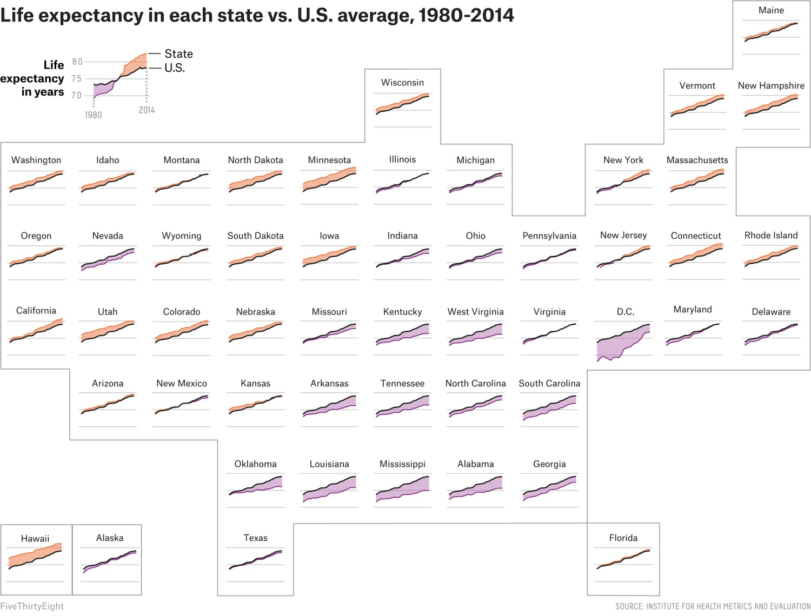

# Communicating Abstract Mental Models: Diagrams, Cognitive Load, and Pedagogical Design
## Executive Summary
This report synthesizes the current state of research on communicating abstract and conceptual models through diagrams and visual language — covering cognitive theory, semiotic foundations, diagram taxonomy, design heuristics, pedagogical bottleneck theory, TikZ/LaTeX tooling, and the "unknown unknowns" that rarely appear in practitioner guides. The central thesis is that effective diagrammatic communication of abstract content requires operating simultaneously at three levels: *cognitive* (working memory management), *semiotic* (grounding abstraction in perceivable structure), and *pedagogical* (sequencing and scaffolding encounters with a new conceptual landscape). Failure at any single level compromises the whole. The report is aimed at the expert practitioner designing learning materials for technically dense content spanning mathematics, computer science, and philosophy.

***
## Part I: Theoretical Foundations
### 1.1 Why Diagrams Are Not Just Reformatted Text
The foundational insight in this field comes from Larkin and Simon (1987), who established that diagrams differ from equivalent prose not merely in presentation but in *computational properties*: they reorganize information such that certain inferences become directly perceivable rather than derivable. A proof sketch in category theory does more than illustrate — it makes commutativity *readable* without derivation. This is the "perceptual inference test": if a reader must work to extract the conclusion from the diagram, it is failing its primary function.[^1][^2]

Cognitive load theory (Sweller, 1988; Sweller, Ayres, & Kalyuga, 2011) provides the mechanistic explanation. Working memory holds roughly 4 ± 1 chunks of novel material at once. Visual diagrams reduce *extraneous cognitive load* — the processing overhead caused by poor design — and can free up capacity for *germane load*, the processing that builds durable mental schemas. Mayer's Cognitive Theory of Multimedia Learning extends this: words and pictures processed together engage the verbal and visual channels simultaneously, yielding two retrieval paths rather than one.[^3][^4][^5][^6][^7]
### 1.2 Dual-Coding Theory and the Verbal–Visual Partnership
Paivio's (1971) Dual-Coding Theory holds that memory is stronger when both a verbal representation and an imagistic representation are created for the same content. Graphic symbols (e.g., mathematical notation, logic symbols) occupy an intermediate position: they are better remembered than words but draw on both an iconic visual referent and a symbolic code. The practical implication is that diagrams with concise, purposefully positioned labels consistently outperform diagrams without labels and labeled-only materials without visuals — but the improvement collapses if the verbal and visual channels are *separately overloaded* (the split-attention effect).[^8][^9][^10][^11]
### 1.3 Semiotics of Diagrams: Peirce's Icon–Index–Symbol Triad
Understanding *what kind of sign* a diagram is matters enormously for design. Peirce's trichotomy distinguishes:[^12][^13]

- **Icons**: share structural properties with their referent (a Feynman diagram *looks like* a particle trajectory; a commutative square *mirrors* the algebraic relations)
- **Indexes**: point to or causally co-vary with their referent (an arrow indicating a direction of flow)
- **Symbols**: meaning by convention only (numerals, variable names, logical connectives)

Most powerful pedagogical diagrams are *mixed*: the topology of an Euler diagram is iconic (containment = set membership), but the labels are symbolic and the arrows indicating inclusion direction are indexical. The practical lesson: a diagram works most efficiently when the *iconic* layer carries the heaviest inferential burden, so the reader perceives structure rather than decoding it.[^14][^15]
### 1.4 Image Schemas: Grounding Abstraction in Embodiment
Johnson's (1987) image schema theory and its development in Lakoff and Johnson's cognitive linguistics program provides the deepest account of *why* spatial diagrams comprehend abstract content at all. Image schemas are pre-linguistic, recurring patterns of sensorimotor experience (CONTAINER, PATH, SOURCE–PATH–GOAL, FORCE, UP–DOWN, PART–WHOLE, CENTER–PERIPHERY) that structure how abstract concepts are understood through conceptual metaphor.[^16][^17][^18][^19]

This is not merely decorative: it explains the effectiveness of:
- **Container diagrams** (Venn/Euler) for set and category relations, because containment maps directly onto the CONTAINER schema
- **Flow diagrams** for causation and process, because the PATH schema underlies our concept of causality and time
- **Tree diagrams** for taxonomies, because the PART-WHOLE and VERTICAL schemas map hierarchy
- **Force diagrams** (arrows, vectors) for dynamics, entailment, and implication
- **Center-periphery layouts** for importance hierarchies

However, image schema grounding has limits: hybrid models of grounding (combining sensorimotor and linguistic/symbolic processing) better explain why some abstract concepts — particularly those in formal mathematics, type theory, and modal logic — resist direct grounding and require explicit *translation diagrams* mapping between notation systems.[^20][^21]

***
## Part II: A Principled Taxonomy of Diagram Types
### 2.1 Structural and Relational Diagrams
The following table maps diagram types to their cognitive and semiotic affordances:[^22][^23]

| Diagram Type | Primary Relation Shown | Image Schema | Best For | Failure Mode |
|---|---|---|---|---|
| Venn diagram | All logically possible intersections | CONTAINER | Set logic pedagogics, max 3 sets | Forces nonexistent regions; implies equal set sizes |
| Euler diagram | Actual intersections only | CONTAINER | Set relations with absent intersections | Wellformedness violations (disconnected zones, concurrent labels) confuse readers[^24][^25] |
| Concept map | Labeled relational graph | LINK / FORCE | Knowledge structure, prerequisite chains | Cross-links overwhelm if density too high[^22] |
| Mind map | Radial hierarchy from single node | CENTER-PERIPHERY | Brainstorming, personal knowledge retrieval | Only single-parent; poor for multi-causal relations[^23] |
| Argument map | Premise → inference tree | FORCE (entailment) | Philosophy, logic, critical thinking | Requires familiarity with argumentative structure[^26] |
| Commutative diagram | Objects + morphisms, path-independent | PATH | Category theory, algebraic topology | Symbolic density; arrow types must be highly consistent |
| Flow diagram | Sequenced states or processes | PATH / SOURCE-PATH-GOAL | Algorithms, causation, processes | Conflates concurrency with sequence |
| Tree diagram | Hierarchical decomposition | PART-WHOLE / VERTICAL | Taxonomies, parse trees, decision trees | Exponential growth with depth |
| Multi-flow map | Multi-causal / multi-effect | FORCE (multiple) | Cause-effect analysis, system feedback | Feedback loops hard to show |
| Force diagram / Causal loop | Circular causation with polarity | FORCE + CYCLE | System dynamics, equilibria | Confuses with directed graphs without conventions |
### 2.2 Venn vs. Euler: A Critical Distinction
Venn diagrams show *all* \( 2^n \) logically possible zones for \( n \) sets; Euler diagrams show only *actually instantiated* zones. This is a consequential design choice:[^14]

- **Use Venn** when you want to emphasize that certain intersections are *empty* — the empty zone is itself informative
- **Use Euler** when set relations have absent intersections and depicting them would imply spurious structure

Empirical eye-tracking studies show that **duplicated curve labels** and **disconnected zones** in Euler diagrams are the highest-cost wellformedness violations: they increase fixation count, slow response time, and reduce accuracy. Concurrently drawn curves and disconnected zones should be avoided unless the semantic content genuinely demands them.[^25][^24]

The "spider diagram" family extends Euler diagrams by adding constants (individual elements shown as dots or "spiders"), yielding expressive equivalence with first-order monadic logic with equality — a powerful tool for formal concept communication in computing education.[^27]


### 2.3 Hyerle's Thinking Maps: A Systematic Visual Language
David Hyerle's system of eight *Thinking Maps* represents perhaps the most rigorous attempt to map diagram types directly to fundamental cognitive operations. Each map corresponds to one cognitive process:[^28][^29]

1. **Circle Map** → defining in context / brainstorming
2. **Bubble Map** → describing attributes (adjectives, qualities)
3. **Double Bubble Map** → comparing and contrasting
4. **Tree Map** → classifying (hierarchical categorization)
5. **Brace Map** → whole-to-part spatial reasoning
6. **Flow Map** → sequencing events or steps
7. **Multi-Flow Map** → cause-and-effect reasoning
8. **Bridge Map** → reasoning by analogy / relational similarity


The power of this system lies in its *metalinguistic consistency*: students learn a single visual language applicable across disciplines. The Bridge Map, which externalizes the relating factor of an analogy, is particularly potent for mathematics and CS where analogical transfer is the primary mechanism for extending understanding to new domains.[^30][^31]
### 2.4 Argument Maps for Philosophy and Logic

Argument map template
Argument maps externalize the inferential structure of an argument as a node-link diagram where nodes are claims and edges encode support (green) or objection (red) relations. They are the diagrammatic counterpart to proof trees in formal logic.[^26]


Research by van Gelder (2002) found that argument mapping training produced the equivalent of a full academic year of critical thinking gains in a single semester course. Software tools include Rationale (commercial), Argdown (open-source, markdown-based), and Kialo (collaborative). For philosophical pedagogy, argument maps serve an analogous role to commutative diagrams in mathematics: they make the inferential architecture *visible*, so readers can check path-independence (i.e., whether the conclusion follows regardless of which path through the premises one takes).[^32]

***
## Part III: Psychological Bottlenecks in Learning
### 3.1 Attentional Bottlenecks
The attentional bottleneck literature identifies a unified cognitive resource that limits concurrent processing across tasks as diverse as perceptual encoding and decision-making. The inferior frontal junction, superior medial frontal cortex, and bilateral insula have been identified as the neural correlates of this bottleneck. For diagram design, the critical implication is: **never compete for both halves of working memory simultaneously**. A diagram that requires reading embedded prose *while* parsing spatial structure violates the split-attention principle and triggers the bottleneck.[^33][^34][^5]

Broadbent's (1958) filter theory frames this as a gate: only one information stream passes through to semantic processing at a time. Treisman's attenuation model relaxes this to a partial filter, but the bottleneck remains — attended material is processed more richly than unattended material. The practical lesson: **diagrams must allow sequential parsing** — a clear visual entry point, a directed reading path, and labeled waypoints.[^35]
### 3.2 Threshold Concepts and Learning Bottlenecks
Meyer and Land's (2003) *threshold concepts* theory identifies a class of disciplinary concepts whose acquisition is:
- **Transformative**: produces an irreversible shift in understanding
- **Integrative**: reveals previously hidden connections between ideas
- **Troublesome**: intrinsically difficult, often counter-intuitive
- **Liminal**: learners occupy an uncertain "betwixt and between" state before comprehension[^36][^37][^38]

Middendorf and Shopkow's *Decoding the Disciplines* methodology operationalizes this: instructors first identify **bottlenecks** (where students reliably get stuck), then interview experts to surface *tacit* mental actions that experts perform automatically but novices cannot access. The key insight: "In categorial terms every threshold concept is a bottleneck while not every bottleneck is a threshold concept — threshold concepts are the paradigm-shifting kinds of bottlenecks".[^39][^40][^41][^42]

This framework should directly inform diagram ideation: **the highest-value diagram is one that makes a threshold concept's structure spatially perceivable**. For example:
- In **category theory**: a commutative diagram makes functoriality *readable* rather than derivable
- In **logic/philosophy**: an argument map externalized the difference between independent and co-dependent premises — a classic threshold concept
- In **computing theory**: a state-transition diagram externalizes the difference between computational states and transitions, which novices consistently conflate
### 3.3 Chunking and Working Memory Architecture
Miller's (1956) "magical number seven" has been revised down to approximately 4 ± 1 for novel (non-chunked) information. Chunking is the process of grouping elements into coherent units stored as a single slot in working memory. Diagrams support chunking by:[^43][^44][^3]
1. Providing a **spatial grouping** that pre-chunks related elements (Gestalt proximity)
2. Assigning **consistent visual encodings** that accelerate chunk recognition across encounters
3. Making **relational structure visible** so relationships do not consume working memory slots on their own

The implication for dense mathematical or CS content: always **chunk before you label**. A diagram of 20 labeled nodes is harder to read than 5 chunked groups of 4 labeled nodes, even if the information content is identical.

***
## Part IV: Design Heuristics and Principles
### 4.1 Gestalt Principles Applied to Diagrams
The six primary Gestalt principles provide the perceptual foundation for diagram layout:[^45][^46][^47]

| Gestalt Principle | Application |
|---|---|
| **Proximity** | Spatially group elements that belong together; separation encodes distinction |
| **Similarity** | Use consistent shape/color encoding; same visual treatment = same semantic role |
| **Continuity** | Arrange related elements along smooth visual paths; the eye follows implied lines |
| **Closure** | Bounded regions (boxes, curves) create semantic units — use them to chunk concepts |
| **Figure/Ground** | High-contrast focal elements vs. low-contrast background; directs initial attention |
| **Common Fate** | Elements that move/animate together are perceived as a unit (for interactive diagrams) |
### 4.2 Tufte's Visual Design Principles

State life expectancy chart
Edward Tufte's principles, originally for quantitative visualization, translate powerfully to conceptual diagrams:[^48][^49]

- **Maximize data-ink ratio**: every graphical mark should encode information. Decorative elements are seductive details — they increase extraneous cognitive load[^50]
- **Show structure, not design variation**: use visual distinctions only to encode semantic distinctions. If two things look different, they must *mean* different things
- **Small multiples**: showing the same diagram type applied across related cases leverages the "compare-across-constant-frame" effect — one of the most powerful comprehension accelerators for pattern recognition

### 4.3 Norman's Affordances and Diagram Conventions
Norman's (1988) *perceived affordances* — the signals that tell a viewer what actions are possible or what structure is meant — apply directly to diagram reading. Arrows afford "follow this direction"; containment affords "membership or subordination"; dashed lines conventionally indicate "hypothetical, non-actual, or future."[^51][^52][^53]

Violating conventions incurs high comprehension cost. In formal mathematical diagrams:[^54]
- A solid arrow (\(\rightarrow\)) = a definite morphism or implication
- A dashed arrow (\(\dashrightarrow\)) = an induced or hypothetical map
- A double arrow (\(\Rightarrow\)) = a natural transformation or strong implication
- A hooked arrow (\(\hookrightarrow\)) = an injection/inclusion

Breaking any of these without explicit legend forces readers to rebuild their parsing schema — a major extraneous load source.
### 4.4 Signaling and Cueing Principles
Mayer's signaling (cueing) principle states that multimedia materials are learned more deeply when cues guide attention to relevant elements. Effective cuing strategies include:[^55][^56]

- **Color highlights**: pre-attentively salient; reduce error and response time on comprehension tasks when applied to task-relevant regions[^57][^58]
- **Arrows and pointers**: indexical signs with strong affordances for direction of reading
- **Bolding, boxing, or enclosing** key definitions or relations
- **Labels placed contiguously** with the elements they label (spatial contiguity principle, effect size d ≈ 1.09 in meta-analyses)[^5]

Crucially, signaling must be **selective**: cuing everything cues nothing. The principle of *meaningful salience* holds that visual distinctiveness should be reserved for genuinely high-priority information.[^55]
### 4.5 The Coherence Principle and Seductive Details
Mayer's coherence principle states that people learn better when *extraneous material is excluded* — even interesting, tangentially related material. Decorative illustrations, ambient visual complexity, and background imagery all constitute *seductive details* that impair retention and transfer. A meta-analysis by Rey (2012) found that seductive details negatively affect retention (small-to-medium effect) and transfer (medium effect).[^50][^5]

For abstract/formal content, this principle is especially critical. The temptation to make diagrams visually ornate in order to increase engagement is pedagogically counterproductive. The goal is *purposeful aesthetics*, where every visual element earns its place by encoding information.

***
## Part V: Communicating Abstract Conceptual Models
### 5.1 The Abstraction Ladder
Hayakawa's *ladder of abstraction* (developed from Korzybski's general semantics) provides a fundamental framework for managing the concrete–abstract axis. Concepts exist at varying levels:[^59][^60][^61]

> *Bessie* (a specific cow) → *the cow* → *livestock* → *farm assets* → *assets* → *wealth*


Effective conceptual communication requires **deliberately traversing the ladder**. A common error in technical pedagogy is communicating exclusively at the top of the ladder (pure abstraction) without grounding. The corrective is *concreteness fading* (Goldstone & Son, 2005): begin with a concrete, physically grounded instance; introduce a more abstract representation alongside it; finally present the fully abstract form alone. Transfer to new domains is significantly better with concreteness fading than with concrete-only or abstract-only instruction.[^62][^63]
### 5.2 Conceptual Metaphor and Image Schema Exploitation
Since Lakoff and Johnson (1980/1999), it is well-established that abstract concepts are typically understood via *conceptual metaphors* — mappings from a source domain (concrete/embodied) to a target domain (abstract). Effective diagram design **exploits these pre-existing mappings** rather than fighting them:[^17][^18][^64]

| Abstract Target Domain | Source Domain Mapping | Diagram Implication |
|---|---|---|
| Time | Space (horizontal axis) | Timeline, Gantt, temporal sequence left-to-right |
| Logical entailment | Force/movement | Arrows showing direction of derivation |
| Subset/membership | Physical containment | Euler/Venn closed curves |
| Hierarchical importance | Vertical position | Top = general/important; bottom = specific/derived |
| Causal strength | Arrow weight/width | Thicker arrow = stronger causal influence |
| Uncertainty | Transparency / dashes | Dotted or faded elements for hypothetical content |
| Distance between concepts | Spatial distance | Proximity encoding semantic similarity |

The IMAGE SCHEMA → DIAGRAM TYPE mapping is the most reliable starting point when ideating diagrams for new abstract content. Ask: *what spatial story does this concept tell?*
### 5.3 Concept Maps vs. Mind Maps vs. Argument Maps
These three "network" diagram types are frequently confused but serve distinct cognitive functions:[^22][^23]

| Feature | Concept Map | Mind Map | Argument Map |
|---|---|---|---|
| **Structure** | Hierarchical graph with cross-links | Radial from central node | Directed acyclic tree (with objections) |
| **Links** | Labeled with propositions ("causes", "requires") | Unlabeled branches | Labeled as support / objection |
| **Parent nodes** | Multiple parents allowed | Single parent only | Claims can have multiple independent supports |
| **Primary use** | Knowledge structure, prerequisite chains | Brainstorming, personal synthesis | Philosophical analysis, critical thinking |
| **Novice risk** | Cross-link density overwhelm | Loss of inter-concept relations | Structural unfamiliarity |
| **Expert value** | Exposes tacit relational knowledge | Rapid idea capture | Makes inferential validity visible |


For mathematics and CS, **concept maps** outperform mind maps precisely because multi-parent nodes and labeled propositions are needed to represent the actual relational structure of mathematical knowledge (e.g., "ring theory *generalizes* group theory *and* module theory"). Mind maps are more appropriate for brainstorming diagram ideation at the start of a pedagogical design process.[^65]
### 5.4 Distributed Cognition and the External Representation Role
Hutchins' (1995) distributed cognition framework treats diagrams not as aids to thinking but as *part of the cognitive system itself*. Under this view, a well-designed diagram offloads cognitive work onto the paper or screen, allowing working memory to handle higher-order processing.[^66][^67][^53]

This has a consequential corollary: **diagram literacy is a prerequisite for diagram benefit**. A reader who cannot fluently parse the notational system of a diagram type will incur higher cognitive load from the diagram than from equivalent prose. This motivates explicit instruction in diagram-reading conventions *before* using diagrams for content instruction — a step that is almost universally skipped in technical writing.[^67]

***
## Part VI: TikZ and LaTeX Diagram Tooling
### 6.1 Why TikZ Is the Right Tool for Formal/Technical Diagrams
TikZ (PGF/TikZ, Hans Tantau) is the standard for high-quality diagram generation in LaTeX documents for several structural reasons:[^68][^69][^70]

- **Vector output**: scales without pixelation; critical for print-quality publications
- **Consistent typographic integration**: mathematical notation inside diagrams uses the same fonts and kerning as the surrounding text — removing the jarring visual discontinuity of imported raster images
- **Automation and reproducibility**: diagram code is version-controlled, modifiable, and composable
- **Extensive libraries**: `arrows.meta`, `matrix`, `positioning`, `graphs`, `automata`, `cd` (TikZ-CD), `decorations`, `calc`, `3d`, `mindmap`

The principal cost is *learning investment*: TikZ has a steep initial learning curve. For commutative diagrams specifically, `tikz-cd` (available at [tikzcd.yichuanshen.de](https://tikzcd.yichuanshen.de/) as an interactive editor) reduces the friction substantially.[^71]
### 6.2 Commutative Diagrams in TikZ
The first isomorphism theorem \( G / \ker\varphi \cong \text{im}\,\varphi \) is canonically illustrated as a commutative triangle:[^54]

```latex
\usepackage{tikz}
\usetikzlibrary{matrix, arrows.meta}
\usepackage{amsmath}
\DeclareMathOperator{\im}{im}

\begin{tikzpicture}
  \matrix (m) [matrix of math nodes, row sep=3em, column sep=4em] {
    G & \im\varphi \\
    G/\ker\varphi & \\
  };
  \path (m-1-1) edge[->>] node[left]  {$\pi$}             (m-2-1)
        (m-1-1) edge[->]  node[above] {$\varphi$}          (m-1-2)
        (m-2-1) edge[{Hooks[right,length=0.8ex]}->, dashed]
                           node[below] {$\tilde\varphi$}   (m-1-2);
\end{tikzpicture}
```

The semantic reading: any path from \( G \) to \( \text{im}\,\varphi \) yields the same result — commutativity is *visible*, not derived.[^72][^73]

**Best practices for commutative diagrams**:[^74][^54]
- Use `matrix of math nodes` for alignment; `node distance` for consistent spacing
- Reserve distinct arrowhead styles for distinct morphism types (epic, monic, iso, induced)
- Scale with `em` units so the diagram scales with font size across document settings
- Use `\tikzexternalize` for large documents to separate diagram compilation from document compilation
### 6.3 TikZ Libraries for Specific Diagram Types
| Library | Use Case |
|---|---|
| `tikz-cd` | Commutative diagrams (category theory, algebra) |
| `tikz/automata` | DFAs, NFAs, Turing machines |
| `tikz/graphs` + `graphdrawing` | Force-directed and tree graph layouts |
| `tikz/mindmap` | Mind maps and radial concept diagrams |
| `pgfplots` | Mathematical plots, function graphs |
| `forest` | Proof trees, linguistic constituency diagrams |
| `bussproofs` | Natural deduction and sequent calculus proofs |
| `circuitikz` | Circuit diagrams |
### 6.4 Workflow: From Sketch to Publication-Quality TikZ
1. **Sketch on paper or whiteboard** — do not start in code; externalizing structure before encoding it prevents premature convergence on a layout
2. **Use an interactive editor** for complex diagrams: [q.uiver.app](https://q.uiver.app) for commutative diagrams; [tikzcd.yichuanshen.de](https://tikzcd.yichuanshen.de) for CD-specific; Excalidraw or Miro for rough topology
3. **Separate diagram files**: maintain TikZ files in a dedicated `tikz/` subdirectory; compile with `standalone` package
4. **Comment structure**: TikZ is notoriously difficult to read without inline comments — annotate node names, layer logic, and non-obvious positioning[^74]
5. **LLM-assisted drafting**: prompting an LLM with "generate TikZ for [diagram description]" using explicit layout constraints (horizontal, vertical, grid, free) can yield a 60–80% complete draft that you refine — a substantial workflow accelerator[^68]

***
## Part VII: Diagram Literacy and Unknown Unknowns
### 7.1 Notational Systems Theory
Green and Pane's *cognitive dimensions of notations* framework provides a systematic vocabulary for analyzing the usability of any notational system — including diagrams — along dimensions such as:[^75][^76]
- **Viscosity**: how much effort does modifying a representation require?
- **Hidden dependencies**: are causally related elements visually proximate?
- **Closeness of mapping**: how directly does the notation reflect the problem structure?
- **Progressive evaluation**: can readers check partial understanding before the whole is complete?
- **Premature commitment**: does the notation force decisions before the author has enough information?

De Toffoli's (2023) philosophical analysis of mathematical diagrams argues that diagrams constitute genuine *notational systems* — not mere illustrations — and can contribute to the justificatory structure of proofs. This has shifted the philosophical consensus: diagrams in topology and algebra (e.g., string diagrams for monoidal categories) are increasingly accepted as proof-legitimate rather than merely heuristic.[^77][^78][^79][^80]
### 7.2 Five Dogmas of Logic Diagrams (and How to Escape Them)
A 2022 paper ("Five dogmas of logic diagrams") identifies persistent false assumptions about diagrammatic representations in logic:[^81]

1. ~~Diagrams are non-linguistic~~ → Diagrams form their own notational languages with grammar
2. ~~Diagrams are visual representations~~ → Tactile and auditory analogs exist
3. ~~Diagrams are iconic, not symbolic~~ → Most productive diagrams are mixed
4. ~~Diagrams cannot appear in proofs~~ → Increasingly falsified in modern mathematical practice
5. ~~Diagrams are always easier than text~~ → Only true when the reader has fluency in the diagram's notational system
### 7.3 Representational Fluency as a Hidden Prerequisite
The *representational fluency* literature (Nathan, 2002; Rau et al., 2013) shows that benefit from diagrams requires prior training in the specific notational system used. Students who cannot fluently parse, say, a state-transition diagram or a commutative square incur *higher* cognitive load from the diagram than from text. This yields the counterintuitive result: **a diagram can impede learning for the very population it was designed to help — novices — if their notational fluency is insufficient**.[^82][^83][^84]

The prescription: always pair a new diagram type with explicit *legend instruction* before using it to convey content. The notational layer and the content layer must be separated in the learner's processing, at least initially.
### 7.4 Progressive Disclosure and Fading
Progressive disclosure — presenting a simplified version of a diagram first, then revealing complexity in layers — aligns with both CLT and constructivist learning theory. The analogy to *faded worked examples* (Sweller; Kalyuga) is direct: a *faded diagram* sequence presents the full structure, then removes components for the learner to reconstruct, reducing from full scaffolding to independent generation.[^85][^86][^87][^88]

For dense formal content, a practical 4-stage progressive disclosure sequence:
1. **Schema diagram**: bare bones structure with labels only — establishes topology
2. **Instance diagram**: a single concrete instantiation populated into the schema
3. **Annotated diagram**: the full diagram with signaling cues marking key structural features
4. **Reader-completed diagram**: a partially complete version the reader fills in — forcing active processing
### 7.5 Analogical Scaffolding: Bridging Diagrams
When a target concept is genuinely alien to a learner, analogical scaffolding (Hammer et al., 2005) builds a *chain* of intermediate representations:[^30]

> Concrete, familiar instance → bridging intermediate → abstract target

Each step shares structure with both neighbors. A bridging diagram explicitly depicts the *mapping* between source and target — not just the target alone. Students taught electromagnetic waves with explicit analogical scaffolding diagrams showed 21% vs. 7% gains compared to non-analogy conditions. The Bridge Map (Hyerle) is the diagrammatic encoding of this principle.[^28][^30]
### 7.6 Metacognitive Transparency in Diagrams
Kirsh and Maglio's (1994) work on *epistemic actions* — actions performed not to advance a physical goal but to improve cognitive efficiency — frames diagram drawing itself as a thinking tool rather than merely a communication tool. A reader who can sketch a diagram of the structure they are trying to understand is offloading working memory onto the page, creating a distributed cognitive system.[^67][^53]

This motivates *metacognitive transparency* in pedagogical diagrams: rather than presenting the finished structure, show the **reasoning process** that led to the structure. Process diagrams (how the diagram was constructed) carry different, and often more valuable, cognitive information than product diagrams (the finished structure).[^89]

***
## Part VIII: Domain-Specific Guidance
### 8.1 Mathematics and Formal Logic
- **Commutative diagrams** (via TikZ-CD) are the canonical tool for category theory, algebraic topology, and homological algebra — they externalize path-independence[^54][^73]
- **Proof structure diagrams** (via `bussproofs` or `forest`) encode natural deduction and sequent derivations
- **Venn/Euler/Spider diagrams** for set theory and logic (with strict wellformedness)
- **Number line and coordinate plane** for real analysis: the continuous linear ORDER schema
- **Knot diagrams** and **surface diagrams** for topology: exploit the SURFACE and BOUNDARY schemas
- The philosophical legitimacy of *diagrammatic proof* in topology and algebra is now well-established[^77][^79]
### 8.2 Computer Science and Formal Methods
- **State-transition diagrams** (automata, Turing machines): via `tikz/automata`
- **Syntax/parse trees**: via `forest` or `qtree`
- **Type theory and proof assistants**: *string diagrams* for monoidal categories (Penrose notation) and *proof trees* for dependent type theory
- **Algorithm trace diagrams**: show *memory state* at each step of execution — externalizes the computational model novices lack
- **Dependency graphs** (Makefile, module, call graph): matrix + arrows layout with topological sort ordering
- For **distributed systems**: sequence diagrams (UML) exploit the TIME-AS-SPACE-AXIS image schema
### 8.3 Philosophy and Argumentation
- **Argument maps** for logical structure analysis — the gold standard tool[^26]
- **Possible-world diagrams** (circles representing worlds, accessibility arrows): Kripke semantics visualization — requires careful attention to CONTAINER + LINK schemas
- **Conceptual space diagrams** (Gärdenfors): geometric representation of concept similarity
- **Causal DAGs** (Pearl) for epistemology of causation: directed acyclic graphs encode intervention independence — the *do-calculus* is a natural complement to causal loop diagrams
- **Dialectical trees** for tracking thesis–antithesis structures in philosophical debate

***
## Part IX: An Integrated Ideation Protocol
Given all of the above, the following protocol operationalizes the synthesis for producing diagrams from dense abstract text:
### Step 1: Structural Parse
Before ideating visuals, parse the text for its *structural type*: Is this primarily taxonomic? Causal? Sequential? Relational? Analogical? Argumentative? Each type has a canonical diagram family (Section II above).
### Step 2: Bottleneck Identification
Apply the Decoding the Disciplines framing: *where will readers reliably get stuck?* Identify 1–3 threshold concepts or bottleneck moments in the text. The highest-value diagram will target exactly these moments.
### Step 3: Image Schema Selection
For each bottleneck concept, ask: *what spatial story does this concept tell at its most basic level?* Match to a primary image schema (CONTAINER, PATH, FORCE, VERTICAL, PART-WHOLE, CENTER-PERIPHERY). This determines the topology of the diagram.
### Step 4: Concreteness Ladder Placement
Decide where on the abstraction ladder to anchor the diagram. For novices to a notation system, begin at a concrete instantiation. For readers with domain familiarity, abstract depictions are appropriate. For transfer goals, use concreteness fading sequences.
### Step 5: Structural Sketch (Notation-Agnostic)
Draw by hand. Prioritize topology — what is connected to what, what contains what, what flows into what — before deciding on rendering. Commit to the layout structure before writing any TikZ code.
### Step 6: Signaling Layer Design
Identify which element in the diagram carries the primary inference burden. Design the signaling layer: color, weight, enclosure, labels, arrows — to route the reader's attention to this element first.
### Step 7: Minimalism Audit
Apply the seductive details filter: remove every visual element that does not encode information. Then apply the signaling principle: verify that high-priority information is visually distinct from low-priority information.
### Step 8: Progressive Disclosure Plan
Design the sequence: schema first, instance second, annotated third, reader-completed fourth. Each stage should be a degenerate version of the next — not a completely different diagram.

***
## Conclusion
The most principled and actionable insight across all of this literature is a convergence: the best diagrams for abstract, formally dense content are those that make *inferential structure directly perceivable*. This requires:

1. Grounding the diagram's topology in an image schema that maps naturally onto the target concept
2. Managing cognitive load by respecting the spatial contiguity, signaling, coherence, and chunking principles
3. Targeting the diagram at genuine threshold concepts and learning bottlenecks rather than at easily-grasped content
4. Sequencing exposure through progressive disclosure with notational fluency instruction preceding content instruction
5. Building the diagram with TikZ for formal mathematical and CS contexts — where typographic consistency, scalability, and semantic precision in arrowhead conventions are non-negotiable

The single most commonly overlooked factor in diagram design for expert-to-novice communication is **notational fluency as a prerequisite**: even the most perfectly designed diagram will increase cognitive load for a reader who lacks fluency in its notation system. The diagram designer must account for this by either choosing familiar notational systems or explicitly teaching the notation before deploying it for content learning.

---

## References

1. [Why a Diagram is (Sometimes) Worth Ten Thousand Words](https://serc.carleton.edu/resources/961.html) - In this article, the authors compare informationally equivalent diagrams with texts. The paper discu...

2. [A Diagram (Sometimes) Worth Ten Thousand Words - designcoding -](https://www.designcoding.net/why-a-diagram-is-sometimes-worth-teh-thousand-words/) - This post is about a famous article named "Why a diagram (sometimes) worth ten thousand words" by He...

3. [George Miller's Magical Number of Immediate Memory in Retrospect](https://pmc.ncbi.nlm.nih.gov/articles/PMC4486516/) - Miller's (1956) article about storage capacity limits, “The magical number seven plus or minus two.....

4. [Cognitive Load Theory (Explorations in The Learning - John Sweller ...](https://www.scribd.com/document/1001833803/Cognitive-Load-Theory-Explorations-in-the-Learning-John-Sweller-Paul-L-Ayres-Slava-Kalyuga-WeLib-org) - The document discusses Cognitive Load Theory (CLT), which is based on human cognitive architecture a...

5. [Basic Multimedia Learning Principles (With Printout)](https://thelearningoak.com/index.php/2019/04/13/basic-multimedia-learning-principles-with-printout/) - To reduce extraneous processing: We do this by minimising the extraneous cognitive load that learner...

6. [[PDF] Cognitive Theory of Multimedia Learning - FER](https://ts.zesoi.fer.hr/doku.php?id=learning_theories%3Acognitive_theory_of_multimedia_learning&do=export_pdf&rev=1315897557)

7. [Richard Mayer's Cognitive Theory of Multimedia Learning](https://www.mheducation.ca/blog/richard-mayers-cognitive-theory-of-multimedia-learning) - Our basic premise with multimedia learning is that we can learn more deeply from words and pictures ...

8. [Symbol superiority: Why $ is better remembered than 'dollar'.](https://linkinghub.elsevier.com/retrieve/pii/S0010027723000690) - Memory typically is better for information presented in picture format than in word format. Dual-cod...

9. [Dual Coding Theory Explained: Boost Memory with Words and ...](https://www.youtube.com/watch?v=BizhbM0flc8) - ... dual-coding-theory-explained-boost-memory-with-words-and-pictures This video breaks down Dual Co...

10. [Dual-coding theory - Wikipedia](https://en.wikipedia.org/wiki/Dual-coding_theory) - Dual-coding theory is a theory of cognition that suggests that the mind processes information along ...

11. [Dual Coding: Why Words and Images Together Strengthen Memory](https://www.structural-learning.com/post/dual-coding-a-teachers-guide) - Paivio's (1971) Dual-Coding Theory says learners use visual and verbal systems. Using both systems h...

12. [symbol-index-icon - The Chicago School of Media Theory](https://csmt.uchicago.edu/glossary2004/symbolindexicon.htm) - Of Peirce's many ways of distinguishing signs, the symbol/index/icon triad focuses on the relations ...

13. [Peirce's Theory of Signs - Stanford Encyclopedia of Philosophy](https://plato.stanford.edu/entries/peirce-semiotics/) - by A Atkin · 2006 · Cited by 1047 — ... Peirce was aware that any single sign may display some combi...

14. [Euler diagram - Wikipedia](https://en.wikipedia.org/wiki/Euler_diagram)

15. [Semiotics for Beginners: Signs](https://www.cs.princeton.edu/~chazelle/courses/BIB/semio2.htm) - A map is indexical in pointing to the locations of things, iconic in its representation of the direc...

16. [Untitled](https://escholarship.org/content/qt1kf9m8gt/qt1kf9m8gt.pdf?t=sh6gqn)

17. [From Perception to Meaning: Image Schemas in Cognitive Linguistics](https://books.google.com/books/about/From_Perception_to_Meaning.html?id=W7rfP-eliy0C) - Lakoff and M. Johnson made image schema one of the cornerstone concepts of the emerging experiential...

18. [(PDF) Image Schemas - Academia.edu](https://www.academia.edu/357340/Image_Schemas) - The locus classicus of image schema theory is Lakoff and Johnson's (1980) conceptual theory of metap...

19. [Image schema - Wikipedia](https://en.wikipedia.org/wiki/Image_schema) - An image schema is a recurring structure within our cognitive processes which establishes patterns o...

20. [Curb Your Embodiment](https://onlinelibrary.wiley.com/doi/10.1111/tops.12311) - ## Abstract

To explain how abstract concepts are grounded in sensory‐motor experiences, several the...

21. [Boundaries to grounding abstract concepts | Philosophical Transactions of the Royal Society B: Biological Sciences](https://royalsocietypublishing.org/doi/10.1098/rstb.2017.0132) - Grounded theories of cognition claim that concept representation relies on the systems for perceptio...

22. [Concept maps vs. mind maps](https://mindmappingsoftwareblog.com/concept-maps-vs-mind-maps/) - Topics in mind maps may only have one parent; in a concept map, a topic may have multiple connector ...

23. [[PDF] Concept Mapping vs. Mind Mapping](https://students.wlu.ca/academics/support-and-advising/accessible-learning/assets/resources/conceptmapping-mindmapping.pdf) - A comparison between concept maps, mind maps, conceptual diagrams, and visual metaphors as complemen...

24. [Wellformedness properties in Euler diagrams: which should be used?](https://pubmed.ncbi.nlm.nih.gov/22577151/) - Euler diagrams are often used to visualize intersecting data sets in applications such as criminolog...

25. [Wellformedness Properties in Euler Diagrams: An Eye Tracking Study for Visualisation Evaluation](https://www.emergentmind.com/papers/1611.06587) - In the field of information visualisation, Euler diagrams are an important tool used in various appl...

26. [[A10] Argument mapping - Philosophy@HKU](https://philosophy.hku.hk/think/arg/complex.php) - Drawing a diagram can be very helpful. §1. Argument maps. An argument map is a diagram that captures...

27. [Spider Diagrams](https://www.cambridge.org/core/services/aop-cambridge-core/content/view/S1461157000000942) - ...and communication. With rare exceptions such as Peirce’s α and β systems, purely diagrammatic for...

28. [Thinking Maps - Dr. Yvette Jackson • The Pedagogy of Confidence®](https://pedagogyofconfidence.net/thinking-maps/) - Thinking Maps® (Visual Tools). Thinking Maps®, created by David Hyerle, are consistent visual patter...

29. [[PDF] A Common Visual Language for Learning - Educational Impact](https://educationalimpact.com/resources/VisualTools/pdf/6_visual_language.pdf) - BACKGROUND: Thinking Maps is a language, or tool-kit, or eight thinking process maps, developed by D...

30. [Analogical scaffolding and the learning of abstract ideas in physics](https://link.aps.org/doi/10.1103/PhysRevSTPER.3.010109) - A bridging analogy provides one or more intermediate steps between the base and target intended to h...

31. [[PDF] Analogy, higher order thinking, and education](https://www.uciscienceoflearning.org/uploads/1/1/7/8/117864006/richland_simms_2015__2_.pdf) - Analogical reasoning, the ability to understand phenomena as systems of struc- tured relationships t...

32. [Better thinking, clearer writing - Rationale](https://rationaleonline.com) - Rationale lets you create, online, argument maps. Argument maps are a great way to increase your cri...

33. [A Unified attentional bottleneck in the human brain](https://pmc.ncbi.nlm.nih.gov/articles/PMC3158154/) - ...task performance. These same brain regions were not only engaged by a perceptual encoding task in...

34. [Bottlenecks of Motion Processing during a Visual Glance: The Leaky Flask Model](https://pmc.ncbi.nlm.nih.gov/articles/PMC3877086/) - Where do the bottlenecks for information and attention lie when our visual system processes incoming...

35. [Cognitive Bottleneck in Attention Theory | PDF | Attention | Psychology](https://www.scribd.com/document/793655777/COGNITIVE-PSYCHOLOGY-SPEAKER-NOTES-1) - COGNITIVE PSYCHOLOGY SPEAKER NOTES. (Theories of selective attention). Selective attention refers to...

36. [Threshold Concepts: Helping Students Break through Learning ...](https://www.lesleyelis.com/elisblog/2017/01/12/threshold-concepts-helping-students-break-through-learning-barriers/) - Erik Meyer and Ray Land, economics professors, found that certain concepts were held by economists t...

37. [Threshold Concepts: Portals to New Ways of Thinking - Faculty Focus](https://www.facultyfocus.com/articles/teaching-and-learning/threshold-concepts-portals-new-ways-thinking/) - Threshold concepts, Meyer and Land claim, are troublesome in the sense that they are difficult for s...

38. [What Are Threshold Concepts? | Mysite](https://www.writingthresholds.ca) - A threshold concept prompts learners to think differently about a subject. They cross a “threshold” ...

39. [Threshold concept - Decoding the Disciplines](http://www.decodingthedisciplines.de/wiki/Threshold_concept) - A threshold concept is a core concepts which, once understood, transforms perception of a given subj...

40. [Overcoming Student Learning Bottlenecks: Decode the Critical Thinking of Your Discipline](https://www.routledge.com/Overcoming-Student-Learning-Bottlenecks-Decode-the-Critical-Thinking-of-Your-Discipline/Middendorf-Shopkow/p/book/9781620366653) - Decoding the Disciplines is a widely-used and proven methodology that prompts teachers to identify t...

41. [Decoding the Disciplines: Course Design: Teaching Resources](https://citl.indiana.edu/teaching-resources/course-design/decoding-disciplines/index.html) - Decoding the Disciplines

42. [Teaching the Difficult:](https://academy.osu.edu/wordpress/wp-content/uploads/2013/01/Decoding-the-Disciplines-Ohio-St-2013-pdf1.pdf)

43. [Chunking (psychology) - Wikipedia](https://en.wikipedia.org/wiki/Chunking_(psychology)) - Chunking is a process by which small individual pieces of a set of information are bound together to...

44. [Chunking - The Decision Lab](https://thedecisionlab.com/reference-guide/psychology/chunking) - Chunking refers to our ability to improve short-term memory by grouping – into “chunks” – informatio...

45. [Gestalt's Principles – Critical Data Literacy](https://pressbooks.library.torontomu.ca/criticaldataliteracy/chapter/gestalts-principles/) - Similarity refers to unity and wholeness (e.g. shapes, text, colours). Elements that look alike are ...

46. [Exploring the Gestalt Principles of Design | Toptal®](https://www.toptal.com/designers/ui/gestalt-principles-of-design) - These principles improve aesthetics, functionality, and user-friendliness.

47. [What are the Gestalt Principles? — updated 2026 - IxDF](https://ixdf.org/literature/topics/gestalt-principles) - Gestalt Principles are laws of human perception that describe how humans group similar elements, rec...

48. [Tufte's Principles - thedoublethink](https://thedoublethink.com/tuftes-principles-for-visualizing-quantitative-information/) - There is a very annoying graph that keeps popping up in Keynote presentations.

49. [[PDF] Tufte's Design Principles](https://faculty.cc.gatech.edu/~stasko/7450/16/Notes/tufte.pdf) - High-density graphics help us to compare parts of the data by displaying much information within the...

50. [Watch Out For Those Seductive Details - The eLearning Coach](https://theelearningcoach.com/learning/seductive-details/) - The principle states that people learn more deeply from multimedia when these interesting but irrele...

51. [[PDF] Norman Affordances](https://www.lri.fr/~mbl/ENS/DEA-IHM/papers/Norman-Affordances.pdf) - In product design, where one deals with real, physical objects, there can be both real and perceived...

52. [Models and Theories in Human-Computer Interaction/Norman's Affordances and Use in Design - Wikibooks, open books for an open world](https://en.wikibooks.org/wiki/Models_and_Theories_in_Human-Computer_Interaction/Norman's_Affordances_and_Use_in_Design)

53. [Metacognition, Distributed Cognition, and Visual Design | 6 | Cognitio](https://www.taylorfrancis.com/chapters/edit/10.4324/9781410612892-6/metacognition-distributed-cognition-visual-design-david-kirsh) - Metacognition, in its most basic form, is the activity of thinking about thinking. Because thinking ...

54. [Simple commutative diagram](https://latex-cookbook.net/commutative-diagram/)

55. [The Signaling Principle - LinkedIn](https://www.linkedin.com/pulse/signaling-principle-elizabeth-zandstra-irrge) - Effective signaling, whether through text formatting, visual cues, or captions, ensures that learner...

56. [17 - The Signaling (or Cueing) Principle in Multimedia Learning](https://www.cambridge.org/core/books/cambridge-handbook-of-multimedia-learning/signaling-or-cueing-principle-in-multimedia-learning/3972D4ACC628D5B53F7B2B4785DB2B06) - The signaling principle, also known as cueing principle, refers to the finding that people learn mor...

57. [Testing the value of salience in statistical graphs](https://library.imaging.org/admin/apis/public/api/ist/website/downloadArticle/ei/33/1/art00004)

58. [Testing the Value of Salience in Statistical Graphs](https://www.osti.gov/servlets/purl/1841824)

59. [Ladder of Abstraction (Hayakawa) - Toolshero](https://www.toolshero.com/communication-methods/ladder-of-abstraction/) - The Ladder of Abstraction is about the basic principle is that humans have the ability to reason at ...

60. [Ladder of Abstraction - Atlas of Public Management](https://www.atlas101.ca/pm/concepts/ladder-of-abstraction/) - The ladder of abstraction is a concept created by American linguist SI Hayakawa in his 1939 book Lan...

61. [The ladder of abstractions - General Semantics - Rijnlandmodel](https://www.rijnlandmodel.nl/english/general_semantics/abstraction_ladder.htm) - The abstraction ladder is an attempt to a systematic approach to the relations between the kinds of ...

62. [“Concreteness fading” promotes transfer of mathematical knowledge](https://www.academia.edu/14450859/_Concreteness_fading_promotes_transfer_of_mathematical_knowledge) - We use “concrete” here to refer to extraneous perceptual details that can distract learners from the...

63. [Benefits of “concreteness fading” for children's mathematics ...](https://www.sciencedirect.com/science/article/abs/pii/S0959475214000942) - Learning from concrete materials that “faded” to abstract symbols benefitted transfer. · The progres...

64. [Conceptual Metaphor Theory as a Foundation for ...](https://par.nsf.gov/servlets/purl/10087033)

65. [Concept Maps to Assess System Understanding: Are Graphical ...](https://pmc.ncbi.nlm.nih.gov/articles/PMC11428796/) - Our results indicate that concept mapping is better suited to assess functional system understanding...

66. [Systemic Design Through the Lens of Distributed Cognition](https://rsdsymposium.org/systemic-design-through-the-lens-of-distributed-cognition/) - In this presentation we will establish the relation between systemic design and distributed cognitio...

67. [Abstract: Metacognition, Distributed Cognition and Visual Design](https://interactivity.ucsd.edu/articles/Metacognition/abstract_Metacognition.html) - The way visual cues are structured and the way interaction is designed can make an important differe...

68. [Master TikZ Figures with ChatGPT for High-Impact Academic Writing ...](https://lennartnacke.com/master-tikz-figures-with-chatgpt-for-high-impact-academic-writing-in-latex/) - The TikZ package is a versatile tool for creating high-quality, customizable graphics, ideal for sci...

69. [Amir Shirian's Post - LaTex Graphics with TikZ - LinkedIn](https://www.linkedin.com/posts/amir-shirian-6675587b_i-recently-started-reading-an-intriguing-activity-7086773179355942912-1lOV) - I recently started reading an intriguing new book - "LaTex Graphics with TikZ: A Practitioner's Guid...

70. [Creating Beautiful Diagrams with TikZ in LaTeX · The COOP Blog](https://cerfacs.fr/coop/start_with_tikz) - TikZ is a flexible and powerful tool for creating detailed diagrams directly in LaTeX documents. Whe...

71. [How to make Commutative Diagrams (Tikz-CD) in Obsidian.md](https://www.youtube.com/watch?v=EPqwZsUfEIQ) - This video is a tutorial on how to put Tikz-CD quality Commutative Diagrams in your Obsidian markdow...

72. [How to draw commutative diagrams in LaTeX with TikZ](https://pdp7.org/blog/2011/02/how-to-draw-commutative-diagrams-in-latex-with-tikz/) - Sooner or later everyone who uses LaTeX to typeset documents containing maths will encounter the pro...

73. [Turing Machine](https://texample.net/commutative-diagram-tikz/)

74. [Best Practices for Tikz Graphics Inclusion : r/LaTeX - Reddit](https://www.reddit.com/r/LaTeX/comments/ktbvyt/best_practices_for_tikz_graphics_inclusion/) - In my experience, compiling the diagrams separately and including the images will speed up compile t...

75. [[PDF] Patterns for HCI and Cognitive Dimensions: two halves of the same ...](https://www.cs.kent.ac.uk/people/staff/saf/patterns/ppig.pdf) - The richness of that domain, and the quantity and complexity of “notational systems”, would allow a ...

76. [[PDF] Patterns for HCI and Cognitive Dimensions: two halves of the same ...](https://ppig.org/files/2002-PPIG-14th-fincher.pdf) - The richness of that domain, and the quantity and complexity of “notational systems”, would allow a ...

77. [De Toffoli | Who's Afraid of Mathematical Diagrams?](https://journals.publishing.umich.edu/phimp/article/id/1348/print/) - Mathematical diagrams are frequently used in contemporary mathematics. They are, however, widely see...

78. [Logic and Logical Philosophy](https://apcz.umk.pl/LLP/article/download/LLP.2018.001/14025)

79. [Visual Thinking in Mathematics](https://www.oxfordbibliographies.com/display/document/obo-9780195396577/obo-9780195396577-0229.xml) - "Visual Thinking in Mathematics" published on by null.

80. [4. Visual Thinking And...](https://plato.stanford.edu/entries/epistemology-visual-thinking/)

81. [Five dogmas of logic diagrams and how to escape them](https://www.sciencedirect.com/science/article/abs/pii/S0271530922000775) - The dogmas we consider are: (1) diagrams are non-linguistic; (2) diagrams are visual representations...

82. [[PDF] Developing Students' Representational Fluency Using Virtual and ...](https://mason.gmu.edu/~jsuh4/JComputingmathscience%20teachingrepresentational.pdf)

83. [Does Representational Understanding Enhance Fluency](https://www.cmu.edu/dietrich/philosophy/docs/scheines/RauScheinesAlevenRummel_EDM2013.pdf)

84. [REPRESENTATIONAL FLUENCY IN MIDDLE SCHOOL](https://website.education.wisc.edu/~mnathan/Publications_files/2002_Nathan_PME2002_RepFluency.pdf)

85. [Faded Worked Examples - CAFÉ Toolkit](https://cafe.cognitiveload.com.au/kb/fadedworkedexamples) - Faded worked examples are a series of worked examples in which the number of steps presented is grad...

86. [Supporting pupils with worked examples](https://educationendowmentfoundation.org.uk/news/supporting-pupils-with-worked-examples) - The EEF is an independent charity dedicated to breaking the link between family income and education...

87. [Using faded worked examples in Chemistry to reduce extraneous ...](https://my.chartered.college/impact_article/using-faded-worked-examples-in-chemistry-to-reduce-extraneous-cognitive-load/) - Exploring worked examples seemed a practical way in which to optimise intrinsic load and reduce extr...

88. [Fading Worked Examples and Cognitive Load | PDF](https://fr.scribd.com/document/936279440/How-Fading-Worked-Solution-Steps-Works-A-Cogniti) - The article explores the cognitive load theory (CLT) in the context of fading worked solution steps,...

89. [What is 'transparent pedagogy'? - Learning Technology Blog](http://blogs.northampton.ac.uk/learntech/2019/02/27/what-is-transparent-pedagogy/) - Transparent pedagogy is partly about making your intentions (your learning design) clear to the stud...

